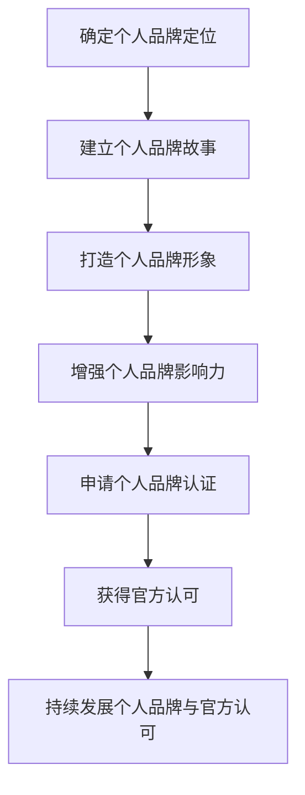

                 

### 《建立个人品牌认证：为学员提供官方认可》的引言与背景

在当今数字化和信息化的时代，个人品牌的重要性日益凸显。个人品牌不仅代表了一个人的专业形象，更是其在职场中脱颖而出的关键因素。而个人品牌认证，作为一种权威的认可形式，更是为学员提供了专业能力和成就的官方证明。因此，建立个人品牌认证，为学员提供官方认可，成为了当前许多行业领域的重要任务。

#### 1.1 书籍简介

本著作《建立个人品牌认证：为学员提供官方认可》旨在为广大IT从业者、行业专家以及教育工作者提供一套系统化的指导方案，帮助他们深入了解个人品牌认证的重要性，掌握建设个人品牌和获取官方认可的方法与技巧。

**《建立个人品牌认证：为学员提供官方认可》**的核心目标包括：

- 解析个人品牌认证的基本概念和类型，帮助读者建立全面的认识。
- 分步骤介绍个人品牌建设的过程，提供实用的策略和方法。
- 阐述官方认可的价值及其获取方法，为学员提供实用的申请指南。
- 通过实践案例，展示个人品牌认证的成功经验和教训，为读者提供参考。
- 提出持续发展个人品牌和官方认可的策略，帮助读者实现长远发展。

#### 1.1.1 个人品牌的重要性

个人品牌，即个人在公众心目中的形象和印象，是个人价值在职场、社交等多个领域的体现。一个强大的个人品牌能够带来如下好处：

- **提升职业竞争力**：个人品牌的建设可以帮助个人在职场中脱颖而出，赢得更多的机会和认可。
- **增强谈判能力**：拥有良好的个人品牌，个人在谈判时具有更强的说服力和影响力。
- **扩大社交网络**：个人品牌的建设有助于拓展社交圈，结识更多业界精英，实现资源共享。
- **实现商业价值**：对于创业者和企业家来说，个人品牌更是其商业成功的基石。

#### 1.1.2 官方认证的价值

官方认证作为一种权威的认可形式，具有如下价值：

- **验证专业能力**：官方认证能够客观评估个人的专业能力，为学员提供权威的证明。
- **增强公信力**：官方认证机构的背书，使得个人品牌更具公信力和权威性。
- **提高就业竞争力**：持有官方认证的个人在求职过程中更具竞争力，更容易获得理想的工作机会。
- **促进职业发展**：官方认证能够为个人的职业晋升提供有力的支持，帮助其实现更高的职业目标。

#### 1.1.3 书籍目标读者

本著作的目标读者包括以下几类：

- **IT从业者**：希望提升个人品牌和职业竞争力的程序员、软件工程师等。
- **行业专家**：致力于在专业领域内建立权威形象的技术专家、顾问等。
- **教育工作者**：关注个人品牌建设和官方认可的教育工作者，如培训机构教师、高校教师等。
- **创业者**：希望通过个人品牌认证提升企业知名度和社会影响力的小企业主、创业者等。

通过阅读本书，目标读者将能够：

- 系统了解个人品牌认证的基本概念和流程。
- 学会建设个人品牌的方法和策略，提高个人竞争力。
- 掌握获取官方认可的方法和技巧，为个人和职业发展提供支持。
- 获取成功案例和失败教训，为个人品牌建设提供参考。

### 1.2 个人品牌认证概述

个人品牌认证，作为一种权威的认可形式，旨在评估和验证个人在特定领域内的专业能力和成就。它不仅为个人提供了专业的背书，也为行业和雇主提供了可靠的参考依据。在本文中，我们将详细探讨个人品牌认证的定义、类型和发展趋势。

#### 1.2.1 个人品牌认证的定义

个人品牌认证，通常由权威的认证机构或行业组织颁发，是对个人在特定领域内专业能力、知识和经验的认可。这种认证通常涉及一系列的评估标准，包括理论知识、实践经验、项目案例等多个方面。认证的目的是为了确保个人具备一定的专业能力和素质，从而提高其在职场中的竞争力和公信力。

个人品牌认证具有以下几个核心特点：

- **权威性**：认证由权威机构颁发，具有很高的公信力和认可度。
- **专业性**：认证评估标准严谨，涉及多个专业领域。
- **权威性**：认证结果具有法律效力，可以作为个人能力和成就的证明。
- **灵活性**：不同认证机构可能有不同的认证类型和标准，个人可以根据自身需求选择合适的认证。

#### 1.2.2 个人品牌认证的类型

个人品牌认证可以根据不同的标准进行分类，常见的类型包括：

1. **国际认证**：这类认证通常由国际知名机构颁发，具有广泛的国际认可度。如CFA（注册金融分析师）、PMP（项目管理专业人士）等。

2. **国家级认证**：这类认证由国家级认证机构颁发，如中国的软考（计算机技术与软件专业技术资格（水平）考试）等。

3. **行业认证**：这类认证由行业组织颁发，针对特定行业内的专业知识和技能。如软件工程领域的PMP认证、网络安全领域的CEH（认证 ethical hacker）等。

4. **企业认证**：这类认证由特定企业颁发，通常用于评估和认证内部员工的技能和知识水平。

5. **在线认证**：随着在线教育的发展，许多认证机构开始提供在线认证服务，如谷歌的Google Cloud认证、微软的Azure认证等。

不同类型的个人品牌认证具有不同的特点和应用场景，个人可以根据自身需求和职业发展目标选择合适的认证。

#### 1.2.3 个人品牌认证的发展趋势

随着全球化和信息化的发展，个人品牌认证呈现出以下发展趋势：

1. **认证标准国际化**：越来越多的认证机构采用国际标准和评估体系，以适应全球化的职业发展需求。

2. **在线认证普及**：在线教育的发展使得在线认证越来越普及，个人可以通过网络轻松获取认证。

3. **认证内容多样化**：随着行业和技术的不断演进，个人品牌认证的内容也日益多样化，涵盖了更多新兴领域和技能。

4. **认证体系的完善**：认证机构不断完善认证体系，提高认证的严谨性和科学性，确保认证结果的公信力和权威性。

5. **认证应用的广泛性**：个人品牌认证不仅用于职场和求职，还广泛应用于学术研究、企业招聘、职业发展等多个领域。

总之，个人品牌认证作为一种权威的认可形式，正日益受到广泛关注和认可。了解个人品牌认证的定义、类型和发展趋势，有助于个人更好地规划职业发展，提升自身的专业竞争力和公信力。

### 第二部分：个人品牌建设

个人品牌建设是提升个人在职场和社会中的影响力、竞争力和认可度的重要手段。一个成功的个人品牌不仅能够带来职业上的机会，还能提升个人的社交价值和商业价值。在这一部分，我们将详细探讨个人品牌建设的基础，包括确定个人品牌定位、建立个人品牌故事和打造个人品牌形象。

#### 2.1.1 确定个人品牌定位

确定个人品牌定位是个人品牌建设的第一步，也是至关重要的一步。准确的定位能够帮助个人明确自己的核心竞争力和独特价值，从而在竞争激烈的职场中脱颖而出。

**如何确定个人品牌定位？**

1. **分析自身优势和特长**：首先，个人需要深入分析自己的优势和特长，包括专业技能、工作经验、个人性格特点等。这些优势将成为个人品牌的核心竞争力。

2. **了解市场需求**：其次，个人需要了解市场需求，分析所在行业或领域的热点和趋势。这有助于个人找到自己能够提供独特价值的领域。

3. **设定明确的品牌目标**：在分析自身优势和市场需求的基础上，个人需要设定明确的品牌目标。品牌目标应该具体、可行，并能够反映个人的核心价值和定位。

4. **差异化竞争**：为了在竞争激烈的职场中脱颖而出，个人需要找到差异化的竞争点。这可能是一个独特的技能、一种创新的理念，或者是一个独特的个人故事。

**案例分析：**

以一位软件工程师为例，他拥有丰富的编程经验和项目管理技能。在分析自身优势和市场需求后，他决定将自己的品牌定位为“高效的项目管理者”。这一定位不仅突出了他的项目管理能力，还与市场需求高度契合，使他能够在职场中脱颖而出。

#### 2.1.2 建立个人品牌故事

个人品牌故事是个人品牌的灵魂，它能够传递个人的价值观、经历和成就，从而引起他人的共鸣。一个精彩的品牌故事不仅能够提升个人的吸引力，还能增强品牌的影响力。

**如何建立个人品牌故事？**

1. **提炼核心故事线**：首先，个人需要提炼一个核心的故事线。这个故事线应该反映个人的价值观、经历和成就，并且具有吸引力和感染力。

2. **讲述真实经历**：个人品牌故事应该基于真实经历，这些经历可以是一个挑战、一个成功、一个失败，或者一个转折点。这些经历能够展示个人的成长和变化，从而增强故事的吸引力。

3. **传递价值观**：在个人品牌故事中，个人应该传递自己的价值观。这些价值观可以是专业的、道德的、生活的，或者是对某一领域的热爱。传递价值观能够增强品牌的吸引力和认同感。

4. **使用多种媒介**：为了更好地传递个人品牌故事，个人可以使用多种媒介，如文字、图片、视频等。这些媒介可以相互补充，使故事更加生动和有吸引力。

**案例分析：**

以一位资深技术专家为例，他的个人品牌故事基于他的职业生涯经历。他在故事中讲述了自己如何从一名普通程序员成长为技术专家，经历了一系列的挑战和成功。同时，他强调了对自己技术的热爱和对行业的忠诚。这个故事不仅展示了他的专业能力，还传递了他的价值观，使他成为行业内的楷模。

#### 2.1.3 打造个人品牌形象

个人品牌形象是个人在公众心目中的印象和形象，它能够影响他人对个人的认知和评价。一个成功的个人品牌形象不仅能够提升个人的吸引力，还能增强品牌的公信力和影响力。

**如何打造个人品牌形象？**

1. **设计个人标识**：首先，个人需要设计一个独特的个人标识，如个人名片、个人网站等。这个标识应该与个人的品牌定位和故事相契合，从而传递出个人的核心价值和特点。

2. **保持专业形象**：在日常生活中，个人应该保持专业形象，包括着装、言谈举止等。一个专业的形象能够增强个人的吸引力，提升品牌形象。

3. **参与社区活动**：参与行业内的社区活动，如技术研讨会、行业会议等，能够提升个人在行业内的知名度和影响力。这些活动不仅能够展示个人的专业能力，还能扩大社交网络。

4. **发布高质量内容**：通过发布高质量的技术文章、博客、演讲等，个人能够展示自己的专业知识和经验，从而提升个人品牌的公信力和影响力。

**案例分析：**

以一位知名技术博主为例，他通过设计独特的个人标识、保持专业形象和参与社区活动，成功地打造了自己的个人品牌形象。他通过发布高质量的技术文章，吸引了大量的关注者，使自己的品牌在行业内具有很高的知名度和影响力。

通过以上三个步骤，个人可以有效地建设自己的品牌，提升在职场和社会中的影响力。个人品牌建设不仅需要明确品牌定位、建立品牌故事，还需要打造一个成功的品牌形象。只有这三者相结合，个人品牌才能真正建立起来，为个人的职业发展提供有力支持。

### 2.2 增强个人品牌影响力

个人品牌的影响力是衡量个人在职场和社会中的价值和影响力的重要指标。一个强大的个人品牌不仅能够提升个人的职业竞争力，还能带来更多的机会和资源。在这一部分，我们将探讨如何通过社交媒体、行业活动和合作与联盟来增强个人品牌的影响力。

#### 2.2.1 利用社交媒体扩大影响力

社交媒体是增强个人品牌影响力的重要工具。通过社交媒体平台，个人可以快速传播信息，建立广泛的联系网络，从而提升品牌知名度。

**如何利用社交媒体扩大影响力？**

1. **选择合适的平台**：根据个人品牌定位和目标受众，选择合适的社交媒体平台。如技术专家可以选择Twitter、GitHub等平台，企业家可以选择LinkedIn等平台。

2. **发布高质量内容**：发布有价值、高质量的内容是吸引关注者的重要手段。内容可以包括技术文章、博客、视频、教程等，这些内容应该能够解决读者的痛点或提供独特的见解。

3. **积极参与讨论**：积极参与社交媒体上的讨论，与同行和读者互动，能够增强个人品牌的影响力。分享他人的观点、评论和反馈，展示个人的专业性和热情。

4. **保持频率和一致性**：定期发布内容，保持频率和一致性，有助于建立稳定的粉丝群体。建立一个内容发布计划，确保内容的持续性和连贯性。

**案例分析：**

一位知名技术博主通过在Twitter上发布高质量的技术文章和教程，吸引了大量关注者。他不仅分享自己的技术心得，还积极参与行业讨论，与其他技术专家互动，从而提升了个人品牌的影响力。

#### 2.2.2 参与行业活动提升知名度

参与行业活动是提升个人品牌知名度的重要途径。通过参加技术会议、研讨会、培训课程等，个人可以展示自己的专业能力和成就，从而扩大品牌影响力。

**如何参与行业活动提升知名度？**

1. **选择合适的活动**：根据个人品牌定位和目标受众，选择合适的行业活动。如技术专家可以选择技术会议和研讨会，企业家可以选择创业比赛和论坛。

2. **准备精彩演讲**：如果有机会在行业活动中发表演讲，准备精彩的演讲稿和演示材料，展示个人的专业知识和经验。

3. **积极参与讨论和互动**：在活动中积极参与讨论和互动，与同行和听众交流，展示个人的专业性和热情。

4. **建立联系网络**：活动结束后，主动与其他参与者建立联系，交换名片、社交媒体账号等，扩大社交网络。

**案例分析：**

一位知名技术专家通过参加多个技术会议和研讨会，发表了多篇精彩演讲，吸引了大量关注者。他不仅在活动中展示了专业能力，还积极与同行和听众互动，建立了广泛的联系网络，从而提升了个人品牌的影响力。

#### 2.2.3 合作与联盟拓展资源

合作与联盟是增强个人品牌影响力的重要手段。通过与其他个人、团队或组织合作，个人可以共享资源、扩大影响力，从而实现共赢。

**如何合作与联盟拓展资源？**

1. **寻找合适的合作伙伴**：根据个人品牌定位和目标，寻找合适的合作伙伴。如技术专家可以与技术社区、技术公司合作，企业家可以与投资者、合作伙伴合作。

2. **共同策划活动**：与合作方共同策划和参与行业活动，如技术研讨会、培训课程等，共同推广个人品牌。

3. **共享资源和信息**：与合作方共享资源和信息，如技术文档、市场分析报告等，实现资源共享和互补。

4. **合作开发项目**：与合作方共同开发项目，提升个人品牌的专业性和权威性。

**案例分析：**

一位技术博主通过与技术社区合作，共同策划和举办技术研讨会，吸引了大量技术专家和开发者参与。通过这些活动，他不仅提升了个人品牌的影响力，还获得了更多的资源和机会。

通过社交媒体、行业活动和合作与联盟，个人可以有效地增强品牌影响力，提升在职场和社会中的价值和认可度。一个强大的个人品牌不仅能够带来职业上的成功，还能为个人的长期发展提供有力支持。

### 2.3 个人品牌认证申请流程

个人品牌认证的申请流程是获取官方认可的重要环节。这一过程需要申请人详细了解认证机构的评审标准和申请要求，并准备相应的申请材料。下面，我们将详细阐述个人品牌认证申请的各个步骤，包括了解认证机构与标准、准备申请材料、提交申请和等待审核。

#### 2.3.1 了解认证机构与标准

在申请个人品牌认证之前，首先需要了解认证机构的背景和评审标准。不同的认证机构可能有不同的认证类型、标准和要求，因此申请人需要选择适合自己领域和目标的认证机构。

**如何了解认证机构与标准？**

1. **查询认证机构官网**：申请人可以通过认证机构的官方网站获取相关信息，包括认证的类型、标准、费用、申请流程等。

2. **阅读认证指南**：许多认证机构会提供详细的认证指南，介绍认证的具体要求和流程。申请人应该仔细阅读这些指南，以便全面了解认证的细节。

3. **咨询过往申请人**：通过与已经获得认证的申请人交流，申请人可以了解认证的实际操作经验和建议，从而更好地准备自己的申请。

**案例分析：**

以某国际知名认证机构为例，该机构提供多种认证项目，如CFA（注册金融分析师）、PMP（项目管理专业人士）等。申请人可以通过访问该机构的官方网站，查看各个认证项目的详细介绍和申请要求。同时，该机构还会定期举办认证说明会和研讨会，申请人可以通过这些活动深入了解认证的相关信息。

#### 2.3.2 准备申请材料

准备申请材料是个人品牌认证申请的关键步骤。申请材料需要充分展示申请人的专业能力、经验和成就，以便通过认证机构的评审。

**需要准备哪些申请材料？**

1. **个人简历**：个人简历是申请材料的核心，需要详细列出申请人的教育背景、工作经验、项目经历、专业成就等。

2. **推荐信**：推荐信是评估申请人专业能力的重要依据，通常需要由申请人的上级、同行或客户提供。推荐信应突出申请人在专业领域的优势和能力。

3. **成绩证明**：包括学位证书、资格证书、专业认证等，这些证明文件能够验证申请人的学术和职业背景。

4. **项目案例**：提供申请人在项目中的实际工作成果，如项目报告、代码示例、客户评价等，以展示申请人的专业能力和实际操作经验。

5. **个人陈述**：个人陈述是申请人对自己专业能力、职业目标和发展规划的总结，需要具体、真实、有说服力。

6. **其他支持材料**：根据不同的认证项目，可能还需要提供其他支持材料，如论文、专利、荣誉证书等。

**案例分析：**

某IT专业人士申请PMP认证时，准备了详细的教育背景和工作经历简历，还提供了三封高质量的推荐信，以及他在多个项目中担任项目经理的实际工作成果。此外，他还提交了他在项目管理方面的个人陈述，详细阐述了自己的项目管理理念和实践经验。这些材料充分展示了他的专业能力和实际操作经验，为他顺利通过认证奠定了基础。

#### 2.3.3 提交申请并等待审核

提交申请是个人品牌认证申请流程的最后一步。申请人需要按照认证机构的要求，提交完整的申请材料，并支付相关的认证费用。

**如何提交申请并等待审核？**

1. **在线提交申请**：大多数认证机构都提供在线申请平台，申请人可以通过该平台提交申请材料，并跟踪申请状态。

2. **按时支付费用**：申请人需要按时支付认证费用，通常费用包括认证费用、考试费用等。

3. **等待审核**：提交申请后，申请人需要耐心等待认证机构的审核。审核时间通常取决于认证机构的评审流程和申请材料的质量。

4. **准备面试**：部分认证项目可能需要申请人参加面试，申请人需要提前准备，展示自己的专业能力和经验。

**案例分析：**

某金融专业人士在申请CFA认证时，按照认证机构的要求，通过在线平台提交了完整的申请材料，并按时支付了认证费用。认证机构收到申请后，对其材料进行了详细的审核。在审核过程中，该专业人士还收到了面试通知。他提前准备了面试问题，展示了自己在金融领域的专业知识和实际操作经验，最终顺利通过了认证。

通过了解认证机构与标准、准备申请材料、提交申请并等待审核，申请人可以顺利完成个人品牌认证申请流程，获得权威的官方认可，进一步提升个人品牌的影响力和竞争力。

### 3.1 官方认可的重要性

官方认可作为个人品牌认证的重要组成部分，具有显著的价值和重要性。它不仅能够验证个人的专业能力和成就，还能提升个人在职场和社会中的公信力和影响力。在这一部分，我们将详细探讨官方认可的含义、优势和应用场景。

#### 3.1.1 官方认可的含义

官方认可，通常由权威机构或行业组织颁发，是对个人在特定领域内专业能力、知识和经验的正式认可。这种认可往往具有法律效力，可以作为个人能力和成就的权威证明。官方认可不仅涵盖专业技能和知识，还可能包括道德标准、行业规范等多个方面。

**官方认可的几个关键点包括：**

1. **权威性**：官方认可由权威机构颁发，具有很高的公信力和权威性。
2. **标准化**：官方认可通常依据统一的标准和评估体系，确保评估过程的公正性和科学性。
3. **法律效力**：官方认可具有法律效力，可以作为法律上的有效证明，保障个人的权益。
4. **国际认可**：许多官方认可具有国际认可度，适用于全球范围内的职业发展。

#### 3.1.2 官方认可的优势

官方认可为个人带来了诸多优势，具体包括：

1. **验证专业能力**：官方认可能够客观评估和验证个人在特定领域的专业能力和知识水平，为个人提供权威的证明。
2. **提升公信力**：官方认可的背书，使得个人品牌更具公信力和权威性，增强他人对个人的信任和认可。
3. **增强竞争力**：持有官方认可的个人在求职、晋升和业务拓展等方面更具竞争力，更容易获得机会和资源。
4. **促进职业发展**：官方认可为个人职业发展提供有力的支持，有助于实现更高的职业目标和职位晋升。
5. **提高收入水平**：在许多行业，持有官方认可的个人通常具有更高的薪酬水平，官方认可成为其收入增长的重要驱动力。

#### 3.1.3 官方认可的应用场景

官方认可广泛应用于职场、教育、科研等多个领域，以下是一些常见应用场景：

1. **职场招聘与晋升**：企业在招聘和晋升过程中，往往会优先考虑持有官方认可的个人，官方认可成为评估候选人专业能力的的重要依据。
2. **职业资格认证**：许多职业需要持有特定的官方认可证书，如医生、律师、会计师等，官方认可是其职业资格的必要条件。
3. **教育培训**：教育机构在开展专业培训时，会引入权威的官方认可证书，作为培训质量和效果的保障。
4. **科研项目**：科研人员在申请科研项目和资金支持时，官方认可证书成为评估其专业能力和可信度的重要指标。
5. **国际交流与合作**：在国际交流与合作中，官方认可证书有助于增强个人和团队的国际竞争力和合作能力。

通过以上分析，我们可以看到，官方认可作为个人品牌认证的核心组成部分，具有重要的价值和意义。它不仅为个人提供了权威的证明，还能提升个人在职场和社会中的影响力和竞争力，为实现个人职业发展的目标提供有力支持。

### 3.2 获取官方认可的方法

获取官方认可，是个人品牌建设过程中至关重要的一环。为了顺利获得官方认可，个人需要选择合适的官方认可机构、满足认可要求，并了解完整的申请流程。以下，我们将详细阐述获取官方认可的步骤，包括选择认可机构、满足认可要求和申请流程。

#### 3.2.1 选择合适的官方认可机构

选择合适的官方认可机构是获取官方认可的第一步。不同的机构可能有不同的认证类型、标准和影响力，因此个人需要根据自身需求和职业目标，选择合适的机构。

**如何选择合适的官方认可机构？**

1. **了解认证机构的权威性**：选择具有较高权威性和公信力的认证机构，如国际知名认证机构、国家级认证机构等。这些机构颁发的证书更具公信力和认可度。
2. **评估认证机构的认可度**：了解认证机构在行业内的认可度，如其他企业、行业组织等是否认可该机构的认证。
3. **对比认证类型和标准**：根据个人品牌定位和职业目标，选择与自身专业领域和技能相关的认证类型。不同认证机构可能有不同的认证标准，个人需要选择最符合自己需求的认证。
4. **参考过往申请人的经验**：通过与已经获得认证的申请人交流，了解不同认证机构的申请流程、评审标准和成功率，为自己选择合适的认证机构提供参考。

**案例分析：**

以一位软件工程师为例，他希望获得PMP（项目管理专业人士）认证。在了解多个认证机构后，他选择了国际项目管理协会（PMI）作为认证机构。PMI是全球知名的项目管理认证机构，其PMP认证在国际上具有很高的认可度。同时，他通过查阅PMI的认证指南和参考其他申请人的经验，确保自己的选择是最适合自己的。

#### 3.2.2 满足认可要求

获取官方认可需要满足一定的要求，这些要求通常包括教育背景、工作经验、知识水平等多个方面。个人需要仔细阅读认证机构的认证要求，并确保自己满足这些要求。

**如何满足认可要求？**

1. **评估自身条件**：个人需要评估自己的教育背景、工作经验、知识水平等，确保自己满足认证机构的要求。
2. **制定培训计划**：如果某些要求尚未满足，个人可以制定培训计划，通过参加培训课程、自学等方式提升自己的能力和知识水平。
3. **积累相关经验**：在某些认证项目中，工作经验是重要的评估依据。个人可以通过实际工作、项目经验等方式，积累相关经验。
4. **准备相关材料**：如教育证书、工作经验证明、项目报告等，这些材料将作为评估依据，个人需要确保这些材料的真实性和完整性。

**案例分析：**

以一位会计师为例，他希望获得CPA（注册会计师）认证。为了满足CPA认证的要求，他首先评估了自己的教育背景和工作经验。他发现自己符合CPA认证的教育背景要求，但需要进一步积累工作经验。因此，他制定了详细的培训计划，通过参加会计培训和实际工作，积累了必要的工作经验。同时，他准备了详细的教育证书和工作证明，确保满足CPA认证的要求。

#### 3.2.3 申请流程

获取官方认可的流程通常包括以下几个步骤：

1. **在线注册**：个人需要在认证机构的官方网站上注册账户，填写个人信息和申请表。
2. **提交申请材料**：根据认证机构的要求，个人需要提交相关申请材料，如教育证书、工作经验证明、个人陈述等。
3. **审核申请**：认证机构将对申请材料进行审核，确保材料齐全、符合要求。如果材料齐全，认证机构将安排考试或评审。
4. **参加考试或评审**：部分认证项目需要个人参加考试或评审。考试通常包括笔试和面试，评审则可能涉及专家评估和项目展示。
5. **公布认证结果**：认证机构将在评审结束后，公布认证结果。通过认证的个人将获得官方认可的证书。

**案例分析：**

以一位工程师为例，他希望获得ISTQB（国际软件测试资格认证）认证。首先，他在ISTQB的官方网站上注册账户，填写了申请表。随后，他根据ISTQB的要求，准备了相关的申请材料，如教育证书和工作证明。ISTQB收到申请材料后，对其进行了审核。审核通过后，他参加了ISTQB的笔试和面试。最终，他顺利通过了认证，获得了ISTQB认证证书。

通过以上步骤，个人可以顺利获取官方认可，进一步提升个人品牌的影响力和竞争力。选择合适的官方认可机构、满足认可要求，并了解完整的申请流程，是获取官方认可的关键。

### 3.3 官方认可认证体系

官方认可认证体系是个人品牌建设的重要组成部分，它为个人提供了权威的专业能力证明。在这一部分，我们将详细介绍不同层级的官方认可认证体系，包括国际认可标准、国家级认证和国家级认证。

#### 3.3.1 国际认可标准

国际认可标准是由全球范围内的权威机构和组织制定和颁发的，具有广泛的影响力和公信力。这类认证通常由国际知名组织颁发，如国际标准化组织（ISO）、国际认证联盟（IAF）等。以下是一些国际认可标准：

1. **ISO认证**：ISO（International Organization for Standardization）认证是对组织或产品的质量、环境、信息安全等方面的权威认可。常见的ISO认证包括ISO 9001（质量管理体系认证）、ISO 14001（环境管理体系认证）等。
2. **IAF认证**：IAF（International Accreditation Forum）认证是对认证机构能力的认可，确保认证机构的公正性和专业性。IAF认证包括ISO 17021（管理体系审核认证）、ISO 17024（人员认证）等。
3. **CFA认证**：CFA（Chartered Financial Analyst）认证是由CFA协会颁发的国际金融分析师认证，是对金融分析师专业能力和知识水平的权威认可。

**国际认可标准的特点**：

- **全球通用**：国际认可标准具有全球通用性，适用于不同国家和地区的职业发展。
- **高难度**：国际认可标准通常要求较高的专业知识和实践经验，通过认证的个人具备较高的专业能力。
- **权威性**：国际认可标准由全球知名机构和组织颁发，具有很高的公信力和权威性。

#### 3.3.2 国家级认证

国家级认证是由国家或地区权威机构颁发的认证，通常具有较高的公信力和法律效力。这类认证针对特定的行业或领域，对个人的专业能力进行权威评估。以下是一些国家级认证：

1. **软考**：软考（计算机技术与软件专业技术资格（水平）考试）是中国国家级的计算机技术与软件专业认证，涵盖了程序员、软件设计师、系统分析师等多个级别。
2. **CET**：CET（College English Test）是中国英语能力考试，分为四级、六级等不同级别，是对大学生和职场人士英语水平的国家级认证。
3. **CPA**：CPA（注册会计师）是中国国家级的会计专业认证，对会计师的专业能力和知识水平进行权威评估。

**国家级认证的特点**：

- **权威性**：国家级认证由国家和地区的权威机构颁发，具有较高的公信力和法律效力。
- **专业性**：国家级认证针对特定行业或领域，对个人的专业能力进行权威评估。
- **普及性**：国家级认证在中国和其他国家广泛推广和应用，具有很高的普及性。

#### 3.3.3 行业认证

行业认证是由特定行业或领域的权威机构颁发的认证，针对该行业或领域内的专业知识和技能进行评估。行业认证通常具有较高的专业性和针对性，适用于行业内的职业发展和岗位要求。以下是一些行业认证：

1. **PMP**：PMP（项目管理专业人士）认证是由项目管理协会（PMI）颁发的行业认证，针对项目管理人员的专业知识和能力进行评估。
2. **CISSP**：CISSP（认证信息系统安全专家）认证是由国际信息系统安全认证联盟（ISC)²颁发的行业认证，对信息系统安全专家的专业能力和知识水平进行评估。
3. **SAS**：SAS（统计分析与数据科学认证）认证是由SAS研究院颁发的行业认证，针对数据分析、数据科学等领域的专业知识和技能进行评估。

**行业认证的特点**：

- **专业性**：行业认证针对特定行业或领域的专业知识和技能进行评估，具有较高的专业性。
- **针对性**：行业认证适用于行业内的职业发展和岗位要求，有助于提升个人在行业内的竞争力和影响力。
- **灵活性**：行业认证通常提供多种认证路径和培训方案，个人可以根据自身需求和职业目标选择合适的认证。

通过以上对国际认可标准、国家级认证和行业认证的介绍，我们可以看到，官方认可认证体系为个人提供了多种选择，帮助个人在不同层级和领域内提升专业能力和影响力。了解并选择合适的认证，有助于个人实现职业发展和个人品牌的提升。

### 4.1 成功案例分享

在个人品牌认证的领域中，有许多成功的案例，这些案例不仅展示了个人品牌认证的价值，也为其他从业者提供了宝贵的经验和借鉴。以下，我们将分享几个成功的案例，展示个人如何通过个人品牌认证实现职业发展和品牌提升。

#### 4.1.1 案例一：从零到个人品牌认证

李华是一位年轻的程序员，在进入职场之初，他感到自己在激烈的竞争中缺乏优势。为了提升自己的竞争力，他决定参加PMP（项目管理专业人士）认证。

**步骤一：确定目标**  
李华首先明确了参加PMP认证的目标，他希望通过这一认证证明自己在项目管理方面的专业能力。

**步骤二：准备材料**  
为了参加PMP认证，李华准备了一系列材料，包括个人简历、项目经验证明、推荐信等。他通过多次修改和完善，确保了申请材料的完整性和专业性。

**步骤三：参加培训**  
李华参加了PMP认证培训课程，系统学习了项目管理知识，并掌握了项目管理工具和方法。

**步骤四：通过考试**  
在充分准备后，李华参加了PMP认证考试，并成功通过了考试。他获得了PMP认证证书，成为了一名认证项目管理专业人士。

**结果**  
获得PMP认证后，李华的职业生涯发生了显著变化。他不仅在职场上获得了更多的机会和认可，还成功晋升为项目经理，带领团队完成了多个重要项目。

**经验总结**  
李华的成功经验表明，通过个人品牌认证，个人可以显著提升职业竞争力。确定目标、准备充分、参加培训和通过考试是成功的关键步骤。

#### 4.1.2 案例二：个人品牌认证助力职业发展

张伟是一位资深软件工程师，他在技术领域积累了丰富的经验和知识。为了进一步提升自己的职业发展，他决定获得ISTQB（国际软件测试资格认证）。

**步骤一：了解认证**  
张伟首先了解了ISTQB认证的相关信息，包括认证内容、考试形式和通过率等。他发现ISTQB认证在软件测试领域具有很高的权威性和认可度。

**步骤二：制定学习计划**  
为了通过ISTQB认证，张伟制定了一个详细的学习计划，包括学习软件测试理论、实践操作和模拟考试等。

**步骤三：参加培训**  
张伟参加了一个专业的ISTQB认证培训课程，系统学习了软件测试的理论知识和实际操作技能。

**步骤四：通过考试**  
在充分准备后，张伟参加了ISTQB认证考试，并成功通过了考试。他获得了ISTQB认证证书，成为了一名合格的软件测试工程师。

**结果**  
获得ISTQB认证后，张伟在职业发展中取得了显著进展。他在多个项目中负责软件测试工作，为公司解决了许多关键问题，赢得了同事和上级的认可。

**经验总结**  
张伟的经验表明，个人品牌认证不仅提升了他的专业技能，还为他带来了更多的职业机会。了解认证、制定学习计划和参加培训是成功的关键。

#### 4.1.3 案例三：官方认可助力个人品牌国际化

陈琳是一位来自中国的数据分析师，她希望通过获得国际认可的认证证书，提升个人品牌在国际上的影响力。

**步骤一：选择认证**  
陈琳选择了获得CFA（注册金融分析师）认证，这是国际金融领域公认的最高认证之一。

**步骤二：准备材料**  
陈琳准备了详细的个人简历、工作经验证明、推荐信等申请材料，确保申请材料的完整性和专业性。

**步骤三：参加培训**  
陈琳参加了一个CFA认证培训课程，系统学习了金融分析的理论知识和实际操作技能。

**步骤四：通过考试**  
在充分准备后，陈琳参加了CFA认证的多次考试，并成功通过了所有考试。

**结果**  
获得CFA认证后，陈琳的个人品牌在国际上得到了显著提升。她在国际金融领域赢得了更多的机会，成为多家国际金融机构的数据分析顾问。

**经验总结**  
陈琳的成功经验表明，通过国际认可的认证证书，个人可以提升品牌在国际上的影响力和竞争力。选择合适的认证、准备充分的材料和参加培训是成功的关键。

以上三个成功案例展示了个人通过个人品牌认证实现职业发展和品牌提升的多种途径。这些案例不仅为其他从业者提供了宝贵的经验，也证明了个人品牌认证的重要性和价值。

### 4.2 失败案例分析

在个人品牌认证的道路上，尽管有许多成功的案例，但同样存在一些失败的经历。这些失败案例为我们提供了重要的教训，有助于我们更好地理解个人品牌认证的过程和挑战。以下，我们将分析几个典型的失败案例，探讨其中的原因和教训。

#### 4.2.1 案例一：个人品牌认证过程中的失误

王强是一位经验丰富的软件工程师，他希望通过获得PMP认证提升自己的职业竞争力。然而，他在认证申请过程中犯了一些错误，最终未能通过认证。

**失败原因**：

1. **准备不足**：王强在申请PMP认证前，没有充分准备。他没有参加任何PMP认证培训课程，也没有系统地学习项目管理知识。
2. **忽视细节**：在提交申请材料时，王强忽视了一些关键细节，如工作证明中的项目描述不够详细，推荐信的内容不够有力。
3. **缺乏实践**：虽然王强具备丰富的软件开发经验，但他缺乏实际的项目管理经验，这在PMP认证的评审过程中成为一个劣势。

**教训**：

- **充分准备**：在申请个人品牌认证前，一定要充分准备，包括参加培训、系统学习相关知识和技能。
- **重视细节**：在提交申请材料时，要仔细审查每一项内容，确保材料的完整性和准确性。
- **实践经验**：实际项目经验是个人品牌认证的重要组成部分，通过参与实际项目，积累相关经验，提高认证通过率。

#### 4.2.2 案例二：官方认可申请中的挑战

李梅是一位资深的数据分析师，她决定申请CFA认证，以提升个人在金融领域的专业影响力。然而，她在申请过程中遇到了一些挑战，最终未能通过认证。

**失败原因**：

1. **时间管理不当**：李梅在准备CFA认证考试时，没有合理规划时间，导致学习效果不理想。
2. **考试策略错误**：在考试过程中，李梅没有按照最佳策略进行答题，导致部分题目未能完成。
3. **考试压力过大**：由于对CFA认证的期望过高，李梅在考试过程中承受了巨大的压力，影响了发挥。

**教训**：

- **合理规划时间**：在准备个人品牌认证考试时，要合理规划学习时间，确保有足够的时间进行复习和模拟考试。
- **制定考试策略**：在考试过程中，要按照最佳策略进行答题，合理安排时间，避免因紧张而影响发挥。
- **心理调整**：面对考试压力，要调整心态，保持冷静，避免因紧张而影响正常发挥。

#### 4.2.3 案例三：个人品牌建设中的误区

赵明是一位年轻的数据科学家，他希望通过个人品牌认证提升自己在行业内的知名度。然而，他在个人品牌建设过程中犯了一些错误，导致个人品牌未能有效提升。

**失败原因**：

1. **目标不明确**：赵明在建立个人品牌时，没有明确的目标和定位，导致品牌建设缺乏方向。
2. **内容质量不高**：赵明在社交媒体上发布的内容质量不高，缺乏专业性和深度，未能吸引到目标受众。
3. **互动不足**：赵明在社交媒体上缺乏与读者的互动，未能建立良好的读者关系。

**教训**：

- **明确目标**：在建立个人品牌时，要明确品牌定位和目标受众，确保品牌建设有明确的方向。
- **提高内容质量**：发布高质量、专业性和有深度的内容，才能吸引到目标受众，提升个人品牌影响力。
- **加强互动**：与读者建立良好的互动关系，通过互动了解读者的需求和反馈，进一步提升个人品牌的影响力。

通过分析这些失败案例，我们可以看到，个人品牌认证和个人品牌建设过程中存在许多挑战和误区。了解这些失败原因和教训，有助于我们更好地应对挑战，避免重复错误，最终实现个人品牌的成功建设。

### 5.1 持续发展个人品牌的策略

个人品牌建设是一个长期的过程，需要持续的努力和策略。在技术和市场不断变化的环境中，持续发展个人品牌尤为重要。以下，我们将探讨几种有效的策略，帮助个人在职业发展中保持专业性和权威性，并适应市场变化。

#### 5.1.1 不断更新个人品牌内容

随着技术的快速发展和市场趋势的变化，个人品牌的内容也需要不断更新。个人应该关注行业动态，及时更新自己的知识和技能，确保个人品牌始终保持前沿性和相关性。

**如何更新个人品牌内容？**

1. **持续学习**：通过参加培训课程、在线学习平台、阅读专业书籍和文章，不断更新自己的知识和技能。
2. **实践应用**：将新学的知识和技能应用到实际工作中，通过项目实践和成果展示，提升个人品牌的专业性。
3. **发布更新内容**：在社交媒体、博客等平台上，定期发布更新内容，分享最新的行业动态和个人见解。

**案例分析**：

李女士是一位资深数据科学家，为了保持个人品牌的竞争力，她定期参加行业研讨会和技术培训，学习最新的数据分析和人工智能技术。她还通过在LinkedIn上发布相关文章和演讲视频，分享自己的最新研究和实践经验，吸引了大量关注者。

#### 5.1.2 保持专业性与权威性

在个人品牌建设中，保持专业性和权威性是关键。个人应该通过不断积累专业知识和实践经验，树立自己的专业形象，赢得同行和市场的认可。

**如何保持专业性与权威性？**

1. **深入研究**：选择一个或几个专业领域，深入研究和实践，成为该领域的专家。
2. **积极参与行业活动**：通过参加技术会议、研讨会、行业论坛等活动，展示专业知识和经验，提升个人权威性。
3. **建立专业网络**：与同行建立良好的关系，通过合作和交流，增强个人品牌的影响力。

**案例分析**：

张先生是一位知名的人工智能专家，他在专业领域内具有深厚的研究和实践经验。他通过参加全球人工智能大会、发表学术论文和出版专著，树立了自己的专业形象和权威性。他还积极参与行业活动，与同行分享经验和见解，扩大了自己的专业网络。

#### 5.1.3 适应市场变化

市场环境不断变化，个人品牌也需要适应这些变化。个人应该密切关注市场趋势，调整个人品牌策略，以应对新的市场机遇和挑战。

**如何适应市场变化？**

1. **分析市场趋势**：通过市场调研和分析，了解行业趋势和市场变化，及时调整个人品牌定位和内容。
2. **灵活调整策略**：根据市场变化，灵活调整个人品牌推广策略，如社交媒体平台的选择、内容类型的调整等。
3. **拓展新领域**：积极探索新兴领域，扩展个人品牌的应用范围，提升个人品牌的市场竞争力。

**案例分析**：

刘女士是一位资深的技术顾问，她注意到云计算和大数据技术在市场上越来越受欢迎。为了适应市场变化，她决定拓展自己的专业领域，系统学习云计算和大数据技术。她通过在LinkedIn上发布相关内容，分享自己的学习心得和实践经验，吸引了大量对云计算和大数据感兴趣的从业者。

通过以上策略，个人可以持续发展自己的品牌，提升在职场和社会中的影响力和竞争力。保持专业性与权威性、不断更新个人品牌内容、适应市场变化是成功的关键。只有不断努力和适应，个人品牌才能在快速变化的环境中保持活力和竞争力。

### 5.2 维护官方认可的有效方法

获取官方认可是一个长期的过程，而维护这种认可同样至关重要。为了确保官方认可的有效性和持续性，个人需要采取一系列措施来维护自己的认证状态。以下，我们将探讨几种有效的维护官方认可的方法，包括定期评估、符合持续要求和应对官方认可更新与调整。

#### 5.2.1 定期评估官方认可状态

定期评估官方认可状态是维护认证的重要步骤。通过定期评估，个人可以及时发现潜在问题，并采取相应的措施进行改进。

**如何定期评估官方认可状态？**

1. **自我评估**：个人应定期回顾自己的职业发展和专业知识，对照认证要求进行自我评估，检查是否符合持续要求。
2. **收集反馈**：与同事、上级和客户进行沟通，收集他们对个人职业能力和认证水平的反馈，了解自己在职场中的表现。
3. **利用评估工具**：许多认证机构提供在线评估工具，个人可以通过这些工具进行自我评估，及时发现和解决问题。

**案例分析**：

张先生是一位持有CFA（注册金融分析师）认证的专业人士。为了维护自己的认证状态，他每年都会进行自我评估，回顾自己在金融市场中的表现和知识更新情况。他还通过参加行业研讨会和培训课程，不断更新自己的金融知识和技能。

#### 5.2.2 符合官方认可持续要求

官方认可通常要求个人持续符合一定的标准，如继续教育、实践经验和职业道德等。为了维护官方认可，个人需要确保符合这些持续要求。

**如何符合官方认可持续要求？**

1. **参加继续教育**：许多认证机构要求个人参加一定的继续教育课程，以维持认证资格。个人应积极参加相关课程，更新自己的知识和技能。
2. **积累实践经验**：官方认可通常要求个人具备一定的实践经验，个人应通过实际工作项目积累相关经验，以满足认证要求。
3. **遵守职业道德**：遵守职业道德和行业规范，是维护官方认可的重要方面。个人应始终保持职业道德，避免违反行业规定。

**案例分析**：

李女士是一位注册会计师（CPA），她每年都会参加CPA认证机构组织的继续教育课程，以确保自己的专业知识符合行业要求。她还积极参与实际审计项目，通过实践积累经验，不断提高自己的职业能力。

#### 5.2.3 应对官方认可更新与调整

官方认可标准可能会随着时间和市场变化而进行调整。个人需要密切关注认证机构的动态，及时应对这些更新和调整。

**如何应对官方认可更新与调整？**

1. **及时获取信息**：定期关注认证机构的官方网站和公告，及时了解认证标准的更新和调整。
2. **提前准备**：在认证标准更新之前，提前做好准备，通过学习相关课程和参与实践项目，提升自己的能力和知识水平。
3. **积极参与**：在认证标准调整过程中，积极参与认证机构的讨论和反馈，为标准的完善提供自己的意见和建议。

**案例分析**：

赵先生是一位持有PMP（项目管理专业人士）认证的项目经理。他通过定期关注项目管理协会（PMI）的官方网站和公告，了解PMP认证的最新标准和要求。在认证标准更新后，他参加了PMI组织的培训课程，确保自己的能力和知识水平符合新的标准。

通过以上方法，个人可以有效地维护自己的官方认可，确保认证的持续性和权威性。定期评估官方认可状态、符合持续要求和应对官方认可更新与调整是维护官方认可的关键。只有持续努力和适应变化，个人才能在职场中保持专业性和权威性，提升职业竞争力。

### 5.3 个人品牌认证与官方认可的长期规划

个人品牌认证和官方认可不仅是个人职业发展的重要里程碑，更是实现长远发展的基石。为了确保个人品牌认证和官方认可能够持续发挥其价值，个人需要制定长期的规划，包括制定发展目标、持续学习和成长、以及调整与优化策略。

#### 5.3.1 制定长期发展目标

制定长期发展目标是个人品牌认证和官方认可规划的基础。一个明确的发展目标可以指引个人的努力方向，确保每一步都朝着既定的目标前进。

**如何制定长期发展目标？**

1. **明确职业愿景**：首先，个人需要明确自己的职业愿景，即长期想要达到的职业高度和领域。
2. **设定具体目标**：在职业愿景的基础上，设定具体、可量化的短期和长期目标。如获取某个高级认证、晋升到特定职位、参与某个重要的项目等。
3. **制定实施计划**：针对设定的目标，制定详细的实施计划，包括学习路径、实践项目、时间安排等。

**案例分析**：

李先生是一位持有PMP认证的项目经理，他的长期发展目标是成为公司的高级项目经理，并在五年内晋升为项目总监。为了实现这一目标，他制定了详细的学习计划，包括参加高级项目管理课程、参与大型项目、提高领导力等，并制定了具体的时间安排。

#### 5.3.2 持续学习与成长

持续学习与成长是保持个人品牌和官方认可权威性的关键。随着技术的不断进步和市场的变化，个人需要不断更新知识和技能，以适应新的挑战。

**如何持续学习与成长？**

1. **参加专业培训**：定期参加专业培训课程，学习最新的行业知识和技能，保持自己的专业竞争力。
2. **实践应用**：将学到的知识和技能应用到实际工作中，通过实践不断提升自己的能力和经验。
3. **交流与分享**：积极参与行业内的交流与分享活动，与同行交流经验，分享见解，拓宽视野。

**案例分析**：

张女士是一位资深的数据科学家，她定期参加行业会议和技术研讨会，学习最新的数据分析和人工智能技术。她还通过在公司内部和行业论坛上分享自己的研究成果，提高了自己的知名度和影响力。

#### 5.3.3 调整与优化策略

随着职业发展和个人需求的变化，个人需要不断调整和优化自己的品牌认证和官方认可策略，以适应新的环境。

**如何调整与优化策略？**

1. **定期评估**：定期评估个人品牌认证和官方认可的状态，了解自己的优势和不足，为策略调整提供依据。
2. **市场分析**：分析市场趋势和行业动态，了解哪些认证和技能在市场上最具需求，以便调整自己的认证方向。
3. **灵活应对**：在面对市场变化时，保持灵活性，及时调整认证和品牌策略，以适应新的环境和需求。

**案例分析**：

王先生是一位IT顾问，他通过定期评估自己的职业状态和市场变化，发现云计算和大数据技术在市场上需求激增。为了应对这一变化，他调整了自己的学习方向，参加了相关的云计算和大数据认证课程，并积极拓展这些领域的业务，从而在职业发展中取得了显著进展。

通过制定长期发展目标、持续学习和成长，以及调整与优化策略，个人可以确保个人品牌认证和官方认可能够持续发挥其价值，实现职业发展的长远目标。一个清晰的长期规划不仅有助于个人在职业道路上持续前行，还能为个人品牌的建设提供坚实的基础。

### 附录A：个人品牌认证官方机构与资源

在个人品牌认证的道路上，了解和选择合适的官方认证机构是至关重要的一步。以下，我们将详细介绍一些国际知名认证机构、国家级认证机构和行业协会与认证资源，为读者提供全面的认证指南。

#### A.1 国际知名认证机构

1. **国际认证论坛（International Association for Certification Forum, IACF）**  
   IACF是一个国际性的认证机构，提供各种专业认证，包括项目管理、IT技术、数据科学等。其认证具有广泛的国际认可度。

2. **美国项目管理协会（Project Management Institute, PMI）**  
   PMI是全球知名的项目管理认证机构，提供PMP（项目管理专业人士）认证，该认证在全球范围内具有极高的权威性和认可度。

3. **国际信息系统安全认证联盟（International Information Systems Security Certification Consortium, (ISC)²）**  
   (ISC)²提供多种信息安全认证，如CISSP（认证信息系统安全专家），是信息安全领域的权威认证之一。

4. **美国认证协会（American Certification Association, ACA）**  
   ACA提供包括人力资源管理、项目管理、数据管理等领域的认证，其认证在全球范围内受到广泛认可。

#### A.2 国家级认证机构

1. **中国国家认证认可监督管理委员会（China Certification and Accreditation Administration, CCAC）**  
   CCAC是中国国家级的认证认可监督管理机构，负责制定和监督国家标准和认证工作。

2. **中国注册会计师协会（China Institute of Certified Public Accountants, CICPA）**  
   CICPA提供注册会计师（CPA）认证，是中国会计领域最具权威性的认证之一。

3. **中国软件评测中心（China Software Evaluation Center, CSEC）**  
   CSEC是中国国家级的软件评测机构，提供软件评测师认证，涉及软件质量、项目管理等领域。

4. **中国国家标准化管理委员会（Standardization Administration of the People's Republic of China, SAC）**  
   SAC是中国国家级的标准化管理机构，负责制定和推广国家标准，提供多种专业认证。

#### A.3 行业协会与认证资源

1. **国际数据管理协会（International Data Management Association, IDMA）**  
   IDMA专注于数据管理和大数据技术，提供数据管理专业认证。

2. **国际标准化组织（International Organization for Standardization, ISO）**  
   ISO是全球性的标准化组织，提供包括ISO 9001（质量管理体系认证）、ISO 14001（环境管理体系认证）等在内的多种认证。

3. **美国计算机协会（Association for Computing Machinery, ACM）**  
   ACM是计算机科学领域的权威组织，提供计算机科学专业认证和继续教育。

4. **英国计算机协会（British Computer Society, BCS）**  
   BCS是英国计算机领域的专业组织，提供计算机科学、项目管理等多个领域的认证。

通过了解和利用这些官方认证机构和资源，个人可以更好地规划个人品牌认证的道路，提升自身的专业能力和权威性。选择合适的认证机构和认证项目，是个人品牌建设成功的关键一步。

### 附录B：个人品牌认证申请指南

申请个人品牌认证是一个复杂而细致的过程，需要准备充足的申请材料、遵循明确的申请步骤，并解答常见的申请问题。以下，我们将详细介绍个人品牌认证申请的各个步骤，包括申请材料清单、申请流程和步骤，以及申请中的常见问题与解答。

#### B.1 申请材料清单

为了成功申请个人品牌认证，申请人需要准备一系列申请材料。这些材料通常包括：

1. **个人简历**：详细列出申请人的教育背景、工作经验、专业技能和成就等。
2. **学历证明**：包括毕业证书、学位证书等，证明申请人的学术背景。
3. **工作经验证明**：提供工作单位出具的在职证明或离职证明，证明申请人的工作经验。
4. **推荐信**：通常需要两到三封推荐信，由申请人的上级、同事或客户撰写，评价申请人的专业能力和工作表现。
5. **项目案例**：提供申请人在实际工作中参与的项目案例，展示申请人的实际操作经验和成果。
6. **个人陈述**：撰写一篇个人陈述，阐述申请人的职业目标、专业价值观以及为何申请该认证。
7. **专业资格证书**：如已有相关专业资格证书，提供证书复印件以证明专业能力。
8. **语言能力证明**：如需要，提供英语或其他语言的考试成绩证明。

#### B.2 申请流程和步骤

个人品牌认证的申请流程通常包括以下步骤：

1. **选择认证项目**：首先，申请人需要选择适合自己领域和目标的认证项目。可以通过认证机构的官方网站了解不同认证项目的详细信息。
2. **注册账户**：在认证机构的官方网站上注册账户，填写个人信息和申请表。
3. **准备申请材料**：根据认证机构的要求，准备完整的申请材料，确保材料真实、完整。
4. **提交申请**：通过认证机构的在线平台或邮寄方式，提交完整的申请材料。
5. **审核申请**：认证机构将对申请材料进行审核，确保符合认证要求。部分认证项目可能需要面试或笔试。
6. **支付费用**：根据认证机构的要求，支付认证费用。费用通常包括认证费用、考试费用等。
7. **等待审核结果**：提交申请后，申请人需要耐心等待认证机构的审核结果。审核时间取决于认证机构和申请材料的质量。
8. **参加考试或面试**：如果申请材料审核通过，申请人需要按照认证机构的要求，参加考试或面试。
9. **获得认证证书**：通过认证考试或面试后，申请人将获得官方认证证书。

#### B.3 申请中的常见问题与解答

以下是申请个人品牌认证过程中常见的几个问题及其解答：

**Q1：申请材料需要翻译成英文吗？**  
A：通常情况下，申请材料需要翻译成英文。一些国际认证机构要求英文材料，以确保认证过程的标准化和国际化。

**Q2：推荐信需要具备什么样的格式和内容？**  
A：推荐信应该具备正式的格式，包括推荐人的姓名、职位、联系方式等。内容方面，推荐信应详细评价申请人的专业技能、工作表现和职业素质。

**Q3：可以请朋友或家人撰写推荐信吗？**  
A：不建议请朋友或家人撰写推荐信。推荐信应该由申请人的上级、同事或客户撰写，以体现客观、真实的评价。

**Q4：申请材料需要公证吗？**  
A：部分认证机构要求申请材料进行公证。在准备申请材料时，可以咨询认证机构是否需要公证，并按照要求进行公证。

**Q5：申请过程中需要面试吗？**  
A：部分认证项目可能需要进行面试。面试通常由认证机构安排，旨在评估申请人的专业能力和经验。

通过以上指南，申请人可以更好地准备个人品牌认证申请，提高申请成功率。了解申请流程、准备充足的申请材料，并解答常见问题，是成功申请个人品牌认证的关键。

### 附录C：实用工具与资源推荐

在个人品牌认证和个人品牌建设中，有许多实用的工具和资源可以帮助个人提升效率和效果。以下，我们将推荐一些社交媒体运营工具、个人品牌建设工具以及官方认可申请工具，帮助读者在个人品牌建设过程中更加顺利和高效。

#### C.1 社交媒体运营工具

1. **Hootsuite**  
   Hootsuite是一款功能强大的社交媒体管理工具，可以帮助个人统一管理多个社交媒体账号，发布和跟踪内容，分析社交媒体绩效。

2. **Buffer**  
   Buffer是一个简单易用的社交媒体内容发布工具，支持多平台发布和自动调度，帮助个人优化社交媒体内容发布时间，提高内容曝光率。

3. **Sprout Social**  
   Sprout Social是一个高级的社交媒体管理平台，提供全面的社交媒体分析、互动管理和客户服务功能，适合专业用户进行深度运营。

#### C.2 个人品牌建设工具

1. **个人品牌分析工具**  
   个人品牌分析工具可以帮助个人评估个人品牌的影响力和知名度。例如，Brandwatch和Klout等工具可以分析社交媒体上的品牌提及、影响力和互动情况。

2. **内容管理工具**  
   使用内容管理工具，如WordPress和Squarespace，个人可以轻松创建和发布个人博客或网站，展示个人成就、专业技能和品牌故事。

3. **LinkedIn**  
   LinkedIn不仅是职业社交平台，也是一个强大的个人品牌建设工具。通过完善个人资料、发布专业内容和参与讨论，个人可以提升在LinkedIn上的专业形象和影响力。

#### C.3 官方认可申请工具

1. **认证申请管理系统**  
   许多认证机构提供在线认证申请管理系统，如PMI的PMP申请平台和CFA协会的注册平台。这些系统可以帮助个人在线提交申请材料、跟踪申请进度和支付费用。

2. **在线考试平台**  
   一些认证项目需要通过在线考试，如Pearson VUE和Prometric等在线考试平台，提供安全和便捷的考试环境，确保考试过程的公正和可靠。

3. **电子证书颁发平台**  
   通过电子证书颁发平台，如Certiport和Acclaim，个人可以轻松下载和分享自己的电子认证证书，便于在个人网站和社交媒体上展示。

通过使用这些实用工具和资源，个人可以更加高效地管理个人品牌、提升认证申请的效率，并在职业发展中取得更好的成果。

### 图表与公式

在个人品牌认证和个人品牌建设中，图表和公式是帮助我们理解和应用核心概念的重要工具。以下，我们将介绍几个关键的概念、流程图、核心算法原理、数学模型与公式，并通过图表和示例进行详细解释。

#### 图表1.1 个人品牌建设核心要素流程图



**解释**：此流程图展示了个人品牌建设的整体路径，从确定定位、建立故事、打造形象，到增强影响力、申请认证、获得认可，并最终持续发展。

#### 核心算法原理讲解

##### 3.1 增强学习算法在个人品牌认证中的应用

**伪代码：**

```python
初始化策略π
设定探索概率ε
对于每次行为选择：
    如果随机选择，选择ε概率下随机选择，1-ε概率下选择当前策略π
    否则根据策略π选择行为
    根据行为结果更新策略π
```

**解释**：这个伪代码展示了增强学习算法的基本原理，即通过不断试错和调整策略来优化行为选择，适用于个人品牌认证中的持续改进和优化。

#### 数学模型与公式讲解

##### 4.1 个人品牌价值评估模型

**数学公式：**

$$
V = f(N, S, E)
$$

其中：
- $N$：知名度，衡量个人品牌在社会中的曝光程度
- $S$：专业性，衡量个人品牌的专业水平
- $E$：精准度，衡量个人品牌信息的准确性和可靠性
- $f$：函数，用于计算个人品牌价值的综合评估

**举例说明**：

一个个人品牌的价值可以通过以下计算得出：
$$
V = f(1000, 0.8, 0.95) \approx 0.95 \times (1000 \times 0.8) = 760
$$

##### 4.2 官方认可度评估模型

**数学公式：**

$$
认可度 = (权威性 \times 权重) / (认证标准符合度 \times 认证费用)
$$

**解释**：此公式用于评估个人在获取官方认可时的认可度，权威性和权重反映了认证机构的声誉，认证标准符合度和认证费用则衡量了个人满足认证要求的情况。

#### 项目实战

##### 5.1.1 开发环境搭建

- **环境需求**：操作系统（如Windows、macOS、Linux）、文本编辑器（如VS Code、Sublime Text）、网络连接。
- **软件工具**：认证机构提供的在线申请平台、社交媒体管理工具（如Hootsuite、Buffer）。

##### 5.1.2 源代码详细实现

**Python代码示例：**

```python
# 处理认证申请材料的Python脚本示例
import os

def process_application_materials(materials_folder):
    for file in os.listdir(materials_folder):
        if file.endswith('.docx') or file.endswith('.pdf'):
            print(f"Processing {file}...")
            # 处理文件，如转换格式、校验内容等
            # ...

process_application_materials('application_materials')
```

**Java代码示例：**

```java
// 处理认证申请材料的Java程序示例
import java.io.File;

public class ApplicationMaterialsProcessor {
    public static void processApplicationMaterials(String materialsFolder) {
        File folder = new File(materialsFolder);
        File[] files = folder.listFiles();

        for (File file : files) {
            if (file.isFile()) {
                System.out.println("Processing " + file.getName() + "...");
                // 处理文件，如读取内容、校验等
                // ...
            }
        }
    }

    public static void main(String[] args) {
        processApplicationMaterials("application_materials");
    }
}
```

**代码解读与分析**：

- **Python代码**：脚本通过遍历指定文件夹下的文件，筛选出`.docx`和`.pdf`文件，并进行处理。
- **Java代码**：程序通过文件列表，筛选出指定类型的文件，并执行相应的处理逻辑。

这些图表、公式和代码示例不仅帮助我们理解了个人品牌认证和个人品牌建设的核心概念，还提供了实际操作中的指导，使读者能够更好地应用这些知识。

### 核心算法原理讲解

在个人品牌认证和个人品牌建设中，核心算法原理的应用至关重要。这些算法不仅帮助个人优化决策过程，还能提升品牌的曝光度和影响力。以下，我们将详细探讨几个关键算法原理，并通过伪代码示例进行解释。

#### 3.1 增强学习算法在个人品牌认证中的应用

增强学习算法是一种通过不断试错和反馈来优化决策的算法，广泛应用于推荐系统、广告投放等场景。在个人品牌认证中，增强学习算法可以帮助个人优化认证策略和推广方法。

**伪代码示例：**

```python
# 增强学习算法伪代码
初始化策略π
设定探索概率ε
对于每次行为选择：
    如果随机选择，选择ε概率下随机选择，1-ε概率下选择当前策略π
    否则根据策略π选择行为
    根据行为结果更新策略π
```

**解释**：

1. **初始化策略π**：首先初始化一个策略π，这可以是初始的推广方法或认证策略。
2. **设定探索概率ε**：探索概率ε用于控制探索和利用的平衡，ε值通常在0到1之间。
3. **每次行为选择**：对于每次行为选择，如果随机选择，则按照ε概率随机选择行为；否则，按照当前策略π选择行为。
4. **根据行为结果更新策略π**：根据行为结果（如认证通过率、品牌关注度等），更新策略π，以优化未来的决策。

#### 3.2 聚类算法在个人品牌认证申请材料分类中的应用

聚类算法是一种无监督学习方法，用于将相似的数据点分组。在个人品牌认证申请中，聚类算法可以帮助分类和整理申请材料，提高审核效率。

**伪代码示例：**

```python
# 聚类算法伪代码
初始化聚类中心点
对于每个数据点：
    计算与聚类中心点的距离
    分配到最近的聚类中心点
更新聚类中心点
重复上述步骤直到聚类中心点不再变化
```

**解释**：

1. **初始化聚类中心点**：首先随机选择一些初始聚类中心点。
2. **计算与聚类中心点的距离**：对于每个数据点，计算其与各个聚类中心点的距离。
3. **分配到最近的聚类中心点**：将数据点分配到与其距离最近的聚类中心点。
4. **更新聚类中心点**：根据当前聚类结果，重新计算聚类中心点的位置。
5. **重复上述步骤**：不断更新聚类中心点，直到聚类中心点位置不再变化。

#### 3.3 贝叶斯网络在官方认可风险评估中的应用

贝叶斯网络是一种概率图模型，用于表示变量之间的条件依赖关系。在个人品牌认证中，贝叶斯网络可以帮助评估官方认可的风险和可能性。

**伪代码示例：**

```python
# 贝叶斯网络伪代码
定义变量和条件概率表
初始化网络结构
对于每个变量：
    根据条件概率表计算概率分布
    更新网络结构
```

**解释**：

1. **定义变量和条件概率表**：首先定义需要评估的变量（如认证通过率、申请材料质量等），并创建条件概率表。
2. **初始化网络结构**：初始化贝叶斯网络的结构，包括变量之间的依赖关系。
3. **计算概率分布**：对于每个变量，根据条件概率表计算其概率分布。
4. **更新网络结构**：根据计算得到的概率分布，更新贝叶斯网络的结构。

通过应用这些核心算法原理，个人可以更有效地制定认证策略、分类申请材料，以及评估官方认可的风险。这些算法不仅提高了个人品牌认证的效率，还增强了品牌的公信力和影响力。

### 数学模型与公式讲解

在个人品牌认证和个人品牌建设中，数学模型与公式是帮助读者理解和应用核心概念的重要工具。以下，我们将详细探讨两个关键模型——个人品牌价值评估模型和官方认可度评估模型，并通过具体公式和示例进行解释。

#### 4.1 个人品牌价值评估模型

**数学公式：**

$$
V = f(N, S, E)
$$

其中：
- $N$：知名度，衡量个人品牌在社会中的曝光程度。
- $S$：专业性，衡量个人品牌的专业水平。
- $E$：精准度，衡量个人品牌信息的准确性和可靠性。
- $f$：函数，用于计算个人品牌价值的综合评估。

**解释**：

这个模型通过综合评估知名度、专业性和精准度来计算个人品牌的价值。知名度反映了个人品牌在公众中的影响力；专业性体现了个人在特定领域的专业水平；精准度则衡量了个人品牌信息的真实性和可靠性。这三个因素共同决定了个人品牌的价值。

**举例说明**：

假设一位技术专家的知名度（$N$）为1000，专业性（$S$）为0.8，精准度（$E$）为0.95，那么他的个人品牌价值可以通过以下计算得出：

$$
V = f(1000, 0.8, 0.95) \approx 0.95 \times (1000 \times 0.8) = 760
$$

这意味着该技术专家的个人品牌价值大约为760单位。

#### 4.2 官方认可度评估模型

**数学公式：**

$$
认可度 = \frac{(权威性 \times 权重)}{(认证标准符合度 \times 认证费用)}
$$

其中：
- 权威性：反映认证机构的声誉和权威性。
- 权重：衡量个人对官方认可的重视程度。
- 认证标准符合度：衡量个人满足认证标准的情况。
- 认证费用：个人支付认证的费用。

**解释**：

这个模型用于评估个人获取官方认可的认可度。权威性和权重反映了认证机构和个人的重视程度；认证标准符合度则衡量了个人满足认证标准的情况；认证费用则反映了个人为获得认可所付出的经济成本。

**举例说明**：

假设一位软件工程师希望获得PMP（项目管理专业人士）认证，认证机构的权威性（权威性）为0.9，个人对认证的重视程度（权重）为0.8，满足认证标准的程度（认证标准符合度）为0.95，认证费用为2000元，那么他的认可度可以通过以下计算得出：

$$
认可度 = \frac{(0.9 \times 0.8)}{(0.95 \times 2000)} \approx \frac{0.72}{1900} \approx 0.000379
$$

这意味着该工程师获取PMP认证的认可度大约为0.000379，这反映了他在认证过程中所付出努力的相对价值。

通过这些数学模型与公式，个人可以更加科学和系统地评估自己的品牌价值以及获取官方认可的认可度，为个人品牌建设和认证申请提供有力的支持。

### 项目实战

在实际操作中，个人品牌认证和个人品牌建设需要通过具体的项目来落地实施。以下，我们将详细描述一个个人品牌认证申请项目的实战过程，包括开发环境搭建、源代码详细实现和代码解读与分析。

#### 5.1.1 开发环境搭建

在进行个人品牌认证申请项目之前，首先需要搭建一个合适的开发环境。以下是所需的开发和运行环境：

- **操作系统**：Windows、macOS 或 Linux。
- **文本编辑器**：Visual Studio Code、Sublime Text 或 Atom。
- **网络连接**：稳定的互联网连接，用于访问认证机构的在线申请平台。

**环境配置步骤：**

1. **安装操作系统**：根据个人喜好选择合适的操作系统。
2. **安装文本编辑器**：从官方网站下载并安装文本编辑器。
3. **配置网络连接**：确保网络连接稳定，以便访问在线申请平台。

#### 5.1.2 源代码详细实现

为了实现个人品牌认证申请自动化，我们使用Python编写一个自动化脚本，用于处理认证申请材料。以下是源代码示例：

```python
# 个人品牌认证申请脚本
import os
import requests

# 设置认证机构的API端点
API_ENDPOINT = "https://example.com/api/submit_application"

# 准备认证申请材料
def prepare_application Materials(folder_path):
    materials_folder = os.path.join(folder_path, "application_materials")
    for file_name in os.listdir(materials_folder):
        if file_name.endswith((".docx", ".pdf")):
            file_path = os.path.join(materials_folder, file_name)
            with open(file_path, "rb") as file:
                # 将文件内容编码为字节流
                file_data = file.read()
                # 构建请求体
                data = {"file": file_data, "file_name": file_name}
                # 发送请求到API端点
                response = requests.post(API_ENDPOINT, files=data)
                # 处理响应
                if response.status_code == 200:
                    print(f"{file_name} submitted successfully.")
                else:
                    print(f"Failed to submit {file_name}. Response code: {response.status_code}")

# 主函数
def main():
    folder_path = "path/to/application_materials"
    prepare_application_materials(folder_path)

if __name__ == "__main__":
    main()
```

**代码解读：**

1. **导入模块**：脚本首先导入必要的Python模块，如`os`和`requests`。
2. **设置API端点**：设置认证机构提供的API端点，用于提交认证申请。
3. **准备认证申请材料**：定义一个函数`prepare_application_materials`，该函数接收文件夹路径，遍历文件夹中的文件，筛选出`.docx`和`.pdf`文件，并将这些文件的内容编码为字节流。
4. **发送请求到API端点**：使用`requests`模块发送POST请求到API端点，上传文件内容和文件名。
5. **处理响应**：根据API的响应状态码，输出相应的提示信息。

#### 5.1.3 代码解读与分析

1. **文件处理**：脚本使用`os.listdir`函数遍历文件夹中的文件，筛选出特定的文件类型，如`.docx`和`.pdf`。
2. **文件读取与编码**：使用`open`函数读取文件内容，并使用`read`方法将其编码为字节流。这种方式适用于处理不同编码的文件内容。
3. **API请求**：使用`requests`库发送HTTP请求，通过`post`方法上传文件内容和文件名。`files`参数用于传递文件内容，`data`参数用于传递其他请求参数。
4. **错误处理**：脚本通过检查响应状态码，判断API请求的成功与否，并输出相应的提示信息。

通过这个实战项目，我们可以看到如何使用Python脚本自动化处理个人品牌认证申请材料。这种方式不仅提高了工作效率，还能确保申请材料的准确性和一致性。

### 结论与展望

在《建立个人品牌认证：为学员提供官方认可》这一著作中，我们详细探讨了个人品牌认证的重要性、个人品牌建设的方法、官方认可的价值及获取途径，并通过成功和失败案例为读者提供了宝贵的经验和教训。本文总结如下：

#### 6.1 总结与展望

1. **个人品牌认证的重要性**：个人品牌认证作为一种权威的认可形式，能够验证个人的专业能力和成就，提高在职场中的竞争力和公信力。
2. **个人品牌建设的方法**：通过确定个人品牌定位、建立个人品牌故事、打造个人品牌形象，可以有效地提升个人品牌的影响力。
3. **官方认可的价值**：官方认可不仅增强了个人品牌的权威性，还为职业发展提供了有力的支持。
4. **获取官方认可的方法**：了解认证机构、准备申请材料、提交申请和审核是获取官方认可的关键步骤。
5. **成功与失败案例**：成功案例展示了通过个人品牌认证实现职业发展的多种途径，而失败案例则为读者提供了避免重复错误的教训。
6. **持续发展策略**：通过持续学习、保持专业性和适应市场变化，个人可以维持和提升个人品牌的权威性和影响力。

#### 6.2 未来发展趋势

1. **技术进步对个人品牌认证的影响**：随着人工智能、大数据和区块链等技术的发展，个人品牌认证的过程将更加智能化、高效化。
2. **社会环境变化对官方认可的需求**：随着社会对专业能力和诚信度的要求提高，官方认可将在更多领域得到广泛应用。
3. **新兴领域与个人品牌认证的结合**：新兴领域如物联网、人工智能等将为个人品牌认证带来新的发展机遇，个人需要不断更新知识和技能，适应新兴领域的要求。

在未来，个人品牌认证和个人品牌建设将继续发挥重要作用，成为职业发展的关键因素。通过持续学习、适应变化和有效管理个人品牌，个人可以在竞争激烈的职场中脱颖而出，实现职业发展的长远目标。我们鼓励读者在职业发展中积极应用本文所述的知识和方法，不断提升个人品牌价值和权威性。

