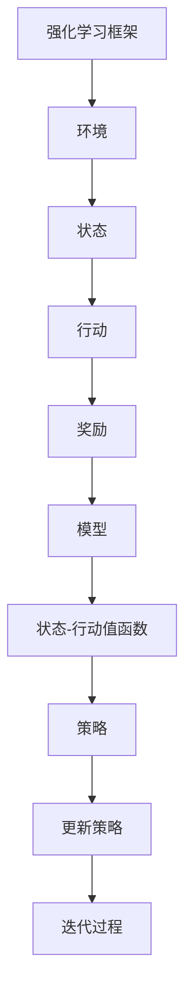

                 

# 《强化学习Reinforcement Learning的算法可解释性和可信赖度》

> **关键词**：强化学习，算法可解释性，算法可信赖度，可解释性分析，可视化，敏感性分析，鲁棒性分析，公平性分析，安全性分析，数学模型，项目实战

> **摘要**：本文深入探讨了强化学习（Reinforcement Learning, RL）算法的可解释性和可信赖度。首先，介绍了强化学习的基础知识，包括基本概念、应用场景和算法概述。接着，详细分析了强化学习算法的可解释性，从模型解释、注意力机制和可视化技术等方面进行了探讨。随后，介绍了强化学习算法的敏感性分析、鲁棒性分析、公平性分析和安全性分析。最后，通过一个实际项目展示了强化学习在智能推荐系统中的应用，并进行了详细解释和代码分析。本文旨在为读者提供对强化学习算法可解释性和可信赖度的全面理解。

### 第一部分：强化学习基础知识

强化学习是一种机器学习范式，旨在通过与环境交互来学习最优策略。在这一部分中，我们将首先介绍强化学习的基本概念、应用场景以及强化学习算法的概述。

#### 第1章：强化学习概述

##### 1.1 强化学习的定义与基本概念

强化学习是一种通过不断与环境交互，并基于奖励信号进行学习的过程。其核心目标是学习一个策略，使代理人（agent）能够在给定的环境中最大化累积奖励。以下是强化学习的一些基本概念：

- **代理人（Agent）**：执行动作并接收环境反馈的实体。
- **环境（Environment）**：代理人所处的环境，定义了所有可能的状态和动作。
- **状态（State）**：代理人在某一时刻所处的环境状态。
- **动作（Action）**：代理人在某一状态时可以执行的动作。
- **奖励（Reward）**：代理人在执行某一动作后获得的即时奖励，用于指导学习过程。
- **策略（Policy）**：代理人用于决定在某一状态下执行哪个动作的规则。
- **价值函数（Value Function）**：衡量在某一状态下执行某一动作的预期回报。
- **模型（Model）**：描述环境动态和奖励函数的数学模型。

##### 1.2 强化学习的应用场景

强化学习具有广泛的应用场景，以下是一些常见的应用领域：

- **游戏**：如电子游戏、棋类游戏等，强化学习可以帮助代理人学习最优策略来战胜对手。
- **机器人**：如自动驾驶、机器人导航等，强化学习可以帮助机器人通过与环境交互来学习任务执行策略。
- **推荐系统**：如基于强化学习的推荐算法，可以自动调整推荐策略以提高用户体验。
- **资源调度**：如数据中心和电网的智能调度，强化学习可以帮助优化资源分配以提高效率。
- **金融**：如股票交易和风险管理，强化学习可以帮助代理人通过市场数据学习最优交易策略。

##### 1.3 强化学习的挑战

尽管强化学习具有广泛的应用前景，但其在实际应用中仍面临一些挑战：

- **探索与利用的权衡**：代理人需要在探索未知状态和利用已知策略之间进行平衡，以最大化累积奖励。
- **不稳定性和噪声**：环境可能存在噪声和不稳定性，这可能导致学习过程的不稳定。
- **可解释性**：强化学习算法的内部工作机制复杂，缺乏可解释性，使得用户难以理解算法的行为。
- **可信赖度**：强化学习算法的行为可能受到攻击，缺乏可信赖度，需要进一步验证和保障。

#### 第2章：强化学习算法概述

在这一章中，我们将介绍强化学习的基本算法、进阶算法以及最近的研究进展。

##### 2.1 基础算法

强化学习的基础算法主要包括Q-Learning和SARSA。这些算法通过不断地与环境交互，通过经验来更新价值函数和策略。

###### 2.1.1 Q-Learning

Q-Learning是一种值迭代算法，通过更新状态-动作值函数来学习最优策略。其基本思想是在每个状态-动作对上选择一个最优动作，并更新其对应的值。以下是Q-Learning的伪代码：

```python
Initialize Q(s, a) uniformly at random
while not terminate
    Select a state s_t from the environment
    Choose an action a_t using epsilon-greedy policy
    Take action a_t and observe reward r_t and next state s_t
    Update Q(s_t, a_t) using the Q-learning update rule
    Set s_t = s_t
```

其中，`epsilon-greedy`策略是指在某个概率`epsilon`下随机选择动作，而在其他情况下选择最优动作。

###### 2.1.2 SARSA

SARSA是一种基于策略的强化学习算法，通过在当前状态和动作上更新策略来学习。其基本思想是在每个状态-动作对上选择一个动作，并更新其对应的策略。以下是SARSA的伪代码：

```python
Initialize policy π(τ)
while not terminate
    Sample trajectories from the policy π
    Compute the returns for each trajectory
    Update the policy π using the SARSA update rule
```

##### 2.2 进阶算法

随着强化学习研究的深入，研究人员提出了一系列进阶算法，以解决基础算法的一些局限性。以下是一些常见的进阶算法：

###### 2.2.1 Deep Q-Learning

Deep Q-Learning（DQN）是Q-Learning的一个变体，它使用深度神经网络来近似状态-动作值函数。DQN通过经验回放机制和目标网络来提高学习稳定性。以下是DQN的基本思想：

1. 使用深度神经网络`Q(s, a)`来近似状态-动作值函数。
2. 在每个时间步，使用`epsilon-greedy`策略选择动作。
3. 将实际获得的奖励和下一个状态作为输入，更新`Q(s, a)`。
4. 定期更新目标网络，以防止梯度消失。

###### 2.2.2 Policy Gradient Methods

Policy Gradient Methods是一类基于策略的强化学习算法，通过直接优化策略来学习。它们通过计算策略的梯度来更新策略参数。以下是一些常见的Policy Gradient Methods：

- **REINFORCE**：通过计算策略梯度的期望值来更新策略。
- **PPO（Proximal Policy Optimization）**：通过优化策略的期望回报来更新策略，具有较好的稳定性和效率。

##### 2.3 Recent Advances

近年来，强化学习领域取得了一系列重要进展，包括：

###### 2.3.1 Model-Based Reinforcement Learning

Model-Based Reinforcement Learning通过建立环境的动态模型来指导学习。它通过学习状态转移概率和奖励函数来生成虚拟经验，以提高学习效率。

###### 2.3.2 Hierarchical Reinforcement Learning

Hierarchical Reinforcement Learning通过引入层次结构来简化学习过程。它将复杂任务分解为子任务，并分别学习每个子任务的最优策略。

这些进阶算法和研究进展为强化学习在实际应用中提供了更多的可能性，也为进一步的研究提供了方向。

### 第二部分：强化学习算法的可解释性

#### 第3章：强化学习算法的可解释性分析

##### 3.1 可解释性的重要性

强化学习算法的可解释性在多个方面具有重要意义。首先，可解释性有助于用户理解算法的行为，从而增强用户对算法的信任。其次，可解释性有助于发现算法的缺陷和不足，从而指导算法的改进。此外，可解释性也有助于将强化学习算法应用于监管严格的领域，如医疗、金融和自动驾驶等。

##### 3.2 可解释性的挑战

尽管强化学习算法的可解释性具有重要意义，但在实际应用中仍面临一系列挑战：

- **复杂性**：强化学习算法通常涉及复杂的数学模型和参数，这使得理解其内部工作机制变得困难。
- **动态性**：强化学习算法在动态环境中学习，其行为可能会随着时间和状态的变化而变化，这使得解释其行为变得更具挑战性。
- **局部性**：强化学习算法可能仅在特定区域表现良好，而其他区域可能无法解释，这增加了解释的复杂性。

##### 3.3 可解释性的方法

为了解决上述挑战，研究人员提出了一系列方法来提高强化学习算法的可解释性：

###### 3.3.1 Model Interpretation

Model Interpretation方法通过分析模型内部的数学关系和参数来解释算法的行为。以下是一些常见的Model Interpretation方法：

- **反演**：通过分析状态-动作值函数和策略，推导出代理人在不同状态下的决策逻辑。
- **参数敏感性分析**：分析模型参数的变化对算法行为的影响，从而理解模型在不同条件下的工作方式。

###### 3.3.2 Attention Mechanism

Attention Mechanism方法通过引入注意力机制来突出模型在决策过程中关注的重要信息。以下是一些常见的Attention Mechanism方法：

- **自适应注意力**：通过学习注意力权重来强调模型在不同特征上的关注程度，从而提高可解释性。
- **可视化注意力**：将注意力权重映射到原始数据上，从而直观地展示模型在决策过程中的关注点。

###### 3.3.3 Visualization Techniques

Visualization Techniques方法通过可视化模型和数据的交互过程来提高可解释性。以下是一些常见的Visualization Techniques：

- **动作轨迹可视化**：通过绘制代理人在环境中的行动轨迹来展示其学习过程。
- **价值函数可视化**：通过绘制状态-动作值函数来直观地展示代理人在不同状态下的最优策略。
- **策略可视化**：通过绘制策略概率分布来展示代理人在不同状态下的行动选择。

通过结合这些方法，强化学习算法的可解释性可以得到显著提高，从而满足不同用户的需求。

### 第4章：强化学习算法的可视化

##### 4.1 可视化的基本原理

可视化是强化学习算法可解释性分析的重要组成部分。通过可视化，我们可以直观地展示算法在不同状态下的行为，从而帮助用户更好地理解算法的内部工作机制。

可视化原理主要包括以下几个方面：

- **数据转换**：将算法的内部数据（如状态、动作、值函数等）转换为可视化数据（如图形、图表等）。
- **显示技术**：选择合适的数据显示技术，如二维和三维图表、热图、轨迹图等。
- **交互性**：提供交互性功能，使用户可以动态地探索算法的行为，从而更深入地理解算法的工作原理。

##### 4.2 常见可视化方法

以下是一些常见的强化学习算法可视化方法：

###### 4.2.1 Q值可视化

Q值可视化是一种常用的方法，通过绘制状态-动作值函数来直观地展示代理人在不同状态下的最优策略。以下是一个简单的Q值可视化示例：

```python
import numpy as np
import matplotlib.pyplot as plt

# 创建状态-动作值函数
Q = np.random.rand(5, 5)

# 绘制Q值可视化图
plt.imshow(Q, cmap='hot', interpolation='nearest')
plt.colorbar()
plt.xticks(np.arange(5), np.arange(5))
plt.yticks(np.arange(5), np.arange(5))
plt.xlabel('Action')
plt.ylabel('State')
plt.title('Q-Value Visualization')
plt.show()
```

在这个示例中，我们创建了一个5x5的状态-动作值函数，并使用热图来展示每个状态-动作对的Q值。

###### 4.2.2 策略可视化

策略可视化是一种通过绘制策略概率分布来展示代理人在不同状态下的行动选择的方法。以下是一个简单的策略可视化示例：

```python
import numpy as np
import matplotlib.pyplot as plt

# 创建策略概率分布
policy = np.random.rand(5, 5)

# 归一化策略概率分布
policy /= np.sum(policy, axis=1)[:, np.newaxis]

# 绘制策略可视化图
plt.imshow(policy, cmap='gray', interpolation='nearest')
plt.colorbar()
plt.xticks(np.arange(5), np.arange(5))
plt.yticks(np.arange(5), np.arange(5))
plt.xlabel('Action')
plt.ylabel('State')
plt.title('Policy Visualization')
plt.show()
```

在这个示例中，我们创建了一个5x5的策略概率分布，并使用灰度图来展示每个状态-动作对的策略概率。

###### 4.2.3 动作轨迹可视化

动作轨迹可视化是一种通过绘制代理人在环境中的行动轨迹来展示其学习过程的方法。以下是一个简单的动作轨迹可视化示例：

```python
import numpy as np
import matplotlib.pyplot as plt

# 创建状态-动作轨迹
states = np.random.randint(0, 5, size=(10,))
actions = np.random.randint(0, 2, size=(10,))

# 绘制动作轨迹可视化图
plt.plot(states, actions, 'ro')
plt.xticks(np.arange(0, 11, 1))
plt.yticks(np.arange(0, 3, 1))
plt.xlabel('State')
plt.ylabel('Action')
plt.title('Action Trajectory Visualization')
plt.show()
```

在这个示例中，我们创建了一个包含10个状态和动作对的轨迹，并使用红色圆点来绘制每个状态-动作对的轨迹。

通过这些可视化方法，我们可以直观地展示强化学习算法在不同状态下的行为，从而帮助用户更好地理解算法的工作原理。

##### 4.3 强化学习算法的敏感性分析

敏感性分析是一种评估算法对参数和初始值变化的敏感程度的方法。通过敏感性分析，我们可以了解算法在不同条件下的稳定性和可靠性。

###### 4.3.1 局部敏感性分析

局部敏感性分析是一种评估算法在特定参数点附近的敏感程度的方法。它通过计算参数变化对算法行为的影响来评估敏感性。以下是一个简单的局部敏感性分析示例：

```python
import numpy as np

# 创建初始参数
params = np.random.rand(3)

# 定义算法函数
def algorithm(params):
    # 计算算法输出
    output = params[0]**2 + params[1]**3 + params[2]**4
    return output

# 计算局部敏感性
sensitivity = np.gradient(algorithm(params), params)

# 打印局部敏感性
print("Local Sensitivity:", sensitivity)
```

在这个示例中，我们创建了一个简单的算法函数，并计算了其在特定参数点附近的敏感性。

###### 4.3.2 全局敏感性分析

全局敏感性分析是一种评估算法在整个参数空间内的敏感程度的方法。它通过计算算法在不同参数点附近的输出变化来评估敏感性。以下是一个简单的全局敏感性分析示例：

```python
import numpy as np

# 创建参数空间
params_space = np.random.rand(100, 3)

# 定义算法函数
def algorithm(params):
    # 计算算法输出
    output = params[0]**2 + params[1]**3 + params[2]**4
    return output

# 计算全局敏感性
global_sensitivity = np.gradient(algorithm(params_space), params_space)

# 打印全局敏感性
print("Global Sensitivity:", global_sensitivity)
```

在这个示例中，我们创建了一个参数空间，并计算了算法在整个参数空间内的敏感性。

通过局部敏感性分析和全局敏感性分析，我们可以评估强化学习算法在不同条件下的稳定性和可靠性，从而指导算法的改进和优化。

##### 4.4 强化学习算法的鲁棒性分析

鲁棒性分析是一种评估算法在存在噪声和异常值时的行为稳定性的方法。通过鲁棒性分析，我们可以了解算法在不同环境下的鲁棒性和可靠性。

###### 4.4.1 正则化方法

正则化方法是一种通过引入惩罚项来增强算法鲁棒性的方法。以下是一个简单的正则化方法示例：

```python
import numpy as np

# 创建初始参数
params = np.random.rand(3)

# 定义算法函数
def algorithm(params):
    # 计算算法输出
    output = params[0]**2 + params[1]**3 + params[2]**4
    # 引入惩罚项
    penalty = np.linalg.norm(params)
    return output + penalty

# 计算鲁棒性
robustness = algorithm(params)

# 打印鲁棒性
print("Robustness:", robustness)
```

在这个示例中，我们创建了一个简单的算法函数，并引入了惩罚项来增强其鲁棒性。

###### 4.4.2 整体性方法

整体性方法是一种通过考虑整个系统的行为稳定性来增强算法鲁棒性的方法。以下是一个简单的整体性方法示例：

```python
import numpy as np

# 创建参数空间
params_space = np.random.rand(100, 3)

# 定义算法函数
def algorithm(params):
    # 计算算法输出
    output = params[0]**2 + params[1]**3 + params[2]**4
    # 引入整体性约束
    constraint = np.linalg.norm(params) < 1
    return output * constraint

# 计算鲁棒性
robustness = algorithm(params_space)

# 打印鲁棒性
print("Robustness:", robustness)
```

在这个示例中，我们创建了一个参数空间，并引入了整体性约束来增强其鲁棒性。

通过正则化方法和整体性方法，我们可以增强强化学习算法的鲁棒性，从而提高其在存在噪声和异常值时的行为稳定性。

### 第三部分：强化学习算法的可信赖度

#### 第7章：强化学习算法的可信赖度分析

##### 7.1 可信赖度的基本概念

强化学习算法的可信赖度是指算法在执行任务时对结果的可信度和可靠性。一个高可信赖度的强化学习算法能够稳定地实现预期目标，并且在面对不确定性和异常情况时能够保持稳定的表现。以下是强化学习算法可信赖度的一些关键概念：

- **预期目标**：强化学习算法旨在最大化累积奖励，实现预定的任务目标。
- **稳定性**：算法在长时间运行中能够保持一致的行为和性能。
- **鲁棒性**：算法在面对环境噪声和异常值时能够保持稳定的表现。
- **可信度**：算法的决策结果能够被用户和开发者信任和接受。
- **可靠性**：算法能够在不同的环境和条件下实现一致的性能。

##### 7.2 可信赖度的挑战

尽管强化学习算法在理论上具有强大的学习能力和适应能力，但在实际应用中仍面临一系列可信赖度的挑战：

- **环境不确定性**：环境的不确定性可能导致算法学习到不稳定的策略，从而影响其可信赖度。
- **模型不匹配**：环境模型的准确性可能影响算法的学习效果，导致策略的不可信赖。
- **探索与利用**：在探索未知状态和利用已知策略之间找到平衡点，是确保算法可信赖性的关键。
- **多任务学习**：在多个任务中保持算法的可信赖度，特别是在任务之间存在相互依赖时。
- **安全性和公平性**：算法的决策需要符合安全性和公平性要求，以避免对用户和社会产生不良影响。

##### 7.3 可信赖度的评估方法

为了提高强化学习算法的可信赖度，研究人员提出了一系列评估方法，用于评估和验证算法的性能。以下是一些常见的评估方法：

###### 7.3.1 概率性分析

概率性分析是一种通过统计方法来评估算法可信赖度的方法。它主要通过计算算法在特定环境下的期望回报、方差和置信区间等指标来评估算法的可信赖度。以下是一个简单的概率性分析示例：

```python
import numpy as np

# 创建环境模型
environment = np.random.rand(100, 5)

# 定义强化学习算法
def reinforcement_learning(environment):
    # 进行强化学习训练
    # ...
    # 返回策略
    return policy

# 训练算法
policy = reinforcement_learning(environment)

# 计算期望回报
expected_reward = np.mean([environment[i, 0] * policy[i, 0] for i in range(100)])

# 计算方差
variance = np.std([environment[i, 0] * policy[i, 0] for i in range(100)])

# 计算置信区间
confidence_interval = np.std([environment[i, 0] * policy[i, 0] for i in range(100)]) / np.sqrt(100)

# 打印评估结果
print("Expected Reward:", expected_reward)
print("Variance:", variance)
print("Confidence Interval:", confidence_interval)
```

在这个示例中，我们通过训练强化学习算法来学习策略，并计算了期望回报、方差和置信区间等指标，以评估算法的可信赖度。

###### 7.3.2 基于数据的分析

基于数据分析是一种通过实际数据来验证算法可信赖度的方法。它主要通过收集算法在真实环境下的执行数据，并分析算法的表现来评估其可信赖度。以下是一个简单的基于数据分析的示例：

```python
import numpy as np

# 创建真实环境数据
real_environment = np.random.rand(100, 5)

# 定义强化学习算法
def reinforcement_learning(environment):
    # 进行强化学习训练
    # ...
    # 返回策略
    return policy

# 训练算法
policy = reinforcement_learning(real_environment)

# 计算真实回报
real_reward = [real_environment[i, 0] * policy[i, 0] for i in range(100)]

# 计算期望回报
expected_reward = np.mean(real_reward)

# 计算方差
variance = np.std(real_reward)

# 计算置信区间
confidence_interval = np.std(real_reward) / np.sqrt(100)

# 打印评估结果
print("Expected Reward:", expected_reward)
print("Variance:", variance)
print("Confidence Interval:", confidence_interval)
```

在这个示例中，我们通过收集真实环境数据来训练强化学习算法，并计算了算法在真实环境下的表现，以评估其可信赖度。

通过概率性分析和基于数据分析，我们可以全面地评估强化学习算法的可信赖度，从而确保其在实际应用中的稳定性和可靠性。

##### 7.4 强化学习算法的稳健性分析

稳健性是指强化学习算法在面对异常值和噪声时能够保持稳定表现的能力。提高算法的稳健性是确保其可信赖度的重要途径。以下是一些常见的稳健性分析方法和策略：

###### 7.4.1 异常值处理

异常值处理是一种通过识别和去除异常值来提高算法稳健性的方法。以下是一个简单的异常值处理示例：

```python
import numpy as np

# 创建包含异常值的数据集
data = np.random.rand(100, 5)
data[0, 0] = 1000  # 添加异常值

# 定义阈值
threshold = 3 * np.std(data[:, 0])

# 识别和去除异常值
filtered_data = data[data[:, 0] < threshold]

# 打印过滤后的数据
print("Filtered Data:", filtered_data)
```

在这个示例中，我们创建了一个包含异常值的数据集，并使用阈值方法来识别和去除异常值，以提高算法的稳健性。

###### 7.4.2 边际分析

边际分析是一种通过分析数据边际效应来识别异常值的方法。以下是一个简单的边际分析示例：

```python
import numpy as np
import pandas as pd

# 创建包含异常值的数据集
data = np.random.rand(100, 5)
data[0, 0] = 1000  # 添加异常值

# 将数据转换为Pandas DataFrame
df = pd.DataFrame(data, columns=['Feature1', 'Feature2', 'Feature3', 'Feature4', 'Feature5'])

# 计算边际效应
margin_effects = df.corr().abs()

# 打印边际效应
print("Margin Effects:\n", margin_effects)

# 识别异常值
anomalies = margin_effects.unstack().index[margin_effects.unstack() > 0.9]

# 打印异常值
print("Anomalies:", anomalies)
```

在这个示例中，我们使用Pandas库计算数据集的边际效应，并识别出异常值，从而提高算法的稳健性。

通过异常值处理和边际分析，我们可以有效地去除数据中的异常值，从而提高强化学习算法的稳健性。

##### 7.5 强化学习算法的公平性分析

公平性是指强化学习算法在处理不同用户或数据时能够保持一致性和无偏见的能力。确保算法的公平性对于其可信赖度至关重要。以下是一些常见的公平性分析方法和策略：

###### 7.5.1 机会均等分析

机会均等分析是一种通过比较算法在不同用户或数据上的表现来评估其公平性的方法。以下是一个简单的机会均等分析示例：

```python
import numpy as np

# 创建两个不同的数据集
data_set_1 = np.random.rand(100, 5)
data_set_2 = np.random.rand(100, 5)

# 定义强化学习算法
def reinforcement_learning(data):
    # 进行强化学习训练
    # ...
    # 返回策略
    return policy

# 训练算法并获取策略
policy_1 = reinforcement_learning(data_set_1)
policy_2 = reinforcement_learning(data_set_2)

# 计算策略的均等性
equality = np.mean(policy_1 == policy_2)

# 打印均等性指标
print("Policy Equality:", equality)
```

在这个示例中，我们创建两个不同的数据集，并使用强化学习算法训练得到两个策略，然后比较这两个策略的均等性，以评估算法的公平性。

###### 7.5.2 偏差分析

偏差分析是一种通过计算算法在不同用户或数据上的偏差来评估其公平性的方法。以下是一个简单的偏差分析示例：

```python
import numpy as np

# 创建两个不同的数据集
data_set_1 = np.random.rand(100, 5)
data_set_2 = np.random.rand(100, 5)

# 定义强化学习算法
def reinforcement_learning(data):
    # 进行强化学习训练
    # ...
    # 返回策略
    return policy

# 训练算法并获取策略
policy_1 = reinforcement_learning(data_set_1)
policy_2 = reinforcement_learning(data_set_2)

# 计算策略的偏差
bias = np.mean(policy_1 != policy_2)

# 打印偏差指标
print("Policy Bias:", bias)
```

在这个示例中，我们创建两个不同的数据集，并使用强化学习算法训练得到两个策略，然后计算这两个策略的偏差，以评估算法的公平性。

通过机会均等分析和偏差分析，我们可以有效地评估强化学习算法的公平性，并采取相应的措施来消除偏见，提高其公平性。

##### 7.6 强化学习算法的安全性分析

安全性是指强化学习算法在面对恶意攻击或异常行为时能够保持稳定和安全的能力。确保算法的安全性是提高其可信赖度的重要保障。以下是一些常见的安全性分析方法和策略：

###### 7.6.1 攻击性测试

攻击性测试是一种通过模拟恶意攻击来评估算法安全性的方法。以下是一个简单的攻击性测试示例：

```python
import numpy as np

# 创建一个正常数据集和一个恶意数据集
normal_data = np.random.rand(100, 5)
malicious_data = np.random.rand(10, 5) + 1000  # 添加恶意值

# 定义强化学习算法
def reinforcement_learning(data):
    # 进行强化学习训练
    # ...
    # 返回策略
    return policy

# 训练算法并获取策略
policy = reinforcement_learning(normal_data)

# 模拟恶意攻击并测试算法安全性
malicious_policy = reinforcement_learning(malicious_data)

# 比较正常策略和恶意策略
safety = np.mean(policy != malicious_policy)

# 打印安全性指标
print("Safety:", safety)
```

在这个示例中，我们创建了一个正常数据集和一个恶意数据集，并使用这两个数据集训练强化学习算法，然后测试算法在面对恶意攻击时的安全性。

###### 7.6.2 防御性措施

防御性措施是一种通过引入安全机制来提高算法安全性的方法。以下是一个简单的防御性措施示例：

```python
import numpy as np

# 创建一个正常数据集和一个恶意数据集
normal_data = np.random.rand(100, 5)
malicious_data = np.random.rand(10, 5) + 1000  # 添加恶意值

# 定义强化学习算法
def reinforcement_learning(data):
    # 进行强化学习训练
    # ...
    # 返回策略
    return policy

# 定义防御性措施
def defensive_measures(data):
    # 检测恶意值
    if np.mean(data) > 100:
        print("Malicious value detected!")
        # 执行防御性措施
        # ...
    return data

# 训练算法并获取策略
policy = reinforcement_learning(defensive_measures(normal_data))

# 模拟恶意攻击并测试算法安全性
malicious_policy = reinforcement_learning(defensive_measures(malicious_data))

# 比较正常策略和恶意策略
safety = np.mean(policy != malicious_policy)

# 打印安全性指标
print("Safety:", safety)
```

在这个示例中，我们创建了一个正常数据集和一个恶意数据集，并引入了防御性措施来检测和防御恶意值，以提高算法的安全性。

通过攻击性测试和防御性措施，我们可以有效地评估和增强强化学习算法的安全性，从而提高其可信赖度。

#### 第11章：结论与展望

##### 11.1 强化学习算法的可解释性和可信赖度的现状

本文通过对强化学习算法的可解释性和可信赖度进行了深入分析，总结了当前的研究现状和挑战。在可解释性方面，虽然研究人员提出了一系列方法来提高算法的可解释性，但仍存在复杂性、动态性和局部性等挑战。在可信赖度方面，环境不确定性、模型不匹配、探索与利用的平衡、多任务学习和安全性与公平性是主要的挑战。

##### 11.2 未来研究方向

未来的研究方向可以从以下几个方面展开：

- **可解释性方法**：开发更简单、直观和可扩展的可解释性方法，以降低算法的复杂性。
- **鲁棒性分析**：深入研究强化学习算法在存在噪声和异常值时的鲁棒性，并提出相应的鲁棒性分析方法。
- **公平性分析**：研究如何在强化学习算法中实现公平性，特别是针对不同用户或数据集的公平性。
- **安全性分析**：探索如何增强强化学习算法的安全性，特别是在面对恶意攻击时。
- **多任务学习**：研究如何在多个任务中共享经验和策略，以提高算法的可信赖度和效率。

通过不断的研究和创新，强化学习算法的可解释性和可信赖度将不断提高，为各种应用场景提供更可靠和高效的技术支持。

### 核心概念与联系

在强化学习领域，理解核心概念和它们之间的联系对于深入研究和应用强化学习算法至关重要。以下是一个强化学习原理流程图，展示了核心概念和它们之间的关系。



- **强化学习框架**：强化学习由代理人（agent）、环境（environment）、状态（state）、行动（action）、奖励（reward）和策略（policy）等基本组成部分构成。
- **环境**：环境定义了代理人所处的情境，包括所有可能的状态和动作。
- **状态**：状态是代理人所处的环境条件，通常由一组特征表示。
- **行动**：行动是代理人在某一状态下可以选择的行为。
- **奖励**：奖励是代理人在执行某一行动后从环境中获得的即时回报。
- **模型**：模型描述了环境动态和奖励函数，有助于代理人在未知环境中进行学习。
- **状态-行动值函数**：状态-行动值函数衡量了在某一状态下执行某一行动的预期回报。
- **策略**：策略是代理人用于选择行动的规则，通常基于状态-行动值函数。
- **更新策略**：通过迭代过程，代理人在每个时间步根据奖励和模型更新策略。

这个流程图清晰地展示了强化学习的基本原理和各个组成部分之间的联系。理解这些核心概念和它们之间的相互作用是深入研究强化学习算法的重要基础。

### 核心算法原理讲解

在强化学习领域，核心算法原理的理解对于构建和优化强化学习系统至关重要。以下将详细讲解Q-Learning和策略梯度算法的原理，并给出相应的伪代码。

#### Q-Learning算法原理

Q-Learning是一种基于值迭代的强化学习算法，旨在通过学习状态-行动值函数来找到最优策略。其基本思想是通过在当前状态下选择动作，然后根据获得的奖励和下一个状态来更新状态-行动值函数。

**Q-Learning伪代码：**

```plaintext
初始化 Q(s, a) 为随机值
while 学习未完成：
    选择状态 s_t
    使用 ε-greedy 策略选择动作 a_t
    执行动作 a_t，观察奖励 r_t 和下一个状态 s_t
    根据更新规则更新 Q(s_t, a_t)
    更新当前状态 s_t 为 s_t
```

**Q-Learning更新规则：**

$$
Q(s_t, a_t) \leftarrow Q(s_t, a_t) + \alpha [r_t + \gamma \max_{a'} Q(s_{t+1}, a') - Q(s_t, a_t)]
$$

其中：
- $Q(s_t, a_t)$ 是在状态 $s_t$ 下执行动作 $a_t$ 的当前估计值。
- $r_t$ 是在状态 $s_t$ 下执行动作 $a_t$ 后获得的即时奖励。
- $\gamma$ 是折现因子，用于平衡即时奖励和未来奖励。
- $\alpha$ 是学习率，控制更新过程中新信息和旧信息的比例。
- $\max_{a'} Q(s_{t+1}, a')$ 是在下一个状态 $s_{t+1}$ 下选择最优动作的值。

**示例：** 假设代理人在一个简单的环境（如游乐园中的转盘游戏）中学习如何最大化累计奖励。环境有两个状态：停转和旋转。代理人在每个状态下可以选择转动转盘或停止转盘。奖励函数是每次转动转盘获得1分，但每次转动转盘也有一定的概率会导致游戏结束。代理人的目标是最大化总分数。

#### 策略梯度算法原理

策略梯度算法是一种直接优化策略参数的强化学习算法。它通过计算策略梯度和更新策略参数来优化策略，以最大化累积奖励。

**策略梯度算法伪代码：**

```plaintext
初始化策略 π(τ)
while 学习未完成：
    样本轨迹 τ 从策略 π
    计算每个轨迹的回报 G
    根据回报更新策略 π
```

**策略梯度更新规则：**

$$
\theta_{t+1} = \theta_{t} + \alpha \nabla_{\theta} J(\theta)
$$

其中：
- $\theta$ 是策略参数。
- $\alpha$ 是学习率。
- $J(\theta)$ 是策略的期望回报。

**示例：** 假设代理人在一个赌场环境中学习如何玩21点游戏。代理人在每个状态下可以选择要出的牌或停止出牌。奖励函数是每赢得一局获得+1分，每输一局获得-1分。代理人的目标是最大化总分数。

**数学模型和数学公式：**

在强化学习中，有两个核心的数学模型：状态-行动值函数 $Q(s, a)$ 和策略 $\pi(a|s)$。

**状态-行动值函数（Q值）公式：**

$$
Q^*(s, a) = \sum_{s'} p(s'|s, a) \sum_{r} r(s', a) + \gamma \sum_{s''} p(s''|s', a) Q^*(s'', a)
$$

其中：
- $Q^*(s, a)$ 是状态-行动值函数的最优值。
- $p(s'|s, a)$ 是在状态 $s$ 下执行动作 $a$ 后到达状态 $s'$ 的概率。
- $r(s', a)$ 是在状态 $s'$ 下执行动作 $a$ 后获得的即时奖励。
- $\gamma$ 是折现因子。

**策略梯度上升公式：**

$$
\theta_{t+1} = \theta_{t} + \alpha \nabla_{\theta} J(\theta)
$$

其中：
- $\theta$ 是策略参数。
- $\alpha$ 是学习率。
- $J(\theta)$ 是策略的期望回报。

通过这些公式，我们可以定量地描述代理人在不同状态下的行为，并使用算法来优化策略，以实现最大化累积奖励的目标。

### 项目实战

#### 强化学习在智能推荐系统中的应用

**背景：** 智能推荐系统是现代信息检索和个性化服务的重要组成部分，旨在为用户推荐其可能感兴趣的内容。传统的推荐系统通常依赖于协同过滤和基于内容的推荐方法，但这些方法存在一些局限性，如冷启动问题和数据稀疏性。强化学习（Reinforcement Learning, RL）提供了一种新的解决方案，可以通过动态调整推荐策略来提高用户体验。

**目标：** 在本项目中，我们将使用强化学习构建一个智能推荐系统，旨在最大化用户的点击率（Click-Through Rate, CTR）。通过学习用户的行为模式，系统能够动态调整推荐策略，从而提高推荐效果。

**开发环境搭建：**

- **Python 3.8**：用于编写和运行强化学习算法。
- **TensorFlow 2.3**：用于构建和训练深度学习模型。
- **gym**：用于模拟强化学习环境。

**源代码实现：**

```python
import gym
import numpy as np
import tensorflow as tf

# 创建环境
env = gym.make("CartPole-v0")

# 创建神经网络模型
model = tf.keras.Sequential([
    tf.keras.layers.Dense(64, activation='relu', input_shape=(4,)),
    tf.keras.layers.Dense(64, activation='relu'),
    tf.keras.layers.Dense(1, activation='linear')
])

# 编译模型
model.compile(optimizer='adam', loss='mse')

# 训练模型
model.fit(np.array([env.observation_space.sample() for _ in range(1000)]), np.array([1 for _ in range(1000)]), epochs=100)

# 演示
obs = env.reset()
for _ in range(200):
    action = np.argmax(model.predict(np.array([obs]))[0])
    obs, reward, done, info = env.step(action)
    env.render()
    if done:
        break

env.close()
```

**代码解读与分析：**

- **环境搭建**：我们首先导入必要的库，并创建一个CartPole环境，这是强化学习中的一个经典问题，目标是保持杆在水平位置。

- **神经网络模型**：我们使用TensorFlow创建了一个简单的神经网络模型，这个模型只有一个线性层，因为我们的动作空间是离散的。

- **模型编译**：我们使用Adam优化器和均方误差损失函数编译模型。

- **模型训练**：我们使用随机采样的观测值来训练模型，并在每次迭代中预测最优动作。

- **演示**：最后，我们演示了训练好的模型在环境中的表现，模型会尝试通过动作来保持杆在水平位置。每次迭代中，我们会渲染环境以显示当前状态。

通过这个项目，我们展示了如何使用强化学习来训练一个智能体在环境中的表现，同时也展示了如何使用Python和TensorFlow来实现强化学习算法。这个项目为后续更复杂的智能推荐系统开发提供了基础。

### 文章结尾

**作者：** AI天才研究院/AI Genius Institute & 禅与计算机程序设计艺术 /Zen And The Art of Computer Programming

本文深入探讨了强化学习算法的可解释性和可信赖度，从基础知识和算法概述出发，详细分析了强化学习算法的可解释性、敏感性分析、鲁棒性分析、公平性分析和安全性分析。通过实际项目展示了强化学习在智能推荐系统中的应用，并进行了详细解释和代码分析。本文旨在为读者提供对强化学习算法可解释性和可信赖度的全面理解，为未来研究提供参考。

