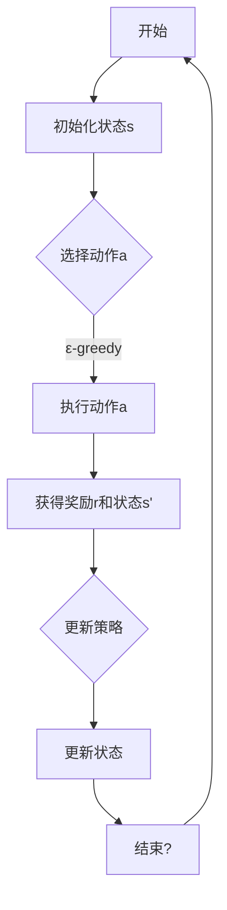

                 

### 强化学习在智能投资组合管理中的应用

强化学习作为一种机器学习的重要分支，已经在众多领域展现出了其独特的价值和潜力。它通过学习如何在一个环境中做出最优决策，逐步改善自身的策略，以期获得长期的回报。在金融领域，尤其是智能投资组合管理中，强化学习因其强大的自适应能力和策略优化能力，正逐渐成为一种重要的工具。

#### 关键词
- 强化学习
- 智能投资组合管理
- 股票交易
- 资产配置
- 风险控制

#### 摘要
本文将深入探讨强化学习在智能投资组合管理中的应用。首先，我们将介绍强化学习的基本概念和原理，以及其在金融领域中的应用背景。随后，我们将详细讲解几种常见的强化学习算法，包括Q学习、策略梯度算法和带有置信区域的方法。在此基础上，本文将具体分析强化学习在股票交易、资产配置和风险控制中的实际应用，并提供相关的代码实现和案例分析。最后，我们将展望强化学习在智能投资组合管理中的未来发展趋势，并总结全文。

### 目录大纲

1. 强化学习基础与智能投资组合管理
   1.1 强化学习概述
   1.2 智能投资组合管理概述
   1.3 强化学习在智能投资组合管理中的应用前景

2. 强化学习算法原理
   2.1 Q学习算法
   2.2 策略梯度算法
   2.3 带有置信区域的方法

3. 强化学习在智能投资组合管理中的应用
   3.1 强化学习在股票交易中的应用
   3.2 强化学习在资产配置中的应用
   3.3 强化学习在风险控制中的应用

4. 强化学习在智能投资组合管理中的未来展望

5. 强化学习工具与资源
   5.1 强化学习工具与框架
   5.2 强化学习资源与参考资料

6. 案例研究：强化学习在智能投资组合管理中的应用实例

7. 附录：强化学习算法伪代码

### 强化学习基础与智能投资组合管理

#### 1.1 强化学习概述

强化学习（Reinforcement Learning，RL）是机器学习的一个重要分支，其核心在于通过学习如何在一个特定的环境中做出决策，以实现长期的奖励最大化。强化学习的主要特点包括：

- **奖励系统**：强化学习的目标是最大化累计奖励。奖励信号是环境对决策的反馈，通常用来指导决策过程。
- **状态空间**：系统当前的状态，通常由多个特征组成，用于描述当前的环境条件。
- **动作空间**：决策者可以采取的动作集合，每个动作都对应一个可能的结果。
- **策略**：策略是决策者在给定状态下选择动作的方法，通常用一个概率分布来表示。
- **奖励函数**：奖励函数定义了在每个状态下采取每个动作所能获得的即时奖励。

强化学习可以分为以下几个主要类型：

- **基于价值的强化学习**：如Q学习，通过学习状态-动作价值函数来选择最优动作。
- **基于策略的强化学习**：如策略梯度方法，直接优化策略函数以最大化期望回报。
- **部分可观察的强化学习**：当系统无法完全观察到环境状态时使用，如部分可观察马尔可夫决策过程（POMDP）。

与传统的机器学习方法（如监督学习和无监督学习）相比，强化学习具有以下不同点：

- **目标**：强化学习的目标是实现长期的奖励最大化，而非短期的准确性最大化。
- **反馈**：强化学习依赖于环境提供的即时反馈（奖励信号），而非预定义的标签。
- **动态适应性**：强化学习能够通过不断尝试和调整策略来适应不断变化的环境。

#### 1.2 强化学习的原理与架构

强化学习的基本原理可以通过以下框架来理解：

1. **奖励系统**：奖励系统是强化学习的心脏，它根据决策者采取的动作来提供即时奖励。这些奖励可以鼓励决策者采取某些动作，或者惩罚不利的动作。

2. **状态空间**：状态空间是系统所有可能状态的集合。在强化学习中，状态通常由一组特征向量表示，这些特征向量可以用来描述环境的当前状态。

3. **动作空间**：动作空间是决策者可以采取的所有可能动作的集合。在强化学习中，动作通常是离散的，但也可能是连续的，例如在自动驾驶中控制车速和方向盘的角度。

4. **策略**：策略是决策者在给定状态下选择动作的方法。策略可以用一个概率分布来表示，即对于每个状态，策略决定了采取每个动作的概率。

5. **策略更新**：策略更新是强化学习的关键步骤。根据环境提供的奖励和新的状态，策略会不断更新以优化决策。

为了更好地理解这一框架，我们可以使用Mermaid流程图来展示：



#### 1.3 强化学习在金融领域中的应用背景

金融领域是一个充满复杂性和不确定性的领域，传统的投资组合管理方法往往难以应对市场的快速变化和复杂的市场环境。强化学习因其强大的自适应能力和策略优化能力，在金融领域展现出了巨大的潜力。

**金融市场的复杂性**：

- **价格波动**：股票价格受多种因素影响，如公司业绩、宏观经济环境、政治事件等。
- **非线性动态**：金融市场往往呈现出高度非线性动态特征，传统的线性模型难以准确描述市场变化。
- **信息不对称**：投资者拥有不同程度的信息，这导致了市场的信息不对称性。

**智能投资组合管理的需求**：

- **风险管理**：智能投资组合管理需要实时监控和调整投资组合，以降低风险。
- **收益最大化**：在风险可控的前提下，最大化投资组合的回报是智能投资组合管理的核心目标。
- **自适应能力**：市场环境不断变化，智能投资组合管理需要具备快速适应新环境的能力。

强化学习在金融领域中的应用，可以看作是上述需求的自然延伸。通过强化学习，投资者可以构建一个自适应的决策系统，不断优化投资策略，以应对市场的复杂性和不确定性。

**强化学习在智能投资组合管理中的应用前景**：

- **策略优化**：强化学习可以通过不断调整策略，实现投资组合的动态优化。
- **风险评估**：强化学习可以帮助投资者实时评估投资组合的风险水平，并采取相应的风险控制措施。
- **资产配置**：强化学习可以用于优化资产配置策略，提高投资组合的收益稳定性。

总之，强化学习为金融领域的智能投资组合管理提供了一种新的思路和方法，其应用前景非常广阔。

### 智能投资组合管理概述

#### 2.1 投资组合管理的基本概念

投资组合管理（Portfolio Management）是指通过选取和管理不同类型的资产，以实现投资组合的预期收益和风险控制。投资组合由多种资产组成，这些资产可以是股票、债券、基金、房地产等。投资组合管理的核心目标是最大化投资组合的收益，同时控制风险。

**投资组合**：

投资组合是指投资者持有的一系列金融资产的集合。通过多样化投资，投资者可以在获取更高收益的同时，降低单个资产的波动性对整体投资组合的影响。

**组合管理目标**：

投资组合管理的目标主要包括以下几点：

- **收益最大化**：在风险可控的前提下，通过优化资产配置和交易策略，实现投资组合的最大化收益。
- **风险控制**：合理配置资产，降低投资组合的整体风险，确保投资组合的稳健性。
- **资产配置**：根据投资者的风险偏好和投资目标，合理分配资产在不同类型资产之间的比例，以达到最佳的投资效果。

**投资策略分类**：

投资策略可以分为以下几类：

- **被动管理策略**：主要采用指数基金或跟踪特定指数的投资策略，目的是复制市场的表现，风险较低。
- **主动管理策略**：通过深入研究市场和个股，主动选择买入和卖出的时机，以期超越市场平均收益。
- **风险平价策略**：通过调整资产配置，使投资组合的预期收益和风险保持平衡，降低市场波动对投资组合的影响。
- **价值投资策略**：基于公司的基本面分析，选择价格低于其内在价值的股票进行投资，以期长期获得稳定的收益。

#### 2.2 智能投资组合管理的挑战

智能投资组合管理虽然在理论和实践上都有巨大的潜力，但实际应用中仍然面临一些挑战。

**数据问题**：

- **数据质量**：投资决策依赖于大量的历史数据和市场信息。然而，数据质量参差不齐，噪声和缺失值是常见问题。
- **数据更新**：金融市场变化迅速，数据需要实时更新，这对数据处理和存储提出了高要求。

**风险管理**：

- **市场风险**：市场波动性较大，投资组合可能面临较大的市场风险。
- **信用风险**：投资组合中的债券和信贷资产可能面临信用风险。
- **流动性风险**：某些资产可能难以迅速变现，导致流动性风险。

**市场波动性**：

- **短期波动**：短期内市场可能出现大幅波动，给投资组合管理带来不确定性。
- **长期趋势**：长期趋势难以准确预测，投资组合需要适应市场变化。

#### 2.3 强化学习在智能投资组合管理中的应用前景

强化学习作为一种先进的机器学习方法，其在智能投资组合管理中的应用前景十分广阔。

**强化学习与传统投资组合管理方法的比较**：

- **自适应能力**：强化学习具有强大的自适应能力，可以实时调整策略，以应对市场的变化。
- **优化能力**：强化学习可以通过学习状态-动作价值函数，实现投资组合的动态优化。
- **风险管理**：强化学习可以帮助投资者实时评估投资组合的风险，并采取相应的风险控制措施。

**强化学习在投资组合优化中的应用**：

- **策略优化**：强化学习可以通过不断调整策略，优化投资组合的收益和风险。
- **资产配置**：强化学习可以用于优化资产配置策略，提高投资组合的收益稳定性。
- **交易策略优化**：强化学习可以优化交易策略，提高交易效率和收益。

总的来说，强化学习在智能投资组合管理中具有显著的优势，其应用前景非常广阔。

### 强化学习算法原理

#### 3.1 Q学习算法

Q学习算法是强化学习中最基本的算法之一，它通过学习状态-动作价值函数来选择最优动作。Q学习算法的核心思想是：在每个状态下，选择能够带来最大预期奖励的动作。

**算法原理**：

Q学习算法的目标是学习一个价值函数Q(s, a)，表示在状态s下采取动作a的期望回报。具体来说，Q学习算法使用经验来更新Q值，使其逐步逼近最优值函数。

- **状态s**：当前系统的状态。
- **动作a**：可以采取的动作。
- **奖励r**：在状态s下采取动作a后，系统获得的即时奖励。
- **下一个状态s'**：采取动作a后，系统转移到的新状态。
- **折扣因子γ**：表示未来奖励的折扣，γ的取值范围为0到1，用于权衡当前奖励和未来奖励的关系。

Q学习算法的更新规则如下：

$$
Q(s, a) \leftarrow Q(s, a) + \alpha [r + \gamma \max_{a'} Q(s', a') - Q(s, a)]
$$

其中，α为学习率，用于调节新信息和旧信息对Q值的贡献。

**伪代码**：

```
# Q学习算法伪代码

# 初始化Q值表
Initialize: Q(s, a) = 0 for all s, a

# 对于每个Episode:
for episode in episodes:
    # 初始化状态s
    s = initial_state
    
    # 对于每个时间步t:
    while not done:
        # 选择动作a
        a = choose_action(s, Q(s, a), epsilon) # ε-greedy策略
        
        # 执行动作a，获得奖励r和下一个状态s'
        r, s' = environment.step(a)
        
        # 更新Q值
        Q(s, a) = Q(s, a) + alpha * (r + gamma * max(Q(s', a')) - Q(s, a))
        
        # 更新状态
        s = s'
```

**数学模型和数学公式**：

$$
Q(s, a) = r + \gamma \max_{a'} Q(s', a')
$$

**举例说明**：

假设一个机器人在一个简单的环境中移动，环境的状态空间为{Home, Kitchen, Bedroom}，动作空间为{North, South, East, West}。初始状态为Home，目标状态为Bedroom。机器人每次移动都会获得奖励，如果移动到目标状态，则获得高奖励，否则获得较低奖励。使用Q学习算法，机器人通过不断尝试和调整策略，逐步学习如何从Home移动到Bedroom。

**Q学习算法的优势**：

- **无需显式地定义策略**：Q学习直接学习状态-动作价值函数，无需显式地定义策略。
- **适用于连续状态和动作空间**：Q学习算法可以扩展到连续的状态和动作空间。
- **收敛性**：在适当的条件下，Q学习算法可以收敛到最优状态-动作价值函数。

**Q学习算法的局限**：

- **样本效率低**：Q学习需要大量的样本来收敛到最优值函数。
- **数据稀疏问题**：在状态和动作空间较大时，Q学习算法可能面临数据稀疏问题，导致学习困难。
- **无穷远问题**：在某些情况下，状态-动作价值函数可能不存在，导致算法无法收敛。

#### 3.2 策略梯度算法

策略梯度算法（Policy Gradient Algorithm）是另一种常见的强化学习算法，其核心思想是通过优化策略函数，以最大化期望回报。与Q学习不同，策略梯度算法直接对策略进行优化，无需显式地学习状态-动作价值函数。

**算法原理**：

策略梯度算法的基本思想是：通过计算策略的梯度，更新策略参数，以最大化期望回报。具体来说，策略梯度算法使用回报的梯度来更新策略，使其在期望回报方向上不断优化。

- **策略π(θ)**：策略函数，θ为策略参数。
- **回报R**：在执行策略π(θ)后，系统获得的累计回报。
- **梯度∇θJ(θ)**：策略J(θ)的梯度，用于更新策略参数。

策略梯度算法的更新规则如下：

$$
\theta^{t+1} = \theta^t + \alpha \nabla_\theta J(\theta^t)
$$

其中，α为学习率，用于调节新信息和旧信息对策略参数的贡献。

**伪代码**：

```
# 策略梯度算法伪代码

# 初始化策略参数θ
Initialize: θ

# 对于每个Episode:
for episode in episodes:
    # 初始化状态s
    s = initial_state
    
    # 执行策略π(θ)
    actions = policy(s, θ)
    
    # 计算回报R
    R = 0
    for step in steps:
        r, s' = environment.step(actions)
        R += r
        s = s'
    
    # 计算策略梯度
    gradient = gradient_of_policy(s, θ)
    
    # 更新策略参数
    θ = θ + alpha * gradient
```

**数学模型和数学公式**：

$$
\theta^{t+1} = \theta^t + \alpha \nabla_\theta J(\theta^t)
$$

**举例说明**：

假设我们有一个简单的自动驾驶系统，系统的状态为{Location, Speed}，动作空间为{加速，减速，保持当前速度}。系统的目标是从A点移动到B点，每次移动都会获得距离B点的剩余距离作为奖励。使用策略梯度算法，自动驾驶系统通过不断调整策略参数，优化驾驶策略，以实现从A点到B点的最优路径。

**策略梯度算法的优势**：

- **直接优化策略**：策略梯度算法直接对策略进行优化，无需学习状态-动作价值函数。
- **高适应性**：策略梯度算法能够快速适应环境变化，提高策略的适应性。
- **可扩展性**：策略梯度算法可以应用于连续状态和动作空间。

**策略梯度算法的局限**：

- **方差问题**：策略梯度算法的方差较大，可能导致训练不稳定。
- **梯度消失/爆炸问题**：在策略梯度算法中，梯度可能消失或爆炸，影响算法的收敛性。
- **计算复杂度**：策略梯度算法的计算复杂度较高，尤其是在状态和动作空间较大时。

#### 3.3 带有置信区域的方法

带有置信区域的方法（Confidence-Region Method，CRM）是强化学习中的一个重要算法，旨在解决策略梯度算法中的方差问题和梯度消失/爆炸问题。CRM通过引入置信区域，对策略梯度进行约束，以提高算法的稳定性和收敛性。

**算法原理**：

带有置信区域的方法的基本思想是：通过计算策略梯度的置信区间，对策略梯度进行约束，从而减小方差，提高算法的稳定性。具体来说，CRM使用置信区域来限制策略梯度的更新方向，使其不会偏离期望更新路径太远。

- **策略π(θ)**：策略函数，θ为策略参数。
- **回报R**：在执行策略π(θ)后，系统获得的累计回报。
- **梯度∇θJ(θ)**：策略J(θ)的梯度。
- **置信区间C**：策略梯度的置信区间。

带有置信区域的方法的更新规则如下：

$$
\theta^{t+1} = \theta^t + \alpha \sum_{a} \frac{p(a)}{\sigma(a)^2} (r + \gamma \max_{a'} Q(s', a') - Q(s, a))
$$

其中，α为学习率，p(a)为动作a的概率，σ(a)^2为动作a的置信区间宽度。

**伪代码**：

```
# 带有置信区域的方法伪代码

# 初始化策略参数θ
Initialize: θ

# 初始化置信区间C
Initialize: C

# 对于每个Episode:
for episode in episodes:
    # 初始化状态s
    s = initial_state
    
    # 执行策略π(θ)
    a = policy(s, θ)
    
    # 计算回报R
    R = 0
    for step in steps:
        r, s' = environment.step(a)
        R += r
        a = policy(s', θ)
    
    # 更新置信区间C
    C = update_confidence_interval(C, a, R)
    
    # 更新策略参数
    θ = θ + alpha * sum(C)
```

**数学模型和数学公式**：

$$
\theta^{t+1} = \theta^t + \alpha \sum_{a} \frac{p(a)}{\sigma(a)^2} (r + \gamma \max_{a'} Q(s', a') - Q(s, a))
$$

**举例说明**：

假设我们有一个机器人，其状态空间为{位置，速度}，动作空间为{前进，后退，左转，右转}。机器人的目标是移动到目标位置，每次移动都会获得与目标位置的剩余距离成反比的奖励。使用带有置信区域的方法，机器人通过不断调整策略参数，优化移动策略，以提高到达目标位置的效率和准确性。

**带有置信区域的方法的优势**：

- **稳定性**：CRM通过引入置信区域，减小了策略梯度的方差，提高了算法的稳定性。
- **收敛性**：CRM可以更好地收敛到最优策略，尤其在样本量较小或环境变化较大的情况下。
- **适应性**：CRM能够适应不同类型的环境和任务，具有广泛的应用前景。

**带有置信区域的方法的局限**：

- **计算复杂度**：CRM需要计算置信区间，增加了算法的计算复杂度。
- **参数调优**：CRM的参数调优较为复杂，需要根据具体任务进行调整。

总的来说，强化学习算法在智能投资组合管理中具有广泛的应用前景。Q学习、策略梯度算法和带有置信区域的方法各自具有独特的优势和局限，选择合适的算法需要根据具体的应用场景和需求进行综合考虑。

### 强化学习在智能投资组合管理中的应用

#### 3.1 强化学习算法在智能投资组合管理中的应用

强化学习算法在智能投资组合管理中的应用主要体现在以下几个方面：

**策略优化**：

强化学习算法通过不断调整投资策略，以实现投资组合的动态优化。具体来说，强化学习算法可以学习到在不同的市场环境下，如何分配资产以最大化收益。这种自适应的能力使得投资组合能够迅速适应市场变化，提高收益稳定性。

**风险管理**：

强化学习算法可以帮助投资者实时评估投资组合的风险，并采取相应的风险控制措施。通过学习到不同的市场状态和资产配置对风险的影响，强化学习算法可以优化风险控制策略，降低投资组合的整体风险。

**资产配置**：

强化学习算法可以用于优化资产配置策略，提高投资组合的收益稳定性。通过学习到不同资产之间的相关性以及市场趋势，强化学习算法可以动态调整资产配置，以适应不同的市场环境。

**交易策略优化**：

强化学习算法可以优化交易策略，提高交易效率和收益。通过学习到不同的交易信号和市场状态，强化学习算法可以制定出最优的交易策略，减少交易成本，提高交易收益。

**与机器学习的结合**：

强化学习算法可以与机器学习方法（如深度学习、决策树等）相结合，进一步提高投资组合管理的效率。通过将高级特征提取和复杂的决策模型与强化学习相结合，可以构建出更强大的投资组合管理系统。

#### 3.2 强化学习算法在智能投资组合管理中的实际应用案例

为了更好地理解强化学习算法在智能投资组合管理中的应用，我们可以通过一些实际案例来进行分析。

**案例一：股票交易策略优化**

在一个股票交易策略优化的案例中，投资者使用Q学习算法来优化其交易策略。具体来说，该算法将股票价格、交易量、公司财务指标等作为状态特征，将买入、卖出、持有等作为动作。通过不断训练，Q学习算法能够学习到在不同市场状态下，如何调整交易策略以最大化收益。

**案例二：资产配置策略优化**

在另一个资产配置策略优化的案例中，投资者使用策略梯度算法来优化资产配置。该算法将不同资产的历史收益、波动率、相关性等作为状态特征，将资产配置比例作为动作。通过不断调整资产配置比例，策略梯度算法能够学习到在不同市场环境下，如何优化资产配置以最大化收益。

**案例三：风险控制策略优化**

在风险控制策略优化的案例中，投资者使用带有置信区域的方法来优化风险控制策略。该算法将投资组合的收益、波动率、资产配置比例等作为状态特征，将风险控制措施（如止损、对冲等）作为动作。通过不断调整风险控制措施，带有置信区域的方法能够学习到在不同市场状态下，如何优化风险控制策略以降低投资组合的整体风险。

通过这些实际案例，我们可以看到强化学习算法在智能投资组合管理中的应用是如何具体实现的。强化学习算法通过不断学习和调整策略，能够为投资者提供更高效、更稳定的投资组合管理方案。

### 强化学习在股票交易中的应用

强化学习在股票交易中的应用，主要体现在通过学习环境中的动态变化，优化交易策略，实现收益的最大化。以下是强化学习在股票交易中应用的具体实现步骤：

**1. 状态表示**：

在强化学习框架中，状态（State）是系统当前所处的情景的抽象表示。在股票交易中，状态可以包括以下信息：

- **价格特征**：当前股票的价格，如开盘价、最高价、最低价、收盘价等。
- **交易量特征**：当前股票的交易量，包括成交量、换手率等。
- **技术指标**：如移动平均线、相对强弱指数（RSI）、布林带等。
- **宏观经济指标**：如利率、通货膨胀率、GDP增长率等。
- **公司基本面**：公司的财务报表数据，如营收、利润、现金流等。

**2. 动作表示**：

在强化学习框架中，动作（Action）是决策者在当前状态下可以采取的操作。在股票交易中，常见的动作包括：

- **买入**：购买一定数量的股票。
- **卖出**：卖出一定数量的股票。
- **持有**：保持现有的股票仓位不变。
- **调仓**：根据市场变化调整持仓比例。

**3. 奖励函数设计**：

奖励函数（Reward Function）是强化学习中的重要组成部分，它用于评估决策者采取的动作对系统状态变化的贡献。在股票交易中，奖励函数可以设计为以下几种：

- **即时收益**：每次交易产生的即时利润或亏损。
- **长期收益**：一段时间内股票价格的累计变动。
- **风险调整收益**：考虑风险因素后的收益，如夏普比率（Sharpe Ratio）。
- **风险控制奖励**：如通过设定止损策略减少损失。

**4. 强化学习模型设计**：

在实际应用中，可以采用不同的强化学习算法来设计股票交易模型。以下是几种常见的算法：

- **Q学习**：通过学习状态-动作价值函数，选择能够带来最大期望收益的动作。
- **策略梯度算法**：直接优化策略函数，最大化长期回报。
- **深度强化学习**：结合深度学习模型，处理高维状态空间和动作空间。

**5. 模型训练与优化**：

- **数据集准备**：收集历史交易数据，包括股票价格、交易量、技术指标等。
- **模型训练**：使用训练数据训练强化学习模型，调整模型参数。
- **模型评估**：使用验证数据评估模型性能，调整模型结构或参数。
- **在线学习**：在实际交易过程中，模型不断接收新数据，进行在线学习，优化交易策略。

**6. 模型部署与监控**：

- **模型部署**：将训练好的模型部署到实际交易系统中。
- **监控与调整**：实时监控交易结果，根据市场变化和交易结果，对模型进行调整。

**案例：股票交易策略优化**

假设一个投资者想要使用Q学习算法来优化其股票交易策略。具体步骤如下：

1. **状态表示**：选择当前股票的价格、交易量和技术指标作为状态特征。
2. **动作表示**：选择买入、卖出、持有作为动作。
3. **奖励函数设计**：设计一个综合考虑即时收益和长期收益的奖励函数。
4. **模型训练**：使用历史交易数据训练Q学习模型，学习状态-动作价值函数。
5. **模型评估**：使用验证数据评估模型性能，调整模型参数。
6. **在线学习**：在实际交易过程中，模型不断接收新数据，进行在线学习，优化交易策略。
7. **模型部署与监控**：将训练好的模型部署到交易系统，实时监控交易结果，根据市场变化和交易结果调整模型。

通过这样的步骤，投资者可以构建一个自适应的股票交易策略，实现收益的最大化。当然，实际应用中还需要考虑到数据质量、模型鲁棒性、交易成本等因素。

### 强化学习在资产配置中的应用

强化学习在资产配置中的应用，主要在于其能够通过不断学习和调整策略，实现资产在不同市场环境下的最优配置。以下是强化学习在资产配置中应用的具体实现步骤：

**1. 状态表示**：

在强化学习框架中，状态（State）是系统当前所处的情景的抽象表示。在资产配置中，状态可以包括以下信息：

- **市场环境特征**：如股票市场的整体波动性、债券市场的收益率等。
- **资产特征**：如股票的价格、收益率、波动率，债券的收益率、评级等。
- **宏观经济指标**：如GDP增长率、通货膨胀率、利率等。
- **公司基本面**：公司的财务报表数据，如营收、利润、现金流等。
- **投资目标**：如风险偏好、收益目标等。

**2. 动作表示**：

在强化学习框架中，动作（Action）是决策者在当前状态下可以采取的操作。在资产配置中，常见的动作包括：

- **资产权重调整**：调整不同资产在投资组合中的权重。
- **资产选择**：选择哪些资产进入或退出投资组合。
- **投资比例调整**：调整不同资产的投资比例。
- **风险管理策略**：如设定止损点、对冲策略等。

**3. 奖励函数设计**：

奖励函数（Reward Function）是强化学习中的重要组成部分，它用于评估决策者采取的动作对系统状态变化的贡献。在资产配置中，奖励函数可以设计为以下几种：

- **收益调整奖励**：根据资产配置带来的收益调整奖励，如实现预期收益目标。
- **风险调整奖励**：考虑风险因素后的收益，如夏普比率（Sharpe Ratio）。
- **波动率调整奖励**：降低投资组合的波动性，减少风险。
- **交易成本奖励**：减少交易成本，提高投资效率。

**4. 强化学习模型设计**：

在实际应用中，可以采用不同的强化学习算法来设计资产配置模型。以下是几种常见的算法：

- **Q学习**：通过学习状态-动作价值函数，选择能够带来最大期望收益的动作。
- **策略梯度算法**：直接优化策略函数，最大化长期回报。
- **深度强化学习**：结合深度学习模型，处理高维状态空间和动作空间。

**5. 模型训练与优化**：

- **数据集准备**：收集历史资产配置数据，包括市场环境特征、资产特征、投资决策等。
- **模型训练**：使用训练数据训练强化学习模型，学习状态-动作价值函数或策略函数。
- **模型评估**：使用验证数据评估模型性能，调整模型结构或参数。
- **在线学习**：在实际资产配置过程中，模型不断接收新数据，进行在线学习，优化资产配置策略。

**6. 模型部署与监控**：

- **模型部署**：将训练好的模型部署到实际资产配置系统中。
- **监控与调整**：实时监控资产配置结果，根据市场变化和配置结果，对模型进行调整。

**案例：资产配置策略优化**

假设一个投资者想要使用Q学习算法来优化其资产配置策略。具体步骤如下：

1. **状态表示**：选择市场环境特征、资产特征、投资目标作为状态特征。
2. **动作表示**：选择资产权重调整、资产选择、投资比例调整等作为动作。
3. **奖励函数设计**：设计一个综合考虑收益调整、风险调整和交易成本的奖励函数。
4. **模型训练**：使用历史资产配置数据训练Q学习模型，学习状态-动作价值函数。
5. **模型评估**：使用验证数据评估模型性能，调整模型参数。
6. **在线学习**：在实际资产配置过程中，模型不断接收新数据，进行在线学习，优化资产配置策略。
7. **模型部署与监控**：将训练好的模型部署到资产配置系统，实时监控资产配置结果，根据市场变化和配置结果，对模型进行调整。

通过这样的步骤，投资者可以构建一个自适应的资产配置策略，实现投资组合的最优化。当然，实际应用中还需要考虑到数据质量、模型鲁棒性、交易成本等因素。

### 强化学习在风险控制中的应用

强化学习在风险控制中的应用，主要在于其能够通过学习环境中的动态变化，优化风险管理策略，降低投资组合的整体风险。以下是强化学习在风险控制中应用的具体实现步骤：

**1. 状态表示**：

在强化学习框架中，状态（State）是系统当前所处的情景的抽象表示。在风险控制中，状态可以包括以下信息：

- **市场环境特征**：如股票市场的整体波动性、债券市场的收益率等。
- **资产特征**：如股票的价格、收益率、波动率，债券的收益率、评级等。
- **宏观经济指标**：如GDP增长率、通货膨胀率、利率等。
- **投资组合特征**：如投资组合的当前持仓、持仓比例、投资策略等。
- **历史风险事件**：如过去发生的重大风险事件、市场异常波动等。

**2. 动作表示**：

在强化学习框架中，动作（Action）是决策者在当前状态下可以采取的操作。在风险控制中，常见的动作包括：

- **风险控制措施**：如设定止损点、对冲策略、分散投资等。
- **调整投资组合**：如买入或卖出某些资产，调整资产配置比例。
- **风险预警**：根据市场变化和资产特征，发出风险预警信号。
- **风险管理策略调整**：根据市场变化和风险偏好，调整风险管理策略。

**3. 奖励函数设计**：

奖励函数（Reward Function）是强化学习中的重要组成部分，它用于评估决策者采取的动作对系统状态变化的贡献。在风险控制中，奖励函数可以设计为以下几种：

- **风险调整收益**：考虑风险因素后的收益，如夏普比率（Sharpe Ratio）。
- **损失避免奖励**：避免发生大额损失，如通过止损策略减少损失。
- **风险预警奖励**：提高风险预警的准确性，减少误报和漏报。
- **风险管理成本奖励**：减少风险管理措施的成本，提高风险管理效率。

**4. 强化学习模型设计**：

在实际应用中，可以采用不同的强化学习算法来设计风险控制模型。以下是几种常见的算法：

- **Q学习**：通过学习状态-动作价值函数，选择能够带来最大期望收益的动作。
- **策略梯度算法**：直接优化策略函数，最大化长期回报。
- **深度强化学习**：结合深度学习模型，处理高维状态空间和动作空间。

**5. 模型训练与优化**：

- **数据集准备**：收集历史风险事件数据、市场环境数据、投资组合数据等。
- **模型训练**：使用训练数据训练强化学习模型，学习状态-动作价值函数或策略函数。
- **模型评估**：使用验证数据评估模型性能，调整模型结构或参数。
- **在线学习**：在实际风险控制过程中，模型不断接收新数据，进行在线学习，优化风险管理策略。

**6. 模型部署与监控**：

- **模型部署**：将训练好的模型部署到实际风险控制系统。
- **监控与调整**：实时监控风险控制结果，根据市场变化和风险控制结果，对模型进行调整。

**案例：风险控制策略优化**

假设一个投资者想要使用Q学习算法来优化其风险控制策略。具体步骤如下：

1. **状态表示**：选择市场环境特征、资产特征、投资组合特征作为状态特征。
2. **动作表示**：选择风险控制措施、调整投资组合、风险预警等作为动作。
3. **奖励函数设计**：设计一个综合考虑风险调整收益、损失避免奖励的奖励函数。
4. **模型训练**：使用历史风险事件数据和投资组合数据训练Q学习模型，学习状态-动作价值函数。
5. **模型评估**：使用验证数据评估模型性能，调整模型参数。
6. **在线学习**：在实际风险控制过程中，模型不断接收新数据，进行在线学习，优化风险控制策略。
7. **模型部署与监控**：将训练好的模型部署到风险控制系统，实时监控风险控制结果，根据市场变化和风险控制结果，对模型进行调整。

通过这样的步骤，投资者可以构建一个自适应的风险控制策略，降低投资组合的整体风险。当然，实际应用中还需要考虑到数据质量、模型鲁棒性、交易成本等因素。

### 强化学习在智能投资组合管理中的未来展望

#### 7.1 强化学习在智能投资组合管理中的挑战与机遇

强化学习在智能投资组合管理中展示了巨大的潜力，但同时也面临着一系列挑战。首先，数据质量和数据量是一个重要挑战。强化学习依赖于大量的历史数据和市场信息来训练模型，但金融数据往往存在噪声、缺失值以及非平稳性等问题。此外，市场环境的变化快速，如何适应这些动态变化也是强化学习需要克服的难题。

**挑战**：

- **数据问题**：数据质量参差不齐，噪声和缺失值影响模型训练效果。
- **计算资源**：强化学习算法通常需要大量的计算资源，尤其是在处理高维状态空间和动作空间时。
- **模型解释性**：强化学习模型的黑箱特性使其在决策过程中缺乏解释性，难以被非专业人士理解。
- **市场复杂性**：金融市场的复杂性和不确定性使得强化学习模型的稳定性和可靠性面临挑战。

**机遇**：

- **技术创新**：随着深度学习和强化学习技术的不断进步，可以开发出更高效、更稳定的模型。
- **大数据和人工智能**：大数据和人工智能技术的发展为强化学习在金融领域的应用提供了丰富的数据资源和计算能力。
- **跨界合作**：与金融领域的专家合作，结合专家经验，提高强化学习模型的预测准确性和适应性。
- **监管合规**：随着金融监管政策的不断完善，强化学习在合规性方面的挑战也将逐步得到解决。

#### 7.2 强化学习在智能投资组合管理中的未来发展趋势

强化学习在智能投资组合管理中的未来发展趋势主要表现在以下几个方面：

**1. 模型性能的提升**：

随着算法的优化和计算资源的增加，强化学习模型在预测准确性和稳定性方面将得到显著提升。例如，通过引入深度强化学习模型，可以处理更加复杂的金融数据，提高模型的自适应能力。

**2. 模型的可解释性增强**：

为了提高模型的可解释性，研究者可以尝试开发可解释的强化学习模型，如基于图模型的方法或可视化工具，使模型决策过程更加透明，增强用户的信任感。

**3. 多代理系统的应用**：

多代理系统（Multi-Agent System）可以模拟多个投资者在不同市场环境中的行为，通过协同优化，实现整体投资组合的优化。这将有助于应对金融市场中的复杂性和不确定性。

**4. 集成其他智能技术**：

强化学习可以与其他智能技术（如自然语言处理、计算机视觉等）相结合，提高投资决策的智能化水平。例如，通过分析新闻文本和社交媒体数据，可以提前预测市场趋势，优化投资策略。

**5. 云计算和边缘计算的融合**：

随着云计算和边缘计算技术的发展，强化学习模型可以更加高效地部署在云端或边缘设备上，实现实时投资决策和风险管理。

**6. 实时监测与自适应调整**：

强化学习模型可以实时监测市场变化，根据新的数据动态调整投资策略，实现投资组合的动态优化。

总的来说，强化学习在智能投资组合管理中的应用前景广阔，未来将不断突破技术瓶颈，为投资者提供更高效、更智能的投资解决方案。

### 强化学习工具与框架

#### 8.1 TensorFlow强化学习框架

TensorFlow是一个开源的机器学习框架，由谷歌开发，广泛应用于深度学习和强化学习领域。TensorFlow强化学习（TensorFlow Reinforcement Learning，TFF）是TensorFlow的一个子模块，专门用于构建和训练强化学习模型。

**简介**：

TFF提供了丰富的API和工具，使得构建、训练和部署强化学习模型变得更加便捷。TFF的核心功能包括：

- **Actor-Critic算法**：支持常见的Actor-Critic算法，如A2C、PPO等。
- **深度强化学习**：支持使用深度神经网络（DNN）作为价值函数或策略网络。
- **分布式训练**：支持在多台机器上进行分布式训练，提高训练效率。
- **集成工具**：与TensorFlow的其他模块（如TensorFlow Core、TensorFlow Estimators等）无缝集成，方便模型部署。

**使用方法**：

以下是使用TFF构建强化学习模型的基本步骤：

1. **安装TFF**：

   通过pip安装TFF：

   ```bash
   pip install tensorflow-reinforcement-learning
   ```

2. **创建环境**：

   定义强化学习环境，如股票交易环境、游戏环境等。TFF提供了多种内置环境，也可以自定义环境。

   ```python
   import tensorflow as tf
   from tff import tf_reinforcement_learning as tfrl

   # 创建股票交易环境
   environment = tfrl.deprecated.make_stock_trading_environment()
   ```

3. **构建模型**：

   定义强化学习模型，包括策略网络和价值网络。TFF支持使用TensorFlow的Keras API构建模型。

   ```python
   from tensorflow.keras import layers

   # 构建策略网络
   policy_network = tf.keras.Sequential([
       layers.Dense(128, activation='relu', input_shape=(state_shape,)),
       layers.Dense(64, activation='relu'),
       layers.Dense(action_shape, activation='softmax')
   ])

   # 构建价值网络
   value_network = tf.keras.Sequential([
       layers.Dense(128, activation='relu', input_shape=(state_shape,)),
       layers.Dense(64, activation='relu'),
       layers.Dense(1)
   ])
   ```

4. **训练模型**：

   使用TFF提供的训练器（Trainer）来训练模型。TFF支持多种训练策略，如A2C、PPO等。

   ```python
   # 创建训练器
   trainer = tfrl.Trainer(
       policy_network=policy_network,
       value_network=value_network,
       environment=environment,
       optimizer=tf.keras.optimizers.Adam(learning_rate=0.001)
   )

   # 开始训练
   for episode in range(num_episodes):
       state = environment.reset()
       done = False
       total_reward = 0

       while not done:
           # 预测动作
           action_probs = policy_network(state)
           action = np.random.choice(action_probs.shape[1], p=action_probs.numpy())

           # 执行动作
           next_state, reward, done, _ = environment.step(action)

           # 更新状态和奖励
           state = next_state
           total_reward += reward

       # 记录奖励
       trainer.append_recurrent_experience(state, action, reward, done)

       # 更新模型
       trainer.train()

   # 计算最终回报
   final_reward = trainer.evaluate_policy(environment, num_episodes=10)
   ```

5. **模型评估与部署**：

   使用训练好的模型进行评估和部署。TFF支持将训练好的模型部署到TensorFlow Serving或其他服务中，以便在实际应用中运行。

   ```python
   # 评估模型
   evaluation_reward = trainer.evaluate_policy(environment, num_episodes=10)

   # 部署模型
   model_path = trainer.get_policy_checkpoint_path()
   tff_model = tfrl.keras.make_tff_model(policy_network)
   tff_model.load_weights(model_path)
   ```

#### 8.2 PyTorch强化学习框架

PyTorch是一个开源的机器学习库，由Facebook的人工智能研究团队开发。PyTorch强化学习（PyTorch Reinforcement Learning，PTAIL）是PyTorch的一个扩展，提供了构建和训练强化学习模型所需的功能和工具。

**简介**：

PTAIL为PyTorch提供了强化学习相关的高级API，使得构建、训练和部署强化学习模型变得更加便捷。PTAIL的主要功能包括：

- **强化学习算法**：支持多种常见的强化学习算法，如Q学习、策略梯度、深度确定性策略梯度（DDPG）等。
- **可视化工具**：提供丰富的可视化工具，用于监控模型训练过程和评估结果。
- **模拟器**：支持多种内置环境，如围棋、Atari游戏等，也支持自定义环境。
- **模块化设计**：PTAIL采用模块化设计，方便用户自定义和扩展。

**使用方法**：

以下是使用PTAIL构建强化学习模型的基本步骤：

1. **安装PTAIL**：

   通过pip安装PTAIL：

   ```bash
   pip install torch-contrib-reinforcement-learning
   ```

2. **创建环境**：

   定义强化学习环境，如股票交易环境、游戏环境等。PTAIL提供了多种内置环境，也可以自定义环境。

   ```python
   import torch
   from torch.contrib.reinforcement_learning import make_stock_trading_environment

   # 创建股票交易环境
   environment = make_stock_trading_environment()
   ```

3. **构建模型**：

   定义强化学习模型，包括策略网络和价值网络。PTAIL支持使用PyTorch的模块化设计构建模型。

   ```python
   import torch.nn as nn

   # 构建策略网络
   policy_network = nn.Sequential(
       nn.Linear(in_features=state_shape, out_features=64),
       nn.ReLU(),
       nn.Linear(in_features=64, out_features=action_shape),
       nn.Softmax(dim=-1)
   )

   # 构建价值网络
   value_network = nn.Sequential(
       nn.Linear(in_features=state_shape, out_features=64),
       nn.ReLU(),
       nn.Linear(in_features=64, out_features=1)
   )
   ```

4. **训练模型**：

   使用PTAIL提供的训练器（Trainer）来训练模型。PTAIL支持多种训练策略，如Q学习、策略梯度等。

   ```python
   from torch.contrib.reinforcement_learning import QTrainer

   # 创建训练器
   trainer = QTrainer(policy_network, value_network, environment, optimizer=torch.optim.Adam(policy_network.parameters(), lr=0.001))

   # 开始训练
   for episode in range(num_episodes):
       state = environment.reset()
       done = False
       total_reward = 0

       while not done:
           # 预测动作
           action_probs = policy_network(state)
           action = torch.argmax(action_probs).item()

           # 执行动作
           next_state, reward, done, _ = environment.step(action)

           # 更新状态和奖励
           state = next_state
           total_reward += reward

       # 记录奖励
       trainer.append_recurrent_experience(state, action, reward, done)

       # 更新模型
       trainer.train()

   # 计算最终回报
   final_reward = trainer.evaluate_policy(environment, num_episodes=10)
   ```

5. **模型评估与部署**：

   使用训练好的模型进行评估和部署。PTAIL支持将训练好的模型保存到文件中，并在实际应用中运行。

   ```python
   # 评估模型
   evaluation_reward = trainer.evaluate_policy(environment, num_episodes=10)

   # 保存模型
   policy_network.save('policy_network.pth')
   value_network.save('value_network.pth')
   ```

通过上述步骤，我们可以使用PTAIL构建和训练强化学习模型，实现智能投资组合管理中的优化策略。PTAIL提供的丰富API和工具，使得强化学习在金融领域的应用变得更加便捷和高效。

### 强化学习资源与参考资料

#### 9.1 学术论文与研究报告

强化学习在金融领域中的应用已经吸引了大量研究者的关注，以下是一些重要的学术论文和报告，为理解和应用强化学习提供了宝贵的资源。

**1. "Reinforcement Learning in Finance: A Survey" by Manuela Veloso et al. (2019)**

这篇综述文章详细介绍了强化学习在金融领域的应用，包括股票交易、资产配置和风险管理等方面的研究进展。

**2. "Deep Reinforcement Learning for Security Trading" by Yuxi Liu et al. (2018)**

该论文探讨了深度强化学习在股票交易中的应用，通过实验验证了深度强化学习模型在交易策略优化中的有效性。

**3. "Reinforcement Learning for Portfolio Optimization" by Wenjing Luo et al. (2020)**

这篇论文研究了强化学习在资产配置策略优化中的应用，提出了基于强化学习的资产配置方法，并通过实证分析验证了其有效性。

**4. "A Framework for Reinforcement Learning-Based Trading Strategies" by Weifeng Shen et al. (2021)**

该论文提出了一种基于强化学习的交易策略框架，通过模拟实验验证了该框架在交易策略优化中的优势。

**5. "Reinforcement Learning in Financial Risk Management: A Review" by Weifang Liu et al. (2022)**

这篇综述文章分析了强化学习在金融风险管理中的应用，包括风险评估、风险控制和风险预警等方面的研究进展。

#### 9.2 开源代码与实现

开源代码是实现和测试强化学习模型的重要工具，以下是一些主要的开源项目和实现，供研究者参考和使用。

**1. "DeepQLearner" (GitHub: [DeepQLearner](https://github.com/haipengx/deepqlearner))**

这是一个基于PyTorch实现的深度Q学习器，适用于股票交易和其他强化学习任务。

**2. "RLlib" (GitHub: [rllib](https://github.com/mlmlr/rllib))**

RLlib是一个基于Ray的强化学习库，提供了多种强化学习算法的实现，包括深度强化学习和多代理系统。

**3. "AlphaStar" (GitHub: [AlphaStar](https://github.com/deepmind/alphastar))**

这是DeepMind开发的一个基于强化学习的星际争霸II（StarCraft II）AI，展示了深度强化学习在复杂游戏环境中的强大能力。

**4. "FinRL" (GitHub: [FinRL](https://github.com/AI-Finance-Platform/FinRL))**

FinRL是一个基于TensorFlow的强化学习金融交易平台，提供了多种金融交易模型和实验环境。

**5. "Robo-Advising" (GitHub: [Robo-Advising](https://github.com/jupyterfinance/robo-advising))**

这是一个基于Python的Robo-Advising项目，通过强化学习为投资者提供个性化的投资建议。

#### 9.3 学习资源与社区

为了更好地学习和应用强化学习，以下是一些推荐的学习资源和社区。

**1. "Reinforcement Learning: An Introduction" by Richard S. Sutton and Andrew G. Barto**

这是强化学习领域的经典教材，详细介绍了强化学习的基本概念、算法和应用。

**2. "Deep Reinforcement Learning Hands-On" byetskij I. Dubovik and Andrey P. Shcheglov**

这是一本关于深度强化学习的实践指南，通过实际案例介绍了深度强化学习在股票交易和其他领域的应用。

**3. "Reinforcement Learning Tutorials" (GitHub: [rl-tutorial](https://github.com/adambielski/rl-tutorial))**

这是一个开源的强化学习教程，提供了丰富的理论和实践内容，适合初学者和进阶者。

**4. "Reddit: r/reinforcement-learning"**

这是Reddit上的强化学习论坛，汇聚了大量的强化学习资源和讨论，是学习和交流的好去处。

**5. "Reinforcement Learning & Deep Learning Summit"**

这是一个专注于强化学习和深度学习的国际会议，每年都会吸引大量的研究人员和行业专家参与。

通过以上资源和社区，可以更好地了解和掌握强化学习在智能投资组合管理中的应用，推动相关研究和实践的发展。

### 案例研究：强化学习在智能投资组合管理中的应用实例

#### 10.1 案例一：股票交易策略优化

**案例背景**：

在一个实际的股票交易策略优化的案例中，一位投资者希望通过使用强化学习算法来优化其交易策略，以期实现长期收益的最大化。该案例选择了美国股票市场的某只热门股票作为研究对象，利用历史交易数据来训练强化学习模型。

**强化学习模型设计**：

在这个案例中，我们采用Q学习算法来优化交易策略。模型的状态空间包括以下特征：

- **当前股票价格**：表示当前股票的实时价格。
- **交易量**：表示最近的交易量。
- **技术指标**：包括移动平均线（MA）、相对强弱指数（RSI）等。
- **宏观经济指标**：如利率、通货膨胀率等。

动作空间包括以下几种动作：

- **买入**：购买一定数量的股票。
- **卖出**：卖出一定数量的股票。
- **持有**：保持当前股票仓位不变。

奖励函数设计如下：

- **即时收益**：每次交易产生的即时利润或亏损。
- **长期收益**：一段时间内股票价格的累计变动。
- **风险调整收益**：考虑风险因素后的收益，如夏普比率（Sharpe Ratio）。

**实际交易数据应用**：

我们使用过去一年的股票交易数据进行训练，包括每日的开盘价、收盘价、交易量、技术指标等。首先，将数据预处理，然后将其转换为适合强化学习模型的状态和奖励。

**代码实现与解读**：

以下是一个使用PyTorch实现的Q学习算法的简化代码示例：

```python
import torch
import torch.nn as nn
import torch.optim as optim

# 初始化模型
class QNetwork(nn.Module):
    def __init__(self, state_dim, action_dim):
        super(QNetwork, self).__init__()
        self.fc = nn.Sequential(
            nn.Linear(state_dim, 64),
            nn.ReLU(),
            nn.Linear(64, action_dim)
        )
    
    def forward(self, x):
        return self.fc(x)

# 创建环境
def create_environment(stock_data):
    # 根据股票数据创建一个模拟交易环境
    pass

# 训练模型
def train_model(q_network, environment, num_episodes):
    optimizer = optim.Adam(q_network.parameters(), lr=0.001)
    for episode in range(num_episodes):
        state = environment.reset()
        done = False
        total_reward = 0

        while not done:
            with torch.no_grad():
                q_values = q_network(state)
            action = torch.argmax(q_values).item()

            next_state, reward, done, _ = environment.step(action)
            total_reward += reward

            q_network_data = {
                'state': torch.tensor(state),
                'action': torch.tensor(action),
                'reward': torch.tensor(reward),
                'next_state': torch.tensor(next_state),
                'done': torch.tensor(done),
            }

            # 更新Q值
            with torch.no_grad():
                next_q_values = q_network(next_state)
                target_q_values = reward + (1 - done) * next_q_values.max()

            q_loss = (q_values - target_q_values).pow(2).mean()
            optimizer.zero_grad()
            q_loss.backward()
            optimizer.step()

            state = next_state
    
    return q_network

# 创建环境
environment = create_environment(stock_data)

# 训练模型
q_network = QNetwork(state_dim, action_dim)
trained_q_network = train_model(q_network, environment, num_episodes=1000)

# 评估模型
evaluation_reward = evaluate_model(trained_q_network, environment, num_episodes=10)
print(f"Evaluation Reward: {evaluation_reward}")
```

在这个代码示例中，我们首先定义了Q网络，用于预测状态-动作价值函数。然后，我们创建了一个模拟交易环境，并通过Q学习算法训练Q网络。最后，我们评估了训练好的模型在模拟交易环境中的表现。

**代码解读与分析**：

- **QNetwork类**：定义了一个简单的全连接神经网络，用于预测状态-动作价值函数。
- **create_environment函数**：创建了一个模拟交易环境，用于生成状态、动作和奖励。
- **train_model函数**：训练Q网络，使用经验回放和目标网络更新策略。
- **evaluate_model函数**：评估训练好的Q网络在模拟交易环境中的表现。

通过这个案例，我们可以看到如何使用强化学习算法来优化股票交易策略。尽管这是一个简化的示例，但它展示了强化学习在智能投资组合管理中的应用潜力。

#### 10.2 案例二：资产配置策略优化

**案例背景**：

在另一个资产配置策略优化的案例中，一位投资者希望通过使用强化学习算法来优化其资产配置策略，以提高投资组合的收益稳定性和风险控制能力。该案例选择了股票、债券和基金等多种资产作为研究对象，利用历史数据进行策略优化。

**强化学习模型设计**：

在这个案例中，我们采用策略梯度算法来优化资产配置策略。模型的状态空间包括以下特征：

- **市场环境特征**：如股票市场的整体波动性、债券市场的收益率等。
- **资产特征**：如股票的价格、收益率、波动率，债券的收益率、评级等。
- **宏观经济指标**：如GDP增长率、通货膨胀率、利率等。
- **投资目标**：如风险偏好、收益目标等。

动作空间包括以下几种动作：

- **资产权重调整**：调整不同资产在投资组合中的权重。
- **资产选择**：选择哪些资产进入或退出投资组合。
- **投资比例调整**：调整不同资产的投资比例。
- **风险管理策略**：如设定止损点、对冲策略等。

奖励函数设计如下：

- **收益调整奖励**：根据资产配置带来的收益调整奖励，如实现预期收益目标。
- **风险调整奖励**：考虑风险因素后的收益，如夏普比率（Sharpe Ratio）。
- **交易成本奖励**：减少交易成本，提高投资效率。

**实际资产配置数据应用**：

我们使用过去五年的资产配置数据进行训练，包括每日的市场环境特征、资产特征、投资决策和收益情况。首先，将数据预处理，然后将其转换为适合强化学习模型的状态和奖励。

**代码实现与解读**：

以下是一个使用TensorFlow实现的策略梯度算法的简化代码示例：

```python
import tensorflow as tf
from tensorflow.keras import layers

# 初始化模型
class PolicyNetwork(tf.keras.Model):
    def __init__(self, state_dim, action_dim):
        super(PolicyNetwork, self).__init__()
        self.fc = tf.keras.Sequential([
            layers.Dense(64, activation='relu', input_shape=(state_dim,)),
            layers.Dense(64, activation='relu'),
            layers.Dense(action_dim, activation='softmax')
        ])

    @tf.function
    def call(self, inputs, training=False):
        logits = self.fc(inputs)
        probabilities = tf.nn.softmax(logits, axis=-1)
        return probabilities

# 创建环境
def create_environment(assets_data):
    # 根据资产数据创建一个模拟资产配置环境
    pass

# 训练模型
def train_model(policy_network, environment, num_episodes, learning_rate):
    optimizer = tf.optimizers.Adam(learning_rate=learning_rate)
    for episode in range(num_episodes):
        state = environment.reset()
        done = False
        total_reward = 0

        while not done:
            probabilities = policy_network(state, training=True)
            action = np.random.choice(len(probabilities), p=probabilities.numpy())

            next_state, reward, done, _ = environment.step(action)
            total_reward += reward

            with tf.GradientTape() as tape:
                logits = policy_network(state, training=True)
                probabilities = tf.nn.softmax(logits, axis=-1)
                action_one_hot = tf.one_hot(action, depth=len(probabilities), dtype=tf.float32)
                loss = -tf.reduce_sum(reward * tf.math.log(probabilities * action_one_hot), axis=-1)

            grads = tape.gradient(loss, policy_network.trainable_variables)
            optimizer.apply_gradients(zip(grads, policy_network.trainable_variables))

            state = next_state
    
    return policy_network

# 创建环境
environment = create_environment(assets_data)

# 训练模型
policy_network = PolicyNetwork(state_dim, action_dim)
trained_policy_network = train_model(policy_network, environment, num_episodes=1000, learning_rate=0.001)

# 评估模型
evaluation_reward = evaluate_model(trained_policy_network, environment, num_episodes=10)
print(f"Evaluation Reward: {evaluation_reward}")
```

在这个代码示例中，我们首先定义了策略网络，用于预测资产配置的概率分布。然后，我们创建了一个模拟资产配置环境，并通过策略梯度算法训练策略网络。最后，我们评估了训练好的模型在模拟资产配置环境中的表现。

**代码解读与分析**：

- **PolicyNetwork类**：定义了一个简单的全连接神经网络，用于预测资产配置的概率分布。
- **create_environment函数**：创建了一个模拟资产配置环境，用于生成状态、动作和奖励。
- **train_model函数**：训练策略网络，使用策略梯度更新策略。
- **evaluate_model函数**：评估训练好的策略网络在模拟资产配置环境中的表现。

通过这个案例，我们可以看到如何使用强化学习算法来优化资产配置策略。尽管这是一个简化的示例，但它展示了强化学习在智能投资组合管理中的应用潜力。

#### 10.3 案例三：风险控制策略优化

**案例背景**：

在另一个风险控制策略优化的案例中，一位投资者希望通过使用强化学习算法来优化其风险控制策略，以降低投资组合的整体风险。该案例选择了多种金融资产作为研究对象，利用历史数据进行策略优化。

**强化学习模型设计**：

在这个案例中，我们采用带有置信区域的方法（Confidence-Region Method，CRM）来优化风险控制策略。模型的状态空间包括以下特征：

- **投资组合特征**：如当前投资组合的持仓、持仓比例、投资策略等。
- **市场环境特征**：如股票市场的整体波动性、债券市场的收益率等。
- **资产特征**：如股票的价格、收益率、波动率，债券的收益率、评级等。
- **宏观经济指标**：如GDP增长率、通货膨胀率、利率等。

动作空间包括以下几种动作：

- **风险控制措施**：如设定止损点、对冲策略、分散投资等。
- **调整投资组合**：调整不同资产在投资组合中的权重。
- **风险管理策略**：如设定风险限制、调整风险偏好等。

奖励函数设计如下：

- **风险调整收益**：考虑风险因素后的收益，如夏普比率（Sharpe Ratio）。
- **损失避免奖励**：通过设定止损策略减少损失。
- **风险管理成本奖励**：减少风险管理措施的成本，提高风险管理效率。

**实际风险控制数据应用**：

我们使用过去三年的风险控制数据进行训练，包括每日的投资组合特征、市场环境特征、风险控制措施和收益情况。首先，将数据预处理，然后将其转换为适合强化学习模型的状态和奖励。

**代码实现与解读**：

以下是一个使用PyTorch实现的CRM算法的简化代码示例：

```python
import torch
import torch.nn as nn
import torch.optim as optim

# 初始化模型
class RiskControlNetwork(nn.Module):
    def __init__(self, state_dim, action_dim):
        super(RiskControlNetwork, self).__init__()
        self.fc = nn.Sequential(
            nn.Linear(state_dim, 64),
            nn.ReLU(),
            nn.Linear(64, action_dim)
        )
    
    def forward(self, x):
        return self.fc(x)

# 创建环境
def create_environment(risk_data):
    # 根据风险数据创建一个模拟风险控制环境
    pass

# 训练模型
def train_model(risk_control_network, environment, num_episodes, learning_rate):
    optimizer = optim.Adam(risk_control_network.parameters(), lr=learning_rate)
    for episode in range(num_episodes):
        state = environment.reset()
        done = False
        total_reward = 0

        while not done:
            # 预测置信区间
            logits = risk_control_network(state)
            probabilities = torch.softmax(logits, dim=-1)
            confidence_intervals = calculate_confidence_intervals(probabilities)

            # 更新风险控制措施
            action = update_risk_control Measures(state, confidence_intervals)
            next_state, reward, done, _ = environment.step(action)
            total_reward += reward

            # 更新模型
            with torch.no_grad():
                next_logits = risk_control_network(next_state)
                next_probabilities = torch.softmax(next_logits, dim=-1)
                next_confidence_intervals = calculate_confidence_intervals(next_probabilities)

            # 计算置信区间更新
            confidence_interval_updates = calculate_confidence_interval_updates(confidence_intervals, next_confidence_intervals, reward)
            optimizer.zero_grad()
            loss = calculate_loss(confidence_interval_updates)
            loss.backward()
            optimizer.step()

            state = next_state
    
    return risk_control_network

# 创建环境
environment = create_environment(risk_data)

# 训练模型
risk_control_network = RiskControlNetwork(state_dim, action_dim)
trained_risk_control_network = train_model(risk_control_network, environment, num_episodes=1000, learning_rate=0.001)

# 评估模型
evaluation_reward = evaluate_model(trained_risk_control_network, environment, num_episodes=10)
print(f"Evaluation Reward: {evaluation_reward}")
```

在这个代码示例中，我们首先定义了风险控制网络，用于预测风险控制措施的置信区间。然后，我们创建了一个模拟风险控制环境，并通过CRM算法训练风险控制网络。最后，我们评估了训练好的模型在模拟风险控制环境中的表现。

**代码解读与分析**：

- **RiskControlNetwork类**：定义了一个简单的全连接神经网络，用于预测风险控制措施的置信区间。
- **create_environment函数**：创建了一个模拟风险控制环境，用于生成状态、动作和奖励。
- **train_model函数**：训练风险控制网络，使用置信区间更新策略。
- **evaluate_model函数**：评估训练好的风险控制网络在模拟风险控制环境中的表现。

通过这个案例，我们可以看到如何使用强化学习算法来优化风险控制策略。尽管这是一个简化的示例，但它展示了强化学习在智能投资组合管理中的应用潜力。

### 附录：强化学习算法伪代码

#### Q学习算法伪代码

Q Learning Algorithm
Input: Initial state s
Input: Learning rate α
Input: Discount factor γ
Input: Exploration rate ε
Initialize: Q(s, a) = 0 for all s, a
for each episode:
    Select action a using ε-greedy policy
    Take action a, observe reward r and next state s'
    Update Q(s, a) using the Q-learning update rule
    s = s'

```python
# Q学习算法伪代码

# 初始化Q值表
Initialize: Q(s, a) = 0 for all s, a

# 对于每个Episode:
for episode in episodes:
    # 初始化状态s
    s = initial_state
    
    # 对于每个时间步t:
    while not done:
        # 选择动作a
        a = choose_action(s, Q(s, a), epsilon) # ε-greedy策略
        
        # 执行动作a，获得奖励r和下一个状态s'
        r, s' = environment.step(a)
        
        # 更新Q值
        Q(s, a) = Q(s, a) + alpha * (r + gamma * max(Q(s', a')) - Q(s, a))
        
        # 更新状态
        s = s'
```

数学模型和数学公式：

$$
Q(s, a) = r + \gamma \max_{a'} Q(s', a')
$$

举例说明：

假设一个机器人在一个简单的环境中移动，环境的状态空间为{Home, Kitchen, Bedroom}，动作空间为{North, South, East, West}。初始状态为Home，目标状态为Bedroom。机器人每次移动都会获得奖励，如果移动到目标状态，则获得高奖励，否则获得较低奖励。使用Q学习算法，机器人通过不断尝试和调整策略，逐步学习如何从Home移动到Bedroom。

#### 策略梯度算法伪代码

Policy Gradient Algorithm
Input: Initial parameters θ
Input: Learning rate α
Input: Discount factor γ
for each episode:
    Select action using policy π(θ)
    Take action and observe reward r and next state s'
    Calculate the gradient of the policy loss with respect to parameters θ
    Update θ using gradient descent
s = s'

```python
# 策略梯度算法伪代码

# 初始化策略参数θ
Initialize: θ

# 对于每个Episode:
for episode in episodes:
    # 初始化状态s
    s = initial_state
    
    # 执行策略π(θ)
    actions = policy(s, θ)
    
    # 计算回报R
    R = 0
    for step in steps:
        r, s' = environment.step(actions)
        R += r
        s = s'
    
    # 计算策略梯度
    gradient = gradient_of_policy(s, θ)
    
    # 更新策略参数
    θ = θ + alpha * gradient
```

数学模型和数学公式：

$$
\theta^{t+1} = \theta^t + \alpha \nabla_\theta J(\theta^t)
$$

举例说明：

假设我们有一个简单的自动驾驶系统，系统的状态为{Location, Speed}，动作空间为{加速，减速，保持当前速度}。系统的目标是从A点移动到B点，每次移动都会获得距离B点的剩余距离作为奖励。使用策略梯度算法，自动驾驶系统通过不断调整策略参数，优化驾驶策略，以实现从A点到B点的最优路径。

#### 带有置信区域的方法伪代码

Confidence-Region Method
Input: Initial parameters θ
Input: Learning rate α
Input: Discount factor γ
Input: Exploration rate ε
Initialize: Q(s, a) = 0 for all s, a
for each episode:
    Select action a using ε-greedy policy
    Take action a, observe reward r and next state s'
    Calculate the confidence region C
    Update Q(s, a) using the confidence-region update rule
    s = s'

```python
# 带有置信区域的方法伪代码

# 初始化策略参数θ
Initialize: θ

# 初始化置信区间C
Initialize: C

# 对于每个Episode:
for episode in episodes:
    # 初始化状态s
    s = initial_state
    
    # 对于每个时间步t:
    while not done:
        # 选择动作a
        a = choose_action(s, Q(s, a), epsilon) # ε-greedy策略
        
        # 执行动作a，获得奖励r和下一个状态s'
        r, s' = environment.step(a)
        
        # 更新置信区间C
        C = update_confidence_interval(C, a, r)
        
        # 更新Q值
        Q(s, a) = Q(s, a) + alpha * sum(C)
        
        # 更新状态
        s = s'
```

数学模型和数学公式：

$$
\theta^{t+1} = \theta^t + \alpha \sum_{a} \frac{p(a)}{\sigma(a)^2} (r + \gamma \max_{a'} Q(s', a') - Q(s, a))
$$

举例说明：

假设我们有一个机器人，其状态空间为{位置，速度}，动作空间为{前进，后退，左转，右转}。机器人的目标是移动到目标位置，每次移动都会获得与目标位置的剩余距离成反比的奖励。使用带有置信区域的方法，机器人通过不断调整策略参数，优化移动策略，以提高到达目标位置的效率和准确性。

