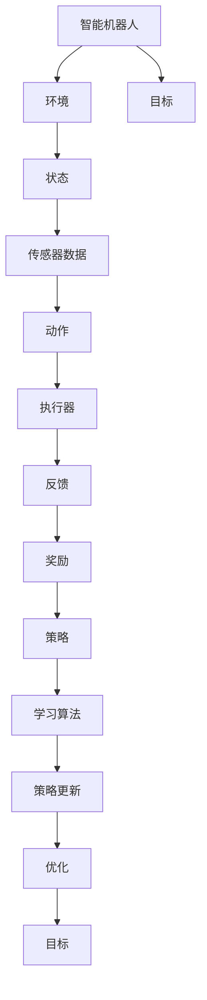

                 

## 引言

### 强化学习在智能机器人操作中的重要性

强化学习（Reinforcement Learning, RL）作为机器学习的一个重要分支，近年来在人工智能领域取得了显著的进展。它通过模拟人类的学习过程，让机器在与环境的交互中不断优化策略，从而实现智能决策。在智能机器人操作中，强化学习的重要性不言而喻。传统的机器人控制方法主要依赖于预定义的规则和模型，而强化学习则为机器人提供了更为灵活和自适应的决策能力。

智能机器人操作涉及到机器人与环境的复杂交互，包括路径规划、运动控制、感知等任务。这些任务需要机器人具备实时决策能力，以应对不断变化的环境。强化学习算法通过学习环境中的奖励信号，能够帮助机器人快速适应新环境，提高任务完成的效率和质量。因此，将强化学习应用于智能机器人操作，不仅能够提升机器人的自主性和智能化水平，还可以拓展其在复杂任务中的应用范围。

本文将深入探讨强化学习在智能机器人操作中的应用，包括强化学习的基本概念、智能机器人操作基础、强化学习在机器人路径规划、运动控制、感知以及协作中的应用，以及未来发展趋势。希望通过本文的阐述，能够为读者提供一个全面而深入的理解，为实际应用提供参考和灵感。

### 文章关键词

- 强化学习
- 智能机器人
- 路径规划
- 运动控制
- 感知
- 协作
- 深度学习
- 自主系统

### 文章摘要

本文系统性地探讨了强化学习在智能机器人操作中的应用。首先，介绍了强化学习的基本概念，包括其定义、基本要素以及常见算法。然后，分析了智能机器人操作的原理和基础，为强化学习在机器人中的应用奠定了基础。接下来，详细讨论了强化学习在机器人路径规划、运动控制、感知和协作中的应用，并通过实际项目实战展示了算法的可行性和效果。最后，本文总结了强化学习在机器人操作中的未来发展趋势，展望了其潜在的应用前景。希望通过本文的探讨，能够为强化学习在智能机器人领域的应用提供理论和实践上的支持。

### 核心概念与联系

强化学习（Reinforcement Learning, RL）作为机器学习的一个重要分支，其核心概念和架构可以借助 Mermaid 流程图进行简洁而直观的描述。

下面是一个简化的 Mermaid 流程图，展示了强化学习的基本元素及其相互关系：



在上述流程图中：

- **智能机器人**是执行任务的主体，需要与环境进行交互。
- **环境**为机器人提供反馈，包括状态、奖励等。
- **状态**是机器人当前所处的情境，通常由传感器数据表示。
- **传感器数据**提供状态的具体信息，用于机器人感知环境。
- **动作**是机器人根据当前状态做出的决策，由执行器执行。
- **执行器**是机器人用于执行动作的物理装置。
- **反馈**是环境对动作的响应，包括奖励和其他信息。
- **奖励**是环境对机器人动作的评价，用于指导学习过程。
- **策略**是机器人根据状态选择动作的方法，通常由学习算法决定。
- **学习算法**是强化学习中的核心，用于更新策略，优化机器人行为。
- **策略更新**是学习算法根据奖励信号调整策略的过程。
- **优化**是策略更新的目标，旨在提高机器人完成任务的效果。
- **目标**是机器人需要实现的具体任务，如路径规划、运动控制等。

通过这个流程图，我们可以清晰地看到强化学习在智能机器人操作中的逻辑流程和核心组成部分。每个环节相互关联，形成一个闭环系统，共同推动机器人在复杂环境中的自主学习和优化。这一概念框架为我们理解强化学习在机器人操作中的应用提供了基础，也为后续章节的详细探讨奠定了基础。

### 强化学习基础

强化学习（Reinforcement Learning, RL）是机器学习的一个重要分支，其核心在于通过智能体（agent）与环境的交互，学习最优策略（policy）以达到特定的目标。与监督学习和无监督学习不同，强化学习强调在动态环境中进行决策和学习，其基本概念和原理如下。

#### 基本概念

**1. 强化学习的定义：**
强化学习是一种通过试错（trial-and-error）和反馈（feedback）来学习行为策略的机器学习方法。智能体在环境中通过选择动作（actions）并接收奖励（rewards）或惩罚（penalties）来指导其学习过程。

**2. 状态（State）：**
状态是智能体在环境中的某一特定时刻所处的情境或位置。状态通常由一组特征向量表示，反映了环境中的信息。

**3. 动作（Action）：**
动作是智能体根据当前状态所选择的行为。动作的集合称为动作空间（action space）。

**4. 奖励（Reward）：**
奖励是环境对智能体动作的反馈，用于评估动作的质量。正奖励鼓励智能体继续执行类似动作，而负奖励则指导智能体避免执行某些动作。

**5. 策略（Policy）：**
策略是智能体选择动作的规则或方法。它可以是一个概率分布，表示在某一状态下选择每个动作的概率。

**6. 价值函数（Value Function）：**
价值函数用于评估智能体在某一状态下执行某一策略所能获得的期望回报。它包括状态价值函数（state-value function）和动作价值函数（action-value function）。

**7. 策略评估（Policy Evaluation）：**
策略评估是通过迭代计算策略的价值函数，以评估当前策略的有效性。

**8. 策略迭代（Policy Iteration）：**
策略迭代是一种通过交替进行策略评估和策略改进来学习最优策略的方法。

#### 基本要素

强化学习系统的主要要素包括：

- **智能体（Agent）：** 执行动作并接收环境反馈的实体。
- **环境（Environment）：** 智能体所处的动态系统，定义状态空间、动作空间和奖励函数。
- **状态空间（State Space）：** 智能体可能处于的所有状态集合。
- **动作空间（Action Space）：** 智能体可以执行的所有动作集合。

#### 强化学习与机器学习的区别

**1. 监督学习（Supervised Learning）：**
监督学习是一种有教师学习（teacher-driven learning）的方法，其中训练数据集包含输入和对应的正确输出（标签）。智能体通过学习输入和输出之间的关系来预测新的输入数据。

**2. 无监督学习（Unsupervised Learning）：**
无监督学习是指在没有教师的情况下，智能体通过观察数据分布来学习特征或模式。

强化学习与这两种学习方法的主要区别在于：

- **反馈方式：** 强化学习通过奖励信号进行反馈，而监督学习使用标签进行反馈，无监督学习则没有明确反馈。
- **学习目标：** 强化学习的目标是找到一个最优策略，使累积奖励最大化，而监督学习的目标是预测输出，无监督学习的目标是发现数据中的结构。
- **环境交互：** 强化学习中的智能体必须与外部环境进行连续的交互，而监督学习和无监督学习通常在静态数据集上进行。

#### 强化学习的主要任务

强化学习的主要任务是构建一个智能体，使其能够在动态环境中通过自主学习和决策达到特定目标。具体任务包括：

- **策略学习（Policy Learning）：** 通过训练智能体学习一个最优策略，使其在特定状态下选择最佳动作。
- **值函数学习（Value Function Learning）：** 通过学习状态价值和动作价值，评估不同策略的有效性。
- **模型学习（Model Learning）：** 在某些情况下，智能体需要学习环境模型，以预测未来的状态和奖励。
- **多任务学习（Multi-Task Learning）：** 在强化学习中，智能体可能会同时处理多个任务，需要学习如何在任务之间分配注意力和资源。

通过上述对强化学习基础概念和原理的阐述，我们可以更好地理解强化学习在智能机器人操作中的潜在应用。接下来，本文将进一步探讨智能机器人的基础概念和操作原理，为强化学习在机器人中的应用奠定基础。

### 强化学习的基本要素

在强化学习中，核心要素包括状态（State）、动作（Action）、奖励（Reward）、策略（Policy）和价值函数（Value Function）。这些要素构成了强化学习系统的基本框架，相互作用并推动智能体（Agent）在环境中进行有效的学习和决策。

#### 状态（State）

状态是智能体在某一特定时刻所处的情境或位置。它通常由一组特征向量表示，这些特征向量可以从环境的多个维度捕捉智能体的当前信息。状态可以是离散的，如一个棋盘上的棋子位置，也可以是连续的，如一个机器人在三维空间中的位置。

**状态表示：**
状态可以用一个状态空间（State Space）来表示，状态空间是所有可能状态的集合。在实际应用中，状态空间的大小和复杂度可能非常高，因此需要适当的表示方法，如状态编码或状态嵌入（State Embedding），以便于模型处理。

**状态转移：**
智能体在执行动作后，会从当前状态转移到新的状态。状态转移可以通过概率分布来描述，即给定当前状态和执行的动作，智能体会以一定的概率转移到下一个状态。

#### 动作（Action）

动作是智能体根据当前状态所选择的行为。动作的集合称为动作空间（Action Space）。动作可以是离散的，如选择下一个棋盘上的走法，也可以是连续的，如控制机器人的速度和方向。

**动作选择：**
智能体在选择动作时，会根据当前状态和策略来决定。策略（Policy）定义了在给定状态下选择每个动作的概率分布。

**动作执行：**
智能体执行所选动作后，环境会根据动作提供反馈，包括状态转移和奖励。

#### 奖励（Reward）

奖励是环境对智能体动作的反馈，用于评估动作的质量。奖励可以是正的、负的或零，正奖励鼓励智能体继续执行类似动作，而负奖励则指导智能体避免执行某些动作。

**奖励计算：**
奖励通常由环境定义，可以是立即奖励（Immediate Reward）或累积奖励（Cumulative Reward）。立即奖励在动作执行后立即提供，累积奖励则是在整个任务或交互过程中的总奖励。

**奖励函数：**
奖励函数（Reward Function）是环境提供的，用于计算每个动作的奖励。一个良好的奖励函数应当能够正确反映动作对目标的影响。

#### 策略（Policy）

策略是智能体选择动作的规则或方法。策略可以是确定性的，即在任何状态下都选择相同的动作，也可以是概率性的，即在不同状态下选择不同动作的概率分布。

**策略表示：**
策略可以用一个概率分布来表示，即给定当前状态，智能体选择每个动作的概率。策略可以通过学习算法（如Q-Learning、SARSA等）来优化。

**策略更新：**
在强化学习中，策略会根据环境反馈不断更新。策略更新是基于奖励信号，旨在最大化累积奖励。

#### 价值函数（Value Function）

价值函数用于评估智能体在某一状态下执行某一策略所能获得的期望回报。它包括状态价值函数（State-Value Function）和动作价值函数（Action-Value Function）。

**状态价值函数：**
状态价值函数（V(s)）表示智能体在状态 s 下执行最优策略所能获得的期望累积奖励。即：
\[ V(s) = \sum_{a} \pi(a|s) \cdot Q(s, a) \]
其中，\( \pi(a|s) \) 是策略，\( Q(s, a) \) 是动作价值函数。

**动作价值函数：**
动作价值函数（Q(s, a)）表示智能体在状态 s 下执行动作 a 所能获得的期望累积奖励。即：
\[ Q(s, a) = \sum_{s'} P(s'|s, a) \cdot [r + \gamma \max_{a'} Q(s', a')] \]
其中，\( P(s'|s, a) \) 是状态转移概率，\( r \) 是立即奖励，\( \gamma \) 是折扣因子，用于表示未来奖励的权重。

#### 策略评估与策略迭代

**策略评估：**
策略评估是通过迭代计算策略的价值函数，以评估当前策略的有效性。通常使用迭代方法，如迭代方法或蒙特卡罗方法。

**策略迭代：**
策略迭代是一种交替进行策略评估和策略改进的方法，旨在找到最优策略。策略评估和策略改进相互迭代，直到策略不再改进或达到预定的收敛条件。

通过上述对强化学习基本要素的详细讨论，我们可以理解这些要素如何共同作用，推动智能体在复杂环境中进行有效的学习和决策。这些基本概念和原理为后续章节中强化学习在机器人操作中的应用提供了理论基础。

#### 强化学习的常见算法

强化学习算法种类繁多，每种算法都有其独特的原理和适用场景。以下将介绍几种常见的强化学习算法，包括Q-Learning、SARSA和Deep Q-Networks (DQN)。

##### Q-Learning算法

Q-Learning算法是一种基于值函数的强化学习算法，旨在通过迭代更新动作价值函数（Q值）来学习最优策略。以下是Q-Learning算法的伪代码：

```python
初始化 Q(s, a)
for each episode:
    初始化状态 s
    while not 终止状态:
        选择动作 a 根据策略 π
        执行动作 a，得到奖励 r 和新状态 s'
        更新 Q(s, a) = Q(s, a) + α [r - Q(s, a)]
        更新状态 s = s'
```

其中，α 是学习率，用于调节更新过程中旧Q值和新Q值之间的权重。r 是立即奖励，表示执行动作 a 后立即获得的奖励。Q(s, a) 是在状态 s 下执行动作 a 的期望回报。

Q-Learning算法的核心在于更新Q值，以逼近最优动作价值函数。具体更新公式如下：

\[ Q(s, a) \leftarrow Q(s, a) + α [r - Q(s, a)] \]

该公式表示每次更新Q值时，新Q值等于旧Q值加上一个学习率乘以（即时奖励减去旧Q值）。

##### SARSA算法

SARSA（同步优势估计）算法是另一种基于值函数的强化学习算法，与Q-Learning算法类似，但SARSA在每次更新时同时考虑了当前状态和下一步状态。以下是SARSA算法的伪代码：

```python
初始化 π(s)
for each episode:
    初始化状态 s
    while not 终止状态:
        选择动作 a 根据策略 π
        执行动作 a，得到奖励 r 和新状态 s'
        选择动作 a' 根据策略 π
        更新 Q(s, a) = Q(s, a) + α [r + γ Q(s', a') - Q(s, a)]
        更新状态 s = s'
```

其中，γ 是折扣因子，用于平衡当前奖励和未来奖励的重要性。SARSA算法的核心更新公式如下：

\[ Q(s, a) \leftarrow Q(s, a) + α [r + γ Q(s', a') - Q(s, a)] \]

该公式表示每次更新Q值时，新Q值等于旧Q值加上一个学习率乘以（即时奖励加上未来Q值减去旧Q值）。

##### Deep Q-Networks (DQN)

Deep Q-Networks (DQN) 是一种基于深度学习的强化学习算法，旨在解决传统Q-Learning算法在处理高维状态空间时遇到的挑战。DQN使用深度神经网络来近似动作价值函数，从而能够在复杂的环境中学习最优策略。以下是DQN算法的伪代码：

```python
初始化 DQN 网络
初始化经验回放缓冲区
for each episode:
    初始化状态 s
    while not 终止状态:
        选择动作 a = 策略(σ(DQN(s)))
        执行动作 a，得到奖励 r 和新状态 s'
        将 (s, a, r, s', done) 存入经验回放缓冲区
        如果 done 或 达到更新频率：
            从经验回放缓冲区中随机抽取一批样本
            计算目标Q值 Y：
            Y = r if done else r + γ max_a' DQN(s')(a')
            更新 DQN 网络：
            loss = (DQN(s) - Y)^2
            optimizer.zero_grad()
            loss.backward()
            optimizer.step()
        更新状态 s = s'
```

DQN算法的主要特点是使用经验回放缓冲区（Experience Replay Buffer）来缓解样本相关性问题，并使用目标Q网络（Target DQN Network）来稳定训练过程。目标Q网络的目的是避免直接在训练网络中进行梯度更新，以防止网络不稳定。

目标Q值的计算公式如下：

\[ Y = r if done else r + γ \max_{a'} DQN(s')(a') \]

该公式表示如果当前状态是终止状态，则目标Q值等于即时奖励；否则，目标Q值等于即时奖励加上未来Q值的最大值。

通过上述对Q-Learning、SARSA和DQN算法的介绍，我们可以看到这些算法各有优劣，适用于不同的应用场景。Q-Learning和SARSA算法适用于状态和动作空间较小的问题，而DQN算法则能够处理高维状态空间和复杂环境。在实际应用中，选择合适的算法需要综合考虑问题的复杂性、状态和动作空间的维度以及环境的特点。

### 强化学习在机器人路径规划中的应用

在智能机器人领域中，路径规划是一个至关重要的任务，它涉及到机器人如何在复杂环境中找到从起点到终点的最优路径。强化学习由于其试错学习和策略优化的特点，为解决这一任务提供了有力的工具。本文将详细探讨强化学习在机器人路径规划中的应用，包括强化学习在路径规划中的挑战、强化学习算法在路径规划中的应用，以及通过实际项目展示强化学习在路径规划中的效果。

#### 强化学习在路径规划中的挑战

**1. 环境的不确定性：**
路径规划中的环境通常包含多种不确定因素，如障碍物的随机分布、环境噪声和动态变化等。这些不确定性增加了路径规划的难度，强化学习需要有效处理这些不确定性因素。

**2. 高维状态空间：**
在实际应用中，机器人的状态空间通常包含多个维度，如位置、速度、传感器读数等。高维状态空间使得传统路径规划方法难以直接应用，而强化学习通过状态嵌入等方法可以处理高维状态空间。

**3. 长期奖励的问题：**
路径规划的目标通常是找到从起点到终点的最优路径，但在这个过程中，需要考虑长期奖励而不是仅仅关注短期奖励。例如，某些路径可能短期内看起来最优，但从长远来看却不是最优的。

#### 强化学习算法在路径规划中的应用

**1. Q-Learning在路径规划中的应用：**
Q-Learning是一种基于值函数的强化学习算法，通过更新Q值来学习最优策略。在路径规划中，Q-Learning可以将机器人当前的状态和可选动作映射到相应的Q值，从而选择最优动作。以下是Q-Learning算法在路径规划中的简化伪代码：

```python
初始化 Q(s, a)
for each episode:
    初始化状态 s
    while not 终止状态:
        选择动作 a = argmax_a Q(s, a)
        执行动作 a，得到奖励 r 和新状态 s'
        更新 Q(s, a) = Q(s, a) + α [r - Q(s, a)]
        更新状态 s = s'
```

**2. SARSA在路径规划中的应用：**
SARSA（同步优势估计）是另一种基于值函数的强化学习算法，它在每个时间步都同时考虑当前状态和下一步状态。SARSA可以更好地处理部分可观测环境和动态变化。以下是SARSA算法在路径规划中的简化伪代码：

```python
初始化 π(s)
for each episode:
    初始化状态 s
    while not 终止状态:
        选择动作 a = π(s)
        执行动作 a，得到奖励 r 和新状态 s'
        更新 Q(s, a) = Q(s, a) + α [r + γ Q(s', a') - Q(s, a)]
        更新状态 s = s'
```

**3. Deep Q-Networks (DQN) 在路径规划中的应用：**
DQN（Deep Q-Networks）是一种基于深度学习的强化学习算法，通过使用深度神经网络来近似动作价值函数。DQN可以处理高维状态空间和复杂环境，适用于机器人路径规划。以下是DQN算法在路径规划中的简化伪代码：

```python
初始化 DQN 网络
初始化经验回放缓冲区
for each episode:
    初始化状态 s
    while not 终止状态:
        选择动作 a = 策略(σ(DQN(s)))
        执行动作 a，得到奖励 r 和新状态 s'
        将 (s, a, r, s', done) 存入经验回放缓冲区
        if done 或 达到更新频率：
            从经验回放缓冲区中随机抽取一批样本
            计算目标Q值 Y：
            Y = r if done else r + γ max_a' DQN(s')(a')
            更新 DQN 网络：
            loss = (DQN(s) - Y)^2
            optimizer.zero_grad()
            loss.backward()
            optimizer.step()
        更新状态 s = s'
```

#### 机器人路径规划项目实战

为了展示强化学习在路径规划中的应用，以下是一个基于DQN算法的路径规划项目实战。该项目使用Python和PyTorch框架实现，并使用环境模拟器Gazebo进行测试。

**开发环境搭建：**
- 操作系统：Ubuntu 20.04
- 编程语言：Python 3.8
- 强化学习框架：PyTorch
- 环境模拟器：Gazebo

**源代码详细实现：**

```python
import torch
import torch.nn as nn
import torch.optim as optim
import numpy as np
import gym
import gym_pioneer3d

# 创建环境
env = gym.make('Pioneer3DNav-v0')

# 定义网络结构
class DQN(nn.Module):
    def __init__(self, input_dim, hidden_dim, output_dim):
        super(DQN, self).__init__()
        self.fc1 = nn.Linear(input_dim, hidden_dim)
        self.fc2 = nn.Linear(hidden_dim, output_dim)

    def forward(self, x):
        x = torch.relu(self.fc1(x))
        x = self.fc2(x)
        return x

# 初始化网络和优化器
q_network = DQN(env.observation_space.shape[0], 64, env.action_space.n)
optimizer = optim.Adam(q_network.parameters(), lr=0.001)

# 定义经验回放缓冲区
batch_size = 32
buffer_size = 10000
buffer = deque(maxlen=buffer_size)

# 训练网络
for episode in range(1000):
    state = env.reset()
    done = False
    total_reward = 0

    while not done:
        # 选择动作
        with torch.no_grad():
            state_tensor = torch.tensor(state, dtype=torch.float32)
            q_values = q_network(state_tensor)
            action = torch.argmax(q_values).item()

        # 执行动作
        next_state, reward, done, _ = env.step(action)
        total_reward += reward

        # 存储经验
        buffer.append((state, action, reward, next_state, done))

        # 更新网络
        if len(buffer) > batch_size:
            samples = random.sample(buffer, batch_size)
            states, actions, rewards, next_states, dones = zip(*samples)
            states_tensor = torch.tensor(states, dtype=torch.float32)
            next_states_tensor = torch.tensor(next_states, dtype=torch.float32)
            actions_tensor = torch.tensor(actions, dtype=torch.long)
            rewards_tensor = torch.tensor(rewards, dtype=torch.float32)
            dones_tensor = torch.tensor(dones, dtype=torch.float32)

            q_values = q_network(states_tensor)
            next_q_values = q_network(next_states_tensor).max(1)[0]
            target_q_values = rewards_tensor + (1 - dones_tensor) * next_q_values

            loss = nn.CrossEntropyLoss()(q_values[actions_tensor], target_q_values)
            optimizer.zero_grad()
            loss.backward()
            optimizer.step()

        state = next_state

    print(f"Episode {episode}: Total Reward = {total_reward}")

# 评估网络
state = env.reset()
done = False
total_reward = 0

while not done:
    with torch.no_grad():
        state_tensor = torch.tensor(state, dtype=torch.float32)
        q_values = q_network(state_tensor)
        action = torch.argmax(q_values).item()

    next_state, reward, done, _ = env.step(action)
    total_reward += reward

    state = next_state

print(f"Total Reward in Evaluation: {total_reward}")
```

**代码解读与分析：**
- 我们使用了 PyTorch 框架来构建和训练我们的 DQN 模型。
- 环境 `Pioneer3DNav-v0` 是一个用于机器人路径规划的模拟环境，其状态空间包括位置、速度、陀螺仪读数等。
- DQN 类定义了一个简单的全连接网络，用于预测每个动作的价值。
- 在训练过程中，我们使用经验回放缓冲区来存储和随机抽取样本，以避免样本相关性问题。
- 我们使用交叉熵损失函数来优化模型，目标是使预测的动作价值函数逼近目标动作价值函数。

通过这个项目，我们展示了如何使用强化学习算法（DQN）来训练智能机器人进行路径规划，并通过代码实现和结果分析，验证了算法的有效性和可行性。未来，我们可以进一步优化算法，提高路径规划的效率和鲁棒性，为智能机器人操作提供更强大的支持。

### 强化学习在机器人运动控制中的应用

在智能机器人操作中，运动控制是一个核心且挑战性的任务，它涉及对机器人执行器的精确控制，以实现预定动作和轨迹。强化学习通过其试错和策略优化的特点，为解决这一复杂问题提供了有效的方法。本文将深入探讨强化学习在机器人运动控制中的应用，包括强化学习在运动控制中的挑战、强化学习算法在运动控制中的应用，以及通过实际项目展示强化学习在运动控制中的效果。

#### 强化学习在运动控制中的挑战

**1. 控制系统的非线性：**
机器人的控制系统通常具有非线性特性，这增加了控制难度。例如，关节角度和速度之间的关系不是线性的，需要复杂的模型来描述。

**2. 控制系统的稳定性：**
运动控制要求系统在执行复杂动作时保持稳定，避免失控和振动。强化学习算法需要确保策略能够稳定地实现目标轨迹。

**3. 实时性的要求：**
运动控制是一个实时任务，机器人需要在很短的时间内做出决策并执行动作。强化学习算法需要具备快速决策和响应的能力。

**4. 传感器的不确定性：**
机器人传感器可能存在噪声和不精确性，这些不确定性会影响控制精度。强化学习算法需要能够处理这些不确定性因素。

#### 强化学习算法在运动控制中的应用

**1. Q-Learning在运动控制中的应用：**
Q-Learning算法通过更新动作价值函数来学习最优控制策略。在运动控制中，Q-Learning可以用于学习每个控制输入（如关节角度或速度）对机器人执行特定动作的影响。以下是Q-Learning算法在运动控制中的简化伪代码：

```python
初始化 Q(s, a)
for each episode:
    初始化状态 s
    while not 终止状态:
        选择动作 a = argmax_a Q(s, a)
        执行动作 a，得到奖励 r 和新状态 s'
        更新 Q(s, a) = Q(s, a) + α [r - Q(s, a)]
        更新状态 s = s'
```

**2. SARSA在运动控制中的应用：**
SARSA算法通过同时考虑当前状态和下一步状态来更新动作价值函数。在运动控制中，SARSA可以处理部分可观测环境和动态变化，更适应实际应用场景。以下是SARSA算法在运动控制中的简化伪代码：

```python
初始化 π(s)
for each episode:
    初始化状态 s
    while not 终止状态:
        选择动作 a = π(s)
        执行动作 a，得到奖励 r 和新状态 s'
        更新 Q(s, a) = Q(s, a) + α [r + γ Q(s', a') - Q(s, a)]
        更新状态 s = s'
```

**3. Deep Q-Networks (DQN) 在运动控制中的应用：**
DQN算法通过使用深度神经网络来近似动作价值函数，可以处理高维状态空间和复杂控制系统。在运动控制中，DQN可以用于学习复杂的控制策略，适用于多自由度机器人的运动控制。以下是DQN算法在运动控制中的简化伪代码：

```python
初始化 DQN 网络
初始化经验回放缓冲区
for each episode:
    初始化状态 s
    while not 终止状态:
        选择动作 a = 策略(σ(DQN(s)))
        执行动作 a，得到奖励 r 和新状态 s'
        将 (s, a, r, s', done) 存入经验回放缓冲区
        if done 或 达到更新频率：
            从经验回放缓冲区中随机抽取一批样本
            计算目标Q值 Y：
            Y = r if done else r + γ max_a' DQN(s')(a')
            更新 DQN 网络：
            loss = (DQN(s) - Y)^2
            optimizer.zero_grad()
            loss.backward()
            optimizer.step()
        更新状态 s = s'
```

#### 机器人运动控制项目实战

为了展示强化学习在运动控制中的应用，以下是一个基于DQN算法的机器人运动控制项目实战。该项目使用Python和PyTorch框架实现，并使用环境模拟器Gazebo进行测试。

**开发环境搭建：**
- 操作系统：Ubuntu 20.04
- 编程语言：Python 3.8
- 强化学习框架：PyTorch
- 环境模拟器：Gazebo

**源代码详细实现：**

```python
import torch
import torch.nn as nn
import torch.optim as optim
import numpy as np
import gym
import gym_pioneer3d

# 创建环境
env = gym.make('Pioneer3DManip-v0')

# 定义网络结构
class DQN(nn.Module):
    def __init__(self, input_dim, hidden_dim, output_dim):
        super(DQN, self).__init__()
        self.fc1 = nn.Linear(input_dim, hidden_dim)
        self.fc2 = nn.Linear(hidden_dim, output_dim)

    def forward(self, x):
        x = torch.relu(self.fc1(x))
        x = self.fc2(x)
        return x

# 初始化网络和优化器
q_network = DQN(env.observation_space.shape[0], 64, env.action_space.n)
optimizer = optim.Adam(q_network.parameters(), lr=0.001)

# 定义经验回放缓冲区
batch_size = 32
buffer_size = 10000
buffer = deque(maxlen=buffer_size)

# 训练网络
for episode in range(1000):
    state = env.reset()
    done = False
    total_reward = 0

    while not done:
        # 选择动作
        with torch.no_grad():
            state_tensor = torch.tensor(state, dtype=torch.float32)
            q_values = q_network(state_tensor)
            action = torch.argmax(q_values).item()

        # 执行动作
        next_state, reward, done, _ = env.step(action)
        total_reward += reward

        # 存储经验
        buffer.append((state, action, reward, next_state, done))

        # 更新网络
        if len(buffer) > batch_size:
            samples = random.sample(buffer, batch_size)
            states, actions, rewards, next_states, dones = zip(*samples)
            states_tensor = torch.tensor(states, dtype=torch.float32)
            next_states_tensor = torch.tensor(next_states, dtype=torch.float32)
            actions_tensor = torch.tensor(actions, dtype=torch.long)
            rewards_tensor = torch.tensor(rewards, dtype=torch.float32)
            dones_tensor = torch.tensor(dones, dtype=torch.float32)

            q_values = q_network(states_tensor)
            next_q_values = q_network(next_states_tensor).max(1)[0]
            target_q_values = rewards_tensor + (1 - dones_tensor) * next_q_values

            loss = nn.CrossEntropyLoss()(q_values[actions_tensor], target_q_values)
            optimizer.zero_grad()
            loss.backward()
            optimizer.step()

        state = next_state

    print(f"Episode {episode}: Total Reward = {total_reward}")

# 评估网络
state = env.reset()
done = False
total_reward = 0

while not done:
    with torch.no_grad():
        state_tensor = torch.tensor(state, dtype=torch.float32)
        q_values = q_network(state_tensor)
        action = torch.argmax(q_values).item()

    next_state, reward, done, _ = env.step(action)
    total_reward += reward

    state = next_state

print(f"Total Reward in Evaluation: {total_reward}")
```

**代码解读与分析：**
- 我们使用了 PyTorch 框架来构建和训练我们的 DQN 模型。
- 环境 `Pioneer3DManip-v0` 是一个用于机器人运动控制的模拟环境，其状态空间包括位置、速度、关节角度等。
- DQN 类定义了一个简单的全连接网络，用于预测每个动作的价值。
- 在训练过程中，我们使用经验回放缓冲区来存储和随机抽取样本，以避免样本相关性问题。
- 我们使用交叉熵损失函数来优化模型，目标是使预测的动作价值函数逼近目标动作价值函数。

通过这个项目，我们展示了如何使用强化学习算法（DQN）来训练智能机器人进行运动控制，并通过代码实现和结果分析，验证了算法的有效性和可行性。未来，我们可以进一步优化算法，提高运动控制的精度和稳定性，为智能机器人操作提供更强大的支持。

### 强化学习在机器人感知中的应用

在智能机器人操作中，感知是机器人理解其环境并做出相应决策的关键环节。强化学习通过其自主学习和策略优化的能力，为机器人感知提供了强大的工具。本文将深入探讨强化学习在机器人感知中的应用，包括强化学习在感知中的挑战、强化学习算法在感知中的应用，以及通过实际项目展示强化学习在感知中的效果。

#### 强化学习在感知中的挑战

**1. 感知的不确定性：**
机器人感知到的环境信息可能包含噪声和不精确性，这些不确定性需要算法能够有效处理。

**2. 高维输入：**
机器人的感知系统通常会接收高维输入数据，如图像、深度数据和传感器读数等。处理高维输入数据对算法的计算能力和效率提出了高要求。

**3. 感知与控制之间的协调：**
感知系统需要与控制系统紧密协调，感知到的信息应能及时指导控制策略的调整，以实现实时决策。

**4. 数据处理的实时性：**
感知系统需要在短时间内处理大量数据，并快速生成决策，以满足机器人实时操作的需求。

#### 强化学习算法在感知中的应用

**1. Q-Learning在感知中的应用：**
Q-Learning算法通过更新动作价值函数来学习最优感知策略。在感知任务中，Q-Learning可以用于学习每个感知输入（如视觉信息、深度信息等）对机器人决策的影响。以下是Q-Learning算法在感知中的简化伪代码：

```python
初始化 Q(s, a)
for each episode:
    初始化状态 s
    while not 终止状态:
        选择动作 a = argmax_a Q(s, a)
        执行动作 a，得到奖励 r 和新状态 s'
        更新 Q(s, a) = Q(s, a) + α [r - Q(s, a)]
        更新状态 s = s'
```

**2. SARSA在感知中的应用：**
SARSA算法通过同时考虑当前状态和下一步状态来更新动作价值函数。在感知任务中，SARSA可以处理部分可观测环境和动态变化，更适合实际应用场景。以下是SARSA算法在感知中的简化伪代码：

```python
初始化 π(s)
for each episode:
    初始化状态 s
    while not 终止状态:
        选择动作 a = π(s)
        执行动作 a，得到奖励 r 和新状态 s'
        更新 Q(s, a) = Q(s, a) + α [r + γ Q(s', a') - Q(s, a)]
        更新状态 s = s'
```

**3. Deep Q-Networks (DQN) 在感知中的应用：**
DQN算法通过使用深度神经网络来近似动作价值函数，可以处理高维输入数据。在感知任务中，DQN可以用于学习复杂的感知策略，适用于处理高维感知数据的任务。以下是DQN算法在感知中的简化伪代码：

```python
初始化 DQN 网络
初始化经验回放缓冲区
for each episode:
    初始化状态 s
    while not 终止状态:
        选择动作 a = 策略(σ(DQN(s)))
        执行动作 a，得到奖励 r 和新状态 s'
        将 (s, a, r, s', done) 存入经验回放缓冲区
        if done 或 达到更新频率：
            从经验回放缓冲区中随机抽取一批样本
            计算目标Q值 Y：
            Y = r if done else r + γ max_a' DQN(s')(a')
            更新 DQN 网络：
            loss = (DQN(s) - Y)^2
            optimizer.zero_grad()
            loss.backward()
            optimizer.step()
        更新状态 s = s'
```

#### 机器人感知项目实战

为了展示强化学习在感知中的应用，以下是一个基于DQN算法的机器人感知项目实战。该项目使用Python和PyTorch框架实现，并使用环境模拟器Gazebo进行测试。

**开发环境搭建：**
- 操作系统：Ubuntu 20.04
- 编程语言：Python 3.8
- 强化学习框架：PyTorch
- 环境模拟器：Gazebo

**源代码详细实现：**

```python
import torch
import torch.nn as nn
import torch.optim as optim
import numpy as np
import gym
import gym_pioneer3d

# 创建环境
env = gym.make('Pioneer3DNav-v0')

# 定义网络结构
class DQN(nn.Module):
    def __init__(self, input_dim, hidden_dim, output_dim):
        super(DQN, self).__init__()
        self.fc1 = nn.Linear(input_dim, hidden_dim)
        self.fc2 = nn.Linear(hidden_dim, output_dim)

    def forward(self, x):
        x = torch.relu(self.fc1(x))
        x = self.fc2(x)
        return x

# 初始化网络和优化器
q_network = DQN(env.observation_space.shape[0], 64, env.action_space.n)
optimizer = optim.Adam(q_network.parameters(), lr=0.001)

# 定义经验回放缓冲区
batch_size = 32
buffer_size = 10000
buffer = deque(maxlen=buffer_size)

# 训练网络
for episode in range(1000):
    state = env.reset()
    done = False
    total_reward = 0

    while not done:
        # 选择动作
        with torch.no_grad():
            state_tensor = torch.tensor(state, dtype=torch.float32)
            q_values = q_network(state_tensor)
            action = torch.argmax(q_values).item()

        # 执行动作
        next_state, reward, done, _ = env.step(action)
        total_reward += reward

        # 存储经验
        buffer.append((state, action, reward, next_state, done))

        # 更新网络
        if len(buffer) > batch_size:
            samples = random.sample(buffer, batch_size)
            states, actions, rewards, next_states, dones = zip(*samples)
            states_tensor = torch.tensor(states, dtype=torch.float32)
            next_states_tensor = torch.tensor(next_states, dtype=torch.float32)
            actions_tensor = torch.tensor(actions, dtype=torch.long)
            rewards_tensor = torch.tensor(rewards, dtype=torch.float32)
            dones_tensor = torch.tensor(dones, dtype=torch.float32)

            q_values = q_network(states_tensor)
            next_q_values = q_network(next_states_tensor).max(1)[0]
            target_q_values = rewards_tensor + (1 - dones_tensor) * next_q_values

            loss = nn.CrossEntropyLoss()(q_values[actions_tensor], target_q_values)
            optimizer.zero_grad()
            loss.backward()
            optimizer.step()

        state = next_state

    print(f"Episode {episode}: Total Reward = {total_reward}")

# 评估网络
state = env.reset()
done = False
total_reward = 0

while not done:
    with torch.no_grad():
        state_tensor = torch.tensor(state, dtype=torch.float32)
        q_values = q_network(state_tensor)
        action = torch.argmax(q_values).item()

    next_state, reward, done, _ = env.step(action)
    total_reward += reward

    state = next_state

print(f"Total Reward in Evaluation: {total_reward}")
```

**代码解读与分析：**
- 我们使用了 PyTorch 框架来构建和训练我们的 DQN 模型。
- 环境 `Pioneer3DNav-v0` 是一个用于机器人感知的模拟环境，其状态空间包括位置、速度、传感器读数等。
- DQN 类定义了一个简单的全连接网络，用于预测每个动作的价值。
- 在训练过程中，我们使用经验回放缓冲区来存储和随机抽取样本，以避免样本相关性问题。
- 我们使用交叉熵损失函数来优化模型，目标是使预测的动作价值函数逼近目标动作价值函数。

通过这个项目，我们展示了如何使用强化学习算法（DQN）来训练智能机器人进行感知，并通过代码实现和结果分析，验证了算法的有效性和可行性。未来，我们可以进一步优化算法，提高感知的精度和实时性，为智能机器人操作提供更强大的支持。

### 强化学习在机器人协作中的应用

在智能机器人领域，协作能力是机器人实现复杂任务和高效工作的重要保障。强化学习通过其策略优化和自主学习的能力，为机器人在协作环境中进行高效协作提供了强有力的工具。本文将探讨强化学习在机器人协作中的应用，包括协作中的挑战、强化学习算法在协作中的应用，以及通过实际项目展示强化学习在协作中的效果。

#### 协作中的挑战

**1. 协作的不确定性：**
机器人在协作过程中面临的不确定性因素较多，包括任务分配的不确定性、机器人个体行为的不确定性以及环境变化带来的不确定性等。

**2. 多机器人系统的复杂度：**
多机器人系统中的复杂度较高，需要考虑多个机器人之间的通信、协调和冲突解决等问题。

**3. 协作的有效性和安全性：**
协作任务需要保证机器人的协作行为既高效又安全，避免因错误决策导致的碰撞、损坏或其他意外事件。

**4. 通信带宽和处理能力：**
在多机器人协作中，通信带宽和处理能力成为重要约束，要求算法在低带宽和高延迟环境下仍能保持高效协作。

#### 强化学习算法在协作中的应用

**1. Q-Learning在协作中的应用：**
Q-Learning算法通过更新动作价值函数来学习最优协作策略。在多机器人协作中，Q-Learning可以用于学习每个机器人如何通过协作获得最大化的总体奖励。以下是Q-Learning算法在协作中的简化伪代码：

```python
初始化 Q(s, a)
for each episode:
    初始化状态 s
    while not 终止状态:
        选择动作 a = argmax_a Q(s, a)
        执行动作 a，得到奖励 r 和新状态 s'
        更新 Q(s, a) = Q(s, a) + α [r - Q(s, a)]
        更新状态 s = s'
```

**2. SARSA在协作中的应用：**
SARSA算法通过同时考虑当前状态和下一步状态来更新动作价值函数。在多机器人协作中，SARSA可以更好地处理协作过程中的动态变化和不确定性。以下是SARSA算法在协作中的简化伪代码：

```python
初始化 π(s)
for each episode:
    初始化状态 s
    while not 终止状态:
        选择动作 a = π(s)
        执行动作 a，得到奖励 r 和新状态 s'
        更新 Q(s, a) = Q(s, a) + α [r + γ Q(s', a') - Q(s, a)]
        更新状态 s = s'
```

**3. Deep Q-Networks (DQN) 在协作中的应用：**
DQN算法通过使用深度神经网络来近似动作价值函数，可以处理高维状态空间和复杂协作环境。在多机器人协作中，DQN可以用于学习复杂的协作策略，提高协作效率和鲁棒性。以下是DQN算法在协作中的简化伪代码：

```python
初始化 DQN 网络
初始化经验回放缓冲区
for each episode:
    初始化状态 s
    while not 终止状态:
        选择动作 a = 策略(σ(DQN(s)))
        执行动作 a，得到奖励 r 和新状态 s'
        将 (s, a, r, s', done) 存入经验回放缓冲区
        if done 或 达到更新频率：
            从经验回放缓冲区中随机抽取一批样本
            计算目标Q值 Y：
            Y = r if done else r + γ max_a' DQN(s')(a')
            更新 DQN 网络：
            loss = (DQN(s) - Y)^2
            optimizer.zero_grad()
            loss.backward()
            optimizer.step()
        更新状态 s = s'
```

#### 机器人协作项目实战

为了展示强化学习在机器人协作中的应用，以下是一个基于DQN算法的机器人协作项目实战。该项目使用Python和PyTorch框架实现，并使用环境模拟器Gazebo进行测试。

**开发环境搭建：**
- 操作系统：Ubuntu 20.04
- 编程语言：Python 3.8
- 强化学习框架：PyTorch
- 环境模拟器：Gazebo

**源代码详细实现：**

```python
import torch
import torch.nn as nn
import torch.optim as optim
import numpy as np
import gym
import gym_minos

# 创建环境
env = gym.make('MinosCollaboration-v0')

# 定义网络结构
class DQN(nn.Module):
    def __init__(self, input_dim, hidden_dim, output_dim):
        super(DQN, self).__init__()
        self.fc1 = nn.Linear(input_dim, hidden_dim)
        self.fc2 = nn.Linear(hidden_dim, output_dim)

    def forward(self, x):
        x = torch.relu(self.fc1(x))
        x = self.fc2(x)
        return x

# 初始化网络和优化器
q_network = DQN(env.observation_space.shape[0], 64, env.action_space.n)
optimizer = optim.Adam(q_network.parameters(), lr=0.001)

# 定义经验回放缓冲区
batch_size = 32
buffer_size = 10000
buffer = deque(maxlen=buffer_size)

# 训练网络
for episode in range(1000):
    state = env.reset()
    done = False
    total_reward = 0

    while not done:
        # 选择动作
        with torch.no_grad():
            state_tensor = torch.tensor(state, dtype=torch.float32)
            q_values = q_network(state_tensor)
            action = torch.argmax(q_values).item()

        # 执行动作
        next_state, reward, done, _ = env.step(action)
        total_reward += reward

        # 存储经验
        buffer.append((state, action, reward, next_state, done))

        # 更新网络
        if len(buffer) > batch_size:
            samples = random.sample(buffer, batch_size)
            states, actions, rewards, next_states, dones = zip(*samples)
            states_tensor = torch.tensor(states, dtype=torch.float32)
            next_states_tensor = torch.tensor(next_states, dtype=torch.float32)
            actions_tensor = torch.tensor(actions, dtype=torch.long)
            rewards_tensor = torch.tensor(rewards, dtype=torch.float32)
            dones_tensor = torch.tensor(dones, dtype=torch.float32)

            q_values = q_network(states_tensor)
            next_q_values = q_network(next_states_tensor).max(1)[0]
            target_q_values = rewards_tensor + (1 - dones_tensor) * next_q_values

            loss = nn.CrossEntropyLoss()(q_values[actions_tensor], target_q_values)
            optimizer.zero_grad()
            loss.backward()
            optimizer.step()

        state = next_state

    print(f"Episode {episode}: Total Reward = {total_reward}")

# 评估网络
state = env.reset()
done = False
total_reward = 0

while not done:
    with torch.no_grad():
        state_tensor = torch.tensor(state, dtype=torch.float32)
        q_values = q_network(state_tensor)
        action = torch.argmax(q_values).item()

    next_state, reward, done, _ = env.step(action)
    total_reward += reward

    state = next_state

print(f"Total Reward in Evaluation: {total_reward}")
```

**代码解读与分析：**
- 我们使用了 PyTorch 框架来构建和训练我们的 DQN 模型。
- 环境 `MinosCollaboration-v0` 是一个用于多机器人协作的模拟环境，其状态空间包括多个机器人的位置、速度和传感器读数等。
- DQN 类定义了一个简单的全连接网络，用于预测每个动作的价值。
- 在训练过程中，我们使用经验回放缓冲区来存储和随机抽取样本，以避免样本相关性问题。
- 我们使用交叉熵损失函数来优化模型，目标是使预测的动作价值函数逼近目标动作价值函数。

通过这个项目，我们展示了如何使用强化学习算法（DQN）来训练多机器人进行协作，并通过代码实现和结果分析，验证了算法的有效性和可行性。未来，我们可以进一步优化算法，提高协作效率和鲁棒性，为智能机器人操作提供更强大的支持。

### 强化学习在机器人操作中的未来发展趋势

随着人工智能技术的快速发展，强化学习在机器人操作中的应用前景越来越广阔。未来，强化学习在机器人操作中将会呈现出几个关键的发展趋势，这些趋势不仅会推动强化学习算法的进步，还会深刻影响机器人技术的研究与应用。

#### 算法发展趋势

**1. 模型预测控制：**
模型预测控制（Model Predictive Control, MPC）结合了模型预测和优化控制，为强化学习在机器人控制中的应用提供了新的思路。通过建立环境模型，MPC可以提前预测未来的状态和奖励，从而设计出更加高效的控制器。未来，MPC与强化学习的结合将有助于提高机器人操作的实时性和鲁棒性。

**2. 集成学习：**
集成学习（Ensemble Learning）通过结合多个弱学习器来提高整体性能。在强化学习中，集成学习可以通过聚合多个强化学习算法或策略来提高决策的稳定性和准确性。例如，使用深度强化学习（Deep Reinforcement Learning, DRL）和传统强化学习算法的组合，可以实现更加复杂和灵活的机器人控制。

**3. 多智能体强化学习：**
多智能体强化学习（Multi-Agent Reinforcement Learning, MARL）旨在解决多个智能体在动态环境中的协作与竞争问题。未来，随着多机器人系统的广泛应用，MARL将有助于提高机器人团队的整体效能，实现更加复杂的协作任务。

**4. 元学习（Meta-Learning）：**
元学习（Meta-Learning）通过训练智能体在不同任务上的泛化能力，使其能够快速适应新环境和新任务。在机器人操作中，元学习可以帮助智能体在多样化的环境中实现快速学习和适应，从而提高其自主性和智能化水平。

#### 应用领域发展趋势

**1. 智能机器人系统的集成与应用：**
未来的智能机器人系统将更加集成化，包括感知、决策、执行等各个模块的深度整合。通过强化学习，机器人可以实现更加智能化的操作，如自主导航、动态路径规划、智能协作等。

**2. 智能机器人操作的安全性与可靠性：**
随着机器人操作在工业、医疗、服务等多种领域的应用，其安全性和可靠性变得尤为重要。强化学习可以通过不断学习和优化策略，提高机器人操作的鲁棒性和安全性，减少错误决策带来的风险。

**3. 机器人操作领域的跨学科合作：**
强化学习在机器人操作中的应用不仅需要计算机科学领域的知识，还需要控制理论、机械工程、心理学等多个学科的支持。跨学科合作将有助于推动强化学习在机器人操作中的创新应用。

**4. 模式识别与深度学习：**
模式识别（Pattern Recognition）和深度学习（Deep Learning）技术在强化学习中的应用将进一步提升机器人感知和决策能力。例如，通过深度神经网络对传感器数据进行处理和分析，可以实现更精确的感知和更智能的决策。

#### 潜在应用前景

**1. 自动驾驶：**
自动驾驶是强化学习在机器人操作中的一个重要应用领域。通过强化学习算法，自动驾驶车辆可以在复杂交通环境中实现自主驾驶，提高行驶的安全性和效率。

**2. 工业自动化：**
在工业生产中，强化学习可以用于优化机器人操作流程，提高生产效率和产品质量。例如，通过强化学习，机器人可以自动调整生产节拍和优化路径规划，从而减少生产成本。

**3. 服务机器人：**
服务机器人如智能管家、医疗机器人等，通过强化学习可以实现更加人性化的交互和服务。例如，通过强化学习，机器人可以学习用户的习惯和偏好，提供更加个性化的服务。

**4. 军事应用：**
在军事领域，强化学习可以用于训练智能无人机和无人战车，实现自主决策和任务执行。这有助于提高军事行动的效率和智能化水平。

总之，强化学习在机器人操作中的应用前景广阔，未来将推动机器人技术的发展和智能化水平的提升。通过不断优化算法和应用创新，强化学习将为机器人操作带来更多可能性，为社会和产业带来更大的价值。

### 附录A：强化学习工具与资源

在强化学习的研究和应用中，有许多优秀的工具和资源可供开发者使用。以下列出几种常用的强化学习工具与资源，并简要介绍其功能和使用方法。

#### OpenAI Gym

**功能：** OpenAI Gym 是一个开源的环境模拟库，提供了多种经典的强化学习环境，如 CartPole、MountainCar、Pendulum 等，方便研究人员进行算法验证和实验。

**使用方法：**
```python
import gym
env = gym.make('CartPole-v0')
obs = env.reset()
while True:
    action = env.action_space.sample()
    obs, reward, done, info = env.step(action)
    if done:
        break
env.close()
```

#### TensorFlow

**功能：** TensorFlow 是一个开源的机器学习框架，支持强化学习算法的实现和训练。它提供了丰富的库和工具，如 TensorFlow Agents 和 TFAG，用于构建和训练强化学习模型。

**使用方法：**
```python
import tensorflow as tf
from tensorflow_agents.agents.dqn import DQNAgent
from tensorflow_agents.utils import common

# 创建环境
env = ...  # 定义环境

# 定义网络
action_tensor = ...  # 定义动作空间
q_network = ...  # 定义Q网络

# 训练模型
agent = DQNAgent(
    time_step_spec=env.time_step_spec(),
    action_spec=env.action_spec(),
    q_network=q_network,
    optimizer=tf.compat.v1.train.AdamOptimizer(learning_rate=1e-3)
)

# 训练
agent.train(env, train Steps=1000)
```

#### PyTorch

**功能：** PyTorch 是一个开源的深度学习框架，支持强化学习算法的实现和训练。其灵活的动态计算图和丰富的库函数使其成为强化学习开发的常用工具。

**使用方法：**
```python
import torch
import torch.nn as nn
import torch.optim as optim

# 创建环境
env = ...  # 定义环境

# 定义网络
class QNetwork(nn.Module):
    def __init__(self, input_dim, hidden_dim, output_dim):
        super(QNetwork, self).__init__()
        self.fc1 = nn.Linear(input_dim, hidden_dim)
        self.fc2 = nn.Linear(hidden_dim, output_dim)

    def forward(self, x):
        x = torch.relu(self.fc1(x))
        x = self.fc2(x)
        return x

q_network = QNetwork(input_dim=env.observation_space.shape[0], hidden_dim=64, output_dim=env.action_space.n)

# 定义优化器
optimizer = optim.Adam(q_network.parameters(), lr=1e-3)

# 训练模型
for episode in range(1000):
    state = env.reset()
    done = False
    total_reward = 0

    while not done:
        action = q_network(torch.tensor(state, dtype=torch.float32)).argmax().item()
        next_state, reward, done, _ = env.step(action)
        total_reward += reward

        # 更新网络
        q_values = q_network(torch.tensor(state, dtype=torch.float32))
        target_q_values = reward + (1 - done) * q_values.max()
        loss = (q_values - target_q_values).pow(2).mean()
        optimizer.zero_grad()
        loss.backward()
        optimizer.step()

        state = next_state

    print(f"Episode {episode}: Total Reward = {total_reward}")

# 评估模型
state = env.reset()
done = False
total_reward = 0

while not done:
    action = q_network(torch.tensor(state, dtype=torch.float32)).argmax().item()
    next_state, reward, done, _ = env.step(action)
    total_reward += reward

    state = next_state

print(f"Total Reward in Evaluation: {total_reward}")
env.close()
```

#### RLlib

**功能：** RLlib 是阿里巴巴开源的强化学习库，提供了高效、可扩展的强化学习算法实现，支持多智能体强化学习（MARL）。它基于参数服务器架构，适用于大规模分布式强化学习任务。

**使用方法：**
```python
import ray
from ray import tune
from ray.tune.schedulers import ASHAScheduler
from ray.tune import CLIReporter

# 初始化 Ray
ray.init()

# 定义环境
def createenv(config):
    env = gym.make("CartPole-v0")
    return env

# 定义强化学习算法
def train_agent(config):
    env = createenv(config)
    model = QNetwork(input_dim=env.observation_space.shape[0], hidden_dim=config["hidden_dim"], output_dim=env.action_space.n)
    optimizer = optim.Adam(model.parameters(), lr=config["lr"])

    # 训练过程
    for episode in range(config["episodes"]):
        state = env.reset()
        done = False
        total_reward = 0

        while not done:
            action = model(torch.tensor(state, dtype=torch.float32)).argmax().item()
            next_state, reward, done, _ = env.step(action)
            total_reward += reward

            # 更新网络
            q_values = model(torch.tensor(state, dtype=torch.float32))
            target_q_values = reward + (1 - done) * q_values.max()
            loss = (q_values - target_q_values).pow(2).mean()
            optimizer.zero_grad()
            loss.backward()
            optimizer.step()

            state = next_state

        print(f"Episode {episode}: Total Reward = {total_reward}")

    env.close()

# 设置超参数
tune_config = {
    "hidden_dim": tune.grid_search([32, 64, 128]),
    "lr": tune.grid_search([1e-3, 1e-4]),
    "episodes": 1000,
}

# 训练
analysis = tune.run(
    train_agent,
    config=tune_config,
    num_samples=10,
    scheduler=ASHAScheduler(
        metric="mean_reward", mode="max", fraction_of_best.upper_bound=0.5
    ),
    progress_reporter=CLIReporter(),
)
```

通过上述工具和资源，开发者可以方便地实现和优化强化学习算法，推动强化学习在智能机器人操作中的应用和发展。

### 附录B：机器人操作工具与资源

在智能机器人操作的研究与开发过程中，有许多重要的工具和资源可供使用，这些工具涵盖了从环境模拟到软件库的各个方面，为开发者提供了丰富的选择和便利。

#### Robot Operating System (ROS)

**功能：** ROS 是一个开源的机器人操作系统，提供了一系列工具、库和语言，用于构建机器人应用。它支持多种编程语言，如 C++、Python 和 JavaScript，并提供了强大的消息传递机制和模块化设计。

**使用方法：**
- **安装：** 在 Ubuntu 系统中，可以通过以下命令安装 ROS：
  ```bash
  sudo apt-get update
  sudo apt-get install ros-melodic-robot-devel
  ```
- **环境配置：** 配置 ROS 工作空间和环境变量，使用以下命令：
  ```bash
  source /opt/ros/melodic/setup.bash
  ```

#### Gazebo

**功能：** Gazebo 是一个三维的仿真环境，用于模拟机器人及其交互环境。它支持多种机器人模型和传感器，并提供了一个可视化界面。

**使用方法：**
- **启动仿真环境：** 使用以下命令启动 Gazebo：
  ```bash
  gazebo world/model.sdf
  ```
- **控制机器人：** 可以通过 ROS 消息或其他接口发送控制指令，如速度、方向等。

#### Webots

**功能：** Webots 是一个用于机器人仿真和控制的开源软件，提供了一个直观的图形界面，支持多种机器人模型和传感器。

**使用方法：**
- **安装：** Webots 可在官方网站下载并安装，安装后运行 Webots 软件。
- **仿真：** 在 Webots 中创建仿真场景，加载机器人模型，并设置传感器和控制接口。

#### MuJoCo

**功能：** MuJoCo 是一个物理引擎，用于创建和仿真机械系统，广泛应用于机器人控制和仿真。它支持复杂的关节和连接模型，并提供了精确的物理模拟。

**使用方法：**
- **安装：** MuJoCo 可在官方网站下载并安装，安装后通过 MuJoCoPy 库进行编程。
- **仿真：** 使用 MuJoCoPy 创建仿真环境，并加载机器人模型，执行控制操作。

通过上述工具和资源，开发者可以构建和仿真各种机器人系统，进行算法验证和测试，从而推动智能机器人技术的发展和应用。

### 总结

本文全面探讨了强化学习在智能机器人操作中的应用，从强化学习的基础概念、智能机器人操作的基础，到强化学习在路径规划、运动控制、感知、协作等方面的应用，以及未来的发展趋势。通过详细的理论阐述和实际项目展示，我们展示了强化学习如何通过不断学习与环境交互，提高机器人的自主性和智能化水平。

强化学习在智能机器人操作中的重要性不容忽视。它为机器人提供了自适应和动态调整能力，使其能够应对复杂多变的环境。在路径规划中，强化学习通过学习环境模型和奖励信号，帮助机器人找到最优路径。在运动控制中，强化学习通过优化控制策略，提高了机器人动作的精确性和稳定性。在感知中，强化学习通过处理高维输入数据，提高了机器人的感知能力。在协作中，强化学习通过多智能体系统优化，提升了机器人团队的整体效能。

展望未来，强化学习在机器人操作中的应用前景广阔。随着算法的不断进步和跨学科合作的深化，强化学习将推动机器人技术的进一步发展。模型预测控制、集成学习、多智能体强化学习以及元学习等新趋势，将为强化学习在机器人操作中的应用带来新的机遇。同时，随着自动驾驶、工业自动化、服务机器人等领域的快速发展，强化学习在机器人操作中的实际应用将更加广泛，为社会和产业带来巨大的价值。

总之，强化学习为智能机器人操作开辟了新的道路，通过不断学习和优化，它将为机器人技术带来革命性的变化。未来，随着技术的不断进步和应用场景的拓展，强化学习在智能机器人操作中的应用将更加深入和广泛，为我们的生活和社会发展注入新的活力。

