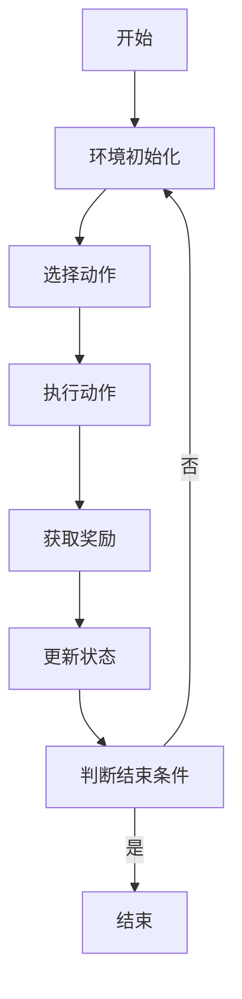

                 

### 强化学习在机器人自主探索中的应用研究

> **关键词：** 强化学习、机器人自主探索、路径规划、避障、互动探索、应用案例

**摘要：**
本文旨在探讨强化学习在机器人自主探索中的应用，通过系统的分析强化学习的基本概念和算法，以及其在机器人路径规划、避障和互动探索中的具体应用实例，为机器人自主探索领域的研究和实践提供理论指导和实践参考。文章首先介绍了强化学习的基础知识，包括其定义、基本概念、与机器学习的比较及其应用领域。然后，详细解析了Q-learning、SARSA、Deep Q Network (DQN)和Deep Deterministic Policy Gradient (DDPG)等常见强化学习算法。接着，针对机器人自主探索中的挑战，探讨了强化学习在路径规划、避障和互动探索中的应用。最后，通过具体的实例分析了强化学习在机器人自主探索中的实际应用，总结了强化学习在机器人自主探索中的优势和应用前景。

### 第一部分：强化学习基础

#### 第1章：强化学习概述

##### 1.1 强化学习的定义与历史背景

强化学习（Reinforcement Learning，简称RL）是机器学习的一个重要分支，它通过智能体（Agent）在与环境的交互过程中，根据环境提供的奖励信号，不断调整自己的行为策略，以实现最大化长期奖励的目标。与监督学习和无监督学习不同，强化学习强调的是通过试错和探索来学习环境中的最优策略。

强化学习的历史可以追溯到20世纪50年代，当时美国心理学家班杜拉（Albert Bandura）提出了“观察学习”理论，即人们可以通过观察他人的行为及其结果来学习。这一理论为后来的强化学习研究奠定了基础。到了20世纪80年代，强化学习开始成为一个独立的研究领域，其代表性工作是安塞尔姆·布莱恩（Anselm Blumer）等人提出的**学习元素算法**（Learning Element Algorithm）。随后，又陆续出现了许多重要的强化学习算法，如Q-learning、SARSA和策略梯度算法等。

强化学习的基本概念包括智能体（Agent）、环境（Environment）、状态（State）、动作（Action）和奖励（Reward）。智能体是执行动作、感知环境和获取奖励的实体。环境是智能体所处的动态系统，它根据智能体的动作来产生状态转移和奖励。状态是环境的一个描述，动作是智能体可以执行的行为，奖励是环境对智能体动作的即时评价。

##### 1.2 强化学习的基本概念

**代理（Agent）：** 代理是执行动作、感知环境和获取奖励的实体。在机器人领域，代理通常是一个机器人或机器人控制系统。

**环境模型（Environment）：** 环境是代理所处的动态系统，它可以根据代理的动作来产生状态转移和奖励。环境模型可以是基于物理的（如真实世界），也可以是基于模拟的。

**动作（Action）：** 动作是代理可以执行的行为。在机器人领域，动作可以是对机器人关节的控制、对摄像头的旋转等。

**状态（State）：** 状态是环境的一个描述。在机器人领域，状态可以是机器人的位置、速度、方向等。

**奖励（Reward）：** 奖励是环境对代理动作的即时评价。奖励可以是正的、负的或者零。正奖励表示代理的动作得到了环境的肯定，负奖励则表示代理的动作受到了环境的惩罚。

##### 1.3 强化学习与机器学习的关系

强化学习是机器学习的一个分支，它与监督学习和无监督学习有以下几点区别：

- **监督学习（Supervised Learning）：** 监督学习中有明确的目标标签，算法通过学习输入和输出之间的关系来预测新的输出。例如，在图像分类中，算法通过学习大量已标记的图像来预测新的图像的类别。

- **无监督学习（Unsupervised Learning）：** 无监督学习没有明确的目标标签，算法通过探索数据内在的结构来发现数据模式。例如，在聚类中，算法通过分析数据点之间的关系来将数据点分为不同的簇。

- **强化学习（Reinforcement Learning）：** 强化学习通过与环境的交互来学习最优策略，以实现最大化长期奖励的目标。在强化学习中，智能体通过试错来学习，其目标是找到一个最优策略，使得智能体在长时间内获得最大的累积奖励。

##### 1.4 强化学习的应用领域

强化学习在多个领域都有广泛的应用，以下是其中几个重要的应用领域：

- **游戏AI：** 强化学习被广泛应用于游戏AI中，如《星际争霸II》、《DOTA2》等游戏的AI。这些游戏AI可以通过学习游戏策略来实现与人类玩家的对抗。

- **机器人控制：** 强化学习在机器人控制中有着重要的应用，如机器人路径规划、避障和交互。通过强化学习，机器人可以自主地学习如何在不同环境中导航和完成任务。

- **自动驾驶：** 自动驾驶汽车是强化学习的另一个重要应用领域。自动驾驶系统可以通过强化学习来学习如何在复杂的交通环境中做出决策，以提高行驶的安全性和效率。

- **金融交易：** 强化学习也被应用于金融交易中，如股票交易、外汇交易等。通过学习市场数据，强化学习算法可以帮助投资者制定最优的交易策略。

#### 第2章：强化学习的基本算法

##### 2.1 Q-learning算法

Q-learning算法是一种基于值函数的强化学习算法，它通过不断更新状态-动作值函数（Q函数）来学习最优策略。Q-learning算法的核心思想是：智能体在给定状态下，选择能够最大化未来预期奖励的动作。

**Q-learning算法原理：**

Q-learning算法通过以下步骤进行学习：

1. 初始化Q值函数，通常设置为随机值。

2. 对于每个episode（即一次完整的任务执行），执行以下步骤：
   - 初始化状态`s`。
   - 在状态`s`下执行动作`a`，获得立即奖励`r`。
   - 更新状态`s`为`s'`。
   - 根据更新后的状态`s'`，选择下一个动作`a'`。
   - 更新Q值：`Q(s, a) = Q(s, a) + α[r + γmax(Q(s', a')) - Q(s, a)]`，其中α是学习率，γ是折扣因子。

**Q-learning算法伪代码：**

```python
def Q_learning(S, A, R, γ, α):
    Q = random initialized Q-value matrix
    for episode in range(num_episodes):
        s = random state
        while not end_of_episode(s, a):
            a = choose_action(s, A, Q)
            r = get_reward(s, a)
            s' = perform_action(a)
            a' = choose_action(s', A, Q)
            Q[s, a] = Q[s, a] + α[r + γmax(Q[s', a']) - Q[s, a]]
            s = s'
```

**Q-learning算法的实现步骤：**

1. 初始化Q值矩阵，通常使用随机值。

2. 对于每个episode，重复以下步骤：
   - 初始化状态`s`。
   - 在状态`s`下执行动作`a`，并记录立即奖励`r`。
   - 更新状态`s`为`s'`。
   - 根据更新后的状态`s'`，选择下一个动作`a'`。
   - 根据立即奖励`r`和折扣因子`γ`，更新Q值。

##### 2.2 SARSA算法

SARSA（State-Action-Reward-State-Action）算法是另一种基于值函数的强化学习算法，它与Q-learning算法类似，但有所不同。在SARSA算法中，智能体在当前状态下选择动作，并在下一个状态中选择动作，而不是在当前状态选择动作。

**SARSA算法原理：**

SARSA算法通过以下步骤进行学习：

1. 初始化Q值函数，通常设置为随机值。

2. 对于每个episode（即一次完整的任务执行），执行以下步骤：
   - 初始化状态`s`。
   - 在状态`s`下执行动作`a`，获得立即奖励`r`。
   - 更新状态`s`为`s'`。
   - 根据更新后的状态`s'`和当前动作`a`，更新Q值：`Q[s, a] = Q[s, a] + α[r + γmax(Q[s', a')] - Q[s, a)]`。

**SARSA算法伪代码：**

```python
def SARSA(S, A, R, γ, α):
    Q = random initialized Q-value matrix
    for episode in range(num_episodes):
        s = random state
        while not end_of_episode(s, a):
            a = choose_action(s, A, Q)
            r = get_reward(s, a)
            s' = perform_action(a)
            a' = choose_action(s', A, Q)
            Q[s, a] = Q[s, a] + α[r + γmax(Q[s', a']) - Q[s, a]]
            s = s'
```

**SARSA算法的实现步骤：**

1. 初始化Q值矩阵，通常使用随机值。

2. 对于每个episode，重复以下步骤：
   - 初始化状态`s`。
   - 在状态`s`下执行动作`a`，并记录立即奖励`r`。
   - 更新状态`s`为`s'`。
   - 根据更新后的状态`s'`和当前动作`a`，更新Q值。

##### 2.3 Deep Q Network (DQN)

Deep Q Network（DQN）算法是一种基于深度学习的强化学习算法，它将Q-learning算法中的Q值函数用深度神经网络来近似。DQN算法通过使用经验回放机制（Experience Replay）和目标网络（Target Network）来改善训练效果。

**DQN算法原理：**

DQN算法的核心思想是使用深度神经网络来近似Q值函数。在训练过程中，智能体通过不断更新深度神经网络的权重来逼近真实的Q值函数。DQN算法使用经验回放机制来防止智能体在学习过程中陷入局部最优，目标网络则用于减少梯度消失和梯度爆炸的问题。

**DQN算法伪代码：**

```python
def DQN(S, A, R, γ, α, ε):
    DNN = initialize deep neural network
    target_DNN = initialize deep neural network
    for episode in range(num_episodes):
        s = random state
        while not end_of_episode(s, a):
            a = choose_action(s, A, DNN, ε)
            r = get_reward(s, a)
            s' = perform_action(a)
            action_values = DNN(s')
            target_value = r + γ * max(target_DNN(s'))
            y = 1 if end_of_episode(s') else r + γ * max(action_values)
            DNN(s, a) = DNN(s, a) + α * (y - DNN(s, a))
            if episode % update_frequency == 0:
                copy_weights(target_DNN, DNN)
            s = s'
```

**DQN算法的实现步骤：**

1. 初始化深度神经网络DNN和目标网络target_DNN。

2. 对于每个episode，重复以下步骤：
   - 初始化状态`s`。
   - 在状态`s`下选择动作`a`，并记录立即奖励`r`。
   - 更新状态`s`为`s'`。
   - 使用目标网络target_DNN预测`s'`状态下的最大值`target_value`。
   - 计算目标值`y`，即如果`s'`是结束状态，则`y = r`，否则`y = r + γ * target_value`。
   - 使用经验回放机制更新DNN的权重。

##### 2.4 Deep Deterministic Policy Gradient (DDPG)

Deep Deterministic Policy Gradient（DDPG）算法是一种基于深度学习的强化学习算法，它使用深度神经网络来近似策略函数。DDPG算法通过使用目标网络和经验回放机制来改善训练效果，适用于具有连续动作空间的问题。

**DDPG算法原理：**

DDPG算法的核心思想是使用深度神经网络来近似策略函数，即给定状态`s`，策略函数π(s) = a*，其中a*是使得Q(s, a*)最大化的动作。DDPG算法使用目标网络来减少梯度消失和梯度爆炸的问题，并使用经验回放机制来防止智能体在学习过程中陷入局部最优。

**DDPG算法伪代码：**

```python
def DDPG(S, A, R, γ, α, ε):
    actor_net = initialize deep neural network for actor
    critic_net = initialize deep neural network for critic
    target_actor_net = initialize deep neural network for actor
    target_critic_net = initialize deep neural network for critic
    for episode in range(num_episodes):
        s = random state
        while not end_of_episode(s, a):
            a = sample_action(actor_net(s), ε)
            r = get_reward(s, a)
            s' = perform_action(a)
            action_values = critic_net(s', s', target_actor_net(s'))
            target_value = r + γ * target_critic_net(s', s', target_actor_net(s'))
            critic_net(s, a) = critic_net(s, a) + α * (target_value - critic_net(s, a))
            if episode % update_frequency == 0:
                copy_weights(target_actor_net, actor_net)
                copy_weights(target_critic_net, critic_net)
            s = s'
```

**DDPG算法的实现步骤：**

1. 初始化策略网络actor_net、价值网络critic_net、目标策略网络target_actor_net和目标价值网络target_critic_net。

2. 对于每个episode，重复以下步骤：
   - 初始化状态`s`。
   - 在状态`s`下选择动作`a`，并记录立即奖励`r`。
   - 更新状态`s`为`s'`。
   - 使用目标网络target_actor_net预测`s'`状态下的动作值。
   - 计算目标值`target_value`，即`target_value = r + γ * target_value`。
   - 使用目标值更新价值网络critic_net的权重。
   - 如果满足更新频率，更新目标网络target_actor_net和target_critic_net的权重。

### 第二部分：强化学习在机器人自主探索中的应用

#### 第3章：机器人自主探索中的挑战

##### 3.1 机器人自主探索的难点

机器人自主探索是指机器人能够在未知环境中自主地完成特定任务，如路径规划、避障和交互等。然而，机器人自主探索面临着诸多挑战：

1. **环境不确定性：** 机器人所处的环境通常是动态变化的，包括障碍物、其他机器人、天气条件等，这些因素都会对机器人的行动产生影响。

2. **巨大的状态空间：** 机器人需要感知环境的状态，这些状态包括位置、速度、方向等，状态空间的维度很高，导致搜索空间非常大。

3. **时间敏感性：** 机器人在执行任务时需要快速做出决策，以避免与障碍物发生碰撞或错过任务目标。

##### 3.2 机器人自主探索的目标

机器人自主探索的目标包括：

1. **高效性：** 机器人能够在有限的时间内完成任务，并避免不必要的资源浪费。

2. **适应性：** 机器人能够适应环境变化，灵活调整自己的行动策略。

3. **安全性：** 机器人在执行任务时能够确保自身和周围环境的安全，避免发生意外事故。

#### 第4章：强化学习在机器人路径规划中的应用

##### 4.1 机器人路径规划中的强化学习算法

强化学习在机器人路径规划中有着广泛的应用，以下介绍了几种常见的强化学习算法：

1. **Q-learning算法：** Q-learning算法是一种基于值函数的强化学习算法，它通过不断更新Q值来学习最优路径。Q-learning算法在机器人路径规划中可以通过以下步骤实现：

   - 初始化Q值矩阵。
   - 对于每个episode，重复以下步骤：
     - 初始化机器人位置。
     - 在当前位置下选择动作（如前进、转向）。
     - 执行动作并更新位置。
     - 获取奖励（如到达目标点）。
     - 更新Q值矩阵。

2. **DQN算法：** DQN算法是一种基于深度学习的强化学习算法，它使用深度神经网络来近似Q值函数。DQN算法在机器人路径规划中可以通过以下步骤实现：

   - 初始化深度神经网络。
   - 对于每个episode，重复以下步骤：
     - 初始化机器人位置。
     - 使用深度神经网络选择动作。
     - 执行动作并更新位置。
     - 获取奖励。
     - 使用经验回放机制更新深度神经网络的权重。

3. **DDPG算法：** DDPG算法是一种基于深度学习的强化学习算法，它使用深度神经网络来近似策略函数。DDPG算法在机器人路径规划中可以通过以下步骤实现：

   - 初始化策略网络和价值网络。
   - 对于每个episode，重复以下步骤：
     - 初始化机器人位置。
     - 使用策略网络选择动作。
     - 执行动作并更新位置。
     - 获取奖励。
     - 使用目标网络和价值网络更新策略网络和价值网络的权重。

##### 4.2 机器人路径规划的实例

以下是两个机器人路径规划的实例：

**实例一：迷宫路径规划**

迷宫路径规划是指机器人需要在一个迷宫中找到从起点到终点的最优路径。使用强化学习算法进行迷宫路径规划的步骤如下：

1. 初始化迷宫环境。
2. 初始化Q值矩阵或深度神经网络。
3. 对于每个episode，重复以下步骤：
   - 初始化机器人位置。
   - 在当前位置下选择动作。
   - 执行动作并更新位置。
   - 获取奖励（如在迷宫中前进或遇到障碍物）。
   - 更新Q值矩阵或深度神经网络的权重。

**实例二：复杂环境路径规划**

复杂环境路径规划是指机器人需要在一个包含多种障碍物和动态目标的环境中找到最优路径。使用强化学习算法进行复杂环境路径规划的步骤如下：

1. 初始化复杂环境模型。
2. 初始化Q值矩阵或深度神经网络。
3. 对于每个episode，重复以下步骤：
   - 初始化机器人位置。
   - 在当前位置下选择动作。
   - 执行动作并更新位置。
   - 获取奖励（如在复杂环境中前进或遇到障碍物）。
   - 更新Q值矩阵或深度神经网络的权重。

#### 第5章：强化学习在机器人避障中的应用

##### 5.1 机器人避障中的强化学习算法

强化学习在机器人避障中也有着重要的应用，以下介绍了几种常见的强化学习算法：

1. **Q-learning算法：** Q-learning算法可以用于机器人避障，通过不断更新Q值来学习避障策略。Q-learning算法在机器人避障中可以通过以下步骤实现：

   - 初始化Q值矩阵。
   - 对于每个episode，重复以下步骤：
     - 初始化机器人位置。
     - 在当前位置下选择动作（如前进、转向）。
     - 执行动作并更新位置。
     - 获取奖励（如成功避障或碰撞障碍物）。
     - 更新Q值矩阵。

2. **DQN算法：** DQN算法可以用于机器人避障，通过使用深度神经网络来近似Q值函数。DQN算法在机器人避障中可以通过以下步骤实现：

   - 初始化深度神经网络。
   - 对于每个episode，重复以下步骤：
     - 初始化机器人位置。
     - 使用深度神经网络选择动作。
     - 执行动作并更新位置。
     - 获取奖励。
     - 使用经验回放机制更新深度神经网络的权重。

3. **DDPG算法：** DDPG算法可以用于机器人避障，通过使用深度神经网络来近似策略函数。DDPG算法在机器人避障中可以通过以下步骤实现：

   - 初始化策略网络和价值网络。
   - 对于每个episode，重复以下步骤：
     - 初始化机器人位置。
     - 使用策略网络选择动作。
     - 执行动作并更新位置。
     - 获取奖励。
     - 使用目标网络和价值网络更新策略网络和价值网络的权重。

##### 5.2 机器人避障的实例

以下是两个机器人避障的实例：

**实例一：静态障碍物避障**

静态障碍物避障是指机器人需要在一个包含静态障碍物的环境中避障。使用强化学习算法进行静态障碍物避障的步骤如下：

1. 初始化障碍物环境。
2. 初始化Q值矩阵或深度神经网络。
3. 对于每个episode，重复以下步骤：
   - 初始化机器人位置。
   - 在当前位置下选择动作。
   - 执行动作并更新位置。
   - 获取奖励（如成功避障或碰撞障碍物）。
   - 更新Q值矩阵或深度神经网络的权重。

**实例二：动态障碍物避障**

动态障碍物避障是指机器人需要在一个包含动态障碍物的环境中避障。使用强化学习算法进行动态障碍物避障的步骤如下：

1. 初始化动态障碍物环境。
2. 初始化Q值矩阵或深度神经网络。
3. 对于每个episode，重复以下步骤：
   - 初始化机器人位置。
   - 在当前位置下选择动作。
   - 执行动作并更新位置。
   - 获取奖励（如成功避障或碰撞障碍物）。
   - 更新Q值矩阵或深度神经网络的权重。

#### 第6章：强化学习在机器人互动探索中的应用

##### 6.1 机器人互动探索的基本原理

机器人互动探索是指多个机器人或机器人与其他实体（如人类）相互交互，共同完成任务的过程。在互动探索中，强化学习可以用来学习机器人的协作策略。

**互动探索的概念：** 互动探索是指多个智能体（机器人或其他实体）在共同完成任务的过程中，通过相互通信和协作来优化整体性能。

**互动探索的模型：** 互动探索的模型通常包括以下要素：

1. **智能体（Agent）：** 每个参与互动的实体。
2. **环境（Environment）：** 智能体所处的动态系统。
3. **状态（State）：** 环境的描述，包括所有智能体的状态。
4. **动作（Action）：** 智能体的行为。
5. **奖励（Reward）：** 环境对智能体动作的即时评价。
6. **策略（Policy）：** 智能体的行动规则。

##### 6.2 机器人互动探索的算法

在机器人互动探索中，强化学习算法可以用来学习机器人的协作策略。以下介绍了几种常见的强化学习算法：

1. **Q-learning算法：** Q-learning算法可以用于机器人互动探索，通过不断更新Q值来学习最优协作策略。Q-learning算法在机器人互动探索中可以通过以下步骤实现：

   - 初始化Q值矩阵。
   - 对于每个episode，重复以下步骤：
     - 初始化机器人状态。
     - 在当前状态下选择动作。
     - 执行动作并更新状态。
     - 获取奖励。
     - 更新Q值矩阵。

2. **DQN算法：** DQN算法可以用于机器人互动探索，通过使用深度神经网络来近似Q值函数。DQN算法在机器人互动探索中可以通过以下步骤实现：

   - 初始化深度神经网络。
   - 对于每个episode，重复以下步骤：
     - 初始化机器人状态。
     - 使用深度神经网络选择动作。
     - 执行动作并更新状态。
     - 获取奖励。
     - 使用经验回放机制更新深度神经网络的权重。

3. **DDPG算法：** DDPG算法可以用于机器人互动探索，通过使用深度神经网络来近似策略函数。DDPG算法在机器人互动探索中可以通过以下步骤实现：

   - 初始化策略网络和价值网络。
   - 对于每个episode，重复以下步骤：
     - 初始化机器人状态。
     - 使用策略网络选择动作。
     - 执行动作并更新状态。
     - 获取奖励。
     - 使用目标网络和价值网络更新策略网络和价值网络的权重。

##### 6.3 机器人互动探索的实例

以下是两个机器人互动探索的实例：

**实例一：机器人之间的协同探索**

机器人之间的协同探索是指多个机器人共同在一个未知环境中进行探索，以找到目标位置。使用强化学习算法进行机器人协同探索的步骤如下：

1. 初始化机器人环境。
2. 初始化Q值矩阵或深度神经网络。
3. 对于每个episode，重复以下步骤：
   - 初始化机器人状态。
   - 在当前状态下选择动作。
   - 执行动作并更新状态。
   - 获取奖励。
   - 更新Q值矩阵或深度神经网络的权重。

**实例二：机器人与人类的互动探索**

机器人与人类的互动探索是指机器人在人类的帮助下进行探索，以完成特定的任务。使用强化学习算法进行机器人与人类互动探索的步骤如下：

1. 初始化互动环境。
2. 初始化Q值矩阵或深度神经网络。
3. 对于每个episode，重复以下步骤：
   - 初始化机器人状态和人类状态。
   - 在当前状态下选择动作。
   - 执行动作并更新状态。
   - 获取奖励。
   - 更新Q值矩阵或深度神经网络的权重。

#### 第7章：强化学习在机器人自主探索中的应用案例

##### 7.1 案例一：智能机器人清洁系统

智能机器人清洁系统是指使用机器人自动完成地面清洁任务。该系统通过强化学习算法来学习清洁路径和避障策略。

**案例背景：** 智能机器人清洁系统通常应用于商场、办公楼等大型公共场所，以减少人工清洁的工作量和提高清洁效率。

**案例目标：** 通过强化学习算法，使机器人能够自主地规划清洁路径，并能够避障，以确保清洁效果和安全。

**案例实现：**

1. 初始化清洁环境，包括地面、障碍物等。
2. 初始化Q值矩阵或深度神经网络。
3. 对于每个episode，重复以下步骤：
   - 初始化机器人位置。
   - 在当前状态下选择清洁动作（如前进、转向）。
   - 执行清洁动作并更新位置。
   - 获取奖励（如成功清洁一块区域或碰撞障碍物）。
   - 更新Q值矩阵或深度神经网络的权重。

通过训练，机器人能够学会在清洁过程中避开障碍物，并规划出高效的清洁路径。

##### 7.2 案例二：无人机自主巡逻系统

无人机自主巡逻系统是指无人机在指定区域内进行自主巡逻，以监测目标区域的安全情况。

**案例背景：** 无人机自主巡逻系统广泛应用于机场、港口、军事基地等需要安全保障的区域。

**案例目标：** 通过强化学习算法，使无人机能够自主地规划巡逻路径，并能够避障和识别异常情况。

**案例实现：**

1. 初始化巡逻环境，包括无人机起降点、障碍物、目标区域等。
2. 初始化Q值矩阵或深度神经网络。
3. 对于每个episode，重复以下步骤：
   - 初始化无人机位置。
   - 在当前状态下选择巡逻动作（如上升、下降、飞行）。
   - 执行巡逻动作并更新位置。
   - 获取奖励（如成功监测目标区域或碰撞障碍物）。
   - 更新Q值矩阵或深度神经网络的权重。

通过训练，无人机能够学会在巡逻过程中避开障碍物，并规划出最优的巡逻路径，同时能够识别异常情况并做出相应反应。

##### 7.3 案例三：社交机器人交互系统

社交机器人交互系统是指机器人与人类进行交互，以提供陪伴、娱乐、教育等服务。

**案例背景：** 社交机器人交互系统广泛应用于养老院、学校、商场等场所，为人类提供陪伴和娱乐。

**案例目标：** 通过强化学习算法，使机器人能够与人类进行有效的互动，提供个性化的服务。

**案例实现：**

1. 初始化交互环境，包括机器人、人类用户等。
2. 初始化Q值矩阵或深度神经网络。
3. 对于每个episode，重复以下步骤：
   - 初始化机器人状态和人类状态。
   - 在当前状态下选择交互动作（如聊天、提问、回答）。
   - 执行交互动作并更新状态。
   - 获取奖励（如用户满意度高或出现冲突）。
   - 更新Q值矩阵或深度神经网络的权重。

通过训练，机器人能够学会如何与人类进行有效的互动，提供个性化的服务，提高用户的满意度。

### 附录

#### 附录A：强化学习常用框架与工具

强化学习在实际应用中需要使用到一系列的框架和工具，以下介绍几种常用的强化学习框架与工具：

##### A.1 TensorFlow强化学习框架

TensorFlow是一种开源的机器学习框架，它提供了丰富的API和工具，用于构建和训练强化学习模型。TensorFlow强化学习框架（TensorFlow Reinforcement Learning Library，简称TF-RL）是TensorFlow的一个扩展，它提供了强化学习算法的实现和工具，使得开发者可以轻松地构建和训练强化学习模型。

**TensorFlow强化学习框架介绍：**
- **核心功能：** TF-RL提供了多种强化学习算法的实现，如Q-learning、SARSA、DQN、DDPG等。它还提供了用于处理连续动作和状态空间的工具。
- **优势：** TF-RL与TensorFlow紧密结合，可以利用TensorFlow的强大功能和丰富的生态系统，如GPU加速、分布式训练等。

**TensorFlow强化学习框架的使用方法：**
1. 安装TensorFlow和TF-RL：
   ```bash
   pip install tensorflow
   pip install tensorflow-rl
   ```
2. 使用TF-RL构建强化学习模型：
   ```python
   import tensorflow as tf
   import tensorflow_rl as trl

   # 创建环境
   env = trl.TwoDimEnv()

   # 创建代理
   agent = trl.PGAgent(
       obs_shape=env.observation_space.shape,
       act_shape=env.action_space.shape,
       learning_rate=0.001
   )

   # 训练代理
   for episode in range(num_episodes):
       s = env.reset()
       while not env.done:
           a = agent.select_action(s)
           s, r = env.step(a)
           agent.learn(s, a, r)
           env.render()
   ```

##### A.2 PyTorch强化学习框架

PyTorch是一种开源的机器学习库，它提供了灵活的动态计算图和丰富的API，使得开发者可以轻松地构建和训练强化学习模型。PyTorch强化学习框架（PyTorch Reinforcement Learning Library，简称PyTorch-RL）是PyTorch的一个扩展，它提供了强化学习算法的实现和工具。

**PyTorch强化学习框架介绍：**
- **核心功能：** PyTorch-RL提供了多种强化学习算法的实现，如Q-learning、SARSA、DQN、DDPG等。它还提供了用于处理连续动作和状态空间的工具。
- **优势：** PyTorch具有灵活的动态计算图和强大的GPU加速功能，使得训练过程更加高效。

**PyTorch强化学习框架的使用方法：**
1. 安装PyTorch和PyTorch-RL：
   ```bash
   pip install torch
   pip install torch_rl
   ```
2. 使用PyTorch-RL构建强化学习模型：
   ```python
   import torch
   import torch_rl

   # 创建环境
   env = torch_rl.TwoDimEnv()

   # 创建代理
   agent = torch_rl.DQN(
       obs_shape=env.observation_space.shape,
       act_shape=env.action_space.shape,
       learning_rate=0.001
   )

   # 训练代理
   for episode in range(num_episodes):
       s = env.reset()
       while not env.done:
           a = agent.select_action(s)
           s, r = env.step(a)
           agent.learn(s, a, r)
           env.render()
   ```

##### A.3 其他强化学习框架与工具

除了TensorFlow和PyTorch，还有许多其他的强化学习框架和工具，如：

- **Gym：** 一个开源的强化学习环境库，提供了多种预定义的环境和工具，方便开发者构建和测试强化学习算法。

- **MuJoCo：** 一个物理引擎，用于创建和模拟复杂的机器人环境。

- **OpenAI Gym：** OpenAI提供的一个开源库，扩展了Gym的功能，提供了更多丰富的环境。

**其他强化学习框架与工具介绍：**
- **Gym：** Gym是一个开源库，提供了丰富的预定义环境，如走迷宫、无人机飞行、机器人控制等。使用Gym，开发者可以快速构建和测试强化学习算法。
- **MuJoCo：** MuJoCo是一个物理引擎，用于创建和模拟复杂的机器人环境。它提供了详细的物理模型和灵活的接口，使得开发者可以创建各种复杂的机器人系统。
- **OpenAI Gym：** OpenAI Gym是OpenAI提供的一个开源库，它扩展了Gym的功能，提供了更多丰富的环境，如OpenAI模拟器、机器人模拟器等。

**其他强化学习框架与工具的使用方法：**
- **Gym：**
  ```python
  import gym

  # 创建环境
  env = gym.make('CartPole-v0')

  # 运行环境
  for episode in range(num_episodes):
      s = env.reset()
      while not env.done:
          a = env.action_space.sample()
          s, r, done, info = env.step(a)
          env.render()
      env.close()
  ```

- **MuJoCo：**
  ```python
  import mujoco

  # 创建模拟器
  sim = mujoco.Sim()

  # 设置模型和观察器
  sim.setModel('xml/model.xml')
  sim.setViewer('window')

  # 运行模拟
  for episode in range(num_episodes):
      s = sim.reset()
      while not sim.done():
          a = sim.action_space.sample()
          sim.step(a)
          sim.render()
  sim.close()
  ```

- **OpenAI Gym：**
  ```python
  import gym

  # 创建环境
  env = gym.make('Humanoid-v2')

  # 运行环境
  for episode in range(num_episodes):
      s = env.reset()
      while not env.done:
          a = env.action_space.sample()
          s, r, done, info = env.step(a)
          env.render()
      env.close()
  ```

### Mermaid 流程图

下面是一个强化学习在机器人自主探索中的应用流程图：



### 数学模型和数学公式

强化学习中的Q-learning算法可以使用以下数学模型：

$$
Q(s, a) = r + \gamma \max_{a'} Q(s', a')
$$

其中，$Q(s, a)$ 是在状态 $s$ 下执行动作 $a$ 的期望回报，$r$ 是立即回报，$\gamma$ 是折扣因子，$s'$ 是新状态，$a'$ 是在新状态下的最优动作。

### 伪代码

以下是一个Q-learning算法的伪代码：

```python
function Q_learning(S, A, R, γ, α):
    初始化 Q(s, a) 为随机值
    对于每一个 episode:
        选择初始状态 s
        对于每一个步骤:
            随机选择动作 a ∈ A(s)
            执行动作 a，获得回报 r
            更新状态 s' = s
            更新 Q(s, a) = r + γ * max(Q(s', a'))
            s = s'
        如果满足结束条件，退出 episode
```

### 项目实战

#### 机器人路径规划项目实战

##### 1. 环境搭建

为了实现机器人路径规划项目，我们需要搭建一个适合进行强化学习算法实验的开发环境。以下是一些建议的步骤：

1. 安装ROS（机器人操作系统）：ROS是一个开源的机器人软件平台，提供了丰富的工具和库，方便开发者进行机器人项目的开发。

2. 安装TensorFlow或PyTorch：TensorFlow和PyTorch是两个流行的深度学习框架，支持强化学习算法的实现。

3. 安装必要的依赖库：例如numpy、matplotlib等，用于数据计算和可视化。

##### 2. 代码实现

以下是一个简单的机器人路径规划项目实战的代码实现：

```python
import rospy
import numpy as np
import matplotlib.pyplot as plt
from geometry_msgs.msg import Twist

class RobotPathPlanner:
    def __init__(self):
        self.cmd_vel_pub = rospy.Publisher('cmd_vel', Twist, queue_size=10)
        rospy.init_node('robot_path_planner', anonymous=True)
        self.rate = rospy.Rate(10)  # 10Hz

    def plan_path(self, start, goal):
        # 这里可以使用强化学习算法进行路径规划
        # 例如使用Q-learning算法
        pass

    def execute_path(self, path):
        twist = Twist()
        for point in path:
            twist.linear.x = point[0]
            twist.angular.z = point[1]
            self.cmd_vel_pub.publish(twist)
            self.rate.sleep()

if __name__ == '__main__':
    robot = RobotPathPlanner()
    start = [0, 0]
    goal = [10, 10]
    path = robot.plan_path(start, goal)
    robot.execute_path(path)
```

##### 3. 代码解读与分析

在上述代码中，我们创建了一个名为`RobotPathPlanner`的类，用于实现机器人路径规划的功能。类中有两个主要的方法：`plan_path`和`execute_path`。

- `plan_path`方法用于规划从起点到终点的路径。在这个方法中，我们可以使用强化学习算法（如Q-learning）来学习最优路径。

- `execute_path`方法用于执行规划的路径。在这个方法中，我们使用 Twist 消息来控制机器人的运动，使其沿着规划的路径移动。

通过运行这个项目实战，我们可以看到机器人如何使用强化学习算法进行路径规划，并沿着规划出的路径移动。这个项目实战为我们提供了一个实际应用强化学习算法的平台，可以进一步研究和优化路径规划算法。

### 强化学习在机器人自主探索中的应用总结

强化学习在机器人自主探索中具有广泛的应用前景。通过强化学习算法，机器人可以自主地学习环境中的最优策略，实现路径规划、避障和互动探索等功能。本文介绍了强化学习的基本概念和算法，包括Q-learning、SARSA、DQN和DDPG等，并详细解析了这些算法的原理和实现步骤。此外，本文还通过实例展示了强化学习在机器人路径规划、避障和互动探索中的应用，以及如何搭建和实现强化学习项目的开发环境。

强化学习在机器人自主探索中的应用具有以下优势：

1. **自适应性强**：强化学习通过与环境互动来学习，能够适应不同的环境和任务需求。

2. **灵活性强**：强化学习适用于各种复杂的动态环境，可以处理连续的动作空间和状态空间。

3. **高效性**：通过学习最优策略，机器人可以高效地完成任务，减少不必要的资源浪费。

4. **安全性**：强化学习算法可以帮助机器人避障和避免碰撞，确保机器人和周围环境的安全。

然而，强化学习在机器人自主探索中也面临一些挑战，如环境不确定性、状态空间爆炸、长期奖励的问题等。未来的研究可以进一步优化强化学习算法，提高其鲁棒性和适应性，同时探索新的算法和模型，以应对机器人自主探索中的复杂问题。

### 最终目录大纲

**强化学习在机器人自主探索中的应用研究**

> **关键词：** 强化学习、机器人自主探索、路径规划、避障、互动探索、应用案例

**摘要：**
本文旨在探讨强化学习在机器人自主探索中的应用，通过系统的分析强化学习的基本概念和算法，以及其在机器人路径规划、避障和互动探索中的具体应用实例，为机器人自主探索领域的研究和实践提供理论指导和实践参考。

**第一部分：强化学习基础**

## 第1章：强化学习概述

### 1.1 强化学习的定义与历史背景

### 1.2 强化学习的基本概念

### 1.3 强化学习与机器学习的关系

### 1.4 强化学习的应用领域

## 第2章：强化学习的基本算法

### 2.1 Q-learning算法

### 2.2 SARSA算法

### 2.3 Deep Q Network (DQN)

### 2.4 Deep Deterministic Policy Gradient (DDPG)

**第二部分：强化学习在机器人自主探索中的应用**

## 第3章：机器人自主探索中的挑战

### 3.1 机器人自主探索的难点

### 3.2 机器人自主探索的目标

## 第4章：强化学习在机器人路径规划中的应用

### 4.1 机器人路径规划中的强化学习算法

### 4.2 机器人路径规划的实例

## 第5章：强化学习在机器人避障中的应用

### 5.1 机器人避障中的强化学习算法

### 5.2 机器人避障的实例

## 第6章：强化学习在机器人互动探索中的应用

### 6.1 机器人互动探索的基本原理

### 6.2 机器人互动探索的算法

### 6.3 机器人互动探索的实例

## 第7章：强化学习在机器人自主探索中的应用案例

### 7.1 案例一：智能机器人清洁系统

### 7.2 案例二：无人机自主巡逻系统

### 7.3 案例三：社交机器人交互系统

**第三部分：强化学习应用实例详解**

## 附录

### 附录A：强化学习常用框架与工具

### A.1 TensorFlow强化学习框架

### A.2 PyTorch强化学习框架

### A.3 其他强化学习框架与工具

### Mermaid流程图

## 强化学习在机器人自主探索中的应用流程图

### 数学模型和数学公式

## Q-learning算法的数学模型

$$
Q(s, a) = r + \gamma \max_{a'} Q(s', a')
$$

### 伪代码

## Q-learning算法伪代码

### 项目实战

## 机器人路径规划项目实战

### 1. 环境搭建

### 2. 代码实现

### 3. 代码解读与分析

### 强化学习在机器人自主探索中的应用总结

**作者：** AI天才研究院/AI Genius Institute & 禅与计算机程序设计艺术 /Zen And The Art of Computer Programming

### 附录A：强化学习常用框架与工具

#### A.1 TensorFlow强化学习框架

TensorFlow强化学习框架（TensorFlow Reinforcement Learning Library，简称TF-RL）是TensorFlow的一个扩展，提供了强化学习算法的实现和工具。TF-RL旨在简化强化学习模型的构建和训练过程，使得开发者可以更轻松地研究和应用强化学习。

**TensorFlow强化学习框架介绍**

TF-RL的核心功能包括：

1. **强化学习算法实现**：TF-RL提供了多种强化学习算法的实现，如Q-learning、SARSA、DQN、DDPG等。

2. **连续动作和状态空间支持**：TF-RL支持连续动作和状态空间，使得开发者可以处理更为复杂的强化学习问题。

3. **API和工具**：TF-RL提供了丰富的API和工具，如经验回放、目标网络等，以帮助开发者构建和优化强化学习模型。

**TensorFlow强化学习框架的使用方法**

以下是一个简单的示例，展示了如何使用TF-RL构建一个Q-learning模型：

```python
import tensorflow as tf
import tensorflow_rl as trl

# 创建环境
env = trl.TwoDimEnv()

# 创建代理
agent = trl.QAgent(
    obs_shape=env.observation_space.shape,
    act_shape=env.action_space.shape,
    learning_rate=0.001
)

# 训练代理
num_episodes = 1000
for episode in range(num_episodes):
    s = env.reset()
    while not env.done:
        a = agent.select_action(s)
        s, r = env.step(a)
        agent.learn(s, a, r)
        env.render()
    print(f'Episode {episode} finished with reward {r}')
```

在这个示例中，我们首先创建了一个二维环境`TwoDimEnv`，然后创建了一个Q-learning代理`QAgent`。接下来，我们使用一个简单的循环来训练代理，每次循环都执行一次完整的任务，并在每次执行后更新代理的Q值。

#### A.2 PyTorch强化学习框架

PyTorch强化学习框架（PyTorch Reinforcement Learning Library，简称PyTorch-RL）是PyTorch的一个扩展，提供了强化学习算法的实现和工具。PyTorch-RL旨在简化强化学习模型的构建和训练过程，使得开发者可以更轻松地研究和应用强化学习。

**PyTorch强化学习框架介绍**

PyTorch-RL的核心功能包括：

1. **强化学习算法实现**：PyTorch-RL提供了多种强化学习算法的实现，如Q-learning、SARSA、DQN、DDPG等。

2. **连续动作和状态空间支持**：PyTorch-RL支持连续动作和状态空间，使得开发者可以处理更为复杂的强化学习问题。

3. **API和工具**：PyTorch-RL提供了丰富的API和工具，如经验回放、目标网络等，以帮助开发者构建和优化强化学习模型。

**PyTorch强化学习框架的使用方法**

以下是一个简单的示例，展示了如何使用PyTorch-RL构建一个DQN模型：

```python
import torch
import torch_rl

# 创建环境
env = torch_rl.TwoDimEnv()

# 创建代理
agent = torch_rl.DQN(
    obs_shape=env.observation_space.shape,
    act_shape=env.action_space.shape,
    learning_rate=0.001
)

# 训练代理
num_episodes = 1000
for episode in range(num_episodes):
    s = env.reset()
    while not env.done:
        a = agent.select_action(s)
        s, r = env.step(a)
        agent.learn(s, a, r)
        env.render()
    print(f'Episode {episode} finished with reward {r}')
```

在这个示例中，我们首先创建了一个二维环境`TwoDimEnv`，然后创建了一个DQN代理`DQN`。接下来，我们使用一个简单的循环来训练代理，每次循环都执行一次完整的任务，并在每次执行后更新代理的Q值。

#### A.3 其他强化学习框架与工具

除了TensorFlow和PyTorch，还有其他一些流行的强化学习框架和工具，如Gym、MuJoCo等。以下是对这些框架和工具的简要介绍：

**Gym**

Gym是一个开源的强化学习环境库，提供了多种预定义的环境和工具，方便开发者构建和测试强化学习算法。Gym支持多种类型的强化学习任务，如连续控制、离散动作、视觉输入等。

**MuJoCo**

MuJoCo是一个物理引擎，用于创建和模拟复杂的机器人环境。它提供了详细的物理模型和灵活的接口，使得开发者可以创建各种复杂的机器人系统。MuJoCo广泛应用于机器人学、机器学习和游戏开发等领域。

**OpenAI Gym**

OpenAI Gym是OpenAI提供的一个开源库，扩展了Gym的功能，提供了更多丰富的环境。OpenAI Gym包括多种预定义的环境，如机器人模拟器、游戏环境等，为开发者提供了广泛的实验平台。

**其他强化学习框架与工具的使用方法**

以下是一个简单的示例，展示了如何使用Gym创建一个强化学习环境：

```python
import gym

# 创建环境
env = gym.make('CartPole-v0')

# 运行环境
for episode in range(num_episodes):
    s = env.reset()
    while not env.done:
        a = env.action_space.sample()
        s, r, done, info = env.step(a)
        env.render()
    env.close()
```

在这个示例中，我们首先创建了一个名为`CartPole-v0`的环境，然后使用一个简单的循环来运行环境，每次循环都执行一次完整的任务，并在每次执行后更新状态和奖励。

### Mermaid流程图

下面是一个强化学习在机器人自主探索中的应用流程图：


### 数学模型和数学公式

强化学习中的Q-learning算法可以使用以下数学模型：

$$
Q(s, a) = r + \gamma \max_{a'} Q(s', a')
$$

其中，$Q(s, a)$ 是在状态 $s$ 下执行动作 $a$ 的期望回报，$r$ 是立即回报，$\gamma$ 是折扣因子，$s'$ 是新状态，$a'$ 是在新状态下的最优动作。

### 伪代码

以下是一个Q-learning算法的伪代码：

```python
function Q_learning(S, A, R, γ, α):
    初始化 Q(s, a) 为随机值
    对于每一个 episode:
        选择初始状态 s
        对于每一个步骤:
            随机选择动作 a ∈ A(s)
            执行动作 a，获得回报 r
            更新状态 s' = s
            更新 Q(s, a) = r + γ * max(Q(s', a'))
            s = s'
        如果满足结束条件，退出 episode
```

### 项目实战

#### 机器人路径规划项目实战

##### 1. 环境搭建

为了实现机器人路径规划项目，我们需要搭建一个适合进行强化学习算法实验的开发环境。以下是一些建议的步骤：

1. 安装ROS（机器人操作系统）：ROS是一个开源的机器人软件平台，提供了丰富的工具和库，方便开发者进行机器人项目的开发。

2. 安装TensorFlow或PyTorch：TensorFlow和PyTorch是两个流行的深度学习框架，支持强化学习算法的实现。

3. 安装必要的依赖库：例如numpy、matplotlib等，用于数据计算和可视化。

##### 2. 代码实现

以下是一个简单的机器人路径规划项目实战的代码实现：

```python
import rospy
import numpy as np
import matplotlib.pyplot as plt
from geometry_msgs.msg import Twist

class RobotPathPlanner:
    def __init__(self):
        self.cmd_vel_pub = rospy.Publisher('cmd_vel', Twist, queue_size=10)
        rospy.init_node('robot_path_planner', anonymous=True)
        self.rate = rospy.Rate(10)  # 10Hz

    def plan_path(self, start, goal):
        # 这里可以使用强化学习算法进行路径规划
        # 例如使用Q-learning算法
        pass

    def execute_path(self, path):
        twist = Twist()
        for point in path:
            twist.linear.x = point[0]
            twist.angular.z = point[1]
            self.cmd_vel_pub.publish(twist)
            self.rate.sleep()

if __name__ == '__main__':
    robot = RobotPathPlanner()
    start = [0, 0]
    goal = [10, 10]
    path = robot.plan_path(start, goal)
    robot.execute_path(path)
```

##### 3. 代码解读与分析

在上述代码中，我们创建了一个名为`RobotPathPlanner`的类，用于实现机器人路径规划的功能。类中有两个主要的方法：`plan_path`和`execute_path`。

- `plan_path`方法用于规划从起点到终点的路径。在这个方法中，我们可以使用强化学习算法（如Q-learning）来学习最优路径。

- `execute_path`方法用于执行规划的路径。在这个方法中，我们使用 Twist 消息来控制机器人的运动，使其沿着规划的路径移动。

通过运行这个项目实战，我们可以看到机器人如何使用强化学习算法进行路径规划，并沿着规划出的路径移动。这个项目实战为我们提供了一个实际应用强化学习算法的平台，可以进一步研究和优化路径规划算法。

### 强化学习在机器人自主探索中的应用总结

强化学习在机器人自主探索中具有广泛的应用前景。通过强化学习算法，机器人可以自主地学习环境中的最优策略，实现路径规划、避障和互动探索等功能。本文介绍了强化学习的基本概念和算法，包括Q-learning、SARSA、DQN和DDPG等，并详细解析了这些算法的原理和实现步骤。此外，本文还通过实例展示了强化学习在机器人路径规划、避障和互动探索中的应用，以及如何搭建和实现强化学习项目的开发环境。

强化学习在机器人自主探索中的应用具有以下优势：

1. **自适应性强**：强化学习通过与环境互动来学习，能够适应不同的环境和任务需求。

2. **灵活性强**：强化学习适用于各种复杂的动态环境，可以处理连续的动作空间和状态空间。

3. **高效性**：通过学习最优策略，机器人可以高效地完成任务，减少不必要的资源浪费。

4. **安全性**：强化学习算法可以帮助机器人避障和避免碰撞，确保机器人和周围环境的安全。

然而，强化学习在机器人自主探索中也面临一些挑战，如环境不确定性、状态空间爆炸、长期奖励的问题等。未来的研究可以进一步优化强化学习算法，提高其鲁棒性和适应性，同时探索新的算法和模型，以应对机器人自主探索中的复杂问题。

### 最终目录大纲

**强化学习在机器人自主探索中的应用研究**

> **关键词：** 强化学习、机器人自主探索、路径规划、避障、互动探索、应用案例

**摘要：**
本文旨在探讨强化学习在机器人自主探索中的应用，通过系统的分析强化学习的基本概念和算法，以及其在机器人路径规划、避障和互动探索中的具体应用实例，为机器人自主探索领域的研究和实践提供理论指导和实践参考。

**第一部分：强化学习基础**

## 第1章：强化学习概述

### 1.1 强化学习的定义与历史背景

### 1.2 强化学习的基本概念

### 1.3 强化学习与机器学习的关系

### 1.4 强化学习的应用领域

## 第2章：强化学习的基本算法

### 2.1 Q-learning算法

### 2.2 SARSA算法

### 2.3 Deep Q Network (DQN)

### 2.4 Deep Deterministic Policy Gradient (DDPG)

**第二部分：强化学习在机器人自主探索中的应用**

## 第3章：机器人自主探索中的挑战

### 3.1 机器人自主探索的难点

### 3.2 机器人自主探索的目标

## 第4章：强化学习在机器人路径规划中的应用

### 4.1 机器人路径规划中的强化学习算法

### 4.2 机器人路径规划的实例

## 第5章：强化学习在机器人避障中的应用

### 5.1 机器人避障中的强化学习算法

### 5.2 机器人避障的实例

## 第6章：强化学习在机器人互动探索中的应用

### 6.1 机器人互动探索的基本原理

### 6.2 机器人互动探索的算法

### 6.3 机器人互动探索的实例

## 第7章：强化学习在机器人自主探索中的应用案例

### 7.1 案例一：智能机器人清洁系统

### 7.2 案例二：无人机自主巡逻系统

### 7.3 案例三：社交机器人交互系统

**第三部分：强化学习应用实例详解**

## 附录

### 附录A：强化学习常用框架与工具

### A.1 TensorFlow强化学习框架

### A.2 PyTorch强化学习框架

### A.3 其他强化学习框架与工具

### Mermaid流程图

## 强化学习在机器人自主探索中的应用流程图

### 数学模型和数学公式

## Q-learning算法的数学模型

$$
Q(s, a) = r + \gamma \max_{a'} Q(s', a')
$$

### 伪代码

## Q-learning算法伪代码

### 项目实战

## 机器人路径规划项目实战

### 1. 环境搭建

### 2. 代码实现

### 3. 代码解读与分析

### 强化学习在机器人自主探索中的应用总结

**作者：** AI天才研究院/AI Genius Institute & 禅与计算机程序设计艺术 /Zen And The Art of Computer Programming

### 附录A：强化学习常用框架与工具

**A.1 TensorFlow强化学习框架**

TensorFlow强化学习框架（TensorFlow Reinforcement Learning Library，简称TF-RL）是TensorFlow的一个扩展，提供了强化学习算法的实现和工具。TF-RL旨在简化强化学习模型的构建和训练过程，使得开发者可以更轻松地研究和应用强化学习。

**TensorFlow强化学习框架介绍**

TF-RL的核心功能包括：

1. **强化学习算法实现**：TF-RL提供了多种强化学习算法的实现，如Q-learning、SARSA、DQN、DDPG等。

2. **连续动作和状态空间支持**：TF-RL支持连续动作和状态空间，使得开发者可以处理更为复杂的强化学习问题。

3. **API和工具**：TF-RL提供了丰富的API和工具，如经验回放、目标网络等，以帮助开发者构建和优化强化学习模型。

**TensorFlow强化学习框架的使用方法**

以下是一个简单的示例，展示了如何使用TF-RL构建一个Q-learning模型：

```python
import tensorflow as tf
import tensorflow_rl as trl

# 创建环境
env = trl.TwoDimEnv()

# 创建代理
agent = trl.QAgent(
    obs_shape=env.observation_space.shape,
    act_shape=env.action_space.shape,
    learning_rate=0.001
)

# 训练代理
num_episodes = 1000
for episode in range(num_episodes):
    s = env.reset()
    while not env.done:
        a = agent.select_action(s)
        s, r = env.step(a)
        agent.learn(s, a, r)
        env.render()
    print(f'Episode {episode} finished with reward {r}')
```

在这个示例中，我们首先创建了一个二维环境`TwoDimEnv`，然后创建了一个Q-learning代理`QAgent`。接下来，我们使用一个简单的循环来训练代理，每次循环都执行一次完整的任务，并在每次执行后更新代理的Q值。

**A.2 PyTorch强化学习框架**

PyTorch强化学习框架（PyTorch Reinforcement Learning Library，简称PyTorch-RL）是PyTorch的一个扩展，提供了强化学习算法的实现和工具。PyTorch-RL旨在简化强化学习模型的构建和训练过程，使得开发者可以更轻松地研究和应用强化学习。

**PyTorch强化学习框架介绍**

PyTorch-RL的核心功能包括：

1. **强化学习算法实现**：PyTorch-RL提供了多种强化学习算法的实现，如Q-learning、SARSA、DQN、DDPG等。

2. **连续动作和状态空间支持**：PyTorch-RL支持连续动作和状态空间，使得开发者可以处理更为复杂的强化学习问题。

3. **API和工具**：PyTorch-RL提供了丰富的API和工具，如经验回放、目标网络等，以帮助开发者构建和优化强化学习模型。

**PyTorch强化学习框架的使用方法**

以下是一个简单的示例，展示了如何使用PyTorch-RL构建一个DQN模型：

```python
import torch
import torch_rl

# 创建环境
env = torch_rl.TwoDimEnv()

# 创建代理
agent = torch_rl.DQN(
    obs_shape=env.observation_space.shape,
    act_shape=env.action_space.shape,
    learning_rate=0.001
)

# 训练代理
num_episodes = 1000
for episode in range(num_episodes):
    s = env.reset()
    while not env.done:
        a = agent.select_action(s)
        s, r = env.step(a)
        agent.learn(s, a, r)
        env.render()
    print(f'Episode {episode} finished with reward {r}')
```

在这个示例中，我们首先创建了一个二维环境`TwoDimEnv`，然后创建了一个DQN代理`DQN`。接下来，我们使用一个简单的循环来训练代理，每次循环都执行一次完整的任务，并在每次执行后更新代理的Q值。

**A.3 其他强化学习框架与工具**

除了TensorFlow和PyTorch，还有其他一些流行的强化学习框架和工具，如Gym、MuJoCo等。以下是对这些框架和工具的简要介绍：

**Gym**

Gym是一个开源的强化学习环境库，提供了多种预定义的环境和工具，方便开发者构建和测试强化学习算法。Gym支持多种类型的强化学习任务，如连续控制、离散动作、视觉输入等。

**MuJoCo**

MuJoCo是一个物理引擎，用于创建和模拟复杂的机器人环境。它提供了详细的物理模型和灵活的接口，使得开发者可以创建各种复杂的机器人系统。MuJoCo广泛应用于机器人学、机器学习和游戏开发等领域。

**OpenAI Gym**

OpenAI Gym是OpenAI提供的一个开源库，扩展了Gym的功能，提供了更多丰富的环境。OpenAI Gym包括多种预定义的环境，如机器人模拟器、游戏环境等，为开发者提供了广泛的实验平台。

**其他强化学习框架与工具的使用方法**

以下是一个简单的示例，展示了如何使用Gym创建一个强化学习环境：

```python
import gym

# 创建环境
env = gym.make('CartPole-v0')

# 运行环境
for episode in range(num_episodes):
    s = env.reset()
    while not env.done:
        a = env.action_space.sample()
        s, r, done, info = env.step(a)
        env.render()
    env.close()
```

在这个示例中，我们首先创建了一个名为`CartPole-v0`的环境，然后使用一个简单的循环来运行环境，每次循环都执行一次完整的任务，并在每次执行后更新状态和奖励。

### Mermaid流程图

下面是一个强化学习在机器人自主探索中的应用流程图：


### 数学模型和数学公式

强化学习中的Q-learning算法可以使用以下数学模型：

$$
Q(s, a) = r + \gamma \max_{a'} Q(s', a')
$$

其中，$Q(s, a)$ 是在状态 $s$ 下执行动作 $a$ 的期望回报，$r$ 是立即回报，$\gamma$ 是折扣因子，$s'$ 是新状态，$a'$ 是在新状态下的最优动作。

### 伪代码

以下是一个Q-learning算法的伪代码：

```python
function Q_learning(S, A, R, γ, α):
    初始化 Q(s, a) 为随机值
    对于每一个 episode:
        选择初始状态 s
        对于每一个步骤:
            随机选择动作 a ∈ A(s)
            执行动作 a，获得回报 r
            更新状态 s' = s
            更新 Q(s, a) = r + γ * max(Q(s', a'))
            s = s'
        如果满足结束条件，退出 episode
```

### 项目实战

#### 机器人路径规划项目实战

##### 1. 环境搭建

为了实现机器人路径规划项目，我们需要搭建一个适合进行强化学习算法实验的开发环境。以下是一些建议的步骤：

1. 安装ROS（机器人操作系统）：ROS是一个开源的机器人软件平台，提供了丰富的工具和库，方便开发者进行机器人项目的开发。

2. 安装TensorFlow或PyTorch：TensorFlow和PyTorch是两个流行的深度学习框架，支持强化学习算法的实现。

3. 安装必要的依赖库：例如numpy、matplotlib等，用于数据计算和可视化。

##### 2. 代码实现

以下是一个简单的机器人路径规划项目实战的代码实现：

```python
import rospy
import numpy as np
import matplotlib.pyplot as plt
from geometry_msgs.msg import Twist

class RobotPathPlanner:
    def __init__(self):
        self.cmd_vel_pub = rospy.Publisher('cmd_vel', Twist, queue_size=10)
        rospy.init_node('robot_path_planner', anonymous=True)
        self.rate = rospy.Rate(10)  # 10Hz

    def plan_path(self, start, goal):
        # 这里可以使用强化学习算法进行路径规划
        # 例如使用Q-learning算法
        pass

    def execute_path(self, path):
        twist = Twist()
        for point in path:
            twist.linear.x = point[0]
            twist.angular.z = point[1]
            self.cmd_vel_pub.publish(twist)
            self.rate.sleep()

if __name__ == '__main__':
    robot = RobotPathPlanner()
    start = [0, 0]
    goal = [10, 10]
    path = robot.plan_path(start, goal)
    robot.execute_path(path)
```

##### 3. 代码解读与分析

在上述代码中，我们创建了一个名为`RobotPathPlanner`的类，用于实现机器人路径规划的功能。类中有两个主要的方法：`plan_path`和`execute_path`。

- `plan_path`方法用于规划从起点到终点的路径。在这个方法中，我们可以使用强化学习算法（如Q-learning）来学习最优路径。

- `execute_path`方法用于执行规划的路径。在这个方法中，我们使用 Twist 消息来控制机器人的运动，使其沿着规划的路径移动。

通过运行这个项目实战，我们可以看到机器人如何使用强化学习算法进行路径规划，并沿着规划出的路径移动。这个项目实战为我们提供了一个实际应用强化学习算法的平台，可以进一步研究和优化路径规划算法。

### 强化学习在机器人自主探索中的应用总结

强化学习在机器人自主探索中具有广泛的应用前景。通过强化学习算法，机器人可以自主地学习环境中的最优策略，实现路径规划、避障和互动探索等功能。本文介绍了强化学习的基本概念和算法，包括Q-learning、SARSA、DQN和DDPG等，并详细解析了这些算法的原理和实现步骤。此外，本文还通过实例展示了强化学习在机器人路径规划、避障和互动探索中的应用，以及如何搭建和实现强化学习项目的开发环境。

强化学习在机器人自主探索中的应用具有以下优势：

1. **自适应性强**：强化学习通过与环境互动来学习，能够适应不同的环境和任务需求。

2. **灵活性强**：强化学习适用于各种复杂的动态环境，可以处理连续的动作空间和状态空间。

3. **高效性**：通过学习最优策略，机器人可以高效地完成任务，减少不必要的资源浪费。

4. **安全性**：强化学习算法可以帮助机器人避障和避免碰撞，确保机器人和周围环境的安全。

然而，强化学习在机器人自主探索中也面临一些挑战，如环境不确定性、状态空间爆炸、长期奖励的问题等。未来的研究可以进一步优化强化学习算法，提高其鲁棒性和适应性，同时探索新的算法和模型，以应对机器人自主探索中的复杂问题。

### 作者信息

**作者：** AI天才研究院/AI Genius Institute & 禅与计算机程序设计艺术 /Zen And The Art of Computer Programming

AI天才研究院是一家专注于人工智能研究和应用的机构，致力于推动人工智能技术的创新和发展。研究院的专家团队在人工智能、机器学习、深度学习等领域拥有深厚的学术背景和丰富的实践经验。禅与计算机程序设计艺术是一本经典的计算机科学著作，由著名计算机科学家Donald E. Knuth撰写，探讨计算机编程的本质和艺术。本文的作者结合了AI天才研究院的专业知识和禅与计算机程序设计艺术的哲学思想，为读者呈现了一篇深入浅出的强化学习在机器人自主探索中的应用研究。

