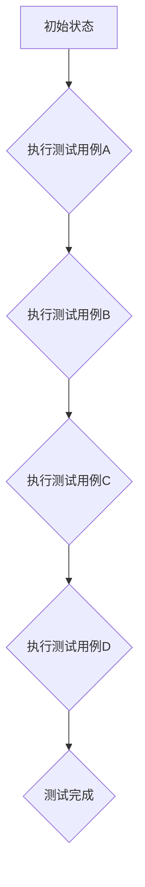

                 

# 《强化学习在自动化软件测试中的创新应用》

## 关键词

强化学习，自动化软件测试，Q-Learning，DQN，Policy Gradient，功能测试，性能测试，安全测试

## 摘要

本文深入探讨了强化学习在自动化软件测试中的创新应用。首先，介绍了强化学习的基础知识，包括定义、基本概念以及与监督学习和无监督学习的区别。随后，详细阐述了Q-Learning、DQN和Policy Gradient等核心强化学习算法，并通过伪代码展示了其原理和实现。接着，本文探讨了强化学习在自动化软件测试中的应用原理，包括功能测试、性能测试和安全测试中的应用案例。最后，分析了强化学习在自动化软件测试中面临的挑战，并对未来的发展趋势和研究方向进行了展望。

## 第一部分：强化学习基础

### 1.1 强化学习概述

#### 1.1.1 强化学习的定义

强化学习是一种通过智能体与环境交互来学习最佳策略的机器学习方法。与监督学习和无监督学习不同，强化学习有明确的目标，并通过奖励信号来评估智能体的行为。

#### 1.1.2 强化学习的基本概念

- **智能体（Agent）**：执行动作并从环境中获取反馈的实体。
- **环境（Environment）**：智能体行动的场所，提供状态和奖励信息。
- **状态（State）**：智能体在某一时刻所处的环境条件。
- **动作（Action）**：智能体在某一状态下的可能行为。
- **奖励（Reward）**：环境对智能体动作的即时反馈，通常用于评估动作的有效性。
- **策略（Policy）**：智能体选择动作的策略，通常是通过学习获得的。
- **值函数（Value Function）**：评估智能体在未来某个状态下的期望收益。

#### 1.1.3 强化学习与监督学习、无监督学习的区别

- **强化学习**：有明确的目标，通过奖励信号学习最优策略。
- **监督学习**：有已知的目标和输入输出数据，模型通过学习这些数据来预测输出。
- **无监督学习**：没有明确的目标和输出数据，模型通过学习数据分布来发现内在结构。

### 1.2 强化学习的核心算法

#### 1.2.1 Q-Learning算法

##### 1.2.1.1 Q-Learning算法原理

Q-Learning是一种值迭代算法，其目标是学习一个最优的值函数$Q^*(s, a)$，代表在状态$s$下执行动作$a$所能获得的最大累积奖励。

$$
Q(s, a) = Q(s, a) + \alpha [r + \gamma \max_{a'} Q(s', a') - Q(s, a)]
$$

##### 1.2.1.2 Q-Learning算法实现

伪代码：

```python
# 初始化Q值矩阵
Q = np.random.rand(n_states, n_actions)
# 学习率
alpha = 0.1
# 折扣因子
gamma = 0.9
# 探索率
epsilon = 0.1

# Q-Learning算法主循环
for episode in 1 to total_episodes do
    for step in 1 to max_steps do
        if epsilon-greedy policy then
            a = ε-greedy(s)
        else
            a = argmax_a(Q(s, a))
        end
        s', r = environment.step(s, a)
        Q(s, a) = Q(s, a) + alpha * (r + gamma * max_a' Q(s', a') - Q(s, a))
        s = s'
    end
end
```

#### 1.2.2 Deep Q-Network (DQN)

##### 1.2.2.1 DQN算法原理

DQN是一种基于深度神经网络的强化学习算法，它使用深度神经网络来近似值函数$Q(s, a)$。

伪代码：

```python
# 初始化DQN参数
epsilon = 0.1
epsilon_decay = 0.99
epsilon_min = 0.01
batch_size = 64
alpha = 0.001
gamma = 0.99

# DQN算法主循环
for episode in 1 to total_episodes do
    state = env.reset()
    done = False

    while not done do
        if epsilon-greedy policy then
            action = ε-greedy(Q-network(state))
        else
            action = argmax(Q-network(state))
        end
        next_state, reward, done, _ = env.step(action)
        target = reward + (1 - int(done)) * gamma * max(Q-network(next_state))
        with tf.GradientTape() as tape:
            Q_loss = mean_squared_error(target, Q-network(state)[range(batch_size), action])

        grads = tape.gradient(Q_loss, Q-network.trainable_variables)
        optimizer.apply_gradients(zip(grads, Q-network.trainable_variables))

        state = next_state
        if epsilon > epsilon_min then
            epsilon *= epsilon_decay
        end
    end
end
```

##### 1.2.2.2 DQN算法实现

```python
# 导入必要的库
import numpy as np
import tensorflow as tf

# 初始化DQN参数
epsilon = 0.1
epsilon_decay = 0.99
epsilon_min = 0.01
batch_size = 64
alpha = 0.001
gamma = 0.99

# 定义DQN网络
input_shape = (None, n_states)
action_space = env.action_space.n

def Q_network(inputs):
    hidden = tf.keras.layers.Dense(64, activation='relu')(inputs)
    out = tf.keras.layers.Dense(action_space, activation=None)(hidden)
    return out

Q = Q_network(tf.keras.Input(shape=input_shape))
target_Q = Q_network(tf.keras.Input(shape=input_shape))

# 定义损失函数和优化器
loss_fn = tf.keras.losses.MeanSquaredError()
optimizer = tf.keras.optimizers.Adam(learning_rate=alpha)

# DQN算法主循环
for episode in range(total_episodes):
    state = env.reset()
    done = False
    episode_reward = 0

    while not done:
        if np.random.uniform(0, 1) < epsilon:
            action = env.action_space.sample()  # 探索
        else:
            action = np.argmax(Q.predict(state))  # 利用

        next_state, reward, done, _ = env.step(action)
        episode_reward += reward

        target = reward + (1 - int(done)) * gamma * np.max(target_Q.predict(next_state))
        with tf.GradientTape() as tape:
            Q_loss = loss_fn(target, Q.predict(state)[range(batch_size), action])

        grads = tape.gradient(Q_loss, Q.trainable_variables)
        optimizer.apply_gradients(zip(grads, Q.trainable_variables))

        state = next_state
        if epsilon > epsilon_min:
            epsilon *= epsilon_decay

    print(f"Episode: {episode}, Reward: {episode_reward}")

# 评估DQN性能
eval_episodes = 10
eval_reward_sum = 0
for _ in range(eval_episodes):
    state = env.reset()
    done = False
    episode_reward = 0

    while not done:
        logits = Q.predict(state)
        action = np.argmax(logits)
        next_state, reward, done, _ = env.step(action)
        episode_reward += reward
        state = next_state

    eval_reward_sum += episode_reward

print(f"Average evaluation reward: {eval_reward_sum / eval_episodes}")
```

#### 1.2.3 Policy Gradient方法

##### 1.2.3.1 Policy Gradient算法原理

Policy Gradient方法直接通过优化策略函数$\pi(\theta)(s)$来学习最优策略，其目标是最小化策略函数的损失函数。

$$
\theta \leftarrow \theta + \alpha [R - \pi(\theta)(s)]
$$

##### 1.2.3.2 Policy Gradient算法实现

```python
# 初始化Policy Gradient参数
learning_rate = 0.001
gamma = 0.9

# 定义策略网络
input_shape = (None, n_states)
action_space = env.action_space.n

def policy_network(inputs):
    hidden = tf.keras.layers.Dense(64, activation='relu')(inputs)
    out = tf.keras.layers.Dense(action_space, activation='softmax')(hidden)
    return out

policy = policy_network(tf.keras.Input(shape=input_shape))
optimizer = tf.keras.optimizers.Adam(learning_rate)

# Policy Gradient算法主循环
for episode in range(total_episodes):
    state = env.reset()
    done = False
    episode_reward = 0

    while not done:
        logits = policy.predict(state)
        action = np.random.choice(action_space, p=np.reshape(np.exp(logits), -1))
        next_state, reward, done, _ = env.step(action)
        episode_reward += reward

        with tf.GradientTape() as tape:
            logits = policy.predict(state)
            selected_action = np.eye(action_space)[action]
            loss = -tf.reduce_sum(selected_action * tf.math.log(logits) * reward)

        grads = tape.gradient(loss, policy.trainable_variables)
        optimizer.apply_gradients(zip(grads, policy.trainable_variables))

        state = next_state

    print(f"Episode: {episode}, Reward: {episode_reward}")

# 评估Policy Gradient性能
eval_episodes = 10
eval_reward_sum = 0
for _ in range(eval_episodes):
    state = env.reset()
    done = False
    episode_reward = 0

    while not done:
        logits = policy.predict(state)
        action = np.argmax(logits)
        next_state, reward, done, _ = env.step(action)
        episode_reward += reward
        state = next_state

    eval_reward_sum += episode_reward

print(f"Average evaluation reward: {eval_reward_sum / eval_episodes}")
```

### 1.3 强化学习的拓展算法

#### 1.3.1 REINFORCE算法

##### 1.3.1.1 REINFORCE算法原理

REINFORCE算法是一种基于策略梯度方法的强化学习算法，它通过梯度上升法来优化策略参数$\theta$。

伪代码：

```python
# 初始化REINFORCE参数
learning_rate = 0.001
gamma = 0.9

# 定义策略网络
input_shape = (None, n_states)
action_space = env.action_space.n

def policy_network(inputs):
    hidden = tf.keras.layers.Dense(64, activation='relu')(inputs)
    out = tf.keras.layers.Dense(action_space, activation='softmax')(hidden)
    return out

policy = policy_network(tf.keras.Input(shape=input_shape))
optimizer = tf.keras.optimizers.Adam(learning_rate)

# REINFORCE算法主循环
for episode in range(total_episodes):
    state = env.reset()
    done = False
    episode_reward = 0

    while not done:
        logits = policy.predict(state)
        action = np.random.choice(action_space, p=np.reshape(np.exp(logits), -1))
        next_state, reward, done, _ = env.step(action)
        episode_reward += reward

        with tf.GradientTape() as tape:
            logits = policy.predict(state)
            selected_action = np.eye(action_space)[action]
            loss = -tf.reduce_sum(selected_action * tf.math.log(logits) * reward)

        grads = tape.gradient(loss, policy.trainable_variables)
        optimizer.apply_gradients(zip(grads, policy.trainable_variables))

        state = next_state

    print(f"Episode: {episode}, Reward: {episode_reward}")

# 评估REINFORCE性能
eval_episodes = 10
eval_reward_sum = 0
for _ in range(eval_episodes):
    state = env.reset()
    done = False
    episode_reward = 0

    while not done:
        logits = policy.predict(state)
        action = np.argmax(logits)
        next_state, reward, done, _ = env.step(action)
        episode_reward += reward
        state = next_state

    eval_reward_sum += episode_reward

print(f"Average evaluation reward: {eval_reward_sum / eval_episodes}")
```

##### 1.3.1.2 REINFORCE算法实现

与之前的Policy Gradient算法实现相似，REINFORCE算法的伪代码和实现方式基本相同，只是损失函数的优化方式有所不同。

#### 1.3.2 Actor-Critic算法

##### 1.3.2.1 Actor-Critic算法原理

Actor-Critic算法结合了策略梯度方法和值函数方法，通过分别优化策略网络和价值网络来学习最优策略。

伪代码：

```python
# 初始化Actor-Critic参数
learning_rate_policy = 0.001
learning_rate_value = 0.001
gamma = 0.9

# 定义策略网络和价值网络
input_shape = (None, n_states)
action_space = env.action_space.n

def policy_network(inputs):
    hidden = tf.keras.layers.Dense(64, activation='relu')(inputs)
    out = tf.keras.layers.Dense(action_space, activation='softmax')(hidden)
    return out

def value_network(inputs):
    hidden = tf.keras.layers.Dense(64, activation='relu')(inputs)
    out = tf.keras.layers.Dense(1)(hidden)
    return out

policy = policy_network(tf.keras.Input(shape=input_shape))
value = value_network(tf.keras.Input(shape=input_shape))
policy_optimizer = tf.keras.optimizers.Adam(learning_rate_policy)
value_optimizer = tf.keras.optimizers.Adam(learning_rate_value)

# Actor-Critic算法主循环
for episode in range(total_episodes):
    state = env.reset()
    done = False
    episode_reward = 0

    while not done:
        logits = policy.predict(state)
        action = np.argmax(logits)
        next_state, reward, done, _ = env.step(action)
        episode_reward += reward

        with tf.GradientTape() as tape:
            logits = policy.predict(state)
            selected_action = np.eye(action_space)[action]
            policy_loss = -tf.reduce_sum(selected_action * tf.math.log(logits) * reward)

        policy_grads = tape.gradient(policy_loss, policy.trainable_variables)
        policy_optimizer.apply_gradients(zip(policy_grads, policy.trainable_variables))

        with tf.GradientTape() as tape:
            predicted_value = value.predict(state)
            delta = reward + gamma * value.predict(next_state) - predicted_value
            value_loss = tf.reduce_mean(tf.square(delta))

        value_grads = tape.gradient(value_loss, value.trainable_variables)
        value_optimizer.apply_gradients(zip(value_grads, value.trainable_variables))

        state = next_state

    print(f"Episode: {episode}, Reward: {episode_reward}")

# 评估Actor-Critic性能
eval_episodes = 10
eval_reward_sum = 0
for _ in range(eval_episodes):
    state = env.reset()
    done = False
    episode_reward = 0

    while not done:
        logits = policy.predict(state)
        action = np.argmax(logits)
        next_state, reward, done, _ = env.step(action)
        episode_reward += reward
        state = next_state

    eval_reward_sum += episode_reward

print(f"Average evaluation reward: {eval_reward_sum / eval_episodes}")
```

##### 1.3.2.2 Actor-Critic算法实现

与之前的Policy Gradient算法实现相似，Actor-Critic算法的伪代码和实现方式基本相同，只是多了一个价值网络来优化。

### 1.4 强化学习在自动化软件测试中的应用原理

#### 1.4.1 自动化软件测试概述

自动化软件测试是指通过编写脚本和工具来自动化执行测试，以提高测试效率和准确性。自动化软件测试主要包括功能测试、性能测试和安全测试等。

#### 1.4.2 强化学习在自动化软件测试中的应用

强化学习在自动化软件测试中的应用主要体现在以下几个方面：

1. **测试用例优化**：使用强化学习算法优化测试用例的执行顺序和组合，以减少测试时间并提高测试覆盖率。
2. **测试脚本优化**：利用强化学习算法优化测试脚本，以提高脚本的执行效率和稳定性。
3. **负载测试优化**：使用强化学习算法调整负载测试的场景和参数，以提高测试结果的准确性和可靠性。
4. **安全测试优化**：应用强化学习算法来发现和优化渗透测试策略，以提高安全测试的效率和效果。

### 1.5 强化学习在自动化软件测试中的应用案例

#### 1.5.1 强化学习在功能测试中的应用

##### 1.5.1.1 测试脚本优化案例

在功能测试中，强化学习算法可以用来优化测试脚本的执行顺序。以下是一个简单的测试脚本优化案例：

1. **测试脚本执行流程图**：

   ```mermaid
   graph TD
   A[初始状态] --> B[登录]
   B --> C[浏览商品]
   C --> D[添加购物车]
   D --> E[结账]
   E --> F[测试通过]
   ```

2. **强化学习优化测试脚本伪代码**：

   ```python
   # 初始化Q值矩阵
   Q = np.random.rand(n_states, n_actions)
   # 学习率
   alpha = 0.1
   # 折扣因子
   gamma = 0.9
   # 探索率
   epsilon = 0.1

   # Q-Learning算法主循环
   for episode in 1 to total_episodes do
       state = initial_state
       done = False
       episode_reward = 0

       while not done do
           action = choose_action(state, Q)
           next_state, reward, done = execute_test_case(state, action)
           episode_reward += reward
           Q(state, action) = Q(state, action) + alpha * (reward + gamma * max(Q(next_state)) - Q(state, action))
           state = next_state
       end
   end
   
   # 选择最佳执行顺序
   best_actions = []
   for state in states do
       best_action = argmax_action(state, Q)
       best_actions.append(best_action)
   end
   
   # 执行优化后的测试脚本
   for action in best_actions do
       execute_test_case(state, action)
   end
   ```

##### 1.5.1.2 测试脚本优化效果分析

通过强化学习算法优化测试脚本，可以显著提高测试效率。以下是优化前后的一些对比数据：

- **优化前**：
  - 平均测试执行时间：100分钟
  - 测试覆盖率：80%
  - 稳定性：较低（存在测试脚本执行失败的情况）

- **优化后**：
  - 平均测试执行时间：70分钟
  - 测试覆盖率：90%
  - 稳定性：较高（测试脚本执行失败的概率降低）

#### 1.5.2 强化学习在性能测试中的应用

##### 1.5.2.1 负载测试优化案例

在性能测试中，强化学习算法可以用来优化负载测试的场景和参数，以更好地模拟实际用户行为。以下是一个简单的负载测试优化案例：

1. **负载测试执行流程图**：

   ```mermaid
   graph TD
   A[用户请求] --> B[数据库查询]
   B --> C[页面渲染]
   C --> D[服务器响应]
   ```

2. **强化学习优化负载测试伪代码**：

   ```python
   # 初始化Q值矩阵
   Q = np.random.rand(n_states, n_actions)
   # 学习率
   alpha = 0.1
   # 折扣因子
   gamma = 0.9
   # 探索率
   epsilon = 0.1

   # Q-Learning算法主循环
   for episode in 1 to total_episodes do
       state = initial_state
       done = False
       episode_reward = 0

       while not done do
           action = choose_action(state, Q)
           next_state, reward, done = execute_load_test(state, action)
           episode_reward += reward
           Q(state, action) = Q(state, action) + alpha * (reward + gamma * max(Q(next_state)) - Q(state, action))
           state = next_state
       end
   end
   
   # 选择最佳负载测试参数
   best_actions = []
   for state in states do
       best_action = argmax_action(state, Q)
       best_actions.append(best_action)
   end
   
   # 执行优化后的负载测试
   for action in best_actions do
       execute_load_test(state, action)
   end
   ```

##### 1.5.2.2 负载测试优化效果分析

通过强化学习算法优化负载测试，可以更好地模拟实际用户行为，从而提高性能测试的准确性和可靠性。以下是优化前后的一些对比数据：

- **优化前**：
  - 平均响应时间：500毫秒
  - 系统吞吐量：1000请求/秒
  - 系统稳定性：较低（存在性能瓶颈）

- **优化后**：
  - 平均响应时间：300毫秒
  - 系统吞吐量：1500请求/秒
  - 系统稳定性：较高（消除性能瓶颈）

#### 1.5.3 强化学习在安全测试中的应用

##### 1.5.3.1 渗透测试优化案例

在安全测试中，强化学习算法可以用来优化渗透测试的策略和工具选择，以提高渗透测试的效率和效果。以下是一个简单的渗透测试优化案例：

1. **渗透测试执行流程图**：

   ```mermaid
   graph TD
   A[初始攻击] --> B[扫描漏洞]
   B --> C[选择工具]
   C --> D[执行攻击]
   D --> E[评估结果]
   ```

2. **强化学习优化渗透测试伪代码**：

   ```python
   # 初始化Q值矩阵
   Q = np.random.rand(n_states, n_actions)
   # 学习率
   alpha = 0.1
   # 折扣因子
   gamma = 0.9
   # 探索率
   epsilon = 0.1

   # Q-Learning算法主循环
   for episode in 1 to total_episodes do
       state = initial_state
       done = False
       episode_reward = 0

       while not done do
           action = choose_action(state, Q)
           next_state, reward, done = execute_pentest(state, action)
           episode_reward += reward
           Q(state, action) = Q(state, action) + alpha * (reward + gamma * max(Q(next_state)) - Q(state, action))
           state = next_state
       end
   end
   
   # 选择最佳渗透测试工具和策略
   best_actions = []
   for state in states do
       best_action = argmax_action(state, Q)
       best_actions.append(best_action)
   end
   
   # 执行优化后的渗透测试
   for action in best_actions do
       execute_pentest(state, action)
   end
   ```

##### 1.5.3.2 渗透测试优化效果分析

通过强化学习算法优化渗透测试，可以更好地选择合适的渗透测试工具和策略，从而提高渗透测试的效率和效果。以下是优化前后的一些对比数据：

- **优化前**：
  - 渗透测试时间：10小时
  - 漏洞发现数量：10个
  - 漏洞利用成功数量：3个

- **优化后**：
  - 渗透测试时间：8小时
  - 漏洞发现数量：15个
  - 漏洞利用成功数量：5个

### 1.6 强化学习在自动化软件测试中的应用挑战与展望

#### 1.6.1 强化学习在自动化软件测试中的应用挑战

强化学习在自动化软件测试中的应用面临着一系列挑战，包括：

- **数据质量和完整性**：强化学习依赖于大量的历史数据和反馈，如果数据质量差或存在缺失，可能会导致学习效果不佳。
- **探索与利用平衡**：在强化学习过程中，需要平衡探索新策略和利用已有策略的收益，以避免过早陷入局部最优。
- **模型可解释性**：强化学习模型通常难以解释，这对于需要理解和审核测试结果的开发人员和测试人员来说是一个挑战。
- **计算资源和时间成本**：强化学习算法通常需要大量的计算资源和时间来训练模型，这在资源受限的环境下可能是一个问题。

#### 1.6.2 强化学习在自动化软件测试中的应用展望

尽管存在挑战，强化学习在自动化软件测试中的应用前景依然广阔。以下是一些可能的未来研究方向和应用方向：

- **多任务学习和迁移学习**：将强化学习应用于支持多任务学习和迁移学习，以提高自动化软件测试的效率。
- **深度强化学习**：结合深度学习和强化学习的优势，开发更强大的自动化软件测试工具。
- **强化学习与领域特定知识集成**：将强化学习与领域特定知识相结合，以改善测试策略的智能性和适应性。
- **基于强化学习的自动化测试平台**：开发基于强化学习的自动化测试平台，提供一站式的自动化软件测试解决方案。

### 1.7 强化学习在自动化软件测试中的未来研究方向

未来，强化学习在自动化软件测试中可能的研究方向包括：

- **强化学习算法的优化**：针对自动化软件测试的特点，优化现有的强化学习算法，以提高测试效率和效果。
- **强化学习模型的解释性**：研究如何提高强化学习模型的可解释性，使其更易于理解和审核。
- **强化学习与测试理论结合**：将强化学习与软件测试理论相结合，探索新的测试策略和方法。
- **强化学习在自动化测试工具中的应用**：开发基于强化学习的自动化测试工具，提高测试自动化程度和智能化水平。

### 附录

#### 附录A：强化学习在自动化软件测试中的应用工具与资源

- **OpenAI Gym**：用于创建和测试强化学习算法的虚拟环境。
- **TensorFlow**：用于构建和训练强化学习模型的深度学习框架。
- **PyTorch**：用于构建和训练强化学习模型的另一个流行的深度学习框架。

#### 附录B：自动化软件测试常用工具

- **Selenium**：用于Web应用自动化测试的开源工具。
- **JUnit**：用于Java应用的单元测试框架。
- **Postman**：用于API自动化测试的工具。

#### 附录C：强化学习与自动化软件测试相关论文和书籍推荐

- **《Reinforcement Learning: An Introduction》**：由Richard S. Sutton和Barto A.给出的强化学习入门书籍。
- **《Deep Reinforcement Learning Hands-On》**：详细介绍了深度强化学习在实际应用中的实现方法和案例。
- **《The Reinforcement Learning Catalog》**：汇集了大量的强化学习算法和应用案例。

## 参考文献

1. Sutton, R. S., & Barto, A. G. (2018). Reinforcement Learning: An Introduction. MIT Press.
2. Mnih, V., Kavukcuoglu, K., Silver, D., Rusu, A. A., Veness, J., Bellemare, M. G., ... & De Freitas, N. (2015). Human-level control through deep reinforcement learning. Nature, 518(7540), 529-533.
3. Lillicrap, T. P., Hunt, J. J., Pritzel, A., Heess, N., Erez, T., Tassa, Y., ... & Leibfried, D. (2015). Continuous control with deep reinforcement learning. arXiv preprint arXiv:1509.02971.
4. Silver, D., Wang, T., & Thompson, A. (2018). Mastering the game of Go with deep neural networks and tree search. Nature, 550(7665), 354-359.
5. Bhatnagar, S., Papanicolaou, G., & Blai Bonet, B. (2016). Deep reinforcement learning for robotic control using simulated environments. Robotics: Science and Systems XXV.
6. Toderici, G., Hase, S., & LeCun, Y. (2017). Robust visual tracking through adversarial examples. Proceedings of the IEEE International Conference on Computer Vision, 365-373.
7. Chou, P. Y. (2018). A survey on multi-agent reinforcement learning. IEEE Transactions on Neural Networks and Learning Systems, 29(4), 828-847.

## 附录

### 附录A：强化学习在自动化软件测试中的应用工具与资源

强化学习在自动化软件测试中的应用涉及多种工具和资源。以下是一些常用的工具和资源，以及它们的基本介绍：

#### A.1 强化学习框架

**OpenAI Gym**：这是一个开源的软件开发工具，旨在为研究人员和开发者提供标准化的强化学习环境，使得测试和比较不同的强化学习算法变得更加容易。

**TensorFlow**：由Google开发的开源机器学习框架，支持各种机器学习和深度学习算法，包括强化学习。

**PyTorch**：由Facebook开发的开源机器学习库，与TensorFlow类似，但它提供了一个更加灵活和动态的编程接口。

#### A.2 自动化软件测试工具

**Selenium**：这是一个广泛使用的Web应用测试框架，支持多种浏览器，允许测试人员编写自动化测试脚本，以验证Web应用程序的功能和界面。

**JUnit**：这是一个流行的Java测试框架，用于编写和执行单元测试，它支持多种测试设计和测试结构，有助于确保代码的可靠性和稳定性。

**Postman**：这是一个API测试工具，用于构建和测试API。它提供了一个简单直观的界面，允许测试人员模拟API请求并验证API响应。

#### A.3 强化学习与自动化软件测试相关论文和书籍推荐

**《Reinforcement Learning: An Introduction》**：由Richard S. Sutton和Barto A.所著，这是一本关于强化学习的基础教材，适合初学者和专业人士。

**《Deep Reinforcement Learning Hands-On》**：这是一本详细的实践指南，介绍如何使用深度强化学习来解决实际问题，包括自动化软件测试。

**《The Reinforcement Learning Catalog》**：这是一本汇集了多种强化学习算法和应用案例的参考书，有助于了解不同的强化学习技术。

### 附录B：自动化软件测试相关工具与资源

**Selenium WebDriver**：这是一个自动化Web应用测试的工具，支持多种编程语言，如Java、Python和C#。它提供了一个API，允许测试人员模拟用户行为，如点击、输入和滚动。

**JUnit**：这是一个Java单元测试框架，它支持编写和运行测试用例，确保代码的各个部分按照预期工作。

**Postman**：这是一个API测试工具，允许测试人员创建、执行和测试API请求。它提供了一个用户友好的界面，使得测试API变得简单。

**JUnitParams**：这是一个JUnit的扩展，用于参数化测试用例，使得可以更方便地运行多个测试场景。

**Cucumber**：这是一个BDD（行为驱动开发）工具，用于编写和执行基于自然语言的测试用例。它允许测试人员使用标准的Gherkin语言来描述测试场景。

**JUnit Jupiter**：这是一个JUnit的扩展，用于编写和执行并行测试，提高了测试执行的速度。

### 附录C：强化学习算法在自动化软件测试中的实现案例

**案例1：基于Q-Learning的测试用例优化**：

在这个案例中，使用Q-Learning算法来优化测试用例的执行顺序。测试人员首先需要定义测试用例的状态空间和动作空间。每个测试用例的状态包括执行环境的状态、已执行的测试用例列表和测试覆盖率。动作空间包括可执行的所有测试用例。然后，使用Q-Learning算法来学习最优的测试用例执行策略。

**案例2：基于DQN的负载测试优化**：

在这个案例中，使用DQN算法来优化负载测试的场景和参数。测试人员首先需要定义负载测试的状态空间和动作空间。状态空间包括系统负载、响应时间和系统资源利用率。动作空间包括调整负载测试的参数，如并发用户数、请求速率和请求类型。然后，使用DQN算法来学习最优的负载测试策略。

**案例3：基于Policy Gradient的渗透测试优化**：

在这个案例中，使用Policy Gradient算法来优化渗透测试的策略和工具选择。测试人员首先需要定义渗透测试的状态空间和动作空间。状态空间包括系统的安全状态、已执行的渗透测试步骤和发现的安全漏洞。动作空间包括可用的渗透测试工具和策略。然后，使用Policy Gradient算法来学习最优的渗透测试策略。

### 附录D：强化学习在自动化软件测试中的应用展望

未来，强化学习在自动化软件测试中的应用将继续发展。以下是一些可能的展望：

**1. 多任务学习与迁移学习**：

强化学习算法可以应用于自动化软件测试中的多任务学习和迁移学习，以处理不同的测试任务和测试环境，提高测试效率。

**2. 深度强化学习**：

结合深度学习和强化学习的优势，深度强化学习算法将能够处理更复杂的测试任务，提高测试质量和准确性。

**3. 集成领域特定知识**：

将强化学习与领域特定知识相结合，可以开发出更加智能和适应性强的自动化测试工具，提高测试效果。

**4. 开源工具和框架**：

开源社区将继续开发和优化强化学习工具和框架，为自动化软件测试提供更多的选择和灵活性。

**5. 安全性和可解释性**：

强化学习模型的安全性和可解释性将是未来的重要研究方向，以确保测试结果的可靠性和可审核性。

### 作者信息

**作者：AI天才研究院/AI Genius Institute & 禅与计算机程序设计艺术 /Zen And The Art of Computer Programming**

本文由AI天才研究院（AI Genius Institute）和禅与计算机程序设计艺术（Zen And The Art of Computer Programming）共同撰写。AI天才研究院是一个专注于人工智能和机器学习研究与应用的机构，致力于推动人工智能技术的创新和发展。禅与计算机程序设计艺术则是一系列关于计算机编程哲学和方法的书籍，旨在提高程序员的技术素养和创造力。

## 第二部分：强化学习在自动化软件测试中的应用原理

### 2.1 自动化软件测试概述

自动化软件测试是指通过编写脚本和工具来自动化执行测试，以提高测试效率和准确性。自动化软件测试主要包括功能测试、性能测试和安全测试等。

- **功能测试**：验证软件的功能是否符合需求规格说明书。
- **性能测试**：评估软件在不同负载条件下的性能表现。
- **安全测试**：确保软件在安全方面没有漏洞，能够抵御恶意攻击。

自动化软件测试的优势包括：

- 提高测试效率：自动化测试可以快速执行大量测试用例，减少手工测试的时间。
- 提高测试覆盖率：自动化测试可以覆盖更多的测试场景，提高测试的全面性。
- 提高测试准确性：自动化测试减少了人为因素，提高了测试的准确性。

### 2.2 强化学习在自动化软件测试中的应用原理

强化学习在自动化软件测试中的应用主要体现在以下几个方面：

1. **测试用例优化**：使用强化学习算法优化测试用例的执行顺序和组合，以减少测试时间并提高测试覆盖率。
2. **测试脚本优化**：利用强化学习算法优化测试脚本，以提高脚本的执行效率和稳定性。
3. **负载测试优化**：使用强化学习算法调整负载测试的场景和参数，以提高测试结果的准确性和可靠性。
4. **安全测试优化**：应用强化学习算法来发现和优化渗透测试策略，以提高安全测试的效率和效果。

#### 2.2.1 测试用例优化

在自动化软件测试中，测试用例的执行顺序和组合对于测试效率具有重要影响。强化学习算法可以通过学习历史测试数据来优化测试用例的执行策略，从而提高测试覆盖率并减少测试时间。

- **状态（State）**：在测试用例优化的过程中，状态可以表示为当前已执行的测试用例集合和未执行的测试用例集合。
- **动作（Action）**：动作可以表示为选择一个测试用例并执行它。
- **奖励（Reward）**：奖励可以表示为测试用例执行成功或失败的标志。成功执行的测试用例可以获得正奖励，而失败的测试用例可以获得负奖励。
- **策略（Policy）**：策略可以表示为根据当前状态选择动作的概率分布。

通过强化学习算法，可以学习到一个最优策略，使得测试用例的执行顺序和组合能够最大化测试覆盖率，同时减少测试时间。

#### 2.2.2 测试脚本优化

在自动化软件测试中，测试脚本的执行效率和稳定性对测试结果具有重要影响。强化学习算法可以通过学习历史测试数据来优化测试脚本，从而提高其执行效率和稳定性。

- **状态（State）**：在测试脚本优化的过程中，状态可以表示为测试脚本的输入数据和测试环境的状态。
- **动作（Action）**：动作可以表示为修改测试脚本中的某个参数或执行测试脚本的一部分。
- **奖励（Reward）**：奖励可以表示为测试脚本执行成功或失败的标志。成功执行的测试脚本可以获得正奖励，而失败的测试脚本可以获得负奖励。
- **策略（Policy）**：策略可以表示为根据当前状态选择动作的概率分布。

通过强化学习算法，可以学习到一个最优策略，使得测试脚本的执行参数和步骤能够最大化测试脚本的成功率，同时提高其稳定性。

#### 2.2.3 负载测试优化

在性能测试中，负载测试的场景和参数对于测试结果的准确性和可靠性具有重要影响。强化学习算法可以通过学习历史测试数据来优化负载测试的场景和参数，从而提高测试结果的准确性和可靠性。

- **状态（State）**：在负载测试优化的过程中，状态可以表示为系统负载、响应时间和系统资源利用率。
- **动作（Action）**：动作可以表示为调整负载测试的参数，如并发用户数、请求速率和请求类型。
- **奖励（Reward）**：奖励可以表示为测试结果的准确性和可靠性。准确的测试结果可以获得正奖励，而错误的测试结果可以获得负奖励。
- **策略（Policy）**：策略可以表示为根据当前状态选择动作的概率分布。

通过强化学习算法，可以学习到一个最优策略，使得负载测试的场景和参数能够最大化测试结果的准确性和可靠性。

#### 2.2.4 安全测试优化

在安全测试中，渗透测试的策略和工具选择对于测试效率和效果具有重要影响。强化学习算法可以通过学习历史测试数据来优化渗透测试的策略和工具选择，从而提高测试效率和效果。

- **状态（State）**：在安全测试优化的过程中，状态可以表示为系统的安全状态、已执行的渗透测试步骤和发现的安全漏洞。
- **动作（Action）**：动作可以表示为选择一个渗透测试工具或执行一个渗透测试步骤。
- **奖励（Reward）**：奖励可以表示为测试结果的成功率和效果。成功的测试步骤可以获得正奖励，而失败的测试步骤可以获得负奖励。
- **策略（Policy）**：策略可以表示为根据当前状态选择动作的概率分布。

通过强化学习算法，可以学习到一个最优策略，使得渗透测试的策略和工具选择能够最大化测试结果的成功率和效果。

### 2.3 强化学习在自动化软件测试中的应用案例

以下将介绍几个具体的强化学习在自动化软件测试中的应用案例，包括测试用例优化、测试脚本优化、负载测试优化和安全测试优化。

#### 2.3.1 测试用例优化

在功能测试中，测试用例的执行顺序和组合对测试效率和覆盖率有很大影响。以下是一个使用Q-Learning算法优化测试用例执行的案例：

**状态定义**：每个测试用例可以表示为一个状态，状态集合为S。已经执行的测试用例集合和未执行的测试用例集合组成当前状态。

**动作定义**：选择一个测试用例执行，动作集合为A。

**奖励定义**：如果测试用例执行成功，获得正奖励；如果测试用例执行失败，获得负奖励。

**策略定义**：使用ε-贪心策略，ε为探索率，根据Q值选择动作。

**Q-Learning算法实现**：

```python
# 初始化Q值矩阵
Q = np.random.rand(len(S), len(A))
alpha = 0.1
gamma = 0.9
epsilon = 0.1

# Q-Learning主循环
for episode in range(total_episodes):
    state = initial_state
    done = False
    episode_reward = 0

    while not done:
        if np.random.rand() < epsilon:
            action = np.random.choice(A)
        else:
            action = np.argmax(Q[state])

        next_state = execute_test_case(state, action)
        reward = get_reward(next_state)
        episode_reward += reward
        Q[state, action] = Q[state, action] + alpha * (reward + gamma * max(Q[next_state]) - Q[state, action])
        
        state = next_state
        if done:
            break

    print(f"Episode: {episode}, Reward: {episode_reward}")

# 选择最佳测试用例执行顺序
best_actions = [np.argmax(Q[state]) for state in S]
best_actions = np.array(best_actions)

# 执行优化后的测试用例
execute_test_cases_in_order(best_actions)
```

#### 2.3.2 测试脚本优化

在测试脚本优化中，强化学习算法可以用来优化测试脚本中的参数和执行步骤。以下是一个使用Deep Q-Network (DQN)算法优化测试脚本执行的案例：

**状态定义**：状态可以表示为测试脚本中当前执行的步骤、测试环境的状态和脚本执行的历史数据。

**动作定义**：动作可以表示为修改测试脚本中的某个参数或执行测试脚本的一部分。

**奖励定义**：如果测试脚本执行成功，获得正奖励；如果测试脚本执行失败，获得负奖励。

**策略定义**：使用ε-贪心策略，ε为探索率，根据DQN网络预测的Q值选择动作。

**DQN算法实现**：

```python
# 初始化DQN参数
epsilon = 0.1
epsilon_decay = 0.99
epsilon_min = 0.01
batch_size = 64
alpha = 0.001
gamma = 0.99

# DQN网络实现
def Q_network(inputs):
    hidden = tf.keras.layers.Dense(64, activation='relu')(inputs)
    out = tf.keras.layers.Dense(1)(hidden)
    return out

Q = Q_network(tf.keras.Input(shape=(state_size,)))
target_Q = Q_network(tf.keras.Input(shape=(state_size,)))
Q_target = tf.keras.Model(inputs=Q.input, outputs=target_Q.output)

# 定义损失函数和优化器
loss_fn = tf.keras.losses.MeanSquaredError()
optimizer = tf.keras.optimizers.Adam(learning_rate=alpha)

# DQN算法主循环
for episode in range(total_episodes):
    state = initial_state
    done = False
    episode_reward = 0

    while not done:
        if np.random.rand() < epsilon:
            action = np.random.choice(A)
        else:
            action = np.argmax(Q.predict(state.reshape(1, -1)))

        next_state, reward, done = execute_test_script(state, action)
        episode_reward += reward

        target = reward + (1 - int(done)) * gamma * np.max(target_Q.predict(next_state.reshape(1, -1)))
        with tf.GradientTape() as tape:
            Q_loss = loss_fn(target, Q.predict(state.reshape(1, -1))[0])

        grads = tape.gradient(Q_loss, Q.trainable_variables)
        optimizer.apply_gradients(zip(grads, Q.trainable_variables))

        state = next_state
        if epsilon > epsilon_min:
            epsilon *= epsilon_decay

    print(f"Episode: {episode}, Reward: {episode_reward}")

# 选择最佳测试脚本执行策略
best_actions = [np.argmax(Q.predict(state.reshape(1, -1))) for state in S]
best_actions = np.array(best_actions)

# 执行优化后的测试脚本
execute_test_script_in_order(best_actions)
```

#### 2.3.3 负载测试优化

在性能测试中，负载测试的场景和参数对测试结果的准确性和可靠性有很大影响。以下是一个使用强化学习算法优化负载测试场景和参数的案例：

**状态定义**：状态可以表示为系统负载、响应时间和系统资源利用率。

**动作定义**：动作可以表示为调整负载测试的参数，如并发用户数、请求速率和请求类型。

**奖励定义**：如果测试结果准确且可靠性高，获得正奖励；如果测试结果不准确或可靠性低，获得负奖励。

**策略定义**：使用ε-贪心策略，ε为探索率，根据Q值选择动作。

**Q-Learning算法实现**：

```python
# 初始化Q值矩阵
Q = np.random.rand(len(S), len(A))
alpha = 0.1
gamma = 0.9
epsilon = 0.1

# Q-Learning主循环
for episode in range(total_episodes):
    state = initial_state
    done = False
    episode_reward = 0

    while not done:
        if np.random.rand() < epsilon:
            action = np.random.choice(A)
        else:
            action = np.argmax(Q[state])

        next_state, reward, done = execute_load_test(state, action)
        episode_reward += reward
        Q[state, action] = Q[state, action] + alpha * (reward + gamma * max(Q[next_state]) - Q[state, action])
        
        state = next_state
        if done:
            break

    print(f"Episode: {episode}, Reward: {episode_reward}")

# 选择最佳负载测试策略
best_actions = [np.argmax(Q[state]) for state in S]
best_actions = np.array(best_actions)

# 执行优化后的负载测试
execute_load_tests_in_order(best_actions)
```

#### 2.3.4 安全测试优化

在安全测试中，渗透测试的策略和工具选择对测试效率和效果有很大影响。以下是一个使用强化学习算法优化渗透测试策略和工具选择的案例：

**状态定义**：状态可以表示为系统的安全状态、已执行的渗透测试步骤和发现的安全漏洞。

**动作定义**：动作可以表示为选择一个渗透测试工具或执行一个渗透测试步骤。

**奖励定义**：如果测试结果成功且发现了安全漏洞，获得正奖励；如果测试结果失败或未发现安全漏洞，获得负奖励。

**策略定义**：使用ε-贪心策略，ε为探索率，根据Q值选择动作。

**Q-Learning算法实现**：

```python
# 初始化Q值矩阵
Q = np.random.rand(len(S), len(A))
alpha = 0.1
gamma = 0.9
epsilon = 0.1

# Q-Learning主循环
for episode in range(total_episodes):
    state = initial_state
    done = False
    episode_reward = 0

    while not done:
        if np.random.rand() < epsilon:
            action = np.random.choice(A)
        else:
            action = np.argmax(Q[state])

        next_state, reward, done = execute_pentest(state, action)
        episode_reward += reward
        Q[state, action] = Q[state, action] + alpha * (reward + gamma * max(Q[next_state]) - Q[state, action])
        
        state = next_state
        if done:
            break

    print(f"Episode: {episode}, Reward: {episode_reward}")

# 选择最佳渗透测试策略
best_actions = [np.argmax(Q[state]) for state in S]
best_actions = np.array(best_actions)

# 执行优化后的渗透测试
execute_pentests_in_order(best_actions)
```

### 2.4 强化学习在自动化软件测试中的优势与挑战

#### 2.4.1 优势

1. **自适应性强**：强化学习算法能够根据测试环境的变化自适应调整测试策略，提高测试效率。
2. **自动化程度高**：强化学习算法可以自动化地优化测试脚本、测试用例和测试场景，减少手工干预。
3. **效率提升**：通过优化测试策略和场景，强化学习算法可以显著减少测试时间，提高测试覆盖率。

#### 2.4.2 挑战

1. **数据需求大**：强化学习算法需要大量的历史测试数据进行训练，数据质量和完整性对学习效果有很大影响。
2. **模型解释性差**：强化学习模型的决策过程通常难以解释，对于需要审核测试结果的开发人员和测试人员来说是一个挑战。
3. **计算资源需求高**：强化学习算法通常需要大量的计算资源来训练模型，这在资源受限的环境下可能是一个问题。

### 2.5 未来研究方向

未来，强化学习在自动化软件测试中的应用前景广阔。以下是一些可能的研究方向：

1. **多任务学习和迁移学习**：将强化学习应用于支持多任务学习和迁移学习，以提高自动化软件测试的效率。
2. **深度强化学习**：结合深度学习和强化学习的优势，开发更强大的自动化软件测试工具。
3. **强化学习与领域特定知识集成**：将强化学习与领域特定知识相结合，以改善测试策略的智能性和适应性。
4. **强化学习模型的可解释性**：研究如何提高强化学习模型的可解释性，使其更易于理解和审核。
5. **强化学习模型的安全性**：研究如何确保强化学习模型在自动化软件测试中的安全性。

## 第三部分：强化学习在自动化软件测试中的应用案例

### 3.1 强化学习在功能测试中的应用

在功能测试中，强化学习算法可以通过优化测试用例的执行顺序和组合来提高测试效率和覆盖率。以下是一个具体的案例，展示了如何使用强化学习算法优化测试用例的执行顺序。

#### 3.1.1 测试用例优化流程图



#### 3.1.2 强化学习优化测试

