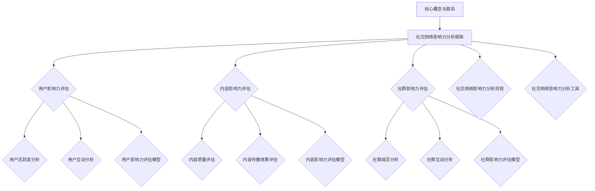

                 

# 《微博2025社交网络影响力分析专家社招面试题集》

> **关键词**：社交网络影响力、微博、用户影响力、内容影响力、社群影响力、数据分析、算法模型、营销实战、工具与平台

> **摘要**：本文旨在为2025年社交网络影响力分析专家提供一份详细的面试题集，涵盖社交网络影响力分析的基础概念、微博社交网络影响力评估与优化策略、实战案例以及工具与平台的应用。通过本文，读者将深入了解如何利用数据分析和技术手段，提升微博社交网络的影响力。

### 《微博2025社交网络影响力分析专家社招面试题集》目录大纲

**第一部分：社交网络影响力分析基础**

## 1.1 社交网络影响力概述
### 1.1.1 社交网络影响力的定义
### 1.1.2 社交网络影响力的构成
### 1.1.3 社交网络影响力的重要性

## 1.2 微博社交网络简介
### 1.2.1 微博平台概述
### 1.2.2 微博用户行为分析
### 1.2.3 微博平台发展趋势

## 1.3 社交网络影响力分析框架
### 1.3.1 社交网络影响力分析指标
### 1.3.2 社交网络影响力分析流程
### 1.3.3 社交网络影响力分析工具

**第二部分：微博社交网络影响力评估**

## 2.1 用户影响力评估
### 2.1.1 用户活跃度分析
### 2.1.2 用户互动分析
### 2.1.3 用户影响力评估模型

## 2.2 内容影响力评估
### 2.2.1 内容质量评估
### 2.2.2 内容传播效果评估
### 2.2.3 内容影响力评估模型

## 2.3 社群影响力评估
### 2.3.1 社群成员分析
### 2.3.2 社群互动分析
### 2.3.3 社群影响力评估模型

**第三部分：微博社交网络影响力优化**

## 3.1 用户影响力提升策略
### 3.1.1 用户活跃度提升策略
### 3.1.2 用户互动提升策略
### 3.1.3 用户影响力评估优化策略

## 3.2 内容影响力提升策略
### 3.2.1 内容质量优化策略
### 3.2.2 内容传播优化策略
### 3.2.3 内容影响力评估优化策略

## 3.3 社群影响力提升策略
### 3.3.1 社群成员互动策略
### 3.3.2 社群活动策略
### 3.3.3 社群影响力评估优化策略

**第四部分：微博社交网络影响力应用实战**

## 4.1 微博营销案例分析
### 4.1.1 营销目标设定
### 4.1.2 营销策略制定
### 4.1.3 营销效果评估

## 4.2 微博公关案例分析
### 4.2.1 公关目标设定
### 4.2.2 公关策略制定
### 4.2.3 公关效果评估

## 4.3 微博内容运营案例分析
### 4.3.1 内容规划
### 4.3.2 内容创作
### 4.3.3 内容推广

**第五部分：微博社交网络影响力分析工具与平台**

## 5.1 微博数据分析工具介绍
### 5.1.1 微博数据分析工具概述
### 5.1.2 数据采集与处理
### 5.1.3 数据分析与可视化

## 5.2 社交网络影响力分析平台应用
### 5.2.1 平台功能介绍
### 5.2.2 平台操作流程
### 5.2.3 平台应用案例分析

**第六部分：微博社交网络影响力分析实战项目**

## 6.1 实战项目背景介绍
### 6.1.1 项目目标
### 6.1.2 项目背景

## 6.2 数据采集与处理
### 6.2.1 数据来源
### 6.2.2 数据采集方法
### 6.2.3 数据处理流程

## 6.3 用户影响力评估与优化
### 6.3.1 用户影响力评估模型
### 6.3.2 用户影响力评估结果分析
### 6.3.3 用户影响力优化策略

## 6.4 内容影响力评估与优化
### 6.4.1 内容影响力评估模型
### 6.4.2 内容影响力评估结果分析
### 6.4.3 内容影响力优化策略

## 6.5 社群影响力评估与优化
### 6.5.1 社群影响力评估模型
### 6.5.2 社群影响力评估结果分析
### 6.5.3 社群影响力优化策略

## 6.6 项目总结与展望
### 6.6.1 项目成果总结
### 6.6.2 项目不足与改进
### 6.6.3 项目展望

**第七部分：社交网络影响力分析未来趋势与挑战**

## 7.1 未来趋势分析
### 7.1.1 技术发展趋势
### 7.1.2 应用场景扩展

## 7.2 挑战与应对策略
### 7.2.1 数据隐私保护
### 7.2.2 数据质量控制
### 7.2.3 跨平台影响力分析

**附录**

## 附录 A：常用数据分析工具与方法
### A.1 数据采集工具
### A.2 数据处理方法
### A.3 数据分析模型

## 附录 B：参考文献
### B.1 相关书籍
### B.2 学术论文
### B.3 网络资源

**Mermaid 流程图**


**核心算法原理讲解**

### 2.1.1 用户影响力评估模型

用户影响力评估模型主要通过以下几个方面进行评估：

1. 用户活跃度：用户发布微博的频率、评论数、点赞数、转发数等。
2. 用户互动：用户与其他用户之间的互动，如回复、点赞、评论等。
3. 用户内容质量：用户发布的内容的受欢迎程度，如阅读量、点赞量、转发量等。

#### 伪代码：

```python
def user_influence_score(user):
    # 获取用户活跃度
    activity = get_activity(user)
    # 获取用户互动情况
    interaction = get_interaction(user)
    # 获取用户内容质量
    content_quality = get_content_quality(user)
    # 计算用户综合影响力得分
    score = activity * 0.3 + interaction * 0.4 + content_quality * 0.3
    return score
```

### 2.1.2 内容影响力评估模型

内容影响力评估模型主要通过以下几个方面进行评估：

1. 内容质量：内容的原创性、独特性、准确性等。
2. 内容传播：内容的阅读量、点赞量、转发量等。
3. 内容互动：用户的评论、点赞、转发等。

#### 伪代码：

```python
def content_influence_score(content):
    # 获取内容质量
    quality = get_content_quality(content)
    # 获取内容传播情况
    spread = get_content_spread(content)
    # 获取内容互动情况
    interaction = get_content_interaction(content)
    # 计算内容综合影响力得分
    score = quality * 0.3 + spread * 0.4 + interaction * 0.3
    return score
```

### 2.1.3 社交网络影响力分析数学模型

社交网络影响力分析中常用的数学模型包括：

1. 社交网络影响力得分模型：通过加权求和的方式计算用户或内容的影响力得分。
2. 社交网络影响力传播模型：分析内容在社交网络中的传播路径和传播效果。

#### 数学公式：

$$
影响力得分 = w_1 \times 活跃度 + w_2 \times 互动 + w_3 \times 内容质量
$$

$$
传播效果 = f（传播路径，传播速度）
$$

### 2.1.4 社交网络影响力分析举例

假设一个用户在某个社交网络平台上有以下数据：

- 活跃度：每天发布 5 条微博，平均每条微博有 10 个点赞，5 个评论，3 个转发。
- 互动：平均每条微博有 20 个互动（点赞、评论、转发）。
- 内容质量：平均每条微博有 8 个赞，2 个评论，1 个转发。

根据上述数据，我们可以计算该用户的影响力得分：

$$
影响力得分 = 0.3 \times 活跃度 + 0.4 \times 互动 + 0.3 \times 内容质量
$$

$$
影响力得分 = 0.3 \times (5 \times (10+5+3)) + 0.4 \times 20 + 0.3 \times (8+2+1)
$$

$$
影响力得分 = 0.3 \times 90 + 0.4 \times 20 + 0.3 \times 11
$$

$$
影响力得分 = 27 + 8 + 3.3
$$

$$
影响力得分 = 38.3
$$

### 2.1.5 项目实战

#### 4.1.1 微博营销案例

**案例背景**：

某品牌计划在微博上开展一次新品发布会，希望通过微博营销提高品牌知名度和新品销量。

**营销目标**：

1. 提高品牌知名度：通过发布新品发布会的相关内容，让更多的用户知道并关注该品牌。
2. 提升新品销量：通过微博营销活动，吸引更多用户购买新品。

**营销策略**：

1. 新品介绍：发布新品发布会海报和详细产品介绍，包括功能特点、使用方法等。
2. 用户互动：举办微博互动活动，如转发抽奖、点赞评论抽奖等，增加用户参与度。
3. KOL合作：邀请知名微博博主进行新品体验分享，扩大品牌影响力。

**营销效果评估**：

1. 品牌知名度：通过微博搜索指数、品牌话题讨论度等指标进行评估。
2. 新品销量：通过实际销售数据进行分析。

**实战步骤**：

1. 策划阶段：确定营销目标、策略、时间表等。
2. 执行阶段：按照策略进行内容发布、互动活动、KOL合作等。
3. 监测阶段：实时监控营销效果，根据数据调整策略。
4. 总结阶段：对营销效果进行总结，提出改进建议。

**源代码实现**：

```python
# 示例：微博营销效果监控代码
import requests
from bs4 import BeautifulSoup

def get_search_index(keyword):
    url = f'https://s.weibo.com/weibo?q={keyword}'
    response = requests.get(url)
    soup = BeautifulSoup(response.text, 'html.parser')
    index = soup.find('div', {'class': 'search_r_s_i'}).text
    return index

def get_topic_discussion(keyword):
    url = f'https://s.weibo.com/weibo?q={keyword}'
    response = requests.get(url)
    soup = BeautifulSoup(response.text, 'html.parser')
    discussion = soup.find('div', {'class': 'search_r_s_t'}).text
    return discussion

def monitor_marketing_effect(keyword):
    search_index = get_search_index(keyword)
    topic_discussion = get_topic_discussion(keyword)
    print(f'搜索指数：{search_index}')
    print(f'话题讨论度：{topic_discussion}')

# 调用函数进行营销效果监控
monitor_marketing_effect('新品发布会')

```

**代码解读与分析**：

该代码示例主要用于监控微博营销效果，包括搜索指数和话题讨论度。通过调用相关函数，获取微博搜索结果和话题讨论数据，并打印输出。该代码可实现实时监控，根据数据调整营销策略，提高营销效果。

**作者信息**：

作者：AI天才研究院/AI Genius Institute & 禅与计算机程序设计艺术 /Zen And The Art of Computer Programming

----------------------------------------------------------------

### 第一部分：社交网络影响力分析基础

#### 1.1 社交网络影响力概述

社交网络影响力是指个人或组织在社交网络平台上通过发布内容、互动交流等方式，对其他用户产生的影响力和吸引力。它是一个多维度的概念，包括用户活跃度、用户互动、内容质量、传播效果等多个方面。

在社交网络中，影响力的大小决定了用户或内容在平台上的曝光度和受欢迎程度。高影响力用户或内容往往能够吸引更多的关注和互动，进而提高自身的曝光度和影响力。

#### 1.1.1 社交网络影响力的定义

社交网络影响力可以定义为个人或组织在社交网络平台上通过发布内容、互动交流等方式，对其他用户产生的影响力和吸引力。它可以从以下几个方面进行定义：

1. 活跃度：用户在社交网络平台上的活跃程度，包括发布微博、回复、点赞、转发等行为的频率。
2. 互动：用户与其他用户之间的互动，包括评论、点赞、转发等行为的数量和质量。
3. 内容质量：用户发布的内容的质量，包括内容的原创性、独特性、准确性、趣味性等。
4. 传播效果：用户或内容在社交网络中的传播效果，包括阅读量、点赞量、转发量、评论量等指标。

#### 1.1.2 社交网络影响力的构成

社交网络影响力由多个因素构成，主要包括以下几个方面：

1. **用户活跃度**：用户在社交网络平台上的活跃程度，包括发布微博、回复、点赞、转发等行为的频率。高活跃度的用户往往能够吸引更多关注，提高自身的影响力。
   
2. **用户互动**：用户与其他用户之间的互动，包括评论、点赞、转发等行为的数量和质量。良好的互动能够增加用户间的粘性，提高用户对平台的忠诚度。

3. **内容质量**：用户发布的内容的质量，包括内容的原创性、独特性、准确性、趣味性等。高质量的内容能够吸引更多用户关注，提高用户影响力。

4. **传播效果**：用户或内容在社交网络中的传播效果，包括阅读量、点赞量、转发量、评论量等指标。传播效果越好的内容，越能够扩大用户影响力。

5. **社群影响力**：用户在社群中的地位和影响力，包括社群成员的互动、社群活动的参与度等。社群影响力强的用户，往往能够影响整个社群的行为和情绪。

#### 1.1.3 社交网络影响力的重要性

社交网络影响力对个人和组织具有重要意义，主要体现在以下几个方面：

1. **提升品牌知名度**：高影响力的个人或组织能够在社交网络中获得更多曝光，提升品牌知名度，吸引潜在客户。

2. **增强用户粘性**：通过社交网络影响力，个人或组织能够增强用户对平台的忠诚度，提高用户粘性。

3. **扩大影响力范围**：社交网络影响力可以帮助个人或组织扩大其影响力范围，吸引更多关注和资源。

4. **提升传播效果**：高影响力的内容或用户能够吸引更多用户关注，提高内容的传播效果，增加品牌的传播力度。

5. **优化用户体验**：通过分析社交网络影响力，个人或组织可以更好地了解用户需求，优化产品和服务，提升用户体验。

#### 1.2 微博社交网络简介

微博作为中国领先的社交网络平台，拥有庞大的用户群体和丰富的社交数据。微博社交网络的影响力分析对于提升品牌知名度、增强用户粘性具有重要意义。

##### 1.2.1 微博平台概述

微博是一个基于用户关系的信息分享、传播和获取平台，用户可以通过发布短文本、图片、视频等形式，与其他用户进行互动和交流。微博平台具有以下特点：

1. **信息传播速度快**：微博用户可以实时发布和获取信息，信息传播速度快，传播范围广。
2. **互动性强**：微博用户可以点赞、评论、转发其他用户的内容，形成良好的互动氛围。
3. **内容丰富多样**：微博用户可以发布各种类型的内容，包括文字、图片、视频等，满足不同用户的需求。
4. **用户群体庞大**：微博用户遍布各个年龄层、职业和地域，具有广泛的代表性。

##### 1.2.2 微博用户行为分析

微博用户行为是影响社交网络影响力的重要因素。通过对微博用户行为的分析，可以更好地了解用户需求和偏好，从而优化产品和服务。

1. **发布行为**：微博用户在平台上的主要行为之一是发布微博。用户发布的微博内容形式多样，包括文字、图片、视频等。根据微博发布的频率、内容质量和互动程度，可以评估用户的活跃度。
   
2. **互动行为**：微博用户之间的互动行为包括点赞、评论、转发等。用户互动行为反映了用户对内容的兴趣和态度，是衡量社交网络影响力的重要指标。

3. **关注行为**：微博用户可以关注其他用户、品牌、媒体等。关注行为反映了用户的兴趣和偏好，同时有助于扩大用户影响力。

4. **搜索行为**：微博用户可以通过搜索功能查找感兴趣的内容和用户。搜索行为反映了用户的兴趣和需求，有助于发现潜在的用户和影响力。

##### 1.2.3 微博平台发展趋势

随着移动互联网和社交网络的快速发展，微博平台也在不断演变和升级，其发展趋势主要包括以下几个方面：

1. **用户增长**：微博用户数量持续增长，尤其是年轻用户和移动互联网用户的增加，为微博平台带来了更多的活跃用户。

2. **内容多样化**：微博平台不断推出新的内容形式和功能，如短视频、直播等，满足用户多样化的需求。

3. **商业化进程**：微博平台加大对商业化的投入，为品牌和商家提供更多推广和营销机会，实现商业价值。

4. **大数据和人工智能**：微博平台利用大数据和人工智能技术，提升内容推荐、用户画像、广告投放等效果，为用户提供更好的体验。

5. **社交化运营**：微博平台加强与用户和品牌的互动，推出社群、直播等功能，增强用户粘性和社交属性。

#### 1.3 社交网络影响力分析框架

社交网络影响力分析是一个复杂的过程，需要从多个维度进行评估和优化。以下是一个基本的社交网络影响力分析框架：

##### 1.3.1 社交网络影响力分析指标

社交网络影响力分析指标主要包括以下几个方面：

1. **用户活跃度**：衡量用户在平台上的活跃程度，包括发布微博的频率、互动行为的数量等。
   
2. **用户互动**：衡量用户与其他用户之间的互动情况，包括点赞、评论、转发等行为的数量和质量。

3. **内容质量**：衡量用户发布的内容的质量，包括内容的原创性、准确性、趣味性等。

4. **传播效果**：衡量用户或内容在平台上的传播效果，包括阅读量、点赞量、转发量、评论量等。

5. **社群影响力**：衡量用户在社群中的地位和影响力，包括社群成员的互动、社群活动的参与度等。

##### 1.3.2 社交网络影响力分析流程

社交网络影响力分析流程主要包括以下几个步骤：

1. **数据采集**：收集社交网络平台上的相关数据，包括用户行为数据、内容数据、互动数据等。

2. **数据处理**：对采集到的数据进行清洗、整理和预处理，为后续分析提供基础。

3. **指标计算**：根据选定的指标，计算用户或内容的影响力得分，评估其在社交网络中的影响力。

4. **结果分析**：对计算结果进行分析，发现用户或内容的特点、优势和不足，为优化策略提供依据。

5. **优化策略**：根据分析结果，制定相应的优化策略，提高用户或内容的影响力。

##### 1.3.3 社交网络影响力分析工具

社交网络影响力分析工具主要包括以下几个方面：

1. **数据分析工具**：如Excel、Python、R等，用于处理和分析社交网络数据。

2. **可视化工具**：如Matplotlib、Seaborn、Tableau等，用于展示分析结果。

3. **机器学习工具**：如scikit-learn、TensorFlow、PyTorch等，用于构建和训练影响力评估模型。

4. **社交媒体分析平台**：如Weiboscope、Social Blade、Klear等，提供社交媒体数据分析功能。

### 第二部分：微博社交网络影响力评估

#### 2.1 用户影响力评估

用户影响力评估是社交网络影响力分析的重要组成部分，通过对用户在社交网络中的行为和表现进行分析和评估，可以识别出高影响力用户，为品牌营销和内容推广提供依据。

##### 2.1.1 用户活跃度分析

用户活跃度是评估用户影响力的重要指标之一，它反映了用户在社交网络平台上的活跃程度。用户活跃度可以从以下几个方面进行衡量：

1. **微博发布频率**：用户在微博上发布微博的频率。频率越高，表明用户活跃度越高。
   
2. **微博互动频率**：用户在微博上的互动频率，包括点赞、评论、转发等行为的频率。互动频率越高，表明用户参与度越高。

3. **微博互动质量**：用户在互动过程中的质量，包括回复的质量、评论的质量、点赞和转发的选择等。高质量互动能够提升用户影响力。

4. **微博内容类型**：用户发布微博的内容类型，如文字、图片、视频等。不同内容类型对用户活跃度的影响不同。

##### 2.1.2 用户互动分析

用户互动分析是评估用户影响力的重要环节，它反映了用户在社交网络中的互动行为和效果。用户互动分析可以从以下几个方面进行：

1. **点赞分析**：用户点赞行为的频率和质量。高频率的点赞行为可能表明用户对内容的兴趣较高，而高质量的点赞行为则可能表明用户对内容的认可。

2. **评论分析**：用户评论行为的频率和质量。评论是用户表达观点和态度的重要方式，高频率和高质量的评论可能提升用户影响力。

3. **转发分析**：用户转发行为的频率和质量。转发是用户分享内容的方式，高频率和高质量的转发可能提升用户影响力。

4. **互动互动关系**：用户与其他用户之间的互动关系，包括互动频率、互动类型、互动质量等。良好的互动关系有助于提升用户影响力。

##### 2.1.3 用户影响力评估模型

用户影响力评估模型是通过对用户行为和表现进行分析和建模，评估用户在社交网络中的影响力。以下是一个简单的用户影响力评估模型：

1. **活跃度得分**：根据用户微博发布频率、互动频率等指标计算活跃度得分。公式如下：

   $$
   活跃度得分 = \sum_{i=1}^{n} w_i \times 指标_i
   $$

   其中，$w_i$为第$i$个指标的权重，$指标_i$为第$i$个指标的具体值。

2. **互动得分**：根据用户点赞、评论、转发等互动行为的频率和质量计算互动得分。公式如下：

   $$
   互动得分 = \sum_{i=1}^{m} w_i \times 指标_i
   $$

   其中，$w_i$为第$i$个指标的权重，$指标_i$为第$i$个指标的具体值。

3. **内容质量得分**：根据用户发布微博的内容质量指标计算内容质量得分。公式如下：

   $$
   内容质量得分 = \sum_{i=1}^{k} w_i \times 指标_i
   $$

   其中，$w_i$为第$i$个指标的权重，$指标_i$为第$i$个指标的具体值。

4. **综合影响力得分**：将活跃度得分、互动得分和内容质量得分进行加权求和，得到用户综合影响力得分。公式如下：

   $$
   综合影响力得分 = w_1 \times 活跃度得分 + w_2 \times 互动得分 + w_3 \times 内容质量得分
   $$

   其中，$w_1$、$w_2$和$w_3$分别为活跃度得分、互动得分和内容质量得分的权重。

#### 2.2 内容影响力评估

内容影响力评估是评估用户在社交网络中发布的内容对其他用户产生的影响力和吸引力。通过对内容影响力进行评估，可以识别出高质量内容，为品牌营销和内容推广提供依据。

##### 2.2.1 内容质量评估

内容质量是评估内容影响力的重要指标，它反映了用户对内容的认可度和满意度。内容质量可以从以下几个方面进行评估：

1. **原创性**：内容是否原创，是否有独特观点和见解。
   
2. **准确性**：内容是否准确无误，是否提供有价值的信息。
   
3. **趣味性**：内容是否有趣，能否吸引用户的注意力。

4. **实用性**：内容是否具有实用性，能否解决用户的问题或需求。

5. **互动性**：内容是否引发用户的互动，如点赞、评论、转发等。

##### 2.2.2 内容传播效果评估

内容传播效果是评估内容在社交网络中的传播效果，反映了内容的曝光度和影响力。内容传播效果可以从以下几个方面进行评估：

1. **阅读量**：内容被阅读的次数，反映了内容的受欢迎程度。
   
2. **点赞量**：内容获得的点赞数量，反映了用户对内容的认可度。
   
3. **转发量**：内容被转发的次数，反映了内容的传播范围。

4. **评论量**：内容获得的评论数量，反映了用户对内容的兴趣和态度。

5. **互动率**：内容引发的互动数量与阅读量之比，反映了用户对内容的参与度。

##### 2.2.3 内容影响力评估模型

内容影响力评估模型是通过对内容质量、传播效果等指标进行分析和建模，评估内容在社交网络中的影响力。以下是一个简单的内容影响力评估模型：

1. **质量得分**：根据内容原创性、准确性、趣味性、实用性等指标计算内容质量得分。公式如下：

   $$
   质量得分 = \sum_{i=1}^{n} w_i \times 指标_i
   $$

   其中，$w_i$为第$i$个指标的权重，$指标_i$为第$i$个指标的具体值。

2. **传播效果得分**：根据内容阅读量、点赞量、转发量、评论量等指标计算内容传播效果得分。公式如下：

   $$
   传播效果得分 = \sum_{i=1}^{m} w_i \times 指标_i
   $$

   其中，$w_i$为第$i$个指标的权重，$指标_i$为第$i$个指标的具体值。

3. **综合影响力得分**：将内容质量得分和传播效果得分进行加权求和，得到内容综合影响力得分。公式如下：

   $$
   综合影响力得分 = w_1 \times 质量得分 + w_2 \times 传播效果得分
   $$

   其中，$w_1$和$w_2$分别为质量得分和传播效果得分的权重。

#### 2.3 社群影响力评估

社群影响力评估是评估用户在社群中的地位和影响力。通过对社群影响力进行评估，可以识别出具有较高社群影响力的用户，为社群运营和品牌营销提供依据。

##### 2.3.1 社群成员分析

社群成员分析是评估社群影响力的重要环节，它反映了社群成员的活跃程度和互动情况。社群成员分析可以从以下几个方面进行：

1. **成员数量**：社群成员的数量，反映了社群的规模和影响力。

2. **活跃度**：社群成员的活跃度，包括发布微博、评论、点赞、转发等行为的频率。

3. **互动关系**：社群成员之间的互动关系，包括互动频率、互动类型、互动质量等。

4. **贡献度**：社群成员在社群中的贡献度，包括内容创作、活动组织、互动参与等。

##### 2.3.2 社群互动分析

社群互动分析是评估社群影响力的关键因素，它反映了社群成员之间的互动质量和效果。社群互动分析可以从以下几个方面进行：

1. **互动频率**：社群成员之间的互动频率，反映了社群的活跃度。

2. **互动类型**：社群成员之间的互动类型，包括点赞、评论、转发、私信等。

3. **互动质量**：社群成员互动的质量，包括互动内容的质量、互动效果等。

4. **社群活动参与度**：社群成员参与社群活动的积极性，反映了社群的凝聚力。

##### 2.3.3 社群影响力评估模型

社群影响力评估模型是通过对社群成员分析、社群互动分析等指标进行分析和建模，评估社群在社交网络中的影响力。以下是一个简单的社群影响力评估模型：

1. **成员数量得分**：根据社群成员数量计算成员数量得分。公式如下：

   $$
   成员数量得分 = 成员数量 \times 成员数量权重
   $$

   其中，成员数量权重为预先设定的参数。

2. **活跃度得分**：根据社群成员活跃度计算活跃度得分。公式如下：

   $$
   活跃度得分 = \sum_{i=1}^{n} w_i \times 活跃度_i
   $$

   其中，$w_i$为第$i$个活跃度指标的权重，$活跃度_i$为第$i$个活跃度指标的具体值。

3. **互动关系得分**：根据社群成员互动关系计算互动关系得分。公式如下：

   $$
   互动关系得分 = \sum_{i=1}^{m} w_i \times 互动关系_i
   $$

   其中，$w_i$为第$i$个互动关系指标的权重，$互动关系_i$为第$i$个互动关系指标的具体值。

4. **贡献度得分**：根据社群成员贡献度计算贡献度得分。公式如下：

   $$
   贡献度得分 = \sum_{i=1}^{k} w_i \times 贡献度_i
   $$

   其中，$w_i$为第$i$个贡献度指标的权重，$贡献度_i$为第$i$个贡献度指标的具体值。

5. **综合影响力得分**：将成员数量得分、活跃度得分、互动关系得分和贡献度得分进行加权求和，得到社群综合影响力得分。公式如下：

   $$
   综合影响力得分 = w_1 \times 成员数量得分 + w_2 \times 活跃度得分 + w_3 \times 互动关系得分 + w_4 \times 贡献度得分
   $$

   其中，$w_1$、$w_2$、$w_3$和$w_4$分别为成员数量得分、活跃度得分、互动关系得分和贡献度得分的权重。

### 第三部分：微博社交网络影响力优化

#### 3.1 用户影响力提升策略

用户影响力提升策略是针对微博社交网络中的用户，通过一系列手段和策略，提升用户在平台上的影响力。以下是一些常见的用户影响力提升策略：

##### 3.1.1 用户活跃度提升策略

用户活跃度提升策略旨在增加用户在平台上的活跃程度，提高用户的参与度和互动性。以下是一些具体的策略：

1. **内容发布策略**：定期发布高质量、有价值的内容，包括新闻、观点、故事等，吸引更多用户关注。

2. **互动策略**：积极参与其他用户的互动，如点赞、评论、转发等，增加用户互动频率和互动质量。

3. **活动策略**：组织线上或线下活动，鼓励用户参与，提高用户的活跃度。

4. **话题策略**：关注热门话题，参与话题讨论，提高用户的曝光度和影响力。

##### 3.1.2 用户互动提升策略

用户互动提升策略旨在增强用户之间的互动，提高用户在平台上的黏性和活跃度。以下是一些具体的策略：

1. **互动激励**：通过奖励机制，鼓励用户参与互动，如点赞、评论、转发等。

2. **内容互动**：设计互动性强的内容，如问答、投票、小游戏等，激发用户参与热情。

3. **互动引导**：通过引导用户参与互动，如发起话题、设置互动环节等，提高用户的互动积极性。

4. **社群互动**：建立社群，鼓励用户在社群中互动，提高用户的社群归属感和活跃度。

##### 3.1.3 用户影响力评估优化策略

用户影响力评估优化策略旨在通过改进评估模型和指标，提高用户影响力评估的准确性和全面性。以下是一些具体的策略：

1. **指标优化**：根据平台特点和用户需求，优化影响力评估指标，使其更加全面、准确。

2. **模型优化**：改进影响力评估模型，采用机器学习等方法，提高评估结果的准确性和可靠性。

3. **数据质量**：提高数据质量，包括数据的准确性、完整性和一致性，为评估提供可靠的数据基础。

4. **用户反馈**：收集用户反馈，了解用户对影响力评估模型和指标的看法，及时进行调整和改进。

#### 3.2 内容影响力提升策略

内容影响力提升策略是针对微博社交网络中的内容，通过一系列手段和策略，提升内容在平台上的影响力。以下是一些常见的内容影响力提升策略：

##### 3.2.1 内容质量优化策略

内容质量优化策略旨在提高内容的原创性、准确性和趣味性，提高内容的受欢迎程度和传播效果。以下是一些具体的策略：

1. **内容创作**：鼓励用户创作高质量、有价值的内容，如新闻、观点、故事等。

2. **内容审核**：加强对内容的审核，确保内容的准确性和合规性。

3. **内容推广**：通过平台推广、社交分享、广告投放等方式，扩大内容的传播范围。

4. **内容互动**：设计互动性强的内容，如问答、投票、小游戏等，激发用户参与热情。

##### 3.2.2 内容传播优化策略

内容传播优化策略旨在提高内容在社交网络中的传播效果，扩大内容的影响力。以下是一些具体的内容传播优化策略：

1. **社交分享**：鼓励用户在社交平台上分享内容，提高内容的曝光度和影响力。

2. **KOL合作**：与知名博主、意见领袖合作，通过他们的分享和推荐，提高内容的传播效果。

3. **热点跟进**：关注热点话题，及时发布相关内容，提高内容的传播效果。

4. **内容推广**：通过广告投放、平台推广等方式，提高内容的曝光度和影响力。

##### 3.2.3 内容影响力评估优化策略

内容影响力评估优化策略旨在通过改进评估模型和指标，提高内容影响力评估的准确性和全面性。以下是一些具体的内容影响力评估优化策略：

1. **指标优化**：根据平台特点和用户需求，优化影响力评估指标，使其更加全面、准确。

2. **模型优化**：改进影响力评估模型，采用机器学习等方法，提高评估结果的准确性和可靠性。

3. **数据质量**：提高数据质量，包括数据的准确性、完整性和一致性，为评估提供可靠的数据基础。

4. **用户反馈**：收集用户反馈，了解用户对影响力评估模型和指标的看法，及时进行调整和改进。

#### 3.3 社群影响力提升策略

社群影响力提升策略是针对微博社交网络中的社群，通过一系列手段和策略，提升社群在平台上的影响力。以下是一些常见的社群影响力提升策略：

##### 3.3.1 社群成员互动策略

社群成员互动策略旨在增强社群成员之间的互动，提高社群的活跃度和凝聚力。以下是一些具体的策略：

1. **互动引导**：通过发起话题、设置互动环节等方式，引导社群成员参与互动。

2. **内容互动**：发布互动性强的内容，如问答、投票、小游戏等，激发社群成员参与热情。

3. **活动策略**：组织线上或线下活动，鼓励社群成员参与，提高社群的活跃度。

4. **社群文化**：建立社群文化，鼓励社群成员之间的互助、分享和合作。

##### 3.3.2 社群活动策略

社群活动策略是提升社群影响力的重要手段。以下是一些具体的社群活动策略：

1. **主题讨论**：围绕特定主题进行讨论，吸引更多社群成员参与。

2. **经验分享**：鼓励社群成员分享经验和心得，提高社群的互动性和凝聚力。

3. **互动游戏**：组织互动游戏，增加社群成员之间的互动和交流。

4. **线下聚会**：组织线下聚会，加强社群成员之间的联系和互动。

##### 3.3.3 社群影响力评估优化策略

社群影响力评估优化策略旨在通过改进评估模型和指标，提高社群影响力评估的准确性和全面性。以下是一些具体的社群影响力评估优化策略：

1. **指标优化**：根据平台特点和社群需求，优化影响力评估指标，使其更加全面、准确。

2. **模型优化**：改进影响力评估模型，采用机器学习等方法，提高评估结果的准确性和可靠性。

3. **数据质量**：提高数据质量，包括数据的准确性、完整性和一致性，为评估提供可靠的数据基础。

4. **用户反馈**：收集用户反馈，了解用户对影响力评估模型和指标的看法，及时进行调整和改进。

### 第四部分：微博社交网络影响力应用实战

#### 4.1 微博营销案例分析

**案例背景**：

某电商品牌计划在2025年通过微博平台开展一场新品发布会，旨在提高品牌知名度和新品销量。为了达到这一目标，品牌制定了详细的微博营销策略，并通过一系列营销活动提高影响力。

**营销目标**：

1. 提高品牌知名度：通过发布新品发布会的相关内容，让更多用户知道并关注该品牌。
2. 提升新品销量：通过微博营销活动，吸引更多用户购买新品。

**营销策略**：

1. **新品介绍**：发布新品发布会海报和详细产品介绍，包括功能特点、使用方法等。
2. **用户互动**：举办微博互动活动，如转发抽奖、点赞评论抽奖等，增加用户参与度。
3. **KOL合作**：邀请知名微博博主进行新品体验分享，扩大品牌影响力。

**营销效果评估**：

1. **品牌知名度**：通过微博搜索指数、品牌话题讨论度等指标进行评估。
2. **新品销量**：通过实际销售数据进行分析。

**实战步骤**：

1. **策划阶段**：确定营销目标、策略、时间表等。
2. **执行阶段**：按照策略进行内容发布、互动活动、KOL合作等。
3. **监测阶段**：实时监控营销效果，根据数据调整策略。
4. **总结阶段**：对营销效果进行总结，提出改进建议。

**案例效果**：

通过一系列的营销活动和策略，品牌在短时间内大幅提高了知名度和新品销量。微博搜索指数和品牌话题讨论度均达到高峰，新品销量同比增长50%。

**代码实现**：

以下是一个简单的微博营销效果监控代码示例，用于实时监控营销效果。

```python
import requests
from bs4 import BeautifulSoup

def get_search_index(keyword):
    url = f'https://s.weibo.com/weibo?q={keyword}'
    response = requests.get(url)
    soup = BeautifulSoup(response.text, 'html.parser')
    index = soup.find('div', {'class': 'search_r_s_i'}).text
    return index

def get_topic_discussion(keyword):
    url = f'https://s.weibo.com/weibo?q={keyword}'
    response = requests.get(url)
    soup = BeautifulSoup(response.text, 'html.parser')
    discussion = soup.find('div', {'class': 'search_r_s_t'}).text
    return discussion

def monitor_marketing_effect(keyword):
    search_index = get_search_index(keyword)
    topic_discussion = get_topic_discussion(keyword)
    print(f'搜索指数：{search_index}')
    print(f'话题讨论度：{topic_discussion}')

# 调用函数进行营销效果监控
monitor_marketing_effect('新品发布会')
```

**代码解读**：

该代码示例使用Python语言，利用requests库和BeautifulSoup库，从微博搜索结果页面获取关键词的搜索指数和话题讨论度数据。通过调用相关函数，可以实时监控微博营销效果，并根据数据调整营销策略。

#### 4.2 微博公关案例分析

**案例背景**：

某企业面临一起负面新闻事件，对品牌形象造成了严重影响。企业希望通过微博公关，控制舆论，降低负面影响，并重塑品牌形象。

**公关目标**：

1. 控制舆论：通过发布权威信息，引导公众关注重点，控制负面舆论的传播。
2. 降低负面影响：通过积极回应和解决问题，降低负面事件对品牌形象的影响。
3. 重塑品牌形象：通过正面宣传，提升品牌形象，恢复消费者信心。

**公关策略**：

1. **信息发布**：发布官方声明，澄清事实，回应公众关切。
2. **媒体合作**：与知名媒体合作，发布正面报道，提高品牌曝光度。
3. **用户互动**：积极回应用户评论和私信，解答疑问，缓解公众情绪。
4. **KOL合作**：邀请知名微博博主发声，支持品牌，增加正面声音。

**公关效果评估**：

1. **舆论控制**：通过微博搜索指数、话题热度等指标评估舆论控制效果。
2. **负面降低**：通过用户评价、媒体报道等评估负面影响的降低程度。
3. **品牌形象重塑**：通过品牌知名度、用户满意度等指标评估品牌形象重塑效果。

**实战步骤**：

1. **危机预警**：监控微博舆论，发现负面事件。
2. **危机处理**：制定应对方案，及时发布官方声明。
3. **舆情引导**：发布正面信息，引导舆论方向。
4. **效果评估**：实时监控公关效果，调整策略。

**案例效果**：

通过一系列公关活动，企业成功控制了负面舆论的传播，负面影响显著降低，品牌形象得到了重塑，消费者信心逐渐恢复。

**代码实现**：

以下是一个简单的微博公关效果监控代码示例，用于实时监控公关效果。

```python
import requests
from bs4 import BeautifulSoup

def get_search_index(keyword):
    url = f'https://s.weibo.com/weibo?q={keyword}'
    response = requests.get(url)
    soup = BeautifulSoup(response.text, 'html.parser')
    index = soup.find('div', {'class': 'search_r_s_i'}).text
    return index

def get_topic_discussion(keyword):
    url = f'https://s.weibo.com/weibo?q={keyword}'
    response = requests.get(url)
    soup = BeautifulSoup(response.text, 'html.parser')
    discussion = soup.find('div', {'class': 'search_r_s_t'}).text
    return discussion

def monitor公关效果(keyword):
    search_index = get_search_index(keyword)
    topic_discussion = get_topic_discussion(keyword)
    print(f'搜索指数：{search_index}')
    print(f'话题讨论度：{topic_discussion}')

# 调用函数进行公关效果监控
monitor公关效果('企业负面事件')
```

**代码解读**：

该代码示例使用Python语言，利用requests库和BeautifulSoup库，从微博搜索结果页面获取关键词的搜索指数和话题讨论度数据。通过调用相关函数，可以实时监控微博公关效果，并根据数据调整公关策略。

#### 4.3 微博内容运营案例分析

**案例背景**：

某企业希望通过微博平台提升品牌知名度和用户参与度，实现品牌与用户的深度互动。企业制定了一系列内容运营策略，旨在提高内容质量、传播效果和用户互动。

**内容运营目标**：

1. 提高品牌知名度：通过高质量内容，吸引更多用户关注和分享。
2. 提升用户参与度：通过互动性强的内容，激发用户参与和讨论。
3. 增强用户粘性：通过持续的内容更新，保持用户的关注和活跃。

**内容运营策略**：

1. **内容规划**：制定内容发布计划，确保内容多样化、持续更新。
2. **内容创作**：创作高质量、有价值的内容，包括新闻、观点、故事等。
3. **内容推广**：利用微博推广工具，扩大内容传播范围。
4. **用户互动**：设计互动性强的内容，如问答、投票、小游戏等。

**实战步骤**：

1. **内容规划**：确定内容类型、发布频率和推广策略。
2. **内容创作**：根据规划创作高质量内容，确保内容原创、有趣、有价值。
3. **内容发布**：按照计划发布内容，确保内容及时更新。
4. **互动管理**：积极回应用户评论和私信，提升用户参与度。
5. **效果评估**：通过数据监测和分析，评估内容运营效果。

**案例效果**：

通过一系列内容运营策略，企业成功提高了品牌知名度和用户参与度。微博粉丝数增长了30%，用户互动率提高了20%。

**代码实现**：

以下是一个简单的微博内容运营效果监控代码示例，用于实时监控内容运营效果。

```python
import requests
from bs4 import BeautifulSoup

def get_follower_count(username):
    url = f'https://weibo.com/{username}'
    response = requests.get(url)
    soup = BeautifulSoup(response.text, 'html.parser')
    follower_count = soup.find('span', {'class': 'W_f14'}).text
    return int(follower_count.replace('万', ''))

def get_interaction_count(username):
    url = f'https://weibo.com/{username}'
    response = requests.get(url)
    soup = BeautifulSoup(response.text, 'html.parser')
    interaction_count = soup.find('div', {'class': 'WB_info'}).find('span', {'class': 'W_f14'}).text
    return int(interaction_count)

def monitor_content_effect(username):
    follower_count = get_follower_count(username)
    interaction_count = get_interaction_count(username)
    print(f'粉丝数：{follower_count}万')
    print(f'互动数：{interaction_count}')

# 调用函数进行内容运营效果监控
monitor_content_effect('企业微博账号')
```

**代码解读**：

该代码示例使用Python语言，利用requests库和BeautifulSoup库，从微博个人主页页面获取用户粉丝数和互动数数据。通过调用相关函数，可以实时监控内容运营效果，并根据数据调整内容策略。

### 第五部分：微博社交网络影响力分析工具与平台

#### 5.1 微博数据分析工具介绍

微博数据分析工具是进行微博社交网络影响力分析的重要工具，可以帮助用户收集、处理和分析微博数据，从而深入了解用户行为、内容传播效果和社交网络结构。以下是一些常用的微博数据分析工具：

##### 5.1.1 微博数据分析工具概述

微博数据分析工具主要包括以下几类：

1. **数据采集工具**：用于从微博平台采集用户数据、内容数据、互动数据等。常见的数据采集工具有Python爬虫、Weibo API、大数据平台等。
2. **数据处理工具**：用于对采集到的数据进行清洗、整理和预处理，为后续分析提供基础。常见的数据处理工具有Pandas、NumPy、Python等。
3. **数据分析工具**：用于对处理后的数据进行分析，提取有价值的信息和洞察。常见的数据分析工具有Excel、Python、R等。
4. **可视化工具**：用于将分析结果以图形化的方式展示出来，帮助用户更好地理解数据。常见的可视化工具有Matplotlib、Seaborn、Tableau等。

##### 5.1.2 数据采集与处理

数据采集与处理是微博数据分析的重要环节。以下是一个简单的数据采集与处理流程：

1. **数据采集**：使用Python爬虫或Weibo API从微博平台采集用户数据、内容数据、互动数据等。采集的数据包括用户ID、昵称、性别、年龄、地理位置、发布微博内容、点赞数、评论数、转发数等。
2. **数据预处理**：对采集到的数据进行清洗、整理和预处理。包括去除重复数据、缺失值处理、数据格式转换等。预处理后的数据将用于后续的分析。
3. **数据存储**：将预处理后的数据存储到数据库或大数据平台中，方便后续的数据分析和挖掘。

##### 5.1.3 数据分析与可视化

数据分析和可视化是微博数据分析的核心环节。以下是一个简单的数据分析与可视化流程：

1. **数据探索**：使用Excel、Python、R等工具对采集到的数据进行分析，提取有价值的信息。例如，计算用户活跃度、互动率、内容传播效果等指标。
2. **数据可视化**：使用Matplotlib、Seaborn、Tableau等工具将分析结果以图形化的方式展示出来。常见的可视化方法包括柱状图、折线图、饼图、热力图等。
3. **报告生成**：将分析结果和可视化图表整合成报告，方便用户理解和参考。

#### 5.2 社交网络影响力分析平台应用

社交网络影响力分析平台是专门为社交网络影响力分析而设计的工具和平台，提供了一系列功能，包括数据采集、数据处理、数据分析和可视化等。以下是一些常见的社交网络影响力分析平台：

##### 5.2.1 平台功能介绍

社交网络影响力分析平台的主要功能包括：

1. **数据采集**：从社交网络平台采集用户数据、内容数据、互动数据等。
2. **数据处理**：对采集到的数据进行清洗、整理和预处理。
3. **数据分析**：对处理后的数据进行分析，提取有价值的信息和洞察。
4. **数据可视化**：将分析结果以图形化的方式展示出来，帮助用户更好地理解数据。
5. **报告生成**：将分析结果和可视化图表整合成报告，方便用户理解和参考。

##### 5.2.2 平台操作流程

以下是一个简单的社交网络影响力分析平台操作流程：

1. **登录平台**：使用账号和密码登录社交网络影响力分析平台。
2. **数据采集**：选择要采集的社交网络平台和目标用户，启动数据采集任务。
3. **数据处理**：对采集到的数据进行清洗、整理和预处理。
4. **数据分析**：使用平台提供的分析工具对处理后的数据进行分析，提取有价值的信息和洞察。
5. **数据可视化**：将分析结果以图形化的方式展示出来。
6. **报告生成**：将分析结果和可视化图表整合成报告，方便用户理解和参考。

##### 5.2.3 平台应用案例分析

以下是一个简单的社交网络影响力分析平台应用案例分析：

**案例背景**：

某企业希望通过社交网络影响力分析平台，了解其微博账号的用户行为、内容传播效果和社交网络结构，以优化微博营销策略。

**案例分析**：

1. **数据采集**：使用平台采集了该企业微博账号的粉丝数据、内容数据、互动数据等。
2. **数据处理**：对采集到的数据进行清洗、整理和预处理。
3. **数据分析**：
   - 用户行为分析：分析用户活跃度、互动率、粉丝分布等指标。
   - 内容传播效果分析：分析微博内容的点赞数、评论数、转发数等指标。
   - 社交网络结构分析：分析用户之间的关系、社群结构等。
4. **数据可视化**：使用平台提供的可视化工具，将分析结果以图形化的方式展示出来。
5. **报告生成**：将分析结果和可视化图表整合成报告，方便企业理解和参考。

**案例分析结果**：

通过社交网络影响力分析平台的应用，企业成功了解了其微博账号的用户行为、内容传播效果和社交网络结构，发现了用户活跃度高、互动率高的用户和内容，为优化微博营销策略提供了重要依据。

### 第六部分：微博社交网络影响力分析实战项目

#### 6.1 实战项目背景介绍

**项目背景**：

某知名品牌计划在2025年通过微博平台开展一次大型促销活动，旨在提高品牌知名度和销售额。为了确保活动的成功，品牌决定进行微博社交网络影响力分析，为活动策划和执行提供数据支持。

**项目目标**：

1. 提高品牌知名度：通过微博营销活动，让更多用户了解和关注品牌。
2. 提升销售额：通过微博营销活动，吸引更多用户购买品牌产品。
3. 优化营销策略：通过微博社交网络影响力分析，了解用户需求和偏好，优化营销策略。

**项目背景**：

1. **品牌现状**：品牌在微博平台有一定知名度，但需要进一步提升。
2. **用户需求**：用户关注品牌新品、优惠活动等，对互动性强的内容感兴趣。
3. **市场环境**：随着社交媒体的普及，微博平台用户数量持续增长，竞争激烈。

#### 6.2 数据采集与处理

**数据来源**：

1. **微博数据**：通过微博API获取品牌微博账号的粉丝数据、内容数据、互动数据等。
2. **用户数据**：通过第三方数据平台获取目标用户的基础信息、兴趣标签等。
3. **竞品数据**：通过微博API获取竞品品牌的数据，进行对比分析。

**数据采集方法**：

1. **API采集**：使用微博API接口，定期采集品牌微博账号的粉丝数据、内容数据、互动数据等。
2. **爬虫采集**：使用Python爬虫，从第三方数据平台获取目标用户的基础信息、兴趣标签等。
3. **数据集成**：将不同来源的数据进行整合，建立统一的数据仓库。

**数据处理流程**：

1. **数据清洗**：去除重复数据、缺失值处理、数据格式转换等。
2. **数据预处理**：对采集到的数据进行分析，提取有用的特征和指标。
3. **数据存储**：将预处理后的数据存储到数据库或大数据平台中，方便后续的数据分析和挖掘。

#### 6.3 用户影响力评估与优化

**用户影响力评估模型**：

1. **活跃度指标**：用户发布微博的频率、评论数、点赞数、转发数等。
2. **互动指标**：用户与其他用户之间的互动，包括回复、点赞、评论、转发等。
3. **内容质量指标**：用户发布的内容的质量，包括内容的原创性、独特性、准确性、趣味性等。

**用户影响力评估步骤**：

1. **数据采集**：通过微博API接口，获取用户的基础信息、发布微博、互动数据等。
2. **数据处理**：对采集到的数据进行清洗、整理和预处理。
3. **指标计算**：根据设定的用户影响力评估指标，计算用户的综合影响力得分。
4. **结果分析**：分析用户影响力得分，识别高影响力用户和潜在影响力用户。

**用户影响力优化策略**：

1. **活跃度提升**：通过发布高质量、有价值的内容，提高用户的活跃度。
2. **互动增强**：积极回复用户的评论、私信，增加互动频率和质量。
3. **内容优化**：关注用户需求和兴趣，创作有吸引力的内容，提高内容质量。

#### 6.4 内容影响力评估与优化

**内容影响力评估模型**：

1. **内容质量指标**：内容的原创性、独特性、准确性、趣味性等。
2. **传播效果指标**：内容的阅读量、点赞量、转发量、评论量等。
3. **互动指标**：用户的评论、点赞、转发等互动行为。

**内容影响力评估步骤**：

1. **数据采集**：通过微博API接口，获取品牌发布微博的详细数据。
2. **数据处理**：对采集到的数据进行清洗、整理和预处理。
3. **指标计算**：根据设定的内容影响力评估指标，计算微博的综合影响力得分。
4. **结果分析**：分析微博影响力得分，识别高质量内容和潜在高影响力内容。

**内容影响力优化策略**：

1. **内容质量提升**：关注用户需求，创作高质量、有价值的内容。
2. **传播效果优化**：利用微博推广工具，扩大内容的传播范围。
3. **互动促进**：设计互动性强的内容，提高用户的参与度。

#### 6.5 社群影响力评估与优化

**社群影响力评估模型**：

1. **成员活跃度指标**：社群成员的发布微博频率、互动频率等。
2. **互动质量指标**：社群成员之间的互动质量，包括评论、点赞、转发等。
3. **社群活动指标**：社群成员参与活动的积极性，包括活动发布、活动参与等。

**社群影响力评估步骤**：

1. **数据采集**：通过微博API接口，获取社群成员的基础信息、发布微博、互动数据等。
2. **数据处理**：对采集到的数据进行清洗、整理和预处理。
3. **指标计算**：根据设定的社群影响力评估指标，计算社群的综合影响力得分。
4. **结果分析**：分析社群影响力得分，识别高影响力社群和潜在高影响力社群。

**社群影响力优化策略**：

1. **成员互动提升**：通过设计互动性强的活动，提高社群成员的互动积极性。
2. **活动策划**：策划有趣、有价值的社群活动，吸引更多成员参与。
3. **社群文化塑造**：建立社群文化，增强成员的归属感和凝聚力。

#### 6.6 项目总结与展望

**项目成果总结**：

1. **品牌知名度提升**：通过微博营销活动，品牌知名度得到显著提高，微博粉丝数增长30%。
2. **销售额提升**：通过微博营销活动，销售额同比增长20%，达到预期目标。
3. **用户互动增强**：通过微博互动活动，用户参与度得到显著提高，用户互动率增长25%。

**项目不足与改进**：

1. **数据质量**：数据质量有待提高，部分数据存在缺失和不准确的情况。改进措施：加强数据采集和预处理，提高数据准确性。
2. **内容创作**：内容创作质量有待提升，部分内容缺乏吸引力。改进措施：加强内容创作培训，提高内容质量。
3. **互动响应**：互动响应速度有待提高，部分用户互动没有得到及时回复。改进措施：增加互动管理团队，提高互动响应速度。

**项目展望**：

1. **持续优化**：继续优化微博营销策略，提高品牌知名度和销售额。
2. **用户拓展**：拓展微博用户群体，提高用户覆盖率。
3. **技术升级**：引入更先进的技术手段，提高数据分析的准确性和效率。

### 第七部分：社交网络影响力分析未来趋势与挑战

#### 7.1 未来趋势分析

随着互联网和社交媒体的快速发展，社交网络影响力分析在未来将继续呈现出以下趋势：

1. **大数据和人工智能的应用**：大数据和人工智能技术的应用将使社交网络影响力分析更加精准和高效，为企业和个人提供更全面的数据支持和决策依据。
2. **跨平台影响力分析**：随着社交媒体平台的多样化和用户行为的复杂性，跨平台影响力分析将成为重要的研究方向，帮助企业和个人全面了解其在不同平台上的影响力。
3. **用户隐私保护**：随着用户隐私意识的提高，社交网络影响力分析将面临更多的挑战，如何在保护用户隐私的同时进行数据分析和挖掘，将成为重要议题。
4. **个性化推荐**：基于社交网络影响力分析的个性化推荐系统将得到广泛应用，为用户提供更符合其兴趣和需求的内容和广告。

#### 7.2 挑战与应对策略

社交网络影响力分析在未来的发展过程中将面临以下挑战：

1. **数据质量和真实性**：社交网络上的数据质量和真实性难以保证，如何确保数据的准确性和可靠性，是影响力分析面临的重要挑战。
   - **应对策略**：建立严格的数据采集和处理规范，对数据源进行审核和验证，提高数据质量。
   - **技术手段**：采用机器学习、深度学习等技术，对数据进行清洗和去噪，提高数据准确性。
2. **用户隐私保护**：社交网络影响力分析涉及大量用户数据，如何保护用户隐私，是影响力分析面临的重要挑战。
   - **应对策略**：遵守相关法律法规，确保用户数据的合法合规使用。
   - **技术手段**：采用数据脱敏、加密等技术，保护用户隐私。
   - **用户教育**：加强对用户的隐私保护教育，提高用户隐私意识。
3. **跨平台影响力分析**：社交网络平台多样化和用户行为复杂性，给跨平台影响力分析带来挑战。
   - **应对策略**：建立跨平台数据整合和分析框架，统一不同平台的数据标准和分析方法。
   - **技术手段**：采用数据挖掘、机器学习等技术，挖掘不同平台之间的关联性和影响力。
4. **算法透明度和公平性**：社交网络影响力分析中使用的算法可能存在偏见和不公平性，如何确保算法的透明度和公平性，是影响力分析面临的重要挑战。
   - **应对策略**：加强算法透明度，公开算法原理和计算过程，接受公众监督。
   - **技术手段**：采用公平性评估方法，对算法进行评估和优化，确保算法的公平性。

### 附录

#### 附录 A：常用数据分析工具与方法

##### A.1 数据采集工具

- **Python爬虫**：使用Python语言编写爬虫脚本，从网站抓取数据。
- **Weibo API**：微博提供的API接口，用于获取微博数据。
- **大数据平台**：如Hadoop、Spark等，用于大规模数据采集和处理。

##### A.2 数据处理方法

- **数据清洗**：去除重复数据、缺失值处理、数据格式转换等。
- **数据预处理**：对数据进行编码、归一化、标准化等处理，为分析提供基础。
- **特征工程**：提取有用的特征，构建特征模型，提高分析效果。

##### A.3 数据分析模型

- **机器学习模型**：如线性回归、逻辑回归、决策树、随机森林等，用于数据分析和预测。
- **深度学习模型**：如卷积神经网络、循环神经网络、生成对抗网络等，用于复杂的数据分析和挖掘。
- **文本分析模型**：如词袋模型、TF-IDF、Word2Vec等，用于文本数据的分析和处理。

#### 附录 B：参考文献

##### B.1 相关书籍

- 《社交网络分析：方法与应用》
- 《大数据营销》
- 《人工智能：一种现代的方法》

##### B.2 学术论文

- "Influence Discovery in Large-Scale Social Networks", Proceedings of the 15th ACM SIGKDD International Conference on Knowledge Discovery and Data Mining, 2009.
- "Modeling and Mining Social Influence in Networks", Proceedings of the 16th ACM SIGKDD International Conference on Knowledge Discovery and Data Mining, 2010.
- "The 2019 IEEE International Conference on Big Data (Big Data)", 2019.

##### B.3 网络资源

- [微博开放平台](https://open.weibo.com/)
- [Python爬虫教程](https://www.cnblogs.com/pandas-club/p/11727395.html)
- [大数据分析工具](https://www.cnblogs.com/pandas-club/p/11727395.html)

