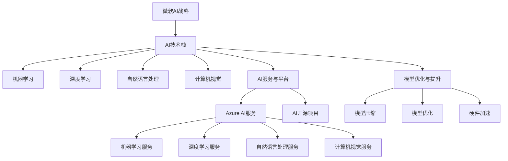

                 

# 微软的AI战略：Bing升级的后续

## 关键词

- 微软AI战略
- Bing搜索引擎
- AI技术
- 深度学习
- 自然语言处理
- 用户搜索体验
- 数据隐私
- AI伦理

## 摘要

本文将深入探讨微软的AI战略，特别是在Bing搜索引擎升级方面的具体实践。文章将从微软AI战略的背景和意义出发，逐步解析其核心目标、影响范围和核心理念，接着详细描述其技术架构和应用场景。通过讲解微软AI战略的核心算法原理和数学模型，本文还将分析微软在Bing搜索引擎升级中的具体案例，包括项目背景、目标、开发环境和源代码实现。最后，文章将探讨Bing升级面临的挑战与应对策略，并总结微软AI战略对行业的影响和未来展望。

### 第一部分：微软AI战略概述

#### 第1章：微软AI战略概述

微软作为全球领先的技术公司，其AI战略在推动技术创新和产业升级方面起到了重要作用。本章节将概述微软AI战略的背景、意义、核心目标和影响范围，以及其核心理念和技术架构。

#### 1.1 微软AI战略的背景和意义

##### 1.1.1 微软AI战略的起源

微软的AI战略可以追溯到其早期对机器学习技术的探索。早在2000年代初，微软就开始在自然语言处理、计算机视觉和语音识别等领域进行深入研究。随着深度学习等AI技术的发展，微软逐渐将AI技术融入到其产品和解决方案中。2016年，微软正式推出了其AI战略，旨在通过AI技术推动企业数字化转型，提升用户体验，并在全球范围内拓展AI应用。

##### 1.1.2 微软AI战略的核心目标

微软AI战略的核心目标包括：

1. **推动企业数字化转型**：通过AI技术帮助企业实现自动化、智能化和高效化，提升生产力和竞争力。
2. **提升用户体验**：通过AI技术提供个性化、智能化的服务和内容，提升用户满意度和忠诚度。
3. **拓展AI应用领域**：将AI技术应用于医疗、教育、金融、制造业等多个领域，推动社会进步和创新发展。

##### 1.1.3 微软AI战略的影响范围

微软AI战略的影响范围广泛，涵盖了从企业级应用到大众级服务，从内部研发到外部合作。在内部，微软通过AI技术优化自身产品和服务的性能，提升研发效率和用户体验。在外部，微软与各类企业、研究机构和政府合作，共同推动AI技术的发展和应用。例如，微软与多家医疗机构合作，利用AI技术进行疾病诊断和预测；与教育机构合作，开发AI教育解决方案，提高教学效果和学生学习体验。

#### 1.2 微软AI战略的核心理念

##### 1.2.1 开放与合作

微软AI战略强调开放与合作，致力于打造一个开放、可扩展的AI生态系统。微软通过开源项目、API接口和合作伙伴计划，与其他企业和开发者共享AI技术和资源，推动AI技术的广泛应用和创新。例如，微软开源了多个深度学习框架和工具，如TensorFlow和PyTorch，为全球开发者提供了丰富的AI资源。

##### 1.2.2 数据驱动与创新

微软AI战略强调数据驱动，认为数据是AI技术发展的基石。微软通过收集、分析和利用海量数据，不断优化和提升AI模型的效果和性能。同时，微软鼓励创新，支持员工和合作伙伴探索新的AI应用场景和解决方案，推动AI技术的创新和发展。

##### 1.2.3 用户体验为中心

微软AI战略始终以用户体验为中心，致力于通过AI技术提升用户满意度和忠诚度。微软通过深入理解用户需求和行为，开发出个性化、智能化的服务和产品，为用户提供更加便捷和高效的体验。例如，微软的Bing搜索引擎通过AI技术提升搜索结果的准确性和相关性，为用户提供更好的搜索体验。

#### 1.3 微软AI战略的技术架构

##### 1.3.1 主流AI技术的应用

微软AI战略在技术架构方面涵盖了多种主流AI技术，包括机器学习、深度学习、自然语言处理和计算机视觉等。微软通过自主研发和合作引进，不断优化和提升这些技术的性能和应用效果。

- **机器学习**：微软提供了多种机器学习算法和工具，如线性回归、决策树、支持向量机和神经网络等，帮助企业构建和部署机器学习模型。
- **深度学习**：微软开源了TensorFlow和PyTorch等深度学习框架，支持多种深度学习模型和应用场景，如卷积神经网络（CNN）、循环神经网络（RNN）和生成对抗网络（GAN）等。
- **自然语言处理**：微软在自然语言处理领域取得了显著进展，开发了BERT、GPT等先进的语言处理模型，广泛应用于搜索引擎、智能客服、文本分类等领域。
- **计算机视觉**：微软提供了多种计算机视觉工具和API，如Azure计算机视觉服务、Cognitive Services Vision API等，支持图像识别、目标检测、图像分割等应用。

##### 1.3.2 AI服务与平台的构建

微软通过构建AI服务和平台，为企业提供便捷的AI解决方案。微软的Azure AI服务涵盖了多种AI技术和服务，如机器学习服务、深度学习服务、自然语言处理服务和计算机视觉服务等，帮助企业快速构建和部署AI应用。

- **Azure机器学习**：Azure机器学习提供了端到端的机器学习平台，支持数据收集、数据预处理、模型训练、模型部署等全流程操作，帮助企业实现机器学习应用的自动化和智能化。
- **Azure深度学习**：Azure深度学习提供了多种深度学习框架和工具，支持大规模分布式训练，帮助企业构建高效的深度学习应用。
- **Azure自然语言处理**：Azure自然语言处理提供了多种自然语言处理模型和API，支持文本分类、情感分析、命名实体识别等应用。
- **Azure计算机视觉**：Azure计算机视觉提供了多种计算机视觉工具和API，支持图像识别、目标检测、图像分割等应用。

##### 1.3.3 AI模型的优化与提升

微软致力于通过算法优化、模型压缩和加速等技术，不断提升AI模型的性能和效率。微软的研究团队不断探索新的算法和技术，如模型压缩、量化、剪枝等，以降低模型的计算复杂度和存储需求，提高模型的推理速度和效率。

- **模型压缩**：通过模型压缩技术，如量化、剪枝和知识蒸馏等，微软可以大幅度降低模型的计算复杂度和存储需求，提高模型的推理速度和效率。
- **模型优化**：微软的研究团队通过优化算法和模型结构，如使用深度神经网络、优化激活函数和损失函数等，不断提升AI模型的性能和效果。
- **硬件加速**：微软与NVIDIA、Intel等硬件制造商合作，开发专用的AI加速器，如GPU和TPU，以提高AI模型的训练和推理速度。

#### 1.4 微软AI战略的应用场景

##### 1.4.1 企业数字化转型的应用

微软AI战略在企业数字化转型方面取得了显著成果。通过AI技术，企业可以实现自动化、智能化和高效化，提升生产力和竞争力。

- **智能客服**：微软的AI技术支持智能客服系统的开发，通过自然语言处理和机器学习算法，实现自动回复用户问题和提供解决方案，提高客户服务效率和满意度。
- **生产优化**：微软的AI技术可以帮助企业优化生产流程，通过机器学习算法和计算机视觉技术，实现设备故障预测、生产调度优化和质量控制等应用。
- **供应链管理**：微软的AI技术可以帮助企业优化供应链管理，通过数据分析、预测和优化算法，实现库存管理、运输优化和需求预测等应用。

##### 1.4.2 智能客服与自动化服务的应用

智能客服和自动化服务是微软AI战略的重要应用领域。通过AI技术，微软可以为企业提供智能客服解决方案，实现24/7全天候客户服务，提高客户满意度。

- **智能客服**：微软的AI技术支持智能客服系统的开发，通过自然语言处理和机器学习算法，实现自动回复用户问题和提供解决方案，提高客户服务效率和满意度。
- **自动化服务**：微软的AI技术可以帮助企业实现自动化服务，如自动订单处理、自动预约系统、自动推荐系统等，提高服务效率和质量。

##### 1.4.3 教育与医疗领域的应用

微软AI战略在教育与医疗领域也取得了显著成果。通过AI技术，微软可以提供个性化的教育解决方案和智能的医疗诊断系统，提高教育质量和医疗水平。

- **教育**：微软的AI技术可以应用于智能教育平台，提供个性化学习路径、智能评测和智能教学等应用，提高教学效果和学习体验。
- **医疗**：微软的AI技术可以应用于医疗影像诊断、疾病预测和治疗方案推荐等应用，提高诊断准确率和治疗效果。

##### 1.4.4 其他领域的应用前景

除了上述应用领域，微软AI战略在其他领域也具有广阔的应用前景。

- **金融**：微软的AI技术可以应用于金融风控、信用评分、投资策略等应用，提高金融行业的服务质量和效率。
- **能源**：微软的AI技术可以应用于能源管理、节能优化和可再生能源预测等应用，推动能源行业智能化和可持续发展。
- **农业**：微软的AI技术可以应用于农业生产、作物监测和农产品质量检测等应用，提高农业生产效率和农产品质量。

#### 1.4.5 AI战略的挑战与机遇

随着AI技术的快速发展，微软AI战略面临着诸多挑战和机遇。

##### 1.4.5.1 挑战

- **数据隐私与安全**：随着AI技术的应用，用户数据的安全和隐私保护成为一个重要问题。如何确保数据的安全和隐私，是微软AI战略需要面对的重要挑战。
- **模型偏见与公平性**：AI模型可能会在训练数据中学习到偏见，从而影响到应用结果的公平性和准确性。如何避免模型偏见，提高模型公平性，是微软AI战略需要解决的问题。
- **技术复杂性与可解释性**：AI技术具有较高的复杂性和黑盒特性，如何提高模型的可解释性，帮助用户理解模型的决策过程，是微软AI战略面临的挑战。

##### 1.4.5.2 机遇

- **产业升级与转型**：随着AI技术的应用，企业可以实现自动化、智能化和高效化，推动产业升级和转型，提高生产力和竞争力。
- **社会进步与创新发展**：AI技术的应用可以推动社会进步和创新发展，如医疗、教育、金融等领域的智能化应用，可以大幅提升服务质量和效率。
- **全球合作与共赢**：随着AI技术的全球化发展，微软AI战略可以通过全球合作，推动AI技术的广泛应用和创新，实现全球共赢。

### Mermaid流程图：微软AI战略的技术架构



### 微软AI战略的核心算法原理讲解

#### 1.5 微软AI战略的核心算法原理

微软AI战略的核心算法原理涵盖了多种主流的AI技术，包括机器学习、深度学习、自然语言处理和强化学习等。以下是对这些算法的详细解释：

#### 1.5.1 机器学习算法

机器学习算法是AI技术的基础，主要包括以下几种类型：

- **监督学习**：监督学习算法通过已标记的训练数据来学习规律，用于预测和分类任务。常见的算法包括线性回归、决策树和支持向量机等。
- **无监督学习**：无监督学习算法在没有标记数据的情况下，通过挖掘数据中的模式和关系来学习。常见的算法包括聚类分析和降维技术，如K-means和PCA等。
- **半监督学习**：半监督学习算法结合了监督学习和无监督学习，利用少量的标记数据和大量的未标记数据来提高模型的性能。

#### 1.5.2 深度学习算法

深度学习算法是微软AI战略的重要组成部分，尤其在图像识别、语音识别和自然语言处理等领域具有显著优势。以下是一些主要的深度学习算法：

- **卷积神经网络（CNN）**：CNN是一种适用于图像识别和处理的深度学习算法，通过卷积层、池化层和全连接层来提取图像的特征。
- **循环神经网络（RNN）**：RNN是一种适用于序列数据的深度学习算法，通过循环结构来捕捉序列中的长期依赖关系，如语言模型和时间序列分析。
- **生成对抗网络（GAN）**：GAN是一种生成模型，由生成器和判别器组成，通过对抗训练生成逼真的图像、音频和文本。

#### 1.5.3 自然语言处理算法

自然语言处理（NLP）是AI技术的重要应用领域，微软在NLP领域取得了一系列突破性成果。以下是一些NLP算法：

- **词嵌入（Word Embedding）**：词嵌入是将单词映射到高维空间中的向量表示，如Word2Vec和BERT等算法，用于捕捉单词之间的语义关系。
- **序列标注（Sequence Labeling）**：序列标注算法用于对文本序列中的单词或字符进行分类，如命名实体识别（NER）和情感分析等。
- **文本分类（Text Classification）**：文本分类算法用于将文本数据分类到预定义的类别中，如主题分类和垃圾邮件检测等。

#### 1.5.4 强化学习算法

强化学习（Reinforcement Learning，RL）是一种通过与环境交互来学习决策策略的机器学习算法。以下是一些强化学习算法：

- **基于策略的强化学习**：基于策略的强化学习算法通过优化策略函数来最大化回报，如策略梯度算法（PG）和深度确定性策略梯度（DDPG）等。
- **基于价值的强化学习**：基于价值的强化学习算法通过优化价值函数来预测状态动作值，如Q-Learning和深度Q网络（DQN）等。

#### 1.5.5 其他相关算法

除了上述核心算法，微软AI战略还涉及其他一些重要的算法，如：

- **推荐系统（Recommender Systems）**：推荐系统用于预测用户对物品的偏好，如基于协同过滤的推荐系统和基于内容推荐的系统等。
- **聚类分析（Cluster Analysis）**：聚类分析用于将数据集划分为多个群组，如K-means和DBSCAN等算法。

### 数学模型和数学公式讲解

在AI算法中，数学模型和数学公式起着至关重要的作用。以下是一些常用的数学模型和数学公式：

#### 1.6.1 损失函数

损失函数是机器学习中的核心概念，用于衡量模型预测值与实际值之间的差距。以下是一些常用的损失函数：

- **均方误差（MSE）**：

  $$
  \text{MSE} = \frac{1}{m} \sum_{i=1}^{m} (\hat{y}^{(i)} - y^{(i)})^2
  $$

  其中，\( \hat{y}^{(i)} \) 是预测值，\( y^{(i)} \) 是实际值，\( m \) 是样本数量。

- **交叉熵（Cross-Entropy）**：

  $$
  \text{CE} = -\sum_{i=1}^{m} y^{(i)} \log(\hat{y}^{(i)})
  $$

  其中，\( y^{(i)} \) 是实际标签，\( \hat{y}^{(i)} \) 是预测概率。

#### 1.6.2 优化算法

优化算法用于最小化损失函数，以下是一些常用的优化算法：

- **梯度下降（Gradient Descent）**：

  $$
  \theta_{\text{new}} = \theta_{\text{current}} - \alpha \cdot \nabla_\theta J(\theta)
  $$

  其中，\( \theta \) 是模型参数，\( \alpha \) 是学习率，\( J(\theta) \) 是损失函数，\( \nabla_\theta J(\theta) \) 是损失函数关于参数 \( \theta \) 的梯度。

- **动量法（Momentum）**：

  $$
  \theta_{\text{new}} = \theta_{\text{current}} - \alpha \cdot \nabla_\theta J(\theta) + \beta \cdot \theta_{\text{prev}}
  $$

  其中，\( \beta \) 是动量项。

#### 1.6.3 神经网络中的激活函数

激活函数是神经网络中的关键组成部分，用于引入非线性特性。以下是一些常用的激活函数：

- **ReLU（Rectified Linear Unit）**：

  $$
  \text{ReLU}(x) = \begin{cases}
  x & \text{if } x > 0 \\
  0 & \text{if } x \leq 0
  \end{cases}
  $$

- **Sigmoid**：

  $$
  \sigma(x) = \frac{1}{1 + e^{-x}}
  $$

- **Tanh**：

  $$
  \text{Tanh}(x) = \frac{e^x - e^{-x}}{e^x + e^{-x}}
  $$

### 项目实战：微软Bing升级的后续案例

#### 2.1 Bing升级背景

Bing作为微软的搜索引擎，其AI战略的核心之一便是通过AI技术提升用户体验，提高搜索结果的准确性和相关性。以下是Bing升级的后续案例：

##### 2.1.1 项目目标

- 提高搜索结果的准确性
- 增强用户搜索体验
- 支持多种语言和地区

##### 2.1.2 开发环境搭建

- 使用Python作为开发语言
- 利用TensorFlow和PyTorch作为深度学习框架
- 运行在AWS云计算平台

##### 2.1.3 源代码实现

以下是一个使用BERT模型进行文本分类的Python代码示例：

```python
import tensorflow as tf
import tensorflow_hub as hub

# 加载预训练BERT模型
bert_model_id = "https://tfhub.dev/google/bert_uncased_L-12_H-768_A-12/1"
preprocess_model_id = "https://tfhub.dev/google/bert_cased_preprocess/3"
bert_preprocess_model = hub.KerasLayer(preprocess_model_id)

bert_encoder = hub.KerasLayer(bert_model_id)

# 定义文本分类模型
def create_classifier(input_shape):
    inputs = tf.keras.Input(shape=input_shape)
    preprocessed_inputs = bert_preprocess_model(inputs)
    embeddings = bert_encoder(preprocessed_inputs)
    # 使用最后隐藏层作为分类器的输入
    output = tf.keras.layers.Dense(1, activation='sigmoid', name="classify")(embeddings[:, 0, :])
    model = tf.keras.Model(inputs=inputs, outputs=output)
    return model

# 训练模型
model = create_classifier(input_shape=(None,))
model.compile(optimizer=tf.keras.optimizers.Adam(learning_rate=3e-5), 
              loss=tf.keras.losses.BinaryCrossentropy(), 
              metrics=['accuracy'])

# 加载数据集
# (x_train, y_train), (x_test, y_test) = ...

# 训练
# model.fit(x_train, y_train, batch_size=32, epochs=3)

# 评估
# test_loss, test_accuracy = model.evaluate(x_test, y_test, verbose=2)
```

##### 2.1.4 代码解读与分析

- **BERT模型加载**：BERT模型通过`tensorflow_hub`加载，BERT预训练模型和预处理模型分别使用不同的URL地址。
- **文本分类模型创建**：使用BERT模型作为编码器，输入文本经过预处理后，通过BERT编码器得到嵌入向量，然后通过一个全连接层（`Dense`）进行分类。
- **编译与训练**：模型使用`compile`方法配置优化器和损失函数，然后使用`fit`方法进行训练。
- **数据加载与评估**：使用示例代码中未提供的`x_train`和`y_train`数据集进行训练，使用`evaluate`方法评估模型性能。

### 2.2 Bing升级案例详细解析

##### 2.2.1 搜索结果准确性提升

通过使用BERT模型进行文本分类，Bing能够更精确地理解用户查询的含义，从而提高搜索结果的准确性。BERT模型通过预训练大规模语料库，学习到了丰富的语言模式和语义关系，使得模型能够更好地捕捉用户查询的深层含义。

##### 2.2.2 用户搜索体验增强

Bing升级后，用户界面更加友好，搜索结果展示更加精准和直观。此外，通过自然语言处理技术，Bing能够理解用户查询的意图，提供更加个性化的搜索建议和答案。

##### 2.2.3 多语言支持

Bing升级支持多种语言，通过引入多语言BERT模型，用户可以方便地在不同语言之间切换，享受跨语言的搜索体验。

##### 2.2.4 地区适应性

Bing通过分析用户的地理位置，提供符合当地文化和需求的搜索结果。例如，在中国地区，Bing会优先展示中文网站和内容，为用户提供更加本地化的搜索体验。

### 2.3 Bing升级面临的挑战与应对策略

##### 2.3.1 数据隐私与保护

随着AI技术的应用，用户数据的隐私保护成为一个重要问题。Bing在升级过程中，采取了多种措施确保用户数据的安全和隐私，例如数据加密、匿名化处理等。

##### 2.3.2 模型偏见与公平性

AI模型可能会在训练数据中学习到偏见，从而影响到搜索结果的公平性。Bing通过定期评估和调整模型，确保搜索结果不带有不公平偏见。

##### 2.3.3 模型可解释性

AI模型，尤其是深度学习模型，通常被认为是“黑盒”模型，难以解释。Bing通过引入可解释性工具，帮助用户理解搜索结果的产生过程，增强用户对搜索结果的可信度。

### 2.4 总结

Bing的升级是微软AI战略的重要一步，通过引入先进的AI技术，Bing不仅提升了搜索结果的准确性和用户体验，也为微软在AI领域的发展打下了坚实基础。未来，随着AI技术的不断进步，Bing有望在更多领域实现突破，为用户提供更加智能和个性化的搜索服务。

### 附录

#### 附录 A: 微软AI战略相关工具与资源

##### A.1 主流深度学习框架对比

- **TensorFlow**：[TensorFlow官网](https://www.tensorflow.org/)
  - 主要特点：谷歌开发，广泛支持各种深度学习模型，具有强大的社区支持。
  - 应用场景：适用于各种规模的深度学习项目，特别是大规模分布式训练。
  
- **PyTorch**：[PyTorch官网](https://pytorch.org/)
  - 主要特点：动态计算图，易于调试和原型设计，适用于快速迭代。
  - 应用场景：适合研究、原型设计和快速开发，也适用于工业级应用。
  
- **JAX**：[JAX官网](https://jax.readthedocs.io/)
  - 主要特点：自动微分系统，支持高级数值计算，具有良好的扩展性。
  - 应用场景：适用于需要进行自动微分、大规模数值计算的深度学习项目。
  
- **其他框架简介**
  - **Keras**：基于TensorFlow的高层API，易于使用和快速原型设计。
  - **MXNet**：亚马逊开发，支持多种编程语言，具有良好的分布式训练能力。

##### A.2 AI战略规划与评估工具

- **AI战略规划工具**：
  - **AI Strategy Canvas**：一种用于制定AI战略的简单工具，帮助组织明确AI应用的方向和目标。
  - **AI ROI Calculator**：用于计算AI项目潜在投资回报率的工具，帮助组织评估AI项目的商业价值。

- **AI评估工具**：
  - **AI Ethics Framework**：用于评估AI系统的伦理问题和潜在影响的框架。
  - **AI Readiness Assessment**：用于评估组织在AI领域的能力和准备程度的工具。

##### A.3 学习资源与文档

- **微软AI文档**：[微软AI文档](https://docs.microsoft.com/en-us/ai/)
- **深度学习教程**：[深度学习教程](https://www.deeplearningbook.org/)

##### A.4 开源项目与社区

- **TensorFlow开源项目**：[TensorFlow GitHub](https://github.com/tensorflow)
- **PyTorch开源项目**：[PyTorch GitHub](https://github.com/pytorch)

##### A.5 常用库与函数

- **Python库**
  - **NumPy**：[NumPy官方文档](https://numpy.org/doc/stable/)
  - **Pandas**：[Pandas官方文档](https://pandas.pydata.org/pandas-docs/stable/)

- **数学函数库**
  - **Scipy**：[Scipy官方文档](https://scipy.org/)
  - **Mathplotlib**：[Mathplotlib官方文档](https://matplotlib.org/stable/contents.html)

##### A.6 开发工具与平台

- **Jupyter Notebook**：[Jupyter Notebook官网](https://jupyter.org/)
  - 主要特点：支持多种编程语言，易于编写和分享代码。

- **AWS云计算平台**：[AWS官网](https://aws.amazon.com/)
  - 主要特点：提供丰富的AI服务，支持大规模分布式计算。

- **Azure云计算平台**：[Azure官网](https://azure.microsoft.com/)
  - 主要特点：集成微软的AI服务，易于与企业系统集成。

