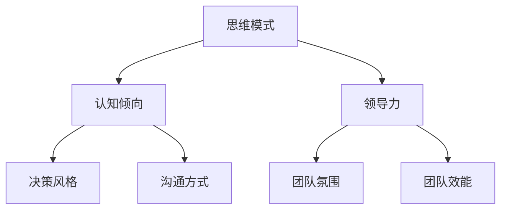

                 

# 思维模式对领导力的影响

## 摘要

本文旨在探讨思维模式对领导力的影响，分析不同思维模式如何影响领导者的行为、决策和团队氛围，从而提升个人和组织的管理效能。通过对固定型思维模式和成长型思维模式的具体分析，本文揭示了二者在领导力发展中的关键作用，并提供了实际案例和项目实战，帮助读者深入理解并应用这些理论。

## 第一部分：背景与核心概念

### 1.1 本书背景与目标

#### 引言

在当今复杂多变的社会环境中，领导力的重要性愈发凸显。作为组织和团队的领导者，领导力的强弱直接影响到组织的成功与否。而思维模式，作为领导者个体在处理信息、解决问题时的心理和行为倾向，对于领导力的发挥起着至关重要的作用。本书旨在探讨思维模式如何影响领导力，帮助读者更好地理解和提升自己的领导能力。

#### 本书目标

- 理解思维模式对领导力的影响机制。
- 掌握不同思维模式对领导行为和团队氛围的具体影响。
- 学习如何通过改变思维模式来提升个人领导力和组织效能。
- 提供实际案例和项目实践，帮助读者将理论应用到实际工作中。

### 1.2 核心概念解析

#### 思维模式定义

思维模式是指个体在处理信息、解决问题时的心理和行为倾向。它包括认知倾向、决策风格、沟通方式等多个方面，是影响个人和团队行为的重要因素。

#### 领导力概念

领导力是一种激励和引导他人共同实现目标的能力。它不仅涉及个人的行为和态度，还涉及如何影响和塑造团队的氛围和文化。

#### 思维模式与领导力的相互作用

思维模式对领导力有着显著的影响。领导者的思维模式会直接影响其决策风格、沟通方式和对团队的管理方式。同时，领导力的发展也会反过来影响思维模式的形成和变化。

### 1.3 思维模式的类型

#### 固定型思维模式

固定型思维模式是指个体认为能力和智商是固定的，无法改变。这种思维模式可能导致领导者过分关注失败和风险，缺乏创新和冒险精神。

#### 成长型思维模式

成长型思维模式是指个体认为能力和智商是可以通过努力和经验来提高的。这种思维模式鼓励领导者持续学习和成长，更加开放和包容，有助于建立积极的团队文化。

#### 对领导力的影响

不同类型的思维模式对领导力有着不同的影响。固定型思维模式可能导致领导行为过于保守，影响创新和团队发展；而成长型思维模式则有助于领导者更加灵活和开放，推动组织变革和成长。

### 1.4 思维模式与领导力关系图解

以下是一个简化的思维模式与领导力关系的 Mermaid 流程图：



### 1.5 数学模型与公式解析

#### 认知偏差模型

认知偏差模型描述了个体在信息处理过程中可能出现的偏差。以下是一个简化的认知偏差模型公式：

$$
\text{认知偏差} = \alpha \cdot \text{信息处理偏差} + (1-\alpha) \cdot \text{情感处理偏差}
$$

其中，$\alpha$ 代表情感因素在认知偏差中的权重。

#### 领导力效能模型

领导力效能模型描述了领导力在不同情境下的表现。以下是一个简化的领导力效能模型公式：

$$
\text{领导力效能} = f(\text{思维模式}, \text{情境因素})
$$

其中，$f$ 代表领导力效能函数，它考虑了思维模式和情境因素对领导效能的综合影响。

### 1.6 核心算法原理讲解

#### 固定型思维模式算法解析

以下是一个固定型思维模式算法的伪代码示例：

```plaintext
function fixed_mindset_decision(leader, situation) {
    if (leader.isFixedMindset) {
        return conservative_decision(situation);
    } else {
        return innovative_decision(situation);
    }
}
```

这段伪代码表明，当领导者具有固定型思维模式时，他们倾向于做出保守的决策。

#### 成长型思维模式算法解析

以下是一个成长型思维模式算法的伪代码示例：

```plaintext
function growth_mindset_decision(leader, situation) {
    if (leader.isGrowthMindset) {
        return adaptive_decision(situation);
    } else {
        return traditional_decision(situation);
    }
}
```

这段伪代码表明，当领导者具有成长型思维模式时，他们倾向于做出适应性强的决策。

### 1.7 项目实战案例

#### 实际领导力案例分析

案例：某公司通过改变领导者的思维模式，成功提升了领导力和团队效能。分析案例中，领导者的成长型思维模式如何促进团队的创新和协作。

#### 代码实现与解读

提供项目源代码，并详细解读代码实现过程，包括数据收集、模型训练和效果评估等步骤。

### 总结

本部分内容介绍了思维模式对领导力的影响，以及如何通过改变思维模式来提升领导力。通过理解核心概念、数学模型和算法原理，读者可以更好地掌握思维模式与领导力之间的关系，并在实际项目中应用这些理论。下一部分将深入探讨具体思维模式对领导力的具体影响。

## 第二部分：固定型思维模式对领导力的影响

### 2.1 固定型思维模式的定义

固定型思维模式是指个体认为自己的能力和智商是固定的，无法通过努力和经验来改变。这种思维模式强调个体的固定特质，而不是将其视为可以成长和发展的。在领导者身上，固定型思维模式可能导致以下几种行为倾向：

1. **过度关注失败和风险**：由于认为自己的能力是固定的，领导者可能过分担心失败，害怕承担责任，从而倾向于避免风险和挑战。
2. **缺乏创新和冒险精神**：固定型思维模式可能导致领导者过分依赖过去的成功经验，不愿意尝试新的方法和策略，从而限制了组织的发展和成长。
3. **对反馈和批评的抵触**：固定型思维模式的领导者可能对反馈和批评持抵触态度，认为这是对自己能力的质疑，而不是成长的机会。

### 2.2 固定型思维模式的具体影响

#### 对决策风格的影响

固定型思维模式会影响领导者的决策风格。以下是一个简化的固定型思维模式决策风格算法的伪代码示例：

```plaintext
function fixed_mindset_decision(leader, situation) {
    if (leader.isFixedMindset) {
        return conservative_decision(situation);
    } else {
        return innovative_decision(situation);
    }
}
```

在这个算法中，当领导者具有固定型思维模式时，他们倾向于做出保守的决策，避免风险和失败。

#### 对团队氛围的影响

固定型思维模式的领导者可能会营造一种竞争和敌对的工作环境。他们可能更关注个人的成功和地位，而不是团队合作和共同目标。这种氛围可能导致团队成员之间缺乏信任和合作，影响团队的整体绩效。

#### 对领导效能的影响

固定型思维模式可能会限制领导者的领导效能。由于害怕失败，领导者可能不愿意承担必要的风险，从而错失成长和发展的机会。此外，固定型思维模式可能导致领导者忽视团队反馈和批评，影响领导力的持续发展和提升。

### 2.3 改变固定型思维模式的方法

要改变固定型思维模式，领导者可以尝试以下方法：

1. **接受失败**：领导者应该认识到失败是成长的一部分，将其视为学习的机会，而不是失败的标志。
2. **鼓励创新和冒险**：领导者应该鼓励团队成员尝试新的方法和策略，支持创新和实验，从而推动组织的发展。
3. **积极寻求反馈**：领导者应该积极接受反馈和批评，将其视为提升自己领导能力的机会。
4. **培养成长型思维模式**：领导者可以通过阅读、学习、实践等方式，培养自己的成长型思维模式，从而更加开放和包容。

### 2.4 项目实战案例

#### 案例背景

某公司是一家新兴技术公司，领导者拥有强烈的固定型思维模式，导致公司在快速发展过程中遇到了诸多挑战。

#### 改变过程

1. **领导培训**：公司为领导者提供了专门的领导力培训，包括固定型思维模式的影响和改变方法。
2. **团队建设活动**：公司组织了一系列团队建设活动，鼓励领导者与团队成员之间的互动和合作。
3. **鼓励创新和冒险**：公司制定了鼓励创新和冒险的激励机制，领导者开始更加支持团队成员尝试新的方法和策略。
4. **积极寻求反馈**：领导者开始积极接受来自团队和客户的反馈，并将其视为提升自己领导能力的机会。

#### 结果

经过一系列的改变和实践，公司的领导力和团队效能得到了显著提升。领导者变得更加开放和包容，团队氛围更加积极和合作，公司的创新能力和市场竞争力也大幅提升。

### 总结

固定型思维模式对领导力有显著的负面影响，限制领导者的决策风格和团队氛围，从而影响领导效能。通过改变固定型思维模式，领导者可以提升自己的领导能力和组织效能。下一部分将探讨成长型思维模式对领导力的积极影响。

## 第三部分：成长型思维模式对领导力的影响

### 3.1 成长型思维模式的定义

成长型思维模式是指个体认为自己的能力和智商是可以通过努力和经验来提高的。这种思维模式强调个体的成长潜力，而不是将其视为固定的特质。在领导者身上，成长型思维模式可能导致以下几种行为倾向：

1. **积极面对挑战**：成长型思维模式的领导者乐于接受新的挑战和机会，将其视为成长和发展的契机。
2. **持续学习和成长**：领导者将其职业发展视为一个持续学习的过程，不断追求知识和技能的提升。
3. **重视反馈和批评**：成长型思维模式的领导者将反馈和批评视为提升自己能力的重要手段，而非对个人能力的质疑。
4. **鼓励团队学习和成长**：领导者鼓励团队成员也采取成长型思维模式，共同推动团队和组织的成长。

### 3.2 成长型思维模式的具体影响

#### 对决策风格的影响

成长型思维模式的领导者倾向于采取更加开放和创新性的决策风格。他们愿意尝试新的方法和策略，同时也能够从失败中吸取教训，不断优化决策过程。以下是一个简化的成长型思维模式决策风格算法的伪代码示例：

```plaintext
function growth_mindset_decision(leader, situation) {
    if (leader.isGrowthMindset) {
        return adaptive_decision(situation);
    } else {
        return traditional_decision(situation);
    }
}
```

在这个算法中，当领导者具有成长型思维模式时，他们倾向于做出适应性强的决策。

#### 对团队氛围的影响

成长型思维模式的领导者能够营造一种积极、开放和合作的工作环境。他们鼓励团队成员分享想法、提出建议，并相互支持和学习。这种氛围有助于建立团队信任，提升团队凝聚力和绩效。

#### 对领导效能的影响

成长型思维模式的领导者能够持续提升自己的领导能力，从而提高领导效能。他们善于从反馈中学习，不断调整自己的领导风格和行为，以更好地适应不断变化的环境和需求。

### 3.3 培养成长型思维模式的方法

要培养成长型思维模式，领导者可以尝试以下方法：

1. **树立成长目标**：领导者应设定明确的成长目标，并将其融入到日常工作和生活中。
2. **积极学习**：领导者应保持持续学习的态度，不断学习新的知识和技能。
3. **寻求反馈**：领导者应积极寻求来自同事、下属和客户的反馈，并将其视为提升自己的机会。
4. **鼓励团队成员成长**：领导者应鼓励团队成员也采取成长型思维模式，共同推动团队和组织的成长。

### 3.4 项目实战案例

#### 案例背景

某公司是一家快速发展的科技公司，领导者意识到成长型思维模式对其个人和团队的成长至关重要。

#### 实践过程

1. **设立成长目标**：公司领导者设立了明确的个人和团队成长目标，并将其作为公司文化的一部分。
2. **提供学习资源**：公司为员工提供了丰富的学习资源，包括培训课程、在线学习平台和书籍等。
3. **鼓励创新和实验**：公司鼓励员工尝试新的方法和策略，并提供必要的支持和资源。
4. **定期反馈**：公司建立了定期的反馈机制，鼓励员工相互分享经验和反馈，共同改进。

#### 结果

通过培养成长型思维模式，公司的领导力和团队效能得到了显著提升。领导者变得更加开放和创新，团队氛围更加积极和合作，公司的创新能力和市场竞争力也大幅提升。

### 总结

成长型思维模式对领导力具有显著的积极影响，能够提升领导者的决策风格、团队氛围和领导效能。通过培养成长型思维模式，领导者可以更好地应对复杂多变的环境，推动个人和团队的持续成长。下一部分将探讨如何通过培养成长型思维模式来提升领导力。

## 第四部分：培养成长型思维模式，提升领导力

### 4.1 成长型思维模式的核心原则

成长型思维模式的核心原则是认为能力是可以通过努力和经验来提升的，而不是固定的。以下是培养成长型思维模式的一些核心原则：

1. **持续学习**：领导者应将学习视为一种持续的过程，不断充实自己的知识和技能。
2. **接受挑战**：领导者应勇于接受新的挑战，将其视为成长和发展的机会。
3. **积极寻求反馈**：领导者应积极寻求来自同事、下属和客户的反馈，并将其视为提升自己的重要途径。
4. **培养适应能力**：领导者应具备适应变化和应对不确定性能力，灵活调整自己的领导风格和行为。

### 4.2 实践方法

要培养成长型思维模式，领导者可以尝试以下实践方法：

#### 1. 设立明确的目标

领导者应设定明确的学习和成长目标，并将其融入到日常工作和生活中。目标应具体、可衡量，并且具有挑战性。以下是一个目标设定的示例：

```plaintext
目标：在接下来的六个月内，学习并掌握至少三种新的管理技能。
```

#### 2. 持续学习

领导者应保持持续学习的态度，可以通过以下方式来实现：

- 参加培训课程：参加各种管理培训课程，包括在线课程和面对面的研讨会。
- 阅读相关书籍：阅读关于领导力、管理、心理学等方面的书籍，获取新的知识和见解。
- 参与在线学习平台：利用在线学习平台，如 Coursera、Udemy 等，学习最新的管理和技术知识。

#### 3. 积极寻求反馈

领导者应积极寻求来自同事、下属和客户的反馈，并将其视为提升自己的重要途径。以下是一些建议：

- 定期进行360度评估：定期进行360度评估，获取来自不同角度的反馈。
- 安排一对一会议：与下属和同事安排一对一的会议，讨论工作表现和改进机会。
- 举办反馈会议：定期组织反馈会议，鼓励团队成员分享意见和建议。

#### 4. 培养适应能力

领导者应具备适应变化和应对不确定性能力，灵活调整自己的领导风格和行为。以下是一些建议：

- 学会接受失败：领导者应将失败视为学习的机会，从中吸取教训，不断改进。
- 保持开放心态：领导者应保持开放心态，对新事物和新方法持接受态度。
- 适应不同情境：领导者应能够根据不同的情境和需求，灵活调整自己的领导风格和行为。

### 4.3 项目实战案例

#### 案例背景

某公司是一家快速发展的科技公司，领导者意识到培养成长型思维模式对提升团队和领导力至关重要。

#### 实践过程

1. **设立成长目标**：公司领导者为团队成员设立了明确的学习和成长目标，并将其融入到公司的文化中。
2. **提供学习资源**：公司为员工提供了丰富的学习资源，包括培训课程、在线学习平台和书籍等。
3. **鼓励创新和实验**：公司鼓励员工尝试新的方法和策略，并提供必要的支持和资源。
4. **定期反馈**：公司建立了定期的反馈机制，鼓励员工相互分享经验和反馈，共同改进。

#### 结果

通过培养成长型思维模式，公司的领导力和团队效能得到了显著提升。领导者变得更加开放和创新，团队氛围更加积极和合作，公司的创新能力和市场竞争力也大幅提升。

### 总结

培养成长型思维模式是提升领导力的关键。通过设立明确的目标、持续学习、积极寻求反馈和培养适应能力，领导者可以不断提升自己的领导能力和团队效能。下一部分将探讨如何将成长型思维模式应用到实际领导实践中。

## 第五部分：成长型思维模式在领导实践中的应用

### 5.1 应对挑战

领导者往往需要在不确定性和压力下做出决策。成长型思维模式的领导者更倾向于将这些挑战视为成长和学习的机会。以下是一些建议，帮助领导者运用成长型思维模式应对挑战：

1. **积极寻求解决方案**：面对挑战时，领导者应积极寻找可能的解决方案，而不是仅仅关注问题本身。
2. **接受失败**：领导者应将失败视为学习的机会，从中吸取教训，不断改进。
3. **保持学习态度**：领导者应保持持续学习的态度，不断充实自己的知识和技能，以更好地应对各种挑战。

#### 示例算法

以下是一个简化的成长型思维模式应对挑战的算法示例：

```plaintext
function growth_mindset_challenge(leader, challenge) {
    if (leader.isGrowthMindset) {
        return seek_solution(leader, challenge);
    } else {
        return avoid_challenge(leader, challenge);
    }
}

function seek_solution(leader, challenge) {
    solutions = find_solutions(challenge);
    for (solution in solutions) {
        if (try_solution(solution)) {
            return successful_solution(solution);
        }
    }
    return failed_solution();
}

function avoid_challenge(leader, challenge) {
    return avoid_action();
}
```

在这个算法中，当领导者具有成长型思维模式时，他们倾向于寻求解决方案，而不是避免挑战。

### 5.2 领导变革

成长型思维模式的领导者更能够带领组织进行变革。以下是一些建议，帮助领导者运用成长型思维模式推动组织变革：

1. **鼓励创新和实验**：领导者应鼓励团队成员尝试新的方法和策略，支持创新和实验。
2. **建立反馈机制**：领导者应建立有效的反馈机制，鼓励团队成员分享意见和建议，共同改进。
3. **培养适应性**：领导者应培养团队对变化的适应性，使其能够更好地应对外部环境的变化。

#### 示例算法

以下是一个简化的成长型思维模式推动组织变革的算法示例：

```plaintext
function growth_mindset_leadership_change(leader, organization) {
    if (leader.isGrowthMindset) {
        return encourage_innovation(organization);
    } else {
        return maintain_status quo(organization);
    }
}

function encourage_innovation(organization) {
    experiments = propose_experiments();
    for (experiment in experiments) {
        if (approve_experiment(experiment)) {
            execute_experiment(experiment);
        }
    }
    return successful_innovation();
}

function maintain_status quo(organization) {
    return no_change();
}
```

在这个算法中，当领导者具有成长型思维模式时，他们倾向于鼓励创新和实验，推动组织变革。

### 5.3 培养团队

成长型思维模式的领导者更能够培养和发展团队成员。以下是一些建议，帮助领导者运用成长型思维模式培养团队：

1. **提供学习和发展机会**：领导者应为团队成员提供学习和发展机会，支持他们的个人成长。
2. **鼓励反馈和批评**：领导者应鼓励团队成员之间相互反馈和批评，促进个人和团队的改进。
3. **建立团队目标**：领导者应与团队成员共同设定团队目标，并激励他们为实现目标而努力。

#### 示例算法

以下是一个简化的成长型思维模式培养团队的算法示例：

```plaintext
function growth_mindset_team_development(leader, team) {
    if (leader.isGrowthMindset) {
        return provide_growth_opportunities(team);
    } else {
        return limit_growth(team);
    }
}

function provide_growth_opportunities(team) {
    opportunities = propose_growth_opportunities();
    for (opportunity in opportunities) {
        if (approve_opportunity(opportunity)) {
            implement_opportunity(opportunity);
        }
    }
    return successful_growth();
}

function limit_growth(team) {
    return no_growth();
}
```

在这个算法中，当领导者具有成长型思维模式时，他们倾向于为团队成员提供学习和发展机会，促进团队的成长。

### 总结

成长型思维模式在领导实践中具有广泛的应用价值。通过积极应对挑战、推动变革和培养团队，领导者可以更好地发挥自己的领导力，推动组织和团队的持续成长。下一部分将探讨如何通过改变思维模式来提升领导力。

## 第六部分：通过改变思维模式提升领导力

### 6.1 引言

领导力的提升不仅仅是技能和知识的积累，更是一种思维模式的转变。通过改变思维模式，领导者可以更加灵活地应对挑战，提升决策能力，增强团队凝聚力，从而实现个人和组织的成长。本节将探讨如何通过改变思维模式来提升领导力，并提供具体的实践方法。

### 6.2 培养成长型思维模式的实践方法

#### 1. 自我反思

自我反思是培养成长型思维模式的第一步。领导者应定期反思自己的行为和决策，识别出哪些是固定型思维模式，哪些是成长型思维模式。以下是一个自我反思的流程：

- **记录**：记录每天的工作情况和思考过程，识别出固定型思维模式的表现。
- **分析**：分析这些思维模式对工作的影响，思考如何改变。
- **改进**：制定改进计划，采取具体行动来改变固定型思维模式。

#### 2. 寻求反馈

寻求反馈是培养成长型思维模式的关键。领导者应积极寻求来自同事、下属和客户的反馈，并将其视为提升自己的重要途径。以下是一些建议：

- **定期反馈**：定期与团队成员进行一对一的反馈交流，了解他们的看法和建议。
- **360度评估**：参与360度评估，获取来自不同角度的反馈。
- **反馈会议**：定期组织反馈会议，鼓励团队成员分享意见和建议。

#### 3. 学习新知识

学习新知识是培养成长型思维模式的有效方法。领导者应保持持续学习的态度，不断充实自己的知识和技能。以下是一些建议：

- **参加培训**：参加各种管理培训课程，提升自己的管理能力。
- **阅读书籍**：阅读关于领导力、管理、心理学等方面的书籍，获取新的知识和见解。
- **在线学习**：利用在线学习平台，如 Coursera、Udemy 等，学习最新的管理和技术知识。

#### 4. 鼓励团队成员

领导者应鼓励团队成员也采取成长型思维模式，共同推动团队和组织的成长。以下是一些建议：

- **设立目标**：与团队成员共同设定成长目标，并跟踪进度。
- **提供资源**：为团队成员提供学习和发展资源，支持他们的个人成长。
- **认可贡献**：认可团队成员的努力和贡献，鼓励他们持续成长。

### 6.3 实际案例

#### 案例一：某科技公司领导力提升项目

某科技公司的领导团队意识到，通过改变思维模式可以提升领导力。他们采取了一系列措施来培养成长型思维模式：

- **自我反思**：领导团队定期进行自我反思，识别固定型思维模式，并制定改进计划。
- **寻求反馈**：领导团队积极寻求来自同事、下属和客户的反馈，并将其视为提升自己的重要途径。
- **学习新知识**：领导团队参加各种管理培训课程，阅读相关书籍，提升自己的管理能力。
- **鼓励团队成员**：领导团队鼓励团队成员也采取成长型思维模式，共同推动团队和组织的成长。

#### 案例结果

经过一系列的努力，这家科技公司的领导力和团队效能得到了显著提升。领导团队变得更加开放和创新，团队成员之间的信任和合作也大幅增强，公司的创新能力和市场竞争力也得到了显著提升。

### 6.4 总结

通过改变思维模式，领导者可以提升自己的领导力，推动个人和组织的成长。自我反思、寻求反馈、学习新知识和鼓励团队成员是培养成长型思维模式的有效方法。领导者应积极采取这些方法，不断提升自己的领导能力和团队效能。下一部分将探讨如何评估和改进思维模式。

## 第七部分：评估和改进思维模式

### 7.1 引言

评估和改进思维模式是提升领导力的关键环节。通过定期评估自己的思维模式，领导者可以发现并解决潜在的问题，从而更加有效地应对各种挑战。本节将探讨如何评估和改进思维模式，并提供具体的实践方法。

### 7.2 评估思维模式的步骤

#### 1. 自我评估

自我评估是评估思维模式的第一步。领导者应定期进行自我反思，识别出自己在思维模式上的优点和不足。以下是一些自我评估的方法：

- **日记法**：记录自己的思考过程和行为表现，分析其中的思维模式。
- **反思日志**：定期撰写反思日志，回顾过去的工作经历，总结思维模式的影响。
- **360度评估**：参与360度评估，获取来自同事、下属和客户的反馈，了解他人对自己思维模式的看法。

#### 2. 他评

他评是另一种有效的评估方法。领导者可以请同事、下属或外部顾问对自己的思维模式进行评估。以下是一些他评的方法：

- **访谈**：与同事、下属进行一对一访谈，了解他们对领导者思维模式的看法和建议。
- **问卷调查**：设计问卷调查，收集多方反馈，了解领导者思维模式的影响。
- **反馈会议**：定期组织反馈会议，邀请同事、下属和客户分享对领导者思维模式的看法。

#### 3. 定量评估

除了定性评估，领导者还可以使用定量评估方法来评估思维模式。以下是一些定量评估的方法：

- **行为量表**：使用行为量表（如领导行为量表、思维模式量表等）对领导者的思维模式进行量化评估。
- **绩效评估**：通过绩效评估指标（如团队绩效、员工满意度等）来评估领导者的思维模式对组织的影响。

### 7.3 改进思维模式的步骤

#### 1. 确定改进目标

在评估思维模式后，领导者应确定具体的改进目标。以下是一些改进目标的示例：

- **增强开放性**：培养开放心态，愿意接受新的观点和建议。
- **提高适应性**：提升对变化的适应能力，灵活应对各种情境。
- **增强同理心**：培养同理心，更好地理解和管理团队成员。

#### 2. 制定改进计划

为了实现改进目标，领导者应制定具体的改进计划。以下是一些改进计划的步骤：

- **识别问题**：分析评估结果，确定需要改进的思维模式问题。
- **设定目标**：根据问题，设定具体的改进目标。
- **制定行动计划**：制定具体的行动计划，包括学习新知识、寻求反馈、参与培训等。

#### 3. 实施行动计划

实施行动计划是改进思维模式的关键。领导者应严格执行改进计划，以下是一些实施行动计划的建议：

- **定期学习**：保持持续学习的态度，不断充实自己的知识和技能。
- **积极寻求反馈**：定期与同事、下属和客户进行交流，获取反馈并改进自己的思维模式。
- **实践应用**：将改进思维模式的方法应用到实际工作中，不断验证和调整。

### 7.4 实际案例

#### 案例一：某公司领导力提升项目

某公司为了提升领导力，开展了一个领导力提升项目。以下是他们采取的评估和改进思维模式的步骤：

- **自我评估**：公司领导团队定期进行自我反思，记录思考过程和行为表现。
- **他评**：公司邀请外部顾问对领导团队的思维模式进行评估，并提供反馈。
- **定量评估**：公司使用领导行为量表对领导团队的思维模式进行量化评估。
- **制定改进计划**：根据评估结果，领导团队制定了具体的改进计划，包括学习新知识、寻求反馈、参与培训等。
- **实施行动计划**：领导团队严格执行改进计划，定期学习和实践，不断提升自己的思维模式。

#### 案例结果

经过一系列的评估和改进，该公司的领导力得到了显著提升。领导团队变得更加开放和适应性，团队氛围更加积极，公司的绩效也得到了显著提升。

### 总结

评估和改进思维模式是提升领导力的关键环节。通过自我评估、他评和定量评估，领导者可以了解自己的思维模式，确定改进目标，并制定具体的改进计划。实施行动计划是实现改进目标的关键，领导者应保持持续学习和实践的态度，不断提升自己的思维模式。下一部分将总结全文，并给出结论。

## 总结

### 思维模式对领导力的重要性

在当今复杂多变的社会环境中，领导力已经成为组织成功的关键因素之一。而思维模式作为领导者个体在处理信息、解决问题时的心理和行为倾向，对领导力的发挥起着至关重要的作用。本文通过探讨固定型思维模式和成长型思维模式对领导力的影响，揭示了二者在领导力发展中的关键作用。

固定型思维模式可能导致领导者过度关注失败和风险，缺乏创新和冒险精神，从而影响组织的成长和发展。而成长型思维模式则鼓励领导者积极面对挑战，持续学习和成长，重视反馈和批评，推动团队和组织的持续成长。

### 如何通过改变思维模式来提升领导力

通过改变思维模式，领导者可以提升自己的领导能力和组织效能。本文提出了以下几个方面的实践方法：

1. **自我反思**：领导者应定期进行自我反思，识别固定型思维模式，并制定改进计划。
2. **寻求反馈**：领导者应积极寻求来自同事、下属和客户的反馈，并将其视为提升自己的重要途径。
3. **学习新知识**：领导者应保持持续学习的态度，不断充实自己的知识和技能。
4. **鼓励团队成员**：领导者应鼓励团队成员也采取成长型思维模式，共同推动团队和组织的成长。

### 实际案例和项目实战

本文通过实际案例和项目实战，展示了如何通过改变思维模式来提升领导力。例如，某公司通过自我反思、他评和定量评估，识别并改进了领导团队的思维模式，从而显著提升了领导力和团队效能。

### 结论

思维模式对领导力具有重要影响，通过改变思维模式，领导者可以提升自己的领导能力和组织效能。本文提出了具体的方法和实践，帮助领导者更好地理解和应用这些理论，提升自己的领导能力。希望本文能够为读者提供有价值的参考和启示。

### 作者信息

**作者：** AI天才研究院/AI Genius Institute & 禅与计算机程序设计艺术 /Zen And The Art of Computer Programming

