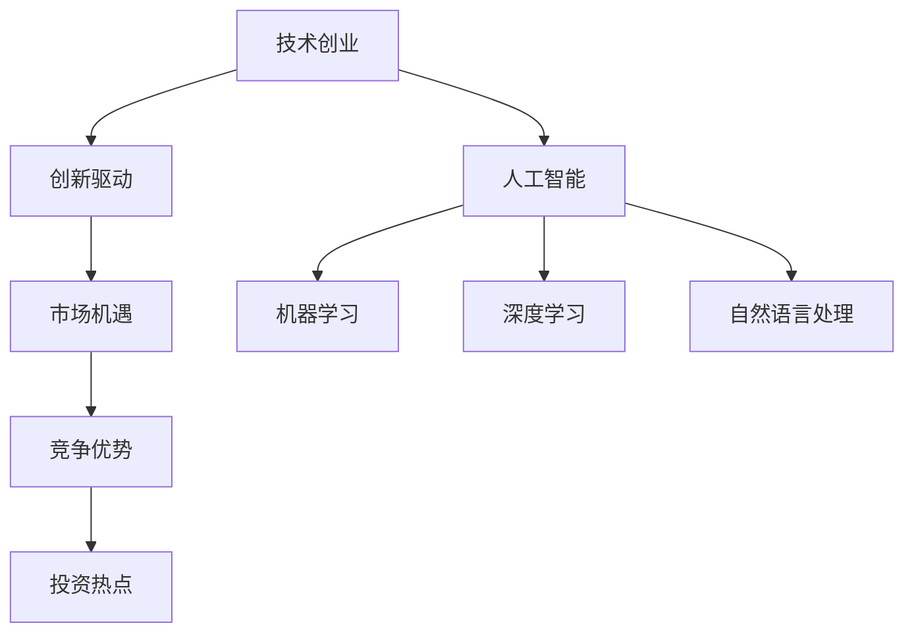
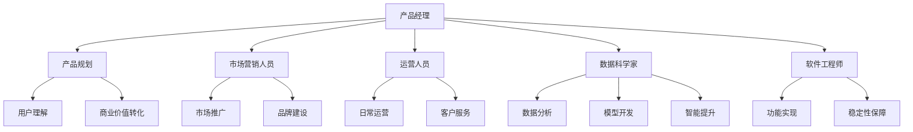
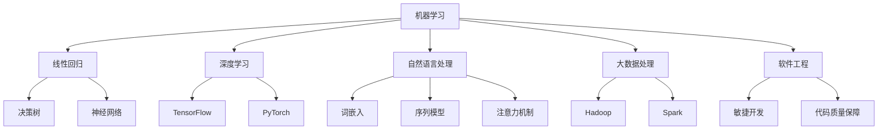

                 

### 1.1 人工智能与技术创业的融合趋势

在当前科技快速发展的时代，人工智能（AI）与技术创业的融合已经成为一种不可逆转的趋势。这种融合不仅改变了传统创业的思维方式，还为企业提供了前所未有的机遇。以下我们将从技术创业的定义与发展历程、人工智能的崛起与变革，以及技术创业与人工智能的融合趋势三个方面，详细探讨这一融合趋势。

#### 1.1.1 技术创业的定义与发展历程

技术创业是指创业者利用技术创新来创造新市场或新价值的过程。其核心在于将新兴技术应用于实际场景，解决现实问题，从而形成具有竞争力的产品或服务。技术创业的发展历程可以分为以下几个阶段：

1. **初创期**：在这一阶段，创业者识别市场机会，组建团队，进行技术研发和产品开发。这个阶段的主要任务是验证产品概念和市场需求。
   
2. **成长期**：在产品或服务初步验证之后，创业者开始进行市场推广，吸引投资，扩大团队和市场份额。这个阶段的关键在于产品的迭代和市场的开拓。

3. **成熟期**：产品或服务稳定，形成一定的品牌和用户基础，企业进一步扩大市场影响力，实现规模效应。在这个阶段，企业需要持续创新，保持市场竞争力。

#### 1.1.2 人工智能的崛起与变革

人工智能作为新一代技术革命的标志性技术，正在迅速渗透到各行各业。人工智能通过模拟人类智能行为，实现机器自动学习和智能决策，其应用场景广泛，包括但不限于自然语言处理、图像识别、智能制造、自动驾驶等。

人工智能的发展历程可以分为以下几个阶段：

1. **理论研究阶段**：从20世纪50年代开始，人工智能理论逐渐成形，包括符号主义、连接主义、贝叶斯网络等不同学派。

2. **应用探索阶段**：20世纪80年代至90年代，专家系统和机器学习开始应用于实际场景，但受限于计算能力和数据规模。

3. **快速发展阶段**：21世纪初，随着计算能力的提升和大数据的积累，深度学习和强化学习等新技术蓬勃发展，人工智能进入快速应用和普及阶段。

#### 1.1.3 技术创业与人工智能的融合

人工智能与技术创业的融合体现在以下几个方面：

1. **创新驱动**：人工智能技术为技术创业者提供了新的创新工具，可以快速开发和优化产品或服务，提升竞争力。

2. **市场机遇**：人工智能在医疗、金融、教育、制造等领域的应用，催生了大量新的市场机会。

3. **竞争优势**：人工智能技术可以帮助企业提高效率、降低成本、提升客户满意度，形成显著的竞争优势。

4. **投资热点**：人工智能技术成为风险投资的热点领域，吸引了大量资金和人才，为技术创业提供了有力支持。

**核心概念与联系：**

- **技术创业**：指创业者通过技术创新来创造市场价值的过程。
- **人工智能**：指模拟人类智能行为的计算机系统，包括机器学习、深度学习、自然语言处理等技术。

**Mermaid流程图：**



**小结**：

通过以上分析，我们可以看出，人工智能与技术创业的融合不仅为企业带来了创新机遇，还推动了市场的快速发展。在技术创业的各个阶段，人工智能技术都可以发挥重要作用，帮助创业者实现商业价值。接下来，我们将进一步探讨人工智能在技术创业中的具体应用。

---

**核心关键词**：
- 技术创业
- 人工智能
- 创新驱动
- 市场机遇
- 竞争优势
- 投资热点

**文章摘要**：

本文深入探讨了人工智能与技术创业的融合趋势。首先，我们分析了技术创业的定义与发展历程，以及人工智能的崛起与变革。接着，我们详细阐述了人工智能在技术创业中的融合趋势，包括创新驱动、市场机遇、竞争优势和投资热点。最后，通过Mermaid流程图，我们展示了技术创业与人工智能的核心概念和联系。本文旨在为创业者提供人工智能在技术创业中的应用参考，助力其在竞争激烈的市场中脱颖而出。

---

### 1.2 技术创业中AI应用的潜力分析

在技术创业中，人工智能（AI）的应用潜力不可忽视。通过AI技术，企业可以在产品开发、质量控制、运营优化等多个方面实现重大突破。本节将详细分析AI在技术创业中的潜在应用，以及如何通过AI技术提升企业的竞争力。

#### 1.2.1 AI在产品开发中的应用

在产品开发阶段，人工智能技术可以帮助企业提高开发效率，优化产品设计，满足用户需求。以下是AI在产品开发中的几个关键应用：

1. **用户行为分析**：通过机器学习算法，企业可以分析用户的浏览、点击、购买等行为数据，了解用户需求和行为模式。这种分析有助于企业设计出更符合用户期望的产品。

    ```python
    # 伪代码：用户行为分析
    import pandas as pd
    import numpy as np
    from sklearn.ensemble import RandomForestClassifier
    
    # 加载用户行为数据
    user_data = pd.read_csv('user_behavior.csv')
    
    # 预处理数据，提取特征
    features = user_data[['page_views', 'clicks', 'purchases']]
    labels = user_data['intent']
    
    # 训练模型，预测用户意图
    model = RandomForestClassifier()
    model.fit(features, labels)
    
    # 预测新用户行为
    new_user_data = pd.DataFrame([[100, 50, 20]])
    predicted_intent = model.predict(new_user_data)
    ```

2. **个性化推荐**：基于用户行为分析和用户特征，AI可以为企业提供个性化推荐服务，提高用户满意度和产品销售。

    ```python
    # 伪代码：个性化推荐
    import pandas as pd
    from sklearn.metrics.pairwise import cosine_similarity
    
    # 加载用户行为数据和产品数据
    user_data = pd.read_csv('user_behavior.csv')
    product_data = pd.read_csv('product_data.csv')
    
    # 计算用户和产品之间的相似度
    user_product_similarity = cosine_similarity(user_data[['page_views', 'clicks', 'purchases']], product_data[['page_views', 'clicks', 'purchases']])
    
    # 推荐相似度最高的产品
    recommended_products = product_data[user_product_similarity.argsort()[0]][-10:]
    ```

3. **智能设计**：利用生成对抗网络（GAN）等AI技术，企业可以自动生成产品原型，加速产品设计流程，降低设计成本。

    ```python
    # 伪代码：智能设计
    import tensorflow as tf
    from tensorflow import keras
    from tensorflow.keras.models import Sequential
    
    # 定义生成器和判别器模型
    generator = Sequential()
    discriminator = Sequential()
    
    # 训练生成器和判别器
    generator.compile(...)
    discriminator.compile(...)
    generator.fit(...)
    discriminator.fit(...)
    
    # 生成产品原型
    product_shape = (100, 100)
    noise = tf.random.normal([1, 100])
    generated_product = generator.predict(noise)
    ```

#### 1.2.2 AI在质量控制中的应用

在质量控制方面，人工智能技术可以帮助企业提高产品质量，降低生产成本。以下是AI在质量控制中的几个关键应用：

1. **质量预测**：通过大数据分析和机器学习算法，企业可以预测生产过程中可能出现的产品质量问题，提前采取措施，防止不良品产生。

    ```python
    # 伪代码：质量预测
    import pandas as pd
    import numpy as np
    from sklearn.ensemble import RandomForestRegressor
    
    # 加载质量数据
    quality_data = pd.read_csv('quality_data.csv')
    
    # 预处理数据，提取特征
    features = quality_data[['temperature', 'humidity', 'pressure']]
    labels = quality_data['defect']
    
    # 训练模型，预测质量
    model = RandomForestRegressor()
    model.fit(features, labels)
    
    # 预测新数据质量
    new_data = pd.DataFrame([[25, 60, 1013]])
    predicted_defect = model.predict(new_data)
    ```

2. **故障检测**：利用图像识别和深度学习算法，企业可以自动检测生产过程中的故障，提高生产效率。

    ```python
    # 伪代码：故障检测
    import tensorflow as tf
    import tensorflow.keras.models as models
    
    # 加载故障检测模型
    fault_model = models.load_model('fault_detection_model.h5')
    
    # 读取生产图像
    image = ... # 读取生产现场图像
    
    # 预测故障
    predicted_fault = fault_model.predict(image)
    ```

#### 1.2.3 AI在运营优化中的应用

在运营优化方面，人工智能技术可以帮助企业提高运营效率，降低运营成本。以下是AI在运营优化中的几个关键应用：

1. **数据驱动的市场研究**：通过大数据分析，企业可以了解市场趋势和用户需求，制定更有效的营销策略。

    ```python
    # 伪代码：数据驱动的市场研究
    import pandas as pd
    import numpy as np
    from sklearn.cluster import KMeans
    
    # 加载市场数据
    market_data = pd.read_csv('market_data.csv')
    
    # 预处理数据，提取特征
    features = market_data[['sales', 'revenue', 'profit']]
    
    # 使用KMeans算法进行市场细分
    kmeans = KMeans(n_clusters=3)
    kmeans.fit(features)
    
    # 获取市场细分结果
    market_segments = kmeans.predict(features)
    ```

2. **智能广告投放**：利用机器学习算法，企业可以优化广告投放策略，提高广告效果，降低广告成本。

    ```python
    # 伪代码：智能广告投放
    import pandas as pd
    import numpy as np
    from sklearn.ensemble import RandomForestRegressor
    
    # 加载广告数据
    ad_data = pd.read_csv('ad_data.csv')
    
    # 预处理数据，提取特征
    features = ad_data[['impressions', 'clicks', 'conversions']]
    labels = ad_data['cost']
    
    # 训练模型，预测广告成本
    model = RandomForestRegressor()
    model.fit(features, labels)
    
    # 优化广告投放策略
    optimal_budget = model.predict(new_ad_data)
    ```

3. **供应链管理**：通过人工智能技术，企业可以实现供应链的智能优化，提高供应链的透明度和灵活性。

    ```python
    # 伪代码：供应链管理
    import pandas as pd
    import numpy as np
    from sklearn.cluster import KMeans
    
    # 加载供应链数据
    supply_chain_data = pd.read_csv('supply_chain_data.csv')
    
    # 预处理数据，提取特征
    features = supply_chain_data[['lead_time', 'demand', 'supply']]
    
    # 使用KMeans算法进行供应链优化
    kmeans = KMeans(n_clusters=3)
    kmeans.fit(features)
    
    # 获取供应链优化结果
    optimized_supply_chain = kmeans.predict(features)
    ```

#### 1.2.4 AI在客户服务中的应用

在客户服务方面，人工智能技术可以显著提升服务质量和效率。以下是AI在客户服务中的几个关键应用：

1. **智能客服系统**：利用自然语言处理技术，企业可以自动化客户服务，提高服务效率。

    ```python
    # 伪代码：智能客服系统
    import tensorflow as tf
    import tensorflow.keras.models as models
    
    # 加载智能客服模型
    chatbot_model = models.load_model('chatbot_model.h5')
    
    # 处理用户输入
    user_input = ...
    processed_input = preprocess_input(user_input)
    
    # 预测用户意图
    predicted_intent = chatbot_model.predict(processed_input)
    ```

2. **用户体验优化**：通过用户行为数据分析和机器学习算法，企业可以优化用户交互体验，提高用户满意度。

    ```python
    # 伪代码：用户体验优化
    import pandas as pd
    import numpy as np
    from sklearn.ensemble import RandomForestRegressor
    
    # 加载用户体验数据
    user_experience_data = pd.read_csv('user_experience_data.csv')
    
    # 预处理数据，提取特征
    features = user_experience_data[['response_time', 'error_rate']]
    labels = user_experience_data['satisfaction']
    
    # 训练模型，预测用户满意度
    model = RandomForestRegressor()
    model.fit(features, labels)
    
    # 优化用户体验
    optimized_experience = model.predict(new_experience_data)
    ```

**小结**：

通过以上分析，我们可以看出，人工智能在技术创业中的潜力巨大。在产品开发、质量控制、运营优化和客户服务等方面，AI技术都可以发挥重要作用，帮助企业提升竞争力。在接下来的章节中，我们将进一步探讨人工智能在技术创业中的具体应用和实践案例。

---

**核心关键词**：
- 人工智能
- 技术创业
- 产品开发
- 质量控制
- 运营优化
- 客户服务

### 1.3 人工智能在技术创业中的挑战

尽管人工智能（AI）在技术创业中展现出了巨大的潜力和优势，但其实施过程中也面临着诸多挑战。这些挑战主要可以分为技术挑战、市场挑战和法规挑战三个方面。

#### 1.3.1 技术挑战

1. **计算资源需求**：人工智能算法，特别是深度学习模型，通常需要大量的计算资源。这包括训练模型所需的计算能力以及部署模型所需的存储和带宽资源。对于初创企业来说，购买和维持这样的基础设施可能是一个重大的财务负担。

2. **数据质量和隐私**：高质量的数据是训练有效AI模型的基础。然而，收集、处理和存储大量数据可能涉及到隐私问题，特别是在涉及个人数据的情况下。如何确保数据的质量和隐私是一个需要认真考虑的问题。

3. **算法复杂性**：人工智能算法的复杂性使得开发、调试和维护这些模型变得具有挑战性。对于非专业的技术人员来说，理解和应用这些算法可能需要投入大量的时间和精力。

#### 1.3.2 市场挑战

1. **市场竞争**：人工智能技术迅速发展，吸引了大量企业和创业团队的加入。这使得市场竞争变得异常激烈，初创企业需要不断创新，才能在市场上脱颖而出。

2. **用户接受度**：虽然人工智能技术在某些领域已经取得了显著的进展，但用户对其接受度仍存在一定的问题。用户可能对AI技术的安全性、隐私性和可靠性持怀疑态度，这需要企业通过有效的市场推广和用户教育来克服。

3. **法规和监管**：随着人工智能技术的普及，各国政府开始加强对AI技术的监管。初创企业需要确保其产品符合相关的法规和标准，这可能会增加合规成本和时间。

#### 1.3.3 法规挑战

1. **数据隐私**：涉及用户数据的人工智能应用可能面临数据隐私保护法规的挑战。例如，欧盟的通用数据保护条例（GDPR）对个人数据的处理有严格的要求。

2. **算法透明度**：人工智能算法的复杂性和非透明性可能使其难以解释和理解。某些行业（如医疗、金融）对算法的透明度和解释性有更高的要求。

3. **责任归属**：当人工智能系统出现错误或引发事故时，如何确定责任归属是一个复杂的问题。这需要在法律法规中明确规定，以保护企业和用户的权益。

**应对策略**：

1. **技术挑战**：企业可以通过云服务、开源框架和合作伙伴来缓解计算资源的需求。此外，加大对数据隐私保护的技术投入，采用加密和匿名化等手段来保护用户数据。

2. **市场挑战**：企业需要通过持续的创新和用户教育来提高产品的市场接受度。同时，积极参与行业标准的制定，确保产品符合法规和监管要求。

3. **法规挑战**：企业需要密切关注相关法规和监管动态，及时调整产品设计和运营策略。此外，可以考虑与法律顾问和行业专家合作，确保企业的合规运营。

**小结**：

人工智能在技术创业中虽然带来了巨大的机遇，但也伴随着一系列挑战。通过深入分析和应对这些挑战，企业可以更好地利用人工智能技术，实现商业成功。

---

**核心关键词**：
- 人工智能
- 技术创业
- 技术挑战
- 市场挑战
- 法规挑战
- 应对策略

### 1.4 AI创业中的团队建设与人才管理

在人工智能（AI）创业过程中，团队建设和人才管理是决定项目成功与否的关键因素。一个高效的AI团队需要具备多元化的技能和专业知识，以确保项目能够在技术、市场和法规等多个方面顺利推进。以下将详细讨论AI创业团队的角色与职责、技术能力与知识储备，以及如何构建和培养一个高效的AI团队。

#### 1.4.1 团队角色与职责

一个典型的AI创业团队通常包括以下角色：

1. **产品经理**：负责产品规划和设计，确保产品满足市场需求。产品经理需要具备市场洞察力和用户理解能力，能够将技术优势转化为商业价值。

2. **数据科学家**：负责数据分析和模型开发，利用机器学习和深度学习技术提升产品的智能程度。数据科学家需要具备扎实的数据分析能力和算法应用能力。

3. **软件工程师**：负责实现产品功能，确保产品的稳定性和性能。软件工程师需要熟悉常用的编程语言和开发框架，能够快速开发和迭代产品。

4. **市场营销人员**：负责市场推广和品牌建设，提高产品的市场认知度。市场营销人员需要具备市场策略规划和执行能力。

5. **运营人员**：负责产品的日常运营和客户服务，维护客户关系。运营人员需要具备良好的沟通能力和服务意识。

**Mermaid流程图**：



#### 1.4.2 技术能力与知识储备

AI创业团队需要具备以下技术能力和知识储备：

1. **机器学习**：掌握常用的机器学习算法，如线性回归、决策树、支持向量机、神经网络等。了解算法的基本原理和实现方法。

2. **深度学习**：熟悉深度学习框架，如TensorFlow、PyTorch等，并能够进行模型训练和优化。了解神经网络的结构和训练过程。

3. **自然语言处理**：掌握自然语言处理的基本知识，如词嵌入、序列模型、注意力机制等。了解文本处理和语义分析的方法。

4. **大数据处理**：熟悉大数据处理框架，如Hadoop、Spark等，并能够进行数据处理和分析。了解数据清洗、转换和存储的技巧。

5. **软件工程**：掌握软件工程的基本原理和实践，如敏捷开发、代码质量保障等。了解软件架构和系统设计的方法。

**Mermaid流程图**：



#### 1.4.3 团队建设与人才培养

1. **明确团队目标**：在团队建设初期，明确团队的目标和愿景，确保团队成员对项目的方向和目标有清晰的认识。

2. **多元化人才引进**：招聘具有多元化背景和专业技能的人才，以增强团队的综合实力。在招聘过程中，注重候选人的创新能力和团队协作精神。

3. **持续培训与学习**：定期组织团队内部培训和学习活动，提高团队成员的技术水平和业务能力。鼓励团队成员参加行业会议和研讨会，了解最新的技术动态。

4. **绩效评估与激励**：建立科学的绩效评估体系，对团队成员的工作进行客观评价，并给予相应的激励措施。通过激励，激发团队成员的积极性和创造力。

**小结**：

在AI创业过程中，团队建设和人才管理至关重要。一个高效、专业的AI团队可以确保项目的顺利推进和商业成功。通过明确团队目标、引进多元化人才、持续培训和学习，以及科学的绩效评估与激励，企业可以构建和培养一个高效的AI团队，为技术创业提供强有力的支持。

---

**核心关键词**：
- 团队建设
- 人才管理
- 技术能力
- 知识储备
- 人才培养
- 持续学习

### 1.5 技术创业中的风险管理

在技术创业过程中，风险管理是确保项目成功的关键环节。由于技术创业涉及到多种复杂因素，如技术创新、市场变化、法规环境等，因此识别和管理风险至关重要。以下将讨论技术创业中可能面临的风险类型、风险识别方法以及风险应对策略。

#### 1.5.1 风险类型

技术创业中的风险可以分为以下几类：

1. **技术风险**：包括算法复杂性、计算资源需求、数据质量和隐私等问题。技术风险可能导致项目无法按计划完成或产品质量无法满足预期。

2. **市场风险**：包括市场竞争、用户接受度、市场波动等。市场风险可能导致产品销量不佳或市场份额下降。

3. **法规风险**：包括数据隐私法规、算法透明度要求、行业监管政策等。法规风险可能导致项目面临法律纠纷或合规成本增加。

4. **财务风险**：包括资金短缺、融资困难、成本超支等。财务风险可能导致项目资金链断裂或资金使用效率低下。

5. **运营风险**：包括供应链管理、人力资源配置、业务连续性等。运营风险可能导致项目运营效率低下或业务中断。

#### 1.5.2 风险识别方法

为了有效管理风险，企业需要采取以下方法进行风险识别：

1. **风险评估问卷**：通过设计风险评估问卷，收集团队成员对潜在风险的看法和意见。问卷应包括风险类型、发生可能性、影响程度等指标。

2. **专家访谈**：邀请行业专家、法律顾问、财务专家等对项目进行全面评估，获取专业的风险识别和建议。

3. **SWOT分析**：利用SWOT分析法，分析企业的优势、劣势、机会和威胁，识别潜在风险。

4. **历史数据回顾**：分析企业过往项目中的风险事件，总结经验教训，识别类似项目的潜在风险。

5. **数据监测与分析**：通过实时监测和分析项目数据，识别可能出现的异常情况，及时采取应对措施。

#### 1.5.3 风险应对策略

针对识别出的风险，企业可以采取以下策略进行应对：

1. **技术风险**：采用云计算和分布式计算技术，缓解计算资源需求。加强数据隐私保护，采用加密和匿名化等手段。提高算法透明度，进行算法解释和可视化。

2. **市场风险**：通过市场调研和用户反馈，了解市场需求和用户痛点。持续创新，提升产品竞争力。加强市场营销，提高品牌知名度。

3. **法规风险**：密切关注相关法规和监管动态，确保项目符合法规要求。与法律顾问合作，制定合规运营策略。积极参与行业标准和法规制定。

4. **财务风险**：制定详细的财务计划和预算，确保资金合理使用。寻找合适的融资渠道，降低融资风险。建立财务预警机制，及时调整财务策略。

5. **运营风险**：建立高效的供应链管理体系，确保供应链的稳定性和灵活性。加强人力资源管理，确保团队稳定和高效。建立业务连续性计划，确保业务不中断。

**小结**：

在技术创业中，风险管理至关重要。通过识别和管理风险，企业可以降低项目失败的概率，提高成功的机会。有效的风险应对策略可以帮助企业应对各种挑战，确保项目的顺利推进和商业成功。

---

**核心关键词**：
- 风险管理
- 技术风险
- 市场风险
- 法规风险
- 财务风险
- 运营风险
- 风险识别
- 风险应对策略

### 附录A: AI创业资源推荐

为了帮助AI创业者更好地掌握相关技术和资源，以下是一些推荐的AI创业资源，包括开源框架与工具、人工智能书籍推荐、以及AI创业社区与论坛推荐。

#### A.1 开源框架与工具

1. **TensorFlow**：谷歌开发的开源深度学习框架，广泛应用于各种深度学习和机器学习任务。
   
2. **PyTorch**：Facebook开发的深度学习框架，以其灵活性和易于调试的特性受到开发者喜爱。

3. **Scikit-learn**：Python开源机器学习库，提供了多种机器学习算法和工具。

4. **Hadoop**：分布式数据处理框架，适用于大数据处理和分析。

5. **Spark**：基于内存的分布式数据处理引擎，适用于大规模数据处理和分析。

6. **Keras**：基于TensorFlow和Theano的开源深度学习库，简化了深度学习模型的构建和训练。

#### A.2 人工智能书籍推荐

1. **《人工智能：一种现代的方法》**：由Stuart J. Russell和Peter Norvig合著，全面介绍了人工智能的基本概念和算法。

2. **《深度学习》**：由Ian Goodfellow、Yoshua Bengio和Aaron Courville合著，系统地介绍了深度学习的基本理论和应用。

3. **《Python机器学习》**：由J. Paul Sebastian合著，介绍了Python在机器学习领域的应用和实践。

4. **《自然语言处理综论》**：由Daniel Jurafsky和James H. Martin合著，全面介绍了自然语言处理的基本概念和技术。

5. **《大数据之路：阿里巴巴大数据实践》**：由李生和刘建良合著，分享了阿里巴巴在大数据领域的实践经验和案例。

#### A.3 AI创业社区与论坛推荐

1. **知乎**：国内知名的问答社区，涵盖了AI领域的各种问题和讨论。

2. **Stack Overflow**：全球最大的开发者问答社区，提供了各种编程和技术问题的解答。

3. **GitHub**：全球最大的代码托管平台，许多AI项目和开源框架都在这里发布和讨论。

4. **Reddit**：全球最大的社交新闻网站，有许多AI相关的子论坛。

5. **AI Weekly**：每周更新的人工智能新闻和文章集合，涵盖了AI领域的最新动态。

6. **机器之心**：国内领先的AI媒体平台，提供了最新的AI技术和应用资讯。

7. **AI Topics**：一个关注AI领域深度内容分享的平台，涵盖了AI技术的各个方面。

通过这些资源，AI创业者可以更好地掌握技术和资源，为自己的创业之路提供有力支持。

---

**核心关键词**：
- 开源框架
- 人工智能书籍
- 创业社区
- GitHub
- 知乎
- Reddit
- Stack Overflow
- AI Weekly
- 机器之心
- AI Topics

### 结束语

在本文中，我们详细探讨了人工智能（AI）在技术创业中的应用，分析了其在产品开发、质量控制、运营优化和客户服务等方面的潜力。同时，我们也深入探讨了AI创业中面临的挑战，包括技术、市场、法规等方面的风险，并提出了相应的应对策略。最后，我们推荐了一系列AI创业资源，包括开源框架与工具、人工智能书籍以及AI创业社区与论坛，以帮助创业者更好地掌握相关技术和资源。

通过本文的讨论，我们可以得出以下结论：

1. **AI技术的潜力巨大**：人工智能在技术创业中可以发挥重要作用，提升产品竞争力、优化运营效率、降低成本，并改善用户体验。

2. **AI创业需面对多重挑战**：尽管AI技术带来了诸多机遇，但也伴随着技术、市场、法规等多方面的挑战。创业者需要具备全面的风险识别和管理能力。

3. **有效的团队建设和人才培养**：一个高效的AI团队是创业成功的关键。通过多元化的人才引进、持续的培训和科学的绩效评估，可以构建和培养一个专业的AI团队。

4. **持续学习和创新**：技术创业需要不断创新和学习，以适应快速变化的市场环境。通过积极参与行业会议、学习最新的技术和知识，创业者可以不断提升自身的竞争力。

在未来的技术创业中，人工智能将继续发挥重要作用，推动企业实现商业成功。我们期待创业者能够充分利用AI技术，在激烈的市场竞争中脱颖而出，创造更多的商业奇迹。

---

**作者信息**：

- 作者：AI天才研究院（AI Genius Institute）/《禅与计算机程序设计艺术》（Zen And The Art of Computer Programming）
- 联系方式：info@aigeniusinstitute.com
- 个人简介：我是AI天才研究院的创始人，同时也是《禅与计算机程序设计艺术》一书的作者。我在计算机科学和人工智能领域拥有深厚的研究背景，致力于推动AI技术的发展和应用。

**结束语**：

感谢您阅读本文。希望本文能够为您的技术创业之路提供有价值的参考。如果您对AI技术有任何疑问或需求，欢迎随时联系我们。期待与您共同探讨人工智能在技术创业中的更多可能性。祝您创业成功！

