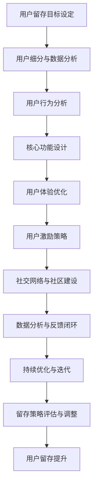

                 

### 《技术创业的用户留存：提高产品粘性的实践方法》

> **关键词**：用户留存、产品粘性、用户体验、激励策略、数据分析

> **摘要**：本文旨在探讨技术创业中如何通过提高产品粘性来提升用户留存率。文章首先介绍了用户留存与产品粘性的概念，随后分析了用户留存的重要性以及产品设计的联系。接着，本文详细阐述了提高产品粘性的实践方法，包括核心功能设计、用户激励、社交网络建设以及数据分析。通过案例分析和实践步骤，本文为技术创业者提供了一系列实用的策略和技巧，以优化用户留存，助力产品成功。

### 《技术创业的用户留存：提高产品粘性的实践方法》目录大纲

**第一部分：用户留存理论基础**

1. **用户留存与产品粘性的概念与意义**
   - **1.1 用户留存与产品粘性的基本概念**
   - **1.2 用户留存的重要性**
   - **1.3 产品粘性的影响要素

2. **用户留存率计算与评估方法**
   - **2.1 用户留存率的基本计算方法**
   - **2.2 用户留存率的评价指标**
   - **2.3 用户留存数据分析与可视化

3. **用户留存与产品设计的联系**
   - **3.1 用户留存与用户体验的关系**
   - **3.2 用户行为分析在产品改进中的应用**
   - **3.3 产品设计中的用户留存策略**

**第二部分：提高产品粘性的实践方法**

4. **核心功能设计与用户体验优化**
   - **4.1 核心功能的定义与设计原则**
   - **4.2 用户界面设计优化**
   - **4.3 用户反馈系统与快速迭代

5. **用户激励与留存策略**
   - **5.1 用户激励理论**
   - **5.2 常见的用户激励手段**
   - **5.3 用户激励策略的实施与优化

6. **社交网络与社区建设**
   - **6.1 社交网络在用户留存中的作用**
   - **6.2 社区建设的策略与执行**
   - **6.3 社区运营的挑战与解决方案

7. **数据分析与用户细分**
   - **7.1 用户数据分析的价值**
   - **7.2 用户细分的方法与步骤**
   - **7.3 用户细分在产品迭代中的应用

8. **案例分析：优秀产品的用户留存策略**
   - **8.1 案例选择与介绍**
   - **8.2 案例分析：用户留存策略的关键要素**
   - **8.3 启示与借鉴**

**第三部分：实施与优化**

9. **用户留存策略的实施步骤**
   - **9.1 确定用户留存目标**
   - **9.2 制定用户留存策略**
   - **9.3 实施与跟踪

10. **持续优化与迭代**
    - **10.1 用户留存策略的评估与调整**
    - **10.2 数据驱动的产品优化**
    - **10.3 长期用户留存策略的制定

11. **常见问题和解决方案**
    - **11.1 用户留存策略的常见挑战**
    - **11.2 问题诊断与解决方案**
    - **11.3 实际案例中的问题与对策**

**附录**

A. **用户留存相关工具推荐**
   - **A.1 用户数据分析工具**
   - **A.2 用户行为追踪工具**
   - **A.3 用户反馈与调研工具

B. **参考文献与推荐阅读**
   - **B.1 顶级研究论文**
   - **B.2 经典书籍推荐**
   - **B.3 优秀博客与资讯网站**

### 第一部分：用户留存理论基础

#### 第1章：用户留存与产品粘性的概念与意义

在技术创业领域，用户留存是一个关键指标，它直接影响产品的市场表现和盈利能力。用户留存，简单来说，就是指在一段时间内，持续使用产品的用户数量。而产品粘性，则是指用户对产品的依赖程度，即用户在长时间内持续使用同一产品的倾向。

**1.1 用户留存与产品粘性的基本概念**

- **用户留存（Customer Retention）**：用户留存通常用留存率来衡量，它是指在特定时间内，最初使用产品的用户中有多少比例继续使用该产品。留存率可以按日、周、月等不同时间周期来计算。

  留存率计算公式为：
  $$
  留存率 = \frac{t+1\text{个月后的活跃用户数}}{t\text{个月前的活跃用户数}} \times 100\%
  $$
  
- **产品粘性（Product Stickiness）**：产品粘性是指用户对产品的依赖程度，这种依赖可以是功能上的、情感上的或社交上的。高粘性的产品能够吸引用户持续使用，甚至成为他们日常生活的一部分。

  产品粘性可以通过以下指标来衡量：
  - **日均活跃用户数（DAU）**
  - **月均活跃用户数（MAU）**
  - **用户生命周期价值（LTV）**

**1.2 用户留存的重要性**

用户留存对于技术创业公司的重要性体现在以下几个方面：

- **用户生命周期价值**：高留存率的用户往往会在产品上投入更多的时间和金钱，从而提升用户生命周期价值（LTV）。

- **品牌忠诚度**：长期使用产品的用户更可能成为品牌的支持者，这有助于提升品牌影响力和口碑。

- **减少用户获取成本**：提高留存率可以降低用户获取成本（CAC），因为现有用户再次获取的成本远低于新用户。

- **产品改进**：通过分析留存数据，公司可以更好地了解用户需求，从而不断优化产品。

**1.3 产品粘性的影响要素**

产品粘性受多种因素影响，包括以下几个方面：

- **用户体验**：良好的用户体验能够提高用户满意度，从而增强产品粘性。

- **功能价值**：产品的核心功能必须能够满足用户的需求，并提供独特的价值。

- **社交因素**：社交网络和社区能够增强用户之间的互动，提升产品的社交价值。

- **持续更新与改进**：定期更新产品功能，并根据用户反馈进行调整，能够保持用户的兴趣和忠诚度。

在下一章中，我们将进一步探讨用户留存率的计算与评估方法，以及如何通过这些方法来了解产品的表现和优化策略。

### 第2章：用户留存率计算与评估方法

用户留存率是衡量产品成功与否的重要指标，它反映了用户在特定时间间隔内持续使用产品的比例。正确计算和评估用户留存率，不仅可以帮助技术创业公司了解产品的表现，还能为后续的优化策略提供数据支持。

#### 2.1 用户留存率的基本计算方法

用户留存率的计算方法相对简单，关键在于定义留存的时间周期和活跃用户的界定。以下是常见的计算方法：

**按日留存率（Daily Retention Rate）**

$$
日留存率 = \frac{t+1\text{天的活跃用户数}}{t\text{天的注册用户数}} \times 100\%
$$

其中，t可以是0、1、2、3等，表示用户从注册日开始计算的0天、1天、2天等后的活跃情况。

**按周留存率（Weekly Retention Rate）**

$$
周留存率 = \frac{t+1\text{周的活跃用户数}}{t\text{周的注册用户数}} \times 100\%
$$

**按月留存率（Monthly Retention Rate）**

$$
月留存率 = \frac{t+1\text{月的活跃用户数}}{t\text{月的注册用户数}} \times 100\%
$$

不同的留存时间周期适用于不同的产品类型和业务场景。例如，对于日常应用，按日留存率可能更为合适；而对于游戏或长周期服务，按月留存率可能更能反映用户的持续使用情况。

#### 2.2 用户留存率的评价指标

用户留存率的评价指标可以分为以下几个方面：

- **留存率趋势**：通过观察不同时间点的留存率趋势，可以了解产品的留存状况是否在改善或恶化。

- **留存率与行业对比**：将产品的留存率与同行业的其他产品进行比较，可以判断产品在市场中的竞争力。

- **留存率与用户生命周期价值（LTV）的关系**：高留存率的用户往往有更高的LTV，因此可以通过分析留存率与LTV的关系来评估产品的盈利能力。

- **留存率与用户获取成本（CAC）的关系**：提高留存率可以降低用户获取成本，从而提升整体的投资回报率（ROI）。

#### 2.3 用户留存数据分析与可视化

用户留存数据分析与可视化是评估产品表现的重要步骤。以下是一些常用的数据分析和可视化方法：

- **留存率曲线**：绘制不同时间点的留存率曲线，可以直观地观察到留存率的变化趋势。

- **留存率分布**：通过饼图或条形图展示不同留存时间点的用户分布情况，可以了解用户在不同时间段的留存比例。

- **留存率对比**：将不同产品的留存率进行比较，帮助识别优秀产品和需要改进的地方。

- **留存率与用户行为的关联分析**：结合用户行为数据，分析用户留存率与用户行为（如活跃度、使用时长、功能使用频率等）的关系，为产品优化提供依据。

**案例：按周留存率分析**

假设一个在线教育平台在一个月内收集了用户注册和活跃数据，通过以下步骤进行分析：

1. **数据收集**：收集每周的注册用户数和活跃用户数。

2. **计算留存率**：分别计算每周的留存率，如下表所示：

| 周次 | 注册用户数 | 活跃用户数 | 留存率（%） |
| ---- | ---------- | ---------- | ---------- |
| 1    | 1000       | 700        | 70         |
| 2    | 800        | 500        | 62.5       |
| 3    | 600        | 350        | 58.3       |
| 4    | 500        | 250        | 50         |

3. **留存率趋势分析**：从数据中可以看到，第一周留存率最高，随后逐渐下降。这提示平台需要关注用户在早期阶段的体验，以提升留存率。

4. **留存率分布**：通过饼图展示各周留存率的分布情况，可以更直观地了解用户在不同时间点的留存比例。

5. **留存率与用户行为的关联分析**：结合用户行为数据，分析留存率与用户使用时长、功能使用频率等指标的关系，找出影响留存的关键因素。

通过上述分析，平台可以制定相应的优化策略，如改进用户引导流程、优化产品功能、增加用户激励等，以提高用户留存率。

在下一章中，我们将探讨用户留存与产品设计的紧密联系，分析如何通过设计优化来提升用户留存率。

### 第3章：用户留存与产品设计的联系

用户留存不仅取决于产品的功能和质量，还与产品设计紧密相关。优秀的用户体验、合理的功能设计和持续的用户互动，都是提升用户留存的关键因素。

#### 3.1 用户留存与用户体验的关系

用户体验（UX）是用户在使用产品过程中的感受和体验。良好的用户体验能够增强用户的满意度和忠诚度，从而提升产品的留存率。

- **易用性**：产品界面应该简洁直观，用户能够轻松找到所需的功能。通过用户研究，设计师可以识别用户的需求和行为模式，从而优化产品界面。

- **响应速度**：产品应该具有快速的响应速度，尤其是在移动设备上。延迟会导致用户流失，因此优化后台服务和前端加载速度至关重要。

- **美观度**：美观的设计能够吸引新用户，而优秀的设计则能留住他们。通过一致的设计风格和高质量的用户界面元素，可以提升产品的整体吸引力。

- **个性化**：个性化体验能够增加用户对产品的归属感。例如，通过个性化推荐、用户资料定制等方式，使产品更加贴合用户的需求和偏好。

#### 3.2 用户行为分析在产品改进中的应用

用户行为分析是产品改进的重要工具，通过分析用户的行为数据，可以发现产品中的问题，并为改进提供依据。

- **用户路径分析**：通过分析用户在产品中的路径，可以了解用户的常见操作和遇到的困难。这有助于优化导航和界面布局，提高用户的操作效率。

- **事件追踪**：记录用户在产品中的关键行为，如注册、登录、购买等。通过对这些事件的追踪和分析，可以评估产品的转化率和用户留存情况。

- **A/B测试**：通过A/B测试，设计师可以比较不同设计方案的效果，从而选出最优方案。这种方法能够确保设计改进真正满足用户需求。

**案例：用户行为分析在产品改进中的应用**

假设一个在线购物平台通过用户行为分析，发现了以下问题：

- **用户路径问题**：大部分用户在浏览产品时，会先查看分类页，然后浏览具体产品页，但很少继续进行购买操作。通过路径分析，发现用户在产品页面的加载速度较慢，导致用户流失。

- **事件追踪问题**：用户在注册和登录页面的转化率较低，这可能是由于流程复杂或验证步骤过多。

- **A/B测试结果**：通过A/B测试，发现新的用户界面设计（如简化导航栏和改进加载速度）显著提升了用户的操作效率和转化率。

基于这些分析结果，平台进行了以下改进：

- **优化加载速度**：通过压缩图片和减少服务器请求，提高了产品页面的加载速度。

- **简化注册和登录流程**：减少了不必要的验证步骤，提高了用户转化率。

- **更新用户界面设计**：采用新的设计风格，提高了用户界面的美观度和用户体验。

这些改进措施不仅提升了用户体验，还显著提高了用户的留存率。

#### 3.3 产品设计中的用户留存策略

为了提高用户留存率，产品设计师需要从以下几个方面入手：

- **早期用户引导**：新用户在使用产品时，需要得到适当的引导，帮助他们快速上手。例如，通过引导视频、新手教程和个性化引导提示，可以降低学习曲线，提高用户留存率。

- **持续功能更新**：定期发布新功能或改进现有功能，可以保持用户的兴趣和活跃度。通过用户反馈和数据监测，了解用户的需求和偏好，有针对性地进行功能优化。

- **用户互动**：鼓励用户之间的互动，如社区讨论、社交分享等，可以增加产品的社交价值，提高用户粘性。

- **用户激励**：通过奖励机制、积分系统等用户激励手段，可以激发用户的积极性，提高他们的留存率。

综上所述，用户留存与产品设计密切相关。通过优化用户体验、分析用户行为，并实施有效的用户留存策略，技术创业公司可以显著提升产品的留存率，从而实现更好的市场表现和商业成功。

在下一章中，我们将探讨如何通过核心功能设计和用户体验优化来提高产品粘性。

### 第4章：核心功能设计与用户体验优化

核心功能的设计和用户体验优化是提高产品粘性的关键环节。一个优秀的产品不仅需要满足用户的基本需求，还需要在功能和用户体验上不断迭代，以保持用户的持续关注和活跃度。

#### 4.1 核心功能的定义与设计原则

核心功能是指产品中最重要、最基本的功能，它们直接决定了产品的价值和用户满意度。在定义核心功能时，需要遵循以下原则：

- **用户需求导向**：核心功能应该紧密围绕用户的需求设计，解决用户的核心痛点。通过用户调研、访谈和市场分析，了解用户的需求和期望，是定义核心功能的基础。

- **简洁明了**：核心功能的设计应该简洁易懂，避免复杂和不必要的步骤。简洁的设计不仅能够提高用户的操作效率，还能减少用户的学习成本。

- **实用性**：核心功能必须具备实用性，能够解决用户的实际问题。功能过于复杂或者无法实际使用，都会降低用户对产品的满意度。

- **可扩展性**：核心功能的设计应该具备一定的扩展性，以便在未来的产品迭代中添加新功能或改进现有功能。

#### 4.2 用户界面设计优化

用户界面设计（UI Design）是用户体验（UX）的重要组成部分。一个优秀的用户界面应该具备以下特点：

- **一致性**：界面元素的风格和布局应该保持一致，包括颜色、字体、图标等。一致性能够提高用户的操作效率，减少认知负担。

- **直观性**：界面设计应该直观易懂，用户能够通过直观的布局和指示快速理解如何使用产品。例如，通过使用图标和标签来明确功能，避免使用过多的文字说明。

- **响应性**：界面设计应该适应不同设备和屏幕尺寸，提供良好的移动体验。通过响应式设计，确保用户在任何设备上都能获得一致的体验。

- **美观度**：美观的界面设计能够提升产品的吸引力，增强用户的好感度。优秀的界面设计不仅注重功能，还注重美学，创造出愉悦的用户体验。

#### 4.3 用户反馈系统与快速迭代

用户反馈是产品优化的重要来源。一个有效的用户反馈系统可以帮助产品团队了解用户的真实需求和痛点，从而进行针对性的改进。

- **反馈收集**：通过多种渠道收集用户反馈，包括在线调查、用户访谈、用户论坛、社交媒体等。确保用户能够在不同的场景下方便地提交反馈。

- **反馈分类**：对收集到的反馈进行分类和分析，识别出高频问题和重要需求。通过数据分析和用户行为研究，了解用户对产品的具体期望和不满之处。

- **快速迭代**：根据用户反馈进行快速迭代，及时改进产品。通过敏捷开发方法，将用户的反馈转化为实际的产品改进，缩短改进周期，提高用户的满意度。

- **反馈闭环**：向用户提供反馈的回复和改进结果，建立反馈闭环。通过透明和及时的沟通，增强用户的参与感和信任感。

**案例：核心功能设计与用户体验优化**

假设一个即时通讯应用希望通过优化核心功能来提高用户留存率，可以采取以下步骤：

1. **用户需求调研**：通过用户访谈和问卷调查，了解用户对于聊天速度、消息同步、群组功能等方面的需求。

2. **功能梳理**：根据用户反馈，梳理出当前产品的核心功能，如消息发送、图片分享、语音通话和群组聊天。

3. **界面优化**：改进用户界面设计，使聊天窗口更简洁，消息加载速度更快。通过使用直观的图标和标签，使用户能够快速理解和使用产品。

4. **反馈收集**：建立用户反馈系统，通过应用内问卷、邮件和社交媒体等方式，收集用户的使用体验和建议。

5. **快速迭代**：根据用户反馈，定期发布新功能和改进，如增加图片滤镜、优化语音通话质量、引入新的群组管理功能等。

6. **反馈闭环**：向用户提供改进的反馈，展示新功能和优化后的效果，增强用户的参与感和信任感。

通过上述步骤，即时通讯应用可以显著提升用户体验，从而提高用户留存率。在下一章中，我们将探讨如何通过用户激励与留存策略来进一步提升产品粘性。

### 第5章：用户激励与留存策略

用户激励是提高产品粘性的重要手段，通过提供奖励、奖励机制和积分系统等手段，可以激发用户的积极性，延长用户在产品上的停留时间，从而提高留存率。

#### 5.1 用户激励理论

用户激励理论基于行为心理学的原理，认为人们的行为受到外部奖励的驱动。以下是几种常见的用户激励理论：

- **期望理论**：该理论认为人们会根据行为的结果和奖励的期望来决定行为。如果用户认为他们的行为会带来奖励，他们更有可能重复这种行为。

- **公平理论**：该理论强调奖励的公平性。如果用户认为他们得到的奖励与其他用户相比不公平，可能会导致负面情绪和不满，从而影响留存率。

- **自我决定理论**：该理论认为人们具有自我决定和自主性的需求，外部奖励可能会削弱内部动机。因此，激励措施应该注重满足用户的内在需求，如自我实现和成就感。

#### 5.2 常见的用户激励手段

为了有效地激励用户，技术创业公司可以采取以下几种常见的用户激励手段：

- **奖励机制**：通过奖励用户的行为，如完成任务、邀请好友或达到特定里程碑，来提高用户留存率。常见的奖励包括虚拟货币、优惠券、实物礼品等。

- **积分系统**：积分系统是一种通过累积积分来激励用户的手段。用户可以通过完成特定任务或达到一定等级来获得积分，积分可以用于兑换奖品、享受特殊优惠等。

- **排行榜**：排行榜可以激励用户竞争和挑战，通过排名来提高用户的活跃度和留存率。例如，在游戏、健身应用或社交网络中，排行榜可以展示用户的排名和成就。

- **个性化推荐**：通过个性化推荐，为用户推荐他们可能感兴趣的内容或功能，可以提高用户的参与度和留存率。个性化推荐可以根据用户的行为和偏好进行定制，从而增加用户的价值感知。

- **社群互动**：建立用户社群，鼓励用户之间的互动和分享，可以增强用户的归属感和参与感。通过线上论坛、社交媒体群组或线下活动，用户可以相互交流经验，分享成就，从而提高留存率。

#### 5.3 用户激励策略的实施与优化

为了确保用户激励策略的有效性，技术创业公司需要遵循以下步骤：

1. **明确激励目标**：确定激励策略的目标，如提高用户留存率、增加用户活跃度或提升用户生命周期价值（LTV）。

2. **设计激励措施**：根据用户需求和产品特点，设计具有吸引力的激励措施。确保奖励与用户行为紧密相关，并符合用户的期望和偏好。

3. **实施激励计划**：通过技术平台和渠道，实施激励计划，确保用户能够方便地参与和获得奖励。例如，通过应用内通知、电子邮件、短信等方式，通知用户奖励的获得情况。

4. **监控与评估**：监控激励策略的实施效果，通过数据分析和用户反馈，评估激励措施的有效性。例如，通过跟踪用户留存率、活跃度和参与度等指标，了解激励策略的影响。

5. **优化激励策略**：根据监控结果和用户反馈，不断优化激励策略。例如，通过调整奖励规则、增加新奖励项目或改进用户界面设计，提升用户激励的效果。

**案例：用户激励策略在社交媒体平台中的应用**

假设一个社交媒体平台希望通过激励策略提高用户留存率和活跃度，可以采取以下措施：

1. **明确激励目标**：提高用户在平台上的活跃度和参与度，延长用户停留时间。

2. **设计激励措施**：设置每日签到奖励，用户每日签到可以获得一定数量的虚拟货币，用于兑换奖品或享受特殊功能。此外，设置每月活跃用户排行榜，前几名用户可以获得实物奖励和平台特权。

3. **实施激励计划**：通过应用内通知和电子邮件，通知用户签到奖励和排行榜奖励的获得情况。在用户界面中，显示签到按钮和排行榜，方便用户参与和查看。

4. **监控与评估**：定期分析用户留存率、活跃度和参与度等指标，评估激励策略的效果。通过用户反馈，了解用户对激励措施的看法和建议。

5. **优化激励策略**：根据监控结果和用户反馈，调整签到奖励的规则，增加新奖励项目，如节日特别奖励或限时任务奖励。改进用户界面设计，提升用户参与度和体验。

通过实施有效的用户激励策略，社交媒体平台可以显著提高用户留存率和活跃度，从而增强产品竞争力。

在下一章中，我们将探讨社交网络与社区建设在提高产品粘性中的作用。

### 第6章：社交网络与社区建设

社交网络和社区建设是提高产品粘性的重要策略，通过创建用户之间的互动和连接，可以增强用户的参与感和归属感，从而提高产品的留存率和用户满意度。

#### 6.1 社交网络在用户留存中的作用

社交网络在用户留存中发挥着至关重要的作用。以下是社交网络在用户留存中的作用机制：

- **社交互动**：社交网络为用户提供了交流和互动的平台，用户可以在其中分享经验、交流观点，甚至建立友谊。这种互动不仅能够增强用户对产品的兴趣，还能提高他们的留存率。

- **社区归属感**：当用户在一个产品中建立了自己的社交圈子，他们会感到更加归属和投入。这种归属感可以激发用户持续使用产品的动力。

- **口碑传播**：通过社交网络，用户可以分享他们的使用体验和产品推荐，这种口碑传播有助于吸引新用户，并提高现有用户的留存率。

- **用户反馈**：社交网络为用户提供了一个反馈平台，他们可以在社区中提出问题和建议，产品团队可以及时响应和改进，从而提高用户满意度。

#### 6.2 社区建设的策略与执行

成功建立和运营社区需要一系列策略和执行措施。以下是社区建设的主要策略：

- **目标明确**：明确社区的目标和定位，确保社区内容与产品核心价值相符。例如，一个社交媒体平台可能需要建立一个用户互动和内容分享的社区。

- **内容策划**：策划有吸引力的内容，包括话题讨论、活动、教程、案例分享等，以激发用户的参与兴趣。内容应该多样化，满足不同用户的需求和兴趣。

- **社区管理**：建立一套有效的社区管理规则，确保社区环境的良好秩序。例如，制定内容发布规范、用户互动规则等。

- **激励机制**：通过激励措施，如积分、奖励、排名等，鼓励用户积极参与社区活动。激励机制可以提高用户的参与度和忠诚度。

- **活动策划**：定期举办线上或线下活动，如主题讨论、竞赛、聚会等，以增加用户的互动和参与感。活动可以增强社区凝聚力，提高用户留存率。

- **用户引导**：为新用户提供引导和帮助，帮助他们快速融入社区。例如，通过新手教程、社群介绍、互动指南等，帮助新用户了解社区规则和文化。

#### 6.3 社区运营的挑战与解决方案

社区运营面临着一系列挑战，以下是一些常见的挑战及其解决方案：

- **内容质量**：确保社区内容的质量是社区运营的关键。解决方案包括筛选和管理优质内容、鼓励用户贡献高质量内容、建立内容审核机制。

- **用户活跃度**：提高用户活跃度是社区运营的重要目标。解决方案包括策划有趣的活动、提供有吸引力的激励机制、定期发布有价值的内容。

- **用户参与度**：用户参与度是社区成功的关键指标。解决方案包括鼓励用户互动、建立用户参与机制、提供个性化体验。

- **社区氛围**：维护良好的社区氛围对于用户留存至关重要。解决方案包括制定明确的社区规则、积极管理社区环境、及时处理负面行为。

- **技术支持**：技术问题可能导致社区运营困难。解决方案包括提供稳定的技术支持、优化社区平台性能、确保技术基础设施的可靠性。

**案例：社交网络与社区建设在电商平台中的应用**

假设一个电商平台希望通过社交网络和社区建设提高用户留存率，可以采取以下步骤：

1. **明确社区目标**：建立用户互动和内容分享的社区，鼓励用户分享购物经验和推荐商品。

2. **内容策划**：策划购物指南、用户分享、热门话题等，以满足不同用户的需求。例如，发布每周热门商品推荐，鼓励用户分享购物心得。

3. **社区管理**：制定社区规则，确保用户之间的良好互动和内容质量。例如，禁止发布垃圾信息和广告，鼓励正面评论和交流。

4. **激励机制**：通过积分系统，鼓励用户积极参与社区活动。用户可以积分兑换优惠券或礼品，提高他们的参与度。

5. **活动策划**：定期举办购物竞赛、用户分享会、主题讨论等，提高用户的互动和参与感。例如，在特定节日举办购物狂欢活动，增加用户粘性。

6. **技术支持**：确保社区平台的稳定性和性能，提供良好的用户体验。例如，优化页面加载速度，确保用户在社区中的操作流畅。

通过社交网络和社区建设，电商平台可以增强用户之间的互动，提高用户留存率和满意度，从而实现商业成功。

在下一章中，我们将探讨如何通过数据分析与用户细分来提高产品粘性。

### 第7章：数据分析与用户细分

在技术创业领域，数据分析与用户细分是提高产品粘性的关键手段。通过对用户数据进行深入分析，技术创业公司可以更好地了解用户行为和需求，从而制定有针对性的策略，提升产品留存率。

#### 7.1 用户数据分析的价值

用户数据分析在提高产品粘性方面具有多方面的价值：

- **需求洞察**：通过分析用户数据，可以深入了解用户的需求和偏好，发现用户行为模式，从而优化产品设计和服务。

- **优化策略**：基于数据分析，公司可以制定更加精准的营销策略、功能优化方案和用户激励措施，提高用户的参与度和忠诚度。

- **风险预警**：数据分析可以帮助识别潜在的问题和风险，如用户流失趋势、负面反馈集中点等，从而及时采取应对措施。

- **持续改进**：用户数据分析是一个持续的过程，通过定期收集和分析数据，技术创业公司可以不断优化产品，提高用户留存率和市场竞争力。

#### 7.2 用户细分的方法与步骤

用户细分是数据分析的重要环节，通过将用户划分为不同的群体，技术创业公司可以更有针对性地满足用户需求。以下是用户细分的方法和步骤：

1. **定义细分目标**：明确用户细分的目的是什么，如提升留存率、增加活跃度、提高转化率等。目标将指导细分策略的制定。

2. **收集用户数据**：收集用户的各项数据，包括基础信息（如年龄、性别、地理位置）、行为数据（如登录频率、使用时长、功能使用情况）和反馈数据（如评价、反馈、投诉）。

3. **选择细分指标**：根据业务目标和用户数据，选择适当的细分指标。常见的细分指标包括用户活跃度、使用时长、功能使用频率、转化率等。

4. **建立细分模型**：使用数据挖掘和机器学习技术，建立用户细分模型。例如，可以通过聚类分析将用户划分为不同群体，或者使用决策树进行分类。

5. **评估细分效果**：对细分效果进行评估，通过分析不同用户群体的行为和留存率，判断细分策略的有效性。

#### 7.3 用户细分在产品迭代中的应用

用户细分在产品迭代中具有重要作用，通过细分用户群体，技术创业公司可以更精准地满足用户需求，提升产品竞争力。以下是用户细分在产品迭代中的应用：

1. **个性化推荐**：根据用户的细分结果，为不同用户群体提供个性化的推荐内容。例如，针对高留存率用户，推荐新的高级功能；针对潜在流失用户，推荐促销活动和优惠。

2. **功能优化**：针对不同用户群体的需求和反馈，优化产品功能。例如，对于某一细分群体中频繁出现的问题，进行重点修复和改进。

3. **差异化营销**：根据用户细分结果，制定差异化的营销策略。例如，对于高价值用户，提供专属优惠和活动；对于潜在流失用户，发送挽回邮件或提供个性化服务。

4. **用户体验优化**：根据用户细分结果，优化用户界面和体验。例如，对于使用频率高的功能，提供更便捷的访问方式；对于使用频率低的用户，提供有针对性的引导和提示。

**案例：用户细分在社交媒体平台中的应用**

假设一个社交媒体平台希望通过用户细分提高用户留存率，可以采取以下步骤：

1. **定义细分目标**：提升活跃度和留存率，优化用户体验。

2. **收集用户数据**：收集用户的基本信息、行为数据和反馈数据。

3. **选择细分指标**：基于用户活跃度、使用时长、功能使用频率等指标，将用户划分为活跃用户、潜在流失用户和低活跃用户。

4. **建立细分模型**：使用聚类分析和机器学习技术，建立用户细分模型。

5. **评估细分效果**：分析不同用户群体的行为和留存率，评估细分策略的有效性。

6. **个性化推荐**：根据用户细分结果，为活跃用户提供个性化内容推荐，如热门话题和兴趣小组。

7. **功能优化**：针对潜在流失用户，优化界面设计和功能，提高其使用体验。

8. **差异化营销**：为高活跃用户提供专属活动和优惠，为潜在流失用户发送挽回邮件和个性化推荐。

9. **用户体验优化**：根据用户细分结果，优化用户界面和体验，确保不同用户群体都能获得良好的使用体验。

通过上述步骤，社交媒体平台可以更精准地满足用户需求，提高用户留存率和满意度，从而实现商业成功。

在下一章中，我们将通过具体案例分析优秀产品的用户留存策略，探讨其成功的关键要素。

### 第8章：案例分析：优秀产品的用户留存策略

在实际操作中，优秀产品的用户留存策略往往具备独特的优势，这些策略不仅提高了产品的市场竞争力，还实现了显著的商业成功。在本章中，我们将分析几个成功的案例分析，探讨其用户留存策略的关键要素，并从中汲取宝贵的经验。

#### 8.1 案例选择与介绍

在本章中，我们将重点分析以下三个案例：

1. **案例一：WhatsApp**

WhatsApp 是一款全球知名的即时通讯应用，凭借其出色的用户留存策略，成为了社交领域的领军者。其核心优势在于简单易用的界面、高效的通讯效率和丰富的功能扩展。

2. **案例二：Airbnb**

Airbnb 是一家提供短期住宿服务的在线平台，其用户留存策略主要依赖于社区建设、用户体验优化和用户激励手段。通过打造一个真实的社区，Airbnb 成功地提高了用户的粘性和忠诚度。

3. **案例三：Duolingo**

Duolingo 是一款流行的语言学习应用，其用户留存策略通过个性化推荐、游戏化学习、用户反馈和社区互动等多方面手段，实现了极高的用户留存率。

#### 8.2 案例分析：用户留存策略的关键要素

以下是这三个案例中用户留存策略的关键要素：

1. **WhatsApp**

- **简洁的用户界面**：WhatsApp 提供了一个简洁直观的用户界面，用户可以轻松地找到所需功能，操作流程简单，降低了用户的学习成本。

- **高效的通讯效率**：WhatsApp 的高效通讯效率是其核心竞争力之一。通过快速的消息发送、接收和加载，WhatsApp 保证了用户之间的即时通讯体验。

- **功能扩展**：WhatsApp 通过不断更新和扩展功能，如视频通话、群组聊天和状态更新等，满足了用户的多样化需求，提高了用户的活跃度和留存率。

2. **Airbnb**

- **社区建设**：Airbnb 通过建立社区，鼓励用户分享住宿体验、评论和反馈，增强了用户之间的互动和归属感。这种社区氛围有助于提高用户的粘性和忠诚度。

- **用户体验优化**：Airbnb 在用户体验优化方面做得非常出色。通过改进搜索功能、提供个性化的推荐和优化用户界面设计，Airbnb 提高了用户的满意度。

- **用户激励**：Airbnb 通过奖励机制，如积分兑换、优惠和推荐奖励等，激发了用户的积极性，提高了用户的留存率。

3. **Duolingo**

- **个性化推荐**：Duolingo 通过个性化推荐，为用户推荐适合的学习内容和课程。这种个性化推荐不仅提高了用户的学习效率，还增强了用户的留存率。

- **游戏化学习**：Duolingo 采用游戏化学习模式，通过积分、徽章和排行榜等激励机制，激发了用户的学习兴趣和参与度。

- **用户反馈与社区互动**：Duolingo 鼓励用户提供反馈和建议，建立了用户社区，用户可以在社区中分享学习经验和心得。这种用户互动有助于提高用户的归属感和忠诚度。

#### 8.3 启示与借鉴

通过以上案例分析，我们可以总结出以下启示，以借鉴优秀产品的用户留存策略：

1. **简洁的用户界面**：提供简洁直观的用户界面，降低用户学习成本，提高操作效率。

2. **高效的通讯效率**：确保产品在通讯效率方面具备优势，如快速的消息发送、接收和加载，以提高用户体验。

3. **功能扩展与个性化**：不断更新和扩展功能，满足用户的多样化需求，并通过个性化推荐提高用户满意度。

4. **社区建设与用户互动**：建立社区，鼓励用户互动和分享，增强用户的归属感和忠诚度。

5. **用户激励与反馈机制**：通过激励措施和用户反馈机制，激发用户的积极性，提高用户的留存率。

通过借鉴这些成功经验，技术创业公司可以制定出更加有效的用户留存策略，提高产品的市场竞争力，实现商业成功。

### 第9章：用户留存策略的实施步骤

要成功实施用户留存策略，技术创业公司需要制定详细的步骤，并确保每一步都得到有效执行。以下是实现用户留存策略的主要步骤：

#### 9.1 确定用户留存目标

制定用户留存策略的第一步是明确目标。这包括设定具体的留存率目标，如提高当前月留存率10%、降低用户流失率等。目标应具有可衡量性、可实现性和相关性，以便后续评估策略的有效性。

- **目标设定**：基于当前用户留存情况和市场趋势，设定合理的留存率目标。

- **目标分解**：将大目标分解为具体的小目标，例如按月、按季度设定阶段性目标。

- **目标沟通**：确保团队成员对目标有清晰的理解，并明确各自的责任和任务。

#### 9.2 制定用户留存策略

在明确目标后，需要制定具体的留存策略。这包括确定实施步骤、选择合适的工具和方法，以及制定时间表和预算。

- **策略制定**：基于用户细分结果和需求分析，制定有针对性的留存策略。例如，为高留存率用户制定保留计划，为潜在流失用户制定挽回策略。

- **工具与方法选择**：选择合适的工具和方法，如数据分析工具、用户反馈系统、用户激励机制等。

- **时间表与预算**：制定详细的实施时间表和预算，确保资源合理分配，避免超支。

#### 9.3 实施与跟踪

策略制定后，需要按照计划实施，并实时跟踪效果。以下步骤有助于确保策略的有效执行：

- **项目启动**：启动项目，组建实施团队，明确各成员的职责和任务。

- **执行与监控**：按照时间表和预算，逐步实施留存策略。同时，建立监控机制，实时跟踪策略实施效果。

- **数据收集与分析**：收集用户留存数据，进行定期分析，评估策略的效果。

- **反馈与调整**：根据监控结果和用户反馈，及时调整策略，优化实施细节。

#### 9.4 评估与调整

策略实施一段时间后，需要对留存策略进行评估和调整。以下步骤有助于评估策略的有效性：

- **效果评估**：基于设定的留存目标，评估策略的实际效果，包括留存率、用户活跃度、用户满意度等指标。

- **问题诊断**：分析策略实施过程中存在的问题，如用户流失原因、反馈集中的问题等。

- **调整策略**：根据评估结果和问题诊断，调整留存策略，优化实施细节。

- **持续优化**：定期评估和调整策略，确保用户留存目标持续达成。

通过以上步骤，技术创业公司可以系统化地实施用户留存策略，提高产品粘性，实现商业成功。

### 第10章：持续优化与迭代

用户留存策略的成功实施并非一蹴而就，而是一个持续优化和迭代的过程。通过数据驱动的产品优化和长期的用户留存策略，技术创业公司可以不断提高产品的市场竞争力和用户满意度。

#### 10.1 用户留存策略的评估与调整

定期评估用户留存策略是确保其持续有效性的关键。以下步骤有助于评估和调整策略：

- **数据分析**：通过收集和分析用户留存数据，如留存率、用户活跃度、用户生命周期价值（LTV）等，评估策略的效果。

- **用户反馈**：收集用户的反馈和建议，通过问卷调查、用户访谈、在线评论等方式，了解用户对产品的真实感受。

- **KPI监测**：设定关键绩效指标（KPI），如用户留存率、用户满意度、用户获取成本（CAC）等，定期监测和评估策略的表现。

- **问题诊断**：分析策略实施过程中存在的问题和挑战，如用户流失原因、反馈集中的问题等，识别需要改进的环节。

- **调整策略**：基于数据分析、用户反馈和问题诊断，调整和优化留存策略。例如，针对用户流失原因，优化用户体验或改进功能设计。

#### 10.2 数据驱动的产品优化

数据驱动是现代产品开发的重要理念。通过数据分析和用户反馈，技术创业公司可以更精准地优化产品，提高用户留存率。

- **用户行为分析**：分析用户在产品中的行为数据，如登录频率、使用时长、功能使用频率等，了解用户的使用习惯和偏好。

- **A/B测试**：通过A/B测试，比较不同设计方案的效果，确定哪些改进措施能够真正提升用户体验和留存率。

- **个性化推荐**：基于用户行为和偏好数据，提供个性化的内容和服务，提高用户的满意度和留存率。

- **用户体验测试**：通过用户体验测试，识别产品中的瓶颈和问题，及时进行优化和改进。

#### 10.3 长期用户留存策略的制定

长期的用户留存策略需要综合考虑市场需求、用户行为和公司资源，以实现持续的用户增长和留存。

- **需求分析**：定期进行市场需求分析，了解用户的新需求和市场趋势，及时调整产品方向和功能。

- **用户细分**：根据用户行为和需求，进行用户细分，制定有针对性的留存策略。例如，为高价值用户制定专属服务和优惠政策，为潜在流失用户提供挽回措施。

- **社区建设**：建立用户社区，鼓励用户互动和分享，增强用户归属感和忠诚度。

- **持续优化**：定期评估和优化用户留存策略，根据用户反馈和市场变化，进行持续改进。

通过数据驱动的产品优化和长期的用户留存策略，技术创业公司可以不断提高产品的市场竞争力和用户满意度，实现可持续的商业成功。

### 第11章：常见问题和解决方案

在用户留存策略的实施过程中，技术创业公司可能会面临一系列常见问题。以下是这些问题及其解决方案：

#### 11.1 用户留存策略的常见挑战

1. **用户流失率居高不下**：用户流失是用户留存策略实施过程中最常见的问题之一。原因可能包括产品功能不足、用户体验差、竞争对手的压力等。

2. **用户满意度低**：用户满意度不高可能导致用户流失。原因可能包括功能不完善、响应速度慢、客户服务不佳等。

3. **数据不足或分析不足**：数据不足或分析不足可能导致用户留存策略的制定和执行缺乏依据，影响策略的有效性。

4. **资源限制**：有限的资源和预算可能限制用户留存策略的实施，影响策略的执行效果。

#### 11.2 问题诊断与解决方案

针对上述问题，以下是一些建议的解决方案：

1. **用户流失率居高不下**

   - **问题诊断**：分析用户流失的原因，如功能不足、用户体验差、竞争对手压力等。
   - **解决方案**：优化产品功能，提高用户体验，提供有吸引力的激励措施，增强用户粘性。

2. **用户满意度低**

   - **问题诊断**：通过用户调研、反馈和满意度调查，了解用户不满的原因。
   - **解决方案**：改进用户体验，优化界面设计，提高响应速度，加强客户服务。

3. **数据不足或分析不足**

   - **问题诊断**：评估当前的数据收集和分析能力，识别数据缺失和不足的环节。
   - **解决方案**：加强数据收集和分析能力，引入先进的数据分析工具，定期分析用户留存数据，为策略制定提供依据。

4. **资源限制**

   - **问题诊断**：评估当前资源和预算的使用情况，识别资源限制的瓶颈。
   - **解决方案**：合理分配资源和预算，优化资源使用效率，优先考虑对用户留存有重大影响的策略。

#### 11.3 实际案例中的问题与对策

以下是一些实际案例中的问题和对策：

1. **案例一：用户流失率居高不下**

   - **问题**：一家在线教育平台用户流失率较高，用户反馈课程内容重复，缺乏新意。

   - **对策**：平台决定增加课程内容的更新频率，引入更多行业专家，优化课程结构，提高课程质量。

2. **案例二：用户满意度低**

   - **问题**：一家社交媒体平台用户满意度较低，主要原因是用户界面设计过于复杂，功能难以操作。

   - **对策**：平台对用户界面进行了全面优化，简化了操作流程，提高了界面的直观性，同时增加了用户引导和帮助功能。

3. **案例三：数据不足或分析不足**

   - **问题**：一家电商平台的用户留存策略缺乏数据支持，导致策略制定和执行缺乏依据。

   - **对策**：平台引入了先进的数据分析工具，建立了用户行为数据库，定期分析用户留存数据，为策略制定提供了有力支持。

通过以上问题和对策，技术创业公司可以更好地应对用户留存策略实施过程中遇到的挑战，提高用户留存率，实现商业成功。

### 附录A：用户留存相关工具推荐

为了帮助技术创业公司更好地实施用户留存策略，以下是一些用户留存相关的工具推荐：

#### A.1 用户数据分析工具

- **Google Analytics**：Google Analytics 是一款功能强大的数据分析工具，可以提供详细的用户行为数据，包括流量来源、用户路径、转化率等。

- **Mixpanel**：Mixpanel 是一款专注于用户行为分析的工具，提供深入的用户细分和个性化推荐功能，有助于优化用户留存策略。

- **Tableau**：Tableau 是一款数据可视化工具，可以将复杂的用户数据转化为直观的图表和报表，帮助团队快速理解和分析用户行为。

#### A.2 用户行为追踪工具

- **Hotjar**：Hotjar 可以实时跟踪用户在网站或应用上的行为，包括鼠标移动、点击热图和用户录像等，有助于优化用户体验。

- **FullStory**：FullStory 提供全面的用户行为追踪功能，包括用户路径分析、行为报告和用户反馈等，帮助团队了解用户的需求和痛点。

- **Quantcast**：Quantcast 是一款用户行为追踪和分析工具，可以提供详细的用户细分和用户画像，有助于制定有针对性的留存策略。

#### A.3 用户反馈与调研工具

- **SurveyMonkey**：SurveyMonkey 是一款流行的在线调研工具，可以轻松创建和分发问卷，收集用户反馈。

- **Qualaroo**：Qualaroo 提供即时反馈和调研功能，可以在用户使用产品时弹出问卷，收集实时反馈。

- **UserTesting**：UserTesting 是一款用户测试工具，可以通过在线视频录制，了解真实用户对产品的使用体验和反馈。

通过使用这些工具，技术创业公司可以更好地了解用户行为，优化产品设计，提高用户留存率。

### 附录B：参考文献与推荐阅读

为了深入了解用户留存和产品粘性的相关理论和方法，以下是一些顶级的学术论文、经典书籍和优秀的博客资源：

#### B.1 顶级研究论文

- **"The Lean Startup" by Eric Ries**：这是一本关于创业和产品开发的重要书籍，介绍了如何通过迭代和验证来优化产品。

- **"The Four Steps to the Epiphany" by Steve Blank**：本书提供了创业过程中关键的四个步骤，包括市场需求验证、客户开发、客户细分和商业模式创新。

- **"Crossing the Chasm" by Geoffrey A. Moore**：这本书深入探讨了如何将新技术产品引入市场，并成功实现商业规模化。

#### B.2 经典书籍推荐

- **"Hooked: How to Build Habit-Forming Products" by Nir Eyal**：本书详细介绍了如何设计成瘾性产品，通过触发、行动、奖励和投入四个核心元素来提高用户留存。

- **"Drive: The Surprising Truth About What Motivates Us" by Daniel H. Pink**：这本书探讨了内在动机的重要性，并提供了关于如何激发员工和用户内在动机的建议。

- **"The User Experience Team of One" by Leah Buley**：本书针对小型团队或个人在用户体验设计中的挑战，提供了实用的方法和技巧。

#### B.3 优秀博客与资讯网站

- **Product School**：Product School 是一个关于产品管理的在线学习平台，提供丰富的产品管理资源和博客文章。

- **User Interviews**：User Interviews 是一个专注于用户研究的方法和实践的博客，提供了大量的用户访谈技巧和案例分析。

- **SaaStr**：SaaStr 是一个关于软件即服务（SaaS）行业的博客，涵盖了产品管理、营销、销售和增长策略等方面的内容。

通过阅读这些参考文献和推荐书籍，技术创业公司可以深入理解用户留存和产品粘性的理论和方法，为实践提供有力的指导。

### 附录C：用户留存与产品粘性的 Mermaid 流程图

这个流程图展示了用户留存策略的关键步骤，从目标设定到持续优化，每个环节都至关重要，共同推动用户留存率的提升。

### 结语

在技术创业的道路上，用户留存是衡量产品成功与否的重要指标。通过深入理解用户留存与产品粘性的概念，分析用户行为，制定和实施有效的留存策略，技术创业公司可以显著提高产品的市场竞争力和用户满意度。本文从用户留存的理论基础、实践方法到案例分析，提供了一系列实用的策略和技巧，旨在帮助创业者优化用户留存，实现商业成功。

最后，感谢读者对本文的关注。如果您有任何疑问或建议，欢迎在评论区留言。期待与您共同探讨技术创业的更多话题，为创造更优秀的数字产品贡献智慧和力量。作者：AI天才研究院/AI Genius Institute & 禅与计算机程序设计艺术 /Zen And The Art of Computer Programming。

