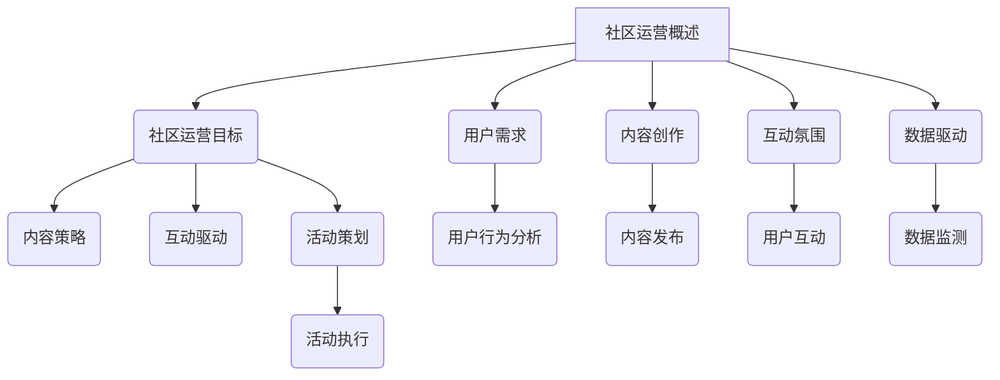

                 

### 技术创业的社区运营：构建活跃用户群的实践指南

#### 关键词：
技术创业、社区运营、用户群构建、活跃度提升、数据分析、内容策划、活动组织、风险控制、未来趋势

#### 摘要：
本文旨在探讨技术创业背景下的社区运营，从基础理论到实战策略，提供一套完整的实践指南。文章分为两个部分：第一部分介绍社区运营的基础知识，包括概述、用户分析、内容策划、活动组织等；第二部分聚焦实战，通过案例分析、团队建设、风险管理等，提供实用的运营技巧和策略。文章旨在帮助技术创业者构建和维护活跃的用户群，实现社区运营的成功。

---

### 第一部分：社区运营基础

#### 第1章：社区运营概述

#### 1.1 技术创业背景下的社区运营

社区运营在技术创业中扮演着至关重要的角色。首先，社区成为产品推广和用户获取的关键渠道。创业者可以通过社区，向潜在用户展示产品的优势和特点，增加产品知名度。其次，社区是用户互动和反馈的平台，创业者可以借助社区，收集用户反馈，了解用户需求，从而不断优化产品和服务。最后，社区是用户教育和用户转化的关键环节，通过社区的活动和内容，创业者可以引导用户从潜在用户转化为忠实用户。

在技术创业的背景下，社区运营的优势更加明显。技术创业公司往往拥有独特的创新技术和产品理念，通过社区运营，可以将这些技术和理念传递给用户，增加用户对产品的认知和认同。此外，技术创业公司通常资源有限，社区运营成本相对较低，但效果显著，可以通过高效的内容策划和用户互动，实现低成本、高回报的运营模式。

社区运营不仅仅是简单的用户管理，它涉及到一系列复杂的策略和活动。首先，创业者需要明确社区的目标和定位，这包括吸引新用户、保持用户活跃、提升用户满意度等。其次，创业者需要制定详细的运营策略，这包括内容策略、互动策略、活动策略等。最后，创业者需要持续监测社区运营效果，通过数据分析，不断优化运营策略，提高社区运营的效率。

#### 1.2 社区运营的重要性

社区运营的重要性可以从以下几个方面进行阐述：

1. **用户获取与留存**：社区是用户获取和留存的重要渠道。通过有效的社区运营，创业者可以吸引新用户，并通过持续的内容输出和用户互动，保持用户活跃度，提高用户留存率。

2. **用户洞察**：社区运营可以帮助创业者深入了解用户需求和行为。通过分析用户在社区中的行为数据，创业者可以获取宝贵的用户洞察，从而优化产品和服务，提高用户满意度。

3. **品牌建设**：社区运营是品牌建设的重要一环。通过在社区中提供高质量的内容和互动体验，创业者可以树立良好的品牌形象，增强品牌影响力。

4. **口碑传播**：社区运营有助于口碑传播。用户在社区中的积极互动和好评，可以吸引更多潜在用户，从而实现口碑效应。

5. **商业价值**：社区运营不仅有助于用户获取和留存，还可以为创业者带来直接的商业价值。例如，通过社区活动，创业者可以促进产品销售、增加广告收入等。

#### 1.3 社区运营的目标与策略

社区运营的目标可以分为以下几个方面：

1. **吸引新用户**：通过内容策划、活动组织等手段，吸引潜在用户加入社区。

2. **保持用户活跃**：通过持续的互动、内容输出，保持社区用户的活跃度。

3. **提升用户满意度**：通过优化社区体验，提高用户对产品和服务的满意度。

4. **转化用户为粉丝**：通过深度互动，将用户转化为忠实粉丝，为产品推广提供支持。

为了实现上述目标，创业者需要制定以下策略：

1. **内容策略**：产出高质量的内容，满足用户需求，提高用户粘性。

2. **互动策略**：鼓励用户参与讨论，形成良好的互动氛围。

3. **活动策略**：定期举办线上线下的活动，提升社区活力。

4. **数据驱动策略**：通过数据分析，优化运营策略，提高运营效率。

#### 1.4 社区运营的核心要素

社区运营的成功离不开以下几个核心要素：

1. **用户**：用户是社区的核心，所有运营活动都应围绕用户展开。

2. **内容**：内容是社区运营的基础，高质量的内容能够吸引用户，提高用户参与度。

3. **互动**：互动是社区运营的灵魂，有效的互动能够增强用户黏性，提升社区活跃度。

4. **活动**：活动是社区运营的重要手段，能够激发用户兴趣，提高用户参与度。

5. **数据**：数据是社区运营的决策依据，通过数据监测和分析，可以了解用户需求，优化运营策略。

#### 1.4 社区运营的挑战与机遇

社区运营面临以下挑战：

1. **用户需求多样化**：需要提供丰富多样的内容，满足不同用户的需求。

2. **竞争激烈**：需要不断创新，提升社区竞争力。

3. **资源有限**：需要高效利用资源，实现最大的运营效果。

然而，社区运营也面临着许多机遇：

1. **技术进步**：提供了更多的运营工具和方法。

2. **用户增长**：随着互联网的普及，社区用户数量持续增长。

3. **商业模式创新**：社区运营可以为产品提供更多的商业模式创新机会。

---

### Mermaid 流程图



---

### 第2章：社区用户分析与定位

#### 2.1 用户需求分析

用户需求分析是社区运营的重要基础。通过深入了解用户需求，创业者可以制定更精准的运营策略，提供更符合用户期望的产品和服务。

**用户需求分析的意义**

1. **指导内容策划**：了解用户需求可以帮助创业者制定合适的内容策略，确保内容满足用户期望。
2. **优化产品功能**：用户需求分析可以帮助创业者发现产品功能的不足，从而进行改进。
3. **提升用户体验**：通过满足用户需求，可以提升用户的满意度和忠诚度。

**用户需求分析的方法**

1. **问卷调查**：通过设计问卷，收集用户对产品、服务的意见和建议。
2. **用户访谈**：直接与用户进行对话，深入了解用户的使用场景和需求。
3. **数据分析**：通过分析用户行为数据，发现用户的需求模式和偏好。

**用户需求分析的步骤**

1. **确定分析目标**：明确需要了解的用户需求类型和范围。
2. **收集数据**：通过问卷调查、用户访谈等方式收集用户数据。
3. **数据分析**：对收集到的数据进行分析，提取用户需求。
4. **需求验证**：将分析结果与实际用户反馈进行对比，验证需求的准确性。

**举例说明**

假设某技术创业公司开发了一款人工智能辅助工具，以下是用户需求分析的过程：

1. **确定分析目标**：了解用户对人工智能辅助工具的需求，包括功能需求、使用体验、价格敏感度等。
2. **收集数据**：通过问卷调查，收集1000名用户的反馈数据。
3. **数据分析**：通过数据分析，发现用户最关注的功能是自动回复和数据分析。
4. **需求验证**：与用户进行访谈，验证数据分析结果的准确性。

通过上述分析，公司可以优先优化自动回复和数据分析功能，提高用户满意度。

---

### 伪代码：用户需求分析

```python
# 用户需求分析伪代码

# 步骤1：确定分析目标
analysis_targets = ["功能需求", "使用体验", "价格敏感度"]

# 步骤2：收集用户数据
user_data = collect_user_data()

# 步骤3：数据处理
cleaned_data = preprocess_user_data(user_data)

# 步骤4：提取用户需求
user_needs = extract_user_needs(cleaned_data)

# 步骤5：需求验证
verified_needs = validate_user_needs(user_needs)

# 步骤6：输出分析结果
print("用户需求分析结果：")
print(verified_needs)
```

---

### 数学模型与数学公式

#### 2.5 用户满意度模型

用户满意度（User Satisfaction）是衡量社区运营效果的重要指标。用户满意度可以通过以下模型进行计算：

$$
S = \frac{E - P + Q}{3}
$$

其中，$S$ 代表用户满意度，$E$ 代表用户期望，$P$ 代表实际感知，$Q$ 代表质量。

**用户期望（User Expectation）**：

$$
E = f(C_{1}, C_{2}, \ldots, C_{n})
$$

其中，$E$ 代表用户期望，$C_{i}$ 代表用户对各个方面的期望。

**实际感知（Perceived Performance）**：

$$
P = f(R_{1}, R_{2}, \ldots, R_{n})
$$

其中，$P$ 代表实际感知，$R_{i}$ 代表用户对各个方面的实际感知。

**质量（Quality）**：

$$
Q = \sum_{i=1}^{n} (E_{i} - R_{i})^2
$$

其中，$Q$ 代表质量，$E_{i}$ 和 $R_{i}$ 分别代表用户期望和实际感知的第 $i$ 个方面。

#### 举例说明：

- **用户期望**：

假设用户期望社区有丰富的内容、方便的互动工具和高效的客服响应。

$$
E = f(高内容质量，丰富的互动工具，高效的客服响应)
$$

- **实际感知**：

用户发现社区内容丰富、互动工具方便、客服响应迅速。

$$
P = f(高内容质量，丰富的互动工具，高效的客服响应)
$$

- **用户满意度**：

根据上述期望和实际感知，计算用户满意度。

$$
S = \frac{E - P + Q}{3} = \frac{(高内容质量 + 丰富的互动工具 + 高效的客服响应) - (高内容质量 + 丰富的互动工具 + 高效的客服响应) + (0 - 0 + 0)^2}{3}
$$

$$
S = \frac{0}{3} = 0
$$

- **质量**：

根据上述期望和实际感知，计算质量。

$$
Q = (E_{1} - R_{1})^2 + (E_{2} - R_{2})^2 + (E_{3} - R_{3})^2
$$

$$
Q = (高内容质量 - 高内容质量)^2 + (丰富的互动工具 - 丰富的互动工具)^2 + (高效的客服响应 - 高效的客服响应)^2
$$

$$
Q = 0 + 0 + 0 = 0
$$

---

### 代码实际案例

#### 2.6 社区用户行为分析代码案例

```python
# 社区用户行为分析代码示例

# 导入所需库
import pandas as pd
import numpy as np

# 步骤1：加载用户行为数据
user_data = pd.read_csv('user_behavior_data.csv')

# 步骤2：数据处理
# 填充缺失值
user_data.fillna(0, inplace=True)

# 步骤3：用户行为特征提取
# 计算用户平均活跃度
user_activity = user_data.groupby('user_id')['post_count', 'reply_count', 'view_count'].mean()

# 步骤4：用户行为分析
# 分析用户活跃时间段
user_activity['active_time'] = user_activity['post_count'] + user_activity['reply_count'] + user_activity['view_count']
active_time_summary = user_activity.groupby('active_time')['user_id'].count()

# 步骤5：结果输出
# 输出用户活跃时间段统计结果
print("用户活跃时间段统计结果：")
print(active_time_summary.sort_values(ascending=False))

# 步骤6：代码解读与分析
# 解读：
# 代码首先加载用户行为数据，进行缺失值填充，确保数据处理的一致性。
# 然后计算用户平均活跃度，并计算活跃度指数。
# 接着输出活跃度指数统计结果，为运营团队提供数据支持。
# 分析：
# 通过活跃度指数计算，可以更准确地衡量用户的活跃程度。
# 统计结果能够帮助运营团队了解用户活跃度分布，优化运营策略。


```

---

### 代码解读与分析

- **代码解读**：
  - 代码首先加载用户行为数据，并进行预处理，如填充缺失值。
  - 然后，计算用户平均活跃度，并计算活跃度指数，用于衡量用户活跃程度。
  - 接着，输出活跃度指数统计结果，为运营团队提供数据支持。

- **代码分析**：
  - 代码结构清晰，先进行数据处理，再进行活跃度计算，最后输出结果。
  - 使用 Pandas 库进行数据处理和统计分析，提高了代码的效率和可读性。
  - 通过活跃度指数计算，可以更准确地衡量用户的活跃程度，为运营团队提供更科学的决策依据。

---

### 数学模型与数学公式

#### 2.7 用户活跃度模型

用户活跃度（User Activity）是衡量用户在社区中的参与程度的重要指标。用户活跃度可以通过以下模型进行计算：

$$
A = \frac{P + R + V}{3}
$$

其中，$A$ 代表用户活跃度，$P$ 代表发帖数，$R$ 代表回复数，$V$ 代表浏览数。

**活跃度指数（Activity Index）**：

$$
I = \ln(A)
$$

其中，$I$ 代表活跃度指数，$\ln$ 表示自然对数。

#### 举例说明：

- **用户活跃度**：

假设用户在某社区的发帖数为10，回复数为20，浏览数为30。

$$
A = \frac{10 + 20 + 30}{3} = 20
$$

- **活跃度指数**：

根据上述活跃度，计算活跃度指数。

$$
I = \ln(20) \approx 2.9957
$$

---

### 代码实际案例

#### 2.8 用户活跃度分析代码案例

```python
# 用户活跃度分析代码示例

# 导入所需库
import pandas as pd
import numpy as np

# 步骤1：加载用户行为数据
user_data = pd.read_csv('user_behavior_data.csv')

# 步骤2：数据处理
# 填充缺失值
user_data.fillna(0, inplace=True)

# 步骤3：用户活跃度计算
user_activity = user_data.groupby('user_id')['post_count', 'reply_count', 'view_count'].mean()
user_activity['activity'] = user_activity['post_count'] + user_activity['reply_count'] + user_activity['view_count']

# 步骤4：活跃度指数计算
user_activity['activity_index'] = np.log(user_activity['activity'])

# 步骤5：结果输出
# 输出用户活跃度指数统计结果
print("用户活跃度指数统计结果：")
print(user_activity[['activity_index']].describe())

# 步骤6：代码解读与分析
# 解读：
# 代码首先加载用户行为数据，进行缺失值填充，确保数据处理的一致性。
# 然后计算用户平均活跃度，并计算活跃度指数。
# 接着输出活跃度指数统计结果，为运营团队提供数据支持。
# 分析：
# 通过活跃度指数计算，可以更准确地衡量用户的活跃程度。
# 统计结果能够帮助运营团队了解用户活跃度分布，优化运营策略。


```

---

### 代码解读与分析

- **代码解读**：
  - 该代码首先加载用户行为数据，并进行预处理，如填充缺失值。
  - 然后，计算用户平均活跃度，并计算活跃度指数，用于衡量用户活跃程度。
  - 最后，输出活跃度指数统计结果，为运营团队提供数据支持。

- **代码分析**：
  - 代码结构清晰，先进行数据处理，再进行活跃度计算，最后输出结果。
  - 使用 Pandas 库进行数据处理和统计分析，提高了代码的效率和可读性。
  - 通过活跃度指数计算，可以更准确地衡量用户的活跃程度，为运营团队提供更科学的决策依据。

---

### 数学模型与数学公式

#### 2.9 用户生命周期价值模型

用户生命周期价值（Customer Lifetime Value，CLV）是衡量用户对社区长期贡献的重要指标。用户生命周期价值可以通过以下模型进行计算：

$$
CLV = \sum_{t=1}^{n} \frac{R_t - C_t}{(1 + r)^t}
$$

其中，$CLV$ 代表用户生命周期价值，$R_t$ 代表第 $t$ 年的用户收益，$C_t$ 代表第 $t$ 年的用户成本，$r$ 代表折现率。

**用户留存率（Retention Rate）**：

$$
R = \frac{L_t}{N_t}
$$

其中，$R$ 代表用户留存率，$L_t$ 代表第 $t$ 年留存用户数，$N_t$ 代表第 $t$ 年新增用户数。

#### 举例说明：

- **用户生命周期价值**：

假设用户每年的收益为100元，成本为50元，折现率为10%。

$$
CLV = \frac{100 - 50}{(1 + 0.1)^1} + \frac{100 - 50}{(1 + 0.1)^2} + \frac{100 - 50}{(1 + 0.1)^3}
$$

$$
CLV = \frac{50}{1.1} + \frac{50}{1.21} + \frac{50}{1.331} \approx 45.45 + 41.26 + 37.68 \approx 124.39
$$

- **用户留存率**：

假设第1年留存用户数为100，新增用户数为200。

$$
R = \frac{100}{200} = 0.5
$$

---

### 代码实际案例

#### 2.10 用户生命周期价值分析代码案例

```python
# 用户生命周期价值分析代码示例

# 导入所需库
import pandas as pd
import numpy as np

# 步骤1：加载用户数据
user_data = pd.read_csv('user_data.csv')

# 步骤2：数据处理
# 填充缺失值
user_data.fillna(0, inplace=True)

# 步骤3：用户生命周期价值计算
# 设置折现率
discount_rate = 0.1

# 计算每年的用户收益和成本
user_data['annual_revenue'] = user_data['revenue']
user_data['annual_cost'] = user_data['cost']

# 计算用户生命周期价值
user_data['clv'] = (user_data['annual_revenue'] - user_data['annual_cost']) / ((1 + discount_rate)**user_data['years'])

# 步骤4：用户留存率计算
# 计算每年留存用户数
user_data['retention_count'] = user_data.groupby('year')['user_id'].transform('count')

# 计算用户留存率
user_data['retention_rate'] = user_data['retention_count'] / user_data['new_users']

# 步骤5：结果输出
# 输出用户生命周期价值和留存率统计结果
print("用户生命周期价值统计结果：")
print(user_data[['clv']].describe())

print("用户留存率统计结果：")
print(user_data[['retention_rate']].describe())

# 步骤6：代码解读与分析
# 解读：
# 代码首先加载用户数据，进行缺失值填充，确保数据处理的一致性。
# 然后计算每年的用户收益和成本，并计算用户生命周期价值。
# 接着计算用户留存率。
# 最后输出统计结果，为运营团队提供数据支持。
# 分析：
# 通过用户生命周期价值和留存率计算，可以更全面地了解用户的贡献和价值。
# 统计结果能够帮助运营团队优化用户运营策略，提高用户留存率和生命周期价值。


```

---

### 代码解读与分析

- **代码解读**：
  - 该代码首先加载用户数据，并进行预处理，如填充缺失值。
  - 然后，计算每年的用户收益和成本，并计算用户生命周期价值。
  - 接着，计算用户留存率。
  - 最后，输出统计结果，为运营团队提供数据支持。

- **代码分析**：
  - 代码结构清晰，先进行数据处理，再进行价值计算，最后输出结果。
  - 使用 Pandas 库进行数据处理和统计分析，提高了代码的效率和可读性。
  - 用户生命周期价值和留存率的计算结果能够帮助运营团队全面了解用户的价值和贡献，为优化运营策略提供数据支持。

---

### 第3章：社区内容策划与运营

#### 3.1 内容策略与规划

内容策略是社区运营的核心，它决定了社区的内容方向、风格和发布频率。一个成功的社区运营，离不开明确且有效的内容策略。

**内容策略的意义**

内容策略在社区运营中起着至关重要的作用。它不仅能够吸引新用户，提高用户参与度，还能够增强用户对品牌的认同感。以下是内容策略的重要意义：

1. **明确内容方向**：内容策略能够帮助社区运营团队明确社区内容的主旨和方向，确保内容输出的统一性和连贯性。
2. **满足用户需求**：通过内容策略，可以深入了解用户的需求和偏好，提供符合用户期望的内容，从而提高用户满意度和忠诚度。
3. **提升社区活力**：内容策略的有效执行，可以激发用户的互动热情，提高社区的活跃度，形成良好的社区氛围。
4. **塑造品牌形象**：内容策略的制定和执行，有助于塑造社区的品牌形象，提高品牌在用户心中的认知度和美誉度。

**内容策略的制定**

制定内容策略是一个系统性的过程，需要考虑多个方面的因素。以下是制定内容策略的步骤：

1. **目标设定**：明确社区运营的目标，如提高用户活跃度、增加用户留存率、提升品牌知名度等。
2. **用户分析**：通过问卷调查、用户访谈、数据分析等方式，了解用户的需求、兴趣和偏好。
3. **内容风格**：根据社区目标和用户分析结果，确定社区的内容风格，如专业、轻松、幽默等。
4. **内容类型**：根据用户需求和内容风格，规划社区的内容类型，如教程、案例分析、用户故事、行业动态等。
5. **发布频率**：制定内容发布的时间表和频率，确保内容的持续更新和用户关注度。

**案例分析**

以知乎为例，知乎是一个以高质量内容为核心的知识分享社区。知乎的内容策略主要包括以下几个方面：

1. **专业内容**：知乎鼓励用户分享专业知识和经验，内容涵盖各个领域，从技术到生活，从学术到娱乐。
2. **用户互动**：知乎通过提问和回答的方式，促进用户之间的互动，形成良好的社区氛围。
3. **内容推荐**：知乎利用算法推荐，根据用户的兴趣和行为，推荐相关的内容，提高内容的曝光度和用户参与度。
4. **活动策划**：知乎定期举办线上线下活动，如知乎Live、知乎书店等，增加用户的互动机会，提升社区活力。

#### 3.2 内容创作

内容创作是社区运营的核心环节，它决定了社区的内容质量和用户参与度。高质量的内容不仅能够吸引用户，还能够增强用户对品牌的信任和忠诚度。

**内容创作的原则**

1. **用户中心**：内容创作应以用户需求为核心，提供有价值的信息，解决用户的问题和需求。
2. **高质量**：内容要具备高质量，包括语言表达、逻辑清晰、信息准确等。
3. **原创性**：鼓励原创内容，避免抄袭和侵权，提高内容的独特性和价值。
4. **多样性**：内容要丰富多样，满足不同用户的需求，包括文字、图片、视频等多种形式。

**内容创作的技巧**

1. **选题**：选择用户感兴趣的话题，围绕用户需求进行选题。
2. **结构**：内容要具备良好的结构，包括开头、中间和结尾，确保内容的连贯性和可读性。
3. **语言**：使用简洁、易懂的语言，避免专业术语和复杂句式，提高内容的可理解性。
4. **互动**：鼓励用户参与，如提问、评论、点赞等，提高内容的互动性和用户参与度。

**案例分析**

以微博为例，微博是一个以短文本和图片内容为主的社交媒体平台。微博的内容创作具有以下特点：

1. **短小精悍**：微博的内容以短文本和图片为主，注重内容的简洁和高效。
2. **热点跟进**：微博紧跟社会热点，及时发布相关内容，吸引大量用户关注和互动。
3. **娱乐化**：微博的内容以轻松、幽默的风格为主，增加了用户的参与和分享乐趣。
4. **实时互动**：微博提供了评论、点赞、转发等功能，鼓励用户之间的实时互动，提高了社区的活跃度。

#### 3.3 内容推广与传播

内容推广与传播是提高社区内容曝光度和用户参与度的重要手段。通过有效的推广和传播策略，可以将优质内容传递给更多的用户，从而提升社区的影响力和用户活跃度。

**内容推广的意义**

1. **提高内容曝光度**：通过推广，可以将社区内容传递给更多的用户，提高内容的曝光度和影响力。
2. **增加用户参与度**：推广内容可以激发用户的兴趣和参与欲望，提高用户的互动率和留存率。
3. **提升品牌知名度**：通过推广，可以提升品牌在用户心中的认知度和美誉度，增强品牌的影响力。

**内容推广的方法**

1. **社区内部推广**：通过置顶、推荐等方式，在社区内部提高内容曝光度。
2. **外部推广**：利用社交媒体、SEO优化等手段，将内容推广到外部平台。
3. **合作推广**：与其他社区、媒体或KOL合作，共同推广内容。
4. **用户推广**：鼓励用户分享和推荐内容，形成用户口碑传播。

**案例分析**

以简书为例，简书是一个以原创内容为主的文学社区。简书的内容推广策略主要包括以下几个方面：

1. **推荐机制**：简书利用推荐算法，根据用户的兴趣和行为，将优质内容推荐给更多用户。
2. **SEO优化**：简书注重内容SEO优化，提高内容在搜索引擎中的排名，增加自然流量。
3. **活动推广**：简书定期举办征文活动，通过活动推广优质内容，提高用户参与度。
4. **用户互动**：简书鼓励用户评论、点赞、分享，提高内容的互动率和传播效果。

#### 3.4 用户互动与反馈

用户互动与反馈是社区运营的重要组成部分，它不仅能够提高用户满意度和黏性，还能够为社区运营提供宝贵的改进方向。

**用户互动的意义**

1. **增强用户黏性**：通过互动，用户可以感受到社区的活力和关怀，从而增强对社区的归属感和依赖感。
2. **提升用户体验**：用户互动可以解决用户的问题和需求，提高用户的满意度和忠诚度。
3. **优化运营策略**：通过用户互动，运营团队可以了解用户的真实需求和反馈，从而优化运营策略，提升社区的质量和效果。

**用户互动的形式**

1. **评论**：用户对内容的直接反馈，有助于提高内容质量。
2. **问答**：用户之间的互动，解决彼此的问题，提高社区的知识共享。
3. **投票**：通过投票，让用户参与社区决策，增强用户参与感。
4. **活动**：举办线上线下活动，鼓励用户参与，提高社区活跃度。

**用户反馈的意义**

1. **改进社区运营**：用户反馈是了解用户需求和意见的重要途径，通过反馈，可以及时发现和解决社区运营中的问题。
2. **提升用户满意度**：及时回应用户反馈，解决用户问题，可以提高用户的满意度和忠诚度。
3. **优化产品和服务**：用户反馈可以为产品和服务的改进提供重要参考，从而提升用户体验。

**用户反馈的方法**

1. **评论回复**：及时回复用户的评论，解决用户的问题。
2. **问卷调查**：定期进行问卷调查，收集用户对社区和产品的意见和建议。
3. **用户访谈**：直接与用户进行对话，深入了解用户的需求和痛点。
4. **用户反馈系统**：建立用户反馈系统，方便用户提交问题和建议。

**案例分析**

以豆瓣为例，豆瓣是一个以书评、影评和文化交流为主的社区。豆瓣的用户互动和反馈机制具有以下特点：

1. **评论机制**：豆瓣鼓励用户对内容进行评论，通过评论，用户可以表达自己的观点和意见，提高内容的互动性。
2. **问答机制**：豆瓣设有问答板块，用户可以在此提问和回答问题，解决彼此的问题和需求。
3. **投票机制**：豆瓣通过投票机制，让用户参与社区决策，增强用户的参与感和归属感。
4. **用户访谈**：豆瓣定期进行用户访谈，通过访谈，深入了解用户的需求和反馈，为社区运营提供改进方向。
5. **用户反馈系统**：豆瓣设有用户反馈系统，用户可以在此提交问题和建议，社区运营团队会及时回应和处理。

---

### 第4章：社区活动组织与执行

#### 4.1 活动策划与目标

社区活动是提高用户活跃度和社区粘性的重要手段。一个成功的活动策划能够激发用户的参与热情，提升社区的整体活力。

**活动策划的意义**

活动策划在社区运营中具有重要意义。首先，活动能够为社区注入活力，提高用户的参与度。其次，活动可以加强用户对品牌的认同感，提升品牌知名度。最后，活动可以收集用户反馈，为产品和服务改进提供宝贵意见。

**活动策划的步骤**

1. **确定活动目标**：明确活动的目的和预期效果，如提高用户满意度、增加用户参与度等。
2. **选择活动类型**：根据目标选择合适的活动类型，如线上讲座、线下聚会、知识竞赛等。
3. **制定活动计划**：包括活动时间、地点、流程、参与人员等。
4. **宣传推广**：制定宣传方案，通过多种渠道推广活动，提高活动知名度。

**案例分析**

以某知名技术论坛为例，该论坛定期举办技术沙龙活动，以提升用户活跃度和知识分享。以下是该论坛的活动策划过程：

1. **确定活动目标**：提升用户参与度，增加知识分享，增强社区活力。
2. **选择活动类型**：技术沙龙，以面对面交流为主。
3. **制定活动计划**：活动时间定为每月最后一个周末，地点选在市区一家酒店，流程包括主题演讲、技术讨论、现场问答等。
4. **宣传推广**：通过论坛官网、社交媒体、邮件列表等多渠道推广，同时邀请知名技术专家进行演讲。

#### 4.2 活动类型与形式

社区活动类型多种多样，根据目的和受众的不同，可以分为线上活动和线下活动。

**线上活动**

线上活动主要包括直播、在线研讨会、线上讲座等，具有互动性强、参与门槛低的特点。

1. **直播**：通过直播平台，实时传递活动内容，观众可以实时互动和提问。
2. **在线研讨会**：以在线平台为载体，专家与观众进行深度讨论，解决实际问题。
3. **线上讲座**：专家在线分享知识，观众可以随时提问和参与讨论。

**线下活动**

线下活动主要包括聚会、沙龙、技术研讨会等，具有面对面交流、互动性强的特点。

1. **聚会**：用户线下见面，交流心得和经验，增强社区凝聚力。
2. **沙龙**：专家和用户面对面交流，讨论行业动态和趋势。
3. **技术研讨会**：专家和用户深入探讨技术问题，分享研究成果。

**案例分析**

以某知名编程社区为例，该社区每月举办一次线下编程沙龙，吸引了大量开发者参与。以下是该社区的活动形式：

1. **聚会**：每月第一个周末，用户在指定地点聚会，交流编程经验和心得。
2. **沙龙**：每月第二个周末，邀请知名专家进行主题演讲，分享编程技巧和经验。
3. **技术研讨会**：每月第三个周末，组织技术研讨会，用户和专家深入探讨编程技术问题。

#### 4.3 活动筹备与执行

活动筹备与执行是活动成功的关键环节，需要细致的计划和周到的安排。

**活动筹备**

1. **确定活动细节**：包括活动时间、地点、流程、参与人员等。
2. **制定活动流程**：明确活动各个环节的流程和负责人。
3. **宣传推广**：通过多种渠道进行活动宣传，提高活动知名度。
4. **物资准备**：根据活动需求，提前准备所需的物资和设备。

**活动执行**

1. **现场管理**：确保活动现场秩序，解决突发事件。
2. **互动引导**：引导用户积极参与，提高活动效果。
3. **现场反馈**：收集用户对活动的反馈，为后续活动改进提供依据。

**案例分析**

以某知名技术论坛为例，该论坛在举办技术沙龙活动时，进行了以下筹备和执行：

1. **确定活动细节**：活动时间为每月最后一个周末，地点在市区一家酒店，流程包括主题演讲、技术讨论、现场问答等。
2. **制定活动流程**：提前制定活动流程，包括签到、演讲、互动环节等，确保活动顺利进行。
3. **宣传推广**：通过论坛官网、社交媒体、邮件列表等多渠道推广，同时邀请知名技术专家进行演讲。
4. **物资准备**：提前准备好音响、投影仪、PPT等设备，确保活动所需物资齐全。

#### 4.4 活动效果评估

活动效果评估是衡量活动成功与否的重要标准。通过评估，可以了解活动的实际效果，发现问题和不足，为后续活动提供改进方向。

**活动效果评估的意义**

1. **评估活动效果**：了解活动的实际效果，判断活动目标的达成情况。
2. **发现不足**：通过评估，发现活动中的问题和不足，为后续活动提供改进建议。
3. **优化运营策略**：根据活动评估结果，调整和优化运营策略，提高社区运营效果。

**活动效果评估的方法**

1. **用户反馈**：收集用户对活动的反馈，了解用户满意度。
2. **数据统计**：通过数据分析，如参与人数、活动时长、互动次数等，评估活动效果。
3. **活动目标达成度**：对比活动目标和实际效果，评估活动目标的达成度。

**案例分析**

以某知名技术论坛为例，该论坛在举办技术沙龙活动后，进行了以下效果评估：

1. **用户反馈**：通过问卷调查，收集用户对活动的反馈，了解用户满意度。
2. **数据统计**：统计参与人数、活动时长、互动次数等数据，评估活动效果。
3. **活动目标达成度**：对比活动目标（如提高用户活跃度、增加用户参与度等），评估目标达成情况。

通过上述评估，论坛发现了活动中的不足，如部分环节时间分配不合理、用户互动不足等，为后续活动提供了改进建议。

---

### 第5章：社交媒体与社区整合

#### 5.1 社交媒体概述

社交媒体在社区运营中扮演着重要的角色，它不仅能够扩大社区的影响力，还能够吸引新用户，提高用户活跃度。

**社交媒体的定义**

社交媒体是指一种在线平台，用户可以在其中创建、分享、共享和讨论信息。常见的社交媒体平台包括Facebook、Twitter、LinkedIn、Instagram等。

**社交媒体的特点**

1. **互动性**：社交媒体强调用户之间的互动，用户可以实时交流、分享信息。
2. **传播性**：信息可以在社交媒体上快速传播，覆盖广泛的用户群体。
3. **多样性**：社交媒体平台提供了多种形式的内容，如文本、图片、视频等。

**社交媒体的类型**

1. **社交网络**：如Facebook、Twitter等，用户可以建立社交关系，分享生活动态。
2. **专业网络**：如LinkedIn、GitHub等，用户可以建立职业关系，分享专业知识和资源。
3. **内容平台**：如YouTube、Instagram等，用户可以发布和观看各种类型的内容。

**案例分析**

以Facebook为例，Facebook是一个全球最大的社交网络平台。Facebook的用户可以通过发布帖子、分享图片、视频等方式，与朋友和家人保持联系。此外，Facebook还提供了广告和推广功能，帮助企业扩大品牌影响力。

#### 5.2 社交媒体策略

社交媒体策略是社区运营的重要组成部分，它决定了如何利用社交媒体平台进行推广和互动。

**社交媒体策略的意义**

1. **扩大社区影响力**：通过社交媒体，可以将社区内容传播到更广泛的用户群体，提高社区知名度。
2. **吸引新用户**：社交媒体提供了吸引新用户的渠道，通过有效的推广策略，可以吸引更多的潜在用户加入社区。
3. **提高用户活跃度**：通过社交媒体与用户的互动，可以激发用户的参与热情，提高社区活跃度。

**社交媒体策略的制定**

1. **目标设定**：明确社交媒体的目标，如增加粉丝、提高用户参与度等。
2. **平台选择**：根据目标用户的特点，选择合适的社交媒体平台。
3. **内容规划**：制定内容发布计划，确保内容质量和发布频率。
4. **互动策略**：制定与用户的互动策略，如回复评论、参与话题讨论等。

**案例分析**

以某知名技术论坛为例，该论坛的社交媒体策略包括以下几个方面：

1. **目标设定**：增加论坛的粉丝数量，提高用户参与度，扩大论坛的影响力。
2. **平台选择**：选择Twitter、LinkedIn等平台，因为这些平台的技术氛围浓厚，符合论坛的目标用户。
3. **内容规划**：定期发布论坛的最新动态、技术文章、活动信息等，保持内容的更新和高质量。
4. **互动策略**：积极回复用户的评论和提问，参与相关话题的讨论，提高用户的互动体验。

#### 5.3 社交媒体与社区的互动

社交媒体与社区的互动是提高社区活跃度和用户参与度的重要手段。通过有效的互动策略，可以将社交媒体的用户引流到社区，促进社区的持续发展。

**社交媒体与社区互动的意义**

1. **用户引流**：通过社交媒体，可以吸引更多的用户关注和参与社区，提高社区的用户规模。
2. **内容共享**：社交媒体提供了丰富的内容分享渠道，可以将社区的优秀内容传播到更广泛的用户群体。
3. **增强互动**：通过社交媒体，可以与用户保持更紧密的互动，提高用户的参与度和满意度。

**社交媒体与社区互动的方法**

1. **内容共享**：将社区内容分享到社交媒体，提高内容的曝光度和传播范围。
2. **用户引导**：鼓励用户在社交媒体上关注社区，参与社区讨论。
3. **活动推广**：利用社交媒体推广社区活动，提高活动参与度。
4. **用户反馈**：通过社交媒体收集用户反馈，优化社区运营。

**案例分析**

以某知名编程社区为例，该社区通过以下方法进行社交媒体与社区的互动：

1. **内容共享**：定期将社区的技术文章、活动信息等分享到Twitter和LinkedIn，吸引更多用户关注。
2. **用户引导**：在社区首页和帖子中添加关注社区和参与讨论的提示，引导用户在社交媒体上互动。
3. **活动推广**：在社交媒体上发布活动预告，鼓励用户参与社区活动。
4. **用户反馈**：通过社交媒体收集用户对社区和活动的反馈，优化运营策略。

#### 5.4 社交媒体数据分析

社交媒体数据分析是了解用户行为、优化社交媒体策略的重要手段。通过数据分析，可以深入了解用户需求和行为，从而制定更有效的社交媒体策略。

**社交媒体数据分析的意义**

1. **了解用户行为**：通过数据分析，可以了解用户在社交媒体上的行为模式，如点赞、评论、分享等，为内容策划和推广提供依据。
2. **优化社交媒体策略**：通过数据分析，可以评估社交媒体策略的有效性，发现问题和不足，从而优化策略。
3. **提高运营效率**：通过数据分析，可以实时监测社交媒体运营效果，提高运营效率和效果。

**社交媒体数据分析的方法**

1. **用户分析**：分析用户的年龄、性别、地理位置等特征，了解目标用户群体。
2. **内容分析**：分析不同类型的内容效果，如阅读量、点赞数、评论数等，优化内容策略。
3. **互动分析**：分析用户的互动行为，如点赞、评论、分享等，了解用户参与度。
4. **效果评估**：通过数据评估社交媒体活动的效果，如参与人数、活动满意度等，为策略调整提供依据。

**案例分析**

以某知名技术论坛为例，该论坛通过以下方法进行社交媒体数据分析：

1. **用户分析**：通过分析用户的年龄、性别、地理位置等特征，了解目标用户群体，为内容策划和推广提供依据。
2. **内容分析**：通过分析不同类型的内容效果，如阅读量、点赞数、评论数等，优化内容策略。
3. **互动分析**：通过分析用户的互动行为，如点赞、评论、分享等，了解用户参与度，为互动策略调整提供依据。
4. **效果评估**：通过评估社交媒体活动的效果，如参与人数、活动满意度等，为策略调整提供依据。

通过上述数据分析，论坛优化了内容发布时间、推广策略和互动方式，提高了社交媒体运营效果。

---

### 第6章：社区运营案例分析

#### 6.1 成功案例介绍

**案例一：GitHub**

GitHub是一个全球最大的开源代码托管平台，其社区运营的成功在于其对开源文化的支持和对开发者需求的深度理解。GitHub的社区运营策略主要包括以下几个方面：

1. **开放和包容**：GitHub致力于创建一个开放、包容和安全的社区环境，鼓励各种背景的开发者参与。
2. **内容驱动**：GitHub通过高质量的代码示例、教程、文档等，为开发者提供丰富的学习资源。
3. **社交互动**：GitHub的社交功能，如关注、点赞、评论等，鼓励开发者之间的互动和合作。
4. **活动组织**：GitHub定期举办线上和线下的活动，如GitHub Universe大会、Code and Coffee等，吸引开发者参与。

**案例二：Stack Overflow**

Stack Overflow是一个面向程序员的问答社区，其成功在于其对技术问题的精准解答和对高质量内容的持续追求。Stack Overflow的社区运营策略主要包括以下几个方面：

1. **高质量内容**：Stack Overflow注重内容质量，通过严格的提问和回答审核机制，确保社区内容的专业性和准确性。
2. **社区自治**：Stack Overflow鼓励用户参与社区管理，如投票、编辑、标记等，提高社区的质量和活跃度。
3. **用户成长**：Stack Overflow通过认证系统、标签系统等，帮助用户展示自己的技术能力和知识水平。
4. **活动推广**：Stack Overflow定期举办技术沙龙、编码比赛等活动，提高社区活跃度。

#### 6.2 案例分析

**GitHub案例分析**

GitHub的成功在于其对开源文化的支持和对开发者需求的深度理解。以下是GitHub社区运营的一些成功因素：

1. **开放和包容**：GitHub为各种背景的开发者提供了一个平等参与的平台，鼓励开源合作和创新。
2. **内容驱动**：GitHub通过高质量的代码示例、教程、文档等，为开发者提供了丰富的学习资源，满足了开发者的学习需求。
3. **社交互动**：GitHub的社交功能，如关注、点赞、评论等，鼓励开发者之间的互动和合作，提高了社区的活跃度。
4. **活动组织**：GitHub定期举办线上和线下的活动，如GitHub Universe大会、Code and Coffee等，不仅提高了社区活跃度，还增强了开发者的社区归属感。

**Stack Overflow案例分析**

Stack Overflow的成功在于其对技术问题的精准解答和对高质量内容的持续追求。以下是Stack Overflow社区运营的一些成功因素：

1. **高质量内容**：Stack Overflow注重内容质量，通过严格的提问和回答审核机制，确保了社区内容的专业性和准确性，提高了用户的满意度和信任度。
2. **社区自治**：Stack Overflow鼓励用户参与社区管理，如投票、编辑、标记等，提高了社区的质量和活跃度。
3. **用户成长**：Stack Overflow通过认证系统、标签系统等，帮助用户展示自己的技术能力和知识水平，激发了用户的参与热情。
4. **活动推广**：Stack Overflow定期举办技术沙龙、编码比赛等活动，提高了社区活跃度，增强了用户的社区归属感。

#### 6.3 案例启示

从GitHub和Stack Overflow的案例中，我们可以得到以下启示：

1. **注重用户需求**：深入了解用户需求，提供高质量的内容和服务，是社区运营成功的关键。
2. **鼓励用户互动**：通过社交功能和互动活动，提高用户的参与度和社区活跃度。
3. **重视社区自治**：鼓励用户参与社区管理，提高社区的质量和活跃度。
4. **定期举办活动**：通过定期举办活动，提高社区活跃度，增强用户的社区归属感。
5. **持续优化运营策略**：根据用户反馈和数据分析，不断调整和优化运营策略，提高社区运营效果。

---

### 第7章：社区运营团队建设

#### 7.1 团队组织结构

社区运营团队的组织结构对于社区运营的效果至关重要。一个高效的组织结构能够确保团队成员之间有良好的协作，提高社区运营的效率。

**社区运营团队的组织结构**

社区运营团队通常包括以下角色：

1. **社区经理**：负责整个社区的战略规划、团队管理以及绩效评估。
2. **内容编辑**：负责社区内容的策划、创作、审核以及内容更新。
3. **活动策划**：负责社区活动的策划、组织、执行以及活动效果评估。
4. **数据分析师**：负责社区数据的收集、分析以及基于数据的运营策略优化。
5. **用户支持**：负责处理用户的反馈、问题以及提供技术支持。

**团队角色的职责**

1. **社区经理**：
   - 负责社区的整体战略规划，制定社区运营目标和策略。
   - 管理和指导团队成员，确保团队目标的实现。
   - 定期与团队成员进行沟通，解决运营中的问题。

2. **内容编辑**：
   - 负责社区内容的创作和审核，确保内容的原创性、准确性和质量。
   - 与其他团队成员协作

