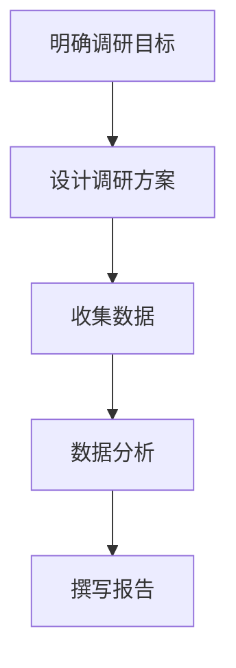

                 

### 第一部分：用户调研的重要性与基础知识

#### 第1章：用户调研概述

**1.1 用户调研的定义与目的**

用户调研是一种系统性的方法，用于收集和分析用户的需求、行为、态度等信息。其核心目的是帮助企业更好地理解用户，从而为产品开发、市场推广和业务决策提供数据支持。

- **定义**：
  用户调研是通过多种方法，如问卷调查、访谈、观察等，收集用户的意见和建议，以了解他们的需求、偏好和行为模式。这些信息有助于企业了解市场状况、竞争态势和用户需求，从而做出更加明智的决策。

- **目的**：
  1. **了解用户需求**：通过用户调研，企业可以深入了解用户的需求，从而指导产品设计和开发，确保产品能够满足用户期望。
  2. **优化用户体验**：通过调研发现用户体验中的问题，企业可以提出改进措施，提升用户满意度，增加用户忠诚度。
  3. **支持决策**：用户调研的数据可以用于支持企业的战略决策，如市场定位、产品定价、营销策略等。

**1.2 用户调研在创业中的重要性**

用户调研对于创业公司来说尤为重要，尤其在创业的各个阶段都发挥着关键作用。

- **创业初期**：在创业初期，用户调研可以帮助企业快速了解市场需求，验证产品或服务的可行性，减少盲目投入。

- **创业发展期**：在创业发展期，用户调研有助于企业发现新的市场机会，优化产品和服务，提高市场竞争力。

- **创业成熟期**：在创业成熟期，用户调研可以帮助企业保持对市场变化的敏感度，持续优化产品和服务，保持市场领先地位。

**1.3 用户调研的基本步骤**

进行有效的用户调研需要遵循以下基本步骤：

1. **明确调研目标**：
   确定调研的核心问题，明确调研的目的和目标。这是调研的基础，决定了后续调研方法和数据的收集和分析方向。

2. **设计调研方案**：
   选择合适的调研方法，设计调研问卷或访谈提纲，制定调研时间表。这一步是调研方案的具体化，确保调研过程的顺利进行。

3. **收集数据**：
   实施调研计划，通过问卷调查、访谈、观察等方式收集用户数据。

4. **数据分析**：
   对收集到的用户数据进行整理、分析和解读，提取有价值的信息，为决策提供支持。

5. **撰写报告**：
   根据数据分析结果撰写调研报告，提出建议和结论，将调研成果转化为实际行动。

### Mermaid 流程图

---

在创业过程中，用户调研不仅可以帮助企业了解市场动态和用户需求，还可以为产品的开发提供方向，从而提高产品的市场竞争力。通过科学的用户调研方法，企业可以更好地把握市场机遇，制定有效的市场策略，实现持续增长。

#### 第2章：用户调研方法

**2.1 定量调研方法**

定量调研方法主要通过数字化的方式进行，旨在收集大量用户的定量数据，以便进行统计分析。以下是几种常用的定量调研方法：

**2.1.1 问卷调查**

问卷调查是定量调研中最常用的一种方法，通过设计问卷收集大量用户的意见和反馈。以下是一些设计问卷的原则和技巧：

- **问题设计**：
  - **清晰明确**：确保每个问题的表述清晰，避免产生歧义。
  - **简洁性**：问题应简明扼要，避免冗长和复杂的句子。
  - **逻辑性**：问题应具有逻辑性，避免重复或矛盾。

- **问卷结构**：
  - **开放性问题**：用于收集用户的开放性回答，如“你对我们的产品有什么建议？”
  - **封闭性问题**：用于收集用户的定量信息，如“你通常每周使用我们产品的次数是多少？”

- **样本选择**：
  - 选择具有代表性的样本，确保样本能够反映整体用户群体的特征。

**2.1.2 焦点小组**

焦点小组是一种通过组织一组用户进行讨论和互动，以获取他们对产品或服务的看法和反馈的调研方法。以下是焦点小组的优点和注意事项：

- **优点**：
  - 可以深入了解用户的观点和意见。
  - 促进用户之间的互动，产生更多的观点和创意。

- **注意事项**：
  - 小组规模：一般以5-10人为宜，避免规模过大影响讨论效果。
  - 讨论主题：确定明确的讨论主题，确保讨论内容集中。
  - 记录与分析：详细记录讨论过程和用户的反馈，进行分析和总结。

**2.1.3 实地观察**

实地观察是一种通过直接观察用户行为和互动，以了解用户行为习惯和偏好的一种调研方法。以下是实地观察的步骤和注意事项：

- **步骤**：
  - **确定观察目标**：明确观察的具体目标和内容。
  - **选择观察场所**：选择合适的观察场所，如用户家中、办公场所等。
  - **进行观察**：直接观察用户的行为和互动，记录观察结果。

- **注意事项**：
  - 保持中立：在观察过程中，保持中立，避免影响用户的行为。
  - 记录详细：详细记录观察到的行为和用户互动，确保数据的准确性。
  - 后期分析：对观察结果进行整理和分析，提取有价值的信息。

**2.2 定性调研方法**

定性调研方法主要通过深入交流、观察和互动等方式，收集用户的主观看法、情感和行为。以下是几种常用的定性调研方法：

**2.2.1 深度访谈**

深度访谈是一种通过与用户进行深入、一对一的交流，以了解用户的想法、感受和行为的一种调研方法。以下是深度访谈的技巧和注意事项：

- **技巧**：
  - **开放式提问**：通过开放式问题引导用户自由表达想法。
  - **深入追问**：在用户回答后，进一步追问以获取更详细的信息。
  - **情境模拟**：通过模拟实际使用场景，了解用户在特定情境下的反应和行为。

- **注意事项**：
  - **建立信任**：与用户建立信任关系，确保用户愿意分享真实信息。
  - **保持中立**：在访谈过程中，尽量保持中立，避免引导用户回答。
  - **记录整理**：详细记录访谈内容，确保数据的准确性和完整性。

**2.2.2 焦点小组**

焦点小组在定性调研中的应用与定量调研类似，但讨论更为深入和开放。以下是焦点小组的注意事项：

- **注意事项**：
  - **讨论主题**：确保讨论主题明确，避免偏离主题。
  - **互动与引导**：鼓励用户之间的互动，引导用户分享观点。
  - **记录与分析**：详细记录讨论过程和用户的反馈，进行分析和总结。

**2.2.3 实地观察**

实地观察在定性调研中的应用与定量调研相似，但更注重观察细节和用户行为的深入分析。以下是实地观察的注意事项：

- **注意事项**：
  - **观察目标**：明确观察的具体目标和内容。
  - **场所选择**：选择合适的观察场所，如用户家中、办公场所等。
  - **记录与分析**：详细记录观察到的行为和用户互动，进行深入分析。

通过多种用户调研方法的结合，企业可以更全面、深入地了解用户需求和行为，从而制定更加科学和有效的产品策略和营销计划。

### 第3章：用户调研工具与技术

#### 3.1 用户调研工具介绍

用户调研工具是进行用户调研过程中不可或缺的工具，可以帮助企业高效地收集和分析用户数据。以下是几种常见的用户调研工具及其功能介绍：

**3.1.1 调研软件**

调研软件主要用于设计、分发和管理在线问卷，支持多种题型和数据分析功能。以下是一些常用的调研软件：

- **问卷星**：提供丰富的问卷设计模板、多种题型和数据分析功能，支持在线和离线数据收集。
- **金数据**：支持自定义问卷设计、多种数据收集方式（如网页、微信、邮件等）和数据分析功能。

**3.1.2 数据分析工具**

数据分析工具主要用于数据清洗、整理和分析，帮助用户提取有价值的信息。以下是一些常用的数据分析工具：

- **SPSS**：一款功能强大的统计分析软件，支持描述性统计、回归分析、因子分析等多种分析方法。
- **Excel**：一款基本的电子表格软件，提供简单的数据分析和图表功能，适合初学者和中小规模的数据分析。

**3.1.3 实地调研工具**

实地调研工具主要用于记录和观察用户行为，以便进行后续的数据分析和报告撰写。以下是一些常用的实地调研工具：

- **录音笔**：用于记录访谈内容，便于后续整理和分析。
- **视频录制设备**：用于记录用户在使用产品或服务过程中的行为和互动，便于观察和解读。
- **观察笔记**：用于记录实地观察过程中的关键信息和观察结果，便于整理和分享。

#### 3.2 数据收集与分析技巧

**3.2.1 数据收集方法**

数据收集是用户调研的关键步骤，以下是一些常用的数据收集方法：

- **问卷调查**：通过在线问卷或纸质问卷收集用户数据，适用于大规模数据收集。
- **访谈**：通过与用户进行一对一的深入交流，收集用户的主观看法和感受，适用于小规模、深入的调研。
- **实地观察**：直接观察用户行为和互动，收集用户在实际场景下的数据，适用于深入了解用户行为。

**3.2.2 数据分析技巧**

数据分析技巧是用户调研中的关键环节，以下是一些常用的数据分析技巧：

- **描述性统计**：计算数据的基本统计量（如均值、中位数、标准差等），用于描述数据的特征和分布。
- **回归分析**：建立变量之间的关系模型，预测因变量的值，用于了解变量之间的相关性。
- **因子分析**：提取数据中的主要因子，简化数据结构，用于数据降维和变量识别。

**3.2.3 常见问题及解决方法**

在用户调研过程中，可能会遇到一些常见问题，以下是一些问题的解决方法：

- **数据缺失**：解决方法包括缺失值填充、删除缺失值或使用统计分析方法处理缺失数据。
- **数据异常**：解决方法包括异常值检测和修正、删除异常值或使用数据清洗方法处理异常数据。
- **数据分析错误**：解决方法包括数据验证、结果验证和使用可视化工具检查数据和分析结果。

通过掌握这些用户调研工具和技术，企业可以更高效地进行用户调研，提取有价值的信息，为产品开发、市场推广和业务决策提供支持。

#### 第4章：用户调研的实际操作

**4.1 设计调研问卷**

设计调研问卷是用户调研中的关键步骤，一个有效的问卷能够帮助企业收集到高质量的数据，从而为后续的分析提供可靠的依据。以下是如何设计一份有效问卷的步骤和注意事项：

**4.1.1 设计原则**

- **清晰明确**：确保每个问题的表述清晰，避免产生歧义。使用简单、直接的措辞，使受访者能够轻松理解问题。
- **简洁性**：问题应简明扼要，避免冗长和复杂的句子。过多的文字会降低受访者的阅读兴趣和参与度。
- **逻辑性**：问题应具有逻辑性，避免重复或矛盾。确保问题之间相互关联，形成一致的调研方向。
- **针对性**：根据调研目的和目标用户群体，设计针对性的问题。确保问题与调研目标相关，避免无关问题的干扰。

**4.1.2 问卷结构**

- **前言**：介绍调研的背景、目的和重要性，确保受访者了解调研的整体情况，增加参与意愿。
- **基本信息**：收集受访者的基本信息（如年龄、性别、职业等），用于后续的数据分析和用户画像构建。
- **开放式问题**：用于收集受访者的开放性回答，如“你对我们的产品有什么建议？”这类问题可以帮助企业获取受访者的真实想法和具体建议。
- **封闭式问题**：用于收集受访者的定量信息，如“你通常每周使用我们产品的次数是多少？”这类问题有助于企业快速获取数据，进行统计分析。
- **量表问题**：使用量表（如李克特量表）收集受访者的态度和偏好，如“你对我们的产品满意度如何？”这类问题有助于企业了解受访者的整体感受。

**4.1.3 问卷测试**

在正式分发问卷之前，进行问卷测试是非常必要的。以下是一些测试步骤：

- **内部测试**：组织内部团队或小范围的用户进行测试，检查问卷的问题表述、逻辑性和问卷结构的合理性。
- **反馈收集**：收集测试者的反馈，包括问卷的阅读体验、问题的理解程度和回答的便利性。
- **优化调整**：根据测试反馈，对问卷进行优化调整，确保问卷的质量和有效性。

通过遵循上述设计原则和测试步骤，企业可以设计出一份有效且高质量的调研问卷，为后续的数据收集和分析奠定基础。

**4.2 实地调研与访谈技巧**

实地调研和访谈是用户调研中的重要环节，通过直接观察和与用户的深入交流，可以获取到宝贵的用户反馈和行为数据。以下是如何进行实地调研和访谈的技巧和注意事项：

**4.2.1 调研前的准备工作**

- **明确调研目标**：在调研前，明确调研的具体目标和预期成果，确保调研方向的准确性。
- **设计调研方案**：根据调研目标，设计调研方案，包括调研时间、地点、参与者、调研工具等。
- **选择调研地点**：选择合适的调研地点，如用户家中、办公室、公共场所等，确保调研环境的舒适性和便利性。
- **准备调研工具**：准备好调研所需的工具，如录音笔、视频录制设备、问卷等。

**4.2.2 调研过程中的注意事项**

- **保持中立**：在调研过程中，保持中立，避免对用户产生偏见或引导用户回答。确保用户的回答是真实、客观的。
- **建立信任**：与用户建立信任关系，确保用户愿意分享真实的信息。可以通过自我介绍、解释调研目的和承诺保密等方式建立信任。
- **引导与互动**：通过开放式提问和情境模拟等方法，引导用户表达更多的想法和感受。鼓励用户之间的互动，促进观点的碰撞和交流。
- **记录与整理**：详细记录调研过程中的关键信息和观察结果，确保数据的准确性和完整性。可以使用笔记、录音或视频等方式记录调研内容。

**4.2.3 访谈技巧与策略**

- **开放式提问**：使用开放式提问引导用户自由表达，如“你对这个功能有什么建议？”这类问题可以帮助企业获取更多的用户想法和意见。
- **情境模拟**：通过模拟实际使用场景，了解用户在特定情境下的反应和行为。如“假设你遇到这个问题，你会如何解决？”这类问题有助于企业了解用户的实际需求和痛点。
- **深入追问**：在用户回答后，进一步追问以获取更详细的信息。如“你能详细描述一下你的使用体验吗？”这类问题可以帮助企业更深入地了解用户的需求和行为模式。
- **倾听与反馈**：认真倾听用户的回答，给予及时的反馈和回应。通过点头、微笑、眼神接触等方式表达对用户的关注和理解。

通过遵循上述实地调研和访谈的技巧和注意事项，企业可以更有效地收集到用户的真实反馈和行为数据，为后续的数据分析和产品优化提供有力支持。

**4.3 数据整理与分析**

数据整理与分析是用户调研中的关键步骤，通过对收集到的数据进行有效的整理和分析，可以提取有价值的信息，为产品优化和决策提供支持。以下是如何进行数据整理与分析的步骤和技巧：

**4.3.1 数据整理**

- **数据录入**：将问卷结果、访谈记录和观察数据等录入到数据分析软件中，如SPSS、Excel等。确保数据的准确性和完整性。
- **数据清洗**：对录入的数据进行清洗，包括缺失值处理、异常值剔除、数据格式统一等。确保数据的质量和一致性。

**4.3.2 数据分析**

- **描述性统计**：计算数据的基本统计量，如均值、中位数、标准差等，用于描述数据的特征和分布。通过图表（如柱状图、饼图、散点图等）展示数据分析结果，使数据更直观、易懂。
- **相关性分析**：分析变量之间的关系，如皮尔逊相关系数、Spearman秩相关系数等。了解不同变量之间的相关性，为后续的数据分析提供依据。
- **回归分析**：建立变量之间的回归模型，预测因变量的值。如线性回归、多元回归等，用于分析变量之间的因果关系。

**4.3.3 结果展示**

- **撰写报告**：根据数据分析结果，撰写调研报告。报告应包括调研背景、目标、方法、数据分析、结论和推荐等内容。确保报告结构清晰、逻辑性强，便于理解和传达。
- **图表与可视化**：使用图表、图形和可视化工具（如柱状图、饼图、热力图等）展示数据分析结果。通过可视化方式，使数据更直观、易懂，提高报告的吸引力。
- **推荐与行动**：根据数据分析结果，提出具体的推荐和行动建议。确保建议具有可操作性和可行性，为产品优化和决策提供有力支持。

通过遵循上述数据整理与分析的步骤和技巧，企业可以更高效地提取用户数据中的有价值信息，为产品优化和决策提供有力支持。

### 第5章：成功用户调研案例分析

**5.1 案例一：X公司的用户调研实践**

**案例背景**：

X公司是一家专注于智能家居设备研发的创业公司，致力于为用户提供便捷、智能的生活体验。在产品开发初期，X公司意识到用户调研的重要性，希望通过深入了解用户需求和行为，优化产品设计，提高市场竞争力。

**调研目标**：

- 了解用户对智能家居设备的需求和期望。
- 分析用户对现有智能家居产品的使用体验和痛点。

**调研方法**：

1. **问卷调查**：X公司通过在线问卷平台设计了一份详细的问卷，涵盖用户的基本信息、对智能家居产品的需求、使用频率和体验等。问卷通过公司官网、社交媒体等渠道广泛分发。
2. **用户访谈**：X公司选取了部分问卷调查中的受访者，进行了深度访谈，以获取更多详细的用户反馈。
3. **实地观察**：X公司派专员前往用户家中，观察用户在实际使用智能家居产品的过程中，记录用户的操作行为和遇到的困难。

**调研结果**：

- **需求分析**：调研结果显示，用户对智能家居设备的主要需求集中在智能控制、安全性和便利性方面。具体包括远程控制家居设备、实时监控家庭安全、智能节能等功能。
- **体验反馈**：用户对现有智能家居产品的使用体验存在一定的不满意，主要体现在设备连接不稳定、操作复杂、兼容性差等方面。

**调研影响**：

- **产品优化**：基于调研结果，X公司对产品进行了优化，增加了远程控制、实时监控和智能节能等功能，并提高了产品的稳定性、易用性和兼容性。
- **市场竞争力**：优化后的产品获得了用户的高度评价，市场竞争力显著提升，销售量稳步增长。

**案例启示**：

- **用户调研的重要性**：用户调研能够帮助企业了解市场需求和用户痛点，为产品优化提供有力支持。
- **多样化调研方法**：结合问卷调查、访谈和实地观察等多种调研方法，可以更全面、深入地了解用户需求和行为。

**5.2 案例二：Y公司的用户调研策略**

**案例背景**：

Y公司是一家提供在线教育服务的创业公司，致力于为用户提供高质量的在线学习体验。在产品上线初期，Y公司希望通过用户调研，了解用户对在线教育服务的需求和满意度，从而优化产品功能和用户体验。

**调研目标**：

- 了解用户对在线教育服务的需求和期望。
- 分析用户对现有在线教育平台的使用体验和满意度。

**调研方法**：

1. **用户访谈**：Y公司选取了部分活跃用户，进行了深度访谈，了解他们对在线教育平台的看法、使用习惯和改进建议。
2. **用户行为分析**：Y公司通过分析用户在平台上的行为数据，如课程浏览量、学习时长、互动频率等，了解用户的学习行为和偏好。
3. **焦点小组**：Y公司组织了多个焦点小组，邀请不同背景的用户参与讨论，收集他们对在线教育服务的意见和反馈。

**调研结果**：

- **需求分析**：调研结果显示，用户对在线教育服务的主要需求集中在课程质量、学习体验和个性化推荐方面。用户希望平台能够提供更多优质课程、便捷的学习工具和个性化的学习推荐。
- **体验反馈**：用户对现有在线教育平台的使用体验存在一定的不满意，主要体现在课程内容更新慢、学习工具不便捷、互动性差等方面。

**调研影响**：

- **产品优化**：基于调研结果，Y公司对产品进行了优化，增加了课程更新频率、学习工具的便捷性以及个性化推荐功能。
- **用户满意度**：优化后的产品获得了用户的高度评价，用户满意度显著提升，用户数量持续增长。

**案例启示**：

- **用户访谈的重要性**：通过与用户的深度访谈，可以获取到更详细的用户反馈和真实需求，为产品优化提供有力支持。
- **用户行为分析的价值**：通过分析用户行为数据，可以了解用户的使用习惯和偏好，为产品改进提供数据依据。

**5.3 案例三：Z公司的用户调研经验分享**

**案例背景**：

Z公司是一家提供健康管理的创业公司，致力于为用户提供全面的健康管理服务。在产品开发过程中，Z公司注重用户调研，希望通过深入了解用户需求，优化产品功能和服务内容。

**调研目标**：

- 了解用户对健康管理服务的需求和期望。
- 分析用户对现有健康管理工具的使用体验和满意度。

**调研方法**：

1. **问卷调查**：Z公司通过在线问卷平台设计了一份详细的问卷，涵盖用户的基本信息、对健康管理服务的需求、使用频率和体验等。问卷通过公司官网、社交媒体等渠道广泛分发。
2. **用户访谈**：Z公司选取了部分活跃用户，进行了深度访谈，了解他们对健康管理工具的看法、使用习惯和改进建议。
3. **实地调研**：Z公司派专员前往用户家中，观察用户在使用健康管理工具的过程中的行为和反馈。

**调研结果**：

- **需求分析**：调研结果显示，用户对健康管理服务的主要需求集中在健康监测、营养建议和运动指导方面。用户希望工具能够提供实时监测、个性化建议和便捷的操作体验。
- **体验反馈**：用户对现有健康管理工具的使用体验存在一定的不满意，主要体现在数据不准确、建议不个性化、操作复杂等方面。

**调研影响**：

- **产品优化**：基于调研结果，Z公司对产品进行了优化，增加了实时监测、个性化建议和便捷操作等功能。
- **用户满意度**：优化后的产品获得了用户的高度评价，用户满意度显著提升，用户活跃度持续增长。

**案例启示**：

- **多渠道调研的必要性**：通过问卷调查、用户访谈和实地调研等多种渠道，可以更全面、深入地了解用户需求和行为。
- **持续调研的重要性**：持续进行用户调研，可以及时发现用户需求的变化，为产品优化提供持续的支持。

通过以上案例，我们可以看到成功进行用户调研的重要性以及多样化的调研方法在实际应用中的价值。成功的用户调研不仅能够帮助企业了解市场需求和用户痛点，还能够为产品优化和决策提供有力支持。

### 第6章：用户调研中的挑战与应对策略

**6.1 调研中的常见问题**

在进行用户调研的过程中，企业可能会遇到各种挑战和问题，以下是一些常见的问题及其解决方法：

**6.1.1 调研对象的选择**

- **问题**：
  - 如何确定合适的调研对象？
  - 如何确保调研对象的代表性和多样性？

- **解决方法**：

  1. **明确调研目标**：在开始调研前，明确调研的目标和需求，这将有助于确定需要调研的对象。
  2. **采用分层抽样方法**：根据目标用户群体的特征，采用分层抽样方法，确保样本的多样性和代表性。
  3. **扩大样本量**：增加样本量，可以减少抽样误差，提高样本的代表性和可靠性。

**6.1.2 数据质量保证**

- **问题**：
  - 如何确保收集到的数据准确和可靠？
  - 如何处理数据中的缺失值和异常值？

- **解决方法**：

  1. **设计清晰的问题**：设计清晰、明确、无歧义的问题，避免因问题表述不清导致的数据错误。
  2. **数据清洗**：使用数据分析工具对数据进行清洗，包括缺失值填充、异常值检测和修正。
  3. **多重验证**：通过多种方式验证数据，如交叉验证、对比分析等，确保数据的准确性和可靠性。

**6.1.3 调研资源的分配**

- **问题**：
  - 如何合理分配时间和预算进行调研？
  - 如何确保调研过程中的资源充足？

- **解决方法**：

  1. **制定详细的调研计划**：在调研开始前，制定详细的调研计划，明确调研的时间节点、资源需求和预算。
  2. **合理分配资源**：根据调研计划，合理分配时间和预算，确保调研过程中的资源充足。
  3. **灵活调整**：在调研过程中，根据实际情况灵活调整调研计划和资源分配，确保调研的顺利进行。

**6.2 面对挑战的应对策略**

**6.2.1 如何处理调研数据不足**

- **问题**：
  - 调研数据量不足，如何提高数据的代表性和可靠性？
  - 如何分析少量的数据，得到有价值的结论？

- **解决方法**：

  1. **扩大样本量**：如果条件允许，尝试扩大样本量，以增加数据的代表性和可靠性。
  2. **使用描述性统计**：对少量数据进行描述性统计分析，提取关键信息，如均值、中位数、标准差等。
  3. **深入分析**：对少量数据进行深入分析，挖掘潜在的模式和趋势，如通过图表展示数据分析结果。

**6.2.2 如何应对调研过程中的拒绝**

- **问题**：
  - 用户不愿意参与调研，如何提高参与率？
  - 如何处理用户拒绝提供信息的情况？

- **解决方法**：

  1. **提供明确的好处**：向用户明确说明调研的好处，如可以更好地优化产品和服务，提高用户体验等。
  2. **尊重用户意愿**：尊重用户的意愿，不强迫用户参与调研，避免产生反感。
  3. **提供激励**：适当提供奖励或礼品，如优惠券、免费产品等，以激励用户参与调研。

**6.2.3 如何有效利用调研结果**

- **问题**：
  - 如何确保调研结果能够指导实际业务决策？
  - 如何将调研结果转化为具体的行动和改进？

- **解决方法**：

  1. **将调研结果与业务目标结合**：将调研结果与企业的业务目标相结合，确定具体的改进措施和行动计划。
  2. **制定实施计划**：根据调研结果，制定详细的实施计划，确保改进措施得到有效执行。
  3. **持续监控和评估**：对改进措施的实施效果进行持续监控和评估，及时调整和优化，确保调研结果得到有效利用。

通过以上应对策略，企业可以更有效地解决用户调研中遇到的各种挑战，确保调研结果的准确性和实用性，为业务决策提供有力支持。

### 第7章：用户调研在产品开发中的实际应用

**7.1 产品需求分析**

在产品开发过程中，了解用户需求是至关重要的。通过用户调研，企业可以获取用户的真实需求和期望，从而为产品设计和开发提供有力支持。

**7.1.1 用户需求收集**

用户需求的收集主要通过以下几种方法进行：

- **问卷调查**：通过设计详细的问卷，收集用户对产品功能、特性、使用体验等方面的需求。问卷可以在线上或线下进行，适用于大规模数据收集。
- **用户访谈**：通过与用户进行一对一的深入交流，了解用户的需求、痛点和使用习惯。用户访谈适用于小规模、深入的调研。
- **用户行为分析**：通过分析用户在使用产品过程中的行为数据，如点击率、转化率等，了解用户的使用习惯和需求。

**7.1.2 用户需求分析**

收集到用户需求后，需要对需求进行分析，以识别出核心需求和关键痛点。

- **需求分类**：将收集到的需求进行分类，如功能需求、体验需求、安全性需求等。
- **需求优先级排序**：根据需求的紧急程度和重要程度，对需求进行优先级排序。常用的排序方法包括Kano模型、MoSCoW模型等。
- **用户画像构建**：基于用户需求和行为数据，构建用户画像，包括用户的基本信息、需求特征、行为习惯等。用户画像有助于产品设计和开发团队更好地理解用户。

**7.1.3 用户需求分析的方法**

以下是一些常用的用户需求分析方法：

- **需求场景分析**：通过分析用户在不同场景下的需求和使用情况，了解用户的具体需求和使用习惯。
- **用户访谈**：通过深入访谈用户，了解用户的需求、痛点和期望。访谈过程中，可以使用开放式问题和深入追问技巧，获取更多详细信息。
- **数据分析**：通过分析用户行为数据，如点击率、转化率等，了解用户的使用习惯和需求。可以使用描述性统计、回归分析等方法，提取有价值的信息。

**7.2 产品迭代与优化**

在产品开发过程中，持续进行用户调研可以帮助企业了解产品的使用情况，发现问题和改进机会，从而进行产品迭代和优化。

**7.2.1 基于用户反馈的产品迭代**

基于用户反馈进行产品迭代是优化产品的重要手段。以下是一些关键步骤：

- **收集用户反馈**：通过用户调研、用户访谈、社交媒体等渠道，收集用户的反馈和建议。关注用户提出的问题、需求和建议，进行分析和归类。
- **分析用户反馈**：对收集到的用户反馈进行分析，识别出用户的主要需求和痛点。可以使用数据分析工具，如SPSS、Excel等，对用户反馈进行量化分析。
- **制定迭代计划**：根据用户反馈和产品需求，制定具体的迭代计划，包括功能改进、界面优化、性能提升等。确保迭代计划与业务目标和用户需求相符。
- **实施迭代**：根据迭代计划，实施产品改进，如更新功能、优化界面、提高性能等。在实施过程中，注意监控迭代效果，确保改进措施的有效性。

**7.2.2 产品优化策略**

在产品优化过程中，以下是一些关键策略：

- **用户参与**：鼓励用户参与到产品优化过程中，通过用户测试、用户反馈等方式，收集用户对产品改进的意见和建议。用户参与可以提高产品的满意度和忠诚度。
- **A/B测试**：通过A/B测试，验证不同产品版本的效果，找到最优的优化方案。A/B测试可以帮助企业快速迭代和优化产品。
- **持续监控**：对产品性能和用户体验进行持续监控，及时发现问题和改进机会。可以使用数据分析工具，如Google Analytics等，监控产品的使用情况和用户行为。
- **数据驱动的决策**：基于用户数据和反馈，进行数据驱动的决策。确保产品改进和优化的决策有数据支持，避免盲目决策。

**7.2.3 用户满意度评估**

用户满意度评估是衡量产品优化效果的重要指标。以下是一些评估方法和步骤：

- **用户满意度调查**：通过问卷调查、用户访谈等方式，收集用户的满意度评分。可以使用李克特量表（1-5分）等工具，量化用户的满意度。
- **分析满意度数据**：对收集到的满意度数据进行分析，识别出产品的主要优点和不足。可以使用描述性统计、回归分析等方法，提取有价值的信息。
- **制定改进措施**：根据满意度分析结果，制定具体的改进措施，如优化功能、改善用户体验等。确保改进措施针对用户的主要需求和痛点。
- **实施改进措施**：根据改进措施，实施产品优化，如更新功能、优化界面、提高性能等。在实施过程中，注意监控改进效果，确保改进措施的有效性。

通过以上方法，企业可以有效地进行用户调研，了解用户需求，优化产品功能和用户体验，提高产品的市场竞争力。

### 第8章：用户调研在市场推广中的应用

#### 8.1 市场调研与定位

市场调研和市场定位是用户调研在市场推广中的重要应用，通过系统性的调研和分析，企业可以更好地了解市场环境、目标用户和竞争态势，从而制定有效的市场推广策略。

**8.1.1 市场调研方法**

- **问卷调查**：通过设计详细的问卷，收集大量潜在用户和目标市场群体的需求和偏好。问卷调查适用于大规模数据收集，有助于了解市场趋势和用户行为。
- **用户访谈**：通过与用户进行一对一的深入交流，了解用户对产品的使用体验、购买意愿和市场竞争态度。用户访谈适用于小规模、深入的调研，有助于获取详细、真实的用户反馈。
- **行业分析**：通过研究行业报告、市场趋势分析和竞争对手分析，了解市场环境、竞争态势和行业动态。行业分析有助于企业把握市场机遇和挑战，制定合适的推广策略。
- **数据分析**：通过分析用户行为数据、销售数据和市场份额数据，了解市场表现和用户需求变化。数据分析适用于定量分析，有助于发现市场机会和优化推广策略。

**8.1.2 市场定位策略**

市场定位是企业根据自身产品和目标市场特点，确定其在市场中的独特价值和竞争优势。以下是一些市场定位策略：

- **目标市场细分**：根据用户需求、行为和偏好，将市场划分为不同的细分群体。通过目标市场细分，企业可以更精准地定位目标用户，提高市场推广的有效性。
- **差异化定位**：通过突出产品或服务的独特特性，与竞争对手区分开来。差异化定位有助于企业在竞争激烈的市场中脱颖而出，建立品牌优势。
- **价值定位**：通过强调产品或服务的价值和优势，满足目标用户的需求。价值定位有助于企业提高用户的满意度和忠诚度，增强市场竞争力。
- **品牌定位**：通过塑造独特的品牌形象和价值主张，建立品牌认知和影响力。品牌定位有助于企业在市场中树立品牌形象，提升品牌价值和市场份额。

**8.1.3 市场细分与目标用户分析**

市场细分和目标用户分析是市场定位的重要基础，以下是一些关键步骤：

- **确定市场细分标准**：根据用户需求、行为和偏好，确定市场细分标准。常见的细分标准包括地理、人口、心理和行为特征等。
- **分析细分市场**：对每个细分市场进行分析，了解其市场规模、增长潜力、用户需求和竞争态势。通过分析细分市场，企业可以确定最具潜力的目标市场。
- **选择目标市场**：根据企业的资源和竞争优势，选择最具潜力的目标市场。目标市场的选择应与企业的战略目标相一致，确保市场推广的有效性。
- **构建目标用户画像**：根据目标市场特征，构建目标用户画像，包括用户的基本信息、需求特征、行为习惯等。目标用户画像有助于企业更好地理解目标用户，制定针对性的市场推广策略。

通过市场调研和市场定位，企业可以更好地了解市场环境和目标用户，制定有效的市场推广策略，提高市场占有率和用户满意度。

#### 8.2 营销策略制定

有效的用户调研是制定成功营销策略的基础。通过深入了解用户需求、行为和偏好，企业可以制定针对性的营销策略，提高市场推广效果。

**8.2.1 营销策略设计**

营销策略设计需要考虑以下几个方面：

- **目标市场**：明确目标市场，根据市场细分结果，确定目标用户群体的特征和需求。目标市场应与企业的产品定位和资源能力相匹配。
- **品牌定位**：根据目标市场的特点和用户需求，设计品牌定位和价值主张。品牌定位应突出产品或服务的独特性和竞争优势，吸引目标用户。
- **营销渠道**：选择适合目标市场的营销渠道，包括线上渠道（如社交媒体、搜索引擎、电子邮件等）和线下渠道（如广告、展会、促销活动等）。营销渠道的选择应考虑目标用户的接触习惯和偏好。
- **营销活动**：设计具体的营销活动，包括广告投放、促销活动、公关活动等。营销活动应与品牌定位和市场推广目标相一致，提高用户的参与度和转化率。

**8.2.2 营销渠道选择**

选择适合的营销渠道是营销策略成功的关键。以下是一些常见的营销渠道选择策略：

- **社交媒体**：通过社交媒体平台（如微信、微博、抖音等）与用户互动，提高品牌知名度和用户参与度。社交媒体适合进行内容营销和用户互动。
- **搜索引擎**：通过搜索引擎优化（SEO）和搜索引擎营销（SEM），提高产品在搜索引擎中的排名，吸引潜在用户。搜索引擎适合进行目标用户精准营销。
- **电子邮件**：通过电子邮件发送产品资讯、促销活动和用户互动，提高用户参与度和转化率。电子邮件适合进行用户维系和精准营销。
- **广告**：通过广告投放（如在线广告、电视广告、户外广告等）吸引目标用户，提高品牌知名度和市场份额。广告适合进行大规模曝光和品牌宣传。
- **线下活动**：通过展会、讲座、体验活动等线下活动，与用户面对面互动，提高品牌知名度和用户忠诚度。线下活动适合进行品牌推广和用户互动。

**8.2.3 用户互动与转化策略**

用户互动和转化策略是提高营销效果的重要手段。以下是一些关键策略：

- **内容营销**：通过发布有价值的内容（如博客文章、视频、案例分析等），吸引目标用户，提高品牌知名度和信任度。内容营销有助于建立用户关系，促进用户转化。
- **用户参与**：通过线上线下活动、互动游戏、用户投票等方式，鼓励用户参与，提高用户参与度和忠诚度。用户参与有助于提升品牌形象和用户满意度。
- **个性化推荐**：通过分析用户行为数据，进行个性化推荐，提高用户的购买转化率。个性化推荐有助于满足用户的个性化需求，提高用户满意度。
- **用户反馈**：积极收集用户反馈，了解用户需求和痛点，及时改进产品和服务。用户反馈有助于优化产品功能，提高用户满意度。
- **转化率优化**：通过A/B测试、数据分析等方法，不断优化页面设计、营销文案和推广策略，提高用户的点击率、转化率和留存率。

通过有效的用户调研和营销策略制定，企业可以更好地了解用户需求和市场动态，提高营销效果，实现业务增长。

### 第9章：用户调研的最佳实践与建议

**9.1 建立持续的用户调研机制**

建立持续的用户调研机制是确保企业能够及时了解用户需求和行为的有效方法。以下是一些关键步骤和建议：

- **制定用户调研计划**：在项目启动之初，制定详细的用户调研计划，明确调研的目标、时间表、方法、资源和责任人。调研计划应与项目进度相结合，确保调研工作与项目发展同步进行。
- **定期进行用户调研**：用户调研不应是一次性的活动，而应成为企业的常规工作。建议至少每季度进行一次全面的用户调研，以了解用户需求的动态变化。对于重要项目或关键阶段，可增加调研频率。
- **建立用户反馈渠道**：为用户提供便捷的反馈渠道，如在线问卷、社交媒体、客服热线等。确保用户能够随时随地表达意见和建议，提高用户的参与度和满意度。
- **持续数据收集与分析**：通过多种渠道（如问卷调查、用户访谈、用户行为分析等）持续收集用户数据，定期进行分析和总结。数据分析和总结应成为用户调研的一部分，确保调研结果的及时性和准确性。

**9.2 用户调研与业务目标的结合**

将用户调研与业务目标相结合是确保调研结果能够真正指导业务决策的关键。以下是一些具体做法：

- **明确业务目标**：在用户调研开始前，明确企业的业务目标，包括产品开发、市场推广、用户体验提升等方面。调研目标应与业务目标相一致，确保调研工作能够支持业务发展。
- **调研目标分解**：将业务目标分解为具体的调研目标，如了解用户对产品的满意度、分析市场趋势、识别竞争对手等。调研目标应具体、可操作，有助于后续的数据分析和决策。
- **制定调研策略**：根据调研目标，制定具体的调研策略和方法，如问卷调查、用户访谈、焦点小组等。调研策略应与调研目标相匹配，确保能够获取有价值的数据。
- **数据驱动决策**：在调研过程中，及时收集和分析数据，将数据结果与业务目标相结合，制定具体的业务改进措施。通过数据驱动决策，确保业务决策有据可依，提高决策的科学性和有效性。

**9.3 用户调研团队的构建与培训**

构建一个专业的用户调研团队是确保用户调研工作高效进行的必要条件。以下是一些关键步骤和建议：

- **明确团队职责**：在组建用户调研团队时，明确团队成员的职责和工作内容。团队成员应包括市场研究员、数据分析专家、产品经理等，确保团队具备多种专业技能。
- **招聘专业人才**：通过招聘具有相关经验和技能的人才，提高团队的整体素质。建议招聘具有市场调研、数据分析、用户研究等方面背景的人才。
- **提供培训与支持**：定期为团队成员提供培训和支持，提高其专业知识和技能。培训内容可以包括市场调研方法、数据分析工具、用户研究技巧等。
- **建立沟通机制**：建立有效的沟通机制，确保团队成员之间的信息共享和协作。定期召开团队会议，讨论调研进展、问题和解决方案，提高团队协作效率。

**9.4 用户调研的 ROI 分析与优化**

用户调研的投资回报率（ROI）分析是评估用户调研效果和优化调研资源的重要手段。以下是一些关键步骤和建议：

- **明确 ROI 分析目标**：在用户调研开始前，明确 ROI 分析的目标和指标。常见的 ROI 分析指标包括调研成本、调研效益、用户满意度等。
- **收集 ROI 分析数据**：在调研过程中，及时收集相关数据，如调研成本、调研效益（如产品改进效果、市场份额提升等）、用户满意度等。数据收集应全面、准确，确保分析结果的可靠性。
- **进行 ROI 分析**：对收集到的数据进行分析，计算 ROI 指标，如 ROI = （调研效益 - 调研成本）/调研成本。根据 ROI 结果，评估调研的投入产出比，识别出高价值调研项目。
- **优化调研资源**：根据 ROI 分析结果，优化调研资源分配，减少低效或无效的调研项目，增加高价值调研项目的投入。同时，通过改进调研方法和工具，提高调研效率和效果。
- **持续监控与优化**：建立持续的 ROI 监控机制，定期分析 ROI 结果，及时发现问题和改进机会，持续优化调研工作。通过持续的 ROI 优化，确保用户调研工作的高效和持续改进。

通过以上最佳实践和建议，企业可以建立高效的用户调研机制，确保调研结果能够真正指导业务决策，实现持续的业务增长。

### 附录 A：用户调研工具与资源列表

**A.1 在线调研工具介绍**

在线调研工具是进行用户调研的重要工具，可以帮助企业高效地收集用户数据。以下是一些常用的在线调研工具及其特点：

- **问卷星**：问卷星是一款功能强大的在线调研工具，提供丰富的问卷设计模板和数据分析功能。用户可以自定义问卷结构、题型和逻辑跳转，支持在线和离线数据收集。此外，问卷星还提供了实时数据分析功能，方便用户快速查看调研结果。

- **金数据**：金数据是一款专业的在线调研工具，提供在线问卷设计、数据收集、数据分析和报告生成等功能。用户可以通过金数据创建自定义问卷，选择多种题型和逻辑跳转，支持多渠道数据收集。金数据还提供了丰富的数据分析工具，如图表生成、数据导出等。

- **Typeform**：Typeform 是一款以用户体验为核心的在线调研工具，提供简洁、互动性强的问卷设计界面。用户可以通过 Typeform 创建个性化、引人入胜的问卷，支持多种交互方式和多语言支持。Typeform 还提供了强大的数据分析功能，方便用户深入分析调研结果。

**A.2 数据分析工具简介**

数据分析工具是进行数据整理和分析的重要工具，可以帮助用户提取有价值的信息。以下是一些常用的数据分析工具及其特点：

- **SPSS**：SPSS 是一款功能强大的统计分析软件，提供多种数据分析方法，包括描述性统计、回归分析、因子分析等。用户可以通过 SPSS 导入数据、进行数据清洗和整理，生成详细的统计分析报告。SPSS 还提供了丰富的图表和可视化工具，方便用户展示分析结果。

- **Excel**：Excel 是一款常见的电子表格软件，提供基本的统计分析功能，如描述性统计、排序、筛选等。用户可以通过 Excel 对数据进行简单的整理和分析，生成基本的图表和报告。Excel 还支持自定义公式和数据透视表，方便用户进行复杂的数据分析。

- **Python**：Python 是一款广泛使用的编程语言，提供了丰富的数据分析库（如 pandas、numpy、matplotlib 等），方便用户进行数据清洗、整理和分析。用户可以通过 Python 实现复杂的数据处理和分析任务，如数据可视化、机器学习等。

**A.3 用户调研相关书籍与资料推荐**

以下是一些用户调研相关的书籍和资料，有助于用户深入了解用户调研的方法和实践：

- **《用户调研：方法与实践》**：本书系统地介绍了用户调研的方法和实践，包括定量和定性调研方法，以及数据分析技巧。适合初学者和有一定调研经验的专业人士阅读。

- **《市场调研与营销决策》**：本书涵盖了市场调研的基础知识、方法和应用，包括问卷调查、访谈、观察等调研方法，以及数据分析工具和技巧。适合市场营销人员和产品经理阅读。

- **《数据分析与商业智能》**：本书介绍了数据分析的基本概念和技术，以及如何利用数据分析帮助企业做出更明智的商业决策。内容包括数据清洗、数据分析方法、数据可视化等。

- **《用户研究实战：方法、工具与应用》**：本书结合实际案例，详细介绍了用户研究的方法、工具和应用，包括用户访谈、问卷调查、用户行为分析等。适合用户研究和产品设计人员阅读。

通过使用这些在线调研工具、数据分析工具和相关书籍，用户可以更高效地进行用户调研，提取有价值的信息，为产品优化和业务决策提供支持。

