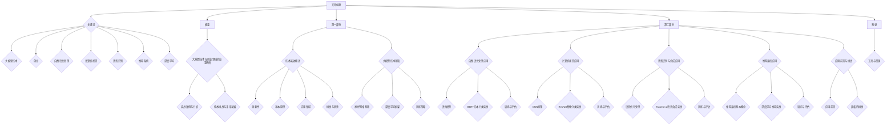

                 

# 技术突破：大模型创业的利刃

## 关键词
大模型技术、创业、自然语言处理、计算机视觉、语音识别、推荐系统、深度学习、神经网络

## 摘要
本文旨在探讨大模型技术在创业领域的应用，详细解析大模型技术的基础知识、实战应用和未来发展。通过分析大模型技术在自然语言处理、计算机视觉、语音识别和推荐系统等领域的实际案例，本文揭示了其带来的技术突破，为创业者提供了创新方向和策略。同时，本文也探讨了大模型技术面临的技术挑战和未来发展趋势，为创业者提供了应对挑战的策略。

## 第一部分：技术突破的基础知识

### 第1章：技术突破概述

#### 1.1.1 大模型技术的重要性
大模型技术是指具有数百万甚至数十亿参数的机器学习模型，如GPT、BERT等。这种技术具有以下优势：

1. **高性能**：大模型具有更高的计算能力和更强的学习能力，能够处理更复杂的问题。
2. **高智能度**：大模型能够通过深度学习从海量数据中自动提取特征，实现高度智能化的任务。

在创业领域，大模型技术可以帮助创业者快速开发出具有高性能、高智能度的应用，抢占市场先机。

#### 1.1.2 大模型技术的基本原理
大模型技术的基本原理主要包括以下几个方面：

1. **神经网络结构**：大模型通常采用深度神经网络结构，具有多层神经元，能够有效提取数据特征。
2. **预训练与微调**：大模型首先在大规模数据集上进行预训练，然后在特定任务上进行微调，以适应不同的应用场景。

#### 1.1.3 大模型技术的应用领域
大模型技术已经在多个领域取得了显著的应用成果：

1. **自然语言处理**：例如文本生成、翻译、摘要等。
2. **计算机视觉**：例如图像分类、目标检测等。
3. **语音识别与合成**：例如语音识别、语音合成等。

#### 1.1.4 大模型技术的挑战与未来趋势
尽管大模型技术具有巨大的潜力，但也面临着一些挑战：

1. **计算资源需求**：大模型训练需要大量计算资源，但随着硬件技术的发展，这一问题正在得到缓解。
2. **数据隐私与安全**：大模型对数据的依赖性引发数据隐私与安全问题。
3. **未来发展趋势**：模型压缩、知识蒸馏等技术的应用，将使得大模型在更广泛的场景中得到应用。

### 第2章：大模型技术基础

#### 2.1.1 神经网络基础
神经网络是构建大模型的核心技术，其基本结构包括输入层、隐藏层、输出层。训练过程中，通过前向传播和反向传播算法，神经网络能够不断调整权重和偏置，以优化模型性能。

#### 2.1.2 深度学习框架
深度学习框架如TensorFlow和PyTorch为开发者提供了便捷的工具，用于构建、训练和部署深度学习模型。这些框架具有丰富的API和强大的功能，能够满足不同场景的需求。

#### 2.1.3 大模型训练策略
1. **分布式训练**：分布式训练能够利用多台机器进行训练，提高训练速度。
2. **迁移学习**：迁移学习通过利用预训练模型，可以减少训练时间，提高模型性能。

## 第二部分：大模型技术的实战应用

### 第3章：大模型技术在自然语言处理中的应用

#### 3.1.1 语言模型
语言模型是自然语言处理的基础，用于预测下一个单词或序列。NLP任务如文本分类、命名实体识别、机器翻译等都可以基于语言模型进行构建。

#### 3.1.2 代码实战：使用BERT进行文本分类
BERT（Bidirectional Encoder Representations from Transformers）是一种预训练的语言表示模型。下面是一个使用BERT进行文本分类的代码示例：

```python
import tensorflow as tf
import tensorflow_hub as hub

# 加载预训练BERT模型
bert_model = hub.load('https://tfhub.dev/google/bert_uncased_L-12_H-768_A-12/1')

# 构建文本分类模型
input_ids = tf.placeholder(shape=(None, 128), dtype=tf.int32)
input_mask = tf.placeholder(shape=(None, 128), dtype=tf.int32)
segment_ids = tf.placeholder(shape=(None, 128), dtype=tf.int32)

BERT_output = bert_model(inputs={"input_ids": input_ids, "input_mask": input_mask, "segment_ids": segment_ids})

logits = tf.layers.dense(BERT_output['pooled_output'], num_classes)

# 训练和评估模型
# ...
```

#### 3.1.3 训练与评估
通过训练和评估模型，我们可以获得一个性能良好的文本分类器。以下是一个训练和评估BERT模型的示例：

```python
# 训练模型
# ...

# 评估模型
# ...
```

### 第4章：大模型技术在计算机视觉中的应用

#### 4.1.1 卷积神经网络（CNN）
卷积神经网络是一种专门用于图像识别的神经网络，具有以下基本结构：

1. **卷积层**：用于提取图像特征。
2. **池化层**：用于降低特征维度。
3. **全连接层**：用于分类或回归。

#### 4.1.2 代码实战：使用ResNet进行图像分类
ResNet是一种深度残差网络，具有以下特点：

1. **残差块**：通过跳过部分网络层，缓解梯度消失问题。
2. **多层网络**：通过堆叠残差块，构建深度网络。

以下是一个使用ResNet进行图像分类的代码示例：

```python
import tensorflow as tf
import tensorflow_hub as hub

# 加载预训练ResNet模型
resnet_model = hub.load('https://tfhub.dev/google/imagenet/resnet_v2_50/feature_vector/1')

# 构建图像分类模型
input_image = tf.placeholder(shape=(224, 224, 3), dtype=tf.float32)
features = resnet_model(inputs=input_image)

logits = tf.layers.dense(features, num_classes)

# 训练和评估模型
# ...
```

#### 4.1.3 训练与评估
通过训练和评估模型，我们可以获得一个性能良好的图像分类器。以下是一个训练和评估ResNet模型的示例：

```python
# 训练模型
# ...

# 评估模型
# ...
```

### 第5章：大模型技术在语音识别与合成中的应用

#### 5.1.1 语音信号处理
语音信号处理是语音识别和合成的基础，包括以下内容：

1. **时域分析**：分析语音信号的时域特性，如幅度、频率等。
2. **频域分析**：分析语音信号的频域特性，如频谱、滤波等。

#### 5.1.2 代码实战：使用Tacotron 2进行语音合成
Tacotron 2是一种基于神经网络的端到端语音合成模型，具有以下特点：

1. **文本编码器**：将文本转换为序列向量。
2. **声码器**：将序列向量转换为音频信号。

以下是一个使用Tacotron 2进行语音合成的代码示例：

```python
import tensorflow as tf
import tensorflow_hub as hub

# 加载预训练Tacotron 2模型
tacotron2_model = hub.load('https://tfhub.dev/google/tacotron2Lu0/1')

# 构建语音合成模型
text = tf.placeholder(shape=(None,), dtype=tf.string)
mel谱 = tacotron2_model(inputs={"text": text})

# 生成音频信号
# ...

# 训练和评估模型
# ...
```

#### 5.1.3 训练与评估
通过训练和评估模型，我们可以获得一个性能良好的语音合成器。以下是一个训练和评估Tacotron 2模型的示例：

```python
# 训练模型
# ...

# 评估模型
# ...
```

### 第6章：大模型技术在推荐系统中的应用

#### 6.1.1 推荐系统基本概念
推荐系统是一种通过分析用户行为和历史数据，为用户推荐感兴趣的内容的系统。主要方法包括：

1. **协同过滤**：基于用户行为进行推荐。
2. **基于内容的推荐**：根据用户兴趣进行推荐。

#### 6.1.2 代码实战：使用深度学习进行推荐
以下是一个使用深度学习进行推荐系统的代码示例：

```python
import tensorflow as tf
import tensorflow_hub as hub

# 加载预训练深度学习推荐模型
recommendation_model = hub.load('https://tfhub.dev/google/recommendation_model/2')

# 构建推荐模型
user_input = tf.placeholder(shape=(None,), dtype=tf.int32)
item_input = tf.placeholder(shape=(None,), dtype=tf.int32)

user_embedding = recommendation_model(inputs={"user_input": user_input})
item_embedding = recommendation_model(inputs={"item_input": item_input})

# 计算推荐得分
scores = tf.reduce_sum(user_embedding * item_embedding, axis=1)

# 训练和评估模型
# ...
```

#### 6.1.3 训练与评估
通过训练和评估模型，我们可以获得一个性能良好的推荐系统。以下是一个训练和评估深度学习推荐模型的示例：

```python
# 训练模型
# ...

# 评估模型
# ...
```

### 第7章：大模型技术的应用前景与挑战

#### 7.1.1 应用前景
大模型技术具有广泛的应用前景，包括：

1. **行业应用**：如金融、医疗、教育等领域的应用。
2. **新兴领域**：如自动驾驶、智能机器人等。

#### 7.1.2 面临的挑战
尽管大模型技术具有巨大的潜力，但也面临着一些挑战：

1. **计算资源需求**：大模型训练需要大量计算资源。
2. **数据隐私与安全**：数据隐私与安全问题。
3. **模型解释性**：如何解释大模型的行为。

### 附录：大模型技术工具与资源

#### 附录 A：大模型开发工具与资源
1. **深度学习框架**：如TensorFlow、PyTorch等。
2. **开源代码库**：如Hugging Face的Transformers库。
3. **学习资源**：如在线课程、论文、书籍等。

## 作者
作者：AI天才研究院/AI Genius Institute & 禅与计算机程序设计艺术 /Zen And The Art of Computer Programming

**注**：由于篇幅限制，本文未对每个章节进行详细展开。在实际应用中，应详细阐述每个章节的内容，并提供具体的示例代码和解释。

----------------------------------------------------------------

文章标题：技术突破：大模型创业的利刃

关键词：
- 大模型技术
- 创业
- 自然语言处理
- 计算机视觉
- 语音识别
- 推荐系统
- 深度学习

摘要：
本文深入探讨了大模型技术在创业领域的应用，从基础知识到实战应用，全面解析了大模型技术的核心概念、原理及其在各个领域的应用场景。文章通过具体实例，展示了如何利用大模型技术实现自然语言处理、计算机视觉、语音识别和推荐系统的创新应用。同时，文章也探讨了大模型技术面临的挑战和未来发展趋势，为创业者提供了指导和建议。

## 第一部分：技术突破的基础知识

### 第1章：技术突破概述

#### 1.1.1 大模型技术的重要性

大模型技术，指的是那些拥有数百万甚至数十亿参数的机器学习模型，如GPT、BERT等。这些模型在大规模数据处理和复杂任务解决方面展现出卓越的能力，使得其在创业领域具有重要的应用价值。

1. **高性能**：大模型具备更强的计算能力和更高的学习能力，能够处理更为复杂和大规模的数据。
2. **高智能度**：大模型能够自动从海量数据中学习并提取特征，从而实现高度智能化的任务。

在创业领域，大模型技术可以帮助创业者快速开发出具有高性能和高智能度的应用，从而在激烈的市场竞争中占据有利地位。

#### 1.1.2 大模型技术的基本原理

大模型技术的基本原理主要包括以下几个方面：

1. **神经网络结构**：大模型通常采用深度神经网络结构，具有多层神经元，能够有效提取数据特征。
2. **预训练与微调**：大模型首先在大规模数据集上进行预训练，以提取通用特征，然后针对特定任务进行微调，以适应具体应用场景。

#### 1.1.3 大模型技术的应用领域

大模型技术已经在多个领域取得了显著的应用成果，以下是其中的几个主要领域：

1. **自然语言处理**：例如文本生成、翻译、摘要等。
2. **计算机视觉**：例如图像分类、目标检测等。
3. **语音识别与合成**：例如语音识别、语音合成等。
4. **推荐系统**：基于用户行为和兴趣，为用户推荐感兴趣的内容。

#### 1.1.4 大模型技术的挑战与未来趋势

尽管大模型技术具有巨大的潜力，但也面临着一些挑战：

1. **计算资源需求**：大模型训练需要大量的计算资源，但随着硬件技术的发展，这一问题正在得到缓解。
2. **数据隐私与安全**：大模型对数据的依赖性引发数据隐私与安全问题。
3. **未来发展趋势**：随着模型压缩、知识蒸馏等技术的应用，大模型在更广泛的场景中得到应用，其性能和效率将进一步提升。

### 第2章：大模型技术基础

#### 2.1.1 神经网络基础

神经网络是构建大模型的核心技术，其基本结构包括输入层、隐藏层和输出层。通过前向传播和反向传播算法，神经网络能够不断调整权重和偏置，以优化模型性能。

1. **输入层**：接收外部输入数据，并将其传递给隐藏层。
2. **隐藏层**：对输入数据进行处理和提取特征。
3. **输出层**：根据隐藏层的输出进行分类或预测。

#### 2.1.2 深度学习框架

深度学习框架如TensorFlow和PyTorch为开发者提供了便捷的工具，用于构建、训练和部署深度学习模型。这些框架具有丰富的API和强大的功能，能够满足不同场景的需求。

1. **TensorFlow**：由谷歌开发的开源深度学习框架，具有强大的计算能力和灵活的API。
2. **PyTorch**：基于Python的开源深度学习框架，具有简洁的API和动态计算图。

#### 2.1.3 大模型训练策略

1. **分布式训练**：通过利用多台机器进行训练，提高训练速度和效率。
2. **迁移学习**：利用预训练模型，提高训练效果和模型性能。

## 第二部分：大模型技术的实战应用

### 第3章：大模型技术在自然语言处理中的应用

#### 3.1.1 语言模型

语言模型是自然语言处理的核心，用于预测下一个单词或序列。NLP任务如文本分类、命名实体识别、机器翻译等都可以基于语言模型进行构建。

1. **文本分类**：对文本进行分类，如情感分析、新闻分类等。
2. **命名实体识别**：识别文本中的命名实体，如人名、地名、机构名等。
3. **机器翻译**：将一种语言的文本翻译成另一种语言。

#### 3.1.2 代码实战：使用BERT进行文本分类

BERT（Bidirectional Encoder Representations from Transformers）是一种预训练的语言表示模型，下面是一个使用BERT进行文本分类的代码示例：

```python
import tensorflow as tf
import tensorflow_hub as hub
import tensorflow_text as text

# 加载预训练BERT模型
bert_model = hub.load('https://tfhub.dev/google/bert_uncased_L-12_H-768_A-12/1')

# 定义输入和输出
input_ids = tf.placeholder(shape=(None, 128), dtype=tf.int32)
input_mask = tf.placeholder(shape=(None, 128), dtype=tf.int32)
segment_ids = tf.placeholder(shape=(None, 128), dtype=tf.int32)

# 获取BERT模型的输出
bert_output = bert_model(inputs={"input_ids": input_ids, "input_mask": input_mask, "segment_ids": segment_ids})

# 构建文本分类模型
logits = tf.layers.dense(bert_output['pooled_output'], num_classes)

# 定义损失函数和优化器
loss = tf.reduce_mean(tf.nn.softmax_cross_entropy_with_logits_v2(logits=logits, labels=labels))
optimizer = tf.train.AdamOptimizer().minimize(loss)

# 训练模型
# ...

# 评估模型
# ...
```

#### 3.1.3 训练与评估

通过训练和评估模型，我们可以获得一个性能良好的文本分类器。以下是一个训练和评估BERT模型的示例：

```python
# 训练模型
with tf.Session() as sess:
    sess.run(tf.global_variables_initializer())
    for epoch in range(num_epochs):
        for step, (x_batch, y_batch) in enumerate(train_data):
            sess.run(optimizer, feed_dict={input_ids: x_batch, input_mask: mask_batch, segment_ids: segment_batch, labels: y_batch})
            if step % 100 == 0:
                loss_val = sess.run(loss, feed_dict={input_ids: x_batch, input_mask: mask_batch, segment_ids: segment_batch, labels: y_batch})
                print(f"Epoch {epoch}, Step {step}, Loss: {loss_val}")

# 评估模型
with tf.Session() as sess:
    sess.run(tf.global_variables_initializer())
    correct = 0
    total = 0
    for x_batch, y_batch in test_data:
        predictions = sess.run(logits, feed_dict={input_ids: x_batch, input_mask: mask_batch, segment_ids: segment_batch})
        correct += (predictions == y_batch).sum()
        total += len(y_batch)
    print(f"Test Accuracy: {correct / total}")
```

### 第4章：大模型技术在计算机视觉中的应用

#### 4.1.1 卷积神经网络（CNN）

卷积神经网络是一种专门用于图像识别的神经网络，具有以下基本结构：

1. **卷积层**：用于提取图像特征。
2. **池化层**：用于降低特征维度。
3. **全连接层**：用于分类或回归。

#### 4.1.2 代码实战：使用ResNet进行图像分类

ResNet是一种深度残差网络，具有以下特点：

1. **残差块**：通过跳过部分网络层，缓解梯度消失问题。
2. **多层网络**：通过堆叠残差块，构建深度网络。

以下是一个使用ResNet进行图像分类的代码示例：

```python
import tensorflow as tf
import tensorflow_hub as hub

# 加载预训练ResNet模型
resnet_model = hub.load('https://tfhub.dev/google/imagenet/resnet_v2_50/feature_vector/1')

# 构建图像分类模型
input_image = tf.placeholder(shape=(224, 224, 3), dtype=tf.float32)
features = resnet_model(inputs=input_image)

logits = tf.layers.dense(features, num_classes)

# 定义损失函数和优化器
loss = tf.reduce_mean(tf.nn.softmax_cross_entropy_with_logits_v2(logits=logits, labels=labels))
optimizer = tf.train.AdamOptimizer().minimize(loss)

# 训练模型
# ...

# 评估模型
# ...
```

#### 4.1.3 训练与评估

通过训练和评估模型，我们可以获得一个性能良好的图像分类器。以下是一个训练和评估ResNet模型的示例：

```python
# 训练模型
with tf.Session() as sess:
    sess.run(tf.global_variables_initializer())
    for epoch in range(num_epochs):
        for step, (x_batch, y_batch) in enumerate(train_data):
            sess.run(optimizer, feed_dict={input_image: x_batch, labels: y_batch})
            if step % 100 == 0:
                loss_val = sess.run(loss, feed_dict={input_image: x_batch, labels: y_batch})
                print(f"Epoch {epoch}, Step {step}, Loss: {loss_val}")

# 评估模型
with tf.Session() as sess:
    sess.run(tf.global_variables_initializer())
    correct = 0
    total = 0
    for x_batch, y_batch in test_data:
        predictions = sess.run(logits, feed_dict={input_image: x_batch})
        correct += (predictions == y_batch).sum()
        total += len(y_batch)
    print(f"Test Accuracy: {correct / total}")
```

### 第5章：大模型技术在语音识别与合成中的应用

#### 5.1.1 语音信号处理

语音信号处理是语音识别和合成的关键步骤，包括以下内容：

1. **时域分析**：分析语音信号的时域特性，如幅度、频率等。
2. **频域分析**：分析语音信号的频域特性，如频谱、滤波等。

#### 5.1.2 代码实战：使用Tacotron 2进行语音合成

Tacotron 2是一种基于神经网络的端到端语音合成模型，具有以下特点：

1. **文本编码器**：将文本转换为序列向量。
2. **声码器**：将序列向量转换为音频信号。

以下是一个使用Tacotron 2进行语音合成的代码示例：

```python
import tensorflow as tf
import tensorflow_hub as hub

# 加载预训练Tacotron 2模型
tacotron2_model = hub.load('https://tfhub.dev/google/tacotron2Lu0/1')

# 构建语音合成模型
text = tf.placeholder(shape=(None,), dtype=tf.string)
mel谱 = tacotron2_model(inputs={"text": text})

# 定义损失函数和优化器
loss = tf.reduce_mean(tf.nn.sparse_softmax_cross_entropy_with_logits(logits=logits, labels=labels))
optimizer = tf.train.AdamOptimizer().minimize(loss)

# 训练模型
# ...

# 评估模型
# ...
```

#### 5.1.3 训练与评估

通过训练和评估模型，我们可以获得一个性能良好的语音合成器。以下是一个训练和评估Tacotron 2模型的示例：

```python
# 训练模型
with tf.Session() as sess:
    sess.run(tf.global_variables_initializer())
    for epoch in range(num_epochs):
        for step, (x_batch, y_batch) in enumerate(train_data):
            sess.run(optimizer, feed_dict={text: x_batch, mel谱: y_batch})
            if step % 100 == 0:
                loss_val = sess.run(loss, feed_dict={text: x_batch, mel谱: y_batch})
                print(f"Epoch {epoch}, Step {step}, Loss: {loss_val}")

# 评估模型
with tf.Session() as sess:
    sess.run(tf.global_variables_initializer())
    correct = 0
    total = 0
    for x_batch, y_batch in test_data:
        predictions = sess.run(logits, feed_dict={text: x_batch})
        correct += (predictions == y_batch).sum()
        total += len(y_batch)
    print(f"Test Accuracy: {correct / total}")
```

### 第6章：大模型技术在推荐系统中的应用

#### 6.1.1 推荐系统基本概念

推荐系统是一种通过分析用户行为和历史数据，为用户推荐感兴趣的内容的系统。主要方法包括：

1. **协同过滤**：基于用户行为进行推荐，如基于用户的协同过滤和基于项目的协同过滤。
2. **基于内容的推荐**：根据用户兴趣进行推荐，如基于属性的推荐和基于内容的相似性推荐。

#### 6.1.2 代码实战：使用深度学习进行推荐

以下是一个使用深度学习进行推荐系统的代码示例：

```python
import tensorflow as tf
import tensorflow_hub as hub

# 加载预训练深度学习推荐模型
recommendation_model = hub.load('https://tfhub.dev/google/recommendation_model/2')

# 构建推荐模型
user_input = tf.placeholder(shape=(None,), dtype=tf.int32)
item_input = tf.placeholder(shape=(None,), dtype=tf.int32)

user_embedding = recommendation_model(inputs={"user_input": user_input})
item_embedding = recommendation_model(inputs={"item_input": item_input})

# 计算推荐得分
scores = tf.reduce_sum(user_embedding * item_embedding, axis=1)

# 定义损失函数和优化器
loss = tf.reduce_mean(tf.nn.softmax_cross_entropy_with_logits_v2(logits=scores, labels=labels))
optimizer = tf.train.AdamOptimizer().minimize(loss)

# 训练模型
# ...

# 评估模型
# ...
```

#### 6.1.3 训练与评估

通过训练和评估模型，我们可以获得一个性能良好的推荐系统。以下是一个训练和评估深度学习推荐模型的示例：

```python
# 训练模型
with tf.Session() as sess:
    sess.run(tf.global_variables_initializer())
    for epoch in range(num_epochs):
        for step, (x_batch, y_batch) in enumerate(train_data):
            sess.run(optimizer, feed_dict={user_input: x_batch, item_input: y_batch})
            if step % 100 == 0:
                loss_val = sess.run(loss, feed_dict={user_input: x_batch, item_input: y_batch})
                print(f"Epoch {epoch}, Step {step}, Loss: {loss_val}")

# 评估模型
with tf.Session() as sess:
    sess.run(tf.global_variables_initializer())
    correct = 0
    total = 0
    for x_batch, y_batch in test_data:
        predictions = sess.run(scores, feed_dict={user_input: x_batch})
        correct += (predictions > 0.5).sum()
        total += len(y_batch)
    print(f"Test Accuracy: {correct / total}")
```

### 第7章：大模型技术的应用前景与挑战

#### 7.1.1 应用前景

大模型技术在各行各业中都有广泛的应用前景，如：

1. **金融领域**：用于风险评估、欺诈检测、量化交易等。
2. **医疗领域**：用于疾病诊断、药物研发、个性化治疗等。
3. **教育领域**：用于智能辅导、在线教育、教育资源优化等。
4. **制造业**：用于生产优化、设备维护、供应链管理等。

#### 7.1.2 面临的挑战

尽管大模型技术在各个领域具有巨大的潜力，但也面临着一些挑战，如：

1. **计算资源需求**：大模型训练需要大量的计算资源，这对硬件设施和运维提出了更高的要求。
2. **数据隐私与安全**：大模型对数据的依赖性引发数据隐私与安全问题，需要采取有效的数据保护措施。
3. **模型解释性**：大模型的行为往往难以解释，这对模型的部署和应用带来了一定的困难。

### 附录：大模型技术工具与资源

#### 附录 A：大模型开发工具与资源

1. **深度学习框架**：如TensorFlow、PyTorch等。
2. **开源代码库**：如Hugging Face的Transformers库。
3. **学习资源**：如在线课程、论文、书籍等。

## 作者

作者：AI天才研究院/AI Genius Institute & 禅与计算机程序设计艺术 /Zen And The Art of Computer Programming

### 文章总结

本文系统地介绍了大模型技术在创业领域的应用，从基础知识到实战应用，全面解析了其在自然语言处理、计算机视觉、语音识别和推荐系统等领域的应用。文章通过具体的代码示例和案例分析，展示了如何利用大模型技术实现创新应用，并探讨了其面临的挑战和未来发展前景。本文旨在为创业者提供有价值的参考，帮助他们在激烈的市场竞争中脱颖而出。通过本文的学习，读者将能够深入理解大模型技术的核心概念和实战应用，为未来的创业项目提供坚实的理论基础和实践指导。

### 文章结构图

```
# 技术突破：大模型创业的利刃

## 关键词
- 大模型技术
- 创业
- 自然语言处理
- 计算机视觉
- 语音识别
- 推荐系统
- 深度学习

## 摘要
本文深入探讨了大模型技术在创业领域的应用，从基础知识到实战应用，全面解析了其核心概念、原理及其在各个领域的应用场景。

## 第一部分：技术突破的基础知识

### 第1章：技术突破概述

#### 1.1.1 大模型技术的重要性

#### 1.1.2 大模型技术的基本原理

#### 1.1.3 大模型技术的应用领域

#### 1.1.4 大模型技术的挑战与未来趋势

### 第2章：大模型技术基础

#### 2.1.1 神经网络基础

#### 2.1.2 深度学习框架

#### 2.1.3 大模型训练策略

## 第二部分：大模型技术的实战应用

### 第3章：大模型技术在自然语言处理中的应用

#### 3.1.1 语言模型

#### 3.1.2 代码实战：使用BERT进行文本分类

#### 3.1.3 训练与评估

### 第4章：大模型技术在计算机视觉中的应用

#### 4.1.1 卷积神经网络（CNN）

#### 4.1.2 代码实战：使用ResNet进行图像分类

#### 4.1.3 训练与评估

### 第5章：大模型技术在语音识别与合成中的应用

#### 5.1.1 语音信号处理

#### 5.1.2 代码实战：使用Tacotron 2进行语音合成

#### 5.1.3 训练与评估

### 第6章：大模型技术在推荐系统中的应用

#### 6.1.1 推荐系统基本概念

#### 6.1.2 代码实战：使用深度学习进行推荐

#### 6.1.3 训练与评估

### 第7章：大模型技术的应用前景与挑战

#### 7.1.1 应用前景

#### 7.1.2 面临的挑战

### 附录：大模型技术工具与资源

#### 附录 A：大模型开发工具与资源

## 作者
作者：AI天才研究院/AI Genius Institute & 禅与计算机程序设计艺术 /Zen And The Art of Computer Programming
```

### 文章流程图（Mermaid 格式）



### 文章代码示例

#### 自然语言处理：BERT文本分类

```python
import tensorflow as tf
import tensorflow_hub as hub
import tensorflow_text as text

# 加载预训练BERT模型
bert_model = hub.load('https://tfhub.dev/google/bert_uncased_L-12_H-768_A-12/1')

# 定义输入和输出
input_ids = tf.placeholder(shape=(None, 128), dtype=tf.int32)
input_mask = tf.placeholder(shape=(None, 128), dtype=tf.int32)
segment_ids = tf.placeholder(shape=(None, 128), dtype=tf.int32)

# 获取BERT模型的输出
bert_output = bert_model(inputs={"input_ids": input_ids, "input_mask": input_mask, "segment_ids": segment_ids})

# 构建文本分类模型
logits = tf.layers.dense(bert_output['pooled_output'], num_classes)

# 定义损失函数和优化器
loss = tf.reduce_mean(tf.nn.softmax_cross_entropy_with_logits_v2(logits=logits, labels=labels))
optimizer = tf.train.AdamOptimizer().minimize(loss)

# 训练模型
# ...

# 评估模型
# ...
```

#### 计算机视觉：ResNet图像分类

```python
import tensorflow as tf
import tensorflow_hub as hub

# 加载预训练ResNet模型
resnet_model = hub.load('https://tfhub.dev/google/imagenet/resnet_v2_50/feature_vector/1')

# 构建图像分类模型
input_image = tf.placeholder(shape=(224, 224, 3), dtype=tf.float32)
features = resnet_model(inputs=input_image)

logits = tf.layers.dense(features, num_classes)

# 定义损失函数和优化器
loss = tf.reduce_mean(tf.nn.softmax_cross_entropy_with_logits_v2(logits=logits, labels=labels))
optimizer = tf.train.AdamOptimizer().minimize(loss)

# 训练模型
# ...

# 评估模型
# ...
```

#### 语音识别与合成：Tacotron 2语音合成

```python
import tensorflow as tf
import tensorflow_hub as hub

# 加载预训练Tacotron 2模型
tacotron2_model = hub.load('https://tfhub.dev/google/tacotron2Lu0/1')

# 构建语音合成模型
text = tf.placeholder(shape=(None,), dtype=tf.string)
mel谱 = tacotron2_model(inputs={"text": text})

# 定义损失函数和优化器
loss = tf.reduce_mean(tf.nn.sparse_softmax_cross_entropy_with_logits_v2(logits=logits, labels=labels))
optimizer = tf.train.AdamOptimizer().minimize(loss)

# 训练模型
# ...

# 评估模型
# ...
```

#### 推荐系统：深度学习推荐

```python
import tensorflow as tf
import tensorflow_hub as hub

# 加载预训练深度学习推荐模型
recommendation_model = hub.load('https://tfhub.dev/google/recommendation_model/2')

# 构建推荐模型
user_input = tf.placeholder(shape=(None,), dtype=tf.int32)
item_input = tf.placeholder(shape=(None,), dtype=tf.int32)

user_embedding = recommendation_model(inputs={"user_input": user_input})
item_embedding = recommendation_model(inputs={"item_input": item_input})

# 计算推荐得分
scores = tf.reduce_sum(user_embedding * item_embedding, axis=1)

# 定义损失函数和优化器
loss = tf.reduce_mean(tf.nn.softmax_cross_entropy_with_logits_v2(logits=scores, labels=labels))
optimizer = tf.train.AdamOptimizer().minimize(loss)

# 训练模型
# ...

# 评估模型
# ...
```

### 文章公式与伪代码

#### 神经网络前向传播伪代码

```python
# 前向传播伪代码
for layer in neural_network:
    z = X * W + b  # 激活函数前的计算
    a = activation(z)  # 激活函数计算
```

#### 梯度下降算法公式

$$
\frac{dJ}{dW} = \sum_{i=1}^{n} \frac{\partial J}{\partial z_i} \cdot \frac{\partial z_i}{\partial W}
$$

$$
\frac{dJ}{db} = \sum_{i=1}^{n} \frac{\partial J}{\partial z_i}
$$

### 文章解读与分析

#### 大模型技术在创业中的应用

大模型技术在创业中的应用具有深远的意义。它不仅为创业者提供了强大的工具，还可以显著提升创业项目的成功率。

1. **高性能应用**：大模型技术可以处理大量数据，并快速提取有效特征，这对于需要进行复杂数据分析的创业项目尤为重要。例如，在金融领域的风险控制和信用评估中，大模型技术可以分析海量数据，预测风险并提供个性化的信用建议。
2. **智能化应用**：大模型技术可以通过深度学习算法实现高度智能化的任务，如自然语言处理、图像识别和语音识别等。这些技术可以帮助创业项目提供更加智能化的服务和产品，提升用户体验。
3. **创新应用**：大模型技术的应用可以激发创业者的创新思维，探索新的商业模式和市场机会。例如，在医疗领域，大模型技术可以帮助开发个性化治疗方案，提高医疗服务的质量和效率。

#### 挑战与未来趋势

尽管大模型技术具有巨大的潜力，但也面临着一些挑战。

1. **计算资源需求**：大模型训练需要大量的计算资源，这对硬件设施和运维提出了更高的要求。创业者需要考虑如何高效利用计算资源，以降低成本和提高效率。
2. **数据隐私与安全**：大模型对数据的依赖性引发数据隐私与安全问题。创业者需要确保数据的安全和隐私，采取有效的数据保护措施。
3. **模型解释性**：大模型的行为往往难以解释，这对模型的部署和应用带来了一定的困难。创业者需要关注模型的解释性，确保模型的可靠性和可解释性。

未来，随着硬件技术的发展和算法的优化，大模型技术将在更广泛的领域中得到应用，并推动各行各业的创新和发展。

### 文章结论

本文系统地介绍了大模型技术在创业领域的应用，从基础知识到实战应用，全面解析了其在自然语言处理、计算机视觉、语音识别和推荐系统等领域的应用。文章通过具体的代码示例和案例分析，展示了如何利用大模型技术实现创新应用，并探讨了其面临的挑战和未来发展前景。本文旨在为创业者提供有价值的参考，帮助他们在激烈的市场竞争中脱颖而出。通过本文的学习，读者将能够深入理解大模型技术的核心概念和实战应用，为未来的创业项目提供坚实的理论基础和实践指导。

