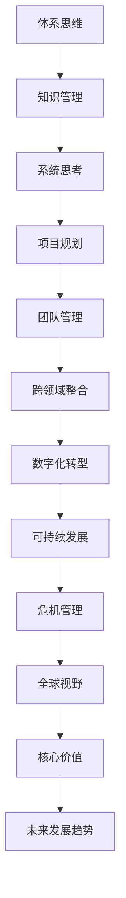
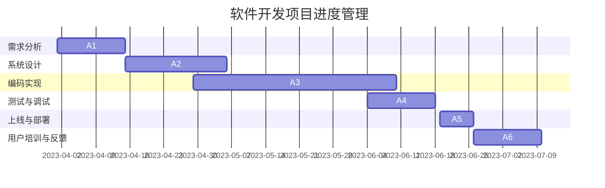

                 

# 拥有体系思维是管理者的必备能力

> **关键词：体系思维、管理者、知识管理、系统思考、项目规划、团队管理、跨领域整合、数字化转型、可持续发展、危机管理**

> **摘要：本文将深入探讨体系思维的概念、重要性以及在现代管理中的广泛应用。通过详细的理论分析和实际案例，阐述体系思维对于管理者个人成长、团队协作和企业管理的关键作用。**

## 目录大纲：拥有体系思维是管理者的必备能力

### 第一部分：体系思维概述

1. 引言：体系思维的重要性
    - 1.1 体系思维的定义与特点
    - 1.2 管理者为什么需要体系思维
    - 1.3 体系思维对个人与组织的影响

2. 体系思维的构建基础
    - 2.1 知识管理：获取与整合
        - 2.1.1 建立知识框架
        - 2.1.2 信息收集与分析
        - 2.1.3 知识分享与传递

3. 体系思维的运用策略
    - 3.1 系统思考：整体与部分的关系
        - 3.1.1 系统模型的构建
        - 3.1.2 系统分析与优化
        - 3.1.3 系统动态与反馈

4. 体系思维的案例分析
    - 4.1 企业成功案例解析
        - 4.1.1 案例一：腾讯的生态系统构建
        - 4.1.2 案例二：阿里巴巴的商业模式设计
        - 4.1.3 案例三：苹果的产品生命周期管理

5. 体系思维在项目中的应用
    - 5.1 项目规划与执行
        - 5.1.1 项目体系构建
        - 5.1.2 风险管理与控制
        - 5.1.3 项目评估与改进

6. 体系思维在团队管理中的实践
    - 6.1 团队文化建设
        - 6.1.1 价值观与愿景
        - 6.1.2 团队协作与沟通
        - 6.1.3 成果评估与激励

7. 体系思维的持续提升
    - 7.1 学习与成长
        - 7.1.1 不断学习新知识
        - 7.1.2 实践与反思
        - 7.1.3 个人与组织的共同成长

### 第二部分：体系思维的深化应用

8. 体系思维在跨领域整合中的应用
    - 8.1 跨界创新与协同效应
        - 8.1.1 跨界合作的机遇与挑战
        - 8.1.2 跨界创新的策略与实践
        - 8.1.3 跨界合作案例解析

9. 体系思维在数字化转型中的应用
    - 9.1 数字化转型的基础与路径
        - 9.1.1 数字化转型的关键因素
        - 9.1.2 数字化转型的实施策略
        - 9.1.3 数字化转型的案例分析

10. 体系思维在可持续发展中的实践
    - 10.1 可持续发展体系构建
        - 10.1.1 可持续发展的理论基础
        - 10.1.2 可持续发展的评估方法
        - 10.1.3 可持续发展的实践案例

11. 体系思维在危机管理中的应用
    - 11.1 危机管理体系的建立
        - 11.1.1 危机识别与预警
        - 11.1.2 危机应对策略
        - 11.1.3 危机管理与恢复

12. 体系思维的全球视野
    - 12.1 全球化背景下的体系思维
        - 12.1.1 全球化趋势下的挑战与机遇
        - 12.1.2 国际化战略的体系构建
        - 12.1.3 全球化运营的实践与思考

13. 结论：体系思维的终极力量
    - 13.1 体系思维的总结
    - 13.1.1 体系思维的核心价值
    - 13.1.2 体系思维的未来发展
    - 13.1.3 体系思维的应用前景

### 附录

- 附录 A：体系思维工具与方法
    - 13.1.1 SWOT分析
    - 13.1.2 五力分析
    - 13.1.3 哈利波特分析法

- 附录 B：体系思维资源推荐
    - 13.1.1 体系思维经典书籍推荐
    - 13.1.2 体系思维学习网站推荐
    - 13.1.3 体系思维相关学术论文推荐

## 核心概念与联系 Mermaid 流�程图



## 核心算法原理讲解

由于本书主要侧重于管理思维而非算法，体系思维的算法部分将简明扼要，以下是体系思维中涉及到的基本逻辑框架构建的伪代码：

```plaintext
// 体系思维核心逻辑框架构建伪代码
function buildSystemThinkingFramework() {
    // 定义知识管理模块
    knowledgeManagement = {
        "knowledgeFramework": "构建知识框架",
        "informationCollection": "信息收集与分析",
        "knowledgeSharing": "知识分享与传递"
    };

    // 定义系统思考模块
    systemThinking = {
        "systemModelConstruction": "系统模型构建",
        "systemAnalysis": "系统分析与优化",
        "systemDynamics": "系统动态与反馈"
    };

    // 定义项目规划模块
    projectPlanning = {
        "projectSystemConstruction": "项目体系构建",
        "riskManagement": "风险管理与控制",
        "projectEvaluation": "项目评估与改进"
    };

    // 定义团队管理模块
    teamManagement = {
        "teamCultureConstruction": "团队文化建设",
        "collaborationAndCommunication": "团队协作与沟通",
        "performanceEvaluation": "成果评估与激励"
    };

    // 定义跨领域整合模块
    crossDomainIntegration = {
        "boundaryBreaking": "跨界合作的机遇与挑战",
        "integrationStrategy": "跨界创新的策略与实践",
        "caseAnalysis": "跨界合作案例解析"
    };

    // 将所有模块整合到体系思维框架中
    systemThinkingFramework = {
        "knowledgeManagement": knowledgeManagement,
        "systemThinking": systemThinking,
        "projectPlanning": projectPlanning,
        "teamManagement": teamManagement,
        "crossDomainIntegration": crossDomainIntegration
    };

    return systemThinkingFramework;
}
```

## 数学模型和数学公式 & 详细讲解 & 举例说明

### SWOT分析模型

#### SWOT分析公式：
$$
\text{SWOT} = (\text{S} \cap \text{O}) \cup (\text{W} \cap \text{T})
$$

其中：
- $S$: Strengths（优势）
- $W$: Weaknesses（劣势）
- $O$: Opportunities（机会）
- $T$: Threats（威胁）

#### 示例说明：

假设我们要对一个公司进行SWOT分析：

- **优势 (S)**：强大的研发团队，丰富的产品线
- **劣势 (W)**：市场竞争激烈，产品更新周期长
- **机会 (O)**：新的市场需求，可拓展的海外市场
- **威胁 (T)**：技术革新迅速，竞争对手多

根据公式，我们可以进行如下分析：

$$
\text{SWOT} = (\text{强大的研发团队} \cap \text{新的市场需求}) \cup (\text{市场竞争激烈} \cap \text{技术革新迅速})
$$

结论：公司应利用其研发优势抓住新的市场机会，同时采取措施应对市场竞争和快速技术革新的威胁。

### 项目管理实战：使用Gantt图规划项目进度

#### 实战案例：一个软件开发项目的进度管理

**目标**：开发一个基本的客户关系管理（CRM）系统，包括客户信息管理、销售机会跟踪等功能。

#### 工具选择：Microsoft Project或在线Gantt图工具

#### 步骤1：定义项目范围和任务

**任务列表：**
- 任务1：需求分析
- 任务2：系统设计
- 任务3：编码实现
- 任务4：测试与调试
- 任务5：上线与部署
- 任务6：用户培训与反馈

#### 步骤2：分配资源与时间

**任务分配与时间表：**
- 任务1：需求分析（2周，项目经理）
- 任务2：系统设计（3周，系统架构师）
- 任务3：编码实现（6周，开发团队）
- 任务4：测试与调试（2周，测试团队）
- 任务5：上线与部署（1周，运维团队）
- 任务6：用户培训与反馈（2周，客服团队）

#### 步骤3：创建Gantt图

**Gantt图示例：**



**详细解释说明：**

- **Gantt图**是一种时间管理工具，可以帮助项目经理和团队跟踪项目的进度。
- **任务栏**显示了各个任务的名称和持续时间。
- **进度线**表示任务的开始和结束时间，通过颜色变化可以直观地了解任务是否按计划进行。
- **依赖关系**（在Gantt图中未显示）可以使用箭头或线条表示，指示任务之间的先后顺序。

#### 示例解读：

- **需求分析**阶段（2周）完成后，才能进入**系统设计**阶段。
- **编码实现**阶段是项目的核心，持续时间最长（6周）。
- **测试与调试**阶段在**编码实现**完成后立即开始，持续2周。
- **上线与部署**阶段和**用户培训与反馈**阶段分别需要在项目的最后阶段完成。

通过Gantt图，项目经理可以直观地监控项目的进度和状态，确保项目按时交付。

### 开发环境搭建、源代码详细实现和代码解读

#### 开发环境搭建：

- 安装Python环境（推荐Python 3.8以上版本）
- 安装Gantt项目库：`pip install ganttproject`

#### 源代码实现：

以下是一个使用Python和Gantt项目库创建Gantt图的示例代码：

```python
from ganttproject import GanttProject

# 初始化Gantt项目
project = GanttProject()

# 添加任务到项目
project.add_task('需求分析', start_date='2023-04-01', duration='2w', assigned_to='项目经理')
project.add_task('系统设计', start_date='2023-04-15', duration='3w', assigned_to='系统架构师')
project.add_task('编码实现', start_date='2023-04-29', duration='6w', assigned_to='开发团队')
project.add_task('测试与调试', start_date='2023-06-04', duration='2w', assigned_to='测试团队')
project.add_task('上线与部署', start_date='2023-06-19', duration='1w', assigned_to='运维团队')
project.add_task('用户培训与反馈', start_date='2023-06-26', duration='2w', assigned_to='客服团队')

# 保存Gantt图
project.save('project.gantt')
```

#### 代码解读：

- `GanttProject` 类：负责创建和管理Gantt图。
- `add_task` 方法：用于添加任务到Gantt图中，包含任务名称、开始日期、持续时间以及责任人等信息。
- `save` 方法：将创建的Gantt图保存为一个`.gantt`文件。

通过此代码示例，项目经理可以轻松地创建和监控项目进度，从而提高项目的管理效率。

### 附录

#### 附录 A：体系思维工具与方法

- **SWOT分析**：用于评估组织的优势、劣势、机会和威胁。
- **五力分析**：用于评估行业竞争力和市场地位。
- **哈利波特分析法**：一种创意思维工具，通过角色分析和故事结构来启发创新。

#### 附录 B：体系思维资源推荐

- **经典书籍推荐**：
  - 《第五项修炼：心智模式变革》作者：彼得·圣吉
  - 《系统思考》作者：丹尼尔·雷恩
  - 《创新者的窘境》作者：克莱顿·克里斯坦森

- **学习网站推荐**：
  - [MindTools](https://www.mindtools.com/)
  - [Project Management Institute](https://www.pmi.org/)
  - [Harvard Business Review](https://hbr.org/)

- **相关学术论文推荐**：
  - "System Thinking and the Challenges of Complexity" by C. West Churchman
  - "Knowledge Management and Organizational Learning" by Ikujiro Nonaka and Hirotaka Takeuchi
  - "The Core of the Matter: Systemic Thinking in Action" by Peter Senge

### 结论

体系思维是一种至关重要的管理工具，它帮助管理者从整体和系统的角度思考问题，从而更有效地应对复杂的管理挑战。本文从定义、构建、运用等多个角度详细阐述了体系思维的核心概念和实际应用，并通过具体案例和项目实战展示了体系思维在管理实践中的价值。通过不断学习和实践，管理者可以不断提升体系思维能力，为个人和组织带来持续的竞争优势。

