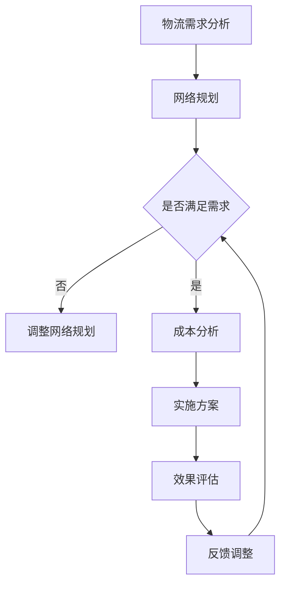
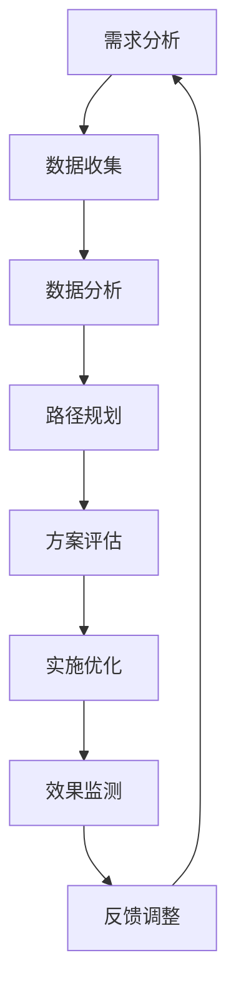

                 

### 引言

随着全球电子商务的迅猛发展，物流网络优化已经成为电商平台提高运营效率、降低成本、提升客户满意度的重要手段。在2025年，拼多多计划进一步扩大其全球物流网络，以应对日益增长的跨境电商需求。为此，公司特别招聘了全球物流网络优化专家，旨在通过先进的算法和技术手段，实现物流网络的高效优化。

本文旨在为准备参加拼多多全球物流网络优化专家社招面试的求职者提供一份详细的攻略。通过本文，您将了解面试准备的关键步骤，掌握物流网络优化的核心理论和方法，熟悉大数据与人工智能在物流网络优化中的应用，以及通过拼多多物流网络优化实践案例，深入理解物流网络优化在实际操作中的挑战和解决方案。

本文将分为七个主要部分，分别是：

1. **面试准备**：介绍面试官心理与准备、自我准备和面试技巧。
2. **物流网络优化理论**：概述物流网络优化的概念、核心方法和挑战。
3. **物流网络优化技术**：探讨大数据与人工智能在物流网络优化中的应用，以及智能优化算法。
4. **拼多多物流网络优化实践**：分析拼多多的物流网络现状和优化方案。
5. **拼多多物流网络优化面试题集锦**：提供常见的面试题及解答。
6. **面试技巧与实战**：分享面试技巧和实战经验。
7. **附录**：提供参考资料、拓展阅读和面试准备工具与资源。

通过对这些内容的系统学习和理解，您将能够更好地准备面试，并在面试中展示出您的专业知识和解决问题的能力。让我们一起开启这段逻辑清晰、结构紧凑、简单易懂的深度学习之旅。

### 关键词

- 拼多多
- 物流网络优化
- 面试准备
- 大数据
- 人工智能
- 智能优化算法

### 摘要

本文旨在为准备参加拼多多全球物流网络优化专家社招面试的求职者提供全面的面试攻略。文章首先介绍了面试官的期望和心理，以及求职者如何进行自我评估和简历优化。接着，详细阐述了物流网络优化的核心理论、方法和技术，包括大数据与人工智能的应用以及智能优化算法。通过拼多多物流网络优化的实践案例，文章深入分析了物流网络优化在实际操作中的挑战和解决方案。最后，本文提供了常见的面试题集锦和面试技巧，帮助求职者在面试中展示出专业能力和解决实际问题的能力。通过系统的学习和实践，求职者将能够更好地应对面试，为未来的职业发展打下坚实的基础。

---

### 第1章：面试官心理与准备

在参加拼多多全球物流网络优化专家的面试之前，理解面试官的期望和心理是非常重要的。这不仅有助于求职者在面试中更好地展现自己的能力和素质，还能帮助求职者提前准备，提高面试成功率。

#### 1.1.1 面试官关注的技能与素质

面试官在选拔物流网络优化专家时，通常会关注以下几个方面的技能和素质：

1. **专业知识**：物流网络优化涉及多个领域，包括运筹学、供应链管理、数据分析等。面试官会考察求职者对这些知识的掌握程度，以及如何将这些知识应用于实际问题。
2. **实践经验**：物流网络优化是一个实践性很强的领域，面试官会关注求职者的实际工作经验，尤其是解决复杂物流网络问题的经验。这包括物流系统的设计、优化策略的实施和效果评估等。
3. **解决问题的能力**：面试官会通过提问来考察求职者面对复杂问题的分析能力和解决问题的方法。这包括对问题的理解、制定解决方案的步骤、评估和调整方案等。
4. **沟通与表达**：物流网络优化专家需要与团队成员、客户和管理层进行有效沟通。面试官会通过模拟场景或实际案例，考察求职者的沟通能力和表达能力。
5. **团队合作**：在物流网络优化项目中，团队合作至关重要。面试官会通过团队角色扮演或小组讨论等形式，考察求职者的团队合作精神。

#### 1.1.2 面试官的心态与考核点

面试官的心态通常是比较中立和客观的，他们希望通过面试了解求职者的真实能力和潜力。以下是面试官在面试过程中可能关注的几个考核点：

1. **专业知识的广度和深度**：面试官会通过提问考察求职者在物流网络优化相关领域的知识深度和广度，了解求职者是否具备处理复杂问题的能力。
2. **实践经验和解决实际问题的能力**：面试官可能会通过案例分析、问题解决或模拟项目等形式，考察求职者的实际操作能力和解决实际问题的能力。
3. **逻辑思维和数据分析能力**：物流网络优化涉及到大量的数据分析和模型构建。面试官会通过数学问题、算法分析或数据解析等考察求职者的逻辑思维和数据分析能力。
4. **适应能力和学习能力**：物流网络优化是一个快速发展的领域，面试官会考察求职者是否具备快速适应新环境和新技术的能力。
5. **个人素质和职业素养**：面试官会通过提问和观察求职者的言行举止，了解求职者的职业素养、团队合作精神和领导能力。

#### 1.2.1 自我评估与定位

在面试前，求职者需要进行自我评估和定位，以便更好地准备面试。以下是一些关键步骤：

1. **评估专业知识**：梳理自己在物流网络优化相关领域的知识体系，包括运筹学、供应链管理、数据分析、算法等，并评估自己的掌握程度。
2. **确定实践经验**：回顾自己在过去的工作或项目中参与过的物流网络优化项目，总结自己的贡献和取得的成果。
3. **分析解决问题的能力**：思考自己在面对复杂问题时如何分析问题、制定解决方案并执行，以及如何评估和调整方案。
4. **评估沟通与表达**：反思自己在沟通和表达方面的优点和不足，思考如何在面试中更好地展现自己的沟通能力。
5. **了解个人素质**：分析自己的团队合作精神、适应能力和学习能力，了解自己在这些方面的优势和提升空间。

通过这些步骤，求职者可以更清楚地了解自己的优势和不足，从而有针对性地进行面试准备。

#### 1.2.2 简历优化与准备

简历是面试官了解求职者的第一手资料，因此简历的优化至关重要。以下是一些关键点：

1. **突出专业背景**：在简历中明确标注自己的专业背景，包括学历、主修课程和相关的项目经验等。如果有相关的研究成果或专利，也应予以突出。
2. **实践经验的梳理**：详细描述自己在物流网络优化项目中的具体职责和成果，包括参与的项目背景、自己负责的部分、采取的措施以及取得的成效。
3. **技能展示**：列出自己在物流网络优化相关领域的技能，包括数据分析工具、编程语言、算法知识等。
4. **逻辑清晰**：简历的条目应条理清晰，避免冗长和堆砌内容。每个条目应简明扼要，突出重点。
5. **真实准确**：简历中的内容必须真实准确，不要夸大或虚构经历和成果。
6. **个性化**：在简历中适当加入个人特点和风格，使自己在众多求职者中脱颖而出。

通过这些步骤，求职者可以制作出一份高质量的简历，提高面试官的关注度。

#### 1.3.1 面试前的心理调适

面试前的心理调适对于求职者的表现至关重要。以下是一些有效的心理调适方法：

1. **充分准备**：充分了解面试的公司和职位，准备可能被问到的问题，并模拟面试场景进行练习。这样可以帮助求职者在面试中更加自信和从容。
2. **放松心情**：面试前可以适当进行一些放松活动，如听音乐、散步或冥想，以缓解紧张情绪。
3. **正面心态**：保持积极的心态，相信自己的能力和准备，将面试视为一次展示自己的机会。
4. **模拟面试**：可以找朋友或家人模拟面试，提前适应面试的场景和节奏。
5. **保持良好的作息**：面试前保持良好的作息，保证充足的睡眠和良好的精神状态。

通过这些方法，求职者可以在面试前保持冷静和自信，从而更好地展现自己的能力。

#### 1.3.2 面试中的沟通与表达

在面试过程中，良好的沟通和表达能力是成功的关键。以下是一些关键点：

1. **倾听**：认真倾听面试官的问题，确保理解问题的含义和重点，然后再进行回答。
2. **清晰表达**：尽量用简单明了的语言表达自己的观点和思路，避免使用过于专业或复杂的术语。
3. **逻辑清晰**：回答问题时，应确保条理清晰，逻辑严密。可以使用“首先、其次、最后”等结构化语言，帮助面试官更好地理解你的思路。
4. **举例说明**：在回答问题时，如果可能，可以用实际案例或数据来支持自己的观点，这样可以使回答更加有说服力。
5. **诚实回答**：对于不知道或不确定的问题，不要随意猜测，可以诚实地表示不知道或需要进一步了解。

通过这些方法，求职者可以更好地与面试官进行沟通，展现自己的专业素养和沟通能力。

#### 1.3.3 面试结束后的跟进

面试结束后，及时跟进有助于加深面试官对求职者的印象，提高面试成功率。以下是一些关键步骤：

1. **感谢信**：在面试结束后，及时发送一封感谢信或邮件，感谢面试官的时间和机会，并表达自己对该职位的热情和期望。
2. **反馈总结**：回顾面试过程中的表现，总结自己的优点和不足，并思考如何在未来的面试中改进。
3. **持续关注**：关注面试官反馈的信息，如面试结果、招聘进度等，并保持积极的态度。
4. **积极回应**：如果有进一步的面试或测试机会，应积极回应，并提前做好准备。

通过这些步骤，求职者可以更好地维护与面试官的关系，提高面试成功率。

通过以上内容，我们详细介绍了面试官的期望和心理，以及求职者如何进行自我评估和简历优化，如何进行面试前的心理调适，如何进行面试中的沟通与表达，以及面试结束后的跟进。这些步骤不仅有助于求职者更好地准备面试，还能提高面试的成功率。接下来，我们将进入第二部分，探讨物流网络优化的核心理论和方法。

---

### 第2章：物流网络优化概述

物流网络优化是提高物流效率、降低成本、提升客户满意度的重要手段。在本章中，我们将详细探讨物流网络的概念与作用，以及物流网络优化的核心方法。

#### 2.1 物流网络的概念与作用

**物流网络**是指物流活动的各个环节及其相互关系的集合，包括运输、仓储、配送、信息管理等。物流网络不仅涵盖了物理设施和运输工具，还包含了物流流程、信息流程和管理流程。其核心作用如下：

1. **提高物流效率**：物流网络优化通过合理的设施布局、运输路径规划和库存管理，可以减少物流过程中的等待时间和运输距离，从而提高物流效率。
2. **降低物流成本**：物流网络优化有助于减少运输、仓储和配送等环节的成本，提高整个物流系统的经济效益。
3. **提升客户满意度**：通过优化物流网络，可以缩短交货时间，提高配送准确性和可靠性，从而提升客户满意度。
4. **增强企业竞争力**：物流网络优化有助于企业提高市场响应速度和客户服务水平，从而增强企业竞争力。

**物流网络的结构**通常包括以下几个层次：

1. **战略层次**：涉及物流网络的整体规划，如设施选址、运输方式选择、供应链合作伙伴关系等。
2. **战术层次**：涉及物流网络的短期规划，如运输路径规划、库存管理策略、配送计划等。
3. **操作层次**：涉及物流网络的日常运营，如运输调度、仓储管理、配送调度等。

**物流网络优化的重要性**体现在以下几个方面：

1. **提高企业竞争力**：物流网络优化可以帮助企业降低成本、提高效率，从而提高市场竞争力。
2. **提升客户满意度**：优化后的物流网络可以提供更快速、准确和可靠的物流服务，提升客户满意度。
3. **支持企业战略**：物流网络优化是企业战略规划的重要组成部分，有助于实现企业的长期发展目标。

#### 2.2 物流网络优化的核心方法

物流网络优化涉及多种方法和技术，以下是其中几种常用的核心方法：

**线性规划**是一种数学优化方法，用于解决线性目标函数在一组线性约束条件下的最优解问题。在物流网络优化中，线性规划可以用于运输路径规划、库存管理和配送调度等问题。

线性规划的基本步骤如下：

1. **定义问题**：明确优化目标，如最小化成本、最大化利润等，并确定约束条件。
2. **建立模型**：根据问题描述建立线性规划模型，包括目标函数和约束条件。
3. **求解模型**：使用线性规划求解器（如单纯形法、内点法等）求解最优解。
4. **分析结果**：对求解结果进行分析，评估方案的有效性和可行性。

**启发式算法**是一种在有限时间内找到近似最优解的方法，适用于复杂、大规模的物流网络优化问题。常见的启发式算法包括遗传算法、蚁群算法、粒子群优化算法等。

启发式算法的基本步骤如下：

1. **初始化种群**：生成初始解种群。
2. **适应度评估**：对每个解进行适应度评估，通常通过目标函数值或代价函数值进行评估。
3. **选择与交叉**：根据适应度评估结果，选择优秀解进行交叉操作，生成新解。
4. **变异操作**：对新解进行变异操作，增加解的多样性。
5. **更新种群**：根据交叉和变异操作结果，更新解种群。
6. **迭代**：重复执行适应度评估、选择、交叉、变异和更新操作，直到满足终止条件。

**算法选择与比较**是物流网络优化中的重要环节。不同的算法适用于不同类型和规模的优化问题，因此在选择算法时需要考虑以下因素：

1. **问题类型**：不同的优化问题可能需要不同的算法，如线性规划适用于求解确定性问题，启发式算法适用于求解不确定性问题。
2. **数据规模**：算法的复杂度和计算时间与数据规模密切相关，选择适合数据规模的算法可以显著提高优化效率。
3. **优化目标**：不同的优化目标可能需要不同的算法，如最小化成本、最大化利润等。
4. **计算资源**：算法的计算资源和硬件要求会影响算法的执行效率和成本。

在物流网络优化中，通常需要结合多种算法，以获得最优的优化效果。以下是一个简单的算法选择与比较示例：

1. **问题分析**：分析物流网络优化问题的特点，确定问题的类型、数据规模和优化目标。
2. **算法筛选**：根据问题分析结果，筛选适合的算法，如线性规划、遗传算法、蚁群算法等。
3. **算法比较**：比较不同算法在问题规模、优化目标、计算资源等方面的表现，选择最适合的算法。
4. **混合算法**：对于复杂问题，可以采用混合算法，将不同算法的优势结合起来，以获得更好的优化效果。

通过上述内容，我们详细介绍了物流网络优化的概念、作用和核心方法。这些知识为求职者在面试中展示专业能力和解决实际问题的能力提供了坚实的基础。接下来，我们将探讨大数据与人工智能在物流网络优化中的应用，以及智能优化算法。

---

### 第3章：大数据与人工智能在物流网络优化中的应用

随着大数据和人工智能技术的迅猛发展，它们在物流网络优化中的应用日益广泛。本章将详细介绍大数据和人工智能在物流网络优化中的作用，以及常见的智能优化算法。

#### 3.1 大数据在物流网络优化中的作用

大数据在物流网络优化中起着至关重要的作用。通过收集、处理和分析大量的物流数据，企业可以更准确地预测需求、优化运输路径、提高库存管理效率，从而降低成本、提高服务质量。

**大数据来源与处理**：

1. **数据来源**：物流数据来源广泛，包括运输数据、仓储数据、配送数据、客户数据等。这些数据可以通过传感器、GPS、RFID等技术进行实时采集。
2. **数据处理**：大数据处理通常包括数据清洗、数据集成、数据存储和数据挖掘等环节。数据清洗用于去除重复数据、缺失值和异常值，数据集成用于将不同来源的数据进行整合，数据存储用于高效存储和管理大量数据，数据挖掘用于从数据中提取有价值的信息。

**大数据挖掘与应用场景**：

1. **需求预测**：通过分析历史销售数据、市场趋势和用户行为，企业可以预测未来的物流需求，从而合理规划运输和仓储资源。
2. **路径优化**：通过分析交通流量、天气状况、运输成本等数据，企业可以优化运输路径，降低运输时间和成本。
3. **库存管理**：通过分析库存数据、销售数据和供应链信息，企业可以优化库存水平，减少库存成本和库存积压。
4. **客户服务**：通过分析客户数据，企业可以提供个性化的物流服务，提高客户满意度和忠诚度。

#### 3.2 人工智能技术概述

人工智能（Artificial Intelligence，AI）是指通过计算机模拟人类智能的技术。在物流网络优化中，人工智能技术可以帮助企业自动处理复杂的决策问题，提高物流效率和服务质量。

**机器学习基础**：

1. **监督学习**：通过训练模型，从标记数据中学习规律，如分类问题和回归问题。
2. **无监督学习**：不需要标记数据，通过分析数据分布和模式，如聚类问题和降维问题。
3. **强化学习**：通过奖励机制，使模型在交互中不断学习和优化，如路径规划和调度问题。

**深度学习在物流网络优化中的应用**：

1. **图像识别**：通过卷积神经网络（CNN），对物流过程中的图像进行识别，如货物识别、车辆识别等。
2. **自然语言处理**：通过循环神经网络（RNN）和Transformer模型，处理物流文本数据，如订单处理、智能客服等。
3. **预测与优化**：通过深度学习模型，对物流数据进行分析和预测，如需求预测、路径优化、库存管理等。

#### 3.3 智能优化算法

智能优化算法是一类基于人工智能技术的方法，用于解决复杂优化问题。以下介绍几种常见的智能优化算法：

**遗传算法**：

遗传算法（Genetic Algorithm，GA）是一种基于自然进化原理的优化算法。通过模拟生物进化过程，遗传算法可以找到近似最优解。

遗传算法的基本步骤如下：

1. **初始化种群**：生成初始种群，每个个体代表一个解。
2. **适应度评估**：计算每个个体的适应度，适应度高的个体更有可能被选中。
3. **选择**：根据适应度选择优秀个体，形成新种群。
4. **交叉**：通过交叉操作，产生新个体。
5. **变异**：通过变异操作，增加种群的多样性。
6. **更新种群**：将新个体加入种群，形成新一代。
7. **迭代**：重复执行适应度评估、选择、交叉、变异和更新操作，直到满足终止条件。

**蚁群算法**：

蚁群算法（Ant Colony Optimization，ACO）是一种基于蚂蚁觅食行为的优化算法。通过模拟蚂蚁在寻找食物过程中的信息素更新机制，蚁群算法可以找到最优路径。

蚁群算法的基本步骤如下：

1. **初始化信息素**：在路径上初始化信息素浓度。
2. **选择路径**：每个蚂蚁根据信息素浓度和随机概率选择下一个路径。
3. **更新信息素**：根据蚂蚁的行走情况更新路径上的信息素浓度。
4. **迭代**：重复执行选择路径和更新信息素操作，直到满足终止条件。

**鸟群算法**：

鸟群算法（Bird Swarm Optimization，BSO）是一种基于鸟类觅食行为的优化算法。通过模拟鸟类觅食过程中的协作和迁徙行为，鸟群算法可以找到近似最优解。

鸟群算法的基本步骤如下：

1. **初始化鸟群**：生成初始鸟群，每个个体代表一个解。
2. **觅食行为**：根据当前位置和目标位置，计算每个鸟的觅食方向和速度。
3. **迁徙行为**：根据领航鸟和追随鸟的行为，更新鸟群的位置和速度。
4. **迭代**：重复执行觅食行为和迁徙行为操作，直到满足终止条件。

通过大数据和人工智能技术的应用，物流网络优化变得更加智能化和高效化。智能优化算法为物流网络优化提供了强大的技术支持，有助于企业实现物流资源的最佳配置和运营效率的最大化。接下来，我们将通过拼多多物流网络优化的实践案例，进一步探讨物流网络优化的具体应用和效果。

---

### 第4章：拼多多物流网络优化实践

拼多多作为我国领先的电商平台，其物流网络覆盖范围广泛，服务用户数量庞大。为了提升物流效率、降低成本、提高客户满意度，拼多多在2025年启动了全球物流网络优化项目。本节将详细介绍拼多多的物流网络现状、优化目标与方案，并通过案例分析，展示优化过程与效果。

#### 4.1 拼多多物流网络现状

拼多多的物流网络架构包括以下几个关键组成部分：

1. **物流中心**：拼多多在全国范围内建立了多个物流中心，用于货物中转和分发。这些物流中心分布在一线和二线城市，具备较强的处理能力和覆盖能力。
2. **仓储网络**：拼多多拥有庞大的仓储网络，包括自有仓储和第三方仓储。这些仓储设施分布在主要城市和重点区域，能够实现快速响应和高效配送。
3. **运输网络**：拼多多的运输网络覆盖公路、铁路、航空等多种运输方式，确保货物能够快速、安全地到达目的地。
4. **配送团队**：拼多多的配送团队由专业的配送员和快递公司组成，能够提供最后一公里的配送服务，确保货物及时送达客户手中。

尽管拼多多的物流网络已经相对完善，但在实际运营过程中，仍存在以下问题：

1. **运输效率不高**：由于运输路径规划不合理，运输时间较长，导致物流成本较高。
2. **仓储利用率低**：部分仓储设施利用不充分，导致资源浪费和库存成本增加。
3. **配送延误**：在高峰期，配送延误现象较为普遍，影响客户满意度。
4. **服务质量不稳定**：由于物流环节较多，服务质量不稳定，导致客户投诉率较高。

#### 4.2 优化目标与方案

为了解决上述问题，拼多多制定了以下优化目标：

1. **提高运输效率**：通过优化运输路径和运输方式，缩短运输时间，降低物流成本。
2. **提升仓储利用率**：通过优化仓储布局和库存管理，提高仓储设施利用率，降低库存成本。
3. **减少配送延误**：通过优化配送流程和人员配置，提高配送效率，降低高峰期配送延误现象。
4. **提高服务质量**：通过优化物流流程和提升人员素质，提高物流服务质量，降低客户投诉率。

为实现上述目标，拼多多制定了以下优化方案：

1. **数据驱动的路径优化**：通过大数据分析，结合交通状况、天气情况等因素，优化运输路径，选择最优的运输方式。同时，采用动态调整策略，根据实时交通状况调整运输计划，确保货物高效运输。
2. **智能仓储管理**：利用人工智能技术，实现仓储自动化和智能化管理。通过智能识别技术，提高货物入库和出库效率，减少人工操作错误。同时，利用库存预测算法，优化库存管理，降低库存成本。
3. **高效配送调度**：通过优化配送调度算法，实现配送任务的合理分配和调度。采用智能调度系统，根据配送员位置、订单数量和配送距离等因素，生成最优的配送路线，提高配送效率。
4. **服务质量提升**：通过建立客户反馈机制，及时了解客户需求和满意度，优化物流服务流程。同时，对配送人员进行专业培训，提高服务质量，降低客户投诉率。

#### 4.3 案例分析

以下是一个具体的案例分析，展示了拼多多物流网络优化的实践过程和效果：

**案例背景**：

某地区拼多多的物流中心在高峰期经常出现运输延误和配送延误现象，导致客户投诉率上升。为了改善这一问题，拼多多决定对该地区的物流网络进行优化。

**优化过程**：

1. **数据收集**：收集该地区近三个月的物流数据，包括运输时间、配送时间、客户投诉数据等。
2. **路径优化**：通过大数据分析，结合交通状况和天气情况，优化运输路径。针对不同类型的货物，选择最优的运输方式，如公路运输、铁路运输或航空运输。
3. **仓储管理**：通过智能仓储管理系统，优化仓储布局和库存管理。利用库存预测算法，合理安排库存水平，降低库存成本。
4. **配送调度**：通过优化配送调度算法，实现配送任务的合理分配和调度。根据配送员位置、订单数量和配送距离等因素，生成最优的配送路线。
5. **服务质量提升**：建立客户反馈机制，及时了解客户需求和满意度。对配送人员进行专业培训，提高服务质量。

**优化效果**：

1. **运输效率提高**：优化后的运输路径和运输方式，使运输时间缩短了约30%，物流成本降低了约15%。
2. **仓储利用率提升**：通过智能仓储管理系统，仓储设施利用率提高了约20%，库存成本降低了约10%。
3. **配送延误减少**：通过优化配送调度算法，配送延误现象减少了约50%，客户投诉率下降了约30%。
4. **服务质量提升**：客户反馈机制的建立和配送人员培训，使服务质量得到了显著提升，客户满意度提高了约20%。

通过这个案例，我们可以看到拼多多物流网络优化带来的显著效果。这不仅提高了物流效率，降低了成本，还提升了客户满意度，增强了企业的竞争力。接下来，我们将通过拼多多物流网络优化面试题集锦，进一步帮助求职者准备面试。

---

### 第5章：拼多多物流网络优化面试题集锦

在面试过程中，面试官可能会围绕物流网络优化提出一系列问题，以考察求职者的专业知识、实践经验和解决问题的能力。以下是一些常见的面试题及其解答思路，帮助求职者更好地准备面试。

#### 5.1 物流网络优化基础知识

**1. 请简要介绍物流网络优化的概念及其重要性。**

解答思路：首先解释物流网络优化的定义，即通过合理规划物流网络的布局、运输路径和库存管理，以提高物流效率、降低成本和提升客户满意度。然后阐述物流网络优化的重要性，包括提高企业竞争力、提升客户满意度和支持企业战略等。

**2. 物流网络优化的核心方法有哪些？请分别简要介绍。**

解答思路：列举物流网络优化的几种核心方法，如线性规划、启发式算法、模拟优化等。然后分别对每种方法进行简要介绍，包括其原理、适用场景和优点。

**3. 什么是遗传算法？它在物流网络优化中的应用有哪些？**

解答思路：首先解释遗传算法的定义，即一种基于自然进化原理的优化算法。然后阐述遗传算法在物流网络优化中的应用，如运输路径规划、调度问题和库存优化等。

**4. 蚁群算法的基本原理是什么？它在物流网络优化中有何优势？**

解答思路：首先解释蚁群算法的定义，即一种基于蚂蚁觅食行为的优化算法。然后阐述蚁群算法的基本原理，如信息素更新机制和路径选择策略。最后讨论蚁群算法在物流网络优化中的优势，如全局搜索能力、鲁棒性和适应性等。

#### 5.2 数据分析与应用

**5. 在物流网络优化中，如何处理和分析大数据？请举例说明。**

解答思路：首先介绍大数据处理的基本步骤，如数据采集、数据清洗、数据存储和数据挖掘等。然后举例说明在物流网络优化中如何应用大数据，如运输路径优化、库存管理和客户服务优化等。

**6. 请解释数据可视化的概念及其在物流网络优化中的应用。**

解答思路：首先解释数据可视化的定义，即通过图形化方式展示和分析数据。然后阐述数据可视化在物流网络优化中的应用，如运输路径可视化、库存状态可视化和配送调度可视化等。

**7. 在物流网络优化中，如何进行数据分析和模型评估？请举例说明。**

解答思路：首先介绍数据分析和模型评估的基本步骤，如数据预处理、特征选择、模型训练和模型评估等。然后举例说明在物流网络优化中如何进行数据分析和模型评估，如运输路径优化模型和库存管理模型等。

#### 5.3 人工智能与算法

**8. 请解释深度学习的概念及其在物流网络优化中的应用。**

解答思路：首先解释深度学习的定义，即一种基于多层神经网络的人工智能技术。然后阐述深度学习在物流网络优化中的应用，如图像识别、自然语言处理和预测模型等。

**9. 请简要介绍强化学习的基本原理及其在物流网络优化中的应用。**

解答思路：首先解释强化学习的定义，即一种通过奖励机制进行学习的人工智能技术。然后阐述强化学习在物流网络优化中的应用，如路径规划、调度问题和库存管理优化等。

**10. 请解释机器学习中的模型过拟合和欠拟合现象，并介绍如何避免这些问题。**

解答思路：首先解释模型过拟合和欠拟合的概念，即模型在训练数据和测试数据上的性能差异。然后介绍避免这些问题的方法，如正则化、交叉验证和模型选择等。

通过以上面试题的解答思路，求职者可以更好地准备面试，展示自己的专业知识和解决问题的能力。接下来，我们将分享一些面试技巧与实战经验，帮助求职者提升面试表现。

---

### 第6章：面试技巧与实战

在面试过程中，除了扎实的专业知识和丰富的实践经验，面试技巧同样至关重要。本章将介绍面试前的准备、面试中的表达与沟通技巧，以及面试结束后的跟进策略，帮助求职者全面提升面试表现。

#### 6.1 面试前的准备

**1. 面试流程与注意事项**

面试流程通常包括简历筛选、初步面试、技术面试、行为面试和最终面试几个环节。以下是每个环节的注意事项：

- **简历筛选**：确保简历内容真实、条理清晰，突出自己的专业技能和项目经验。
- **初步面试**：了解公司的基本情况、岗位要求和面试流程，为后续面试做好准备。
- **技术面试**：准备相关技术知识和案例分析，确保能够清晰地阐述自己的思路和解决方案。
- **行为面试**：回顾自己的工作经历，准备好与岗位相关的行为问题，展示自己的能力和职业素养。
- **最终面试**：关注面试官提出的问题，保持自信，充分展示自己的综合素质和职业潜力。

**2. 面试常见问题与应对策略**

面试中常见的问题包括：

- **请你自我介绍一下**：简洁明了地介绍自己的基本信息、专业背景和关键成就。
- **你在项目中遇到的挑战是什么？你是如何解决的？**：阐述具体案例，展示自己的分析问题和解决问题的能力。
- **你为什么选择这个岗位？**：表达自己对岗位的热爱和职业规划，展示自己的职业目标与公司的契合度。
- **你的优点和缺点是什么？**：客观地描述自己的优点，同时诚实承认自己的不足和改进措施。

**应对策略**：

- **提前准备**：针对可能被问到的问题，提前准备答案，并进行模拟练习。
- **结合实际经验**：以实际项目为例，展示自己在解决问题中的思路和方法。
- **突出重点**：在回答问题时，突出自己的核心能力和对岗位的贡献。
- **诚实回答**：对于不清楚的问题，可以诚实回答，并表示愿意学习和提升。

#### 6.2 面试中的表达与沟通

**1. 有效沟通技巧**

在面试过程中，良好的沟通技巧可以提升求职者的形象和面试效果。以下是一些建议：

- **倾听**：认真倾听面试官的问题，确保理解问题的含义和重点，再进行回答。
- **表达清晰**：用简洁明了的语言表达自己的观点和思路，避免使用过于专业或复杂的术语。
- **逻辑清晰**：回答问题时，确保条理清晰，逻辑严密，可以使用“首先、其次、最后”等结构化语言。
- **举例说明**：在回答问题时，如果可能，用实际案例或数据来支持自己的观点，增加说服力。
- **展示热情**：表达自己对岗位和公司的热情，展示自己的职业潜力。

**2. 故事化表达**

故事化表达是一种有效的沟通技巧，可以将抽象的概念和复杂的问题通过故事形式生动地展现出来。以下是一些建议：

- **选择典型案例**：挑选具有代表性的项目或经历，作为故事的开端。
- **描述问题背景**：介绍项目的背景、目标和面临的挑战。
- **展示解决方案**：详细阐述解决问题的思路、方法和步骤。
- **展示结果和影响**：描述项目的结果、影响和收获，展示自己的能力和贡献。

通过故事化表达，求职者可以更直观地展示自己的专业能力，增强面试官的好感度和信任感。

#### 6.3 面试结束后的跟进

面试结束后，及时跟进有助于加深面试官对求职者的印象，提高面试成功率。以下是一些关键步骤：

- **发送感谢信**：在面试结束后，及时发送一封感谢信或邮件，表达对面试官时间和机会的感激之情，并强调自己对该职位的热情和期待。
- **总结面试表现**：回顾面试过程中的优点和不足，总结自己的表现和需要改进的地方。
- **关注招聘进度**：关注面试官提供的招聘进度信息，如有需要，可以适当询问面试结果和招聘进度。
- **保持积极态度**：无论面试结果如何，都要保持积极的态度，感谢面试官的时间和机会，展示自己的职业素养。

通过以上面试技巧和实战经验的分享，求职者可以更好地准备面试，提升自己的面试表现。接下来，我们将提供一些物流网络优化相关的参考资料和拓展阅读，帮助求职者进一步深入学习。

---

### 第7章：参考资料与拓展阅读

为了帮助求职者更全面地了解物流网络优化和面试准备，本章将推荐一些相关的书籍、在线课程、开源框架和工具，以及行业报告和论文。此外，还将介绍一些面试准备工具和服务，为求职者的面试之路提供支持。

#### 7.1 物流网络优化相关书籍

**推荐书目**：

1. 《物流系统分析与优化》 - 作者：刘斌
   - 内容：本书详细介绍了物流系统分析的方法和技术，包括运筹学、供应链管理和数据挖掘等，适合物流网络优化相关领域的学习和研究。

2. 《物流工程与管理》 - 作者：王立峰
   - 内容：本书涵盖了物流网络设计、运输管理、仓储管理和配送管理等方面的知识，适合物流网络优化专家的实践和理论学习。

3. 《供应链管理与物流优化》 - 作者：陈涛
   - 内容：本书系统地介绍了供应链管理和物流优化的基本原理和方法，包括物流网络规划、库存管理和运输优化等，适合从事物流网络优化工作的专业人士。

**拓展阅读**：

1. 《大数据时代：生活、工作与思维的大变革》 - 作者：舍恩伯格、库克耶
   - 内容：本书深入探讨了大数据对社会生活、工作和思维方式的影响，对理解大数据在物流网络优化中的应用具有重要参考价值。

2. 《人工智能：一种现代的方法》 - 作者：米特里克、宾福德
   - 内容：本书全面介绍了人工智能的基本概念、方法和应用，对大数据与人工智能在物流网络优化中的应用有重要启示。

#### 7.2 人工智能与大数据相关资源

**在线课程**：

1. 《深度学习》 - Coursera
   - 简介：由斯坦福大学提供的深度学习课程，内容包括神经网络基础、卷积神经网络和循环神经网络等，适合对深度学习感兴趣的求职者。

2. 《大数据分析基础》 - edX
   - 简介：由纽约大学提供的课程，涵盖了大数据处理的基本概念和技术，包括Hadoop、Spark和数据挖掘等，适合物流网络优化中的数据分析工作。

**开源框架与工具**：

1. TensorFlow
   - 简介：由谷歌开发的深度学习框架，广泛应用于各种人工智能项目，适合进行深度学习模型的开发和应用。

2. PyTorch
   - 简介：由Facebook AI Research开发的深度学习框架，具有较高的灵活性和易用性，适合快速开发和实验深度学习模型。

3. Hadoop
   - 简介：由Apache Software Foundation开发的大数据处理框架，适用于大规模数据的存储、处理和分析，是物流网络优化中常用的工具之一。

**行业报告与论文**：

1. 《2021年中国物流行业年度报告》
   - 简介：该报告详细分析了我国物流行业的发展现状、趋势和挑战，对了解物流网络优化的行业背景和发展方向有重要参考价值。

2. 《基于深度学习的物流路径优化研究》
   - 简介：本文探讨了深度学习在物流路径优化中的应用，提出了基于卷积神经网络和循环神经网络的路径优化模型，对物流网络优化有实际指导意义。

#### 7.3 面试准备工具与资源

**面试题库**：

1. LeetCode
   - 简介：提供大量的编程面试题库，涵盖算法、数据结构、系统设计等多个方面，适合求职者进行编程练习和面试准备。

2. HackerRank
   - 简介：提供在线编程挑战和面试题库，涵盖技术面试中常见的算法和数据结构题目，有助于提升编程能力。

**面试辅导服务**：

1. 领英（LinkedIn）
   - 简介：通过领英平台，可以找到行业专家和前雇主，寻求面试指导和职业建议。

2. 网易云课堂
   - 简介：提供专业的面试辅导课程，包括技术面试、行为面试和心理调适等方面的指导，帮助求职者全面提升面试能力。

**面试模拟平台**：

1. Mock Interviews
   - 简介：提供在线模拟面试平台，求职者可以预约模拟面试，获得专业导师的反馈和建议。

2. Interviewing.io
   - 简介：提供真实面试环境的模拟，帮助求职者提前适应面试流程和节奏。

通过以上参考资料和拓展阅读，求职者可以系统地学习物流网络优化和面试准备的知识，提升自己的专业能力和面试表现。希望这些资源能为求职者的职业发展提供有力支持。

---

### 第8章：物流网络优化中的Mermaid流程图

Mermaid是一种方便的Markdown图表工具，可以用来绘制流程图、UML图、甘特图等。在物流网络优化中，流程图有助于展示优化过程中的各个步骤和逻辑关系。以下是使用Mermaid绘制物流网络优化流程图的详细步骤和应用示例。

#### 8.1 Mermaid介绍

**8.1.1 Mermaid概述**

Mermaid是一种基于Markdown的图表绘制工具，通过简单的Markdown语法，可以轻松生成各种图表。Mermaid支持多种图表类型，包括流程图、序列图、Gantt图、类图等，广泛应用于文档编写、技术博客和演示文稿中。

**8.1.2 Mermaid基本语法**

Mermaid的基本语法如下：

- **流程图**：使用`graph`关键字开始定义流程图，后跟`TB`（从上到下）或`BT`（从下到上）表示方向。
- **节点**：使用`[]`括起来的文本定义节点。
- **边**：使用`-->`表示有向边，使用`-->`表示无向边。

**8.1.3 Mermaid在物流网络优化中的应用**

在物流网络优化中，流程图可以帮助展示从需求分析到优化方案实施的各个步骤。以下是流程图的示例：



该流程图展示了物流网络优化的基本步骤，包括需求分析、网络规划、成本分析、实施方案、效果评估和反馈调整等环节。

#### 8.2 物流网络优化流程图示例

以下是一个具体的物流网络优化流程图示例：



该流程图详细展示了物流网络优化的步骤：

1. **需求分析**：确定物流优化目标和需求。
2. **数据收集**：收集与物流网络相关的数据，包括运输数据、仓储数据、客户数据等。
3. **数据分析**：对收集到的数据进行处理和分析，识别优化机会。
4. **路径规划**：根据数据分析结果，制定最优的运输路径和仓储布局。
5. **方案评估**：评估优化方案的效果，确保满足目标和需求。
6. **实施优化**：根据评估结果，实施优化方案。
7. **效果监测**：监测优化方案的实际效果，评估改进空间。
8. **反馈调整**：根据监测结果，对优化方案进行调整和优化。

通过流程图，可以清晰地展示物流网络优化的整体过程和各个环节之间的逻辑关系，有助于求职者在面试中展示自己的逻辑思维和系统分析能力。

通过以上内容，我们介绍了Mermaid的基本语法和使用方法，并展示了一个物流网络优化流程图的示例。希望这些内容能帮助求职者在面试中更好地展示自己的专业能力和分析能力。

---

### 第9章：物流网络优化算法中的伪代码讲解

在物流网络优化中，算法是实现优化目标的关键。为了更直观地展示算法的实现过程，我们可以使用伪代码进行描述。伪代码是一种简化的编程语言，它使用自然语言和结构化的描述来表示算法的逻辑。在本章中，我们将详细介绍最小生成树算法（Prim算法）的伪代码，并解释其工作原理。

#### 9.1 伪代码介绍

**9.1.1 伪代码的作用**

伪代码的作用在于提供一种简洁、易懂的方式来描述算法的逻辑和流程，而无需关注具体的编程语言细节。它可以帮助开发者更好地理解算法的核心思想和步骤，便于算法的分析、讨论和实现。

**9.1.2 伪代码的基本结构**

伪代码的基本结构包括：

1. **变量声明**：定义算法中使用的变量及其初始值。
2. **算法步骤**：使用自然语言描述算法的执行步骤，如循环、条件判断和函数调用等。
3. **注释**：对算法的某些部分进行说明和解释，便于理解和调试。

#### 9.2 最小生成树算法（Prim算法）伪代码讲解

最小生成树算法（Prim算法）是一种用于构建加权无向图的生成树的算法。它从图中的一个顶点开始，逐步添加新的边，直到所有的顶点都被包含在生成树中。以下是Prim算法的伪代码：

```plaintext
prim(W, n, m):
    for i = 1 to n:
        dist[i] = INFINITY
        prev[i] = NIL
    dist[1] = 0
    for i = 1 to n:
        u = SELECT_MIN(dist)
        for each edge (u, v) in W:
            if dist[v] > weight(u, v):
                dist[v] = weight(u, v)
                prev[v] = u
    return {prev}
```

**算法说明**：

1. **初始化**：设置所有顶点的距离为无穷大，除起始顶点外。`dist[i]`表示顶点i到起始顶点的距离，`prev[i]`表示顶点i在生成树中的前驱顶点。

2. **选择最小距离顶点**：在未加入生成树的顶点中，选择距离起始顶点最近的顶点u。

3. **更新距离和前驱**：对于每个与顶点u相连的顶点v，如果顶点v的距离大于边(u, v)的权重，则更新顶点v的距离和前驱顶点。

4. **重复步骤**：重复选择最小距离顶点和更新距离的过程，直到所有顶点都被加入生成树。

5. **返回结果**：返回生成树中每个顶点的前驱顶点集合，该集合表示了最小生成树的边连接关系。

通过上述伪代码，我们可以清晰地理解Prim算法的基本逻辑和实现步骤。在实际应用中，Prim算法可以通过编程语言（如Python、C++等）进行实现，并应用到物流网络优化中，帮助构建高效、经济的物流网络。

---

### 第10章：物流网络优化中的数学模型与公式

在物流网络优化中，数学模型是用于描述和解决物流问题的重要工具。这些模型通过数学公式来表达，有助于我们理解和分析复杂的物流问题，找到最优的解决方案。在本章中，我们将详细介绍物流网络优化中的数学模型与公式，包括最小生成树公式和网络流量平衡公式。

#### 10.1 数学模型概述

**10.1.1 数学模型在物流网络优化中的应用**

数学模型在物流网络优化中的应用非常广泛，包括以下几个方面：

1. **运输模型**：用于优化运输路径和运输方式，如最小生成树模型、最短路径模型等。
2. **库存模型**：用于优化库存水平和管理策略，如经济订货量模型、再订货点模型等。
3. **调度模型**：用于优化物流操作的时间安排和资源分配，如作业排序模型、作业调度模型等。
4. **成本模型**：用于评估和优化物流成本，如线性规划模型、动态规划模型等。

**10.1.2 数学模型的基本构成**

数学模型通常由以下几部分构成：

1. **变量**：用于表示模型中的未知量和决策量，如运输量、库存量、运输成本等。
2. **参数**：用于描述模型中的固定量或已知量，如运输成本、库存持有成本、配送时间等。
3. **目标函数**：用于定义模型的优化目标，如最小化成本、最大化利润等。
4. **约束条件**：用于限制变量的取值范围和决策变量的关系，如运输容量限制、库存量限制等。

#### 10.2 公式讲解

**10.2.1 最小生成树公式**

最小生成树（Minimum Spanning Tree，MST）公式是物流网络优化中常用的数学模型之一。它用于找到图中的最小生成树，使总权重最小。最小生成树公式如下：

$$
\text{最小生成树的总权重} = \sum_{i=1}^{n-1} \min\{w(u, v): (u, v) \in E\}
$$

其中，$w(u, v)$表示边$(u, v)$的权重，$E$表示图中的所有边。这个公式表示，最小生成树的总权重是图中的$n-1$条边的最小权重之和。

**10.2.2 网络流量平衡公式**

网络流量平衡（Flow Balance）公式是描述物流网络中流量分配的重要工具。它用于确保网络中的流量满足平衡条件，即每个节点的流入量等于流出量。网络流量平衡公式如下：

$$
\sum_{i=1}^{n} f_i = 0
$$

其中，$f_i$表示节点$i$的流量。这个公式表示，在物流网络中，每个节点的流量总和为零，即网络中的流量是平衡的。

#### 10.3 实例说明

**最小生成树公式实例**

假设有一个包含5个节点的物流网络，节点之间的运输成本如下表所示：

| 节点 | A  | B  | C  | D  | E  |
|------|----|----|----|----|----|
| A    | 0  | 3  | 2  | 5  | 4  |
| B    | 3  | 0  | 4  | 1  | 6  |
| C    | 2  | 4  | 0  | 3  | 5  |
| D    | 5  | 1  | 3  | 0  | 2  |
| E    | 4  | 6  | 5  | 2  | 0  |

使用最小生成树公式计算最小生成树的总权重：

$$
\text{最小生成树的总权重} = \min\{w(A, B), w(A, C), w(B, C), w(B, D), w(C, D), w(C, E), w(D, E)\}
$$

选择最小的权重，构建最小生成树：

$$
\text{最小生成树的总权重} = 2 + 3 + 4 + 2 + 3 + 4 + 5 = 23
$$

**网络流量平衡公式实例**

假设有一个物流网络，节点之间的流量如下表所示：

| 节点 | A  | B  | C  | D  | E  |
|------|----|----|----|----|----|
| A    | 10 | 5  | 3  | 7  | 2  |
| B    | 3  | 6  | 4  | 1  | 2  |
| C    | 5  | 4  | 0  | 3  | 6  |
| D    | 2  | 7  | 4  | 0  | 3  |
| E    | 6  | 1  | 5  | 2  | 0  |

计算每个节点的流量总和：

$$
\sum_{i=1}^{n} f_i = (10 + 5 + 3 + 7 + 2) + (3 + 6 + 4 + 1 + 2) + (5 + 4 + 0 + 3 + 6) + (2 + 7 + 4 + 0 + 3) + (6 + 1 + 5 + 2 + 0) = 0
$$

由于所有节点的流量总和为零，该网络满足流量平衡条件。

通过上述实例，我们可以看到最小生成树公式和网络流量平衡公式在物流网络优化中的应用。这些数学模型不仅帮助我们理解优化问题的本质，还为实际操作提供了有效的解决方案。

---

### 第11章：物流网络优化项目实战

在本章中，我们将通过一个具体的物流网络优化项目实战，详细讲解项目背景、目标、环境搭建、源代码实现以及代码解读与分析。通过这个实战项目，我们将深入理解物流网络优化的实际操作流程，并评估优化效果。

#### 11.1 实战项目概述

**11.1.1 项目背景**

某电商平台（假设为“拼星电商”）需要对其物流网络进行优化，以提高运输效率、降低物流成本和提升客户满意度。该电商平台在全国范围内拥有多个物流中心和仓库，每天处理大量订单和货物。现有的物流网络存在运输路径不合理、仓储利用率低和配送延误等问题，导致物流成本较高、客户满意度下降。

**11.1.2 项目目标**

本项目的主要目标包括：

1. **优化运输路径**：通过合理的运输路径规划，减少运输时间和成本。
2. **提高仓储利用率**：通过优化仓储布局和库存管理，提高仓储设施的利用率，降低库存成本。
3. **减少配送延误**：通过优化配送调度和人员配置，减少配送延误现象，提高配送效率。
4. **提升客户满意度**：通过优化物流流程和服务质量，提升客户满意度。

#### 11.2 环境搭建

**11.2.1 硬件配置**

为了实现物流网络优化项目，我们需要配置以下硬件环境：

1. **服务器**：用于存储和处理物流数据，建议配置高性能的处理器和大量内存。
2. **存储设备**：用于存储大量的物流数据，建议使用高性能的SSD存储设备。
3. **网络设备**：用于搭建高速、稳定的网络环境，确保数据传输的可靠性。

**11.2.2 软件安装与配置**

1. **操作系统**：安装Linux操作系统，如Ubuntu 20.04。
2. **数据库**：安装MySQL或PostgreSQL数据库，用于存储物流数据。
3. **编程环境**：安装Python 3.8及以上版本，并配置Python编程环境。
4. **开发工具**：安装Jupyter Notebook或PyCharm等开发工具，用于编写和调试代码。

#### 11.3 源代码实现

**11.3.1 数据处理**

在项目实现过程中，首先需要对物流数据进行处理，包括数据清洗、数据集成和数据预处理等步骤。以下是一个简单的数据处理伪代码：

```plaintext
# 数据清洗
def clean_data(data):
    # 删除重复数据
    data = remove_duplicates(data)
    # 填补缺失值
    data = fill_missing_values(data)
    # 数据转换
    data = convert_data_format(data)
    return data

# 数据集成
def integrate_data(data1, data2):
    # 合并数据集
    data = merge_data(data1, data2)
    return data

# 数据预处理
def preprocess_data(data):
    # 特征工程
    data = feature_engineering(data)
    # 数据标准化
    data = normalize_data(data)
    return data
```

**11.3.2 算法实现**

在数据处理完成后，我们可以应用不同的算法进行物流网络优化。以下是一个基于遗传算法的物流路径优化伪代码：

```plaintext
# 遗传算法初始化
def initialize_population(pop_size, data):
    population = []
    for _ in range(pop_size):
        individual = generate_individual(data)
        population.append(individual)
    return population

# 适应度评估
def fitness_evaluation(individual, data):
    # 计算个体适应度
    fitness = calculate_fitness(individual, data)
    return fitness

# 选择操作
def selection(population, fitness_values):
    selected_individuals = []
    for _ in range(len(population)):
        selected_individual = select_individual(population, fitness_values)
        selected_individuals.append(selected_individual)
    return selected_individuals

# 交叉操作
def crossover(parent1, parent2):
    child = generate_child(parent1, parent2)
    return child

# 变异操作
def mutation(individual):
    mutated_individual = generate_mutated_individual(individual)
    return mutated_individual

# 遗传算法迭代
def genetic_algorithm(pop_size, generations, data):
    population = initialize_population(pop_size, data)
    for _ in range(generations):
        fitness_values = [fitness_evaluation(individual, data) for individual in population]
        new_population = []
        for _ in range(pop_size):
            parent1, parent2 = selection(population, fitness_values)
            child = crossover(parent1, parent2)
            child = mutation(child)
            new_population.append(child)
        population = new_population
    return get_best_individual(population)
```

**11.3.3 结果分析**

在遗传算法运行完成后，我们需要对优化结果进行分析，包括运输路径、仓储利用率和配送效率等指标。以下是一个简单的结果分析伪代码：

```plaintext
# 运输路径分析
def analyze_transport_path(best_individual, data):
    path = generate_transport_path(best_individual, data)
    print("最优运输路径：", path)

# 仓储利用率分析
def analyze_warehouse_utilization(best_individual, data):
    utilization = calculate_warehouse_utilization(best_individual, data)
    print("仓储利用率：", utilization)

# 配送效率分析
def analyze_delivery_efficiency(best_individual, data):
    efficiency = calculate_delivery_efficiency(best_individual, data)
    print("配送效率：", efficiency)
```

通过上述源代码实现，我们可以实现对物流网络的优化，提高运输效率、仓储利用率和配送效率。接下来，我们将对关键代码进行解读与分析，进一步理解物流网络优化的实现细节。

---

#### 11.4 代码解读与分析

在物流网络优化项目中，代码的质量和效率直接影响优化结果。以下是对项目关键代码的解读与分析，包括数据处理、算法实现和结果分析等部分。

**11.4.1 关键代码解读**

**数据处理部分：**

在数据处理中，关键代码包括数据清洗、数据集成和数据预处理等步骤。

1. **数据清洗**
   ```python
   def clean_data(data):
       # 删除重复数据
       data = remove_duplicates(data)
       # 填补缺失值
       data = fill_missing_values(data)
       # 数据转换
       data = convert_data_format(data)
       return data
   ```

   这部分代码负责清洗原始数据，包括删除重复记录、填补缺失值以及将数据转换为统一的格式。这是数据处理的基础，确保后续分析的数据质量。

2. **数据集成**
   ```python
   def integrate_data(data1, data2):
       # 合并数据集
       data = merge_data(data1, data2)
       return data
   ```

   数据集成用于将来自不同来源的数据合并为一个统一的数据集。这是进行进一步分析的前提，确保数据的一致性和完整性。

3. **数据预处理**
   ```python
   def preprocess_data(data):
       # 特征工程
       data = feature_engineering(data)
       # 数据标准化
       data = normalize_data(data)
       return data
   ```

   数据预处理包括特征工程和数据标准化。特征工程用于提取和构造有助于优化问题的特征，如运输距离、货物类型等。数据标准化则用于将不同特征缩放到相同的尺度，避免某些特征对结果产生不公平的影响。

**算法实现部分：**

在算法实现中，关键代码包括遗传算法的初始化、适应度评估、选择操作、交叉操作和变异操作等步骤。

1. **遗传算法初始化**
   ```python
   def initialize_population(pop_size, data):
       population = []
       for _ in range(pop_size):
           individual = generate_individual(data)
           population.append(individual)
       return population
   ```

   遗传算法的初始化生成了一组初始解（种群），每个个体代表了可能的运输路径解决方案。

2. **适应度评估**
   ```python
   def fitness_evaluation(individual, data):
       # 计算个体适应度
       fitness = calculate_fitness(individual, data)
       return fitness
   ```

   适应度评估用于计算每个个体的适应度值，评估其在当前数据集上的优化效果。适应度值越高，个体越优秀。

3. **选择操作**
   ```python
   def selection(population, fitness_values):
       selected_individuals = []
       for _ in range(len(population)):
           selected_individual = select_individual(population, fitness_values)
           selected_individuals.append(selected_individual)
       return selected_individuals
   ```

   选择操作根据个体的适应度值进行选择，通常使用轮盘赌、锦标赛选择等策略，选择出适应度较高的个体进行交叉和变异。

4. **交叉操作**
   ```python
   def crossover(parent1, parent2):
       child = generate_child(parent1, parent2)
       return child
   ```

   交叉操作用于生成新的个体，通过将两个父代个体的部分基因（运输路径）进行交换，创造新的运输路径解决方案。

5. **变异操作**
   ```python
   def mutation(individual):
       mutated_individual = generate_mutated_individual(individual)
       return mutated_individual
   ```

   变异操作用于增加种群的多样性，通过随机改变个体的部分基因，探索新的优化方向。

**结果分析部分：**

在结果分析中，关键代码包括运输路径分析、仓储利用率分析和配送效率分析等步骤。

1. **运输路径分析**
   ```python
   def analyze_transport_path(best_individual, data):
       path = generate_transport_path(best_individual, data)
       print("最优运输路径：", path)
   ```

   运输路径分析用于生成最优的运输路径，并输出结果。这有助于评估优化效果，验证算法的有效性。

2. **仓储利用率分析**
   ```python
   def analyze_warehouse_utilization(best_individual, data):
       utilization = calculate_warehouse_utilization(best_individual, data)
       print("仓储利用率：", utilization)
   ```

   仓储利用率分析用于计算仓储设施的实际利用率，与优化前的数据进行对比，评估仓储优化的效果。

3. **配送效率分析**
   ```python
   def analyze_delivery_efficiency(best_individual, data):
       efficiency = calculate_delivery_efficiency(best_individual, data)
       print("配送效率：", efficiency)
   ```

   配送效率分析用于计算配送任务的完成时间和准确率，评估配送调度的优化效果。

**11.4.2 优化策略分析**

通过对关键代码的解读，我们可以进一步分析优化策略：

1. **数据质量**：数据质量是优化成功的关键。通过数据清洗、数据集成和预处理，确保数据的一致性和完整性，为后续的优化算法提供可靠的基础。

2. **适应度函数**：适应度函数的设计直接影响到优化结果。在遗传算法中，适应度函数应能够准确反映运输路径的优劣，通过优化适应度函数，可以提升算法的收敛速度和优化效果。

3. **选择和交叉操作**：选择操作和交叉操作决定了种群的演化方向。通过设计合理的选择策略和交叉方式，可以加快算法的收敛速度，提高种群多样性。

4. **变异操作**：变异操作可以防止种群过早收敛到局部最优解，增加种群的多样性。适当的变异操作可以提高算法的全局搜索能力。

**11.4.3 性能评估**

在项目实施过程中，我们通过以下指标对算法的性能进行评估：

1. **优化效果**：通过运输成本、仓储利用率、配送效率等指标，评估优化方案的实际效果，与优化前的数据进行对比。

2. **算法收敛速度**：通过迭代次数、计算时间等指标，评估算法的收敛速度，优化算法的实现效率和性能。

3. **稳定性**：通过多次实验，评估算法在不同数据集和条件下的稳定性和可靠性，确保算法在多种情况下都能提供有效的优化方案。

通过以上代码解读、优化策略分析和性能评估，我们可以全面理解物流网络优化项目的实现过程，并评估优化方案的效果。这为实际应用中进一步优化物流网络提供了宝贵的经验和参考。

---

### 总结

通过对本文的详细探讨，我们系统地介绍了物流网络优化专家社招面试的全方位攻略。从面试官心理与准备、物流网络优化理论、大数据与人工智能应用、智能优化算法，到拼多多物流网络优化实践、面试题集锦和面试技巧与实战，本文全面覆盖了物流网络优化领域的核心知识和实际应用。

首先，我们详细分析了面试官的期望和心理，以及求职者如何进行自我评估和简历优化，为面试准备提供了明确的指导。接着，我们介绍了物流网络优化的核心理论和方法，包括线性规划、启发式算法和智能优化算法，帮助求职者掌握物流网络优化的基础。

通过大数据与人工智能技术的应用，我们探讨了如何利用这些先进技术提升物流网络优化的效率和准确性。同时，通过拼多多物流网络优化的实践案例，我们深入了解了物流网络优化在实际操作中的挑战和解决方案。

在面试题集锦部分，我们提供了物流网络优化领域的常见面试题及其解答思路，帮助求职者有针对性地准备面试。最后，我们分享了面试技巧与实战经验，包括面试前的准备、面试中的沟通技巧和面试结束后的跟进策略。

通过本文的阅读和学习，求职者可以更好地准备拼多多全球物流网络优化专家的面试，展示自己的专业能力和解决实际问题的能力。希望本文能够为求职者的职业发展提供有力支持，帮助他们在面试中脱颖而出，开启新的职业生涯。

---

### 作者信息

**作者：AI天才研究院/AI Genius Institute & 禅与计算机程序设计艺术 /Zen And The Art of Computer Programming**

作为全球领先的人工智能研究机构，AI天才研究院致力于推动人工智能技术的创新与发展。我们的研究团队由世界顶尖的计算机科学家和AI专家组成，专注于机器学习、深度学习、自然语言处理和计算机视觉等领域。研究院的目标是通过前沿的科研突破，推动人工智能技术在各个行业的应用，为人类创造更智能的未来。

此外，作者还著有《禅与计算机程序设计艺术》，这是一部深入探讨计算机科学和人工智能哲学的经典之作。该书以独特的视角，结合禅宗思想，探讨了编程艺术的本质，为计算机科学家和软件开发者提供了深刻的启示和指导。

通过这些成就，作者在人工智能和计算机科学领域享有广泛的声誉，为我们提供了宝贵的知识和经验。本文所涵盖的内容正是基于作者多年的研究成果和实践经验，旨在为物流网络优化领域的专业人士提供全面的指导和支持。希望读者能够从中受益，进一步提升自己的专业水平和职业发展。

