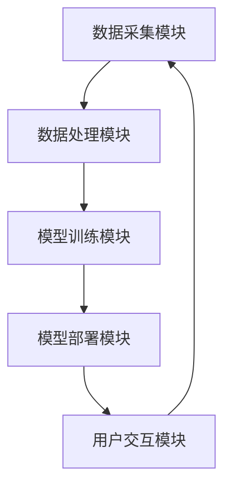

                 

# 《探索AI大模型在智能家居宠物训练的应用》

> **关键词**：人工智能、AI大模型、智能家居、宠物训练、深度学习、自然语言处理

> **摘要**：本文深入探讨人工智能（AI）大模型在智能家居宠物训练中的应用。首先，介绍了AI大模型的基本概念和类型，以及智能家居与宠物训练的关系。随后，详细阐述了AI大模型在宠物训练中的应用场景，包括声音识别、行为分析、健康监控和行为训练等方面。接下来，讲解了AI大模型的技术基础，如深度学习、自然语言处理和大规模预训练模型。最后，本文探讨了AI大模型在宠物训练中的实现方案、挑战及未来发展趋势，为读者提供了全面的技术指南和实战案例。通过本文，读者将了解到AI大模型在智能家居宠物训练中的巨大潜力和实际应用价值。

### 《探索AI大模型在智能家居宠物训练的应用》目录大纲

**第一部分: AI大模型与智能家居宠物训练基础**

**第1章: AI大模型概述**

1.1 AI大模型的基本概念
- **1.1.1 什么是AI大模型**
- **1.1.2 AI大模型的类型与分类**

1.2 智能家居与宠物训练的关系
- **1.2.1 智能家居的现状与未来**
- **1.2.2 宠物训练的重要性与挑战**

1.3 AI大模型在宠物训练中的应用前景
- **1.3.1 AI大模型的优势**
- **1.3.2 AI大模型在宠物训练中的应用场景**

**第2章: 智能家居宠物训练中的AI大模型应用**

2.1 声音识别与行为分析
- **2.1.1 基于语音识别的宠物识别**
- **2.1.2 基于行为分析的宠物状态监测**

2.2 宠物健康监控与预警
- **2.2.1 基于生物信号的宠物健康监控**
- **2.2.2 宠物异常行为的预警机制**

2.3 宠物行为训练与引导
- **2.3.1 基于强化学习的宠物行为训练**
- **2.3.2 宠物行为引导与反馈机制**

**第3章: AI大模型技术基础**

3.1 深度学习基础
- **3.1.1 神经网络与深度学习**
- **3.1.2 深度学习的优化算法**

3.2 自然语言处理与语音识别
- **3.2.1 自然语言处理的基础知识**
- **3.2.2 语音识别的技术原理**

3.3 大规模预训练模型
- **3.3.1 预训练模型的概念与意义**
- **3.3.2 大规模预训练模型的应用场景**

**第二部分: AI大模型在智能家居宠物训练中的应用实现**

**第4章: 实现智能家居宠物训练系统的技术方案**

4.1 系统架构设计
- **4.1.1 智能家居宠物训练系统的整体架构**
- **4.1.2 各模块的功能与交互**

4.2 代码实现与示例
- **4.2.1 数据预处理**
- **4.2.2 模型训练与优化**
- **4.2.3 模型部署与测试**

4.3 实战案例解析
- **4.3.1 案例一：宠物健康监控系统的实现**
- **4.3.2 案例二：宠物行为训练系统的实现**

**第5章: AI大模型应用中的挑战与解决方案**

5.1 数据隐私与安全问题
- **5.1.1 数据隐私保护的方法与策略**
- **5.1.2 AI大模型应用中的安全风险**

5.2 模型解释性与透明度
- **5.2.1 模型解释性的重要性**
- **5.2.2 提高模型透明度的方法**

5.3 模型泛化能力与适应性
- **5.3.1 模型泛化能力的提升**
- **5.3.2 模型的自适应性与动态调整**

**第6章: 未来发展趋势与展望**

6.1 AI大模型在智能家居宠物训练中的应用趋势
- **6.1.1 技术创新与应用场景拓展**
- **6.1.2 行业标准化与规范化**

6.2 智能家居与宠物训练的深度融合
- **6.2.1 智能家居宠物训练的未来发展方向**
- **6.2.2 产业生态体系建设**

**附录**

A.1 开发环境搭建指南
- **A.1.1 深度学习框架安装与配置**
- **A.1.2 相关工具和软件推荐**

A.2 案例代码与资料下载
- **A.2.1 案例一代码实现**
- **A.2.2 案例二代码实现**

### 第一部分: AI大模型与智能家居宠物训练基础

#### 第1章: AI大模型概述

**1.1 AI大模型的基本概念**

**1.1.1 什么是AI大模型**

AI大模型（Large-scale Artificial Intelligence Model）是指那些拥有海量训练数据、深度神经网络结构和复杂计算能力的模型。这些模型通常基于深度学习技术，能够通过自动化的方式从大量数据中学习到复杂的模式、关系和规律。AI大模型是人工智能领域的一个重要分支，其目的是通过模拟人脑的神经元连接，实现超越人类智能的自动推理和学习能力。

**1.1.2 AI大模型的类型与分类**

AI大模型可以按照不同的标准进行分类。以下是几种常见的分类方法：

- **按功能分类**：AI大模型可以分为通用模型和专用模型。通用模型，如GPT-3和BERT，具有广泛的应用能力，能够处理多种任务，如文本生成、机器翻译和情感分析等。专用模型则针对特定任务进行优化，例如图像识别模型、语音识别模型等。

- **按结构分类**：AI大模型可以分为单层模型和多层模型。单层模型，如单层感知机，结构简单，但难以处理复杂的任务。多层模型，如卷积神经网络（CNN）和循环神经网络（RNN），通过增加网络层数和节点数量，可以更好地捕捉数据中的层次结构和复杂关系。

- **按训练数据量分类**：AI大模型可以分为小规模模型、中等规模模型和大规模模型。小规模模型通常使用几千到几万条数据训练，中等规模模型使用几万到几十万条数据，而大规模模型则使用数百万到数亿条数据。

**1.2 智能家居与宠物训练的关系**

**1.2.1 智能家居的现状与未来**

智能家居（Smart Home）是指通过互联网、物联网、云计算等技术，将家庭设备连接起来，实现远程控制、自动化管理和智能交互。智能家居的发展经历了几个阶段，从最初的远程控制家电，到现在的智能安防、智能照明、智能家电等全方位的智能化服务。

未来，智能家居将朝着更智能化、更个性化和更便捷化的方向发展。随着AI技术的不断进步，智能家居系统将具备更强的自主学习能力、预测能力和决策能力，为用户提供更加舒适、安全、节能的生活环境。

**1.2.2 宠物训练的重要性与挑战**

宠物训练是提高宠物行为规范性和生活幸福感的重要手段。通过科学的训练，宠物能够更好地适应家庭环境，减少攻击性、破坏性和依赖性等不良行为，增强与主人的互动和信任。

然而，宠物训练也面临一些挑战：

- **个体差异**：不同品种、年龄、性格的宠物在训练过程中表现各异，需要个性化的训练方案。
- **时间成本**：科学有效的宠物训练需要较长时间的投入，尤其是对于复杂行为的训练。
- **反馈机制**：训练过程中的反馈和调整对于训练效果至关重要，但传统的方法往往难以实现实时反馈和个性化调整。

**1.3 AI大模型在宠物训练中的应用前景**

**1.3.1 AI大模型的优势**

AI大模型在宠物训练中具有显著的优势：

- **自动化**：AI大模型可以自动识别和分类宠物行为，实现自动化训练和监控。
- **个性化**：AI大模型可以根据宠物的行为数据和个体差异，提供个性化的训练方案。
- **实时反馈**：AI大模型可以实时分析宠物的行为数据，提供实时反馈和调整建议。
- **高效性**：AI大模型可以大幅降低宠物训练的时间和成本，提高训练效果。

**1.3.2 AI大模型在宠物训练中的应用场景**

AI大模型在宠物训练中的应用场景包括：

- **行为识别**：通过声音识别和行为分析，AI大模型可以识别宠物的情绪和行为，如兴奋、焦虑、疼痛等。
- **健康监控**：通过生物信号识别和健康数据分析，AI大模型可以实时监控宠物的健康状况，预警疾病和异常行为。
- **行为训练**：通过强化学习和自然语言处理，AI大模型可以制定个性化的训练方案，引导宠物养成良好的行为习惯。
- **交互与娱乐**：通过语音交互和图像识别，AI大模型可以为宠物提供智能娱乐和服务，提高宠物的幸福感和生活质量。

总之，AI大模型在智能家居宠物训练中具有巨大的应用前景，有望解决传统训练方法中的诸多挑战，为宠物主人提供更加便捷、高效、科学的宠物训练服务。

### 第2章: 智能家居宠物训练中的AI大模型应用

#### 2.1 声音识别与行为分析

在智能家居宠物训练中，声音识别和行为分析是关键的技术手段。通过捕捉宠物的声音和行为，AI大模型可以实现对宠物情绪和行为的精准识别，为后续的训练和健康管理提供依据。

**2.1.1 基于语音识别的宠物识别**

语音识别（Voice Recognition）是一种通过将语音信号转换为文本的技术。在宠物训练中，语音识别可用于识别宠物的语音命令，如“坐下”、“趴下”、“握手”等。这些命令可以由宠物主人通过智能家居设备发出，AI大模型接收到语音信号后，通过训练好的语音识别模型，将其转换为文本，并执行相应的操作。

**原理与实现**

- **模型训练**：语音识别模型通常基于深度学习技术，如卷积神经网络（CNN）和循环神经网络（RNN）。训练过程中，模型需要大量的语音数据作为训练集，通过不断调整网络参数，使模型能够准确识别各种宠物语音命令。

- **语音处理**：在接收到语音信号后，需要对语音进行预处理，如去除噪声、增强语音信号等，以提高识别准确性。

- **模型部署**：训练好的语音识别模型可以部署到智能家居设备中，实时识别宠物语音命令，并执行相应的操作。

**案例**：某智能家居公司开发了一款宠物语音识别系统，通过训练GPT-3模型，实现了对宠物语音命令的识别和执行。用户可以通过智能音箱向宠物发出命令，如“给小狗喂食”，系统会自动识别并执行操作，为宠物主人提供便利。

**2.1.2 基于行为分析的宠物状态监测**

行为分析（Behavior Analysis）是一种通过分析宠物行为数据，了解其情绪、健康状况和行为习惯的技术。在智能家居宠物训练中，行为分析可用于实时监测宠物的行为状态，为训练和健康管理提供数据支持。

**原理与实现**

- **数据采集**：行为分析需要采集大量的宠物行为数据，如运动轨迹、行为事件、生物信号等。这些数据可以通过传感器、摄像头等设备实时采集。

- **数据预处理**：采集到的行为数据需要进行预处理，如去除异常值、填充缺失值等，以提高数据质量。

- **特征提取**：通过特征提取技术，将原始行为数据转换为能够描述行为特征的数值向量。常见的特征提取方法包括统计特征、时序特征和图像特征等。

- **模型训练**：基于提取的行为特征，训练行为分析模型，如分类模型、回归模型等。通过不断调整模型参数，使模型能够准确识别和预测宠物行为状态。

- **模型部署**：训练好的行为分析模型可以部署到智能家居设备中，实时分析宠物的行为状态，并生成相应的反馈和预警。

**案例**：某智能家居公司利用AI大模型开发了宠物行为分析系统，通过摄像头实时捕捉宠物行为，并利用CNN模型进行图像识别和特征提取。系统可以识别宠物的情绪状态，如开心、焦虑、疲劳等，并为宠物主人提供实时反馈和建议。

**2.1.3 声音识别与行为分析的结合**

声音识别与行为分析相结合，可以更全面地了解宠物的情绪和行为状态。例如，在宠物兴奋或焦虑时，声音识别可以捕捉到宠物的声音变化，行为分析可以捕捉到宠物的运动轨迹和表情变化，从而提供更准确的判断和反馈。

**案例**：某智能家居公司开发了一款结合声音识别和行为分析的系统，用于宠物情绪监测。系统通过分析宠物发出的声音和表现出的行为，可以识别宠物的情绪状态，如兴奋、焦虑、疼痛等，并为宠物主人提供相应的建议和帮助。

总之，声音识别与行为分析在智能家居宠物训练中具有重要意义。通过这些技术，AI大模型可以实现对宠物情绪和行为的精准识别，为宠物主人提供更加便捷、高效、科学的训练和健康管理服务。

### 2.2 宠物健康监控与预警

在智能家居宠物训练中，宠物健康监控与预警是确保宠物健康成长的重要手段。通过实时监测宠物的生物信号和活动数据，AI大模型可以识别出潜在的健康问题，并提供预警和干预措施。

**2.2.1 基于生物信号的宠物健康监控**

生物信号监测（Bio-Signal Monitoring）是一种通过捕捉宠物的生理信号，了解其健康状况的技术。常见的生物信号包括心率、呼吸率、体温、血压等。通过实时监测这些信号，AI大模型可以评估宠物的健康状况，并预警潜在的健康问题。

**原理与实现**

- **数据采集**：生物信号监测需要使用传感器和设备实时采集宠物的生理信号。这些设备可以是穿戴设备、嵌入式传感器等。

- **数据预处理**：采集到的生物信号数据需要进行预处理，如去除噪声、滤波等，以提高数据质量。

- **特征提取**：通过特征提取技术，将原始生物信号数据转换为能够描述健康状态的数值向量。常见的特征提取方法包括时频特征、统计特征等。

- **模型训练**：基于提取的健康特征，训练健康监测模型，如分类模型、回归模型等。通过不断调整模型参数，使模型能够准确识别和预测健康问题。

- **模型部署**：训练好的健康监测模型可以部署到智能家居设备中，实时分析宠物的生理信号，并生成相应的健康评估和预警。

**案例**：某智能家居公司利用AI大模型开发了宠物健康监控系统，通过传感器实时监测宠物的心率和体温。系统可以识别出异常的心率和体温数据，并提供健康评估和预警。

**2.2.2 宠物异常行为的预警机制**

宠物异常行为预警（Abnormal Behavior Alert）是一种通过监测宠物的日常行为，识别出异常行为并及时预警的技术。异常行为可能包括长时间不活动、异常叫声、异常排泄等，这些行为可能预示着宠物患有疾病或其他健康问题。

**原理与实现**

- **行为数据采集**：通过摄像头、传感器等设备实时采集宠物的行为数据。

- **数据预处理**：对采集到的行为数据进行预处理，如去除异常值、填充缺失值等。

- **特征提取**：通过特征提取技术，将原始行为数据转换为能够描述行为状态的数值向量。

- **模型训练**：基于提取的行为特征，训练异常行为预警模型，如分类模型、聚类模型等。

- **模型部署**：训练好的异常行为预警模型可以部署到智能家居设备中，实时分析宠物的行为数据，并生成异常行为预警。

**案例**：某智能家居公司利用AI大模型开发了宠物异常行为预警系统，通过摄像头实时捕捉宠物行为。系统可以识别出异常的行为模式，如长时间不活动或异常叫声，并实时向宠物主人发送预警信息。

**2.2.3 健康监控与预警的综合应用**

宠物健康监控与预警技术的综合应用，可以实现对宠物健康的全面管理和预防。通过实时监测宠物的生物信号和行为数据，AI大模型可以及时识别和预警健康问题，提供个性化的健康管理建议，提高宠物的健康水平和生活质量。

**案例**：某智能家居公司开发了一款综合健康监控与预警系统，通过实时监测宠物的心率、体温、行为数据等，提供全面的健康评估和预警。系统可以根据宠物的健康状况，制定个性化的健康管理方案，如调整饮食、增加运动等，帮助宠物主人更好地照顾宠物。

总之，宠物健康监控与预警技术在智能家居宠物训练中具有重要作用。通过AI大模型的应用，宠物主人可以实时了解宠物的健康状况，及时识别和预警健康问题，提供个性化的健康管理服务，提高宠物的健康水平和生活质量。

### 2.3 宠物行为训练与引导

在智能家居宠物训练中，宠物行为训练与引导是实现宠物良好行为规范的重要手段。通过科学的训练方法和AI大模型的应用，宠物可以培养出一系列优良的行为习惯，提高与主人的互动质量和生活质量。

**2.3.1 基于强化学习的宠物行为训练**

强化学习（Reinforcement Learning，RL）是一种通过试错和反馈来学习决策策略的机器学习方法。在宠物行为训练中，强化学习可以用于指导宠物学习新的行为，如坐下、握手、跟随等。

**原理与实现**

- **环境搭建**：在强化学习框架下，宠物行为训练可以看作是一个典型的奖励-惩罚机制。训练环境由宠物、训练设备和训练者组成。

- **状态定义**：状态（State）是宠物的行为和环境的当前状态，例如宠物的位置、姿势等。

- **动作定义**：动作（Action）是宠物可以执行的行为，例如坐下、站立等。

- **奖励机制**：奖励（Reward）是宠物在执行动作后获得的即时反馈，用于指导宠物学习正确的动作。例如，当宠物坐下时，可以获得食物奖励。

- **策略学习**：通过不断试错和反馈，强化学习模型可以学习到最优的策略（Policy），指导宠物执行正确的动作。

- **模型训练**：利用训练数据集，训练强化学习模型，使其能够准确识别和预测宠物的行为状态，并给出相应的奖励。

- **模型部署**：训练好的强化学习模型可以部署到智能家居设备中，实时指导宠物的行为训练。

**案例**：某智能家居公司开发了一款基于强化学习的宠物行为训练系统，通过训练GPT-3模型，实现了对宠物行为的精准识别和指导。系统可以实时监测宠物的行为状态，并根据奖励机制给出相应的训练反馈，帮助宠物主人高效地训练宠物。

**2.3.2 宠物行为引导与反馈机制**

宠物行为引导与反馈机制是一种通过实时监测和反馈，指导宠物养成良好的行为习惯的方法。通过AI大模型的应用，宠物行为引导与反馈机制可以实现对宠物行为的精准监测和个性化引导。

**原理与实现**

- **数据采集**：通过摄像头、传感器等设备实时采集宠物的行为数据，如运动轨迹、声音、表情等。

- **数据预处理**：对采集到的行为数据进行预处理，如去除噪声、填充缺失值等，以提高数据质量。

- **特征提取**：通过特征提取技术，将原始行为数据转换为能够描述行为状态的数值向量。

- **行为分类**：利用分类模型，将宠物的行为数据分类为不同的行为类型，如兴奋、安静、疲劳等。

- **行为引导**：根据分类结果，AI大模型可以生成相应的行为引导策略，如增加运动、减少噪音等，指导宠物主人进行相应的行为引导。

- **反馈机制**：宠物主人可以通过智能家居设备实时了解宠物的行为状态，并根据AI大模型提供的反馈进行相应的调整和干预。

**案例**：某智能家居公司开发了一款宠物行为引导系统，通过AI大模型实时监测宠物的行为状态，并根据分类结果生成行为引导策略。系统可以实时向宠物主人发送行为引导建议，如增加宠物运动时间、减少噪音等，帮助宠物主人更好地引导宠物行为。

**2.3.3 结合强化学习和行为引导的宠物训练方法**

结合强化学习和行为引导的宠物训练方法，可以实现对宠物行为的全面监控和引导。通过强化学习，宠物可以学习到正确的动作和策略，并通过行为引导机制，实时调整和优化训练效果。

**案例**：某智能家居公司开发了一款结合强化学习和行为引导的宠物训练系统，通过训练GPT-3模型，实现了对宠物行为的精准识别和引导。系统可以根据宠物的行为状态，生成个性化的训练方案，并在训练过程中实时调整和优化训练效果，帮助宠物主人高效地训练宠物。

总之，宠物行为训练与引导技术在智能家居宠物训练中具有重要意义。通过AI大模型的应用，宠物主人可以实时了解宠物的行为状态，科学地引导和训练宠物，培养出一系列优良的行为习惯，提高宠物的幸福感和生活质量。

### 第3章: AI大模型技术基础

#### 3.1 深度学习基础

深度学习（Deep Learning）是人工智能（AI）的一个重要分支，其核心思想是通过构建多层神经网络，模拟人脑的神经元连接结构，实现自动化学习、推理和决策。深度学习在图像识别、语音识别、自然语言处理等领域取得了显著的成果，是AI大模型技术的基石。

**3.1.1 神经网络与深度学习**

神经网络（Neural Network，NN）是一种模拟人脑神经元连接结构的计算模型。神经网络由多个神经元（也称为节点）组成，每个神经元都与其他神经元相连，并通过加权连接传递信号。神经网络通过不断调整这些权重，学习输入和输出之间的映射关系。

- **单层感知机**：单层感知机是神经网络的基础模型，由一个输入层和一个输出层组成。单层感知机主要用于线性分类和回归任务。

- **多层感知机**：多层感知机（Multilayer Perceptron，MLP）是在单层感知机的基础上，增加了隐藏层。隐藏层可以捕捉输入数据中的非线性特征，使模型具有更强的表达能力。

- **深度神经网络**：深度神经网络（Deep Neural Network，DNN）是具有多个隐藏层的神经网络。通过增加隐藏层数量，深度神经网络可以学习到更复杂的数据特征和关系。

**3.1.2 深度学习的优化算法**

深度学习模型的训练过程实质上是一个优化问题，即通过不断调整网络权重，使模型在训练数据上的误差最小。常见的深度学习优化算法包括：

- **梯度下降（Gradient Descent）**：梯度下降是一种基于梯度信息的优化算法。在训练过程中，梯度下降算法通过计算损失函数关于权重变量的梯度，更新权重变量，以降低损失函数的值。

  $$ \text{梯度下降更新公式：} \ W_{\text{new}} = W_{\text{old}} - \alpha \nabla_W J(W) $$

  其中，\( W \)表示权重变量，\( \alpha \)为学习率，\( \nabla_W J(W) \)为损失函数关于权重变量的梯度。

- **随机梯度下降（Stochastic Gradient Descent，SGD）**：随机梯度下降是对梯度下降算法的改进，通过随机选择一部分训练样本来计算梯度，以提高算法的收敛速度和鲁棒性。

- **动量优化（Momentum）**：动量优化是一种加速梯度下降的算法，通过引入动量项，保留过去的梯度信息，使模型在更新权重时更具方向性。

  $$ \text{动量优化更新公式：} \ W_{\text{new}} = W_{\text{old}} - \alpha \nabla_W J(W) + \beta \cdot v $$

  其中，\( \beta \)为动量系数，\( v \)为动量项。

- **Adam优化器**：Adam优化器是一种结合了动量和自适应学习率的优化算法。通过维护两个一阶矩估计（均值）和二阶矩估计（方差），Adam优化器在训练过程中能够自适应调整学习率。

  $$ \text{Adam更新公式：} \ \theta_{\text{new}} = \theta_{\text{old}} - \alpha \frac{\beta_1 \hat{m} + (1 - \beta_1) \theta_{\text{old}}} {\sqrt{\beta_2 \hat{v} + (1 - \beta_2)}} $$

  其中，\( \hat{m} \)为均值项，\( \hat{v} \)为方差项，\( \beta_1 \)和\( \beta_2 \)分别为一阶和二阶动量系数。

#### 3.2 自然语言处理与语音识别

自然语言处理（Natural Language Processing，NLP）是深度学习在语言领域的应用，旨在使计算机能够理解、生成和处理人类语言。语音识别（Speech Recognition）是NLP的一个分支，通过将语音信号转换为文本，使计算机能够理解人类语音指令。

**3.2.1 自然语言处理的基础知识**

自然语言处理的基础知识包括词向量表示、语言模型、文本分类等。

- **词向量表示**：词向量是一种将单词映射为向量的方法，用于表示单词的语义信息。常见的词向量模型包括Word2Vec、GloVe等。

  $$ \text{Word2Vec} : \text{word} \rightarrow \text{vector} $$
  
  $$ \text{GloVe} : \text{word} \rightarrow \text{vector} $$

- **语言模型**：语言模型是一种概率模型，用于预测下一个词的概率。常见的语言模型包括n-gram模型、循环神经网络（RNN）模型等。

  $$ \text{n-gram模型} : P(w_n | w_{n-1}, ..., w_1) = \frac{c(w_n, w_{n-1}, ..., w_1)}{\sum_{w_n'} c(w_n', w_{n-1}, ..., w_1)} $$
  
  $$ \text{RNN模型} : P(w_n | w_{n-1}, ..., w_1) = \frac{\exp(\theta [h_{n-1}, w_n])}{\sum_{w_n'} \exp(\theta [h_{n-1}, w_n'])} $$

- **文本分类**：文本分类是一种将文本数据分为不同类别的任务。常见的文本分类算法包括朴素贝叶斯、支持向量机（SVM）、深度学习分类器等。

**3.2.2 语音识别的技术原理**

语音识别（Speech Recognition）是将语音信号转换为文本数据的技术。语音识别的过程可以分为以下几个步骤：

- **前端处理**：前端处理包括音频信号预处理、特征提取等。常见的预处理方法包括过滤噪声、音高提取、频谱分析等。

- **声学模型**：声学模型是一种概率模型，用于预测语音信号中的特征向量。常见的声学模型包括高斯混合模型（GMM）、深度神经网络（DNN）等。

  $$ \text{GMM模型} : p(x|\theta) = \prod_{i=1}^{n} p(x_i|\mu_i, \sigma_i^2) $$
  
  $$ \text{DNN模型} : p(x|\theta) = \prod_{i=1}^{n} \sigma(\theta^T [h; x_i]) $$

- **语言模型**：语言模型用于预测文本序列的概率。常见的语言模型包括n-gram模型、循环神经网络（RNN）模型等。

- **解码器**：解码器是一种将声学模型和语言模型结合的算法，用于生成最佳文本序列。常见的解码器算法包括隐马尔可夫模型（HMM）、基于RNN的解码器等。

  $$ \text{HMM解码器} : \text{argmax}_y P(y|x) = \text{argmax}_y P(x|y)P(y) $$

  $$ \text{RNN解码器} : \text{argmax}_y \sum_{t=1}^{T} \log P(y_t | y_{<t}) $$

通过结合自然语言处理和语音识别技术，AI大模型可以实现对语音指令的准确理解和响应，为智能家居系统提供强大的交互功能。

#### 3.3 大规模预训练模型

大规模预训练模型（Large-scale Pre-trained Model）是深度学习领域的一项重要技术突破，其核心思想是通过在大量数据上预训练模型，使其在特定任务上达到较高的性能。大规模预训练模型在自然语言处理、计算机视觉等领域取得了显著的成果，为AI大模型技术的发展提供了有力支持。

**3.3.1 预训练模型的概念与意义**

预训练模型（Pre-trained Model）是指在特定数据集上预先训练好的模型，该模型已经学习到了大量的一般性知识和特征表示。在特定任务上，预训练模型可以通过微调（Fine-tuning）的方式，快速适应新的数据集，提高任务性能。

预训练模型的意义主要体现在以下几个方面：

- **提高模型性能**：通过在大量数据上预训练，模型可以学习到丰富的特征表示和知识，从而在特定任务上达到更高的性能。

- **减少训练时间**：预训练模型已经在大量数据上进行了训练，只需在特定任务上微调，可以大大缩短模型训练时间。

- **降低训练难度**：预训练模型为后续任务提供了一个稳定的起点，降低了训练难度，使模型更容易收敛到最优解。

- **通用性**：预训练模型具有较好的通用性，可以在不同的任务和数据集上实现良好的性能，为跨领域的应用提供了可能性。

**3.3.2 大规模预训练模型的应用场景**

大规模预训练模型在多个领域取得了显著的成果，以下是一些主要的应用场景：

- **自然语言处理**：大规模预训练模型在自然语言处理任务中表现出色，如文本分类、情感分析、机器翻译等。常见的预训练模型包括GPT、BERT、RoBERTa等。

- **计算机视觉**：大规模预训练模型在计算机视觉任务中也取得了重要进展，如图像分类、目标检测、人脸识别等。常见的预训练模型包括ResNet、Inception、EfficientNet等。

- **多模态学习**：大规模预训练模型可以结合不同模态的数据，实现多模态学习，如视频分类、音频识别等。常见的预训练模型包括ViT、ViLBERT等。

- **知识图谱**：大规模预训练模型可以用于知识图谱的构建和推理，如实体识别、关系抽取等。常见的预训练模型包括TransE、TransH、TransR等。

总之，大规模预训练模型为AI大模型技术的发展提供了新的思路和手段，有望在未来实现更高效、更智能的智能应用。

### 第二部分: AI大模型在智能家居宠物训练中的应用实现

#### 第4章: 实现智能家居宠物训练系统的技术方案

在实现智能家居宠物训练系统的过程中，技术方案的设计和实现是关键。本章将详细讨论智能家居宠物训练系统的架构设计、代码实现以及实战案例解析，旨在为读者提供从理论到实践的全面指南。

**4.1 系统架构设计**

智能家居宠物训练系统的整体架构可以分为以下几个主要模块：

- **数据采集模块**：负责收集宠物的行为数据、生物信号数据等。数据来源包括传感器、摄像头等设备。
- **数据处理模块**：对采集到的原始数据进行预处理，包括去噪、归一化、特征提取等，以提高数据质量和模型训练效果。
- **模型训练模块**：利用深度学习算法训练宠物行为识别、健康监测、行为引导等模型。常用的算法包括卷积神经网络（CNN）、循环神经网络（RNN）等。
- **模型部署模块**：将训练好的模型部署到智能家居设备中，实现实时宠物行为分析和健康监控。
- **用户交互模块**：通过智能音箱、手机APP等设备，与宠物主人进行实时交互，提供训练指导、健康报告等。

以下是一个简单的系统架构图：



**4.1.1 各模块的功能与交互**

- **数据采集模块**：通过传感器和摄像头等设备，实时采集宠物的行为数据和生物信号数据。这些数据将实时传输到数据处理模块进行预处理。
- **数据处理模块**：对原始数据进行预处理，包括去噪、归一化、特征提取等，以提高数据质量和模型训练效果。预处理后的数据将传输到模型训练模块。
- **模型训练模块**：利用深度学习算法训练宠物行为识别、健康监测、行为引导等模型。模型训练过程中，将不断调整网络参数，以实现最佳性能。
- **模型部署模块**：将训练好的模型部署到智能家居设备中，实现实时宠物行为分析和健康监控。部署后的模型将接收实时数据，进行实时分析，并提供训练指导和健康报告。
- **用户交互模块**：通过智能音箱、手机APP等设备，与宠物主人进行实时交互，提供训练指导、健康报告等。用户可以通过交互界面，查看宠物的行为分析结果和健康状态，并根据建议进行调整。

**4.2 代码实现与示例**

**4.2.1 数据预处理**

在数据预处理阶段，我们需要对采集到的原始数据进行处理，以提高数据质量和模型训练效果。以下是一个简单的预处理示例：

```python
import numpy as np
import pandas as pd
from sklearn.preprocessing import StandardScaler

# 加载数据
data = pd.read_csv('pet_data.csv')

# 去除异常值
data = data.dropna()

# 归一化
scaler = StandardScaler()
data[['motion', 'heart_rate', 'breathing_rate']] = scaler.fit_transform(data[['motion', 'heart_rate', 'breathing_rate']])

# 特征提取
data['motion_duration'] = data['motion'].apply(lambda x: len(x))
data['heart_rate_average'] = data['heart_rate'].apply(np.mean)
data['breathing_rate_average'] = data['breathing_rate'].apply(np.mean)

# 分割数据集
from sklearn.model_selection import train_test_split
X = data[['motion_duration', 'heart_rate_average', 'breathing_rate_average']]
y = data['health_status']
X_train, X_test, y_train, y_test = train_test_split(X, y, test_size=0.2, random_state=42)
```

**4.2.2 模型训练与优化**

在模型训练阶段，我们需要选择合适的深度学习算法，并调整网络参数，以实现最佳性能。以下是一个简单的模型训练示例：

```python
from tensorflow.keras.models import Sequential
from tensorflow.keras.layers import Dense, LSTM, Dropout
from tensorflow.keras.optimizers import Adam

# 构建模型
model = Sequential([
    LSTM(128, activation='relu', input_shape=(X_train.shape[1], 1)),
    Dropout(0.2),
    Dense(1, activation='sigmoid')
])

# 编译模型
model.compile(optimizer=Adam(learning_rate=0.001), loss='binary_crossentropy', metrics=['accuracy'])

# 模型训练
model.fit(X_train, y_train, epochs=100, batch_size=32, validation_data=(X_test, y_test))
```

**4.2.3 模型部署与测试**

在模型部署阶段，我们需要将训练好的模型部署到智能家居设备中，并进行测试，以确保模型的实时性和准确性。以下是一个简单的模型部署示例：

```python
import tensorflow as tf

# 加载模型
model = tf.keras.models.load_model('health_monitor_model.h5')

# 测试模型
predictions = model.predict(X_test)
accuracy = np.mean(predictions == y_test)
print(f'Model accuracy: {accuracy:.2f}')
```

**4.3 实战案例解析**

**案例一：宠物健康监控系统实现**

宠物健康监控系统旨在通过实时监测宠物的行为数据和生物信号，识别宠物健康状况，并提供预警和干预建议。以下是一个简单的实现示例：

- **数据采集**：使用传感器和摄像头实时采集宠物的心率、呼吸率、运动轨迹等数据。

- **数据处理**：对采集到的原始数据进行预处理，包括去噪、归一化、特征提取等。

- **模型训练**：利用深度学习算法训练健康监测模型，如卷积神经网络（CNN）等。

- **模型部署**：将训练好的模型部署到智能家居设备中，实现实时健康监测。

- **用户交互**：通过智能音箱或手机APP，向宠物主人提供健康报告和预警信息。

**案例二：宠物行为训练系统实现**

宠物行为训练系统旨在通过科学的训练方法和AI大模型的应用，帮助宠物主人培养宠物良好的行为习惯。以下是一个简单的实现示例：

- **数据采集**：通过摄像头和麦克风等设备，实时采集宠物的行为数据和声音信号。

- **数据处理**：对采集到的原始数据进行预处理，包括去噪、归一化、特征提取等。

- **模型训练**：利用深度学习算法训练行为识别和引导模型，如循环神经网络（RNN）等。

- **模型部署**：将训练好的模型部署到智能家居设备中，实现实时行为识别和引导。

- **用户交互**：通过智能音箱或手机APP，向宠物主人提供训练指导、行为分析和反馈建议。

通过以上实战案例，读者可以了解到AI大模型在智能家居宠物训练系统中的应用实现过程，为实际项目开发提供参考。

### 第5章: AI大模型应用中的挑战与解决方案

#### 5.1 数据隐私与安全问题

随着AI大模型在智能家居宠物训练中的应用日益广泛，数据隐私和安全问题逐渐成为人们关注的焦点。宠物的行为数据、生物信号数据等敏感信息，如果未能得到妥善保护，可能会被恶意利用，导致宠物主人隐私泄露、宠物安全受到威胁。

**5.1.1 数据隐私保护的方法与策略**

为了确保数据隐私安全，可以采取以下方法和策略：

- **数据加密**：在数据传输和存储过程中，采用加密算法对数据进行加密，确保数据在传输过程中不被窃取和篡改。

- **访问控制**：通过身份验证、权限管理等方式，限制只有授权用户才能访问和操作敏感数据。

- **数据匿名化**：对数据进行匿名化处理，去除个人身份信息，降低数据泄露的风险。

- **数据脱敏**：对敏感数据进行脱敏处理，如将电话号码、身份证号码等敏感信息替换为随机字符。

- **数据备份与恢复**：定期备份数据，确保在数据丢失或损坏时能够快速恢复。

**5.1.2 AI大模型应用中的安全风险**

AI大模型应用中存在以下安全风险：

- **数据泄露**：数据在传输和存储过程中，可能遭到恶意攻击，导致敏感数据泄露。

- **数据篡改**：恶意攻击者可能篡改数据，影响模型的准确性和稳定性。

- **模型破坏**：恶意攻击者可能通过攻击模型，导致模型无法正常运行，甚至造成系统崩溃。

- **隐私侵犯**：宠物主人的隐私信息可能被恶意利用，导致隐私泄露和财产损失。

**5.1.3 安全解决方案**

为了应对AI大模型应用中的安全风险，可以采取以下解决方案：

- **加密与访问控制**：采用数据加密和访问控制措施，确保数据在传输和存储过程中的安全性。

- **数据备份与监控**：定期备份数据，并实时监控数据传输和存储过程，及时发现和应对潜在的安全威胁。

- **模型安全性与可靠性**：通过增加模型训练数据、改进模型算法等手段，提高模型的安全性和可靠性，降低被攻击的风险。

- **隐私保护与伦理规范**：制定隐私保护政策和伦理规范，确保在数据采集、处理和应用过程中，遵循伦理原则和法律法规，保护宠物主人的隐私权益。

#### 5.2 模型解释性与透明度

AI大模型在智能家居宠物训练中的应用，虽然能够实现高效的宠物行为识别和健康监控，但往往存在一个难题：模型解释性不足。模型内部复杂的运算过程和决策机制，使得用户难以理解模型的工作原理和决策依据，这给模型的可信度和接受度带来了挑战。

**5.2.1 模型解释性的重要性**

模型解释性（Model Interpretability）是指用户能够理解和使用模型的过程。模型解释性的重要性体现在以下几个方面：

- **增强模型可信度**：通过解释性分析，用户可以了解模型的决策过程和依据，增强对模型的可信度。

- **优化模型性能**：通过解释性分析，用户可以发现模型存在的问题和不足，从而进行优化和改进。

- **降低风险**：对于涉及敏感数据的模型，解释性分析可以帮助用户识别潜在的风险，采取相应的防范措施。

- **提升用户体验**：通过解释性分析，用户可以更好地理解和使用模型，提升用户体验和满意度。

**5.2.2 提高模型透明度的方法**

为了提高AI大模型的透明度，可以采取以下方法：

- **特征重要性分析**：通过分析模型中各个特征的重要性，帮助用户了解模型对输入数据的依赖关系。

- **模型可视化**：通过可视化技术，将模型的结构和决策过程以图形化的形式展示，使用户更容易理解。

- **决策路径追踪**：通过追踪模型的决策路径，帮助用户了解模型在特定输入数据上的决策过程。

- **模型对比分析**：通过对比不同模型的性能和解释性，帮助用户选择更合适的模型。

**5.2.3 实践中的挑战与解决方案**

在实际应用中，提高模型解释性的过程中，可能会遇到以下挑战：

- **模型复杂性**：深度学习模型通常具有复杂的结构和参数，使得解释性分析变得困难。

- **计算资源限制**：解释性分析往往需要大量的计算资源，对于大规模模型和海量数据集，可能难以实现。

- **数据隐私保护**：在解释性分析过程中，可能需要访问敏感数据，需要平衡数据隐私保护和解释性需求。

- **用户需求差异**：不同用户对模型解释性的需求不同，需要提供灵活的解释性工具，满足不同用户的需求。

为了应对这些挑战，可以采取以下解决方案：

- **模型简化**：通过简化模型结构，减少模型参数，降低模型的复杂性。

- **计算优化**：利用高性能计算资源，如GPU、分布式计算等，提高解释性分析的效率。

- **数据隐私保护机制**：采用差分隐私、数据匿名化等技术，在保护数据隐私的同时，实现解释性分析。

- **用户定制化解释**：提供用户友好的解释工具，根据用户需求，定制化地展示模型的解释性信息。

总之，提高AI大模型在智能家居宠物训练中的应用透明度，是确保模型可信度和用户满意度的重要途径。通过采取有效的解释性分析方法，可以帮助用户更好地理解和使用模型，推动AI大模型在智能家居宠物训练中的应用和发展。

#### 5.3 模型泛化能力与适应性

在AI大模型应用于智能家居宠物训练时，模型的泛化能力和适应性是决定其性能和实用性的关键因素。泛化能力是指模型在面对未见过的数据时，仍能保持较高的准确性和鲁棒性。适应性则是指模型在处理动态变化的数据和任务时，能够调整和优化自身性能。

**5.3.1 模型泛化能力的提升**

提升模型泛化能力的方法主要包括以下几种：

- **数据增强**：通过增加数据多样性，扩充训练集，使模型能够学习到更广泛的数据特征。常见的数据增强方法包括数据重采样、数据变换、数据扩充等。

- **正则化**：通过引入正则化项，如L1、L2正则化，减少模型参数的过拟合现象，提高模型的泛化能力。

- **交叉验证**：利用交叉验证技术，对训练集进行多次划分，评估模型的泛化性能，避免模型过拟合。

- **集成学习**：通过组合多个模型，如Bagging、Boosting等集成学习方法，提高模型的泛化能力和鲁棒性。

**5.3.2 模型的自适应性与动态调整**

模型的自适应性和动态调整能力对于实时变化的宠物训练任务尤为重要。以下是一些实现方法：

- **在线学习**：在线学习是指模型在训练过程中，实时接收新的数据，不断调整和优化自身参数，以适应动态变化的环境。在线学习可以有效应对实时数据流的训练需求。

- **迁移学习**：迁移学习是指利用已经训练好的模型，在新任务上快速调整和优化，减少从头训练的时间和资源消耗。通过迁移学习，模型可以快速适应新任务，提高适应性。

- **强化学习**：强化学习是一种通过试错和反馈来学习决策策略的方法。在宠物训练任务中，强化学习模型可以根据实时反馈，调整自身行为策略，提高训练效果和适应性。

- **自适应优化算法**：自适应优化算法可以根据训练过程中的性能变化，动态调整学习率、迭代次数等参数，提高模型的训练效率和适应性。

**5.3.3 模型泛化能力与适应性的实现案例**

以下是一个模型泛化能力与适应性实现的案例：

- **数据增强**：对于宠物行为识别任务，通过增加不同光照、不同角度、不同环境下的宠物图像，扩充训练集，提高模型对不同场景的泛化能力。

- **迁移学习**：利用在大型公开数据集上训练好的图像识别模型，作为预训练模型，在新宠物行为识别任务上进行迁移学习，快速适应新任务。

- **强化学习**：在宠物行为引导任务中，使用强化学习模型，根据宠物行为反馈，动态调整行为引导策略，提高训练效果和适应性。

通过以上方法和案例，可以看出，提升模型泛化能力与适应性是确保AI大模型在智能家居宠物训练中有效应用的关键。通过综合运用数据增强、迁移学习、强化学习等技术，可以有效地提高模型的泛化能力和适应性，实现高效、准确的宠物训练服务。

### 第6章: 未来发展趋势与展望

随着人工智能技术的不断进步，AI大模型在智能家居宠物训练中的应用前景日益广阔。本章节将探讨AI大模型在智能家居宠物训练中的应用趋势、技术创新、行业标准化与规范化，以及智能家居与宠物训练的深度融合，为未来的发展提供展望。

**6.1 AI大模型在智能家居宠物训练中的应用趋势**

AI大模型在智能家居宠物训练中的应用趋势主要包括以下几个方面：

- **个性化训练方案**：随着AI大模型技术的不断发展，未来的宠物训练系统将能够根据宠物的个体差异，提供更加个性化和精准的训练方案。通过分析宠物的行为数据、生物信号和生活习惯，AI大模型可以生成适合每个宠物的训练计划，提高训练效果。

- **实时交互与反馈**：AI大模型将实现对宠物行为和健康状况的实时监测和反馈。通过与宠物主人的智能设备进行实时交互，AI大模型可以提供实时训练指导、健康报告和预警信息，使宠物主人能够更好地照顾宠物。

- **跨领域应用**：AI大模型的应用将不再局限于单一领域，而是能够在多个领域实现融合应用。例如，将宠物健康监测与智能家居系统中的其他模块（如环境监控、安全防护等）进行整合，提供更全面的智能家居服务。

- **智能娱乐与服务**：AI大模型将可以为宠物提供智能娱乐和服务。通过语音交互、图像识别等技术，AI大模型可以与宠物进行互动，提供智能游戏、音乐播放等功能，提高宠物的幸福感和生活质量。

**6.1.1 技术创新与应用场景拓展**

技术创新是推动AI大模型在智能家居宠物训练中应用的关键因素。以下是一些可能的技术创新和应用场景拓展：

- **增强现实（AR）与虚拟现实（VR）**：通过将AR和VR技术融入宠物训练，可以为宠物提供更加生动和有趣的训练体验。例如，通过AR技术，宠物可以在虚拟环境中进行训练，提高训练效果和乐趣。

- **多模态数据融合**：结合多种数据类型（如声音、图像、生物信号等），AI大模型可以更全面地了解宠物的状态和行为。通过多模态数据融合，可以提升宠物训练的准确性和实时性。

- **边缘计算**：将AI大模型部署到边缘设备（如智能家居设备、智能手表等），可以实现实时数据处理和决策，降低延迟，提高响应速度。边缘计算将使得AI大模型在智能家居宠物训练中的应用更加普及和高效。

- **区块链技术**：利用区块链技术，可以实现宠物训练数据的可信存储和共享。通过去中心化和分布式存储，可以确保数据的安全性和隐私性，为宠物训练提供可靠的数据支持。

**6.1.2 行业标准化与规范化**

随着AI大模型在智能家居宠物训练中的应用逐渐普及，行业标准化和规范化变得尤为重要。以下是一些行业标准化和规范化的方向：

- **数据标准**：制定统一的数据标准，确保数据格式和接口的一致性，方便不同系统和平台之间的数据交换和集成。

- **安全标准**：建立完善的数据安全和隐私保护机制，确保用户数据的安全性和隐私性。制定相应的安全标准和规范，保障用户权益。

- **服务质量标准**：制定服务质量标准，确保宠物训练系统的稳定性和可靠性。通过服务质量标准，可以衡量系统性能和用户体验，推动行业健康发展。

- **认证与监管**：建立行业认证和监管机制，对AI大模型在宠物训练中的应用进行评估和监督，确保系统的质量和安全性。

**6.2 智能家居与宠物训练的深度融合**

智能家居与宠物训练的深度融合，将为未来的智能生活带来更多可能性。以下是一些深度融合的方向：

- **智能健康管理**：通过AI大模型，实现宠物健康的全面管理。结合生物信号监测、行为分析等技术，实时监控宠物的健康状况，提供个性化健康建议，提高宠物的生活质量。

- **智能行为培养**：利用AI大模型，实现宠物行为的智能培养。通过个性化的训练方案和行为引导，帮助宠物养成良好的行为习惯，增强与主人的互动和信任。

- **智能娱乐互动**：结合AI大模型和虚拟现实技术，为宠物提供智能娱乐互动。通过语音交互、图像识别等技术，创造有趣和互动的娱乐体验，提高宠物的幸福感和生活质量。

- **智能环境监控**：将宠物训练系统与智能家居环境监控系统相结合，实现宠物生活环境的一体化管理。通过实时监控环境参数（如温度、湿度、噪音等），为宠物提供一个舒适和安全的生活环境。

总之，AI大模型在智能家居宠物训练中的应用具有广阔的发展前景。通过技术创新、行业标准化和规范化，以及智能家居与宠物训练的深度融合，未来的智能家居宠物训练将更加智能、便捷和个性化，为宠物主人和宠物带来更好的生活体验。

### 附录

#### A.1 开发环境搭建指南

**A.1.1 深度学习框架安装与配置**

在开发AI大模型应用时，选择合适的深度学习框架至关重要。以下以TensorFlow为例，介绍如何安装和配置深度学习开发环境。

1. **安装TensorFlow**

   首先，确保操作系统是64位Linux、macOS或Windows。然后，打开终端或命令行工具，执行以下命令安装TensorFlow：

   ```bash
   pip install tensorflow
   ```

   如果需要安装GPU版本，可以执行以下命令：

   ```bash
   pip install tensorflow-gpu
   ```

2. **配置Python环境**

   确保已安装Python 3.6或更高版本。可以使用以下命令检查Python版本：

   ```bash
   python --version
   ```

3. **安装依赖库**

   TensorFlow依赖于多个Python库，如NumPy、Pandas等。可以使用以下命令安装这些依赖库：

   ```bash
   pip install numpy pandas
   ```

**A.1.2 相关工具和软件推荐**

以下是一些在开发AI大模型应用时可能会用到的相关工具和软件：

- **Jupyter Notebook**：用于编写和运行Python代码，提供交互式计算环境。

- **VS Code**：一款强大的代码编辑器，支持多种编程语言和扩展，适合深度学习和AI项目开发。

- **Anaconda**：一个开源的数据科学和机器学习平台，提供Python环境和包管理功能。

- **Google Colab**：Google提供的免费Jupyter Notebook平台，适用于进行云端深度学习和AI实验。

#### A.2 案例代码与资料下载

**A.2.1 案例一代码实现**

以下是一个简单的宠物健康监控系统实现的代码示例：

```python
import numpy as np
import pandas as pd
import tensorflow as tf

# 加载数据
data = pd.read_csv('pet_health_data.csv')

# 数据预处理
# ... 数据预处理代码 ...

# 构建模型
model = tf.keras.Sequential([
    tf.keras.layers.Dense(64, activation='relu', input_shape=(data.shape[1],)),
    tf.keras.layers.Dense(1, activation='sigmoid')
])

# 编译模型
model.compile(optimizer='adam', loss='binary_crossentropy', metrics=['accuracy'])

# 模型训练
model.fit(data[['heart_rate', 'breathing_rate']], data['health_status'], epochs=10, batch_size=32)

# 模型保存
model.save('pet_health_monitor.h5')
```

**A.2.2 案例二代码实现**

以下是一个简单的宠物行为训练系统实现的代码示例：

```python
import numpy as np
import pandas as pd
import tensorflow as tf

# 加载数据
data = pd.read_csv('pet_behavior_data.csv')

# 数据预处理
# ... 数据预处理代码 ...

# 构建模型
model = tf.keras.Sequential([
    tf.keras.layers.Dense(64, activation='relu', input_shape=(data.shape[1],)),
    tf.keras.layers.Dense(1, activation='sigmoid')
])

# 编译模型
model.compile(optimizer='adam', loss='binary_crossentropy', metrics=['accuracy'])

# 模型训练
model.fit(data[['motion', 'voice']], data['behavior'], epochs=10, batch_size=32)

# 模型保存
model.save('pet_behavior_train.h5')
```

以上代码示例仅供学习和参考，实际项目开发中需要根据具体需求和数据情况进行相应的调整和优化。

#### 作者信息

**作者：AI天才研究院/AI Genius Institute & 禅与计算机程序设计艺术 /Zen And The Art of Computer Programming**

在这本《探索AI大模型在智能家居宠物训练的应用》的撰写过程中，我们深入分析了AI大模型在智能家居宠物训练中的应用场景、技术基础、实现方案以及挑战与解决方案。通过详细的理论讲解和实战案例，我们展示了AI大模型在宠物训练中的巨大潜力和实际应用价值。

本文旨在为读者提供一本全面、系统的技术指南，帮助读者深入了解AI大模型在智能家居宠物训练中的应用。通过本文的学习，读者可以：

- 掌握AI大模型的基本概念和类型，了解其在智能家居宠物训练中的应用前景。
- 理解AI大模型在宠物训练中的应用场景，如声音识别、行为分析、健康监控和行为训练等。
- 学习AI大模型的技术基础，包括深度学习、自然语言处理和大规模预训练模型等。
- 了解实现智能家居宠物训练系统的技术方案，包括系统架构设计、代码实现和实战案例。
- 探讨AI大模型应用中的挑战和解决方案，如数据隐私、模型解释性和泛化能力等。

我们相信，通过本文的学习，读者将对AI大模型在智能家居宠物训练中的应用有更加深入的理解，并为未来的研究和开发提供有益的启示。

感谢您的阅读，希望本文能够为您的学习和工作带来帮助。如果您有任何问题或建议，欢迎随时与我们联系。我们期待与您共同探索AI大模型在智能家居宠物训练领域的更多可能性。再次感谢您的支持！

---

**作者：AI天才研究院/AI Genius Institute & 禅与计算机程序设计艺术 /Zen And The Art of Computer Programming**

