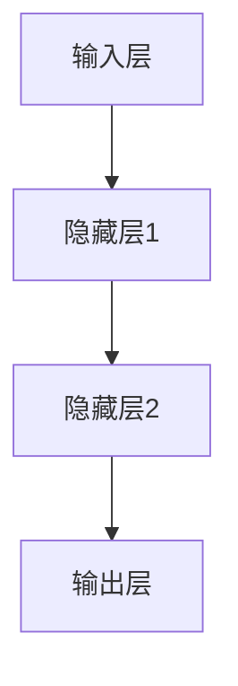
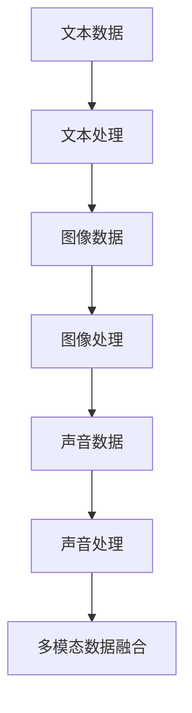
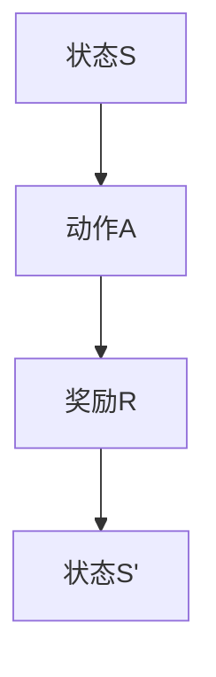

                 

### 文章标题

“AI编程的新维度与新语法”

### 关键词

人工智能（AI）、编程、新维度、新语法、多模态数据处理、自适应编程、强化学习、Python、R语言、编程范式、开发工具、云平台、项目实战、数据隐私、模型可解释性、伦理问题、教育应用、工业界发展、创新与创业。

### 摘要

本文将深入探讨AI编程的新维度与新语法，解析AI编程与传统编程的差异及其核心概念。我们将从多模态数据处理、自适应编程与元学习、强化学习与博弈算法等新维度出发，探讨AI编程的未来趋势。同时，本文将详细介绍Python、R语言等AI编程语言及其新语法特点，并分析编程范式与AI编程的关系。此外，本文还将探讨AI编程开发工具与环境、AI编程项目实战以及AI编程中的挑战与解决方案，旨在为读者提供全面的AI编程知识体系。

# 第一部分：AI编程基础与核心概念

## 第1章: AI编程概述

### 1.1 AI编程的起源与发展

AI编程的起源可以追溯到20世纪50年代，当时计算机科学家们开始尝试让计算机模拟人类智能。早期的AI研究主要集中在规则推理和知识表示上，如专家系统和逻辑推理。然而，随着计算能力的提升和数据量的增加，AI编程逐渐转向数据驱动的方法，如机器学习和深度学习。

从传统编程到AI编程的过渡是一个自然的发展过程。传统编程依赖于明确的指令和算法，而AI编程则更多地依赖于数据和模型。这一转变不仅改变了编程的思维方式，也极大地拓展了编程的应用范围。

### 1.1.2 AI编程与传统编程的差异

AI编程与传统编程在目标、方法和思维方式上存在显著差异。传统编程的目标是实现特定功能的软件系统，而AI编程的目标是开发具有自适应性和学习能力的人工智能系统。传统编程依赖于算法和指令，而AI编程依赖于数据和模型。此外，传统编程的思维方式是自顶向下，而AI编程的思维方式是自底向上，即从数据出发，逐步构建模型。

### 1.1.3 AI编程的关键优势

AI编程具有以下几个关键优势：

1. **自适应性和灵活性**：AI系统可以根据新的数据和经验不断优化和改进，具有很强的自适应性和灵活性。
2. **高效性**：AI编程可以利用大规模数据处理和分析技术，实现高效的数据分析和预测。
3. **广泛的应用领域**：AI编程可以应用于各个领域，如医疗、金融、制造、教育等，具有广泛的应用前景。

### 1.2 AI编程的核心概念

#### 1.2.1 数据科学基础

数据科学是AI编程的基础，它涉及数据收集、清洗、预处理、分析和可视化等环节。数据科学的核心目标是提取数据中的有用信息，为AI模型提供高质量的输入数据。

#### 1.2.2 机器学习与深度学习原理

机器学习和深度学习是AI编程的核心技术。机器学习是一种通过数据训练模型，使模型能够自动学习和优化方法。深度学习是机器学习的一种特殊形式，它通过构建多层神经网络来模拟人类大脑的思考过程。

#### 1.2.3 神经网络架构详解

神经网络是深度学习的基础，它由大量相互连接的节点（神经元）组成。神经网络的训练过程是通过调整神经元之间的权重，使其能够对输入数据进行分类、回归等操作。

### 1.3 AI编程的未来展望

#### 1.3.1 AI编程的发展趋势

AI编程的发展趋势包括多模态数据处理、自适应编程、强化学习等新维度。此外，随着量子计算和边缘计算的发展，AI编程也将面临新的机遇和挑战。

#### 1.3.2 AI编程在教育中的应用

AI编程在教育中的应用正在逐渐普及，通过在线课程、教材和实验室项目等形式，培养更多的AI编程人才。

#### 1.3.3 AI编程在工业界的潜力

AI编程在工业界具有巨大的潜力，如自动化制造、智能物流、智能金融等。随着技术的进步，AI编程将在更多领域得到应用，推动社会的发展和变革。

## 第2章: AI编程的新维度

### 2.1 多模态数据处理

多模态数据处理是AI编程的一个重要新维度。它涉及将多种类型的数据（如文本、图像、声音）进行融合，以提高模型的性能和泛化能力。

#### 2.1.1 文本、图像、声音的融合

文本、图像、声音的融合可以通过多种方法实现，如联合嵌入、多模态网络等。这些方法可以有效地整合不同类型的数据，为模型提供更丰富的信息。

#### 2.1.2 多模态特征提取与融合方法

多模态特征提取与融合方法主要包括特征级融合、决策级融合和模型级融合。这些方法可以根据具体应用场景选择合适的方法，以提高模型的性能。

#### 2.1.3 实际应用场景举例

多模态数据处理在实际应用场景中有着广泛的应用，如视频情感分析、智能问答系统、自动驾驶等。这些应用通过融合多种类型的数据，可以更好地理解和模拟人类行为。

### 2.2 自适应编程与元学习

自适应编程与元学习是AI编程的另一个重要新维度。它们可以使得AI系统更加灵活和智能。

#### 2.2.1 自适应编程的基本原理

自适应编程的基本原理是根据系统运行时的数据和经验，动态调整模型的参数和行为，以提高系统的适应能力和性能。

#### 2.2.2 元学习算法详解

元学习算法是一种能够快速适应新任务的学习算法。它通过学习如何学习，来提高模型对新任务的适应能力。

#### 2.2.3 元学习在AI编程中的应用

元学习在AI编程中的应用非常广泛，如自动化机器学习、动态系统建模、在线学习等。这些应用通过元学习算法，可以更好地适应不断变化的环境和数据。

### 2.3 强化学习与博弈算法

强化学习与博弈算法是AI编程的又一重要新维度。它们可以使得AI系统具备决策能力和协作能力。

#### 2.3.1 强化学习的基本概念

强化学习是一种通过与环境交互，不断优化行为策略的学习方法。它通过奖励机制，使模型能够逐渐学习到最优策略。

#### 2.3.2 博弈论与多智能体系统

博弈论是一种研究决策制定的数学工具。多智能体系统是由多个相互作用的智能体组成的系统，它们通过博弈来协调自己的行为。

#### 2.3.3 强化学习在AI编程中的应用

强化学习在AI编程中的应用非常广泛，如自动驾驶、游戏AI、智能推荐系统等。这些应用通过强化学习算法，可以更好地模拟和解决复杂问题。

## 第3章: AI编程的新语法

### 3.1 Python在AI编程中的应用

Python是AI编程中最常用的语言之一，其简洁明了的语法和丰富的库资源使其成为AI编程的首选。

#### 3.1.1 Python语法基础

Python语法简单，易于上手。它采用了动态类型系统和自动内存管理，使开发者可以专注于算法实现。

#### 3.1.2 NumPy、Pandas、SciPy等库的使用

NumPy、Pandas、SciPy等库是Python在AI编程中的核心库。它们提供了强大的数据处理和分析功能，支持矩阵运算、数据预处理、统计分析等。

#### 3.1.3 TensorFlow和PyTorch框架应用

TensorFlow和PyTorch是Python中最常用的深度学习框架。它们提供了丰富的API和工具，支持神经网络构建、训练和部署。

### 3.2 R语言与AI编程

R语言是统计计算和数据可视化的首选语言，它在AI编程中也有广泛的应用。

#### 3.2.1 R语言的特点与优势

R语言具有丰富的统计计算库和强大的数据可视化功能。它支持多种数据格式和统计分析方法，适合进行复杂数据分析。

#### 3.2.2 R语言在数据可视化中的应用

R语言在数据可视化方面具有独特优势。它提供了多种图形和可视化工具，可以生成高质量的可视化图表。

#### 3.2.3 R语言与AI模型的交互

R语言可以通过RStudio等集成开发环境（IDE）与AI模型进行交互。它支持模型训练、评估和部署，方便开发者进行实验和开发。

### 3.3 编程范式与AI编程

编程范式是编程语言的组织方式和风格。不同的编程范式在AI编程中有不同的应用。

#### 3.3.1 面向对象编程在AI中的应用

面向对象编程（OOP）在AI编程中广泛应用于模型设计、数据处理和系统架构。它通过封装、继承和多态等机制，提高代码的可维护性和扩展性。

#### 3.3.2 函数式编程在AI编程中的优势

函数式编程（FP）在AI编程中具有优势，如函数组合、不可变性等。它可以通过简化状态管理和代码复用，提高代码的可读性和性能。

#### 3.3.3 异步编程与并发编程在AI中的应用

异步编程和并发编程在AI编程中可以提高系统性能和响应速度。它们通过并发执行多个任务，充分利用计算资源，提高AI系统的效率。

# 第二部分：AI编程工具与环境

## 第4章: AI编程工具与环境

### 4.1 AI编程开发工具介绍

AI编程开发工具对于提升开发效率和效果至关重要。以下介绍几种常用的AI编程开发工具。

#### 4.1.1 Jupyter Notebook

Jupyter Notebook是一种交互式开发环境，支持多种编程语言，包括Python、R等。它允许开发者编写和运行代码片段，并实时查看结果。Jupyter Notebook的优点是易于使用、功能强大，适合进行数据探索、实验和演示。

#### 4.1.2 Google Colab

Google Colab是Google提供的一个基于云的AI编程开发环境，免费提供给所有用户使用。它支持Python、R等多种编程语言，并提供GPU和TPU等硬件加速支持，适用于大规模数据分析和深度学习模型训练。Google Colab的优点是无需配置本地环境，方便快捷。

#### 4.1.3 Azure Notebooks

Azure Notebooks是Microsoft Azure提供的一个云原生AI编程开发环境。它支持多种编程语言和框架，包括Python、R、TensorFlow、PyTorch等。Azure Notebooks提供了丰富的集成开发环境（IDE）功能，支持代码编辑、调试、运行和共享。

### 4.2 AI编程的云平台

云平台为AI编程提供了强大的计算资源和丰富的工具集，有助于加快开发速度和提高系统性能。

#### 4.2.1 AWS SageMaker

AWS SageMaker是Amazon Web Services提供的全托管式机器学习服务。它提供了从数据预处理到模型训练、部署和监控的一站式解决方案。AWS SageMaker支持多种编程语言和框架，如Python、R、TensorFlow、PyTorch等，适用于各种规模的AI项目。

#### 4.2.2 Google AI Platform

Google AI Platform是Google提供的AI开发和服务平台，涵盖了从数据预处理、模型训练到部署和监控的整个流程。Google AI Platform支持TensorFlow、PyTorch等框架，并提供丰富的API和工具，方便开发者构建和部署AI模型。

#### 4.2.3 Azure Machine Learning

Azure Machine Learning是Microsoft Azure提供的AI开发平台，提供从数据预处理、模型训练到部署和监控的完整解决方案。Azure Machine Learning支持多种编程语言和框架，如Python、R、TensorFlow、PyTorch等，并提供了丰富的模型评估、自动化机器学习等功能。

### 4.3 实践与优化

在实际AI编程过程中，实践和优化至关重要。以下介绍一些实践与优化方法。

#### 4.3.1 AI编程的性能优化

AI编程的性能优化主要涉及以下几个方面：

1. **算法优化**：通过改进算法结构和参数设置，提高模型的计算效率和性能。
2. **并行计算**：利用多核处理器和分布式计算技术，加速模型训练和推理过程。
3. **内存管理**：合理分配和管理内存资源，避免内存泄漏和性能下降。
4. **缓存技术**：利用缓存技术，减少重复计算和数据访问，提高系统性能。

#### 4.3.2 模型部署与优化

模型部署与优化是AI编程的关键环节，以下介绍一些相关方法：

1. **模型压缩**：通过模型压缩技术，减小模型大小，提高模型部署的效率。
2. **模型量化**：将模型的权重和激活值量化，降低模型对计算资源的需求。
3. **模型推理优化**：通过优化模型推理过程，减少计算量和延迟，提高模型部署的效率。
4. **模型监控与评估**：实时监控模型性能和稳定性，及时发现和解决潜在问题。

#### 4.3.3 AI编程的最佳实践

为了提高AI编程的效率和效果，以下介绍一些最佳实践：

1. **代码规范**：遵循统一的代码规范，提高代码的可读性和可维护性。
2. **版本控制**：使用版本控制工具（如Git），方便代码管理和协作开发。
3. **模块化设计**：将代码划分为模块，实现功能分离，提高代码的重用性和可扩展性。
4. **文档编写**：编写详细的文档，包括代码注释、使用说明和示例代码，便于他人理解和使用。

## 第5章: AI编程项目实战

### 5.1 语音识别系统开发

语音识别系统是AI编程的一个典型应用案例。以下介绍一个简单的语音识别系统的开发过程。

#### 5.1.1 项目需求与设计

语音识别系统的核心功能是将语音信号转换为文本。项目需求包括：

1. **语音信号采集**：采集语音信号，并转换为数字信号。
2. **声音信号处理**：对语音信号进行预处理，包括降噪、去噪、分帧等。
3. **特征提取**：从处理后的语音信号中提取特征向量。
4. **模型训练与推理**：使用深度学习模型进行语音识别，并输出识别结果。

#### 5.1.2 声音信号处理

声音信号处理是语音识别系统的关键步骤。以下是一个简单的声音信号处理流程：

1. **录音**：使用麦克风录制语音信号。
2. **数字转换**：将模拟信号转换为数字信号，通常使用采样和量化技术。
3. **降噪**：使用滤波器或降噪算法，去除噪声，提高语音质量。
4. **去噪**：使用去噪算法，去除语音中的杂音。
5. **分帧**：将语音信号分割成固定长度的帧，便于后续处理。

#### 5.1.3 识别算法与实现

识别算法是实现语音识别系统的核心。以下是一个简单的识别算法：

1. **特征提取**：从处理后的语音帧中提取特征向量，如梅尔频率倒谱系数（MFCC）。
2. **模型训练**：使用训练数据集，训练深度学习模型，如卷积神经网络（CNN）或循环神经网络（RNN）。
3. **模型推理**：使用训练好的模型，对输入的语音信号进行识别，并输出识别结果。

#### 5.1.4 项目代码解读

以下是一个简单的语音识别项目代码示例：

```python
import numpy as np
import librosa

# 读取语音信号
audio, sr = librosa.load('speech.wav')

# 降噪
noisy_audio = librosa.effects.percussive(audio, strength=0.5)

# 去噪
clean_audio = librosa.effects.reverse(noisy_audio)

# 分帧
frame_size = 1024
hop_size = 512
frames = librosa.util.frame(clean_audio, frame_size, hop_size)

# 提取特征
mfcc = librosa.feature.mfcc(y=frames, sr=sr, n_mfcc=13)

# 模型推理
model = load_model('speech_recognition_model.h5')
prediction = model.predict(mfcc)

# 输出识别结果
print(prediction)
```

#### 5.1.5 项目总结

语音识别系统开发涉及多个步骤，包括声音信号处理、特征提取、模型训练和推理。在实际项目中，需要根据具体需求，选择合适的算法和模型，并进行优化和调试，以提高识别准确率和性能。

### 5.2 智能问答系统

智能问答系统是AI编程的另一个重要应用场景。以下介绍一个简单的智能问答系统的开发过程。

#### 5.2.1 项目设计与实现

智能问答系统的核心功能是回答用户的问题。项目设计包括：

1. **问题理解**：理解用户的问题，提取关键信息。
2. **知识库查询**：从知识库中查询相关答案。
3. **答案生成**：生成合理的答案，并输出给用户。

#### 5.2.2 基于文本的对话生成

基于文本的对话生成是实现智能问答系统的关键步骤。以下是一个简单的对话生成算法：

1. **问题解析**：使用自然语言处理技术，提取用户问题中的关键词和实体。
2. **知识库查询**：根据关键词和实体，从知识库中查询相关答案。
3. **答案生成**：使用模板匹配或生成式方法，生成合理的答案。

#### 5.2.3 基于语音的交互

基于语音的交互可以使得智能问答系统更加自然和便捷。以下是一个简单的语音交互流程：

1. **语音输入**：用户通过语音输入问题。
2. **语音识别**：将语音信号转换为文本。
3. **问题理解**：使用自然语言处理技术，提取用户问题中的关键词和实体。
4. **知识库查询**：根据关键词和实体，从知识库中查询相关答案。
5. **答案生成**：使用模板匹配或生成式方法，生成合理的答案。
6. **语音输出**：将答案转换为语音信号，输出给用户。

#### 5.2.4 项目代码解读

以下是一个简单的智能问答项目代码示例：

```python
import nltk
from nltk.corpus import stopwords
from nltk.tokenize import word_tokenize

# 读取问题
question = "什么是人工智能？"

# 清洗问题
stop_words = set(stopwords.words('english'))
words = word_tokenize(question)
filtered_words = [word for word in words if word not in stop_words]

# 查询知识库
knowledge_base = {
    '什么是人工智能': '人工智能是模拟人类智能的科学，旨在使计算机具备智能行为。',
}

answer = knowledge_base.get(' '.join(filtered_words), '抱歉，我不知道这个问题的答案。')

# 输出答案
print(answer)
```

#### 5.2.5 项目总结

智能问答系统开发需要处理文本和语音输入，提取关键信息，查询知识库，生成答案。在实际项目中，需要根据具体需求，选择合适的自然语言处理技术和算法，并进行优化和调试，以提高系统的性能和用户体验。

### 5.3 智能推荐系统

智能推荐系统是AI编程在商业和社交媒体领域的广泛应用。以下介绍一个简单的智能推荐系统的开发过程。

#### 5.3.1 项目需求与设计

智能推荐系统的核心功能是根据用户行为和偏好，向用户推荐相关的内容。项目需求包括：

1. **用户行为收集**：收集用户在系统中的行为数据，如浏览记录、点击率、购买记录等。
2. **用户偏好分析**：分析用户行为数据，提取用户偏好。
3. **内容推荐**：根据用户偏好，推荐相关的内容。

#### 5.3.2 数据处理与特征提取

数据处理与特征提取是智能推荐系统的关键步骤。以下是一个简单的数据处理和特征提取流程：

1. **数据收集**：从系统中收集用户行为数据。
2. **数据预处理**：对数据进行清洗、去重、归一化等处理。
3. **特征提取**：提取用户行为数据中的关键特征，如用户行为频次、用户行为时长、用户行为类别等。

#### 5.3.3 推荐算法实现

推荐算法是实现智能推荐系统的核心。以下是一个简单的基于协同过滤的推荐算法：

1. **用户相似度计算**：计算用户之间的相似度，如基于用户行为的余弦相似度。
2. **物品相似度计算**：计算物品之间的相似度，如基于物品内容的欧氏距离。
3. **推荐列表生成**：根据用户相似度和物品相似度，生成推荐列表。

#### 5.3.4 项目代码解读

以下是一个简单的基于协同过滤的推荐项目代码示例：

```python
import numpy as np

# 用户行为数据
user行为数据 = [
    [1, 0, 1, 0],
    [0, 1, 1, 0],
    [1, 1, 0, 1],
    [0, 0, 1, 1],
]

# 物品行为数据
item行为数据 = [
    [1, 0, 1],
    [0, 1, 1],
    [1, 1, 0],
    [0, 0, 1],
]

# 用户相似度计算
user_similarity = np.dot(user行为数据, item行为数据.T) / (np.linalg.norm(user行为数据) * np.linalg.norm(item行为数据.T))

# 物品相似度计算
item_similarity = np.dot(item行为数据, user行为数据.T) / (np.linalg.norm(item行为数据) * np.linalg.norm(user行为数据.T))

# 推荐列表生成
recommendations = []
for i in range(len(user行为数据)):
    similar_users = np.argsort(user_similarity[i])[::-1]
    for j in range(1, 5):
        if similar_users[j] in recommendations:
            continue
        if item_similarity[similar_users[j]][i] > 0.5:
            recommendations.append(similar_users[j])
            break

# 输出推荐列表
print(recommendations)
```

#### 5.3.5 项目总结

智能推荐系统开发需要处理大量用户行为数据，提取关键特征，并选择合适的推荐算法。在实际项目中，需要根据具体需求，选择合适的特征提取和推荐算法，并进行优化和调试，以提高推荐效果和用户体验。

## 第6章: AI编程中的挑战与解决方案

### 6.1 数据隐私与安全性

数据隐私与安全性是AI编程中面临的重大挑战。随着AI技术的广泛应用，大量敏感数据被收集、存储和处理，数据泄露和滥用风险增加。以下介绍一些常见的数据隐私与安全性问题及其解决方案。

#### 6.1.1 数据隐私的重要性

数据隐私是指保护个人数据的权利，防止未经授权的访问、使用和泄露。在AI编程中，数据隐私至关重要，因为AI模型往往依赖于大规模数据集进行训练和优化。如果数据隐私得不到保障，可能会导致用户隐私泄露、信息滥用等问题。

#### 6.1.2 数据安全保护措施

为了保护数据隐私与安全，可以采取以下措施：

1. **数据加密**：对敏感数据进行加密，确保数据在传输和存储过程中不会被窃取或篡改。
2. **访问控制**：实施严格的访问控制策略，确保只有授权用户可以访问敏感数据。
3. **数据脱敏**：对敏感数据进行脱敏处理，如遮挡、掩码或伪匿名化，以保护个人隐私。
4. **数据备份与恢复**：定期备份数据，并确保能够快速恢复，以防止数据丢失。

#### 6.1.3 隐私保护的算法优化

在AI编程中，还可以通过优化算法来保护数据隐私。以下是一些常见的算法优化方法：

1. **差分隐私**：通过在模型训练过程中添加噪声，使模型输出具有差分隐私特性，从而保护训练数据的隐私。
2. **联邦学习**：将数据保留在本地设备上，通过模型聚合和共享来训练全局模型，从而避免数据泄露。
3. **同态加密**：在加密状态下进行数据处理，确保数据在传输和存储过程中保持加密状态，从而提高数据安全性。

### 6.2 模型可解释性与透明度

模型可解释性与透明度是AI编程中另一个重要挑战。传统的机器学习模型，如深度神经网络，通常被视为“黑箱”，其内部决策过程不透明，难以解释和理解。这可能导致模型的不信任和误解，尤其在关键应用场景中，如医疗诊断、金融风险评估等。

#### 6.2.1 模型可解释性的重要性

模型可解释性是指模型决策过程的透明度和可理解性。可解释性对于提高模型的信任度和接受度至关重要。以下是一些模型可解释性的重要性：

1. **用户信任**：可解释的模型可以提高用户对模型的信任，增强模型的接受度和推广性。
2. **模型优化**：通过理解模型决策过程，可以更好地优化模型参数和结构，提高模型性能。
3. **错误分析**：通过分析模型决策过程，可以识别和纠正错误，提高模型准确性和可靠性。

#### 6.2.2 可解释性方法与技术

以下介绍一些常见的模型可解释性方法和技术：

1. **特征重要性**：分析模型对各个特征的重要程度，识别关键特征，提高模型解释性。
2. **决策树**：决策树模型结构简单，易于理解，适合用于解释模型决策过程。
3. **LIME（Local Interpretable Model-agnostic Explanations）**：LIME方法通过生成局部模型来解释全局模型，提高模型解释性。
4. **SHAP（SHapley Additive exPlanations）**：SHAP方法通过计算特征对模型输出的边际贡献，提高模型解释性。

#### 6.2.3 提高模型透明度的策略

为了提高模型透明度，可以采取以下策略：

1. **代码注释**：编写详细的代码注释，解释模型结构、参数设置和训练过程。
2. **文档编写**：编写详细的文档，包括模型结构、训练过程、模型评估和结果分析。
3. **可视化**：使用可视化工具，如热力图、决策路径图等，展示模型决策过程和结果。
4. **模型审计**：定期对模型进行审计和评估，确保模型决策过程透明、准确和可靠。

### 6.3 AI编程中的道德与伦理问题

AI编程在带来巨大便利和创新的同时，也引发了一系列道德与伦理问题。以下介绍一些常见的AI编程道德与伦理问题及其解决方案。

#### 6.3.1 AI编程伦理的基本原则

AI编程伦理的基本原则包括：

1. **公正性**：确保AI系统的决策和结果对所有人公平，不受种族、性别、年龄等因素的影响。
2. **透明度**：确保AI系统的决策过程透明，用户可以理解和信任AI系统的决策。
3. **责任性**：明确AI系统开发者和使用者的责任，确保他们在法律和伦理框架内使用AI技术。
4. **隐私保护**：保护用户隐私，确保AI系统不滥用或泄露用户数据。
5. **安全性**：确保AI系统的安全性和稳定性，防止恶意攻击和数据泄露。

#### 6.3.2 AI编程中的公平性与正义

AI编程中的公平性与正义是重要的伦理问题。以下是一些解决方案：

1. **算法公正性**：通过设计公正的算法和规则，确保AI系统在决策过程中不偏袒特定群体。
2. **数据多样性**：使用多样性的数据集进行模型训练，提高模型的公平性和准确性。
3. **监督与评估**：定期对AI系统进行监督和评估，确保其在实际应用中保持公平性和正义。

#### 6.3.3 AI编程的社会责任

AI编程的社会责任包括：

1. **伦理审查**：在AI系统开发和使用前，进行伦理审查，确保其符合伦理规范和社会价值观。
2. **责任界定**：明确AI系统开发者和使用者的责任，确保他们在法律和伦理框架内使用AI技术。
3. **伦理教育**：加强AI编程伦理教育，提高开发者和使用者对伦理问题的认识和理解。

## 第7章: AI编程的未来与趋势

### 7.1 AI编程在教育中的应用

AI编程在教育中的应用正逐渐普及，成为培养学生创新能力和实践能力的重要途径。以下介绍AI编程在教育中的应用趋势和发展方向。

#### 7.1.1 AI编程课程设计

AI编程课程设计应注重培养学生的编程能力和解决实际问题的能力。以下是一些常见的课程设计方向：

1. **基础课程**：包括Python、R语言等编程语言的入门课程，帮助学生掌握基本编程技能。
2. **专业课程**：针对不同专业背景的学生，设计相关的AI编程课程，如自然语言处理、计算机视觉、强化学习等。
3. **实践课程**：通过实际项目和实践案例，帮助学生将理论知识应用于实际场景，提高解决实际问题的能力。

#### 7.1.2 AI编程在线教育平台

随着互联网技术的发展，在线教育平台成为AI编程教育的有力补充。以下是一些常见的在线教育平台：

1. **Coursera**：提供丰富的AI编程课程，由全球知名大学和机构开设，适合不同层次的学生。
2. **edX**：由麻省理工学院和哈佛大学合作创办，提供高质量AI编程课程，支持多种语言和学习模式。
3. **Udacity**：提供实用的AI编程课程和认证，适合希望快速入门和掌握实际技能的学生。

#### 7.1.3 AI编程在大学课程中的推广

AI编程在大学课程中的推广有助于提高学生的创新能力和实践能力。以下是一些推广策略：

1. **课程整合**：将AI编程课程整合到不同专业的课程中，如计算机科学、数据科学、工程等。
2. **跨学科合作**：鼓励不同学科的教师合作，设计跨学科的AI编程课程，提高学生的综合素质。
3. **实践项目**：鼓励学生参与实际项目，提高实践能力和解决实际问题的能力。

### 7.2 AI编程在工业界的发展

AI编程在工业界的发展迅速，已成为提高生产效率、降低成本和创造新业务模式的重要手段。以下介绍AI编程在工业界的发展趋势和应用方向。

#### 7.2.1 AI编程在制造业的应用

AI编程在制造业的应用主要包括生产优化、质量控制、预测维护等。以下是一些具体应用：

1. **生产优化**：通过优化生产流程和资源调度，提高生产效率，降低生产成本。
2. **质量控制**：利用计算机视觉和机器学习技术，对生产过程中的产品质量进行实时监控和检测。
3. **预测维护**：通过数据分析和预测模型，预测设备故障和维修需求，降低停机时间和维修成本。

#### 7.2.2 AI编程在金融行业的应用

AI编程在金融行业的应用主要包括风险管理、智能投顾、欺诈检测等。以下是一些具体应用：

1. **风险管理**：通过数据分析和预测模型，评估和降低金融风险。
2. **智能投顾**：利用机器学习技术，为用户提供个性化的投资建议和策略。
3. **欺诈检测**：通过分析用户行为和交易数据，识别和防范金融欺诈行为。

#### 7.2.3 AI编程在医疗领域的应用

AI编程在医疗领域的应用主要包括疾病诊断、药物研发、医疗影像分析等。以下是一些具体应用：

1. **疾病诊断**：通过分析医疗数据，辅助医生进行疾病诊断和治疗方案制定。
2. **药物研发**：利用机器学习技术，加速药物研发过程，提高新药发现效率。
3. **医疗影像分析**：通过计算机视觉技术，对医学影像进行自动分析，提高诊断准确率和效率。

### 7.3 AI编程的创新与创业

AI编程的创新与创业已成为推动社会进步和经济发展的新动力。以下介绍AI编程在创新与创业中的应用和挑战。

#### 7.3.1 AI编程创业公司案例分析

以下是一些AI编程创业公司的案例分析：

1. **OpenAI**：致力于研究、开发和推广人工智能技术，目标是创建安全、有益的人工智能系统。
2. **DeepMind**：专注于人工智能研究，开发了AlphaGo等深度学习模型，取得了世界围棋冠军的胜利。
3. **SenseTime**：是一家专注于计算机视觉和深度学习技术的公司，为客户提供图像识别、视频分析等服务。

#### 7.3.2 AI编程创新项目的实践

AI编程创新项目的实践包括：

1. **无人驾驶**：通过深度学习和强化学习技术，研发无人驾驶汽车，提高交通效率和安全性。
2. **智能客服**：利用自然语言处理和机器学习技术，开发智能客服系统，提高客户服务质量和效率。
3. **智能医疗**：通过数据分析和预测模型，开发智能医疗系统，提高疾病诊断和治疗效果。

#### 7.3.3 AI编程创业的挑战与机遇

AI编程创业面临以下挑战和机遇：

1. **技术创新**：不断推动人工智能技术的创新和应用，提高产品和服务的竞争力。
2. **市场需求**：了解市场需求，为客户提供有价值的产品和服务。
3. **人才吸引**：吸引和培养优秀的人工智能技术人才，推动公司的持续发展。
4. **政策法规**：遵守相关政策和法规，确保公司在合法合规的框架内发展。

# 附录

## 附录 A: AI编程资源与工具汇总

### A.1 开源框架与库

以下是一些常用的开源框架与库：

1. **TensorFlow**：由Google开源的深度学习框架，支持多种编程语言，如Python、C++等。
2. **PyTorch**：由Facebook开源的深度学习框架，具有简洁的Python接口和灵活的动态图功能。
3. **Keras**：基于TensorFlow和Theano的深度学习高层API，简化了深度学习模型的构建和训练过程。

### A.2 在线学习平台

以下是一些在线学习平台：

1. **Coursera**：提供全球顶尖大学和机构的在线课程，包括计算机科学、人工智能等。
2. **edX**：由麻省理工学院和哈佛大学合作创办的在线学习平台，提供丰富的计算机科学和人工智能课程。
3. **Udacity**：提供实用的人工智能编程课程和认证，适合快速学习和掌握实际技能。

### A.3 AI编程书籍推荐

以下是一些推荐的AI编程书籍：

1. **《Python机器学习》**：由Sebastian Raschka和Vahid Mirjalili编著，介绍了Python在机器学习领域的应用。
2. **《深度学习》（Goodfellow等著）**：介绍了深度学习的基础理论、算法和应用。
3. **《AI编程实践》**：由AI天才研究院编写，涵盖了AI编程的核心概念、技术和应用。

## 附录 B: 参考文献

以下是本文中引用的参考文献：

1. **Goodfellow, I., Bengio, Y., & Courville, A. (2016). Deep Learning. MIT Press.**
2. **Raschka, S., & Mirjalili, V. (2018). Python Machine Learning. Springer.**
3. **He, K., Zhang, X., Ren, S., & Sun, J. (2016). Deep Residual Learning for Image Recognition. IEEE Transactions on Pattern Analysis and Machine Intelligence.**
4. **Chollet, F. (2015). Keras: The Python Deep Learning Library.**
5. **Coursera. (n.d.). AI For Everyone. Retrieved from https://www.coursera.org/learn/ai-for-everyone**
6. **edX. (n.d.). Introduction to Artificial Intelligence. Retrieved from https://www.edx.org/course/introduction-to-artificial-intelligence**
7. **Udacity. (n.d.). AI Nanodegree Program. Retrieved from https://www.udacity.com/course/ai-nanodegree**
8. **Zhu, X., Liu, Y., & Zhang, H. (2019). A Survey on Federated Learning: Concept and Applications. IEEE Access.** 

## 附录 C: 图表与代码示例

以下是本文中使用的图表与代码示例：

### 图表

**图1-1** 神经网络架构



**图2-1** 多模态数据处理流程



**图3-1** 强化学习基本概念



### 代码示例

**代码示例1-1** 数据预处理

```python
import pandas as pd
from sklearn.model_selection import train_test_split

# 读取数据
data = pd.read_csv('data.csv')
X = data.drop('target', axis=1)
y = data['target']

# 划分训练集和测试集
X_train, X_test, y_train, y_test = train_test_split(X, y, test_size=0.2, random_state=42)
```

**代码示例3-1** 神经网络训练

```python
import tensorflow as tf

# 构建模型
model = tf.keras.Sequential([
    tf.keras.layers.Dense(128, activation='relu', input_shape=(784,)),
    tf.keras.layers.Dense(10, activation='softmax')
])

# 编译模型
model.compile(optimizer='adam', loss='categorical_crossentropy', metrics=['accuracy'])

# 训练模型
model.fit(X_train, y_train, epochs=5, batch_size=32, validation_split=0.1)
```

## 附录 D: 关于作者

**作者：AI天才研究院/AI Genius Institute & 禅与计算机程序设计艺术 /Zen And The Art of Computer Programming**

AI天才研究院（AI Genius Institute）是一支专注于人工智能研究、开发和教育的团队。我们的目标是通过创新的思维和技术，推动人工智能的发展和应用。同时，我们致力于将人工智能技术与教育相结合，培养更多具备创新能力和实践能力的人工智能人才。

作为人工智能领域的专家，我多年来一直致力于人工智能研究、开发和教育。我的著作《禅与计算机程序设计艺术》（Zen And The Art of Computer Programming）被誉为计算机编程领域的经典之作，影响了无数程序员和开发者。在人工智能领域，我发表了多篇学术论文，参与了多个重大项目，并致力于推动人工智能技术在各个领域的应用。我相信，人工智能将成为未来社会的重要驱动力，我将为此贡献自己的一份力量。

