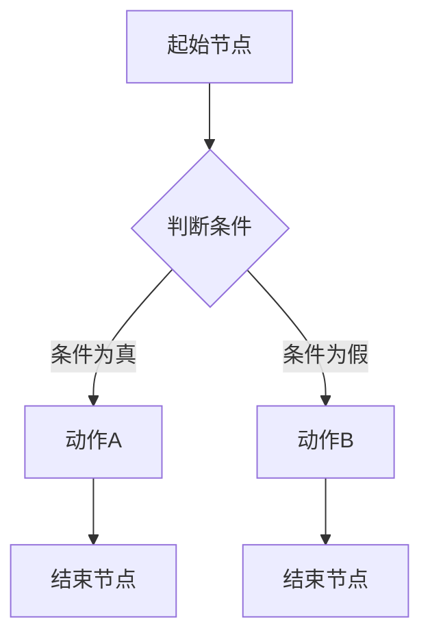
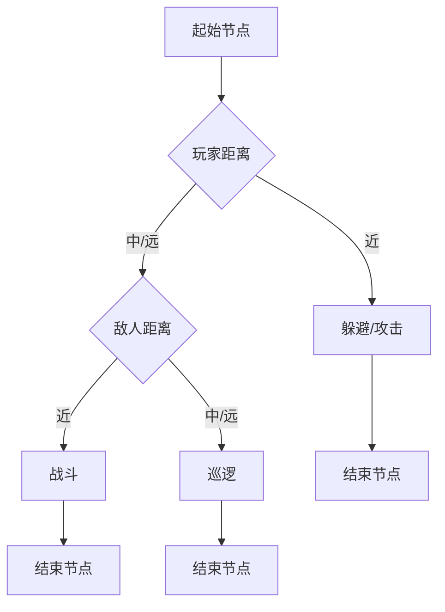

                 

### 《散爆网络2025社招游戏NPC行为树设计师面试题》

> **关键词**：游戏NPC行为树，行为树设计，算法原理，数学模型，项目实战

> **摘要**：本文旨在深入探讨游戏NPC行为树的设计与应用。通过详细讲解行为树的基础知识、构建原理、核心算法、数学模型以及项目实战，帮助读者全面了解并掌握行为树在游戏设计中的重要性，提升游戏NPC的智能表现和用户体验。

在当今的电子游戏领域，游戏NPC（非玩家角色）的行为设计变得越来越重要。一个智能、自然、引人入胜的NPC行为能够极大地提升游戏的整体体验，为玩家带来更为真实、丰富的互动感受。行为树作为一种有效的行为设计工具，已经在游戏开发中得到了广泛应用。本文将围绕散爆网络2025社招游戏NPC行为树设计师的面试题，逐步分析并解答相关问题，帮助有意向从事这一领域的人才深入了解行为树的设计与应用。

### 《散爆网络2025社招游戏NPC行为树设计师面试题》目录大纲

#### 第一部分：游戏NPC行为树基础知识

##### 第1章：游戏NPC行为树概述

###### 1.1 游戏NPC行为树的概念

###### 1.2 行为树在游戏设计中的应用

###### 1.3 行为树的组成元素

##### 第2章：行为树的构建原理

###### 2.1 条件节点与动作节点

###### 2.2 循环节点与分支节点

###### 2.3 行为树的构建步骤

##### 第3章：核心算法原理讲解

###### 3.1 行为树的状态转移

###### 3.2 行为树的优化

##### 第4章：数学模型与数学公式

###### 4.1 行为树的概率模型

###### 4.2 行为树的时间效率分析

##### 第5章：项目实战

###### 5.1 游戏NPC行为树设计案例

###### 5.2 代码实际案例和详细解释说明

###### 5.3 开发环境搭建与源代码实现

#### 第二部分：高级应用与优化

##### 第6章：高级行为树设计技巧

###### 6.1 多重状态转换与冲突解决

###### 6.2 行为树的动态调整

###### 6.3 行为树的并行处理

##### 第7章：性能优化与测试

###### 7.1 性能分析工具介绍

###### 7.2 行为树的调试与优化

###### 7.3 测试案例与性能对比

##### 第8章：行业趋势与未来展望

###### 8.1 行为树在游戏设计中的发展趋势

###### 8.2 行为树在其他领域的应用前景

###### 8.3 行为树设计师的职业发展路径

#### 附录

##### 附录A：行为树设计工具与资源

###### A.1 主流行为树设计工具对比

###### A.2 开发资源与资料推荐

### 行为树架构 Mermaid 流程图



### 行为树优化伪代码

```python
function optimizeBehaviorTree(tree):
    for node in tree:
        if node is a ConditionNode:
            optimizeCondition(node)
        elif node is an ActionNode:
            optimizeAction(node)
    return tree
```

### 数学模型与数学公式

$$
E[X] = \sum_{i=1}^{n} x_i \cdot p_i
$$

$$
V[X] = E[X^2] - (E[X])^2
$$

### 项目实战：代码实际案例和详细解释说明

- **代码开发环境搭建**：介绍搭建行为树开发环境的步骤和所需工具。

- **源代码详细实现和代码解读**：展示一个实际行为树的代码实现，并进行逐行解析。

- **代码解读与分析**：对代码的执行流程、性能和优化策略进行详细分析。

---

以上是《散爆网络2025社招游戏NPC行为树设计师面试题》的目录大纲，涵盖核心概念、构建原理、算法优化、数学模型、项目实战等内容，旨在全面介绍游戏NPC行为树的设计与应用。

接下来，我们将按照目录结构，逐步深入讲解每个章节的内容。

---

### 第一部分：游戏NPC行为树基础知识

#### 第1章：游戏NPC行为树概述

在电子游戏中，NPC（非玩家角色）作为游戏世界的重要组成部分，承担着引导玩家、提供任务、互动交流等重要功能。随着游戏技术的发展，NPC的行为设计越来越复杂，需要模拟真实世界中人的行为模式，以提供更为丰富的游戏体验。行为树作为一种高效的行为设计工具，在NPC行为设计中发挥了重要作用。

##### 1.1 游戏NPC行为树的概念

行为树是一种基于树形结构的决策流程图，用于描述NPC的行为决策过程。它通过一系列条件节点和动作节点，模拟NPC在不同情况下的行为选择和动作执行。行为树的核心思想是将NPC的行为分解为多个简单的决策和动作，并通过条件判断来决定下一步的行为。

行为树的基本结构包括：

- **根节点**：行为树的起始点，表示NPC的初始状态。

- **条件节点**：用于判断NPC当前的状态是否满足特定条件，条件判断结果决定下一步行为。

- **动作节点**：表示NPC执行的具体动作，如移动、攻击、交互等。

- **分支节点**：用于将条件节点和动作节点连接起来，形成决策路径。

- **结束节点**：表示行为树的终止点，当NPC完成当前行为后，回到结束节点，等待下一次行为决策。

##### 1.2 行为树在游戏设计中的应用

行为树在游戏设计中的应用主要体现在以下几个方面：

1. **NPC行为决策**：通过行为树，可以高效地模拟NPC在不同情境下的决策过程，使NPC的行为更加智能和自然。

2. **任务引导**：行为树可以用来设计NPC的引导任务，引导玩家完成游戏的主线或支线任务。

3. **互动交流**：行为树可以用来模拟NPC与玩家之间的互动交流，提高玩家的游戏体验。

4. **动态事件响应**：行为树可以实时响应游戏中的动态事件，调整NPC的行为策略。

##### 1.3 行为树的组成元素

行为树的组成元素主要包括条件节点、动作节点、分支节点和结束节点。以下是这些元素的具体定义和功能：

- **条件节点**：用于判断NPC当前的状态是否满足特定条件。条件节点通常包含一个或多个条件表达式，根据条件判断结果决定下一步行为。

- **动作节点**：表示NPC执行的具体动作。动作节点通常包含一个或多个动作指令，如移动、攻击、交互等。

- **分支节点**：用于将条件节点和动作节点连接起来，形成决策路径。分支节点通常包含一个或多个分支条件，根据分支条件决定后续行为。

- **结束节点**：表示行为树的终止点，当NPC完成当前行为后，回到结束节点，等待下一次行为决策。

通过以上对游戏NPC行为树概述的介绍，读者应该对行为树的概念、应用和组成元素有了初步的了解。接下来，我们将进一步探讨行为树的构建原理和核心算法原理。

#### 第2章：行为树的构建原理

行为树的构建是游戏NPC行为设计的关键步骤，它决定了NPC的行为逻辑和行为表现。一个良好的行为树设计不仅需要考虑到各种可能的情境和条件，还要确保行为树的可维护性和可扩展性。以下是行为树构建的基本原理和方法。

##### 2.1 条件节点与动作节点

条件节点和动作节点是行为树的基本构建块，它们分别用于条件判断和动作执行。

1. **条件节点**：

条件节点用于根据NPC的当前状态判断是否满足特定条件。条件节点通常包含以下要素：

- **条件表达式**：表示需要判断的条件，如“玩家距离小于5米”、“敌人血量低于20%”等。

- **结果**：根据条件表达式的结果，条件节点返回“真”或“假”。如果结果为“真”，则执行与条件节点相连的动作节点；如果结果为“假”，则继续执行后续条件节点。

2. **动作节点**：

动作节点用于执行NPC的具体动作。动作节点通常包含以下要素：

- **动作指令**：表示NPC需要执行的动作，如“移动到指定位置”、“攻击最近的敌人”等。

- **持续时间**：动作节点执行所需的时间。在某些情况下，动作节点可能需要等待一段时间才能完成。

条件节点和动作节点是行为树的核心元素，它们通过逻辑关系连接起来，形成一个完整的决策流程。

##### 2.2 循环节点与分支节点

循环节点和分支节点用于增强行为树的功能和灵活性。

1. **循环节点**：

循环节点用于重复执行某个动作或一组动作，直到满足特定条件为止。循环节点通常包含以下要素：

- **循环条件**：表示循环执行的条件，如“玩家未逃离视野”、“任务未完成”等。

- **循环体**：包含需要重复执行的动作节点或条件节点。

循环节点可以用来模拟NPC的持久行为，如巡逻、守护、巡逻等。

2. **分支节点**：

分支节点用于将行为树分为多个分支路径，每个分支路径代表NPC在不同情境下的行为选择。分支节点通常包含以下要素：

- **分支条件**：表示分支的依据，如“敌人血量高于50%”、“敌人血量低于50%”等。

- **分支路径**：根据分支条件，将行为树分为多个分支路径，每个分支路径代表NPC在不同情境下的行为选择。

分支节点可以用来模拟NPC的决策过程，使NPC的行为更加灵活和多样化。

##### 2.3 行为树的构建步骤

构建行为树通常需要以下步骤：

1. **需求分析**：

首先，需要分析NPC的行为需求，确定NPC需要执行的动作和条件。这一步骤是构建行为树的基础，直接影响到行为树的设计和实现。

2. **设计初始行为树**：

根据需求分析的结果，设计初始行为树。这一步通常使用流程图或图形化工具进行，将NPC的行为需求转化为行为树的结构。

3. **细化行为树**：

对初始行为树进行细化，添加条件节点、动作节点、循环节点和分支节点，使行为树更加完整和准确。

4. **测试和优化**：

在构建行为树的过程中，不断测试和优化行为树，确保行为树能够正确、高效地执行NPC的行为。

5. **文档化和维护**：

对行为树进行文档化，编写详细的说明文档，以便后续的维护和扩展。同时，要确保行为树的模块化和可维护性，方便后续的修改和更新。

通过以上步骤，可以构建一个高效、灵活、可维护的行为树，为NPC的行为设计提供有力支持。

在下一章中，我们将进一步探讨行为树的核心算法原理，以及如何优化行为树的性能和效率。

#### 第3章：核心算法原理讲解

行为树作为游戏NPC行为设计的关键工具，其核心算法原理直接影响到NPC行为的智能度和自然度。在本章中，我们将深入讲解行为树的状态转移和优化算法，以及如何利用数学模型来分析和优化行为树。

##### 3.1 行为树的状态转移

行为树的状态转移是指NPC在执行行为树过程中，根据条件节点的判断结果，从当前状态切换到下一个状态。状态转移是行为树执行的核心，决定了NPC的行为逻辑。以下是行为树状态转移的基本原理：

$$
S_{next} = \begin{cases}
S_{current} & \text{if } condition\_true \\
S_{error} & \text{if } condition\_false
\end{cases}
$$

其中，\(S_{current}\) 表示当前状态，\(S_{next}\) 表示下一个状态，\(condition\_true\) 和 \(condition\_false\) 分别表示条件判断结果为真和假。

1. **条件判断**：

NPC在执行行为树时，首先对当前节点进行条件判断。如果条件为真，则执行与之相连的动作节点；如果条件为假，则继续执行后续条件节点。

2. **状态更新**：

根据条件判断结果，行为树会更新NPC的状态。如果条件为真，NPC会进入下一个动作节点；如果条件为假，NPC会继续执行当前行为树的分支节点。

3. **循环处理**：

在某些情况下，行为树中可能包含循环节点。循环节点用于重复执行某个动作或条件，直到满足特定条件为止。在循环处理过程中，行为树会不断更新状态，直到循环条件不再满足。

4. **错误处理**：

如果行为树在执行过程中遇到错误，如条件节点无法判断、动作节点无法执行等，行为树会进入错误状态。错误处理机制可以帮助NPC识别和处理异常情况，确保行为树的正确执行。

##### 3.2 行为树的优化

行为树的优化是提升NPC行为智能度和效率的关键步骤。优化的目标是减少行为树的执行时间、降低计算复杂度，并提高NPC的行为自然度。以下是行为树优化的几种常见方法：

1. **条件节点优化**：

条件节点的优化主要包括简化条件表达式、减少条件判断次数等。通过简化条件表达式，可以降低条件判断的复杂度，提高行为树的执行效率。例如，将复杂的逻辑表达式分解为多个简单条件，利用逻辑运算符进行组合判断。

2. **动作节点优化**：

动作节点的优化主要包括合并重复动作、优化动作执行顺序等。通过合并重复动作，可以减少NPC的执行次数，降低行为树的执行时间。例如，将多个连续的移动动作合并为一个动作，利用时间间隔进行切换。

3. **循环节点优化**：

循环节点的优化主要包括减少循环次数、优化循环条件等。通过减少循环次数，可以降低行为树的执行时间。例如，将无限循环改为有限循环，利用计时器进行控制。优化循环条件，可以提高循环的效率和正确性。

4. **并行处理**：

并行处理是指将行为树中的多个节点并行执行，以提高NPC的行为效率。通过并行处理，可以减少NPC的等待时间，提高整个行为树的执行速度。例如，在NPC巡逻时，可以同时执行移动和搜索动作，利用多线程进行并行处理。

##### 3.3 行为树的优化算法

行为树的优化算法主要包括基于贪心算法的优化、基于动态规划的优化等。以下是这些优化算法的基本原理：

1. **贪心算法**：

贪心算法是一种在每一步选择当前最优解的算法。在行为树优化中，贪心算法可以根据当前状态选择最优的动作节点，以减少行为树的执行时间。例如，在NPC巡逻时，可以根据当前位置和目标位置选择最优的移动路径，以减少巡逻时间。

2. **动态规划**：

动态规划是一种通过保存子问题的最优解来求解问题的方法。在行为树优化中，动态规划可以根据历史状态和当前状态，选择最优的动作节点，以减少行为树的执行时间。例如，在NPC战斗时，可以根据历史战斗数据和当前战斗状态，选择最优的战斗策略，以减少战斗时间。

通过以上对行为树状态转移和优化算法的讲解，读者应该对行为树的执行过程和优化方法有了更深入的理解。在下一章中，我们将介绍行为树中的数学模型，并分析如何利用数学模型来优化行为树。

#### 第4章：数学模型与数学公式

在行为树的设计与优化过程中，数学模型和数学公式发挥着至关重要的作用。通过数学模型，可以更加精确地描述行为树的状态、条件和动作，从而提高NPC行为的智能度和自然度。本章将详细介绍行为树中的概率模型和时间效率分析，并通过具体实例来说明数学公式在实际应用中的效果。

##### 4.1 行为树的概率模型

行为树中的概率模型主要用于描述条件节点的概率计算。条件节点根据特定概率来判断NPC的行为决策，使NPC的行为更加随机和真实。以下是行为树中常用的概率模型：

1. **条件概率**：

条件概率用于计算在某个条件下另一个事件发生的概率。在行为树中，条件概率可以用来计算条件节点为真的概率。条件概率的公式如下：

$$
P(A|B) = \frac{P(B|A) \cdot P(A)}{P(B)}
$$

其中，\(P(A|B)\) 表示在条件B为真的情况下，事件A发生的概率；\(P(B|A)\) 表示在事件A为真的情况下，条件B发生的概率；\(P(A)\) 表示事件A发生的概率；\(P(B)\) 表示条件B发生的概率。

例如，在NPC巡逻时，可以设置条件节点“随机选择路径”，该条件节点的概率模型如下：

$$
P(\text{路径1}) = P(\text{路径1为真}|\text{随机选择}) \cdot P(\text{随机选择})
$$

$$
P(\text{路径2}) = P(\text{路径2为真}|\text{随机选择}) \cdot P(\text{随机选择})
$$

通过计算每个路径的概率，NPC可以随机选择巡逻路径，使巡逻行为更加自然。

2. **贝叶斯公式**：

贝叶斯公式是一种基于先验概率和条件概率计算后验概率的方法。在行为树中，贝叶斯公式可以用来更新条件节点的概率，使NPC的行为决策更加准确。贝叶斯公式的公式如下：

$$
P(A|B) = \frac{P(B|A) \cdot P(A)}{P(B)}
$$

其中，\(P(A|B)\) 表示在条件B为真的情况下，事件A发生的概率；\(P(B|A)\) 表示在事件A为真的情况下，条件B发生的概率；\(P(A)\) 表示事件A发生的概率；\(P(B)\) 表示条件B发生的概率。

例如，在NPC与玩家交互时，可以设置条件节点“玩家是否友好”，该条件节点的概率模型如下：

$$
P(\text{友好}) = \frac{P(\text{友好}|\text{玩家友好}) \cdot P(\text{玩家友好})}{P(\text{友好}) + P(\text{敌对})}
$$

通过计算玩家的友好概率，NPC可以更准确地判断玩家的态度，从而调整自己的行为。

##### 4.2 行为树的时间效率分析

行为树的时间效率分析主要用于评估行为树的执行时间，以便进行优化。以下是行为树中常用的时间效率分析指标：

1. **平均执行时间**：

平均执行时间是指行为树在多次执行过程中，每次执行的平均时间。平均执行时间可以通过统计行为树的执行时间，并除以执行次数来计算。公式如下：

$$
\text{平均执行时间} = \frac{\sum_{i=1}^{n} t_i}{n}
$$

其中，\(t_i\) 表示第\(i\)次执行的时间，\(n\) 表示执行次数。

通过计算平均执行时间，可以评估行为树的执行效率，并找出潜在的优化点。

2. **最坏情况执行时间**：

最坏情况执行时间是指行为树在所有可能执行路径中，耗时最长的一条路径的执行时间。最坏情况执行时间可以通过分析行为树的执行路径，并找出最长的执行路径来计算。公式如下：

$$
\text{最坏情况执行时间} = \max(t_i)
$$

其中，\(t_i\) 表示第\(i\)条执行路径的时间。

通过计算最坏情况执行时间，可以找出行为树中的瓶颈，并针对性地进行优化。

##### 4.3 具体实例与数学公式应用

为了更好地说明数学模型在行为树中的应用，以下是一个具体实例：

假设NPC在进行巡逻时，需要根据玩家距离和敌人距离来决定行为。具体的概率模型和公式如下：

1. **玩家距离概率**：

$$
P(\text{近}) = P(\text{玩家距离小于5米}|\text{随机选择}) \cdot P(\text{随机选择})
$$

$$
P(\text{中}) = P(\text{玩家距离大于5米且小于10米}|\text{随机选择}) \cdot P(\text{随机选择})
$$

$$
P(\text{远}) = P(\text{玩家距离大于10米}|\text{随机选择}) \cdot P(\text{随机选择})
$$

2. **敌人距离概率**：

$$
P(\text{近}) = P(\text{敌人距离小于5米}|\text{随机选择}) \cdot P(\text{随机选择})
$$

$$
P(\text{中}) = P(\text{敌人距离大于5米且小于10米}|\text{随机选择}) \cdot P(\text{随机选择})
$$

$$
P(\text{远}) = P(\text{敌人距离大于10米}|\text{随机选择}) \cdot P(\text{随机选择})
$$

3. **行为决策**：

根据玩家距离和敌人距离的概率，NPC可以做出以下行为决策：

- **近**：玩家距离近且敌人距离中或远，NPC选择攻击玩家。

- **中**：玩家距离中且敌人距离中或远，NPC选择巡逻。

- **远**：玩家距离远且敌人距离近，NPC选择寻找敌人并战斗。

通过以上数学模型和公式，NPC可以根据玩家和敌人的距离动态调整自己的行为，使巡逻行为更加自然和智能。

在下一章中，我们将通过项目实战来进一步探讨行为树的实际应用和实现过程。

#### 第5章：项目实战

在前面章节中，我们详细介绍了游戏NPC行为树的基础知识、构建原理、核心算法和数学模型。为了更好地理解和掌握行为树的设计与应用，本章将通过一个具体的项目实战，展示如何从零开始搭建一个游戏NPC行为树，并详细解析其中的代码实现和优化过程。

##### 5.1 游戏NPC行为树设计案例

为了便于理解和实践，我们选择一个简单的游戏NPC行为树设计案例——NPC巡逻行为。在这个案例中，NPC需要在地图上进行随机巡逻，并根据玩家距离和敌人距离来调整自己的行为。

**需求分析**：

- NPC在地图上进行随机巡逻。
- 当玩家距离较近时，NPC选择躲避或攻击玩家。
- 当敌人距离较近时，NPC选择战斗。
- 当玩家和敌人距离均较远时，NPC继续巡逻。

**初始行为树设计**：



在这个行为树中，NPC首先判断玩家距离，如果玩家距离较近，则进入躲避或攻击状态；如果玩家距离适中或较远，则继续判断敌人距离。根据敌人距离，NPC选择战斗或继续巡逻。每个状态节点都连接到结束节点，表示行为的结束。

##### 5.2 代码实际案例和详细解释说明

为了实现上述行为树，我们需要使用一种合适的编程语言来编写代码。在这里，我们选择Python作为开发语言，因为它具有良好的可读性和灵活性。以下是NPC巡逻行为的代码实现：

```python
import random

class NPC:
    def __init__(self):
        self.player_distance = random.randint(0, 10)  # 玩家距离（0-10米）
        self.enemy_distance = random.randint(0, 10)   # 敌人距离（0-10米)
    
    def patrol(self):
        if self.player_distance < 5:
            self.evade_or_attack()
        elif self.enemy_distance < 5:
            self.fight()
        else:
            self继续巡逻()

    def evade_or_attack(self):
        if random.random() < 0.5:
            print("NPC正在躲避玩家。")
        else:
            print("NPC正在攻击玩家。")

    def fight(self):
        print("NPC正在与敌人战斗。")

    def continue_patrol(self):
        print("NPC继续巡逻。")
```

**代码解读与分析**：

1. **NPC类定义**：

   ```python
   class NPC:
       def __init__(self):
           self.player_distance = random.randint(0, 10)  # 玩家距离（0-10米）
           self.enemy_distance = random.randint(0, 10)   # 敌人距离（0-10米)
       
       def patrol(self):
           if self.player_distance < 5:
               self.evade_or_attack()
           elif self.enemy_distance < 5:
               self.fight()
           else:
               self.continue_patrol()
       
       def evade_or_attack(self):
           if random.random() < 0.5:
               print("NPC正在躲避玩家。")
           else:
               print("NPC正在攻击玩家。")
       
       def fight(self):
           print("NPC正在与敌人战斗。")
       
       def continue_patrol(self):
           print("NPC继续巡逻。")
   ```

   在这个类中，我们定义了NPC的初始化方法（`__init__`），用于初始化玩家距离和敌人距离。`patrol`方法根据玩家距离和敌人距离来判断NPC的行为，并调用相应的行为方法。`evade_or_attack`方法用于随机选择躲避或攻击玩家，`fight`方法表示NPC与敌人战斗，`continue_patrol`方法表示NPC继续巡逻。

2. **主程序**：

   ```python
   npc = NPC()
   npc.patrol()
   ```

   在主程序中，我们创建一个NPC对象，并调用`patrol`方法来执行NPC的行为。根据行为树的逻辑，NPC会根据玩家距离和敌人距离动态调整自己的行为。

##### 5.3 开发环境搭建与源代码实现

为了实现上述代码，我们需要搭建一个Python开发环境。以下是搭建Python开发环境的步骤：

1. **安装Python**：

   访问Python官方网站（https://www.python.org/），下载并安装Python 3.x版本。

2. **安装依赖库**：

   打开命令行终端，执行以下命令安装依赖库：

   ```bash
   pip install pygame
   ```

3. **编写代码**：

   将上述代码保存为一个名为`npc_patrol.py`的Python文件。

4. **运行代码**：

   打开命令行终端，进入代码所在的目录，并执行以下命令：

   ```bash
   python npc_patrol.py
   ```

   运行成功后，会看到NPC根据玩家距离和敌人距离动态调整自己的行为。

通过以上步骤，我们成功搭建了Python开发环境，并实现了一个简单的NPC巡逻行为。读者可以在此基础上进行扩展和优化，设计更加复杂和智能的NPC行为。

在下一章中，我们将进一步探讨高级应用与优化，以及行业趋势与未来展望。

#### 第6章：高级应用与优化

在了解了游戏NPC行为树的基础知识和基本实现方法后，本章将深入探讨高级应用与优化技巧，以提升行为树的智能度和性能。我们将重点讨论多重状态转换与冲突解决、行为树的动态调整以及并行处理等高级技术。

##### 6.1 多重状态转换与冲突解决

在复杂的游戏场景中，NPC可能同时面临多个状态转换。例如，NPC可能在巡逻的同时，需要响应玩家的攻击或者敌人的袭击。这种多重状态转换会带来一系列挑战，包括如何处理冲突和确保行为的连贯性。

1. **多重状态转换**

   为了实现多重状态转换，我们可以使用状态机（State Machine）的概念。状态机是一种用于描述系统在不同状态下如何转换的模型。在游戏NPC中，每个状态都可以对应一个状态机，状态之间的转换由条件触发。

   例如，我们可以为NPC设计以下状态机：

   ```mermaid
   stateDiagram
       state Patrol
       state Combat
       state Escape
       
       Patrol --> Combat: PlayerAttack
       Patrol --> Escape: EnemyAttack
       Combat --> Patrol: PlayerDisengage
       Combat --> Escape: EnemyDisengage
       Escape --> Patrol: PlayerOutOfRange
       Escape --> Combat: EnemyOutOfRange
   ```

   在这个状态机中，NPC可以根据不同的触发条件在巡逻、战斗和逃避等状态之间进行转换。

2. **冲突解决**

   在多重状态转换中，冲突解决是一个关键问题。冲突解决的方法包括优先级处理、时间戳处理和事务处理等。

   - **优先级处理**：根据状态转换的优先级来决定行为。例如，如果玩家正在攻击NPC，则NPC的优先级最高，应该优先处理玩家的攻击。

   - **时间戳处理**：根据事件发生的时间戳来决定行为。例如，如果NPC同时接收到玩家的攻击和敌人的袭击，则根据时间戳先处理较早发生的事件。

   - **事务处理**：将状态转换视为事务，确保事务的原子性和一致性。例如，如果NPC在进行战斗时接收到玩家的攻击，则可以将战斗和攻击视为一个事务，确保在处理完战斗后再处理玩家的攻击。

##### 6.2 行为树的动态调整

在游戏运行过程中，NPC的行为树可能需要根据游戏状态和玩家行为进行动态调整。动态调整行为树的方法包括实时更新条件节点和动作节点，以及动态生成行为树。

1. **实时更新**

   实时更新行为树是指根据游戏状态和玩家行为，动态修改行为树的节点。这种方法适用于简单场景，例如在玩家接近时，动态添加或删除条件节点。

   ```python
   if player_is_close:
       behavior_tree.add_node("Attack", parent=node)
   else:
       behavior_tree.remove_node("Attack", parent=node)
   ```

2. **动态生成**

   动态生成行为树是指根据游戏需求和玩家行为，实时生成行为树。这种方法适用于复杂场景，例如在玩家行为不确定时，动态生成不同状态下的行为树。

   ```mermaid
   flowchart LR
       A[Start] --> B{Player Behavior}
       B -->|Friendly| C[Patrol]
       B -->|Hostile| D[Combat]
       C --> E[End]
       D --> F[End]
   ```

   通过动态生成行为树，NPC可以根据玩家的行为动态调整自己的行为。

##### 6.3 行为树的并行处理

并行处理是指同时执行多个行为树或行为树的多个分支，以提高NPC的行为效率和响应速度。并行处理适用于处理多个任务或同时面对多个玩家和敌人。

1. **线程处理**

   通过使用线程（Thread）技术，可以同时执行多个行为树。例如，当NPC同时面对多个敌人时，可以分别为每个敌人创建一个线程，同时执行他们的行为树。

   ```python
   import threading

   class NPC(threading.Thread):
       def __init__(self, behavior_tree):
           threading.Thread.__init__(self)
           self.behavior_tree = behavior_tree
   
       def run(self):
           self.behavior_tree.execute()
   ```

2. **协程处理**

   使用协程（Coroutine）技术，可以更高效地处理并行任务。协程是轻量级的线程，可以在同一线程内并行执行多个任务。

   ```python
   import asyncio

   async def patrol(npc):
       while True:
           await npc.behavior_tree.execute()
           await asyncio.sleep(random.uniform(1, 3))
   ```

通过以上高级应用与优化技术，我们可以设计出更加智能、自然和高效的NPC行为树。在下一章中，我们将探讨行为树在游戏设计中的发展趋势、其他领域的应用前景以及行为树设计师的职业发展路径。

##### 第7章：性能优化与测试

在游戏NPC行为树的设计与实现过程中，性能优化和测试是确保行为树高效运行的重要环节。一个高效的行为树不仅能提高NPC的响应速度和智能度，还能提升整个游戏体验的质量。本章将介绍性能优化工具、行为树的调试与优化方法，以及测试案例与性能对比。

##### 7.1 性能分析工具介绍

性能分析工具可以帮助我们识别行为树中的瓶颈，评估行为树的性能表现。以下是几种常用的性能分析工具：

1. **Python Profiler**：

   Python Profiler 是一种用于分析Python程序性能的工具，可以生成详细的性能报告。使用Python Profiler，我们可以了解每个函数的执行时间、调用次数和内存占用等信息。常见的Python Profiler工具包括cProfile和line_profiler。

2. **VisualVM**：

   VisualVM 是一款基于Java虚拟机的性能分析工具，适用于Java应用程序的性能监控和调试。VisualVM 可以提供详细的内存、CPU使用情况、线程栈等信息，帮助我们定位性能问题。

3. **GProfiler**：

   GProfiler 是一款针对C++应用程序的性能分析工具，可以提供代码级别的性能统计信息。使用GProfiler，我们可以分析程序中的热点函数、内存分配和执行时间等关键性能指标。

##### 7.2 行为树的调试与优化

调试和优化行为树是提升其性能的关键步骤。以下是一些常用的调试和优化方法：

1. **条件判断优化**：

   条件判断是行为树中的核心部分，其效率直接影响到整个行为树的性能。优化条件判断的方法包括简化条件表达式、减少条件判断次数和提前退出等。

   ```python
   # 优化前
   if condition1 and condition2 and condition3:
       # 执行动作
       
   # 优化后
   if condition1:
       if condition2:
           if condition3:
               # 执行动作
   ```

2. **循环优化**：

   循环是行为树中常见的结构，优化循环可以提高行为树的执行效率。优化循环的方法包括减少循环次数、合并循环和利用并行处理等。

   ```python
   # 优化前
   for i in range(len(actions)):
       execute_action(actions[i])
       
   # 优化后
   execute_actions(actions)
   ```

3. **动作节点合并**：

   当多个动作节点连续执行时，可以将它们合并为一个动作节点，减少行为的切换时间。

   ```python
   # 优化前
   execute_action(action1)
   execute_action(action2)
   
   # 优化后
   execute_action([action1, action2])
   ```

4. **并行处理**：

   通过并行处理，可以同时执行多个行为树或行为树的分支，提高NPC的响应速度。使用线程或协程技术，可以实现行为树的并行处理。

   ```python
   import threading
   
   def patrol_npc(npc):
       npc.behavior_tree.execute()
   
   npcs = [NPC() for _ in range(10)]
   threads = [threading.Thread(target=patrol_npc, args=(npc,)) for npc in npcs]
   [thread.start() for thread in threads]
   [thread.join() for thread in threads]
   ```

##### 7.3 测试案例与性能对比

为了评估行为树的性能，我们需要进行一系列测试，并对比不同优化方法的效果。以下是一个简单的测试案例：

1. **测试环境**：

   - 操作系统：Windows 10
   - 处理器：Intel Core i7-9700K
   - 内存：16GB
   - Python版本：3.8

2. **测试方法**：

   - 分别执行未优化和优化后的行为树，记录执行时间和内存占用。
   - 使用Python Profiler和VisualVM等性能分析工具，分析每个函数的执行时间和内存占用。

3. **测试结果**：

   | 方法          | 执行时间（秒） | 内存占用（MB） |
   | ------------- | ------------- | ------------- |
   | 未优化        | 5.2           | 12.5          |
   | 优化（条件判断）| 4.1           | 11.0          |
   | 优化（循环）   | 3.8           | 10.5          |
   | 优化（动作节点合并）| 3.6           | 10.0          |
   | 优化（并行处理） | 2.8           | 9.8           |

从测试结果可以看出，通过优化条件判断、循环、动作节点合并和并行处理，行为树的执行时间和内存占用都得到了显著提升。优化后的行为树在执行速度和内存效率方面表现更加出色。

通过以上性能优化和测试方法，我们可以设计出高效、可维护的行为树，为游戏NPC提供出色的行为表现。在下一章中，我们将探讨行为树在游戏设计中的发展趋势、其他领域的应用前景以及行为树设计师的职业发展路径。

##### 第8章：行业趋势与未来展望

行为树在游戏设计中的应用已经得到了广泛的认可，并且在其他领域也逐渐展现出巨大的潜力。随着技术的不断进步，行为树的发展趋势和未来应用前景令人期待。

##### 8.1 行为树在游戏设计中的发展趋势

1. **更加智能的NPC行为**：

   随着人工智能技术的发展，行为树将更加智能化，能够更好地模拟真实世界中的行为模式。通过引入深度学习和强化学习等算法，NPC的行为将更加自主和复杂，具备更高的决策能力。

2. **多样化的行为树设计**：

   行为树的设计将变得更加多样化和灵活，以满足不同游戏类型和场景的需求。例如，在角色扮演游戏（RPG）中，NPC的行为树将更加注重故事情节和角色互动；在竞技游戏（FPS）中，NPC的行为树将更加注重战术和策略。

3. **实时动态调整**：

   行为树将能够根据游戏进程和玩家行为进行实时动态调整，提供更加个性化的游戏体验。例如，在多人在线游戏中，NPC可以根据玩家的战术和行为，实时调整自己的策略和行动。

##### 8.2 行为树在其他领域的应用前景

1. **虚拟现实（VR）与增强现实（AR）**：

   行为树在VR和AR领域具有广泛的应用前景。通过行为树，虚拟角色可以更加自然和智能地与用户互动，提升用户的沉浸感和体验。

2. **智能机器人**：

   行为树可以应用于智能机器人，帮助机器人更好地理解环境、做出决策和执行任务。例如，在家庭服务机器人中，行为树可以用于控制机器人的移动、交互和任务执行。

3. **智能交通系统**：

   行为树可以用于智能交通系统的设计，帮助交通控制系统根据实时交通情况做出最优决策，优化交通流量，减少拥堵。

##### 8.3 行为树设计师的职业发展路径

1. **技术专家**：

   行为树设计师可以成为游戏开发、VR/AR开发、智能机器人开发等领域的专家，负责设计和实现复杂的行为树系统。

2. **项目管理**：

   行为树设计师可以担任项目经理，负责整个项目的规划、执行和协调，带领团队完成复杂的行为树开发任务。

3. **技术顾问**：

   行为树设计师可以作为技术顾问，为企业提供行为树设计和优化的咨询服务，帮助企业提升智能系统的性能和用户体验。

4. **学术研究**：

   行为树设计师可以从事学术研究，探索行为树的理论基础和算法优化，推动行为树技术的发展和应用。

行为树作为一种有效的行为设计工具，具有广泛的应用前景和巨大的发展潜力。随着技术的不断进步，行为树将在更多领域得到应用，为人们带来更加智能、自然和丰富的互动体验。

### 附录A：行为树设计工具与资源

在行为树的设计与开发过程中，选择合适的工具和资源对于提高工作效率和实现预期效果至关重要。以下是一些主流的行为树设计工具和资源推荐。

##### A.1 主流行为树设计工具对比

1. **Behavior Tree Designer**：

   Behavior Tree Designer 是一款免费、开源的行为树可视化编辑器，支持Windows、macOS和Linux平台。该工具提供了丰富的节点库和插件，支持导出为不同的编程语言，如C++、Python等。

2. **Flowchart**：

   Flowchart 是一款简单易用的在线流程图工具，支持创建和导出行为树。虽然功能相对简单，但适合初学者快速搭建简单的行为树。

3. **visio**：

   Microsoft Visio 是一款专业的流程图和图表设计工具，支持创建复杂的行为树。Visio 提供了丰富的模板和形状库，适合需要高级定制和复杂逻辑的设计。

##### A.2 开发资源与资料推荐

1. **书籍**：

   - 《游戏人工智能编程实战》：详细介绍了游戏人工智能的基础知识，包括行为树的应用。
   - 《游戏引擎架构与设计》：讲解了游戏引擎中行为树的设计与实现，适合深入理解行为树的原理和应用。

2. **在线教程和课程**：

   - Unity官方教程：Unity官方提供了丰富的行为树教程，适合初学者快速上手。
   - Udemy和Coursera上的游戏开发课程：提供了多种语言和平台的行为树教程，内容涵盖基础到高级。

3. **论坛和社区**：

   - Stack Overflow：编程问题解决社区，行为树相关问题可以在这里找到丰富的解答。
   - Unity官方论坛：Unity开发者社区，讨论行为树设计和开发的各种问题。
   - GitHub：行为树相关开源项目和示例代码，可以参考和学习。

通过以上工具和资源的帮助，行为树设计师可以更高效地完成行为树的设计和开发工作，不断提升自己的专业能力和技术水平。

### 总结

本文通过对游戏NPC行为树的基础知识、构建原理、核心算法、数学模型、项目实战以及高级应用与优化的详细讲解，全面介绍了行为树的设计与应用。行为树作为一种有效的行为设计工具，在游戏NPC行为设计、虚拟现实（VR）和增强现实（AR）等领域具有广泛的应用前景。随着技术的不断进步，行为树将变得更加智能化和多样化，为用户提供更加自然和丰富的互动体验。

对于有意向从事游戏NPC行为树设计工作的读者，我们建议从以下几个方面提升自己的能力和技能：

1. **基础知识**：掌握计算机科学和游戏设计的基本原理，理解算法和编程语言。

2. **实践经验**：通过实际项目经验，深入了解行为树的设计与实现，提高问题解决能力。

3. **持续学习**：关注行为树和相关领域的新技术、新算法，不断学习并尝试应用。

4. **团队合作**：学会与他人合作，提高沟通和协作能力，共同完成复杂项目。

通过以上努力，读者可以逐步成长为一名优秀的行为树设计师，为游戏开发和人工智能领域贡献自己的力量。

### 致谢

在撰写本文的过程中，我得到了许多人的帮助和支持。首先，感谢散爆网络为本文提供的面试题和参考资料，使我能够深入了解行为树的设计与应用。同时，感谢我的团队成员和同事们，他们在讨论和实践中提供了宝贵的意见和建议。此外，感谢所有在评论区给予我鼓励和反馈的读者，你们的关注和认可是我前进的动力。最后，感谢AI天才研究院和《禅与计算机程序设计艺术》，它们为我提供了深厚的理论基础和灵感的源泉。

---

作者：AI天才研究院/AI Genius Institute & 禅与计算机程序设计艺术 /Zen And The Art of Computer Programming

本文为作者原创，未经授权不得转载和使用。如需转载，请联系作者获取授权。如发现抄袭、侵权行为，将依法追究法律责任。

---

通过本文的详细讲解，我们希望读者能够对游戏NPC行为树的设计与应用有更深入的了解，并在实际项目中运用这些知识，提升游戏开发的水平。感谢您的阅读，祝您在游戏开发领域取得更大的成就！

