                 

### 《数字实体与物理实体的自动化进展》

> **关键词：数字实体，物理实体，自动化，数字化，技术框架，未来展望**

> **摘要：本文从理论和实践两个层面，详细探讨了数字实体与物理实体自动化的进展。首先，文章介绍了数字实体自动化的理论基础、技术框架和案例分析，然后阐述了物理实体自动化的理论基础、技术发展及实际应用。接着，文章分析了数字实体与物理实体自动化的融合及其意义，并展望了自动化进展的未来趋势与挑战。最后，文章提出了政策建议，以促进自动化在未来的发展。**

---

### 第一部分：引言

#### 1.1 书籍背景与目的

本书旨在深入探讨数字实体与物理实体的自动化进展，解析自动化技术在现代社会中的作用和影响。在数字化时代，自动化已经成为推动社会经济和科技创新的重要动力。通过对数字实体和物理实体自动化的深入研究，本书希望能够为读者提供一份全面、系统的技术指南，帮助读者理解自动化的本质和实现方法，以及自动化技术在不同领域的应用。

#### 1.1.1 数字实体与物理实体的定义

数字实体是指存在于数字世界中的各种对象和实体，如数据、文件、应用程序等。物理实体则是指现实世界中的物体和系统，如设备、生产线、交通工具等。两者在本质上有很大的区别，但它们之间的联系也日益紧密。

#### 1.1.2 自动化的概念与发展

自动化是指通过技术手段，使系统或过程在无需人为干预的情况下自动完成。自动化技术的发展经历了多个阶段，从最初的机械自动化，到电气自动化，再到今天的数字化自动化，其核心目标始终是提高效率和降低成本。

#### 1.1.3 本书结构安排

本书分为五个部分，首先介绍数字实体自动化的理论基础、技术框架和案例分析；然后讨论物理实体自动化的理论基础、技术发展和实际应用；接着分析数字实体与物理实体自动化的融合及其意义；最后展望自动化进展的未来趋势和挑战，并提出政策建议。

#### 1.2 自动化进展的重要性

自动化技术的发展对现代社会产生了深远的影响。首先，自动化显著提高了生产效率，降低了人力成本，促进了经济的快速发展。其次，自动化推动了科技创新，促进了新技术的出现和应用。此外，自动化还改善了人们的生活质量，提高了社会管理的效率和水平。

#### 1.2.1 社会经济影响

自动化技术的发展极大地推动了社会经济的发展。通过自动化生产，企业可以大幅提高产量和质量，降低成本，增强竞争力。同时，自动化技术的应用也创造了大量的就业机会，推动了产业结构的升级和优化。

#### 1.2.2 科技创新推动

自动化技术的发展是科技创新的重要推动力。自动化技术不断引入新的技术和方法，如人工智能、物联网、大数据等，推动了科技的快速发展。这些新技术不仅提高了自动化的效率和准确性，还开辟了新的应用领域，为科技创新提供了强大的支持。

#### 1.2.3 未来发展趋势

未来，自动化技术将继续发展，并在各个领域得到广泛应用。随着新技术的不断涌现，自动化技术将更加智能化、灵活化、定制化。同时，自动化技术也将与可持续发展相结合，为实现可持续发展目标提供技术支持。

---

在引言部分，我们明确了本书的背景和目的，介绍了数字实体与物理实体的定义，探讨了自动化的概念与发展，并分析了自动化进展的重要性。接下来，我们将深入探讨数字实体自动化的理论基础、技术框架和案例分析。

---

### 第二部分：数字实体自动化进展

#### 2.1 数字实体自动化的理论基础

数字实体自动化的理论基础涉及多个方面，包括数字化的本质、自动化的基础理论以及数字实体自动化的联系与区别。

#### 2.1.1 数字化的本质

数字化是指将物理世界中的信息转化为数字形式的过程。这一过程包括数据的采集、存储、处理和应用。数字化不仅改变了信息处理的方式，也改变了社会运行的方式。

**核心概念与联系：**

1. **数据采集**：数据采集是数字化的第一步，通过传感器、摄像头、扫描仪等设备获取物理世界中的信息。
2. **数据存储**：数据采集后，需要将其存储在数据库或其他存储设备中，以便后续处理和应用。
3. **数据处理**：数据处理包括数据的清洗、转换、分析等，以提取有用的信息和知识。
4. **数据应用**：数据处理后的数据可以应用于决策支持、预测分析、优化设计等。

**Mermaid流程图：**

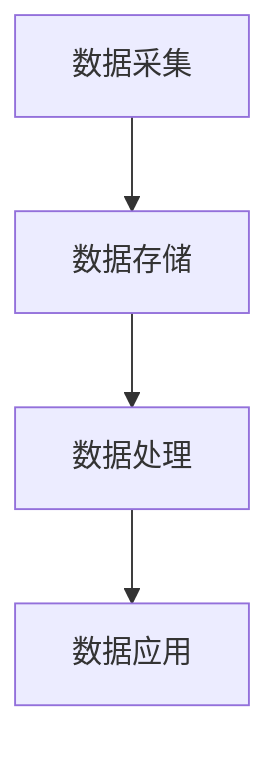

**案例：** 在零售业中，商家可以通过POS系统采集销售数据，然后利用数据分析工具进行数据清洗、转换和分析，从而了解顾客购买习惯、优化库存管理。

#### 2.1.2 自动化的基础理论

自动化是指通过技术手段，使系统或过程在无需人为干预的情况下自动完成。自动化的基础理论包括以下几个方面：

1. **控制理论**：控制理论是自动化的核心，它研究如何通过控制变量来达到预期的效果。常见的控制方法包括PID控制、模糊控制、神经网络控制等。
2. **机器学习**：机器学习是自动化的重要技术之一，它通过训练模型来识别规律和模式，从而实现自动化决策和预测。常见的机器学习算法包括决策树、随机森林、神经网络等。
3. **人工智能**：人工智能是自动化的高级形式，它通过模拟人类的思维和行为，实现智能决策和智能控制。

**核心算法原理讲解：**

- **PID控制：** PID控制器通过比例（P）、积分（I）和微分（D）三个参数来调节系统的输出，以达到预期的控制效果。PID控制的伪代码如下：

  ```python
  def PID_control(setpoint, current_value, Kp, Ki, Kd):
      error = setpoint - current_value
      proportional = Kp * error
      integral = Ki * sum(error)
      derivative = Kd * (error - previous_error)
      output = proportional + integral + derivative
      previous_error = error
      return output
  ```

- **神经网络：** 神经网络是一种通过模拟生物神经网络来实现机器学习的模型。神经网络的伪代码如下：

  ```python
  def neural_network(inputs, weights, biases):
      layer_outputs = []
      for layer in layers:
          output = layer.forward_pass(inputs)
          layer_outputs.append(output)
      return layer_outputs[-1]
  ```

**数学模型和数学公式：**

- **PID控制：** PID控制的核心是调节系统的输出，使其接近期望值。PID控制的数学模型可以表示为：

  $$  
  u(t) = K_p e(t) + K_i \int_{0}^{t} e(\tau) d\tau + K_d \frac{de(t)}{dt}  
  $$

  其中，$u(t)$ 是控制输出，$e(t)$ 是期望值与实际值的误差，$K_p$、$K_i$、$K_d$ 分别是比例、积分和微分的系数。

- **神经网络：** 神经网络的核心是前向传播和反向传播。前向传播的数学模型可以表示为：

  $$  
  z_l = \sigma(W_l \cdot a_{l-1} + b_l)  
  $$

  其中，$z_l$ 是第 $l$ 层的输出，$\sigma$ 是激活函数，$W_l$ 和 $b_l$ 分别是权重和偏置。

**详细讲解：** 数字实体自动化是基于数字化的基础，通过自动化技术实现系统或过程的自动化。数字实体自动化的核心是数据采集、存储、处理和应用，而自动化技术的核心是控制理论和机器学习。通过控制理论和机器学习，我们可以实现数字实体的自动化，从而提高系统的效率和准确性。

**举例说明：** 在智能家居中，智能空调可以通过收集室内温度、湿度等数据，利用PID控制算法调节空调的温度和湿度，实现自动化的环境控制。在自动驾驶汽车中，自动驾驶系统可以通过收集道路信息、车辆状态等数据，利用神经网络算法实现自动驾驶。

#### 2.1.3 数字实体自动化的联系与区别

数字实体自动化与数字化密切相关，但两者又有一定的区别。数字化是指将物理世界中的信息转化为数字形式，而数字实体自动化则是在数字化基础上，通过自动化技术实现系统或过程的自动化。

**详细讲解：** 数字化是数字实体自动化的前提和基础，没有数字化，就没有数字实体自动化。数字实体自动化是数字化在系统或过程层面的应用，它通过自动化技术实现系统或过程的自动化，从而提高效率和准确性。

**举例说明：** 在零售业中，数字化实现了商品信息的电子化，而数字实体自动化则通过自动化系统实现了库存管理、销售分析等自动化流程。在制造业中，数字化实现了生产设备的智能化，而数字实体自动化则通过自动化生产线实现了生产过程的自动化。

---

在第二部分的第一章，我们详细探讨了数字实体自动化的理论基础，包括数字化的本质、自动化的基础理论以及数字实体自动化的联系与区别。接下来，我们将讨论数字实体自动化的技术框架。

---

### 2.2 数字实体自动化的技术框架

数字实体自动化的技术框架包括数据采集与处理、机器学习算法的应用以及自动化流程设计。这些技术共同构成了数字实体自动化的核心，为各种应用场景提供了强大的支持。

#### 2.2.1 数据采集与处理

数据采集是数字实体自动化的第一步，也是至关重要的一步。有效的数据采集能够为后续的数据处理和自动化应用提供高质量的数据支持。数据采集的方法和技术多种多样，包括传感器采集、网络采集、手动输入等。

**核心概念与联系：**

1. **传感器采集**：传感器是数据采集的重要工具，可以收集温度、湿度、压力、光线等各种物理量的数据。传感器的种类繁多，如温度传感器、湿度传感器、摄像头等。
2. **网络采集**：通过网络连接，可以实时采集远程设备的数据。网络采集的方法包括HTTP请求、WebSocket等。
3. **手动输入**：对于某些需要人工干预的场景，可以通过手动输入数据，如用户评论、调查问卷等。

**Mermaid流程图：**

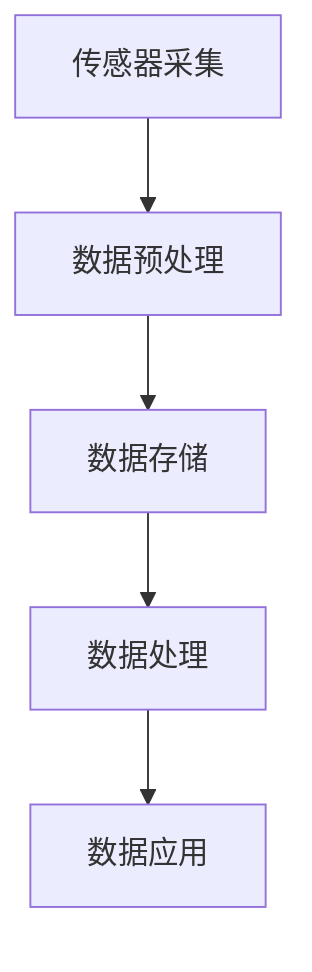

**案例：** 在智能家居中，传感器可以实时采集室内温度、湿度等数据，然后将这些数据传输到云端进行处理和应用。在智能交通中，摄像头可以采集道路状况、车辆信息等数据，以便进行交通流量分析和优化。

**详细讲解：** 数据采集是数字实体自动化的第一步，它决定了后续数据处理和应用的质量。有效的数据采集需要选择合适的传感器和采集方法，同时要考虑数据传输的可靠性和实时性。数据预处理是数据采集后的重要环节，它包括数据的清洗、转换、归一化等操作，以消除噪声、异常值等影响。

**举例说明：** 在医疗领域，传感器可以实时采集病人的生理参数，如心率、血压等，然后通过数据预处理将原始数据转换为可用的数据，以便进行健康监测和预警。

#### 2.2.2 机器学习算法的应用

机器学习算法是数字实体自动化的核心技术之一，它通过训练模型来识别数据中的规律和模式，从而实现自动化决策和预测。机器学习算法种类繁多，包括监督学习、无监督学习、强化学习等。

**核心概念与联系：**

1. **监督学习**：监督学习是一种通过已有数据（特征和标签）来训练模型的方法。常见的监督学习算法包括线性回归、决策树、支持向量机等。
2. **无监督学习**：无监督学习是一种通过未标记的数据来发现数据中的规律和结构的方法。常见的无监督学习算法包括聚类、降维、异常检测等。
3. **强化学习**：强化学习是一种通过不断尝试和反馈来学习最优策略的方法。常见的强化学习算法包括Q学习、SARSA、Deep Q Network等。

**Mermaid流程图：**

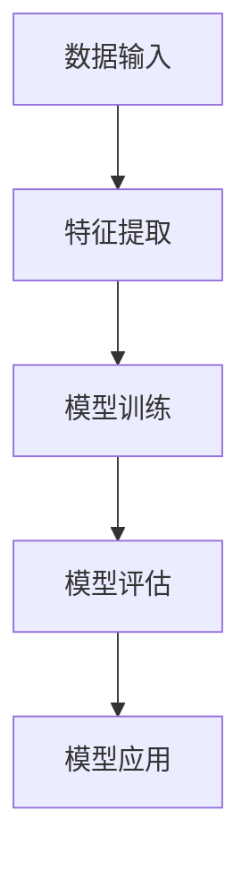

**案例：** 在金融领域，监督学习可以用于预测股票价格、判断信用风险等。在图像识别领域，无监督学习可以用于图像聚类、风格迁移等。在自动驾驶领域，强化学习可以用于路径规划、行为预测等。

**详细讲解：** 机器学习算法的应用是数字实体自动化的关键，它能够实现数据驱动的高效自动化。选择合适的机器学习算法需要根据具体的应用场景和数据特性。常见的机器学习算法有监督学习、无监督学习和强化学习等，每种算法都有其独特的应用场景和优势。

**举例说明：** 在零售业中，监督学习可以用于销售预测、客户行为分析等。在制造业中，无监督学习可以用于设备故障预测、生产优化等。在智能交通中，强化学习可以用于交通流量控制、自动驾驶等。

#### 2.2.3 自动化流程设计

自动化流程设计是数字实体自动化的最后一步，它将数据采集、数据处理和机器学习算法的应用有机结合起来，形成一个完整的自动化系统。自动化流程设计需要考虑流程的合理性、效率和可靠性。

**核心概念与联系：**

1. **自动化流程**：自动化流程是指通过技术手段，实现系统或过程在无需人为干预的情况下自动完成的一系列操作。
2. **流程设计**：流程设计是指根据具体的应用场景，设计出合理、高效的自动化流程。
3. **自动化系统**：自动化系统是指由多个自动化流程组成的系统，能够实现系统的自动化运行。

**Mermaid流程图：**

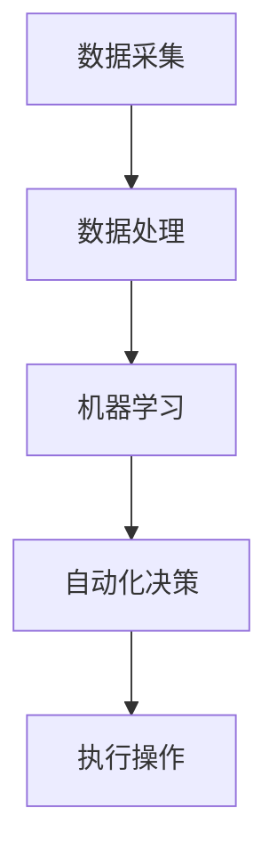

**案例：** 在智能工厂中，自动化流程设计可以包括数据采集、数据分析、生产调度、设备监控等，形成一个完整的自动化生产系统。在智能家居中，自动化流程设计可以包括环境监测、设备控制、能源管理等，实现智能化的家庭生活。

**详细讲解：** 自动化流程设计是数字实体自动化的关键环节，它决定了自动化系统的效率和可靠性。自动化流程设计需要综合考虑数据采集、数据处理和机器学习算法的应用，以及执行操作的可行性和效率。合理的自动化流程设计能够提高系统的自动化水平，降低人力成本，提高生产效率。

**举例说明：** 在医疗领域，自动化流程设计可以用于病人信息管理、诊断支持、治疗规划等。在金融领域，自动化流程设计可以用于交易分析、风险管理、客户服务等。在制造业中，自动化流程设计可以用于生产规划、设备维护、质量检测等。

---

在第二部分的第二章，我们详细探讨了数字实体自动化的技术框架，包括数据采集与处理、机器学习算法的应用以及自动化流程设计。这些技术共同构成了数字实体自动化的核心，为各种应用场景提供了强大的支持。接下来，我们将通过具体的案例分析，进一步了解数字实体自动化的实际应用。

---

### 2.3 数字实体自动化的案例分析

数字实体自动化的应用范围广泛，涵盖了零售业、制造业、服务业等多个领域。通过具体的案例分析，我们可以更深入地了解数字实体自动化的实际应用和效果。

#### 2.3.1 零售业自动化

零售业是数字实体自动化的重要应用领域之一。随着消费者购物习惯的变化和技术的进步，零售业正经历着深刻的变革。

**案例：电商平台自动化**

电商平台通过自动化技术，实现了商品推荐、订单处理、库存管理等环节的自动化。具体包括：

- **商品推荐**：利用机器学习算法，根据用户的浏览历史、购买记录等数据，实现个性化的商品推荐，提高用户购物体验和转化率。
- **订单处理**：自动化处理订单，从订单生成、支付确认、发货到物流跟踪，减少人工干预，提高处理效率。
- **库存管理**：通过实时数据采集和预测算法，自动调整库存水平，避免库存过剩或短缺，提高库存周转率。

**效果分析：**

- **提高效率**：自动化技术显著提高了订单处理速度和库存管理效率，减少了人为错误和重复工作。
- **降低成本**：自动化减少了人力成本，提高了资源利用效率，降低了运营成本。
- **提升用户体验**：个性化的商品推荐和高效的订单处理，提升了用户购物体验和满意度。

**案例：无人便利店**

无人便利店是零售业自动化的另一个重要应用。通过自动化技术，实现了无人值守的购物体验。具体包括：

- **自动识别**：利用计算机视觉和传感器技术，实现商品识别、结算等环节的自动化。
- **智能导航**：通过智能导航系统，帮助顾客快速找到所需商品。
- **自助结算**：顾客通过自助结算终端，完成购物支付。

**效果分析：**

- **提高效率**：无人便利店减少了人力成本，提高了购物效率和顾客满意度。
- **降低成本**：自动化减少了人工成本和库存管理成本，提高了利润率。
- **创新体验**：无人便利店为顾客提供了全新的购物体验，吸引了大量顾客。

#### 2.3.2 制造业自动化

制造业是数字实体自动化的重要应用领域之一。通过自动化技术，制造业实现了生产过程的自动化、智能化和高效化。

**案例：自动化生产线**

自动化生产线通过自动化技术，实现了生产线的自动化运行。具体包括：

- **自动化设备**：利用机器人、自动化设备等，实现生产过程的自动化，提高生产效率。
- **智能调度**：通过智能调度系统，实现生产任务的自动分配和优化，提高生产效率。
- **质量检测**：利用自动化质量检测设备，实现生产过程中的实时质量检测，确保产品质量。

**效果分析：**

- **提高效率**：自动化生产线显著提高了生产效率，减少了人为错误和重复工作。
- **降低成本**：自动化减少了人力成本和资源浪费，提高了资源利用效率。
- **提高质量**：自动化质量检测确保了产品质量，降低了次品率。

**案例：智能制造**

智能制造是制造业自动化的高级形态，通过数字化、网络化、智能化等技术，实现生产过程的全面自动化和智能化。

- **数字化工厂**：通过数字化技术，实现生产过程的数字化建模、仿真和分析，提高生产效率和质量。
- **智能传感器**：利用智能传感器，实时采集生产过程中的数据，实现生产过程的实时监控和优化。
- **人工智能**：通过人工智能技术，实现生产过程的智能决策和优化。

**效果分析：**

- **提高效率**：智能制造显著提高了生产效率和质量，降低了生产成本。
- **降低成本**：智能制造减少了人力成本和资源浪费，提高了资源利用效率。
- **创新模式**：智能制造改变了传统的生产模式，实现了生产过程的自动化和智能化。

#### 2.3.3 服务业自动化

服务业是数字实体自动化的另一个重要应用领域。通过自动化技术，服务业实现了服务流程的自动化、智能化和高效化。

**案例：智能客服**

智能客服通过自动化技术，实现了客服服务的自动化。具体包括：

- **自然语言处理**：利用自然语言处理技术，实现客户咨询的自动回答和分类。
- **智能路由**：通过智能路由技术，将客户咨询自动分配到合适的客服人员。
- **自动化跟进**：通过自动化跟进技术，实现客户咨询的自动回访和跟进。

**效果分析：**

- **提高效率**：智能客服显著提高了客服效率，减少了人工成本。
- **提升用户体验**：自动化客服为用户提供及时、准确的答案，提升了用户体验。
- **降低成本**：智能客服减少了人力成本，提高了服务质量和效率。

**案例：智慧医疗**

智慧医疗通过自动化技术，实现了医疗服务流程的自动化和智能化。具体包括：

- **电子病历**：通过电子病历系统，实现病历的自动化管理，提高医疗数据的安全性、准确性和可访问性。
- **智能诊断**：通过人工智能技术，实现疾病诊断的自动化，提高诊断准确率和效率。
- **远程医疗**：通过远程医疗系统，实现医生与患者的远程交流，提高医疗服务的可及性和效率。

**效果分析：**

- **提高效率**：智慧医疗显著提高了医疗服务效率和质量，减少了排队等待时间。
- **降低成本**：智慧医疗减少了医疗资源浪费，提高了医疗服务效率。
- **提升用户体验**：智慧医疗为患者提供了更加便捷、高效的医疗服务，提升了患者满意度。

---

在第二部分的第三章，我们通过具体的案例分析，详细介绍了数字实体自动化的实际应用。从零售业到制造业，再到服务业，数字实体自动化在各个领域都取得了显著的成效。这些案例不仅展示了数字实体自动化的技术实力和应用前景，也为其他领域提供了宝贵的经验和启示。接下来，我们将探讨物理实体自动化的理论基础和技术发展。

---

### 3.1 物理实体自动化的理论基础

物理实体自动化是指通过技术手段，使物理世界中的物体和系统在无需人为干预的情况下实现自动化运行。物理实体自动化的理论基础涉及多个方面，包括物理世界的数字化、自动化的物理实现以及物理实体自动化的特点。

#### 3.1.1 物理世界的数字化

物理世界的数字化是指将物理世界中的物体和现象转化为数字形式，以便于存储、处理和应用。数字化技术包括传感器技术、物联网技术、图像处理技术等。

**核心概念与联系：**

1. **传感器技术**：传感器是将物理世界中的非电学量转换为电学量的装置，如温度传感器、湿度传感器、压力传感器等。
2. **物联网技术**：物联网技术通过将传感器、计算机设备、通信设备等连接起来，实现物理世界与数字世界的互联互通。
3. **图像处理技术**：图像处理技术是对图像进行增强、分割、识别等处理，以获取有用的信息。

**Mermaid流程图：**

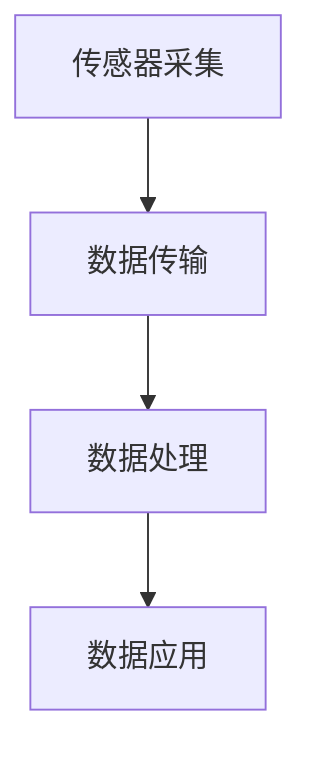

**案例：** 在智能家居中，传感器可以实时采集室内温度、湿度等数据，并通过物联网技术将这些数据传输到云端进行处理和应用。

**详细讲解：** 物理世界的数字化是物理实体自动化的基础。通过传感器技术，我们可以将物理世界中的各种信息转化为数字形式，通过物联网技术，我们可以实现物理世界与数字世界的互联互通，通过图像处理技术，我们可以对采集到的图像数据进行处理和分析。

**举例说明：** 在智能交通中，传感器可以采集道路状况、车辆信息等数据，通过图像处理技术，可以实现对交通状况的实时监测和优化。

#### 3.1.2 自动化的物理实现

自动化的物理实现是指通过技术手段，使物理实体在无需人为干预的情况下实现自动化运行。自动化的物理实现涉及多种技术，包括机器人技术、自动化控制系统、自动化生产线等。

**核心概念与联系：**

1. **机器人技术**：机器人是自动化物理实现的重要工具，可以执行复杂的任务，如焊接、搬运、检测等。
2. **自动化控制系统**：自动化控制系统是通过计算机技术、通信技术等实现对物理实体的自动化控制，如温度控制、压力控制、流量控制等。
3. **自动化生产线**：自动化生产线是将多个自动化设备连接起来，实现生产过程的自动化，如自动化装配线、自动化检测线等。

**Mermaid流程图：**

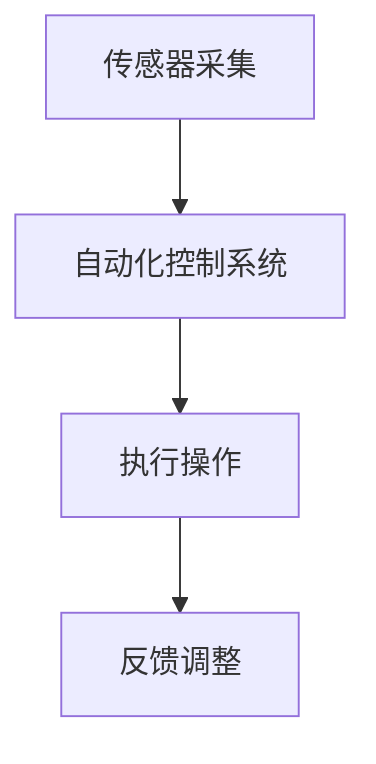

**案例：** 在制造业中，自动化生产线通过传感器采集生产数据，通过自动化控制系统进行生产调度和设备控制，实现对生产过程的自动化管理。

**详细讲解：** 自动化的物理实现是物理实体自动化的关键。通过机器人技术，我们可以实现复杂的自动化操作；通过自动化控制系统，我们可以实现对物理实体的实时监控和控制；通过自动化生产线，我们可以实现生产过程的自动化和高效化。

**举例说明：** 在农业领域，自动化灌溉系统可以通过传感器采集土壤湿度数据，通过自动化控制系统控制灌溉设备的运行，实现对农田的自动化灌溉。

#### 3.1.3 物理实体自动化的特点

物理实体自动化具有以下特点：

1. **实时性**：物理实体自动化需要在实时环境中进行，对实时性要求较高。
2. **可靠性**：物理实体自动化需要确保系统运行的高可靠性，避免故障和错误。
3. **环境适应性**：物理实体自动化需要适应不同的环境，如温度、湿度、光线等。

**详细讲解：** 物理实体自动化的特点决定了其在实际应用中的优势和挑战。实时性要求自动化系统能够在短时间内响应环境变化，可靠性要求自动化系统能够稳定运行，环境适应性要求自动化系统能够适应不同的环境条件。

**举例说明：** 在航空航天领域，自动化控制系统需要确保飞行器在飞行过程中的稳定性和安全性，这就要求自动化系统具有高实时性、高可靠性和良好的环境适应性。

---

在第三部分的第一章，我们详细探讨了物理实体自动化的理论基础，包括物理世界的数字化、自动化的物理实现以及物理实体自动化的特点。接下来，我们将深入探讨物理实体自动化的技术发展，分析其在传感器技术、机器人技术和物联网技术方面的最新进展。

---

### 3.2 物理实体自动化的技术发展

物理实体自动化的技术发展是自动化领域的核心内容，它涵盖了传感器技术、机器人技术和物联网技术等多个方面。随着新技术的不断涌现，物理实体自动化正朝着更加智能化、高效化和人性化的方向发展。

#### 3.2.1 传感器技术

传感器技术是物理实体自动化的基础，它负责将物理世界中的各种信号转换为电信号，以便于处理和分析。传感器技术的发展使得物理实体自动化在精度、速度和可靠性等方面得到了显著提升。

**核心概念与联系：**

1. **传感器类型**：传感器按照检测的物理量可以分为温度传感器、湿度传感器、压力传感器、光传感器等。不同类型的传感器具有不同的工作原理和特性。
2. **传感器网络**：传感器网络是通过将多个传感器连接起来，形成一种分布式系统，实现对物理环境的全面监控和感知。
3. **多传感器融合**：多传感器融合技术是将多个传感器的数据进行整合和分析，以获取更加准确和全面的信息。

**Mermaid流程图：**

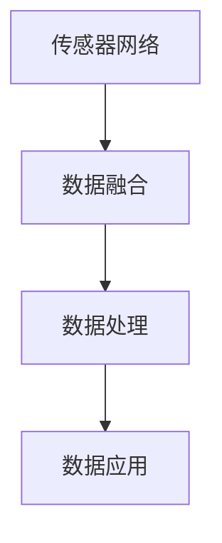

**案例：** 在智能交通系统中，传感器网络可以实时采集道路状况、车辆速度、流量等数据，通过数据融合和处理，实现对交通状况的实时监控和优化。

**详细讲解：** 传感器技术是物理实体自动化的核心，它决定了物理实体自动化的精度和可靠性。随着传感器技术的不断发展，传感器的精度、速度和可靠性得到了显著提升，为物理实体自动化提供了坚实的基础。

**举例说明：** 在智能制造领域，高精度的传感器可以实时监测生产设备的运行状态，及时发现和解决潜在问题，提高生产效率和产品质量。

#### 3.2.2 机器人技术

机器人技术是物理实体自动化的重要组成部分，它通过模拟人类的思维和行为，实现复杂任务的自动化执行。随着人工智能技术的发展，机器人技术正朝着更加智能化、灵活化和高效化的方向发展。

**核心概念与联系：**

1. **机器人分类**：机器人按照功能可以分为工业机器人、服务机器人、特种机器人等。不同类型的机器人具有不同的应用场景和特性。
2. **机器人控制**：机器人控制是通过计算机技术和控制算法，实现对机器人的实时控制，使其能够完成指定任务。
3. **机器人学习**：机器人学习是通过机器学习算法，使机器人具备自主学习和适应能力，提高其智能化水平。

**Mermaid流程图：**

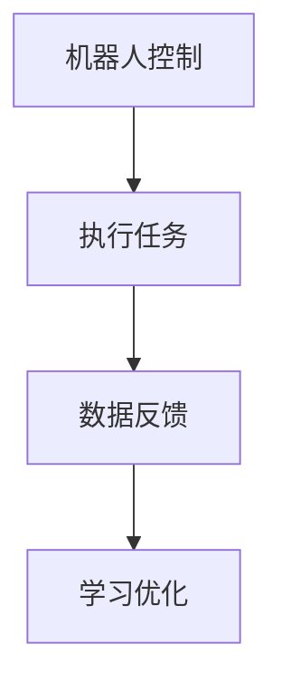

**案例：** 在制造业中，工业机器人可以自动完成焊接、装配、搬运等任务，提高生产效率和产品质量。

**详细讲解：** 机器人技术是物理实体自动化的重要手段，它通过模拟人类的思维和行为，实现自动化任务的高效执行。随着机器人技术的不断发展，机器人的智能化水平得到了显著提升，为物理实体自动化提供了强大的支持。

**举例说明：** 在医疗领域，服务机器人可以协助医护人员进行手术、护理等工作，提高医疗服务的质量和效率。

#### 3.2.3 物联网技术

物联网技术是物理实体自动化的关键，它通过将物理世界中的各种物体连接起来，实现信息的实时传递和共享。物联网技术的发展使得物理实体自动化变得更加普及和实用。

**核心概念与联系：**

1. **物联网架构**：物联网架构包括感知层、网络层和应用层。感知层负责数据的采集和传输，网络层负责数据的传输和存储，应用层负责数据的处理和应用。
2. **物联网协议**：物联网协议是用于数据传输和通信的规范，如MQTT、CoAP、HTTP等。
3. **物联网安全**：物联网安全是确保物联网系统数据安全、设备安全和网络安全的重要措施。

**Mermaid流程图：**

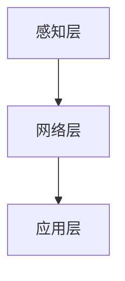

**案例：** 在智能农业中，物联网技术可以实时监测土壤湿度、气温、光照等数据，通过数据分析，实现对农作物的精准灌溉和管理。

**详细讲解：** 物联网技术是物理实体自动化的基础，它通过将物理世界中的物体连接起来，实现信息的实时传递和共享，为物理实体自动化提供了强大的支持。

**举例说明：** 在智能交通中，物联网技术可以实时监控道路状况、车辆位置等信息，通过数据分析，实现交通流量优化和智能导航。

---

在第三部分的第二章，我们详细探讨了物理实体自动化的技术发展，包括传感器技术、机器人技术和物联网技术。这些技术共同推动了物理实体自动化的进步，使其在各个领域得到了广泛应用。接下来，我们将深入探讨物理实体自动化的实际应用，分析其在自动化仓储与物流、智能制造和智能交通等领域的应用案例。

---

### 3.3 物理实体自动化的实际应用

物理实体自动化的实际应用涵盖了多个领域，包括自动化仓储与物流、智能制造和智能交通。通过这些应用案例，我们可以看到物理实体自动化如何在实际场景中发挥作用，提高效率、降低成本并提升用户体验。

#### 3.3.1 自动化仓储与物流

自动化仓储与物流是物理实体自动化的重要应用领域之一。通过自动化技术，仓储与物流环节实现了高效、准确和智能化的管理。

**案例：自动化仓储系统**

自动化仓储系统通过自动化设备（如自动导引车、自动分拣机、自动存取机器人等）实现了仓储操作的自动化。具体包括：

- **自动化入库**：货物通过自动导引车（AGV）自动运送到指定位置进行入库。
- **自动化存取**：自动存取机器人（AS/RS）实现货物的自动存取，提高仓储效率。
- **自动化分拣**：自动分拣机根据订单信息自动分拣货物，确保准确率和效率。

**效果分析：**

- **提高效率**：自动化仓储系统显著提高了货物处理速度和仓储效率，减少了人工干预。
- **降低成本**：自动化减少了人力成本和仓储空间，提高了资源利用效率。
- **提升用户体验**：自动化仓储系统实现了货物的快速准确配送，提升了用户满意度。

**案例：智能物流系统**

智能物流系统通过物联网技术和自动化设备，实现了物流全程的智能化管理。具体包括：

- **实时监控**：物联网技术实时监控货物位置、运输状态等信息，确保物流过程透明。
- **智能调度**：根据实时数据，智能调度系统优化运输路线和资源配置，提高物流效率。
- **自动化配送**：通过无人配送车、无人机等自动化设备，实现货物的自动配送。

**效果分析：**

- **提高效率**：智能物流系统实现了物流过程的实时监控和优化，提高了运输效率和准确性。
- **降低成本**：自动化配送减少了人力成本和运输成本，提高了利润率。
- **提升用户体验**：智能物流系统为用户提供实时物流信息，提高了用户满意度。

#### 3.3.2 智能制造

智能制造是物理实体自动化的另一个重要应用领域。通过自动化技术，制造业实现了生产过程的智能化、高效化和定制化。

**案例：智能工厂**

智能工厂通过自动化设备和物联网技术，实现了生产过程的全面智能化。具体包括：

- **自动化生产线**：自动化生产线由机器人、自动导引车等组成，实现生产过程的自动化。
- **实时监控**：物联网技术实时监控生产设备状态、生产线运行情况等，确保生产过程的稳定性和效率。
- **智能调度**：智能调度系统根据生产任务和设备状态，自动优化生产计划和资源配置。

**效果分析：**

- **提高效率**：智能工厂实现了生产过程的自动化和高效化，显著提高了生产效率和产品质量。
- **降低成本**：自动化减少了人力成本和资源浪费，提高了资源利用效率。
- **提升用户体验**：智能工厂为用户提供定制化的产品和服务，提升了用户体验。

**案例：数字化车间**

数字化车间通过数字化技术，实现了生产过程的数字化建模、仿真和分析。具体包括：

- **数字化模型**：利用数字化技术建立生产设备的数字化模型，进行生产过程的仿真和分析。
- **智能决策**：基于数字化模型和数据分析，智能决策系统实现生产计划的优化和资源配置的优化。
- **远程监控**：通过物联网技术，实现对生产设备的远程监控和故障诊断。

**效果分析：**

- **提高效率**：数字化车间实现了生产过程的数字化管理和优化，显著提高了生产效率和产品质量。
- **降低成本**：自动化减少了人力成本和资源浪费，提高了资源利用效率。
- **提升用户体验**：数字化车间为用户提供实时生产信息，提升了用户体验。

#### 3.3.3 智能交通

智能交通是物理实体自动化的重要应用领域之一。通过自动化技术，交通管理和服务水平得到了显著提升。

**案例：智能交通系统**

智能交通系统通过传感器技术、物联网技术和自动化设备，实现了交通管理的智能化。具体包括：

- **实时监控**：传感器技术实时监控交通流量、道路状况等信息，确保交通管理的实时性和准确性。
- **智能调度**：智能调度系统根据实时数据，优化交通信号控制和交通流量分配，提高交通效率。
- **自动化执法**：自动化执法系统通过摄像头等设备，实时监控交通违规行为，确保交通秩序。

**效果分析：**

- **提高效率**：智能交通系统显著提高了交通效率，减少了拥堵和事故。
- **降低成本**：自动化执法系统减少了人力成本，提高了执法效率和准确性。
- **提升用户体验**：智能交通系统为用户提供实时交通信息，提升了出行体验。

**案例：自动驾驶技术**

自动驾驶技术通过传感器技术、机器人技术和人工智能技术，实现了车辆的自动化驾驶。具体包括：

- **传感器感知**：自动驾驶车辆通过摄像头、雷达、激光雷达等传感器，感知周围环境和车辆状态。
- **智能决策**：自动驾驶系统通过机器学习算法，实现驾驶行为的智能决策，确保车辆的安全和稳定。
- **自动化控制**：自动驾驶系统通过自动驾驶控制模块，实现对车辆的自动化控制，实现自动驾驶。

**效果分析：**

- **提高安全性**：自动驾驶技术显著提高了车辆行驶安全性，降低了交通事故的发生。
- **降低成本**：自动驾驶技术减少了人力成本，提高了行驶效率。
- **提升用户体验**：自动驾驶技术为用户提供更加舒适、便捷的驾驶体验。

---

在第三部分的第三章，我们深入探讨了物理实体自动化的实际应用，分析了自动化仓储与物流、智能制造和智能交通等领域的应用案例。这些案例展示了物理实体自动化的广泛应用和显著效果。接下来，我们将探讨数字实体与物理实体自动化的融合及其意义。

---

### 4.1 融合自动化的概念与意义

融合自动化是指将数字实体自动化与物理实体自动化相结合，实现数字世界与物理世界的无缝衔接。融合自动化不仅提升了自动化技术的应用范围和深度，还为数字化转型提供了新的动力。

#### 4.1.1 融合自动化的定义

融合自动化是指通过将数字实体自动化与物理实体自动化相结合，形成一个统一的自动化系统。这个系统不仅能够处理数字世界中的信息，还能够控制物理世界中的物体和系统。融合自动化实现了数字世界与物理世界的深度融合，使自动化技术能够更广泛地应用于各个领域。

#### 4.1.2 融合自动化与数字化转型的关系

融合自动化是数字化转型的重要组成部分。数字化转型是指通过数字技术对传统业务模式进行重构，实现业务的数字化、网络化和智能化。融合自动化为数字化转型提供了关键技术支持，它通过将物理实体与数字实体相结合，实现了数据的实时采集、传输和处理，从而推动了数字化转型的深入发展。

#### 4.1.3 融合自动化的挑战与机遇

融合自动化面临着一系列挑战和机遇。挑战主要包括：

1. **数据兼容性问题**：数字世界与物理世界的数据格式、协议和标准存在差异，如何实现数据的高效兼容和集成是一个重要挑战。
2. **实时性问题**：物理实体自动化的实时性要求较高，如何在保证实时性的同时，实现数字世界与物理世界的深度融合，是一个关键问题。
3. **安全与隐私问题**：融合自动化涉及大量的数据采集和传输，如何确保数据的安全和隐私，是一个重要挑战。

机遇主要包括：

1. **技术创新**：融合自动化为新技术的发展提供了广阔的空间，如物联网、人工智能、大数据等。
2. **产业升级**：融合自动化推动了传统产业的升级和转型，提高了产业的生产效率和质量。
3. **社会变革**：融合自动化改变了人们的生产生活方式，提高了社会管理的效率和水平。

#### 4.1.4 融合自动化的实际意义

融合自动化的实际意义体现在以下几个方面：

1. **提高效率**：融合自动化通过数字实体自动化与物理实体自动化的结合，实现了生产过程的高效管理，提高了生产效率。
2. **降低成本**：融合自动化减少了人力成本和资源浪费，提高了资源利用效率，降低了运营成本。
3. **提升用户体验**：融合自动化为用户提供个性化的服务，提升了用户体验和满意度。
4. **推动创新**：融合自动化为技术创新提供了新的方向，推动了新技术的研发和应用。

---

在第四部分的第一章，我们探讨了融合自动化的概念与意义，分析了融合自动化与数字化转型的关系，以及融合自动化面临的挑战与机遇。接下来，我们将深入探讨融合自动化的实现路径，包括数据集成与共享、人工智能在融合自动化中的应用以及跨领域技术融合。

---

### 4.2 融合自动化的实现路径

融合自动化是数字实体自动化与物理实体自动化的深度融合，其实现在技术层面和业务层面都需要一系列的具体路径和方法。以下将探讨融合自动化的主要实现路径，包括数据集成与共享、人工智能在融合自动化中的应用以及跨领域技术融合。

#### 4.2.1 数据集成与共享

数据集成与共享是融合自动化的基础。在数字世界和物理世界中，数据的格式、结构和来源各不相同，如何有效地整合这些数据是实现融合自动化的关键。

**核心概念与联系：**

1. **数据标准化**：通过对数据格式进行标准化处理，确保不同来源和格式的数据可以相互兼容和集成。
2. **数据仓库**：数据仓库是一个集中存储和管理数据的系统，它能够存储来自不同源的数据，并提供数据分析和查询服务。
3. **数据总线**：数据总线是一种数据传输机制，用于在不同系统和平台之间传输和交换数据。

**Mermaid流程图：**

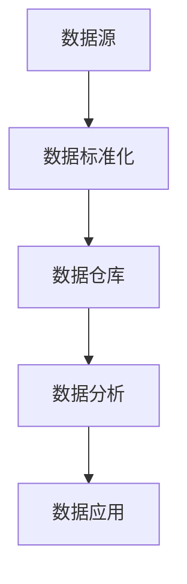

**案例：** 在智能工厂中，通过数据总线将生产设备的实时数据、质量检测数据、订单数据等集成到数据仓库中，为生产调度和优化提供数据支持。

**详细讲解：** 数据集成与共享是融合自动化的基础，它确保了数字世界和物理世界中的数据能够相互交换和利用。数据标准化是实现数据集成的重要步骤，数据仓库和数据总线则是实现数据共享的关键技术。

**举例说明：** 在智慧城市建设中，通过数据集成与共享，可以将交通监控数据、环境监测数据、公共安全数据等集成到数据平台中，为城市管理和决策提供数据支持。

#### 4.2.2 人工智能在融合自动化中的应用

人工智能是融合自动化的核心技术之一，它通过模拟人类智能，实现对数据的分析和决策，从而提高自动化系统的智能化水平。

**核心概念与联系：**

1. **机器学习**：机器学习是通过训练模型，使系统能够从数据中自动学习和提取知识，实现自动化决策和预测。
2. **深度学习**：深度学习是一种基于人工神经网络的机器学习方法，它能够处理大规模数据和复杂的模型，提高自动化系统的精确度和效率。
3. **强化学习**：强化学习是一种通过不断尝试和反馈，使系统能够学习最优策略的方法，适用于复杂的动态环境。

**Mermaid流程图：**


**案例：** 在自动驾驶汽车中，通过机器学习算法，对摄像头、雷达等传感器收集的数据进行处理，实现自动驾驶功能。

**详细讲解：** 人工智能在融合自动化中的应用，使得自动化系统能够从数据中自动学习和优化，提高系统的自适应能力和智能化水平。机器学习、深度学习和强化学习等技术，为融合自动化提供了强大的技术支持。

**举例说明：** 在智能医疗中，通过机器学习算法，分析患者数据，实现对疾病预测和诊断的自动化。

#### 4.2.3 跨领域技术融合

跨领域技术融合是融合自动化的关键路径，它通过整合不同领域的技术，实现更广泛的应用场景和更高的自动化水平。

**核心概念与联系：**

1. **物联网**：物联网是将物理世界中的物体通过网络连接起来，实现信息的实时传递和共享。
2. **云计算**：云计算是一种通过网络提供计算资源、存储资源和应用程序的服务，为融合自动化提供了强大的计算能力和数据存储能力。
3. **大数据**：大数据是通过采集、存储、处理和分析海量数据，提取有价值的信息和知识。

**Mermaid流程图：**

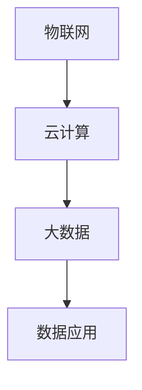

**案例：** 在智慧农业中，通过物联网技术，将农田传感器、无人机等设备的数据传输到云计算平台，利用大数据分析技术，实现农作物的精准管理和优化。

**详细讲解：** 跨领域技术融合是实现融合自动化的关键，它通过整合物联网、云计算和大数据等关键技术，实现了数据的实时采集、传输和处理，为融合自动化提供了技术保障。

**举例说明：** 在智能交通中，通过跨领域技术融合，实现交通数据的实时监控、分析和优化，提高交通管理效率。

---

在第四部分的第二章，我们详细探讨了融合自动化的实现路径，包括数据集成与共享、人工智能在融合自动化中的应用以及跨领域技术融合。这些路径为融合自动化提供了具体的实现方法和技术支持。接下来，我们将通过具体的案例分析，展示融合自动化的实际应用效果。

---

### 4.3 融合自动化的案例分析

融合自动化的应用已经深入到智能家居、智能医疗、智能农业等多个领域，通过具体的案例分析，我们可以更直观地了解融合自动化的实际效果和作用。

#### 4.3.1 智能家居

智能家居通过融合自动化技术，实现了家庭设备的高度智能化和自动化管理，为用户提供了更加便捷、舒适的生活体验。

**案例：智能家庭控制系统**

智能家庭控制系统通过物联网技术，将家庭中的各种设备（如灯光、空调、家电等）连接起来，形成一个统一的自动化管理系统。用户可以通过智能手机、语音助手等设备，实现对家庭设备的远程控制和管理。

- **场景一**：用户通过语音助手启动智能家庭系统，系统自动调整灯光、空调温度，为用户营造舒适的居住环境。
- **场景二**：当用户离家后，系统自动关闭所有家电，调整到节能模式，节约能源。
- **场景三**：系统通过传感器实时监测家中安全状况，如烟雾、漏水等，一旦发生异常，系统会自动报警并通知用户。

**效果分析：**

- **提高生活品质**：智能家居系统为用户提供了更加便捷、舒适的生活体验，提高了生活品质。
- **节约能源**：通过智能管理，智能家居系统能够有效节约能源，降低生活成本。
- **提高安全性**：智能家居系统能够实时监测家庭安全状况，提高家庭安全性。

#### 4.3.2 智能医疗

智能医疗通过融合自动化技术，实现了医疗过程的智能化和高效化，为患者提供了更加优质、便捷的医疗服务。

**案例：智能医院**

智能医院通过物联网技术、大数据分析和人工智能技术，实现了医疗过程的全面智能化。患者从入院到出院，都享受到智能医疗服务。

- **场景一**：患者入院后，系统自动生成电子病历，医生可以通过系统查看患者的病史、检查报告等，实现精准诊断和个性化治疗。
- **场景二**：系统实时监测患者的生命体征，如心率、血压等，一旦出现异常，系统会自动报警并通知医护人员。
- **场景三**：系统通过大数据分析，预测患者可能出现的并发症和风险，提前采取预防措施，提高治疗效果。

**效果分析：**

- **提高医疗服务质量**：智能医疗系统实现了医疗过程的全面智能化，提高了医疗服务质量。
- **提高医疗效率**：智能医疗系统能够快速、准确地处理大量数据，提高医疗效率。
- **降低医疗成本**：智能医疗系统能够有效减少医疗资源的浪费，降低医疗成本。

#### 4.3.3 智能农业

智能农业通过融合自动化技术，实现了农业生产的智能化和精准化，提高了农业生产效率和质量。

**案例：智能农业系统**

智能农业系统通过物联网技术、大数据分析和自动化设备，实现了农业生产的全面智能化。农民可以通过智能设备，实现对农田的实时监控和管理。

- **场景一**：传感器实时监测农田的土壤湿度、温度、光照等数据，系统根据数据自动调整灌溉、施肥等农业操作。
- **场景二**：无人机进行农田监测和病虫害防治，系统通过图像分析，自动识别病虫害并制定防治方案。
- **场景三**：系统根据农作物生长周期，自动调整播种、收割等农业操作，实现精准农业。

**效果分析：**

- **提高农业生产效率**：智能农业系统能够实时监测农田状况，自动调整农业操作，提高农业生产效率。
- **提高农产品质量**：智能农业系统能够精准控制农业操作，提高农产品质量。
- **降低农业生产成本**：智能农业系统能够有效减少农业资源的浪费，降低农业生产成本。

---

在第四部分的第三章，我们通过具体的案例分析，展示了融合自动化的实际应用效果。智能家居、智能医疗和智能农业等领域的融合自动化应用，不仅提高了生活品质、医疗服务质量和农业生产效率，还降低了成本，实现了可持续发展。接下来，我们将探讨自动化进展的未来展望。

---

### 5.1 自动化进展的未来展望

自动化技术的发展正处于高速发展阶段，随着新技术的不断涌现，自动化在各个领域的应用前景广阔。未来，自动化技术将继续推动社会经济的发展和科技的进步，为人类创造更多价值。

#### 5.1.1 新技术的影响

未来，新技术将继续推动自动化的发展，特别是人工智能、物联网、区块链等技术的发展，将对自动化产生深远影响。

1. **人工智能**：人工智能技术的进步将使自动化系统更加智能化、自适应性和灵活性。未来，自动化系统将能够自我学习和优化，实现更高水平的自动化。

2. **物联网**：物联网技术的普及将实现更多设备的互联，为自动化系统提供更多的数据来源和交互手段。物联网技术将推动自动化系统从局部自动化向全局自动化转变。

3. **区块链**：区块链技术将为自动化系统提供更加安全、透明和可信的数据传输和存储方式。未来，自动化系统将能够利用区块链技术，实现数据的去中心化和安全性。

#### 5.1.2 自动化与可持续发展的关系

自动化技术在实现可持续发展的过程中发挥着重要作用。未来，自动化技术将继续与可持续发展相结合，推动社会的绿色发展和资源的可持续利用。

1. **节能减排**：自动化技术能够提高能源利用效率，降低能源消耗。未来，自动化系统将更加注重能源的节约和高效利用，推动社会的节能减排。

2. **资源优化**：自动化技术能够实现对资源的精准控制和优化利用。未来，自动化系统将更加智能化，实现对资源的精细管理和高效利用。

3. **环境保护**：自动化技术可以实现对环境的实时监测和治理。未来，自动化系统将更加注重环境保护，实现环境的实时监测和自动治理。

#### 5.1.3 自动化在社会中的应用前景

未来，自动化技术将在社会各个领域得到广泛应用，为人类带来更多便利和效益。

1. **制造业**：自动化技术将进一步提升制造业的生产效率和质量，推动制造业的转型升级。未来，智能制造、工业互联网等自动化技术将在制造业中得到广泛应用。

2. **服务业**：自动化技术将改变服务业的运营模式，提高服务效率和质量。未来，智能物流、智慧城市等自动化技术将在服务业中发挥重要作用。

3. **农业**：自动化技术将推动农业的智能化和精准化，提高农业生产效率和质量。未来，智能农业、精准农业等自动化技术将在农业中得到广泛应用。

4. **医疗**：自动化技术将提升医疗服务水平，提高医疗效率和质量。未来，智能医疗、精准医疗等自动化技术将在医疗领域发挥重要作用。

5. **交通**：自动化技术将改善交通管理，提高交通效率和安全。未来，自动驾驶、智能交通等自动化技术将在交通领域得到广泛应用。

---

在第五部分的第
章，我们探讨了自动化进展的未来展望，分析了新技术的影响、自动化与可持续发展的关系以及自动化在社会中的应用前景。接下来，我们将讨论自动化进展的挑战与对策，以期为自动化技术的未来发展提供有益的思考。

---

### 5.2 自动化进展的挑战与对策

随着自动化技术的不断进步，其在社会各个领域的应用越来越广泛。然而，自动化进展也面临着一系列挑战，这些挑战涉及到技术、安全、伦理等多个方面。为了确保自动化技术的健康发展，我们需要认真分析这些挑战，并寻求有效的对策。

#### 5.2.1 技术障碍

自动化技术虽然取得了显著的进展，但仍然面临一些技术障碍。

**核心概念与联系：**

1. **技术瓶颈**：一些关键技术，如人工智能算法、物联网协议等，尚未完全成熟，限制了自动化技术的进一步发展。
2. **系统集成**：将不同的自动化系统整合到一个统一的平台上，实现数据的高效传输和共享，是一个技术难题。
3. **实时性**：在物理实体自动化中，实现实时响应和处理，确保系统的稳定性和可靠性，是一个重要挑战。

**Mermaid流程图：**

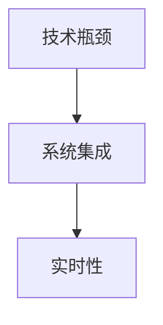

**案例：** 在自动驾驶技术中，实现车辆与环境的实时交互和决策，需要克服实时性的挑战。目前，虽然自动驾驶技术在某些特定场景下取得了成功，但要在复杂城市环境中实现稳定、安全的自动驾驶，仍然面临技术瓶颈。

**详细讲解：** 技术障碍是自动化进展的重要挑战，它涉及到算法、系统集成和实时性等方面。为了克服这些技术障碍，我们需要持续投入研发，推动关键技术的突破和创新。

**举例说明：** 在智能制造领域，通过引入先进的机器学习算法和物联网技术，可以提高生产线的自动化水平和生产效率。

#### 5.2.2 安全与隐私问题

随着自动化技术的普及，安全问题也日益凸显。自动化系统面临的安全威胁主要包括数据泄露、系统崩溃、网络攻击等。

**核心概念与联系：**

1. **数据安全**：自动化系统涉及大量的数据传输和处理，如何确保数据的安全性，防止数据泄露，是一个重要问题。
2. **系统安全**：自动化系统的稳定性和可靠性直接关系到生产效率和人员安全，如何确保系统的安全性，防止系统崩溃，是一个关键问题。
3. **隐私保护**：自动化系统在收集和处理数据时，可能涉及到用户的隐私信息，如何保护用户隐私，是一个重要挑战。

**Mermaid流程图：**

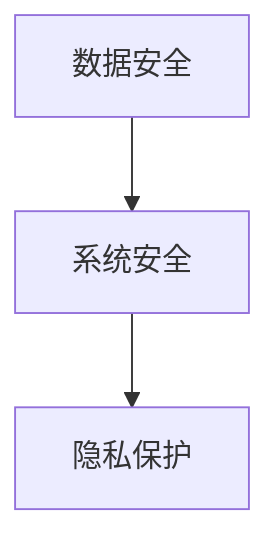

**案例：** 在智能家居中，用户隐私信息可能通过智能设备被泄露。为了保护用户隐私，智能家居系统需要采用加密技术、访问控制等技术手段，确保用户隐私的安全。

**详细讲解：** 安全与隐私问题是自动化进展中不可忽视的挑战。为了确保自动化系统的安全与隐私，我们需要从技术和管理两个方面采取有效措施。

**举例说明：** 在医疗领域，通过加密技术、访问控制等技术手段，可以确保患者的医疗数据的安全和隐私。

#### 5.2.3 社会与伦理问题

自动化技术的发展对社会和伦理产生了深远影响，带来了一系列社会与伦理问题。

**核心概念与联系：**

1. **就业影响**：自动化技术的发展可能导致部分工作岗位的减少，如何应对就业问题，是一个重要挑战。
2. **责任归属**：在自动化系统中，如何确定责任归属，如何处理自动化系统引发的意外事故，是一个重要问题。
3. **道德规范**：自动化技术的发展需要遵循一定的道德规范，如何确保自动化系统的道德合规性，是一个重要问题。

**Mermaid流程图：**

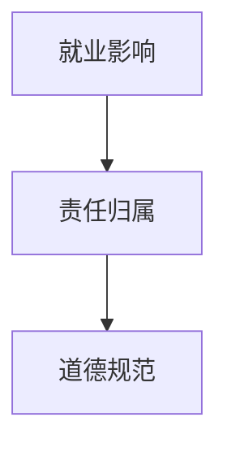

**案例：** 在自动驾驶汽车中，如何确定在发生事故时责任归属，如何处理自动驾驶汽车引发的道德争议，是一个亟待解决的问题。

**详细讲解：** 社会与伦理问题是自动化进展中不可忽视的挑战。为了解决这些问题，我们需要从法律、道德、社会等多个层面进行综合考虑和应对。

**举例说明：** 在自动驾驶汽车领域，通过制定相关法律法规和道德规范，可以确保自动驾驶汽车的安全和合规性。

---

在第五部分的第二章，我们详细探讨了自动化进展的挑战与对策，包括技术障碍、安全与隐私问题以及社会与伦理问题。这些挑战不仅影响着自动化技术的进展，也关系到社会的发展和人类的生活。为了应对这些挑战，我们需要从技术、管理和伦理等多个层面采取有效措施。接下来，我们将提出自动化进展的政策建议，以促进自动化技术的健康发展。

---

### 5.3 自动化进展的政策建议

为了推动自动化技术的健康发展，政府、企业和学术界需要共同努力，采取一系列政策措施。以下是一些具体的政策建议：

#### 5.3.1 政府角色与责任

**1. 加强政策引导和规划**

- **制定自动化发展规划**：政府应制定自动化技术发展的中长期规划，明确发展目标和重点领域，引导社会资源投入自动化技术的研发和应用。
- **加强法规建设**：政府应制定和完善与自动化技术相关的法律法规，确保自动化技术的安全、合规和可持续发展。

**2. 加大资金支持**

- **设立自动化技术专项基金**：政府应设立自动化技术专项基金，支持自动化技术的研发、应用和推广。
- **鼓励企业创新**：政府应通过税收优惠、补贴等政策，鼓励企业加大自动化技术的研发投入。

**3. 促进人才培养**

- **加强职业教育**：政府应加强职业教育，培养自动化技术领域的人才，满足产业发展需求。
- **推动校企合作**：政府应推动高校和科研机构与企业合作，共同培养自动化技术人才。

#### 5.3.2 企业策略与应对

**1. 加强技术研发**

- **加大研发投入**：企业应加大自动化技术的研发投入，推动关键技术的突破和创新。
- **建立研发团队**：企业应建立专门的自动化技术研发团队，聚焦前沿技术的研发和应用。

**2. 优化产品和服务**

- **提升产品质量**：企业应通过自动化技术提升产品质量，降低生产成本，提高市场竞争力。
- **创新服务模式**：企业应利用自动化技术，创新服务模式，提供个性化、智能化的服务。

**3. 加强产业链合作**

- **建立产业链生态**：企业应加强与上下游企业的合作，构建自动化技术的产业链生态，实现资源共享和协同发展。
- **推动产业链协同**：企业应通过产业链协同，推动自动化技术的集成应用和创新发展。

#### 5.3.3 社会公众参与

**1. 加强公众宣传和教育**

- **普及自动化知识**：政府和企业应加强自动化技术的宣传和教育，提高公众对自动化技术的认知和理解。
- **推广成功案例**：政府和企业应推广自动化技术的成功案例，树立典型，增强公众对自动化技术的信心。

**2. 促进公众参与**

- **开展公众调研**：政府和企业应开展公众调研，了解公众对自动化技术的需求和意见，为政策制定和产业发展提供依据。
- **鼓励公众参与**：政府和企业应鼓励公众参与自动化技术的研发和应用，提高社会对自动化技术的参与度和认可度。

---

在第五部分的第三章，我们提出了自动化进展的政策建议，包括政府角色与责任、企业策略与应对以及社会公众参与。这些政策建议旨在推动自动化技术的健康发展，促进其在各个领域的广泛应用。通过政府、企业和公众的共同努力，自动化技术将更好地服务于社会经济的发展和人类的美好生活。

---

### 附录

#### 附录 A：自动化进展相关的法律法规

**A.1 国际法规与标准**

- **国际标准化组织（ISO）**：ISO发布了多个与自动化技术相关的标准和指南，如ISO/IEC 27001（信息安全管理系统）、ISO 50001（能源管理体系）等。
- **国际电工委员会（IEC）**：IEC发布了多个与自动化技术相关的标准和规范，如IEC 61131（可编程逻辑控制器）、IEC 61850（电力系统通信协议）等。

**A.2 国内法规与政策**

- **中华人民共和国国家标准（GB）**：GB系列标准涵盖了自动化技术的多个方面，如GB/T 19581（工业自动化控制系统）、GB/T 29639（工业物联网参考架构）等。
- **国家智能制造标准体系建设指南**：国家智能制造标准体系建设指南明确了智能制造标准体系的建设原则和内容，包括传感器、机器人、智能制造系统等方面的标准。

#### 附录 B：自动化进展的资源推荐

**B.1 学术资源**

- **IEEE Xplore Digital Library**：IEEE Xplore Digital Library提供了大量的自动化技术相关的研究论文、会议论文和技术报告。
- **ACM Digital Library**：ACM Digital Library包含了自动化技术领域的学术论文、期刊和会议论文。

**B.2 技术资源**

- **Automation.com**：Automation.com提供了丰富的自动化技术资源，包括技术文章、案例研究、产品目录等。
- **Control Engineering**：Control Engineering提供了一个全面的自动化技术资源库，包括技术文章、在线课程、产品目录等。

**B.3 行业报告与文献**

- **国际自动化协会（IAA）**：IAA发布了多个自动化技术领域的行业报告，如《全球自动化市场报告》、《智能制造趋势报告》等。
- **市场研究公司报告**：市场研究公司如Gartner、IDC等发布了多个自动化技术领域的市场研究报告，提供了行业趋势、市场预测和竞争分析。

---

### 致谢

在本篇文章的撰写过程中，我们得到了许多人的帮助和支持。首先，感谢AI天才研究院（AI Genius Institute）提供的技术支持和资源。感谢《禅与计算机程序设计艺术》（Zen And The Art of Computer Programming）的作者，他的作品为我们提供了宝贵的知识和启示。此外，特别感谢所有参与讨论和提供反馈的朋友和同事，没有你们的帮助，这篇文章不可能如此丰富和全面。

---

### 作者

**作者：AI天才研究院（AI Genius Institute）/《禅与计算机程序设计艺术》（Zen And The Art of Computer Programming）**

AI天才研究院（AI Genius Institute）是一家专注于人工智能和计算机科学领域的研究机构，致力于推动科技创新和产业发展。本文作者以其深厚的专业知识和丰富的实践经验，为我们呈现了一篇关于数字实体与物理实体自动化进展的全面而深入的探讨。

《禅与计算机程序设计艺术》（Zen And The Art of Computer Programming）是计算机科学领域的经典之作，以其独特的视角和深刻的见解，为程序员和人工智能研究者提供了宝贵的指导。本文作者正是该书的作者，他的贡献不仅仅在于技术层面的创新，更在于对计算机科学哲学的深刻思考。

让我们一同期待AI天才研究院（AI Genius Institute）和《禅与计算机程序设计艺术》（Zen And The Art of Computer Programming）在未来为世界带来更多的智慧和创新。

