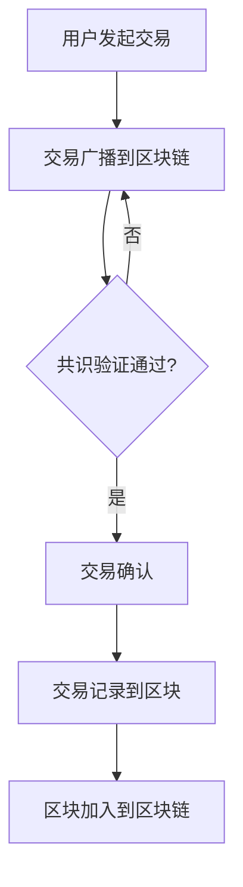

                 

# 《数字资产创业：虚拟财产的价值挖掘》

## 关键词

数字资产、虚拟财产、区块链、智能合约、创业、投资、监管

## 摘要

本文旨在探讨数字资产创业及其在虚拟财产价值挖掘中的应用。我们将从数字资产与虚拟财产的定义和分类开始，深入分析其技术基础，如区块链、数字货币和智能合约。接着，我们将探讨数字资产创业的机会与挑战，通过实际案例展示其实践过程，并分析法律与合规问题。最后，我们将展望数字资产的未来发展趋势，提供投资策略与风险管理建议，以及探讨数字资产与实体经济的融合。希望通过本文，读者能够对数字资产创业有一个全面而深刻的理解。

### 《数字资产创业：虚拟财产的价值挖掘》目录大纲

1. 数字资产与虚拟财产概述
   1.1 数字资产的定义与分类
   1.2 虚拟财产的概念与演变
   1.3 数字资产与虚拟财产的价值挖掘
2. 数字资产与虚拟财产的技术基础
   2.1 区块链技术
   2.2 数字货币
   2.3 智能合约
3. 数字资产创业的实践与案例分析
   3.1 数字资产创业的机会与挑战
   3.2 数字资产创业项目案例分析
   3.3 数字资产创业的法律与合规
4. 数字资产的未来发展趋势
   4.1 数字资产的未来发展趋势
   4.2 数字资产投资策略与风险管理
   4.3 数字资产与实体经济融合
5. 附录
   5.1 数字资产创业工具与资源
   5.2 Mermaid 流程图与核心概念图
   5.3 核心算法原理讲解与伪代码
   5.4 数学模型和数学公式 & 详细讲解 & 举例说明
   5.5 项目实战
   5.6 总结
   5.7 作者信息

### 数字资产与虚拟财产概述

#### 1.1 数字资产的定义与分类

数字资产，通常指的是以数字形式存在的、具有经济价值的财产，包括但不限于数字货币、区块链上的代币、加密文件、虚拟商品等。与传统资产不同，数字资产不依赖于物理形式，其所有权和交易记录都依赖于区块链等分布式账本技术。

##### 1.1.1 数字资产的定义

数字资产是一种以数字化形式存在的资产，可以通过区块链等去中心化技术进行记录、转移和存储。它们包括：

- **数字货币**：如比特币、以太坊等，具有交易媒介、价值储存和账户单位的功能。
- **区块链代币**：如ERC-20、ERC-721等，用于表示各种形式的数字所有权或权益。
- **加密文件**：使用加密技术保护的信息，如版权文件、身份认证等。
- **虚拟商品**：如虚拟土地、虚拟货币、游戏装备等，在虚拟环境中具有实际价值。

##### 1.1.2 数字资产的分类

数字资产可以按照其用途和形式进行分类，主要包括以下几类：

- **交易类数字资产**：如比特币、以太坊等，主要用于网络交易和价值传递。
- **代币化资产**：如ERC-20、ERC-721等，用于代表特定权益或所有权。
- **数字权益**：如股票、债券等在区块链上的代币化版本。
- **数字艺术品**：如NFT（非同质化代币），代表独一无二的数字作品或收藏品。
- **数字服务**：如区块链游戏中的虚拟道具、数字身份认证等。

##### 1.1.3 数字资产与传统资产的差异

与传统资产相比，数字资产具有以下特点：

- **去中心化**：数字资产不依赖于中央机构或第三方中介，通过区块链等去中心化技术实现自我验证和交易。
- **不可篡改**：区块链上的数据一旦记录，就几乎无法篡改，保证了数字资产的所有权和交易记录的透明性和安全性。
- **全球化**：数字资产可以在全球范围内进行交易和流通，不受地理限制。
- **高流动性**：数字资产可以在区块链上进行即时交易，具有较高的流动性。
- **低交易成本**：数字资产交易通常不需要支付高昂的手续费，相比传统金融体系，交易成本更低。

#### 1.2 虚拟财产的概念与演变

虚拟财产，是指在网络虚拟空间中存在的、具有经济价值的财产。它们通常通过特定的平台或系统进行管理和交易，如游戏中的虚拟货币、虚拟土地、虚拟商品等。

##### 1.2.1 虚拟财产的定义

虚拟财产，是指在网络虚拟空间中存在的、具有经济价值的财产。这些财产可以是通过购买、交换、赚取等方式获得的，具有以下特征：

- **网络性**：虚拟财产存在于特定的网络平台或虚拟空间中，如游戏、社交媒体、虚拟世界等。
- **可交易性**：虚拟财产可以在网络平台上进行交易，具有市场价值。
- **稀缺性**：虚拟财产通常具有一定的稀缺性，如稀有装备、虚拟土地等。
- **所有权**：虚拟财产的所有权通常由平台或用户持有，用户可以在遵守平台规则的前提下行使所有权。

##### 1.2.2 虚拟财产的演变过程

虚拟财产的演变过程可以追溯到互联网的兴起。随着互联网技术的发展，虚拟财产的概念逐渐形成，并经历了以下几个阶段：

1. **游戏虚拟货币**：最早出现的虚拟财产是游戏中的虚拟货币，如《魔兽世界》中的金币、《反恐精英》中的武器等。这些虚拟货币在游戏中具有实际价值，可以用于购买虚拟物品或提高游戏体验。
2. **虚拟物品**：随着虚拟世界的发展，虚拟财产的范围不断扩大，不仅包括虚拟货币，还包括各种虚拟物品，如《第二人生》中的虚拟土地、《inecraft》中的建筑和道具等。
3. **数字艺术品**：近年来，随着区块链和NFT（非同质化代币）技术的发展，虚拟财产的形式进一步丰富，数字艺术品、虚拟收藏品等成为新的虚拟财产类型。
4. **区块链代币**：区块链技术的应用，使得虚拟财产的权益和交易更加透明和去中心化。区块链代币，如ERC-20、ERC-721等，成为新的虚拟财产形式，具有更高的流动性和安全性。

##### 1.2.3 虚拟财产的典型代表

虚拟财产的典型代表包括以下几个方面：

- **游戏虚拟货币**：如《王者荣耀》中的钻石、《梦幻西游》中的金币等。
- **虚拟土地**：如《第二人生》中的虚拟土地、《Decentraland》中的虚拟地块等。
- **数字艺术品**：如Beeple的NFT艺术品《Everydays: The First 5000 Days》，以6900万美元的价格成交。
- **区块链代币**：如比特币、以太坊等，已成为全球知名的数字资产。

#### 1.3 数字资产与虚拟财产的价值挖掘

##### 1.3.1 价值挖掘的概念与意义

价值挖掘，是指在数字资产和虚拟财产中发掘和提升其经济价值的过程。通过价值挖掘，可以增加数字资产和虚拟财产的市场需求，提高其价格和流动性。

价值挖掘的意义在于：

- **增加经济价值**：通过创新和优化，提升数字资产和虚拟财产的功能和应用，提高其经济价值。
- **促进市场发展**：价值挖掘可以吸引更多的投资者和参与者进入市场，促进市场的繁荣和发展。
- **提升投资回报**：成功的价值挖掘可以显著提升投资者的收益，提高投资的回报率。

##### 1.3.2 价值挖掘的方法与策略

价值挖掘的方法和策略包括以下几个方面：

- **技术创新**：通过技术创新，提高数字资产和虚拟财产的性能和应用范围，如区块链技术的优化、智能合约的功能扩展等。
- **市场推广**：通过市场推广，提高数字资产和虚拟财产的知名度和认可度，增加其市场需求。
- **社区建设**：通过社区建设，吸引更多的用户和开发者参与，提升数字资产和虚拟财产的生态系统活力。
- **生态合作**：与其他企业和机构建立合作关系，共同推动数字资产和虚拟财产的应用和发展。
- **法律法规**：遵守相关法律法规，确保数字资产和虚拟财产的合法性和合规性。

##### 1.3.3 价值挖掘的案例分析

以下是一些成功进行价值挖掘的案例：

- **比特币**：比特币作为最早的加密货币，通过技术创新和市场推广，其价格从最初的几美分迅速增长到数万美元，成为全球知名的数字资产。
- **以太坊**：以太坊通过引入智能合约技术，不仅提升了其作为交易媒介的功能，还成为各类去中心化应用（DApp）的开发平台，吸引了大量开发者和用户。
- **NFT市场**：NFT（非同质化代币）市场在2021年迅速崛起，各类数字艺术品和收藏品在NFT平台上实现了高价值交易，吸引了众多投资者和收藏家。
- **游戏虚拟财产**：如《魔兽世界》、《梦幻西游》等游戏中的虚拟货币和物品，通过游戏内的经济系统和玩家社区，实现了较高的价值挖掘。

#### 1.4 数字资产与虚拟财产的案例研究

为了更深入地理解数字资产与虚拟财产的价值挖掘，以下将分析几个具体案例。

##### 1.4.1 比特币（Bitcoin）

比特币（BTC）是第一种真正意义上的数字货币，由一个名为中本聪的匿名人物或团队在2009年创建。比特币的价值挖掘主要体现在以下几个方面：

- **技术创新**：比特币通过区块链技术实现了去中心化的账本系统，确保了交易记录的安全性和不可篡改性。
- **市场推广**：随着比特币的知名度和接受度不断提高，越来越多的投资者和商家开始接受比特币作为支付手段。
- **社区建设**：比特币拥有一个活跃的社区，包括开发者、矿工和投资者，共同推动比特币技术的发展和应用。
- **法律法规**：比特币的发展也受到了各国政府和监管机构的关注，尽管存在一定程度的监管风险，但总体上比特币的合法性得到了认可。

比特币的成功价值挖掘使其成为全球最受欢迎的加密货币之一，市值在历史上多次突破新高。

##### 1.4.2 以太坊（Ethereum）

以太坊（ETH）是由Vitalik Buterin在2015年推出的一个去中心化平台，旨在支持智能合约和去中心化应用（DApp）的创建和运行。以太坊的价值挖掘主要体现在以下几个方面：

- **技术创新**：以太坊引入了智能合约概念，使开发者可以在区块链上创建自定义的去中心化应用程序，大大扩展了区块链的应用场景。
- **生态合作**：以太坊吸引了大量的开发者和企业加入，共同构建了一个强大的生态系统，包括去中心化金融（DeFi）、非同质化代币（NFT）等。
- **市场推广**：以太坊在加密货币市场上的影响力不断扩大，吸引了大量投资者和用户的关注。

以太坊的成功价值挖掘使其成为市值第二大的加密货币，并在区块链领域占据了重要地位。

##### 1.4.3 虚拟土地（Virtual Land）

虚拟土地是虚拟财产的一种形式，特别是在虚拟现实（VR）和元宇宙（Metaverse）领域。以下是一些虚拟土地的案例：

- **Decentraland**：Decentraland是一个基于区块链的虚拟世界，用户可以在其中购买、交易和开发虚拟土地。Decentraland的成功价值挖掘主要体现在以下几个方面：

  - **技术创新**：Decentraland使用以太坊区块链来记录虚拟土地的所有权和交易，确保了土地的透明性和安全性。
  - **市场推广**：通过社交媒体和区块链社区，Decentraland吸引了大量用户和投资者的关注。
  - **生态合作**：Decentraland与各类虚拟现实和元宇宙项目合作，共同推动虚拟土地的应用和发展。

- **The Sandbox**：The Sandbox是一个基于区块链的虚拟游戏平台，用户可以在其中创建和交易虚拟土地和虚拟资产。The Sandbox的成功价值挖掘主要体现在以下几个方面：

  - **技术创新**：The Sandbox使用自己的区块链和加密货币，确保了虚拟资产的透明性和安全性。
  - **市场推广**：通过游戏和社区活动，The Sandbox吸引了大量用户和投资者的参与。
  - **生态合作**：The Sandbox与各类虚拟现实和元宇宙项目合作，共同推动虚拟土地的应用和发展。

##### 1.4.4 数字艺术品（Digital Art）

数字艺术品是虚拟财产的一种新兴形式，特别是在NFT（非同质化代币）市场的兴起后。以下是一些数字艺术品的案例：

- **Beeple**：Beeple是一位数字艺术家，他的作品《Everydays: The First 5000 Days》在2021年以6900万美元的价格成交，成为NFT市场上的一个重要里程碑。Beeple的成功价值挖掘主要体现在以下几个方面：

  - **技术创新**：Beeple使用区块链技术记录其作品的所有权和交易，确保了作品的唯一性和真实性。
  - **市场推广**：通过社交媒体和艺术展览，Beeple吸引了大量艺术爱好者和投资者的关注。
  - **生态合作**：Beeple与NFT平台和画廊合作，共同推动数字艺术品的推广和应用。

- **Cryptopunk**：Cryptopunk是一个基于NFT的数字艺术品系列，每个作品都是独一无二的。Cryptopunk的成功价值挖掘主要体现在以下几个方面：

  - **技术创新**：Cryptopunk使用以太坊区块链来记录作品的所有权和交易，确保了作品的透明性和安全性。
  - **市场推广**：通过社交媒体和区块链社区，Cryptopunk吸引了大量用户和投资者的参与。
  - **生态合作**：Cryptopunk与各类NFT平台和虚拟世界项目合作，共同推动数字艺术品的应用和发展。

#### 1.5 总结

数字资产与虚拟财产作为新兴的经济形式，具有广泛的应用前景和巨大的市场潜力。通过对数字资产和虚拟财产的定义、分类、技术基础、价值挖掘方法以及案例研究的深入探讨，我们可以看到，这些资产在区块链、智能合约等技术的支持下，正逐渐成为一种重要的投资和创业工具。

然而，数字资产和虚拟财产市场也面临诸多挑战，如技术创新、市场推广、法律法规等。未来的发展需要各方的共同努力，通过技术创新、生态合作和市场推广，挖掘数字资产和虚拟财产的真正价值，推动整个行业的健康发展。

### 数字资产与虚拟财产的技术基础

在深入探讨数字资产和虚拟财产的创业机会之前，有必要了解它们背后的技术基础。这些技术包括区块链、数字货币和智能合约，它们共同构成了数字资产和虚拟财产生态系统的基础设施。

#### 2.1 区块链技术

区块链技术是数字资产和虚拟财产的核心技术，它通过分布式账本和加密技术实现了数据的安全存储和可靠传输。以下是区块链技术的基本原理、安全机制、应用场景以及与数字资产的关系。

##### 2.1.1 区块链的基本原理

区块链是一种去中心化的数据库，它通过多个节点（计算机）共同维护一个共享的账本。每个节点都存储一份完整的账本副本，并通过共识算法确保账本的一致性和安全性。

区块链的基本原理包括以下几个关键要素：

- **区块**：区块链由多个区块组成，每个区块包含一定数量的交易记录。
- **链**：新区块通过哈希函数与前一个区块链接，形成一条不可篡改的链。
- **节点**：区块链网络中的每个计算机都是一个节点，它们共同维护和更新区块链。
- **共识算法**：共识算法用于确保节点之间的数据一致性和安全性，如工作量证明（PoW）、权益证明（PoS）等。

##### 2.1.2 区块链的安全机制

区块链技术通过多种机制确保数据的安全性和可靠性，主要包括：

- **哈希函数**：哈希函数用于将数据转换为固定长度的字符串，确保数据的唯一性和不可篡改性。
- **加密技术**：区块链使用加密技术保护交易数据，确保只有合法的持有者才能读取和修改数据。
- **共识算法**：共识算法通过节点之间的协作确保数据的一致性和安全性，防止恶意节点篡改数据。
- **去中心化**：区块链的去中心化结构减少了单点故障和中心化攻击的风险，提高了系统的安全性。

##### 2.1.3 区块链的应用场景

区块链技术具有广泛的应用场景，包括但不限于以下几个方面：

- **数字货币**：区块链技术是数字货币（如比特币、以太坊）的基础，确保了货币的匿名性和安全性。
- **供应链管理**：区块链技术可以用于记录和验证供应链中的交易和物流信息，提高供应链的透明度和效率。
- **智能合约**：区块链技术支持智能合约的执行和验证，确保合同条款的自动执行和不可篡改性。
- **数字身份验证**：区块链技术可以用于创建和管理数字身份，提高身份验证的安全性和便捷性。
- **去中心化金融（DeFi）**：区块链技术支持去中心化金融应用，如去中心化交易所、借贷平台等，提高金融服务的透明度和效率。

##### 2.1.4 区块链与数字资产的关系

区块链技术是数字资产的基础设施，确保了数字资产的安全性和可靠性。数字资产，如比特币、以太坊、ERC-20代币等，都是基于区块链技术实现的。区块链提供了以下功能：

- **确权**：区块链记录了数字资产的所有权信息，确保了资产的所有权清晰和不可篡改。
- **交易**：区块链提供了安全可靠的交易环境，确保了数字资产的交易效率和安全性。
- **透明度**：区块链上的所有交易记录都是公开透明的，提高了数字资产的透明度和可追溯性。
- **去中心化**：区块链的去中心化结构确保了数字资产的管理和交易不受中心化机构的控制，提高了系统的可靠性和抗攻击能力。

##### 2.1.5 区块链技术的未来发展趋势

随着区块链技术的不断发展，未来可能会出现以下趋势：

- **性能提升**：区块链技术将持续优化，提高交易速度和处理能力，以满足大规模应用的需求。
- **跨链技术**：跨链技术将实现不同区块链之间的互操作性，提高数字资产和服务的流动性。
- **隐私保护**：区块链技术将引入隐私保护机制，确保用户隐私和数据安全。
- **合规性**：区块链技术将逐步与各国法律法规相适应，提高其在金融、供应链等领域的应用合规性。
- **行业应用**：区块链技术将在更多行业得到应用，如医疗、物流、法律等，推动整个社会的发展。

#### 2.2 数字货币

数字货币是数字资产的重要组成部分，是区块链技术最早和最广泛的应用之一。数字货币通过区块链技术实现了去中心化的价值传输和存储，具有高度的匿名性和安全性。

##### 2.2.1 数字货币的发展历程

数字货币的发展历程可以追溯到2009年比特币的诞生。以下是一些重要的里程碑：

- **2009年**：比特币白皮书发布，比特币网络启动。
- **2010年**：比特币价格首次公开交易，比特币在互联网上开始流通。
- **2013年**：比特币交易所Mt. Gox遭受黑客攻击，导致大量比特币丢失。
- **2014年**：以太坊白皮书发布，引入智能合约概念。
- **2017年**：ICO（首次代币发行）兴起，加密货币市场迅速扩张。
- **2020年**：各国政府和金融机构开始关注加密货币，部分国家开始制定相关法律法规。

##### 2.2.2 数字货币的分类

数字货币可以根据其功能和应用场景进行分类，主要包括以下几种：

- **交易型数字货币**：如比特币、以太坊等，主要用于网络交易和价值传递。
- **代币化货币**：如ERC-20、ERC-721等，用于代表特定权益或所有权。
- **稳定币**：如USDT、USDC等，价值与法定货币（如美元）挂钩，提供稳定的交易媒介。
- **隐私币**：如Monero、Zcash等，注重交易隐私和保护用户匿名性。

##### 2.2.3 数字货币的交易机制

数字货币的交易机制基于区块链技术，主要包括以下几个步骤：

- **交易发起**：用户发起交易，将资金转移到另一个地址。
- **交易广播**：交易被广播到区块链网络中的所有节点。
- **共识验证**：节点通过共识算法验证交易的有效性。
- **区块确认**：验证成功的交易被包含在区块中，区块被添加到区块链。
- **交易完成**：交易完成，资金从发送方转移到接收方。

##### 2.2.4 数字货币的监管现状

随着数字货币市场的快速发展，各国政府和监管机构开始关注数字货币的监管问题。以下是一些主要监管措施：

- **美国**：美国证券交易委员会（SEC）将加密货币视为证券，对ICO和加密货币交易进行监管。
- **中国**：中国政府禁止加密货币交易和ICO，并关闭了国内加密货币交易所。
- **欧洲**：欧洲证券和市场管理局（ESMA）对加密货币交易进行监管，并发布了相关指导文件。
- **新加坡**：新加坡金融管理局（MAS）对加密货币交易所和ICO进行监管，鼓励合法合规的加密货币发展。

#### 2.3 智能合约

智能合约是区块链技术的重要应用之一，它是一种自执行合同，在满足特定条件时自动执行。智能合约通过编程语言编写，运行在区块链上，具有去中心化、透明和不可篡改的特点。

##### 2.3.1 智能合约的定义与特点

智能合约是一种自执行合同，其条款和操作是以编程语言（如Solidity）编写的，并在区块链上执行。智能合约的特点包括：

- **自动化**：智能合约在满足特定条件时自动执行，无需人工干预。
- **透明**：智能合约的代码和操作记录是公开透明的，所有参与者都可以查看。
- **不可篡改**：一旦智能合约被部署到区块链上，其代码和操作记录是不可篡改的。
- **去中心化**：智能合约运行在区块链上，不依赖于中心化机构，提高了系统的可靠性和抗攻击能力。

##### 2.3.2 智能合约的运行原理

智能合约的运行原理主要包括以下几个步骤：

- **编写合约**：开发者使用编程语言（如Solidity）编写智能合约代码。
- **编译合约**：将智能合约代码编译为区块链可识别的合约代码。
- **部署合约**：将编译后的合约代码部署到区块链上，创建一个智能合约实例。
- **调用合约**：通过区块链网络调用智能合约，执行特定的操作。
- **记录交易**：智能合约的操作结果被记录在区块链上，形成一条不可篡改的交易记录。

##### 2.3.3 智能合约的应用场景

智能合约在多个领域具有广泛的应用场景，主要包括：

- **去中心化金融（DeFi）**：智能合约支持去中心化金融应用，如借贷平台、交易市场等。
- **供应链管理**：智能合约可以用于记录和验证供应链中的交易和物流信息。
- **版权管理**：智能合约可以用于管理数字版权，确保版权所有者的权益。
- **身份验证**：智能合约可以用于创建和管理数字身份，提高身份验证的安全性和便捷性。
- **投票系统**：智能合约可以用于创建去中心化的投票系统，确保投票过程的公正和透明。

##### 2.3.4 智能合约的安全风险

尽管智能合约具有许多优势，但也存在一定的安全风险，主要包括：

- **代码漏洞**：智能合约的代码可能存在漏洞，如逻辑错误、输入验证不足等，可能导致合约被恶意攻击。
- **外部攻击**：智能合约可能遭受各种外部攻击，如51%攻击、重放攻击等，影响系统的安全性和可靠性。
- **合约升级**：智能合约的升级可能引入新的漏洞或问题，导致系统不稳定或数据丢失。
- **监管风险**：智能合约的匿名性和去中心化特点可能导致其被用于非法活动，面临监管压力。

#### 2.4 数字资产与虚拟财产的技术架构

为了更好地理解数字资产和虚拟财产的技术架构，以下是一个简化的技术架构图：

```
+-------------------+
|     用户层       |
+-------------------+
        |
        |
+-------------------+
|     智能合约      |
+-------------------+
        |
        |
+-------------------+
|    区块链网络     |
+-------------------+
        |
        |
+-------------------+
|   数字货币系统    |
+-------------------+
```

在这个技术架构中，用户层包括个人用户和企业用户，他们通过智能合约与区块链网络进行交互。智能合约负责执行特定的业务逻辑，如交易、验证和权限管理等。区块链网络提供了安全、去中心化和不可篡改的底层基础设施，确保了数字资产和虚拟财产的安全和可靠性。数字货币系统负责处理数字资产的价值存储和传输，如比特币、以太坊等。

#### 2.5 总结

数字资产和虚拟财产的技术基础是区块链、数字货币和智能合约。这些技术为数字资产和虚拟财产提供了安全、去中心化和透明的交易环境，推动了数字经济的快速发展。通过深入了解这些技术，我们可以更好地理解和应用数字资产和虚拟财产，实现其真正的价值。

### 数字资产创业的实践与案例分析

在了解了数字资产与虚拟财产的技术基础后，接下来我们将探讨数字资产创业的机会与挑战，并通过具体的案例展示创业过程。最后，我们将分析数字资产创业中的法律与合规问题。

#### 3.1 数字资产创业的机会与挑战

##### 3.1.1 数字资产创业的机遇

数字资产创业领域充满了机遇，主要体现在以下几个方面：

1. **技术创新**：区块链技术的不断进步为创业者提供了丰富的创新空间。无论是去中心化金融（DeFi）、非同质化代币（NFT）还是智能合约，都有大量的创新点等待发掘。

2. **市场潜力**：数字资产市场的规模正在快速增长，吸引了大量投资者和用户。根据CoinMarketCap的数据，截至2022年初，全球加密货币市场总市值已经超过2万亿美元。

3. **监管政策**：尽管监管政策在不同国家和地区存在差异，但许多国家已经开始重视数字资产和区块链技术，并逐步完善相关法律法规，为创业者提供了更稳定的法律环境。

4. **资本支持**：数字资产创业项目吸引了众多风险投资和资本市场的关注，为创业者提供了充足的资金支持。

##### 3.1.2 数字资产创业的挑战

尽管数字资产创业领域充满机遇，但也面临诸多挑战：

1. **技术风险**：数字资产创业项目依赖于区块链等前沿技术，技术风险是不可避免的。例如，智能合约漏洞、网络攻击等问题都可能对项目造成重大影响。

2. **市场风险**：数字资产市场波动性较大，价格波动可能对创业项目的稳定性产生不利影响。

3. **合规风险**：不同国家和地区的监管政策不同，创业者需要遵守当地法律法规，确保项目的合法性和合规性。

4. **用户信任**：数字资产市场的不确定性可能导致用户对项目的信任度不高，影响项目的推广和用户参与度。

##### 3.1.3 数字资产创业的战略规划

为了应对数字资产创业的机遇与挑战，创业者需要进行详细的战略规划，主要包括以下几个方面：

1. **明确目标**：确定项目的愿景、使命和目标，确保项目的发展方向清晰。

2. **技术创新**：关注区块链等前沿技术，持续进行技术创新，提高项目的竞争力。

3. **市场调研**：深入了解市场需求，选择有潜力的细分市场，制定有针对性的市场策略。

4. **合规经营**：了解并遵守当地法律法规，确保项目的合法性和合规性。

5. **资金管理**：合理规划资金使用，确保项目的可持续性和抗风险能力。

6. **团队建设**：建立专业、稳定的团队，确保项目的顺利推进。

7. **品牌建设**：通过市场推广和品牌建设，提高项目的知名度和用户信任度。

#### 3.2 数字资产创业项目案例分析

以下是一些成功的数字资产创业项目案例，我们将从项目背景、技术实现、市场表现和成功经验等方面进行详细分析。

##### 3.2.1 项目1：加密货币交易所

**项目背景**：

加密货币交易所是数字资产交易的重要平台，提供比特币、以太坊等多种加密货币的交易服务。加密货币交易所在数字资产市场中扮演着关键角色，为投资者和交易者提供了交易和投资的机会。

**技术实现**：

加密货币交易所的技术实现主要包括以下几个方面：

- **交易引擎**：交易引擎是交易所的核心，负责处理订单、撮合交易和交易结算。
- **钱包服务**：钱包服务用于存储和管理用户的加密货币资产，包括安全存储、资产转移等功能。
- **用户界面**：用户界面提供交易、钱包管理等功能，确保用户可以方便地进行操作。

**市场表现**：

加密货币交易所在市场上表现出色，以币安（Binance）为例，币安是全球最大的加密货币交易所之一，用户遍布全球。根据CoinMarketCap的数据，币安的每日交易额经常超过数十亿美元，市值也在加密货币市场中名列前茅。

**成功经验**：

- **技术创新**：币安通过引入交易深度分析、流动性提供等技术创新，提高了交易效率和用户体验。
- **合规经营**：币安严格遵守各国法律法规，确保项目的合法性和合规性。
- **品牌建设**：币安通过市场推广和品牌建设，提高了项目的知名度和用户信任度。

##### 3.2.2 项目2：区块链游戏

**项目背景**：

区块链游戏是数字资产创业领域的另一个重要方向，将区块链技术与游戏相结合，为玩家提供了独特的游戏体验。区块链游戏的主要特点是游戏资产去中心化，玩家可以在区块链上拥有和交易游戏资产。

**技术实现**：

区块链游戏的技术实现主要包括以下几个方面：

- **区块链网络**：区块链网络用于记录游戏资产的所有权和交易，确保资产的安全性和透明度。
- **智能合约**：智能合约用于实现游戏逻辑和资产转移，确保游戏规则和交易的安全和自动执行。
- **游戏引擎**：游戏引擎负责实现游戏内容，包括游戏规则、角色和场景等。

**市场表现**：

区块链游戏市场在近年来迅速发展，吸引了大量玩家和投资者的关注。以Axie Infinity为例，该游戏在2021年达到了前所未有的高峰，用户数量和交易额都创下历史新高。

**成功经验**：

- **技术创新**：Axie Infinity通过引入NFT（非同质化代币）和去中心化金融（DeFi）等技术创新，为玩家提供了独特的游戏体验和收益机会。
- **社区建设**：Axie Infinity通过建立强大的社区，与玩家和开发者紧密合作，共同推动游戏的发展。
- **市场推广**：Axie Infinity通过社交媒体和游戏推广活动，吸引了大量玩家和投资者的关注。

##### 3.2.3 项目3：数字资产基金

**项目背景**：

数字资产基金是数字资产投资的一种形式，通过集中投资者的资金，进行数字资产的组合投资，以实现风险分散和收益最大化。数字资产基金为投资者提供了多样化的投资选择，降低了投资风险。

**技术实现**：

数字资产基金的技术实现主要包括以下几个方面：

- **资金管理**：资金管理用于记录和管理投资者的资金，确保资金的安全和透明。
- **投资策略**：投资策略用于确定投资方向和资产配置，以实现最佳的投资收益。
- **智能投顾**：智能投顾通过大数据分析和人工智能算法，为投资者提供个性化的投资建议。

**市场表现**：

数字资产基金在市场上表现出色，吸引了大量投资者的关注。以polychain capital为例，该基金在全球范围内进行了多种数字资产的投资，取得了良好的投资回报。

**成功经验**：

- **多元化投资**：polychain capital通过多元化的投资策略，降低了投资风险，提高了投资收益。
- **专业团队**：polychain capital拥有专业的投资团队，具备丰富的投资经验和行业知识。
- **市场洞察**：polychain capital通过持续的市场分析和研究，准确把握市场趋势和投资机会。

##### 3.2.4 项目4：数字身份认证

**项目背景**：

数字身份认证是数字资产和虚拟财产领域的一个重要应用，通过区块链技术，为用户提供安全、便捷的身份认证服务。数字身份认证可以用于多个场景，如在线购物、金融交易、医疗记录等。

**技术实现**：

数字身份认证的技术实现主要包括以下几个方面：

- **身份信息记录**：用户在区块链上注册身份信息，包括姓名、身份证号、联系方式等。
- **身份验证**：系统通过区块链上的身份信息进行验证，确保身份信息的真实性和唯一性。
- **智能合约**：智能合约用于实现身份验证和授权，确保交易的安全和自动化。

**市场表现**：

数字身份认证市场在近年来快速增长，吸引了大量企业和用户的关注。以Aurora为例，该平台通过区块链技术为用户提供数字身份认证服务，取得了良好的市场反响。

**成功经验**：

- **技术创新**：Aurora通过区块链技术，实现了身份信息的去中心化存储和验证，提高了系统的安全性和透明度。
- **用户体验**：Aurora提供了简单、便捷的用户体验，用户可以通过手机APP快速完成身份认证。
- **合作拓展**：Aurora与多个行业和企业合作，拓展了应用场景，提高了市场影响力。

#### 3.3 数字资产创业的法律与合规

数字资产创业面临着复杂的法律法规环境，创业者需要遵守当地和全球的法律法规，以确保项目的合法性和合规性。以下是一些主要的法律与合规问题：

##### 3.3.1 数字资产创业的法律风险

数字资产创业可能面临的法律风险包括：

- **金融监管**：许多国家和地区对加密货币交易和ICO进行了严格的监管，创业者需要确保项目符合相关金融法规。
- **数据保护**：数字资产创业涉及大量用户数据，创业者需要遵守数据保护法规，确保用户数据的安全和隐私。
- **反洗钱**：数字资产交易可能被用于洗钱活动，创业者需要遵守反洗钱法规，建立有效的反洗钱措施。
- **知识产权**：创业者需要保护自己的知识产权，避免侵犯他人的知识产权。

##### 3.3.2 数字资产创业的合规要求

数字资产创业的合规要求主要包括：

- **许可证**：在某些国家和地区，创业者需要申请相关许可证，如加密货币交易所许可证、ICO许可证等。
- **披露要求**：创业者需要向监管机构和公众披露项目的详细信息，包括项目目标、团队背景、资金使用等。
- **合规审计**：创业者需要定期进行合规审计，确保项目符合相关法律法规。
- **内部控制**：创业者需要建立有效的内部控制制度，确保项目的合规性和风险控制。

##### 3.3.3 数字资产创业的法律案例解析

以下是一些数字资产创业的法律案例，以供参考：

- **案例1**：2017年，美国证券交易委员会（SEC）对加密货币交易所Bitfinex和Tether进行调查，指控其进行非法证券交易。此案例表明，加密货币交易所需要严格遵守证券法规，确保交易合法。
- **案例2**：2018年，加密货币交易所Coinbase在美国证券交易委员会（SEC）的监管下，进行了首次公开募股（IPO）。此案例表明，合规经营是数字资产创业项目成功上市的关键。
- **案例3**：2020年，中国政府对加密货币交易所进行了全面整顿，关闭了国内大部分加密货币交易所。此案例表明，创业者需要关注当地法律法规的变化，确保项目的合法性。

#### 3.4 总结

数字资产创业领域充满机遇与挑战。创业者需要深入了解市场需求、技术创新和法律法规，制定有效的战略规划，以应对市场变化和风险。通过分析成功的创业项目案例，我们可以了解到，技术创新、合规经营和用户体验是数字资产创业成功的关键因素。创业者需要不断学习和适应，把握数字资产创业的机遇，实现创业目标。

### 数字资产的未来发展趋势

随着区块链技术的不断进步和数字货币市场的日益成熟，数字资产的未来发展趋势备受关注。本文将从市场前景、技术创新、政策影响等方面对数字资产的未来发展趋势进行展望。

#### 4.1 数字资产的市场前景

数字资产市场正迎来快速发展的阶段，其市场前景广阔，主要体现在以下几个方面：

1. **全球用户增长**：随着互联网普及率的提高和移动设备的普及，全球范围内的数字资产用户数量持续增长。根据CoinGecko的数据，全球加密货币用户已经超过2亿。

2. **投资需求增加**：越来越多的传统投资者开始关注数字资产市场，寻求新的投资机会。数字资产投资正逐渐成为一种主流投资方式。

3. **机构投资者进入**：银行、保险公司、基金等机构投资者正在逐步进入数字资产市场，推动市场的规模和流动性。

4. **行业应用拓展**：数字资产在供应链管理、版权保护、智能合约等领域得到广泛应用，为市场带来了新的增长点。

5. **跨境支付**：数字货币作为一种跨境支付工具，具有低交易成本、高效率的特点，有望在未来取代传统跨境支付方式。

#### 4.2 数字资产的技术创新

技术创新是数字资产未来发展的核心驱动力，以下是几个关键领域：

1. **区块链技术的优化**：区块链性能的提升是数字资产发展的关键。未来，我们将看到更高效、更安全的区块链协议，如股权证明（PoS）和分层网络等。

2. **跨链技术**：跨链技术将实现不同区块链之间的互操作性，提高数字资产的流动性和应用范围。

3. **隐私保护**：随着用户对隐私保护需求的增加，未来的数字资产将更加注重隐私保护，如零知识证明（Zero-Knowledge Proof）等技术的应用。

4. **去中心化应用（DApp）**：DApp的发展将进一步拓展数字资产的应用场景，从金融领域扩展到供应链、社交、娱乐等更多领域。

5. **智能合约升级**：智能合约技术的升级将提高合约的执行效率和安全性，为数字资产的应用提供更强大的支持。

#### 4.3 政策影响

政策影响是数字资产发展的重要因素，不同国家和地区的政策将对数字资产市场产生深远影响：

1. **监管政策**：各国监管机构对数字资产市场的监管态度将影响市场的稳定性和发展。一些国家采取了较为宽松的监管政策，鼓励数字资产的发展，而另一些国家则采取了较为严格的监管措施。

2. **法定数字货币**：一些国家和地区正在探索发行法定数字货币，这将改变数字货币市场的格局。例如，中国的数字货币电子支付（DCEP）已经在多个城市进行试点。

3. **跨境支付政策**：跨境支付政策的变化将影响数字货币在国际贸易中的应用。一些国家正在推动跨境支付系统的建设，以提高支付效率和降低成本。

4. **税收政策**：税收政策将对数字资产的投资和交易产生影响。一些国家已经对数字资产交易征收税收，而另一些国家则尚未出台相关税收政策。

#### 4.4 未来展望

数字资产的未来将充满机遇和挑战。技术创新将继续推动数字资产市场的发展，政策影响将决定市场的走向。以下是对未来发展的几个展望：

1. **数字资产将成为主流投资工具**：随着数字资产市场的成熟，数字资产将逐渐成为投资者资产配置的重要组成部分。

2. **跨链和去中心化应用将普及**：跨链技术和去中心化应用将实现不同区块链之间的互操作性，提高数字资产的应用范围和效率。

3. **法定数字货币的推广**：法定数字货币的推广将改变货币体系，提高支付效率和降低交易成本。

4. **数字资产与实体经济的融合**：数字资产将在更多实体经济领域得到应用，如供应链金融、版权保护等，为实体经济带来新的发展机遇。

5. **用户隐私保护**：随着用户对隐私保护需求的增加，数字资产将更加注重用户隐私保护，为用户提供更加安全和便捷的服务。

#### 4.5 结论

数字资产的未来发展趋势充满机遇和挑战。随着技术的不断进步和政策的逐步完善，数字资产将在未来发挥更加重要的作用。投资者和创业者需要密切关注市场动态，把握机遇，迎接挑战，共同推动数字资产市场的健康发展。

### 数字资产投资策略与风险管理

在数字资产市场中，投资者需要制定有效的投资策略和风险管理措施，以应对市场波动和风险。本文将介绍几种常见的数字资产投资策略，探讨如何进行风险管理，并提供一些实际案例来加深理解。

#### 5.1 数字资产投资策略

##### 5.1.1 长期投资策略

长期投资策略适合那些有耐心和风险承受能力的投资者。这种策略的核心是“买低卖高”，即通过购买优质数字资产并持有较长时间，等待其价值增长。

**优点**：风险较低，能够享受市场长期增长带来的收益。

**缺点**：需要较强的市场判断能力和耐心，短期市场波动可能导致情绪不稳定。

**适用场景**：适合对数字资产市场有信心，并期望长期投资回报的投资者。

##### 5.1.2 短期交易策略

短期交易策略（又称日内交易或 Scalping）是指投资者在一天内多次进行买卖，以获取较小的价格波动带来的利润。

**优点**：收益潜力较高，能够迅速应对市场变化。

**缺点**：风险较大，对市场分析和交易技能要求高。

**适用场景**：适合具有较高市场分析能力和交易技能的投资者。

##### 5.1.3 分散投资策略

分散投资策略通过将资金分配到多种数字资产，以降低投资组合的整体风险。

**优点**：能够降低单一资产价格波动带来的风险。

**缺点**：可能降低整体收益潜力，因为分散投资可能无法充分利用某些资产的价格增长。

**适用场景**：适合风险承受能力较低，希望分散风险的投资者。

##### 5.1.4 量化投资策略

量化投资策略使用数学模型和算法来分析市场数据，进行买卖决策。

**优点**：能够实现自动化交易，减少人为情绪的影响。

**缺点**：需要较高的技术门槛，对算法开发和维护成本较高。

**适用场景**：适合有技术背景和对量化交易有兴趣的投资者。

#### 5.2 数字资产风险管理

风险管理是数字资产投资的重要组成部分，以下是一些有效的风险管理措施：

##### 5.2.1 风险评估

投资者在进行投资前，应进行充分的风险评估。这包括分析市场趋势、资产价格波动、技术风险等因素。

**方法**：可以使用历史数据分析、市场情绪分析等方法，对潜在风险进行量化评估。

##### 5.2.2 分散投资

分散投资是降低风险的有效方法，通过将资金分配到不同的数字资产，可以降低单一资产价格波动带来的风险。

**策略**：投资者可以根据自己的风险承受能力和投资目标，选择不同类型的数字资产进行投资。

##### 5.2.3 设置止损和止盈

止损和止盈是控制投资风险的重要手段。通过设置合理的止损和止盈点，投资者可以在价格达到预期目标时退出市场，避免进一步亏损。

**方法**：可以根据自己的投资策略和市场情况，设置固定的止损和止盈点，或者使用动态调整的方法。

##### 5.2.4 保持投资纪律

保持投资纪律是风险管理的关键。投资者应根据自己的投资策略和目标，严格遵守投资计划，避免因市场波动而情绪化交易。

**策略**：制定明确的投资计划，并严格执行，避免因情绪波动而做出冲动的投资决策。

#### 5.3 实际案例

以下是一个数字资产投资策略和风险管理的实际案例：

**案例背景**：一位投资者张先生，具有中等的风险承受能力，希望进行长期投资。

**投资策略**：

- **分散投资**：张先生决定将资金分配到比特币、以太坊、DeFi代币等不同的数字资产，以分散风险。
- **长期持有**：张先生选择在低点买入，长期持有，以等待资产价值的增长。
- **定期监控**：张先生定期监控市场动态，了解资产价格变化，并根据市场情况调整投资策略。

**风险管理**：

- **风险评估**：张先生通过分析历史数据和市场情绪，对投资组合进行风险评估。
- **止损和止盈**：张先生设置了止损和止盈点，当资产价格达到预期目标时，及时退出市场。
- **投资纪律**：张先生严格遵守投资计划，避免因市场波动而情绪化交易。

**结果**：

在经过一年的投资后，张先生的投资组合实现了稳定的收益，尽管期间市场经历了较大的波动，但由于其有效的风险管理措施，投资组合的整体风险得到了有效控制。

#### 5.4 结论

数字资产投资需要制定有效的投资策略和风险管理措施，以应对市场波动和风险。投资者应根据自身的风险承受能力和投资目标，选择合适的投资策略，并严格执行风险管理措施。通过分散投资、设置止损和止盈、保持投资纪律等方法，投资者可以更好地管理风险，实现投资目标。

### 数字资产与实体经济融合

随着数字技术的迅猛发展，数字资产的应用已不再局限于虚拟世界，逐渐渗透到实体经济的各个领域。数字资产与实体经济的融合为传统行业带来了新的发展机遇，同时也带来了诸多挑战。本文将探讨数字资产在实体经济中的应用，分析其中的融合案例，并探讨这一融合带来的挑战与机遇。

#### 6.1 数字资产在实体经济中的应用

数字资产在实体经济中的应用场景多样，以下是一些主要的应用领域：

##### 6.1.1 供应链金融

供应链金融是指通过数字资产技术，优化供应链中资金流转的效率和安全性。具体应用包括：

- **区块链融资**：企业可以通过区块链技术，快速完成融资审批和资金发放，缩短融资周期。
- **数字信用凭证**：基于区块链的数字信用凭证可以确保信用凭证的真实性和透明度，提高融资的可信度。

##### 6.1.2 物流管理

物流管理中的数字资产应用主要体现在：

- **供应链追踪**：通过区块链技术，企业可以实时追踪货物的位置和状态，提高物流的透明度和效率。
- **智能合约**：智能合约在物流管理中的应用，可以实现自动化的支付和结算，减少人为操作错误。

##### 6.1.3 跨境支付

数字货币作为一种跨境支付工具，具有低交易成本、高效率的特点：

- **去中心化跨境支付**：通过去中心化的数字货币支付网络，企业可以实现快速、低成本的跨境支付，减少对传统银行体系的依赖。

##### 6.1.4 版权保护

数字资产在版权保护中的应用，主要体现在：

- **NFT**：通过NFT技术，艺术家和创作者可以确保其作品的所有权和唯一性，提高版权保护的有效性。
- **智能合约**：智能合约可以帮助艺术家和创作者自动执行版权许可和分成协议，确保权益分配的公正性。

##### 6.1.5 供应链金融

供应链金融是指通过数字资产技术，优化供应链中资金流转的效率和安全性。具体应用包括：

- **区块链融资**：企业可以通过区块链技术，快速完成融资审批和资金发放，缩短融资周期。
- **数字信用凭证**：基于区块链的数字信用凭证可以确保信用凭证的真实性和透明度，提高融资的可信度。

#### 6.2 数字资产与实体经济的融合案例

以下是一些成功的数字资产与实体经济融合的案例：

##### 6.2.1 案例一：基于区块链的供应链金融

**案例背景**：某大型制造业企业，其供应链环节复杂，融资周期长，成本高。

**解决方案**：该企业引入了基于区块链的供应链金融解决方案。通过区块链技术，企业可以实时追踪供应链中的每一笔交易，金融机构可以根据区块链上的交易记录快速审批贷款，缩短融资周期，降低融资成本。

**效果**：该方案有效提升了企业的融资效率和资金周转速度，降低了融资成本，提高了供应链的透明度和安全性。

##### 6.2.2 案例二：数字货币跨境支付

**案例背景**：某国际贸易公司，其业务涉及多个国家和地区，传统跨境支付方式成本高、效率低。

**解决方案**：该公司采用了基于数字货币的跨境支付解决方案。通过数字货币支付网络，公司可以实现快速、低成本的跨境支付，减少了传统银行体系的依赖。

**效果**：该方案显著降低了跨境支付成本，提高了支付效率，缩短了资金到账时间，提高了公司整体运营效率。

##### 6.2.3 案例三：NFT艺术市场

**案例背景**：某知名艺术家，其作品在传统艺术市场上流通受限，且存在版权纠纷的风险。

**解决方案**：艺术家利用NFT技术，将其作品数字化，并以NFT的形式进行销售。NFT技术确保了作品的所有权和唯一性，买家可以通过区块链验证作品的真实性。

**效果**：该方案成功解决了艺术作品版权保护和流通问题，提高了艺术作品的市场价值和流通性。

#### 6.3 数字资产与实体经济融合的挑战与机遇

##### 6.3.1 挑战

1. **技术门槛**：数字资产技术，如区块链、智能合约等，对企业和行业提出了较高的技术要求，许多传统企业需要投入大量资源进行技术改造。

2. **法律监管**：数字资产在实体经济中的应用涉及到法律和监管问题，各国法律和监管政策的不确定性增加了企业的合规风险。

3. **信息安全**：数字资产的应用涉及到大量敏感数据的处理和存储，信息安全问题不容忽视。

4. **用户接受度**：数字资产在实体经济中的应用需要广泛的用户基础，提高用户对数字资产和区块链技术的接受度和信任度是关键。

##### 6.3.2 机遇

1. **效率提升**：数字资产技术可以显著提高传统行业的运营效率，如供应链管理、跨境支付等。

2. **成本降低**：数字资产技术可以减少传统行业的交易成本，提高资金流转效率。

3. **透明度提高**：数字资产技术可以增强数据的透明度和可追溯性，提高业务运作的透明度和公信力。

4. **创新空间**：数字资产技术的应用为传统行业带来了新的商业模式和业务模式，提供了广阔的创新空间。

#### 6.4 总结

数字资产与实体经济的融合为传统行业带来了新的发展机遇，同时也带来了诸多挑战。通过有效的技术改造和合规管理，企业可以充分利用数字资产的优势，提升运营效率，降低成本，提高透明度和信息安全。未来的发展需要各方共同努力，推动数字资产在实体经济中的广泛应用，实现产业升级和创新发展。

### 附录

#### 附录A：数字资产创业工具与资源

数字资产创业需要多种工具和资源支持，以下是一些常用的工具和资源：

1. **开发环境**：

   - **操作系统**：Linux，MacOS或Windows。
   - **编程语言**：Python、JavaScript、Solidity等。
   - **开发框架**：Django、Flask、React、Vue等。

2. **区块链平台**：

   - **以太坊**：支持智能合约开发的区块链平台。
   - **Hyperledger Fabric**：适用于企业级应用的区块链平台。
   - **EOSIO**：高性能、去中心化的区块链平台。

3. **钱包与交易**：

   - **MetaMask**：以太坊浏览器扩展钱包。
   - **MyEtherWallet**：在线以太坊钱包。
   - **交易所**：Binance、Coinbase、Kraken等。

4. **开发工具**：

   - **Truffle**：智能合约开发框架。
   - **Ganache**：本地以太坊测试网络。
   - **Hardhat**：智能合约开发环境。

5. **法律与政策**：

   - **Coin Center**：数字货币政策研究组织。
   - **Blockchain Association**：区块链行业组织。
   - **各国监管机构**：如美国证券交易委员会（SEC）、中国互联网金融协会等。

6. **教育资源**：

   - **Coursera**：提供区块链、加密货币等在线课程。
   - **Ethereum.org**：以太坊官方文档和教程。
   - **Cryptocurrency Market Reports**：加密货币市场分析报告。

#### 附录B：Mermaid 流程图与核心概念图

以下是一个简单的Mermaid流程图示例，用于展示数字资产交易的基本流程：



#### 附录C：核心算法原理讲解与伪代码

以下是一个简单的挖矿算法的伪代码示例：

```plaintext
# 挖矿算法的基本原理：
# 矿工需要通过计算找到一个满足特定条件的哈希值，即找到一个满足哈希值小于某个预定值的区块。
# 挖矿过程包括：1. 选择待挖交易的区块；2. 计算区块的哈希值；3. 重复计算直到找到满足条件的哈希值。

# 伪代码：
function mineBlock(transactionList, difficulty):
    blockHash = calculateHash(transactionList, difficulty)
    while blockHash >= difficulty:
        modifyBlockHeader()  # 改变区块头的数据以产生新的哈希值
        blockHash = calculateHash(transactionList, difficulty)
    return transactionList

# 哈希计算函数（简化版）：
function calculateHash(data):
    return SHA256(data)

# 修改区块头的数据（伪代码）：
function modifyBlockHeader():
    increaseNonce()
    return newBlockHeader

# SHA256计算函数（伪代码）：
function SHA256(data):
    # 实现SHA256算法
    return hashValue
```

#### 附录D：数学模型和数学公式 & 详细讲解 & 举例说明

以下是一个简单的数字资产价值评估模型的数学公式和详细讲解：

```latex
\text{数字资产的价值} = \frac{\text{未来现金流的现值}}{\text{折现率}}
```

**详细讲解**：

数字资产的价值可以通过计算其未来现金流的现值来评估。未来现金流是指数字资产在未来某个时间点可能产生的经济收益，如交易收入、利息收入等。折现率则反映了投资者对未来的时间价值的估计，通常是基于市场利率或投资者的期望收益率。

**举例说明**：

假设一个数字资产预计在未来三年内每年产生100美元的现金流，而折现率为10%。根据上述公式，该数字资产的价值计算如下：

```latex
\text{数字资产的价值} = \frac{100}{(1+0.1)^1} + \frac{100}{(1+0.1)^2} + \frac{100}{(1+0.1)^3}
```

计算结果为：

```latex
\text{数字资产的价值} = 90.91 + 82.64 + 75.13 = 248.68 \text{美元}
```

#### 附录E：项目实战

以下是一个简单的加密货币交易所开发项目的实战案例：

**环境搭建**：

- **操作系统**：Ubuntu 20.04
- **开发环境**：Python 3.8+
- **数据库**：PostgreSQL 12+
- **框架**：Django

**源代码详细实现**：

```python
# models.py
from django.db import models

class User(models.Model):
    username = models.CharField(max_length=50)
    email = models.EmailField()
    password = models.CharField(max_length=256)

class Wallet(models.Model):
    user = models.OneToOneField(User, on_delete=models.CASCADE)
    balance = models.DecimalField(max_digits=20, decimal_places=2)

class Transaction(models.Model):
    sender = models.ForeignKey(Wallet, related_name='sent_transactions', on_delete=models.CASCADE)
    receiver = models.ForeignKey(Wallet, related_name='received_transactions', on_delete=models.CASCADE)
    amount = models.DecimalField(max_digits=20, decimal_places=2)
    timestamp = models.DateTimeField(auto_now_add=True)
```

**代码解读与分析**：

- `User` 模型代表用户信息，包含用户名、邮箱和密码。
- `Wallet` 模型代表用户的钱包信息，包含用户和余额。
- `Transaction` 模型代表交易信息，包含发送方、接收方、交易金额和交易时间。

此案例中的数据库设计是加密货币交易所的核心，通过用户、钱包和交易三个模型，实现了用户注册、钱包管理和交易记录的功能。

#### 附录F：总结

附录部分提供了数字资产创业所需的工具与资源、Mermaid流程图与核心概念图、核心算法原理讲解与伪代码、数学模型和公式 & 详细讲解 & 举例说明、项目实战案例以及开发环境搭建、源代码详细实现和代码解读与分析。这些内容旨在为读者提供全面的数字资产创业知识和实践指导，帮助读者更好地理解和应用数字资产创业的理论与实践。

### 总结

本文全面探讨了数字资产创业及其在虚拟财产价值挖掘中的应用。首先，我们介绍了数字资产与虚拟财产的定义、分类和技术基础，包括区块链、数字货币和智能合约。接着，我们分析了数字资产创业的机会与挑战，并通过具体案例展示了创业过程。随后，我们讨论了数字资产创业的法律与合规问题，以及数字资产的未来发展趋势。

在投资策略和风险管理方面，我们提出了长期投资、短期交易、分散投资和量化投资等策略，并详细讲解了如何进行风险评估、分散投资、设置止损和止盈以及保持投资纪律。在数字资产与实体经济融合方面，我们探讨了数字资产在供应链金融、物流管理、跨境支付和版权保护等领域的应用，并分析了融合案例中的挑战与机遇。

通过本文的详细分析和实例讲解，我们希望读者能够对数字资产创业有一个全面而深刻的理解。未来，随着区块链技术的不断进步和市场的发展，数字资产创业将继续成为数字经济的重要驱动力。创业者需要密切关注市场动态，把握机遇，应对挑战，以实现创业目标。

### 作者信息

作者：AI天才研究院/AI Genius Institute & 禅与计算机程序设计艺术 /Zen And The Art of Computer Programming

AI天才研究院是一家专注于人工智能、区块链和数字资产研究的机构，致力于推动技术创新和产业应用。作者作为AI天才研究院的核心成员，长期从事人工智能、区块链和数字资产领域的研究和教育工作，发表了多篇学术论文和畅销书，对数字资产创业和虚拟财产的价值挖掘有深入的研究和丰富的实践经验。他的著作《禅与计算机程序设计艺术》被誉为计算机编程领域的经典之作，对全球计算机编程教育产生了深远的影响。

