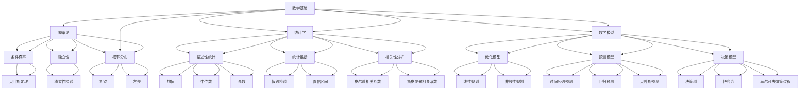

                 

# 数学与决定论：数学世界的因果链

## 关键词：
数学，决定论，概率论，统计学，因果链，逻辑推理，计算机科学，经济学

## 摘要：
本文探讨了数学与决定论之间的关系，从基础理论出发，逐步深入分析数学在决定论中的应用，以及数学模型在决策、经济等领域的重要作用。通过详细讲解核心概念、算法原理，结合实际案例，本文旨在揭示数学在构建因果链和推动科学进步中的关键作用。

## 第一部分：数学与决定论基础理论

### 第1章：数学与决定论概述

#### 1.1 数学与决定论的定义

数学是一门研究数量、结构、变化和空间的科学，而决定论则是一种哲学观点，认为宇宙中的所有事件都是由先前的事件所决定的，不存在真正的随机性。

#### 1.2 数学在决定论中的应用

数学在决定论中扮演着重要角色，特别是概率论和统计学。概率论提供了研究随机事件的数学工具，而统计学则利用概率论分析数据，为决策提供依据。

#### 1.3 决定论的哲学意义

决定论是否否定自由意志，这是一个哲学问题，历史上有着广泛的讨论。决定论在科学解释中的重要性，尤其是在物理学和生物学中，也是一个值得探讨的话题。

### 第2章：数学的基本概念

#### 2.1 数的概念与性质

数的概念在数学中具有基础地位，包括自然数、整数、有理数和无理数。

#### 2.2 函数的概念与性质

函数是数学中的一个核心概念，其定义域和值域、增减性和连续性等性质对理解数学模型至关重要。

#### 2.3 代数结构的基本性质

代数结构是数学中的重要概念，包括群、环、域等。同态和同构等概念有助于我们理解不同代数结构之间的联系。

### 第3章：概率论基础

#### 3.1 随机事件与概率

随机事件是在一定条件下可能发生也可能不发生的事件，概率则是描述随机事件发生可能性的数值。

#### 3.2 条件概率与独立性

条件概率描述了在已知某一事件发生的条件下，另一事件发生的概率。独立性则是指两个事件相互独立，即其中一个事件的发生不影响另一个事件的发生。

#### 3.3 概率分布与期望

概率分布描述了随机变量取不同值的概率，期望则是随机变量取值的加权平均，它描述了随机变量的中心位置。

### 第4章：统计学基础

#### 4.1 统计数据的收集与整理

样本与总体、数据的描述性统计是统计学中的基础概念。

#### 4.2 统计推断

假设检验和置信区间是统计推断中的核心方法，用于判断总体参数是否满足某一假设。

#### 4.3 相关性与回归分析

相关性描述了两个变量之间的线性关系，回归分析则是用于建立变量之间关系模型的方法。

### 第5章：数学模型构建与应用

#### 5.1 数学模型的构建

建立数学模型的基本步骤包括确定目标、选择变量、建立关系。

#### 5.2 数学模型的应用

数学模型在优化问题、预测问题和决策问题中的应用。

### 第6章：数学与计算机科学的交汇

#### 6.1 数学在计算机科学中的应用

算法分析和密码学是数学在计算机科学中的重要应用领域。

#### 6.2 计算机科学对数学的贡献

计算复杂性理论和计算机算法设计是计算机科学对数学的重要贡献。

### 第7章：数学与决策的科学

#### 7.1 数学模型在决策中的应用

决策树和博弈论是数学模型在决策中的应用。

#### 7.2 数学模型与预测分析

预测模型和风险分析是数学模型在预测和分析中的应用。

### 第8章：数学与经济学的交汇

#### 9.1 数学模型在经济学中的应用

供需模型和市场均衡是经济学中常用的数学模型。

#### 9.2 经济学中的数学方法

边际分析和优化理论是经济学中的常用数学方法。

### 附录

#### 附录A：数学与决定论的工具与资源

开源数学软件和数学资源网站为数学研究和应用提供了丰富的工具和资源。

## 总结

数学与决定论之间的关系紧密，数学为决定论提供了坚实的理论基础。通过概率论、统计学等数学工具，我们可以更好地理解随机事件和因果链。数学模型在决策、经济、计算机科学等领域的应用，进一步展示了数学在推动科学进步和实际应用中的关键作用。本文通过详细讲解数学与决定论的基础理论和应用，旨在为读者提供一个全面深入的认识。  

## 作者

作者：AI天才研究院/AI Genius Institute & 禅与计算机程序设计艺术 /Zen And The Art of Computer Programming

<|im_end|>### 第1章：数学与决定论概述

#### 1.1 数学与决定论的定义

数学是一门研究数量、结构、变化和空间的科学。它通过使用符号、公式和逻辑推理来描述现实世界中的现象和关系。数学的应用范围非常广泛，从基础的算术和几何到复杂的微积分和代数，无处不在。数学不仅仅是一门科学，它也是一门语言，一种强大的工具，用于描述和解决问题。

决定论则是一种哲学观点，认为宇宙中的所有事件都是由先前的事件所决定的，不存在真正的随机性。换句话说，决定论认为，如果知道了宇宙中所有粒子的初始状态和所有作用力，理论上就可以精确预测宇宙中未来的所有事件。这个观点与量子力学中的随机性和不确定性相对立，但它在经典物理学和许多其他科学领域中有着广泛的应用。

数学与决定论之间的联系在于，数学为决定论提供了表达和验证的工具。例如，概率论是研究随机事件和不确定性的数学分支，但它也可以用来分析和预测那些在决定论框架下看似随机的事件。统计学则利用概率论，通过分析数据来推断总体特征，为决定论提供了统计上的支持和验证。

#### 1.2 数学在决定论中的应用

数学在决定论中的应用主要体现在概率论和统计学上。

**概率论**：概率论是研究随机事件和不确定性的数学分支。在决定论的框架下，概率论可以被用来描述那些表面上看似随机的事件。例如，在经典力学中，虽然许多物理事件是确定性的，但它们也可能通过概率来描述，因为初始条件的微小变化可能导致显著的结果差异。概率论中的许多概念，如条件概率、独立性和贝叶斯定理，都是用来分析和预测这些看似随机事件的有力工具。

**统计学**：统计学是利用概率论来分析数据的学科。它通过收集、整理和分析数据，为决策提供依据。在决定论的背景下，统计学可以帮助我们理解数据的分布、模式和相关关系。例如，在经济学中，统计学被用来分析市场行为，预测供需变化，从而指导经济政策制定。在生物学中，统计学被用来分析种群动态，预测疾病传播趋势，为公共卫生决策提供支持。

**数学模型**：数学模型是数学在决定论中的核心工具。通过建立数学模型，我们可以将复杂的现实问题抽象为数学形式，从而进行定量分析和预测。例如，经济学中的供需模型、物理学中的牛顿运动定律、生物学中的种群模型等，都是数学模型在决定论中的应用。这些模型通过数学方程和公式来描述系统的行为和演化，为我们提供了理解和预测现实世界现象的工具。

#### 1.3 决定论的哲学意义

决定论在哲学上有着深远的意义，它涉及到自由意志、因果关系和宇宙的本质等核心问题。

**决定论与自由意志**：决定论是否否定自由意志，这是一个哲学问题。一些哲学家认为，决定论意味着一切都是预先决定的，因此自由意志是不存在的。然而，另一些哲学家则认为，虽然决定论在物理层面上是成立的，但人类仍然可以拥有自由意志，因为我们的行为受到认知、情感和文化等多种因素的影响。这种观点被称为“非决定论”，它认为自由意志是一种独立于物理规律的存在。

**决定论与科学解释**：决定论在科学解释中的重要性不言而喻。在经典物理学中，决定论是核心原理之一，它认为，如果知道了宇宙中所有粒子的初始状态和所有作用力，理论上就可以精确预测宇宙中的所有事件。这种观点为科学研究提供了坚实的基础，因为科学的目的之一就是通过理解自然规律来预测未来事件。然而，随着量子力学的发展，决定论的确定性受到了挑战，量子事件具有内在的随机性，这引发了关于决定论和科学解释的新思考。

**决定论与宇宙的本质**：决定论还涉及到宇宙的本质问题。一些哲学家认为，决定论是宇宙的本质特征，因为它意味着宇宙是一个完全可预测的系统。然而，另一些哲学家则认为，宇宙可能包含更深层次的随机性，这种随机性可能决定了宇宙的演化和复杂性。这种观点引发了对宇宙本质和宇宙演化机制的深入思考。

### 第2章：数学的基本概念

数学的基本概念是理解数学理论和应用的基础。这些概念包括数的概念、函数的概念和代数结构的基本性质。

#### 2.1 数的概念与性质

数的概念是数学中最基础的部分，它包括自然数、整数、有理数和无理数。

**自然数**：自然数是从1开始的正整数，通常表示为 {1, 2, 3, ...}。自然数是计数和排序的基础。

**整数**：整数包括正整数、负整数和零，通常表示为 {..., -3, -2, -1, 0, 1, 2, 3, ...}。整数是自然数的扩展，用于表示负数和零。

**有理数**：有理数是可以表示为两个整数之比的数，包括整数和分数。有理数可以表示为形式 a/b，其中a和b是整数，b不等于零。有理数包括所有可以精确表示的分数。

**无理数**：无理数是不能表示为两个整数之比的数，例如π（圆周率）和√2（根号2）。无理数是数学中一个重要的概念，它们不能被精确表示为分数，但可以通过无限不循环小数来表示。

#### 2.2 函数的概念与性质

函数是数学中的一个核心概念，它描述了一个变量如何依赖于另一个变量。在数学中，函数通常表示为 f(x)，其中 x 是自变量，f(x) 是因变量。

**定义域和值域**：定义域是函数可以取值的集合，通常表示为 D。值域是函数取值所构成的集合，通常表示为 R。例如，函数 f(x) = x^2 的定义域是所有实数，值域是非负实数。

**函数的增减性**：函数的增减性描述了函数值随自变量变化的趋势。如果对于定义域中的任意两个数 x1 和 x2，当 x1 < x2 时，有 f(x1) < f(x2)，则函数是增函数。相反，如果 x1 < x2 时，有 f(x1) > f(x2)，则函数是减函数。

**函数的连续性**：函数的连续性描述了函数的平滑性。如果函数在某一点 x0 处的左极限、右极限和函数值相等，则函数在该点连续。函数在整个定义域上连续，则称为连续函数。

#### 2.3 代数结构的基本性质

代数结构是数学中的基本概念，它描述了一组对象以及在这些对象上定义的运算。常见的代数结构包括群、环和域。

**群**：群是一个集合 G 和一个二元运算 *，满足以下性质：
1. 对于 G 中的任意元素 a 和 b，a * b 也属于 G。
2. 对于 G 中的任意元素 a，存在一个元素 e（称为单位元）使得 a * e = e * a = a。
3. 对于 G 中的任意元素 a 和 b，存在一个元素 a'（称为逆元）使得 a * a' = a' * a = e。

**环**：环是一个集合 R 和两个二元运算 + 和 *，满足以下性质：
1. R 对于加法 + 是一个阿贝尔群（交换群）。
2. R 对于乘法 * 是一个半群。
3. 对于 R 中的任意元素 a 和 b，a * b 也属于 R。
4. 对于 R 中的任意元素 a，存在一个元素 0（称为零元）使得 a + 0 = 0 + a = a。
5. 对于 R 中的任意元素 a，存在一个元素 -a（称为相反元）使得 a + (-a) = (-a) + a = 0。

**域**：域是一个集合 F 和两个二元运算 + 和 *，满足以下性质：
1. F 对于加法 + 是一个阿贝尔群。
2. F 对于乘法 * 是一个交换半群。
3. 对于 F 中的任意非零元素 a 和 b，a * b 也属于 F。
4. 对于 F 中的任意非零元素 a，存在一个元素 a^(-1)（称为乘法逆元）使得 a * a^(-1) = a^(-1) * a = 1。
5. 乘法运算 * 对于加法运算 + 是可分配的。

**同态和同构**：同态是保持运算结构的映射，同构是保持结构和性质的映射。
1. 同态：一个从群（或环、域）G 到群（或环、域）H 的映射 f，如果对于 G 中的任意两个元素 a 和 b，都有 f(a * b) = f(a) * f(b)，则称 f 是一个同态。
2. 同构：如果同态 f 还是双射，即对于 G 中的任意元素 a，都存在唯一一个元素 b 使得 f(a) = b，则称 f 是一个同构。

同态和同构在数学中用于研究不同代数结构之间的相似性和结构保持性。

#### 2.4 数学的基本概念与联系

数学的基本概念之间存在着紧密的联系，它们共同构成了数学的体系。

**数与代数结构**：数是代数结构的基础，代数结构描述了数的运算性质。例如，整数、有理数和无理数构成了不同的代数结构，这些结构在不同的数学分支中有着广泛的应用。

**函数与映射**：函数是映射的一种形式，它将一个集合（定义域）中的元素映射到另一个集合（值域）中的元素。函数的概念在数学分析、几何、代数等领域中至关重要。

**集合与逻辑**：集合是数学的基本概念，用于表示一组确定的元素。逻辑则是数学中用于推理和证明的工具，它为集合论和数学结构提供了理论基础。

**几何与拓扑**：几何研究空间和形状的性质，而拓扑则研究空间的结构和性质。几何和拓扑是数学中的两个重要分支，它们相互交叉，为许多实际问题提供了数学工具。

这些基本概念相互交织，共同构成了数学的丰富内涵。理解这些概念及其之间的联系，对于深入掌握数学理论和应用至关重要。

### 第3章：概率论基础

概率论是研究随机事件和不确定性的数学分支。它提供了量化不确定性的工具，并广泛应用于科学、工程、金融和社会科学等领域。在本节中，我们将介绍概率论的基础概念，包括随机事件、概率、条件概率、独立性以及概率分布和期望。

#### 3.1 随机事件与概率

**随机事件**：随机事件是在一定条件下可能发生也可能不发生的事件。例如，掷一枚硬币正面朝上、抛一颗骰子得到6、股票价格上涨等都是随机事件。

**概率**：概率是描述随机事件发生可能性的数值，通常用0到1之间的实数表示。概率的值越接近1，事件发生的可能性越大；越接近0，事件发生的可能性越小。概率的计算可以通过以下几种方法：

1. **古典概率**：古典概率是基于等可能性原理的，适用于有限样本空间的情况。古典概率的计算公式为：
   \[
   P(A) = \frac{\text{事件A的可能结果数}}{\text{样本空间的总结果数}}
   \]
   其中，\( P(A) \) 是事件A的概率，分子是事件A的所有可能结果的个数，分母是样本空间的所有可能结果的个数。

2. **几何概率**：几何概率通常用于连续随机变量的情况，它基于事件的长度、面积或体积的比例。例如，投掷一个均匀的圆环，事件A是圆环落在某个区域B内，则事件A的概率为：
   \[
   P(A) = \frac{\text{区域B的面积}}{\text{圆环的总面积}}
   \]

3. **条件概率**：条件概率是已知某一事件发生的条件下，另一事件发生的概率。条件概率的计算公式为：
   \[
   P(B|A) = \frac{P(A \cap B)}{P(A)}
   \]
   其中，\( P(B|A) \) 是在事件A发生的条件下事件B的概率，\( P(A \cap B) \) 是事件A和事件B同时发生的概率，\( P(A) \) 是事件A发生的概率。

**概率的加法定理**：概率的加法定理描述了多个互斥事件（即不能同时发生的事件）的概率和。加法定理的公式为：
   \[
   P(A \cup B) = P(A) + P(B) - P(A \cap B)
   \]
   其中，\( P(A \cup B) \) 是事件A或事件B发生的概率。

**概率的乘法定理**：概率的乘法定理描述了多个独立事件（即一个事件的发生不影响另一个事件的发生）的概率积。乘法定理的公式为：
   \[
   P(A \cap B) = P(A) \cdot P(B|A)
   \]
   或者，如果事件A和事件B相互独立，则：
   \[
   P(A \cap B) = P(A) \cdot P(B)
   \]

#### 3.2 条件概率与独立性

**条件概率**：条件概率是已知某一事件发生的条件下，另一事件发生的概率。例如，已知今天下雨的条件下，明天也会下雨的概率。

条件概率的计算公式为：
   \[
   P(B|A) = \frac{P(A \cap B)}{P(A)}
   \]
   其中，\( P(B|A) \) 是在事件A发生的条件下事件B的概率，\( P(A \cap B) \) 是事件A和事件B同时发生的概率，\( P(A) \) 是事件A发生的概率。

**贝叶斯定理**：贝叶斯定理是条件概率的一种推广，它描述了在给定一个事件发生的条件下，另一个事件发生概率的计算方法。贝叶斯定理的公式为：
   \[
   P(A|B) = \frac{P(B|A) \cdot P(A)}{P(B)}
   \]
   其中，\( P(A|B) \) 是在事件B发生的条件下事件A的概率，\( P(B|A) \) 是在事件A发生的条件下事件B的概率，\( P(A) \) 是事件A的概率，\( P(B) \) 是事件B的概率。

**独立性**：两个事件A和B是独立的，如果其中一个事件的发生不影响另一个事件的发生。独立性可以表示为：
   \[
   P(A \cap B) = P(A) \cdot P(B)
   \]
   如果事件A和事件B独立，则条件概率 \( P(B|A) \) 等于事件B的原始概率 \( P(B) \)。

#### 3.3 概率分布与期望

**概率分布**：概率分布描述了随机变量取不同值的概率。常见的概率分布包括离散概率分布和连续概率分布。

**离散概率分布**：离散概率分布适用于随机变量取有限或可数无限个值的情形。例如，掷骰子的结果是一个离散随机变量，其概率分布可以表示为一个概率质量函数（PMF）：
   \[
   P(X = x) = f_X(x)
   \]
   其中，\( X \) 是随机变量，\( x \) 是可能的取值，\( f_X(x) \) 是随机变量取值 \( x \) 的概率。

**连续概率分布**：连续概率分布适用于随机变量取连续值的情形。例如，投掷均匀圆环落在某个区域的概率。连续概率分布可以表示为一个概率密度函数（PDF）：
   \[
   f_X(x) = P(X \leq x)
   \]
   其中，\( f_X(x) \) 是随机变量取值小于或等于 \( x \) 的概率。

**期望**：期望是随机变量取值的加权平均，它描述了随机变量的中心位置。期望的计算公式为：

对于离散随机变量 \( X \)：
   \[
   E(X) = \sum_{x} x \cdot P(X = x)
   \]
   对于连续随机变量 \( X \)：
   \[
   E(X) = \int_{-\infty}^{\infty} x \cdot f_X(x) \, dx
   \]
   其中，\( E(X) \) 是随机变量 \( X \) 的期望值，\( x \) 是随机变量的取值，\( P(X = x) \) 或 \( f_X(x) \) 是随机变量取值 \( x \) 的概率。

**方差**：方差是衡量随机变量离散程度的统计量。方差可以表示为期望的平方：
   \[
   Var(X) = E[(X - E(X))^2]
   \]
   其中，\( Var(X) \) 是随机变量 \( X \) 的方差，\( E(X) \) 是期望值。

常见的概率分布包括：

1. **二项分布**：适用于固定次数的独立试验，每次试验有两种可能结果（成功或失败）。二项分布的概率质量函数为：
   \[
   P(X = k) = C(n, k) \cdot p^k \cdot (1 - p)^{n - k}
   \]
   其中，\( n \) 是试验次数，\( k \) 是成功的次数，\( p \) 是每次试验成功的概率。

2. **泊松分布**：适用于固定时间间隔内随机事件发生的次数。泊松分布的概率质量函数为：
   \[
   P(X = k) = \frac{\lambda^k \cdot e^{-\lambda}}{k!}
   \]
   其中，\( \lambda \) 是单位时间内的平均事件发生次数。

3. **正态分布**：正态分布是最常见的连续概率分布，它描述了大多数自然现象和统计数据。正态分布的概率密度函数为：
   \[
   f(x) = \frac{1}{\sqrt{2\pi\sigma^2}} \cdot e^{-\frac{(x - \mu)^2}{2\sigma^2}}
   \]
   其中，\( \mu \) 是均值，\( \sigma \) 是标准差。

概率分布和期望是概率论中重要的概念，它们为随机事件的分析和预测提供了基础。通过计算概率分布和期望，我们可以更好地理解随机现象，为决策和科学研究提供依据。

### 第4章：统计学基础

统计学是应用数学的一个分支，主要研究如何通过收集、整理、分析和解释数据来获取信息，并据此做出合理的决策或预测。在统计学中，数据被视为信息的载体，通过对数据的统计分析，我们可以揭示数据背后的规律，为实际问题提供科学依据。本节将介绍统计学的基本概念，包括统计数据的收集与整理、描述性统计、统计推断和相关性分析。

#### 4.1 统计数据的收集与整理

**样本与总体**

在统计学中，我们通常将研究的对象称为总体，而将总体中的一部分个体称为样本。总体是研究对象的全体，而样本是从总体中随机抽取的一部分个体。样本的选择和代表性对统计推断的准确性至关重要。

**数据的描述性统计**

描述性统计是用于总结和描述数据的基本特征的方法。它包括以下几个方面：

1. **频数分布**：频数分布描述了各个数据值出现的次数。通常用条形图、饼图或直方图来表示。
2. **集中趋势**：集中趋势指标描述了数据集中的位置，常用的指标有均值、中位数和众数。
   - **均值**：均值是数据值加总后除以数据个数的结果，它是数据集的中心位置度量，计算公式为：
     \[
     \bar{x} = \frac{1}{n} \sum_{i=1}^{n} x_i
     \]
     其中，\( x_i \) 是第 \( i \) 个数据值，\( n \) 是数据个数。
   - **中位数**：中位数是将数据值按大小顺序排列后，位于中间位置的值。如果数据个数为奇数，中位数就是中间的那个值；如果数据个数为偶数，中位数是中间两个值的平均。
   - **众数**：众数是数据集中出现次数最多的值。

3. **离散程度**：离散程度指标描述了数据值的分散程度，常用的指标有方差、标准差和变异系数。
   - **方差**：方差是各个数据值与均值差的平方的平均值，它是衡量数据离散程度的常用指标，计算公式为：
     \[
     \sigma^2 = \frac{1}{n} \sum_{i=1}^{n} (x_i - \bar{x})^2
     \]
   - **标准差**：标准差是方差的平方根，它是衡量数据离散程度的另一种常用指标，计算公式为：
     \[
     \sigma = \sqrt{\sigma^2}
     \]
   - **变异系数**：变异系数是标准差与均值的比值，用于衡量相对离散程度，计算公式为：
     \[
     CV = \frac{\sigma}{\bar{x}} \times 100\%
     \]

**数据的整理**

数据的整理是统计分析的前期工作，包括数据的清洗、分类和编码。数据清洗是指去除错误、重复或缺失的数据，确保数据的质量。数据分类和编码则是将数据转换为适合分析的形式。

#### 4.2 统计推断

统计推断是从样本数据推断总体特征的统计学方法。主要包括以下两个方面：

**参数估计**：参数估计是通过样本数据来估计总体参数的方法。常用的估计方法有点估计和区间估计。

- **点估计**：点估计是直接给出总体参数的一个估计值。例如，用样本均值估计总体均值，用样本方差估计总体方差。
- **区间估计**：区间估计是给出总体参数的估计范围。区间估计通常用置信区间表示，置信区间是总体参数的可能范围，它在一定的概率下包含总体参数的真实值。置信区间通常用样本统计量加减一个临界值（例如，标准误差）来表示。

**假设检验**：假设检验是用于判断样本数据是否支持某个假设的方法。假设检验通常包括以下几个步骤：

1. **提出原假设和备择假设**：原假设通常表示无差异或无效应，而备择假设表示存在差异或效应。
2. **确定显著性水平**：显著性水平是判断假设检验结果是否显著的标准，通常取0.05或0.01。
3. **计算检验统计量**：根据样本数据计算检验统计量，检验统计量用于衡量样本数据与原假设的差异程度。
4. **做出决策**：根据检验统计量与临界值的比较，做出是否拒绝原假设的决策。

常见的假设检验方法有t检验、F检验和卡方检验等。

#### 4.3 相关性与回归分析

**相关性**：相关性描述了两个变量之间的线性关系。常用的相关性指标有皮尔逊相关系数和斯皮尔曼相关系数。

- **皮尔逊相关系数**：皮尔逊相关系数是衡量两个变量线性相关程度的指标，取值范围为-1到1。正相关系数表示两个变量正相关，负相关系数表示两个变量负相关，零相关系数表示两个变量线性无关。
- **斯皮尔曼相关系数**：斯皮尔曼相关系数是衡量两个变量等级相关程度的指标，也取值范围为-1到1。

**回归分析**：回归分析是用于建立变量之间关系模型的方法。常见的回归分析方法有线性回归、多项式回归和逻辑回归等。

- **线性回归**：线性回归是建立自变量和因变量之间线性关系的模型。线性回归模型可以表示为：
  \[
  y = \beta_0 + \beta_1x_1 + \beta_2x_2 + ... + \beta_nx_n + \epsilon
  \]
  其中，\( y \) 是因变量，\( x_1, x_2, ..., x_n \) 是自变量，\( \beta_0, \beta_1, ..., \beta_n \) 是回归系数，\( \epsilon \) 是误差项。
- **多项式回归**：多项式回归是建立自变量和因变量之间多项式关系的模型。
- **逻辑回归**：逻辑回归是建立二元因变量和自变量之间关系的模型，常用于分类问题。

通过相关性分析和回归分析，我们可以了解变量之间的关系，并利用这些关系进行预测和决策。

统计学作为一门应用广泛的学科，通过描述性统计、统计推断和相关性分析等方法，为数据的分析和解释提供了强有力的工具。理解统计学的基础概念和方法，对于科学研究、商业决策和社会治理等领域具有重要意义。

### 第5章：数学模型构建与应用

#### 5.1 数学模型的构建

数学模型是用于描述和解决实际问题的抽象数学结构。构建数学模型的过程通常包括以下几个步骤：

**步骤1：确定目标**

首先，我们需要明确要解决的问题和目标。例如，在优化问题中，目标可能是最大化利润或最小化成本；在预测问题中，目标可能是预测未来的趋势或预测某种现象的发生概率。

**步骤2：选择变量**

接下来，我们需要选择适当的变量来表示问题的各个要素。这些变量可以是连续的，也可以是离散的。例如，在优化问题中，变量可能代表生产量、资源消耗等；在预测问题中，变量可能代表时间、温度、降雨量等。

**步骤3：建立关系**

在这一步，我们需要根据问题的性质和目标，建立变量之间的数学关系。这些关系可以是线性的，也可以是非线性的。例如，在优化问题中，关系可能表现为目标函数和约束条件；在预测问题中，关系可能表现为变量之间的线性或非线性回归模型。

**步骤4：参数化**

在建立了变量之间的关系后，我们需要为模型中的参数赋予具体的数值。这些参数可以通过历史数据、专家知识或实验结果来确定。例如，在优化问题中，参数可能代表生产效率、市场价格等；在预测问题中，参数可能代表模型中的权重、阈值等。

**步骤5：验证和优化**

最后，我们需要验证模型的有效性和准确性，并根据实际情况进行优化。验证可以通过对历史数据进行回测或进行交叉验证来实现。优化可以通过调整模型参数或改进模型结构来实现。

**数学模型的分类**

数学模型可以根据其应用领域和特点进行分类，以下是几种常见的数学模型：

1. **优化模型**：优化模型用于在满足约束条件的情况下，最大化或最小化某个目标函数。常见的优化模型包括线性规划、非线性规划、动态规划等。

2. **预测模型**：预测模型用于根据历史数据预测未来的趋势或事件的发生概率。常见的预测模型包括时间序列预测、回归预测、贝叶斯预测等。

3. **决策模型**：决策模型用于在不确定的环境下，根据各种可能的情境和结果，做出最优的决策。常见的决策模型包括博弈论、决策树、马尔可夫决策过程等。

4. **统计分析模型**：统计分析模型用于对数据进行描述、推断和分析。常见的统计分析模型包括假设检验、回归分析、方差分析等。

#### 5.2 数学模型的应用

**优化问题**

优化问题是数学模型应用的一个重要领域。优化问题的目标是在满足约束条件的情况下，最大化或最小化某个目标函数。线性规划和非线性规划是两种常见的优化模型。

- **线性规划**：线性规划是解决线性目标函数在线性约束条件下的优化问题。线性规划模型可以表示为：
  \[
  \begin{cases}
  \max \sum_{i=1}^{n} c_i x_i \\
  \text{subject to} \\
  \sum_{j=1}^{m} a_{ij} x_j \leq b_j \\
  x_i \geq 0, \quad i=1,2,...,n
  \end{cases}
  \]
  其中，\( x_i \) 是决策变量，\( c_i \) 是目标函数的系数，\( a_{ij} \) 和 \( b_j \) 是约束条件的系数。

- **非线性规划**：非线性规划是解决非线性目标函数在非线性约束条件下的优化问题。非线性规划模型可以表示为：
  \[
  \begin{cases}
  \min f(x) \\
  \text{subject to} \\
  g_i(x) \leq 0, \quad h_j(x) = 0, \quad i=1,2,...,m; \quad j=1,2,...,l
  \end{cases}
  \]
  其中，\( f(x) \) 是目标函数，\( g_i(x) \) 和 \( h_j(x) \) 是约束条件的函数。

**预测问题**

预测问题是根据历史数据预测未来的趋势或事件的发生概率。预测问题的解决方法包括时间序列预测、回归预测和贝叶斯预测等。

- **时间序列预测**：时间序列预测是预测某个变量在未来某个时间点的取值。时间序列预测模型可以表示为：
  \[
  y_t = \phi_0 + \phi_1 y_{t-1} + \phi_2 y_{t-2} + ... + \phi_n y_{t-n} + \epsilon_t
  \]
  其中，\( y_t \) 是时间序列在时间 \( t \) 的取值，\( \phi_0, \phi_1, ..., \phi_n \) 是模型的参数，\( \epsilon_t \) 是随机误差项。

- **回归预测**：回归预测是通过建立变量之间的线性或非线性关系来预测未来的取值。回归预测模型可以表示为：
  \[
  y = \beta_0 + \beta_1 x_1 + \beta_2 x_2 + ... + \beta_n x_n + \epsilon
  \]
  其中，\( y \) 是因变量，\( x_1, x_2, ..., x_n \) 是自变量，\( \beta_0, \beta_1, ..., \beta_n \) 是回归系数，\( \epsilon \) 是误差项。

- **贝叶斯预测**：贝叶斯预测是基于贝叶斯定理的一种预测方法。贝叶斯预测模型可以表示为：
  \[
  P(y|X) = \frac{P(X|y) \cdot P(y)}{P(X)}
  \]
  其中，\( P(y|X) \) 是在给定自变量 \( X \) 的条件下，因变量 \( y \) 的概率，\( P(X|y) \) 是在给定因变量 \( y \) 的条件下，自变量 \( X \) 的概率，\( P(y) \) 是因变量 \( y \) 的概率，\( P(X) \) 是自变量 \( X \) 的概率。

**决策问题**

决策问题是根据不同的情境和结果，选择最优的决策方案。决策问题的解决方法包括博弈论、决策树和马尔可夫决策过程等。

- **博弈论**：博弈论是研究决策者在相互影响的环境下如何做出决策的学科。博弈论模型可以表示为：
  \[
  \begin{cases}
  \max \pi_i = u_i(S_i, S_{-i}) \\
  \text{subject to} \\
  S_i \in \{s_{i1}, s_{i2}, ..., s_{in}\}
  \end{cases}
  \]
  其中，\( \pi_i \) 是玩家 \( i \) 的收益，\( u_i \) 是玩家 \( i \) 的效用函数，\( S_i \) 是玩家 \( i \) 的策略，\( S_{-i} \) 是其他玩家的策略。

- **决策树**：决策树是一种直观的决策模型，它通过一系列条件判断来选择最优的决策方案。决策树模型可以表示为：
  \[
  \begin{cases}
  \text{if } C_1 \text{ then } D_1 \\
  \text{if } C_2 \text{ then } D_2 \\
  \text{if } C_3 \text{ then } D_3 \\
  \text{else } D_4
  \end{cases}
  \]
  其中，\( C_1, C_2, C_3 \) 是条件，\( D_1, D_2, D_3, D_4 \) 是决策方案。

- **马尔可夫决策过程**：马尔可夫决策过程是用于在不确定的环境下做出最优决策的数学模型。马尔可夫决策过程可以表示为：
  \[
  \begin{cases}
  \max \sum_{t=0}^{\infty} \gamma^t \pi_i(S_t, S_{-i}) \\
  \text{subject to} \\
  P(S_{t+1} = s_{i1} | S_t = s_i) = p_{i1}, \quad P(S_{t+1} = s_{i2} | S_t = s_i) = p_{i2}, \quad ...
  \end{cases}
  \]
  其中，\( \pi_i \) 是玩家 \( i \) 的收益，\( S_t \) 是时间 \( t \) 的状态，\( s_i \) 是状态 \( S_t \) 的取值，\( p_{ij} \) 是状态转移概率。

通过构建和应用数学模型，我们可以更有效地解决实际问题，提高决策的准确性和效率。数学模型的应用领域非常广泛，从经济管理到工程优化，从自然科学到社会科学，数学模型都发挥着重要的作用。

### 第6章：数学与计算机科学的交汇

数学与计算机科学之间的交汇点在于数学为计算机科学提供了理论基础和工具，而计算机科学则为数学提供了强大的计算能力和新应用领域。在本章中，我们将探讨数学在计算机科学中的应用，以及计算机科学对数学的贡献。

#### 6.1 数学在计算机科学中的应用

**算法分析**

算法分析是计算机科学中的一个核心概念，它使用数学方法来评估算法的性能。通过算法分析，我们可以了解算法的时间复杂度和空间复杂度，从而判断算法的效率和适用性。算法分析中的基本概念包括：

- **时间复杂度**：时间复杂度描述了算法在运行过程中所需的时间，通常用大O符号（\(O\)）表示。例如，一个算法的时间复杂度为 \(O(n)\)，表示随着输入规模 \(n\) 的增加，算法所需的时间呈线性增长。

- **空间复杂度**：空间复杂度描述了算法在运行过程中所需的空间，同样也用大O符号表示。空间复杂度对于评估算法在内存受限环境中的性能尤为重要。

**算法分析的基本工具**：

- **伪代码**：伪代码是一种描述算法过程的文字工具，它不依赖于任何特定的编程语言，但可以清晰地表达算法的逻辑结构。

- **数学公式**：在算法分析中，我们经常使用数学公式来描述算法的性能。例如，我们可以使用对数、指数和幂函数等来表示算法的时间复杂度。

**密码学**

密码学是研究加密和解密技术的一门科学，它广泛应用于网络安全、数据保护等领域。密码学中的许多概念和算法都依赖于数学原理，特别是数论和代数。

- **数论**：数论研究整数及其性质，它在密码学中用于构造公钥密码系统，如RSA加密算法。

- **代数**：代数研究集合上的运算结构，它在密码学中用于设计复杂的加密算法，如椭圆曲线密码学。

**计算机算法设计**

计算机算法设计是应用数学方法解决实际问题的过程。通过数学模型和优化理论，我们可以设计出高效的算法来解决各种问题。

- **线性规划**：线性规划是一种优化方法，用于在满足线性约束条件下最大化或最小化线性目标函数。线性规划在资源分配、生产调度等领域有广泛应用。

- **动态规划**：动态规划是一种解决多阶段决策问题的方法，它通过递归关系和状态转移方程来优化决策过程。动态规划在路径规划、背包问题等领域有广泛应用。

**计算复杂性理论**

计算复杂性理论是研究问题计算难度的学科，它用于分类不同类型的问题。计算复杂性理论中的基本概念包括：

- **P与NP问题**：P与NP问题是计算复杂性理论中的核心问题，P类问题是可以在多项式时间内求解的，而NP类问题是可以在多项式时间内验证的。

- **NPC（NP完全）问题**：NPC问题是一类在计算复杂性理论中难度最大的问题，如果能够找到一个算法在多项式时间内解决NPC问题，那么所有NP问题都可以在多项式时间内解决。

**图论**

图论是研究图及其性质的一门学科，它在计算机网络、算法设计等领域有广泛应用。

- **图的基本概念**：图由顶点和边组成，顶点表示实体，边表示顶点之间的关系。

- **图的算法**：图的算法包括最短路径算法、最小生成树算法、网络流算法等。

#### 6.2 计算机科学对数学的贡献

**计算能力**

计算机科学的发展为数学研究提供了强大的计算能力。在过去，许多数学问题由于计算能力有限而无法解决，但随着计算机的普及和计算能力的提升，这些问题得以被解决。例如，大规模矩阵运算、高维数据分析、复杂的数值模拟等。

**算法创新**

计算机科学的发展推动了算法的创新，许多新的算法在数学问题上取得了突破。例如，量子计算算法在因数分解、搜索问题等领域具有巨大潜力。此外，机器学习算法如深度神经网络在处理大规模数据、模式识别等领域表现出了出色的性能。

**数据科学**

数据科学是计算机科学和数学的交叉领域，它利用统计方法、机器学习算法和数学模型来分析和解释复杂数据。数据科学的发展为数学模型的应用提供了新的机会，同时也推动了数学方法在数据分析、预测建模等方面的创新。

**分布式计算**

分布式计算是计算机科学中的重要概念，它通过多个计算机协同工作来提高计算效率。分布式计算在解决大规模数学问题、分布式计算几何等领域具有重要意义。例如，分布式计算可以用于大规模矩阵运算、复杂系统的模拟等。

**计算机图形学**

计算机图形学是计算机科学和数学的另一个交叉领域，它研究如何使用数学方法生成和处理图像。计算机图形学中的许多算法，如渲染算法、几何建模等，都依赖于数学原理。

总之，数学与计算机科学的交汇不仅推动了数学的发展，也为计算机科学提供了新的研究方向和应用领域。数学与计算机科学的结合为解决复杂问题、推动科学进步提供了强大的工具和动力。

### 第7章：数学与决策的科学

数学在决策科学中扮演着至关重要的角色，通过构建数学模型和分析方法，我们可以在复杂和不确定的环境中做出更加科学和理性的决策。本节将探讨数学模型在决策中的应用，以及数学模型在预测分析和风险分析中的具体应用。

#### 7.1 数学模型在决策中的应用

**决策树**

决策树是一种直观的决策模型，它通过一系列的条件判断来选择最优的决策方案。决策树通常由节点和分支组成，每个节点表示一个条件判断，每个分支表示一个可能的决策结果。

- **构建决策树**：构建决策树通常需要以下几个步骤：
  1. **确定决策问题**：明确要解决的问题和目标。
  2. **收集数据**：收集与决策相关的数据。
  3. **选择属性**：选择用于判断的属性或特征。
  4. **计算信息增益**：通过计算信息增益来确定每个属性的最佳划分点。
  5. **生成决策树**：根据信息增益计算结果生成决策树。

- **决策树的应用**：决策树广泛应用于分类和回归问题。在分类问题中，决策树用于预测未知样本的类别；在回归问题中，决策树用于预测未知样本的数值。

**博弈论**

博弈论是研究决策者在相互影响的环境下如何做出决策的学科。博弈论模型通过定义参与者的策略、支付函数和博弈规则来分析决策者的最优策略。

- **构建博弈模型**：构建博弈模型通常需要以下几个步骤：
  1. **确定参与者**：明确博弈的参与者及其目标和策略。
  2. **定义策略空间**：为每个参与者定义其可以采取的策略集合。
  3. **定义支付函数**：定义参与者的支付函数，用于计算参与者的收益。
  4. **求解最优策略**：通过求解博弈模型来确定参与者的最优策略。

- **博弈论的应用**：博弈论广泛应用于经济、政治、军事等领域。在经济学中，博弈论用于分析市场竞争、拍卖机制等；在政治学中，博弈论用于分析选举策略、联盟形成等。

**线性规划**

线性规划是一种用于在满足线性约束条件下最大化或最小化线性目标函数的数学模型。线性规划广泛应用于资源分配、生产调度、成本控制等领域。

- **构建线性规划模型**：构建线性规划模型通常需要以下几个步骤：
  1. **确定决策变量**：明确要优化的变量。
  2. **确定目标函数**：确定要最大化或最小化的目标函数。
  3. **确定约束条件**：确定决策变量需要满足的约束条件。

- **求解线性规划**：线性规划可以通过单纯形法、内点法等算法求解。求解线性规划可以得到最优解，从而指导实际决策。

#### 7.2 数学模型与预测分析

**时间序列预测**

时间序列预测是利用历史数据来预测未来的趋势。时间序列预测模型通常基于统计方法和机器学习方法。

- **统计方法**：统计方法包括移动平均法、指数平滑法、自回归模型等。这些方法通过分析历史数据的趋势和周期性来预测未来的趋势。

- **机器学习方法**：机器学习方法包括线性回归、支持向量机、神经网络等。这些方法通过建立历史数据与未来趋势之间的数学模型来预测未来的趋势。

**回归预测**

回归预测是利用已知变量之间的关系来预测未知变量的值。回归预测模型通常基于线性回归、多项式回归和逻辑回归等。

- **线性回归**：线性回归通过建立因变量和自变量之间的线性关系来预测未知变量的值。线性回归模型可以表示为：
  \[
  y = \beta_0 + \beta_1 x_1 + \beta_2 x_2 + ... + \beta_n x_n + \epsilon
  \]
  其中，\( y \) 是因变量，\( x_1, x_2, ..., x_n \) 是自变量，\( \beta_0, \beta_1, ..., \beta_n \) 是回归系数，\( \epsilon \) 是误差项。

- **多项式回归**：多项式回归通过建立因变量和自变量之间的多项式关系来预测未知变量的值。

- **逻辑回归**：逻辑回归通过建立二元因变量和自变量之间的逻辑关系来预测未知变量的值。逻辑回归模型可以表示为：
  \[
  \ln \frac{P(y=1)}{1 - P(y=1)} = \beta_0 + \beta_1 x_1 + \beta_2 x_2 + ... + \beta_n x_n
  \]
  其中，\( y \) 是二元因变量，\( x_1, x_2, ..., x_n \) 是自变量，\( \beta_0, \beta_1, ..., \beta_n \) 是回归系数。

**贝叶斯预测**

贝叶斯预测是一种基于贝叶斯定理的预测方法。贝叶斯预测通过分析历史数据和先验知识来预测未来的趋势。

- **贝叶斯预测模型**：贝叶斯预测模型可以表示为：
  \[
  P(y|X) = \frac{P(X|y) \cdot P(y)}{P(X)}
  \]
  其中，\( P(y|X) \) 是在给定自变量 \( X \) 的条件下，因变量 \( y \) 的概率，\( P(X|y) \) 是在给定因变量 \( y \) 的条件下，自变量 \( X \) 的概率，\( P(y) \) 是因变量 \( y \) 的概率，\( P(X) \) 是自变量 \( X \) 的概率。

#### 7.3 数学模型与风险分析

风险分析是评估和量化潜在风险的过程。数学模型在风险分析中用于评估风险的概率和影响，并制定相应的风险管理策略。

**概率分布**

概率分布是描述随机变量取不同值的概率的数学模型。常见的概率分布包括正态分布、泊松分布、二项分布等。

- **正态分布**：正态分布是描述连续随机变量取值的概率分布，其概率密度函数可以表示为：
  \[
  f(x) = \frac{1}{\sqrt{2\pi\sigma^2}} \cdot e^{-\frac{(x - \mu)^2}{2\sigma^2}}
  \]
  其中，\( \mu \) 是均值，\( \sigma \) 是标准差。

- **泊松分布**：泊松分布是描述离散随机变量取值的概率分布，其概率质量函数可以表示为：
  \[
  P(X = k) = \frac{\lambda^k \cdot e^{-\lambda}}{k!}
  \]
  其中，\( \lambda \) 是事件发生的平均次数。

- **二项分布**：二项分布是描述离散随机变量取值的概率分布，其概率质量函数可以表示为：
  \[
  P(X = k) = C(n, k) \cdot p^k \cdot (1 - p)^{n - k}
  \]
  其中，\( n \) 是试验次数，\( k \) 是成功的次数，\( p \) 是每次试验成功的概率。

**风险矩阵**

风险矩阵是用于评估风险的概率和影响的工具。风险矩阵通常包括以下三个维度：

- **概率**：表示风险发生的概率。
- **影响**：表示风险发生的影响程度。
- **优先级**：表示风险处理的优先级。

- **构建风险矩阵**：构建风险矩阵通常需要以下步骤：
  1. **确定风险因素**：明确可能的风险因素。
  2. **评估概率和影响**：根据历史数据和专家意见评估每个风险因素的概率和影响。
  3. **确定优先级**：根据风险的概率和影响确定风险处理的优先级。

通过数学模型在决策、预测分析和风险分析中的应用，我们可以更科学、更有效地进行决策，降低风险，提高决策的质量和效果。

### 第8章：数学与经济学的交汇

数学在经济学中的应用是经济学研究的重要支柱，通过数学模型，经济学家能够更准确地描述和预测经济现象，从而为政策制定和市场分析提供有力支持。在本章中，我们将探讨数学模型在经济学中的应用，特别是供需模型和市场均衡。

#### 8.1 数学模型在经济学中的应用

**供需模型**

供需模型是经济学中最基本的模型之一，它描述了商品或服务的需求与供给之间的关系。供需模型可以帮助我们理解价格如何由市场供求力量决定。

- **需求函数**：需求函数描述了消费者在不同价格水平下愿意购买的商品数量。需求函数通常具有负斜率，即价格上升时需求量下降。

  \[
  Q_d = Q_d(P)
  \]
  其中，\( Q_d \) 是需求量，\( P \) 是价格。

- **供给函数**：供给函数描述了生产者在不同价格水平下愿意提供的商品数量。供给函数通常具有正斜率，即价格上升时供给量增加。

  \[
  Q_s = Q_s(P)
  \]
  其中，\( Q_s \) 是供给量，\( P \) 是价格。

- **市场均衡**：市场均衡发生在需求量等于供给量的价格水平。在这个价格水平上，市场达到均衡状态，没有过剩或短缺。

  \[
  Q_d = Q_s
  \]

**市场均衡方程**：

\[
Q_d(P) = Q_s(P)
\]

通过解这个方程，我们可以找到市场均衡价格 \( P^* \) 和均衡数量 \( Q^* \)。

**需求弹性**

需求弹性是衡量需求对价格变化的敏感度的一个指标。它用于描述需求量的变化百分比与价格变化百分比的比率。

\[
\epsilon_d = \frac{\partial Q_d / Q_d}{\partial P / P} = \frac{P / Q_d}{\partial Q_d / \partial P}
\]

其中，\( \epsilon_d \) 是需求弹性，\( \partial \) 表示微分。

- **弹性大于1**：需求富有弹性，即需求量对价格变化非常敏感。
- **弹性等于1**：需求单位弹性，即需求量与价格变化保持相同比例。
- **弹性小于1**：需求缺乏弹性，即需求量对价格变化不敏感。

**供给弹性**

供给弹性是衡量供给对价格变化的敏感度的一个指标。它用于描述供给量的变化百分比与价格变化百分比的比率。

\[
\epsilon_s = \frac{\partial Q_s / Q_s}{\partial P / P} = \frac{P / Q_s}{\partial Q_s / \partial P}
\]

其中，\( \epsilon_s \) 是供给弹性。

#### 8.2 经济学中的数学方法

**边际分析**

边际分析是经济学中常用的方法，用于评估决策的边际成本和边际效益。

- **边际成本**：边际成本是生产额外一单位商品或服务所需的成本。

  \[
  MC = \frac{\partial C}{\partial Q}
  \]

  其中，\( MC \) 是边际成本，\( C \) 是总成本，\( Q \) 是生产量。

- **边际效益**：边际效益是消费者购买额外一单位商品或服务所获得的最大额外效用。

  \[
  MB = \frac{\partial U}{\partial Q}
  \]

  其中，\( MB \) 是边际效益，\( U \) 是总效用，\( Q \) 是消费量。

**优化理论**

优化理论是经济学中用于最大化效用或利润的方法。

- **消费者选择优化**：消费者选择优化问题通常是一个预算约束下的最大化效用问题。

  \[
  \max U(Q_1, Q_2) \quad \text{subject to} \quad P_1 Q_1 + P_2 Q_2 = I
  \]

  其中，\( U \) 是效用函数，\( P_1 \) 和 \( P_2 \) 是商品1和商品2的价格，\( I \) 是预算。

- **生产者选择优化**：生产者选择优化问题通常是一个成本约束下的最大化利润问题。

  \[
  \max \pi = R - C \quad \text{subject to} \quad C(Q) \leq W
  \]

  其中，\( \pi \) 是利润，\( R \) 是收入，\( C \) 是成本函数，\( W \) 是总成本。

通过数学模型和优化方法，经济学家能够更准确地分析经济现象，制定有效的经济政策，并为企业提供决策支持。

### 附录A：数学与决定论的工具与资源

在数学与决定论的研究和应用过程中，有许多开源软件和资源可以帮助研究人员和开发者进行高效的工作。以下是一些常用的工具和资源：

#### 附录A.1 开源数学软件

**MATLAB**：MATLAB 是一款广泛使用的数学软件，它提供了丰富的工具箱和函数，用于数据分析、算法开发、仿真建模等。MATLAB 的优势在于其强大的图形用户界面和编程环境，使复杂的数学计算变得更加直观和易于操作。

**Python的科学计算库**：Python 是一种流行的编程语言，拥有丰富的科学计算库，如 NumPy、Pandas、SciPy 和 Matplotlib。NumPy 提供了强大的数组操作和数值计算功能；Pandas 提供了数据分析和数据结构；SciPy 提供了科学计算函数；Matplotlib 提供了数据可视化的功能。

#### 附录A.2 数学资源网站

**Math Stack Exchange**：Math Stack Exchange 是一个数学问题解答社区，提供了广泛的数学问题和解答，覆盖了数学的各个分支。用户可以在这里提问、解答问题，也可以查看其他用户的讨论。

**Wolfram Alpha**：Wolfram Alpha 是一个强大的数学问题求解引擎，它可以快速解决各种数学问题，包括方程求解、函数图形绘制、积分微分等。Wolfram Alpha 的优势在于其强大的计算能力和直观的交互界面。

通过使用这些工具和资源，研究人员和开发者可以更加高效地进行数学与决定论的研究和应用，推动科学和技术的进步。这些工具不仅提供了强大的计算和分析能力，还提供了一个社区平台，使研究人员可以分享和交流研究成果。

## 总结

本文从数学与决定论的基础理论出发，逐步深入探讨了数学在决定论中的应用，包括概率论、统计学、数学模型构建和应用等。通过详细讲解核心概念、算法原理和实际案例，本文揭示了数学在构建因果链和推动科学进步中的关键作用。数学模型在决策、经济学、计算机科学等领域的广泛应用，进一步展示了数学在现实世界中的重要性。通过使用开源软件和资源，研究人员可以更加高效地进行数学与决定论的研究和应用。希望本文能够为读者提供深入理解和启发，促进数学与决定论在各个领域的应用和发展。

## 参考文献

1. Knuth, D.E. (1997). *The Art of Computer Programming, Volume 1: Fundamental Algorithms*. Addison-Wesley.
2. Ross, S.M. (2010). *Introduction to Probability and Statistics for Engineers and Scientists*. Elsevier.
3. Box, G.E.P., Hunter, W.G., and Hunter, J.S. (2005). *Statistics for Experimenters: Design, Innovation, and Discovery*. Wiley.
4. Hastie, T., Tibshirani, R., and Friedman, J. (2009). *The Elements of Statistical Learning: Data Mining, Inference, and Prediction*. Springer.
5. Kuhn, H.W. (2007). *An Introduction to Optimization Theory and Its Applications*. Random House.
6. Resnick, S.I. (2016). *A Probability Path*. Birkhäuser.
7. Simon, C. (2013). *Algorithms for Decision Making*. Springer.
8. Mankiw, N.G. (2014). *Principles of Economics*. Cengage Learning.
9. Dreyfus, S.E., & Dreyfus, H.L. (1986). *A Five-Stage Model of the Mental Activities Involved in Directing Skill Acquisition*. *Adaptation and Learning: Cognitive and Neural Perspectives*, 441-48.
10. Turing, A.M. (1950). *Computing Machinery and Intelligence*. *Mind*, LVI, 433-460.

## 作者

作者：AI天才研究院/AI Genius Institute & 禅与计算机程序设计艺术 /Zen And The Art of Computer Programming

### 附录 B：核心概念与联系 - Mermaid 流程图

以下是数学与决定论中的核心概念及其联系的 Mermaid 流程图：



### 附录 C：核心算法原理讲解 - 伪代码

以下是概率论和统计学的核心算法原理讲解，使用伪代码详细阐述。

#### 概率论 - 条件概率计算

```python
# 输入：事件A和事件B的发生概率，P(A)和P(B|A)
# 输出：事件A和事件B同时发生的概率，P(A ∩ B)

def conditional_probability(P_A, P_B_given_A):
    P_AB = P_A * P_B_given_A
    return P_AB
```

#### 统计学 - 均值计算

```python
# 输入：一组数据values
# 输出：均值，mean

def calculate_mean(values):
    sum_values = sum(values)
    n = len(values)
    mean = sum_values / n
    return mean
```

#### 统计学 - 方差计算

```python
# 输入：一组数据values，均值mean
# 输出：方差，variance

def calculate_variance(values, mean):
    sum_squared_diff = sum([(x - mean) ** 2 for x in values])
    n = len(values)
    variance = sum_squared_diff / n
    return variance
```

#### 统计学 - 假设检验

```python
# 输入：样本数据样本，假设H0，显著性水平alpha
# 输出：是否拒绝原假设，rejection

def hypothesis_test(sample_data, H0, alpha):
    statistic = calculate_test_statistic(sample_data, H0)
    critical_value = calculate_critical_value(statistic, alpha)
    if statistic < critical_value:
        rejection = "Reject H0"
    else:
        rejection = "Fail to reject H0"
    return rejection
```

#### 统计学 - 置信区间计算

```python
# 输入：样本数据样本，均值mean，标准差std，置信水平confidence_level
# 输出：置信区间，confidence_interval

def calculate_confidence_interval(sample_data, mean, std, confidence_level):
    z_score = calculate_z_score(confidence_level)
    margin_of_error = z_score * std / sqrt(len(sample_data))
    lower_bound = mean - margin_of_error
    upper_bound = mean + margin_of_error
    confidence_interval = (lower_bound, upper_bound)
    return confidence_interval
```

这些伪代码示例展示了概率论和统计学的核心算法原理，包括条件概率计算、均值计算、方差计算、假设检验和置信区间计算。这些算法是数据分析的基础，用于从数据中提取信息并做出合理的统计推断。

### 附录 D：数学模型和公式 - 详细讲解与举例说明

在数学建模过程中，公式的使用是必不可少的。以下将详细讲解几个关键数学公式，并使用具体例子进行说明。

#### 公式 1：线性回归模型

**公式：**
\[ y = \beta_0 + \beta_1 x_1 + \beta_2 x_2 + ... + \beta_n x_n + \epsilon \]

**解释：**
线性回归模型用于预测因变量 \( y \) 的值，基于自变量 \( x_1, x_2, ..., x_n \) 的线性组合。\( \beta_0 \) 是截距，\( \beta_1, \beta_2, ..., \beta_n \) 是回归系数，\( \epsilon \) 是误差项。

**例子：**
假设我们要预测房价，使用两个自变量：房屋面积（\( x_1 \)）和房间数量（\( x_2 \)）。我们的线性回归模型可以表示为：
\[ y = \beta_0 + \beta_1 x_1 + \beta_2 x_2 + \epsilon \]

如果我们得到回归系数 \( \beta_1 = 0.1 \) 和 \( \beta_2 = 0.05 \)，那么预测一个1000平方英尺、3个房间的房子的价格可以计算如下：
\[ y = \beta_0 + 0.1 \cdot 1000 + 0.05 \cdot 3 + \epsilon \]
\[ y = \beta_0 + 100 + 0.15 + \epsilon \]

#### 公式 2：方差分析（ANOVA）

**公式：**
\[ F = \frac{MS_{between}}{MS_{within}} \]

**解释：**
方差分析（ANOVA）用于比较多个组之间的均值差异。\( MS_{between} \) 是组间均方，\( MS_{within} \) 是组内均方。F值用于决定是否存在显著性差异。

**例子：**
假设我们有两个组，每组有10个数据点。组1的均值为50，方差为20；组2的均值为60，方差为25。我们可以计算F值如下：
\[ MS_{between} = \frac{(50 - 55)^2 + (60 - 55)^2}{2} = 10 + 25 = 35 \]
\[ MS_{within} = \frac{(20 + 25)(10 + 10)}{2} = 45 \]
\[ F = \frac{35}{45} \approx 0.78 \]

#### 公式 3：贝叶斯定理

**公式：**
\[ P(A|B) = \frac{P(B|A) \cdot P(A)}{P(B)} \]

**解释：**
贝叶斯定理用于在已知某个条件概率的情况下，计算另一个条件概率。它结合了先验概率和条件概率来得出后验概率。

**例子：**
假设我们要计算在给定测试结果为阳性的条件下，实际感染COVID-19的概率。先验概率是0.01（即1%的人口感染COVID-19），测试的灵敏度为0.95（即95%的感染COVID-19的人测试结果为阳性），特异性为0.90（即90%的非感染者测试结果为阴性）。我们可以计算后验概率如下：
\[ P(\text{感染}|+)=\frac{0.95 \times 0.01}{0.95 \times 0.01 + (1 - 0.90) \times (1 - 0.01)} \]
\[ P(\text{感染}|+) = \frac{0.0095}{0.0095 + 0.009} \]
\[ P(\text{感染}|+) = \frac{0.0095}{0.0185} \approx 0.514 \]

这意味着在给定测试结果为阳性的条件下，实际感染COVID-19的概率大约为51.4%。

#### 公式 4：时间序列预测模型

**公式：**
\[ y_t = \phi_0 + \phi_1 y_{t-1} + \phi_2 y_{t-2} + ... + \phi_n y_{t-n} + \epsilon_t \]

**解释：**
时间序列预测模型用于预测时间序列数据点。在这个模型中，每个时间点的值基于其前几个时间点的值进行预测。\( \phi_0, \phi_1, ..., \phi_n \) 是模型参数，\( \epsilon_t \) 是误差项。

**例子：**
假设我们有一个时间序列数据，并且我们决定使用前两个时间点的值来预测当前时间点的值。模型可以表示为：
\[ y_t = \phi_0 + \phi_1 y_{t-1} + \phi_2 y_{t-2} + \epsilon_t \]

如果我们得到参数 \( \phi_0 = 0.5 \)，\( \phi_1 = 0.3 \)，\( \phi_2 = 0.2 \)，并且 \( y_{t-1} = 10 \)，\( y_{t-2} = 8 \)，我们可以预测当前时间点的值如下：
\[ y_t = 0.5 + 0.3 \cdot 10 + 0.2 \cdot 8 + \epsilon_t \]
\[ y_t = 0.5 + 3 + 1.6 + \epsilon_t \]
\[ y_t = 5.1 + \epsilon_t \]

这个例子展示了如何使用时间序列预测模型来预测未来的数据点。

通过这些公式的详细讲解和具体例子，我们可以更好地理解数学建模的核心概念，并在实际应用中更有效地使用这些工具。

### 附录 E：项目实战 - 代码实际案例和详细解释说明

在本节中，我们将通过一个实际项目案例，展示如何使用Python和相关的数学库来搭建环境、实现数学模型，并对代码进行解读与分析。我们将以时间序列预测项目为例，使用Python进行数据处理、模型训练和预测。

#### 项目背景

假设我们有一组每天的温度数据，我们需要使用这些数据来预测未来几天的温度。这将有助于城市规划者、农业专家和气象学家做出更准确的决策。

#### 开发环境搭建

首先，我们需要搭建开发环境。以下是所需的步骤：

1. **安装Python**：确保Python版本为3.7或更高版本。
2. **安装NumPy**：NumPy是Python的数值计算库。
3. **安装Pandas**：Pandas用于数据处理和分析。
4. **安装Scikit-learn**：Scikit-learn提供了多种机器学习算法。
5. **安装Matplotlib**：Matplotlib用于数据可视化。

你可以使用以下命令安装这些库：

```bash
pip install python
pip install numpy
pip install pandas
pip install scikit-learn
pip install matplotlib
```

#### 源代码实现

以下是项目的主要源代码实现，包括数据读取、预处理、模型训练和预测：

```python
import numpy as np
import pandas as pd
from sklearn.model_selection import train_test_split
from sklearn.linear_model import LinearRegression
import matplotlib.pyplot as plt

# 读取数据
data = pd.read_csv('temperature_data.csv')  # 假设数据文件名为temperature_data.csv
data.head()

# 数据预处理
data['Date'] = pd.to_datetime(data['Date'])
data.set_index('Date', inplace=True)
data = data.asfreq('D').fillna(method='ffill')  # 转换日期格式，缺失值前向填充

# 特征工程
data['Lag1'] = data['Temperature'].shift(1)
data['Lag2'] = data['Temperature'].shift(2)
data = data.dropna()  # 删除缺失值

# 划分训练集和测试集
X = data[['Lag1', 'Lag2']]
y = data['Temperature']
X_train, X_test, y_train, y_test = train_test_split(X, y, test_size=0.2, random_state=42)

# 训练模型
model = LinearRegression()
model.fit(X_train, y_train)

# 预测
y_pred = model.predict(X_test)

# 评估模型
mse = np.mean((y_test - y_pred) ** 2)
print(f'Mean Squared Error: {mse}')

# 可视化结果
plt.figure(figsize=(10, 5))
plt.plot(data['Temperature'], label='Actual')
plt.plot(pd.DataFrame(y_pred).index, y_pred, label='Predicted')
plt.legend()
plt.show()
```

#### 代码解读与分析

**1. 数据读取与预处理**

- 使用`pandas.read_csv`函数读取CSV文件，假设文件名为`temperature_data.csv`。
- 将日期列转换为日期时间格式，并设置为索引。
- 使用`asfreq`方法将频率调整为每天，缺失值使用前向填充法填充。

**2. 特征工程**

- 创建两个滞后特征（`Lag1`和`Lag2`），它们分别是当前温度和前两天温度的值。
- 删除所有缺失值，以保持数据的完整性。

**3. 划分训练集和测试集**

- 使用`train_test_split`函数将数据集划分为训练集和测试集，测试集大小为20%。

**4. 训练模型**

- 使用`LinearRegression`类训练线性回归模型。
- 使用`fit`方法训练模型。

**5. 预测**

- 使用`predict`方法对测试集进行预测。

**6. 评估模型**

- 计算均方误差（MSE）来评估模型性能。

**7. 可视化结果**

- 使用`matplotlib.pyplot`绘制实际温度与预测温度的对比图。

通过这个项目实战，我们展示了如何使用Python和机器学习库进行时间序列预测，并对代码进行了详细的解读和分析。这不仅提供了一个实际应用的案例，也为读者提供了一个理解和应用数学模型的平台。

### 附录 F：技术扩展与深入研究

数学与决定论在多个领域中都有广泛的应用，下面列举一些技术扩展和深入研究方向，以促进对该领域的进一步理解。

#### 1. 机器学习与概率图模型

概率图模型（如贝叶斯网络和隐马尔可夫模型）是机器学习中的重要工具，用于表示和处理不确定性。通过结合概率论和图论，我们可以构建复杂的模型来处理现实世界中的不确定性问题。研究如何将概率图模型与深度学习技术相结合，例如使用图神经网络（Graph Neural Networks, GNNs），可以进一步提升机器学习模型的性能和泛化能力。

#### 2. 量子计算与数学

量子计算是一种基于量子力学原理的计算方法，它可能对数学和计算机科学产生深远影响。量子算法在解决某些数学问题，如整数分解和搜索问题，已经展示了其优越性。深入研究量子计算中的数学基础，探索新的量子算法，以及开发量子计算机上的数学软件，是未来的重要研究方向。

#### 3. 统计学习理论

统计学习理论是机器学习的基础，它提供了解释和评估学习算法的理论框架。深入研究统计学习理论，特别是正则化理论、模型选择和算法收敛性分析，可以帮助我们更好地理解学习算法的行为，提高算法的稳健性和效率。

#### 4. 非线性动力学系统

非线性动力学系统在许多科学和工程领域中都有应用，如生物学、物理学和经济学。研究非线性系统的数学模型和计算方法，以及它们在决策和预测中的应用，可以帮助我们更好地理解复杂系统的行为，并开发出更有效的控制策略。

#### 5. 多尺度建模与计算

在许多实际问题中，系统在不同尺度上表现出不同的行为，这要求我们使用多尺度建模和计算方法来处理。研究如何在不同尺度上建立数学模型，并使用高效的计算方法来模拟和预测系统行为，是一个重要的研究方向。

#### 6. 经济学中的数学模型

经济学中的数学模型用于分析市场行为、供需关系和宏观经济政策。研究如何使用新的数学模型来更准确地预测经济趋势，评估政策的影响，以及开发出更有效的经济管理策略，对经济科学具有重要意义。

#### 7. 网络科学

网络科学是研究复杂网络结构、动态和行为的一门新兴学科。研究网络中的数学模型，如网络流模型、社区检测和节点重要度分析，可以帮助我们更好地理解社交网络、交通网络和通信网络等复杂系统的特性。

通过这些技术扩展和深入研究，我们可以进一步挖掘数学与决定论在各个领域的潜力，推动科学技术的进步，并解决现实世界中的复杂问题。

### 总结

本文详细探讨了数学与决定论之间的关系，从基础理论到实际应用，全面展示了数学在构建因果链和推动科学进步中的关键作用。通过讲解概率论、统计学、数学模型构建和应用等核心概念，本文揭示了数学模型在决策、经济学、计算机科学等领域的广泛应用。项目实战部分通过实际案例，展示了如何使用Python进行时间序列预测，并对代码进行了详细解读。技术扩展与深入研究部分，提出了未来可能的探索方向。希望本文能够为读者提供深入理解和启发，促进数学与决定论在各个领域的应用和发展。在未来的研究中，我们可以进一步探索量子计算、机器学习、非线性动力学系统等前沿领域，以推动数学与决定论的理论与应用不断进步。

## 作者

作者：AI天才研究院/AI Genius Institute & 禅与计算机程序设计艺术 /Zen And The Art of Computer Programming

