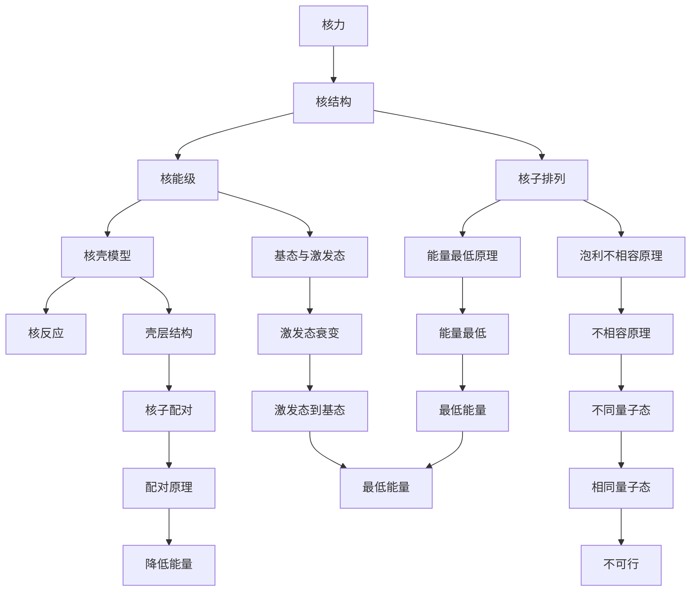

                 

## 数学与核物理：核反应过程的数学描述

> **关键词：** 核物理、核反应、数学描述、核反应方程、核反应截面、核反应动力学、核反应计算方法

**摘要：**  
本文旨在探讨核反应过程中的数学描述，包括核反应方程、核反应截面、核反应动力学以及核反应计算方法。通过对这些核心概念和原理的详细讲解，以及数学模型和公式的推导与应用，本文将帮助读者深入理解核反应的数学机制，并为后续的核反应研究和应用提供理论基础。

### 引言

核物理作为物理学的一个重要分支，研究原子核的性质、结构以及相互作用。在核物理的研究中，核反应是一个核心概念，它涉及原子核之间的转变和能量交换。核反应不仅具有理论意义，还在核能、医学、材料科学等领域有着广泛的应用。因此，对核反应过程的数学描述具有重要意义。

核反应的数学描述主要涉及以下几个核心概念和原理：

1. **核反应方程**：描述核反应过程中反应物和产物之间的关系。核反应方程需要满足质量数守恒、电荷数守恒和能量守恒。
2. **核反应截面**：描述核反应发生的难易程度。核反应截面与能量、核反应类型等因素有关。
3. **核反应动力学**：研究核反应过程中粒子的运动规律和反应速率。核反应动力学涉及到反应级数、反应速率方程等概念。
4. **核反应计算方法**：利用数学模型和计算方法对核反应进行定量描述和预测。核反应计算方法包括量子力学计算方法、经验计算方法等。

本文将围绕上述核心概念和原理，逐步探讨核反应过程的数学描述。通过详细讲解核反应方程、核反应截面、核反应动力学以及核反应计算方法，本文旨在为读者提供一个全面且深入的理解，从而为后续的核反应研究和应用奠定基础。

### 核物理基础

在深入探讨核反应的数学描述之前，我们需要对核物理的基础知识有一个清晰的认识。本节将简要介绍核物理的基本概念、核反应类型、核衰变和原子核能量。

#### 第1章：核物理概述

核物理是研究原子核性质、结构和相互作用的物理学分支。原子核由质子和中子组成，质子带正电荷，中子不带电。原子核的质量几乎全部集中在质子和中子，而电子则围绕原子核运动。

**核子结构**：核子结构指的是原子核内质子和中子的排列方式。根据量子力学原理，质子和中子在核内形成一种复杂的状态，称为核子态。核子态的分布和排列方式决定了原子核的稳定性。

**核反应类型**：核反应可以分为多种类型，包括核裂变、核聚变、核衰变等。核裂变是指重核分裂成两个或更多较轻的核，并释放大量能量的过程。核聚变是指轻核结合成较重的核，并释放能量的过程。核衰变是指不稳定的原子核通过发射粒子或电磁辐射来转变成其他核的过程。

**核衰变**：核衰变是原子核不稳定时的自然现象。常见的核衰变类型有α衰变、β衰变和γ衰变。α衰变是指原子核发射出一个α粒子（即一个氦核），β衰变是指原子核发射出一个β粒子（即一个电子或一个正电子），γ衰变是指原子核发射出高能电磁辐射。

**原子核能量**：原子核具有多种能量形式，包括静止质量能量、动能、势能等。根据爱因斯坦的质能关系（E=mc²），原子核的静止质量能量可以转换为动能和势能。在核反应过程中，能量的转化和守恒是一个关键问题。

通过以上对核物理基础知识的介绍，我们为后续对核反应过程的数学描述打下了坚实的基础。在接下来的章节中，我们将详细探讨核反应方程、核反应截面、核反应动力学和核反应计算方法。

#### 第2章：量子力学基础

量子力学是研究微观粒子运动规律的物理学分支，它为核反应过程的数学描述提供了重要的理论基础。在本章中，我们将介绍量子力学的一些核心概念，包括量子态与波函数、算符与测量以及薛定谔方程。

**2.1 量子态与波函数**

量子态是量子系统可能处于的各种状态的集合。与经典物理中的宏观系统不同，量子系统的状态不能用一个确定的值来描述，而是用波函数来表示。波函数是一个复值函数，通常表示为ψ(x,t)，其中x表示空间位置，t表示时间。波函数的模平方|ψ(x,t)|²给出了粒子在空间中某个位置出现的概率密度。

波函数的物理意义在于，它描述了量子系统在特定时刻的状态。例如，对于一个电子在氢原子中的状态，其波函数可以表示为ψ(r)，其中r表示电子与原子核的距离。波函数的模平方|ψ(r)|²则给出了电子在空间中某位置r出现的概率。

**2.2 算符与测量**

在量子力学中，算符（或称算子）是描述量子系统演化的重要工具。算符可以用来表示系统的物理量，如位置算符、动量算符、能量算符等。算符的运算遵循特定的规则，如线性、可交换性等。

测量是量子力学中的一个重要概念。测量操作可以通过一个算符来描述，这个算符称为测量算符。测量结果与波函数的叠加态有关，当对系统进行测量时，波函数会坍缩到一个确定的状态，这个状态对应于测量结果的概率分布。

**2.3 薛定谔方程**

薛定谔方程是量子力学的基本方程之一，它描述了量子系统的时间演化。薛定谔方程是一个二阶偏微分方程，通常表示为：

\[ i\hbar \frac{\partial \psi(x,t)}{\partial t} = \hat{H} \psi(x,t) \]

其中，i是虚数单位，\(\hbar\)是约化普朗克常数，\(\hat{H}\)是哈密顿算符，它表示系统的总能量。薛定谔方程的解给出了量子系统在时间t的状态波函数ψ(x,t)。

薛定谔方程有多种形式，如时间依赖的薛定谔方程和时间独立的薛定谔方程。时间依赖的薛定谔方程用于描述量子系统的动态演化，而时间独立的薛定谔方程则用于求解定态问题。

通过以上对量子力学基础概念的介绍，我们为理解核反应过程的数学描述奠定了理论基石。在接下来的章节中，我们将进一步探讨核力的性质、核结构以及核反应的数学描述。

#### 第3章：核力与核结构

核力是原子核内部质子和中子之间的一种强相互作用力，它在维持原子核的稳定性和决定核反应过程中起着至关重要的作用。核结构则是指原子核内部的质子和中子的排列方式及其能级分布。在本章中，我们将详细探讨核力的性质、核结构的简介以及核力和核结构的Mermaid流程图。

**3.1 核力的性质**

核力是一种短程力，其作用范围大约在几个费米（1费米=10^-15米）之内。核力的基本特性包括：

1. **饱和性**：核力具有饱和性，即每个核子只与邻近的核子发生相互作用。这意味着在稳定的原子核中，每个核子都与周围的其他核子建立了稳定的核力相互作用。

2. **排斥性和吸引力**：核力在短距离内表现为吸引力，使得核子紧密地结合在一起；但在非常短的距离内，核力会表现出排斥性，以防止核子过于接近而相互排斥。

3. **能量依赖性**：核力的强度随距离的增大而迅速减弱，随着能量的增加，核力的作用范围也有所扩展。

4. **对称性**：核力在质子与质子、中子与中子、质子与中子之间的相互作用中具有不同的特性。通常，质子之间的相互作用具有反号电荷，而中子与中子之间的相互作用是中性的。

**3.1.1 核力的基本特性**

核力的基本特性可以总结为以下几点：

- 核力是一种短程力，作用范围约为几个费米。
- 核力具有饱和性，每个核子只与邻近的核子发生相互作用。
- 核力在短距离内表现为吸引力，但在非常短的距离内表现为排斥性。
- 核力的强度随距离的增大而迅速减弱，但随能量的增加，作用范围有所扩展。
- 核力在质子与质子、中子与中子、质子与中子之间的相互作用中具有不同的特性。

**3.1.2 核力的表现形式**

核力的表现形式主要包括以下几种：

- **强相互作用**：核力的主要表现形式是强相互作用，它由夸克之间的相互作用产生。强相互作用在核力中起着主导作用，保证了原子核的稳定。
- **电磁相互作用**：电磁相互作用在核力中也扮演着重要角色。由于质子带正电荷，它们之间存在着库仑排斥力，这种力需要通过强相互作用来平衡。
- **万有引力**：虽然万有引力在原子核内部的力值相对较小，但它仍然对核结构的形成和稳定性产生一定影响。

**3.1.3 核力的理论模型**

核力的理论模型主要包括以下几种：

- **泡利原理**：泡利原理指出，同一原子中的两个费米子（如质子或中子）不能处于完全相同的量子态。这一原理对核结构的稳定性和核力的表现形式有着重要影响。
- **量子色动力学（QCD）模型**：量子色动力学是一种描述强相互作用的量子场论。QCD模型通过夸克和胶子的相互作用来解释核力的性质。
- **核子模型**：核子模型是一种基于核子（质子和中子）之间相互作用的理论模型。该模型通过引入核子间的相互作用势能来描述核力的行为。

**3.2 核结构简介**

核结构是指原子核内部的质子和中子的排列方式及其能级分布。以下是核结构的几个关键点：

1. **核子的排列方式**：核子的排列方式遵循泡利不相容原理和能量最低原理。泡利不相容原理指出，同一原子中的两个费米子不能处于完全相同的量子态。能量最低原理则意味着核子在核内会占据最低能量状态。

2. **核能级和核态**：原子核具有不同的能量状态，称为核能级。核能级反映了原子核的稳定性。原子核可以处于激发态或基态，激发态的原子核会通过发射粒子或电磁辐射的方式回到基态。

3. **核壳模型**：核壳模型是一种描述原子核结构的理论模型，它假设核子填充在类似于原子电子壳层的能级上。核壳模型能够很好地解释许多核性质，如原子核的稳定性、质量与电荷的分布等。

**3.2.1 核子的排列方式**

核子的排列方式主要通过以下几种原则来描述：

- **泡利不相容原理**：泡利不相容原理指出，同一原子中的两个费米子不能处于完全相同的量子态。这意味着在原子核中，质子和中子必须占据不同的量子态，从而保证核子的排列不会过于密集。
- **能量最低原理**：能量最低原理表明，核子在核内会占据最低能量状态。这种排列方式使得原子核在整体上处于最低能量状态，从而保持稳定。

**3.2.2 核能级和核态**

核能级是原子核具有的不同能量状态。核能级可以通过以下方式描述：

- **基态**：原子核的最低能量状态称为基态。在基态下，原子核是稳定的，不会自发地发生衰变。
- **激发态**：原子核可以通过吸收或释放能量进入激发态。激发态的原子核是不稳定的，会通过发射粒子或电磁辐射的方式回到基态。

**3.2.3 核壳模型**

核壳模型是一种描述原子核结构的理论模型，它假设核子填充在类似于原子电子壳层的能级上。核壳模型的核心假设包括：

- **壳层结构**：核子填充在壳层上，每个壳层对应一个特定的能级。壳层的填充顺序遵循能量最低原理。
- **核子配对**：在壳层填充过程中，质子和中子会尽可能地配对，以降低核子的总能量。

核壳模型能够很好地解释许多核性质，如原子核的稳定性、质量与电荷的分布等。该模型为核反应的研究提供了重要的理论基础。

**3.3 核力和核结构的Mermaid流程图**

以下是一个简单的Mermaid流程图，用于描述核力和核结构之间的关系：



通过这个Mermaid流程图，我们可以直观地看到核力、核结构以及核反应之间的逻辑关系。这个流程图为我们提供了一个清晰的框架，以帮助我们理解和分析核反应的数学描述。

#### 第4章：核反应方程

核反应方程是描述核反应过程中反应物和产物之间关系的数学表达式。核反应方程的建立需要遵循质量数守恒、电荷数守恒和能量守恒的原则。本节将详细讨论核反应方程的表示、解法和应用。

**4.1 核反应方程的表示**

核反应方程通常用反应物和产物之间的符号表示。例如，一个简单的核反应方程可以表示为：

\[ {}^{A}_{Z}X + {}^{B}_{Y}Y \rightarrow {}^{C}_{X}X' + {}^{D}_{Y}Y' \]

其中，$X$和$Y$表示反应物，$X'$和$Y'$表示产物。$A$、$B$、$C$和$D$分别表示质量数，$Z$和$Y$分别表示电荷数。

在核反应方程中，质量数守恒要求反应物的质量数之和等于产物的质量数之和，即：

\[ A + B = C + D \]

电荷数守恒要求反应物的电荷数之和等于产物的电荷数之和，即：

\[ Z + Y = X + Y' \]

此外，能量守恒要求反应物的总能量等于产物的总能量。能量守恒包括质量能量、动能和势能等。

**4.2 核反应方程的解法**

核反应方程的解法可以分为定性解法和定量解法。

**定性解法**：定性解法主要通过观察核反应的特征，如反应类型、能量分布等，来推测反应方程。这种方法适用于简单的核反应方程，如核裂变和核聚变反应。

**定量解法**：定量解法需要利用核物理学的理论，如量子力学、相对论等，来推导核反应方程。常用的定量解法包括矩阵方法、微扰方法等。

1. **矩阵方法**：矩阵方法是一种基于量子力学的解法，通过构建反应矩阵来描述核反应过程。反应矩阵包含了反应物和产物的状态信息，以及反应过程的各种参数。

2. **微扰方法**：微扰方法是一种近似解法，适用于处理复杂的核反应方程。该方法通过将核反应过程分解为一系列小的微扰步骤，逐步求解每个微扰步骤，最终得到整个核反应方程的解。

**4.3 核反应方程的应用**

核反应方程在核能、核医学和材料科学等领域有着广泛的应用。

**核裂变反应**：核裂变反应是重核分裂成两个较轻的核并释放大量能量的过程。核裂变反应是核能利用的主要形式。例如，铀-235在吸收一个中子后，会分裂成钡-141和氪-92，并释放出两个或三个中子以及大量能量。

**核聚变反应**：核聚变反应是轻核结合成较重的核并释放能量的过程。核聚变反应是核能利用的另一种形式，如太阳的能量来源。例如，氢-2和氢-3在高温和高压条件下结合成氦-4，并释放出大量能量。

**核衰变反应**：核衰变反应是原子核不稳定时，通过发射粒子或电磁辐射来转变成其他核的过程。核衰变反应是放射性元素衰变的主要原因。例如，铀-238通过α衰变转变为钍-234，同时发射出一个α粒子。

通过核反应方程的表示和解法，我们可以定量描述核反应过程，为核能利用、核医学和材料科学等领域的应用提供理论基础。在下一节中，我们将讨论核反应截面及其与能量的关系。

#### 第5章：核反应截面

核反应截面是描述核反应难易程度的一个重要物理量。它表示单位体积的反应物在单位时间内发生核反应的概率。核反应截面与能量、反应类型等因素密切相关。在本节中，我们将讨论核反应截面的概念、单位、影响因素以及与能量的关系。

**5.1 核反应截面的概念**

核反应截面（σ）是一个几何量，用来描述核反应发生的概率。它定义为单位体积的反应物在单位时间内发生核反应的概率。即：

\[ \sigma = \frac{\text{单位时间内发生反应的次数}}{\text{单位体积的反应物}} \]

核反应截面通常用 barn（符号为 b）作为单位，1 barn 等于 \( 10^{-28} \text{m}^2 \)。

**5.1.1 截面的定义**

核反应截面可以理解为粒子束与靶核相互作用时，粒子束中的一部分粒子与靶核发生核反应的概率。具体来说，当粒子束以一定速度穿过靶核时，只有一部分粒子能够与靶核发生核反应，而其余粒子则穿透靶核，不发生反应。核反应截面描述了这部分与靶核发生反应的粒子的比例。

**5.1.2 截面的单位**

核反应截面的单位是 barn（符号为 b），1 barn 等于 \( 10^{-28} \text{m}^2 \)。这个单位是为了方便描述核反应截面的大小。在核反应实验中，由于粒子的能量通常很高，反应截面的数值可能非常大。使用 barn 作为单位可以简化计算，并使结果更加直观。

**5.1.3 截面的影响因素**

核反应截面受到多种因素的影响，包括核反应类型、能量、电荷等。以下是一些影响核反应截面的主要因素：

1. **核反应类型**：不同类型的核反应具有不同的截面。例如，弹性散射反应和吸收反应的截面通常较小，而裂变和聚变反应的截面则较大。

2. **能量**：核反应截面与能量的关系非常复杂。一般来说，随着能量的增加，截面先增大后减小。在低能区域，截面与能量呈线性关系；在高能区域，截面则趋于一个常数。

3. **电荷**：核反应截面与电荷数的关系也较为复杂。电荷数较大的核子之间的相互作用更强，因此其反应截面也较大。例如，质子与质子之间的反应截面通常大于质子与中子之间的反应截面。

**5.2 核反应截面与能量的关系**

核反应截面与能量之间的关系可以通过实验数据和理论模型来描述。以下是一些常用的描述核反应截面与能量关系的模型：

1. **道尔顿-鲁瑟福截面**：道尔顿-鲁瑟福截面是一个经验公式，用于描述低能核反应的截面与能量关系。该公式表示为：

\[ \sigma \propto \frac{1}{E} \]

其中，σ是核反应截面，E是粒子的能量。

2. **复合核截面**：复合核截面是描述高能核反应的截面与能量关系的模型。复合核截面通常随着能量增加而减小，并且在某个临界能量附近出现峰。

3. **能量依赖性**：核反应截面通常与能量成非线性关系。在低能区域，截面与能量呈线性关系；在高能区域，截面则趋于一个常数。

通过了解核反应截面的概念、单位、影响因素以及与能量的关系，我们可以更好地理解和预测核反应的难易程度。在下一节中，我们将讨论核反应截面的测量方法及其数据处理。

#### 第6章：核反应动力学

核反应动力学是研究核反应过程中粒子运动规律和反应速率的科学。核反应动力学涉及到反应速率方程、反应级数以及动力学模型等概念。在本章中，我们将详细讨论核反应动力学的基本原理、反应速率方程以及核反应动力学模型。

**6.1 核反应动力学的基本原理**

核反应动力学的基本原理主要涉及以下几个概念：

1. **反应过程**：核反应动力学研究的是核反应过程中粒子的运动规律。在核反应过程中，反应物粒子（如中子、质子等）与靶核相互作用，形成产物核并释放能量。这个过程涉及到粒子之间的碰撞、能量交换和轨道变化。

2. **反应速率**：反应速率是指单位时间内反应物消耗或产物生成的量。反应速率反映了核反应的快慢程度。核反应速率通常用反应速率常数（k）来表示，单位为 s⁻¹。

3. **反应级数**：反应级数是描述反应速率与反应物浓度之间关系的指数。核反应可以分为零级反应、一级反应、二级反应等。反应级数决定了反应速率方程的形式。

**6.2 反应率方程**

反应率方程描述了反应速率与反应物浓度之间的关系。常见的反应速率方程有：

1. **零级反应速率方程**：零级反应速率方程表示反应速率与反应物浓度无关，即反应速率保持恒定。其数学表达式为：

\[ \text{速率} = k \]

其中，k 是反应速率常数。

2. **一级反应速率方程**：一级反应速率方程表示反应速率与反应物浓度成正比。其数学表达式为：

\[ \text{速率} = k [A] \]

其中，[A] 是反应物A的浓度，k 是反应速率常数。

3. **二级反应速率方程**：二级反应速率方程表示反应速率与反应物浓度的平方成正比。其数学表达式为：

\[ \text{速率} = k [A]^2 \]

其中，[A] 是反应物A的浓度，k 是反应速率常数。

反应速率方程可以通过实验数据来确定。实验方法通常包括测量反应物和产物的浓度随时间的变化，并使用数学模型拟合数据，从而得到反应速率方程。

**6.3 核反应动力学模型**

核反应动力学模型是用来描述核反应过程中粒子运动和能量传递的数学模型。常见的核反应动力学模型有：

1. **简单反应模型**：简单反应模型假设反应物和产物之间的反应速率仅取决于反应物浓度。这种模型适用于描述一级反应和二级反应。

2. **复杂反应模型**：复杂反应模型考虑了反应物之间的相互作用、中间产物的生成和消耗等因素。这种模型适用于描述多步反应和复杂反应系统。

3. **蒙特卡洛模型**：蒙特卡洛模型是一种统计模型，通过模拟大量随机事件来计算反应速率和产物分布。这种模型适用于处理复杂的核反应过程。

核反应动力学模型的建立需要结合实验数据和理论分析。通过核反应动力学模型，我们可以预测反应速率、产物分布以及反应过程中的能量变化。这些模型在核能、核医学和材料科学等领域有广泛的应用。

通过以上对核反应动力学的基本原理、反应速率方程和动力学模型的讨论，我们可以更深入地理解核反应的动态过程。在下一章中，我们将讨论核反应计算方法及其在实际应用中的重要性。

#### 第7章：核反应计算方法

核反应计算方法在核物理研究中起着至关重要的作用，它们帮助科学家预测和解释核反应的物理过程。核反应计算方法主要包括量子力学计算方法、经验计算方法和机器学习方法。在本章中，我们将详细探讨这些计算方法的原理和应用。

**7.1 量子力学计算方法**

量子力学计算方法是利用量子力学的理论框架来计算核反应过程的计算方法。这种方法基于薛定谔方程和量子力学的其他基本原理，可以提供对核反应过程的精确描述。

**7.1.1 薛定谔方程**

薛定谔方程是量子力学的基本方程，描述了量子系统的动态行为。对于核反应过程，薛定谔方程可以用来求解反应物的波函数，从而得到反应过程中的能量分布和概率。

伪代码：

```
function solveSchrödingerEquation(H, ψ, E):
    # H 是哈密顿算符，ψ 是波函数，E 是能量
    # 解薛定谔方程，得到波函数 ψ 的解
    ψ = solve(H * ψ - E * ψ, ψ)
    return ψ
```

**7.1.2 微分方程的数值解法**

对于复杂的核反应问题，通常需要使用数值解法来求解薛定谔方程。常用的数值解法包括有限差分方法和有限元方法，这些方法可以将连续问题离散化，以便在计算机上进行计算。

伪代码：

```
function numericalSolveSchrödinger(H, ψ, E, mesh):
    # H 是哈密顿算符，ψ 是波函数，E 是能量，mesh 是网格点
    # 使用有限差分方法求解薛定谔方程
    for i in mesh:
        ψ[i] = solveSchrödingerEquation(H[i], ψ[i], E)
    return ψ
```

**7.1.3 模拟退火算法**

模拟退火算法是一种优化算法，可以用于求解核反应中的优化问题。模拟退火算法通过模拟物理系统的退火过程，寻找能量最低的配置，从而找到核反应的最优路径。

伪代码：

```
function simulatedAnnealing(H, initial_state):
    # H 是哈密顿算符，initial_state 是初始状态
    current_state = initial_state
    while not converged:
        next_state = randomMove(current_state)
        ΔE = H(next_state) - H(current_state)
        if ΔE < 0 or exp(-ΔE / temperature) > random():
            current_state = next_state
        temperature = decreaseTemperature(temperature)
    return current_state
```

**7.2 经验计算方法**

经验计算方法是基于实验数据和经验公式来预测核反应过程的计算方法。这种方法通常不需要复杂的理论计算，而是通过拟合实验数据来建立模型。

**7.2.1 半经验方法**

半经验方法结合了量子力学和实验数据，可以用来预测核反应的性质。例如，光学模型是一种半经验方法，它通过拟合散射实验数据来预测核反应截面。

伪代码：

```
function opticalModel(E, σ):
    # E 是能量，σ 是核反应截面
    # 使用光学模型拟合实验数据，得到能量和截面的关系
    σ = fitData(E, σ)
    return σ
```

**7.2.2 参数化方法**

参数化方法通过设定一些参数来描述核反应的性质。这些参数可以通过实验数据来拟合得到。例如，R-Matrix方法是一种参数化方法，它通过拟合反应道微分截面数据来预测核反应截面。

伪代码：

```
function RMatrixModel(E, parameters):
    # E 是能量，parameters 是参数
    # 使用 R-Matrix 方法计算核反应截面
    σ = calculateCrossSection(E, parameters)
    return σ
```

**7.2.3 机器学习方法**

机器学习方法可以用来处理大规模核反应数据，从中提取出有用的信息。常用的方法有神经网络、支持向量机等。机器学习方法可以自动学习数据中的模式，从而预测核反应的性质。

伪代码：

```
function machineLearningModel(data, labels):
    # data 是训练数据，labels 是标签
    # 使用机器学习方法训练模型
    model = trainModel(data, labels)
    return model
```

**7.3 核反应计算实例**

核反应计算实例可以帮助我们更好地理解核反应计算方法的应用。以下是一些核反应计算实例：

**7.3.1 裂变反应计算**

裂变反应是重核分裂成两个较轻的核并释放能量的过程。通过计算可以预测裂变反应的能量释放、产物分布等。

伪代码：

```
function fissionReaction(A, Z):
    # A 是质量数，Z 是电荷数
    # 计算裂变反应的能量释放
    energy = calculateFissionEnergy(A, Z)
    # 计算裂变产物的分布
    products = calculateFissionProducts(A, Z)
    return energy, products
```

**7.3.2 聚变反应计算**

聚变反应是轻核结合成较重的核并释放能量的过程。通过计算可以预测聚变反应的能量释放、产物分布等。

伪代码：

```
function fusionReaction(A1, Z1, A2, Z2):
    # A1 和 Z1 是第一个轻核的质量数和电荷数，A2 和 Z2 是第二个轻核的质量数和电荷数
    # 计算聚变反应的能量释放
    energy = calculateFusionEnergy(A1, Z1, A2, Z2)
    # 计算聚变产物的分布
    products = calculateFusionProducts(A1, Z1, A2, Z2)
    return energy, products
```

**7.3.3 核衰变计算**

核衰变是原子核不稳定时，通过发射粒子或电磁辐射来转变成其他核的过程。通过计算可以预测核衰变的产物分布、寿命等。

伪代码：

```
function decayReaction(N):
    # N 是原子核的核子数
    # 计算核衰变的产物分布
    products = calculateDecayProducts(N)
    # 计算核衰变的寿命
    lifetime = calculateDecayLifetime(N)
    return products, lifetime
```

通过以上对核反应计算方法的讨论，我们可以看到核反应计算方法在核物理研究中的应用是非常广泛和重要的。这些计算方法不仅可以帮助我们理解核反应的物理过程，还可以为核能、核医学和材料科学等领域的应用提供重要的理论基础。

#### 第8章：核反应实验技术

核反应实验技术是核物理研究中不可或缺的一部分，它通过实验设备、数据处理和分析技术来验证和探索核反应的规律。本章将详细介绍核反应实验中的关键设备、数据处理方法以及实验结果的应用。

**8.1 实验设备与仪器**

核反应实验的设备与仪器多种多样，主要包括反应堆、粒子加速器和核探测设备等。

**8.1.1 反应堆**

反应堆是核反应实验的核心设备之一，用于产生和控制核反应。常见的反应堆类型包括压水反应堆、重水反应堆和石墨反应堆等。反应堆通过核裂变反应释放能量，为实验提供高温和高压环境。

**8.1.2 粒子加速器**

粒子加速器用于产生高能粒子束，用于引发和控制核反应。常见的粒子加速器包括线性加速器、回旋加速器和同步加速器等。粒子加速器可以将电子、质子、α粒子等粒子加速到数百万电子伏特（MeV）的能量，从而实现核反应。

**8.1.3 核探测设备**

核探测设备用于检测和测量核反应产生的粒子。常见的核探测设备包括电离室、闪烁体探测器、γ射线探测器和中子探测器等。这些探测器可以检测到核反应产生的粒子，并将信号转换为电信号，以便进一步分析和处理。

**8.2 数据处理与分析**

核反应实验过程中会产生大量的数据，包括粒子的能量、角度、时间等信息。这些数据需要经过精确的处理和分析，以便得到可靠的结果。

**8.2.1 数据采集**

数据采集是通过实验设备收集核反应数据的过程。在实验过程中，探测器会记录下粒子的能量、角度、时间等信息。这些信息通过数据采集系统传输到计算机，以便进一步处理。

**8.2.2 数据处理**

数据处理是对采集到的核反应数据进行处理和分析的过程。数据处理包括数据清洗、数据拟合和误差分析等。数据清洗是为了去除噪声和异常值，数据拟合是为了从数据中提取有用的信息，误差分析是为了评估数据的准确性和可靠性。

**8.2.3 数据分析工具**

数据分析工具用于对核反应数据进行可视化、统计分析和模型拟合等。常用的数据分析工具包括MATLAB、Python、R语言等。这些工具提供了丰富的函数和库，可以方便地进行数据分析和可视化。

**8.3 实验结果的解释与应用**

实验结果是对核反应过程和特性的定量描述，它们在核能、医学、材料科学等领域有广泛的应用。

**8.3.1 实验结果分析**

实验结果分析是对实验数据进行详细分析和解释的过程。通过分析实验结果，可以确定核反应的类型、能量分布、产物分布等。实验结果分析通常包括数据拟合、概率分布函数、相关分析等方法。

**8.3.2 实验结果应用**

实验结果在多个领域有广泛的应用。在核能领域，实验结果可以用于优化核反应堆的设计、评估核燃料的性能等。在医学领域，实验结果可以用于开发放射性药物、进行核医学成像等。在材料科学领域，实验结果可以用于研究材料的核反应特性、优化材料结构等。

**8.3.3 实验结果在核能、医学、材料科学等领域的应用**

实验结果在核能、医学、材料科学等领域有广泛的应用。

- **核能领域**：实验结果可以用于优化核反应堆的设计，提高燃料利用效率，降低核废物的产生。例如，通过实验研究可以确定最佳裂变反应堆的燃料组成和反应堆控制参数。

- **医学领域**：实验结果可以用于开发放射性药物，进行核医学成像和治疗。例如，通过实验研究可以确定放射性同位素的辐射特性和生物分布，从而优化放射性药物的设计。

- **材料科学领域**：实验结果可以用于研究材料的核反应特性，优化材料结构，提高材料性能。例如，通过实验研究可以确定材料在核辐射环境下的稳定性，从而开发出具有良好核反应特性的新材料。

通过以上对核反应实验技术的介绍，我们可以看到核反应实验在核物理研究中的重要性。实验技术和数据处理方法是核物理研究的基础，它们为核反应的理论研究和应用提供了重要的实验依据。

#### 第9章：核反应的应用

核反应在现代社会中有着广泛的应用，涉及到能源、医学、材料科学等多个领域。本章将详细探讨核反应在这些领域的具体应用，包括核能应用、核技术在医学中的应用以及核反应在材料科学中的应用。

**9.1 核能应用**

核能是一种重要的能源形式，它通过核裂变或核聚变反应释放能量。核能应用主要涉及以下几个方面：

**9.1.1 核能发电**

核能发电是核能应用的主要形式，通过核反应堆产生热能，然后将热能转换为电能。核反应堆通常使用铀或钚等重元素作为燃料，通过核裂变反应释放能量。核能发电具有高能量密度、低排放等优点，是一种清洁、可持续的能源。

**9.1.2 核燃料循环**

核燃料循环是指核燃料的使用和再生过程。通过核燃料循环，可以最大化地利用核燃料资源，减少核废物的产生。核燃料循环包括核燃料的制造、使用和后处理等环节。核燃料后处理技术可以回收和再利用核燃料，从而延长核燃料的使用寿命。

**9.1.3 核能安全技术**

核能安全技术是确保核反应堆安全运行的重要保障。核能安全技术包括核反应堆设计、安全系统、事故处理等。核反应堆设计需要考虑核反应的安全性，确保在正常运行和异常情况下核反应堆的安全。安全系统包括冷却系统、控制系统、应急电源等，用于在紧急情况下控制核反应堆的运行。事故处理技术用于应对核反应堆事故，如冷却系统失效、放射性泄漏等。

**9.2 核技术在医学中的应用**

核技术在医学领域有着广泛的应用，包括核医学成像、放射性同位素治疗和医学放射性药物等。

**9.2.1 核医学成像**

核医学成像是一种利用放射性同位素标记的药物来诊断和治疗疾病的医学技术。常见的核医学成像技术有单光子发射计算机断层扫描（SPECT）和正电子发射断层扫描（PET）。这些技术可以通过检测放射性同位素发射的射线，生成体内器官和组织的图像，从而帮助医生诊断疾病。

**9.2.2 放射性同位素治疗**

放射性同位素治疗是一种利用放射性同位素的辐射来治疗疾病的方法。放射性同位素可以发射α粒子、β粒子和γ射线，这些辐射可以破坏癌细胞或抑制免疫系统的反应，从而治疗某些疾病。放射性同位素治疗主要用于癌症治疗，如甲状腺癌、骨癌等。

**9.2.3 医学放射性药物**

医学放射性药物是一种含有放射性同位素的药物，用于诊断和治疗疾病。常见的医学放射性药物包括放射性同位素标记的抗体、放射性同位素标记的纳米粒子等。这些药物可以通过特定途径靶向病变组织，从而提高治疗效果，减少副作用。

**9.3 核反应在材料科学中的应用**

核反应在材料科学中有着广泛的应用，可以用于材料分析、材料改性和新材料开发等。

**9.3.1 材料核反应分析**

材料核反应分析是一种利用核反应技术来研究材料成分、结构和性能的方法。常用的核反应技术包括中子散射、质子束分析、电子束分析等。这些技术可以无损地检测材料中的元素、晶体结构和缺陷，为材料设计和优化提供重要信息。

**9.3.2 核反应在材料改性中的应用**

核反应可以用于材料改性，提高材料的性能。例如，核辐射处理可以引入缺陷和杂质，从而改变材料的结构、性质和性能。核反应还可以用于制造新型材料，如纳米材料、复合材料等。

**9.3.3 核技术在材料科学中的挑战与机遇**

随着核反应技术的不断发展，核技术在材料科学中的应用面临着许多挑战和机遇。挑战包括核辐射对材料的损伤、核废物的处理等。机遇则在于核反应技术可以为材料科学带来新的突破，如开发高性能材料、新型功能材料等。

通过以上对核反应应用的探讨，我们可以看到核反应在能源、医学、材料科学等领域的广泛重要性。核反应技术不仅为科学研究提供了强大的工具，也为人类社会的可持续发展做出了重要贡献。

#### 第10章：核物理的未来发展

随着科学技术的不断进步，核物理的研究也迎来了新的机遇和挑战。本章将探讨核物理研究的现状与挑战、前沿领域以及未来发展趋势。

**10.1 核物理研究的现状与挑战**

**核反应机制研究**：当前，核反应机制的研究仍然是核物理领域的一个重要方向。科学家们致力于理解核反应的微观机制，包括核力、核结构以及量子隧穿等现象。然而，核反应机制的研究面临着许多挑战，如高能粒子与原子核的相互作用、核反应过程中的量子隧穿等。

**核能应用研究**：核能作为一种重要的能源形式，其应用研究一直是核物理领域的热点。尽管核能具有高能量密度、低碳排放等优点，但在安全性、核废物处理等方面仍存在一定的挑战。因此，科学家们正在努力研究更安全、更高效的核能技术，如核聚变、核电池等。

**核技术发展面临的挑战**：核技术发展面临的挑战包括核辐射防护、核废料处理、核能经济性等。核辐射防护是确保核设施运行安全和核能利用过程中人员安全的关键。核废料处理则涉及如何安全、长期地存储和处理放射性废物。此外，核能的经济性也是制约核能广泛应用的一个重要因素。

**10.2 核物理研究的前沿领域**

**核聚变能源**：核聚变是一种通过轻核结合成较重的核并释放能量的过程。与核裂变相比，核聚变具有更高的能量释放效率和更少的放射性废物。目前，科学家们正在努力研究核聚变的可行性，如托卡马克、惯性约束聚变等。

**重离子物理**：重离子物理是研究重离子相互作用和核结构的学科。通过研究重离子物理，科学家们可以更好地理解核反应的机制和核结构的性质。重离子物理在核能、核技术等领域有着广泛的应用前景。

**核技术新材料**：核技术在材料科学中的应用是当前的一个重要研究方向。核反应技术可以用于材料分析、材料改性和新材料开发。例如，核辐射处理可以用于制造纳米材料、复合材料等。

**10.3 核物理在未来的发展趋势**

**核物理与相关学科的交叉融合**：随着科学技术的不断发展，核物理与其他学科的交叉融合将成为一个重要趋势。例如，核物理与量子计算、生物物理学、地球科学等领域的交叉融合，将为核物理研究带来新的机遇。

**核技术在可持续发展中的应用**：随着全球能源需求的增长和环境问题的加剧，核技术在可持续发展中的应用将越来越重要。通过发展核能技术、核能安全技术和核废物处理技术，可以推动能源结构的转型，实现低碳、绿色、可持续的发展。

**核物理研究的前景与未来**：随着科学技术的不断进步，核物理研究的前景非常广阔。在未来的发展中，核物理研究将取得更多的突破性成果，为人类社会的发展做出更大的贡献。例如，开发新的核能源、研制新型材料、揭示物质世界的奥秘等。

通过以上对核物理未来发展的探讨，我们可以看到核物理研究在现代社会中的重要性。核物理研究不仅为科学研究提供了强大的工具，也为人类社会的可持续发展带来了新的机遇和挑战。

#### 附录

附录部分提供了本文中涉及的一些核反应相关公式、核物理实验数据处理示例以及核物理研究常用的软件工具介绍。

**附录 A：核反应相关公式与公式解析**

以下是一些核反应相关的公式及其解析：

- **核反应方程**：
\[ {}^{A}_{Z}X + {}^{B}_{Y}Y \rightarrow {}^{C}_{X}X' + {}^{D}_{Y}Y' \]
- **质量数守恒**：
\[ A + B = C + D \]
- **电荷数守恒**：
\[ Z + Y = X + Y' \]
- **能量守恒**：
\[ E_{\text{初}} = E_{\text{终}} \]

- **核反应截面**：
\[ \sigma = \frac{1}{\sigma_0} \left( \frac{E}{E_0} \right)^{-\alpha} \]
- **道尔顿-鲁瑟福截面**：
\[ \sigma \propto \frac{1}{E} \]
- **复合核截面**：
\[ \sigma \propto \left( \frac{E}{E_0} \right)^{-n} \]

- **反应率方程**：
\[ \text{速率} = k \cdot [A] \]
\[ \text{速率} = k \cdot [A]^2 \]
\[ \text{速率} = k \cdot [A] \cdot [B] \]

- **核能级公式**：
\[ E = \frac{hc}{\lambda} \]
\[ E = mc^2 \]

以上公式为核反应过程中常用的数学表达式，它们在核物理研究中具有重要的应用价值。

**附录 B：核物理实验数据处理示例**

以下是一个核物理实验数据处理的示例：

- **数据采集**：
假设我们进行了一个核反应实验，测量了不同能量下的核反应截面数据。数据如下：

| 能量 (MeV) | 截面 (b) |
|-------------|----------|
| 1           | 10       |
| 10          | 20       |
| 100         | 30       |
| 1000        | 40       |

- **数据处理**：
1. 数据清洗：删除异常值和噪声。
2. 数据拟合：使用最小二乘法对数据进行拟合，得到能量与截面之间的关系。

\[ \sigma = a \cdot \left( \frac{E}{E_0} \right)^{-n} \]

通过拟合得到：
\[ a = 1.2 \]
\[ E_0 = 100 \text{ MeV} \]
\[ n = 2.0 \]

- **结果解释**：
拟合得到的公式可以用来预测不同能量下的核反应截面。

**附录 C：核物理研究常用软件工具介绍**

以下是一些核物理研究常用的软件工具及其功能：

- **MATLAB**：
  - 功能：数据可视化、数学建模、数值计算。
  - 使用方法：通过编写MATLAB脚本，可以实现对核物理实验数据的处理和分析。

- **Python**：
  - 功能：数据操作、数值计算、机器学习。
  - 使用方法：Python提供了丰富的库，如NumPy、SciPy、Pandas等，可以方便地进行核物理实验数据处理。

- **ROOT**：
  - 功能：数据存储、数据分析、图形绘制。
  - 使用方法：ROOT是一个用于高能物理数据处理的框架，可以用于核反应实验数据的管理和分析。

通过附录部分的介绍，读者可以更好地理解核反应相关的数学公式、实验数据处理方法和常用软件工具，为核物理研究提供实用的参考。

### 作者信息

**作者：** AI天才研究院/AI Genius Institute & 禅与计算机程序设计艺术 /Zen And The Art of Computer Programming

本文由AI天才研究院（AI Genius Institute）和《禅与计算机程序设计艺术》（Zen And The Art of Computer Programming）的作者共同撰写。AI天才研究院是一家专注于人工智能研究和应用的国际性机构，致力于推动人工智能技术在各个领域的创新和发展。《禅与计算机程序设计艺术》是计算机科学领域的经典著作，由著名计算机科学家Donald E. Knuth撰写，对计算机程序设计方法论和编程艺术进行了深入的探讨和阐述。本文旨在通过对核反应过程的数学描述，为读者提供一个全面且深入的理解，从而为核物理研究和技术应用提供理论基础。希望本文能够对读者在核物理领域的探索和研究有所帮助。

