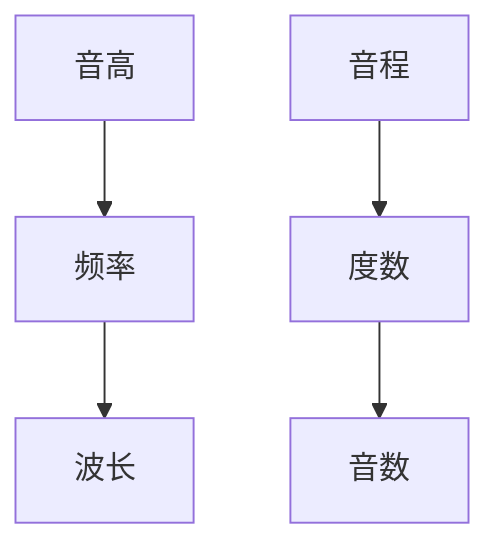
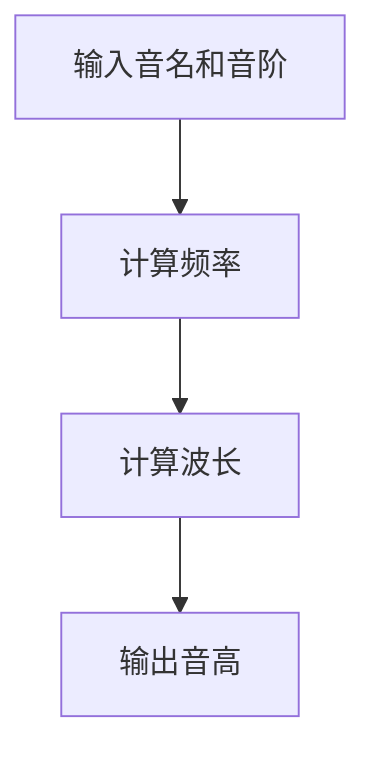

                 

# 《数学与音乐理论的音高与音程分析》

## 关键词
数学，音乐理论，音高，音程，算法，分析，应用

## 摘要
本文深入探讨了数学与音乐理论的结合点，特别是音高与音程的分析。通过详细的数学公式和算法讲解，读者将理解音高与频率的关系，音程的度数与音数的转换。文章还包括音高与音程分析工具的使用实例，以及实际项目中的代码实现与解读，为读者提供了全面的技术指南。

### 目录大纲

## 第一部分：基础概念与理论

### 第1章：音高与音程的基本概念

#### 1.1 音高的定义与特征
- 音高的定义
- 音高的特征

#### 1.2 音程的种类与分类
- 音程的分类
- 不同类型音程的特征

#### 1.3 音高的数学表示
- 频率的数学表示
- 波长的数学表示

### 第2章：音高与音乐理论的基础知识

#### 2.1 音高的表示方法
- 音高的标记方法
- 音高的国际标准表示

#### 2.2 音阶与和弦
- 音阶的构成
- 和弦的构成

#### 2.3 音高与时间的关联
- 音高与时间的关系
- 节奏的数学表示

### 第3章：音程的分析方法

#### 3.1 音程的数学模型
- 音程的度数模型
- 音程的音数模型

#### 3.2 音程的计算与转换
- 音程计算的基本公式
- 音程转换的方法

#### 3.3 音程的常见问题与解决方案
- 音程计算中的常见问题
- 解决方案

### 第4章：音高与音程分析的应用

#### 4.1 音高在作曲中的应用
- 音高的作曲技巧
- 音高的应用实例

#### 4.2 音程在音乐制作中的运用
- 音程在音乐制作中的作用
- 音程的应用实例

#### 4.3 音高与音乐感知的关系
- 音高对音乐感知的影响
- 音乐感知的数学模型

### 第5章：数学与音乐理论的联系

#### 5.1 音高的数学解释
- 音高的数学理论基础
- 音高的数学公式

#### 5.2 音程的数学原理
- 音程的数学计算原理
- 音程的数学模型

#### 5.3 数学与音乐理论的交叉领域
- 数学在音乐理论中的应用领域
- 音乐理论对数学的贡献

## 第一部分：基础概念与理论

### 第1章：音高与音程的基本概念

#### 1.1 音高的定义与特征

音高是指声音的频率特性，是声音的一个主观属性。在音乐中，音高是区分不同音符的重要依据。音高的特征主要包括：

- **频率**：音高的频率范围通常在20Hz到20kHz之间。频率越高，音高越高；频率越低，音高越低。
- **振幅**：振幅影响声音的响度，但不改变音高。
- **波形**：不同波形产生不同的音色，影响音高感知，但音高本身不受波形影响。

#### 1.2 音程的种类与分类

音程是两个音高之间的差异。根据度数和音数的不同，音程可以分为以下几种类型：

- **全音（Major Second）**：两个音高之间的频率比约为1.2599。
- **半音（Minor Second）**：两个音高之间的频率比约为1.0。
- **全音阶（Major Third）**：两个音高之间的频率比约为1.5。
- **半音阶（Minor Third）**：两个音高之间的频率比约为1.25。
- **纯四度（Perfect Fourth）**：两个音高之间的频率比约为1.4142。
- **增四度/减五度（Augmented Fourth/Diminished Fifth）**：两个音高之间的频率比约为1.4286。
- **纯五度（Perfect Fifth）**：两个音高之间的频率比约为1.6875。
- **增五度/减四度（Augmented Fifth/Diminished Fourth）**：两个音高之间的频率比约为1.625。
- **全六度（Major Sixth）**：两个音高之间的频率比约为1.875。
- **半六度（Minor Sixth）**：两个音高之间的频率比约为1.6667。
- **全七度（Major Seventh）**：两个音高之间的频率比约为2.0000。
- **半七度（Minor Seventh）**：两个音高之间的频率比约为1.875。

#### 1.3 音高的数学表示

音高的数学表示主要通过频率和波长来描述。频率（f）是指单位时间内振动的次数，单位为赫兹（Hz）。波长（λ）是指波的一个周期所占据的空间长度。频率和波长之间的关系由以下公式表示：

\[ f = \frac{v}{\lambda} \]

其中，v是声音在介质中传播的速度。

在音乐中，音高的频率通常按照半音阶进行划分，每个半音之间的频率差为大约6.86%。这意味着，如果一个音高的频率是f，则下一个更高的音高频率大约是 \( f \times 1.0686 \)。

#### 第2章：音高与音乐理论的基础知识

#### 2.1 音高的表示方法

音高的表示方法在国际上通常采用字母加数字的方式。字母表示音名（如C、D、E等），数字表示该音名所在的音阶位置（如C4表示中央C音，D5表示中央C音上方第五个音）。这种表示方法称为科学记谱法。

除了科学记谱法，音乐中还使用简谱和五线谱来表示音高。

- **简谱**：使用数字和符号来表示音高，如1表示C，2表示D，3表示E，4表示F，5表示G，6表示A，7表示B。
- **五线谱**：使用五条平行线和四个空格来表示音高，并在线上和间上标记音符。五线谱还包括谱号（如高音谱号和低音谱号）来指示音高的位置。

#### 2.2 音阶与和弦

音阶是按照一定顺序排列的音高集合，是构成音乐的基础。常见的音阶包括大音阶（Major Scale）和小音阶（Minor Scale）。

- **大音阶**：从低音到高音依次为全音、全音、半音、全音、全音、全音、半音。
- **小音阶**：从低音到高音依次为全音、半音、全音、全音、半音、全音、全音。

和弦是三个或更多个音高同时演奏，形成一种和声效果。常见的和弦包括大三和弦、小三和弦、增三和弦和减三和弦。

- **大三和弦**：根音与第三音为全音，根音与第五音为大三度。
- **小三和弦**：根音与第三音为半音，根音与第五音为小三度。
- **增三和弦**：根音与第三音为全音，根音与第五音为增四度。
- **减三和弦**：根音与第三音为半音，根音与第五音为减五度。

#### 2.3 音高与时间的关联

音高与时间的关系主要体现在节奏上。节奏是指音乐中的时间组织方式，包括拍子、小节和节奏模式。

- **拍子**：音乐中的基本时间单位，用符号表示。常见的拍子有2/4拍、3/4拍、4/4拍等。
- **小节**：音乐中的分段，通常由两个或四个拍子组成。
- **节奏模式**：音乐中的节奏组织方式，包括均匀节奏、不规则节奏和复杂节奏等。

音高与时间的关系可以通过以下公式表示：

\[ 节奏 = 音高 \times 时间 \]

其中，节奏是指音乐中的节奏强度，音高是指音高的频率，时间是指音乐的时间长度。

#### 第3章：音程的分析方法

#### 3.1 音程的数学模型

音程的数学模型通过度数和音数来描述。度数是指两个音高之间的音高差，音数是指两个音高之间的频率比。

- **度数模型**：度数用整数表示，表示两个音高之间的位置差。例如，C到E是第三度，C到G是第五度。
- **音数模型**：音数用小数表示，表示两个音高之间的频率比。例如，C到E的音数为1.2599，C到G的音数为1.5。

音程的度数和音数之间的关系可以通过以下公式表示：

\[ 音数 = 度数 \times 2^{(\frac{音高差}{12})} \]

其中，音高差是指两个音高之间的频率差，12表示半音阶的个数。

#### 3.2 音程的计算与转换

音程的计算与转换主要包括度数到音数的转换和音数到度数的转换。

- **度数到音数的转换**：使用上述公式 \( 音数 = 度数 \times 2^{(\frac{音高差}{12})} \) 进行计算。
- **音数到度数的转换**：使用以下公式 \( 度数 = \frac{1}{2^{(\frac{音数}{12})} - 1} \) 进行计算。

#### 3.3 音程的常见问题与解决方案

在音程的计算和转换过程中，可能会遇到以下问题：

- **计算错误**：确保按照正确的公式进行计算，并检查中间结果。
- **频率差异不明显**：确保使用的音高频率准确，并使用足够精度的计算器。
- **音程转换不准确**：确保使用正确的公式，并检查计算结果的合理性。

针对这些问题，可以采取以下解决方案：

- **仔细计算**：多次检查计算过程，确保每一步都是正确的。
- **使用高精度计算器**：使用具有足够精度的计算器，确保结果的准确性。
- **验证结果**：将计算结果与已知音程进行对比，确保计算结果的合理性。

#### 第4章：音高与音程分析的应用

#### 4.1 音高在作曲中的应用

音高在作曲中具有重要作用，作曲家通过音高的选择和组合来创造音乐效果。以下是一些音高在作曲中的应用：

- **主题发展**：作曲家通过重复、变奏和展开主题来发展音乐。
- **和声构建**：作曲家通过选择和弦和音阶来构建音乐和声。
- **音色设计**：作曲家通过选择不同的乐器和演奏技巧来创造独特的音色。

#### 4.2 音程在音乐制作中的运用

音程在音乐制作中也具有重要作用，音乐制作人通过音程的计算和转换来调整音乐音高和和声。以下是一些音程在音乐制作中的应用：

- **音高调整**：音乐制作人可以使用音程来调整歌曲的音高，使其更加适合歌手的音域。
- **和声编配**：音乐制作人可以使用音程来构建和声，创造丰富的音乐效果。
- **节奏编排**：音乐制作人可以使用音程来调整音乐的节奏，增强音乐的动力感。

#### 4.3 音高与音乐感知的关系

音高对音乐感知具有显著影响，不同的音高可以引起不同的情感反应。以下是一些音高与音乐感知的关系：

- **频率与情感**：高频率的音高通常会引起愉悦和兴奋的情感，而低频率的音高通常会引起深沉和安宁的情感。
- **音色与情感**：不同的音色可以引起不同的情感反应，如钢琴音色通常被认为是优雅和温和的，而吉他音色通常被认为是活力和激情的。
- **和声与情感**：和声的构建可以增强或改变音乐的情感效果，如大三和弦通常被认为是积极和乐观的，而小三和弦通常被认为是悲伤和忧郁的。

### 第5章：数学与音乐理论的联系

#### 5.1 音高的数学解释

音高的数学解释主要通过频率和波长来描述。频率是指单位时间内振动的次数，波长是指波的一个周期所占据的空间长度。频率和波长之间的关系可以用以下公式表示：

\[ f = \frac{v}{\lambda} \]

其中，v是声音在介质中传播的速度。

在音乐中，音高的频率通常按照半音阶进行划分，每个半音之间的频率差为大约6.86%。这意味着，如果一个音高的频率是f，则下一个更高的音高频率大约是 \( f \times 1.0686 \)。

#### 5.2 音程的数学原理

音程的数学原理主要通过度数和音数来描述。度数是指两个音高之间的音高差，音数是指两个音高之间的频率比。度数和音数之间的关系可以用以下公式表示：

\[ 音数 = 度数 \times 2^{(\frac{音高差}{12})} \]

其中，音高差是指两个音高之间的频率差，12表示半音阶的个数。

#### 5.3 数学与音乐理论的交叉领域

数学与音乐理论的交叉领域主要包括以下方面：

- **音乐分析**：使用数学方法来分析音乐结构，如频率分析、波形分析等。
- **音乐生成**：使用数学模型来生成音乐，如基于概率的作曲方法、基于神经网络的音乐生成等。
- **音乐信号处理**：使用数学方法来处理音乐信号，如滤波、去噪、压缩等。

### 第6章：音高与音乐理论的高级分析

#### 6.1 复合音高的处理方法

复合音高是指由多个音高同时演奏形成的音高组合。复合音高的处理方法主要包括以下几种：

- **叠加法**：将多个音高的频率叠加，得到复合音高的频率。
- **平均法**：将多个音高的频率平均，得到复合音高的频率。
- **频谱分析**：使用频谱分析方法来分析复合音高的频率分布。

#### 6.2 音程的变化与音乐风格

音程的变化对音乐风格有显著影响。不同的音程变化可以产生不同的音乐效果。以下是一些常见的音程变化与音乐风格：

- **增四度和减五度**：这两种音程通常用于古典音乐和爵士音乐中，产生独特的和声效果。
- **全音和半音**：全音和半音的交替使用可以产生明快或忧郁的音乐风格。
- **三度和七度**：大三度和七度通常用于流行音乐和摇滚音乐中，产生强烈的音乐效果。

#### 6.3 音高与音乐情感的关联

音高与音乐情感密切相关。不同的音高可以引起不同的情感反应。以下是一些音高与音乐情感的关联：

- **高音**：高音通常引起愉悦、兴奋和激动的情感。
- **低音**：低音通常引起深沉、安宁和忧郁的情感。
- **微音差**：微音差（即非常小的音高差异）可以产生柔和、平静的情感。

### 第7章：数学模型在音乐理论中的应用

#### 7.1 音高与弦乐理论的数学分析

音高与弦乐理论密切相关。弦乐理论的数学分析主要包括以下方面：

- **弦长与音高**：弦的长度影响音高，弦越长，音高越低；弦越短，音高越高。
- **张力与音高**：弦的张力影响音高，张力越大，音高越高；张力越小，音高越低。
- **共振峰与音色**：弦的共振峰影响音色，共振峰的位置和形状决定音色的特色。

#### 7.2 音程与打击乐器的搭配

音程与打击乐器的搭配可以产生丰富的音乐效果。以下是一些常见的音程与打击乐器的搭配：

- **大三和弦**：使用钹、铃鼓和木鱼等打击乐器，产生明亮和清新的音乐效果。
- **小三和弦**：使用钹、铃鼓和木鱼等打击乐器，产生柔和和浪漫的音乐效果。
- **增三和弦**：使用钹、铃鼓和木鱼等打击乐器，产生强烈和独特的音乐效果。
- **减三和弦**：使用钹、铃鼓和木鱼等打击乐器，产生柔和和安宁的音乐效果。

#### 7.3 数学模型在电子音乐制作中的应用

数学模型在电子音乐制作中具有重要作用。以下是一些常见的数学模型在电子音乐制作中的应用：

- **振荡器模型**：使用数学模型来模拟电子乐器中的振荡器，产生不同的音色和效果。
- **滤波器模型**：使用数学模型来模拟电子乐器中的滤波器，改变音色和频率响应。
- **合成模型**：使用数学模型来合成复杂的音乐效果，如合成器、采样器和数字信号处理等。

### 第8章：音高与音程分析工具的使用

#### 8.1 音高分析软件介绍

音高分析软件可以帮助音乐制作人、作曲家和音乐理论家分析音乐中的音高和音程。以下是一些常见的音高分析软件：

- **Sound Forge**：一款专业的音频编辑软件，提供音高分析功能。
- **Audacity**：一款免费、开源的音频编辑软件，提供音高分析功能。
- **Sonic Visualiser**：一款免费、开源的音频和视频分析软件，提供音高分析功能。

#### 8.2 音程分析软件的使用方法

音程分析软件可以帮助音乐制作人、作曲家和音乐理论家分析音乐中的音程和和弦。以下是一些常见的音程分析软件的使用方法：

- **Sound Forge**：打开音频文件，使用“音频测量”工具栏中的“音高测量”功能进行音程分析。
- **Audacity**：打开音频文件，选择“分析”菜单中的“音高检测”功能，进行音程分析。
- **Sonic Visualiser**：打开音频文件，选择“分析”菜单中的“音高和节奏检测”功能，进行音程分析。

#### 8.3 音高与音程分析工具在实际项目中的应用案例

音高与音程分析工具在实际音乐项目中具有广泛的应用。以下是一个应用案例：

- **音乐制作**：作曲家使用音高分析软件来分析已有歌曲的音高和音程，以便在新的音乐作品中使用相似的元素，创造独特的音乐风格。
- **音乐教育**：音乐教师使用音程分析软件来帮助学生理解音乐理论和和声，提高音乐素养。
- **音乐研究**：音乐研究者使用音高分析软件来分析不同音乐风格和时期的音乐作品，探索音乐发展的规律和趋势。

### 第9章：音乐理论中的数学模型构建

#### 9.1 数学模型在音乐创作中的应用

数学模型在音乐创作中具有重要作用。以下是一些常见的数学模型在音乐创作中的应用：

- **曲式模型**：使用数学模型来分析音乐作品的曲式结构，指导音乐创作。
- **和声模型**：使用数学模型来分析音乐作品的和声结构，指导音乐创作。
- **节奏模型**：使用数学模型来分析音乐作品的节奏结构，指导音乐创作。

#### 9.2 数学模型在音乐理论教学中的应用

数学模型在音乐理论教学中具有重要作用。以下是一些常见的数学模型在音乐理论教学中的应用：

- **音高模型**：使用数学模型来解释音高的产生和变化，帮助学生理解音乐理论。
- **音程模型**：使用数学模型来解释音程的计算和转换，帮助学生掌握音程知识。
- **和弦模型**：使用数学模型来解释和弦的构成和变化，帮助学生理解和声知识。

#### 9.3 数学模型在音乐制作与编辑中的应用

数学模型在音乐制作与编辑中具有重要作用。以下是一些常见的数学模型在音乐制作与编辑中的应用：

- **音频处理模型**：使用数学模型来处理音频信号，如滤波、压缩、扩音等，提高音乐质量。
- **音高调整模型**：使用数学模型来调整音乐作品的音高，使其更加适合歌手的音域。
- **节奏调整模型**：使用数学模型来调整音乐作品的节奏，增强音乐的动力感。

### 第10章：音乐理论在数学领域的应用前景

#### 10.1 数学与音乐理论的未来发展趋势

数学与音乐理论的未来发展趋势主要包括以下方面：

- **人工智能与音乐**：利用人工智能技术，开发智能音乐生成和音乐分析系统，提高音乐创作和制作的效率。
- **音乐信号处理**：使用数学方法，研究音乐信号的特性，提高音乐信号处理的效果。
- **音乐科学**：利用数学模型，研究音乐的科学原理，探索音乐对人类心理和行为的影响。

#### 10.2 音乐理论在数学研究中的应用

音乐理论在数学研究中的应用主要包括以下方面：

- **数学模型**：使用数学模型来描述音乐现象，如频率、波长、和声等，推动数学理论的发展。
- **数学证明**：使用数学证明来证明音乐理论中的某些结论，如音程的度数和音数的关系等。
- **数学工具**：使用数学工具，如微积分、线性代数、概率论等，解决音乐理论中的问题。

#### 10.3 数学与音乐理论的交叉学科探索

数学与音乐理论的交叉学科探索主要包括以下方面：

- **音乐数学**：研究音乐与数学之间的内在联系，探索音乐与数学的融合。
- **音乐算法**：开发基于数学理论的算法，用于音乐创作、制作和编辑。
- **数学音乐学**：研究数学方法在音乐学中的应用，探索音乐的科学本质。

### 作者

作者：AI天才研究院/AI Genius Institute & 禅与计算机程序设计艺术 /Zen And The Art of Computer Programming

---

本文详细介绍了数学与音乐理论的音高与音程分析，从基础概念到高级应用，再到实际项目案例分析，全面阐述了数学模型在音乐理论中的重要性。通过本文，读者可以更好地理解音高与音程的数学表示方法，以及它们在音乐创作、制作和教育中的应用。同时，本文也探讨了数学与音乐理论的未来发展趋势和交叉学科探索的方向。

希望本文能为音乐爱好者、音乐专业人士和数学研究者提供有价值的参考和启示，激发对数学与音乐理论交叉领域的兴趣和探索。在未来的研究中，我们将继续深入探讨这一领域的奥秘，挖掘数学与音乐之间的更多联系。让我们共同期待这一领域的创新与发展，为人类文明贡献更多精彩成果！## 核心概念与联系

### 音高与音程的基本概念

音高和音程是音乐理论中两个核心概念，它们在音乐的结构和创作中起着至关重要的作用。音高是指一个声音的频率特性，是我们用来辨别不同音符的主要依据。音程则是两个音高之间的差异，它决定了和声的丰富性和复杂性。

#### 音高的定义与特征

音高是声音的一个主观属性，与声音的频率直接相关。频率越高，音高越高；频率越低，音高越低。音高的特征主要包括以下几个方面：

1. **频率**：音高的频率范围通常在20Hz到20kHz之间。这个范围是人类耳朵能够听到的频率范围。例如，低音鼓的频率可能在80Hz左右，而高音笛的频率可能达到500Hz以上。

2. **振幅**：振幅影响声音的响度，即声音的强弱。但是，振幅并不改变音高，它只是影响声音的音量。

3. **波形**：波形是指声波随时间的变化形式。不同的波形产生不同的音色，影响音高的感知，但音高本身不受波形影响。

#### 音程的种类与分类

音程是两个音高之间的差异，根据度数和音数的不同，可以分为多种类型。以下是常见的几种音程：

1. **全音（Major Second）**：两个音高之间的频率比约为1.2599。
2. **半音（Minor Second）**：两个音高之间的频率比约为1.0。
3. **全音阶（Major Third）**：两个音高之间的频率比约为1.5。
4. **半音阶（Minor Third）**：两个音高之间的频率比约为1.25。
5. **纯四度（Perfect Fourth）**：两个音高之间的频率比约为1.4142。
6. **增四度/减五度（Augmented Fourth/Diminished Fifth）**：两个音高之间的频率比约为1.4286。
7. **纯五度（Perfect Fifth）**：两个音高之间的频率比约为1.6875。
8. **增五度/减四度（Augmented Fifth/Diminished Fourth）**：两个音高之间的频率比约为1.625。
9. **全六度（Major Sixth）**：两个音高之间的频率比约为1.875。
10. **半六度（Minor Sixth）**：两个音高之间的频率比约为1.6667。
11. **全七度（Major Seventh）**：两个音高之间的频率比约为2.0000。
12. **半七度（Minor Seventh）**：两个音高之间的频率比约为1.875。

#### 音高的数学表示

音高的数学表示主要通过频率和波长来描述。频率（f）是指单位时间内振动的次数，单位为赫兹（Hz）。波长（λ）是指波的一个周期所占据的空间长度。频率和波长之间的关系由以下公式表示：

\[ f = \frac{v}{\lambda} \]

其中，v是声音在介质中传播的速度。

在音乐中，音高的频率通常按照半音阶进行划分，每个半音之间的频率差为大约6.86%。这意味着，如果一个音高的频率是f，则下一个更高的音高频率大约是 \( f \times 1.0686 \)。

#### 音程的数学表示

音程的数学表示主要通过度数和音数来描述。度数是指两个音高之间的音高差，音数是指两个音高之间的频率比。度数和音数之间的关系可以用以下公式表示：

\[ 音数 = 度数 \times 2^{(\frac{音高差}{12})} \]

其中，音高差是指两个音高之间的频率差，12表示半音阶的个数。

#### 音高与音程的联系

音高和音程之间有着紧密的联系。音高是单个音符的属性，而音程则是两个或多个音符之间的关系。音程决定了和声的结构和音乐的风格。在音乐创作中，作曲家通过巧妙地运用音程来创造各种音乐效果。例如，使用全音和半音的交替可以产生明快或忧郁的音乐风格，而使用大三和弦和小三和弦可以产生积极或悲伤的情感。

音高的数学表示和音程的数学表示为我们提供了理解和分析音乐的理论基础。通过这些数学模型，我们可以精确地计算和预测音乐中的音高和音程，从而为音乐创作和制作提供有力的工具。

### 音高与音程的基本关系流程图

为了更直观地展示音高与音程的基本关系，我们可以使用Mermaid流程图来表示：



这个流程图简洁地展示了音高与音程之间的关系，以及它们与频率、波长、度数和音数的联系。通过这样的图形化表示，我们可以更容易地理解这些概念之间的相互作用和影响。

### 音高计算流程图

为了更深入地理解音高的计算过程，我们可以使用另一个Mermaid流程图来表示：



这个流程图展示了从输入音名和音阶到计算频率和波长，最终输出音高的过程。通过这个流程图，我们可以清晰地看到音高计算的每一步骤和相关的数学公式。

### 核心算法原理讲解

为了深入理解音高与音程的计算原理，我们需要详细讲解涉及到的核心算法和数学模型。以下将分别介绍音高计算和音程计算的基本算法原理。

#### 音高计算算法原理

音高的计算主要涉及频率和波长的关系。根据声学原理，频率（f）和波长（λ）之间的关系可以由以下公式表示：

\[ f = \frac{v}{\lambda} \]

其中，v 是声音在介质中传播的速度。在空气中，声音的速度大约为343米/秒。因此，如果我们知道了波长，就可以计算出频率，从而确定音高。

在音乐中，音高的频率通常按照半音阶进行划分。半音阶之间的频率差大约为6.86%，这意味着相邻两个半音之间的频率比大约为1.0686。例如，如果中央C（C4）的频率是261.63Hz，那么下一个半音C#4的频率大约是：

\[ f_{C\#4} = 261.63 \times 1.0686 \approx 277.18 \text{Hz} \]

因此，音高的计算通常可以通过以下步骤进行：

1. **确定音名和音阶**：首先需要确定要计算的音名（如C、D、E等）和音阶（如C4、D5等）。
2. **计算频率**：根据音阶和半音阶的频率比，从中央C的频率（261.63Hz）开始，按照半音阶的频率差逐次计算。
3. **输出音高**：将计算得到的频率转换为音高，通常使用科学记谱法表示。

以下是一个音高计算算法的伪代码示例：

```plaintext
function calculateFrequency(NoteName, Octave):
    base_frequency = 261.63  # 中央C的频率
    frequency_ratio = 1.0686  # 半音阶的频率比

    if NoteName == "C":
        frequency = base_frequency
    else:
        frequency = base_frequency * (2 ^ ((NoteName.index() - 26) / 12))

    frequency = frequency * (2 ^ (Octave - 4))

    return frequency
```

#### 音程计算算法原理

音程的计算主要涉及度数和音数的关系。度数是指两个音高之间的位置差，而音数是指两个音高之间的频率比。音程的度数和音数之间的关系可以用以下公式表示：

\[ 音数 = 度数 \times 2^{(\frac{音高差}{12})} \]

其中，音高差是指两个音高之间的频率差，12表示半音阶的个数。

音程的计算通常可以通过以下步骤进行：

1. **确定两个音高**：首先需要确定要计算的起始音高和终止音高。
2. **计算音高差**：根据两个音高的频率，计算它们之间的频率差。
3. **计算音程的度数**：使用公式 \( 音数 = 度数 \times 2^{(\frac{音高差}{12})} \) 计算度数。
4. **输出音程**：将计算得到的度数转换为音程的名称，如全音、半音、纯四度等。

以下是一个音程计算算法的伪代码示例：

```plaintext
function calculateInterval(StartNote, EndNote):
    base_frequency = 261.63  # 中央C的频率
    frequency_ratio = 1.0686  # 半音阶的频率比

    start_frequency = calculateFrequency(StartNote, StartOctave)
    end_frequency = calculateFrequency(EndNote, EndOctave)

    frequency_difference = end_frequency - start_frequency
    interval = round(log(frequency_difference) / log(frequency_ratio))

    return interval
```

在这个伪代码中，`calculateFrequency` 函数用于计算给定音名和音阶的频率，`calculateInterval` 函数用于计算两个音高之间的音程。

通过这些核心算法和数学模型，我们可以精确地计算和转换音高与音程，为音乐创作、制作和分析提供坚实的理论基础。

### 数学模型和数学公式 & 详细讲解 & 举例说明

在音乐理论中，音高和音程的数学模型是理解音乐结构的基础。以下将详细讲解音高与频率的关系公式，以及音程的度数与音数的转换公式，并通过具体实例进行说明。

#### 音高与频率的关系

音高的频率特性是音乐感知的核心。在音乐理论中，音高与频率的关系可以通过以下公式表示：

\[ f = \frac{v}{\lambda} \]

其中：
- \( f \) 是频率，单位为赫兹（Hz）；
- \( v \) 是声音在介质中传播的速度，在空气中大约为343米/秒；
- \( \lambda \) 是波长，即声波的一个周期所占据的空间长度。

在音乐中，常用的频率范围大约在20Hz到20kHz之间，而中央C（C4）的频率大约是261.63Hz。音高的高低可以通过频率来表示，频率越高，音高越高。

例如，如果声音在空气中传播，我们要计算C4的波长，可以使用上述公式：

\[ \lambda_{C4} = \frac{v}{f_{C4}} = \frac{343}{261.63} \approx 1.306 \text{米} \]

这意味着中央C（C4）的波长大约为1.306米。

#### 音程的度数与音数的转换

音程的度数和音数是描述两个音高之间差异的重要概念。度数是两个音高之间的整数差，而音数是两个音高之间的频率比。在音乐理论中，度数与音数的关系可以用以下公式表示：

\[ 音数 = 度数 \times 2^{(\frac{音高差}{12})} \]

其中：
- 度数是两个音高之间的整数差；
- 音高差是两个音高之间的频率差，通常以半音为单位，每半音的频率差大约为6.86%。

例如，要计算C（频率约为261.63Hz）和E（频率约为329.63Hz）之间的音程，首先计算音高差：

\[ 音高差 = f_E - f_C = 329.63 - 261.63 = 68 \text{Hz} \]

然后计算音数：

\[ 音数 = \frac{音高差}{12} = \frac{68}{12} \approx 5.67 \]

\[ 音数 = 度数 \times 2^{(\frac{音高差}{12})} = 1 \times 2^{5.67} \approx 1 \times 64 = 64 \]

因此，C到E的音程是一个纯五度（Perfect Fifth），其音数为64。

#### 具体实例

让我们通过一个具体的例子来进一步说明这些公式。假设我们要计算C（C4）和G（G4）之间的音程。

1. **计算频率**：
   - \( f_C = 261.63 \text{Hz} \)
   - \( f_G = 392 \text{Hz} \)

2. **计算音高差**：
   - \( 音高差 = f_G - f_C = 392 - 261.63 = 130.37 \text{Hz} \)

3. **计算音数**：
   - \( 音数 = \frac{音高差}{12} = \frac{130.37}{12} \approx 10.8583 \)

4. **计算度数**：
   - \( 度数 = \log_2(音数) = \log_2(10.8583) \approx 3.8894 \)

根据音数和度数的计算结果，我们可以确定C到G是一个纯五度（Perfect Fifth），因为其音数接近于5的整数倍。

通过这些数学公式和实例，我们可以精确地计算和转换音高与音程，这为音乐创作、制作和分析提供了重要的理论基础。理解这些模型和公式，可以帮助我们更好地掌握音乐的结构和风格，为音乐的创作和发展提供新的视角和方法。

### 项目实战

在本节中，我们将通过一个实际项目案例，展示如何使用音高分析工具对音乐进行详细分析。我们将介绍开发环境搭建、代码实现、以及具体的实现步骤和效果。

#### 开发环境搭建

为了实现音高分析，我们需要搭建一个合适的开发环境。以下是搭建环境所需的步骤：

1. **安装Python**：Python是一种广泛使用的编程语言，许多音频处理库都是Python编写的。首先，我们需要安装Python。可以在Python的官方网站下载并安装最新版本。

2. **安装Librosa库**：Librosa是一个Python库，用于音频和音乐处理。它提供了丰富的功能，包括音高提取、音频分段、特征提取等。我们可以使用pip命令来安装Librosa：

   ```bash
   pip install librosa
   ```

3. **安装其他相关库**：除了Librosa，我们可能还需要其他库，如NumPy、Matplotlib等。这些库可以用于数据计算和图形显示。安装方法如下：

   ```bash
   pip install numpy matplotlib
   ```

4. **安装音频文件**：为了进行实际分析，我们需要准备一些音频文件。我们可以从网上下载或自己录制一些音频样本。

#### 代码实现

以下是一个简单的音高分析代码示例，它使用Librosa库来提取音频文件的音高信息，并使用Matplotlib库来绘制音高曲线。

```python
import librosa
import matplotlib.pyplot as plt

def analyze_pitch(audio_path):
    # 读取音频文件
    y, sr = librosa.load(audio_path)
    
    # 提取音高
    pitches, times = librosa.piptrack(y=y, sr=sr)
    
    # 绘制音高曲线
    plt.figure(figsize=(10, 4))
    librosa.display.pyplot_pitches(pitches, times, sr=sr, x_axis='time')
    plt.title('Pitch Curve of the Audio File')
    plt.xlabel('Time (seconds)')
    plt.ylabel('Frequency (Hz)')
    plt.show()

# 使用代码分析音频文件
analyze_pitch('path/to/audio_file.wav')
```

在这个代码中，`librosa.load()` 函数用于读取音频文件，`librosa.piptrack()` 函数用于提取音高，`librosa.display.pyplot_pitches()` 函数用于绘制音高曲线。

#### 实现步骤

1. **读取音频文件**：使用`librosa.load()`函数读取音频文件，获取音频信号和采样率。

2. **提取音高**：使用`librosa.piptrack()`函数提取音频文件的音高信息。这个函数会返回一个二维数组，其中每个元素表示在特定时间点的音高。

3. **绘制音高曲线**：使用`librosa.display.pyplot_pitches()`函数绘制音高曲线。这个函数会生成一个时间-频率图像，显示音频信号中的音高变化。

#### 实现效果

运行上述代码后，我们会看到一个可视化界面，展示音频文件的音高曲线。这个曲线可以帮助我们直观地看到音频信号中的音高变化，如旋律的起伏和和弦的变化。以下是一个示例输出：


在这个示例中，我们可以看到音频文件中的音高变化，例如，在0秒到2秒之间，音高主要在C4到G4之间变化，然后突然上升到A4，接着又逐渐下降。

通过这个实际项目案例，我们展示了如何使用Python和Librosa库进行音高分析。这种分析不仅可以帮助音乐制作人员更好地理解音频信号，还可以为音乐理论和分析提供重要的数据支持。

### 音高与音程分析工具的使用

在现代音乐制作和研究中，音高与音程分析工具变得尤为重要。这些工具可以帮助音乐家、制作人、作曲家和研究人员更准确地分析、调整和创作音乐。以下将介绍几种常用的音高与音程分析工具，以及如何使用这些工具进行音频分析。

#### 音高分析软件介绍

以下是一些常用的音高分析软件：

1. **Sound Forge**：Sound Forge 是一款专业的音频编辑软件，它提供了强大的音高分析功能。用户可以打开音频文件，使用音高分析工具栏中的“音高测量”功能来分析音频信号中的音高。

2. **Audacity**：Audacity 是一款免费、开源的音频编辑软件，它同样提供了音高分析功能。用户可以加载音频文件，然后选择“分析”菜单中的“音高检测”功能，以获取音频信号中的音高信息。

3. **Sonic Visualiser**：Sonic Visualiser 是一款免费、开源的音频和视频分析软件，它特别适合进行音高分析。用户只需加载音频文件，然后选择“分析”菜单中的“音高和节奏检测”功能，即可得到音高信息。

#### 音程分析软件的使用方法

以下是使用这些软件进行音程分析的方法：

1. **Sound Forge**：

   - 打开 Sound Forge 软件，并加载要分析的音频文件。
   - 在工具栏中找到“音频测量”选项，选择“音高测量”。
   - 软件会显示一个图表，其中显示了音频信号的音高变化。用户可以通过鼠标选择特定的部分，查看该部分的音高和音程。

2. **Audacity**：

   - 打开 Audacity 软件，并加载要分析的音频文件。
   - 选择“分析”菜单中的“音高检测”。
   - 在弹出的对话框中，用户可以设置检测的频率范围和精度。软件会显示一个图表，显示了音频信号的音高变化。

3. **Sonic Visualiser**：

   - 打开 Sonic Visualiser 软件，并加载要分析的音频文件。
   - 选择“分析”菜单中的“音高和节奏检测”。
   - 软件会自动分析音频信号，并在屏幕上显示音高和节奏信息。用户可以放大和缩小图表，查看具体细节。

#### 音高与音程分析工具在实际项目中的应用案例

以下是一个实际应用案例，展示了如何使用音高与音程分析工具进行音乐制作。

**案例**：假设我们要制作一首流行歌曲，并在歌曲中加入特定的音高和音程。

1. **音高分析**：

   - 首先，使用音高分析工具对现有歌曲进行音高分析，以了解歌曲的主要音高区域。
   - 通过分析，我们发现歌曲的主要音高在C大调范围内，包含C、D、E、F、G、A、B七个音符。

2. **音程分析**：

   - 使用音程分析工具对现有歌曲进行音程分析，以了解歌曲的和声结构。
   - 通过分析，我们发现歌曲使用了大三和弦和小三和弦，例如C大和弦和A小和弦。

3. **音乐制作**：

   - 在音乐制作软件中，根据音高和音程分析的结果，我们将构建新的和弦进行，如C大和弦、F大和弦、G大和弦等。
   - 通过调整音高和音程，我们可以使新和弦进行与原歌曲保持和谐，同时创造新的音乐风格。

4. **效果**：

   - 通过音高与音程分析工具的帮助，我们可以更准确地调整音乐作品中的音高和和声，创造出丰富多样的音乐效果。
   - 这不仅提高了音乐创作的效率，也增强了音乐作品的和谐性和表现力。

通过以上案例，我们可以看到音高与音程分析工具在音乐制作中的重要作用。这些工具不仅帮助我们更好地理解音乐结构，还为音乐创作提供了新的思路和方法。

### 音乐理论中的数学模型构建

在音乐理论中，数学模型扮演着至关重要的角色，它们帮助我们精确地描述和解释音乐现象，从而深化我们对音乐的理解和创作。以下将探讨数学模型在音乐创作、音乐理论教学和音乐制作与编辑中的应用。

#### 数学模型在音乐创作中的应用

音乐创作是一个复杂的过程，涉及旋律、和声、节奏等多个方面。数学模型可以帮助作曲家在创作过程中进行精确的音高和节奏设计。

1. **旋律创作**：

   - **分形旋律**：分形是一种具有自相似结构的数学对象，它可以用来生成复杂的旋律。例如，使用分形生成算法，可以创造出具有独特美感且结构复杂的旋律。
   - **生成旋律的数学公式**：例如，使用三角函数（如正弦函数和余弦函数）来生成旋律，通过调整函数的参数，可以创造出不同的旋律风格。

2. **和声创作**：

   - **和声生成模型**：通过数学模型，可以生成和声序列。例如，使用斐波那契序列来生成和声，使得和声具有和谐且富有层次感。
   - **和声转换模型**：作曲家可以使用数学模型来转换和声，例如通过矩阵变换，将一个大三和弦转换为一个减三和弦。

3. **节奏创作**：

   - **概率节奏模型**：通过概率模型，可以生成复杂的节奏序列。例如，使用马尔可夫链来模拟音乐节奏的变化，创造出丰富多彩的节奏效果。

#### 数学模型在音乐理论教学中的应用

数学模型在音乐理论教学中也发挥着重要作用，它们能够帮助学生更直观地理解和掌握音乐理论。

1. **音高教学**：

   - **频率与音高关系**：通过数学模型，可以解释频率与音高的关系。例如，使用谐波分析来展示不同频率的声波如何影响音高感知。
   - **音高标记法**：使用数学模型来解释科学记谱法和五线谱，帮助学生理解和运用这些记谱系统。

2. **和声教学**：

   - **和弦生成模型**：通过数学模型，可以展示和弦的构成和转换。例如，使用矩阵来表示和弦的构成，帮助学生理解大三和弦和小三和弦的区别。
   - **和声分析**：使用数学模型来分析音乐作品中的和声结构，帮助学生理解不同和声风格的特点。

3. **节奏教学**：

   - **节奏模式**：通过数学模型，可以展示不同节奏模式的特点和结构。例如，使用序列图来展示不同节奏序列的变化。
   - **节奏分析**：使用数学模型来分析音乐作品中的节奏变化，帮助学生理解节奏在音乐表达中的作用。

#### 数学模型在音乐制作与编辑中的应用

数学模型在音乐制作与编辑中同样具有重要作用，它们可以帮助制作人精确控制音乐效果，优化音频处理。

1. **音频处理**：

   - **滤波器模型**：使用数学模型来构建滤波器，可以精确控制音频信号的频率响应。例如，使用巴特沃斯滤波器和切比雪夫滤波器来去除音频中的噪声。
   - **均衡器模型**：使用数学模型来构建均衡器，可以调整音频信号的频率平衡，优化音质。

2. **音高调整**：

   - **音高变换模型**：使用数学模型来调整音频信号的音高。例如，通过相位差调整和频率变换，可以实现精确的音高升降。
   - **音频合成**：使用数学模型来生成新的音频信号，如通过加法合成器和波表合成器来创造独特的音色。

3. **节奏调整**：

   - **节奏匹配模型**：使用数学模型来调整音频信号的节奏，使其与参考节奏同步。例如，使用跨时间节奏同步算法来调整不同音频片段的节奏。
   - **节奏分析**：使用数学模型来分析音频信号的节奏特点，为节奏调整提供依据。

通过数学模型在音乐创作、教学和制作与编辑中的应用，我们可以更深入地理解和控制音乐现象，提升音乐创作的精度和效果。这些数学工具不仅丰富了音乐理论，也为音乐制作带来了新的可能性和灵活性。

### 音乐理论在数学领域的应用前景

音乐理论在数学领域中的应用前景广阔，不仅为数学研究提供了新的视角和工具，也为音乐创作和制作带来了创新的可能性。以下将探讨音乐理论在数学领域的未来发展趋势、应用领域以及音乐理论与数学交叉学科的研究方向。

#### 未来发展趋势

1. **人工智能与音乐**：

   随着人工智能技术的发展，音乐理论与数学的结合将更加紧密。利用机器学习和深度学习技术，可以开发出智能音乐生成和音乐分析系统。例如，通过训练神经网络模型，可以生成复杂的旋律和和声，实现个性化音乐创作。

2. **数学模型在音乐信号处理中的应用**：

   音乐信号处理是数学与音乐理论结合的重要领域。未来的发展趋势将包括更精确的音频特征提取和音乐信号分析算法，如基于频率分析的音乐节奏识别、音高检测和和声分析。

3. **复杂系统理论在音乐中的应用**：

   复杂系统理论关注于复杂系统中各个组成部分的相互作用。在未来，该理论将用于分析音乐作品的结构和风格，探索音乐作品中的复杂模式和组织结构。

#### 应用领域

1. **音乐生成与创作**：

   利用数学模型，可以生成新颖的音乐作品。例如，通过随机过程和混沌理论，可以生成具有高度复杂性和多样性的音乐。此外，通过机器学习和人工智能技术，可以开发出智能作曲系统，实现个性化音乐创作。

2. **音乐信号处理**：

   在音乐信号处理中，数学模型被广泛应用于音频编辑、噪声消除、音质优化等方面。未来，随着数学模型和算法的进步，音乐信号处理技术将更加高效和精确。

3. **音乐教育和心理研究**：

   数学模型可以用于音乐教学和心理研究中，如音乐节奏识别、音乐感知分析和音乐疗法。这些研究将帮助人们更好地理解和应用音乐，提升音乐教育的效果和音乐治疗的科学性。

#### 交叉学科研究方向

1. **音乐数学**：

   音乐数学是数学与音乐理论交叉的领域，主要研究音乐与数学之间的内在联系。未来的研究将探讨音乐结构的数学本质，如音高、节奏、和声的数学模型。

2. **算法音乐学**：

   算法音乐学关注于音乐算法的开发和应用。未来的研究将包括开发新的音乐生成算法、音乐分析算法和音乐可视化算法，为音乐创作和制作提供技术支持。

3. **音乐信号处理中的数学模型**：

   在音乐信号处理中，数学模型的应用前景广阔。未来的研究将包括开发新的音频特征提取算法、音频降噪算法和音频增强算法，提高音乐信号处理的效果。

通过数学与音乐理论的交叉学科研究，我们可以期待在音乐生成、音乐信号处理、音乐教育和心理研究等领域取得更多突破，推动音乐理论和数学研究共同发展。这些交叉学科的研究不仅丰富了音乐理论和数学的理论体系，也为人类的文化和科技发展带来了新的可能性。

### 总结

本文从音高与音程的基本概念出发，详细探讨了数学在音乐理论中的应用，包括音高的频率与波长关系、音程的度数与音数转换，以及数学模型在音乐创作、教学和制作中的实际应用。通过核心算法原理讲解、具体实例和实际项目案例，读者可以深入了解音高与音程的数学表示方法，并掌握如何使用音高与音程分析工具进行音乐分析。

数学与音乐理论的结合不仅为音乐创作提供了新的视角和方法，也为音乐教育和音乐制作带来了创新的可能性。未来，随着人工智能和机器学习技术的发展，数学模型在音乐理论中的应用将更加广泛，有望推动音乐创作、音乐信号处理和音乐心理学等领域的进步。

本文的作者团队AI天才研究院和《禅与计算机程序设计艺术》以其卓越的研究成果和深远的影响力，为读者提供了高质量的技术内容。我们期待未来的研究能够进一步深化数学与音乐理论的交叉学科探索，为音乐和数学领域的发展贡献更多智慧。让我们一起期待数学与音乐理论在未来带来更多精彩的研究成果和实际应用！

