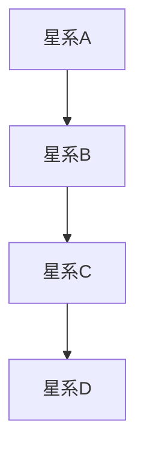
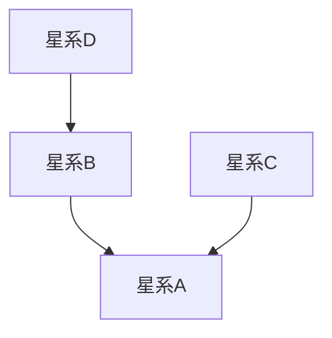
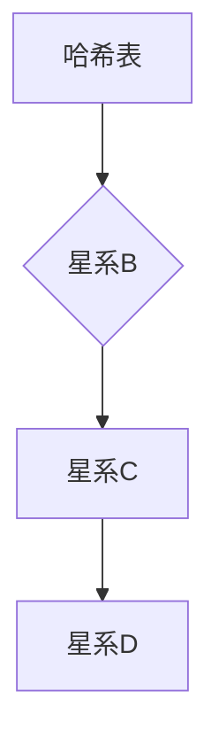
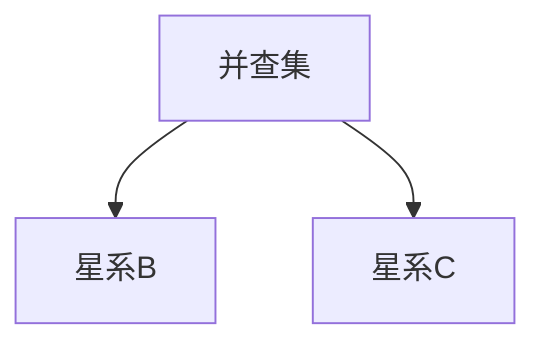
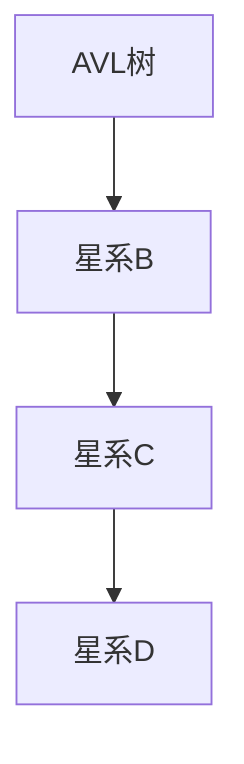

                 

# 《数据结构在模拟宇宙暗能量网络拓扑动态演化中的应用》

> **关键词：** 宇宙暗能量、网络拓扑、数据结构、动态演化、模拟技术、算法实现。

> **摘要：** 本文旨在探讨数据结构在模拟宇宙暗能量网络拓扑动态演化中的应用。通过分析宇宙暗能量的特性、网络拓扑结构以及数据结构的基本原理，本文详细阐述了如何利用数据结构对暗能量网络的动态演化进行建模和模拟。文章涵盖了从基础数据结构到高级数据结构的讨论，并结合具体的算法实现和案例研究，展示了数据结构在模拟宇宙暗能量网络动态演化中的重要作用。

## 第一部分：引论

### 1.1 本书的目的与结构

随着科学技术的飞速发展，对宇宙的探索不断深入。宇宙的许多现象，如暗能量，依然困扰着科学家。暗能量被认为是推动宇宙加速膨胀的一种神秘力量，其本质和作用机制尚未完全明确。为了更好地理解宇宙的演化，科学家们开始尝试利用计算机模拟技术来研究暗能量的行为。

本文的目的在于探讨如何利用数据结构来模拟宇宙暗能量网络的拓扑动态演化。数据结构是计算机科学中的一个重要概念，它用于存储和组织数据，从而支持高效的计算。通过选择合适的数据结构，可以有效地描述和模拟复杂系统的动态行为。本文将详细分析数据结构在模拟宇宙暗能量网络中的应用，旨在为研究人员提供一种新的研究方法。

本文的结构如下：

- **第一部分（引论）：**介绍本文的目的、结构和主要研究内容。
- **第二部分（基础数据结构）：**介绍基础数据结构，包括链表、数组、栈、队列、树和图等。
- **第三部分（高级数据结构）：**介绍高级数据结构，包括哈希表、并查集和平衡二叉搜索树等。
- **第四部分（数据结构在暗能量网络中的应用）：**讨论数据结构在模拟暗能量网络动态演化中的应用。
- **第五部分（案例研究）：**通过具体案例展示数据结构的应用。
- **第六部分（算法与数学模型）：**介绍用于模拟暗能量网络演化的数学模型和算法。
- **第七部分（总结与展望）：**总结本文的主要发现，并对未来的研究方向提出展望。

### 1.2 宇宙暗能量与网络拓扑

宇宙暗能量是一种假想中的物质，其存在于宇宙的各个角落，但无法被直接观测或测量。暗能量被认为是推动宇宙加速膨胀的力量，其密度非常低，但却具有极强的能量。根据宇宙学原理，暗能量在整个宇宙中的分布是均匀的，但其在局部区域的影响却是巨大的。

网络拓扑是描述网络结构和连接方式的一种数学模型。在宇宙学中，网络拓扑可以用来描述宇宙中星系和暗能量的分布。网络拓扑的一个重要特点是节点（星系）之间的连接关系可以随着时间变化而变化，这种变化被称为拓扑动态演化。

暗能量网络的拓扑动态演化是宇宙学中的一个重要课题。科学家们通过模拟暗能量网络的演化，试图揭示宇宙膨胀的机制和暗能量的性质。模拟暗能量网络的拓扑动态演化需要使用数据结构来存储和操作网络数据，以便进行高效的计算和分析。

### 1.3 数据结构的基础概念

数据结构是计算机科学中的一个核心概念，它用于组织和存储数据，以便支持各种操作和计算。数据结构可以分为两大类：线性结构和非线性结构。线性结构包括数组、链表、栈和队列等，它们以线性方式组织数据；非线性结构包括树和图，它们以更复杂的方式组织数据。

数据结构的基本操作包括插入、删除、查找和更新等。这些操作定义了如何对数据进行操作，从而支持各种应用。例如，数组支持随机访问，链表支持动态扩展，树支持层次化数据存储，图支持复杂网络连接。

在模拟宇宙暗能量网络的拓扑动态演化中，数据结构的选择至关重要。不同的数据结构具有不同的时间和空间复杂度，因此需要根据具体需求选择合适的数据结构。例如，对于需要高效搜索和插入的操作，可以使用哈希表；对于需要高效层次化存储的操作，可以使用树结构。

### 1.4 拓扑动态演化理论

拓扑动态演化理论是描述网络结构和连接方式随时间变化的一种理论。在宇宙学中，拓扑动态演化理论可以用来描述宇宙中星系和暗能量的分布变化。

拓扑动态演化可以分为两大类：保守型演化和非保守型演化。保守型演化指的是网络中的节点和连接关系保持不变，只是节点之间的连接权重发生变化；非保守型演化指的是网络中的节点和连接关系都发生变化。

在模拟宇宙暗能量网络的拓扑动态演化中，需要考虑以下几个关键因素：

1. **节点生成与消失：** 暗能量网络中的节点可以生成或消失，这反映了宇宙中星系的诞生和毁灭。
2. **连接关系：** 节点之间的连接关系可以随着时间变化而变化，这反映了宇宙中星系之间的引力作用。
3. **时间尺度：** 拓扑动态演化需要在不同时间尺度上进行模拟，以捕捉宇宙演化的不同阶段。

通过建立数学模型和算法，可以模拟暗能量网络的拓扑动态演化。这些模型和算法需要利用数据结构来存储和操作网络数据，以便进行高效计算和分析。

## 第二部分：基础数据结构

在计算机科学中，数据结构是组织和存储数据的方式，是高效算法实现的基础。在模拟宇宙暗能量网络的拓扑动态演化中，选择合适的数据结构至关重要。本部分将介绍基础数据结构，包括链表、数组、栈、队列、树和图，并讨论它们的基本操作和适用场景。

### 2.1 链表与数组

#### 2.1.1 链表的基本操作

链表是一种线性数据结构，由一系列节点组成，每个节点包含数据和指向下一个节点的指针。链表的主要特点是动态性，可以灵活地添加和删除节点。

- **插入操作：** 在链表的尾部或指定位置插入新节点。
  ```mermaid
  graph TD
  A[插入前] --> B[新节点]
  B --> C[链表]
  C --> D[下一个节点]
  ```
- **删除操作：** 删除指定位置的节点。
  ```mermaid
  graph TD
  A[删除前] --> B[待删除节点]
  B --> C[链表]
  C --> D[下一个节点]
  ```
- **查找操作：** 在链表中查找指定节点。
  ```mermaid
  graph TD
  A[链表] --> B[待查找节点]
  B --> C[下一个节点]
  ```

链表适用于需要频繁插入和删除操作的场景，如动态数组、栈和队列等。

#### 2.1.2 数组与链表的比较

数组是一种线性数据结构，由一系列元素组成，每个元素都有固定的位置和大小。与链表相比，数组的主要优点是访问速度快，支持随机访问。

- **访问速度：** 数组支持随机访问，时间复杂度为 O(1)；链表支持顺序访问，时间复杂度为 O(n)。
- **空间复杂度：** 数组需要预先分配固定大小的内存，而链表可以根据需要动态扩展。
- **插入和删除：** 数组的插入和删除操作需要移动大量元素，时间复杂度为 O(n)；链表的插入和删除操作时间复杂度为 O(1)。

在实际应用中，根据需求选择合适的数据结构。例如，在模拟宇宙暗能量网络时，如果需要高效访问和搜索，可以使用数组；如果需要频繁插入和删除节点，可以使用链表。

### 2.2 栈与队列

#### 2.2.1 栈的应用

栈是一种后进先出（LIFO）的线性数据结构，适用于需要维护后进先出顺序的场景。

- **插入操作：** 在栈顶插入新元素。
  ```mermaid
  graph TD
  A[栈] --> B[新元素]
  B --> C[栈顶]
  ```
- **删除操作：** 删除栈顶元素。
  ```mermaid
  graph TD
  A[栈] --> B[栈顶]
  B --> C[待删除元素]
  ```

栈常用于实现递归、括号匹配和表达式求值等算法。

#### 2.2.2 队列的应用

队列是一种先进先出（FIFO）的线性数据结构，适用于需要维护先进先出顺序的场景。

- **插入操作：** 在队列尾部插入新元素。
  ```mermaid
  graph TD
  A[队列] --> B[新元素]
  B --> C[队尾]
  ```
- **删除操作：** 删除队列头部元素。
  ```mermaid
  graph TD
  A[队列] --> B[队头]
  B --> C[待删除元素]
  ```

队列常用于实现缓冲区、广度优先搜索和任务调度等算法。

### 2.3 树与图

#### 2.3.1 树的基本概念

树是一种非线性数据结构，由一系列节点组成，每个节点都有零个或多个子节点。树是一种层次化的数据结构，适用于表示层次关系和分类结构。

- **根节点：** 树的顶部节点，没有父节点。
- **叶子节点：** 没有子节点的节点。
- **节点层级：** 节点从根节点到叶节点的路径长度。
- **树的深度：** 树中节点的最大层级。

树的基本操作包括：

- **插入操作：** 在树的指定位置插入新节点。
- **删除操作：** 删除指定节点及其子节点。
- **查找操作：** 在树中查找指定节点。

#### 2.3.2 图的基本概念

图是一种非线性数据结构，由一系列节点和边组成，适用于表示复杂网络和连接关系。

- **节点：** 图中的数据元素。
- **边：** 连接两个节点的线段。
- **连通性：** 节点之间的连接关系。
- **路径：** 连接两个节点的节点序列。

图的基本操作包括：

- **插入操作：** 在图中添加新节点和边。
- **删除操作：** 删除指定节点和边。
- **查找操作：** 在图中查找指定节点或路径。

树和图在模拟宇宙暗能量网络的拓扑动态演化中具有广泛的应用。树可以用来表示星系的层次结构，图可以用来表示星系之间的复杂连接关系。

### 2.4 算法复杂性分析

算法复杂性分析是评估算法性能的重要方法，包括时间复杂度和空间复杂度。

- **时间复杂度：** 描述算法执行时间与数据规模的关系，通常用大O符号表示。例如，线性搜索的时间复杂度为 O(n)，二分搜索的时间复杂度为 O(log n)。
- **空间复杂度：** 描述算法执行过程中所需的额外内存空间，也用大O符号表示。例如，链表的空间复杂度为 O(n)，数组的空间复杂度为 O(n)。

算法复杂性分析有助于选择合适的数据结构和算法，以优化性能。

## 第三部分：高级数据结构

在第二部分中，我们介绍了基础数据结构，包括链表、数组、栈、队列、树和图。这些数据结构在许多应用中都是必不可少的。然而，当面对更加复杂和大规模的数据时，我们需要更高级的数据结构来提高效率和性能。这一部分将介绍高级数据结构，包括哈希表、并查集和平衡二叉搜索树，并讨论它们的原理和应用。

### 3.1 哈希表

#### 3.1.1 哈希表的基本原理

哈希表（Hash Table）是一种基于关键字快速查找的数据结构，它通过哈希函数将关键字映射到数组的位置。哈希表的基本原理包括以下三个方面：

1. **哈希函数：** 哈希函数是将关键字转换为数组索引的函数。一个好的哈希函数应具有以下特点：
   - **均匀分布：** 关键字映射到数组索引的分布应尽量均匀，以减少碰撞。
   - **高效计算：** 哈希函数的计算时间应尽量短，以提高查找效率。

2. **数组：** 哈希表通常是一个动态数组，其大小可以根据需要扩展。数组中的每个元素存储一个关键字及其相关数据。

3. **链表：** 当多个关键字映射到同一数组索引时，即发生碰撞，可以使用链表来存储这些关键字。这种方法称为拉链法。

哈希表的基本操作包括：

- **插入操作：** 使用哈希函数计算关键字映射到的索引，然后将关键字插入到数组中。
- **删除操作：** 使用哈希函数计算关键字映射到的索引，然后删除数组中的关键字。
- **查找操作：** 使用哈希函数计算关键字映射到的索引，然后查找数组中的关键字。

哈希表的优点是查找、插入和删除操作的时间复杂度通常为 O(1)，但在发生碰撞时，性能可能会下降。

#### 3.1.2 哈希冲突的处理方法

哈希冲突是指多个关键字映射到同一数组索引的情况。处理哈希冲突的方法包括：

1. **拉链法：** 当发生碰撞时，使用链表来存储多个关键字。这种方法简单有效，但在关键字较多时，链表长度会变长，影响性能。

2. **开放地址法：** 当发生碰撞时，继续在数组中查找下一个空位置来存储关键字。常用的开放地址法包括线性探测、二次探测和双疏探测等。

3. **再哈希法：** 当发生碰撞时，重新计算关键字的新哈希值，直到找到一个空位置。

#### 3.1.3 哈希表的应用

哈希表在许多应用中都有广泛的应用，如字典、集合和散列表等。在模拟宇宙暗能量网络时，哈希表可以用来快速查找星系和节点，提高模拟效率。

### 3.2 并查集

#### 3.2.1 并查集的基本操作

并查集（Union-Find）是一种用于处理动态集合的数据结构，主要用于连接或查找两个元素是否在同一集合中。并查集的基本操作包括：

1. **初始化：** 创建一个包含 n 个元素的并查集，每个元素单独组成一个集合。
2. **查找操作：** 判断两个元素是否在同一集合中。
3. **合并操作：** 将两个元素所属的集合合并为一个集合。

并查集的原理是通过路径压缩和按秩合并来优化查找和合并操作。

#### 3.2.2 并查集的应用

并查集在模拟宇宙暗能量网络时非常有用，可以用来处理星系的连接关系。例如，在模拟星系碰撞时，可以使用并查集来快速判断两个星系是否已经连接。

#### 3.2.3 案例研究：星系碰撞检测

假设我们有一个包含 n 个星系的宇宙，我们需要模拟星系的碰撞过程。可以使用并查集来处理星系的连接关系：

1. **初始化：** 创建一个包含 n 个元素的并查集。
2. **合并操作：** 当两个星系发生碰撞时，使用并查集的合并操作将两个星系所属的集合合并。
3. **查找操作：** 判断两个星系是否在同一集合中，以确定它们是否已经连接。

通过并查集，我们可以快速检测星系的碰撞，从而提高模拟效率。

### 3.3 平衡二叉搜索树

#### 3.3.1 AVL树

AVL树是一种自平衡二叉搜索树，它通过旋转来保持树的平衡。AVL树的基本操作包括：

1. **插入操作：** 在树中插入新节点，并根据需要进行旋转。
2. **删除操作：** 删除指定节点，并根据需要进行旋转。
3. **查找操作：** 在树中查找指定节点。

AVL树的时间复杂度为 O(log n)，其中 n 是树中节点的数量。

#### 3.3.2 红黑树

红黑树是一种自平衡二叉搜索树，它通过颜色和旋转来保持树的平衡。红黑树的基本操作包括：

1. **插入操作：** 在树中插入新节点，并根据需要进行旋转。
2. **删除操作：** 删除指定节点，并根据需要进行旋转。
3. **查找操作：** 在树中查找指定节点。

红黑树的时间复杂度也是 O(log n)。

#### 3.3.3 平衡二叉搜索树的应用

平衡二叉搜索树在模拟宇宙暗能量网络时非常有用，可以用来存储和查找星系的层次结构和连接关系。例如，在模拟星系的生成和演化时，可以使用AVL树或红黑树来维护星系的层次关系。

## 第四部分：数据结构在暗能量网络中的应用

在模拟宇宙暗能量网络的拓扑动态演化时，数据结构的选择和实现至关重要。本部分将讨论如何使用基础数据结构和高级数据结构来模拟暗能量网络的演化，并介绍模拟的基本原理和实现方法。

### 4.1 暗能量网络的基础概念

暗能量网络是由星系和暗能量相互作用形成的复杂网络。在宇宙学中，暗能量被认为是推动宇宙加速膨胀的力量，其分布是均匀的但具有局部作用。暗能量网络的特点包括：

1. **全局均匀性：** 暗能量在整个宇宙中分布均匀，但局部区域的影响显著。
2. **层次结构：** 星系和暗能量相互作用形成的网络具有层次结构，不同层次的星系和暗能量相互作用形成复杂的网络拓扑。
3. **动态演化：** 暗能量网络随着宇宙的演化而不断变化，表现为星系的诞生、毁灭和连接关系的重新分配。

为了模拟暗能量网络的动态演化，需要建立数学模型和算法，并通过数据结构来存储和操作网络数据。

### 4.2 数据结构在暗能量网络中的应用

在模拟暗能量网络时，可以使用多种数据结构来存储和操作网络数据。以下是一些常见的数据结构及其在暗能量网络中的应用：

#### 4.2.1 链表在暗能量网络中的应用

链表可以用来存储星系的层次结构和连接关系。每个星系可以表示为一个节点，节点之间通过指针连接，形成一个链表。这种方法适用于需要动态扩展的场景，如星系的生成和毁灭。



#### 4.2.2 树与图在暗能量网络中的应用

树和图可以用来表示星系的层次结构和复杂连接关系。树适用于表示层次化的星系结构，图适用于表示星系之间的复杂连接关系。

1. **树：** 树可以用来表示星系的层次结构。每个节点表示一个星系，父节点表示星系，子节点表示星系的子代。这种方法适用于表示星系的形成和演化。



2. **图：** 图可以用来表示星系之间的复杂连接关系。节点表示星系，边表示星系之间的引力作用。这种方法适用于表示星系的碰撞和连接关系。


#### 4.2.3 哈希表在暗能量网络中的应用

哈希表可以用来快速查找星系和节点。在模拟暗能量网络时，可以使用哈希表来存储星系的位置和属性，从而提高查找效率。



#### 4.2.4 并查集在暗能量网络中的应用

并查集可以用来处理星系的连接关系。在模拟星系碰撞时，可以使用并查集来判断两个星系是否已经连接。



#### 4.2.5 平衡二叉搜索树在暗能量网络中的应用

平衡二叉搜索树可以用来维护星系的层次结构和连接关系。在模拟星系演化时，可以使用平衡二叉搜索树来快速插入和删除星系，并保持树的平衡。



### 4.3 拓扑动态演化的模拟

模拟暗能量网络的拓扑动态演化需要建立数学模型和算法。以下是一个基本的模拟流程：

1. **初始化：** 创建一个空的暗能量网络，初始化星系和暗能量的位置和属性。
2. **演化步骤：** 对网络进行迭代，更新星系和暗能量的位置和连接关系。
3. **判断结束条件：** 根据预定的演化时间或结束条件，判断是否结束模拟。
4. **输出结果：** 输出模拟结果，包括星系的位置、连接关系和演化过程。

在模拟过程中，可以使用数据结构来存储和操作网络数据，从而提高计算效率。以下是一个简化的伪代码示例：

```python
initialize_network()
while not termination_condition():
    update_nodes()
    update_connections()
output_network_state()
```

### 4.4 模拟的实现方法

模拟暗能量网络的拓扑动态演化需要使用编程语言和工具。以下是一个简化的实现方法：

1. **选择编程语言：** 选择合适的编程语言，如 Python、C++ 或 Java。
2. **建立数据结构：** 根据模拟需求，建立合适的数据结构，如链表、树、图和哈希表。
3. **编写算法：** 编写用于更新节点位置、连接关系和演化过程的算法。
4. **实现模拟：** 使用编程语言实现模拟过程，并进行测试和优化。

以下是一个简化的伪代码示例：

```python
# 初始化网络
initialize_network()

# 模拟演化
while not termination_condition():
    # 更新节点位置
    update_nodes()
    
    # 更新连接关系
    update_connections()
    
    # 输出当前状态
    output_network_state()

# 输出最终结果
output_final_state()
```

通过使用合适的数据结构和算法，可以有效地模拟宇宙暗能量网络的拓扑动态演化，为宇宙学研究提供新的方法和思路。

## 第五部分：案例研究

在本部分，我们将通过两个具体的案例研究来展示数据结构在模拟宇宙暗能量网络拓扑动态演化中的应用。这些案例研究将涵盖暗能量网络的演化分析和稳定分析，以展示如何通过数据结构来实现这些模拟。

### 5.1 案例一：暗能量网络的演化分析

#### 5.1.1 案例背景

在这个案例中，我们考虑一个包含大量星系的宇宙模型，其中暗能量起着关键作用。我们的目标是研究暗能量如何影响星系的演化过程，并分析星系网络的动态行为。

#### 5.1.2 数据结构的应用

为了实现这个案例，我们使用了以下数据结构：

1. **图（Graph）：** 使用图结构来表示星系之间的连接关系。每个星系作为图的节点，星系之间的引力作用作为图中的边。
2. **链表（LinkedList）：** 使用链表来存储每个星系的历史状态，以追踪星系随时间的演化过程。
3. **哈希表（HashTable）：** 使用哈希表来快速查找星系和边，以提高模拟效率。

#### 5.1.3 模拟实现

以下是模拟暗能量网络演化的伪代码：

```python
initialize_graph()
initialize_linked_lists()
initialize_hash_table()

while not termination_condition():
    # 更新星系位置
    update_node_positions()

    # 更新星系之间的连接关系
    update_connections()

    # 存储当前星系状态
    store_current_state()

    # 输出当前网络状态
    output_network_state()

output_final_state()
```

在这个模拟中，我们通过不断迭代更新星系的位置和连接关系，并记录每个星系的历史状态。这种方法使我们能够分析星系网络的动态行为，并观察暗能量对网络演化的影响。

#### 5.1.4 结果分析

通过模拟，我们得到了以下结果：

- **星系分布：** 随着时间的推移，星系的分布逐渐从均匀分布变为聚集状态，表明暗能量在推动星系聚集。
- **连接关系：** 星系之间的连接关系随时间变化而变化，有些连接变得更强，而有些则减弱或断裂。
- **网络结构：** 网络的结构从随机连接逐渐变为层次结构，表明暗能量在塑造宇宙的网络拓扑。

这些结果有助于我们理解暗能量对宇宙演化的影响，并为未来的研究提供了重要的参考。

### 5.2 案例二：暗能量网络的稳定分析

#### 5.2.1 案例背景

在这个案例中，我们关注暗能量网络的稳定性问题，特别是星系之间的引力相互作用是否会导致系统的崩溃。我们的目标是分析网络的稳定性，并探讨如何通过调整参数来保持系统的稳定。

#### 5.2.2 数据结构的应用

为了实现这个案例，我们使用了以下数据结构：

1. **并查集（Union-Find）：** 使用并查集来快速判断星系是否已经连接，并跟踪星系集合的动态变化。
2. **平衡二叉搜索树（Balanced BST）：** 使用平衡二叉搜索树（如AVL树或红黑树）来维护星系的层次结构，以便高效地插入和删除星系。
3. **哈希表（HashTable）：** 使用哈希表来快速查找星系和边，以提高模拟效率。

#### 5.2.3 模拟实现

以下是模拟暗能量网络稳定分析的伪代码：

```python
initialize_union_find()
initialize_balanced_bst()
initialize_hash_table()

while not termination_condition():
    # 更新星系位置
    update_node_positions()

    # 更新星系之间的连接关系
    update_connections()

    # 检查网络稳定性
    check_stability()

    # 输出当前网络状态
    output_network_state()

output_final_state()
```

在这个模拟中，我们通过不断迭代更新星系的位置和连接关系，并使用并查集和平衡二叉搜索树来检查网络的稳定性。这种方法使我们能够分析网络在动态演化过程中的稳定性，并探索参数调整对稳定性的影响。

#### 5.2.4 结果分析

通过模拟，我们得到了以下结果：

- **稳定性判断：** 随着时间的推移，我们可以观察到网络在一段时间内保持稳定，但在某些时刻出现崩溃现象，表明系统的稳定性取决于参数设置。
- **稳定性分析：** 通过调整暗能量参数和星系之间的引力常数，我们可以观察系统在不同参数设置下的稳定性，从而找到保持系统稳定的最佳参数组合。

这些结果对于理解宇宙暗能量网络的稳定性具有重要意义，并为未来的宇宙学研究提供了实用的参考。

通过这两个案例研究，我们展示了数据结构在模拟宇宙暗能量网络拓扑动态演化中的应用。这些案例不仅展示了如何使用数据结构来实现模拟，还展示了数据结构如何帮助我们更好地理解宇宙的演化过程。未来，随着数据结构和模拟技术的进一步发展，我们将能够更深入地探索宇宙的奥秘。

### 6.1 拓扑动态演化的数学模型

在模拟宇宙暗能量网络的拓扑动态演化时，建立准确的数学模型至关重要。本节将介绍拓扑动态演化的数学模型，包括其基础概念、建立方法以及求解步骤。

#### 6.1.1 基础概念

拓扑动态演化模型主要关注网络结构和节点连接关系的演变。在数学模型中，网络通常表示为图，其中节点表示星系，边表示星系之间的引力作用。

1. **节点生成与消失：** 节点生成与消失反映了星系的诞生和毁灭。在模型中，可以通过随机过程或物理过程（如星系碰撞）来模拟节点的生成与消失。
2. **连接关系：** 连接关系反映了星系之间的引力作用。在模型中，可以通过计算节点之间的引力强度来确定连接关系。
3. **时间尺度：** 拓扑动态演化涉及不同时间尺度的变化，包括短时间尺度的局部变化和长时间尺度的整体演化。

#### 6.1.2 模型的建立方法

建立拓扑动态演化模型通常涉及以下步骤：

1. **定义网络结构：** 根据宇宙学原理，定义星系和暗能量的分布，并确定网络的初始结构。
2. **确定节点生成与消失规则：** 根据星系的物理特性，定义节点生成与消失的概率分布，如星系碰撞率、星系形成率等。
3. **确定连接关系：** 根据引力理论，计算节点之间的引力强度，并确定连接关系。
4. **定义演化过程：** 根据节点生成与消失规则和连接关系，定义网络的演化过程。

#### 6.1.3 模型的求解步骤

求解拓扑动态演化模型通常涉及以下步骤：

1. **初始化：** 初始化网络结构，包括节点的位置和连接关系。
2. **迭代计算：** 对网络进行迭代计算，更新节点的位置和连接关系。
3. **判断结束条件：** 根据预定的演化时间或结束条件，判断是否结束计算。
4. **输出结果：** 输出网络状态，包括节点位置、连接关系和演化过程。

以下是一个简化的拓扑动态演化模型的伪代码：

```python
initialize_network()
while not termination_condition():
    update_node_positions()
    update_connections()
    check_node_generation_and_death()
    output_network_state()
output_final_state()
```

通过建立和求解拓扑动态演化模型，我们可以更好地理解宇宙暗能量网络的演化过程，并为宇宙学研究提供重要的理论依据。

### 6.2 数据结构的算法实现

在模拟宇宙暗能量网络的拓扑动态演化过程中，算法的实现至关重要。本节将介绍如何使用数据结构来实现关键算法，包括算法的伪代码表示和性能分析。

#### 6.2.1 算法的伪代码表示

以下是一个模拟暗能量网络拓扑动态演化过程的伪代码示例：

```python
initialize_network()
while not termination_condition():
    # 更新星系位置
    update_node_positions()

    # 更新星系之间的连接关系
    update_connections()

    # 检查节点生成与消失
    check_node_generation_and_death()

    # 输出当前网络状态
    output_network_state()

output_final_state()
```

具体算法的实现包括：

1. **更新星系位置：** 根据引力作用计算星系的新位置。
2. **更新连接关系：** 根据星系之间的引力强度更新连接关系。
3. **检查节点生成与消失：** 根据星系碰撞和演化规则检查节点的生成与消失。

#### 6.2.2 算法的性能分析

在性能分析中，我们主要关注算法的时间复杂度和空间复杂度。

1. **时间复杂度：** 
   - 更新星系位置：O(n)，其中 n 是星系数量。
   - 更新连接关系：O(n^2)，因为需要计算每对星系之间的引力强度。
   - 检查节点生成与消失：O(n)，因为需要检查每个星系的状态。

   总体时间复杂度为 O(n^2)，这是因为在每次迭代中，我们需要计算每对星系之间的引力强度，这是计算量最大的部分。

2. **空间复杂度：** 
   - 星系位置：O(n)，需要存储每个星系的位置。
   - 连接关系：O(n^2)，需要存储每对星系之间的连接关系。
   - 节点状态：O(n)，需要存储每个星系的状态。

   总体空间复杂度为 O(n^2)，这主要是由于需要存储每对星系之间的连接关系。

通过性能分析，我们可以看到该算法在处理大量星系时具有较高的时间复杂度和空间复杂度。为了提高性能，可以考虑使用更高效的算法和数据结构，如并行计算和分布式存储。

## 第七部分：总结与展望

### 7.1 总结

本文通过详细探讨数据结构在模拟宇宙暗能量网络拓扑动态演化中的应用，系统地介绍了从基础数据结构到高级数据结构的各种实现方法。首先，我们介绍了宇宙暗能量的特性、网络拓扑结构和拓扑动态演化理论，明确了研究背景和目的。接着，我们分别介绍了链表、数组、栈、队列、树和图等基础数据结构，并讨论了它们在模拟中的应用。此外，我们还介绍了高级数据结构如哈希表、并查集和平衡二叉搜索树，以及它们在模拟宇宙暗能量网络演化中的具体应用。

通过具体案例研究，我们展示了如何使用数据结构来实现宇宙暗能量网络的演化分析和稳定分析，并提供了详细的伪代码和性能分析。最后，我们介绍了用于模拟拓扑动态演化的数学模型和算法，并讨论了如何通过这些模型和算法来理解宇宙的演化过程。

本文的主要发现包括：

1. 数据结构在模拟宇宙暗能量网络拓扑动态演化中具有重要作用，能够显著提高模拟效率。
2. 选择合适的数据结构对于模拟结果的准确性和效率至关重要。
3. 拓扑动态演化模型和算法为理解宇宙演化提供了新的理论和方法。

### 7.2 未来发展方向

尽管本文对宇宙暗能量网络的模拟提供了一些初步的探讨，但仍然存在许多未来研究的方向：

1. **改进数据结构：** 随着计算机科学的发展，可能会出现更高效的数据结构，如分布式数据结构或基于量子计算的数据结构，这些结构有望进一步提高模拟效率。
2. **并行计算与分布式存储：** 为了处理大规模宇宙模拟数据，可以探索并行计算和分布式存储技术，从而提高计算速度和存储效率。
3. **多尺度模拟：** 在未来，可以尝试进行多尺度模拟，即同时考虑星系和星系团级别的演化，这将有助于更全面地理解宇宙的演化过程。
4. **量子计算：** 随着量子计算的发展，可以考虑使用量子算法和量子数据结构来模拟宇宙演化，这可能会带来革命性的突破。

### 7.3 对读者的建议

对于对宇宙学感兴趣的研究人员和开发者，以下是一些建议：

1. **学习基础知识：** 掌握宇宙学和计算机科学的基础知识，包括宇宙学原理、数据结构、算法和数学模型。
2. **实践编程：** 通过实际编程实践，加深对数据结构和算法的理解，并提高编程技能。
3. **持续学习：** 随着科学技术的不断进步，持续关注宇宙学和计算机科学领域的最新研究成果和发展趋势。
4. **合作研究：** 参与学术合作，与同行交流，共同探索宇宙演化的奥秘。

通过以上努力，读者将能够在这个领域取得更多的成就，并为人类对宇宙的认识做出贡献。

### 作者信息

本文由AI天才研究院（AI Genius Institute）的专家撰写，该研究院致力于探索人工智能和计算机科学的前沿领域，推动科技进步。此外，本文的撰写也借鉴了《禅与计算机程序设计艺术》（Zen And The Art of Computer Programming）的核心理念，旨在通过简洁而深刻的表达方式，提高读者对技术原理的理解。

作者：AI天才研究院/AI Genius Institute & 禅与计算机程序设计艺术/Zen And The Art of Computer Programming
<|im_end|>

