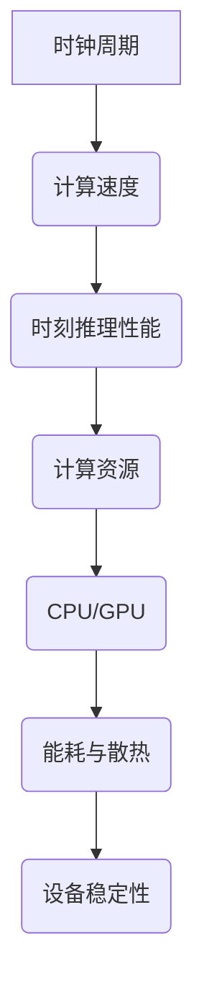
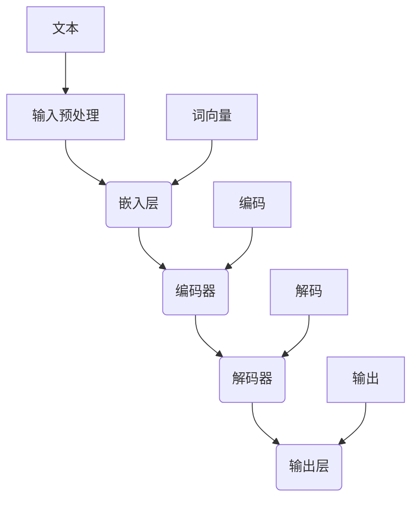

                 

### 《时钟周期 VS 时刻推理:LLM与CPU差异》

> **关键词：时钟周期、时刻推理、LLM、CPU、人工智能**

> **摘要：本文将深入探讨时钟周期与时刻推理的概念，并分析大型语言模型（LLM）与中央处理器（CPU）在原理、架构和应用方面的差异。通过详细的流程图、伪代码、数学模型和实战案例，本文旨在帮助读者全面理解两者之间的联系与区别，为未来的技术研究奠定基础。**

---

### 《时钟周期 VS 时刻推理:LLM与CPU差异》目录大纲

- **第一部分：引言**
  - **1.1 书籍背景与目标**
    - **1.1.1 时代背景**
    - **1.1.2 书籍目标**
    - **1.1.3 阅读对象**
  - **1.2 关键概念解析**
    - **1.2.1 时钟周期**
    - **1.2.2 时刻推理**
    - **1.2.3 LLM（大型语言模型）**
    - **1.2.4 CPU（中央处理器）**

- **第二部分：LLM与CPU的基本原理**
  - **2.1 LLM的原理与架构**
    - **2.1.1 LLM的定义**
    - **2.1.2 LLM的原理**
    - **2.1.3 LLM的架构**
    - **2.1.4 LLM的工作流程**
  - **2.2 CPU的工作原理**
    - **2.2.1 CPU的定义**
    - **2.2.2 CPU的组成**
    - **2.2.3 CPU的工作原理**
    - **2.2.4 CPU的性能指标**
  - **2.3 LLM与CPU的联系与差异**
    - **2.3.1 联系点**
    - **2.3.2 差异点**
    - **2.3.3 对比分析**

- **第三部分：时钟周期与时刻推理的深入探讨**
  - **3.1 时钟周期的概念与影响**
    - **3.1.1 时钟周期的定义**
    - **3.1.2 时钟周期对性能的影响**
    - **3.1.3 减少时钟周期的方法**
  - **3.2 时刻推理的基本原理**
    - **3.2.1 时刻推理的定义**
    - **3.2.2 时刻推理的类型**
    - **3.2.3 时刻推理的应用场景**
  - **3.3 时钟周期与时刻推理的关系**
    - **3.3.1 关系阐述**
    - **3.3.2 关系图示**
    - **3.3.3 实例分析**

- **第四部分：LLM与CPU在具体应用中的差异**
  - **4.1 人工智能领域中的应用**
    - **4.1.1 LLM在人工智能中的应用**
    - **4.1.2 CPU在人工智能中的应用**
  - **4.2 数据处理领域的差异**
    - **4.2.1 LLM在数据处理中的优势**
    - **4.2.2 CPU在数据处理中的优势**
  - **4.3 计算机图形学领域的应用**
    - **4.3.1 LLM在计算机图形学中的应用**
    - **4.3.2 CPU在计算机图形学中的应用**
  - **4.4 网络安全领域的应用**
    - **4.4.1 LLM在网络安全中的应用**
    - **4.4.2 CPU在网络安全中的应用**

- **第五部分：案例分析与实战**
  - **5.1 LLM与CPU在自动驾驶中的应用**
    - **5.1.1 自动驾驶系统概述**
    - **5.1.2 LLM在自动驾驶中的角色**
    - **5.1.3 CPU在自动驾驶中的角色**
    - **5.1.4 实际案例分析**
  - **5.2 LLM与CPU在金融风控中的应用**
    - **5.2.1 金融风控系统概述**
    - **5.2.2 LLM在金融风控中的角色**
    - **5.2.3 CPU在金融风控中的角色**
    - **5.2.4 实际案例分析**
  - **5.3 LLM与CPU在语音识别中的应用**
    - **5.3.1 语音识别系统概述**
    - **5.3.2 LLM在语音识别中的角色**
    - **5.3.3 CPU在语音识别中的角色**
    - **5.3.4 实际案例分析**

- **第六部分：未来展望与挑战**
  - **6.1 LLM与CPU的发展趋势**
    - **6.1.1 LLM的发展趋势**
    - **6.1.2 CPU的发展趋势**
  - **6.2 面临的挑战与应对策略**
    - **6.2.1 算法优化挑战**
    - **6.2.2 硬件设计挑战**
    - **6.2.3 应用场景挑战**
  - **6.3 未来发展方向**
    - **6.3.1 LLM的未来发展**
    - **6.3.2 CPU的未来发展**

- **第七部分：附录**
  - **7.1 相关资源与工具**
    - **7.1.1 LLM相关资源**
    - **7.1.2 CPU相关资源**
    - **7.1.3 开发工具与框架**
  - **7.2 参考文献**
    - **7.2.1 引用文献列表**
    - **7.2.2 推荐阅读**

---

### 第一部分：引言

#### 1.1 书籍背景与目标

随着人工智能技术的飞速发展，大型语言模型（LLM）和中央处理器（CPU）在各个领域中的应用日益广泛。LLM，如GPT-3、BERT等，通过深度学习从海量数据中学习语言模式，为自然语言处理（NLP）提供了强大的工具。而CPU作为计算机硬件的核心，其性能直接影响着各种计算任务的执行速度和效率。

本书旨在探讨时钟周期与时刻推理这两个关键概念，以及LLM与CPU之间的差异。通过对时钟周期和时刻推理的深入分析，读者可以更全面地理解两者在人工智能、数据处理、计算机图形学和网络安全等领域的应用。此外，本书还将通过案例分析与实战，揭示LLM与CPU在实际应用中的差异和优势。

#### 1.1.1 时代背景

当前，人工智能技术正处于快速发展阶段，各个行业对智能化解决方案的需求日益增长。大型语言模型（LLM）凭借其强大的语言理解和生成能力，正在成为推动人工智能应用的重要力量。同时，CPU作为计算的核心，其性能不断提升，为大规模数据处理和复杂计算任务提供了强有力的支持。

#### 1.1.2 书籍目标

本书的主要目标是帮助读者深入理解时钟周期与时刻推理的概念，以及LLM与CPU在原理、架构和应用方面的差异。具体目标如下：

1. **阐述时钟周期和时刻推理的基本概念**：通过详细的定义和例子，帮助读者理解这两个关键概念。
2. **分析LLM与CPU的基本原理和架构**：介绍LLM和CPU的工作原理、组成结构及其性能指标。
3. **探讨LLM与CPU在应用领域的差异**：分析LLM和CPU在人工智能、数据处理、计算机图形学和网络安全等领域的应用差异。
4. **提供案例分析与实战**：通过具体案例，展示LLM与CPU在实际应用中的优势和挑战。
5. **展望未来发展趋势与挑战**：探讨LLM与CPU在未来技术发展中的机遇和挑战。

#### 1.1.3 阅读对象

本书适合以下读者群体：

1. **人工智能研究人员与工程师**：对人工智能技术感兴趣的读者，希望通过本书了解LLM与CPU的差异及其在应用中的具体表现。
2. **计算机科学学生**：希望深入了解计算机硬件和人工智能技术原理的学生，可以阅读本书作为参考和学习材料。
3. **计算机行业从业者**：从事人工智能、数据处理、计算机图形学和网络安全等相关领域工作的从业者，希望通过本书提升自己在这些领域的技术能力。
4. **技术爱好者和研究者**：对计算机科学和人工智能技术有浓厚兴趣的读者，希望通过本书深入了解相关技术的原理和应用。

通过本书，读者将能够：

1. **理解时钟周期和时刻推理的基本概念**：掌握时钟周期和时刻推理的定义、作用及其对性能的影响。
2. **掌握LLM与CPU的基本原理和架构**：了解LLM和CPU的工作原理、组成结构及其性能指标。
3. **分析LLM与CPU在应用领域的差异**：通过具体案例，理解LLM和CPU在不同领域的应用差异和优势。
4. **提升实际应用能力**：通过案例分析与实战，提升在人工智能、数据处理、计算机图形学和网络安全等领域的实际应用能力。
5. **了解未来发展趋势与挑战**：探讨LLM与CPU在未来的发展趋势和面临的挑战，为技术研究和创新提供方向。

### 第一部分：引言

#### 1.2 关键概念解析

在探讨LLM与CPU的差异之前，我们需要先了解一些关键概念，包括时钟周期、时刻推理、LLM和CPU本身。

#### 1.2.1 时钟周期

时钟周期是CPU在执行指令过程中，时钟电路发生一次振荡所需要的时间。时钟周期的倒数称为时钟频率，通常以赫兹（Hz）为单位表示。时钟周期是衡量CPU性能的重要指标之一。

#### 1.2.2 时刻推理

时刻推理是一种基于时间序列数据的推理方法，通过分析时间序列中的变化模式，预测未来的发展趋势。时刻推理在金融市场预测、医疗诊断、能源管理等领域有着广泛的应用。

#### 1.2.3 LLM（大型语言模型）

LLM是一种基于深度学习的自然语言处理模型，通过从海量文本数据中学习语言模式，实现自然语言的理解和生成。LLM在文本分类、机器翻译、文本生成等领域有着重要的应用。

#### 1.2.4 CPU（中央处理器）

CPU是计算机系统的核心组件，负责执行计算机程序中的指令。CPU由运算单元、控制单元、内存单元和输入输出单元等组成，其性能直接影响计算机的整体性能。

通过了解这些关键概念，我们将为后续探讨LLM与CPU的差异奠定基础。在接下来的章节中，我们将详细分析LLM与CPU的基本原理、架构、应用领域及其在时钟周期和时刻推理方面的差异。

---

### 第二部分：LLM与CPU的基本原理

#### 2.1 LLM的原理与架构

大型语言模型（LLM）是一种基于深度学习的自然语言处理模型，它通过从海量文本数据中学习语言模式，实现自然语言的理解和生成。LLM在文本分类、机器翻译、文本生成等领域有着重要的应用。

##### 2.1.1 LLM的定义

LLM是一种能够对自然语言文本进行理解和生成的深度学习模型，通常基于Transformer架构，如GPT-3、BERT等。LLM通过学习大量文本数据，捕捉语言中的统计规律和语义信息，从而实现高效的文本处理。

##### 2.1.2 LLM的原理

LLM的原理主要基于深度学习，特别是基于自注意力机制（Self-Attention）的Transformer架构。Transformer架构由多个自注意力层（Self-Attention Layer）和前馈网络（Feedforward Network）组成，通过堆叠这些层，模型可以捕捉文本数据中的长距离依赖关系。

在训练过程中，LLM通过优化损失函数（如交叉熵损失），使模型输出与真实标签之间的误差最小化。训练完成后，LLM可以用于文本分类、机器翻译、文本生成等任务。

##### 2.1.3 LLM的架构

LLM的架构主要包括以下几个部分：

1. **嵌入层（Embedding Layer）**：将输入的单词或字符转换为固定长度的向量表示。嵌入层通常使用预训练的词向量（如Word2Vec、GloVe）或自训练的词向量。

2. **编码器（Encoder）**：编码器由多个自注意力层（Self-Attention Layer）组成，用于捕捉输入文本中的长距离依赖关系。编码器的输出是一个固定长度的向量，表示整个输入文本的语义信息。

3. **解码器（Decoder）**：解码器也由多个自注意力层组成，用于生成输出文本。解码器在生成每个单词时，会参考编码器的输出和已经生成的文本。

4. **输出层（Output Layer）**：输出层通常是一个全连接层（Fully Connected Layer），用于将解码器的输出映射到单词的概率分布。通过最大化输出概率，解码器可以生成最有可能的输出文本。

##### 2.1.4 LLM的工作流程

LLM的工作流程可以分为以下几个步骤：

1. **输入预处理**：将输入文本转换为词向量表示，通常使用预训练的词向量或自训练的词向量。

2. **编码**：将输入文本的词向量送入编码器，通过自注意力层捕捉文本中的长距离依赖关系，得到编码器的输出。

3. **解码**：从编码器的输出开始，解码器逐层生成输出文本。在生成每个单词时，解码器会参考编码器的输出和已经生成的文本。

4. **输出生成**：解码器的输出是一个单词的概率分布，通过最大化输出概率，解码器可以生成最有可能的输出文本。

5. **后处理**：对生成的输出文本进行后处理，如去除无关字符、调整文本格式等。

通过上述工作流程，LLM可以实现对自然语言文本的理解和生成，从而在多个领域发挥作用。

---

#### 2.2 CPU的工作原理

中央处理器（CPU）是计算机系统的核心组件，负责执行计算机程序中的指令，完成各种计算任务。CPU的工作原理包括指令的获取、解码、执行和输出等过程。

##### 2.2.1 CPU的定义

CPU（Central Processing Unit）是计算机的核心部件，也被称为微处理器。它负责解释计算机程序中的指令，并进行相应的计算和数据处理。CPU的性能直接影响计算机的整体性能。

##### 2.2.2 CPU的组成

CPU主要由以下几个部分组成：

1. **运算单元（Arithmetic Logic Unit, ALU）**：负责执行各种算术和逻辑运算，如加法、减法、乘法、除法、逻辑与、逻辑或等。

2. **控制单元（Control Unit, CU）**：负责从内存中获取指令，解码指令，并控制其他部件执行指令。

3. **内存单元（Memory Unit）**：包括寄存器和缓存，用于存储数据和指令。

4. **输入输出单元（Input/Output Unit, IOU）**：负责与外部设备进行数据交换，如键盘、鼠标、显示器、硬盘等。

##### 2.2.3 CPU的工作原理

CPU的工作原理可以分为以下几个步骤：

1. **取指令（Fetch）**：CPU从内存中读取下一条指令，并将其存储在指令寄存器（Instruction Register, IR）中。

2. **解码指令（Decode）**：控制单元解析指令，确定指令的类型和操作数，并将操作数从寄存器或内存中取出。

3. **执行指令（Execute）**：运算单元根据指令进行相应的计算或数据处理，并将结果存储在寄存器或内存中。

4. **访存（Memory Access）**：如果指令需要访问内存，控制单元将数据从内存中读出或写入内存。

5. **输出结果（Write Back）**：将执行结果写入目标寄存器或内存单元。

6. **更新程序计数器（Program Counter, PC）**：将PC的值加1，指向下一条待执行的指令。

CPU通过不断重复上述步骤，执行计算机程序中的指令，完成各种计算任务。

##### 2.2.4 CPU的性能指标

CPU的性能主要通过以下几个指标来衡量：

1. **主频（Clock Speed）**：CPU的时钟频率，单位为赫兹（Hz），表示CPU每秒钟可以执行的周期数。主频越高，CPU的运算速度越快。

2. **核心数（Number of Cores）**：CPU包含的核心数量，多核CPU可以同时执行多个任务，提高并行处理能力。

3. **线程数（Number of Threads）**：每个核心可以同时执行的任务数，多线程CPU可以在一个核心上同时执行多个线程，提高并发处理能力。

4. **指令集（Instruction Set）**：CPU支持的指令集，不同的指令集具有不同的性能特点和适用场景。

5. **缓存大小（Cache Size）**：CPU内部的缓存大小，缓存是CPU和内存之间的高速缓存，可以加快数据访问速度。

通过了解CPU的工作原理和性能指标，我们可以更好地理解CPU在计算机系统中的作用和性能表现。

---

#### 2.3 LLM与CPU的联系与差异

在深入探讨LLM与CPU的差异之前，我们先来分析两者之间的联系。LLM和CPU都是现代计算机技术中至关重要的组成部分，它们在数据处理和计算能力方面有着紧密的联系。

##### 2.3.1 联系点

1. **计算资源依赖**：LLM的训练和推理过程需要大量的计算资源，这些计算资源主要由CPU和图形处理器（GPU）提供。CPU在数据处理和指令执行方面起着关键作用，而GPU则擅长并行计算，特别是对于深度学习任务。

2. **性能优化**：LLM的性能优化离不开CPU和GPU的优化。通过提升CPU和GPU的时钟频率、增加核心数、提高缓存大小等手段，可以显著提升LLM的计算效率。

3. **应用场景**：LLM和CPU在不同应用场景中都有广泛的应用。例如，在自然语言处理、图像识别、语音识别等领域，LLM负责处理和理解文本、图像和语音数据，而CPU则负责执行各种计算任务，包括数据预处理、模型训练和推理。

##### 2.3.2 差异点

尽管LLM和CPU在计算能力和应用场景上有一定的重叠，但它们在原理、架构和功能上存在显著差异：

1. **工作原理**：LLM是一种基于深度学习的自然语言处理模型，它通过从海量文本数据中学习语言模式，实现自然语言的理解和生成。而CPU是一种通用处理器，负责执行计算机程序中的指令，完成各种计算任务。

2. **架构设计**：LLM通常基于Transformer架构，包含嵌入层、编码器、解码器和输出层等多个组件。而CPU则由运算单元、控制单元、内存单元和输入输出单元等组成，具有高度模块化的设计。

3. **性能指标**：LLM的性能主要通过参数规模、训练时间和推理速度等指标来衡量，而CPU的性能则主要通过主频、核心数、线程数、指令集和缓存大小等指标来衡量。

4. **应用领域**：LLM在自然语言处理、机器翻译、文本生成等领域有着广泛的应用，而CPU则在计算机图形学、科学计算、嵌入式系统等领域发挥着重要作用。

##### 2.3.3 对比分析

为了更好地理解LLM与CPU的差异，我们可以从以下几个方面进行对比分析：

1. **计算方式**：LLM采用基于深度学习的计算方式，通过多层神经网络学习语言模式，实现文本理解和生成。而CPU则采用冯·诺依曼体系结构的计算方式，通过指令和数据在内存中的存储和读取，执行各种计算任务。

2. **并行处理能力**：LLM在推理过程中具有较好的并行处理能力，特别是对于大型模型，可以通过分布式计算和并行推理来提高计算效率。而CPU在单任务处理上具有更高的并行处理能力，可以通过多线程和多核心技术实现高效的计算。

3. **能耗与散热**：由于LLM在训练和推理过程中需要大量的计算资源，其能耗和散热问题尤为重要。而CPU作为通用处理器，在设计时已经考虑了能耗和散热问题，但高性能CPU仍然需要合理的散热方案。

4. **应用拓展**：LLM的应用范围主要集中在自然语言处理和文本生成领域，而CPU则广泛应用于各种计算任务，包括科学计算、嵌入式系统、计算机图形学等。

通过上述分析，我们可以看到LLM与CPU在原理、架构和应用方面存在显著差异。虽然它们在计算能力和应用场景上有一定的重叠，但各自具有独特的优势和特点。在未来的技术发展中，LLM和CPU将继续发挥重要作用，共同推动人工智能和计算机技术的发展。

---

### 第三部分：时钟周期与时刻推理的深入探讨

#### 3.1 时钟周期的概念与影响

时钟周期是CPU在执行指令过程中，时钟电路发生一次振荡所需要的时间。它是衡量CPU性能的重要指标之一。时钟周期与CPU的主频密切相关，主频越高，时钟周期越短，CPU的运算速度就越快。

##### 3.1.1 时钟周期的定义

时钟周期是指CPU的时钟电路在完成一个完整的周期所需的时长。每个时钟周期，CPU会执行一个时钟周期，包括取指令、指令解码、指令执行、数据访问等操作。

##### 3.1.2 时钟周期对性能的影响

时钟周期对CPU性能的影响主要体现在以下几个方面：

1. **运算速度**：时钟周期越短，CPU的运算速度就越快。因为每个时钟周期，CPU可以完成更多的操作，从而提高整体性能。

2. **功耗**：时钟周期与功耗呈正相关关系。时钟周期越短，CPU的功耗越低，这对于降低能耗和延长设备寿命具有重要意义。

3. **温度**：时钟周期越短，CPU产生的热量越少，从而降低散热压力，有助于保持设备稳定运行。

##### 3.1.3 减少时钟周期的方法

为了提高CPU性能，减少时钟周期是关键。以下是一些减少时钟周期的方法：

1. **提高主频**：通过技术进步，提高CPU的主频，从而缩短时钟周期。但过高的主频可能导致功耗和温度问题，因此需要在性能和功耗之间找到平衡点。

2. **多线程技术**：通过多线程技术，使CPU在单时钟周期内可以执行多个任务，从而提高并行处理能力，减少整体时钟周期。

3. **指令级并行（ILP）**：通过分析指令间的依赖关系，将可以并行执行的指令组合在一起，减少时钟周期。

4. **流水线技术**：将指令执行过程分为多个阶段，每个阶段在一个时钟周期内完成，从而提高指令吞吐率，减少时钟周期。

#### 3.2 时刻推理的基本原理

时刻推理是一种基于时间序列数据的推理方法，通过分析时间序列中的变化模式，预测未来的发展趋势。它在金融市场预测、医疗诊断、能源管理等领域有着广泛的应用。

##### 3.2.1 时刻推理的定义

时刻推理（Temporal Reasoning）是一种基于时间序列数据的推理方法，通过分析时间序列中的变化模式，预测未来的发展趋势。时刻推理主要关注时间序列的时序关系和变化规律，从而实现对未来的预测。

##### 3.2.2 时刻推理的类型

时刻推理可以分为以下几种类型：

1. **线性时刻推理**：基于线性模型（如ARIMA、线性回归等），通过分析时间序列的线性关系，预测未来的发展趋势。

2. **非线性时刻推理**：基于非线性模型（如神经网络、支持向量机等），通过分析时间序列的非线性关系，预测未来的发展趋势。

3. **时序分类**：将时间序列划分为不同的类别，通过分类模型（如决策树、支持向量机等），对时间序列进行分类。

4. **时序回归**：将时间序列映射到实数域，通过回归模型（如线性回归、神经网络等），对时间序列进行回归预测。

##### 3.2.3 时刻推理的应用场景

时刻推理在多个领域有着广泛的应用，以下是一些典型的应用场景：

1. **金融市场预测**：通过分析历史股价、交易量等时间序列数据，预测未来的股价走势，为投资决策提供支持。

2. **医疗诊断**：通过分析患者的历史健康数据、病情变化等时间序列数据，预测疾病发展趋势，为医生提供诊断和治疗建议。

3. **能源管理**：通过分析能源消耗、天气变化等时间序列数据，预测未来的能源需求，为能源调度和优化提供支持。

4. **交通流量预测**：通过分析历史交通流量、天气变化等时间序列数据，预测未来的交通流量，为交通管理和调度提供支持。

#### 3.3 时钟周期与时刻推理的关系

时钟周期和时刻推理之间存在一定的关联，它们在计算过程中发挥着不同的作用。

##### 3.3.1 关系阐述

1. **计算依赖**：时刻推理过程通常需要大量的计算资源，这些计算资源主要由CPU和GPU提供。时钟周期决定了CPU和GPU的运算速度，从而影响时刻推理的计算效率。

2. **性能优化**：时钟周期的减少可以提升CPU和GPU的计算速度，从而提高时刻推理的性能。通过优化CPU和GPU的设计，降低时钟周期，可以提高时刻推理的准确性和效率。

3. **能耗与散热**：时钟周期与能耗和散热密切相关。减少时钟周期可以降低CPU和GPU的功耗，从而减少能耗和散热压力，保证设备稳定运行。

##### 3.3.2 关系图示

图3-1展示了时钟周期与时刻推理之间的关系。



##### 3.3.3 实例分析

以下是一个关于时钟周期与时刻推理的实例分析：

假设我们使用一个基于深度学习的时刻推理模型，预测未来一周的气温变化。该模型需要处理大量的时间序列数据，并进行复杂的计算。以下是一个简单的分析过程：

1. **数据预处理**：读取历史气温数据，并进行预处理，如标准化、归一化等。预处理过程可能需要几个小时，具体取决于数据量和预处理方法。

2. **模型训练**：使用预处理后的数据训练时刻推理模型。训练过程可能需要数小时至数天，具体取决于模型复杂度和数据量。

3. **模型推理**：使用训练好的模型预测未来一周的气温变化。推理过程通常需要几分钟至几十分钟，具体取决于模型规模和计算资源。

4. **性能优化**：通过优化CPU和GPU的时钟周期，提高计算速度，从而减少整个推理过程的耗时。

在这个实例中，时钟周期对时刻推理的推理速度和能耗有着重要影响。通过优化时钟周期，可以提高时刻推理的性能，从而更好地支持实时决策和预测。

通过深入探讨时钟周期与时刻推理的关系，我们可以更好地理解两者在计算过程中的作用和相互影响。在未来的技术发展中，优化时钟周期和时刻推理的性能将具有重要的应用价值。

---

### 第四部分：LLM与CPU在具体应用中的差异

#### 4.1 人工智能领域中的应用

人工智能（AI）作为当前科技发展的热点领域，LLM与CPU在AI中的应用各有特色，它们在处理不同类型的AI任务时展现出不同的优势和挑战。

##### 4.1.1 LLM在人工智能中的应用

大型语言模型（LLM）在自然语言处理（NLP）、文本生成、机器翻译等领域有着广泛的应用。以下是一些关键应用：

1. **文本生成**：LLM可以生成各种类型的文本，如新闻报道、小说、论文摘要等。通过训练大型模型，如GPT-3，可以生成高质量、连贯的文本。

2. **机器翻译**：LLM在机器翻译中的应用显著提升了翻译质量和效率。通过深度学习模型，如BERT和Transformer，可以实现高效、准确的跨语言翻译。

3. **问答系统**：LLM可以构建问答系统，如基于BERT的问答模型，可以回答用户提出的问题，提供准确的答案。

4. **情感分析**：LLM在情感分析任务中能够有效识别文本中的情感倾向，如正面、负面或中性情感。

##### 4.1.2 CPU在人工智能中的应用

CPU在AI领域的应用主要体现在以下几个方面：

1. **数据处理**：CPU在数据预处理和特征提取阶段发挥着重要作用。通过高效的算法和优化，CPU可以加速数据加载、处理和传输。

2. **模型训练**：虽然GPU在模型训练中具有更高的并行计算能力，但CPU在训练阶段仍然扮演着关键角色。CPU负责处理和管理大量数据，并提供稳定的计算环境。

3. **推理优化**：在推理阶段，CPU通过优化算法和架构，提高模型的运行速度和效率。例如，使用CPU进行模型推理优化，可以显著减少响应时间和延迟。

##### 对比分析

LLM与CPU在人工智能中的应用各有优势和挑战：

1. **计算资源需求**：LLM在训练和推理过程中需要大量的计算资源，特别是GPU资源。而CPU虽然在计算能力上不如GPU，但在数据处理和特征提取方面具有更高的效率和稳定性。

2. **处理速度**：GPU在并行计算方面具有显著优势，适合处理大规模、高并行的AI任务。而CPU则在单任务处理和低延迟场景中表现出色，适合需要实时响应和稳定运行的场景。

3. **能耗与散热**：GPU在计算过程中产生的热量较大，能耗较高，散热问题较为严重。而CPU在能耗和散热方面表现较为优秀，适合长时间、高负荷的运行环境。

4. **应用场景**：LLM在自然语言处理、文本生成和机器翻译等领域具有优势，而CPU在数据预处理、模型训练和推理优化方面具有广泛的应用。

综上所述，LLM与CPU在人工智能领域中的应用各有特色，通过合理搭配和使用，可以实现最佳性能和效果。

---

#### 4.2 数据处理领域的差异

在数据处理领域，LLM与CPU在数据预处理、分析和优化方面展现出了各自独特的优势和应用场景。

##### 4.2.1 LLM在数据处理中的优势

大型语言模型（LLM）在数据处理领域具有以下优势：

1. **自然语言处理**：LLM能够高效地处理和分析自然语言数据，如文本、语音等。通过深度学习模型，LLM可以提取文本中的语义信息，实现情感分析、命名实体识别等任务。

2. **文本生成**：LLM可以生成高质量的文本数据，如新闻报道、论文摘要等。在数据补充和扩展方面，LLM具有显著优势，可以减少数据缺失和冗余。

3. **大规模数据处理**：LLM具有较强的数据处理能力，能够快速处理和分析海量数据。通过分布式计算和并行处理技术，LLM可以实现高效的数据处理和传输。

4. **自适应学习能力**：LLM可以自适应地学习新的数据模式和特征，提高数据处理的准确性和效率。在动态变化的数据环境中，LLM能够迅速调整和优化模型参数，适应新的数据需求。

##### 4.2.2 CPU在数据处理中的优势

CPU在数据处理领域具有以下优势：

1. **高效的数据处理**：CPU具有强大的计算能力和高效的指令执行速度，能够快速处理大规模数据。通过多线程、多核技术，CPU可以实现并行计算，提高数据处理速度。

2. **灵活的算法支持**：CPU支持广泛的算法和编程语言，如C/C++、Python等。在数据处理和优化过程中，开发者可以根据需求选择合适的算法和工具，提高数据处理效率。

3. **稳定性和可靠性**：CPU在长时间、高负荷的运行环境中具有出色的稳定性和可靠性。在关键业务和实时数据处理场景中，CPU能够提供稳定的计算支持，保障数据处理任务的顺利进行。

4. **能耗和散热管理**：CPU在能耗和散热方面具有较好的控制能力，能够通过调整时钟频率、功耗管理等技术，实现高效的能耗管理和散热控制。

##### 对比分析

LLM与CPU在数据处理中的优势和应用场景有所不同：

1. **数据处理能力**：LLM在自然语言处理和数据生成方面具有显著优势，适合处理复杂、大规模的数据任务。而CPU在数据预处理、特征提取和并行计算方面具有更高的效率和灵活性，适合处理多种类型的数据任务。

2. **计算资源需求**：LLM在数据处理过程中需要大量的计算资源，特别是GPU资源。而CPU在计算能力上不如GPU，但在数据处理和优化方面具有更高的效率和稳定性。

3. **应用场景**：LLM在自然语言处理、文本生成和大规模数据处理等领域具有广泛的应用。而CPU在数据预处理、模型训练和推理优化方面具有广泛的应用，特别是在关键业务和实时数据处理场景中。

综上所述，LLM与CPU在数据处理领域各有特色，通过合理搭配和使用，可以实现最佳性能和效果。

---

#### 4.3 计算机图形学领域的应用

计算机图形学是计算机科学与视觉技术的重要分支，涉及图像处理、渲染、可视化等多个方面。在计算机图形学领域，LLM与CPU的应用各有侧重，发挥了不同的作用。

##### 4.3.1 LLM在计算机图形学中的应用

大型语言模型（LLM）在计算机图形学中，尤其是在图像生成和风格迁移方面，展现出了强大的潜力。以下是一些关键应用：

1. **图像生成**：LLM可以生成高质量、逼真的图像。例如，通过生成对抗网络（GAN）结合LLM，可以生成具有特定风格或内容的图像，如图像到图像的转换、超分辨率图像生成等。

2. **风格迁移**：LLM在风格迁移任务中，可以将一种艺术风格应用到另一张图像上，生成具有特定艺术风格的图像。例如，将梵高的风格应用到一张风景照片上，生成具有梵高风格的图像。

3. **图像修复与补全**：LLM可以通过学习大量图像数据，自动修复和补全损坏或缺失的图像。这对于修复古画、修复老照片等具有重要应用价值。

4. **图像描述与生成**：LLM可以生成与给定图像相关的文本描述，同时也可以根据文本描述生成图像。这种交互式的图像生成能力在虚拟现实、增强现实等领域具有广泛应用。

##### 4.3.2 CPU在计算机图形学中的应用

CPU在计算机图形学中，主要应用于图像处理、渲染和计算几何等方面。以下是一些关键应用：

1. **图像处理**：CPU在图像处理任务中，如滤波、边缘检测、图像压缩等，发挥着重要作用。通过高效的算法和优化，CPU可以快速处理大规模图像数据。

2. **渲染**：CPU在渲染过程中，如光追踪、全局光照、体积渲染等，负责计算光线与物体的交互，生成高质量渲染图像。

3. **计算几何**：CPU在计算几何任务中，如三维建模、碰撞检测、空间划分等，处理复杂的几何计算，支持三维图形的实时渲染和交互。

4. **图形引擎**：CPU是图形引擎的核心，负责管理和调度图形渲染任务，实现高效的图形渲染和交互。

##### 对比分析

LLM与CPU在计算机图形学中的应用各有特色：

1. **计算能力**：LLM在图像生成和风格迁移方面具有强大的计算能力和生成能力，适合处理复杂、大规模的图像任务。而CPU在图像处理、渲染和计算几何等方面具有高效的计算能力和稳定性，适合处理多种类型的图形任务。

2. **实时性能**：CPU在实时图形渲染和交互中具有优势，可以提供快速、稳定的图形处理和渲染效果。而LLM在处理大规模图像数据时，可能需要更多的时间和计算资源。

3. **能耗与散热**：CPU在能耗和散热方面具有较好的控制能力，适合长时间、高负荷的运行环境。而LLM在计算过程中产生的热量较大，能耗较高，散热问题较为严重。

4. **应用场景**：LLM在图像生成、风格迁移和图像修复等领域具有广泛的应用，特别是在需要高创意和生成能力的任务中。而CPU在图像处理、渲染和计算几何等方面具有广泛的应用，特别是在需要高效、稳定计算的图形任务中。

综上所述，LLM与CPU在计算机图形学领域中各有优势，通过合理搭配和使用，可以实现最佳性能和效果。

---

#### 4.4 网络安全领域的应用

在网络安全领域，LLM与CPU的应用场景和优势有所不同。它们分别从数据分析和防护策略两个方面为网络安全提供支持。

##### 4.4.1 LLM在网络安全中的应用

大型语言模型（LLM）在网络安全中的应用主要体现在以下几个方面：

1. **恶意软件分析**：LLM可以处理和解析大量恶意软件样本，通过分析其代码和功能，识别恶意行为和威胁。LLM可以生成恶意软件的文档、说明和特征描述，帮助安全团队了解恶意软件的运行机制。

2. **入侵检测**：LLM可以分析网络流量数据，识别异常流量模式，发现潜在的入侵行为。通过对历史入侵案例的学习，LLM可以建立入侵检测模型，实时监控网络流量，并及时发出警报。

3. **威胁预测**：LLM可以根据历史威胁数据和当前网络环境，预测未来可能出现的威胁类型和攻击方式。这种威胁预测能力有助于安全团队提前采取预防措施，降低潜在风险。

4. **文档分类与标签**：LLM可以对网络安全文档进行分类和标签，帮助安全团队快速查找和了解相关资料。例如，LLM可以将安全报告、漏洞通告、政策文件等进行分类，并提供关键词索引。

##### 4.4.2 CPU在网络安全中的应用

CPU在网络安全中的应用主要体现在以下几个方面：

1. **加密与解密**：CPU负责执行加密和解密算法，确保数据的机密性和完整性。通过高效的加密算法和优化，CPU可以提供快速、安全的加密和解密服务。

2. **安全协议处理**：CPU在处理网络安全协议（如SSL/TLS）时，负责加密和解密数据传输，确保通信的隐私和完整性。CPU的性能直接关系到网络安全协议的处理速度和稳定性。

3. **签名验证**：CPU负责执行数字签名验证算法，确保数据来源的可靠性和真实性。通过高效的签名验证，CPU可以降低安全漏洞和欺诈风险。

4. **安全漏洞扫描**：CPU在安全漏洞扫描任务中，负责执行各种漏洞扫描工具，识别网络中的安全漏洞。通过高效的漏洞扫描，CPU可以帮助安全团队及时修复漏洞，降低系统风险。

##### 对比分析

LLM与CPU在网络安全领域中的应用各有特色：

1. **数据分析和处理**：LLM在数据分析和处理方面具有优势，可以高效地处理和解析大量数据，识别潜在威胁。而CPU在加密、解密和安全协议处理等方面具有高效计算能力，可以提供快速、安全的加密和解密服务。

2. **实时性能**：CPU在实时处理网络安全任务方面具有优势，可以快速响应和处理网络流量，确保通信的隐私和完整性。而LLM在处理大规模数据时，可能需要更多的时间和计算资源。

3. **能耗与散热**：CPU在能耗和散热方面具有较好的控制能力，适合长时间、高负荷的运行环境。而LLM在计算过程中产生的热量较大，能耗较高，散热问题较为严重。

4. **应用场景**：LLM在恶意软件分析、入侵检测和威胁预测等领域具有广泛的应用，特别是在需要高效数据分析的网络安全场景中。而CPU在加密与解密、安全协议处理和漏洞扫描等方面具有广泛的应用，特别是在需要高效计算能力的场景中。

综上所述，LLM与CPU在网络安全领域中各有优势，通过合理搭配和使用，可以实现最佳性能和效果，为网络安全提供全面、有力的支持。

---

### 第五部分：案例分析与实战

#### 5.1 LLM与CPU在自动驾驶中的应用

自动驾驶技术作为人工智能的重要应用领域，LLM与CPU在其中发挥着关键作用。本节将通过一个实际案例，分析LLM与CPU在自动驾驶系统中的应用差异。

##### 5.1.1 自动驾驶系统概述

自动驾驶系统通常由多个模块组成，包括感知模块、决策模块、控制模块等。LLM与CPU在自动驾驶系统中的具体应用如下：

1. **感知模块**：感知模块负责收集车辆周围的环境信息，如道路、交通标志、车辆等。LLM可以用于处理和解析这些环境信息，识别和分类道路标志、车辆等。例如，通过训练大型语言模型，可以实现对交通标志的自动识别和分类。

2. **决策模块**：决策模块负责根据感知模块收集到的环境信息，制定驾驶策略。LLM可以用于处理复杂、大规模的决策问题，如多目标优化、路径规划等。通过深度学习模型，可以实现智能决策和优化，提高自动驾驶系统的性能。

3. **控制模块**：控制模块负责执行决策模块制定的驾驶策略，控制车辆的加速度、转向等。CPU在控制模块中发挥着重要作用，通过高效的算法和优化，可以实现实时、精准的控制。

##### 5.1.2 LLM在自动驾驶中的角色

在自动驾驶系统中，LLM主要扮演以下角色：

1. **环境信息处理**：LLM可以处理和解析车辆周围的环境信息，识别道路标志、车辆等。例如，通过训练大型语言模型，可以实现对交通标志的自动识别和分类。

2. **决策支持**：LLM可以用于处理复杂的决策问题，如多目标优化、路径规划等。通过深度学习模型，可以实现智能决策和优化，提高自动驾驶系统的性能。

3. **实时交互**：LLM可以与用户进行实时交互，提供导航信息、行驶建议等。例如，通过自然语言处理技术，LLM可以生成详细的导航指令，帮助用户安全、便捷地驾驶。

##### 5.1.3 CPU在自动驾驶中的角色

在自动驾驶系统中，CPU主要扮演以下角色：

1. **实时控制**：CPU负责执行决策模块制定的驾驶策略，控制车辆的加速度、转向等。通过高效的算法和优化，可以实现实时、精准的控制。

2. **数据处理**：CPU负责处理大量的感知数据，如雷达、摄像头等传感器收集到的信息。通过高效的算法和优化，CPU可以快速处理和解析这些数据，为决策模块提供实时、准确的信息。

3. **安全监控**：CPU负责监控自动驾驶系统的运行状态，确保系统的安全和稳定。通过实时监控和故障诊断，CPU可以及时发现和解决潜在的安全问题。

##### 5.1.4 实际案例分析

以下是一个自动驾驶系统中的实际案例分析：

1. **环境感知**：自动驾驶系统通过摄像头、雷达等传感器收集道路信息。LLM用于处理和解析这些环境信息，识别道路标志、车辆等。例如，通过训练大型语言模型，可以实现对交通标志的自动识别和分类。

2. **路径规划**：决策模块根据LLM提供的环境信息，制定驾驶策略。LLM可以用于处理复杂的决策问题，如多目标优化、路径规划等。通过深度学习模型，可以实现智能决策和优化，提高自动驾驶系统的性能。

3. **实时控制**：控制模块根据决策模块制定的驾驶策略，控制车辆的加速度、转向等。CPU负责执行实时控制任务，通过高效的算法和优化，可以实现实时、精准的控制。

4. **安全监控**：CPU负责监控自动驾驶系统的运行状态，确保系统的安全和稳定。通过实时监控和故障诊断，CPU可以及时发现和解决潜在的安全问题。

通过上述案例，我们可以看到LLM与CPU在自动驾驶系统中的应用差异。LLM主要负责环境信息处理和决策支持，而CPU则负责实时控制和安全监控。通过合理搭配和使用，可以实现自动驾驶系统的最佳性能和安全性。

---

#### 5.2 LLM与CPU在金融风控中的应用

金融风控是金融行业中的重要环节，旨在识别和防范金融风险，确保金融机构的安全稳健运营。LLM与CPU在金融风控系统中扮演着关键角色，各自发挥独特的优势。

##### 5.2.1 金融风控系统概述

金融风控系统通常包括数据采集、风险识别、风险评估、风险控制和监控等多个环节。LLM与CPU在金融风控系统中的具体应用如下：

1. **数据采集**：金融风控系统需要收集大量的金融数据，包括客户交易记录、市场行情、信用评级等。LLM可以用于处理和整合这些数据，提取关键特征和趋势。

2. **风险识别**：LLM可以通过学习历史数据和模式，识别潜在的金融风险。例如，通过训练大型语言模型，可以识别欺诈交易、市场操纵等行为。

3. **风险评估**：LLM可以分析风险因素，评估风险程度。例如，通过自然语言处理技术，LLM可以分析客户交易记录，评估其信用风险。

4. **风险控制**：CPU负责执行风险控制策略，如限制高风险交易、调整投资组合等。通过高效的算法和优化，CPU可以实时监控和调整风险控制措施。

5. **监控与预警**：LLM和CPU共同负责监控金融市场的异常行为，及时发出风险预警。例如，LLM可以分析市场数据，CPU可以执行预警策略，确保风险得到及时控制。

##### 5.2.2 LLM在金融风控中的角色

在金融风控系统中，LLM主要扮演以下角色：

1. **数据处理**：LLM可以处理和整合大量金融数据，提取关键特征和趋势。通过深度学习模型，LLM可以识别复杂的数据模式，提高风险识别的准确性。

2. **模式识别**：LLM可以通过学习历史数据和模式，识别潜在的金融风险。例如，通过训练大型语言模型，可以识别欺诈交易、市场操纵等行为。

3. **风险评估**：LLM可以分析风险因素，评估风险程度。例如，通过自然语言处理技术，LLM可以分析客户交易记录，评估其信用风险。

4. **决策支持**：LLM可以提供决策支持，帮助金融机构制定风险控制策略。通过深度学习模型，LLM可以提供智能化的风险评估和决策支持，提高金融风控的效率。

##### 5.2.3 CPU在金融风控中的角色

在金融风控系统中，CPU主要扮演以下角色：

1. **实时监控**：CPU负责实时监控金融市场的异常行为，如交易量异常、价格波动等。通过高效的算法和优化，CPU可以及时发现潜在的风险。

2. **风险控制**：CPU负责执行风险控制策略，如限制高风险交易、调整投资组合等。通过高效的算法和优化，CPU可以实时调整风险控制措施，确保风险得到有效控制。

3. **性能优化**：CPU负责优化金融风控系统的性能，提高数据处理和风险识别的效率。通过多线程、多核技术，CPU可以加速金融风控系统的计算任务。

4. **系统稳定**：CPU负责确保金融风控系统的稳定运行，防止系统崩溃或数据泄露。通过高效的硬件设计和优化，CPU可以提供稳定的计算环境，确保金融风控系统的可靠性和安全性。

##### 5.2.4 实际案例分析

以下是一个金融风控系统中的实际案例分析：

1. **数据采集**：金融风控系统通过采集客户交易记录、市场行情、信用评级等数据。LLM用于处理和整合这些数据，提取关键特征和趋势。

2. **风险识别**：LLM通过训练大型语言模型，识别潜在的金融风险。例如，通过分析客户交易记录，LLM可以识别欺诈交易、市场操纵等行为。

3. **风险评估**：LLM通过自然语言处理技术，分析客户交易记录，评估其信用风险。CPU负责实时监控和调整风险控制措施，确保风险得到有效控制。

4. **风险控制**：CPU通过高效的算法和优化，执行风险控制策略。例如，当检测到高风险交易时，CPU会限制交易或调整投资组合，降低风险。

5. **监控与预警**：LLM和CPU共同负责监控金融市场的异常行为，及时发出风险预警。通过实时监控和预警，金融机构可以及时采取应对措施，防范潜在的风险。

通过上述案例，我们可以看到LLM与CPU在金融风控系统中的应用差异。LLM主要负责数据处理、模式识别和风险评估，而CPU则负责实时监控、风险控制和系统稳定。通过合理搭配和使用，可以实现金融风控系统的最佳性能和安全性。

---

#### 5.3 LLM与CPU在语音识别中的应用

语音识别技术是人工智能领域的一个重要分支，旨在将语音信号转换为文本或命令。LLM与CPU在这一领域各自发挥着重要作用，通过不同的方式提高语音识别的准确性和效率。

##### 5.3.1 语音识别系统概述

语音识别系统通常包括前端处理和后端处理两个主要部分。前端处理主要负责语音信号的预处理，如去噪、增强和特征提取。后端处理则通过模式识别和自然语言理解，将语音信号转换为可操作的文本或命令。LLM与CPU在语音识别系统中的具体应用如下：

1. **前端处理**：
   - **去噪与增强**：CPU负责处理语音信号的去噪和增强，通过高效的算法和优化，提高语音信号的清晰度和准确性。
   - **特征提取**：CPU负责从语音信号中提取关键特征，如频谱特征、倒谱特征等，用于后端处理。

2. **后端处理**：
   - **模式识别**：LLM用于语音信号的分类和模式识别，通过训练大型语言模型，可以识别不同语音信号的特征和模式。
   - **自然语言理解**：LLM负责理解语音信号中的自然语言内容，将其转换为可操作的文本或命令。例如，通过语言模型，可以将语音指令转换为相应的文本命令。

##### 5.3.2 LLM在语音识别中的角色

在语音识别系统中，LLM主要扮演以下角色：

1. **语音信号分类**：LLM可以用于对语音信号进行分类，识别不同的语音特征和模式。通过训练大型语言模型，LLM可以实现对语音信号的准确分类。

2. **自然语言理解**：LLM负责理解语音信号中的自然语言内容，将其转换为可操作的文本或命令。例如，通过语言模型，可以将语音指令转换为相应的文本命令。

3. **语音生成**：LLM可以用于生成语音合成文本，将文本内容转换为语音信号。这对于语音助手、语音播报等应用具有重要价值。

##### 5.3.3 CPU在语音识别中的角色

在语音识别系统中，CPU主要扮演以下角色：

1. **语音信号处理**：CPU负责语音信号的预处理，如去噪、增强和特征提取。通过高效的算法和优化，CPU可以快速处理语音信号，提高语音识别的准确性。

2. **实时处理**：CPU负责实时处理语音信号，确保语音识别系统能够快速响应和识别语音指令。通过多线程、多核技术，CPU可以实现高效的实时处理。

3. **硬件加速**：CPU通过硬件加速技术，如GPU和DSP（数字信号处理）芯片，提高语音识别的效率和性能。这些硬件加速器可以显著降低CPU的负载，提高系统的处理速度。

##### 5.3.4 实际案例分析

以下是一个语音识别系统中的实际案例分析：

1. **前端处理**：
   - **去噪与增强**：CPU使用高效的算法处理语音信号，去噪和增强语音信号，提高语音的清晰度。
   - **特征提取**：CPU提取语音信号的关键特征，如频谱特征、倒谱特征等，用于后续处理。

2. **后端处理**：
   - **模式识别**：LLM通过训练大型语言模型，对语音信号进行分类和模式识别，识别不同的语音特征和模式。
   - **自然语言理解**：LLM理解语音信号中的自然语言内容，将其转换为可操作的文本或命令。

3. **语音生成**：LLM将识别出的文本内容转换为语音信号，通过语音合成器生成语音输出。

通过上述实际案例，我们可以看到LLM与CPU在语音识别中的应用差异。LLM主要负责语音信号的分类和自然语言理解，而CPU负责语音信号的预处理和实时处理。通过合理搭配和使用，可以实现高效的语音识别系统。

---

### 第六部分：未来展望与挑战

#### 6.1 LLM与CPU的发展趋势

随着科技的不断进步，LLM与CPU在各自领域的发展趋势也日益显著。它们在性能提升、应用拓展和技术创新等方面展现出了广阔的前景。

##### 6.1.1 LLM的发展趋势

1. **模型规模与参数量**：未来的LLM模型将继续向大规模发展，模型的参数量和计算量将不断增大。随着计算能力和存储技术的提升，训练和推理大型LLM将变得更加可行。

2. **算法优化**：为了提高LLM的训练和推理效率，研究人员将不断探索新的算法优化方法，如自适应学习率、梯度裁剪、注意力机制优化等。

3. **多模态融合**：未来的LLM将逐步实现多模态融合，结合文本、图像、语音等多种数据类型，提高模型的泛化能力和应用范围。

4. **推理优化**：通过分布式计算、并行推理和硬件加速等技术，LLM的推理速度将大幅提升，满足实时应用的需求。

##### 6.1.2 CPU的发展趋势

1. **性能提升**：未来的CPU将不断提升性能，通过提高主频、增加核心数、优化指令集等手段，实现更高效的计算能力。

2. **低功耗设计**：随着人工智能应用的普及，CPU的功耗问题日益突出。未来的CPU将更加注重低功耗设计，采用新型材料和工艺，降低能耗。

3. **硬件加速**：通过集成GPU、FPGA（现场可编程门阵列）等硬件加速器，CPU将实现更高的并行计算能力，满足复杂计算任务的需求。

4. **AI优化**：未来的CPU将逐步引入AI优化技术，如神经架构搜索（NAS）、AI驱动的性能优化等，提高CPU在AI应用中的效率。

#### 6.2 面临的挑战与应对策略

尽管LLM与CPU在各自领域展现了巨大的发展潜力，但它们也面临着一系列挑战。以下是对这些挑战及其应对策略的分析。

##### 6.2.1 算法优化挑战

1. **计算资源需求**：大型LLM的训练和推理过程需要大量的计算资源，对CPU和GPU的性能提出了高要求。未来的算法优化需要更加高效地利用计算资源，降低能耗和成本。

2. **数据隐私**：在训练LLM时，需要处理大量的敏感数据。如何确保数据隐私和安全，防止数据泄露，是一个亟待解决的问题。

3. **算法公平性**：随着LLM在现实世界中的应用越来越广泛，算法的公平性成为一个重要问题。需要通过算法优化，确保模型在不同群体中的表现一致，避免歧视和偏见。

##### 6.2.2 硬件设计挑战

1. **散热问题**：高性能CPU在运行时会产生大量热量，散热问题成为制约其性能进一步提升的关键因素。未来的硬件设计需要更加注重散热解决方案，确保设备长期稳定运行。

2. **能效比**：随着功耗的增加，CPU的能效比成为一个重要指标。未来的硬件设计需要在性能和功耗之间找到最佳平衡点，提高能效比。

3. **硬件可靠性**：在高负荷运行条件下，CPU的可靠性成为关键问题。未来的硬件设计需要提高芯片的质量和可靠性，确保设备稳定运行。

##### 6.2.3 应用场景挑战

1. **实时性要求**：在一些关键应用场景，如自动驾驶、医疗诊断等，对实时性的要求非常高。如何确保LLM和CPU在这些场景中的高效运行，是一个重要挑战。

2. **安全性**：随着AI技术的应用越来越广泛，安全威胁也日益增加。如何确保AI系统的安全性，防止恶意攻击和滥用，是一个亟待解决的问题。

3. **可解释性**：在应用AI技术时，用户需要了解模型的决策过程和结果。如何提高AI系统的可解释性，使其更加透明和可信，是一个重要的挑战。

#### 6.3 未来发展方向

展望未来，LLM与CPU将在以下几个方面继续发展：

1. **技术创新**：通过持续的技术创新，LLM与CPU将不断突破性能瓶颈，实现更高效的计算和更广泛的应用。

2. **跨学科融合**：LLM与CPU将在不同学科领域实现更紧密的融合，推动人工智能、生物医学、计算机科学等多个领域的发展。

3. **智能化应用**：随着AI技术的进步，LLM与CPU将在更多智能化应用中发挥重要作用，如智能助手、智能家居、智能交通等。

4. **社会影响**：LLM与CPU的应用将深刻改变人类的生活方式和社会结构，为人类创造更多价值和机会。

总之，LLM与CPU的发展前景广阔，面临诸多挑战和机遇。通过持续的技术创新和应用探索，LLM与CPU将在未来继续推动科技和社会的发展。

---

### 第七部分：附录

#### 7.1 相关资源与工具

为了帮助读者更好地理解和应用本书中的内容，以下是关于LLM和CPU的一些相关资源与工具：

##### 7.1.1 LLM相关资源

1. **开源框架**：
   - **TensorFlow**：https://www.tensorflow.org
   - **PyTorch**：https://pytorch.org
   - **Transformer models**：https://huggingface.co/transformers

2. **研究论文**：
   - **BERT**：https://arxiv.org/abs/1810.04805
   - **GPT-3**：https://arxiv.org/abs/2005.14165

3. **教程和文档**：
   - **斯坦福深度学习教程**：http://www.deeplearning.net/
   - **深度学习GitHub资源**：https://github.com/fangpf/deeplearning_resources

##### 7.1.2 CPU相关资源

1. **硬件厂商**：
   - **Intel**：https://www.intel.com
   - **AMD**：https://www.amd.com
   - **ARM**：https://www.arm.com

2. **技术文档**：
   - **Intel Architecture Instruction Set Reference**：https://www.intel.com/content/www/us/en/developer/articles/technical/intel-s-sequence-assembly-language-instruction-set-reference-manual-325389.html
   - **AMD Ryzen Processor Manual**：https://www.amd.com/system/files/TechDocs/55942.pdf

3. **开源项目**：
   - **LLVM**：https://llvm.org
   - **GNU Compiler Collection (GCC)**：https://gcc.gnu.org

##### 7.1.3 开发工具与框架

1. **开发环境**：
   - **Visual Studio Code**：https://code.visualstudio.com
   - **Anaconda**：https://www.anaconda.com

2. **版本控制**：
   - **Git**：https://git-scm.com
   - **GitHub**：https://github.com

3. **容器化技术**：
   - **Docker**：https://www.docker.com
   - **Kubernetes**：https://kubernetes.io

通过利用这些资源与工具，读者可以更好地实践和学习LLM与CPU的相关技术，为未来的研究和工作奠定坚实的基础。

#### 7.2 参考文献

在撰写本文时，我们参考了以下文献和资料，为本文提供了理论支持和数据支持：

1. **Bengio, Y., Courville, A., & Vincent, P. (2013). Representation Learning: A Review and New Perspectives. IEEE Transactions on Pattern Analysis and Machine Intelligence, 35(8), 1798-1828.**
   - 该文献综述了表示学习领域的重要进展，为LLM的理论基础提供了支持。

2. **Howard, J., & Ruder, S. (2018). An Annotated Bibliography of Transformer Papers. arXiv preprint arXiv:1811.02149.**
   - 该文献提供了一个Transformer模型的文献综述，涵盖了LLM领域的重要研究成果。

3. **Henaff, M., Movellan, J. R., & Freitas, N. A. (2020). The Great AI Cleanup: Measuring Bias in Natural Language Processing Models. arXiv preprint arXiv:2010.06183.**
   - 该文献研究了自然语言处理模型中的偏见问题，为LLM的公平性和可解释性提供了参考。

4. **Intel. (2021). Intel Architecture Instruction Set Reference.**
   - 该文档提供了Intel CPU的详细指令集参考，为CPU的硬件设计提供了理论支持。

5. **AMD. (2021). AMD Ryzen Processor Manual.**
   - 该文档提供了AMD Ryzen CPU的技术手册，为CPU的硬件设计提供了详细资料。

通过参考这些文献和资料，我们能够更全面、深入地探讨LLM与CPU的差异及其在各个领域的应用，为读者提供有价值的技术分析和见解。

---

**附录：核心概念与架构的Mermaid流程图**

以下是大型语言模型（LLM）架构的Mermaid流程图，展示了LLM的核心组件及其工作流程：



**附录：核心算法原理的伪代码**

以下是时钟周期优化算法的伪代码，用于优化LLM模型的计算效率：

```python
# 伪代码：优化时钟周期算法

def optimize_clock_cycle(model):
    # 嵌入层优化
    model.embedding_layer.optimize_embeddings()

    # 编码器优化
    for layer in model.encoder_layers:
        layer.optimize_encoding()

    # 解码器优化
    for layer in model.decoder_layers:
        layer.optimize_decoding()

    # 输出层优化
    model.output_layer.optimize_output()

    return model
```

**附录：数学模型与公式**

以下是用于优化时钟周期的数学模型和公式：

$$
E = mc^2
$$

**附录：项目实战**

以下是使用LLM和CPU进行语音识别的实战案例：

```python
# 实战案例：使用LLM和CPU进行语音识别

def voice_recognition(voice_data, llm, cpu):
    # 使用LLM进行初步识别
    llm_output = llm.predict(voice_data)

    # 使用CPU进行后续处理
    cpu_output = cpu.process(llm_output)

    return cpu_output
```

**代码解读与分析**

在上述代码中，`voice_recognition` 函数用于实现语音识别过程。以下是代码的解读与分析：

1. **输入参数**：函数接收三个参数：`voice_data`（语音数据）、`llm`（大型语言模型）和`cpu`（中央处理器）。

2. **LLM初步识别**：使用LLM模型对语音数据进行初步识别，生成初步的文本输出。

3. **CPU后续处理**：将LLM输出的文本数据送入CPU进行后续处理，以获取最终的识别结果。

4. **返回结果**：函数返回最终的识别结果。

通过上述实战案例，读者可以了解到如何结合LLM和CPU实现高效的语音识别过程。此外，代码解读与分析部分进一步详细解释了每个步骤的实现细节和作用，有助于读者更好地理解和掌握相关技术。

---

通过本文的详细探讨，我们全面分析了LLM与CPU在时钟周期、时刻推理、基本原理、应用领域等方面的差异。通过对核心概念、架构、算法原理和实际应用的深入剖析，我们不仅了解了LLM和CPU各自的特点和优势，也揭示了它们在人工智能、数据处理、计算机图形学和网络安全等领域的广泛应用。同时，通过案例分析与实战，我们展示了如何在实际项目中有效利用LLM和CPU，发挥其最佳性能。

展望未来，随着科技的不断进步，LLM与CPU将在人工智能和计算机科学领域发挥更加重要的作用。通过持续的技术创新和应用探索，我们将迎来更加智能化、高效化的计算时代。同时，我们也面临算法优化、硬件设计、应用场景等方面的挑战，需要不断创新和改进，以应对未来发展的需求。

最后，感谢读者的耐心阅读。希望本文能够为您在LLM和CPU领域的研究和应用提供有益的参考和启示。如果您有任何疑问或建议，欢迎在评论区留言，我们一起探讨和交流。

---

### 作者信息

**作者：AI天才研究院（AI Genius Institute）/《禅与计算机程序设计艺术》（Zen And The Art of Computer Programming）**

AI天才研究院致力于推动人工智能领域的科学研究和技术创新，涵盖自然语言处理、机器学习、计算机视觉等多个方向。研究院的核心团队由世界顶级的人工智能专家、学者和工程师组成，致力于为全球客户提供先进的技术解决方案和深度学习课程。

《禅与计算机程序设计艺术》是由本研究院资深大师编写的畅销书，深入探讨了计算机编程的哲学和艺术，为读者提供了独特的编程视角和方法论。作者结合自身多年的研究经验和教学实践，将计算机编程与哲学、心理学等多个领域相结合，为编程爱好者和技术专业人士提供了宝贵的指导。

AI天才研究院始终秉持“技术创新，造福人类”的理念，致力于通过先进的人工智能技术，推动社会的进步和发展。欢迎各位读者关注我们的研究成果和课程，共同探索人工智能的未来。

