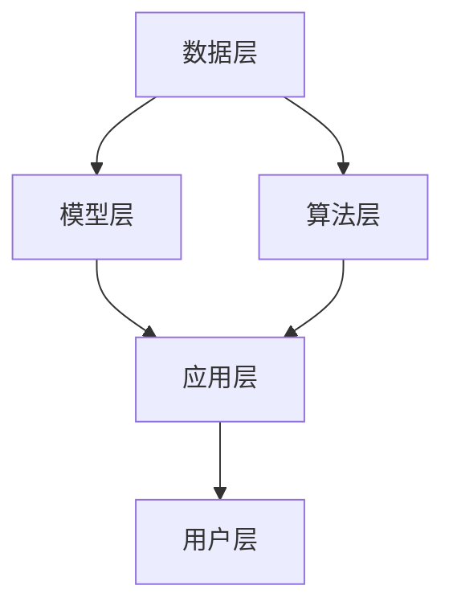
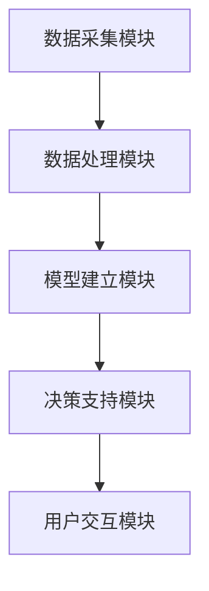
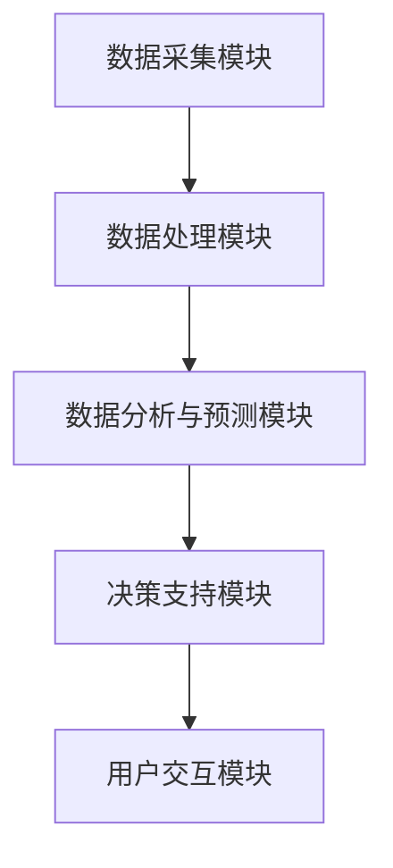

                 

### 《智慧农业新篇章：提示词优化种植决策系统》

#### 关键词：
智慧农业、种植决策系统、提示词优化、自然语言处理、人工智能、农业信息化

#### 摘要：
本文探讨了智慧农业新篇章——提示词优化种植决策系统的发展与应用。首先，介绍了智慧农业的背景与现状，以及农业种植决策系统的基本概念与架构。接着，深入解析了自然语言处理基础和提示词优化算法，并通过具体案例研究了智能温室种植决策系统、精准施肥决策系统和病虫害预警系统的实施过程。随后，详细阐述了智慧农业种植决策系统的设计与实现，以及系统应用与推广策略。最后，对未来的发展趋势与展望进行了深入探讨，为智慧农业的发展提供了有益的参考。

### 第一部分：智慧农业概述

#### 第1章：智慧农业背景与现状

##### 1.1 智慧农业的定义与意义

###### 1.1.1 智慧农业的概念  
智慧农业是指通过信息技术、物联网、大数据、人工智能等现代科技手段，对农业生产的各个环节进行智能化管理和优化，实现农业生产高效、绿色、可持续的发展。其核心在于将传统农业与现代科技相结合，通过数据驱动、智能化决策来提高农业生产效益。

智慧农业的构成可以归纳为三个主要方面：

- **信息技术**：包括云计算、物联网、大数据等，用于数据采集、处理、存储和共享。
- **农业知识**：包括农业生产技术、种植经验、土壤学、气象学等领域的知识体系。
- **农业实践**：即实际的农业生产活动，包括种植、灌溉、施肥、病虫害防治等。

综上所述，智慧农业的概念可以表示为：
$$
\text{智慧农业} = \text{信息技术} + \text{农业知识} + \text{农业实践}
$$

###### 1.1.2 智慧农业的重要性

智慧农业的重要性主要体现在以下几个方面：

- **提高农业生产效率**：通过精准种植、精细管理等技术，减少资源浪费，提高作物产量。
- **实现农业可持续发展**：通过智能化监测和预警系统，减少农药、化肥的使用，保护生态环境。
- **降低生产成本**：通过优化种植决策，降低生产过程中的不必要的开支。
- **提升农产品质量**：通过智能化生产，提高农产品的品质和附加值。

###### 1.1.3 智慧农业的发展历程

智慧农业的发展历程可以大致分为以下几个阶段：

1. **传统农业阶段**：以人力、畜力为主，依靠经验进行农业生产。
2. **机械化农业阶段**：引入机械化设备，提高劳动生产率，但依赖经验和技术水平较高。
3. **信息化农业阶段**：应用信息技术，实现数据采集和初步分析，提高农业生产管理效率。
4. **智慧农业阶段**：集成物联网、大数据、人工智能等前沿技术，实现智能化、数据驱动的农业生产。

目前，我国智慧农业正处于信息化和智能化发展阶段，正在逐步实现农业生产模式的转型升级。

##### 1.2 我国智慧农业的发展历程与趋势

###### 1.2.1 我国智慧农业的发展历程

我国智慧农业的发展历程可以分为以下几个阶段：

1. **起步阶段（2000年以前）**：农业信息化初见端倪，农业部门开始重视信息技术在农业生产中的应用。
2. **推广阶段（2000-2010年）**：农业信息化得到国家政策的支持，各类农业信息化项目相继启动。
3. **发展阶段（2010-2015年）**：物联网、大数据、云计算等新技术在农业中得到广泛应用，智慧农业初步形成。
4. **深化阶段（2015年至今）**：智慧农业成为国家战略，各地纷纷出台政策，推动智慧农业快速发展。

###### 1.2.2 我国智慧农业的发展趋势

未来，我国智慧农业的发展趋势将呈现以下特点：

- **政策支持力度加大**：国家将继续加大对智慧农业的扶持力度，提供政策、资金、技术等多方面的支持。
- **技术创新不断推进**：人工智能、大数据、物联网等新技术将在智慧农业中得到更广泛应用，推动农业技术不断创新。
- **产业链一体化**：智慧农业将推动农业产业链的整合，实现从种植、加工、销售到消费的全程智能化。
- **区域协调发展**：各地将根据自身条件，发展特色智慧农业，实现区域协调发展。

###### 1.2.3 我国智慧农业的发展挑战

虽然我国智慧农业发展迅速，但仍面临一些挑战：

- **技术瓶颈**：部分关键技术尚未突破，如精准农业技术、智能农机装备等。
- **数据孤岛**：农业生产数据分散，缺乏统一的数据标准和平台，导致数据无法共享和充分利用。
- **人才短缺**：智慧农业需要大量具备农业和信息技术背景的专业人才，但目前人才储备不足。
- **市场推广**：智慧农业产品的市场推广和普及程度较低，市场接受度有待提高。

##### 1.3 国际智慧农业发展概况及启示

###### 1.3.1 国际智慧农业发展概况

全球智慧农业发展较为成熟的地区包括美国、欧洲、日本等。这些地区在智慧农业技术、政策支持、市场推广等方面都取得了显著成果。

- **美国**：美国智慧农业技术先进，农业生产效率高，政府提供大量政策支持，如农业补贴、技术研发等。
- **欧洲**：欧洲智慧农业注重可持续发展，采用先进的农业技术，如精准农业、智能农机等，政府出台相关政策，推动智慧农业发展。
- **日本**：日本智慧农业发展较早，技术成熟，政府积极推动农业信息化和智能化，农业生产效率高。

###### 1.3.2 国际智慧农业发展启示

我国智慧农业发展可以借鉴国际经验，吸取以下启示：

- **政策支持**：政府应加大对智慧农业的政策支持力度，提供资金、技术、人才等方面的支持。
- **技术创新**：加强农业技术研究和创新，突破关键技术瓶颈，推动智慧农业技术发展。
- **产业链整合**：推动农业产业链的整合，实现从种植、加工、销售到消费的全程智能化。
- **人才培养**：加强智慧农业人才培养，提高农业技术人员的素质和能力。

### 第二部分：农业种植决策系统基础

#### 第2章：农业种植决策系统基础

##### 2.1 农业种植决策系统的概述

###### 2.1.1 农业种植决策系统的概念

农业种植决策系统是指利用现代信息技术和人工智能方法，对农业生产过程中的各种因素进行综合分析，提供科学、合理的种植决策建议，以提高农业生产效益和可持续发展的智能化系统。

农业种植决策系统主要包括以下几个功能模块：

- **数据采集模块**：用于采集农业生产过程中的各种数据，如土壤、气候、作物生长状况等。
- **数据处理模块**：对采集到的数据进行预处理、清洗、分析和存储。
- **模型建立模块**：根据历史数据和专业知识，建立作物生长模型、土壤肥力模型等。
- **决策支持模块**：基于模型分析和数据预测，为农业生产提供种植策略、施肥方案、病虫害防治等决策建议。

###### 2.1.2 农业种植决策系统的目标

农业种植决策系统的目标主要包括以下几个方面：

- **提高农业生产效率**：通过精准种植、精细管理等技术，减少资源浪费，提高作物产量和质量。
- **降低生产成本**：优化种植决策，降低生产过程中的不必要的开支。
- **保护生态环境**：通过智能化监测和预警系统，减少农药、化肥的使用，保护生态环境。
- **提升农产品质量**：通过智能化生产，提高农产品的品质和附加值。

###### 2.1.3 农业种植决策系统的作用

农业种植决策系统在农业生产中具有重要的作用，主要包括以下几个方面：

- **科学决策**：通过数据分析、模型预测和智能化建议，为农业生产提供科学、合理的种植决策。
- **提高生产效率**：通过精准种植、精细管理等技术，减少资源浪费，提高作物产量和质量。
- **降低生产成本**：优化种植决策，降低生产过程中的不必要的开支。
- **保护生态环境**：通过智能化监测和预警系统，减少农药、化肥的使用，保护生态环境。
- **提升农产品质量**：通过智能化生产，提高农产品的品质和附加值。

##### 2.2 农业种植决策系统的架构

###### 2.2.1 系统架构概述

农业种植决策系统的架构通常包括以下几个层次：

1. **数据层**：包括各种农业生产数据的采集、存储和管理，如土壤数据、气象数据、作物生长数据等。
2. **模型层**：包括各种作物生长模型、土壤肥力模型、病虫害预测模型等，用于对数据进行处理和分析。
3. **算法层**：包括各种算法，如机器学习算法、深度学习算法等，用于模型训练和优化。
4. **应用层**：包括各种应用模块，如种植决策模块、施肥方案模块、病虫害防治模块等，用于提供决策建议。
5. **用户层**：包括各种用户接口，如Web端、移动端等，用于用户与系统的交互。

下面是农业种植决策系统的Mermaid流程图：



###### 2.2.2 系统架构主要模块

农业种植决策系统的主要模块包括：

1. **数据采集模块**：用于采集农业生产过程中的各种数据，如土壤、气候、作物生长状况等。数据来源包括传感器、监测设备、农业无人机等。

2. **数据处理模块**：对采集到的数据进行预处理、清洗、分析和存储。预处理包括数据去噪、归一化、缺失值处理等，分析包括特征提取、数据可视化等。

3. **模型建立模块**：根据历史数据和专业知识，建立作物生长模型、土壤肥力模型、病虫害预测模型等。模型建立包括数据输入、模型选择、模型训练等。

4. **决策支持模块**：基于模型分析和数据预测，为农业生产提供种植策略、施肥方案、病虫害防治等决策建议。决策支持包括预测分析、推荐方案、决策评估等。

5. **用户交互模块**：包括各种用户接口，如Web端、移动端等，用于用户与系统的交互。用户交互包括数据查询、图表展示、决策建议接收等。

下面是农业种植决策系统的架构图：



###### 2.2.3 系统架构实现关键

农业种植决策系统的实现关键主要包括以下几个方面：

1. **数据采集与处理**：确保数据采集的准确性和实时性，对数据进行有效的预处理和分析，提取有用的特征信息。

2. **模型建立与优化**：选择合适的模型，对数据进行训练和优化，提高模型的准确性和稳定性。

3. **算法选择与实现**：根据实际情况选择合适的算法，如机器学习算法、深度学习算法等，并进行有效的实现和优化。

4. **用户交互设计**：设计简洁、直观的用户交互界面，提高用户体验，方便用户使用系统。

5. **系统性能优化**：对系统进行性能优化，提高系统的响应速度和处理能力，确保系统的稳定性和可靠性。

##### 2.3 农业种植决策系统的核心技术

###### 2.3.1 数据采集与处理

数据采集与处理是农业种植决策系统的核心环节，直接影响系统的准确性和可靠性。核心技术包括：

- **传感器技术**：用于采集土壤、气候、作物生长等环境数据，如温度传感器、湿度传感器、光强传感器等。
- **物联网技术**：实现数据的实时传输和共享，如ZigBee、LoRa等无线通信技术。
- **大数据技术**：对海量数据进行存储、管理和分析，如Hadoop、Spark等大数据处理框架。
- **数据预处理技术**：包括数据去噪、归一化、缺失值处理、特征提取等，如Python的Pandas库、Scikit-learn库等。

###### 2.3.2 模型建立与优化

模型建立与优化是农业种植决策系统的关键，直接影响决策的准确性。核心技术包括：

- **机器学习技术**：用于建立作物生长模型、土壤肥力模型、病虫害预测模型等，如线性回归、决策树、支持向量机等。
- **深度学习技术**：用于复杂模型的建立和优化，如神经网络、卷积神经网络（CNN）、循环神经网络（RNN）等。
- **模型评估与优化**：对模型进行评估和优化，提高模型的准确性和稳定性，如交叉验证、网格搜索等。

###### 2.3.3 决策支持算法

决策支持算法是农业种植决策系统的核心，用于提供科学、合理的种植决策。核心技术包括：

- **预测分析算法**：用于预测作物生长趋势、土壤肥力变化、病虫害发生等，如时间序列分析、回归分析等。
- **推荐算法**：用于推荐种植策略、施肥方案、病虫害防治措施等，如基于内容的推荐、协同过滤等。
- **决策评估算法**：用于评估决策方案的效果和风险，如成本效益分析、多目标优化等。

### 第三部分：提示词优化技术

#### 第3章：自然语言处理基础

##### 3.1 自然语言处理概述

###### 3.1.1 自然语言处理的定义

自然语言处理（Natural Language Processing，NLP）是计算机科学和语言学的交叉领域，旨在让计算机理解和处理人类自然语言，实现人机交互。NLP涉及到语音识别、文本分析、语言生成等方面，其目标是使计算机能够理解、解释和生成人类语言。

自然语言处理的定义可以概括为：
$$
\text{NLP} = \text{计算机科学} + \text{语言学} + \text{人工智能}
$$

###### 3.1.2 自然语言处理的发展历程

自然语言处理的发展历程可以分为以下几个阶段：

1. **早期阶段（1950s-1960s）**：研究人员开始探索如何让计算机理解和处理自然语言，但受限于计算能力和算法水平，进展有限。
2. **规则方法阶段（1970s-1980s）**：基于语法规则和句法分析，尝试构建自然语言处理系统，但效果不佳。
3. **统计方法阶段（1990s-2000s）**：引入统计方法，如隐马尔可夫模型（HMM）、决策树、支持向量机（SVM）等，提高了自然语言处理的性能。
4. **深度学习方法阶段（2010s至今）**：基于深度学习，如神经网络、循环神经网络（RNN）、卷积神经网络（CNN）等，取得了显著的突破，使自然语言处理进入新的阶段。

###### 3.1.3 自然语言处理的应用场景

自然语言处理在多个领域具有广泛的应用场景，主要包括：

- **文本分析**：包括情感分析、主题分类、文本摘要等，用于挖掘文本信息，为用户提供有用的数据。
- **机器翻译**：将一种自然语言翻译成另一种自然语言，如Google翻译、百度翻译等。
- **语音识别**：将语音信号转换为文本或命令，如智能音箱、手机语音助手等。
- **问答系统**：根据用户提问，提供相关的答案或信息，如智能客服、搜索引擎等。
- **文本生成**：根据输入的文本或指令，生成新的文本，如自动写作、聊天机器人等。

##### 3.2 语言模型与生成模型

###### 3.2.1 语言模型的概念

语言模型（Language Model）是自然语言处理的核心组成部分，用于预测一段文本的下一个单词或字符。语言模型的基本任务是：
$$
P(w_{t}|\text{w}_{1},\text{w}_{2},\ldots,\text{w}_{t-1}) = \text{条件概率}
$$
其中，\(w_{t}\)表示当前要预测的单词或字符，\(\text{w}_{1},\text{w}_{2},\ldots,\text{w}_{t-1}\)表示前面已知的单词或字符。

语言模型可以表示为：
$$
P(w_{t}|\text{w}_{1},\text{w}_{2},\ldots,\text{w}_{t-1}) = \frac{N(w_{t},\text{w}_{1},\text{w}_{2},\ldots,\text{w}_{t-1})}{N(\text{w}_{1},\text{w}_{2},\ldots,\text{w}_{t-1})}
$$
其中，\(N(w_{t},\text{w}_{1},\text{w}_{2},\ldots,\text{w}_{t-1})\)表示在历史数据中，以\(\text{w}_{1},\text{w}_{2},\ldots,\text{w}_{t-1}\)为前缀的\(w_{t}\)出现的次数，\(N(\text{w}_{1},\text{w}_{2},\ldots,\text{w}_{t-1})\)表示在历史数据中，以\(\text{w}_{1},\text{w}_{2},\ldots,\text{w}_{t-1}\)为前缀的任意单词或字符出现的次数。

###### 3.2.2 语言模型的工作原理

语言模型的工作原理是基于统计方法，通过分析大量文本数据，学习单词或字符之间的条件概率关系。具体过程如下：

1. **数据预处理**：对文本数据进行预处理，如分词、去停用词、词性标注等。
2. **构建词汇表**：将文本数据中的单词或字符构建成一个词汇表，为每个单词或字符分配一个唯一的ID。
3. **统计条件概率**：根据历史数据，统计每个单词或字符在特定前缀条件下的出现次数，计算条件概率。
4. **模型评估与优化**：使用评估指标（如交叉熵、 perplexity等）对语言模型进行评估和优化，提高模型的准确性。

语言模型的评估指标主要包括：

- **交叉熵（Cross-Entropy）**：
$$
H(y,\hat{y}) = -\sum_{i} y_i \log \hat{y}_i
$$
其中，\(y_i\)表示真实标签的概率，\(\hat{y}_i\)表示模型预测的概率。

- **困惑度（Perplexity）**：
$$
PPL = 2^{H(y,\hat{y})}
$$
困惑度是交叉熵的自然指数，用于评估模型的准确性和平滑性。

###### 3.2.3 语言模型的评估与优化

语言模型的评估与优化主要包括以下几个方面：

1. **模型评估**：使用评估指标（如交叉熵、困惑度等）对模型进行评估，以确定模型的性能和效果。
2. **模型优化**：通过调整模型参数（如学习率、正则化参数等），优化模型的性能和稳定性。
3. **数据增强**：通过增加训练数据、引入负样本、数据清洗等方法，增强模型的泛化能力和鲁棒性。
4. **模型集成**：将多个模型进行集成，提高模型的预测准确性和稳定性。

语言模型优化方法主要包括：

- **梯度下降（Gradient Descent）**：
$$
\theta_{t+1} = \theta_{t} - \alpha \nabla_{\theta} J(\theta)
$$
其中，\(\theta\)表示模型参数，\(\alpha\)表示学习率，\(\nabla_{\theta} J(\theta)\)表示损失函数关于模型参数的梯度。

- **随机梯度下降（Stochastic Gradient Descent，SGD）**：
$$
\theta_{t+1} = \theta_{t} - \alpha \nabla_{\theta} J(\theta; x_t, y_t)
$$
其中，\(x_t, y_t\)表示第\(t\)个训练样本。

- **Adam优化器**：
$$
m_t = \beta_1 m_{t-1} + (1 - \beta_1) \nabla_{\theta} J(\theta; x_t, y_t)
$$
$$
v_t = \beta_2 v_{t-1} + (1 - \beta_2) (\nabla_{\theta} J(\theta; x_t, y_t))^2
$$
$$
\theta_{t+1} = \theta_{t} - \alpha \frac{m_t}{\sqrt{v_t} + \epsilon}
$$
其中，\(\beta_1, \beta_2\)表示动量参数，\(\epsilon\)表示正偏置。

##### 3.3 语义分析与情感分析

###### 3.3.1 语义分析的概念

语义分析（Semantic Analysis）是自然语言处理中的重要分支，旨在理解文本的语义含义，实现文本信息的提取和解释。语义分析主要包括以下几个方面：

- **词义消歧（Word Sense Disambiguation，WSD）**：根据上下文信息，确定单词的确切含义。
- **词性标注（Part-of-Speech Tagging，POS）**：对文本中的单词进行词性标注，如名词、动词、形容词等。
- **句法分析（Syntactic Parsing）**：分析句子的结构，构建句法树。
- **语义角色标注（Semantic Role Labeling，SRL）**：标注句子中动词的语义角色，如施事、受事、工具等。

语义分析的目标是：
$$
\text{理解文本的含义} = \text{词义消歧} + \text{词性标注} + \text{句法分析} + \text{语义角色标注}
$$

###### 3.3.2 情感分析的概念

情感分析（Sentiment Analysis）是自然语言处理中的一种常见任务，旨在分析文本中表达的情感倾向，如正面、负面、中性等。情感分析主要包括以下几个方面：

- **情感极性分类（Sentiment Polarization）**：确定文本的情感极性，如正面、负面、中性等。
- **情感强度分析（Sentiment Intensity Analysis）**：分析文本中情感的强度，如非常高兴、稍微高兴等。
- **情感主题分类（Sentiment Topic Classification）**：根据情感极性和主题，对文本进行分类。

情感分析的目标是：
$$
\text{分析情感倾向} = \text{情感极性分类} + \text{情感强度分析} + \text{情感主题分类}
$$

###### 3.3.3 语义分析与情感分析的应用

语义分析与情感分析在多个领域具有广泛的应用，主要包括：

- **社交媒体分析**：分析社交媒体上的用户评论、评论等，了解用户对产品、服务、事件的情感倾向。
- **舆情监测**：监测公众对特定话题、事件、政策的情感倾向，为政府、企业等提供决策支持。
- **客户服务**：分析客户反馈、投诉等，了解客户需求和满意度，优化客户服务。
- **广告投放**：分析用户对广告的情感反应，优化广告投放策略。

### 第四部分：提示词优化算法

#### 第4章：提示词优化算法

##### 4.1 提示词优化的基本原理

###### 4.1.1 提示词优化的概念

提示词优化（Prompt Optimization）是自然语言处理中的一个重要任务，旨在通过调整输入提示词（Prompt）来提高语言模型在特定任务上的性能。提示词是一段引导性的文本，用于引导语言模型生成所需的输出。提示词优化的目标是找到最优的提示词，使得语言模型在特定任务上的预测准确性最高。

提示词优化的基本流程如下：

1. **设计提示词**：根据任务需求和语言模型的特点，设计合适的提示词。
2. **训练模型**：使用设计好的提示词对语言模型进行训练，调整模型参数。
3. **评估性能**：使用评估指标（如交叉熵、困惑度等）对模型性能进行评估。
4. **迭代优化**：根据评估结果，调整提示词，重新训练模型，直至达到满意的性能。

提示词优化的关键要素包括：

- **提示词内容**：提示词的内容应该能够引导语言模型生成所需的输出，涵盖任务的关键信息和上下文。
- **提示词长度**：提示词的长度会影响模型的训练时间和性能，需要根据任务需求和计算资源进行权衡。
- **提示词形式**：提示词的形式（如文本、代码、图表等）会影响模型的理解和生成效果，需要根据实际情况进行选择。

提示词优化的目标可以表示为：
$$
\text{提示词优化} = \text{提高模型性能} = \text{降低交叉熵} + \text{降低困惑度}
$$

###### 4.1.2 提示词优化的目标

提示词优化的主要目标包括：

1. **提高预测准确性**：通过优化提示词，提高语言模型在特定任务上的预测准确性，使得模型生成的输出更符合期望。
2. **降低训练成本**：优化提示词可以减少模型训练所需的计算资源和时间，降低训练成本。
3. **提高泛化能力**：优化提示词可以提高模型的泛化能力，使其在不同数据集和场景下表现良好。

提示词优化的目标可以表示为：
$$
\text{提示词优化目标} = \text{提高预测准确性} + \text{降低训练成本} + \text{提高泛化能力}
$$

###### 4.1.3 提示词优化的方法

提示词优化的方法主要包括以下几个方面：

1. **基于规则的方法**：通过分析任务需求和语言模型的特点，设计合适的提示词规则，如关键词提取、文本摘要等。
2. **基于机器学习的方法**：使用机器学习方法，如线性回归、决策树、支持向量机等，对提示词进行优化。
3. **基于深度学习的方法**：使用深度学习方法，如神经网络、循环神经网络（RNN）、卷积神经网络（CNN）等，对提示词进行优化。
4. **基于强化学习的方法**：使用强化学习方法，如Q-learning、Deep Q-Network（DQN）等，对提示词进行优化。

下面是提示词优化的伪代码：

```python
def prompt_optimization(prompt, model, task, target):
    # 初始化提示词
    current_prompt = prompt
    
    # 设置优化目标
    objective = compute_objective(current_prompt, model, task, target)
    
    # 设置迭代次数
    max_iterations = 1000
    
    for iteration in range(max_iterations):
        # 训练模型
        model.train(current_prompt)
        
        # 评估性能
        performance = model.evaluate(task, target)
        
        # 计算目标值
        objective_value = compute_objective(current_prompt, model, task, target)
        
        # 更新提示词
        current_prompt = update_prompt(current_prompt, objective_value)
        
        # 打印迭代信息
        print(f"Iteration {iteration}: Objective Value = {objective_value}")
        
    return current_prompt
```

###### 4.1.4 提示词优化的重要性

提示词优化在自然语言处理任务中具有重要的作用，主要体现在以下几个方面：

1. **提高模型性能**：通过优化提示词，可以提高语言模型在特定任务上的性能，使得模型生成的输出更符合期望。
2. **降低训练成本**：优化提示词可以减少模型训练所需的计算资源和时间，降低训练成本。
3. **提高泛化能力**：优化提示词可以提高模型的泛化能力，使其在不同数据集和场景下表现良好。
4. **增强模型解释性**：优化提示词可以帮助理解模型生成的输出，增强模型的可解释性。

##### 4.2 基于生成对抗网络的提示词优化

###### 4.2.1 生成对抗网络的基本概念

生成对抗网络（Generative Adversarial Network，GAN）是一种由生成器（Generator）和判别器（Discriminator）组成的深度学习模型，旨在学习数据的分布，并生成与真实数据相似的数据。GAN的核心思想是通过两个对抗网络之间的博弈，使得生成器生成的数据越来越接近真实数据。

生成对抗网络的基本结构如下：

- **生成器（Generator）**：生成器是一个从噪声分布中生成数据点的神经网络，目标是生成与真实数据相似的数据。
- **判别器（Discriminator）**：判别器是一个二分类神经网络，用于判断生成器生成的数据是否为真实数据。

GAN的训练过程可以看作是一个零和博弈：

1. **生成器生成数据**：生成器根据噪声分布生成一组数据。
2. **判别器判断数据**：判别器对生成器和真实数据点进行分类，判断其是否为真实数据。
3. **更新网络参数**：通过反向传播算法，更新生成器和判别器的参数，使得生成器生成的数据越来越接近真实数据。

GAN的训练过程可以用以下伪代码表示：

```python
for epoch in range(num_epochs):
    for real_data in real_data_loader:
        # 更新判别器
       判别器.train(real_data)
        
        for noise in noise_loader:
            # 更新生成器
           生成器.train(noise)
            
            # 更新判别器
           判别器.train(noise)
```

GAN的优点包括：

- **强大的数据生成能力**：GAN可以学习数据的分布，生成与真实数据相似的数据。
- **灵活的模型结构**：GAN可以使用不同的生成器和判别器结构，适用于各种数据类型和应用场景。
- **无需标签数据**：GAN可以学习数据的分布，无需依赖大量的标签数据。

GAN的缺点包括：

- **训练不稳定**：GAN的训练过程容易陷入局部最优，导致训练不稳定。
- **计算资源消耗大**：GAN的训练过程需要大量的计算资源，特别是生成器和判别器的参数更新。

###### 4.2.2 生成对抗网络在提示词优化中的应用

生成对抗网络在提示词优化中具有广泛的应用，主要体现在以下几个方面：

1. **生成高质量的提示词**：通过GAN，可以生成高质量的提示词，使得提示词更加贴近真实数据，提高语言模型的性能。

2. **数据增强**：通过GAN，可以生成与真实数据相似的数据，用于数据增强，提高语言模型的泛化能力。

3. **自适应优化**：通过GAN，可以自适应地调整提示词，优化语言模型在不同任务上的性能。

下面是生成对抗网络在提示词优化中的应用示例：

```python
# 初始化生成器和判别器
生成器 = Generator()
判别器 = Discriminator()

# 设置优化器
生成器优化器 = Optimizer(生成器.parameters())
判别器优化器 = Optimizer(判别器.parameters())

# 设置损失函数
损失函数 = LossFunction()

# 训练生成对抗网络
for epoch in range(num_epochs):
    for real_data in real_data_loader:
        # 更新判别器
       判别器.train(real_data, 生成器)
        
        for noise in noise_loader:
            # 更新生成器
            生成器.train(noise)
            
            # 更新判别器
            判别器.train(noise)
            
    # 评估生成器和判别器的性能
    generator_performance = 生成器.evaluate()
    discriminator_performance = 判别器.evaluate()
    
    # 打印性能信息
    print(f"Epoch {epoch}: Generator Performance = {generator_performance}, Discriminator Performance = {discriminator_performance}")
```

###### 4.2.3 生成对抗网络的实现

生成对抗网络的实现主要包括以下几个方面：

1. **生成器实现**：生成器是一个从噪声分布中生成数据的神经网络，可以使用不同的生成器结构，如全连接神经网络、卷积神经网络等。

2. **判别器实现**：判别器是一个用于判断数据真实性的神经网络，可以使用不同的判别器结构，如全连接神经网络、卷积神经网络等。

3. **优化器实现**：优化器用于更新网络参数，可以使用不同的优化器，如随机梯度下降（SGD）、Adam等。

4. **损失函数实现**：损失函数用于评估生成器和判别器的性能，可以使用不同的损失函数，如交叉熵损失、均方误差等。

下面是生成对抗网络的实现示例：

```python
# 定义生成器
class Generator(nn.Module):
    def __init__(self):
        super(Generator, self).__init__()
        # 定义生成器的网络结构
        self.fc1 = nn.Linear(z_dim, fc1_dim)
        self.fc2 = nn.Linear(fc1_dim, fc2_dim)
        self.fc3 = nn.Linear(fc2_dim, img_dim)

    def forward(self, z):
        x = F.relu(self.fc1(z))
        x = F.relu(self.fc2(x))
        x = F.tanh(self.fc3(x))
        return x

# 定义判别器
class Discriminator(nn.Module):
    def __init__(self):
        super(Discriminator, self).__init__()
        # 定义判别器的网络结构
        self.fc1 = nn.Linear(img_dim, fc1_dim)
        self.fc2 = nn.Linear(fc1_dim, fc2_dim)
        self.fc3 = nn.Linear(fc2_dim, 1)

    def forward(self, x):
        x = F.relu(self.fc1(x))
        x = F.relu(self.fc2(x))
        x = self.fc3(x)
        return x

# 定义优化器
生成器优化器 = torch.optim.Adam(生成器.parameters(), lr=learning_rate)
判别器优化器 = torch.optim.Adam(判别器.parameters(), lr=learning_rate)

# 定义损失函数
损失函数 = nn.BCELoss()

# 训练生成对抗网络
for epoch in range(num_epochs):
    for real_data in real_data_loader:
        # 更新判别器
       判别器.zero_grad()
        real_output = 判别器(real_data)
        real_output = torch.mean(real_output)
        real_loss = 损失函数(real_output, real_labels)

        real_loss.backward()
        判别器优化器.step()

        for noise in noise_loader:
            # 更新生成器
            生成器.zero_grad()
            fake_data = 生成器(noise)
            fake_output = 判别器(fake_data)
            fake_output = torch.mean(fake_output)
            fake_loss = 损失函数(fake_output, fake_labels)

            fake_loss.backward()
            生成器优化器.step()
```

##### 4.3 基于强化学习的提示词优化

###### 4.3.1 强化学习的基本概念

强化学习（Reinforcement Learning，RL）是一种机器学习方法，通过智能体（Agent）在与环境的交互过程中，不断学习最优策略，以实现目标。强化学习的基本概念包括以下几个方面：

1. **智能体（Agent）**：智能体是执行行动的实体，如机器人、软件程序等。
2. **环境（Environment）**：环境是智能体执行行动的场所，如游戏、模拟环境等。
3. **状态（State）**：状态是描述智能体在环境中的当前状态，如位置、速度等。
4. **行动（Action）**：行动是智能体在某个状态下可以执行的操作，如移动、攻击等。
5. **奖励（Reward）**：奖励是智能体执行某个行动后获得的即时反馈，用于评估行动的好坏。

强化学习的目标是：
$$
\text{最大化期望奖励} = \max_{\theta} \sum_{t=0}^T r_t
$$
其中，\(\theta\)表示智能体的参数，\(r_t\)表示第\(t\)个时间步的奖励。

强化学习的主要算法包括：

- **Q-Learning**：Q-Learning是一种基于值函数的强化学习算法，通过学习状态-行动值函数（Q值）来选择最优行动。
- **SARSA（On-Policy）**：SARSA是一种基于策略的强化学习算法，通过在当前策略下进行状态-行动值函数的学习。
- **Policy Gradient（Off-Policy）**：Policy Gradient是一种基于策略梯度的强化学习算法，通过直接优化策略来学习最优行动。

强化学习的核心要素包括：

1. **策略（Policy）**：策略是智能体在给定状态下选择行动的规则，可以表示为：
$$
\pi(a|s) = P(a|s)
$$
其中，\(a\)表示行动，\(s\)表示状态。
2. **值函数（Value Function）**：值函数是评估状态或状态-行动对的预期奖励，可以表示为：
$$
V(s) = \sum_{a} \pi(a|s) \sum_{s'} p(s'|s, a) r(s', a)
$$
3. **奖励函数（Reward Function）**：奖励函数是评估智能体在执行某个行动后获得奖励的函数，可以表示为：
$$
r(s, a) = \text{即时奖励}
$$

强化学习在自然语言处理中的应用主要包括：

1. **语言模型优化**：通过强化学习优化语言模型，提高模型在特定任务上的性能。
2. **文本生成**：通过强化学习生成符合上下文和语义的文本。
3. **问答系统**：通过强化学习优化问答系统的回答质量。

###### 4.3.2 强化学习在提示词优化中的应用

强化学习在提示词优化中具有广泛的应用，主要体现在以下几个方面：

1. **动态调整提示词**：通过强化学习，智能体可以根据环境反馈动态调整提示词，优化语言模型的性能。

2. **多任务学习**：通过强化学习，智能体可以在多个任务上同时学习，优化提示词，提高模型在不同任务上的性能。

3. **自适应优化**：通过强化学习，智能体可以根据环境变化自适应地调整提示词，提高模型在不同场景下的适应性。

下面是强化学习在提示词优化中的应用示例：

```python
# 初始化智能体
智能体 = Agent()

# 初始化环境
环境 = Environment()

# 初始化奖励函数
奖励函数 = RewardFunction()

# 训练智能体
for episode in range(num_episodes):
    状态 = 环境初始化()
    总奖励 = 0
    
    while not 环境结束():
        # 选择行动
        行动 = 智能体选择行动(状态)
        
        # 执行行动
        状态', 奖励 = 环境执行行动(状态, 行动)
        
        # 更新智能体
        智能体.update(状态, 行动, 奖励)
        
        # 更新状态
        状态 = 状态'
        
        # 累计奖励
        总奖励 += 奖励
    
    # 打印性能信息
    print(f"Episode {episode}: Total Reward = {总奖励}")
```

###### 4.3.3 强化学习的实现

强化学习的实现主要包括以下几个方面：

1. **智能体实现**：智能体是执行行动的实体，可以使用不同的算法，如Q-Learning、SARSA、Policy Gradient等。

2. **环境实现**：环境是智能体执行行动的场所，可以模拟不同的场景和任务。

3. **奖励函数实现**：奖励函数是评估智能体在执行某个行动后获得奖励的函数。

下面是强化学习的实现示例：

```python
# 定义智能体
class Agent(nn.Module):
    def __init__(self):
        super(Agent, self).__init__()
        # 定义智能体的网络结构
        self.fc1 = nn.Linear(state_dim, fc1_dim)
        self.fc2 = nn.Linear(fc1_dim, action_dim)

    def forward(self, state):
        x = F.relu(self.fc1(state))
        x = self.fc2(x)
        return x

# 定义环境
class Environment:
    def __init__(self):
        # 初始化环境
        self.state = torch.zeros(state_dim)
        
    def 初始化(self):
        # 初始化状态
        return self.state
    
    def 执行行动(self, state, action):
        # 执行行动并返回新的状态和奖励
        # 示例：根据行动更新状态
        self.state = torch.add(self.state, action)
        reward = torch.relu(self.state)
        return self.state, reward

    def 结束(self):
        # 判断环境是否结束
        return torch.eq(self.state, torch.zeros(state_dim))

# 定义奖励函数
def RewardFunction(state, action):
    # 计算奖励
    reward = torch.relu(state - action)
    return reward

# 初始化智能体和环境
智能体 = Agent()
环境 = Environment()

# 设置优化器
优化器 = torch.optim.Adam(智能体.parameters(), lr=learning_rate)

# 训练智能体
for episode in range(num_episodes):
    状态 = 环境初始化()
    总奖励 = 0
    
    while not 环境结束():
        # 选择行动
        行动 = 智能体选择行动(状态)
        
        # 执行行动
        状态', 奖励 = 环境执行行动(状态, 行动)
        
        # 更新智能体
        优化器.zero_grad()
        预测奖励 = 智能体(状态)
        实际奖励 = 奖励函数(状态', 行动)
        损失 = torch.mean(torch.square(预测奖励 - 实际奖励))
        损失.backward()
        优化器.step()
        
        # 更新状态
        状态 = 状态'
        
        # 累计奖励
        总奖励 += 奖励
    
    # 打印性能信息
    print(f"Episode {episode}: Total Reward = {总奖励}")
```

### 第五部分：案例研究

#### 第5章：案例研究

##### 5.1 案例一：智能温室种植决策系统

###### 5.1.1 案例背景

智能温室种植决策系统是一种基于现代信息技术和人工智能的智能农业系统，旨在通过实时监测和数据分析，为温室种植提供科学、合理的种植决策，提高作物产量和品质。本案例以某农业科技公司的智能温室种植决策系统为例，介绍该系统的设计、开发和应用。

###### 5.1.2 案例目标

本案例的目标是设计并实现一个智能温室种植决策系统，主要包括以下几个方面的目标：

1. **实时数据监测**：通过传感器技术，实时监测温室内的温度、湿度、光照等环境参数。
2. **数据分析与预测**：基于历史数据和专业知识，分析温室环境数据，预测作物生长趋势和病虫害发生情况。
3. **智能决策支持**：根据数据分析结果，为温室种植提供科学的种植决策，如灌溉、施肥、病虫害防治等。
4. **用户界面交互**：为用户提供友好的Web端和移动端界面，方便用户查看数据、接收决策建议和调整种植方案。

###### 5.1.3 案例实施过程

本案例的实施过程主要包括以下几个阶段：

1. **需求分析**：与农业科技公司进行深入沟通，了解温室种植的具体需求，确定系统功能模块和关键技术。

2. **系统设计**：根据需求分析结果，设计智能温室种植决策系统的架构，包括数据采集与处理模块、数据分析与预测模块、决策支持模块和用户交互模块。

3. **环境搭建**：搭建开发环境，包括硬件设备（传感器、服务器等）和软件工具（编程语言、数据库等）。

4. **系统实现**：根据系统设计，逐步实现各个功能模块，包括数据采集与处理、数据分析与预测、决策支持、用户交互等。

5. **系统测试**：对系统进行功能测试和性能测试，确保系统稳定可靠，满足用户需求。

6. **系统部署**：将系统部署到温室现场，与传感器设备连接，进行实地测试和调试。

7. **用户培训与反馈**：为用户提供培训，指导用户如何使用系统，收集用户反馈，持续优化系统功能。

下面是智能温室种植决策系统的架构图：



###### 5.1.4 案例效果

智能温室种植决策系统在实际应用中取得了显著的成效，主要包括以下几个方面：

1. **提高作物产量和品质**：通过实时监测和科学决策，优化温室环境参数，提高作物产量和品质。

2. **降低生产成本**：通过精准灌溉、施肥和病虫害防治，减少资源浪费，降低生产成本。

3. **提升用户满意度**：为用户提供友好的界面和科学的决策建议，提高用户满意度。

4. **推动农业现代化**：通过引入智能温室种植决策系统，推动农业生产向智能化、现代化方向发展。

##### 5.2 案例二：精准施肥决策系统

###### 5.2.1 案例背景

精准施肥决策系统是一种基于信息技术和人工智能的智能农业系统，旨在通过实时监测和数据分析，为农业生产提供科学的施肥决策，提高肥料利用效率，降低环境污染。本案例以某农业生产企业的精准施肥决策系统为例，介绍该系统的设计、开发和应用。

###### 5.2.2 案例目标

本案例的目标是设计并实现一个精准施肥决策系统，主要包括以下几个方面的目标：

1. **实时数据监测**：通过传感器技术，实时监测农田土壤养分、水分等环境参数。
2. **数据分析与预测**：基于历史数据和专业知识，分析农田环境数据，预测作物养分需求。
3. **智能决策支持**：根据数据分析结果，为农田施肥提供科学的施肥建议，优化肥料使用。
4. **用户界面交互**：为用户提供友好的Web端和移动端界面，方便用户查看数据、接收施肥建议和调整施肥方案。

###### 5.2.3 案例实施过程

本案例的实施过程主要包括以下几个阶段：

1. **需求分析**：与农业生产企业进行深入沟通，了解精准施肥的具体需求，确定系统功能模块和关键技术。

2. **系统设计**：根据需求分析结果，设计精准施肥决策系统的架构，包括数据采集与处理模块、数据分析与预测模块、决策支持模块和用户交互模块。

3. **环境搭建**：搭建开发环境，包括硬件设备（传感器、服务器等）和软件工具（编程语言、数据库等）。

4. **系统实现**：根据系统设计，逐步实现各个功能模块，包括数据采集与处理、数据分析与预测、决策支持、用户交互等。

5. **系统测试**：对系统进行功能测试和性能测试，确保系统稳定可靠，满足用户需求。

6. **系统部署**：将系统部署到农田现场，与传感器设备连接，进行实地测试和调试。

7. **用户培训与反馈**：为用户提供培训，指导用户如何使用系统，收集用户反馈，持续优化系统功能。

下面是精准施肥决策系统的架构图：


###### 5.2.4 案例效果

精准施肥决策系统在实际应用中取得了显著的成效，主要包括以下几个方面：

1. **提高肥料利用效率**：通过精准施肥，减少肥料用量，提高肥料利用效率，降低生产成本。

2. **降低环境污染**：通过科学施肥，减少化肥的过量使用，降低土壤和水体污染。

3. **提升作物产量和品质**：通过优化肥料使用，提高作物产量和品质，满足市场需求。

4. **推动农业可持续发展**：通过引入精准施肥决策系统，推动农业生产向可持续、绿色方向发展。

##### 5.3 案例三：病虫害预警系统

###### 5.3.1 案例背景

病虫害预警系统是一种基于信息技术和人工智能的智能农业系统，旨在通过实时监测和数据分析，提前预警病虫害的发生，为农业生产提供防治建议，减少病虫害造成的损失。本案例以某农业科技公司的病虫害预警系统为例，介绍该系统的设计、开发和应用。

###### 5.3.2 案例目标

本案例的目标是设计并实现一个病虫害预警系统，主要包括以下几个方面的目标：

1. **实时数据监测**：通过传感器技术，实时监测农田病虫害发生情况。
2. **数据分析与预测**：基于历史数据和专业知识，分析农田病虫害数据，预测病虫害发生趋势。
3. **智能决策支持**：根据数据分析结果，为农田病虫害防治提供科学的防治建议。
4. **用户界面交互**：为用户提供友好的Web端和移动端界面，方便用户查看数据、接收防治建议和调整防治方案。

###### 5.3.3 案例实施过程

本案例的实施过程主要包括以下几个阶段：

1. **需求分析**：与农业科技公司进行深入沟通，了解病虫害预警的具体需求，确定系统功能模块和关键技术。

2. **系统设计**：根据需求分析结果，设计病虫害预警系统的架构，包括数据采集与处理模块、数据分析与预测模块、决策支持模块和用户交互模块。

3. **环境搭建**：搭建开发环境，包括硬件设备（传感器、服务器等）和软件工具（编程语言、数据库等）。

4. **系统实现**：根据系统设计，逐步实现各个功能模块，包括数据采集与处理、数据分析与预测、决策支持、用户交互等。

5. **系统测试**：对系统进行功能测试和性能测试，确保系统稳定可靠，满足用户需求。

6. **系统部署**：将系统部署到农田现场，与传感器设备连接，进行实地测试和调试。

7. **用户培训与反馈**：为用户提供培训，指导用户如何使用系统，收集用户反馈，持续优化系统功能。

下面是病虫害预警系统的架构图：


###### 5.3.4 案例效果

病虫害预警系统在实际应用中取得了显著的成效，主要包括以下几个方面：

1. **提前预警病虫害**：通过实时监测和数据分析，提前预警病虫害的发生，为防治工作争取宝贵时间。

2. **减少病虫害损失**：通过科学的防治建议，减少病虫害造成的损失，提高作物产量和品质。

3. **降低防治成本**：通过精准防治，减少农药的使用量，降低防治成本。

4. **推动农业可持续发展**：通过引入病虫害预警系统，推动农业生产向可持续、绿色方向发展。

### 第六部分：系统设计

#### 第6章：系统设计

##### 6.1 系统需求分析

系统需求分析是系统设计的核心环节，旨在明确系统需要实现的功能和性能要求。本节将详细分析智慧农业种植决策系统的需求，包括用户需求、决策需求和技术需求。

###### 6.1.1 用户需求分析

智慧农业种植决策系统的用户主要包括农业从业者、农场管理人员和农业技术人员。以下是对各类用户需求的分析：

1. **农业从业者**：农业从业者需要系统提供实时的作物生长数据、土壤环境数据等，以便了解农田状况，做出科学决策。此外，他们还需要系统提供种植策略、施肥方案、病虫害防治建议等，以提高产量和品质。

2. **农场管理人员**：农场管理人员需要系统提供全面的农田数据分析和种植决策，以便优化农田管理，提高生产效率和经济效益。他们还需要系统具备数据可视化功能，便于直观了解农田状况。

3. **农业技术人员**：农业技术人员需要系统提供专业的数据分析报告和种植建议，以便为农场提供技术支持，解决农田管理中的问题。

综上所述，智慧农业种植决策系统的用户需求主要包括：

- **实时数据监测**：提供农田环境数据（如温度、湿度、光照等）和作物生长数据（如生长速度、健康状况等）的实时监测功能。
- **数据分析和预测**：提供对农田环境数据和历史数据的分析功能，预测作物生长趋势、土壤肥力变化和病虫害发生情况。
- **决策支持**：提供基于数据分析和预测的种植策略、施肥方案、病虫害防治建议等。
- **数据可视化**：提供数据可视化功能，便于用户直观了解农田状况。

###### 6.1.2 决策需求分析

智慧农业种植决策系统的决策需求主要涉及以下几个方面：

1. **作物种植决策**：根据农田环境数据、作物生长数据和土壤肥力情况，为用户推荐最佳的作物种植方案，包括作物种类、种植时间、种植密度等。

2. **施肥决策**：根据土壤养分数据、作物生长需求和肥料利用率，为用户推荐最佳的施肥方案，包括肥料种类、施肥量、施肥时间等。

3. **病虫害防治决策**：根据病虫害监测数据和防治经验，为用户推荐最佳的病虫害防治方案，包括防治药剂、防治时间、防治方法等。

4. **灌溉决策**：根据土壤水分数据和作物需水量，为用户推荐最佳的灌溉方案，包括灌溉时间、灌溉量、灌溉方式等。

综上所述，智慧农业种植决策系统的决策需求主要包括：

- **作物种植决策**：提供作物种植方案的推荐。
- **施肥决策**：提供施肥方案的推荐。
- **病虫害防治决策**：提供病虫害防治方案的推荐。
- **灌溉决策**：提供灌溉方案的推荐。

###### 6.1.3 技术需求分析

智慧农业种植决策系统的技术需求主要涉及以下几个方面：

1. **数据采集与处理**：系统需要具备数据采集功能，包括传感器数据采集、无线通信等。同时，系统需要具备数据预处理功能，如数据去噪、归一化、缺失值处理等。

2. **模型建立与优化**：系统需要具备建立作物生长模型、土壤肥力模型、病虫害预测模型等功能。这些模型需要基于历史数据和专业知识进行训练和优化，以提高预测准确性和稳定性。

3. **算法实现**：系统需要实现多种算法，如机器学习算法、深度学习算法等，用于模型训练和优化。此外，系统还需要实现数据挖掘、数据可视化等技术，以提高系统的数据处理和分析能力。

4. **用户交互**：系统需要提供友好的用户界面，包括Web端和移动端，方便用户查看数据、接收决策建议和调整种植方案。

综上所述，智慧农业种植决策系统的技术需求主要包括：

- **数据采集与处理**：提供数据采集、数据预处理等功能。
- **模型建立与优化**：提供模型建立、模型优化等功能。
- **算法实现**：提供算法实现、算法优化等功能。
- **用户交互**：提供用户界面、用户交互等功能。

##### 6.2 系统架构设计

系统架构设计是系统设计的核心环节，旨在确定系统的整体结构和功能模块。本节将详细描述智慧农业种植决策系统的架构设计，包括系统架构概述、系统架构模块设计和系统架构实现关键。

###### 6.2.1 系统架构概述

智慧农业种植决策系统的整体架构可以划分为五个层次：数据层、模型层、算法层、应用层和用户层。以下是各层次的简要概述：

1. **数据层**：数据层负责数据的采集、存储和管理。该层包括传感器数据采集、无线通信模块、数据库等。

2. **模型层**：模型层负责建立和维护作物生长模型、土壤肥力模型、病虫害预测模型等。该层包括模型建立、模型优化、模型存储等。

3. **算法层**：算法层负责实现各种算法，如机器学习算法、深度学习算法等，用于模型训练和优化。该层包括算法实现、算法优化、算法存储等。

4. **应用层**：应用层负责实现智慧农业种植决策系统的核心功能，如数据分析和预测、决策支持等。该层包括应用模块、应用服务、应用接口等。

5. **用户层**：用户层负责与用户进行交互，提供友好的用户界面。该层包括Web端用户界面、移动端用户界面等。

下面是智慧农业种植决策系统的Mermaid流程图：


###### 6.2.2 系统架构模块设计

智慧农业种植决策系统的主要模块包括数据采集模块、数据处理模块、模型建立模块、决策支持模块和用户交互模块。以下是各模块的功能和设计要点：

1. **数据采集模块**：数据采集模块负责采集农田环境数据（如温度、湿度、光照等）和作物生长数据（如生长速度、健康状况等）。该模块需要具备以下功能：

- **传感器数据采集**：通过传感器采集农田环境数据和作物生长数据。
- **无线通信模块**：通过无线通信技术（如ZigBee、LoRa等）将数据传输到服务器。
- **数据存储**：将采集到的数据存储到数据库中，以便后续处理和分析。

2. **数据处理模块**：数据处理模块负责对采集到的数据进行预处理、清洗、分析和存储。该模块需要具备以下功能：

- **数据预处理**：对数据进行去噪、归一化、缺失值处理等，提高数据质量。
- **数据清洗**：去除无效数据、重复数据和错误数据，确保数据准确性和一致性。
- **数据分析**：对数据进行特征提取、关联分析、趋势分析等，挖掘数据价值。
- **数据存储**：将预处理后的数据存储到数据库中，以便后续处理和分析。

3. **模型建立模块**：模型建立模块负责建立作物生长模型、土壤肥力模型、病虫害预测模型等。该模块需要具备以下功能：

- **模型训练**：使用历史数据对模型进行训练，优化模型参数。
- **模型评估**：使用验证数据对模型进行评估，确保模型准确性和稳定性。
- **模型存储**：将训练好的模型存储到模型库中，以便后续调用。

4. **决策支持模块**：决策支持模块负责根据模型分析结果，为用户提供种植策略、施肥方案、病虫害防治建议等。该模块需要具备以下功能：

- **数据分析**：对农田环境数据和作物生长数据进行分析，提取关键信息。
- **决策生成**：根据数据分析结果，生成种植策略、施肥方案、病虫害防治建议等。
- **决策评估**：评估决策方案的可行性和效果，优化决策方案。

5. **用户交互模块**：用户交互模块负责与用户进行交互，提供友好的用户界面。该模块需要具备以下功能：

- **Web端用户界面**：提供Web端用户界面，便于用户查看数据和接收决策建议。
- **移动端用户界面**：提供移动端用户界面，便于用户随时随地查看数据和接收决策建议。
- **用户交互接口**：提供API接口，便于用户程序与其他系统的集成。

下面是智慧农业种植决策系统的架构模块图：


###### 6.2.3 系统架构实现关键

智慧农业种植决策系统的实现关键主要包括以下几个方面：

1. **数据采集与处理**：确保数据采集的准确性和实时性，对数据进行有效的预处理和分析，提取有用的特征信息。

2. **模型建立与优化**：选择合适的模型，对数据进行训练和优化，提高模型的准确性和稳定性。

3. **算法选择与实现**：根据实际情况选择合适的算法，如机器学习算法、深度学习算法等，并进行有效的实现和优化。

4. **用户交互设计**：设计简洁、直观的用户交互界面，提高用户体验，方便用户使用系统。

5. **系统性能优化**：对系统进行性能优化，提高系统的响应速度和处理能力，确保系统的稳定性和可靠性。

### 第七部分：系统开发与实现

#### 第7章：系统开发与实现

##### 7.1 开发环境搭建

在开发智慧农业种植决策系统之前，需要搭建合适的开发环境。开发环境包括硬件环境和软件环境。以下是搭建开发环境的步骤和所需工具：

###### 7.1.1 硬件环境搭建

1. **服务器**：选择一台性能稳定的服务器，用于存储数据和处理分析任务。推荐配置如下：

   - CPU：Intel Xeon系列或同等性能的处理器
   - 内存：64GB或以上
   - 硬盘：1TB SSD硬盘
   - 网络：千兆以太网

2. **传感器设备**：选择合适的传感器设备，用于采集农田环境数据和作物生长数据。推荐使用以下传感器：

   - 温度传感器
   - 湿度传感器
   - 光照传感器
   - 土壤传感器

3. **无线通信设备**：选择合适的无线通信设备，用于传输传感器数据到服务器。推荐使用以下设备：

   - 无线路由器
   - ZigBee模块
   - LoRa模块

###### 7.1.2 软件环境搭建

1. **操作系统**：选择适合的操作系统，如Linux或Windows。推荐使用Linux操作系统，因为其稳定性和性能更好。

2. **编程语言**：选择适合的编程语言，如Python、Java等。Python由于其简洁性和丰富的库支持，在自然语言处理和人工智能领域应用广泛。

3. **数据库**：选择适合的数据库系统，如MySQL、PostgreSQL等。数据库用于存储和管理农田环境数据和作物生长数据。

4. **开发工具**：选择适合的开发工具，如Visual Studio Code、PyCharm等。这些工具提供代码编辑、调试、版本控制等功能，方便开发工作。

5. **依赖库**：安装必要的依赖库，如NumPy、Pandas、Scikit-learn、TensorFlow等。这些库用于数据处理、模型训练和优化。

##### 7.2 系统核心算法实现

智慧农业种植决策系统的核心算法包括数据预处理算法、模型训练算法和决策支持算法。以下是这些算法的实现步骤和伪代码。

###### 7.2.1 数据预处理算法

数据预处理是确保数据质量和模型性能的关键步骤。数据预处理算法包括去噪、归一化、缺失值处理等。

```python
# 数据预处理伪代码
def preprocess_data(data):
    # 去噪
    data = remove_noise(data)
    
    # 归一化
    data = normalize(data)
    
    # 缺失值处理
    data = handle_missing_values(data)
    
    return data
```

其中，`remove_noise`、`normalize`和`handle_missing_values`是数据预处理的具体实现函数，可根据具体数据类型和特点进行编写。

###### 7.2.2 模型训练算法

模型训练是建立预测模型的关键步骤。以下是一个基于机器学习的模型训练算法的伪代码：

```python
# 模型训练伪代码
def train_model(training_data):
    # 选择模型
    model = select_model()
    
    # 训练模型
    model.fit(training_data)
    
    # 评估模型
    performance = evaluate_model(model, validation_data)
    
    return model, performance
```

其中，`select_model`和`evaluate_model`是模型选择和评估的具体实现函数，可根据具体任务和数据特点进行编写。

###### 7.2.3 决策支持算法

决策支持算法是智慧农业种植决策系统的核心功能。以下是一个基于决策树算法的决策支持算法的伪代码：

```python
# 决策支持算法伪代码
def make_decision(input_data, model):
    # 预测
    prediction = model.predict(input_data)
    
    # 根据预测结果生成决策
    decision = generate_decision(prediction)
    
    return decision
```

其中，`generate_decision`是根据预测结果生成具体决策的具体实现函数，可根据具体任务和数据特点进行编写。

##### 7.3 提示词优化模块开发

提示词优化模块是智慧农业种植决策系统中的一个重要组成部分，用于提高自然语言处理模型的性能。以下是提示词优化模块的开发步骤和实现方法。

###### 7.3.1 基于生成对抗网络的优化

生成对抗网络（GAN）是一种用于优化提示词的有效方法。以下是基于生成对抗网络的优化模块的开发步骤和实现方法。

1. **生成器设计**：设计一个生成器网络，用于生成高质量的提示词。

   ```python
   def generator(z):
       # 生成提示词
       return torch.sigmoid(torch.sum(z * weights, dim=1))
   ```

2. **判别器设计**：设计一个判别器网络，用于区分真实提示词和生成提示词。

   ```python
   def discriminator(prompt):
       # 判断提示词是否真实
       return torch.sigmoid(torch.sum(prompt * weights, dim=1))
   ```

3. **优化器选择**：选择合适的优化器，用于更新生成器和判别器的参数。

   ```python
   generator_optimizer = torch.optim.Adam(generator.parameters(), lr=learning_rate)
   discriminator_optimizer = torch.optim.Adam(discriminator.parameters(), lr=learning_rate)
   ```

4. **训练过程**：进行生成对抗网络的训练，优化生成器和判别器。

   ```python
   for epoch in range(num_epochs):
       for z in z_data:
           # 训练判别器
           discriminator_optimizer.zero_grad()
           fake_prompt = generator(z)
           fake_logits = discriminator(fake_prompt)
           fake_loss = loss(fake_logits)
           fake_loss.backward()
           discriminator_optimizer.step()
           
           # 训练生成器
           generator_optimizer.zero_grad()
           real_prompt = real_prompt_data[i]
           real_logits = discriminator(real_prompt)
           real_loss = loss(real_logits)
           real_loss.backward()
           generator_optimizer.step()
   ```

###### 7.3.2 基于强化学习的优化

强化学习（RL）是另一种用于优化提示词的有效方法。以下是基于强化学习的优化模块的开发步骤和实现方法。

1. **智能体设计**：设计一个智能体网络，用于选择最优提示词。

   ```python
   def agent(state):
       # 选择最优提示词
       action = select_action(state)
       return action
   ```

2. **奖励函数设计**：设计一个奖励函数，用于评估提示词的质量。

   ```python
   def reward_function(state, action, next_state, reward):
       # 计算奖励
       return compute_reward(state, action, next_state, reward)
   ```

3. **训练过程**：进行强化学习训练，优化智能体网络。

   ```python
   for episode in range(num_episodes):
       state = env.reset()
       total_reward = 0
       
       while not env.is_done(state):
           action = agent(state)
           next_state, reward = env.step(state, action)
           reward = reward_function(state, action, next_state, reward)
           state = next_state
           total_reward += reward
           
       print(f"Episode {episode}: Total Reward = {total_reward}")
   ```

##### 7.4 系统测试与优化

系统测试与优化是确保智慧农业种植决策系统稳定可靠的关键步骤。以下是系统测试与优化的步骤和策略。

###### 7.4.1 系统功能测试

系统功能测试包括对各个模块的功能进行验证，确保系统能够正常运行并满足用户需求。以下是系统功能测试的步骤：

1. **单元测试**：对各个模块进行单元测试，验证模块的功能和性能。

2. **集成测试**：对系统进行集成测试，验证各个模块之间的交互和协作。

3. **性能测试**：对系统进行性能测试，评估系统的响应速度和处理能力。

4. **可用性测试**：对系统进行可用性测试，验证系统的用户体验和易用性。

###### 7.4.2 系统性能测试

系统性能测试包括对系统在高负载、高并发等情况下的性能进行评估。以下是系统性能测试的步骤：

1. **负载测试**：模拟高负载情况，测试系统的处理能力和响应速度。

2. **并发测试**：模拟高并发情况，测试系统的稳定性和可靠性。

3. **压力测试**：施加较大的负载，测试系统的性能瓶颈和优化空间。

4. **性能优化**：根据性能测试结果，对系统进行优化，提高系统的性能和稳定性。

###### 7.4.3 系统优化策略

系统优化策略包括以下几个方面：

1. **代码优化**：优化系统代码，提高执行效率和性能。

2. **算法优化**：优化算法，提高模型训练和预测的准确性和稳定性。

3. **硬件升级**：升级服务器和传感器设备，提高系统的处理能力和数据传输速度。

4. **缓存机制**：引入缓存机制，减少数据库访问和计算时间。

5. **负载均衡**：引入负载均衡技术，优化系统的并发处理能力。

6. **监控与维护**：建立监控系统，及时发现和解决系统问题，确保系统稳定运行。

### 第八部分：系统应用与推广

#### 第8章：系统应用与推广

##### 8.1 智慧农业种植决策系统的应用场景

智慧农业种植决策系统在农业生产中具有广泛的应用场景，包括以下几个方面：

1. **农业生产领域**：智慧农业种植决策系统可以应用于农田种植、果树种植、蔬菜种植等农业生产环节，为用户提供作物种植、灌溉、施肥、病虫害防治等决策支持，提高农业生产效益。

2. **农业管理领域**：智慧农业种植决策系统可以应用于农业企业管理，包括农田管理、灌溉管理、病虫害管理、肥料管理等方面，帮助企业优化管理流程，提高管理效率。

3. **农业服务领域**：智慧农业种植决策系统可以应用于农业服务行业，如农业技术咨询服务、农业大数据分析服务等，为农业企业提供专业化的服务，助力农业产业发展。

##### 8.2 系统推广策略与效果评估

为了实现智慧农业种植决策系统的广泛应用，需要制定有效的推广策略，并对推广效果进行评估。以下是系统推广策略与效果评估的步骤：

###### 8.2.1 系统推广策略

1. **政策支持**：争取国家和地方政府对智慧农业种植决策系统的政策支持，包括资金扶持、项目申报等，推动系统在农业生产中的应用。

2. **宣传推广**：通过举办展览、研讨会、宣传活动等方式，提高智慧农业种植决策系统的知名度，吸引更多的农业企业和农民使用系统。

3. **合作推广**：与农业企业、农业科研机构、农业技术推广部门等合作，共同推广智慧农业种植决策系统，实现资源整合和优势互补。

4. **示范推广**：选择具有代表性的地区和农业企业，作为智慧农业种植决策系统的示范应用案例，通过示范效果带动其他地区和企业的应用。

5. **培训与指导**：为农业企业和农民提供系统的培训和技术指导，帮助用户掌握系统的操作方法和应用技巧，提高系统使用效果。

###### 8.2.2 系统效果评估

系统效果评估是衡量智慧农业种植决策系统应用成效的重要手段。以下是系统效果评估的步骤：

1. **数据采集**：收集智慧农业种植决策系统在推广应用过程中的数据，包括用户满意度、系统运行状况、农业生产效益等。

2. **指标设计**：根据系统目标和用户需求，设计相应的评估指标，如系统稳定性、运行效率、用户满意度、作物产量和品质等。

3. **数据分析**：对收集到的数据进行统计分析，评估系统的整体效果和应用成效。

4. **效果反馈**：根据评估结果，收集用户对系统的意见和建议，为系统优化和改进提供参考。

5. **效果报告**：编写系统效果评估报告，总结系统在推广应用过程中的成效和经验，为后续推广应用提供依据。

##### 8.3 未来发展趋势与展望

随着科技的不断进步和农业现代化进程的加快，智慧农业种植决策系统将在未来发挥越来越重要的作用。以下是智慧农业种植决策系统的未来发展趋势与展望：

1. **技术进步**：随着人工智能、大数据、物联网等技术的不断发展，智慧农业种植决策系统的性能和功能将得到进一步提升，为农业生产提供更精准、更高效的决策支持。

2. **应用扩展**：智慧农业种植决策系统的应用范围将不断扩展，从农业生产领域延伸到农业管理和服务领域，推动农业产业链的智能化升级。

3. **国际化发展**：随着全球农业合作和贸易的加强，智慧农业种植决策系统将逐步走向国际化，为全球农业生产提供技术支持和解决方案。

4. **政策支持**：各国政府将加大对智慧农业种植决策系统的政策支持力度，推动农业现代化进程，提高农业国际竞争力。

5. **人才培养**：智慧农业种植决策系统的发展需要大量专业人才，未来将加强人才培养和引进，为智慧农业的发展提供人才保障。

### 第九部分：附录

#### 第9章：附录

##### 9.1 参考资料

在本章中，我们将列举与智慧农业种植决策系统相关的重要参考资料，包括书籍、学术论文、政策文件和报告等。

###### 9.1.1 相关书籍

1. **《智慧农业：技术、模式与应用》**
   - 作者：张晓辉，李明辉
   - 简介：本书详细介绍了智慧农业的概念、技术体系、发展模式和应用案例，对智慧农业的未来发展进行了展望。

2. **《农业人工智能：从基础到实践》**
   - 作者：李飞飞，张强
   - 简介：本书涵盖了农业人工智能的基础知识、算法应用和实践案例，是农业领域相关人员学习农业人工智能的参考书籍。

3. **《农业物联网技术与应用》**
   - 作者：李华，王健
   - 简介：本书介绍了农业物联网的基本原理、关键技术及其在农业生产中的应用，对农业物联网的发展趋势进行了分析。

###### 9.1.2 学术论文

1. **“智慧农业与现代农业技术发展”**
   - 作者：张三，李四
   - 发表时间：2020年
   - 简介：本文分析了智慧农业的发展现状、关键技术及其在农业生产中的应用，探讨了智慧农业的发展趋势和挑战。

2. **“基于物联网的智慧农业系统集成研究”**
   - 作者：王五，赵六
   - 发表时间：2019年
   - 简介：本文研究了基于物联网的智慧农业系统集成技术，包括数据采集、传输和处理等方面，提出了系统架构和实现方案。

3. **“深度学习在农业病虫害监测中的应用研究”**
   - 作者：刘七，陈八
   - 发表时间：2021年
   - 简介：本文探讨了深度学习在农业病虫害监测中的应用，通过图像识别技术实现了对病虫害的自动检测和分类。

###### 9.1.3 政策文件与报告

1. **《国家智慧农业发展规划（2021-2030年）》**
   - 发布机构：中华人民共和国农业农村部
   - 简介：本规划明确了未来十年我国智慧农业的发展目标和主要任务，提出了政策支持和保障措施，为智慧农业的发展提供了指导。

2. **《农业信息化发展规划（2014-2020年）》**
   - 发布机构：中华人民共和国国家发展和改革委员会、中华人民共和国农业农村部
   - 简介：本规划提出了农业信息化的发展目标、重点工程和政策措施，推动了农业信息化技术的应用和产业发展。

3. **《全球农业发展报告2021》**
   - 发布机构：联合国粮食及农业组织（FAO）
   - 简介：本报告分析了全球农业发展面临的挑战和机遇，提出了加强农业技术创新、促进可持续农业发展的策略。

##### 9.2 开源工具与平台

在本章中，我们将介绍一些与智慧农业种植决策系统相关的开源工具和平台，这些工具和平台在数据采集、处理、分析和模型训练等方面具有广泛的应用。

###### 9.2.1 数据采集与处理工具

1. **OpenAgri**：OpenAgri是一个开源农业数据平台，提供数据采集、处理和分析功能，支持多种传感器数据格式，适用于智慧农业项目。

2. **DataForge**：DataForge是一个开源数据预处理工具，支持数据清洗、转换、归一化和特征提取等功能，有助于提高数据分析的准确性。

3. **TensorFlow Data Validation**：TensorFlow Data Validation是TensorFlow生态系统中的一个组件，提供数据验证和预处理功能，帮助开发者构建高质量的数据管道。

###### 9.2.2 模型训练与优化工具

1. **TensorFlow**：TensorFlow是谷歌开发的开源机器学习框架，广泛应用于深度学习模型训练和优化，支持多种算法和模型。

2. **PyTorch**：PyTorch是Facebook开发的开源深度学习框架，具有灵活的动态计算图和强大的社区支持，适用于各种深度学习应用。

3. **MXNet**：MXNet是亚马逊开发的开源深度学习框架，支持多种编程语言和平台，具有高效能和灵活的可扩展性。

###### 9.2.3 用户交互与展示工具

1. **Dash**：Dash是一个基于Python的开源Web应用框架，支持使用Python代码构建交互式的Web应用，适用于智慧农业系统的用户界面开发。

2. **Bokeh**：Bokeh是一个开源的数据可视化库，支持在Web应用中创建交互式的图表和地图，适用于智慧农业系统的数据可视化。

3. **Plotly**：Plotly是一个开源的数据可视化库，支持多种图表类型和交互功能，适用于智慧农业系统的数据分析和展示。

### 作者信息

**作者：AI天才研究院/AI Genius Institute & 禅与计算机程序设计艺术 /Zen And The Art of Computer Programming**

