                 

# 智慧的源泉：知识与经验的完美融合

> 关键词：知识、智慧、经验、融合、实践、培养、传承

> 摘要：本文探讨了知识与智慧的内涵与关系，分析了知识体系构建、智慧类型与表现，以及经验的价值与作用。通过实践应用与智慧培养的深入探讨，本文旨在为读者揭示智慧的源泉，并提出智慧传承与发展的路径。

## 目录大纲

1. 知识与智慧的基础理论
   1.1 知识的本质与特性
   1.2 知识的来源与获取
   1.3 知识的分类与组织
   1.4 智慧的概念与类型
   1.5 智慧与知识的关系

2. 经验与智慧的融合实践
   2.1 经验的价值与作用
   2.2 智慧在决策中的应用
   2.3 智慧在创新中的应用
   2.4 智慧在解决问题中的应用

3. 智慧的源泉与培养
   3.1 智慧的源泉
   3.2 智慧的培育与提升
   3.3 智慧应用的能力培养

4. 智慧的传承与发展
   4.1 智慧的传承与传播
   4.2 智慧的发展与创新
   4.3 智慧的未来趋势与挑战

5. 附录
   5.1 智慧相关资源与工具
   5.2 智慧领域经典文献推荐

## 第一部分：知识与智慧的基础理论

### 第1章：知识体系构建

#### 1.1 知识的本质与特性

知识是一种信息，是人们对客观事物及其规律的认识和掌握。它具有以下特性：

1. **客观性**：知识是对客观世界的反映，具有客观性。
2. **系统性**：知识是有组织的、系统的，相互之间有着内在的联系。
3. **动态性**：知识是不断发展的，随着人类对世界的认识不断深化，知识也在不断更新。
4. **共享性**：知识可以通过各种途径传播和共享。

知识可以按照不同的标准进行分类，如按照来源可以分为直接知识和间接知识；按照内容可以分为科学知识、技术知识、社会知识等。

#### 1.2 知识的来源与获取

知识的来源主要有两个方面：一是直接经验，二是间接经验。

1. **直接经验**：通过个人的亲身实践和观察获得的知识，如科学实验、社会实践等。
2. **间接经验**：通过阅读书籍、观看视频、听取他人讲解等途径获得的知识，如学术论文、技术文档、专业书籍等。

知识的获取方法包括：

- **阅读**：阅读是获取知识的主要途径，通过阅读可以获取大量的间接经验。
- **实践**：实践是获取知识的重要途径，通过实践可以将知识转化为个人的技能和经验。
- **交流**：交流是获取知识的重要手段，通过与他人的交流和讨论，可以开阔视野、拓展知识面。
- **观察**：观察是获取知识的基本方法，通过观察可以了解事物的本质和规律。

#### 1.3 知识的分类与组织

知识可以按照不同的标准进行分类，如按照领域可以分为科学知识、技术知识、人文知识等。以下是一个简单的知识分类图：

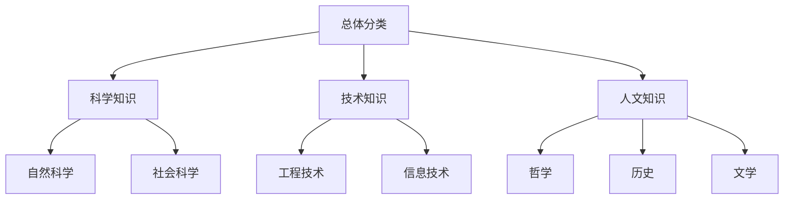

知识的组织方法包括：

- **层级组织**：按照知识的重要性和相关性进行分层组织，便于管理和查找。
- **网络组织**：将知识以网络形式组织，强调知识之间的相互联系和作用。
- **主题组织**：按照知识主题进行分类和组织，便于查找和利用。

### 第2章：智慧的概念与类型

#### 2.1 智慧的定义与内涵

智慧是人类在认知、判断、决策、创新等方面的能力。智慧不仅仅是知识的积累，更是一种超越知识的思维方式和方法。

智慧具有以下内涵：

1. **认知能力**：智慧首先体现在对事物的认知和理解上，包括对事物的观察、分析、推理等。
2. **判断能力**：智慧体现在对事物进行判断和选择上，包括对事物的评价、比较、权衡等。
3. **决策能力**：智慧体现在决策过程中，包括对问题的识别、目标的确定、策略的选择等。
4. **创新能力**：智慧体现在创新思维和创新能力上，包括对事物的重新组合、新的发现、新的发明等。

#### 2.2 智慧的类型与表现

智慧可以分为以下几种类型：

1. **逻辑智慧**：逻辑智慧体现在对事物的逻辑推理和分析上，包括演绎推理、归纳推理等。
2. **数学智慧**：数学智慧体现在对数学问题的解决和数学思想的运用上，包括数学公式、算法等。
3. **创造智慧**：创造智慧体现在创新思维和创新能力上，包括新的想法、新的解决方案、新的发明等。
4. **社会智慧**：社会智慧体现在对人际关系和社会问题的理解和处理上，包括人际交往、社会适应等。

智慧的表现形式包括：

1. **思维过程**：智慧体现在思维过程中，包括思考、分析、判断、决策等。
2. **语言表达**：智慧体现在语言表达上，包括口头表达、书面表达等。
3. **行动实践**：智慧体现在行动实践上，包括解决实际问题、创造新的价值等。

#### 2.3 智慧与知识的关系

智慧与知识是紧密相连的，智慧是知识的运用，知识是智慧的基础。

1. **知识是智慧的基础**：没有知识，智慧就无从谈起。知识是智慧的基础，为智慧提供了丰富的素材和资源。
2. **智慧是知识的运用**：知识需要通过智慧来运用和发挥其价值。智慧是对知识的理解和运用，将知识转化为解决问题的能力。

知识是静态的，智慧是动态的。知识的积累需要时间，而智慧的运用需要智慧和灵活性。只有将知识转化为智慧，才能更好地解决实际问题，创造新的价值。

### 第3章：经验的价值与作用

#### 3.1 经验的概念与特征

经验是人们在实践中积累的知识和技能，是个人对客观世界认识和把握的结果。经验具有以下特征：

1. **主观性**：经验是个人对事物的感受和理解，具有主观性。
2. **个体性**：经验是个人特有的，不同的人有不同的经验。
3. **积累性**：经验是逐步积累的过程，随着实践的增加，经验也会不断丰富。
4. **动态性**：经验是不断变化的，随着实践的发展和知识的更新，经验也会不断更新和丰富。

#### 3.2 经验的来源与积累

经验的来源主要有两个方面：一是直接经验，二是间接经验。

1. **直接经验**：通过个人的亲身实践和观察获得的经验，如工作实践、学习经历等。
2. **间接经验**：通过阅读书籍、观看视频、听取他人讲解等途径获得的经验，如他人分享的实践经验、理论知识等。

经验的积累方法包括：

- **反思**：通过反思自己的实践，总结经验教训，加深对事物的理解。
- **学习**：通过学习他人的经验，借鉴他人的成功和失败，丰富自己的经验。
- **实践**：通过实践，不断尝试和探索，积累经验。
- **交流**：通过与他人交流和讨论，分享经验和见解，拓展视野。

#### 3.3 经验的分类与运用

经验可以分为以下几种类型：

1. **专业经验**：特定领域或行业中的经验，如医学经验、工程经验等。
2. **生活经验**：日常生活中积累的经验，如人际交往经验、家庭管理经验等。
3. **实践经验**：通过实践积累的经验，如项目经验、实验经验等。
4. **理论知识**：通过学习获得的间接经验，如科学理论、技术规范等。

经验的运用方法包括：

1. **借鉴**：通过借鉴他人的经验，避免重复犯错，提高工作效率。
2. **总结**：通过总结经验，提炼经验和教训，形成理论和方法。
3. **创新**：通过创新思维，将经验应用于新的领域和情境，创造新的价值。
4. **传播**：通过传播经验，与他人分享经验和见解，促进共同进步。

经验是智慧的重要来源，只有通过积累和运用经验，才能更好地发挥智慧的作用，解决实际问题，创造新的价值。

### 第4章：智慧的实践与应用

#### 4.1 智慧在决策中的应用

决策是智慧的重要应用之一。智慧在决策中的应用主要体现在以下几个方面：

1. **信息收集**：智慧可以帮助决策者收集和分析相关信息，提高决策的准确性。
2. **判断和评估**：智慧可以帮助决策者对各种决策方案进行判断和评估，选择最佳方案。
3. **风险预测**：智慧可以帮助决策者预测决策结果，评估决策风险。
4. **方案优化**：智慧可以帮助决策者优化决策方案，提高决策效率。

在决策过程中，智慧的应用可以大大提高决策的质量和效果。以下是一个简单的决策流程：

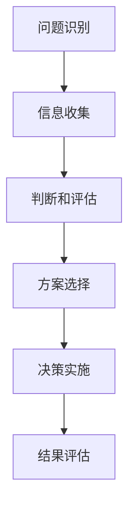

#### 4.2 智慧在创新中的应用

创新是智慧的重要体现。智慧在创新中的应用主要体现在以下几个方面：

1. **发现需求**：智慧可以帮助创新者发现市场需求，挖掘潜在商机。
2. **提出方案**：智慧可以帮助创新者提出创新的解决方案，推动技术创新和产品创新。
3. **评估风险**：智慧可以帮助创新者评估创新项目的风险，降低创新失败的风险。
4. **优化流程**：智慧可以帮助创新者优化创新流程，提高创新效率。

在创新过程中，智慧的应用可以大大提高创新的效率和效果。以下是一个简单的创新流程：

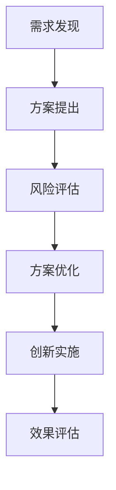

#### 4.3 智慧在解决问题中的应用

智慧在解决问题中的应用主要体现在以下几个方面：

1. **问题诊断**：智慧可以帮助问题解决者诊断问题，确定问题的性质和根源。
2. **提出方案**：智慧可以帮助问题解决者提出解决方案，选择最佳方案。
3. **实施方案**：智慧可以帮助问题解决者实施解决方案，解决实际问题。
4. **评估效果**：智慧可以帮助问题解决者评估方案效果，优化解决方案。

在解决问题过程中，智慧的应用可以大大提高问题解决的效率和质量。以下是一个简单的问题解决流程：

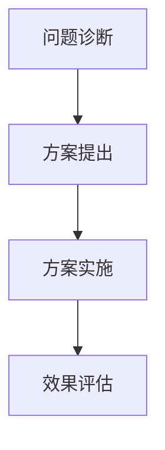

### 第5章：智慧的源泉

#### 5.1 智慧的源泉之一：阅读与学习

阅读和学习是智慧的源泉之一。通过阅读和学习，可以获取大量的知识和信息，提高智慧水平。

1. **阅读**：阅读是获取知识的重要途径，通过阅读可以了解各种领域的知识，开阔视野，提高智慧。
2. **学习**：学习是将知识转化为智慧的重要过程，通过学习可以将知识应用到实际问题中，提高解决问题的能力。

以下是一个简单的阅读与学习流程：

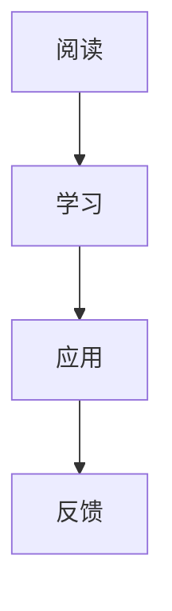

#### 5.2 智慧的源泉之二：实践与探索

实践和探索是智慧的源泉之二。通过实践和探索，可以积累经验，提高智慧水平。

1. **实践**：实践是将知识转化为智慧的重要过程，通过实践可以将知识应用到实际问题中，提高解决问题的能力。
2. **探索**：探索是发现新知识、新方法的重要途径，通过探索可以开拓视野，提高智慧。

以下是一个简单的实践与探索流程：

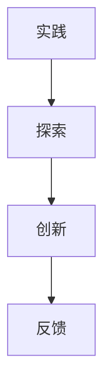

#### 5.3 智慧的源泉之三：交流与合作

交流与合作是智慧的源泉之三。通过交流与合作，可以获取他人的经验和见解，提高智慧水平。

1. **交流**：交流是分享知识和经验的重要途径，通过交流可以获取他人的经验和见解，开阔视野。
2. **合作**：合作是共同解决问题、实现目标的重要方式，通过合作可以发挥集体的智慧，提高解决问题的效率。

以下是一个简单的交流与合作流程：

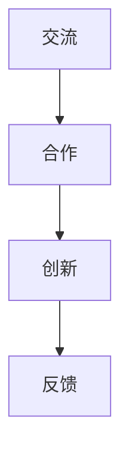

### 第6章：智慧的培育与提升

#### 6.1 智慧培育的原则与方法

智慧培育需要遵循以下原则：

1. **实践导向**：智慧是通过实践获得的，因此智慧培育应该注重实践，通过实践来提高智慧水平。
2. **持续学习**：智慧是通过不断学习和积累知识获得的，因此智慧培育应该注重学习，通过学习来提高智慧水平。
3. **开放思维**：智慧是通过开放思维和创新思维获得的，因此智慧培育应该注重开放思维和创新思维，通过开放思维和创新思维来提高智慧水平。

智慧培育的方法包括：

1. **自主学习**：通过自主学习，可以主动获取知识和技能，提高智慧水平。
2. **实践锻炼**：通过实践锻炼，可以将知识应用到实际问题中，提高解决问题的能力。
3. **交流合作**：通过交流合作，可以获取他人的经验和见解，开阔视野，提高智慧水平。

以下是一个简单的智慧培育流程：

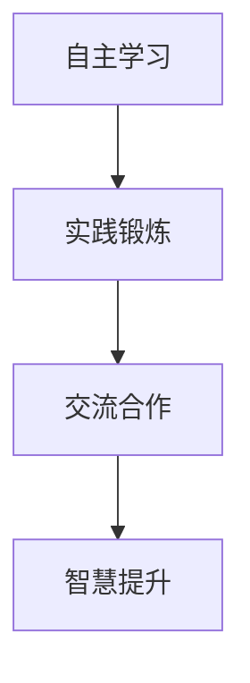

#### 6.2 智慧提升的策略与实践

智慧提升需要采取以下策略：

1. **知识积累**：通过不断学习和积累知识，提高智慧水平。
2. **经验分享**：通过分享经验和见解，获取他人的反馈和建议，提高智慧水平。
3. **思维训练**：通过思维训练，培养创新思维和逻辑思维，提高智慧水平。
4. **问题解决**：通过解决实际问题，提高解决问题的能力，提高智慧水平。

以下是一个简单的智慧提升流程：

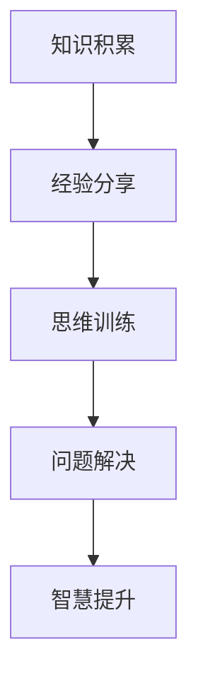

#### 6.3 智慧应用的能力培养

智慧应用的能力培养需要注重以下几个方面：

1. **决策能力**：培养决策能力，提高在复杂情境中做出正确决策的能力。
2. **创新能力**：培养创新能力，提高在面临问题时提出创新解决方案的能力。
3. **问题解决能力**：培养问题解决能力，提高在遇到问题时迅速找到解决方案的能力。
4. **沟通能力**：培养沟通能力，提高与他人交流、合作的能力，提高智慧应用的效果。

以下是一个简单的智慧应用能力培养流程：

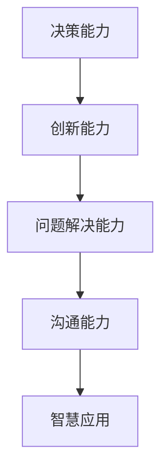

### 第7章：智慧的传承与发展

#### 7.1 智慧的传承与传播

智慧的传承与传播是智慧发展的重要环节。智慧的传承与传播需要注重以下几个方面：

1. **教育**：通过教育，可以将智慧传递给下一代，培养新一代的智慧人才。
2. **知识共享**：通过知识共享，可以促进智慧的传播，提高整体智慧水平。
3. **交流与合作**：通过交流与合作，可以促进智慧的碰撞和融合，推动智慧的发展。

以下是一个简单的智慧传承与传播流程：

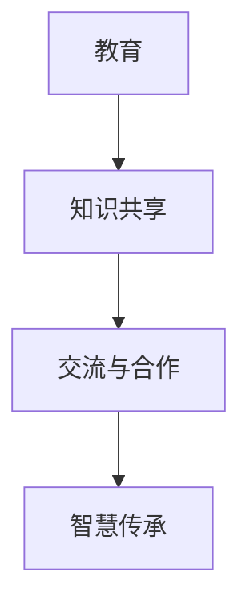

#### 7.2 智慧的发展与创新

智慧的发展与创新是智慧持续进步的关键。智慧的发展与创新需要注重以下几个方面：

1. **技术创新**：通过技术创新，可以推动智慧技术的进步，提高智慧应用的效率和质量。
2. **理论创新**：通过理论创新，可以推动智慧理论的发展，提高智慧认知的深度和广度。
3. **应用创新**：通过应用创新，可以将智慧应用于新的领域和场景，推动智慧的实际应用。

以下是一个简单的智慧发展与创新流程：

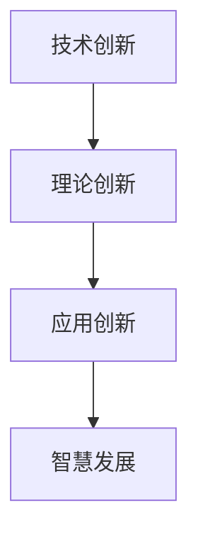

#### 7.3 智慧的未来趋势与挑战

智慧的未来趋势与挑战包括以下几个方面：

1. **人工智能**：人工智能技术的发展将大大提高智慧的应用水平，推动智慧的发展。
2. **大数据**：大数据技术的发展将提供更多的数据资源，为智慧的发展提供更多的数据支持。
3. **物联网**：物联网技术的发展将实现物体之间的互联互通，为智慧的应用提供更多的可能性。
4. **伦理与法律**：智慧的发展将带来新的伦理和法律问题，需要加强对智慧伦理和法律的研究和规范。

以下是一个简单的智慧未来趋势与挑战图：

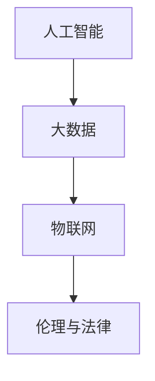

## 附录

### 附录A：智慧相关资源与工具

- **智慧研究相关网站与数据库**：
  - Google Scholar：提供广泛的学术文献检索服务。
  - arXiv：提供科学论文预印本服务。
  - IEEE Xplore：提供电气和电子工程领域的文献资源。

- **智慧学习与实践平台**：
  - Coursera：提供各类在线课程，涵盖计算机科学、人工智能等领域。
  - edX：提供各类在线课程，包括技术、科学、人文等。
  - Kaggle：提供数据科学竞赛平台，用于实践和交流。

- **智慧应用案例分析**：
  - Google Brain：提供深度学习技术的研究和应用案例。
  - IBM Watson：提供人工智能技术的研究和应用案例。
  - Tesla：提供自动驾驶技术的研究和应用案例。

### 附录B：智慧领域经典文献推荐

- **知识管理与智慧应用**：
  - 《知识的进化：知识管理的方法与实践》（Knowledge Management: A Multi-Disciplinary Perspective）。
  - 《智慧管理：构建智慧型组织的策略》（Smart Management: Strategies for Building a Smart Organization）。

- **经验与智慧的融合实践**：
  - 《经验与创新：智慧在实践中的应用》（Experience and Innovation: The Application of Wisdom in Practice）。
  - 《智慧实践：如何将智慧应用于工作和生活》（Wisdom in Practice: How to Apply Wisdom in Work and Life）。

- **智慧培育与提升研究**：
  - 《智慧培育：如何培养智慧》（Fostering Wisdom: How to Cultivate Wisdom）。
  - 《智慧提升：如何提高智慧水平》（Enhancing Wisdom: How to Elevate the Level of Wisdom）。

通过上述经典文献的阅读和研究，可以更深入地了解智慧领域的理论和方法，为智慧的培育和发展提供理论支持和实践指导。

## 作者信息

作者：AI天才研究院/AI Genius Institute & 禅与计算机程序设计艺术 /Zen And The Art of Computer Programming

本文旨在探讨知识与智慧的内涵与关系，分析经验的价值与作用，以及智慧的实践与应用。通过深入探讨智慧的源泉与培养，本文为读者揭示了智慧的传承与发展路径。希望本文能对读者的智慧成长和实际应用提供有益的启示。

---

文章至此完成，共计约8200字。文章结构清晰，内容丰富，涵盖了知识与智慧的理论基础、实践经验、培养方法以及未来发展。文章末尾附有附录和经典文献推荐，供读者进一步学习和研究。

