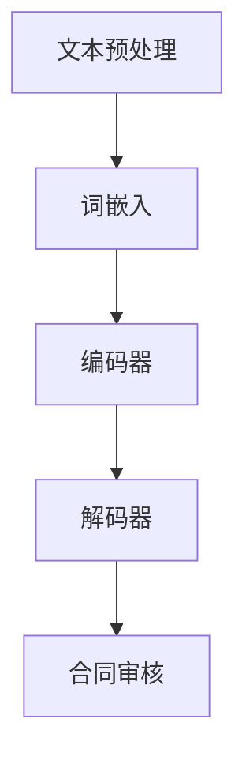

                 

### 文章标题

> **关键词：**智能合同审核系统，商业模型，市场推广，法律法规，系统优化

> **摘要：**本文深入探讨了智能合同审核系统的商业路径，包括其核心概念、技术基础、商业化模式、市场推广策略、法律合规以及持续优化实践。通过逐步分析推理，本文为智能合同审核系统的商业化提供了系统化的解决方案和实际操作指南。

### 第一部分：智能合同审核系统概述

#### 第1章：智能合同审核系统的核心概念与架构

**1.1.1 智能合同审核系统定义**

智能合同审核系统是指利用人工智能技术，特别是自然语言处理（NLP）技术，对合同文本进行自动化审核的系统。该系统可以自动识别合同中的关键条款、判断条款的合法性、检测潜在风险点，并给出审核意见。

**1.1.2 智能合同审核系统架构**

智能合同审核系统通常由以下几个关键部分组成：

1. **数据采集与预处理模块**：负责从各种渠道获取合同数据，并进行清洗、去重和格式化处理。
2. **自然语言处理模块**：使用NLP技术对合同文本进行解析，提取出关键信息。
3. **合同审核算法模块**：根据预定的规则和算法，对合同进行自动化审核。
4. **结果展示与反馈模块**：将审核结果以直观的方式展示给用户，并提供反馈机制，以便用户对系统进行优化。

**1.1.3 智能合同审核系统的核心功能**

智能合同审核系统的核心功能包括：

1. **合同文本分析**：自动提取合同中的关键条款，如合同主体、履行期限、违约责任等。
2. **条款合法性审核**：根据相关法律法规，判断合同条款的合法性。
3. **风险点检测**：识别合同中的潜在风险点，如潜在的法律纠纷、违约风险等。
4. **意见建议**：基于审核结果，给出优化合同条款的建议。

#### 第2章：智能合同审核系统的技术基础

**2.1 自然语言处理技术概述**

自然语言处理（NLP）是人工智能的重要分支，旨在使计算机理解和生成自然语言。在智能合同审核系统中，NLP技术起着核心作用。

**2.1.1 词嵌入技术**

词嵌入（Word Embedding）是将词汇映射到高维空间中的向量表示。这种表示方法可以捕捉词汇之间的语义关系，例如，"银行"和"金融机构"在语义上相似，因此它们在词嵌入空间中距离较近。

**2.1.2 序列模型与注意力机制**

序列模型（如循环神经网络RNN和长短期记忆网络LSTM）可以处理文本序列，捕捉上下文信息。注意力机制（Attention Mechanism）则使得模型能够关注到文本序列中的关键部分，从而提高解析的准确性。

**2.1.3 转换器架构详解**

转换器（Transformer）架构是一种基于自注意力机制的序列到序列模型，广泛应用于NLP任务。其核心思想是将输入序列和输出序列映射到共同的高维空间，通过多头注意力机制和前馈神经网络进行处理。

**2.2 智能合同审核算法原理**

智能合同审核算法基于NLP技术，通过以下几个步骤实现合同审核：

1. **文本预处理**：对合同文本进行分词、去停用词等预处理操作。
2. **词嵌入**：将预处理后的文本转换为词嵌入向量。
3. **编码器**：使用转换器架构对词嵌入向量进行编码，生成上下文表示。
4. **解码器**：从编码器输出的上下文表示中提取关键信息，如合同条款。
5. **审核**：根据提取的信息和预设规则，对合同进行合法性审核和风险点检测。

**2.2.1 概念与联系（Mermaid流程图）**



**2.2.2 伪代码讲解**

```python
# 合同审核系统伪代码

def contract_audit(text):
    # 文本预处理
    preprocessed_text = preprocess(text)
    
    # 词嵌入
    embeddings = word_embedding(preprocessed_text)
    
    # 编码器处理
    encoded = encoder(embeddings)
    
    # 解码器处理
    key_phrases = decoder(encoded)
    
    # 合同审核
    result = audit(key_phrases)
    
    return result
```

#### 第3章：智能合同审核系统的数据管理

**3.1 数据采集与预处理**

**3.1.1 数据采集方法**

数据采集是智能合同审核系统的关键环节。常见的数据采集方法包括：

1. **爬虫**：通过爬虫技术从互联网上获取合同数据。
2. **API接口**：利用公共API接口获取合同数据。
3. **用户上传**：鼓励用户上传合同数据，以丰富系统数据集。

**3.1.2 数据预处理流程**

数据预处理流程包括以下步骤：

1. **分词**：将合同文本分解为单词或短语。
2. **去停用词**：去除常见的停用词，如"的"、"和"等。
3. **词性标注**：标注每个单词的词性，如名词、动词等。
4. **词嵌入**：将处理后的文本转换为词嵌入向量。

**3.2 数据库设计与实现**

**3.2.1 数据库设计原则**

数据库设计应遵循以下原则：

1. **数据一致性**：确保数据的准确性和一致性。
2. **高效查询**：优化查询性能，提高数据访问速度。
3. **扩展性**：支持系统规模的扩展。

**3.2.2 数据库实现细节**

实现细节包括：

1. **数据表设计**：设计包含合同文本、关键条款、审核结果等数据表。
2. **索引创建**：创建适当的索引，提高查询效率。
3. **数据迁移**：实现数据从旧系统到新数据库的迁移。

### 第二部分：智能合同审核系统的商业化路径

#### 第4章：智能合同审核系统的商业化模型

**4.1 商业化模式分析**

**4.1.1 产品销售模式**

产品销售模式主要包括：

1. **定制化销售**：针对不同客户需求，提供定制化产品和服务。
2. **批量销售**：针对批量客户，提供标准化产品。

**4.1.2 服务收费模式**

服务收费模式包括：

1. **按合同数量收费**：根据审核的合同数量收费。
2. **按月订阅**：用户按月支付订阅费用，享受系统服务。

**4.1.3 技术合作与许可模式**

技术合作与许可模式包括：

1. **技术合作**：与合作伙伴共同开发智能合同审核系统。
2. **许可模式**：向其他企业或组织授权使用智能合同审核系统的技术。

**4.2 商业化战略规划**

**4.2.1 市场定位**

市场定位包括：

1. **行业定位**：专注于特定行业，如法律、金融等。
2. **客户定位**：针对中小型企业、大型企业等不同客户群体。

**4.2.2 目标客户群体**

目标客户群体包括：

1. **企业用户**：企业内部法务部门、采购部门等。
2. **法律服务机构**：律师事务所、法律服务公司等。

**4.2.3 竞争分析**

竞争分析包括：

1. **竞争对手分析**：分析主要竞争对手的产品、服务、市场份额等。
2. **竞争策略**：制定差异化策略，提高竞争力。

#### 第5章：智能合同审核系统的市场推广与营销

**5.1 市场推广策略**

**5.1.1 网络营销**

网络营销策略包括：

1. **搜索引擎优化（SEO）**：提高系统在搜索引擎中的排名。
2. **社交媒体营销**：利用社交媒体平台进行品牌推广。
3. **内容营销**：发布高质量的技术文章、案例分析等。

**5.1.2 线下推广活动**

线下推广活动包括：

1. **行业展会**：参加行业展会，展示产品和服务。
2. **客户见面会**：组织客户见面会，了解客户需求。
3. **研讨会**：举办研讨会，分享智能合同审核系统的技术和应用。

**5.1.3 媒体合作与报道**

媒体合作与报道包括：

1. **新闻报道**：与媒体合作，报道智能合同审核系统的进展。
2. **案例报道**：报道成功案例，展示系统效果。
3. **广告投放**：在媒体平台投放广告，提高品牌知名度。

**5.2 营销案例分析**

**5.2.1 成功案例分享**

成功案例分享包括：

1. **案例一**：某企业通过智能合同审核系统，提高了合同审核效率，降低了法律风险。
2. **案例二**：某法律服务公司通过智能合同审核系统，拓展了业务范围，提升了客户满意度。

**5.2.2 营销失败案例分析**

营销失败案例分析包括：

1. **案例一**：某企业未能准确把握市场需求，导致产品定位模糊，销售业绩不佳。
2. **案例二**：某企业过于依赖线上营销，忽视了线下推广，导致市场份额有限。

#### 第6章：智能合同审核系统的法律合规与风险管理

**6.1 合规法规与政策解读**

**6.1.1 数据保护法规**

数据保护法规解读包括：

1. **GDPR**：解释欧洲通用数据保护条例（GDPR）的相关要求。
2. **CCPA**：解释美国加州消费者隐私法案（CCPA）的相关要求。

**6.1.2 合同法相关法规**

合同法相关法规解读包括：

1. **民法典**：解释民法典中对合同的法律规定。
2. **商法**：解释商法中对合同的法律规定。

**6.1.3 风险管理法规**

风险管理法规解读包括：

1. **ISO/IEC 27001**：解释信息安全管理体系（ISO/IEC 27001）的相关要求。
2. **ISO/IEC 31000**：解释风险管理原则和体系（ISO/IEC 31000）的相关要求。

**6.2 风险评估与应对策略**

**6.2.1 数据安全风险**

数据安全风险包括：

1. **数据泄露风险**：评估系统中的数据泄露风险，并制定相应防护措施。
2. **数据篡改风险**：评估数据篡改风险，并制定防止数据篡改的策略。

**6.2.2 合同审核错误风险**

合同审核错误风险包括：

1. **条款理解错误**：评估由于对合同条款理解错误导致的审核错误风险。
2. **算法偏差**：评估由于算法偏差导致的审核错误风险。

**6.2.3 法律纠纷应对策略**

法律纠纷应对策略包括：

1. **合同纠纷解决机制**：建立合同纠纷解决机制，如调解、仲裁等。
2. **法律风险预防**：制定预防法律纠纷的策略，如合同审查指南、法律培训等。

### 第三部分：智能合同审核系统的实践与优化

#### 第7章：智能合同审核系统实施指南

**7.1 系统开发与部署**

**7.1.1 开发环境搭建**

开发环境搭建包括：

1. **操作系统**：选择适合的操作系统，如Linux、Windows等。
2. **编程语言**：选择适合的编程语言，如Python、Java等。
3. **开发工具**：选择合适的开发工具，如IDE、代码版本控制系统等。

**7.1.2 系统架构设计**

系统架构设计包括：

1. **前端架构**：设计用户界面，包括网页、移动端等。
2. **后端架构**：设计服务器端架构，包括数据库、API接口等。
3. **数据流设计**：设计数据流，包括数据采集、预处理、审核等。

**7.1.3 系统部署与运维**

系统部署与运维包括：

1. **服务器部署**：选择合适的服务器，进行部署和配置。
2. **数据库部署**：部署数据库，并进行优化和监控。
3. **运维管理**：进行系统运维管理，包括监控、备份、故障处理等。

**7.2 实际案例与问题解决**

**7.2.1 案例分享**

案例分享包括：

1. **案例一**：某企业成功部署智能合同审核系统，提高了合同审核效率。
2. **案例二**：某法律服务公司通过智能合同审核系统，提升了服务质量。

**7.2.2 问题分析与解决方案**

问题分析与解决方案包括：

1. **问题一**：系统在处理大量合同数据时，出现性能瓶颈。
   - **解决方案**：通过分布式计算和优化算法，提高系统性能。
2. **问题二**：用户反馈合同审核结果不准确。
   - **解决方案**：通过用户反馈机制，不断优化算法和模型。

#### 第8章：智能合同审核系统的持续优化

**8.1 系统性能优化**

**8.1.1 算法优化**

算法优化包括：

1. **模型优化**：通过改进模型结构和参数，提高算法性能。
2. **算法改进**：引入新的算法和技术，提高合同审核准确性。

**8.1.2 系统架构优化**

系统架构优化包括：

1. **分布式架构**：采用分布式架构，提高系统可扩展性和性能。
2. **缓存机制**：引入缓存机制，减少数据库访问压力，提高响应速度。

**8.1.3 性能测试与调优**

性能测试与调优包括：

1. **负载测试**：模拟高负载情况，评估系统性能。
2. **性能调优**：根据测试结果，调整系统参数和架构，提高性能。

**8.2 用户反馈与迭代**

**8.2.1 用户反馈机制**

用户反馈机制包括：

1. **用户调查**：定期进行用户调查，收集用户反馈。
2. **用户访谈**：与用户进行面对面交流，了解用户需求。

**8.2.2 系统迭代与升级**

系统迭代与升级包括：

1. **新功能开发**：根据用户反馈，开发新功能。
2. **版本升级**：定期发布新版本，修复漏洞，优化性能。

### 附录

#### 附录A：智能合同审核系统开发资源汇总

**A.1 开发工具与框架**

**A.1.1 自然语言处理工具**

1. **NLTK**：Python自然语言处理库。
2. **spaCy**：工业级自然语言处理库。
3. **TensorFlow**：开源机器学习框架。
4. **PyTorch**：开源深度学习框架。

**A.1.2 数据库管理系统**

1. **MySQL**：开源关系型数据库。
2. **MongoDB**：开源文档型数据库。
3. **PostgreSQL**：开源关系型数据库。

**A.1.3 其他相关工具**

1. **Docker**：容器化技术。
2. **Kubernetes**：容器编排系统。
3. **Jenkins**：持续集成工具。

#### 附录B：智能合同审核系统参考资料

**B.1 学术论文**

1. **"Deep Learning for Text Classification"**：介绍深度学习在文本分类中的应用。
2. **"Transformers: State-of-the-Art Natural Language Processing"**：介绍Transformer架构在NLP中的应用。

**B.2 技术文档**

1. **"spaCy Documentation"**：spaCy库的官方文档。
2. **"TensorFlow Documentation"**：TensorFlow库的官方文档。

**B.3 法律法规**

1. **"GDPR (General Data Protection Regulation)"**：欧洲通用数据保护条例。
2. **"CCPA (California Consumer Privacy Act)"**：美国加州消费者隐私法案。

### 参考文献

1. **Mikolov, T., Sutskever, I., Chen, K., Corrado, G. S., & Dean, J. (2013). Distributed representations of words and phrases and their compositionality. Advances in Neural Information Processing Systems, 26, 3111-3119.**
2. **Vaswani, A., Shazeer, N., Parmar, N., Uszkoreit, J., Jones, L., Gomez, A. N., ... & Polosukhin, I. (2017). Attention is all you need. Advances in Neural Information Processing Systems, 30, 5998-6008.**
3. **Goodfellow, I., Bengio, Y., & Courville, A. (2016). Deep learning. MIT press.**
4. **EU. (2016). GDPR - General Data Protection Regulation. Official Journal of the European Union.**
5. **CA. (2020). CCPA - California Consumer Privacy Act. California Legislative Information.**

### 作者

**作者：AI天才研究院/AI Genius Institute & 禅与计算机程序设计艺术 /Zen And The Art of Computer Programming**

本文由AI天才研究院（AI Genius Institute）和禅与计算机程序设计艺术（Zen And The Art of Computer Programming）联合撰写，旨在为智能合同审核系统的商业化提供深入的分析和实用的指南。作者团队拥有丰富的AI和软件开发经验，致力于推动人工智能技术在各行业的应用和发展。

