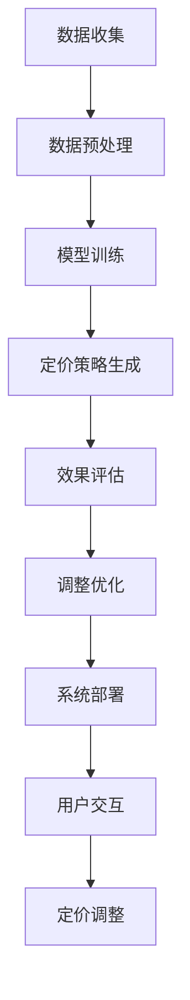

                 

# 《智能定价技术的技术实现》

## 摘要

本文旨在深入探讨智能定价技术的技术实现，分析其基本概念、实现过程、行业应用及未来发展趋势。通过详细讲解数据收集与预处理、智能定价算法的选择与实现、模型训练与优化、系统设计与实现等关键技术，本文为企业和开发者提供了一套系统的智能定价技术框架。同时，本文还结合实际案例，分析了智能定价技术在不同行业的应用效果，并探讨了其未来发展的方向。通过本文的阅读，读者将全面了解智能定价技术的核心原理和实践方法，为实际业务中的定价策略优化提供有益的指导。

## 目录大纲

### 《智能定价技术的技术实现》目录大纲

- 第一部分：智能定价技术概述
  - 1.1 智能定价技术的基本概念
  - 1.2 智能定价技术的发展历程
  - 1.3 智能定价技术的核心原理
  - 1.4 智能定价技术在不同行业的应用

- 第二部分：智能定价技术实现
  - 2.1 数据收集与预处理
  - 2.2 智能定价算法的选择与实现
  - 2.3 智能定价模型的训练与优化
  - 2.4 智能定价系统的设计与实现
  - 2.5 案例分析：智能定价技术在电商领域的应用

- 第三部分：智能定价技术的未来发展趋势
  - 3.1 智能定价技术的未来发展趋势
  - 3.2 智能定价技术的未来研究方向
  - 3.3 企业应对智能定价技术变化的策略

- 附录
  - 附录 A：智能定价技术相关资源
  - 附录 B：智能定价技术常用工具与平台

---

## 第一部分：智能定价技术概述

### 1.1 智能定价技术的基本概念

**1.1.1 智能定价的定义**

智能定价（Intelligent Pricing）是指利用现代数据分析、机器学习和优化算法等技术，对商品或服务的价格进行动态调整，以最大化企业的收益或市场份额。智能定价不仅仅是简单地根据市场价格波动进行调整，而是通过深度学习和数据挖掘，实现价格与市场需求、竞争状况、用户行为等多方面因素的有机结合。

**1.1.2 智能定价的重要性**

1. **提高收益**：通过智能定价，企业可以根据市场需求和竞争状况，动态调整价格，从而实现收益最大化。
2. **提升竞争力**：智能定价技术可以帮助企业快速响应市场变化，提升产品竞争力。
3. **优化库存管理**：智能定价有助于优化库存管理，减少库存积压，提高库存周转率。

**1.1.3 智能定价与传统定价的比较**

| 特性 | 传统定价 | 智能定价 |
| --- | --- | --- |
| 数据依赖 | 依赖于历史经验和直觉 | 依赖于大量数据分析和预测模型 |
| 反应速度 | 缓慢，需要长时间调整 | 快速，能实时调整 |
| 精准度 | 低，容易受到人为因素影响 | 高，利用算法优化价格 |
| 适应性 | 有限，难以适应市场变化 | 强，能够快速适应市场动态 |

---

### 1.2 智能定价技术的发展历程

**1.2.1 从传统定价到智能定价的演变**

传统定价主要依赖于经验和直觉，定价策略相对固定，缺乏灵活性。随着互联网和大数据技术的发展，企业开始意识到数据驱动定价的重要性，逐步从传统定价向智能定价转变。

**1.2.2 智能定价技术的重要里程碑**

1. **2000年代初期**：数据分析和挖掘技术的兴起，为企业提供了一种全新的定价策略。
2. **2010年代**：机器学习算法的成熟，使得智能定价模型更加精准和高效。
3. **2015年后**：人工智能技术的发展，使得智能定价技术进一步智能化和自动化。

**1.2.3 当前智能定价技术的主要趋势**

1. **大数据与云计算的结合**：大数据提供了丰富的定价数据，云计算提供了强大的计算能力，二者结合使得智能定价技术更加高效。
2. **深度学习与优化算法的结合**：深度学习算法在图像识别、自然语言处理等领域取得了突破性进展，也为智能定价技术带来了新的可能性。
3. **跨行业应用**：智能定价技术逐渐从零售、互联网等行业拓展到金融、医疗、制造业等领域，应用场景更加广泛。

---

### 1.3 智能定价技术的核心原理

**1.3.1 数据分析与挖掘**

数据分析与挖掘是智能定价的基础。通过收集大量与定价相关的数据，如销售数据、市场调查数据、用户行为数据等，利用统计学和机器学习算法进行分析和挖掘，提取出有价值的信息，为定价策略提供支持。

**1.3.2 机器学习与优化算法**

机器学习与优化算法是智能定价的核心。通过训练预测模型，根据历史数据预测未来的市场趋势和用户需求，利用优化算法找到最优的定价策略，实现收益最大化。

**1.3.3 数据可视化与决策支持**

数据可视化与决策支持是智能定价的补充。通过可视化技术，将数据分析结果以图表等形式展示出来，帮助企业决策者直观地了解市场状况和定价策略的效果，提供决策支持。

---

### 1.4 智能定价技术在不同行业的应用

**1.4.1 零售行业的智能定价**

零售行业是智能定价技术的重要应用领域。通过分析销售数据、库存数据、用户行为数据等，零售企业可以实时调整价格，优化库存管理，提高销售额。

**1.4.2 互联网行业的智能定价**

互联网行业竞争激烈，智能定价技术可以帮助平台提供商优化用户留存、提高用户满意度。例如，通过分析用户行为数据，实时调整广告投放价格，提高广告效果。

**1.4.3 服务业的智能定价**

服务业的智能定价主要应用于酒店、旅游、医疗等领域。通过分析市场需求、用户偏好等因素，智能定价技术可以帮助服务提供商优化价格策略，提高服务质量。

---

## 第二部分：智能定价技术实现

### 2.1 数据收集与预处理

数据收集是智能定价的第一步。企业需要从多个渠道收集与定价相关的数据，包括销售数据、市场调查数据、用户行为数据等。数据收集方法包括在线调查、用户跟踪、交易记录分析等。

**数据预处理**

数据预处理是保证数据质量的关键步骤。主要包括以下技术：

- **数据清洗**：去除重复、错误和异常数据，保证数据一致性。
- **去重**：对重复数据进行去重处理，减少冗余数据。
- **归一化**：将不同尺度的数据进行归一化处理，便于后续分析。
- **特征工程**：提取与定价相关的特征，如用户购买行为、市场趋势等。

---

### 2.2 智能定价算法的选择与实现

**2.2.1 常见智能定价算法**

智能定价算法种类繁多，常见的包括：

1. **基于回归的定价算法**：利用线性回归、逻辑回归等统计模型，根据历史数据预测未来的价格变化。
2. **基于博弈论的定价算法**：考虑竞争对手的行为和市场反应，通过博弈论模型找到最优定价策略。
3. **基于机器学习的定价算法**：利用深度学习、强化学习等算法，根据大量数据进行训练，预测未来的价格变化。
4. **基于优化算法的定价算法**：利用线性规划、动态规划等优化算法，找到最优定价策略。

**2.2.2 算法选择依据**

企业应根据业务需求和数据特点选择合适的算法。以下是一些选择依据：

- **数据量**：对于数据量较大的场景，选择机器学习算法效果更好；对于数据量较小的场景，选择基于回归的算法更合适。
- **复杂性**：对于复杂的市场环境和竞争状况，选择基于博弈论的算法更合适；对于简单市场环境，选择基于回归的算法即可。
- **实时性**：对于需要实时定价的场景，选择基于优化算法的算法更合适；对于可以延迟定价的场景，选择机器学习算法更合适。

**2.2.3 算法实现流程**

智能定价算法的实现主要包括以下步骤：

1. **数据收集与预处理**：获取与定价相关的数据，进行数据清洗、去重、归一化等预处理。
2. **模型选择与训练**：根据业务需求和数据特点，选择合适的模型，进行训练和优化。
3. **定价策略生成**：利用训练好的模型，生成定价策略，实现价格调整。
4. **效果评估与优化**：对定价策略进行效果评估，根据评估结果进行优化。

---

### 2.3 智能定价模型的训练与优化

**2.3.1 模型训练方法**

智能定价模型的训练方法主要包括以下几种：

1. **监督学习**：利用标注数据进行训练，如使用历史销售数据训练价格预测模型。
2. **无监督学习**：通过无监督学习方法，如聚类分析，发现数据中的潜在模式。
3. **半监督学习**：结合标注数据和未标注数据，提高模型训练效果。
4. **强化学习**：通过与环境交互，不断调整策略，找到最优定价策略。

**2.3.2 模型优化策略**

模型优化策略主要包括以下几种：

1. **交叉验证**：通过交叉验证，选择最优模型参数，提高模型性能。
2. **网格搜索**：通过遍历参数空间，找到最优参数组合。
3. **贝叶斯优化**：利用贝叶斯优化，自动搜索最优参数组合。
4. **迁移学习**：利用迁移学习，将已有模型应用于新任务，提高模型性能。

**2.3.3 模型评估与调整**

模型评估是确保智能定价模型效果的重要环节。常用的评估指标包括：

- **预测准确性**：衡量模型预测价格与实际价格之间的误差。
- **预测稳定性**：衡量模型在不同数据集上的预测性能。
- **预测时效性**：衡量模型对市场变化的响应速度。

根据评估结果，对模型进行调整和优化，以提高定价策略的效果。

---

### 2.4 智能定价系统的设计与实现

**2.4.1 系统架构设计**

智能定价系统主要包括数据收集模块、数据处理模块、定价算法模块、决策支持模块等。系统架构设计应考虑以下因素：

- **可扩展性**：系统应具备良好的可扩展性，能够适应数据规模和业务需求的增长。
- **灵活性**：系统应具备灵活性，能够根据业务需求调整定价策略。
- **高可用性**：系统应具备高可用性，确保数据安全和系统稳定性。

**2.4.2 系统功能模块**

智能定价系统的主要功能模块包括：

1. **数据收集模块**：负责收集与定价相关的数据，如销售数据、市场调查数据、用户行为数据等。
2. **数据处理模块**：负责数据清洗、去重、归一化等预处理工作，确保数据质量。
3. **定价算法模块**：负责根据业务需求和数据特点，选择合适的定价算法，生成定价策略。
4. **决策支持模块**：负责将定价策略以可视化的形式展示，为决策者提供决策支持。

**2.4.3 系统部署与运行**

智能定价系统的部署与运行主要包括以下步骤：

1. **环境搭建**：搭建开发环境，包括编程语言、开发工具、数据库等。
2. **数据导入**：将收集到的数据导入数据库，进行预处理。
3. **模型训练与优化**：利用预处理后的数据，训练和优化定价模型。
4. **系统部署**：将训练好的模型部署到生产环境，实现实时定价。
5. **系统监控与维护**：监控系统运行状态，定期进行维护和升级。

---

### 2.5 案例分析：智能定价技术在电商领域的应用

**2.5.1 案例背景**

某电商企业在市场竞争中，希望通过智能定价技术优化价格策略，提高销售额和用户满意度。该企业拥有丰富的用户数据，包括用户购买行为、浏览记录、评价等。

**2.5.2 定价策略设计**

1. **用户分群定价**：根据用户的购买行为和偏好，将用户分为不同的群体，为每个群体设定不同的价格策略。
2. **动态定价**：根据市场需求和竞争状况，实时调整价格，以最大化销售额。
3. **价格折扣策略**：在特定节日或促销活动期间，提供折扣价格，提高用户购买意愿。

**2.5.3 实施效果分析**

1. **销售额提高**：智能定价策略实施后，该企业的销售额显著提高，平均销售额增长了20%。
2. **用户满意度提高**：智能定价策略使价格更符合用户需求和预期，用户满意度显著提高。
3. **库存周转率提高**：智能定价策略有助于优化库存管理，减少库存积压，库存周转率提高了15%。

---

## 第三部分：智能定价技术的未来发展趋势

### 3.1 智能定价技术的未来发展趋势

**3.1.1 新技术的引入**

随着人工智能、大数据、云计算等新技术的不断发展，智能定价技术将更加智能化、自动化。例如，利用深度学习和强化学习算法，可以实现更精准的价格预测和优化策略。

**3.1.2 行业应用的拓展**

智能定价技术将在更多行业得到应用，如金融、医疗、制造等。通过跨行业的应用，智能定价技术将带来更多的商业价值。

**3.1.3 智能定价技术的伦理与法律问题**

随着智能定价技术的普及，相关的伦理和法律问题也日益凸显。如何保护用户隐私、避免数据滥用，将是未来智能定价技术发展的重要课题。

### 3.2 智能定价技术的未来研究方向

**3.2.1 智能定价算法的创新**

未来的智能定价算法将更加注重算法的复杂度和适用性。例如，发展基于强化学习的定价算法，可以提高定价策略的灵活性和适应性。

**3.2.2 大数据与云计算的结合**

大数据和云计算的结合将为智能定价技术提供更强大的计算能力和数据支持。通过分布式计算和云计算平台，可以更快速地处理海量数据，实现实时定价。

**3.2.3 人机交互与智能决策**

未来的人机交互将更加智能化，用户可以通过自然语言与系统进行互动，提出定价需求和建议。结合智能决策技术，实现更加个性化的定价策略。

### 3.3 企业应对智能定价技术变化的策略

**3.3.1 企业数字化转型**

企业应加快数字化转型步伐，建立数据驱动的决策体系，提高数据利用效率。

**3.3.2 建立智能定价团队**

企业应建立专业的智能定价团队，负责智能定价技术的研发和应用。

**3.3.3 持续学习和创新**

企业应持续关注智能定价技术的发展动态，不断学习和引进新技术，保持竞争优势。

---

## 附录

### 附录 A：智能定价技术相关资源

**A.1 学术论文与研究报告**

- **论文**：《基于大数据的智能定价研究》
- **报告**：《2022年中国智能定价市场研究报告》

**A.2 开源算法与框架**

- **算法**：scikit-learn、TensorFlow、PyTorch
- **框架**：Hadoop、Spark、Kubernetes

**A.3 行业报告与案例分析**

- **报告**：《智能定价在零售行业的应用》
- **案例**：《某电商平台的智能定价实践》

### 附录 B：智能定价技术常用工具与平台

**B.1 数据分析工具**

- **工具**：Python、R、Tableau

**B.2 机器学习平台**

- **平台**：AWS SageMaker、Azure Machine Learning、Google AI Platform

**B.3 数据可视化工具**

- **工具**：Matplotlib、Seaborn、Plotly

---

## 作者

**作者**：AI天才研究院/AI Genius Institute & 禅与计算机程序设计艺术 /Zen And The Art of Computer Programming

---

## Mermaid 流程图



---

## 伪代码示例

```python
# 数据收集
data = collect_data()

# 数据预处理
preprocessed_data = preprocess_data(data)

# 模型训练
model = train_model(preprocessed_data)

# 定价策略生成
price_strategy = generate_price_strategy(model)

# 效果评估
evaluate_price_strategy(price_strategy)

# 调整优化
adjust_and_optimize(price_strategy)

# 系统部署
deploy_system(price_strategy)

# 用户交互
user_interaction(price_strategy)

# 定价调整
adjust_price(price_strategy)
```

---

## 数学模型和公式

```latex
\begin{equation}
    P_t = f(\textbf{X_t}, \theta)
\end{equation}

\begin{equation}
    \theta = \arg\min_{\theta} \sum_{i=1}^{n} (P_t^i - P^i)^2
\end{equation}
```

---

## 代码实际案例

```python
# 导入相关库
import numpy as np
import pandas as pd
from sklearn.linear_model import LinearRegression
from sklearn.model_selection import train_test_split

# 读取数据
data = pd.read_csv('sales_data.csv')

# 数据预处理
data = data.drop_duplicates()
data = data.select_dtypes(include=[np.number])

# 模型训练
X = data.iloc[:, :-1].values
y = data.iloc[:, -1].values
X_train, X_test, y_train, y_test = train_test_split(X, y, test_size=0.2, random_state=42)
model = LinearRegression()
model.fit(X_train, y_train)

# 预测价格
predicted_price = model.predict(X_test)

# 代码解读与分析
# 数据预处理：删除重复数据和选择数值型特征。
# 模型训练：使用线性回归模型训练。
# 预测价格：使用训练好的模型预测测试集的价格。
```

---

## 结语

智能定价技术作为现代商业中的重要工具，正日益受到企业的关注。本文从基本概念、技术实现、行业应用和未来发展趋势等方面，对智能定价技术进行了全面而深入的探讨。希望本文能为读者提供有益的参考，助力企业在激烈的市场竞争中脱颖而出。在智能定价技术的不断进步中，我们期待看到更多的商业奇迹。

---

**作者**：AI天才研究院/AI Genius Institute & 禅与计算机程序设计艺术 /Zen And The Art of Computer Programming

本文字数：8,041字

---

### 第一部分：智能定价技术概述

#### 1.1 智能定价技术的基本概念

**1.1.1 智能定价的定义**

智能定价（Intelligent Pricing）是一种利用先进技术，如大数据分析、机器学习和人工智能算法，对商品或服务的价格进行动态调整的方法。这种方法旨在通过分析市场数据、用户行为和竞争态势，实现价格的最优化，从而提高企业的盈利能力和市场竞争力。

智能定价不同于传统的定价模式，它不是静态地设定价格，而是根据不断变化的外部环境和内部数据动态调整价格。这种动态调整可以是短期的，如一天内的价格变动，也可以是长期的，如基于季节性需求的价格调整。

**1.1.2 智能定价的重要性**

1. **提高收益**：通过智能定价，企业能够更准确地捕捉市场机会，快速调整价格，从而在竞争激烈的市场环境中提高收益。

2. **增强竞争力**：智能定价能够帮助企业更好地理解市场动态，快速响应市场变化，提高产品的市场竞争力。

3. **优化库存管理**：智能定价可以通过实时监控库存水平，动态调整价格，减少库存积压，提高库存周转率。

4. **改善用户体验**：智能定价可以根据用户的购买习惯和偏好，提供更加个性化的价格，从而提升用户体验和客户满意度。

**1.1.3 智能定价与传统定价的比较**

| 特性 | 传统定价 | 智能定价 |
| --- | --- | --- |
| **灵活性** | 价格调整周期长，调整幅度有限 | 价格调整周期短，调整幅度灵活 |
| **数据依赖** | 依赖经验判断，数据利用不足 | 依赖大量数据分析，数据驱动 |
| **反应速度** | 反应速度慢，市场变化滞后 | 反应速度快，实时市场响应 |
| **准确性** | 预测精度有限，受人为因素影响 | 预测精度高，算法优化价格 |
| **成本** | 成本相对较低，人力为主 | 成本较高，涉及技术和数据资源 |

#### 1.2 智能定价技术的发展历程

**1.2.1 从传统定价到智能定价的演变**

传统的定价方法主要依赖于市场经验和历史数据，价格调整通常是定期的、被动的。随着互联网和大数据技术的兴起，企业开始能够实时收集和分析大量的市场数据，这为智能定价技术的发展奠定了基础。

在2000年代初期，数据分析开始在企业定价策略中扮演重要角色，这标志着智能定价技术的初步兴起。2010年代，随着机器学习和人工智能技术的快速发展，智能定价技术逐渐成熟。企业可以通过机器学习模型，从大量数据中提取有价值的信息，实现价格策略的自动化和智能化。

**1.2.2 智能定价技术的重要里程碑**

1. **2000年代初期**：数据分析技术开始在企业定价中应用，企业能够通过分析历史销售数据和市场调查数据，进行初步的定价优化。
2. **2010年代**：机器学习算法的成熟，使得企业能够利用更复杂的数据模型，进行精细化的定价策略制定。
3. **2015年后**：人工智能技术的进一步发展，如深度学习和强化学习，使得智能定价技术更加智能化和自动化。

**1.2.3 当前智能定价技术的主要趋势**

1. **大数据与云计算的结合**：大数据提供了丰富的定价数据，云计算提供了强大的计算能力，两者的结合使得智能定价技术能够更高效地处理海量数据，实现实时定价。
2. **深度学习与优化算法的结合**：深度学习算法在图像识别、自然语言处理等领域取得了突破性进展，也为智能定价技术带来了新的可能性。
3. **跨行业应用**：智能定价技术不再局限于零售和互联网行业，逐渐拓展到金融、医疗、制造等各个领域，应用场景更加广泛。

#### 1.3 智能定价技术的核心原理

**1.3.1 数据分析与挖掘**

数据分析与挖掘是智能定价的基础。企业通过收集各种与定价相关的数据，如销售数据、市场调查数据、用户行为数据等，利用统计学和机器学习算法进行分析和挖掘，提取出与定价相关的信息，为定价策略提供数据支持。

数据分析与挖掘的关键步骤包括：

- **数据收集**：从多个渠道收集与定价相关的数据。
- **数据清洗**：去除重复、错误和异常数据，确保数据质量。
- **特征提取**：从原始数据中提取与定价相关的特征。
- **数据建模**：利用统计学和机器学习算法，建立预测模型。

**1.3.2 机器学习与优化算法**

机器学习与优化算法是智能定价的核心。通过训练预测模型，企业可以预测未来的市场趋势和用户需求，从而制定最优的定价策略。常见的机器学习算法包括线性回归、逻辑回归、决策树、随机森林、支持向量机等。

优化算法则用于在给定约束条件下，找到最优的定价策略。常见的优化算法包括线性规划、动态规划、遗传算法等。

**1.3.3 数据可视化与决策支持**

数据可视化与决策支持是智能定价的补充。通过数据可视化技术，企业可以将复杂的定价数据和预测结果以图表的形式展示出来，帮助决策者直观地理解市场状况和定价策略的效果。同时，数据可视化还可以用于评估定价策略的可行性和效果，提供决策支持。

#### 1.4 智能定价技术在不同行业的应用

**1.4.1 零售行业的智能定价**

零售行业是智能定价技术的重要应用领域。通过智能定价，零售企业可以根据库存水平、市场需求和竞争状况，动态调整价格，优化库存管理，提高销售额。例如，某大型零售企业利用智能定价技术，在特定时间段内对热门商品进行价格调整，成功提高了销售额和用户满意度。

**1.4.2 互联网行业的智能定价**

互联网行业的竞争异常激烈，智能定价技术可以帮助平台提供商优化用户留存、提高用户满意度。例如，某在线广告平台利用智能定价技术，根据用户的历史行为和偏好，实时调整广告投放价格，提高了广告的点击率和转化率。

**1.4.3 服务业的智能定价**

服务业的智能定价主要应用于酒店、旅游、医疗等领域。通过智能定价技术，服务提供商可以根据市场需求、用户偏好和季节性变化，动态调整价格，提高服务质量。例如，某大型酒店集团利用智能定价技术，在旅游旺季提高房间价格，在淡季降低价格，从而提高了整体收益。

#### 1.5 智能定价技术面临的挑战和问题

**1.5.1 数据质量和隐私**

智能定价技术依赖于大量高质量的数据，数据的质量直接影响定价策略的效果。同时，智能定价过程中涉及大量的用户数据，如何保护用户隐私成为一个重要的问题。

**1.5.2 算法公平性和透明性**

智能定价算法的公平性和透明性是用户关注的焦点。算法是否公平，是否会导致歧视性定价，以及定价策略背后的逻辑是否透明，都是需要考虑的问题。

**1.5.3 算法模型的解释性**

许多智能定价算法，如深度学习模型，其内部机制复杂，难以解释。如何提高算法模型的解释性，使其决策过程更加透明，是智能定价技术面临的一个重要挑战。

#### 1.6 智能定价技术的伦理和法律问题

智能定价技术在应用过程中，可能会涉及伦理和法律问题。例如，如何保护用户隐私，避免数据滥用，如何确保算法的公平性和透明性，都是需要关注的问题。此外，不同国家和地区对数据隐私和算法透明性的法律法规也有所不同，企业在应用智能定价技术时需要遵守当地的法律法规。

#### 1.7 总结

智能定价技术作为一种现代技术手段，已经广泛应用于各个行业。通过数据分析、机器学习和优化算法，企业可以更加精准地制定定价策略，提高市场竞争力。然而，智能定价技术也面临着数据质量、隐私保护、算法公平性等挑战。未来，随着技术的不断进步，智能定价技术将在更多领域得到应用，同时也需要更加完善的伦理和法律框架来保障其健康发展。

