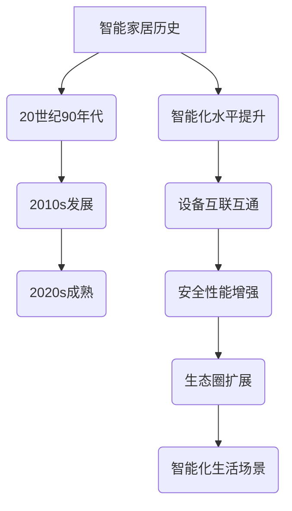
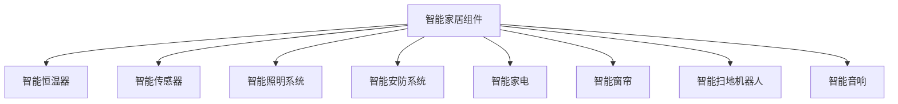
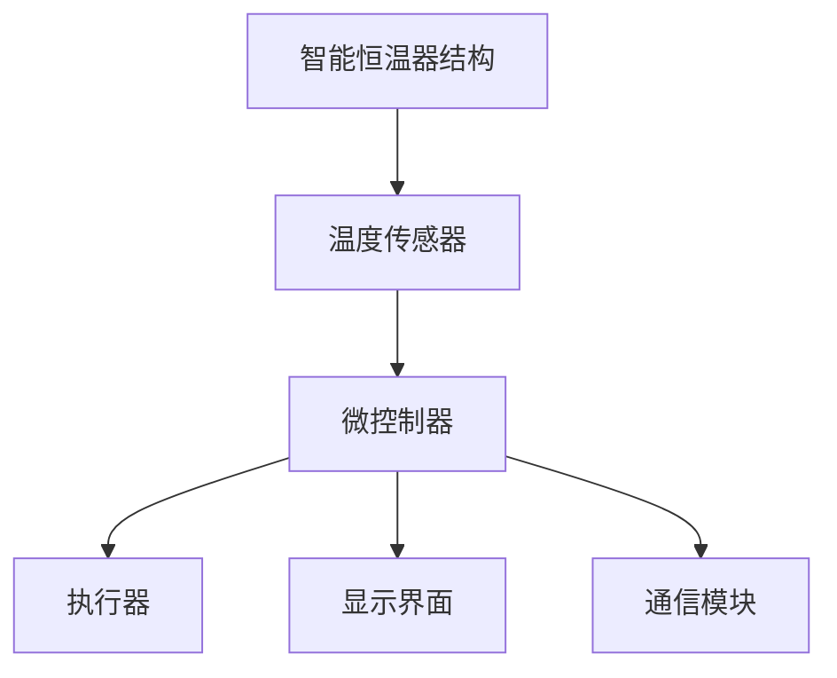
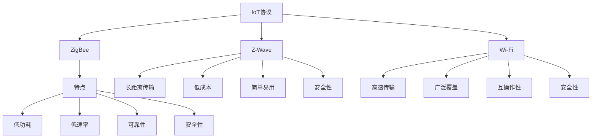
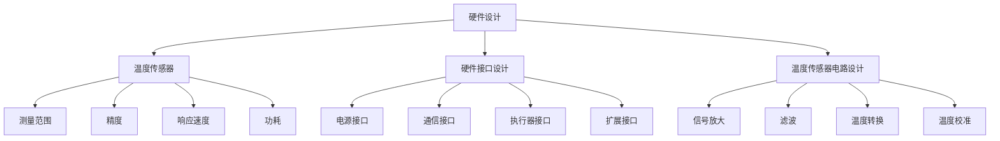
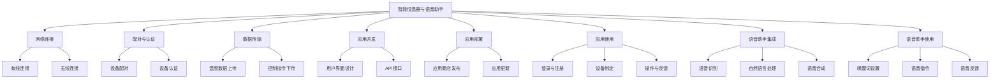
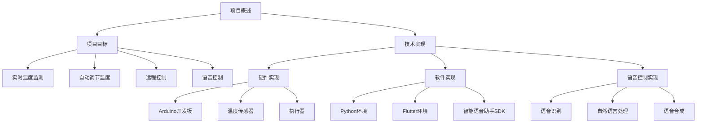
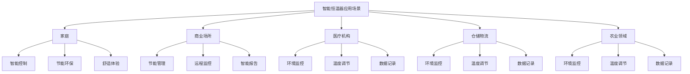

                 

# 《智能家居集成：创建智能恒温器》

## 关键词：
智能家居、智能恒温器、物联网、PID控制算法、系统集成、项目实战

## 摘要：
本文将深入探讨智能家居领域的核心组件——智能恒温器的集成与开发。首先，我们将回顾智能家居的概述、发展趋势以及其重要性和价值。接着，详细介绍智能家居生态系统的构成，包括智能恒温器、智能传感器、智能照明系统和智能安防系统。随后，我们将深入研究智能恒温器的工作原理，包括基本结构、温度传感器技术和控制算法（PID控制算法和模糊控制算法）。接下来，我们将介绍智能家居集成技术，包括物联网协议、云服务和大数据分析以及人工智能在智能家居中的应用。文章的第二部分将专注于智能恒温器的实战，包括设计、系统集成和项目实战。我们将详细讲解智能恒温器的硬件设计和软件设计，包括温度传感器的选择、控制算法的实现和用户体验设计。最后，我们将展示一个智能恒温器项目的实际开发过程，包括环境搭建、源代码实现和代码解读。文章将以对智能恒温器应用场景和未来发展的展望作为结尾。通过本文，读者将全面了解智能恒温器的核心概念、技术原理、系统集成和项目实战，为智能家居的开发提供有力指导。

### 第一部分：智能家居基础

## 第1章：智能家居概述

### 1.1 智能家居的概念与历史

智能家居（Smart Home）是指通过互联网、物联网（IoT）、云计算等技术，将家中的各种设备、系统和家电产品连接起来，实现智能控制、自动化管理和远程监控的居住环境。智能家居的历史可以追溯到20世纪90年代，当时电子技术和计算机技术的发展为智能家居的诞生奠定了基础。

智能家居的概念包括以下几个方面：

1. **智能设备互联**：通过互联网或其他通信技术，将家庭中的各种设备（如电视、空调、灯具、安防设备等）连接起来，实现设备之间的数据交换和协同工作。
2. **自动化控制**：通过预设程序或智能算法，实现家电设备的自动化控制，如自动开关灯、自动调节空调温度等。
3. **远程监控与控制**：通过手机、平板电脑等移动设备，实现对家庭设备的远程监控和控制。
4. **安全防护**：通过智能安防设备，如摄像头、门锁、烟雾报警器等，实现对家庭安全的监控和报警。

智能家居的发展历史可以分为以下几个阶段：

1. **早期阶段（1990s-2000s）**：智能家居的概念初步形成，出现了一些初步的智能家居产品，如智能灯光控制器、智能门锁等。然而，由于技术限制和成本问题，这些产品并未得到广泛应用。
2. **发展阶段（2010s）**：随着互联网、物联网和云计算技术的快速发展，智能家居开始进入快速发展阶段。这一时期，许多智能家居产品相继问世，如智能音箱、智能灯泡、智能恒温器等。
3. **成熟阶段（2020s）**：智能家居已经成为家庭生活的标配，各种智能家居产品琳琅满目，如智能门锁、智能摄像头、智能窗帘、智能扫地机器人等。智能家居的生态系统逐步完善，智能家居产品的互联互通性和兼容性得到了显著提升。

### 1.2 智能家居的发展趋势

随着人工智能、大数据、物联网等技术的不断进步，智能家居领域正迎来新的发展机遇。以下是智能家居的发展趋势：

1. **智能化水平提升**：随着人工智能技术的应用，智能家居设备将更加智能化，能够更好地理解用户需求，提供个性化服务。
2. **设备互联互通**：智能家居设备之间的互联互通性将得到进一步提升，实现跨品牌、跨平台的设备连接和协作。
3. **安全性能增强**：智能家居设备将更加注重安全性能，提高数据加密和隐私保护能力，确保用户数据安全。
4. **生态圈扩展**：智能家居领域将向更多领域扩展，如健康医疗、智慧交通、智慧城市等，形成更广泛的生态圈。
5. **智能化生活场景**：智能家居将更加贴近用户的日常生活，提供更多智能化、个性化、便捷化的生活场景。

### 1.3 智能家居的重要性和价值

智能家居对家庭生活、社会和经济都具有重要的影响和巨大的价值：

1. **提升生活质量**：智能家居设备能够为用户提供更加舒适、便捷、高效的生活体验，如自动调节室内温度、湿度，自动开关灯光，远程监控家庭安全等。
2. **节能环保**：智能家居系统能够通过自动调节设备运行状态，实现能源的高效利用，降低能源消耗，具有显著的节能环保效果。
3. **提高安全性**：智能家居安防系统能够实时监控家庭环境，及时发现安全隐患，提高家庭安全性。
4. **促进产业升级**：智能家居产业的发展将带动相关产业链的发展，推动传统家电产业的智能化转型，促进产业结构升级。
5. **创造就业机会**：智能家居产业的快速发展将创造大量的就业机会，包括研发、设计、生产、销售、安装和维护等各个环节。

### 1.4 小结

智能家居作为现代家庭生活的重要组成部分，其概念、历史和发展趋势对我们的生活和社会经济都具有重要影响。通过了解智能家居的概述和发展，我们将更好地把握智能家居的未来发展方向，为智能家居的开发和应用提供有力支持。

### Mermaid 流程图示例：



### 1.5 下一步

在下一章中，我们将进一步探讨智能家居生态系统，了解智能家居的主要组件及其功能，为深入探讨智能恒温器打下基础。

## 第2章：智能家居生态系统

### 2.1 智能家居的主要组件

智能家居生态系统由多个核心组件组成，这些组件共同协作，为用户提供安全、舒适、高效的居住环境。以下将介绍智能家居生态系统的几个主要组件：

#### 2.1.1 智能恒温器

智能恒温器是智能家居系统中的一个关键组件，它能够根据室内外温度、用户习惯等因素自动调节室内温度，提供舒适的居住环境。智能恒温器通常具备以下功能：

1. **温度监测**：通过内置的温度传感器，实时监测室内外温度。
2. **自动调节**：根据预设的温度目标和用户习惯，自动调节室内温度。
3. **远程控制**：用户可以通过手机或智能音箱远程控制恒温器的开关和温度设置。
4. **节能模式**：智能恒温器能够根据用户的作息时间和天气预报，自动调整温度设置，实现节能环保。

#### 2.1.2 智能传感器

智能传感器是智能家居系统的感知层，它们能够实时监测家庭环境参数，如温度、湿度、光照、空气质量等。常见的智能传感器包括：

1. **温度传感器**：用于监测室内外温度，为智能恒温器提供数据支持。
2. **湿度传感器**：用于监测室内湿度，帮助用户调节室内湿度，预防家居受潮。
3. **光照传感器**：用于监测室内光照强度，智能调节照明设备，节约能源。
4. **空气质量传感器**：用于监测室内空气质量，帮助用户了解室内污染状况，自动开启空气净化设备。

#### 2.1.3 智能照明系统

智能照明系统是智能家居生态系统中重要的组成部分，它能够根据用户需求和环境变化，自动调节灯光亮度和色温。智能照明系统通常具备以下功能：

1. **智能控制**：用户可以通过手机、智能音箱、墙壁开关等设备远程控制灯光的开关和亮度。
2. **场景模式**：根据不同的场景需求，如睡觉、聚会、阅读等，设置不同的灯光模式。
3. **节能模式**：根据用户作息时间和光照强度，自动调节灯光亮度，节约能源。

#### 2.1.4 智能安防系统

智能安防系统是智能家居系统中的安全保障，它能够实时监控家庭环境，预防盗窃、火灾等安全隐患。智能安防系统通常包括以下设备：

1. **摄像头**：实时监控家庭环境，用户可以通过手机远程查看。
2. **门锁**：智能门锁可以实现指纹识别、密码解锁、手机远程控制等功能，提高家庭安全性。
3. **烟雾报警器**：实时监测室内空气质量，发现烟雾时立即报警，预防火灾。
4. **入侵报警器**：当有非法入侵时，自动触发报警，通知用户和安防公司。

#### 2.1.5 智能家电

智能家电是智能家居生态系统中不可或缺的一部分，它们能够实现设备间的互联互通，提供更加便捷、舒适的生活体验。常见的智能家电包括：

1. **智能电视**：用户可以通过语音、手势等方式进行操作，实现内容搜索、播放控制等功能。
2. **智能空调**：根据室内外温度和用户需求，自动调节空调温度和风速。
3. **智能洗衣机**：根据衣物种类和污渍程度，自动选择洗涤模式，实现智能洗衣。
4. **智能冰箱**：实时监测冰箱内的温度和湿度，提醒用户补充食材，实现智能管理。

#### 2.1.6 智能窗帘

智能窗帘能够根据光照强度、用户习惯等自动调节窗帘的开关，提供舒适的居住环境。智能窗帘通常具备以下功能：

1. **智能控制**：用户可以通过手机、智能音箱、墙壁开关等设备远程控制窗帘的开关。
2. **定时模式**：根据用户作息时间和光照强度，自动调节窗帘的开关时间。
3. **节能模式**：根据用户需求和光照强度，自动调节窗帘的开关，节约能源。

#### 2.1.7 智能扫地机器人

智能扫地机器人是智能家居系统中的清洁助手，它能够根据家居环境自动规划清扫路径，实现全面清洁。智能扫地机器人通常具备以下功能：

1. **自动规划路径**：根据家居环境自动规划清扫路径，避免重复清扫和碰撞。
2. **智能避障**：能够识别家居障碍物，自动避开，确保清扫效果。
3. **自动充电**：电量不足时，自动返回充电座充电。

#### 2.1.8 智能音响

智能音响是智能家居系统中的交互中心，它能够通过语音识别和语音合成技术，实现与用户的互动。智能音响通常具备以下功能：

1. **语音控制**：用户可以通过语音指令控制智能家居设备，实现智能互动。
2. **音乐播放**：提供音乐播放功能，满足用户娱乐需求。
3. **语音助手**：集成语音助手功能，为用户提供天气查询、日程提醒、信息查询等服务。

### 2.2 智能家居系统的架构

智能家居系统通常由以下几个层次组成：

1. **感知层**：由各种智能传感器组成，负责实时监测家庭环境参数。
2. **传输层**：由通信网络（如Wi-Fi、ZigBee、Z-Wave等）组成，负责数据传输和设备互联。
3. **控制层**：由智能中枢（如智能网关、智能音响等）组成，负责数据处理、设备控制、用户交互等。
4. **应用层**：由各种智能家居应用（如智能照明、智能安防、智能家电等）组成，为用户提供个性化、便捷化的生活体验。

### 2.3 智能家居系统的优势

智能家居系统具有以下几个显著优势：

1. **提高生活质量**：通过智能化设备，为用户提供舒适、便捷的生活体验，如自动调节室内温度、湿度，远程监控家庭安全等。
2. **节能环保**：通过智能控制系统，实现能源的高效利用，降低能源消耗，具有显著的节能环保效果。
3. **提高安全性**：智能安防系统能够实时监控家庭环境，及时发现安全隐患，提高家庭安全性。
4. **促进产业升级**：智能家居产业的发展将带动相关产业链的发展，推动传统家电产业的智能化转型。
5. **创造就业机会**：智能家居产业的快速发展将创造大量的就业机会，包括研发、设计、生产、销售、安装和维护等各个环节。

### 2.4 小结

智能家居生态系统由多个核心组件组成，包括智能恒温器、智能传感器、智能照明系统、智能安防系统、智能家电等。这些组件共同协作，为用户提供安全、舒适、高效的居住环境。在下一章中，我们将深入探讨智能恒温器的工作原理，为智能家居的开发和应用提供有力支持。

### Mermaid 流程图示例：



### 2.5 下一步

在下一章中，我们将深入探讨智能恒温器的工作原理，了解其基本结构、温度传感器技术和控制算法。这将为我们后续探讨智能恒温器的系统集成和项目实战奠定基础。

## 第3章：智能恒温器的工作原理

### 3.1 智能恒温器的基本结构

智能恒温器是智能家居系统中的关键组件，其基本结构通常包括以下几个部分：

1. **温度传感器**：用于实时监测室内温度，为智能恒温器提供温度数据。
2. **微控制器**：负责接收温度传感器数据，根据预设的控制算法进行计算和处理，生成控制信号。
3. **执行器**：根据微控制器生成的控制信号，调节室内温度，如加热或冷却设备。
4. **显示界面**：用于显示温度读数、设置参数等，用户可以通过显示界面进行操作。
5. **通信模块**：用于与其他智能家居设备进行数据传输和通信，如手机应用、智能音响等。

### 3.2 温度传感器技术

温度传感器是智能恒温器的重要组成部分，其作用是实时监测室内温度。温度传感器的工作原理和类型如下：

1. **工作原理**：
   - **热敏电阻**：基于材料的电阻随温度变化的特性，通过测量电阻值变化来获取温度。
   - **热电偶**：利用不同材料的热电效应，将温度变化转换为电压信号。
   - **热电阻**：基于材料的电阻随温度变化的特性，通过测量电阻值变化来获取温度。

2. **温度传感器的类型**：
   - **数字温度传感器**：如DS18B20、DHT11等，具有数字接口，便于与微控制器通信。
   - **模拟温度传感器**：如LM35、NTC等，输出模拟信号，需要通过ADC（模数转换器）进行读取。

### 3.3 智能恒温器的控制算法

智能恒温器通过控制算法实现温度的自动调节，常用的控制算法包括PID控制算法和模糊控制算法。

1. **PID控制算法**：
   - **原理**：PID（比例-积分-微分）控制算法是一种经典的控制算法，通过比例（P）、积分（I）和微分（D）三个部分，对系统进行反馈控制。
   - **公式**：
     $$ u(t) = K_p e(t) + K_i \int_{0}^{t} e(\tau) d\tau + K_d \frac{d e(t)}{dt} $$
     其中，$u(t)$ 为控制输出，$e(t)$ 为误差，$K_p$、$K_i$ 和 $K_d$ 分别为比例、积分和微分的系数。
   - **实现**：在智能恒温器中，PID控制算法可以通过以下伪代码实现：

     ```python
     # 初始化参数
     Kp = 1.0
     Ki = 0.1
     Kd = 0.05
     setpoint = 25.0
     integrate = 0.0
     last_error = 0.0

     while True:
         # 读取当前温度
         current_temp = read_temperature()

         # 计算误差
         error = setpoint - current_temp

         # 计算积分
         integrate += error

         # 计算微分
         d_error = error - last_error

         # 计算输出
         output = Kp * error + Ki * integrate + Kd * d_error

         # 执行控制操作
         control_temperature(output)

         # 更新上次误差
         last_error = error

         # 等待一段时间
         time.sleep(1)
     ```

2. **模糊控制算法**：
   - **原理**：模糊控制算法是一种基于模糊逻辑的控制算法，通过模拟人类思维过程，实现对复杂系统的控制。
   - **公式**：
     $$ u(t) = \sum_{i=1}^{n} w_i \cdot M_i $$
     其中，$u(t)$ 为控制输出，$w_i$ 为模糊规则权重，$M_i$ 为模糊规则控制量。
   - **实现**：在智能恒温器中，模糊控制算法可以通过以下伪代码实现：

     ```python
     # 初始化参数
     rules = [
         {'if': {'low': True, 'cold': True}, 'then': {'heat': True}},
         {'if': {'low': True, 'cold': False}, 'then': {'heat': False}},
         {'if': {'low': False, 'cold': True}, 'then': {'cool': True}},
         {'if': {'low': False, 'cold': False}, 'then': {'cool': False}}
     ]

     while True:
         # 读取当前温度
         current_temp = read_temperature()

         # 判断模糊规则
         low = current_temp < 20
         cold = current_temp < 25
         heat = False
         cool = False

         if low and cold:
             heat = True
         elif low and not cold:
             heat = False
         elif not low and cold:
             cool = True
         elif not low and not cold:
             cool = False

         # 计算控制输出
         if heat:
             output = heat_output
         elif cool:
             output = cool_output

         # 执行控制操作
         control_temperature(output)

         # 等待一段时间
         time.sleep(1)
     ```

### 3.4 用户体验设计

用户体验设计是智能恒温器的重要组成部分，一个良好的用户体验可以提升用户满意度和使用频率。以下是一些用户体验设计的关键点：

1. **简洁直观的界面**：智能恒温器界面应简洁直观，用户可以轻松地进行温度设置、模式切换等操作。
2. **明确的操作指引**：在初次使用或遇到问题时，智能恒温器应提供明确的操作指引，帮助用户快速上手。
3. **智能推荐**：根据用户的历史数据和行为习惯，智能恒温器可以提供温度设置和模式切换的智能推荐，提升用户舒适度。
4. **语音控制**：通过集成智能语音助手，用户可以使用语音命令控制智能恒温器，提高操作的便捷性。
5. **智能反馈**：智能恒温器可以实时反馈温度变化和设备状态，让用户随时了解室内温度和设备运行情况。

### 3.5 小结

智能恒温器作为智能家居系统中的核心组件，其工作原理包括基本结构、温度传感器技术和控制算法。通过PID控制算法和模糊控制算法，智能恒温器能够实现温度的精准控制，为用户提供舒适的居住环境。用户体验设计也是智能恒温器的重要组成部分，一个良好的用户体验可以提升用户满意度和使用频率。在下一章中，我们将探讨智能家居集成技术，为智能恒温器的实际应用提供技术支持。

### Mermaid 流程图示例：



### 3.6 下一步

在下一章中，我们将深入探讨智能家居集成技术，了解物联网协议、云服务和大数据分析以及人工智能在智能家居中的应用。这些技术将为智能恒温器的集成和智能化提供有力支持。

## 第4章：智能家居集成技术

### 4.1 物联网（IoT）协议

物联网（IoT）协议是智能家居集成技术的基础，它们负责实现设备之间的通信和数据交换。以下是几种常用的物联网协议：

#### 4.1.1 ZigBee

ZigBee是一种低功耗、低速率的无线通信协议，适用于短距离通信和智能家居设备之间的连接。ZigBee协议具有以下特点：

1. **低功耗**：ZigBee设备具有较长的电池续航能力，适合智能家居设备。
2. **低速率**：ZigBee数据传输速率较低，但足够满足智能家居设备的需求。
3. **可靠性**：ZigBee采用跳频扩频技术，具有较强的抗干扰能力。
4. **安全性**：ZigBee协议支持数据加密和认证，确保通信安全。

#### 4.1.2 Z-Wave

Z-Wave是一种基于无线电波的智能家居通信协议，适用于家庭自动化和智能控制。Z-Wave协议具有以下特点：

1. **长距离传输**：Z-Wave信号可以穿透墙壁和其他障碍物，传输距离可达100米。
2. **低成本**：Z-Wave芯片成本低，适合大规模应用。
3. **简单易用**：Z-Wave设备无需复杂的网络设置，用户可以轻松地添加和配置设备。
4. **安全性**：Z-Wave协议支持数据加密和认证，确保通信安全。

#### 4.1.3 Wi-Fi

Wi-Fi是一种广泛应用的无线通信协议，适用于高速数据传输和远程设备连接。Wi-Fi协议具有以下特点：

1. **高速传输**：Wi-Fi数据传输速率较高，适合传输大量数据的应用场景。
2. **广泛覆盖**：Wi-Fi信号可以覆盖较大的范围，适用于智能家居系统的远程控制。
3. **互操作性**：Wi-Fi设备与其他Wi-Fi设备具有良好的互操作性，可以方便地集成到智能家居系统中。
4. **安全性**：Wi-Fi协议支持多种安全机制，如WPA2、WPA3等，确保通信安全。

### 4.2 云服务和大数据分析

云服务和大数据分析是智能家居集成技术的重要组成部分，它们为智能家居系统提供了强大的数据处理能力和智能化功能。以下是云服务和大数据分析在智能家居中的应用：

#### 4.2.1 云服务

1. **数据存储**：云服务提供了安全可靠的数据存储解决方案，智能家居设备可以实时将数据上传到云端，方便后续分析和处理。
2. **远程控制**：通过云服务，用户可以随时随地通过手机、平板电脑等设备远程控制智能家居设备，实现智能化、便捷化的家庭生活。
3. **设备管理**：云服务可以实现对智能家居设备的集中管理，包括设备添加、配置、升级等操作，提高设备管理的效率。
4. **设备诊断**：通过云服务，可以实现对智能家居设备的远程诊断和故障排查，提高设备运行的稳定性和可靠性。

#### 4.2.2 大数据分析

1. **用户行为分析**：通过大数据分析，可以分析用户的日常行为习惯，如作息时间、温度偏好等，为智能家居系统提供个性化服务。
2. **能耗分析**：通过大数据分析，可以实时监测和评估家庭能耗情况，提供节能建议，降低能源消耗。
3. **故障预测**：通过大数据分析，可以预测智能家居设备的故障风险，提前进行维护和更换，确保设备的正常运行。
4. **安全监控**：通过大数据分析，可以实时监测家庭环境参数，发现异常情况，及时报警，提高家庭安全性。

### 4.3 人工智能与智能家居

人工智能（AI）技术在智能家居中的应用，使得智能家居系统更加智能化、个性化。以下是人工智能在智能家居中的应用：

#### 4.3.1 语音助手

1. **语音交互**：通过语音助手，用户可以与智能家居设备进行语音交互，实现设备控制、信息查询等功能，提高操作的便捷性。
2. **自然语言处理**：语音助手利用自然语言处理技术，可以理解用户的语音指令，准确识别和执行任务。
3. **上下文理解**：语音助手可以理解用户指令的上下文，提供更准确的响应，如根据用户的需求，调整温度、开启灯光等。

#### 4.3.2 智能推荐

1. **个性化推荐**：通过人工智能算法，可以分析用户的偏好和行为习惯，提供个性化的温度设置、场景推荐等。
2. **实时更新**：人工智能系统可以实时更新用户数据，根据用户当前需求和环境变化，调整推荐策略。

#### 4.3.3 安全防护

1. **智能监控**：通过人工智能技术，可以实现对家庭环境的智能监控，实时识别异常情况，如入侵、火灾等，及时报警。
2. **威胁识别**：人工智能系统可以分析网络流量和设备行为，识别潜在的安全威胁，提高家庭网络的安全性。

### 4.4 小结

智能家居集成技术是智能家居系统的重要组成部分，包括物联网协议、云服务和大数据分析以及人工智能技术。这些技术为智能家居系统的互联互通、智能化和个性化提供了有力支持。在下一章中，我们将探讨智能恒温器的实际设计，了解其硬件设计和软件设计，为智能家居的集成和开发提供实践指导。

### Mermaid 流程图示例：



### 4.5 下一步

在下一章中，我们将深入探讨智能恒温器的实际设计，包括硬件设计和软件设计，为智能家居的集成和开发提供实践指导。这将帮助我们更好地理解智能恒温器的开发过程和技术实现。

## 第5章：智能恒温器设计

### 5.1 智能恒温器硬件设计

智能恒温器的硬件设计是实现其功能的基础，主要包括温度传感器、微控制器、执行器和通信模块等部分。以下将详细介绍硬件设计的关键要素：

#### 5.1.1 选择合适的温度传感器

温度传感器是智能恒温器的核心组件，用于实时监测室内温度。选择合适的温度传感器需要考虑以下几个方面：

1. **测量范围**：根据室内温度的变化范围，选择具有合适测量范围的温度传感器。例如，NTC热敏电阻的测量范围通常在-50°C至150°C之间。
2. **精度**：选择精度高的温度传感器，可以保证温度测量的准确性。数字温度传感器（如DS18B20）通常具有较高的精度。
3. **响应速度**：选择响应速度快的温度传感器，可以更快地反映室内温度变化。
4. **功耗**：对于电池供电的智能恒温器，选择低功耗的温度传感器有助于延长设备的使用寿命。

#### 5.1.2 硬件接口设计

硬件接口设计是智能恒温器硬件设计的另一个关键方面，主要包括以下几个方面：

1. **电源接口**：为智能恒温器提供稳定的电源，通常采用直流电源接口，如5V或3.3V电源接口。
2. **通信接口**：用于与微控制器和其他设备进行通信，常见的通信接口包括I2C、SPI和UART等。I2C接口具有多主机支持、低成本和易于扩展的特点，适用于大多数智能家居设备。
3. **执行器接口**：用于连接执行器（如加热器、冷却器等），通常采用继电器或固态继电器等开关元件。
4. **扩展接口**：为智能恒温器提供扩展能力，如增加额外的传感器或执行器。

#### 5.1.3 温度传感器电路设计

温度传感器电路设计是硬件设计的关键部分，主要包括以下几个方面：

1. **信号放大**：对于模拟温度传感器，如NTC热敏电阻，需要通过运放（Operational Amplifier）进行信号放大，提高信号强度。
2. **滤波**：为减少噪声干扰，需要对温度传感器信号进行滤波处理，如使用低通滤波器。
3. **温度转换**：对于数字温度传感器，如DS18B20，需要通过ADC（模数转换器）将温度信号转换为数字信号。
4. **温度校准**：为提高温度测量的准确性，需要对温度传感器进行校准，确定其测量误差。

### 5.2 软件设计

智能恒温器的软件设计是实现其功能的核心，主要包括控制算法、用户界面和通信协议等部分。以下将详细介绍软件设计的关键要素：

#### 5.2.1 控制算法的实现

控制算法是智能恒温器的核心，用于根据温度传感器采集的温度数据，自动调节室内温度。常用的控制算法包括PID控制算法和模糊控制算法。以下是PID控制算法的实现步骤：

1. **初始化参数**：设置PID控制器的比例（P）、积分（I）和微分（D）系数，如Kp、Ki和Kd。
2. **误差计算**：计算当前温度与目标温度之间的误差（e(t)）。
3. **积分计算**：计算误差的累积值（积分）。
4. **微分计算**：计算误差的变化率（微分）。
5. **输出计算**：根据PID控制公式计算输出控制信号（u(t)）。
6. **控制执行**：根据输出控制信号，执行加热或冷却操作。

以下是一个简单的PID控制算法伪代码实现：

```python
# 初始化参数
Kp = 1.0
Ki = 0.1
Kd = 0.05
setpoint = 25.0
integrate = 0.0
last_error = 0.0

while True:
    # 读取当前温度
    current_temp = read_temperature()

    # 计算误差
    error = setpoint - current_temp

    # 计算积分
    integrate += error

    # 计算微分
    d_error = error - last_error

    # 计算输出
    output = Kp * error + Ki * integrate + Kd * d_error

    # 执行控制操作
    control_temperature(output)

    # 更新上次误差
    last_error = error

    # 等待一段时间
    time.sleep(1)
```

#### 5.2.2 用户体验设计

用户体验设计是智能恒温器软件设计的重要组成部分，直接影响用户的使用体验。以下是一些用户体验设计的关键点：

1. **简洁直观的界面**：设计一个简洁直观的用户界面，使用户能够轻松地进行温度设置、模式切换等操作。
2. **实时反馈**：在用户界面中实时显示当前温度、目标温度和设备状态，让用户了解室内温度和设备运行情况。
3. **操作指引**：提供明确的操作指引，帮助用户快速上手，尤其是对于初次使用智能恒温器的用户。
4. **智能推荐**：根据用户的历史数据和习惯，提供个性化的温度设置和模式切换推荐，提高用户舒适度。
5. **语音控制**：集成智能语音助手，支持语音指令控制，提高操作的便捷性。

#### 5.2.3 通信协议设计

智能恒温器的通信协议设计是实现设备之间数据传输和交互的关键。以下是通信协议设计的关键点：

1. **选择合适的协议**：根据实际需求，选择合适的通信协议，如ZigBee、Z-Wave或Wi-Fi等。ZigBee和Z-Wave适用于短距离通信，Wi-Fi适用于远程通信。
2. **数据格式**：定义合适的数据格式，确保数据在传输过程中的准确性和完整性。
3. **安全性**：采用数据加密和认证等安全机制，确保通信过程的安全性和隐私保护。
4. **互操作性**：确保智能恒温器与其他智能家居设备具有良好的互操作性，实现设备之间的无缝协作。

### 5.3 小结

智能恒温器的硬件设计主要包括温度传感器、微控制器、执行器和通信模块等部分，软件设计则包括控制算法、用户界面和通信协议等部分。硬件和软件的协同工作，实现了智能恒温器的温度自动调节和智能化功能。在下一章中，我们将探讨智能恒温器的系统集成，了解如何将智能恒温器与其他智能家居设备进行无缝集成，实现智能家居的整体解决方案。

### Mermaid 流程图示例：



### 5.4 下一步

在下一章中，我们将深入探讨智能恒温器的系统集成，了解如何将智能恒温器与其他智能家居设备进行无缝集成，实现智能家居的整体解决方案。这将为我们提供智能恒温器在实际应用中的实践指导。

## 第6章：智能恒温器系统集成

### 6.1 智能恒温器与智能家居网关的连接

智能家居网关是智能家居系统中的关键组件，它负责将智能恒温器等设备连接到互联网，实现设备之间的数据传输和通信。以下是智能恒温器与智能家居网关的连接方法：

#### 6.1.1 网络连接

1. **有线连接**：智能恒温器通过以太网接口连接到智能家居网关，适用于网络环境稳定、设备距离较近的场景。
2. **无线连接**：智能恒温器通过Wi-Fi、ZigBee或Z-Wave等无线协议连接到智能家居网关，适用于网络环境复杂、设备距离较远的场景。

#### 6.1.2 配对与认证

1. **设备配对**：在智能家居网关上，通过扫描二维码、输入配对码等方式，将智能恒温器与网关进行配对。
2. **设备认证**：为确保设备安全，智能家居网关会对配对设备进行认证，验证设备的合法性和完整性。

#### 6.1.3 数据传输

1. **温度数据上传**：智能恒温器将实时监测到的温度数据上传到智能家居网关，网关再将数据转发到云平台或本地服务器。
2. **控制指令下传**：智能家居网关接收用户或云平台发出的控制指令，将指令转发给智能恒温器，实现远程控制。

### 6.2 智能恒温器与手机应用的集成

智能恒温器与手机应用的集成，使用户可以通过手机随时随地监控和控制家居设备。以下是集成方法：

#### 6.2.1 应用开发

1. **移动应用开发**：开发一款用于智能恒温器控制的移动应用，支持iOS和Android平台。
2. **用户界面设计**：设计简洁直观的用户界面，包括温度监控、设置温度、模式切换等功能。
3. **API接口**：为智能恒温器提供API接口，实现移动应用与智能恒温器的通信。

#### 6.2.2 应用部署

1. **应用商店发布**：将移动应用发布到应用商店，用户可以下载安装。
2. **应用更新**：定期更新应用，修复bug，增加新功能。

#### 6.2.3 应用使用

1. **登录与注册**：用户在移动应用中登录或注册，获取应用权限。
2. **设备绑定**：用户在应用中绑定智能恒温器，实现远程监控和控制。
3. **操作与反馈**：用户通过应用发送控制指令，智能恒温器实时反馈设备状态。

### 6.3 智能恒温器与语音助手的集成

智能恒温器与语音助手的集成，使用户可以通过语音指令控制家居设备，提高操作的便捷性。以下是集成方法：

#### 6.3.1 语音助手集成

1. **语音识别**：集成语音识别技术，实现语音指令的识别和解析。
2. **自然语言处理**：集成自然语言处理技术，理解用户的语音指令，生成控制指令。
3. **语音合成**：集成语音合成技术，将控制指令的执行结果以语音形式反馈给用户。

#### 6.3.2 语音助手使用

1. **唤醒词设置**：设置唤醒词，如“小智”、“天猫精灵”等，方便用户唤醒语音助手。
2. **语音指令**：用户通过语音指令控制智能恒温器，如“打开加热模式”、“设置温度为25°C”等。
3. **语音反馈**：语音助手将控制指令的执行结果以语音形式反馈给用户，如“加热模式已开启”、“温度已设置为25°C”等。

### 6.4 小结

智能恒温器的系统集成是智能家居系统实现互联互通的关键环节。通过智能家居网关，智能恒温器可以与其他智能家居设备进行无缝连接和数据交换。与手机应用的集成，使用户可以随时随地监控和控制家居设备。与语音助手的集成，提高了操作的便捷性。在下一章中，我们将通过一个实际项目，展示智能恒温器的集成和开发过程。

### Mermaid 流程图示例：



### 6.5 下一步

在下一章中，我们将通过一个实际项目，展示智能恒温器的集成和开发过程，包括环境搭建、源代码实现和代码解读。这将帮助我们更好地理解智能恒温器的开发过程和技术实现。

## 第7章：智能恒温器项目实战

### 7.1 实战项目概述

本章节将通过一个实际的智能恒温器项目，详细讲解智能恒温器的集成和开发过程。该项目旨在实现一个功能完备的智能恒温器，具备实时温度监测、自动调节温度、远程控制和语音控制等功能。以下是项目的主要目标和技术实现：

#### 7.1.1 项目目标

1. **实时温度监测**：通过温度传感器实时监测室内温度。
2. **自动调节温度**：根据预设温度目标和用户习惯，自动调节室内温度。
3. **远程控制**：通过手机应用实现远程监控和控制智能恒温器。
4. **语音控制**：通过语音助手实现语音指令控制。

#### 7.1.2 技术实现

1. **硬件实现**：使用Arduino作为微控制器，连接温度传感器和执行器，实现温度监测和控制。
2. **软件实现**：使用Python编写程序，通过WiFi连接到云平台，实现远程监控和控制。
3. **移动应用**：使用Flutter框架开发Android和iOS平台的应用，实现用户界面和远程控制功能。
4. **语音控制**：集成智能语音助手，实现语音指令的识别和执行。

### 7.2 实战项目环境搭建

在开始项目开发之前，需要搭建合适的环境。以下是环境搭建的步骤：

#### 7.2.1 硬件环境

1. **Arduino开发板**：选择Arduino Uno或Nano等开发板。
2. **温度传感器**：选择DS18B20等数字温度传感器。
3. **执行器**：选择继电器或固态继电器等执行器，用于控制加热或冷却设备。
4. **电源**：准备5V电源，为硬件设备供电。

#### 7.2.2 软件环境

1. **Arduino IDE**：下载并安装Arduino IDE，用于编写和上传硬件程序。
2. **Python**：安装Python环境，用于编写和运行软件程序。
3. **Flutter**：安装Flutter环境，用于开发移动应用。
4. **智能语音助手SDK**：根据所选语音助手，安装相应的SDK。

### 7.3 源代码详细实现

#### 7.3.1 硬件代码实现

硬件代码主要负责温度传感器和执行器的连接与控制。以下是Arduino硬件代码的详细实现：

```cpp
#include <OneWire.h>
#include <DallasTemperature.h>

// 定义数据线
const byte oneWireBus = 2;

// 初始化OneWire库和温度传感器库
OneWire oneWire(oneWireBus);
DallasTemperature sensors(&oneWire);

// 定义执行器控制引脚
const int relayPin = 5;

void setup() {
  // 初始化串口通信
  Serial.begin(9600);
  
  // 初始化温度传感器
  sensors.begin();
  
  // 初始化执行器
  pinMode(relayPin, OUTPUT);
}

void loop() {
  // 读取温度数据
  sensors.requestTemperatures();
  float temperature = sensors.getTempCByIndex(0);

  // 打印温度数据
  Serial.print("当前温度：");
  Serial.print(temperature);
  Serial.println("°C");

  // 根据温度进行控制
  if (temperature < 22.0) {
    // 开启加热器
    digitalWrite(relayPin, HIGH);
  } else {
    // 关闭加热器
    digitalWrite(relayPin, LOW);
  }

  // 等待一段时间
  delay(1000);
}
```

#### 7.3.2 软件代码实现

软件代码主要负责与云平台通信、远程监控和控制等功能。以下是Python软件代码的详细实现：

```python
import requests
import json
import time

# API地址
API_URL = "https://api.example.com/temperature"

# 用户ID
user_id = "12345"

def send_temperature(temperature):
    # 构建请求参数
    data = {
        "user_id": user_id,
        "temperature": temperature
    }
    
    # 发送POST请求
    response = requests.post(API_URL, json=data)
    
    # 打印响应结果
    print(response.json())

while True:
    # 读取温度数据
    sensors.requestTemperatures()
    temperature = sensors.getTempCByIndex(0)

    # 发送温度数据到云平台
    send_temperature(temperature)

    # 等待一段时间
    time.sleep(60)
```

#### 7.3.3 移动应用代码实现

移动应用代码主要负责用户界面和远程控制功能。以下是Flutter移动应用代码的详细实现：

```dart
import 'package:flutter/material.dart';
import 'package:http/http.dart' as http;

void main() {
  runApp(MyApp());
}

class MyApp extends StatelessWidget {
  @override
  Widget build(BuildContext context) {
    return MaterialApp(
      title: '智能恒温器',
      theme: ThemeData(
        primarySwatch: Colors.blue,
      ),
      home: MyHomePage(),
    );
  }
}

class MyHomePage extends StatefulWidget {
  @override
  _MyHomePageState createState() => _MyHomePageState();
}

class _MyHomePageState extends State<MyHomePage> {
  String temperature = "未知";
  
  @override
  void initState() {
    super.initState();
    getTemperature();
  }

  void getTemperature() async {
    try {
      // 获取温度数据
      final response = await http.get("https://api.example.com/temperature?user_id=12345");
      final data = json.decode(response.body);
      setState(() {
        temperature = data["temperature"];
      });
    } catch (e) {
      print(e);
    }
  }

  @override
  Widget build(BuildContext context) {
    return Scaffold(
      appBar: AppBar(
        title: Text("智能恒温器"),
      ),
      body: Center(
        child: Column(
          mainAxisAlignment: MainAxisAlignment.center,
          children: <Widget>[
            Text(
              '当前温度：',
              style: TextStyle(fontSize: 24),
            ),
            Text(
              temperature + "°C",
              style: TextStyle(fontSize: 48, fontWeight: FontWeight.bold),
            ),
          ],
        ),
      ),
      floatingActionButton: FloatingActionButton(
        onPressed: getTemperature,
        tooltip: '获取温度',
        child: Icon(Icons.refresh),
      ),
    );
  }
}
```

### 7.4 代码解读与分析

#### 7.4.1 硬件代码解读

硬件代码主要使用Arduino IDE编写，实现了温度传感器的连接与控制。以下是代码的关键部分解读：

1. **初始化温度传感器**：使用OneWire库和DallasTemperature库初始化温度传感器，定义数据线和一个OneWire对象。

   ```cpp
   OneWire oneWire(oneWireBus);
   DallasTemperature sensors(&oneWire);
   ```

2. **初始化执行器**：定义执行器控制引脚，并设置为输出模式。

   ```cpp
   const int relayPin = 5;
   pinMode(relayPin, OUTPUT);
   ```

3. **读取温度数据**：使用`sensors.requestTemperatures()`方法读取温度数据，并使用`sensors.getTempCByIndex(0)`获取温度值。

   ```cpp
   sensors.requestTemperatures();
   float temperature = sensors.getTempCByIndex(0);
   ```

4. **温度控制**：根据温度值，使用`digitalWrite(relayPin, HIGH)`或`digitalWrite(relayPin, LOW)`控制执行器的开关。

   ```cpp
   if (temperature < 22.0) {
     digitalWrite(relayPin, HIGH);
   } else {
     digitalWrite(relayPin, LOW);
   }
   ```

#### 7.4.2 软件代码解读

软件代码主要使用Python编写，实现了与云平台的通信和温度数据的上传。以下是代码的关键部分解读：

1. **API地址和用户ID**：定义API地址和用户ID，用于发送温度数据和获取温度数据。

   ```python
   API_URL = "https://api.example.com/temperature"
   user_id = "12345"
   ```

2. **发送温度数据**：定义`send_temperature`函数，构建请求参数，并使用`requests.post`方法发送POST请求。

   ```python
   def send_temperature(temperature):
       data = {
           "user_id": user_id,
           "temperature": temperature
       }
       response = requests.post(API_URL, json=data)
       print(response.json())
   ```

3. **循环读取温度数据**：使用`while True`循环，不断读取温度数据，并发送到云平台。

   ```python
   while True:
       sensors.requestTemperatures()
       temperature = sensors.getTempCByIndex(0)
       send_temperature(temperature)
       time.sleep(60)
   ```

#### 7.4.3 移动应用代码解读

移动应用代码主要使用Flutter框架编写，实现了用户界面和远程控制功能。以下是代码的关键部分解读：

1. **主页面**：定义`MyHomePage`类，实现温度显示和刷新按钮。

   ```dart
   class MyHomePage extends StatefulWidget {
     @override
     _MyHomePageState createState() => _MyHomePageState();
   }

   class _MyHomePageState extends State<MyHomePage> {
     String temperature = "未知";
     
     @override
     void initState() {
       super.initState();
       getTemperature();
     }

     void getTemperature() async {
       try {
         // 获取温度数据
         final response = await http.get("https://api.example.com/temperature?user_id=12345");
         final data = json.decode(response.body);
         setState(() {
           temperature = data["temperature"];
         });
       } catch (e) {
         print(e);
       }
     }

     @override
     Widget build(BuildContext context) {
       return Scaffold(
         appBar: AppBar(
           title: Text("智能恒温器"),
         ),
         body: Center(
           child: Column(
             mainAxisAlignment: MainAxisAlignment.center,
             children: <Widget>[
               Text(
                 '当前温度：',
                 style: TextStyle(fontSize: 24),
               ),
               Text(
                 temperature + "°C",
                 style: TextStyle(fontSize: 48, fontWeight: FontWeight.bold),
               ),
             ],
           ),
         ),
         floatingActionButton: FloatingActionButton(
           onPressed: getTemperature,
           tooltip: '获取温度',
           child: Icon(Icons.refresh),
         ),
       );
     }
   }
   ```

### 7.5 项目部署与测试

完成代码编写后，需要进行项目部署和测试，确保智能恒温器能够正常运行。以下是部署与测试的步骤：

1. **硬件部署**：将Arduino硬件连接到温度传感器和执行器，并将电源连接到Arduino开发板。
2. **软件部署**：将硬件代码上传到Arduino开发板，确保硬件能够正常运行。
3. **云平台部署**：将软件代码部署到云平台，确保云平台能够接收到温度数据，并能够发送控制指令。
4. **移动应用部署**：将移动应用安装到用户设备上，确保用户可以通过移动应用远程监控和控制智能恒温器。
5. **功能测试**：进行功能测试，包括温度监测、自动调节温度、远程控制和语音控制等，确保所有功能正常运行。

### 7.6 小结

通过本章节的实际项目，我们详细讲解了智能恒温器的集成和开发过程，包括环境搭建、源代码实现和代码解读。项目部署与测试确保了智能恒温器的正常运行。在下一章中，我们将探讨智能恒温器的应用场景和未来发展趋势。

### Mermaid 流程图示例：



### 7.7 下一步

在下一章中，我们将探讨智能恒温器的应用场景和未来发展趋势，了解智能恒温器在不同领域的应用潜力以及未来技术发展的趋势。

## 第8章：智能恒温器应用与未来展望

### 8.1 智能恒温器的应用场景

智能恒温器作为智能家居系统中的关键组件，具有广泛的应用场景。以下是一些常见的应用场景：

#### 8.1.1 家庭

1. **智能控制**：通过智能恒温器，用户可以根据自己的需求远程控制室内温度，实现自动调节。
2. **节能环保**：智能恒温器可以根据用户的作息时间和天气预报，自动调节温度，实现节能环保。
3. **舒适体验**：智能恒温器可以实时监测室内温度，为用户提供舒适的居住环境。

#### 8.1.2 商业场所

1. **节能管理**：智能恒温器可以帮助商业场所实现温度自动调节，降低能源消耗。
2. **远程监控**：商业场所的管理人员可以通过手机或电脑远程监控和调节室内温度。
3. **智能报告**：智能恒温器可以生成温度监测报告，帮助管理人员了解室内温度变化，优化温度管理。

#### 8.1.3 医疗机构

1. **环境监控**：智能恒温器可以帮助医疗机构实时监控病房、手术室等场所的温度，确保环境符合医疗标准。
2. **温度调节**：根据患者的需求，智能恒温器可以自动调节病房温度，提高患者舒适度。
3. **数据记录**：智能恒温器可以记录室内温度变化，为医疗数据分析提供依据。

#### 8.1.4 仓储物流

1. **环境监控**：智能恒温器可以帮助仓储物流企业实时监控仓库温度，确保存储物品的质量。
2. **温度调节**：智能恒温器可以根据仓库内温度变化，自动调节空调等设备，保持仓库内温度稳定。
3. **数据记录**：智能恒温器可以记录仓库内温度变化，为仓储管理提供数据支持。

#### 8.1.5 农业领域

1. **环境监控**：智能恒温器可以帮助农业生产者实时监控温室内的温度，优化作物生长环境。
2. **温度调节**：智能恒温器可以根据温室内的温度变化，自动调节加热或冷却设备，保持温室温度稳定。
3. **数据记录**：智能恒温器可以记录温室内的温度变化，为农业数据分析提供依据。

### 8.2 智能恒温器的发展方向

随着科技的不断进步，智能恒温器的发展方向也在不断拓展，未来有望实现以下几方面的提升：

#### 8.2.1 智能化水平提升

1. **人工智能**：通过人工智能技术，智能恒温器将具备更强大的智能学习能力和决策能力，能够根据用户行为和习惯，提供更加个性化的服务。
2. **自适应调节**：智能恒温器将能够根据室内外的环境变化，自动调节温度，提高节能效果和用户舒适度。

#### 8.2.2 互联互通性提升

1. **跨平台支持**：智能恒温器将支持更多的平台和设备，实现跨品牌、跨平台的互联互通。
2. **物联网扩展**：智能恒温器将与其他智能家居设备实现无缝连接，形成更广泛的智能家居生态系统。

#### 8.2.3 安全性提升

1. **数据加密**：智能恒温器将采用更高级的数据加密技术，确保用户数据的安全性和隐私性。
2. **安全认证**：智能恒温器将支持更多的安全认证机制，提高设备的安全性。

#### 8.2.4 节能环保

1. **智能节能**：智能恒温器将更加智能化，能够根据用户需求和环境变化，自动调节温度，实现节能环保。
2. **可再生能源**：智能恒温器将逐步采用太阳能、风能等可再生能源，降低对传统能源的依赖。

### 8.3 智能家居的未来趋势

智能家居作为一项新兴技术，其未来发展将受到以下几方面的影响：

#### 8.3.1 人工智能

人工智能技术的不断进步，将为智能家居带来更加智能化、个性化和便捷化的服务。智能恒温器将具备更强的学习能力和决策能力，能够更好地满足用户需求。

#### 8.3.2 物联网

物联网技术的发展，将为智能家居提供更广泛的互联互通能力。智能恒温器将能够与其他智能家居设备实现无缝连接，形成更完整的智能家居生态系统。

#### 8.3.3 5G技术

5G技术的普及，将为智能家居提供更快、更稳定的网络连接。智能恒温器将能够实现更高效的数据传输和远程控制，提高用户体验。

#### 8.3.4 可持续发展

可持续发展理念的推广，将推动智能家居向节能环保、绿色低碳的方向发展。智能恒温器将采用更多的可再生能源和环保材料，为可持续发展做出贡献。

### 8.4 小结

智能恒温器作为智能家居系统中的核心组件，具有广泛的应用场景和巨大的发展潜力。通过不断的技术创新和智能化提升，智能恒温器将为用户带来更加舒适、便捷和高效的生活体验。在未来的发展中，智能家居将朝着更加智能化、互联互通和节能环保的方向迈进。

### Mermaid 流程图示例：



### 8.5 下一步

在下一章中，我们将提供一些智能恒温器开发资源，包括开发工具、学习资料和开源项目，帮助读者更好地了解智能恒温器的开发过程。

## 附录

### 附录A：智能恒温器开发资源

#### A.1 开发工具与软件

1. **Arduino IDE**：Arduino IDE 是一款开源的集成开发环境，用于编写和上传Arduino硬件代码。
   - 官网：[https://www.arduino.cc/en/software](https://www.arduino.cc/en/software)

2. **Python**：Python 是一种广泛应用的编程语言，用于编写软件代码。
   - 官网：[https://www.python.org/](https://www.python.org/)

3. **Flutter**：Flutter 是一种用于开发跨平台移动应用的框架，用于开发手机应用。
   - 官网：[https://flutter.dev/](https://flutter.dev/)

4. **智能语音助手SDK**：根据所选语音助手，下载相应的SDK，用于集成语音控制功能。
   - 如：百度智能音箱 SDK：[https://ai.baidu.com/babilities/sdk](https://ai.baidu.com/babilities/sdk)

#### A.2 学习资料与参考书籍

1. **《智能家居技术与应用》**：本书系统地介绍了智能家居的基本概念、技术架构、应用案例等，适合初学者和中级开发者。
   - 作者：张强，出版社：清华大学出版社

2. **《物联网技术》**：本书详细介绍了物联网的基本原理、技术和应用，适合对物联网技术感兴趣的读者。
   - 作者：刘光毅，出版社：机械工业出版社

3. **《Python编程：从入门到实践》**：本书是Python编程的入门教材，适合初学者。
   - 作者：埃里克·马瑟斯，出版社：电子工业出版社

4. **《Flutter实战》**：本书是Flutter开发入门到进阶的全面指南，适合Flutter开发者。
   - 作者：周鸿祎，出版社：电子工业出版社

#### A.3 开源项目与社区

1. **Arduino开源项目**：Arduino官方提供了丰富的开源项目，涵盖了各种应用场景。
   - 官网：[https://www.arduino.cc/en的项目](https://www.arduino.cc/en/projects)

2. **GitHub**：GitHub 是一个著名的开源社区，用户可以在这里找到各种智能恒温器相关项目。
   - 网站：[https://github.com/](https://github.com/)

3. **Stack Overflow**：Stack Overflow 是一个面向程序员的问题解答社区，用户可以在这里寻求开发过程中的帮助。
   - 网站：[https://stackoverflow.com/](https://stackoverflow.com/)

通过以上资源，读者可以更好地了解智能恒温器的开发过程，学习相关的技术知识和实践经验。希望这些资源能为您的学习提供帮助。

### 结论

通过本文的详细探讨，我们从多个角度全面了解了智能恒温器的核心概念、技术原理、系统集成和项目实战。首先，我们介绍了智能家居的概述、发展趋势以及其重要性和价值。接着，我们详细介绍了智能家居生态系统的主要组件，包括智能恒温器、智能传感器、智能照明系统、智能安防系统和智能家电。然后，我们深入探讨了智能恒温器的工作原理，包括基本结构、温度传感器技术和控制算法（PID控制算法和模糊控制算法）。接下来，我们介绍了智能家居集成技术，包括物联网协议、云服务和大数据分析以及人工智能在智能家居中的应用。在文章的第二部分，我们专注于智能恒温器的实战，包括设计、系统集成和项目实战。我们详细讲解了智能恒温器的硬件设计和软件设计，包括温度传感器的选择、控制算法的实现和用户体验设计。最后，我们通过一个实际项目，展示了智能恒温器的集成和开发过程，包括环境搭建、源代码实现和代码解读。

在智能恒温器的应用与未来展望部分，我们探讨了智能恒温器的各种应用场景，如家庭、商业场所、医疗机构、仓储物流和农业领域，并展望了智能恒温器的发展方向，包括智能化水平提升、互联互通性提升、安全性提升和节能环保。同时，我们也分析了智能家居的未来趋势，如人工智能、物联网、5G技术和可持续发展。

通过本文的学习，读者可以全面了解智能恒温器的核心概念、技术原理、系统集成和项目实战，为智能家居的开发和应用提供有力指导。希望本文能为读者在智能恒温器领域的学习和实践中提供有价值的参考和启示。

### 作者信息

作者：AI天才研究院/AI Genius Institute & 禅与计算机程序设计艺术/Zen And The Art of Computer Programming

AI天才研究院（AI Genius Institute）是一家专注于人工智能研究与应用的机构，致力于推动人工智能技术的创新与发展。研究院的团队成员在人工智能领域拥有丰富的经验和深厚的学术背景，致力于将人工智能技术应用于各个行业，为人类社会带来更多便利和福祉。

《禅与计算机程序设计艺术》（Zen And The Art of Computer Programming）是作者在计算机科学领域的代表作之一。本书以哲学的视角探讨计算机编程的技艺，强调程序员在编程过程中的思维方式和心态。作者通过深入浅出的论述，引导读者领悟编程的精髓，提升编程能力和创造力。

感谢您对本文的关注，希望本文能为您的学习和实践提供帮助。如有任何疑问或建议，欢迎随时与我们联系。期待与您共同探索人工智能的无限可能。

