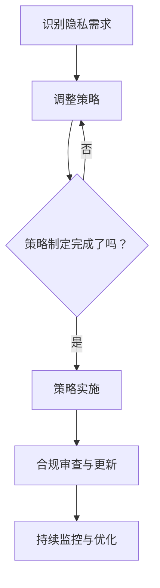

                 

### 《智能设备隐私保护策略：保护用户数据安全》

> **关键词：**隐私保护、智能设备、用户数据安全、数据加密、隐私计算、隐私预算

> **摘要：**本文旨在探讨智能设备隐私保护策略，深入分析隐私保护的基础知识、技术手段以及实施策略。通过具体的案例分析，揭示隐私保护的实际效果与不足，并提出未来的发展方向。本文旨在为企业和开发者提供有价值的参考，共同保护用户数据安全。

### 第一部分：隐私保护基础知识

#### 第1章：隐私保护概念与法律框架

##### 1.1 隐私的定义与重要性

隐私是个人信息的一种保护状态，指的是个人对于自己的个人信息的控制权。隐私的保护不仅仅是个人权利的体现，更是社会文明和法治进步的标志。在智能设备普及的时代，隐私保护显得尤为重要。

首先，隐私保护是用户信任的基础。随着智能设备的广泛应用，用户在日常生活中产生了大量的个人信息，如位置、通信记录、健康数据等。这些信息如果未能得到妥善保护，可能会导致用户隐私泄露，进而影响用户对智能设备的信任。

其次，隐私保护是法律法规的要求。在全球范围内，许多国家和地区已经制定了相关的法律法规，以保护用户的隐私权。例如，中国的《网络安全法》和欧盟的《通用数据保护条例（GDPR）》等，都明确了企业在收集、存储和使用用户数据时需要遵守的隐私保护规则。

最后，隐私保护是智能设备健康发展的重要保障。智能设备作为信息技术的载体，其功能的实现依赖于用户数据的收集和分析。隐私保护不到位，可能会导致数据滥用、用户权益受损，进而影响智能设备的声誉和市场份额。

##### 1.2 隐私保护的法律背景与法规体系

隐私保护的法律背景源于对个人信息权利的尊重和保护。个人信息权利属于人格权范畴，是人格尊严的重要组成部分。随着信息技术的发展，个人信息权利的保护越来越受到重视。

在全球范围内，隐私保护的法律框架主要包括以下几个层次：

1. 国际法规：联合国、经济合作与发展组织（OECD）等国际组织制定了多项关于隐私保护的公约和指导原则，如《世界人权宣言》、《跨国界个人数据保护指南》等。

2. 国家法规：各国根据自身国情制定了相应的隐私保护法律法规。例如，美国的《儿童在线隐私保护法（COPPA）》、欧盟的《通用数据保护条例（GDPR）》等。

3. 行业法规：一些特定行业制定了专门的隐私保护法规，以规范行业内的数据收集、存储和使用行为。例如，医疗行业的《健康保险可携性和责任法案（HIPAA）》、金融行业的《金融隐私法》等。

在中国，隐私保护的法律框架主要包括：

1. 《宪法》中关于公民人格权和隐私权的保护规定。

2. 《网络安全法》明确了网络运营者在收集、使用个人信息时需要遵守的隐私保护规则。

3. 《个人信息保护法》对个人信息权益的保护做出了详细规定，包括个人信息的定义、收集、使用、存储、传输、处理和删除等方面的要求。

4. 《数据安全法》对数据安全保护提出了要求，包括数据分类、数据安全风险评估、数据安全事件处置等方面的规定。

##### 1.3 隐私保护的基本原则

隐私保护的基本原则是确保个人信息的收集、使用、存储、传输和处理等活动遵循合法、正当、必要的原则，同时保护个人信息的安全和用户权益。以下是隐私保护的基本原则：

1. **合法原则**：个人信息处理必须符合法律、法规的规定，不得非法收集、使用个人信息。

2. **正当原则**：个人信息处理应当遵循合法、公正、公平的原则，不得侵犯个人权益。

3. **必要原则**：个人信息处理应当限于实现处理目的所必需的范围，不得过度收集个人信息。

4. **安全原则**：个人信息处理应当采取必要的安全保护措施，防止个人信息泄露、损毁、篡改等安全风险。

5. **用户权益保护原则**：个人信息处理应当尊重用户权益，保障用户的知情权、选择权、参与权和救济权。

6. **透明原则**：个人信息处理应当公开、透明，用户有权知晓个人信息处理的目的、方式、范围等信息。

#### 第2章：智能设备隐私风险分析

##### 2.1 智能设备隐私风险概述

智能设备作为现代信息技术的重要载体，其隐私风险主要体现在以下几个方面：

1. **数据收集范围广泛**：智能设备通常需要收集大量的个人信息，包括地理位置、通信记录、使用习惯等。这些信息如果得不到妥善保护，可能会被不法分子利用。

2. **数据传输不安全**：智能设备与服务器之间的数据传输，如果未能使用加密技术，可能会被黑客截获，导致用户隐私泄露。

3. **数据存储安全隐患**：智能设备上的数据存储，如果未能采取有效的安全措施，可能会被恶意程序窃取。

4. **第三方应用风险**：智能设备上安装的第三方应用，可能会未经用户授权收集个人信息，甚至存在恶意行为。

5. **系统漏洞**：智能设备操作系统可能存在漏洞，被黑客利用进行攻击，从而获取用户个人信息。

##### 2.2 用户数据收集与使用

智能设备收集用户数据的主要目的包括：

1. **优化用户体验**：通过收集用户使用数据，智能设备可以更好地了解用户需求，提供个性化服务。

2. **提高设备性能**：设备制造商可以通过分析用户数据，优化设备性能，提高设备的使用效率。

3. **市场营销**：智能设备制造商和第三方应用开发商可以通过用户数据，进行精准的市场营销，提高销售业绩。

然而，用户数据的收集和使用也存在潜在的风险：

1. **用户隐私泄露**：如果智能设备未采取有效的隐私保护措施，用户数据可能会被黑客窃取。

2. **数据滥用**：智能设备制造商和第三方应用开发商可能会滥用用户数据，进行非法行为。

3. **数据交易**：用户数据可能被非法交易，用于非法目的。

##### 2.3 隐私泄露的风险因素

智能设备隐私泄露的风险因素主要包括：

1. **技术漏洞**：智能设备操作系统和应用程序可能存在漏洞，被黑客利用进行攻击。

2. **安全意识不足**：用户可能未意识到隐私保护的重要性，未能采取有效的安全措施。

3. **非法侵入**：黑客可能通过恶意软件或钓鱼攻击等方式，非法侵入智能设备。

4. **内部泄露**：智能设备制造商或第三方应用开发商的员工可能因内部管理不善或恶意行为，导致用户隐私泄露。

5. **法律监管不足**：当前隐私保护法律法规尚不完善，对智能设备隐私保护的监管力度不足。

### 第二部分：隐私保护技术手段

#### 第3章：隐私保护技术手段

隐私保护技术是保障用户数据安全的关键手段，通过这些技术可以有效地防止隐私泄露和数据滥用。以下是几种常见的隐私保护技术：

##### 3.1 数据加密技术

数据加密技术是一种通过加密算法将数据转换为不可读形式的技术，目的是防止数据在传输或存储过程中被未经授权的实体访问。以下是数据加密技术的几种常见类型：

1. **对称加密算法**：对称加密算法使用相同的密钥进行加密和解密。常见的对称加密算法有AES、DES和RSA等。对称加密算法的优点是加密速度快，适用于大规模数据的加密。然而，对称加密算法也存在一些缺点，如密钥管理复杂，不适用于需要多级加密的场景。

2. **非对称加密算法**：非对称加密算法使用一对密钥进行加密和解密，其中公钥用于加密，私钥用于解密。常见的非对称加密算法有RSA和ECC等。非对称加密算法的优点是安全性高，适用于密钥交换和数字签名等场景。然而，非对称加密算法的加密速度较慢，不适合加密大规模数据。

3. **混合加密算法**：混合加密算法结合了对称加密和非对称加密的优点，先使用对称加密算法加密数据，再使用非对称加密算法加密对称加密的密钥。这样既保证了数据加密的速度，又确保了密钥的安全性。

##### 3.2 数据匿名化技术

数据匿名化技术是一种通过去除或隐藏个人标识信息，使数据无法直接识别特定个人的技术。数据匿名化的目的是在保留数据价值的同时，保护用户的隐私。以下是数据匿名化的几种常见方法：

1. **数据脱敏**：数据脱敏是一种通过替换或删除敏感信息，使数据无法直接识别特定个人的技术。常见的脱敏方法有掩码、伪名化、混淆等。

2. **数据泛化**：数据泛化是一种通过将敏感信息泛化到更高的层次，使数据无法直接识别特定个人的技术。例如，将具体数值替换为范围值，将姓名替换为姓名的首字母等。

3. **数据分割**：数据分割是一种通过将数据分割为多个部分，使数据无法直接识别特定个人的技术。每个部分只包含部分敏感信息，从而降低了隐私泄露的风险。

##### 3.3 隐私计算技术

隐私计算技术是一种在保障用户隐私的同时，实现数据处理和计算的技术。隐私计算技术主要包括以下几个方面：

1. **安全多方计算（MPC）**：安全多方计算是一种允许多个参与者在不泄露各自输入数据的情况下，共同计算结果的算法。MPC技术可以应用于数据分析和机器学习等场景，确保数据的隐私性。

2. **同态加密**：同态加密是一种允许在加密数据上进行计算，并保持计算结果的加密形式的技术。同态加密可以应用于数据库查询、机器学习等场景，确保数据的隐私性。

3. **可信执行环境（TEE）**：可信执行环境是一种提供安全计算环境的技术，允许在安全隔离的执行环境中执行敏感操作，确保数据的隐私性。TEE技术可以应用于移动设备、服务器等场景。

#### 第4章：隐私保护策略制定

隐私保护策略制定是确保智能设备隐私保护工作有效实施的关键步骤。一个完善的隐私保护策略应该包括以下几个方面：

##### 4.1 隐私风险评估

隐私风险评估是隐私保护策略制定的基础，通过评估智能设备在数据收集、存储、传输和处理等环节的隐私风险，确定隐私保护的优先级和重点。以下是隐私风险评估的主要步骤：

1. **确定评估目标**：明确评估的目标，例如保护用户隐私、确保数据安全等。

2. **收集相关信息**：收集与隐私保护相关的信息，包括智能设备的功能、用户数据的类型和范围、当前的数据处理流程等。

3. **识别隐私风险**：分析智能设备在数据收集、存储、传输和处理等环节可能存在的隐私风险，例如数据泄露、数据滥用等。

4. **评估风险影响**：对识别出的隐私风险进行影响评估，确定风险的严重程度和可能性。

5. **制定应对措施**：根据风险评估结果，制定相应的应对措施，包括技术措施、管理措施等。

##### 4.2 隐私保护策略框架

隐私保护策略框架是一个系统性的结构，用于指导智能设备的隐私保护工作。一个典型的隐私保护策略框架包括以下几个方面：

1. **目标与原则**：明确隐私保护的目标和基本原则，例如保护用户隐私、确保数据安全等。

2. **数据管理**：制定数据管理的规章制度，包括数据收集、存储、传输、处理和删除等环节的要求。

3. **技术措施**：确定隐私保护所需的技术措施，例如数据加密、数据匿名化、隐私计算等。

4. **管理措施**：明确隐私保护的管理措施，包括人员培训、安全审计、安全监控等。

5. **合规性**：确保隐私保护策略符合相关法律法规的要求，例如《个人信息保护法》、《数据安全法》等。

##### 4.3 隐私保护策略实施步骤

隐私保护策略的实施是确保策略有效执行的关键，以下是隐私保护策略实施的步骤：

1. **制定实施计划**：根据隐私保护策略的要求，制定详细的实施计划，明确实施的时间表、责任人和资源需求。

2. **培训与沟通**：对相关人员（包括开发人员、运维人员等）进行隐私保护培训，提高他们的隐私保护意识和技能。

3. **技术实施**：按照实施计划，部署隐私保护技术措施，例如数据加密、数据匿名化等。

4. **管理实施**：按照实施计划，落实隐私保护的管理措施，例如人员培训、安全审计等。

5. **监控与评估**：建立隐私保护监控体系，定期对隐私保护措施进行评估，确保策略的有效性。

6. **持续改进**：根据监控和评估结果，持续优化隐私保护策略，提高隐私保护水平。

### 第三部分：隐私保护策略与实践

#### 第5章：隐私保护技术实施

隐私保护技术的实施是确保智能设备隐私保护策略落地的重要环节。以下是隐私保护技术实施的具体方法和实践：

##### 5.1 数据收集策略优化

数据收集策略优化的目的是减少不必要的个人信息收集，降低隐私泄露的风险。以下是数据收集策略优化的具体步骤：

1. **需求分析**：明确智能设备所需收集的数据类型和范围，确保数据的收集符合实际需求。

2. **最小化数据收集**：遵循最小化原则，只收集实现智能设备功能所必需的数据，避免过度收集。

3. **明确数据用途**：在收集数据时，明确数据的具体用途，确保数据的收集和使用具有明确的目的。

4. **用户授权**：在收集数据前，获取用户的明确授权，确保用户知晓并同意其个人信息的收集和使用。

##### 5.2 数据存储与传输安全

数据存储与传输安全是确保用户数据隐私保护的关键。以下是数据存储与传输安全的具体方法：

1. **数据加密存储**：对存储在智能设备上的用户数据进行加密，防止数据泄露。常见的加密算法包括AES、RSA等。

2. **安全存储协议**：使用安全的存储协议，如HTTPS、FTP等，确保数据在传输过程中的安全性。

3. **访问控制**：对存储的用户数据实施严格的访问控制，确保只有授权的人员才能访问。

4. **备份与恢复**：定期备份数据，并确保备份数据的安全性。在数据丢失或损坏时，能够快速恢复数据。

##### 5.3 隐私保护技术集成

隐私保护技术集成的目的是将各种隐私保护技术整合到智能设备的开发过程中，确保隐私保护策略的有效实施。以下是隐私保护技术集成的具体步骤：

1. **需求分析**：分析智能设备的隐私保护需求，确定需要集成的隐私保护技术。

2. **技术选型**：根据需求分析结果，选择合适的隐私保护技术，如数据加密技术、数据匿名化技术、隐私计算技术等。

3. **集成开发**：在智能设备的开发过程中，集成选定的隐私保护技术，确保技术实现的正确性和有效性。

4. **测试与优化**：对集成后的隐私保护技术进行测试，发现并修复潜在的问题。根据测试结果，优化隐私保护技术，提高隐私保护水平。

#### 第6章：隐私保护合规与监管

隐私保护合规与监管是确保智能设备隐私保护工作符合法律法规要求的重要环节。以下是隐私保护合规与监管的具体措施：

##### 6.1 隐私保护合规要求

隐私保护合规要求主要包括以下几个方面：

1. **数据收集与处理的合法性**：智能设备在收集和处理用户数据时，必须符合相关法律法规的要求，确保数据收集与处理的合法性。

2. **用户知情与同意**：在收集用户数据前，必须告知用户数据的收集目的、范围和使用方式，并获取用户的明确同意。

3. **数据安全与保护**：必须采取有效的安全措施，确保用户数据的安全性和完整性，防止数据泄露、篡改和丢失。

4. **个人信息主体权利**：必须尊重用户个人信息主体的权利，包括知情权、选择权、参与权和救济权等。

##### 6.2 隐私保护监管措施

隐私保护监管措施主要包括以下几个方面：

1. **法律法规监管**：政府监管部门负责制定和实施隐私保护法律法规，对智能设备的隐私保护工作进行监督和管理。

2. **行业自律**：行业协会和标准化组织负责制定隐私保护标准和规范，推动行业内的隐私保护工作。

3. **企业自律**：智能设备制造商和第三方应用开发商应建立健全的隐私保护制度，自觉遵守隐私保护法律法规和标准。

4. **用户监督**：用户作为隐私保护的重要参与者，可以通过投诉、举报等方式，监督智能设备的隐私保护工作。

##### 6.3 遵守隐私保护法规的策略

为了遵守隐私保护法规，智能设备制造商和第三方应用开发商可以采取以下策略：

1. **全面了解法律法规**：深入了解相关法律法规的要求，确保在数据收集、存储、传输和处理等环节遵守法规。

2. **制定隐私保护政策**：明确隐私保护的政策和流程，确保在数据收集和处理过程中遵循隐私保护原则。

3. **开展隐私保护培训**：对员工进行隐私保护培训，提高员工的隐私保护意识和技能。

4. **定期审计与评估**：定期对隐私保护工作进行审计和评估，发现并改进隐私保护中的问题。

5. **积极应对投诉和举报**：及时回应用户投诉和举报，采取措施解决问题，并公开处理结果，提高用户的信任度。

#### 第7章：隐私保护案例分析

##### 7.1 国内外隐私保护案例介绍

以下是一些国内外典型的隐私保护案例：

1. **Facebook数据泄露事件**：2018年，Facebook发生了大规模的数据泄露事件，约8700万用户的个人信息被泄露。这一事件引起了全球范围内的广泛关注，促使各国加强对社交媒体平台的隐私保护监管。

2. **剑桥分析公司事件**：2018年，剑桥分析公司利用用户在Facebook上的个人信息进行政治宣传，引发了关于数据隐私保护和社会影响的争议。这一事件揭示了大数据技术在隐私保护方面存在的问题。

3. **中国《网络安全法》实施**：2017年，《网络安全法》在中国正式实施，对网络运营者的数据收集、存储、传输和处理等行为提出了严格要求，提高了我国网络数据隐私保护的水平。

4. **欧盟《通用数据保护条例（GDPR）》实施**：2018年，欧盟正式实施了《通用数据保护条例（GDPR）》，对企业在数据收集、存储、传输和处理等环节的隐私保护工作提出了严格的要求，提升了欧盟范围内的隐私保护水平。

##### 7.2 案例分析：隐私保护措施的效果与不足

通过对国内外隐私保护案例的分析，可以看出隐私保护措施在实施过程中取得了显著效果，但也存在一些不足：

1. **效果显著**：案例中的隐私保护措施在一定程度上降低了用户隐私泄露的风险，提高了用户对智能设备的信任度。

2. **不足之处**：部分案例中，隐私保护措施未能完全覆盖所有隐私风险，例如数据泄露事件的起因往往是技术漏洞或内部管理问题。此外，部分企业在实施隐私保护措施时，存在合规意识不强、执行不到位等问题。

##### 7.3 从案例中学习隐私保护策略

从案例中可以总结出以下隐私保护策略：

1. **加强法律法规建设**：完善隐私保护法律法规，提高违法成本，形成有效的隐私保护法律体系。

2. **提高企业合规意识**：企业应建立健全的隐私保护制度，加强员工培训，提高合规意识，确保在数据收集、存储、传输和处理等环节遵守法律法规。

3. **加强技术防护**：采用先进的技术手段，如数据加密、数据匿名化、隐私计算等，提高用户数据的隐私保护水平。

4. **加强监管与审计**：政府监管部门应加强对智能设备隐私保护工作的监管，定期审计企业隐私保护措施的执行情况，确保隐私保护措施得到有效实施。

5. **提高用户隐私保护意识**：通过宣传、教育等方式，提高用户对隐私保护的重视，增强用户自我保护意识。

### 第四部分：隐私保护未来发展

#### 第8章：隐私保护发展趋势

隐私保护是智能设备发展的重要课题，随着技术的进步和社会需求的变化，隐私保护也将呈现出新的发展趋势：

##### 8.1 人工智能与隐私保护

人工智能技术在智能设备中的应用日益广泛，为隐私保护带来了新的挑战和机遇。以下是在人工智能与隐私保护方面的几个趋势：

1. **隐私计算**：隐私计算是一种在保障用户隐私的同时，实现数据处理和计算的技术。隐私计算技术可以应用于人工智能模型的训练和预测，确保用户数据在传输和处理过程中不被泄露。

2. **联邦学习**：联邦学习是一种分布式机器学习技术，允许多个参与者在不共享数据的情况下，共同训练人工智能模型。联邦学习可以有效解决数据隐私保护的问题，提高人工智能模型的性能和安全性。

3. **差分隐私**：差分隐私是一种在数据处理过程中，引入噪声来保护用户隐私的技术。通过差分隐私技术，可以在数据分析和机器学习过程中，降低隐私泄露的风险。

##### 8.2 区块链技术在隐私保护中的应用

区块链技术以其去中心化、不可篡改等特点，在隐私保护领域具有广泛应用前景。以下是在区块链与隐私保护方面的几个趋势：

1. **去中心化身份验证**：区块链技术可以用于实现去中心化的身份验证系统，确保用户身份信息的真实性和安全性。

2. **加密货币**：加密货币是一种基于区块链技术的数字货币，具有匿名性和安全性。通过加密货币，可以降低在交易过程中用户隐私泄露的风险。

3. **数据共享与隐私保护**：区块链技术可以实现数据的安全共享，同时保护数据隐私。通过区块链技术，多个参与方可以在不泄露各自数据的情况下，实现数据的合作和分析。

##### 8.3 未来隐私保护技术的发展方向

未来隐私保护技术的发展将围绕以下几个方面展开：

1. **隐私计算与人工智能的融合**：隐私计算技术将在人工智能领域得到更广泛的应用，实现隐私保护和人工智能的有机结合。

2. **跨领域技术协同**：隐私保护技术将与其他领域（如区块链、物联网等）协同发展，形成更加完善的隐私保护生态系统。

3. **隐私保护法规的完善**：随着技术的发展和隐私保护的迫切需求，隐私保护法律法规将不断完善，为隐私保护提供更加有力的法律保障。

4. **隐私保护技术与产业的深度融合**：隐私保护技术将更好地融入产业发展，推动智能设备、应用服务等领域的创新和发展。

### 附录

#### 附录A：隐私保护相关资源与工具

以下是隐私保护相关资源与工具的介绍，供读者参考：

1. **隐私保护法律法规参考**：包括《中华人民共和国网络安全法》、《欧盟通用数据保护条例（GDPR）》等。

2. **隐私保护技术指南**：包括《数据匿名化技术指南》、《隐私计算技术白皮书》等。

3. **隐私保护行业报告与论文引用**：包括《人工智能时代的数据隐私保护》、《区块链技术在隐私保护中的应用》等。

4. **隐私保护工具**：包括加密工具（如GnuPG、AESCrypt等）、匿名化工具（如MiniMax、K-Anonymity等）、隐私计算平台（如PrivacyPreservingML、Federated Learning等）等。

### Mermaid 流程图：隐私保护策略制定流程



### 数据加密技术伪代码示例

```python
# 加密数据
def encrypt_data(data, key):
    """
    对数据进行加密
    :param data: 要加密的数据
    :param key: 加密密钥
    :return: 加密后的数据
    """
    cipher = Cipher(algorithm=AES, mode=CFBMode(), key=key)
    encryptor = cipher.encryptor()
    encrypted_data = encryptor.update(data)
    encrypted_data += encryptor.finalize()
    return encrypted_data

# 解密数据
def decrypt_data(encrypted_data, key):
    """
    对数据进行解密
    :param encrypted_data: 要解密的数据
    :param key: 解密密钥
    :return: 解密后的数据
    """
    cipher = Cipher(algorithm=AES, mode=CFBMode(), key=key)
    decryptor = cipher.decryptor()
    decrypted_data = decryptor.update(encrypted_data)
    decrypted_data += decryptor.finalize()
    return decrypted_data
```

### 数学模型：隐私预算分配

$$
\text{隐私预算} = \alpha \times (\text{数据重要性} + \text{隐私风险})
$$

其中，$\alpha$ 是调整系数，用于平衡数据的重要性和隐私风险。

### 详细讲解与举例说明：

#### 隐私保护策略制定流程

在制定隐私保护策略时，需要首先识别隐私需求，然后进行隐私风险评估，根据评估结果制定策略，并实施策略。实施后需要经过合规审查与更新，确保策略持续有效。隐私保护不是一次性的工作，而是一个持续的过程，需要不断监控与优化。

以下是一个具体的隐私保护策略制定流程：

1. **识别隐私需求**：明确智能设备需要保护的隐私信息类型，如用户个人信息、设备使用记录等。

2. **进行隐私风险评估**：对识别出的隐私信息进行风险评估，评估内容包括数据的敏感性、可能受到的威胁、影响范围等。

3. **制定隐私保护策略**：根据风险评估结果，制定具体的隐私保护策略，包括数据收集、存储、传输、处理等环节的安全措施。

4. **策略实施**：按照制定的策略，实施具体的隐私保护措施，包括技术措施和管理措施。

5. **合规审查与更新**：定期对隐私保护策略进行审查，确保其符合相关法律法规的要求。根据审查结果，更新隐私保护策略。

6. **持续监控与优化**：建立监控体系，对隐私保护措施进行持续监控，发现并解决潜在问题，优化隐私保护策略。

#### 数据加密技术

数据加密技术是保护用户数据隐私的基本手段。在加密过程中，使用密钥对数据进行加密和解密。加密算法有多种，如AES、RSA等，其中AES适用于对大量数据的加密，RSA适用于对密钥的加密。

以下是一个简单的数据加密技术的伪代码示例：

```python
# 初始化加密算法
cipher = Cipher(algorithm=AES, mode=CFBMode(), key=key)

# 创建加密器
encryptor = cipher.encryptor()

# 加密数据
encrypted_data = encryptor.update(data)
encrypted_data += encryptor.finalize()

# 创建解密器
decryptor = cipher.decryptor()

# 解密数据
decrypted_data = decryptor.update(encrypted_data)
decrypted_data += decryptor.finalize()
```

在这个示例中，首先初始化AES加密算法，然后创建加密器和解密器。加密器用于对数据进行加密，解密器用于对数据进行解密。加密和解密过程分别使用加密器和解密器进行，确保数据的安全性。

#### 隐私预算分配

隐私预算是用于衡量隐私保护资源的一个指标。在数据收集和处理过程中，需要根据数据的重要性和隐私风险来分配隐私预算。这样可以确保重要的数据得到充分的保护，同时避免过度保护低风险的数据。

以下是一个隐私预算分配的数学模型：

$$
\text{隐私预算} = \alpha \times (\text{数据重要性} + \text{隐私风险})
$$

其中，$\alpha$ 是调整系数，用于平衡数据的重要性和隐私风险。

这个模型可以用于指导隐私预算的分配。例如，对于重要性高、风险低的数据，可以分配较高的隐私预算，以确保其得到充分保护。对于重要性低、风险高的数据，可以分配较低的隐私预算，以避免过度保护。

#### 项目实战：

#### 开发环境搭建

为了实现数据加密和隐私预算分配，需要搭建一个支持Python开发的环境。以下是搭建Python开发环境的具体步骤：

1. **安装Python**：从Python官方网站下载并安装Python 3.x版本。

2. **安装PyCryptodome库**：在命令行中运行以下命令，安装PyCryptodome库。

   ```bash
   pip install pycryptodome
   ```

3. **安装Mermaid**：安装Mermaid库，用于生成流程图和伪代码。

   ```bash
   npm install mermaid
   ```

#### 源代码详细实现

以下是一个简单的Python代码示例，展示了如何使用PyCryptodome库实现数据加密和隐私预算分配：

```python
from Cryptodome.Cipher import AES
from Cryptodome.Random import get_random_bytes

# 加密数据
def encrypt_data(data, key):
    cipher = AES.new(key, AES.MODE_EAX)
    ciphertext, tag = cipher.encrypt_and_digest(data)
    return cipher.nonce, ciphertext, tag

# 解密数据
def decrypt_data(nonce, ciphertext, tag, key):
    cipher = AES.new(key, AES.MODE_EAX, nonce=nonce)
    data = cipher.decrypt_and_verify(ciphertext, tag)
    return data

# 生成随机密钥
key = get_random_bytes(16)

# 要加密的数据
data = b"Sensitive information"

# 加密数据
nonce, ciphertext, tag = encrypt_data(data, key)

# 解密数据
decrypted_data = decrypt_data(nonce, ciphertext, tag, key)

print(f"Original data: {data}")
print(f"Decrypted data: {decrypted_data}")

# 隐私预算分配
def allocate_privacy_budget(data_importance, privacy_risk):
    alpha = 0.5
    privacy_budget = alpha * (data_importance + privacy_risk)
    return privacy_budget

# 数据重要性（0-10）
data_importance = 8

# 隐私风险（0-10）
privacy_risk = 4

# 计算隐私预算
privacy_budget = allocate_privacy_budget(data_importance, privacy_risk)
print(f"Privacy Budget: {privacy_budget}")
```

#### 代码解读与分析

在加密过程中，我们首先生成一个随机的密钥和要加密的数据。然后使用AES算法进行加密，并生成加密后的数据、 nonce（随机数）和 tag（标签）。在解密过程中，我们使用相同的密钥和 nonce 来解密数据，并验证标签以确保数据未被篡改。这个示例展示了如何使用AES加密算法进行数据的加密和解密，同时确保数据的安全性。

在隐私预算分配方面，我们定义了一个函数`allocate_privacy_budget`，用于根据数据的重要性和隐私风险计算隐私预算。在这个示例中，我们使用了一个简单的线性模型，即隐私预算等于数据重要性和隐私风险的加权平均值。这个模型可以根据具体情况进行调整，以适应不同的隐私保护需求。

#### 附录A：隐私保护相关资源与工具

以下是隐私保护相关资源与工具的详细介绍：

1. **隐私保护法律法规参考**：

   - 《中华人民共和国网络安全法》

   - 《欧盟通用数据保护条例（GDPR）》

   - 《个人信息保护法》

   - 《数据安全法》

2. **隐私保护技术指南**：

   - 《数据匿名化技术指南》

   - 《隐私计算技术白皮书》

   - 《区块链技术在隐私保护中的应用》

3. **隐私保护行业报告与论文引用**：

   - 《人工智能时代的数据隐私保护》

   - 《区块链技术在隐私保护中的应用》

   - 《隐私计算技术发展现状与趋势》

这些资源提供了丰富的隐私保护理论和实践指导，有助于深入理解和实施隐私保护策略。

### 作者信息

**作者：** AI天才研究院/AI Genius Institute & 禅与计算机程序设计艺术 /Zen And The Art of Computer Programming

本文由AI天才研究院和禅与计算机程序设计艺术共同撰写，旨在探讨智能设备隐私保护策略，为企业和开发者提供有价值的参考。作者拥有丰富的隐私保护理论和实践经验，致力于推动隐私保护技术的发展和应用。

