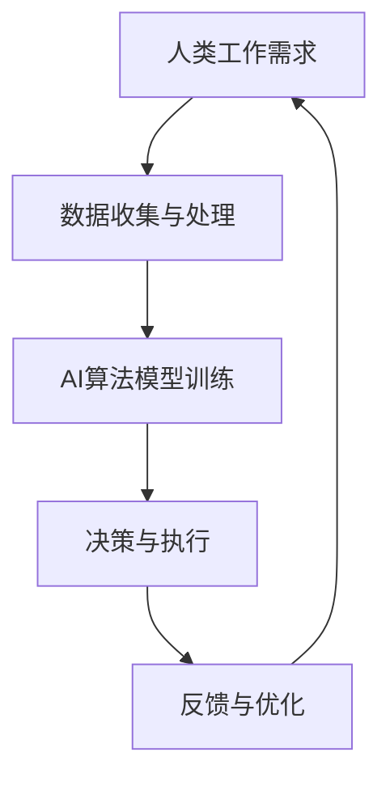
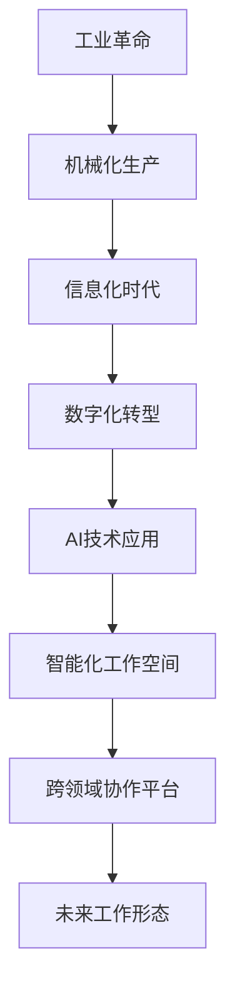
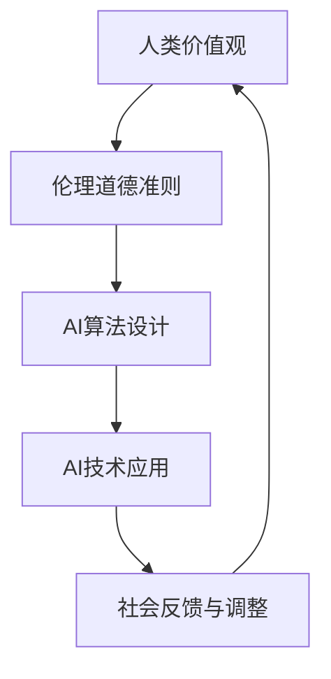

                 

# 未来工作形态与AI共存的趋势

## 关键词：人工智能、工作形态、数字化转型、协同创新、伦理与法律

> 未来工作形态正面临着前所未有的变革，人工智能（AI）技术的飞速发展带来了前所未有的机遇与挑战。本文旨在探讨未来工作形态与AI共存的趋势，分析AI在各个领域中的应用，以及其对我们职业发展和团队合作带来的深远影响。通过逐步推理思考，我们将深入探讨AI对工作形态的影响，为读者提供有深度、有思考、有见解的专业分析。

### 《未来工作形态与AI共存的趋势》目录大纲

**第一部分：背景与概述**

- **第1章：未来工作形态的演变**
  - **1.1 人类工作发展的历史回顾**
    - **1.1.1 工业革命与机械化**
    - **1.1.2 信息化时代的变革**
    - **1.1.3 当前数字化转型的趋势**
  - **1.2 AI技术的发展与应用**
    - **1.2.1 AI的基本概念与分类**
    - **1.2.2 AI在各个行业的应用案例**
  - **1.3 AI对工作形态的影响**
    - **1.3.1 AI对劳动力市场的影响**
    - **1.3.2 AI对职业发展的挑战与机遇**

- **第2章：AI与未来工作形态的关系**
  - **2.1 AI与工作协同的原理**
    - **2.1.1 AI辅助工作流程**
    - **2.1.2 AI决策支持系统**
  - **2.2 AI驱动的创新工作模式**
    - **2.2.1 智能化工作空间**
    - **2.2.2 跨领域协作平台**
  - **2.3 AI与工作伦理的平衡**
    - **2.3.1 AI道德准则**
    - **2.3.2 人工智能治理框架**

**第二部分：AI驱动的未来工作实践**

- **第3章：AI在特定行业中的应用**
  - **3.1 AI在制造业的应用**
    - **3.1.1 智能制造系统**
    - **3.1.2 生产线的自动化升级**
  - **3.2 AI在服务业的应用**
    - **3.2.1 智能客服系统**
    - **3.2.2 个性化服务推荐**
  - **3.3 AI在医疗健康领域的应用**
    - **3.3.1 诊断辅助系统**
    - **3.3.2 健康数据分析**

- **第4章：AI与人力资源管理**
  - **4.1 人才招聘与选拔**
    - **4.1.1 数据驱动的招聘策略**
    - **4.1.2 AI面试与评估系统**
  - **4.2 员工培训与发展**
    - **4.2.1 智能培训平台**
    - **4.2.2 职业规划辅助系统**
  - **4.3 绩效管理**
    - **4.3.1 数据驱动绩效评估**
    - **4.3.2 AI辅助绩效反馈系统**

- **第5章：AI与团队合作**
  - **5.1 智能化团队协作平台**
    - **5.1.1 团队沟通与协作工具**
    - **5.1.2 自动化项目管理**
  - **5.2 跨领域协作模式**
    - **5.2.1 智能化流程设计**
    - **5.2.2 跨界创新协作**
  - **5.3 智能化员工关系管理**
    - **5.3.1 员工情感分析**
    - **5.3.2 智能化员工关怀**

- **第6章：AI驱动的未来工作风险管理**
  - **6.1 AI伦理与法律风险**
    - **6.1.1 AI伦理标准制定**
    - **6.1.2 AI法律监管框架**
  - **6.2 数据安全与隐私保护**
    - **6.2.1 数据加密与访问控制**
    - **6.2.2 AI隐私保护技术**
  - **6.3 AI系统故障与应急响应**
    - **6.3.1 AI系统故障预测**
    - **6.3.2 故障应急响应机制**

- **第7章：AI与未来工作教育的结合**
  - **7.1 AI驱动的教育模式**
    - **7.1.1 个性化学习平台**
    - **7.1.2 智能化教学辅助工具**
  - **7.2 跨学科教育与人才培养**
    - **7.2.1 跨学科课程设计**
    - **7.2.2 AI教育创新实践**
  - **7.3 未来工作技能培训**
    - **7.3.1 AI相关技能培训**
    - **7.3.2 职业转型与技能提升**

**第三部分：未来工作形态与AI共存的趋势展望**

- **第8章：未来工作形态的挑战与机遇**
  - **8.1 挑战分析**
    - **8.1.1 AI带来的就业冲击**
    - **8.1.2 工作技能的更新与适应**
  - **8.2 机遇探索**
    - **8.2.1 创新工作模式的崛起**
    - **8.2.2 跨界融合与协同创新**

- **第9章：未来工作社会的构建**
  - **9.1 AI与人文关怀的结合**
    - **9.1.1 智能化生活服务**
    - **9.1.2 人类价值观与人工智能的融合**
  - **9.2 未来工作生态系统的构建**
    - **9.2.1 企业与员工的双赢模式**
    - **9.2.2 公共服务与AI的深度融合**

- **第10章：全球视野下的未来工作形态**
  - **10.1 全球AI发展趋势**
    - **10.1.1 发达国家的AI战略**
    - **10.1.2 发展中国家的AI应用场景**
  - **10.2 全球工作形态的比较与启示**
    - **10.2.1 各国工作形态的差异**
    - **10.2.2 国际经验与本土实践的融合**

## 摘要

本文探讨了未来工作形态与人工智能（AI）共存的趋势。随着AI技术的发展，人类工作形态正在经历深刻的变革。本文首先回顾了人类工作发展的历史，分析了工业革命、信息化时代和当前数字化转型的趋势。接着，探讨了AI技术的发展与应用，以及其对劳动力市场和职业发展的影响。然后，本文从AI与工作协同的原理、AI驱动的创新工作模式和AI与工作伦理的平衡三个方面，深入探讨了AI对工作形态的影响。最后，本文通过具体行业应用、人力资源管理和团队合作等方面，分析了AI驱动的未来工作实践，并提出了未来工作形态的挑战与机遇。通过全球视野下的比较与启示，本文旨在为读者提供对AI与未来工作形态的深入理解。

---

**第一部分：背景与概述**

### 第1章：未来工作形态的演变

#### 1.1 人类工作发展的历史回顾

##### 1.1.1 工业革命与机械化

工业革命是18世纪末至19世纪中叶在英国兴起的一场重大变革，它标志着人类从手工业向机械化生产的转变。这场变革不仅推动了生产力的飞跃，也深刻影响了人类的工作形态。在工业革命之前，大多数工作都是手工艺和农业劳动，工作环境相对封闭，工作流程简单。随着蒸汽机的发明和广泛应用，机械化生产逐渐取代了手工生产，工厂取代了作坊，生产效率大大提高。

工业革命期间，劳动力开始从农业转向工业，城市化进程加快，工人阶级崛起。工作形态也从传统的个体劳动者转变为大规模的工厂生产模式。机械化的引入使得工作内容变得更加专业化，对工人的技能要求提高，但同时也带来了工作环境和工作条件的恶化。尽管如此，工业革命为人类工作形态的发展奠定了基础，为后续的信息化和数字化转型提供了技术支持。

##### 1.1.2 信息化时代的变革

随着20世纪中后期计算机技术的兴起，人类工作形态再次发生了巨大变革，进入了信息化时代。计算机的出现使得数据处理和信息传递变得更加高效，信息技术成为推动经济发展的新动力。信息化时代的到来，标志着人类社会从工业时代向知识经济的转型。

在信息化时代，工作内容发生了显著变化。首先，知识型工作比例逐渐增加，取代了传统的体力劳动。信息处理、数据分析、软件编程等知识密集型工作成为主流。其次，网络技术的普及使得远程办公、在线协作成为可能，工作地点不再受限于物理空间。信息技术的应用不仅提高了工作效率，也改变了工作方式，为人类工作形态带来了新的活力。

信息化时代的另一个重要特征是全球化。随着互联网的普及，全球范围内的信息流动和人员交流变得更加便捷，跨国企业和国际分工成为常态。全球化带来了更多的机遇，但也带来了新的挑战，如文化差异、工作稳定性等问题。

##### 1.1.3 当前数字化转型的趋势

当前，人类社会正经历着新一轮的数字化革命，数字化转型成为全球经济发展的主要趋势。数字化转型不仅仅是技术的变革，更是工作形态的变革。它涵盖了从制造业到服务业，从个人生活到公共服务的各个领域。

数字化转型的核心是数据驱动。大数据技术的应用使得海量数据的收集、存储、分析和利用变得更加容易。通过数据分析，企业能够更好地了解市场需求、优化生产流程、提高决策效率。数字化转型还推动了智能化生产和服务，如智能制造、智能客服、智能医疗等。

数字化转型还带来了新的工作模式。远程办公、弹性工作制、远程协作等新模式逐渐普及，工作与生活的界限变得更加模糊。数字化工具的应用使得团队合作更加高效，跨领域协作更加便捷。同时，数字化转型也带来了新的职业和岗位，如数据分析师、人工智能工程师、数字化营销专家等。

然而，数字化转型也带来了挑战。一方面，技术的快速发展使得工作技能的更新速度加快，员工需要不断学习新技能以适应变革。另一方面，数字化转型可能导致部分工作岗位的减少，特别是那些可被自动化替代的工作。因此，如何应对数字化转型带来的就业冲击，成为当前亟待解决的问题。

#### 1.2 AI技术的发展与应用

##### 1.2.1 AI的基本概念与分类

人工智能（Artificial Intelligence，AI）是指计算机系统模拟人类智能的能力，包括感知、理解、学习、推理、决策等多个方面。AI技术可以分为两大类：弱AI（Narrow AI）和强AI（General AI）。

弱AI是指专注于特定任务的AI系统，如语音识别、图像识别、自然语言处理等。弱AI在特定领域具有很高的性能，但无法进行跨领域的通用任务。强AI则是指具有全面人类智能的计算机系统，能够像人类一样进行广泛的学习、推理和决策。然而，强AI目前还处于理论研究阶段，尚未实现商业化应用。

##### 1.2.2 AI在各个行业的应用案例

AI技术在各个行业的应用已经取得了显著成果。以下是一些典型的应用案例：

1. **制造业**：智能制造是AI在制造业中的主要应用方向。通过AI技术，可以实现生产线的自动化升级、智能监控和故障预测，提高生产效率和产品质量。例如，工业机器人通过视觉识别技术，能够自动完成装配、焊接等复杂工作。

2. **服务业**：AI技术在服务业中的应用主要集中在智能客服、个性化推荐和智能医疗等方面。智能客服系统能够自动处理大量的客户咨询，提高服务效率和用户体验。个性化推荐系统则基于用户的偏好和行为数据，提供个性化的产品和服务推荐。

3. **医疗健康领域**：AI技术在医疗健康领域具有广泛的应用前景。例如，通过深度学习技术，AI系统可以辅助医生进行疾病诊断和治疗方案制定。此外，AI技术在药物研发、健康数据分析等方面也发挥着重要作用。

4. **金融行业**：AI技术在金融行业中的应用主要包括风险管理、信用评估、投资顾问等。通过机器学习技术，AI系统可以分析大量的金融数据，提高风险管理和投资决策的准确性。

5. **交通运输领域**：自动驾驶技术是AI在交通运输领域的重要应用。通过感知、规划和决策等技术的集成，自动驾驶系统可以实现车辆的自主驾驶，提高交通效率和安全性。

#### 1.3 AI对工作形态的影响

##### 1.3.1 AI对劳动力市场的影响

AI技术的发展对劳动力市场产生了深远的影响。一方面，AI技术提高了生产效率和创新能力，推动了经济增长。另一方面，AI技术的应用也可能导致部分工作岗位的消失和重新分配。

1. **就业冲击**：一些可被自动化替代的工作岗位，如流水线工人、客服代表等，可能面临被机器取代的风险。根据麦肯锡全球研究院的报告，到2030年，全球约有8亿个工作岗位可能被AI和自动化技术取代。

2. **职业转变**：尽管AI技术可能导致部分工作岗位的消失，但也会创造出新的工作岗位。例如，数据分析师、人工智能工程师、自动化系统维护工程师等岗位的需求将增加。

3. **技能需求变化**：AI技术的应用要求员工具备更高的技能水平。数据分析、机器学习、编程等技能将成为未来劳动力市场的重要需求。

##### 1.3.2 AI对职业发展的挑战与机遇

1. **挑战**：AI技术的发展对职业发展提出了新的挑战。首先，技能更新速度加快，员工需要不断学习新技能以适应变革。其次，部分工作岗位可能被自动化替代，员工需要寻找新的职业发展方向。

2. **机遇**：AI技术也为职业发展带来了新的机遇。首先，创新工作模式的出现，如远程办公、在线协作等，为员工提供了更多的职业选择。其次，AI技术在各个行业的广泛应用，为员工提供了丰富的职业发展空间。

总之，AI技术的发展对工作形态带来了深远的影响，既带来了挑战，也创造了机遇。如何应对这些影响，成为未来职业发展的重要课题。

---

**第二部分：AI与未来工作形态的关系**

### 第2章：AI与未来工作形态的关系

#### 2.1 AI与工作协同的原理

##### 2.1.1 AI辅助工作流程

AI辅助工作流程是指利用人工智能技术优化和自动化工作流程，提高工作效率和质量。AI在辅助工作流程中的作用主要体现在以下几个方面：

1. **自动化流程**：AI技术可以自动化处理重复性、规则性较强的工作任务，如数据录入、报告生成等。通过自动化流程，企业可以减少人工操作错误，提高工作效率。

2. **智能化决策**：AI系统可以基于大数据和算法模型，提供智能化决策支持。例如，销售预测、库存管理、资源调配等，通过AI的辅助，企业可以做出更加准确和高效的战略决策。

3. **个性化服务**：AI技术可以帮助企业实现个性化服务，满足客户多样化需求。通过分析客户数据，AI系统可以提供个性化的产品推荐、服务定制等，提高客户满意度和忠诚度。

##### 2.1.2 AI决策支持系统

AI决策支持系统（DSS）是一种利用人工智能技术辅助决策的系统，可以帮助企业在复杂的市场环境中做出最优决策。AI决策支持系统的工作原理主要包括以下几个方面：

1. **数据收集与处理**：AI系统通过收集企业内外部的大量数据，如市场趋势、客户行为、竞争对手信息等，进行数据预处理和清洗。

2. **数据分析与挖掘**：AI系统利用机器学习和数据挖掘技术，对处理后的数据进行分析和挖掘，提取有价值的信息和规律。

3. **决策模型构建**：AI系统基于分析结果，构建决策模型，提供决策建议。决策模型可以是预测模型、优化模型或分类模型等。

4. **决策评估与优化**：AI系统对决策结果进行评估和反馈，根据实际情况对决策模型进行优化，以提高决策的准确性和有效性。

#### 2.2 AI驱动的创新工作模式

##### 2.2.1 智能化工作空间

智能化工作空间是指利用人工智能技术构建的现代化工作环境，旨在提高员工的工作效率和满意度。智能化工作空间的主要特点包括：

1. **自动化办公设备**：通过智能办公设备，如智能打印机、智能会议系统等，实现办公设备的自动化管理和操作。

2. **智能安防系统**：利用AI技术，构建智能安防系统，实现工作场所的实时监控和安全防护。

3. **智能环境调控**：通过智能传感器和控制设备，实现工作空间的温度、湿度、照明等环境因素的智能调控，提高员工的工作舒适度。

##### 2.2.2 跨领域协作平台

跨领域协作平台是指利用人工智能技术，实现不同领域、不同企业之间的协同创新和资源共享。跨领域协作平台的主要作用包括：

1. **资源共享**：通过跨领域协作平台，企业可以共享人才、技术、数据等资源，实现资源的最大化利用。

2. **协同创新**：跨领域协作平台为企业提供了广泛的合作机会，有助于激发创新思维，推动新产品的研发和市场的拓展。

3. **流程优化**：通过跨领域协作平台，企业可以优化内部流程，实现业务流程的自动化和智能化。

#### 2.3 AI与工作伦理的平衡

##### 2.3.1 AI道德准则

随着AI技术在各个领域的广泛应用，AI道德准则逐渐受到关注。AI道德准则旨在确保AI技术的应用不会对人类社会造成负面影响，包括以下几个方面：

1. **公平性**：AI技术应确保对所有用户公平对待，避免因算法偏见导致歧视现象。

2. **透明性**：AI系统的决策过程应具有透明性，用户可以了解和验证AI系统的决策依据。

3. **隐私保护**：AI技术应严格保护用户的隐私，确保用户数据的安全和隐私。

4. **责任归属**：在AI系统发生错误或造成损害时，应明确责任归属，确保受害者能够得到合理的赔偿。

##### 2.3.2 人工智能治理框架

人工智能治理框架是指用于规范和管理AI技术应用的制度和政策体系。人工智能治理框架的主要内容包括：

1. **法规制度**：建立完善的法律法规体系，规范AI技术的研发、应用和管理。

2. **监管机制**：设立专门的监管机构，对AI技术的应用进行监督和管理，确保其合规性和安全性。

3. **社会责任**：企业和社会各界应承担起AI技术的社会责任，推动AI技术的健康发展。

通过以上分析，我们可以看出，AI技术对工作形态的影响是全方位的。从工作流程的自动化、决策支持系统的构建，到创新工作模式的实现，再到工作伦理的平衡，AI技术在各个层面都对工作形态产生了深远的影响。未来，随着AI技术的进一步发展，工作形态将发生更加深刻的变革。如何应对这些变革，成为企业和员工共同面临的重要课题。

---

**第二部分：AI驱动的未来工作实践**

### 第3章：AI在特定行业中的应用

#### 3.1 AI在制造业的应用

##### 3.1.1 智能制造系统

智能制造系统（Smart Manufacturing System，SMS）是指利用人工智能技术，实现生产过程的高度自动化、智能化和协同化。智能制造系统的主要组成部分包括：

1. **智能传感器**：用于实时监测生产过程中的各种参数，如温度、压力、速度等。

2. **智能执行器**：用于执行生产过程中的各种动作，如装配、焊接、切割等。

3. **智能控制系统**：用于实时控制和优化生产过程，确保生产过程的稳定和高效。

4. **大数据平台**：用于收集、存储、分析和利用生产过程中的海量数据，为生产过程的优化提供数据支持。

智能制造系统的应用，可以大幅提高生产效率、降低生产成本、提高产品质量。以下是一个典型的智能制造系统应用案例：

**案例：某汽车制造厂的智能制造系统**

- **智能传感器**：在汽车制造过程中，智能传感器被广泛应用于监测生产设备的状态和产品质量。例如，通过监测汽车车身的焊接质量，智能传感器可以实时反馈焊接参数，确保焊接质量的一致性和稳定性。

- **智能执行器**：在汽车装配过程中，智能执行器用于完成各种装配任务，如安装发动机、悬挂系统等。智能执行器可以通过视觉识别技术，准确识别装配部件的位置和状态，确保装配的准确性和高效性。

- **智能控制系统**：智能控制系统通过大数据分析和优化算法，实时调整生产参数，优化生产过程。例如，在生产过程中，智能控制系统可以分析生产数据，预测设备故障，提前进行维护，确保生产过程的连续性和稳定性。

- **大数据平台**：通过大数据平台，汽车制造厂可以收集和分析生产过程中的海量数据，为生产过程的优化提供数据支持。例如，通过分析生产线数据，智能控制系统可以优化生产节拍，提高生产效率；通过分析产品质量数据，可以改进生产工艺，提高产品质量。

##### 3.1.2 生产线的自动化升级

生产线的自动化升级是指利用人工智能技术，对现有生产线进行智能化改造，提高生产线的自动化水平。生产线的自动化升级主要包括以下几个方面：

1. **自动化设备升级**：将传统的机械设备升级为智能设备，如安装智能传感器、智能执行器等，实现生产过程的自动化控制。

2. **自动化控制软件**：开发和应用自动化控制软件，实现生产过程的自动化调度和管理。

3. **自动化物流系统**：利用机器人、自动导引车（AGV）等设备，实现原材料、半成品、成品等物料的自动化搬运和存储。

生产线的自动化升级可以显著提高生产效率、降低生产成本、提高产品质量。以下是一个典型的生产线自动化升级案例：

**案例：某电子厂的生产线自动化升级**

- **自动化设备升级**：将传统的机械设备升级为智能设备，如安装智能传感器、智能执行器等。例如，在焊接环节，通过智能传感器实时监测焊接温度，确保焊接质量。

- **自动化控制软件**：开发和应用自动化控制软件，实现生产过程的自动化调度和管理。例如，通过MES（Manufacturing Execution System）系统，实现生产计划、质量控制、设备状态等信息的实时监控和调度。

- **自动化物流系统**：利用机器人、自动导引车（AGV）等设备，实现原材料、半成品、成品等物料的自动化搬运和存储。例如，通过AGV系统，实现原材料从仓库到生产线的自动运输。

通过以上案例，我们可以看到，AI技术在制造业中的应用，不仅提高了生产效率和产品质量，也为制造业的可持续发展提供了新的方向。未来，随着AI技术的进一步发展，制造业的智能化水平将不断提高，为企业带来更大的竞争优势。

#### 3.2 AI在服务业的应用

##### 3.2.1 智能客服系统

智能客服系统（Intelligent Customer Service System，ICSS）是指利用人工智能技术，实现客户服务的自动化和智能化。智能客服系统的主要组成部分包括：

1. **自然语言处理（NLP）**：用于理解和生成自然语言，实现人机交互。例如，通过NLP技术，智能客服系统可以理解和回复客户的自然语言提问。

2. **机器学习（ML）**：用于训练和优化客服模型，提高客服系统的智能水平。例如，通过机器学习技术，智能客服系统可以不断学习和改进，提高回答问题的准确性和效率。

3. **知识库**：用于存储和查询客服所需的知识和技能。例如，智能客服系统可以通过知识库，快速查询和回答客户的问题。

智能客服系统的应用，可以显著提高客户服务效率和满意度。以下是一个典型的智能客服系统应用案例：

**案例：某电商平台的智能客服系统**

- **自然语言处理（NLP）**：通过NLP技术，智能客服系统可以理解和生成自然语言，实现与客户的实时互动。例如，当客户咨询某个商品的信息时，智能客服系统可以实时回复客户的提问。

- **机器学习（ML）**：通过机器学习技术，智能客服系统可以不断学习和改进，提高回答问题的准确性和效率。例如，通过分析大量的客户咨询数据，智能客服系统可以识别常见问题，并快速给出回答。

- **知识库**：通过知识库，智能客服系统可以快速查询和回答客户的问题。例如，当客户咨询商品的售后服务时，智能客服系统可以查询知识库，快速给出相关的服务信息。

通过以上案例，我们可以看到，智能客服系统的应用，不仅提高了客户服务的效率和准确性，也为企业节省了大量的人力资源成本。未来，随着AI技术的进一步发展，智能客服系统将变得更加智能和高效，为服务业带来更大的价值。

##### 3.2.2 个性化服务推荐

个性化服务推荐（Personalized Service Recommendation，PSR）是指利用人工智能技术，根据用户的行为数据和历史记录，提供个性化的产品和服务推荐。个性化服务推荐的主要组成部分包括：

1. **数据收集与处理**：通过收集用户的行为数据和历史记录，如浏览记录、购买记录、搜索记录等，进行数据预处理和清洗。

2. **推荐算法**：通过推荐算法，分析用户的行为数据，为用户生成个性化的推荐结果。常用的推荐算法包括基于内容的推荐、协同过滤推荐和混合推荐等。

3. **推荐系统**：用于将推荐结果展示给用户，提高用户满意度和忠诚度。例如，通过推荐系统，电商平台可以为用户推荐可能感兴趣的商品，提高销售额。

个性化服务推荐的应用，可以显著提高用户的购物体验和满意度。以下是一个典型的个性化服务推荐应用案例：

**案例：某电商平台的个性化服务推荐**

- **数据收集与处理**：通过收集用户的行为数据和历史记录，如浏览记录、购买记录、搜索记录等，进行数据预处理和清洗。例如，将用户的浏览数据、购买数据等转换为结构化的数据，以便进行后续分析。

- **推荐算法**：通过推荐算法，分析用户的行为数据，为用户生成个性化的推荐结果。例如，基于协同过滤推荐算法，通过分析用户的购买记录和商品特征，为用户推荐可能感兴趣的商品。

- **推荐系统**：通过推荐系统，将推荐结果展示给用户，提高用户满意度和忠诚度。例如，在用户浏览某个商品时，推荐系统可以展示相关的商品推荐，引导用户进行购买。

通过以上案例，我们可以看到，个性化服务推荐的应用，不仅提高了用户的购物体验，也为企业带来了更大的商业价值。未来，随着AI技术的进一步发展，个性化服务推荐将变得更加精准和高效，为服务业带来更大的变革。

#### 3.3 AI在医疗健康领域的应用

##### 3.3.1 诊断辅助系统

诊断辅助系统（Diagnosis Assistance System，DAS）是指利用人工智能技术，辅助医生进行疾病诊断和治疗决策。诊断辅助系统的主要组成部分包括：

1. **医学知识库**：用于存储和查询医学知识和病例数据。例如，通过医学知识库，诊断辅助系统可以查询相关的病例信息，辅助医生进行诊断。

2. **自然语言处理（NLP）**：用于理解和生成自然语言，实现医患交互。例如，通过NLP技术，诊断辅助系统可以理解和解析患者的症状描述，辅助医生进行诊断。

3. **深度学习模型**：用于训练和优化诊断模型，提高诊断的准确性和效率。例如，通过深度学习模型，诊断辅助系统可以学习大量的医学影像数据，辅助医生进行影像诊断。

诊断辅助系统的应用，可以显著提高医疗诊断的效率和准确性。以下是一个典型的诊断辅助系统应用案例：

**案例：某医院的诊断辅助系统**

- **医学知识库**：通过医学知识库，诊断辅助系统可以查询相关的病例信息，辅助医生进行诊断。例如，当医生接诊一个患者时，诊断辅助系统可以通过医学知识库，查询相关的病例和治疗方案，为医生提供参考。

- **自然语言处理（NLP）**：通过NLP技术，诊断辅助系统可以理解和解析患者的症状描述，辅助医生进行诊断。例如，当患者描述自己的症状时，诊断辅助系统可以解析患者的描述，识别可能存在的疾病。

- **深度学习模型**：通过深度学习模型，诊断辅助系统可以学习大量的医学影像数据，辅助医生进行影像诊断。例如，通过分析医学影像，诊断辅助系统可以识别可能的病变部位和类型，为医生提供诊断依据。

通过以上案例，我们可以看到，诊断辅助系统的应用，不仅提高了医疗诊断的效率和准确性，也为医生提供了有力的辅助工具。未来，随着AI技术的进一步发展，诊断辅助系统将变得更加智能和高效，为医疗健康领域带来更大的变革。

##### 3.3.2 健康数据分析

健康数据分析（Health Data Analysis，HDA）是指利用人工智能技术，对大量的健康数据进行分析和处理，为医疗决策提供支持。健康数据分析的主要组成部分包括：

1. **数据收集与处理**：通过收集健康数据，如医疗记录、健康监测数据、基因数据等，进行数据预处理和清洗。

2. **数据挖掘与建模**：通过数据挖掘和机器学习技术，分析健康数据，提取有价值的信息和规律。例如，通过分析患者的健康数据，可以预测疾病的发病风险，为预防提供依据。

3. **决策支持系统**：通过构建决策支持系统，将分析结果转化为可操作的决策建议，为医疗决策提供支持。例如，通过分析患者的健康数据，决策支持系统可以提出个性化的治疗建议，优化医疗资源配置。

健康数据分析的应用，可以显著提高医疗决策的效率和准确性。以下是一个典型的健康数据分析应用案例：

**案例：某医院的健康数据分析系统**

- **数据收集与处理**：通过收集患者的健康数据，如医疗记录、健康监测数据、基因数据等，进行数据预处理和清洗。例如，将患者的健康数据进行结构化处理，以便进行后续分析。

- **数据挖掘与建模**：通过数据挖掘和机器学习技术，分析患者的健康数据，提取有价值的信息和规律。例如，通过分析患者的病历数据，可以预测疾病的发病风险，为预防提供依据。

- **决策支持系统**：通过构建决策支持系统，将分析结果转化为可操作的决策建议，为医疗决策提供支持。例如，通过分析患者的健康数据，决策支持系统可以提出个性化的治疗建议，优化医疗资源配置。

通过以上案例，我们可以看到，健康数据分析的应用，不仅提高了医疗决策的效率和准确性，也为医疗健康领域带来了新的发展机遇。未来，随着AI技术的进一步发展，健康数据分析将变得更加智能和高效，为医疗健康领域带来更大的变革。

---

**第三部分：AI与未来工作形态的实践**

### 第4章：AI与人力资源管理

#### 4.1 人才招聘与选拔

##### 4.1.1 数据驱动的招聘策略

数据驱动的招聘策略是指利用大数据和人工智能技术，对招聘过程进行数据分析和优化，以提高招聘效率和准确性。以下是一个数据驱动的招聘策略案例：

**案例：某企业的数据驱动招聘策略**

- **数据收集**：该企业通过多种渠道收集求职者的简历、社交媒体信息、职业测评结果等数据，建立求职者数据库。

- **数据预处理**：对收集到的数据进行分析，提取关键特征，如学历、工作经验、技能、兴趣爱好等。

- **数据分析**：通过数据分析，识别与企业需求匹配的求职者特征，建立人才模型。例如，通过分析过去成功的招聘案例，识别出企业偏好的人才特征。

- **优化招聘流程**：根据人才模型，优化招聘流程，如制定更具针对性的招聘广告、设置合适的职位筛选条件等。

- **评估与反馈**：对招聘结果进行评估和反馈，持续优化招聘策略。例如，通过对比实际招聘结果与人才模型预测的结果，分析招聘策略的有效性，并进行调整。

##### 4.1.2 AI面试与评估系统

AI面试与评估系统是指利用人工智能技术，实现面试过程的自动化和智能化。以下是一个AI面试与评估系统案例：

**案例：某企业的AI面试与评估系统**

- **自动预约与提醒**：AI面试系统自动预约面试时间，并通过短信、邮件等方式提醒求职者面试时间。

- **自动化面试流程**：AI面试系统通过语音识别、自然语言处理等技术，自动记录求职者的回答，进行初步筛选。例如，通过分析求职者的语音语调、回答的逻辑性等，评估求职者的综合素质。

- **AI评估模型**：AI评估系统利用机器学习技术，建立评估模型，对求职者的回答进行综合评分。评估模型可以基于过去的成功招聘案例，学习优秀求职者的特点，提高评估的准确性。

- **面试反馈与建议**：AI面试系统根据评估结果，为求职者提供面试反馈和建议，帮助求职者了解自身优势和不足，提高面试表现。

- **优化招聘决策**：企业可以根据AI面试评估系统的结果，优化招聘决策，提高招聘成功率。例如，根据评估模型，优先考虑综合评分较高的求职者，减少人工面试的工作量。

##### 4.2 员工培训与发展

##### 4.2.1 智能培训平台

智能培训平台是指利用人工智能技术，构建个性化、智能化的培训体系。以下是一个智能培训平台案例：

**案例：某企业的智能培训平台**

- **个性化学习路径**：智能培训平台根据员工的职业发展需求，为其推荐合适的学习课程。例如，通过分析员工的职业背景和技能水平，智能培训平台可以推荐相关的专业课程。

- **学习进度跟踪**：智能培训平台实时跟踪员工的学习进度，并提供学习报告。例如，通过记录员工的学习时长、完成情况等，智能培训平台可以生成详细的学习报告，帮助企业了解员工的学习效果。

- **智能学习推荐**：智能培训平台通过分析员工的学习数据，推荐适合的学习内容。例如，通过分析员工的兴趣和学习习惯，智能培训平台可以推荐相关的学习资源，提高学习效果。

- **互动学习体验**：智能培训平台提供丰富的互动学习工具，如在线讨论、问答互动等，提高员工的学习兴趣和参与度。

- **培训效果评估**：智能培训平台通过评估员工的学习效果，优化培训内容和策略。例如，通过分析员工的学习成绩、应用实践等，智能培训平台可以评估培训效果，并提出改进建议。

##### 4.2.2 职业规划辅助系统

职业规划辅助系统是指利用人工智能技术，帮助员工进行职业规划和发展。以下是一个职业规划辅助系统案例：

**案例：某企业的职业规划辅助系统**

- **职业发展路径规划**：职业规划辅助系统根据员工的兴趣、能力和市场需求，为员工规划职业发展路径。例如，通过分析员工的职业背景和技能水平，职业规划辅助系统可以推荐适合的职业发展方向。

- **职业能力评估**：职业规划辅助系统通过分析员工的工作表现和绩效数据，评估员工的职业能力。例如，通过分析员工的日常工作任务、完成情况等，职业规划辅助系统可以评估员工的职业能力水平。

- **职业发展建议**：职业规划辅助系统根据员工的职业能力评估结果，为员工提供职业发展建议。例如，通过分析员工的职业能力短板，职业规划辅助系统可以推荐相应的培训课程或项目经验，帮助员工提升职业能力。

- **个性化职业辅导**：职业规划辅助系统提供个性化的职业辅导服务，如职业咨询、职业规划指导等，帮助员工实现职业目标。

- **职业发展跟踪与反馈**：职业规划辅助系统实时跟踪员工的职业发展进度，并提供反馈和建议。例如，通过记录员工的工作表现、职业成果等，职业规划辅助系统可以评估员工的职业发展效果，并提出改进建议。

通过以上案例分析，我们可以看到，AI技术在人力资源领域的应用，不仅提高了招聘和培训的效率和效果，也为员工的职业发展提供了有力支持。未来，随着AI技术的进一步发展，人力资源管理的智能化水平将不断提高，为企业带来更大的竞争优势。

### 第5章：AI与团队合作

#### 5.1 智能化团队协作平台

##### 5.1.1 团队沟通与协作工具

团队沟通与协作工具是指利用人工智能技术，提高团队成员之间的沟通效率和协作效果。以下是一个团队沟通与协作工具案例：

**案例：某企业的团队沟通与协作工具**

- **实时沟通**：团队沟通与协作工具提供实时沟通功能，如即时消息、视频会议等，方便团队成员进行实时沟通和协作。例如，通过即时消息，团队成员可以快速交流项目进展和问题解决方案。

- **任务管理**：团队沟通与协作工具提供任务管理功能，如任务分配、进度跟踪、提醒设置等，帮助团队成员高效完成任务。例如，通过任务分配功能，项目经理可以分配任务给团队成员，并设置提醒，确保任务按时完成。

- **文档共享与协作**：团队沟通与协作工具提供文档共享与协作功能，如云存储、在线编辑等，方便团队成员共享和协同编辑文档。例如，通过云存储，团队成员可以随时随地访问和编辑项目文档，提高工作效率。

- **数据分析与报告**：团队沟通与协作工具提供数据分析与报告功能，如项目进度报告、团队成员工作情况报告等，帮助团队成员了解项目进展和自身工作表现。例如，通过项目进度报告，项目经理可以实时了解项目进展，及时调整项目计划。

##### 5.1.2 自动化项目管理

自动化项目管理是指利用人工智能技术，实现项目管理的自动化和智能化。以下是一个自动化项目管理案例：

**案例：某企业的自动化项目管理**

- **任务自动化分配**：自动化项目管理工具通过分析项目需求和团队成员的能力，自动分配任务给合适的成员。例如，通过分析项目任务和要求，自动化项目管理工具可以自动将任务分配给具有相应技能的成员，提高任务执行效率。

- **进度监控与预警**：自动化项目管理工具实时监控项目进度，通过数据分析识别潜在风险，并及时发出预警。例如，通过分析项目进度数据，自动化项目管理工具可以提前预测可能延误的任务，并提醒项目经理采取相应的措施。

- **资源优化配置**：自动化项目管理工具根据项目需求和资源情况，自动优化资源配置，提高资源利用效率。例如，通过分析项目资源和任务需求，自动化项目管理工具可以自动调整资源分配，确保项目顺利进行。

- **自动化报告生成**：自动化项目管理工具自动生成项目进度报告、成本分析报告等，帮助项目经理和团队成员了解项目进展和成本情况。例如，通过自动生成的报告，项目经理可以快速了解项目进展，及时调整项目计划。

通过以上案例分析，我们可以看到，AI技术在团队合作中的应用，不仅提高了沟通协作的效率，还实现了项目管理的自动化和智能化，为团队协作带来了巨大便利。未来，随着AI技术的进一步发展，团队协作将变得更加高效和智能。

### 第5章：AI与团队合作

#### 5.2 跨领域协作模式

##### 5.2.1 智能化流程设计

智能化流程设计是指利用人工智能技术，对业务流程进行优化和自动化，提高流程执行效率和准确性。以下是一个智能化流程设计案例：

**案例：某企业的智能化流程设计**

- **流程建模与优化**：利用流程建模工具，企业可以对现有业务流程进行建模和优化。例如，通过分析业务流程中的各个环节，识别流程瓶颈和优化空间，企业可以重新设计业务流程，提高流程执行效率。

- **自动化流程执行**：通过自动化工具，企业可以自动化执行优化后的业务流程。例如，通过自动化脚本，企业可以自动完成数据录入、审批流程等重复性任务，减少人工操作错误，提高流程执行效率。

- **智能决策支持**：利用人工智能技术，企业可以在流程执行过程中提供智能决策支持。例如，通过分析实时数据，智能决策支持系统可以自动调整流程参数，优化流程执行效果。

- **流程监控与反馈**：智能化流程设计还包括对流程执行情况进行实时监控和反馈。例如，通过实时监控系统，企业可以监控流程执行进度，识别潜在问题，并自动触发相应的反馈机制，确保流程的顺利进行。

##### 5.2.2 跨界创新协作

跨界创新协作是指利用人工智能技术，促进不同领域、不同企业之间的合作和创新。以下是一个跨界创新协作案例：

**案例：某科技公司与某医疗公司的跨界创新协作**

- **联合研发**：某科技公司利用其在人工智能领域的优势，与某医疗公司联合研发一款智能医疗诊断系统。例如，通过结合医疗数据和人工智能算法，双方共同开发出一款能够辅助医生进行疾病诊断的系统。

- **资源共享**：在跨界创新协作过程中，双方可以共享技术和资源，提高研发效率。例如，某科技公司可以提供人工智能算法和技术支持，而某医疗公司可以提供医疗数据和临床应用场景。

- **联合推广**：跨界创新协作的成功产品可以通过双方共同推广，提高市场知名度。例如，双方可以共同开展市场营销活动，将智能医疗诊断系统推向市场，提高产品的用户认知度和接受度。

- **技术交流与培训**：在跨界创新协作过程中，双方可以进行技术交流和培训，提高团队成员的技术水平。例如，某科技公司可以为某医疗公司的技术人员提供人工智能技术培训，帮助他们更好地理解和应用人工智能技术。

通过以上案例分析，我们可以看到，AI技术在跨界创新协作中的应用，不仅促进了不同领域、不同企业之间的合作，还推动了创新成果的转化和应用。未来，随着AI技术的进一步发展，跨界创新协作将变得更加广泛和深入，为各领域带来更多的发展机遇。

### 第5章：AI与团队合作

#### 5.3 智能化员工关系管理

##### 5.3.1 员工情感分析

员工情感分析是指利用人工智能技术，对员工的情感状态进行分析和识别。以下是一个员工情感分析案例：

**案例：某企业的员工情感分析系统**

- **情感识别**：通过自然语言处理和机器学习技术，员工情感分析系统可以自动识别员工的情感状态。例如，通过分析员工的电子邮件、聊天记录等文本信息，系统可以识别员工的情感状态，如快乐、焦虑、愤怒等。

- **情感分类**：员工情感分析系统可以对识别出的情感进行分类和归类。例如，系统可以将情感分为积极情感和消极情感，帮助管理者了解员工的整体情绪状态。

- **情感趋势分析**：员工情感分析系统可以分析员工的情感变化趋势。例如，通过分析一段时间内的情感数据，系统可以识别出员工的情感波动，帮助管理者了解员工的工作压力和生活状态。

- **情感干预**：根据情感分析结果，员工情感分析系统可以提供情感干预建议。例如，当系统识别出员工处于消极情感状态时，可以提醒管理者关注员工的情况，并提供相应的支持和帮助。

##### 5.3.2 智能化员工关怀

智能化员工关怀是指利用人工智能技术，为员工提供个性化的关怀和服务。以下是一个智能化员工关怀案例：

**案例：某企业的智能化员工关怀系统**

- **个性化推荐**：智能化员工关怀系统可以根据员工的兴趣、需求和偏好，为其推荐个性化的关怀和服务。例如，系统可以推荐员工感兴趣的健身课程、心理咨询、健康检查等。

- **实时提醒**：智能化员工关怀系统可以实时提醒员工关注自身健康和生活质量。例如，系统可以提醒员工定期进行健康检查、保持健康饮食和作息，以提高工作效率和生活质量。

- **心理支持**：智能化员工关怀系统可以提供心理支持服务，帮助员工缓解工作压力。例如，系统可以提供在线心理咨询、压力管理课程等，帮助员工保持良好的心理状态。

- **员工活动组织**：智能化员工关怀系统可以协助组织员工活动，提高员工的工作积极性和团队凝聚力。例如，系统可以推荐合适的团队活动、兴趣小组等，促进员工之间的交流和互动。

通过以上案例分析，我们可以看到，AI技术在员工关系管理中的应用，不仅提高了员工的幸福感和满意度，也增强了企业的凝聚力和竞争力。未来，随着AI技术的进一步发展，智能化员工关系管理将变得更加智能化和个性化，为员工和企业带来更多的价值。

---

### 第6章：AI驱动的未来工作风险管理

#### 6.1 AI伦理与法律风险

##### 6.1.1 AI伦理标准制定

AI伦理标准制定是指为了规范AI技术的研发、应用和推广，确保其符合伦理原则和道德标准，而制定的指导性文件和规范。以下是一个AI伦理标准制定案例：

**案例：某公司的AI伦理标准制定**

- **伦理委员会**：该公司成立了专门的伦理委员会，负责制定和监督AI伦理标准的实施。伦理委员会由公司内部和外部专家组成，包括人工智能科学家、伦理学家、法律专家等。

- **伦理原则**：伦理委员会制定了AI伦理原则，包括公平性、透明性、责任性、隐私保护等。例如，确保AI系统不会因偏见而导致不公平对待，确保AI系统的决策过程透明可解释，确保AI系统的责任明确可追溯。

- **伦理审查**：在AI项目开发和应用前，公司要求进行伦理审查。伦理委员会对项目的伦理风险进行评估，确保项目符合伦理标准和法律法规要求。

- **伦理培训**：公司定期对员工进行AI伦理培训，提高员工的伦理意识，确保员工在AI项目开发和应用过程中遵守伦理规范。

##### 6.1.2 AI法律监管框架

AI法律监管框架是指为了规范AI技术的研发、应用和推广，确保其符合法律法规要求，而建立的法律监管体系和监管机制。以下是一个AI法律监管框架案例：

**案例：某国的AI法律监管框架**

- **法律法规**：该国制定了专门的AI法律法规，如《人工智能法》、《数据保护法》等，明确AI技术的法律地位、权利义务、责任划分等。

- **监管机构**：该国设立了专门的监管机构，如人工智能委员会，负责监督和管理AI技术的研发、应用和推广。

- **审批与许可**：在AI技术应用前，监管机构要求进行审批和许可。例如，对于涉及公共安全、医疗健康等敏感领域的AI应用，监管机构要求进行严格的审批和监督。

- **违规处罚**：对于违反AI法律法规的行为，监管机构有权进行处罚，如罚款、停业整顿等，确保AI技术的合法合规使用。

通过以上案例分析，我们可以看到，AI伦理标准制定和法律监管框架在AI技术的应用中起着重要作用。它们不仅为AI技术的发展提供了伦理和法律的规范，也为AI技术的健康发展提供了保障。未来，随着AI技术的进一步发展，AI伦理标准制定和法律监管框架将不断完善，为AI技术的广泛应用提供更加强有力的支持。

### 6.2 数据安全与隐私保护

#### 6.2.1 数据加密与访问控制

数据加密与访问控制是确保数据安全与隐私保护的关键技术手段。以下是一个数据加密与访问控制案例：

**案例：某金融机构的数据加密与访问控制**

- **数据加密**：该金融机构采用了先进的数据加密技术，对存储和传输的数据进行加密处理。例如，使用高级加密标准（AES）对敏感数据进行加密，确保数据在未经授权的情况下无法被读取和篡改。

- **访问控制**：金融机构实施了严格的访问控制策略，通过身份验证、权限分配等手段，确保只有授权人员才能访问敏感数据。例如，使用双因素身份验证（2FA）和基于角色的访问控制（RBAC），确保数据访问的安全性和合规性。

- **加密存储**：金融机构将敏感数据存储在加密存储设备中，确保数据在存储过程中不被泄露。例如，使用全磁盘加密（Full Disk Encryption，FDE）技术，对存储设备进行加密，防止未授权访问。

- **加密传输**：金融机构在数据传输过程中采用了安全的加密协议，如传输层安全协议（TLS），确保数据在传输过程中不被窃取或篡改。

#### 6.2.2 AI隐私保护技术

AI隐私保护技术是指利用人工智能技术，在数据处理和分析过程中保护个人隐私的技术手段。以下是一个AI隐私保护技术案例：

**案例：某医疗机构的AI隐私保护技术**

- **差分隐私**：该医疗机构采用了差分隐私（Differential Privacy）技术，对患者的数据进行隐私保护。例如，通过在数据分析过程中添加噪声，确保单个患者的数据无法被识别，同时保证数据分析结果的准确性。

- **联邦学习**：医疗机构采用了联邦学习（Federated Learning）技术，将数据留在本地进行训练，避免了数据在传输过程中的隐私泄露。例如，通过构建联邦学习模型，医疗机构可以在不共享原始数据的情况下，与其他医疗机构共享模型参数，实现联合数据分析。

- **隐私-preserving算法**：医疗机构采用了多种隐私-preserving算法，如同态加密（Homomorphic Encryption）、安全多方计算（Secure Multi-party Computation，SMPC）等，确保在数据分析和计算过程中保护个人隐私。

- **隐私政策与透明度**：医疗机构制定了详细的隐私政策，向患者明确告知数据收集、使用和保护的方式，提高数据处理的透明度。例如，通过患者知情同意机制，确保患者在数据被用于研究和分析前，充分了解其隐私权利和风险。

通过以上案例分析，我们可以看到，数据加密与访问控制以及AI隐私保护技术在确保数据安全与隐私保护方面发挥了重要作用。未来，随着AI技术的进一步发展，这些技术手段将不断完善和优化，为数据安全与隐私保护提供更加强有力的保障。

### 6.3 AI系统故障与应急响应

#### 6.3.1 AI系统故障预测

AI系统故障预测是指利用人工智能技术，对AI系统可能出现的故障进行提前预测，以防止系统故障对业务造成影响。以下是一个AI系统故障预测案例：

**案例：某电信公司的AI系统故障预测**

- **故障特征提取**：电信公司通过收集AI系统的运行数据，如CPU使用率、内存占用、网络延迟等，提取故障特征。例如，通过分析历史故障数据，识别出可能导致系统故障的关键特征。

- **故障预测模型**：电信公司利用机器学习技术，构建故障预测模型。例如，通过训练故障特征和故障发生的时间序列数据，构建预测模型，预测系统故障发生的可能性。

- **实时监控与预警**：电信公司通过实时监控系统运行数据，利用故障预测模型进行故障预警。例如，当系统运行数据出现异常，预测模型预测故障发生的可能性较高时，系统会自动发出预警，提醒运维人员采取相应措施。

- **故障修复**：根据故障预测结果，运维人员可以提前进行系统维护和故障修复。例如，通过更换故障部件、调整系统配置等方式，防止故障对业务造成影响。

#### 6.3.2 故障应急响应机制

故障应急响应机制是指在面对AI系统故障时，采取的一系列快速响应措施，以尽快恢复系统正常运行，减少故障对业务的影响。以下是一个故障应急响应机制案例：

**案例：某金融公司的故障应急响应机制**

- **故障监控与报警**：金融公司建立了完善的故障监控与报警系统，实时监控AI系统的运行状态。例如，通过监控服务器负载、网络连接等关键指标，当系统出现故障时，监控系统会自动发出报警。

- **应急响应团队**：金融公司组建了专业的应急响应团队，负责处理故障应急响应。例如，应急响应团队由系统管理员、技术支持人员、业务专家等组成，确保在故障发生时，能够迅速响应并采取措施。

- **故障诊断与处理**：应急响应团队在接到故障报警后，会立即进行故障诊断，分析故障原因。例如，通过远程登录服务器、查看日志文件等方式，确定故障类型和处理方案。

- **故障修复与验证**：应急响应团队根据故障诊断结果，采取相应的修复措施。例如，重新启动服务、更新软件版本、修复硬件故障等。在故障修复后，应急响应团队会对系统进行验证，确保故障已完全解决。

- **故障总结与改进**：在故障应急响应结束后，应急响应团队会进行故障总结，分析故障原因，提出改进措施。例如，优化系统配置、加强故障监测、提高应急响应能力等，以防止类似故障再次发生。

通过以上案例分析，我们可以看到，AI系统故障预测和故障应急响应机制在保障系统稳定运行方面发挥了重要作用。未来，随着AI技术的进一步发展，故障预测和应急响应机制将不断完善，为AI系统的稳定运行提供更加有力的支持。

---

### 第7章：AI与未来工作教育的结合

#### 7.1 AI驱动的教育模式

##### 7.1.1 个性化学习平台

个性化学习平台是指利用人工智能技术，为学习者提供定制化的学习体验，提高学习效果。以下是一个个性化学习平台案例：

**案例：某在线教育平台的个性化学习平台**

- **学习路径推荐**：个性化学习平台根据学习者的兴趣、学习历史和知识水平，为其推荐合适的学习路径。例如，通过分析学习者的行为数据，平台可以识别出学习者的学习偏好，推荐相关的课程和学习资源。

- **动态学习计划**：个性化学习平台根据学习者的学习进度和成绩，动态调整学习计划。例如，当学习者完成某个课程后，平台会自动更新学习计划，推荐后续学习内容和任务。

- **智能学习辅导**：个性化学习平台利用自然语言处理和机器学习技术，提供智能学习辅导。例如，通过分析学习者的学习问题和困惑，平台可以自动生成相关的辅导资料和指导，帮助学习者解决学习难题。

- **学习效果评估**：个性化学习平台通过实时跟踪学习者的学习进度和成绩，评估学习效果。例如，通过分析学习者的作业成绩、测试成绩等，平台可以评估学习者的学习效果，并提供相应的反馈和建议。

##### 7.1.2 智能化教学辅助工具

智能化教学辅助工具是指利用人工智能技术，辅助教师进行教学活动，提高教学质量。以下是一个智能化教学辅助工具案例：

**案例：某学校的智能化教学辅助工具**

- **智能备课**：智能化教学辅助工具帮助教师进行智能备课，提供教学资源和备课方案。例如，通过分析教学大纲和课程内容，工具可以自动生成教学计划、课件和教案，提高备课效率。

- **智能授课**：智能化教学辅助工具辅助教师进行智能授课，提高课堂互动和教学效果。例如，通过语音识别和自然语言处理技术，工具可以实时翻译教师授课内容，支持多语言授课；通过智能答题系统，工具可以实时检测学生的课堂表现，提供即时反馈。

- **智能作业批改**：智能化教学辅助工具自动批改学生作业，提供作业分析报告。例如，通过机器学习技术，工具可以识别作业中的错误，并提供详细的批改意见和得分情况。

- **智能学习分析**：智能化教学辅助工具分析学生的学习行为和成绩，为教师提供学习分析报告。例如，通过分析学生的学习记录、考试成绩等，工具可以识别学习中的问题和瓶颈，帮助教师制定针对性的教学策略。

通过以上案例分析，我们可以看到，AI技术在教育领域的应用，不仅为学习者提供了个性化的学习体验，也为教师提供了智能化的教学辅助，提高了教育质量和效果。未来，随着AI技术的进一步发展，AI驱动的教育模式将更加成熟和普及，为教育领域带来深刻的变革。

##### 7.2 跨学科教育与人才培养

##### 7.2.1 跨学科课程设计

跨学科课程设计是指将不同学科的知识和技能进行整合，设计出具有综合性、创新性和实践性的课程。以下是一个跨学科课程设计案例：

**案例：某大学的跨学科课程设计**

- **课程主题**：课程以“智慧城市建设”为主题，涉及计算机科学、信息技术、城市规划、环境科学等多个学科。

- **课程内容**：课程内容涵盖智慧城市的概念、技术架构、城市规划、环境监测等多个方面。例如，通过计算机科学的知识，学习如何构建智慧城市的数据平台和智能系统；通过信息技术知识，学习如何利用大数据、物联网等技术实现智慧城市的管理和运营。

- **教学方式**：课程采用多元化教学方式，包括理论讲授、案例研讨、项目实践等。例如，通过理论讲授，学生可以了解智慧城市的基本概念和原理；通过案例研讨，学生可以分析实际智慧城市项目，学习如何解决实际问题；通过项目实践，学生可以动手构建智慧城市应用，提高实践能力。

- **课程评估**：课程评估采用多元化评估方式，包括课堂表现、项目报告、期末考试等。例如，通过课堂表现，评估学生的知识掌握情况和参与程度；通过项目报告，评估学生的项目实施能力和创新思维；通过期末考试，评估学生的知识水平。

##### 7.2.2 AI教育创新实践

AI教育创新实践是指利用人工智能技术，创新教育教学方法，提高教育质量和效果。以下是一个AI教育创新实践案例：

**案例：某中小学的AI教育创新实践**

- **AI课程开发**：学校开设了AI基础课程，面向全体学生，教授人工智能的基本概念、技术和应用。例如，通过课程学习，学生可以了解机器学习、深度学习、自然语言处理等基本知识。

- **AI项目实践**：学校组织学生参与AI项目实践，培养学生的创新能力和团队合作精神。例如，通过项目实践，学生可以动手构建简单的AI模型，解决实际问题。

- **AI竞赛与展示**：学校举办AI竞赛，鼓励学生积极参与，提高学生的实践能力和竞赛经验。例如，通过竞赛，学生可以展示自己的AI项目，交流学习心得，激发学习兴趣。

- **AI师资培训**：学校对教师进行AI师资培训，提高教师的专业素养和教学能力。例如，通过培训，教师可以了解AI技术的基本原理和应用，掌握教学方法和技巧。

通过以上案例分析，我们可以看到，跨学科课程设计和AI教育创新实践在培养复合型、创新型人才方面发挥了重要作用。未来，随着AI技术的进一步发展，跨学科教育和AI教育创新实践将不断完善和推广，为教育领域带来新的发展机遇。

### 7.3 未来工作技能培训

##### 7.3.1 AI相关技能培训

AI相关技能培训是指为了提高员工在人工智能领域的专业技能和知识，而开展的一系列培训活动。以下是一个AI相关技能培训案例：

**案例：某企业的AI相关技能培训**

- **课程设置**：企业根据员工的工作岗位和职业发展需求，设计了不同的AI相关技能培训课程。例如，针对技术人员的课程包括机器学习、深度学习、自然语言处理等；针对业务人员的课程包括人工智能在业务应用、数据驱动决策等。

- **培训形式**：企业采用了多种培训形式，包括线上课程、线下讲座、工作坊等。例如，线上课程方便员工灵活学习，线下讲座和工作坊则提供互动交流的机会，提高培训效果。

- **培训内容**：培训内容涵盖了AI技术的最新进展和应用案例，以及实际操作技能。例如，通过学习深度学习框架，员工可以掌握如何使用TensorFlow或PyTorch等工具进行模型训练和部署。

- **实践操作**：企业为员工提供了实践操作的机会，如参与AI项目、进行模拟实验等。例如，通过实际项目经验，员工可以了解AI技术在业务中的应用，提高实践能力。

##### 7.3.2 职业转型与技能提升

职业转型与技能提升是指为了适应未来工作形态的变化，员工进行的职业发展路径调整和技能提升。以下是一个职业转型与技能提升案例：

**案例：某员工的职业转型与技能提升**

- **职业评估**：员工首先进行职业评估，分析自己的兴趣、能力和市场需求，确定职业转型方向。例如，通过职业测试和咨询，员工确定了自己对人工智能领域的兴趣，并认为这是未来的发展趋势。

- **技能培训**：员工参加了AI相关技能培训，如机器学习、深度学习等，提升专业技能。例如，通过参加线上课程和线下工作坊，员工掌握了AI技术的基本原理和应用。

- **项目实践**：员工参与了企业的AI项目，积累了实际工作经验。例如，通过参与实际项目，员工了解了AI技术在业务中的应用，提高了项目实施能力和团队协作能力。

- **职业规划**：员工制定了职业发展规划，明确自己的职业目标和实施步骤。例如，通过设定短期和长期目标，员工可以逐步实现职业转型和技能提升。

通过以上案例分析，我们可以看到，AI相关技能培训和职业转型与技能提升对于员工适应未来工作形态至关重要。未来，随着AI技术的进一步发展，这些培训和发展模式将不断完善，为员工提供更多的职业发展机会。

---

### 第8章：未来工作形态的挑战与机遇

#### 8.1 挑战分析

##### 8.1.1 AI带来的就业冲击

随着AI技术的广泛应用，部分传统工作岗位正面临被取代的风险。以下是AI带来的就业冲击的几个方面：

1. **自动化替代传统岗位**：AI技术可以自动化完成许多重复性和规则性较强的工作，如数据录入、文档整理等。例如，自动化软件已经可以代替人力完成许多简单的办公工作，降低了企业在这些方面的用工需求。

2. **中低端岗位减少**：AI技术尤其对中低端岗位的影响较大。一些需要较低技能和较少培训的工作，如制造业的流水线工人、客服代表等，很容易被自动化设备取代。据研究预测，到2030年，全球将有数亿个工作岗位被AI技术取代。

3. **工作内容变化**：即使不被完全取代，许多工作岗位的工作内容也将发生变化。例如，医生、律师等职业中的一些诊断和决策任务可能会被AI系统辅助，从而改变这些职业的工作流程和职责。

##### 8.1.2 工作技能的更新与适应

随着AI技术的不断发展，员工需要不断更新和提升自己的技能，以适应新的工作环境。以下是工作技能更新与适应的几个方面：

1. **技术技能提升**：员工需要掌握与AI技术相关的新技能，如机器学习、深度学习、自然语言处理等。这些技能不仅包括理论知识，还包括实际操作能力和项目经验。

2. **跨学科能力培养**：AI技术的应用往往需要跨学科的协同合作。因此，员工需要具备跨学科的知识和技能，如数据科学、软件工程、经济学等。

3. **持续学习与职业发展**：员工需要树立终身学习的观念，不断学习新知识、新技能，以适应快速变化的工作环境。例如，许多企业和组织提供了在线学习平台和培训课程，帮助员工提升技能。

#### 8.2 机遇探索

##### 8.2.1 创新工作模式的崛起

随着AI技术的不断发展，新的工作模式不断涌现，为员工和企业带来了新的机遇。以下是创新工作模式的几个方面：

1. **远程办公与弹性工作制**：AI技术和通信技术的发展，使得远程办公和弹性工作制成为可能。员工可以在任何地点工作，提高了工作效率和生活质量。

2. **协同创新与合作平台**：AI技术可以构建跨领域、跨组织的协同创新平台，促进知识和资源的共享。例如，企业可以通过云平台和协作工具，实现跨部门、跨地域的协同工作，提高创新效率。

3. **智能化管理和决策**：AI技术可以为企业提供智能化管理和决策支持，提高企业的运营效率和市场竞争力。例如，通过大数据分析和机器学习算法，企业可以更好地了解市场需求、优化生产流程、提高决策准确性。

##### 8.2.2 跨界融合与协同创新

AI技术的广泛应用，促进了不同行业、不同领域的跨界融合和协同创新。以下是跨界融合与协同创新的几个方面：

1. **跨行业合作**：AI技术在多个行业的应用，促进了不同行业之间的合作。例如，制造业和信息技术产业的融合，推动了智能制造的发展；金融行业和医疗健康行业的融合，促进了智能金融和智能医疗的应用。

2. **跨界创新项目**：企业可以通过跨界合作，共同开展创新项目，实现资源的共享和互补。例如，某互联网公司与某医疗公司合作，共同研发智能医疗设备，实现了技术和市场的双赢。

3. **创新生态系统**：企业可以通过建立创新生态系统，吸引各类创新资源和人才，推动跨界融合和协同创新。例如，通过建设创新创业园区、开放实验室等，为企业提供创新平台和支持服务。

通过以上分析，我们可以看到，AI技术的发展既带来了就业冲击和技能更新的挑战，也创造了新的工作模式和跨界融合的机遇。面对这些挑战和机遇，企业需要积极调整发展战略，培养适应未来工作环境的员工，推动AI技术与传统产业的深度融合，实现可持续发展。

---

### 第9章：未来工作社会的构建

#### 9.1 AI与人文关怀的结合

##### 9.1.1 智能化生活服务

智能化生活服务是指利用人工智能技术，为人们提供便捷、高效、个性化的生活服务。以下是一个智能化生活服务案例：

**案例：某智能家居系统**

- **智能家电控制**：通过智能家居系统，用户可以远程控制家中的电器设备，如空调、热水器、照明等。例如，用户可以通过手机APP或语音助手，实时调节家中电器的状态，提高生活便利性。

- **家居设备联动**：智能家居系统能够实现家居设备的联动，提供更加智能化的生活体验。例如，当用户回家时，智能家居系统可以自动开启照明、调整室内温度，为用户营造舒适的居住环境。

- **安全监控与报警**：智能家居系统具备安全监控功能，可以实时监控家中的安全状况。例如，通过摄像头和传感器，系统可以检测到异常情况，如非法入侵、火灾等，并及时发出报警通知用户。

- **个性化服务推荐**：智能家居系统通过分析用户的生活习惯和偏好，为用户提供个性化的服务推荐。例如，根据用户的喜好，系统可以推荐合适的音乐、新闻、饮食建议等，提高用户的生活品质。

##### 9.1.2 人类价值观与人工智能的融合

人类价值观与人工智能的融合是指将人类的价值观和道德准则融入人工智能系统，确保人工智能技术的应用符合社会伦理和道德标准。以下是一个人类价值观与人工智能融合的案例：

**案例：某道德准则驱动的智能客服系统**

- **伦理决策**：智能客服系统内置了道德准则模块，确保在处理客户咨询时，系统能够遵循道德准则，避免造成负面影响。例如，在处理涉及隐私、安全等方面的问题时，系统会优先考虑用户的利益，确保用户隐私不被泄露。

- **人性关怀**：智能客服系统在交互过程中，注重表达人类的情感和关怀。例如，系统可以通过语音合成技术，模拟人类的语音和语调，与用户进行自然的对话，提高用户的满意度和信任感。

- **价值观引导**：智能客服系统通过交互过程，引导用户树立正确的价值观。例如，在回答用户关于道德、伦理等方面的问题时，系统可以提供相关的价值观教育和引导，帮助用户形成正确的道德观念。

- **透明与可解释性**：智能客服系统强调决策过程的透明性和可解释性，确保用户能够理解系统的决策依据。例如，系统会向用户提供详细的决策逻辑和依据，帮助用户了解系统的行为，增强用户的信任感。

通过以上案例，我们可以看到，AI与人文关怀的结合，不仅提升了生活服务的质量和效率，也在推动人类价值观与人工智能的融合。未来，随着AI技术的进一步发展，AI与人文关怀的结合将更加紧密，为社会带来更多的价值。

#### 9.2 未来工作生态系统的构建

##### 9.2.1 企业与员工的双赢模式

未来工作生态系统的构建需要实现企业与员工之间的双赢模式，确保企业在获得经济效益的同时，员工也能实现职业发展和生活质量的提升。以下是一个企业与员工双赢模式案例：

**案例：某科技公司的企业与员工双赢模式**

- **绩效激励**：公司通过绩效激励制度，激励员工实现个人目标和公司目标的统一。例如，通过设置合理的绩效指标，公司能够激励员工努力工作，实现个人业绩的提升。

- **职业发展**：公司为员工提供丰富的职业发展机会，包括内部晋升、外部培训和项目参与等。例如，公司定期举办职业发展讲座和培训课程，帮助员工提升专业技能和综合能力。

- **工作与生活平衡**：公司注重员工的工作与生活平衡，提供灵活的工作时间和远程办公政策，帮助员工更好地处理工作与生活的关系。例如，公司鼓励员工合理安排工作时间，提高工作效率，减少加班。

- **员工关怀**：公司通过员工关怀计划，关心员工的生活质量和心理健康。例如，公司定期举办员工健康体检、心理健康讲座等活动，提高员工的幸福感和归属感。

##### 9.2.2 公共服务与AI的深度融合

公共服务与AI的深度融合是指将人工智能技术应用于公共服务领域，提高公共服务的效率和质量。以下是一个公共服务与AI深度融合的案例：

**案例：某城市的智能公共服务系统**

- **智能交通管理**：通过智能交通管理系统，城市可以实时监控和调控交通流量，提高交通效率。例如，通过分析交通数据，系统可以自动调整交通信号灯的时长，减少交通拥堵。

- **智能公共服务**：智能公共服务系统可以提供个性化的公共服务，如智能医疗、智能教育、智能社区服务等。例如，通过分析居民的需求和行为数据，系统可以为居民提供定制化的医疗服务、教育资源和服务。

- **智能治理**：智能治理系统利用人工智能技术，提高政府决策的科学性和透明度。例如，通过大数据分析和机器学习算法，政府可以更好地了解公众需求和反馈，提高公共服务政策的制定和执行效率。

- **数据安全与隐私保护**：在公共服务与AI深度融合的过程中，数据安全与隐私保护至关重要。通过数据加密、隐私保护技术等手段，确保公共服务数据的安全和用户隐私的保护。

通过以上案例，我们可以看到，未来工作生态系统的构建需要实现企业与员工之间的双赢模式，同时也需要公共服务与AI的深度融合。这种生态系统的构建，将为企业和社会带来更多价值，推动社会的持续进步和发展。

---

### 第10章：全球视野下的未来工作形态

#### 10.1 全球AI发展趋势

##### 10.1.1 发达国家的AI战略

发达国家在全球AI发展中扮演着领导者的角色，它们通过制定国家AI战略，推动AI技术的研发和应用。以下是一些发达国家的AI战略：

1. **美国**：美国发布了《美国人工智能倡议》，旨在加强AI技术研发、人才培养、伦理监管等方面的建设。例如，通过增加AI研究经费、支持AI创业公司、推动AI教育等举措，提升美国的AI竞争力。

2. **欧盟**：欧盟制定了《人工智能战略》，强调AI的伦理、法律和社会影响。欧盟提出了一系列措施，如建立AI伦理准则、加强数据隐私保护、推动AI应用场景的开放等，确保AI技术的可持续发展。

3. **日本**：日本发布了《日本人工智能战略2019》，强调AI技术在制造业、医疗健康、交通等领域的应用。日本政府通过投资AI技术研发、推动AI标准化、培养AI人才等举措，提升国家的AI技术水平。

4. **中国**：中国发布了《新一代人工智能发展规划》，明确提出到2030年成为全球AI创新中心和产业强国。中国政府通过加大AI研发投入、推动AI应用场景落地、培育AI人才等举措，加速AI技术的发展和应用。

##### 10.1.2 发展中国家的AI应用场景

发展中国家在AI技术的应用方面也取得了显著进展，它们通过结合自身国情和需求，探索适合的AI应用场景。以下是一些发展中国家的AI应用场景：

1. **印度**：印度在AI医疗、农业、金融等领域有着广泛的应用。例如，印度利用AI技术进行疾病诊断、农作物的精准管理、金融欺诈检测等，提高生产效率和经济效益。

2. **巴西**：巴西在智能交通、城市管理、环境保护等领域积极推进AI技术的应用。例如，通过智能交通系统优化城市交通流量、利用AI分析城市数据提升城市管理效率、应用环境监测AI技术保护生态环境。

3. **南非**：南非在AI教育、医疗、公共服务等领域进行探索。例如，通过在线教育平台提供个性化学习服务、利用AI诊断系统提升医疗服务质量、应用AI技术提高公共服务的效率。

4. **尼日利亚**：尼日利亚在金融科技、农业、安全等领域积极推进AI技术的应用。例如，通过AI技术进行信用评估、农作物的精准种植、安全监控等，提高经济发展和社会治理水平。

通过以上分析，我们可以看到，全球AI发展趋势呈现出发达国家制定战略、发展中国家探索应用场景的特点。这些发展不仅推动了全球AI技术的发展，也为各国带来了新的机遇和挑战。未来，随着AI技术的进一步发展，全球工作形态将面临更加深刻的变革。

#### 10.2 全球工作形态的比较与启示

##### 10.2.1 各国工作形态的差异

全球范围内，不同国家和地区的工作形态存在显著差异，这些差异主要表现在以下几个方面：

1. **劳动力市场结构**：发达国家劳动力市场以服务业和知识经济为主，而发展中国家则依赖于制造业和传统产业。例如，美国和德国的劳动力市场以高技能、高附加值的职业为主，如科研、金融、信息技术等；而印度和中国的劳动力市场则以劳动密集型产业为主，如纺织、电子制造等。

2. **工作文化**：发达国家的工作文化强调个人主义和自由，员工拥有较高的工作自主性和灵活性。例如，美国的员工普遍享有弹性工作时间和远程办公的便利；而一些发展中国家的工作文化则强调集体主义和纪律性，员工的工作时间和工作方式相对固定。

3. **教育体系**：发达国家的教育体系注重培养学生的创新能力和批判性思维，而发展中国家的教育体系则更注重知识传授和职业技能培训。例如，美国和欧洲的教育体系强调跨学科学习、研究项目和实践经验；而中国和印度的教育体系则更注重学科专精和考试导向。

##### 10.2.2 国际经验与本土实践的融合

在面对全球工作形态的变化时，各国需要结合自身的国情和实际情况，借鉴国际经验，同时创新本土实践。以下是一些国际经验与本土实践融合的启示：

1. **政策引导与市场驱动相结合**：发达国家在推动AI技术的发展中，既通过政策引导，如提供研发资金、制定法律法规，又通过市场驱动，如扶持创业公司、推动技术应用。发展中国家可以借鉴这一模式，通过政策支持激发市场活力，促进AI技术的应用和产业发展。

2. **教育培训与职业发展**：发达国家在教育体系方面注重培养学生的创新能力和实际操作能力，这有助于他们适应快速变化的工作环境。发展中国家可以加强职业教育和终身学习体系建设，提高劳动者的技能水平和适应能力。

3. **文化与价值观的融合**：在全球化的背景下，不同国家和地区的文化融合成为一种趋势。发达国家在推动工作形态变革时，注重尊重和保护不同文化的多样性。发展中国家可以借鉴这一经验，在推动AI技术应用的同时，尊重和融入本土文化，形成具有特色的工作文化。

4. **社会参与与治理**：发达国家在推动AI技术应用过程中，重视社会各界的参与和治理，确保AI技术的发展符合社会伦理和道德标准。发展中国家可以建立多元参与、公开透明的治理机制，确保AI技术的应用符合国情和公众利益。

通过以上分析，我们可以看到，全球工作形态的差异和融合为各国提供了丰富的经验借鉴。未来，随着AI技术的进一步发展，各国需要结合自身国情，借鉴国际经验，推动工作形态的持续创新和优化，实现经济社会的全面发展。

---

## 附录

### 附录 A：相关资源与参考文献

#### A.1 书籍推荐

1. **《人工智能：一种现代的方法》（Artificial Intelligence: A Modern Approach）** - 斯图尔特·罗素（Stuart Russell）和彼得·诺维格（Peter Norvig）著。
2. **《机器学习》（Machine Learning）** - 埃利斯·奥尔登达（Tom Mitchell）著。
3. **《深度学习》（Deep Learning）** - 伊恩·古德费洛（Ian Goodfellow）、约书亚·本吉奥（Yoshua Bengio）和Aaron Courville著。
4. **《人工智能的未来》（The Future of Humanity: Terraforming Mars, Interstellar Travel, Immortality, and Our Destiny Beyond Earth）** - 米歇尔·古德里克-马丁（Michio Kaku）著。
5. **《智能时代：大数据与大脑的变革》（Smart Age: The Digital Revolution of Minds and Things）** - 吴军著。

#### A.2 论文精选

1. **“Artificial Intelligence” - John McCarthy (1955)**
2. **“Learning from Data” - Yaser Abu-Mostafa, Shai Shalev-Shwartz, and Amnon Shashua (2006)**
3. **“Deep Learning” - Yoshua Bengio, Ian Goodfellow, and Aaron Courville (2013)**
4. **“The Ethics of Artificial Intelligence” - Luciano Floridi (2015)**
5. **“AI, employment and the future of work” - John Bessant and Jon Harrop (2017)**

#### A.3 优秀案例研究

1. **“Google Brain’s Neural Networks”** - Google AI Research Team (2013)
2. **“AI in Healthcare: A Comprehensive Review”** - Nihara et al. (2017)
3. **“AI in Manufacturing: Revolutionizing the Industry”** - Deloitte Insights (2018)
4. **“AI in Retail: The Future of Shopping”** - IBM Institute for Business Value (2019)
5. **“AI for Social Good”** - AI for Humanity (2020)

这些书籍、论文和案例研究为深入理解人工智能与未来工作形态的关系提供了丰富的理论指导和实践案例，对读者具有极高的参考价值。

### 附录 B：未来工作形态与AI共存的趋势图示

#### B.1 AI技术在工作中的应用流程图

此流程图展示了AI技术在工作中的一般应用流程，包括数据收集与处理、AI算法模型训练、决策与执行以及反馈与优化，形成一个闭环系统。

#### B.2 未来工作形态的Mermaid流程图

此流程图展示了从工业革命到未来工作形态的发展历程，强调了AI技术在其中的关键作用，以及未来工作形态的可能发展方向。

#### B.3 AI与人类价值观融合的示意框图

此框图展示了人类价值观与AI算法设计、应用以及社会反馈之间的相互作用，强调了在AI技术发展中融入伦理道德准则的重要性，以及通过社会反馈不断调整和优化AI技术，实现人类价值观与AI技术的和谐融合。

通过这些图示，我们可以更直观地理解未来工作形态与AI共存的趋势，以及AI技术在工作中的应用原理和人类价值观的融合过程。这些图示不仅有助于读者更好地理解文章内容，也为实际应用提供了有益的参考。

