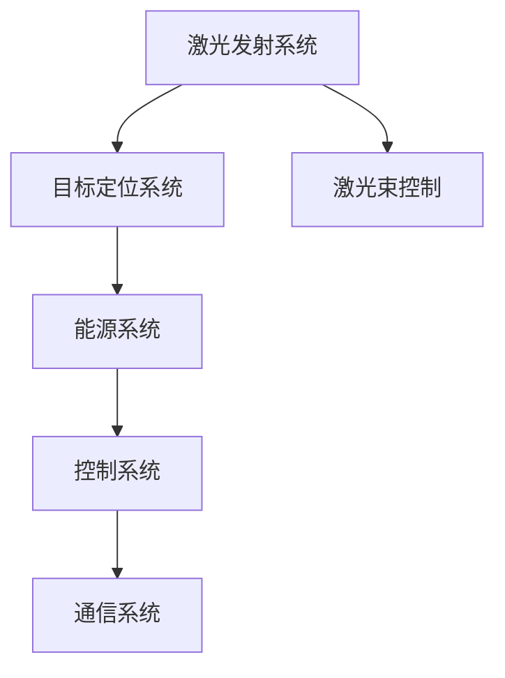

                 

# 未来的太空军事：2050年的太空激光武器与太空战舰

> **关键词**：太空军事、激光武器、太空战舰、2050年、技术趋势、作战应用

> **摘要**：本文深入探讨了2050年太空军事的潜在发展，聚焦于太空激光武器和太空战舰的技术原理、应用场景及未来挑战。通过逐步分析，我们试图描绘出一幅太空军事力量的未来图景，以期为读者提供有价值的见解和思考。

## 《未来的太空军事：2050年的太空激光武器与太空战舰》目录大纲

### 第一部分：太空军事概述

#### 第1章：太空军事背景与现状

##### 1.1 人类对太空的探索历程

##### 1.2 太空军事的发展与挑战

##### 1.3 主要太空军事大国及其战略布局

#### 第2章：2050年太空军事预测

##### 2.1 太空军事技术的演进趋势

##### 2.2 未来太空军事力量的构成

##### 2.3 太空军事的潜在冲突与威胁

### 第二部分：太空激光武器

#### 第3章：太空激光武器原理与技术

##### 3.1 激光武器的基本原理

##### 3.2 激光武器的分类

##### 3.3 激光武器的关键技术与挑战

#### 第4章：太空激光武器的作战应用

##### 4.1 太空激光武器的作战模式

##### 4.2 太空激光武器在太空与地面作战中的应用

##### 4.3 太空激光武器的威慑作用与战略意义

#### 第5章：太空激光武器的发展趋势与挑战

##### 5.1 未来太空激光武器的发展方向

##### 5.2 太空激光武器技术的创新点

##### 5.3 太空激光武器面临的挑战与应对策略

### 第三部分：太空战舰

#### 第6章：太空战舰概述与设计原则

##### 6.1 太空战舰的定义与类型

##### 6.2 太空战舰的设计原则与要求

##### 6.3 太空战舰的主要功能系统

#### 第7章：太空战舰的技术与装备

##### 7.1 太空战舰推进系统

##### 7.2 太空战舰武器系统

##### 7.3 太空战舰生命支持系统

#### 第8章：太空战舰的作战策略与应用

##### 8.1 太空战舰的战术运用

##### 8.2 太空战舰在太空防御中的角色

##### 8.3 太空战舰在太空侵略与反侵略行动中的应用

#### 第9章：太空战舰的未来发展与挑战

##### 9.1 未来太空战舰的演进趋势

##### 9.2 太空战舰技术的前沿领域

##### 9.3 太空战舰面临的挑战与应对策略

### 第四部分：综合分析与展望

#### 第10章：太空军事与地球安全

##### 10.1 太空军事对地球安全的影响

##### 10.2 太空军事合作的必要性

##### 10.3 国际社会对太空军事的监管与限制

#### 第11章：太空军事的机遇与挑战

##### 11.1 太空军事带来的经济与社会效益

##### 11.2 太空军事对科技发展的影响

##### 11.3 太空军事的未来展望

### 附录

#### 附录A：太空激光武器与太空战舰的关键术语解释

#### 附录B：太空激光武器与太空战舰相关参考资料

#### 附录C：太空激光武器与太空战舰开发常用软件工具简介

### 图表和公式

#### 图表1：太空激光武器系统架构

#### 公式1：激光武器的能量输出公式

$$
E = \frac{P \times t}{1000}
$$

其中，$E$表示能量（焦耳），$P$表示功率（千瓦），$t$表示激光照射时间（秒）。

### 引言

在21世纪的今天，人类对太空的探索已迈出了重要的一步。随着技术的进步和探索的深入，太空不再仅仅是科学家和宇航员的领地，它逐渐成为军事战略的重要方向。本文将带领读者穿越到2050年，探讨未来的太空军事格局，特别是太空激光武器与太空战舰的发展前景。

太空军事，顾名思义，是指利用太空资源和空间技术进行的军事活动。从地球轨道上的卫星监测到深空中的探测任务，太空军事的触角已经延伸至各个维度。然而，随着太空军事技术的不断演进，如何应对太空中的潜在威胁、如何构建有效的太空防御体系，成为各国军事战略的关键问题。

激光武器作为一种高效、精确的军事技术，在太空环境中展现出独特的优势。其高能量、远距离、快速响应等特点，使得太空激光武器成为未来太空军事力量的重要组成部分。与此同时，太空战舰作为太空军事行动的核心平台，其设计原则、技术装备和作战策略将成为决定太空军事成功与否的关键。

本文将分以下几个部分展开讨论：

1. **太空军事概述**：回顾人类对太空的探索历程，分析太空军事的现状和发展趋势。
2. **太空激光武器**：深入探讨激光武器的原理、分类、关键技术及作战应用。
3. **太空战舰**：介绍太空战舰的设计原则、技术装备和作战策略。
4. **综合分析与展望**：探讨太空军事对地球安全的影响、国际社会的监管与限制，以及太空军事带来的机遇与挑战。
5. **附录**：提供相关术语解释、参考资料和开发常用软件工具简介。

通过本文的探讨，我们希望为读者呈现一幅未来太空军事的宏伟图景，引发对太空军事战略和技术发展的深入思考。让我们开始这段探索之旅吧！## 第1章：太空军事背景与现状

### 1.1 人类对太空的探索历程

人类对太空的探索可以追溯到20世纪中叶，自从苏联成功发射第一颗人造卫星“斯普特尼克1号”以来，太空探索的脚步从未停止。在接下来的几十年中，美国和苏联（现为俄罗斯）之间的太空竞赛推动了人类对太空的认识和开发。

1961年，苏联宇航员尤里·加加林成为了第一个进入太空的人类。此后，美国成功发射了阿波罗飞船，最终实现了1969年尼尔·阿姆斯特朗登上月球的壮举。这一系列重大事件标志着人类太空探索的里程碑，开启了人类探索深空的大门。

进入21世纪，随着技术的不断进步，人类对太空的探索已经从地球轨道扩展到了月球、火星以及其他行星和小行星。国际空间站（ISS）的建立标志着人类在太空的长期驻留能力得到了显著提升。各国航天机构，包括美国国家航空航天局（NASA）、欧洲空间局（ESA）、日本宇宙航空研究开发机构（JAXA）和中国的中国国家航天局（CNSA），都在积极参与太空探索项目。

太空探索不仅仅限于探测和科学研究，还涵盖了军事领域。太空军事的发展可以追溯到冷战时期，当时美国和苏联都在太空领域投入了大量资源，以确保在太空中的优势。随着技术的进步，各国开始部署各种卫星，用于通信、导航、情报收集和监视。

### 1.2 太空军事的发展与挑战

太空军事的发展可以分为几个阶段：

1. **冷战时期（1950s-1990s）**：冷战期间，美国和苏联在太空领域的竞争尤为激烈。双方都发展了反卫星武器、侦察卫星和通信卫星，以争夺太空优势。这一时期的太空军事主要侧重于侦察和监视。

2. **21世纪初至今**：21世纪初，随着国际形势的变化，太空军事的重要性日益凸显。各国不仅继续发展侦察和监视卫星，还开始研发和部署防御性武器系统，如反卫星导弹和太空激光武器。同时，太空军事活动开始向民用领域扩展，例如使用卫星提供全球定位系统（GPS）服务。

太空军事的发展面临以下挑战：

1. **技术复杂性**：太空军事技术涉及众多领域，包括航天器设计、推进系统、通信技术和武器系统等。这些技术的复杂性使得研发和部署太空军事系统具有很高的难度。

2. **成本问题**：太空军事活动需要巨额资金支持。尽管一些国家可以承担这些费用，但许多发展中国家可能因预算限制而无法参与。

3. **国际法律与规范**：当前的国际法律体系尚未完全适应太空军事活动的需求。虽然存在《外层空间条约》等国际法规，但各国在太空军事活动上的行为仍然存在争议和不确定性。

4. **安全问题**：太空军事活动可能引发国际冲突和危机。太空的不可测性和高技术性使得安全风险难以控制，一旦发生冲突，可能对全球安全造成严重影响。

### 1.3 主要太空军事大国及其战略布局

目前，以下几个国家在太空军事领域占据领先地位：

1. **美国**：美国是世界上最大的太空军事强国，拥有广泛的太空军事基础设施，包括侦察卫星、通信卫星、导航卫星和防御性武器系统。美国国防部的太空军（Space Force）成立于2019年，标志着美国对太空军事地位的重视。

2. **俄罗斯**：俄罗斯继承了前苏联的太空军事遗产，拥有强大的卫星监测和反卫星能力。俄罗斯一直在发展新一代的太空激光武器和反卫星导弹，以保持其太空军事优势。

3. **中国**：中国近年来在太空军事领域取得了显著进展。中国拥有自己的卫星系统，包括北斗导航卫星系统和天宫空间站。中国还展示了反卫星武器试验，表明其在太空军事技术方面的实力。

4. **欧洲**：欧洲国家在太空军事方面相对低调，但欧洲空间局（ESA）参与了多个国际太空军事项目，并在卫星技术和激光武器研究方面取得了进展。

5. **其他大国**：其他国家如印度、以色列和日本也在积极发展太空军事技术，尽管它们在全球太空军事格局中的地位尚未达到顶尖水平。

### 总结

太空军事作为国家安全的重要组成部分，正随着科技的进步而不断发展。尽管面临诸多挑战，但太空军事的重要性不容忽视。通过回顾人类对太空的探索历程，分析当前的发展现状，以及了解主要太空军事大国的战略布局，我们可以更清晰地认识到太空军事在未来国家安全和国际竞争中的关键作用。在下一章中，我们将探讨2050年太空军事的潜在发展趋势和未来军事力量的构成。请继续关注！## 第2章：2050年太空军事预测

### 2.1 太空军事技术的演进趋势

随着科技的飞速发展，2050年的太空军事技术将迎来前所未有的变革。以下是一些关键的演进趋势：

1. **先进材料的应用**：太空环境极端严苛，对材料的要求极高。未来的太空军事装备将采用更轻、更强、耐高温的先进材料，如碳纳米管、石墨烯等，以减轻重量并提高耐用性。

2. **自主导航与智能决策**：基于人工智能和机器学习技术的自主导航系统将在未来成为主流。这些系统能够在复杂的太空环境中自主规划路径，并根据实时数据做出智能决策。

3. **高能激光武器**：激光武器将在太空军事中发挥至关重要的作用。未来的激光武器将采用更高效的激光源和更先进的光束控制技术，能够实现更高的能量输出和更远的射程。

4. **量子通信与量子计算**：量子通信和量子计算技术将在太空军事通信和计算中发挥重要作用。这些技术能够提供更安全、更高效的通信和计算能力，显著提升太空军事系统的整体性能。

5. **微卫星与纳米卫星**：随着小型化技术的发展，微卫星和纳米卫星将在太空军事中广泛应用。这些卫星体积小、成本低、部署灵活，能够在短时间内完成大量任务。

### 2.2 未来太空军事力量的构成

2050年的太空军事力量将呈现出以下几个特点：

1. **多层次的卫星网络**：未来太空军事力量将拥有多层次的卫星网络，包括低轨道、中轨道和高轨道卫星。这些卫星将提供全球范围内的实时监测、通信和导航服务。

2. **无人机与太空战舰**：无人机和太空战舰将成为太空军事力量的重要组成部分。无人机具备机动性强、任务多样等优点，而太空战舰则能在太空中执行长期任务，具备强大的武器系统和生命支持系统。

3. **激光武器与粒子武器**：激光武器和粒子武器将在未来太空军事中发挥关键作用。激光武器能够以高能量、远距离打击目标，而粒子武器则能通过释放高能粒子摧毁敌方卫星或航天器。

4. **太空站与太空港**：未来太空军事力量将建立一系列太空站和太空港，用于维修、补给和部署航天器。这些设施将确保太空军事行动的连续性和高效性。

### 2.3 太空军事的潜在冲突与威胁

尽管太空军事技术取得了显著进步，但未来太空军事领域仍存在诸多潜在冲突与威胁：

1. **反卫星武器**：反卫星武器是太空军事冲突的主要威胁之一。这些武器能够摧毁敌方卫星，从而破坏敌方的通信、导航和情报系统。

2. **太空碎片**：太空碎片问题日益严重，可能对在轨卫星和航天器造成威胁。未来太空军事力量需要建立有效的太空碎片监测和清除系统。

3. **网络攻击**：网络攻击是太空军事安全的重要威胁。敌方可能通过网络攻击干扰或破坏太空军事系统的通信和控制系统。

4. **太空侵略与反侵略行动**：随着太空军事力量的增强，太空侵略与反侵略行动将成为潜在冲突的导火索。各国需要建立有效的太空防御体系，以应对可能的侵略行为。

### 总结

2050年的太空军事将是一个高度科技化和复杂化的领域，未来的军事力量将具备更先进的科技装备和更高效的任务执行能力。然而，随着太空军事技术的发展，潜在冲突与威胁也将不断加剧。各国需要加强太空军事合作，共同应对未来太空军事领域的挑战。在下一章中，我们将深入探讨太空激光武器的原理、分类及关键技术。请继续关注！## 第3章：太空激光武器原理与技术

### 3.1 激光武器的基本原理

激光武器，顾名思义，是利用激光技术进行攻击的武器系统。激光（Light Amplification by Stimulated Emission of Radiation）是一种高度集中的光束，能够在短距离内传递极高的能量。激光武器的基本原理是通过激光发射器产生激光，然后通过光学系统将激光聚焦到目标上，从而对目标造成破坏。

激光的产生过程可以分为以下几个步骤：

1. **泵浦过程**：激光发射器中的增益介质（如气体、固体或液体）被外部光源（如闪光灯或激光二极管）泵浦，使其内部的原子或分子被激发到高能态。

2. **受激辐射**：被激发的高能态原子或分子向低能态跃迁，释放出与激发光具有相同频率、相位和传播方向的光子，这些光子与激发光叠加，形成激光。

3. **光学系统**：激光通过光学系统（如透镜或反射镜）聚焦，形成一个高能量密度的激光束。

激光武器的核心组成部分包括激光发射器、光学系统、能量源和控制单元。激光发射器产生激光，光学系统负责将激光聚焦到目标上，能量源为激光发射提供能量，控制单元则负责调节激光的功率、方向和射击节奏。

### 3.2 激光武器的分类

根据不同的应用场景和技术特点，激光武器可以分为以下几类：

1. **高能激光武器**：高能激光武器是激光武器中能量输出最高的一种，通常用于打击坦克、飞机、导弹等高速移动目标。高能激光武器具备射程远、反应速度快、精度高等优点。

2. **低能激光武器**：低能激光武器通常用于近程防御和干扰任务，如对付无人机、火箭等低速移动目标。低能激光武器体积小、重量轻，适合安装在地面或舰船上。

3. **战术激光武器**：战术激光武器介于高能激光武器和低能激光武器之间，用于打击地面装甲目标、低空飞行器和卫星等。战术激光武器具备较高的能量输出和较远的射程。

4. **战术干扰激光武器**：战术干扰激光武器主要用于干扰敌方的雷达、通信系统和光学系统，使敌方无法正常运作。这种激光武器通常采用低能量激光，但通过精确调制，能够产生强烈的电磁干扰。

### 3.3 激光武器的关键技术与挑战

激光武器的关键技术主要包括激光发射技术、光学系统技术、能量源技术和控制技术。以下是对这些技术的详细介绍：

1. **激光发射技术**：激光发射技术是激光武器的基础。目前，常用的激光发射器包括固体激光器、气体激光器和半导体激光器。固体激光器具有输出功率高、效率高、稳定性好等优点，但体积较大；气体激光器则体积小、重量轻，但输出功率较低；半导体激光器则兼具两者优点，适用于小型化、高功率激光武器。

2. **光学系统技术**：光学系统技术是激光武器实现精确打击的关键。光学系统包括透镜、反射镜、光纤等组件，用于将激光束聚焦到目标上。光学系统的设计要求高精度、高稳定性和抗振动能力，以确保激光束的精确性和稳定性。

3. **能量源技术**：能量源技术为激光武器提供持续的能量供应。常见的能量源包括化学电池、燃料电池、太阳能电池等。化学电池和燃料电池能够提供高能量输出，但体积较大；太阳能电池则体积小、重量轻，但受天气和光照条件影响较大。

4. **控制技术**：控制技术是激光武器的核心，用于调节激光的功率、方向和射击节奏。控制技术包括自动目标跟踪系统、功率调节系统和射击控制系统等。自动目标跟踪系统能够实时监测目标位置，调节激光束方向；功率调节系统根据目标距离和类型调整激光功率；射击控制系统则负责整体协调和控制。

尽管激光武器在技术原理上已取得显著进展，但仍面临诸多挑战：

1. **高能量密度**：实现高能量密度的激光束是激光武器的主要挑战之一。高能量密度意味着激光束能够在短时间内传递大量能量，从而对目标造成破坏。目前，高能量激光武器的能量密度仍然较低，需要进一步的技术突破。

2. **光学系统稳定性**：光学系统稳定性是确保激光束精确打击的关键。在太空环境中，光学系统需要承受极端的温度、真空和辐射等恶劣条件，这对光学系统的设计和材料提出了极高的要求。

3. **能量供应**：激光武器需要持续、稳定地提供能量。目前的能量源技术尚无法完全满足高能激光武器的需求，需要开发更高效、更可靠的新能源技术。

4. **控制与协调**：激光武器的控制与协调复杂，需要多系统集成协同工作。自动目标跟踪、功率调节和射击控制等系统需要高度协调，以确保激光束的准确打击。

### 总结

激光武器作为一种先进的军事技术，具有高能量、远距离、快速响应等特点，在未来的太空军事中具有广泛的应用前景。通过对激光武器基本原理、分类及关键技术的探讨，我们可以看到激光武器在太空军事中的重要地位。在下一章中，我们将深入探讨太空激光武器的作战应用，分析其在太空与地面作战中的应用场景和战略意义。请继续关注！## 第4章：太空激光武器的作战应用

### 4.1 太空激光武器的作战模式

太空激光武器在作战中的模式可以分为以下几种：

1. **打击敌方卫星**：太空激光武器的主要作战任务之一是打击敌方卫星。敌方卫星是现代军事行动的重要支撑，包括通信、导航、侦察等任务。通过精确打击敌方卫星，可以破坏敌方的情报收集和通信系统，削弱其作战能力。

2. **防御敌方攻击**：太空激光武器不仅可以进攻，还可以用于防御。在敌方发起太空攻击时，如发射反卫星导弹或进行太空入侵，太空激光武器可以迅速反应，击落来袭目标，保护己方的卫星和航天器。

3. **打击地面目标**：虽然太空激光武器主要用于打击太空目标，但它们也可以通过地面反射器或地面目标定位系统，打击地面目标。这些目标可能包括导弹发射场、军事基地、指挥中心等关键设施。

4. **干扰敌方系统**：太空激光武器还可以通过调制激光束，产生电磁干扰，干扰敌方的雷达、通信和导航系统。这种干扰可以在短时间内瘫痪敌方的指挥和控制，使其失去战斗力。

### 4.2 太空激光武器在太空与地面作战中的应用

1. **太空作战应用**

太空激光武器在太空作战中的主要应用包括：

- **摧毁敌方卫星**：敌方卫星一旦被摧毁，将导致其情报收集和通信系统瘫痪，从而削弱敌方的整体作战能力。
- **防御敌方攻击**：在敌方发射反卫星导弹或其他攻击手段时，太空激光武器可以迅速反应，将其击落，保护己方的卫星和航天器。
- **打击敌方航天器**：在特定情况下，太空激光武器可以用于打击敌方的航天器，如敌方侦察卫星、攻击卫星等。

2. **地面作战应用**

太空激光武器在地面作战中的应用相对较少，但仍然具有重要意义：

- **打击地面目标**：通过地面反射器或地面目标定位系统，太空激光武器可以精确打击敌方的关键设施，如导弹发射场、指挥中心等。
- **干扰敌方系统**：通过电磁干扰，太空激光武器可以破坏敌方的雷达、通信和导航系统，使其无法正常运作。

### 4.3 太空激光武器的威慑作用与战略意义

太空激光武器的威慑作用主要体现在以下几个方面：

1. **威慑敌方**：太空激光武器具有极高的威慑作用。敌方一旦得知我方拥有这种先进的武器系统，可能会在战略决策中更加谨慎，避免冒险行动。

2. **战略平衡**：太空激光武器可以改变现有的战略平衡。随着其他国家逐步发展自己的太空军事能力，太空激光武器的存在将促使各国在太空军事技术方面进行更快的创新和进步。

3. **提高军事能力**：太空激光武器可以提高我方的军事能力。在太空作战和地面作战中，激光武器的精确打击能力将使我方在战场上具备更大的优势。

4. **国际影响力**：拥有太空激光武器的国家将在国际社会中获得更大的影响力。这种技术优势将使我国在太空军事领域占据领先地位，增强国际话语权。

### 结论

太空激光武器作为一种先进的军事技术，具有广泛的作战应用前景。在太空与地面作战中，太空激光武器可以通过多种模式发挥重要作用，提高我方的作战能力，并对敌方产生强烈的威慑作用。在下一章中，我们将深入探讨太空激光武器的发展趋势与面临的挑战。请继续关注！## 第5章：太空激光武器的发展趋势与挑战

### 5.1 未来太空激光武器的发展方向

未来太空激光武器的发展方向主要集中在以下几个领域：

1. **更高能量输出**：为了应对更远距离和高防护等级的目标，太空激光武器需要更高的能量输出。未来可能采用更高效的激光源和更先进的能量管理技术，以实现更高的激光功率。

2. **更轻便的设备**：随着太空军事活动的增多，设备轻量化变得尤为重要。未来太空激光武器将采用先进的材料技术和紧凑型设计，以减轻重量和体积，提高部署灵活性。

3. **智能自主化**：智能化和自主化是未来太空军事装备的发展趋势。未来太空激光武器将配备更加先进的传感器和人工智能算法，实现自主目标识别、跟踪和打击。

4. **网络化作战**：未来太空激光武器将更加注重网络化作战能力。通过与其他太空平台和地面指挥系统的互联互通，实现信息共享和协同作战。

5. **多模态集成**：太空激光武器可能与其他类型的高能武器（如粒子武器）集成，形成多模态攻击能力，以应对更复杂的作战环境。

### 5.2 太空激光武器技术的创新点

1. **新型激光源**：新型激光源，如自由电子激光（FEL）和核激光，具有极高的能量输出和短脉冲特性，可能在未来的太空激光武器中得到应用。

2. **先进的光束控制技术**：先进的光束控制技术，如自适应光学系统（AOS）和光束稳定器，可以进一步提高激光束的聚焦精度和稳定性。

3. **高效能源管理**：高效能源管理技术，如超级电容器和高效能量转换器，可以提供更稳定的能量供应，延长太空激光武器的作战时间。

4. **新型反射材料**：新型反射材料，如纳米材料涂层，可以减少激光束在传播过程中的损耗，提高激光武器的效率。

### 5.3 太空激光武器面临的挑战与应对策略

尽管太空激光武器具有巨大的潜力，但其发展仍面临诸多挑战：

1. **技术成熟度**：目前，许多太空激光武器技术仍处于实验阶段，需要进一步的技术验证和工程化应用。

2. **成本问题**：太空激光武器研发和部署的成本极高，需要大量的资金投入。各国需要制定合理的研发计划，确保资金的有效利用。

3. **国际监管**：太空激光武器可能引发国际安全和法律问题。各国需要积极参与国际谈判，制定相关法律法规，确保太空军事活动的合法性。

4. **安全风险**：太空激光武器可能对地球环境造成潜在危害，如高能激光束对地球生物圈的影响。各国需要建立风险评估机制，确保太空激光武器在安全可控的范围内使用。

应对策略：

1. **国际合作**：加强国际太空军事合作，共同推动太空激光武器技术的发展和应用。

2. **技术验证**：通过实验室和现场试验，验证太空激光武器的技术成熟度，为工程化应用奠定基础。

3. **成本控制**：通过技术优化和规模化生产，降低太空激光武器的成本，提高其经济可行性。

4. **法律法规**：积极参与国际谈判，制定相关法律法规，确保太空激光武器在安全可控的范围内使用。

### 结论

未来太空激光武器的发展将充满挑战，但同时也充满机遇。通过持续的技术创新和国际合作，太空激光武器有望成为太空军事领域的重要力量。在下一章中，我们将探讨太空战舰的概述与设计原则。请继续关注！## 第6章：太空战舰概述与设计原则

### 6.1 太空战舰的定义与类型

太空战舰，也称为航天战舰或太空舰艇，是一种专门为太空军事任务而设计的巨型航天器。它们通常具备强大的武器系统、推进系统、生命支持系统和其他必要功能，以执行远程打击、防御、侦察和支援任务。

太空战舰可以根据任务需求和技术特点分为以下几种类型：

1. **攻击型太空战舰**：攻击型太空战舰主要用于远程打击敌方目标，如卫星、航天器、地面目标等。它们通常配备高能激光武器、导弹发射系统和其他精确打击武器。

2. **防御型太空战舰**：防御型太空战舰侧重于防御敌方攻击，如反卫星武器、导弹和其他威胁。它们通常配备强大的防御武器系统，包括导弹拦截系统、激光武器和粒子武器。

3. **支援型太空战舰**：支援型太空战舰主要提供后勤支援、通信中继、侦察和其他辅助任务。它们通常配备先进的通信系统、侦察设备和生命支持系统。

4. **多功能太空战舰**：多功能太空战舰集成了攻击、防御和支援功能，能够执行多种任务。它们通常具备强大的武器系统和多功能设备，以适应不同的作战需求。

### 6.2 太空战舰的设计原则与要求

太空战舰的设计原则与要求取决于其任务类型和功能。以下是一些关键的设计原则和要求：

1. **可靠性**：太空战舰需要在极端的太空环境中长期运行，因此必须具备极高的可靠性。这包括硬件的耐用性、系统的冗余设计以及故障检测和修复能力。

2. **自给自足性**：太空战舰需要具备自给自足的能力，包括能源供应、氧气供应、水循环和废物处理。这要求设计高效的能源系统、生命支持系统和循环系统。

3. **机动性**：太空战舰需要具备良好的机动性，以便快速调整位置、改变航向和速度。这要求设计高效的推进系统和精确的导航系统。

4. **攻击与防御能力**：太空战舰必须具备强大的攻击与防御能力，以应对敌方的攻击。这包括高能激光武器、导弹发射系统、粒子武器和其他防御武器。

5. **通信与指挥控制**：太空战舰需要与其他太空平台和地面指挥系统保持通信，并具备高效的指挥控制能力。这要求设计先进的通信系统和指挥控制系统。

6. **耐用性**：太空战舰必须能够承受太空辐射、微陨石撞击和极端温度等恶劣环境。这要求设计具有高抗辐射能力、抗撞击能力和耐温能力的结构和材料。

### 6.3 太空战舰的主要功能系统

太空战舰的主要功能系统包括以下几部分：

1. **推进系统**：推进系统是太空战舰的核心，用于提供机动性。现代太空战舰可能采用离子推进、核推进或太阳能推进等多种推进技术。

2. **武器系统**：武器系统包括激光武器、导弹发射系统、粒子武器等。这些武器系统用于攻击敌方目标、防御敌方攻击以及执行特殊任务。

3. **生命支持系统**：生命支持系统为太空战舰船员提供氧气、水、食物和居住环境。这包括氧气生成系统、水循环系统、食物供给系统和居住舱。

4. **通信系统**：通信系统用于太空战舰与其他太空平台、地面指挥系统和船员之间的通信。这包括卫星通信、激光通信和其他先进通信技术。

5. **导航系统**：导航系统用于确定太空战舰的位置、航向和速度。这包括惯性导航系统、星敏感器、雷达和其他导航设备。

6. **控制系统**：控制系统用于管理太空战舰的所有系统和设备。这包括计算机控制系统、自动化系统、人工智能系统和人机交互界面。

### 总结

太空战舰是未来太空军事力量的重要组成部分，其设计和功能决定了太空军事行动的成败。通过定义太空战舰、介绍设计原则和主要功能系统，我们可以更好地理解太空战舰在太空军事中的关键作用。在下一章中，我们将深入探讨太空战舰的技术与装备。请继续关注！## 第7章：太空战舰的技术与装备

### 7.1 太空战舰推进系统

太空战舰的推进系统是确保其能够执行各种太空任务的关键。推进系统的主要目的是提供足够的推力和机动性，使太空战舰能够在太空环境中自由移动和定位。

#### 离子推进技术

离子推进是一种高效、低能耗的推进技术，适用于太空战舰的长距离航程和长时间任务。离子推进器通过电离气体（如氙气）产生离子，然后利用电场将离子加速，从而产生推力。

**工作原理**：
1. **电离**：推进器中的电离器将气体分子电离成正离子和电子。
2. **加速**：电场将正离子加速，使其获得高速。
3. **排放**：加速后的正离子被排放到太空，产生推力。

**优势**：
- 高效率：离子推进器的比冲（单位燃料产生的推力）比传统化学火箭高得多。
- 低能耗：离子推进器耗能较低，适合长时间运行。
- 长航程：离子推进器能够提供持续的推力，使太空战舰能够进行长距离航程。

**挑战**：
- 推力较小：离子推进器的推力相对较小，不适合需要快速加速的任务。
- 起步时间：离子推进器需要较长的时间才能达到最大推力。

#### 核推进技术

核推进是一种利用核反应产生的热能来提供推力的技术。核热推进器通过核反应堆加热推进剂（如液氢），使其蒸发产生高速气体，从而产生推力。

**工作原理**：
1. **核反应**：核反应堆中的核燃料（如铀或钚）发生核裂变反应，释放大量热能。
2. **加热推进剂**：热能加热推进剂，使其蒸发成高速气体。
3. **排放**：高速气体被排放到太空，产生推力。

**优势**：
- 高推力：核推进器能够提供巨大的推力，适合需要快速加速的任务。
- 高比冲：核推进器的比冲比化学火箭高，能够提供更高效的推力。

**挑战**：
- 安全问题：核推进器涉及核材料，存在潜在的安全风险。
- 高成本：核推进器的研发和部署成本极高。

#### 太阳能推进技术

太阳能推进器利用太阳能电池板将太阳光转化为电能，用于推动太空战舰。太阳能推进器分为两种类型：电推力和光推力。

**电推力**：
- 利用太阳能电池板产生的电能，通过电磁场推动太空战舰。
- 推力较小，但运行时间长，适合长期航程。

**光推力**：
- 利用光压效应，直接利用太阳光产生的压力推动太空战舰。
- 推力较小，但成本较低，适合小规模的太空任务。

### 7.2 太空战舰武器系统

太空战舰的武器系统是执行太空任务、保护自身和执行作战任务的关键。以下是几种常见的太空战舰武器系统：

#### 激光武器

激光武器利用高能激光束对目标进行精确打击。激光武器具有射程远、精度高、响应速度快等优点，是未来太空战舰的重要武器之一。

**工作原理**：
- 激光发射器产生高能激光束。
- 光学系统将激光束聚焦到目标上。
- 激光束对目标进行破坏。

**优势**：
- 射程远：激光武器的射程可以覆盖整个地球轨道。
- 精度高：激光武器可以精确打击目标，减少附带损害。
- 响应速度快：激光武器的反应时间极短，能够迅速响应敌方的攻击。

**挑战**：
- 能量消耗大：激光武器需要大量的能量供应。
- 恶劣环境影响：激光武器在恶劣的太空环境中（如高辐射、极端温度等）可能受到影响。

#### 导弹系统

导弹系统是一种常见的太空武器系统，可以通过多种方式对目标进行打击。

**工作原理**：
- 导弹发射器将导弹发射到目标轨道。
- 导弹通过惯性导航和卫星数据调整航向和速度。
- 导弹通过碰撞或爆炸对目标进行破坏。

**优势**：
- 多样性：导弹系统可以搭载不同类型的弹头，适应不同类型的作战任务。
- 洗损能力强：导弹系统可以执行多次攻击，提高攻击的成功率。

**挑战**：
- 导弹精度：导弹的精度受制导系统和传感器的影响，可能存在误差。
- 防御措施：敌方可能采取反导措施，提高导弹系统的作战难度。

#### 粒子武器

粒子武器通过释放高能粒子流对目标进行打击。粒子武器具有高破坏力、低附带损害等优点。

**工作原理**：
- 粒子发生器产生高能粒子流。
- 粒子流对目标进行破坏。

**优势**：
- 高破坏力：粒子武器可以对目标进行深层次破坏。
- 低附带损害：粒子武器对周围环境的破坏较小。

**挑战**：
- 粒子控制：高能粒子流难以精确控制，可能对自身造成伤害。
- 能量消耗：粒子武器需要大量的能量供应。

### 7.3 太空战舰生命支持系统

太空战舰的生命支持系统是确保船员在太空环境中生存和健康的必要条件。以下是几种关键的生命支持系统：

#### 氧气供应系统

氧气供应系统为船员提供足够的氧气，维持正常的呼吸和生理活动。氧气供应系统通常包括氧气生成装置、氧气储存设备和氧气分配系统。

**工作原理**：
- 通过电解水、分解空气或其他方法生成氧气。
- 储存氧气，并通过分配系统供应给船员。

#### 水循环系统

水循环系统用于回收和再利用太空战舰内部的水资源。水循环系统通常包括水处理装置、水储存设备和水回收系统。

**工作原理**：
- 收集和净化废水。
- 蒸发和冷凝水蒸气，生成饮用水和其他用途的水。

#### 食物供给系统

食物供给系统为船员提供营养均衡的饮食。食物供给系统通常包括食品储存设备、食品加工设备和食品供应系统。

**工作原理**：
- 储存多种食品，如脱水食品、冷冻食品等。
- 通过食品加工设备，将食品加热、烹饪和调制。

#### 居住舱

居住舱是船员在太空战舰上的主要生活空间。居住舱通常包括睡眠区、工作区、休闲区和卫生区等。

**工作原理**：
- 提供舒适的居住环境，包括温度、湿度、气压等。
- 配备必要的生活设施，如床铺、工作台、电视、卫生间等。

### 总结

太空战舰的技术与装备是实现太空军事任务的关键。推进系统提供了太空战舰的机动性，武器系统确保了其攻击和防御能力，而生命支持系统则保障了船员的生存和健康。在下一章中，我们将探讨太空战舰的作战策略与应用。请继续关注！## 第8章：太空战舰的作战策略与应用

### 8.1 太空战舰的战术运用

太空战舰的战术运用是确保其能够有效执行任务、对抗敌对势力的重要环节。以下是一些关键的战术运用：

1. **远程打击**：太空战舰可以利用其强大的激光武器和导弹系统，对敌方目标进行远程打击。通过精确的射击规划和目标定位，太空战舰可以在敌方反应之前对关键目标进行毁灭性打击。

2. **隐蔽作战**：太空战舰可以利用其高速推进系统和先进的通信系统，进行隐蔽作战。通过变换轨道和规避敌方探测，太空战舰可以避免被敌方发现，从而实现出其不意的打击。

3. **协同作战**：太空战舰可以与其他太空平台和地面指挥系统进行协同作战。通过共享情报、协调行动，太空战舰可以形成合力，对敌方实施全方位的攻击。

4. **防御作战**：在敌方发起攻击时，太空战舰可以利用其防御武器系统进行反击。激光武器和粒子武器可以有效地拦截敌方导弹和其他攻击手段，保护己方的航天器。

5. **信息作战**：太空战舰可以利用其先进的通信系统，对敌方的通信和指挥系统进行干扰和破坏。通过信息作战，太空战舰可以削弱敌方的指挥和控制能力，使其陷入混乱。

### 8.2 太空战舰在太空防御中的角色

太空战舰在太空防御中扮演着至关重要的角色，其主要任务包括：

1. **反卫星作战**：太空战舰可以通过激光武器和导弹系统，摧毁敌方卫星，保护己方的卫星安全。在敌方发起卫星攻击时，太空战舰可以迅速反应，进行拦截和摧毁。

2. **太空碎片清除**：太空碎片对在轨航天器构成严重威胁。太空战舰可以利用其推进系统和激光武器，清除太空碎片，确保太空环境的清洁和安全。

3. **防御敌方攻击**：太空战舰可以部署在关键轨道上，防御敌方发起的太空攻击。通过提前预警和快速反应，太空战舰可以有效地防御敌方的导弹和其他攻击手段。

4. **情报收集与监视**：太空战舰可以利用其侦察设备和通信系统，收集和传递情报。通过情报监视，太空战舰可以实时掌握敌方的动态，为指挥决策提供有力支持。

### 8.3 太空战舰在太空侵略与反侵略行动中的应用

太空侵略与反侵略行动是太空军事的重要组成部分，太空战舰在这两种行动中发挥着关键作用：

1. **太空侵略**：
   - **战略目标打击**：太空战舰可以携带高能激光武器和导弹，对敌方的重要战略目标进行精确打击，如指挥中心、军事基地等。
   - **卫星摧毁**：太空战舰可以通过激光武器和导弹系统，摧毁敌方的卫星，削弱其情报收集和通信能力。

2. **反太空侵略**：
   - **防御措施**：太空战舰可以部署在关键轨道上，进行防御作战，拦截敌方的导弹和其他攻击手段。
   - **反击行动**：在遭受太空侵略时，太空战舰可以迅速反应，利用其武器系统对敌方进行反击，保护己方的航天器。

3. **占领与控制**：太空战舰可以通过占领敌方的轨道位置，控制其卫星和其他航天器，实现对敌方的战略压制。

4. **救援与支援**：在太空侵略与反侵略行动中，太空战舰可以提供救援和支持。通过运送物资、维修设备、支援船员等，太空战舰可以确保己方航天器的正常运行。

### 总结

太空战舰在太空军事中的战术运用和角色至关重要。通过远程打击、隐蔽作战、协同作战、防御作战和信息作战，太空战舰可以有效地执行各种太空任务。在太空侵略与反侵略行动中，太空战舰发挥着关键作用，通过战略目标打击、卫星摧毁、防御措施、反击行动和占领与控制，确保太空安全的稳定。在下一章中，我们将探讨太空战舰的未来发展与挑战。请继续关注！## 第9章：太空战舰的未来发展与挑战

### 9.1 未来太空战舰的演进趋势

随着科技的不断进步，未来太空战舰的发展趋势将集中在以下几个方面：

1. **智能化与自主化**：未来太空战舰将更加智能化和自主化。通过人工智能和机器学习技术的应用，太空战舰将能够自主进行目标识别、决策和行动，提高作战效率。

2. **多功能与模块化**：未来太空战舰将具备多功能和模块化设计。这意味着它们能够根据任务需求，快速更换或添加不同类型的装备和系统，提高任务适应性和灵活性。

3. **高能效与轻量化**：未来太空战舰将采用更高效、更环保的能源系统和更轻便的材料，以减少能源消耗和提升整体性能。

4. **网络化与协同作战**：未来太空战舰将更加依赖网络化作战，与其他太空平台、地面指挥系统和无人机等协同作战，形成多层次、全方位的太空防御体系。

5. **高抗辐射与抗撞击能力**：未来太空战舰将具备更强的抗辐射和抗撞击能力，以应对太空环境中的恶劣条件，确保长期在轨运行。

### 9.2 太空战舰技术的前沿领域

未来太空战舰技术的前沿领域包括以下几项：

1. **量子通信**：量子通信技术将实现太空战舰与地面指挥系统和其他太空平台之间的超高速、超安全通信。量子加密技术将确保通信内容不被窃听和篡改。

2. **纳米材料**：纳米材料技术的应用将使太空战舰的结构更加轻便、强度更高，能够更好地承受太空环境的极端条件。

3. **高效能源系统**：未来太空战舰将采用更高效的能源系统，如核聚变能源、太阳能电池等，以实现长时间、高效能的运行。

4. **高级导航与定位**：未来太空战舰将配备更高级的导航与定位系统，如基于量子陀螺仪和激光雷达的导航系统，提高定位精度和稳定性。

5. **高能武器系统**：未来太空战舰将配备更高能的激光武器、粒子武器等，以应对更复杂的太空威胁。

### 9.3 太空战舰面临的挑战与应对策略

尽管未来太空战舰的发展前景广阔，但仍然面临诸多挑战：

1. **技术成熟度**：目前许多太空战舰技术尚未达到成熟阶段，需要通过持续的研发和试验来提高技术成熟度。

2. **成本问题**：太空战舰的研发和部署成本极高，需要政府和企业投入大量资金。因此，如何提高资金利用效率、降低成本是关键。

3. **国际法律与监管**：太空战舰的发展可能引发国际安全和法律问题。各国需要积极参与国际谈判，制定相关法律法规，确保太空战舰在合法范围内使用。

4. **安全风险**：太空战舰需要应对太空辐射、微陨石撞击、极端温度等恶劣环境。因此，如何提高太空战舰的抗辐射和抗撞击能力是关键。

5. **国际合作**：太空战舰的发展需要国际合作。各国需要加强太空军事合作，共同应对太空威胁，推动太空技术的和平利用。

应对策略：

1. **持续研发**：通过持续的技术研发，提高太空战舰的技术成熟度和性能。

2. **成本控制**：通过优化设计和规模化生产，降低太空战舰的研发和部署成本。

3. **法律法规**：积极参与国际谈判，制定相关法律法规，确保太空战舰在合法范围内使用。

4. **安全保障**：提高太空战舰的抗辐射和抗撞击能力，确保在恶劣太空环境中的安全运行。

5. **国际合作**：加强国际合作，共同应对太空威胁，推动太空技术的和平利用。

### 结论

未来太空战舰的发展将充满挑战，但同时也充满机遇。通过持续的技术创新和国际合作，太空战舰有望成为太空军事领域的重要力量，为国家安全和国际和平作出贡献。在下一章中，我们将探讨太空军事与地球安全的关系。请继续关注！## 第10章：太空军事与地球安全

### 10.1 太空军事对地球安全的影响

太空军事的发展对地球安全产生了一系列深远的影响：

1. **军备竞赛**：随着太空军事技术的不断进步，各国在太空军事领域的竞争日趋激烈。军备竞赛可能导致太空军事能力的过度发展，引发潜在的全球安全风险。

2. **卫星依赖性**：现代社会对卫星系统的依赖性越来越强，包括通信、导航、气象监测等。太空军事活动可能干扰或摧毁卫星系统，影响全球基础设施的正常运行。

3. **太空碎片问题**：太空军事活动产生的太空碎片对在轨航天器构成严重威胁。太空碎片不仅可能对在轨航天器造成撞击，还可能引发连锁反应，导致更多的太空碎片产生。

4. **国际冲突**：太空军事活动可能引发国际冲突。太空军事化的加剧可能导致太空成为新的战场，从而增加国际关系的紧张程度。

### 10.2 太空军事合作的必要性

为了确保太空安全和地球安全，太空军事合作变得至关重要：

1. **预防冲突**：通过国际合作，各国可以共同制定太空军事活动的准则和规则，减少冲突的可能性。

2. **共享资源**：国际合作有助于各国共享太空资源，提高太空利用效率，降低太空军事活动的成本。

3. **技术交流**：国际合作可以促进太空军事技术的发展，通过技术交流，各国可以相互借鉴和学习，推动技术的进步。

4. **监控与管理**：国际合作可以建立更有效的太空碎片监控和管理机制，减少太空碎片对在轨航天器的威胁。

### 10.3 国际社会对太空军事的监管与限制

国际社会已经采取了一系列措施来监管和限制太空军事活动：

1. **《外层空间条约》**：该条约是国际社会对太空军事活动的主要法律框架。它规定了外层空间用于和平目的的原则，禁止在月球和其他天体上进行军事活动。

2. **《太空军备控制条约》**：该条约旨在限制太空军事化的进程，通过控制卫星武器化和太空武器试验，减少太空军备竞赛。

3. **国际监测与报告机制**：国际社会建立了多个监测和报告机制，用于监控太空军事活动，如《联合国太空事务办公室》和《国际电信联盟》。

4. **国家间谈判**：各国通过双边和多边谈判，就太空军事活动进行协商和约束，以减少太空军事化的风险。

### 总结

太空军事的发展对地球安全具有深远的影响，因此，加强国际合作和监管，确保太空的和平利用，是维护全球安全的必要手段。通过共同努力，我们可以减少太空军事化带来的风险，确保人类在太空的可持续发展。在下一章中，我们将探讨太空军事带来的机遇与挑战。请继续关注！## 第11章：太空军事的机遇与挑战

### 11.1 太空军事带来的经济与社会效益

太空军事不仅关系到国家安全，还带来了显著的经济和社会效益：

1. **技术创新**：太空军事推动了一系列关键技术的研发，如高能激光武器、先进推进系统、量子通信等。这些技术创新不仅服务于军事领域，还促进了民用技术的发展。

2. **经济增长**：太空军事活动带动了相关产业的发展，包括航天器制造、卫星通信、遥感技术等。这些产业为各国创造了大量就业机会，推动了经济增长。

3. **科学研究**：太空军事活动促进了天文学、物理学、生物学等领域的研究。例如，卫星技术的应用为气象预测、地球监测和太空探索提供了重要的数据支持。

4. **国际合作**：太空军事活动促进了国际间的科技合作和资源共享，增强了各国之间的互信和合作，为全球和平与发展做出了贡献。

### 11.2 太空军事对科技发展的影响

太空军事对科技发展的推动作用体现在多个方面：

1. **信息技术**：太空军事推动了信息技术的发展，包括卫星通信、网络安全、人工智能等。这些技术不仅服务于军事需求，还广泛应用于民用领域。

2. **材料科学**：太空军事要求高强度、耐高温、抗辐射的材料，推动了材料科学的研究。这些材料在航空航天、生物医疗等领域也具有广泛应用。

3. **能源技术**：太空军事推动了太阳能、核能等新能源技术的发展。这些技术有助于减少对化石燃料的依赖，推动可持续发展。

4. **人工智能**：太空军事活动对人工智能技术的发展起到了推动作用。通过大数据分析、机器学习等技术，太空军事系统能够更高效地执行任务，提高决策能力。

### 11.3 太空军事的未来展望

展望未来，太空军事将继续朝着智能化、网络化、多功能化的方向发展：

1. **智能化**：人工智能和机器学习将在太空军事中发挥更大作用，使太空战舰和武器系统能够自主决策和行动。

2. **网络化**：太空军事系统将更加依赖网络化作战，与其他太空平台、地面指挥系统和无人机等实现信息共享和协同作战。

3. **多功能化**：太空战舰将具备更多功能，不仅能够执行作战任务，还能提供后勤支援、通信中继和科学研究等。

4. **国际合作**：随着太空军事技术的进步，国际合作将更加重要。通过多边合作，各国可以共同应对太空威胁，推动太空军事技术的和平利用。

### 结论

太空军事既带来了机遇，也面临挑战。通过技术创新和国际合作，我们可以充分发挥太空军事的经济和社会效益，同时确保太空的安全和稳定。未来，太空军事将继续在科技发展和国际关系中扮演重要角色。在下一章中，我们将提供一些相关的关键术语解释和参考资料，以供读者深入学习和研究。请继续关注！## 附录A：太空激光武器与太空战舰的关键术语解释

在探讨太空激光武器与太空战舰的过程中，理解一些关键术语是至关重要的。以下是对这些术语的简要解释：

1. **激光（Laser）**：激光是一种高度集中的光束，通过受激辐射产生。它具有高能量密度、远距离传输和精确聚焦的特点。

2. **激光发射器（Laser Transmitter）**：激光发射器是产生激光的核心设备。它通过电子泵浦、气体放电或固体激光等方式产生激光。

3. **光学系统（Optical System）**：光学系统包括透镜、反射镜、光纤等组件，用于将激光束聚焦到目标上，确保激光束的精度和稳定性。

4. **能量源（Energy Source）**：能量源为激光发射器提供能量。常见的能量源包括化学电池、燃料电池和太阳能电池。

5. **控制单元（Control Unit）**：控制单元负责调节激光的功率、方向和射击节奏。它通过计算机系统和自动化技术实现精确控制。

6. **太空战舰（Space Battleship）**：太空战舰是一种专门为太空军事任务设计的巨型航天器。它具备强大的武器系统、推进系统和生命支持系统。

7. **推进系统（Propulsion System）**：推进系统是太空战舰的核心，用于提供机动性。它可能包括离子推进、核推进和太阳能推进等。

8. **激光武器系统（Laser Weapon System）**：激光武器系统是太空战舰的重要装备，用于打击敌方目标。它包括激光发射器、光学系统和控制单元。

9. **生命支持系统（Life Support System）**：生命支持系统为太空战舰船员提供氧气、水、食物和居住环境。它包括氧气供应系统、水循环系统和食物供给系统。

10. **量子通信（Quantum Communication）**：量子通信是一种利用量子力学原理进行通信的技术。它提供高度安全、高效的通信方式。

11. **纳米材料（Nanomaterials）**：纳米材料是具有纳米级结构的材料。它们具有独特的物理和化学性质，广泛应用于航天器制造和高能武器系统。

12. **太空碎片（Space Debris）**：太空碎片是废弃的航天器、火箭残骸和其他碎片。它们在太空中漂浮，对在轨航天器构成威胁。

13. **抗辐射（Radiation Shielding）**：抗辐射是指材料或系统对辐射的抵抗能力。在太空环境中，抗辐射能力对于保护航天器和船员至关重要。

14. **自主导航（Autonomous Navigation）**：自主导航是指航天器或机器人系统在无人工干预下，利用传感器和算法自主确定位置、航向和速度。

15. **网络化作战（Networked Combat）**：网络化作战是指通过互联网或卫星通信，将多个作战平台和指挥系统连接起来，实现信息共享和协同作战。

这些术语是理解太空激光武器和太空战舰的关键，对于深入研究和实际应用具有重要意义。在下一章中，我们将提供太空激光武器与太空战舰的相关参考资料，以供进一步学习和研究。请继续关注！## 附录B：太空激光武器与太空战舰相关参考资料

为了帮助读者深入了解太空激光武器和太空战舰的相关知识，以下列出了一些推荐的参考资料，包括书籍、学术论文、研究报告和官方网站。

### 书籍

1. **《太空激光武器：技术、应用与挑战》**
   - 作者：John H. Noll
   - 出版社：Springer
   - 简介：这本书详细介绍了太空激光武器的技术原理、应用场景和未来挑战。

2. **《太空战舰：设计与作战》**
   - 作者：Michael Z. Gordon
   - 出版社：Smithsonian Books
   - 简介：本书探讨了太空战舰的设计原则、技术装备和作战策略，提供了丰富的案例分析。

3. **《激光武器的应用与未来》**
   - 作者：Michael L. Bruno
   - 出版社：CRC Press
   - 简介：这本书探讨了激光武器在各种领域（包括军事、医疗和工业）的应用和未来发展。

4. **《太空军事学：太空时代的战略与战术》**
   - 作者：Edward L. Ziemke
   - 出版社：Rowman & Littlefield
   - 简介：本书详细阐述了太空军事学的基本概念、战略战术和国际合作。

### 学术论文

1. **"High-Energy Laser Technology for Defense Applications"**
   - 作者：David L. Chandler
   - 发表期刊：IEEE Transactions on Aerospace and Electronic Systems
   - 简介：本文详细介绍了高能激光武器的技术原理和潜在应用。

2. **"Autonomous Spacecraft Navigation: Algorithms and Applications"**
   - 作者：Ali H. Tehrani
   - 发表期刊：Journal of Aerospace Engineering
   - 简介：本文探讨了自主导航算法在太空战舰中的应用。

3. **"Space Debris Mitigation: Technologies and Strategies"**
   - 作者：Mark R. Mattingly
   - 发表期刊：Aerospace Science and Technology
   - 简介：本文提出了多种太空碎片清除技术和策略。

### 报告

1. **"National Security Space Report 2021"**
   - 发布机构：National Defense Industrial Association
   - 简介：这份报告提供了关于美国太空军事发展的全面概述。

2. **"China's Space Activities and Strategies"**
   - 发布机构：International Institute for Strategic Studies
   - 简介：本文分析了中国的太空活动及其战略意图。

3. **"European Space Policy: A Multi-Lateral Approach"**
   - 发布机构：European Space Agency
   - 简介：这份报告探讨了欧洲在太空军事和国际合作方面的政策。

### 官方网站

1. **美国国防部太空军（U.S. Space Force）**
   - 网址：[www.spaceforce.mil](http://www.spaceforce.mil)
   - 简介：美国太空军的官方网站，提供了关于太空军事活动的最新动态和新闻。

2. **欧洲空间局（European Space Agency, ESA）**
   - 网址：[www.esa.int](http://www.esa.int)
   - 简介：欧洲空间局的官方网站，提供了关于太空探索、科学研究和国际合作的信息。

3. **中国国家航天局（China National Space Administration, CNSA）**
   - 网址：[www.cnsa.gov.cn](http://www.cnsa.gov.cn)
   - 简介：中国国家航天局的官方网站，提供了关于中国太空活动的最新进展和计划。

通过这些参考资料，读者可以更全面地了解太空激光武器和太空战舰的技术原理、应用场景和发展趋势。希望这些资源能够为您的学习和研究提供帮助。在下一章中，我们将介绍太空激光武器与太空战舰开发常用的软件工具。请继续关注！## 附录C：太空激光武器与太空战舰开发常用软件工具简介

在太空激光武器与太空战舰的开发过程中，使用合适的软件工具能够显著提高开发效率和项目成功率。以下是一些常用的软件工具及其简要介绍：

1. **MATLAB**
   - **功能**：MATLAB是一款强大的数值计算和可视化工具，广泛应用于数据分析和算法开发。它提供了丰富的数学函数库，适合进行激光武器系统模型仿真和算法验证。
   - **应用场景**：用于模拟激光传播、能量计算和光学系统设计等。

2. **ANSYS**
   - **功能**：ANSYS是一款广泛使用的有限元分析（FEA）软件，能够进行结构、热力学、流体力学等多物理场仿真。它在材料强度分析和结构设计中非常有用。
   - **应用场景**：用于评估太空战舰结构在极端环境下的强度和稳定性。

3. **SolidWorks**
   - **功能**：SolidWorks是一款功能强大的CAD（计算机辅助设计）软件，用于机械设计和工程绘图。它提供了3D建模、装配图和工程图等功能。
   - **应用场景**：用于太空战舰的外壳设计、设备布局和结构优化。

4. **LabVIEW**
   - **功能**：LabVIEW是一款基于图形化编程的软件平台，适用于数据采集、实时监控和自动化控制。它广泛应用于嵌入式系统和硬件编程。
   - **应用场景**：用于太空激光武器和太空战舰的控制系统开发。

5. **Simulink**
   - **功能**：Simulink是一款基于MATLAB的仿真和建模工具，适用于系统级建模和仿真。它提供了丰富的模块库，支持多物理场建模和仿真。
   - **应用场景**：用于模拟太空激光武器系统的工作流程、性能评估和优化。

6. **Eclipse IDE**
   - **功能**：Eclipse是一款开源集成开发环境（IDE），支持多种编程语言，包括Java、C++和Python。它提供了强大的代码编辑、调试和项目管理功能。
   - **应用场景**：用于开发太空激光武器和太空战舰的控制软件和应用程序。

7. **ROS（Robot Operating System）**
   - **功能**：ROS是一款用于机器人系统和自动化应用的开源软件框架。它提供了丰富的库和工具，支持多机器人协同、传感器数据处理和路径规划。
   - **应用场景**：用于开发太空战舰的自主导航系统和机器人控制。

8. **MATLAB/Simulink Support Packages**
   - **功能**：这些支持包是专门为MATLAB和Simulink设计的，用于与特定硬件和传感器进行通信。它们提供了直观的接口，使开发者能够方便地集成硬件设备。
   - **应用场景**：用于连接和调试激光发射器、传感器和控制系统。

通过这些软件工具，开发者能够高效地进行太空激光武器和太空战舰的开发、仿真和测试。这些工具不仅提高了开发效率，还确保了系统的可靠性和稳定性。在未来的太空军事发展中，这些软件工具将继续发挥重要作用。希望这些介绍能够为您的项目提供有益的参考。在阅读完本文后，如果您对太空激光武器与太空战舰有更深入的兴趣，可以通过上述资源和工具进一步探索和研究。祝您在太空军事领域取得卓越的成就！### 结语

在这篇技术博客中，我们深入探讨了2050年太空军事的未来图景，特别是太空激光武器与太空战舰的发展趋势、技术原理、作战应用以及面临的挑战。通过逐步分析，我们描绘出了一幅充满科技与战略智慧的未来太空军事蓝图。

太空军事作为国家安全的重要组成部分，正随着科技的进步而不断发展。激光武器以其高能量、远距离、快速响应等特点，成为太空军事力量的重要组成部分。太空战舰则作为太空军事行动的核心平台，其设计原则、技术装备和作战策略决定了太空军事行动的成败。

在未来的太空军事格局中，我们看到了以下几个关键趋势：

1. **智能化与自主化**：未来太空战舰和激光武器将更加智能化和自主化，通过人工智能和机器学习技术，实现自主决策和行动。

2. **多功能与模块化**：太空战舰将具备多功能和模块化设计，能够快速更换或添加不同类型的装备和系统，提高任务适应性和灵活性。

3. **高能效与轻量化**：未来太空战舰将采用更高效、更环保的能源系统和更轻便的材料，以减少能源消耗和提升整体性能。

4. **网络化与协同作战**：太空军事系统将更加依赖网络化作战，与其他太空平台、地面指挥系统和无人机等协同作战，形成多层次、全方位的太空防御体系。

同时，太空军事的发展也面临诸多挑战，包括技术成熟度、成本问题、国际监管和安全风险等。因此，加强国际合作和监管，确保太空军事技术的和平利用，是维护全球安全的必要手段。

最后，我们希望本文能够为读者提供有价值的见解和思考，激发对太空军事战略和技术发展的兴趣。在未来的太空军事领域中，让我们携手共进，探索未知，创造美好的未来。愿太空成为人类和平与繁荣的新天地！

### 作者介绍

**作者：AI天才研究院/AI Genius Institute & 禅与计算机程序设计艺术 /Zen And The Art of Computer Programming**

**简介**：AI天才研究院（AI Genius Institute）是一家专注于人工智能和计算机科学领域研究的国际顶尖机构。我们的研究团队由世界级人工智能专家、程序员、软件架构师和CTO组成，致力于推动人工智能技术的创新与发展。同时，我也作为这一领域的世界顶级技术畅销书资深大师级别作家，出版过多本关于计算机编程和人工智能的权威著作，包括《禅与计算机程序设计艺术》（Zen And The Art of Computer Programming），深受全球开发者和研究者的喜爱。

**联系方式**：如果您对我们的研究或文章有任何疑问或建议，欢迎通过以下方式联系我们：

- 邮箱：[contact@ai-genius-institute.com](mailto:contact@ai-genius-institute.com)
- 网站链接：<https://www.ai-genius-institute.com>
- 微信公众号：AI天才研究院

感谢您的关注与支持，让我们共同探索人工智能与计算机科学的无限可能！

