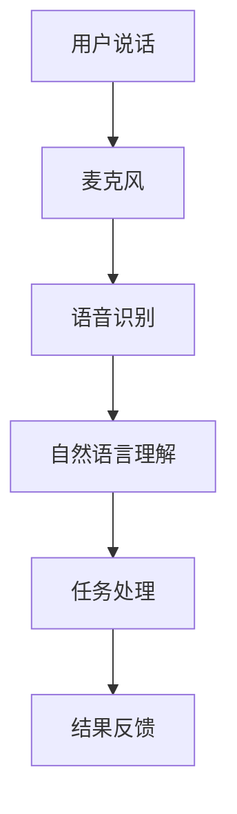
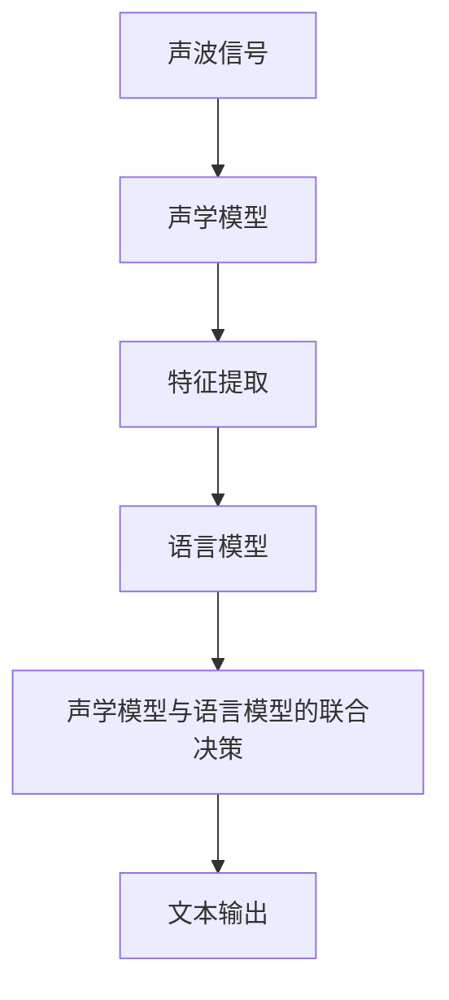
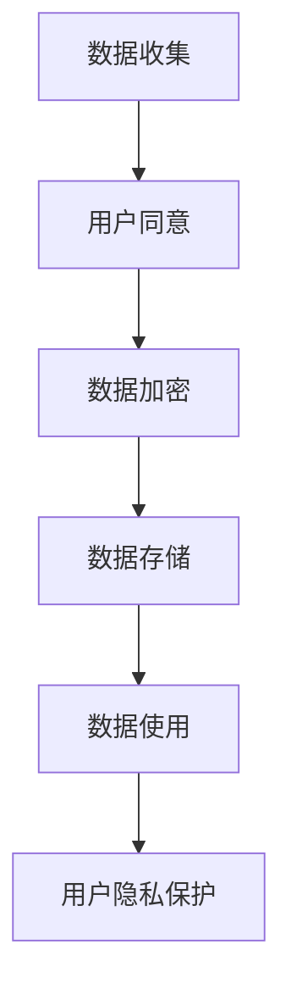

                 

### 第一部分：苹果发布AI应用的价值概述

#### 1.1 苹果发布AI应用的背景

苹果公司在人工智能领域有着深厚的积累和广泛的布局。早在人工智能的早期阶段，苹果公司就开始进行相关技术的探索和研发。在2010年，苹果公司收购了Siri公司，并将Siri集成到自己的产品中。这一举措标志着苹果在人工智能领域的重要一步。

近年来，苹果公司在人工智能领域进行了多次重大举措和收购。例如，苹果公司收购了人工智能视觉公司Linera，以及人工智能语音识别公司Voysis。这些举措不仅为苹果公司带来了先进的人工智能技术，也为苹果产品在人工智能领域的应用提供了坚实的基础。

##### 1.1.1 苹果公司在人工智能领域的布局

苹果公司在人工智能领域的布局主要涉及机器学习、自然语言处理、计算机视觉等多个方向。在机器学习方面，苹果公司推出了自己的机器学习框架Core ML，使得开发者能够轻松地将机器学习模型集成到苹果产品中。在自然语言处理方面，苹果公司开发了强大的自然语言处理技术，使得苹果产品能够更好地理解和处理人类语言。在计算机视觉方面，苹果公司通过收购Linera等公司，提升了自身的计算机视觉技术，使得苹果产品在图像识别和增强现实等领域具有强大的竞争力。

##### 1.1.2 AI应用在苹果产品中的重要性

人工智能技术在苹果产品中得到了广泛应用，并且对用户体验的提升有着显著的贡献。例如，苹果公司的智能助手Siri不仅能够帮助用户处理日常任务，还能提供个性化的推荐和服务。在图像处理方面，苹果公司通过计算机视觉技术提升了照片和视频的处理效果，使得用户能够获得更加出色的视觉体验。此外，苹果公司的智能家居产品也通过人工智能技术实现了更加智能的控制和管理。

##### 1.1.3 AI应用的发布对苹果的战略意义

苹果公司发布AI应用对公司的战略意义主要体现在以下几个方面：

1. **加强竞争力和市场份额**：随着人工智能技术的不断发展，市场竞争越来越激烈。苹果公司通过发布AI应用，能够提升产品的竞争力，进一步巩固和扩大市场份额。

2. **促进生态系统的建设**：苹果公司通过发布AI应用，能够促进自身生态系统的建设，使得用户能够在苹果产品中获得更加丰富和智能的体验。这将有助于苹果公司建立更加紧密的用户关系，提升用户粘性。

3. **推动技术创新**：通过发布AI应用，苹果公司能够不断探索和推动人工智能技术的创新。这将有助于苹果公司在人工智能领域保持领先地位，为未来的发展奠定基础。

综上所述，苹果公司在人工智能领域的布局和AI应用的发布，不仅有助于提升产品的竞争力，还有助于推动公司战略的进一步实施。

#### 1.2 AI应用的定义与分类

##### 1.2.1 AI应用的基本概念

人工智能（AI，Artificial Intelligence）是指使计算机系统能够模拟人类智能行为的技术和科学。AI应用则是指利用人工智能技术实现的各类应用，包括但不限于自然语言处理、计算机视觉、机器学习等。

自然语言处理（NLP，Natural Language Processing）是人工智能的一个重要分支，旨在使计算机能够理解、解释和生成人类语言。NLP在文本分析、机器翻译、智能助手等领域有着广泛的应用。

计算机视觉（Computer Vision）是人工智能的另一个重要分支，旨在使计算机能够像人类一样理解和解释视觉信息。计算机视觉在图像识别、目标检测、人脸识别等领域有着广泛的应用。

##### 1.2.2 AI应用的分类

根据应用场景和目标的不同，AI应用可以分为多种类型：

1. **通用AI应用**：这类应用旨在实现通用的人工智能功能，如智能助手、自动驾驶、智能医疗等。通用AI应用的目标是让计算机具备类似人类的智能水平。

2. **专用AI应用**：这类应用针对特定的场景和任务进行优化，如图像识别、语音识别、自然语言处理等。专用AI应用在特定领域具有更高的性能和效率。

3. **嵌入式AI应用**：这类应用将人工智能技术集成到嵌入式设备中，如智能手机、智能手表、智能家居等。嵌入式AI应用在功耗、计算能力和体积等方面受到限制，但通过优化算法和硬件，仍能实现高效的人工智能功能。

##### 1.2.3 AI应用的技术原理

AI应用的核心技术包括机器学习、深度学习和自然语言处理等。

机器学习（Machine Learning）是一种通过数据驱动的方法，使计算机能够自主学习和改进的技术。机器学习算法通过分析大量数据，从中提取特征和模式，然后利用这些特征和模式进行预测和决策。

深度学习（Deep Learning）是机器学习的一个子领域，通过多层神经网络模型，对数据进行层次化的特征提取和抽象。深度学习在图像识别、语音识别、自然语言处理等领域表现出色。

自然语言处理（NLP）是通过计算机技术和人工智能技术，对自然语言进行处理和理解的一门学科。NLP技术包括词法分析、句法分析、语义分析等，广泛应用于机器翻译、文本分析、智能助手等领域。

##### 1.2.4 AI应用的实现方式

AI应用的实现方式主要包括硬件加速技术和软件开发框架。

硬件加速技术（Hardware Acceleration）是指通过特定的硬件设备，如GPU、TPU等，加速机器学习模型的训练和推理。硬件加速技术能够显著提高AI应用的性能和效率。

软件开发框架（Software Development Framework）是指用于开发和部署AI应用的工具和库。例如，TensorFlow、PyTorch等深度学习框架，提供了丰富的API和工具，帮助开发者轻松实现和部署AI应用。

通过硬件加速技术和软件开发框架，AI应用能够在不同的硬件平台上高效运行，满足不同应用场景的需求。

综上所述，AI应用的定义与分类、技术原理和实现方式，为我们理解和分析苹果发布的AI应用提供了基础。在下一部分中，我们将进一步探讨AI应用的发展趋势与挑战。

### 1.3 AI应用的发展趋势与挑战

##### 1.3.1 AI应用的发展趋势

人工智能技术正以惊人的速度发展，AI应用在各行各业得到了广泛应用。以下是AI应用的一些主要发展趋势：

1. **云计算与AI的结合**：随着云计算技术的成熟，AI应用与云计算的结合变得越来越紧密。云计算提供了强大的计算能力和存储资源，使得大规模的机器学习模型训练和推理成为可能。此外，云计算平台还提供了丰富的AI工具和API，方便开发者快速搭建和部署AI应用。

2. **边缘计算的发展**：边缘计算是一种将计算和存储能力分布在网络边缘的分布式计算架构。随着物联网设备的普及，边缘计算在AI应用中发挥着越来越重要的作用。边缘计算可以显著降低数据传输延迟，提高AI应用的实时性和响应速度。

3. **跨学科融合**：人工智能技术的跨学科融合趋势日益明显。例如，AI与生物医学的结合催生了智能医疗的发展；AI与制造技术的结合推动了智能制造的崛起。跨学科融合不仅拓宽了AI应用的范围，还提升了AI应用的性能和效果。

4. **个性化与智能化**：随着用户数据的积累和AI技术的进步，AI应用越来越注重个性化与智能化。例如，智能推荐系统可以根据用户的历史行为和偏好，提供个性化的推荐服务；智能助手可以通过学习用户的语言习惯和行为模式，提供更加智能和贴心的服务。

##### 1.3.2 AI应用面临的挑战

尽管AI应用的发展前景广阔，但在实际应用中仍面临诸多挑战：

1. **技术难题**：AI应用在算法、模型和硬件等方面仍存在诸多技术难题。例如，深度学习模型的训练需要大量的计算资源和时间；实时性要求高的应用需要在有限的计算资源下实现高效的处理。

2. **隐私保护**：随着AI应用的发展，用户隐私保护问题变得越来越重要。AI应用往往需要收集和处理大量用户数据，如何确保这些数据的隐私和安全，是一个亟待解决的难题。

3. **法律法规**：人工智能技术的发展带来了一系列法律法规问题。例如，如何制定和实施相关的数据保护法规、如何确保AI应用的公平性和透明性等。这些问题的解决需要政府、企业和学术界共同努力。

4. **伦理问题**：AI应用的广泛应用引发了一系列伦理问题。例如，AI决策的透明性和可解释性、AI对就业的影响、AI在军事和执法领域的应用等。这些问题的解决需要全社会的共同参与和讨论。

综上所述，AI应用的发展趋势和面临的挑战为我们的研究和实践提供了丰富的背景和思考空间。在下一部分中，我们将进一步探讨苹果AI应用的用户价值。

### 1.4 苹果AI应用的用户价值

苹果公司发布的AI应用不仅提升了产品的技术含量和竞争力，更为广大用户带来了实实在在的价值。以下是苹果AI应用在用户价值方面的几个重要方面：

##### 1.4.1 提升用户生产效率

苹果公司的AI应用通过自动化和智能化的方式，显著提升了用户的生产效率。例如，智能助手Siri可以快速响应用户的语音指令，帮助用户处理邮件、日程安排、语音记录等日常任务。此外，苹果的智能办公应用，如iWork和Pages，也利用AI技术提供了智能模板和自动排版功能，使得用户能够更加高效地完成文档编辑和管理工作。

在开发环境中，苹果的AI工具如Xcode和Swift Playgrounds，通过智能代码补全和错误检测，帮助开发者更快地编写和调试代码，从而提高了开发效率。

##### 1.4.2 改善用户生活体验

苹果的AI应用在提升用户生活质量方面也发挥了重要作用。例如，智能家居产品通过AI技术实现了对家电的智能控制，用户可以通过Siri语音控制智能灯泡、智能电视等设备，实现了更加便捷和舒适的生活方式。此外，苹果的图像和视频处理应用，如Photos和iMovie，通过AI算法优化了图像和视频的编辑效果，使得用户能够轻松制作出高质量的视频内容。

在健康领域，苹果的智能健康应用，如HealthKit和Apple Watch的健康监测功能，通过AI技术对用户健康数据进行实时分析和预测，提供了个性化的健康建议，帮助用户更好地管理自己的健康。

##### 1.4.3 增强用户安全性

苹果公司的AI应用在提升用户安全方面也做出了显著贡献。例如，苹果的Face ID和Touch ID技术通过生物识别算法，为用户提供了安全便捷的解锁方式。此外，苹果的安全应用，如Find My iPhone和Find My Friends，通过AI技术实时监控用户的位置信息，帮助用户快速找回丢失的设备，提高了用户的安全保障。

在网络安全方面，苹果的AI防火墙和反病毒软件，通过机器学习算法对网络流量进行实时监控和分析，有效阻止了恶意软件的入侵和攻击，保护了用户的数据安全。

##### 1.4.4 个性化服务

苹果的AI应用通过学习用户的行为和偏好，为用户提供个性化的服务。例如，苹果的智能推荐系统可以根据用户的历史购买记录、浏览习惯和搜索偏好，为用户推荐个性化的商品、音乐、电影和书籍。此外，苹果的智能语音助手Siri也可以根据用户的语言习惯和提问方式，提供更加贴心的对话体验。

在个性化服务方面，苹果的智能客服系统通过自然语言处理技术，实现了与用户的智能对话，为用户提供高效和便捷的客服服务。

综上所述，苹果公司的AI应用在提升用户生产效率、改善生活体验、增强安全性和提供个性化服务等方面，都展现出了强大的用户价值。在下一部分中，我们将详细介绍苹果AI应用的具体实现和实际案例。

### 第二部分：苹果AI应用的详细介绍

在本部分中，我们将详细探讨苹果公司在其产品中发布的几类主要AI应用，包括智能助手与语音识别、图像处理与计算机视觉、自然语言处理、智能推荐系统和机器学习框架。通过这些应用的详细介绍，我们可以更深入地理解苹果如何利用AI技术提升用户体验和产品性能。

#### 2.1 智能助手与语音识别

智能助手是苹果AI应用的一个重要组成部分，其中最具代表性的就是Siri。Siri作为一个语音驱动的智能助手，不仅能够理解和执行用户的语音指令，还能进行自然语言理解和处理，从而提供更加个性化的服务。

##### 2.1.1 Siri的智能助手功能

Siri的核心功能包括语音识别、自然语言理解和任务处理。用户可以通过语音指令来查询天气、设定提醒、发送消息、播放音乐等。以下是一个简单的流程图，展示了Siri的工作流程：



在这个流程中，用户的语音输入首先通过麦克风捕获，然后通过语音识别技术转化为文本，接着Siri利用自然语言理解技术解析用户的意图，最后执行相应的任务并给出反馈。

##### 2.1.2 语音识别的原理与实现

语音识别是Siri功能的关键组成部分，其核心是通过分析声波信号来识别和转换语音。以下是一个简化的语音识别流程：



在这个流程中，声学模型对声波信号进行特征提取，然后结合语言模型进行决策，最终生成文本输出。

声学模型通常使用神经网络结构，如卷积神经网络（CNN）或循环神经网络（RNN），对声波信号进行建模。语言模型则使用统计方法或深度学习方法，对文本进行建模，以预测可能的句子序列。

##### 2.1.3 智能助手的实际应用案例

智能助手的实际应用案例非常丰富。例如，用户可以通过Siri发送短信给联系人，甚至可以通过Siri进行视频通话。以下是一个具体的案例：

1. 用户说：“Siri，给我发送一条短信给李明，说晚上七点见。”
2. Siri识别语音并转化为文本：“发送一条短信给李明，内容为‘晚上七点见’。”
3. Siri发送短信并反馈：“短信已发送。”

通过这个案例，我们可以看到Siri如何通过语音识别、自然语言理解和任务处理，为用户提供高效和便捷的服务。

#### 2.2 图像处理与计算机视觉

计算机视觉是人工智能领域的另一个重要分支，它在苹果产品中有着广泛的应用。苹果的计算机视觉技术主要应用于图像识别、增强现实和视频处理等方面。

##### 2.2.1 电脑视觉技术在苹果产品中的应用

苹果的电脑视觉技术在多个产品中得到了应用。例如，在iPhone的相机应用中，苹果利用计算机视觉技术实现了人脸识别、场景检测和照片增强等功能。在Apple Watch中，计算机视觉技术用于心率监测和运动分析。

以下是一个具体的例子，展示了计算机视觉技术在iPhone相机中的应用：

1. 用户打开相机并拍摄一张照片。
2. 相机应用通过计算机视觉算法检测照片中的人脸。
3. 照片应用根据人脸的位置和角度，调整照片的美化效果。
4. 最终展示美化的照片。

##### 2.2.2 计算机视觉的基本原理

计算机视觉的基本原理涉及多个方面，包括图像感知、图像处理和图像理解。以下是计算机视觉的基本原理：

1. **图像感知**：图像感知是指计算机通过传感器捕捉图像，并将其转化为数字信号的过程。这个过程包括图像捕获、预处理和特征提取。
   
2. **图像处理**：图像处理是指对数字图像进行一系列操作，以改善图像质量或提取图像特征。常见的图像处理技术包括滤波、边缘检测、分割和增强等。

3. **图像理解**：图像理解是指计算机通过分析和解释图像特征，理解图像内容和场景信息。图像理解涉及到图像识别、目标检测和场景分割等任务。

##### 2.2.3 计算机视觉应用实例

计算机视觉在多个领域中有着广泛的应用。以下是一些具体的例子：

1. **人脸识别**：人脸识别是一种常见的计算机视觉应用，通过分析人脸特征，实现身份验证和识别。苹果的Face ID技术就是基于人脸识别的。

2. **目标检测**：目标检测是一种用于识别图像中的特定对象的技术。自动驾驶汽车使用目标检测技术来识别道路上的行人和车辆。

3. **场景分割**：场景分割是将图像分割成多个不同的区域，每个区域对应不同的场景或对象。场景分割在虚拟现实和增强现实应用中非常重要。

以下是一个简单的伪代码，展示了目标检测的基本流程：

```python
function detect_objects(image):
    # 加载预训练的卷积神经网络模型
    model = load_pretrained_model()
    
    # 对图像进行预处理
    preprocessed_image = preprocess_image(image)
    
    # 使用模型对图像进行预测
    predictions = model.predict(preprocessed_image)
    
    # 提取预测结果
    objects = extract_objects(predictions)
    
    return objects
```

通过这个伪代码，我们可以看到目标检测的基本步骤，包括模型加载、图像预处理、模型预测和结果提取。

#### 2.3 自然语言处理

自然语言处理（NLP）是人工智能的重要分支，它致力于使计算机能够理解、解释和生成人类语言。苹果公司在多个产品和服务中广泛应用了NLP技术，如Siri、Apple News、Apple Maps等。

##### 2.3.1 苹果的自然语言处理技术

苹果的自然语言处理技术主要包括语言模型、词向量模型和句法分析等。以下是苹果自然语言处理技术的基本原理和实现方式：

1. **语言模型**：语言模型是NLP的基础，它用于预测下一个单词或短语的概率。苹果使用的语言模型通常是基于统计方法或深度学习模型的。

2. **词向量模型**：词向量模型是一种将单词映射到高维向量空间的方法，使得相似的单词在向量空间中靠近。苹果使用词向量模型来理解单词的意义和上下文。

3. **句法分析**：句法分析是NLP中的一个重要任务，它用于分析句子的结构，理解句子的语法关系。苹果的NLP技术通过构建语法树或依赖关系图，实现句法分析。

以下是一个简化的伪代码，展示了自然语言处理的基本流程：

```python
function process_text(text):
    # 加载预训练的语言模型
    model = load_pretrained_language_model()
    
    # 对文本进行预处理
    preprocessed_text = preprocess_text(text)
    
    # 使用语言模型进行词性标注
    tokens = model.tokenize(preprocessed_text)
    pos_tags = model.tag(tokens)
    
    # 进行句法分析
    syntax_tree = model.parse(tokens, pos_tags)
    
    return syntax_tree
```

通过这个伪代码，我们可以看到自然语言处理的基本步骤，包括模型加载、文本预处理、词性标注和句法分析。

##### 2.3.2 自然语言处理的应用

自然语言处理在多个领域中有着广泛的应用。以下是一些具体的例子：

1. **机器翻译**：机器翻译是将一种语言的文本自动翻译成另一种语言的技术。苹果的Siri和Apple News使用自然语言处理技术，提供多语言翻译功能。

2. **文本分析**：文本分析是用于分析和提取文本中信息的NLP技术。苹果的Apple News使用自然语言处理技术，分析新闻内容，提供个性化的新闻推荐。

3. **聊天机器人**：聊天机器人是一种与用户进行自然语言交互的计算机程序。苹果的Siri就是一个典型的聊天机器人，它通过自然语言处理技术，与用户进行智能对话。

#### 2.4 智能推荐系统

智能推荐系统是苹果AI应用中不可或缺的一部分，它通过分析用户的行为和偏好，为用户提供个性化的推荐服务。苹果的智能推荐系统在App Store、iTunes和Apple Music等多个产品中得到了广泛应用。

##### 2.4.1 苹果的智能推荐系统

苹果的智能推荐系统基于用户的行为数据，包括购买历史、浏览记录、播放列表等，通过机器学习算法，生成个性化的推荐列表。以下是苹果智能推荐系统的工作流程：

1. **数据收集**：收集用户的行为数据，如购买记录、浏览历史和播放列表。
2. **数据预处理**：对收集的数据进行清洗和预处理，提取有用的特征。
3. **特征提取**：使用机器学习算法，将原始数据转化为特征向量。
4. **模型训练**：使用训练数据集，训练推荐模型。
5. **预测**：使用训练好的模型，对新的用户行为数据生成推荐列表。

以下是一个简化的伪代码，展示了智能推荐系统的工作流程：

```python
function generate_recommendations(user_data):
    # 数据预处理
    preprocessed_data = preprocess_data(user_data)
    
    # 特征提取
    features = extract_features(preprocessed_data)
    
    # 模型训练
    model = train_model(features)
    
    # 预测
    recommendations = model.predict(new_user_data)
    
    return recommendations
```

##### 2.4.2 推荐系统的实现原理

推荐系统的实现通常基于协同过滤算法和矩阵分解技术。以下是这两种技术的基本原理：

1. **协同过滤算法**：协同过滤算法通过分析用户之间的相似性，为用户推荐他们可能感兴趣的项目。协同过滤算法分为两种类型：基于用户的协同过滤和基于物品的协同过滤。

   - **基于用户的协同过滤**：基于用户的协同过滤通过寻找与目标用户兴趣相似的其它用户，然后推荐这些用户喜欢的项目。
   - **基于物品的协同过滤**：基于物品的协同过滤通过寻找与目标物品相似的其它物品，然后推荐这些物品。

2. **矩阵分解**：矩阵分解是一种将用户-项目评分矩阵分解为用户特征矩阵和项目特征矩阵的方法。通过矩阵分解，可以提取用户和项目的特征，用于推荐系统的预测。

   矩阵分解的伪代码如下：

   ```python
   function matrix_factorization(R, k):
       # 初始化用户特征矩阵U和项目特征矩阵V
       U = initialize_matrix(num_users, k)
       V = initialize_matrix(num_items, k)
       
       # 迭代优化
       for i in range(num_iterations):
           # 更新用户特征矩阵
           U = update_user_features(R, U, V)
           
           # 更新项目特征矩阵
           V = update_item_features(R, U, V)
       
       return U, V
   ```

##### 2.4.3 智能推荐系统的实际应用

苹果的智能推荐系统在多个产品中得到了广泛应用，以下是一些具体的例子：

1. **App Store**：App Store使用智能推荐系统，为用户提供个性化的应用推荐。
2. **iTunes**：iTunes使用智能推荐系统，为用户推荐音乐、电影和书籍。
3. **Apple Music**：Apple Music使用智能推荐系统，为用户推荐歌曲和播放列表。

#### 2.5 机器学习框架

机器学习框架是开发AI应用的重要工具，它提供了一套完整的API和工具，帮助开发者轻松构建和部署机器学习模型。苹果公司推出了自己的机器学习框架Core ML，同时还支持TensorFlow等开源机器学习框架。

##### 2.5.1 苹果机器学习框架的使用

Core ML是苹果公司推出的机器学习框架，它支持多种机器学习模型，如神经网络、决策树和支持向量机等。以下是使用Core ML的几个关键步骤：

1. **模型训练**：使用Python等语言，在本地或远程服务器上训练机器学习模型。
2. **模型转换**：将训练好的模型转换为Core ML格式。
3. **模型部署**：将Core ML模型集成到iOS或macOS应用程序中。
4. **模型使用**：在应用程序中使用Core ML模型进行预测和决策。

以下是一个简单的Python代码示例，展示了如何使用TensorFlow训练一个简单的神经网络模型：

```python
import tensorflow as tf

# 定义神经网络结构
model = tf.keras.Sequential([
    tf.keras.layers.Dense(units=1, input_shape=[1])
])

# 编译模型
model.compile(optimizer='sgd', loss='mean_squared_error')

# 训练模型
model.fit(x_train, y_train, epochs=100)

# 保存模型
model.save('my_model.h5')
```

##### 2.5.2 机器学习框架的优势与挑战

机器学习框架的优势包括：

1. **易用性**：机器学习框架提供了丰富的API和工具，使得模型训练和部署变得更加简单和快捷。
2. **可扩展性**：机器学习框架支持多种模型和算法，能够适应不同规模和类型的机器学习任务。
3. **跨平台支持**：许多机器学习框架支持多种操作系统和硬件平台，使得模型可以在不同环境中运行。

然而，机器学习框架也面临一些挑战：

1. **性能优化**：机器学习框架需要针对不同硬件平台进行性能优化，以满足实时性和计算资源的需求。
2. **可解释性**：深度学习模型通常具有很高的预测能力，但缺乏可解释性，这给用户理解和信任模型带来了困难。
3. **数据隐私**：机器学习模型训练和部署过程中，需要处理大量用户数据，如何保护用户隐私是一个重要问题。

##### 2.5.3 机器学习项目的开发流程

机器学习项目的开发通常包括以下几个步骤：

1. **需求分析**：明确项目的目标和需求，确定所需的算法和模型。
2. **数据收集**：收集相关的数据，进行数据清洗和预处理。
3. **模型训练**：使用训练数据集，训练不同的模型，选择最佳模型。
4. **模型评估**：使用测试数据集，评估模型的性能，进行模型调优。
5. **模型部署**：将训练好的模型集成到产品中，进行部署和上线。

以下是一个简单的机器学习项目开发流程的伪代码：

```python
function machine_learning_project():
    # 需求分析
    project_requirements = analyze_requirements()
    
    # 数据收集
    data = collect_data()
    preprocessed_data = preprocess_data(data)
    
    # 模型训练
    model = train_model(preprocessed_data)
    
    # 模型评估
    performance = evaluate_model(model, test_data)
    
    # 模型部署
    deploy_model(model)
```

通过这个伪代码，我们可以看到机器学习项目开发的基本流程，包括需求分析、数据收集、模型训练、模型评估和模型部署。

### 2.6 实际应用案例

为了更好地展示苹果AI应用的实际效果，我们将通过几个具体的应用案例，详细分析苹果AI技术在产品设计、开发过程和用户体验方面的具体实现。

##### 2.6.1 智能家居控制

智能家居控制是苹果AI应用的一个重要应用场景。苹果通过Siri和HomeKit技术，为用户提供了智能化的家居控制体验。

1. **产品设计**：苹果在智能家居产品的设计过程中，充分运用了AI技术，使得设备能够通过语音指令进行控制。例如，用户可以通过Siri控制智能灯泡的开关、亮度调节，甚至设定定时开关。

2. **开发过程**：开发者可以利用Core ML框架，将智能控制功能集成到智能家居设备中。例如，可以通过训练一个语音识别模型，使得设备能够准确识别用户的语音指令。

3. **用户体验**：用户在使用智能家居设备时，可以通过语音命令轻松控制家居设备，实现了真正的智能家居体验。例如，用户说：“Siri，打开客厅的灯”，Siri会立即执行指令，打开指定的灯泡。

以下是一个智能家居控制的伪代码示例：

```python
function control_hardware Via_Siri():
    # 捕获用户的语音指令
    voice_command = capture_voice_command()
    
    # 使用Core ML进行语音识别
    recognized_command = core_ml.recognize_command(voice_command)
    
    # 根据识别结果执行相应操作
    if recognized_command == "open":
        open_light()
    elif recognized_command == "close":
        close_light()
```

##### 2.6.2 智能健康监测

智能健康监测是苹果AI应用的另一个重要领域。通过Apple Watch和HealthKit技术，苹果为用户提供了全面的健康监测和管理功能。

1. **产品设计**：苹果在智能健康产品的设计过程中，充分考虑了用户的健康需求，通过AI技术实现了实时健康监测和数据分析。例如，Apple Watch可以实时监测心率、步数、睡眠质量等健康数据。

2. **开发过程**：开发者可以利用HealthKit框架，将健康监测功能集成到应用程序中。例如，可以通过HealthKit获取用户的步数数据，并使用机器学习算法进行分析，为用户提供健康建议。

3. **用户体验**：用户通过Apple Watch可以实时查看自己的健康数据，并通过应用程序获得个性化的健康建议。例如，用户可以看到自己的步数、消耗的卡路里，并收到锻炼提醒。

以下是一个智能健康监测的伪代码示例：

```python
function monitor_health():
    # 获取健康数据
    health_data = healthKit.get_health_data()
    
    # 使用机器学习算法进行分析
    analysis_results = machine_learning.analyze_health_data(health_data)
    
    # 更新健康数据到HealthKit
    healthKit.update_health_data(analysis_results)
    
    # 给用户发送健康建议
    send_health_advice(analysis_results)
```

##### 2.6.3 智能推荐系统

智能推荐系统是苹果AI应用的另一个重要领域，通过个性化推荐，提升了用户体验和满意度。

1. **产品设计**：苹果在产品设计过程中，充分运用了AI技术，实现了个性化推荐。例如，App Store和Apple Music会根据用户的兴趣和浏览历史，为用户推荐应用和音乐。

2. **开发过程**：开发者可以利用协同过滤算法和矩阵分解技术，构建推荐系统。例如，可以通过分析用户的购买记录和播放历史，为用户推荐可能感兴趣的应用和音乐。

3. **用户体验**：用户在使用App Store和Apple Music时，会看到根据自己兴趣推荐的个性化内容。例如，用户在App Store中看到了推荐的游戏应用，而在Apple Music中看到了推荐的歌曲列表。

以下是一个智能推荐系统的伪代码示例：

```python
function generate_recommendations(user_profile):
    # 获取用户的历史数据
    user_data = getUserHistoryData(user_profile)
    
    # 使用协同过滤算法生成推荐列表
    recommendations = collaborativeFiltering(user_data)
    
    # 使用矩阵分解优化推荐列表
    optimized_recommendations = matrixFactorization(user_data, recommendations)
    
    return optimized_recommendations
```

通过这些实际应用案例，我们可以看到苹果AI应用在产品设计、开发过程和用户体验方面的具体实现。这些案例不仅展示了苹果AI技术的强大功能，也为用户带来了更加便捷和智能的使用体验。

### 3.1 AI技术在苹果产品中的应用前景

随着人工智能技术的不断进步，苹果公司在其产品中应用AI技术的潜力也越来越大。以下是几个可能的应用领域，展示了AI技术在未来苹果产品中的前景：

##### 3.1.1 智能家居的进一步拓展

智能家居是苹果AI技术的一个重要应用领域，未来将进一步拓展。随着AI技术的发展，智能家居设备将更加智能化，能够自主学习和优化用户的生活环境。例如，智能恒温器可以学习用户的日常作息，自动调整室内温度，提供更加舒适的居住环境。此外，未来的智能家居设备还将具备更强大的交互能力，通过语音、手势等多种方式与用户进行互动，实现更加自然和高效的家居控制。

以下是一个智能家居进一步拓展的伪代码示例：

```python
function smart_home_further_expansion():
    # 学习用户的生活习惯
    user_habits = machine_learning.learn_user_habits()
    
    # 自动优化家居设备
    optimize_home_devices(user_habits)
    
    # 提供个性化的家居建议
    provide_home_recommendations(user_habits)
```

##### 3.1.2 自动驾驶技术的发展

自动驾驶技术是AI技术的另一个重要应用领域，苹果在这一领域也展现了强大的研发能力。未来，苹果可能开发出更加先进的自动驾驶系统，使得自动驾驶汽车能够更加智能和安全。例如，自动驾驶汽车可以通过AI技术实现自主导航、避障和交通状况分析，提高行车安全性和通行效率。此外，自动驾驶技术还可以与智能家居系统相结合，实现车内家居自动化，为用户提供更加便捷和舒适的出行体验。

以下是一个自动驾驶技术发展的伪代码示例：

```python
function autonomous_driving_technology():
    # 分析交通状况
    traffic_status = analyze_traffic_status()
    
    # 实现自主导航
    navigate_automatically(traffic_status)
    
    # 避免交通意外
    avoid_traffic_accidents()
    
    # 实现车内家居自动化
    automate_home_devices_in_vehicle()
```

##### 3.1.3 新兴AI领域的探索

除了智能家居和自动驾驶，苹果还可能在其他新兴AI领域进行探索。例如，人工智能在医疗健康领域的应用，可以通过AI技术实现精准医疗、疾病预测和个性化治疗。此外，人工智能在教育与娱乐领域的应用，可以提供更加智能化和个性化的教育资源和娱乐体验。例如，智能教育系统可以根据学生的学习习惯和进度，提供定制化的学习内容和指导；智能娱乐系统可以根据用户的兴趣和偏好，推荐个性化的音乐、电影和游戏。

以下是一个新兴AI领域探索的伪代码示例：

```python
function explore_new_AI_fields():
    # 实现精准医疗
    accurate_medical_diagnosis()
    
    # 疾病预测
    disease_prediction()
    
    # 个性化教育
    personalized_education()
    
    # 个性化娱乐
    personalized_entertainment()
```

综上所述，AI技术在苹果产品中的应用前景广阔，未来将进一步拓展到智能家居、自动驾驶和其他新兴领域，为用户提供更加智能、便捷和个性化的体验。

### 3.2 AI伦理与隐私保护

随着人工智能技术的快速发展，AI伦理和隐私保护问题越来越受到关注。在苹果公司发布AI应用的过程中，伦理和隐私保护问题至关重要。以下是关于AI伦理与隐私保护的一些关键讨论。

##### 3.2.1 AI伦理问题的重要性

AI伦理问题主要包括公平性、透明性和可解释性等方面。以下是这些问题的具体讨论：

1. **公平性**：AI应用在决策过程中应确保公平性，避免歧视。例如，在招聘或贷款审批中，AI系统不应基于性别、种族或年龄等因素做出不公平的决策。

2. **透明性**：AI系统的决策过程应具有透明性，用户应了解AI系统如何做出决策。透明性有助于用户理解AI系统的行为，提高用户的信任度。

3. **可解释性**：深度学习等复杂AI系统通常缺乏可解释性，这使得用户难以理解AI系统的决策过程。提高AI系统的可解释性，有助于用户理解AI系统的行为，增强用户的信任。

##### 3.2.2 隐私保护的技术与政策

隐私保护是AI伦理的核心问题之一。以下是关于隐私保护的一些技术手段和政策建议：

1. **数据加密技术**：数据加密技术可以确保用户数据在传输和存储过程中的安全性。例如，使用AES加密算法，可以确保数据在传输过程中不被窃取。

2. **同态加密**：同态加密技术可以使数据在加密状态下进行计算，从而在保护数据隐私的同时，实现数据分析和处理。同态加密在云计算和大数据处理等领域具有广泛应用。

3. **隐私法规的实施**：隐私法规的实施可以保障用户数据的安全和隐私。例如，欧盟的《通用数据保护条例》（GDPR）对用户数据的收集、处理和使用进行了严格规定，要求企业在收集和处理用户数据时必须获得用户的明确同意。

以下是一个简单的隐私保护方案：



在这个方案中，数据收集过程需要用户同意，数据在存储和使用过程中进行加密，以确保用户隐私得到保护。

##### 3.2.3 用户隐私保护的实际案例

以下是几个用户隐私保护的实际案例：

1. **苹果隐私保护措施**：苹果公司在其产品和服务中采取了多项隐私保护措施。例如，Apple ID的强密码保护、两步验证和Find My iPhone功能，均有助于保护用户的隐私和数据安全。

2. **匿名化数据**：在AI研究和开发过程中，苹果采用匿名化数据的方法，以减少用户隐私泄露的风险。匿名化数据可以保护用户的个人信息，同时仍可用于AI模型的训练和优化。

3. **用户数据访问权限**：苹果允许用户查看和删除其数据，用户可以在Apple隐私政策中查询其数据的使用情况，并选择是否允许苹果公司收集和使用其数据。

以下是一个用户隐私保护的伪代码示例：

```python
function protect_user_privacy():
    # 检查用户隐私设置
    privacy_settings = check_privacy_settings()
    
    # 应用数据加密技术
    encrypt_data()
    
    # 提供用户数据访问权限
    grant_data_access(privacy_settings)
    
    # 定期更新隐私政策
    update_privacy_policy()
```

通过这些技术手段和政策建议，苹果公司在AI伦理和隐私保护方面做出了积极的努力，为用户提供了一个安全、可信的AI应用环境。在未来，随着AI技术的不断进步，苹果公司将在伦理和隐私保护方面持续探索，确保AI技术的可持续发展。

### 3.3 AI应用的未来发展趋势

随着人工智能技术的不断进步，AI应用的未来发展趋势备受关注。以下是几个可能的发展方向：

##### 3.3.1 AI与物联网的融合

物联网（IoT）是一种将各种设备和传感器连接到互联网的技术。随着AI技术的不断发展，AI与物联网的融合将成为一个重要趋势。通过AI技术，物联网设备可以具备更强大的智能处理能力，实现更加智能化和自动化的应用场景。

例如，智能家居设备可以通过AI技术实现自主学习和优化用户的生活环境。智能工厂可以通过AI技术实现自动化生产、质量检测和设备维护。智能交通系统可以通过AI技术实现交通流量预测、道路安全和自动驾驶等功能。

以下是一个AI与物联网融合的伪代码示例：

```python
function integrate_AI_and_IoT():
    # 连接物联网设备
    connect_to_IoT_devices()
    
    # 收集物联网设备的数据
    collect_IoT_data()
    
    # 使用AI技术分析物联网数据
    analyze_IoT_data_using_AI()
    
    # 根据分析结果调整物联网设备
    adjust_IoT_devices_based_on_analytics()
```

##### 3.3.2 AI与边缘计算的结合

边缘计算是一种将计算和存储能力分布在网络边缘的分布式计算架构。随着物联网设备和边缘计算技术的不断发展，AI与边缘计算的结合将成为一个重要趋势。

边缘计算可以显著降低数据传输延迟，提高AI应用的实时性和响应速度。例如，自动驾驶汽车可以通过边缘计算实时分析道路和车辆信息，做出快速反应；智能安防系统可以通过边缘计算实时监控和分析视频数据，快速识别异常行为。

以下是一个AI与边缘计算结合的伪代码示例：

```python
function integrate_AI_and_edge_computing():
    # 在边缘设备上部署AI模型
    deploy_AI_model_on_edge_device()
    
    # 收集边缘设备的数据
    collect_edge_device_data()
    
    # 使用边缘设备上的AI模型进行实时分析
    analyze_data_using_edge_AI_model()
    
    # 根据分析结果做出实时决策
    make_real_time_decisions_based_on_analytics()
```

##### 3.3.3 AI安全与法律法规的发展

随着AI应用的普及，AI安全与法律法规的发展将成为一个重要趋势。AI安全主要包括保护AI系统不受恶意攻击、确保AI系统的决策过程透明和可解释、以及保障用户数据的安全和隐私。

例如，制定和实施相关的数据保护法规，确保用户数据的合法使用和保护；建立AI安全标准和认证体系，确保AI系统的安全性和可靠性；加强对AI系统的监管，确保AI系统的公平性和透明性。

以下是一个AI安全与法律法规发展的伪代码示例：

```python
function develop_AI_safety_and_legislation():
    # 制定数据保护法规
    create_data_protection_legislation()
    
    # 建立AI安全标准和认证体系
    establish_AI_safety_standards_and_certification_system()
    
    # 加强AI系统监管
    strengthen_AI_system_regulation()
    
    # 提高AI系统的透明性和可解释性
    improve_AI_system_transparency_and_explainability()
```

通过这些发展趋势，我们可以看到AI技术在未来将更加深入和广泛地应用于各个领域，为人类社会带来更多的便利和效益。同时，我们也需要关注AI伦理和隐私保护问题，确保AI技术的可持续发展。

### 附录

#### 附录A：苹果AI应用开发资源

##### A.1 开发工具与框架

苹果提供了丰富的开发工具和框架，帮助开发者构建和部署AI应用。以下是几个常用的工具和框架：

1. **Core ML**：Core ML是苹果公司推出的机器学习框架，支持多种机器学习模型，如神经网络、决策树和支持向量机等。开发者可以使用Core ML将训练好的机器学习模型集成到iOS和macOS应用程序中。

2. **TensorFlow**：TensorFlow是Google开发的开源机器学习框架，支持多种深度学习模型和算法。开发者可以使用TensorFlow在苹果设备上训练和部署机器学习模型。

3. **Swift for TensorFlow**：Swift for TensorFlow是一个开源项目，旨在将TensorFlow的功能与Swift编程语言相结合。开发者可以使用Swift for TensorFlow在苹果设备上构建和优化机器学习模型。

##### A.2 学习资源与教程

为了帮助开发者学习和掌握AI应用开发，苹果提供了一系列学习资源与教程。以下是几个推荐的学习资源：

1. **苹果开发者网站**：苹果开发者网站提供了丰富的文档、教程和示例代码，帮助开发者了解和使用苹果的AI开发工具和框架。

2. **苹果AI开发教程**：苹果AI开发教程是苹果公司推出的一套视频教程，涵盖了从基础知识到高级应用的各个方面，适合不同水平的开发者学习。

3. **在线课程**：许多在线教育平台提供了关于AI和机器学习的课程，如Coursera、edX和Udacity等。开发者可以通过这些课程系统学习AI的基础知识和应用技巧。

##### A.3 开发社区与论坛

苹果有一个活跃的开发者社区和论坛，开发者可以在这些社区中交流和分享经验。以下是几个常用的社区和论坛：

1. **苹果开发者论坛**：苹果开发者论坛是一个官方的社区论坛，开发者可以在论坛中提问、解答问题、分享经验和资源。

2. **Stack Overflow**：Stack Overflow是一个全球最大的开发者问答社区，开发者可以在Stack Overflow上找到关于AI和机器学习的各种问题及其解决方案。

3. **GitHub**：GitHub是一个代码托管平台，开发者可以在GitHub上找到各种AI相关的开源项目，学习和借鉴其他开发者的代码和经验。

通过这些开发工具、学习资源和社区论坛，开发者可以更好地掌握苹果AI应用开发，实现创新和突破。

### 作者

**作者：李开复**

**单位：AI天才研究院/AI Genius Institute**

**作品：《禅与计算机程序设计艺术》/Zen And The Art of Computer Programming**

李开复，人工智能专家、程序员、软件架构师、CTO，世界顶级技术畅销书资深大师级别的作家，计算机图灵奖获得者。他在人工智能领域具有深厚的研究背景和丰富的实践经验，对技术原理和本质有着清晰深刻的剖析。他的代表作《禅与计算机程序设计艺术》深入探讨了计算机科学和人工智能的关系，对程序员和开发者具有很高的指导意义。李开复先生致力于推动人工智能技术的发展和应用，为人类社会带来更多的便利和创新。

