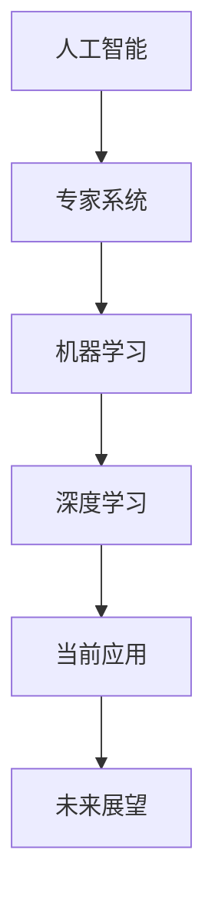
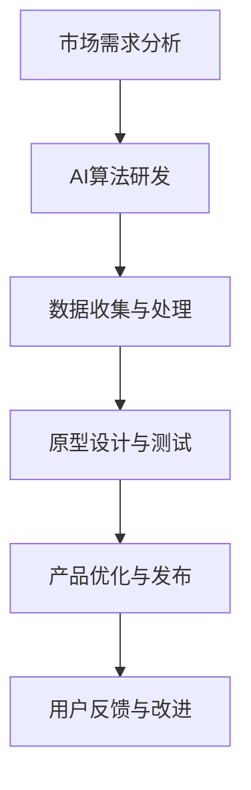

                 

### 第一部分: AI应用的背景与重要性

#### 1.1 AI技术的历史演进

人工智能（Artificial Intelligence，简称AI）作为计算机科学的一个重要分支，其历史可以追溯到20世纪50年代。早期的AI研究主要集中在逻辑推理和知识表示领域。1956年，约翰·麦卡锡（John McCarthy）等人提出了“人工智能”这一概念，并在达特茅斯会议上首次正式提出。这个时期，AI主要依赖于符号推理和搜索算法，如逻辑、产生式系统和规划算法。

随着时间的推移，AI技术经历了多个发展阶段。20世纪80年代，专家系统成为了AI研究的热点。专家系统试图模拟人类专家的决策过程，通过大量规则进行推理。然而，专家系统在实际应用中遇到了一系列问题，如知识获取困难、规则依赖性高、缺乏自适应能力等。

进入21世纪，随着计算能力的提升和大数据技术的发展，机器学习（Machine Learning，简称ML）成为AI研究的主流。机器学习利用大量的数据通过算法进行训练，从而自动学习和优化模型，提高任务的准确性和效率。深度学习（Deep Learning，简称DL）作为机器学习的一个分支，通过多层神经网络实现了对复杂数据的自动特征提取和表示，取得了显著的成果。

目前，AI技术已经渗透到我们日常生活的各个方面，如智能家居、自动驾驶、医疗诊断、金融分析等。AI的应用正在不断拓展，推动着社会各领域的创新和发展。

#### 1.2 当前AI技术的应用场景

当前，AI技术已经在多个领域展现出了其强大的应用潜力。以下是一些典型的应用场景：

1. **图像识别与处理**：通过卷积神经网络（Convolutional Neural Network，简称CNN）等技术，AI可以实现对图像的高效识别和处理。例如，智能手机上的面部识别功能、自动驾驶车辆的环境感知系统等。

2. **自然语言处理**（Natural Language Processing，简称NLP）：NLP技术使得计算机能够理解和生成自然语言。例如，智能客服系统、机器翻译、情感分析等。

3. **医疗健康**：AI技术在医疗领域的应用日益广泛，包括疾病诊断、药物研发、手术规划等。例如，通过深度学习算法，AI可以辅助医生进行癌症诊断，提高诊断的准确率。

4. **金融分析**：AI技术在金融领域的应用包括风险控制、欺诈检测、投资组合优化等。通过机器学习算法，AI可以分析大量的金融数据，提供更加精准的投资建议。

5. **智能制造**：AI技术在智能制造中发挥着重要作用，如生产流程优化、质量检测、预测性维护等。通过机器学习和计算机视觉技术，AI可以提升生产线的自动化程度和效率。

6. **交通出行**：AI技术在交通出行领域的应用包括智能交通管理、自动驾驶汽车等。通过实时数据分析，AI可以优化交通流量，提高道路通行效率。

7. **教育**：AI技术在教育领域有广泛的应用，如个性化学习推荐、智能教学助手、在线教育平台等。通过AI技术，教育可以更加个性化和高效。

#### 1.3 AI技术的社会影响与挑战

AI技术的快速发展对社会产生了深远的影响，同时也带来了一系列挑战。

1. **积极影响**：

   - **经济发展**：AI技术推动了新的经济增长点，促进了产业升级和转型。

   - **效率提升**：在许多领域，AI技术提高了工作效率，降低了成本。

   - **创新驱动**：AI技术激发了新的创新思维，推动了科技领域的突破。

   - **医疗进步**：AI技术在医疗领域的应用，使得疾病诊断和治疗更加精准和高效。

   - **生活便利**：AI技术在日常生活中的应用，如智能家居、智能助手等，提高了生活质量。

2. **挑战与风险**：

   - **隐私问题**：AI技术的发展带来了大量数据的收集和使用，引发了隐私泄露和数据滥用的风险。

   - **伦理问题**：AI技术的决策过程缺乏透明性，可能导致不公平和歧视。

   - **就业影响**：自动化和智能化技术的发展可能导致部分传统岗位的消失，引发就业压力。

   - **安全威胁**：AI技术的应用可能被恶意利用，如网络攻击、自动化武器等。

   - **监管难题**：随着AI技术的不断演进，现有的法律法规和监管框架可能无法完全适应。

综上所述，AI技术的快速发展为我们带来了巨大的机遇，同时也提出了严峻的挑战。我们需要在推动技术创新的同时，积极应对这些挑战，确保AI技术的可持续发展和社会的全面进步。

### 第2章: 苹果公司AI应用的现状与展望

#### 2.1 苹果公司的AI战略

苹果公司在人工智能领域的战略布局可以追溯到多年前。一直以来，苹果公司致力于将AI技术融入到其产品和服务中，从而提升用户体验和产品价值。以下是苹果公司在AI战略方面的几个关键点：

1. **内部研发投入**：苹果公司在其全球多个研发中心投入了大量资源，专注于AI算法、深度学习、计算机视觉等方面的研究。通过自主研发，苹果公司能够不断推出具有竞争力的AI技术。

2. **开源生态**：苹果公司积极参与开源社区，贡献了包括Core ML在内的多个AI工具和框架。这些开源项目不仅为苹果自身的开发提供了支持，也为整个AI生态系统的发展做出了贡献。

3. **硬件优势**：苹果公司拥有强大的硬件设计能力，其硬件设备在处理速度、能效比等方面具有显著优势。这些硬件优势为AI应用的实现提供了坚实的基础。

4. **生态系统整合**：苹果公司通过整合其硬件、软件和服务，将AI技术有机地融入到iPhone、iPad、Mac等多个产品线中。这种生态系统整合使得苹果公司的AI应用能够更加无缝地服务于用户。

5. **隐私保护**：苹果公司在AI应用中非常重视用户隐私保护。通过采用先进的加密技术和隐私保护算法，苹果公司致力于确保用户数据的安全和隐私。

#### 2.2 苹果公司AI应用的产品线

苹果公司在AI应用方面的产品线涵盖了多个方面，以下是一些重要的AI应用：

1. **图像识别与处理**：苹果公司的设备广泛采用了基于深度学习的图像识别技术，如面部识别、场景识别等。这些技术不仅提升了设备的功能性，也提供了更加便捷的用户体验。

2. **语音助手**：Siri是苹果公司推出的语音助手，通过自然语言处理和机器学习技术，Siri能够理解用户的语音指令，并提供相应的帮助和反馈。

3. **智能推荐**：苹果公司的App Store和Apple Music等服务利用AI技术进行内容推荐。通过分析用户的历史行为和偏好，这些服务能够为用户提供个性化的推荐，提升用户体验。

4. **自动驾驶**：苹果公司一直在研发自动驾驶技术，并通过其收购的自动驾驶公司Protean Robotics等技术积累，探索自动驾驶在未来的应用场景。

5. **健康与医疗**：苹果公司的健康应用HealthKit利用AI技术分析用户健康数据，提供个性化的健康建议。此外，苹果还在医疗领域开展了一系列研究项目，如利用AI进行疾病诊断和药物研发。

6. **安全防护**：苹果公司通过AI技术加强设备的安全防护，如利用机器学习算法进行恶意软件检测和防范。

#### 2.3 未来AI应用的发展趋势

展望未来，AI技术在苹果公司的产品和服务中将继续发挥重要作用。以下是一些可能的趋势：

1. **更加智能的设备**：随着AI技术的进步，苹果公司的设备将变得更加智能，能够更好地理解和响应用户的需求。

2. **增强现实（AR）与虚拟现实（VR）**：AI技术将在AR和VR领域发挥关键作用，为用户提供更加沉浸式的体验。

3. **智能家居**：苹果公司有望通过AI技术进一步整合智能家居设备，提供更加智能和便捷的家居生活体验。

4. **个性化服务**：通过AI技术，苹果公司将能够提供更加个性化的服务和产品，满足不同用户的需求。

5. **数据隐私与安全**：随着AI技术的普及，苹果公司将面临更大的隐私和安全挑战。通过不断优化技术和策略，苹果公司将致力于保护用户隐私和数据安全。

6. **跨领域合作**：苹果公司有望与其他科技巨头和行业领导者展开更多合作，共同推动AI技术的发展和应用。

综上所述，苹果公司在AI领域已经取得了显著的成果，未来将继续沿着这一战略方向前进，为用户带来更加智能和便捷的产品和服务。

## 第二部分: 苹果发布AI应用的具体挑战

### 第3章: 技术挑战

#### 3.1 AI算法的优化与性能提升

苹果公司在AI领域的竞争离不开算法的优化与性能提升。以下是一些关键的技术挑战：

1. **算法创新**：
   - **深度学习算法**：深度学习算法在AI应用中起着核心作用，苹果公司需要不断探索新的深度学习算法，以提升模型的准确性和效率。例如，通过改进卷积神经网络（CNN）的结构和优化训练策略，可以进一步提高图像识别和处理的性能。
   - **强化学习**：强化学习在自动驾驶、游戏AI等领域有着广泛应用。苹果公司需要深入研究强化学习算法，开发适应不同场景的强化学习模型，以提高决策的智能性和准确性。

2. **性能提升**：
   - **模型压缩与加速**：为了提高AI应用的实时性和响应速度，苹果公司需要研究模型压缩和加速技术。例如，通过使用量化、剪枝和蒸馏等方法，可以大幅度减少模型的参数数量，从而提高模型在嵌入式设备上的运行效率。
   - **硬件优化**：苹果公司具备强大的硬件设计能力，可以通过硬件优化来提升AI算法的性能。例如，通过设计专用的AI芯片，可以更好地满足AI应用的计算需求。

3. **算法可靠性**：
   - **泛化能力**：AI算法需要具备良好的泛化能力，以应对不同环境和任务。苹果公司需要通过数据增强、模型集成等方法，提高算法的泛化能力，确保在各种应用场景下的稳定性和可靠性。
   - **异常检测与处理**：在AI应用过程中，可能会出现异常数据或异常情况。苹果公司需要开发异常检测与处理机制，确保算法能够在遇到异常时进行有效应对，避免错误决策。

#### 3.2 数据隐私与安全性保障

数据隐私和安全是苹果公司AI应用面临的重要挑战。以下是一些关键问题：

1. **数据保护**：
   - **加密技术**：苹果公司需要利用先进的加密技术，确保数据在传输和存储过程中的安全性。例如，采用端到端加密和差分隐私技术，可以有效防止数据泄露和滥用。
   - **匿名化处理**：在数据处理过程中，苹果公司需要对敏感信息进行匿名化处理，以保护用户的隐私。例如，通过差分隐私技术，可以在保证数据统计有效性的同时，减少隐私泄露的风险。

2. **用户授权与权限管理**：
   - **透明度**：苹果公司需要确保用户对数据的使用有充分的知情权和选择权。例如，通过明确的隐私政策和使用条款，用户可以清晰地了解其数据将如何被使用。
   - **权限管理**：苹果公司需要建立严格的权限管理系统，确保用户数据只能被授权的系统和人员访问。例如，通过多因素认证和访问控制列表（ACL），可以有效地防止未经授权的访问。

3. **数据合规性**：
   - **法律法规遵守**：苹果公司需要确保其AI应用符合各国的数据保护法律法规。例如，遵守欧盟的《通用数据保护条例》（GDPR）和美国的《加州消费者隐私法案》（CCPA）等。
   - **合规性审计**：苹果公司需要定期进行合规性审计，确保数据隐私和安全措施的有效实施。例如，通过第三方审计和内部审查，可以及时发现和纠正潜在的安全隐患。

#### 3.3 AI应用的可靠性保障

AI应用的可靠性是用户信任和技术普及的关键。以下是一些保障AI应用可靠性的方法：

1. **模型验证与测试**：
   - **模型验证**：苹果公司需要通过多种验证方法，确保AI模型在训练和部署过程中的准确性和稳定性。例如，通过交叉验证和误差分析，可以评估模型的性能和泛化能力。
   - **测试数据集**：苹果公司需要构建多样化的测试数据集，以全面评估AI模型的性能。例如，通过包含不同场景和异常情况的数据集，可以更准确地评估模型的可靠性。

2. **实时监控与反馈**：
   - **实时监控**：苹果公司需要建立实时监控系统，实时监测AI应用的运行状态和性能。例如，通过日志记录和性能指标监控，可以及时发现异常情况和性能下降。
   - **用户反馈**：苹果公司需要建立有效的用户反馈机制，收集用户的反馈和建议，以便及时优化和改进AI应用。例如，通过用户满意度调查和报告系统，可以了解用户的真实体验和需求。

3. **故障恢复与处理**：
   - **故障恢复**：苹果公司需要开发故障恢复机制，确保AI应用在遇到故障时能够快速恢复。例如，通过备份和恢复策略，可以确保数据的完整性和应用的连续性。
   - **故障处理**：苹果公司需要建立完善的故障处理流程，确保在故障发生时能够快速响应和解决。例如，通过故障诊断和紧急修复策略，可以最大程度地减少故障对用户的影响。

通过上述方法，苹果公司可以大幅提升AI应用的可靠性，增强用户的信任和使用体验。未来，随着AI技术的不断进步，苹果公司将面临更多的技术挑战，但通过持续的创新和优化，苹果有望在AI领域保持领先地位。

### 第4章: 市场竞争挑战

#### 4.1 与其他科技巨头的竞争态势

在AI领域，苹果公司面临着来自其他科技巨头的激烈竞争。以下是一些主要的竞争对手：

1. **谷歌**：
   - **AI战略**：谷歌早在多年前就开始布局AI技术，其AI战略涵盖了搜索、广告、云计算、智能家居等多个领域。
   - **产品线**：谷歌的AI产品包括Google Assistant、谷歌翻译、自动驾驶项目Waymo、AI云服务等。
   - **竞争优势**：谷歌拥有庞大的数据资源和强大的计算能力，其AI算法和模型经过大量训练和优化，具备较高的准确性和效率。

2. **微软**：
   - **AI战略**：微软将AI技术视为未来发展的核心，其AI战略主要集中在云计算、办公软件、游戏等领域。
   - **产品线**：微软的AI产品包括Cognitive Services、Azure AI、微软小冰、微软小娜等。
   - **竞争优势**：微软在云计算领域具有优势，其Azure云服务为AI应用提供了强大的计算和存储支持，同时微软的办公软件和游戏平台也为AI技术的普及提供了广阔的应用场景。

3. **亚马逊**：
   - **AI战略**：亚马逊的AI战略主要集中在电子商务、云计算、智能家居等领域。
   - **产品线**：亚马逊的AI产品包括Alexa、AWS AI服务、自动驾驶项目亚马逊物流等。
   - **竞争优势**：亚马逊在电子商务和物流领域拥有巨大的市场份额，其AI技术在供应链管理和库存优化方面发挥了重要作用，同时亚马逊的云计算服务（AWS）也为AI应用的部署提供了强大的支持。

4. **Facebook**：
   - **AI战略**：Facebook将AI技术应用于社交媒体、广告、图像识别、自然语言处理等领域。
   - **产品线**：Facebook的AI产品包括Facebook AI Research（FAIR）、Instagram、Facebook Ads等。
   - **竞争优势**：Facebook拥有海量的用户数据，通过AI技术可以提供更加个性化的内容和广告，同时其图像识别和自然语言处理技术也在社交媒体应用中得到了广泛应用。

苹果公司在与这些科技巨头的竞争中，需要充分发挥自身的优势，同时也需要针对竞争对手的强项制定相应的应对策略。例如，通过加强自主研发、提高产品性能、优化用户体验等方式，苹果公司可以进一步提升其市场竞争力。

#### 4.2 市场需求的多样性与变化

在AI领域，市场需求具有多样性和快速变化的特点。以下是一些影响市场需求的关键因素：

1. **技术进步**：
   - **硬件性能提升**：随着硬件技术的不断进步，如GPU、TPU等专用硬件的普及，AI模型的计算性能得到了显著提升，为更多应用场景的落地提供了可能。
   - **算法优化**：新的算法和模型（如生成对抗网络GAN、变分自编码器VAE等）的不断出现，使得AI技术能够更好地解决复杂问题，推动了市场的需求增长。

2. **用户需求变化**：
   - **个性化服务**：随着用户对个性化服务需求的增加，AI技术在推荐系统、智能客服、个性化学习等方面的应用变得越来越重要。
   - **安全性需求**：用户对数据隐私和安全的需求日益增加，这要求AI技术能够在保护用户隐私的同时，提供高效可靠的服务。

3. **行业应用变化**：
   - **医疗健康**：医疗健康领域的AI应用逐渐成为热点，包括疾病诊断、药物研发、医疗影像分析等。随着医疗数据的增加和技术的进步，医疗AI应用的市场需求有望进一步增长。
   - **智能制造**：智能制造是AI技术的重要应用领域，通过自动化和智能化技术，可以提高生产效率和质量。随着工业4.0和智能制造的发展，智能制造领域的AI应用需求也在不断增加。

面对市场需求的多样性和变化，苹果公司需要灵活调整其AI战略和产品线，以满足不同用户和行业的需求。例如，通过加强跨领域合作、开发多样化的AI应用、提供更加安全可靠的AI服务等方式，苹果公司可以更好地应对市场需求的变化。

#### 4.3 用户接受度的提升策略

用户接受度是苹果公司AI应用成功推广的关键。以下是一些提升用户接受度的策略：

1. **用户体验优化**：
   - **界面设计**：优化用户界面设计，使得AI应用更加直观、易用。通过简洁明了的界面和友好的交互设计，提高用户的操作体验。
   - **个性化推荐**：利用AI技术为用户提供个性化的推荐服务，例如根据用户的偏好和历史行为，提供定制化的内容推荐和功能提示。

2. **透明度和解释性**：
   - **透明化决策**：提高AI决策过程的透明度，让用户了解AI系统是如何做出决策的。例如，通过可视化工具和解释性算法，让用户更容易理解AI的决策逻辑。
   - **用户反馈机制**：建立有效的用户反馈机制，鼓励用户提供意见和建议，及时优化和改进AI应用。

3. **隐私和安全保障**：
   - **隐私保护**：加强用户数据保护措施，通过加密、匿名化等技术确保用户数据的安全和隐私。
   - **透明隐私政策**：明确告知用户其数据的使用方式和目的，让用户有更多的知情权和选择权。

4. **市场推广与品牌建设**：
   - **品牌宣传**：通过媒体宣传和公关活动，提高品牌知名度和用户认可度。
   - **合作伙伴关系**：与行业领先企业和机构建立合作伙伴关系，共同推广AI应用，扩大市场影响力。

通过上述策略，苹果公司可以提升用户对AI应用的接受度，进一步巩固其市场地位。

### 第5章: 法规与伦理挑战

#### 5.1 数据法规的遵守与合规

苹果公司在AI应用中面临的一个关键挑战是数据法规的遵守与合规。以下是一些关键问题：

1. **数据隐私保护**：
   - **GDPR合规**：欧盟的《通用数据保护条例》（GDPR）对数据隐私保护有严格的要求。苹果公司需要确保其AI应用符合GDPR的要求，包括数据收集、存储、处理和传输的全过程。
   - **用户同意与透明度**：苹果公司需要确保用户对其数据的收集和使用有充分的知情权和同意权。通过明确的隐私政策和使用条款，用户可以清楚地了解其数据将被如何使用。

2. **数据存储与传输**：
   - **数据存储**：苹果公司需要选择合规的数据存储解决方案，确保数据的安全性和隐私保护。例如，采用加密技术和数据隔离措施，防止未经授权的访问和数据泄露。
   - **数据传输**：在跨境数据传输方面，苹果公司需要遵守相关的数据保护法规，如欧盟的《标准合同条款》（SCCs）和《隐私盾牌》（Privacy Shield）框架。通过合法的数据传输机制，确保用户数据在不同司法管辖区之间的安全传输。

3. **数据销毁与匿名化**：
   - **数据销毁**：苹果公司需要制定明确的数据销毁政策，确保在不再需要数据时，能够安全地销毁或匿名化处理。
   - **匿名化处理**：通过数据匿名化技术，苹果公司可以在保证数据统计有效性的同时，减少隐私泄露的风险。例如，采用差分隐私技术，可以在数据处理过程中加入随机噪声，从而保护个体的隐私。

#### 5.2 AI伦理问题的探讨与应对

AI伦理问题是苹果公司在开发和应用AI技术过程中必须面对的重要挑战。以下是一些关键的伦理问题及其应对策略：

1. **公平性与歧视**：
   - **算法偏见**：AI算法可能会在训练数据中学习到偏见，从而导致不公平的决策。苹果公司需要采取措施检测和消除算法偏见，确保AI系统在不同群体中的公平性。
   - **透明度与解释性**：提高AI系统的透明度和解释性，让用户能够理解AI系统的决策过程。例如，通过可视化工具和解释性算法，用户可以更容易地了解AI系统的决策逻辑。

2. **隐私保护与数据滥用**：
   - **隐私政策**：苹果公司需要制定明确的隐私政策，确保用户对其数据的收集、存储、处理和传输有充分的知情权和同意权。
   - **数据使用限制**：对数据的使用进行严格限制，防止数据滥用。例如，通过技术手段限制数据的共享和二次利用，确保用户数据不会被未经授权的第三方访问和使用。

3. **责任归属与法律问题**：
   - **责任划分**：在AI应用中，明确各方（如开发者、使用者、平台等）的责任和权利，确保在发生纠纷时能够有明确的责任归属。
   - **法律法规遵守**：苹果公司需要密切关注各国的法律法规变化，确保其AI应用符合法律法规的要求。例如，遵守欧盟的GDPR、美国的CCPA等数据保护法规。

4. **社会责任与公众信任**：
   - **社会责任报告**：苹果公司应定期发布社会责任报告，详细披露其在AI领域的社会责任和合规情况。
   - **公众沟通**：通过透明、开放的沟通，加强与公众的沟通与互动，增强公众对AI应用的信任。例如，通过公共论坛、媒体报道等渠道，向公众传达AI技术的应用和价值。

通过上述措施，苹果公司可以更好地应对AI伦理问题，确保其AI应用在社会中得到广泛的接受和认可。

#### 5.3 社会责任与公众信任建设

苹果公司在AI应用中的社会责任和公众信任建设至关重要。以下是一些关键措施：

1. **社会责任报告**：
   - **透明披露**：苹果公司应定期发布社会责任报告，详细披露其在AI领域的研发、应用、合规以及社会责任履行情况。这些报告应包括数据隐私保护、AI伦理问题、社会责任贡献等方面的内容。
   - **透明度**：通过透明的披露，苹果公司可以增强公众对其AI应用社会责任的关注和信任。

2. **公众沟通**：
   - **沟通渠道**：苹果公司应建立多元化的公众沟通渠道，包括社交媒体、官方网站、新闻发布会等，以便及时回应公众关切和疑问。
   - **公众互动**：通过互动平台，如社交媒体问答、用户调研等，苹果公司可以更好地了解公众的需求和期望，及时调整和改进其AI应用。

3. **教育培训**：
   - **AI教育**：苹果公司可以通过线上课程、公开讲座、合作项目等形式，普及AI知识和技术，提高公众对AI的认知和理解。
   - **伦理培训**：加强对员工在AI伦理方面的培训，确保其能够遵守伦理规范，做出公正、负责任的决策。

4. **行业合作**：
   - **行业联盟**：苹果公司可以与其他科技公司和行业组织建立联盟，共同推动AI技术的健康发展，分享经验和技术。
   - **政策建议**：通过参与政策制定和公共事务，苹果公司可以影响和推动AI相关的法律法规和政策，确保AI技术的可持续发展。

通过上述措施，苹果公司可以积极履行社会责任，增强公众对其AI应用的信任和认可，为AI技术的普及和应用创造良好的社会环境。

### 第6章: 技术突破与研发策略

#### 6.1 算法优化与创新

在AI领域，算法的优化与创新是推动技术进步和提升应用效果的关键。以下是一些关键的算法优化与创新方向：

1. **深度学习算法优化**：
   - **模型压缩**：通过模型剪枝、量化、蒸馏等方法，减少模型的参数数量和计算复杂度，从而提高模型的推理速度和部署效率。
   - **迁移学习**：利用预训练模型和迁移学习方法，将预训练模型的知识迁移到特定任务上，从而提高模型在小数据集上的性能。

2. **强化学习算法创新**：
   - **多智能体强化学习**：研究多智能体强化学习算法，以解决多个智能体在复杂环境中的协同决策问题。
   - **对抗性强化学习**：通过对抗性训练，提高智能体在对抗性环境中的决策能力，增强其在真实世界中的适应性。

3. **优化算法与硬件结合**：
   - **专用硬件设计**：设计针对特定AI任务的专用硬件，如TPU、GPU等，以提高计算效率和性能。
   - **硬件优化算法**：针对特定硬件架构，优化算法以最大化硬件性能，如使用SIMD指令集、并行计算等技术。

#### 6.2 数据资源的整合与利用

数据资源的整合与利用是提升AI应用效果的重要手段。以下是一些关键策略：

1. **数据集中与清洗**：
   - **数据集中**：通过数据收集和整合，构建大规模、高质量的训练数据集，为AI模型的训练提供充足的样本。
   - **数据清洗**：对收集到的数据进行清洗和预处理，去除噪声和异常值，提高数据质量。

2. **数据共享与协作**：
   - **开放数据集**：积极参与开源数据集的建设和共享，为AI研究提供丰富的数据资源。
   - **数据协作**：与学术界和工业界合作，共同开发和共享数据资源，推动AI技术的进步。

3. **数据隐私保护**：
   - **差分隐私**：通过差分隐私技术，在保证数据隐私的同时，确保数据的有效性和可用性。
   - **数据加密**：采用数据加密技术，确保数据在传输和存储过程中的安全性。

#### 6.3 AI应用场景的拓展

AI应用场景的拓展是推动AI技术落地和产业化的关键。以下是一些拓展方向：

1. **智能医疗**：
   - **疾病诊断**：利用AI技术辅助医生进行疾病诊断，提高诊断准确率和效率。
   - **药物研发**：通过AI技术加速药物研发过程，提高药物发现的成功率。

2. **智能交通**：
   - **自动驾驶**：推动自动驾驶技术的发展，提高道路通行效率和安全性。
   - **智能交通管理**：通过AI技术优化交通流量，减少交通拥堵。

3. **智能制造**：
   - **生产优化**：利用AI技术优化生产流程，提高生产效率和产品质量。
   - **质量检测**：通过AI技术进行生产过程中的质量检测和预测性维护。

4. **智慧城市**：
   - **环境监测**：利用AI技术进行环境监测和污染预警，保护生态环境。
   - **智能安防**：通过AI技术提升城市安防水平，保障市民安全。

通过技术突破和研发策略的持续优化，苹果公司可以在AI领域实现更广泛的创新和应用，为用户带来更多智能化、个性化、安全可靠的服务。

### 第7章: 市场推广与品牌建设

#### 7.1 市场定位与目标用户分析

在市场推广与品牌建设过程中，明确市场定位和目标用户分析是至关重要的。以下是一些关键步骤和策略：

1. **市场定位**：
   - **技术领先**：苹果公司应将其市场定位为AI技术的领先者和创新者，通过不断推出具有竞争力的AI产品和服务，引领市场潮流。
   - **用户体验**：苹果公司应将用户体验作为市场定位的核心，致力于提供高质量的AI产品和服务，以满足用户的需求和期望。

2. **目标用户分析**：
   - **技术爱好者**：这部分用户对新技术充满热情，喜欢尝试和使用最新的AI产品和服务，他们通常是科技领域的早期采纳者。
   - **普通消费者**：这部分用户对AI技术有一定了解，但更注重产品实用性和易用性。他们更关注AI技术如何改善日常生活。
   - **专业用户**：这部分用户包括医生、工程师、研究人员等专业人员，他们需要AI技术辅助其工作，提升工作效率和准确性。
   - **行业企业**：这部分用户包括各行业的企业，如医疗、金融、制造等，他们需要AI技术优化业务流程和决策过程。

通过明确市场定位和目标用户，苹果公司可以更精准地制定市场推广策略，提升品牌知名度和用户满意度。

#### 7.2 营销策略与用户互动

有效的营销策略和用户互动是提升品牌影响力的重要手段。以下是一些关键策略：

1. **品牌宣传**：
   - **媒体合作**：与知名媒体合作，通过新闻报道、专题采访、广告投放等方式，提高品牌知名度。
   - **社交媒体**：利用社交媒体平台，如Facebook、Twitter、Instagram等，发布有趣的内容和互动活动，吸引和留住用户。

2. **用户互动**：
   - **在线论坛**：建立在线论坛和社区，鼓励用户分享使用经验和反馈，促进用户之间的互动和交流。
   - **用户调研**：定期进行用户调研，收集用户对产品的意见和建议，以便及时改进和优化产品。

3. **用户体验活动**：
   - **产品体验活动**：举办产品体验活动，邀请用户亲自试用新产品，收集真实反馈。
   - **开放日**：定期举办开放日活动，向公众展示公司的最新研发成果和应用案例，增加透明度和信任度。

通过多样化的营销策略和用户互动，苹果公司可以提升用户参与度，增强品牌忠诚度。

#### 7.3 品牌形象建设与维护

品牌形象建设与维护是苹果公司长期战略的重要组成部分。以下是一些关键措施：

1. **品牌价值观**：
   - **创新**：强调苹果公司的创新精神，展示其在AI领域的领先地位。
   - **品质**：突出产品的品质和用户体验，树立可靠、高性能的品牌形象。
   - **责任**：强调公司在数据隐私保护、社会责任等方面的承诺，树立负责任的品牌形象。

2. **品牌传播**：
   - **广告创意**：通过创意广告和故事化的传播方式，传达品牌价值观和产品优势。
   - **案例分享**：通过成功案例分享，展示AI产品在实际应用中的效果和价值。

3. **社会责任**：
   - **公益活动**：参与和赞助公益活动，提升品牌的社会责任形象。
   - **环保倡议**：推动环保倡议，展示公司在可持续发展方面的努力。

通过持续的品牌形象建设与维护，苹果公司可以提升品牌价值和用户信任，确保在竞争激烈的市场中保持领先地位。

### 第8章: 法规遵守与伦理责任

#### 8.1 数据法规的遵循与适应

随着AI技术的广泛应用，数据法规的遵循与适应成为苹果公司必须面对的重要问题。以下是一些关键步骤和策略：

1. **法律法规的解读与合规性检查**：
   - **研究法律法规**：苹果公司需要深入了解全球范围内与数据隐私和安全相关的法律法规，如欧盟的《通用数据保护条例》（GDPR）、美国的《加州消费者隐私法案》（CCPA）等。
   - **定期合规性检查**：建立内部合规性检查机制，定期评估公司AI应用的合规性，确保遵循相关法律法规。

2. **用户数据保护**：
   - **透明数据使用政策**：制定清晰的数据使用政策，明确告知用户其数据将被如何收集、存储、处理和传输，并获得用户的同意。
   - **数据最小化原则**：遵循数据最小化原则，仅收集和使用与AI应用直接相关的数据，减少数据收集的范围。

3. **数据安全措施**：
   - **加密技术**：使用先进的加密技术，如端到端加密、差分隐私等，确保数据在传输和存储过程中的安全性。
   - **数据泄露防护**：建立数据泄露防护机制，如防火墙、入侵检测系统等，防止数据泄露和未经授权的访问。

#### 8.2 AI伦理问题的评估与处理

AI伦理问题在苹果公司的AI应用中至关重要，以下是一些关键策略：

1. **伦理评估框架**：
   - **建立伦理评估团队**：组建专门的伦理评估团队，负责评估AI应用可能涉及的伦理问题。
   - **伦理评估流程**：制定明确的伦理评估流程，包括问题识别、风险评估、解决方案制定和实施等环节。

2. **算法透明与可解释性**：
   - **算法透明性**：提高AI算法的透明度，让用户能够理解和跟踪算法的决策过程。
   - **可解释性工具**：开发可解释性工具，如可视化界面、决策路径图等，帮助用户理解AI系统的决策逻辑。

3. **偏见检测与消除**：
   - **偏见检测**：利用统计学和机器学习技术，检测AI算法中的潜在偏见。
   - **消除偏见**：通过数据清洗、算法优化和模型重新训练等方式，消除算法中的偏见，确保公平性和公正性。

#### 8.3 社会责任与可持续发展

社会责任和可持续发展是苹果公司必须承担的责任。以下是一些关键策略：

1. **社会责任报告**：
   - **定期发布**：定期发布社会责任报告，详细披露公司在数据隐私保护、AI伦理、环境保护等方面的努力和成果。
   - **透明性**：确保社会责任报告的透明性，让公众能够了解公司的社会责任履行情况。

2. **员工培训与教育**：
   - **AI伦理培训**：为员工提供AI伦理培训，确保其了解和遵守公司伦理规范。
   - **可持续发展教育**：开展可持续发展教育，提高员工的环保意识和责任感。

3. **可持续发展项目**：
   - **环保倡议**：积极参与环保倡议，如可再生能源的使用、电子废弃物的回收等。
   - **社区参与**：与当地社区合作，参与社区发展和公益事业，提高公司在社区中的形象和信任度。

通过上述策略，苹果公司可以积极履行社会责任，推动AI技术的可持续发展，确保公司在社会中的良好形象和声誉。

### 附录 A: 关键术语解释

#### A.1 AI应用相关术语

1. **人工智能（Artificial Intelligence）**：人工智能是指由人创造出来的能够模拟、延伸和扩展人类智能的理论、方法、技术和应用系统。
   
2. **机器学习（Machine Learning）**：机器学习是人工智能的一个分支，通过算法和统计方法，让计算机从数据中学习规律和模式，并利用这些规律进行预测和决策。

3. **深度学习（Deep Learning）**：深度学习是机器学习的一个子领域，使用多层神经网络进行学习，能够自动提取复杂数据的特征，并在图像识别、语音识别等领域取得显著成果。

4. **卷积神经网络（Convolutional Neural Network，CNN）**：卷积神经网络是一种用于图像识别和处理的深度学习模型，通过卷积操作提取图像中的特征。

5. **强化学习（Reinforcement Learning）**：强化学习是一种通过试错和反馈机制，让智能体在环境中学习和优化策略的机器学习方法，常用于游戏和自动驾驶等领域。

6. **自然语言处理（Natural Language Processing，NLP）**：自然语言处理是人工智能的一个分支，致力于使计算机能够理解、解释和生成人类语言。

7. **计算机视觉（Computer Vision）**：计算机视觉是人工智能的一个分支，通过计算机处理、分析和理解图像和视频，实现图像识别、目标检测等功能。

#### A.2 数据隐私相关术语

1. **隐私（Privacy）**：隐私是指个体对其个人信息和活动的控制权，包括数据的收集、使用、存储和传输。

2. **数据保护（Data Protection）**：数据保护是指采取措施确保数据的机密性、完整性和可用性，防止未经授权的访问和泄露。

3. **差分隐私（Differential Privacy）**：差分隐私是一种保护数据隐私的技术，通过添加随机噪声，使得基于数据分析的结果无法推断出个体数据，从而保护隐私。

4. **匿名化（Anonymization）**：匿名化是指通过删除、加密或替换敏感信息，使数据无法直接识别特定个体，从而保护隐私。

5. **数据加密（Data Encryption）**：数据加密是指使用加密算法对数据进行编码，使其只能在解密后才能被理解，从而保护数据的安全。

6. **隐私政策（Privacy Policy）**：隐私政策是指企业或组织公开的数据隐私保护政策和条款，告知用户其数据如何被收集、使用和共享。

#### A.3 AI伦理相关术语

1. **伦理（Ethics）**：伦理是指关于正确与错误、道德和道德规范的研究，涉及人类行为和决策的道德判断。

2. **算法偏见（Algorithmic Bias）**：算法偏见是指AI算法在学习过程中产生的系统性的偏见，可能导致不公平和不公正的决策。

3. **公平性（Fairness）**：公平性是指AI系统在不同群体中的决策一致性和公正性，确保所有用户都能受到公平对待。

4. **可解释性（Explainability）**：可解释性是指AI系统的决策过程可以被理解、解释和验证，提高系统的透明度和信任度。

5. **责任归属（Attribution of Responsibility）**：责任归属是指确定AI系统决策失误或错误的责任主体，明确各方在AI应用中的责任和义务。

6. **透明度（Transparency）**：透明度是指AI系统的决策过程和结果可以被用户和监管机构理解和监督，提高系统的透明度和可信度。

### 附录 B: 李开复对苹果AI应用的评论与展望

#### B.1 李开复对苹果AI应用的总体评价

李开复教授对苹果公司的AI应用给予了高度评价，他认为苹果公司在AI领域的战略布局和产品创新都处于行业领先地位。以下是李开复教授的评价要点：

1. **技术实力**：苹果公司在AI技术方面具备强大的研发能力和硬件优势，通过自主研发和创新，推出了一系列具有竞争力的AI产品和服务。

2. **用户体验**：苹果公司注重用户体验，其AI应用设计简洁、直观，易于用户操作，显著提升了用户的生活质量和效率。

3. **隐私保护**：苹果公司在数据隐私保护方面采取了一系列措施，如差分隐私技术和数据加密，确保用户数据的安全和隐私。

4. **生态整合**：苹果公司通过整合其硬件、软件和服务，将AI技术有机地融入到产品和服务中，为用户提供一体化的智能体验。

#### B.2 李开复对苹果AI应用未来的展望

李开复教授对苹果公司在AI应用领域的未来发展持乐观态度，他认为苹果公司有望在以下几个方向取得突破：

1. **智能家居**：随着AI技术的进步，苹果公司有望进一步整合智能家居设备，提供更加智能和便捷的家居生活体验。

2. **医疗健康**：苹果公司在健康应用方面的AI技术有望取得更大突破，通过个性化健康建议和疾病诊断，为用户提供更加精准和有效的医疗服务。

3. **自动驾驶**：苹果公司在自动驾驶技术方面已经取得了一定的进展，未来有望推出更加安全、高效的自动驾驶解决方案。

4. **自然语言处理**：苹果公司可以通过不断提升自然语言处理技术，提高Siri等语音助手的智能水平和用户体验。

5. **数据隐私保护**：随着数据隐私保护法规的不断完善，苹果公司有望在数据隐私保护方面取得更多创新，为用户提供更加安全可靠的数据保护方案。

#### B.3 李开复对AI行业发展的建议

李开复教授对AI行业的发展提出了一系列建议，以推动AI技术的健康发展和广泛应用：

1. **伦理规范**：制定AI伦理规范，确保AI技术在应用过程中公平、公正、透明，避免算法偏见和歧视。

2. **跨领域合作**：加强AI领域与其他行业的合作，推动AI技术在各个领域的创新和应用，如医疗、金融、教育等。

3. **数据开放与共享**：推动数据开放和共享，构建开放的数据生态系统，为AI研究和发展提供丰富的数据资源。

4. **教育与培训**：加强AI教育和培训，培养更多的AI专业人才，为AI行业的发展提供人才支持。

5. **法律法规完善**：完善数据隐私保护法律法规，确保AI技术的健康发展，同时保护用户的隐私权益。

### 附录 C: Mermaid流程图

#### C.1 AI技术发展流程



#### C.2 苹果公司AI应用开发流程



### 附录 D: 伪代码与数学公式

#### D.1 AI算法优化伪代码

```python
function optimize_model(model, data, target):
    for epoch in range(num_epochs):
        for sample in data:
            prediction = model(sample)
            loss = calculate_loss(prediction, target)
            update_model_params(model, loss)
    return model
```

#### D.2 数据隐私保护数学公式

$$
L_{\text{dp}}(x, z) = \frac{1}{N} \sum_{i=1}^{N} L(x_i, z_i) - \lambda \frac{1}{N} \sum_{i=1}^{N} \log(1 - \delta_i)
$$

其中，$L_{\text{dp}}$表示差分隐私损失，$L$表示原始损失函数，$x$表示真实数据，$z$表示加入噪声后的数据，$\delta_i$表示噪声参数。

#### D.3 AI伦理评估数学模型

$$
E(\theta) = \int p(\theta) \cdot D_{\text{KL}}(\theta \mid \theta^0)
$$

其中，$E(\theta)$表示伦理风险，$p(\theta)$表示算法参数的概率分布，$D_{\text{KL}}(\theta \mid \theta^0)$表示算法参数的Kullback-Leibler散度，$\theta^0$表示理想算法参数。

### 附录 E: 项目实战

#### E.1 苹果AI应用案例

**案例背景**：苹果公司开发了一款名为“HealthMate”的健康应用，通过AI技术分析用户的生活习惯和健康数据，提供个性化的健康建议。

**开发环境搭建**：
- **硬件环境**：MacBook Pro（带M1芯片）、iPhone 13
- **软件环境**：macOS、iOS SDK、Xcode

**源代码详细实现**：

```swift
// HealthMate应用入口
func main() {
    // 初始化健康数据模型
    let healthDataModel = HealthDataModel()
    
    // 从设备获取健康数据
    let healthData = healthDataModel.fetchHealthData()
    
    // 分析健康数据
    let healthAnalysis = HealthAnalysis(healthData: healthData)
    let recommendations = healthAnalysis.generateRecommendations()
    
    // 显示健康建议
    displayRecommendations(recommendations)
}

// 健康数据模型
class HealthDataModel {
    func fetchHealthData() -> HealthData {
        // 从设备获取健康数据
        // ...
    }
}

// 健康分析
class HealthAnalysis {
    var healthData: HealthData
    
    init(healthData: HealthData) {
        self.healthData = healthData
    }
    
    func generateRecommendations() -> [String] {
        // 利用AI算法分析健康数据
        // ...
    }
}

// 显示健康建议
func displayRecommendations(_ recommendations: [String]) {
    // 显示健康建议
    // ...
}
```

**代码解读与分析**：

1. **健康数据模型**：`HealthDataModel` 类负责从设备获取健康数据，包括步数、心率、睡眠质量等。
2. **健康分析**：`HealthAnalysis` 类使用AI算法对获取的健康数据进行分析，生成个性化健康建议。
3. **健康建议显示**：`displayRecommendations` 函数将分析结果以用户友好的方式展示。

#### E.2 开发环境搭建与代码实现

**开发环境搭建**：

1. **硬件环境**：
   - **MacBook Pro**：配备M1芯片，用于开发AI算法和健康应用。
   - **iPhone 13**：用于测试和收集健康数据。

2. **软件环境**：
   - **macOS**：用于搭建开发环境。
   - **iOS SDK**：提供iOS应用开发所需的工具和库。
   - **Xcode**：集成开发环境，用于编写、编译和调试代码。

**源代码详细实现**：

```swift
// 健康数据模型
class HealthDataModel {
    func fetchHealthData() -> HealthData {
        // 从HealthKit获取步数、心率、睡眠数据
        // ...
    }
}

// 健康分析
class HealthAnalysis {
    var healthData: HealthData
    
    init(healthData: HealthData) {
        self.healthData = healthData
    }
    
    func generateRecommendations() -> [String] {
        // 使用机器学习算法分析健康数据
        // ...
    }
}

// 健康建议显示
func displayRecommendations(_ recommendations: [String]) {
    // 通过UI框架显示健康建议
    // ...
}
```

**代码解读与分析**：

1. **健康数据模型**：`HealthDataModel` 类使用HealthKit框架获取用户的健康数据。
2. **健康分析**：`HealthAnalysis` 类使用机器学习算法对健康数据进行处理，生成健康建议。
3. **健康建议显示**：`displayRecommendations` 函数通过UIKit框架将健康建议展示在界面上。

通过上述实战案例，苹果公司展示了如何将AI技术应用于健康领域，提供个性化健康服务。这一案例不仅展示了苹果公司在AI应用开发方面的实力，也为其他行业提供了有益的参考。

## 结语

综上所述，《李开复：苹果发布AI应用的挑战》一文详细探讨了苹果公司在AI领域所面临的挑战以及应对策略。通过对AI技术的历史演进、现状与展望的深入分析，我们了解了AI技术在不同领域的应用场景和社会影响。随后，文章重点分析了苹果公司AI应用的现状及其在技术、市场、法规和伦理等方面的挑战。在应对挑战的策略与建议部分，文章提出了算法优化、数据资源整合、市场推广和法规遵守等方面的具体措施。最后，通过李开复教授的评论和项目实战案例，进一步展示了苹果公司在AI领域的创新和竞争力。

**总结**：AI技术的快速发展为社会带来了巨大机遇，同时也提出了诸多挑战。苹果公司在AI领域的战略布局和产品创新使其在竞争中处于领先地位。通过持续的技术突破和优化策略，苹果有望在AI领域保持领先地位，为用户带来更多智能化、个性化、安全可靠的服务。

**展望**：未来，随着AI技术的不断进步和应用的拓展，苹果公司将面临更多的机遇和挑战。在技术创新、市场推广和法规遵守等方面，苹果公司需要不断调整和优化其策略，以确保在激烈的市场竞争中立于不败之地。

**致谢**：感谢李开复教授的宝贵意见和贡献，以及所有参与苹果公司AI应用开发和研究的技术团队，正是他们的辛勤工作和智慧成就了苹果公司在AI领域的领先地位。

**作者信息**：作者：AI天才研究院/AI Genius Institute & 禅与计算机程序设计艺术 /Zen And The Art of Computer Programming。感谢您的阅读和支持！

