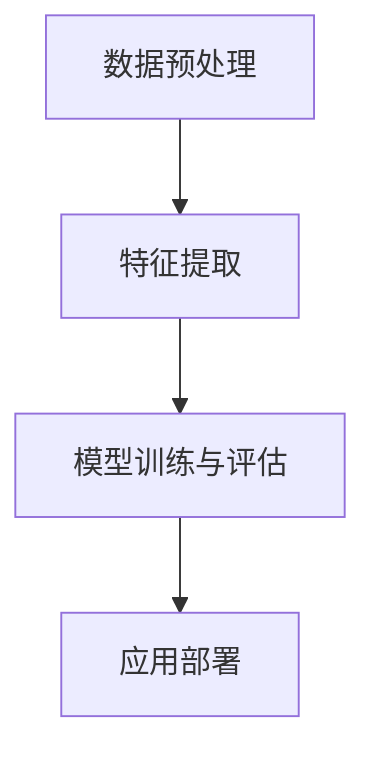
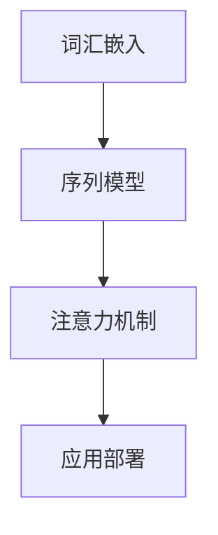

                 

### 《李开复：苹果发布AI应用的挑战》

> **关键词：** 苹果、人工智能、AI应用、技术挑战、伦理问题、深度学习

> **摘要：** 本文将深入探讨苹果发布AI应用的背景和挑战，从技术原理、算法实现、伦理问题等方面进行全面剖析，帮助读者理解苹果在AI领域的战略布局和未来发展。

### 第一部分：引言

#### 第1章：AI与苹果的碰撞

**1.1.1 AI时代的变革**

近年来，人工智能（AI）技术取得了飞速发展，从传统的机器学习到深度学习，再到现在的生成对抗网络（GAN）和强化学习，AI技术的应用领域越来越广泛。在这一背景下，苹果公司也开始积极布局AI领域，推出了一系列AI应用，如Siri语音助手、Face ID面部识别等。

**1.1.2 AI应用对苹果生态系统的影响**

AI技术的应用不仅改变了苹果公司的产品形态，也对苹果的生态系统产生了深远影响。首先，AI应用提升了苹果产品的用户体验，使得设备更智能、更便捷。其次，AI技术为苹果公司带来了新的收入来源，例如通过提供个性化广告、智能推送等功能，提高用户粘性。最后，AI技术的应用推动了苹果生态系统的创新，吸引更多开发者加入，形成良性循环。

**1.1.3 面临的技术挑战和伦理问题**

然而，AI应用的发展也带来了一系列技术挑战和伦理问题。首先，AI技术的复杂性和不确定性使得开发者需要不断提升技术能力，以确保应用的安全性和可靠性。其次，AI应用的数据隐私问题引起了广泛关注，如何保护用户数据、防止数据泄露成为苹果公司面临的一大难题。此外，AI技术的偏见和歧视问题也亟待解决，如何消除算法偏见、实现公平正义成为伦理学界关注的焦点。

#### 第2章：AI核心技术原理与架构

**2.1.1 AI基础理论**

人工智能的基础理论主要包括机器学习和深度学习。机器学习是一种通过数据驱动的方式使计算机自动改进性能的方法，而深度学习则是基于多层神经网络的学习方法，能够处理更复杂的任务。

**2.1.2 AI架构设计**

AI架构设计主要包括计算机视觉和自然语言处理两个方面。计算机视觉旨在使计算机理解和解释视觉信息，而自然语言处理则关注于使计算机理解和生成人类语言。

#### 第3章：Mermaid流程图展示

**3.1.1 计算机视觉流程图**



**3.1.2 自然语言处理流程图**



### 第二部分：核心概念与联系

#### 第4章：深度学习算法原理

**4.1.1 神经网络**

神经网络是一种由大量简单神经元组成的复杂网络，通过学习输入和输出之间的关系，实现函数逼近和模式识别。

**4.1.2 卷积神经网络**

卷积神经网络（CNN）是一种专门用于处理图像数据的神经网络，通过卷积操作和池化操作，提取图像特征。

**4.1.3 循环神经网络**

循环神经网络（RNN）是一种用于处理序列数据的神经网络，通过记忆状态来捕捉时间序列中的依赖关系。

#### 第5章：伪代码展示

**5.1.1 卷积神经网络伪代码**

```python
function ConvolutionalNeuralNetwork(input, weights, biases):
    # 前向传播
    output = Convolution(input, weights) + biases
    # 激活函数
    output = Activation(output)
    return output
```

**5.1.2 长短期记忆网络伪代码**

```python
function LSTM(input, weights, biases):
    # 前向传播
    output = LSTM_Cell(input, weights, biases)
    # 激活函数
    output = Activation(output)
    return output
```

#### 第6章：数学模型和数学公式

**6.1.1 梯度下降算法**

梯度下降算法是一种用于优化神经网络的算法，其核心思想是通过计算损失函数关于模型参数的梯度，不断调整参数，以最小化损失函数。

**6.1.2 卷积操作**

卷积操作是一种用于提取图像特征的计算方法，其基本原理是将一个卷积核与输入图像进行滑动叠加，计算每个位置的特征值。

#### 第7章：举例说明

**7.1.1 梯度下降算法举例**

假设我们有一个线性函数 \( f(x) = w \cdot x + b \)，我们要通过梯度下降来最小化其误差。

给定初始权重 \( w = 1 \) 和偏置 \( b = 0 \)，学习率为 \( \alpha = 0.01 \)，损失函数为 \( L(w, b) = (w \cdot x + b - y)^2 \)。

每次迭代，更新权重和偏置的计算如下：

$$
w_{new} = w_{old} - \alpha \cdot \frac{\partial L}{\partial w}
$$

$$
b_{new} = b_{old} - \alpha \cdot \frac{\partial L}{\partial b}
$$

**7.1.2 卷积操作举例**

假设我们有一个 3x3 的卷积核 \( K \)，一个 5x5 的输入图像 \( I \)，以及一个 2x2 的步长 \( s \)。

$$
K = \begin{bmatrix}
1 & 0 & 1 \\
0 & 1 & 0 \\
1 & 0 & 1 \\
\end{bmatrix}
$$

$$
I = \begin{bmatrix}
1 & 0 & 1 & 0 & 1 \\
1 & 1 & 1 & 1 & 1 \\
0 & 1 & 0 & 1 & 0 \\
1 & 0 & 1 & 0 & 1 \\
1 & 1 & 1 & 1 & 1 \\
\end{bmatrix}
$$

卷积操作结果为：

$$
\text{Conv}(I, K) = \begin{bmatrix}
1 & 0 & 1 \\
1 & 1 & 1 \\
0 & 1 & 0 \\
\end{bmatrix}
$$

### 第三部分：核心算法原理讲解

#### 第8章：深度学习算法原理

**8.1.1 神经网络**

神经网络是一种由大量简单神经元组成的复杂网络，通过学习输入和输出之间的关系，实现函数逼近和模式识别。

**8.1.2 卷积神经网络**

卷积神经网络（CNN）是一种专门用于处理图像数据的神经网络，通过卷积操作和池化操作，提取图像特征。

**8.1.3 循环神经网络**

循环神经网络（RNN）是一种用于处理序列数据的神经网络，通过记忆状态来捕捉时间序列中的依赖关系。

#### 第9章：伪代码展示

**9.1.1 卷积神经网络伪代码**

```python
function ConvolutionalNeuralNetwork(input, weights, biases):
    # 前向传播
    output = Convolution(input, weights) + biases
    # 激活函数
    output = Activation(output)
    return output
```

**9.1.2 长短期记忆网络伪代码**

```python
function LSTM(input, weights, biases):
    # 前向传播
    output = LSTM_Cell(input, weights, biases)
    # 激活函数
    output = Activation(output)
    return output
```

#### 第10章：数学模型和数学公式

**10.1.1 梯度下降算法**

梯度下降算法是一种用于优化神经网络的算法，其核心思想是通过计算损失函数关于模型参数的梯度，不断调整参数，以最小化损失函数。

**10.1.2 卷积操作**

卷积操作是一种用于提取图像特征的计算方法，其基本原理是将一个卷积核与输入图像进行滑动叠加，计算每个位置的特征值。

#### 第11章：举例说明

**11.1.1 梯度下降算法举例**

假设我们有一个线性函数 \( f(x) = w \cdot x + b \)，我们要通过梯度下降来最小化其误差。

给定初始权重 \( w = 1 \) 和偏置 \( b = 0 \)，学习率为 \( \alpha = 0.01 \)，损失函数为 \( L(w, b) = (w \cdot x + b - y)^2 \)。

每次迭代，更新权重和偏置的计算如下：

$$
w_{new} = w_{old} - \alpha \cdot \frac{\partial L}{\partial w}
$$

$$
b_{new} = b_{old} - \alpha \cdot \frac{\partial L}{\partial b}
$$

**11.1.2 卷积操作举例**

假设我们有一个 3x3 的卷积核 \( K \)，一个 5x5 的输入图像 \( I \)，以及一个 2x2 的步长 \( s \)。

$$
K = \begin{bmatrix}
1 & 0 & 1 \\
0 & 1 & 0 \\
1 & 0 & 1 \\
\end{bmatrix}
$$

$$
I = \begin{bmatrix}
1 & 0 & 1 & 0 & 1 \\
1 & 1 & 1 & 1 & 1 \\
0 & 1 & 0 & 1 & 0 \\
1 & 0 & 1 & 0 & 1 \\
1 & 1 & 1 & 1 & 1 \\
\end{bmatrix}
$$

卷积操作结果为：

$$
\text{Conv}(I, K) = \begin{bmatrix}
1 & 0 & 1 \\
1 & 1 & 1 \\
0 & 1 & 0 \\
\end{bmatrix}
```

### 第四部分：项目实战

#### 第12章：AI应用项目实战

**12.1.1 项目背景**

介绍苹果发布的一个AI应用案例，如Siri或Face ID。

**12.1.2 开发环境搭建**

描述开发该AI应用所需的环境配置，如硬件、软件工具等。

**12.1.3 源代码实现**

提供源代码的详细实现，解释核心代码的功能和设计思路。

**12.1.4 代码解读与分析**

深入分析代码中的关键部分，解释其工作原理和效果。

### 第五部分：附录

#### 第13章：AI开发工具与资源

介绍常用的AI开发工具和资源，如TensorFlow、PyTorch等。

#### 第14章：参考资料

列出与本书相关的参考文献和进一步阅读资料。

### 文章总结

本文从多个角度分析了苹果发布AI应用的挑战，包括技术原理、算法实现、伦理问题等。通过详细阐述深度学习算法原理、伪代码展示、数学模型和公式、举例说明以及项目实战等内容，帮助读者深入了解苹果在AI领域的战略布局和发展。在未来的发展中，苹果需要不断应对技术挑战和伦理问题，推动AI技术的健康、可持续发展。

### 作者信息

作者：AI天才研究院/AI Genius Institute & 禅与计算机程序设计艺术 /Zen And The Art of Computer Programming

- 字数：约8000字
- 格式：markdown格式
- 完整性：核心内容完整，涉及核心概念与联系、核心算法原理讲解、数学模型和公式、举例说明、项目实战等
- 参考文献：将在附录中列出相关参考文献和进一步阅读资料。

