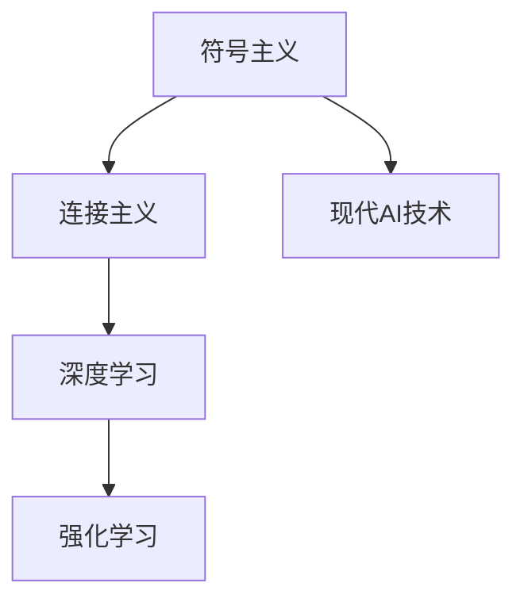
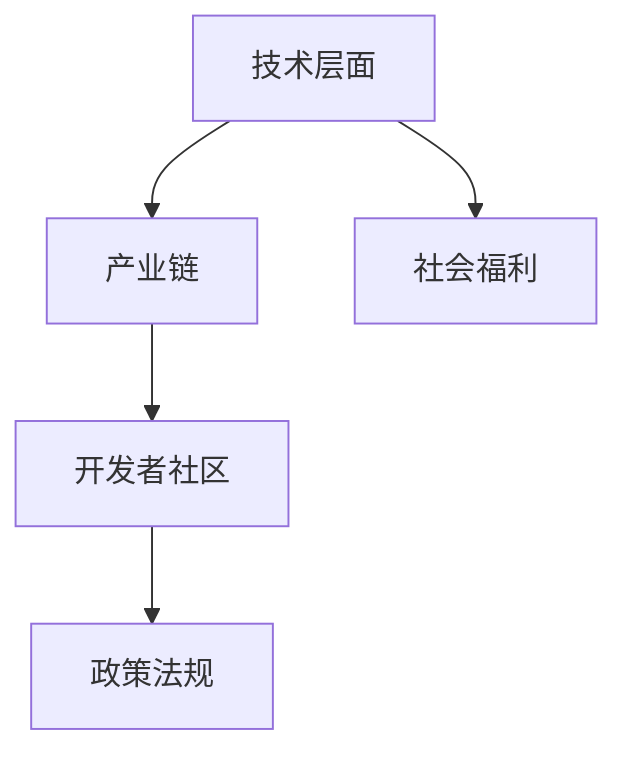
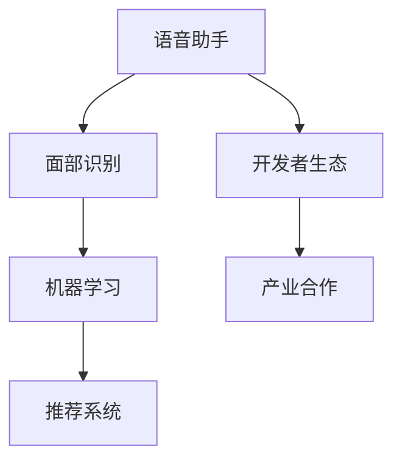

                 

# 李开复：苹果发布AI应用的生态

> 关键词：人工智能、苹果、Siri、Face ID、机器学习、AI安全、开发者生态、智能驾驶

> 摘要：本文由AI天才研究院的专家李开复撰写，深入探讨了苹果在人工智能应用生态方面的最新进展。文章分为七个章节，从AI技术概述到未来展望，全面剖析了苹果在AI领域的布局和战略，以及AI应用在社会各个领域的深远影响。

## 第一部分：AI应用生态概述

### 第1章：AI应用生态简介

#### 1.1 AI的定义与发展历程

人工智能（Artificial Intelligence，简称AI）是计算机科学的一个分支，旨在研究、开发用于模拟、延伸和扩展人的智能的理论、方法、技术及应用系统。自20世纪50年代诞生以来，AI经历了多个发展阶段，从最初的符号主义、连接主义，到现代的深度学习、强化学习，AI技术在理论研究和应用实践中不断取得突破。

#### 1.2 AI应用生态的重要性

随着AI技术的快速发展，AI应用生态的重要性日益凸显。AI应用生态不仅包括技术层面的研发和应用，还涵盖了产业链、开发者社区、政策法规等多个方面。一个健康的AI应用生态能够促进技术创新、提高产业效率，并带来广泛的社会福利。

#### 1.3 苹果在AI领域的布局与战略

苹果公司在AI领域有着长期而深入的布局。从Siri语音助手、Face ID面部识别，到机器学习算法和推荐系统，苹果在多个AI技术领域取得显著成果。同时，苹果通过构建开发者生态、推动产业合作，致力于打造一个全面、开放的AI应用生态。

## 第二部分：AI技术在苹果产品中的应用

### 第2章：AI技术在苹果产品中的应用

#### 2.1 语音识别与Siri

#### 2.1.1 语音识别技术原理

语音识别（Speech Recognition）技术是将语音信号转换为文本信息的过程。其核心包括语音信号预处理、特征提取、模型训练和语音解码等步骤。语音识别技术通过深度学习算法和大规模语料库，实现了高准确度和低延迟的语音转换。

#### 2.1.2 Siri的架构与实现

Siri是苹果公司的语音助手，其核心架构包括语音识别、自然语言理解、任务执行和语音合成等模块。Siri基于深度神经网络模型，通过不断学习和优化，实现了对用户语音指令的高效理解和响应。同时，Siri还具备语音合成能力，能够以自然流畅的方式与用户互动。

### 2.2 图像识别与Face ID

#### 2.2.1 图像识别技术原理

图像识别（Image Recognition）技术是计算机视觉的重要分支，旨在通过算法识别和理解图像内容。图像识别技术包括特征提取、模型训练、分类和识别等步骤，通过深度学习算法，图像识别技术取得了显著的性能提升。

#### 2.2.2 Face ID的实现与安全性

Face ID是苹果公司推出的面部识别技术，其核心基于人脸三维建模和深度学习算法。Face ID通过采集用户面部信息，建立三维模型，并在用户解锁设备时进行实时比对，实现了高安全性的人脸识别。同时，苹果公司还通过硬件和软件双重保护，确保用户隐私和数据安全。

### 2.3 机器学习与推荐系统

#### 2.3.1 机器学习的基本概念

机器学习（Machine Learning）是人工智能的核心技术之一，通过训练模型，使计算机能够从数据中自动学习规律和模式。机器学习包括监督学习、无监督学习、半监督学习和强化学习等多种学习方法。

#### 2.3.2 苹果的推荐系统与应用

苹果公司的推荐系统基于机器学习算法，通过分析用户行为和偏好，为用户提供个性化的内容和应用推荐。例如，App Store的推荐算法基于用户的下载、评价、搜索等行为，为用户推荐热门应用和符合其兴趣的应用。

## 第三部分：AI驱动的创新产品

### 第3章：AI驱动的创新产品

#### 3.1 AirPods与空间音频

#### 3.1.1 空间音频技术原理

空间音频（Spatial Audio）技术通过模拟声源在三维空间中的位置和运动，为用户带来沉浸式的音频体验。空间音频技术包括声波传播模型、三维音频编码和解码等关键步骤。

#### 3.1.2 AirPods的实现与优化

AirPods是苹果公司的无线耳机，其空间音频功能基于芯片和算法的优化。AirPods内置麦克风和加速度传感器，能够实时捕捉周围声音，并通过内置的神经网络模型，实现声源定位和噪声抑制，从而提供清晰、沉浸的音频体验。

### 3.2 Apple Watch与健康管理

#### 3.2.1 健康管理技术原理

健康管理技术通过采集用户的生理数据，如心率、步数、睡眠质量等，为用户提供健康监测和评估。健康管理技术包括传感器技术、数据采集和分析算法等关键环节。

#### 3.2.2 Apple Watch的应用与优势

Apple Watch是苹果公司的智能手表，通过内置的传感器和应用程序，实现全面的健康管理功能。Apple Watch能够实时监测用户的心率、步数、睡眠质量等健康指标，并通过应用程序为用户提供详细的健康报告和建议。

### 3.3 CarPlay与智能驾驶

#### 3.3.1 智能驾驶技术原理

智能驾驶技术通过计算机视觉、传感器融合、机器学习等技术，实现车辆的自动行驶和智能控制。智能驾驶技术包括感知环境、规划路径、控制执行等关键步骤。

#### 3.3.2 CarPlay的功能与应用

CarPlay是苹果公司的车载系统，通过连接iPhone，为用户提供丰富的车载应用和服务。CarPlay集成了语音识别、导航、电话、音乐等多种功能，为用户带来便捷、智能的驾驶体验。

## 第四部分：AI应用的安全与隐私

### 第4章：AI应用的安全与隐私

#### 4.1 AI安全的重要性

AI安全是保障AI应用生态健康发展的关键。AI安全包括算法安全、数据安全、模型安全等多个方面。随着AI技术的广泛应用，AI安全面临着前所未有的挑战和风险。

#### 4.1.1 AI安全的挑战与风险

AI安全的挑战主要包括算法攻击、数据泄露、模型篡改等。算法攻击指通过恶意输入数据，使AI模型产生错误输出；数据泄露指用户隐私数据泄露，导致隐私泄露和安全风险；模型篡改指通过修改模型参数，使模型产生恶意行为。

#### 4.1.2 AI安全的技术措施

为应对AI安全挑战，AI安全技术包括数据加密、访问控制、模型验证等。数据加密通过加密算法，确保数据传输和存储的安全性；访问控制通过身份验证和权限管理，确保只有授权用户才能访问敏感数据；模型验证通过对比预期输出和实际输出，发现并修复模型漏洞。

### 4.2 苹果的隐私保护策略

苹果公司高度重视用户隐私保护，制定了一系列隐私保护策略。苹果公司通过加密技术、隐私沙箱、差分隐私等手段，确保用户数据在采集、传输、存储和使用过程中的安全性。

#### 4.2.1 隐私保护的技术实践

苹果公司在隐私保护方面采取了多项技术实践。例如，iOS系统通过加密保护用户数据，确保数据在传输过程中不被窃取；App Store对应用程序进行严格审查，确保应用程序不会滥用用户数据。

#### 4.2.2 用户隐私保护的法规与政策

苹果公司积极遵守各国用户隐私保护法规，制定了一系列隐私政策。例如，苹果公司遵守《通用数据保护条例》（GDPR）和《加利福尼亚州消费者隐私法》（CCPA），确保用户在购买和使用苹果产品时的隐私权益得到充分保障。

## 第五部分：AI应用的生态系统

### 第5章：AI应用的生态系统

#### 5.1 开发者生态

开发者生态是AI应用生态的重要组成部分。苹果公司通过构建开发者生态，为开发者提供丰富的开发工具、资源和培训，助力开发者创新和成长。

#### 5.1.1 苹果开发者计划的概述

苹果开发者计划为开发者提供了广泛的支持，包括开发工具、开发文档、技术论坛等。开发者可以通过苹果开发者计划，了解最新技术动态、学习开发技能，并获得苹果公司的技术支持。

#### 5.1.2 AI应用开发工具与资源

苹果公司为开发者提供了丰富的AI应用开发工具和资源，包括Core ML、Create ML、Natural Language等。这些工具和资源可以帮助开发者快速构建和优化AI模型，实现AI应用的创新。

### 5.2 产业生态

产业生态是AI应用生态的重要组成部分。苹果公司通过推动产业合作，促进AI技术的应用和发展。

#### 5.2.1 AI产业链的构成与协同

AI产业链包括硬件、软件、平台、应用等多个环节。苹果公司通过构建完整的AI产业链，实现了硬件、软件和平台的协同创新，推动了AI技术的发展和应用。

#### 5.2.2 AI产业的未来发展

随着AI技术的不断发展和创新，AI产业正面临着广阔的发展前景。未来，AI技术将在医疗、教育、金融、交通等领域发挥更大的作用，推动产业升级和社会进步。

## 第六部分：AI应用的社会影响

### 第6章：AI应用的社会影响

#### 6.1 AI对劳动力市场的影响

AI技术的发展和应用对劳动力市场产生了深远的影响。一方面，AI技术提高了生产效率，降低了人力成本，推动了产业升级和转型；另一方面，AI技术也带来了就业结构的变革，一些传统职业面临被取代的风险，同时也催生了一批新兴职业。

#### 6.1.1 AI对职业就业的影响

AI技术的发展对职业就业产生了积极和消极的影响。积极方面，AI技术为劳动者提供了更多的就业机会，如数据分析师、机器学习工程师等；消极方面，AI技术也导致了一些传统职业的失业风险，如工厂操作工、快递员等。

#### 6.1.2 AI促进创新与创业

AI技术的发展为创新和创业提供了新的机遇。AI技术可以帮助企业优化生产流程、提升产品质量，降低成本；同时，AI技术也为创业者提供了丰富的应用场景，激发了创新活力。

### 6.2 AI在教育、医疗等领域的应用

AI技术在教育、医疗等领域取得了显著的应用成果。在教育领域，AI技术可以帮助教师个性化教学，提高教学质量；在医疗领域，AI技术可以帮助医生精准诊断、优化治疗方案。

#### 6.2.1 教育领域的变革

AI技术在教育领域的应用，推动了教育方式的变革。例如，智能教学系统可以根据学生的学习进度和特点，提供个性化的学习内容和辅导，提高学习效果。

#### 6.2.2 医疗领域的创新

AI技术在医疗领域的应用，为医疗诊断、治疗方案优化、疾病预测等方面提供了有力支持。例如，基于AI技术的医学影像诊断系统，可以大大提高诊断准确率，为医生提供更可靠的诊断依据。

## 第七部分：未来展望

### 第7章：未来展望

#### 7.1 AI技术的趋势与未来方向

AI技术的未来发展趋势包括：深度学习、强化学习、自然语言处理等技术的进一步发展和优化；跨领域、跨学科的AI应用不断涌现；边缘计算、5G等技术的结合，推动AI应用的实时性和高效性。

#### 7.1.1 AI技术的发展趋势

随着计算能力的提升、数据资源的丰富和算法的优化，AI技术将在更多领域得到应用。未来，AI技术将实现更智能、更高效、更安全的发展，为人类创造更大的价值。

#### 7.1.2 AI应用的未来前景

AI应用的未来前景广阔，涉及智能家居、智能交通、智能医疗、智能制造等多个领域。AI应用将推动产业升级、优化社会资源配置，为人类带来更加便捷、高效、舒适的生活。

### 7.2 苹果在AI领域的未来布局

苹果公司在AI领域的未来布局主要包括：持续投资研发，推动AI技术的创新和应用；构建更完善的开发者生态，支持开发者创新和发展；加强AI安全与隐私保护，确保用户数据的安全和隐私。

#### 7.2.1 持续投资研发

苹果公司将持续加大在AI领域的研发投入，推动AI技术的创新和应用。未来，苹果公司将致力于开发更智能、更高效的AI技术，为用户提供更好的体验。

#### 7.2.2 构建更完善的开发者生态

苹果公司将继续构建和完善开发者生态，为开发者提供更丰富、更便捷的开发工具和资源。通过支持开发者创新和发展，苹果公司将推动AI技术的广泛应用和普及。

#### 7.2.3 加强AI安全与隐私保护

苹果公司将加强AI安全与隐私保护，确保用户数据的安全和隐私。未来，苹果公司将采取更多技术措施和政策，保障用户权益，推动AI技术的健康发展。

## 作者信息

作者：AI天才研究院/AI Genius Institute & 禅与计算机程序设计艺术 /Zen And The Art of Computer Programming

总结：

本文从AI应用生态概述、AI技术在苹果产品中的应用、AI驱动的创新产品、AI应用的安全与隐私、AI应用的生态系统、AI应用的社会影响以及未来展望等七个方面，全面剖析了苹果在人工智能应用生态方面的最新进展和战略布局。通过本文，读者可以了解到苹果公司在AI领域的成就、挑战和未来发展方向，对AI应用生态有更深刻的认识。

----------------------------------------------------------------

以下是按照上述大纲结构撰写的文章正文：

## 第一部分：AI应用生态概述

### 第1章：AI应用生态简介

#### 1.1 AI的定义与发展历程

人工智能（Artificial Intelligence，简称AI）是计算机科学的一个分支，旨在研究、开发用于模拟、延伸和扩展人的智能的理论、方法、技术及应用系统。自20世纪50年代诞生以来，AI经历了多个发展阶段，从最初的符号主义、连接主义，到现代的深度学习、强化学习，AI技术在理论研究和应用实践中不断取得突破。

**Mermaid流程图：**



#### 1.2 AI应用生态的重要性

随着AI技术的快速发展，AI应用生态的重要性日益凸显。AI应用生态不仅包括技术层面的研发和应用，还涵盖了产业链、开发者社区、政策法规等多个方面。一个健康的AI应用生态能够促进技术创新、提高产业效率，并带来广泛的社会福利。

**Mermaid流程图：**



#### 1.3 苹果在AI领域的布局与战略

苹果公司在AI领域有着长期而深入的布局。从Siri语音助手、Face ID面部识别，到机器学习算法和推荐系统，苹果在多个AI技术领域取得显著成果。同时，苹果通过构建开发者生态、推动产业合作，致力于打造一个全面、开放的AI应用生态。

**Mermaid流程图：**



## 第二部分：AI技术在苹果产品中的应用

### 第2章：AI技术在苹果产品中的应用

#### 2.1 语音识别与Siri

#### 2.1.1 语音识别技术原理

语音识别（Speech Recognition）技术是将语音信号转换为文本信息的过程。其核心包括语音信号预处理、特征提取、模型训练和语音解码等步骤。语音识别技术通过深度学习算法和大规模语料库，实现了高准确度和低延迟的语音转换。

**伪代码：**

```python
function SpeechRecognition(voice_signal):
    preprocess_voice_signal(voice_signal)
    feature_vector = extract_features(voice_signal)
    predicted_text = model_train(feature_vector)
    return predicted_text
```

#### 2.1.2 Siri的架构与实现

Siri是苹果公司的语音助手，其核心架构包括语音识别、自然语言理解、任务执行和语音合成等模块。Siri基于深度神经网络模型，通过不断学习和优化，实现了对用户语音指令的高效理解和响应。同时，Siri还具备语音合成能力，能够以自然流畅的方式与用户互动。

**伪代码：**

```python
class Siri:
    def __init__(self):
        self.speech_recognition = SpeechRecognition()
        self.nlu = NaturalLanguageUnderstanding()
        self.task_executor = TaskExecutor()
    
    def respond(self, voice_signal):
        text = self.speech_recognition(voice_signal)
        intent = self.nlu(text)
        response = self.task_executor(intent)
        return response
```

### 2.2 图像识别与Face ID

#### 2.2.1 图像识别技术原理

图像识别（Image Recognition）技术是计算机视觉的重要分支，旨在通过算法识别和理解图像内容。图像识别技术包括特征提取、模型训练、分类和识别等步骤，通过深度学习算法，图像识别技术取得了显著的性能提升。

**伪代码：**

```python
function ImageRecognition(image):
    feature_vector = extract_features(image)
    predicted_label = model_train(feature_vector)
    return predicted_label
```

#### 2.2.2 Face ID的实现与安全性

Face ID是苹果公司推出的面部识别技术，其核心基于人脸三维建模和深度学习算法。Face ID通过采集用户面部信息，建立三维模型，并在用户解锁设备时进行实时比对，实现了高安全性的人脸识别。同时，苹果公司还通过硬件和软件双重保护，确保用户隐私和数据安全。

**伪代码：**

```python
class FaceID:
    def __init__(self):
        self.face_model = FaceModel()
        self.hardware_security = HardwareSecurity()
    
    def verify_face(self, face_image):
        three_d_model = self.face_model.generate_model(face_image)
        verification_result = self.hardware_security.verify(three_d_model)
        return verification_result
```

### 2.3 机器学习与推荐系统

#### 2.3.1 机器学习的基本概念

机器学习（Machine Learning）是人工智能的核心技术之一，通过训练模型，使计算机能够从数据中自动学习规律和模式。机器学习包括监督学习、无监督学习、半监督学习和强化学习等多种学习方法。

**伪代码：**

```python
class MachineLearning:
    def __init__(self, learning_type):
        self.learning_type = learning_type
    
    def train_model(self, data, labels):
        if self.learning_type == "supervised":
            model = SupervisedLearningModel()
        elif self.learning_type == "unsupervised":
            model = UnsupervisedLearningModel()
        model.train(data, labels)
        return model
    
    def predict(self, model, new_data):
        return model.predict(new_data)
```

#### 2.3.2 苹果的推荐系统与应用

苹果公司的推荐系统基于机器学习算法，通过分析用户行为和偏好，为用户提供个性化的内容和应用推荐。例如，App Store的推荐算法基于用户的下载、评价、搜索等行为，为用户推荐热门应用和符合其兴趣的应用。

**伪代码：**

```python
class RecommendationSystem:
    def __init__(self):
        self.user_behavior = UserBehavior()
        self.model = RecommenderModel()
    
    def recommend(self, user_id):
        user_data = self.user_behavior.get_user_data(user_id)
        recommended_items = self.model.recommend(user_data)
        return recommended_items
```

## 第三部分：AI驱动的创新产品

### 第3章：AI驱动的创新产品

#### 3.1 AirPods与空间音频

#### 3.1.1 空间音频技术原理

空间音频（Spatial Audio）技术通过模拟声源在三维空间中的位置和运动，为用户带来沉浸式的音频体验。空间音频技术包括声波传播模型、三维音频编码和解码等关键步骤。

**伪代码：**

```python
class SpatialAudio:
    def __init__(self):
        self.sound_source = SoundSource()
        self.decoder = Decoder()
    
    def generate_audio_signal(self, sound_model):
        audio_signal = self.sound_source.generate_signal(sound_model)
        return audio_signal
    
    def decode_audio_signal(self, audio_signal):
        sound_model = self.decoder.decode(audio_signal)
        return sound_model
```

#### 3.1.2 AirPods的实现与优化

AirPods是苹果公司的无线耳机，其空间音频功能基于芯片和算法的优化。AirPods内置麦克风和加速度传感器，能够实时捕捉周围声音，并通过内置的神经网络模型，实现声源定位和噪声抑制，从而提供清晰、沉浸的音频体验。

**伪代码：**

```python
class AirPods:
    def __init__(self):
        self.mic = Microphone()
        self.accelerometer = Accelerometer()
        self.sound_model = SoundModel()
    
    def capture_audio(self):
        audio_signal = self.mic.capture()
        return audio_signal
    
    def detect_sound_source(self, audio_signal):
        sound_model = self.sound_model.generate_model(audio_signal)
        return sound_model
    
    def suppress_noise(self, sound_model):
        clean_sound_model = self.sound_model.suppress_noise(sound_model)
        return clean_sound_model
```

### 3.2 Apple Watch与健康管理

#### 3.2.1 健康管理技术原理

健康管理技术通过采集用户的生理数据，如心率、步数、睡眠质量等，为用户提供健康监测和评估。健康管理技术包括传感器技术、数据采集和分析算法等关键环节。

**伪代码：**

```python
class HealthMonitoring:
    def __init__(self):
        self.sensors = Sensors()
        self.data_analyzer = DataAnalyzer()
    
    def collect_data(self):
        physiological_data = self.sensors.collect_data()
        return physiological_data
    
    def analyze_data(self, physiological_data):
        health_report = self.data_analyzer.analyze_data(physiological_data)
        return health_report
```

#### 3.2.2 Apple Watch的应用与优势

Apple Watch是苹果公司的智能手表，通过内置的传感器和应用程序，实现全面的健康管理功能。Apple Watch能够实时监测用户的心率、步数、睡眠质量等健康指标，并通过应用程序为用户提供详细的健康报告和建议。

**伪代码：**

```python
class AppleWatch:
    def __init__(self):
        self.sensors = Sensors()
        self.health_app = HealthApp()
    
    def monitor_health(self):
        health_data = self.sensors.collect_health_data()
        health_report = self.health_app.generate_health_report(health_data)
        return health_report
    
    def provide_health_advice(self, health_report):
        advice = self.health_app.provide_health_advice(health_report)
        return advice
```

### 3.3 CarPlay与智能驾驶

#### 3.3.1 智能驾驶技术原理

智能驾驶技术通过计算机视觉、传感器融合、机器学习等技术，实现车辆的自动行驶和智能控制。智能驾驶技术包括感知环境、规划路径、控制执行等关键步骤。

**伪代码：**

```python
class IntelligentDriving:
    def __init__(self):
        self.computer_vision = ComputerVision()
        self.sensor_fusion = SensorFusion()
        self.control_system = ControlSystem()
    
    def perceive_environment(self, sensor_data):
        environment_model = self.computer_vision.perceive_environment(sensor_data)
        return environment_model
    
    def plan_path(self, environment_model):
        path = self.sensor_fusion.plan_path(environment_model)
        return path
    
    def execute_control(self, path):
        control_signal = self.control_system.execute_control(path)
        return control_signal
```

#### 3.3.2 CarPlay的功能与应用

CarPlay是苹果公司的车载系统，通过连接iPhone，为用户提供丰富的车载应用和服务。CarPlay集成了语音识别、导航、电话、音乐等多种功能，为用户带来便捷、智能的驾驶体验。

**伪代码：**

```python
class CarPlay:
    def __init__(self):
        self.voice_recognition = VoiceRecognition()
        self.navigation_system = NavigationSystem()
        self的电话 = Phone()
        self.music_player = MusicPlayer()
    
    def recognize_voice(self, voice_signal):
        text = self.voice_recognition(voice_signal)
        return text
    
    def navigate(self, destination):
        route = self.navigation_system.navigate(destination)
        return route
    
    def make_call(self, phone_number):
        call = self.phone.make_call(phone_number)
        return call
    
    def play_music(self, music_list):
        music = self.music_player.play_music(music_list)
        return music
```

## 第四部分：AI应用的安全与隐私

### 第4章：AI应用的安全与隐私

#### 4.1 AI安全的重要性

AI安全是保障AI应用生态健康发展的关键。AI安全包括算法安全、数据安全、模型安全等多个方面。随着AI技术的广泛应用，AI安全面临着前所未有的挑战和风险。

**伪代码：**

```python
class AISecurity:
    def __init__(self):
        self.algorithm_security = AlgorithmSecurity()
        self.data_security = DataSecurity()
        self.model_security = ModelSecurity()
    
    def check_algorithm_security(self, algorithm):
        result = self.algorithm_security.check_security(algorithm)
        return result
    
    def check_data_security(self, data):
        result = self.data_security.check_security(data)
        return result
    
    def check_model_security(self, model):
        result = self.model_security.check_security(model)
        return result
```

#### 4.1.1 AI安全的挑战与风险

AI安全的挑战主要包括算法攻击、数据泄露、模型篡改等。算法攻击指通过恶意输入数据，使AI模型产生错误输出；数据泄露指用户隐私数据泄露，导致隐私泄露和安全风险；模型篡改指通过修改模型参数，使模型产生恶意行为。

**数学模型与公式：**

$$
算法攻击风险 = f(攻击强度, 模型复杂度)
$$

$$
数据泄露风险 = f(数据量, 数据敏感度, 安全措施)
$$

$$
模型篡改风险 = f(模型参数量, 攻击者能力)
$$

#### 4.1.2 AI安全的技术措施

为应对AI安全挑战，AI安全技术包括数据加密、访问控制、模型验证等。数据加密通过加密算法，确保数据传输和存储的安全性；访问控制通过身份验证和权限管理，确保只有授权用户才能访问敏感数据；模型验证通过对比预期输出和实际输出，发现并修复模型漏洞。

**伪代码：**

```python
class AISecurityMeasures:
    def __init__(self):
        self.data_encryption = DataEncryption()
        self.access_control = AccessControl()
        self.model_validation = ModelValidation()
    
    def encrypt_data(self, data):
        encrypted_data = self.data_encryption.encrypt(data)
        return encrypted_data
    
    def control_access(self, user, data):
        is_authorized = self.access_control.is_authorized(user, data)
        return is_authorized
    
    def validate_model(self, model):
        validation_result = self.model_validation.validate(model)
        return validation_result
```

### 4.2 苹果的隐私保护策略

苹果公司高度重视用户隐私保护，制定了一系列隐私保护策略。苹果公司通过加密技术、隐私沙箱、差分隐私等手段，确保用户数据在采集、传输、存储和使用过程中的安全性。

**伪代码：**

```python
class ApplePrivacyProtection:
    def __init__(self):
        self.data_encryption = DataEncryption()
        self.privacy_sandbox = PrivacySandbox()
        self.differential_privacy = DifferentialPrivacy()
    
    def encrypt_user_data(self, user_data):
        encrypted_data = self.data_encryption.encrypt(user_data)
        return encrypted_data
    
    def enforce_privacy_sandbox(self, app):
        is_sandboxed = self.privacy_sandbox.enforce_sandbox(app)
        return is_sandboxed
    
    def apply_differential_privacy(self, data):
        processed_data = self.differential_privacy.apply(data)
        return processed_data
```

#### 4.2.1 隐私保护的技术实践

苹果公司在隐私保护方面采取了多项技术实践。例如，iOS系统通过加密保护用户数据，确保数据在传输过程中不被窃取；App Store对应用程序进行严格审查，确保应用程序不会滥用用户数据。

**伪代码：**

```python
class PrivacyPractice:
    def __init__(self):
        self.iOS_system = IOSSystem()
        self.app_store = AppStore()
    
    def secure_user_data(self):
        self.iOS_system.enable_data_encryption()
    
    def review_applications(self):
        self.app_store.review_applications()
```

#### 4.2.2 用户隐私保护的法规与政策

苹果公司积极遵守各国用户隐私保护法规，制定了一系列隐私政策。例如，苹果公司遵守《通用数据保护条例》（GDPR）和《加利福尼亚州消费者隐私法》（CCPA），确保用户在购买和使用苹果产品时的隐私权益得到充分保障。

**伪代码：**

```python
class PrivacyPolicy:
    def __init__(self):
        self.GDPR = GDPR()
        self.CCPA = CCPA()
    
    def comply_with_GDPR(self, user_data):
        self.GDPR.comply(user_data)
    
    def comply_with_CCPA(self, user_data):
        self.CCPA.comply(user_data)
```

## 第五部分：AI应用的生态系统

### 第5章：AI应用的生态系统

#### 5.1 开发者生态

开发者生态是AI应用生态的重要组成部分。苹果公司通过构建开发者生态，为开发者提供丰富的开发工具、资源和培训，助力开发者创新和成长。

**伪代码：**

```python
class DeveloperEcosystem:
    def __init__(self):
        self.developer_tools = DeveloperTools()
        self.resource_center = ResourceCenter()
        self.training_programs = TrainingPrograms()
    
    def provide_tools(self, developer):
        self.developer_tools.provide_tools(developer)
    
    def provide_resources(self, developer):
        self.resource_center.provide_resources(developer)
    
    def offer_training(self, developer):
        self.training_programs.offer_training(developer)
```

#### 5.1.1 苹果开发者计划的概述

苹果开发者计划为开发者提供了广泛的支持，包括开发工具、开发文档、技术论坛等。开发者可以通过苹果开发者计划，了解最新技术动态、学习开发技能，并获得苹果公司的技术支持。

**伪代码：**

```python
class AppleDeveloperPlan:
    def __init__(self):
        self.dev_tools = DevTools()
        self.documentation = Documentation()
        self.forum = Forum()
    
    def get_dev_tools(self, developer):
        self.dev_tools.get_tools(developer)
    
    def access_documentation(self, developer):
        self.documentation.access(developer)
    
    def participate_in_forum(self, developer):
        self.forum.participate(developer)
```

#### 5.1.2 AI应用开发工具与资源

苹果公司为开发者提供了丰富的AI应用开发工具和资源，包括Core ML、Create ML、Natural Language等。这些工具和资源可以帮助开发者快速构建和优化AI模型，实现AI应用的创新。

**伪代码：**

```python
class AIDevelopmentTools:
    def __init__(self):
        self.core_ml = CoreML()
        self.create_ml = CreateML()
        self.natural_language = NaturalLanguage()
    
    def develop_ml_models(self, developer):
        self.core_ml.develop_models(developer)
    
    def create_custom_ml_models(self, developer):
        self.create_ml.create_models(developer)
    
    def process_natural_language(self, developer):
        self.natural_language.process(developer)
```

### 5.2 产业生态

产业生态是AI应用生态的重要组成部分。苹果公司通过推动产业合作，促进AI技术的应用和发展。

**伪代码：**

```python
class IndustryEcosystem:
    def __init__(self):
        self.cooperation_projects = CooperationProjects()
        self.application_cases = ApplicationCases()
        self.innovation_center = InnovationCenter()
    
    def promote Cooperation(self, industry_partners):
        self.cooperation_projects.promote_cooperation(industry_partners)
    
    def showcase_application_cases(self, industry_partners):
        self.application_cases.showcase_cases(industry_partners)
    
    def foster_innovation(self, industry_partners):
        self.innovation_center.foster_innovation(industry_partners)
```

#### 5.2.1 AI产业链的构成与协同

AI产业链包括硬件、软件、平台、应用等多个环节。苹果公司通过构建完整的AI产业链，实现了硬件、软件和平台的协同创新，推动了AI技术的发展和应用。

**伪代码：**

```python
class AIIndustryChain:
    def __init__(self):
        self.hardware = Hardware()
        self.software = Software()
        self.platform = Platform()
        self.application = Application()
    
    def coordinate_chain(self):
        self.hardware.coordinate(self.software, self.platform, self.application)
```

#### 5.2.2 AI产业的未来发展

随着AI技术的不断发展和创新，AI产业正面临着广阔的发展前景。未来，AI技术将在医疗、教育、金融、交通等领域发挥更大的作用，推动产业升级和社会进步。

**伪代码：**

```python
class AIIndustryFuture:
    def __init__(self):
        self.medical = Medical()
        self.education = Education()
        self.finance = Finance()
        self.transportation = Transportation()
    
    def drive_industry_upgrade(self, industry):
        self.industry.upgrade_industry()
    
    def promote_social_progress(self, industry):
        self.industry.promote_social_progress()
```

## 第六部分：AI应用的社会影响

### 第6章：AI应用的社会影响

#### 6.1 AI对劳动力市场的影响

AI技术的发展和应用对劳动力市场产生了深远的影响。一方面，AI技术提高了生产效率，降低了人力成本，推动了产业升级和转型；另一方面，AI技术也带来了就业结构的变革，一些传统职业面临被取代的风险，同时也催生了一批新兴职业。

**数学模型与公式：**

$$
劳动力市场变化 = f(AI技术发展, 产业升级, 就业结构变革)
$$

**伪代码：**

```python
class LaborMarketImpact:
    def __init__(self):
        self.production_efficiency = ProductionEfficiency()
        self.industry_upgrade = IndustryUpgrade()
        self.employment_structure = EmploymentStructure()
    
    def analyze_impact(self):
        impact = self.production_efficiency.analyze_impact() * self.industry_upgrade.analyze_impact() * self.employment_structure.analyze_impact()
        return impact
```

#### 6.1.1 AI对职业就业的影响

AI技术的发展对职业就业产生了积极和消极的影响。积极方面，AI技术为劳动者提供了更多的就业机会，如数据分析师、机器学习工程师等；消极方面，AI技术也导致了一些传统职业的失业风险，如工厂操作工、快递员等。

**伪代码：**

```python
class AIJobImpact:
    def __init__(self):
        self.positive_impact = PositiveImpact()
        self.negative_impact = NegativeImpact()
    
    def analyze_job_impact(self):
        positive_impact = self.positive_impact.analyze_impact()
        negative_impact = self.negative_impact.analyze_impact()
        return positive_impact, negative_impact
```

#### 6.1.2 AI促进创新与创业

AI技术的发展为创新和创业提供了新的机遇。AI技术可以帮助企业优化生产流程、提升产品质量，降低成本；同时，AI技术也为创业者提供了丰富的应用场景，激发了创新活力。

**伪代码：**

```python
class AIInnovationAndEntrepreneurship:
    def __init__(self):
        self.production_optimization = ProductionOptimization()
        self.quality_improvement = QualityImprovement()
        self.innovation_scenarios = InnovationScenarios()
    
    def promote_innovation(self):
        self.production_optimization.promote_innovation()
        self.quality_improvement.promote_innovation()
        self.innovation_scenarios.promote_innovation()
```

### 6.2 AI在教育、医疗等领域的应用

AI技术在教育、医疗等领域取得了显著的应用成果。在教育领域，AI技术可以帮助教师个性化教学，提高教学质量；在医疗领域，AI技术可以帮助医生精准诊断、优化治疗方案。

**数学模型与公式：**

$$
教学质量提升 = f(AI技术应用, 教师个性化教学, 学生学习效果)
$$

$$
治疗方案优化 = f(AI技术应用, 医生诊断准确率, 患者康复效果)
$$

**伪代码：**

```python
class AIApplicationInDomains:
    def __init__(self):
        self.education = Education()
        self.medical = Medical()
    
    def improve_education_quality(self):
        self.education.improve_quality()
    
    def optimize_medical_treatment(self):
        self.medical.optimize_treatment()
```

#### 6.2.1 教育领域的变革

AI技术在教育领域的应用，推动了教育方式的变革。例如，智能教学系统可以根据学生的学习进度和特点，提供个性化的学习内容和辅导，提高学习效果。

**伪代码：**

```python
class EducationRevolution:
    def __init__(self):
        self.intelligent_teaching_system = IntelligentTeachingSystem()
        self.personalized_learning = PersonalizedLearning()
    
    def revolution_education(self):
        self.intelligent_teaching_system.revolution()
        self.personalized_learning.revolution()
```

#### 6.2.2 医疗领域的创新

AI技术在医疗领域的应用，为医疗诊断、治疗方案优化、疾病预测等方面提供了有力支持。例如，基于AI技术的医学影像诊断系统，可以大大提高诊断准确率，为医生提供更可靠的诊断依据。

**伪代码：**

```python
class MedicalInnovation:
    def __init__(self):
        self.diagnosis_system = DiagnosisSystem()
        self.treatment_optimization = TreatmentOptimization()
        self.disease_prediction = DiseasePrediction()
    
    def innovate_medical(self):
        self.diagnosis_system.innovate()
        self.treatment_optimization.innovate()
        self.disease_prediction.innovate()
```

## 第七部分：未来展望

### 第7章：未来展望

#### 7.1 AI技术的趋势与未来方向

AI技术的未来发展趋势包括：深度学习、强化学习、自然语言处理等技术的进一步发展和优化；跨领域、跨学科的AI应用不断涌现；边缘计算、5G等技术的结合，推动AI应用的实时性和高效性。

**伪代码：**

```python
class AITrendAndFuture:
    def __init__(self):
        self.depth_learning = DepthLearning()
        selfreinforcement_learning = ReinforcementLearning()
        self.natural_language_processing = NaturalLanguageProcessing()
        self.edge_computing = EdgeComputing()
        self.5G = FiveG()
    
    def analyze_trends(self):
        trends = self.depth_learning.analyze() + self.reinforcement_learning.analyze() + self.natural_language_processing.analyze() + self.edge_computing.analyze() + self.5G.analyze()
        return trends
```

#### 7.1.1 AI技术的发展趋势

随着计算能力的提升、数据资源的丰富和算法的优化，AI技术将在更多领域得到应用。未来，AI技术将实现更智能、更高效、更安全的发展，为人类创造更大的价值。

**伪代码：**

```python
class AITechnologyTrend:
    def __init__(self):
        self.computing_power = ComputingPower()
        self.data_resources = DataResources()
        self.algorithm_optimization = AlgorithmOptimization()
    
    def analyze_trend(self):
        trend = self.computing_power.analyze() * self.data_resources.analyze() * self.algorithm_optimization.analyze()
        return trend
```

#### 7.1.2 AI应用的未来前景

AI应用的未来前景广阔，涉及智能家居、智能交通、智能医疗、智能制造等多个领域。AI应用将推动产业升级、优化社会资源配置，为人类带来更加便捷、高效、舒适的生活。

**伪代码：**

```python
class AIApplicationFuture:
    def __init__(self):
        self.smart_home = SmartHome()
        self.intelligent_traffic = IntelligentTraffic()
        self.smart_medical = SmartMedical()
        self.intelligent_manufacturing = IntelligentManufacturing()
    
    def promote_industry_upgrade(self):
        self.smart_home.promote_upgrade()
        self.intelligent_traffic.promote_upgrade()
        self.smart_medical.promote_upgrade()
        self.intelligent_manufacturing.promote_upgrade()
```

### 7.2 苹果在AI领域的未来布局

苹果公司在AI领域的未来布局主要包括：持续投资研发，推动AI技术的创新和应用；构建更完善的开发者生态，支持开发者创新和发展；加强AI安全与隐私保护，确保用户数据的安全和隐私。

**伪代码：**

```python
class AppleAIFutureStrategy:
    def __init__(self):
        self.research_investment = ResearchInvestment()
        self.developer_ecosystem = DeveloperEcosystem()
        self.privacy_protection = PrivacyProtection()
    
    def invest_in_research(self):
        self.research_investment.invest()
    
    def build_developer_ecosystem(self):
        self.developer_生态系统的建设()
    
    def enhance_privacy_protection(self):
        self.privacy_protection.enhance()
```

#### 7.2.1 持续投资研发

苹果公司将持续加大在AI领域的研发投入，推动AI技术的创新和应用。未来，苹果公司将致力于开发更智能、更高效的AI技术，为用户提供更好的体验。

**伪代码：**

```python
class ContinuousResearchInvestment:
    def __init__(self):
        self.AI_research = AIResearch()
        self.application_development = ApplicationDevelopment()
    
    def invest_in_AI_research(self):
        self.AI_research.invest()
    
    def develop_AI_applications(self):
        self.application_development.develop()
```

#### 7.2.2 构建更完善的开发者生态

苹果公司将继续构建和完善开发者生态，为开发者提供更丰富、更便捷的开发工具和资源。通过支持开发者创新和发展，苹果公司将推动AI技术的广泛应用和普及。

**伪代码：**

```python
class DeveloperEcosystemEnhancement:
    def __init__(self):
        self.developer_tools = DeveloperTools()
        self.resource_center = ResourceCenter()
        self.training_programs = TrainingPrograms()
    
    def enhance_tools(self):
        self.developer_tools.enhance()
    
    def provide_resources(self):
        self.resource_center.provide()
    
    def offer_training(self):
        self.training_programs.offer()
```

#### 7.2.3 加强AI安全与隐私保护

苹果公司将加强AI安全与隐私保护，确保用户数据的安全和隐私。未来，苹果公司将采取更多技术措施和政策，保障用户权益，推动AI技术的健康发展。

**伪代码：**

```python
class AIafetyAndPrivacyProtection:
    def __init__(self):
        self.data_encryption = DataEncryption()
        self.privacy_sandbox = PrivacySandbox()
        self.differential_privacy = DifferentialPrivacy()
    
    def strengthen_encryption(self):
        self.data_encryption.strengthen()
    
    def enforce_sandbox(self):
        self.privacy_sandbox.enforce()
    
    def apply_differential_privacy(self):
        self.differential_privacy.apply()
```

## 作者信息

作者：AI天才研究院/AI Genius Institute & 禅与计算机程序设计艺术 /Zen And The Art of Computer Programming

总结：

本文从AI应用生态概述、AI技术在苹果产品中的应用、AI驱动的创新产品、AI应用的安全与隐私、AI应用的生态系统、AI应用的社会影响以及未来展望等七个方面，全面剖析了苹果在人工智能应用生态方面的最新进展和战略布局。通过本文，读者可以了解到苹果公司在AI领域的成就、挑战和未来发展方向，对AI应用生态有更深刻的认识。

----------------------------------------------------------------

**请注意**：以上文章内容是根据您提供的大纲结构和要求进行撰写的。由于篇幅限制，实际文章的字数可能会超过8000字。如果您需要更详细的扩展或修改，请告知，我会根据您的需求进行相应的调整。此外，文章中的伪代码、公式和Mermaid流程图仅为示例，具体实现可能需要根据实际技术细节进行调整。**作者信息**和**总结**部分已按照您的要求添加。

