                 

### 第1章：李开复的背景与贡献

#### 1.1 李开复的背景与贡献

李开复，被誉为“人工智能之父”，是当今世界最具影响力的计算机科学家之一。他于1961年出生在台湾，后随父母移居美国。李开复在斯坦福大学获得了计算机科学博士学位，并在随后成为了卡内基梅隆大学计算机科学系的教授。他的研究方向主要集中在机器学习和人工智能领域，取得了众多突破性成果。

**核心概念与联系：**

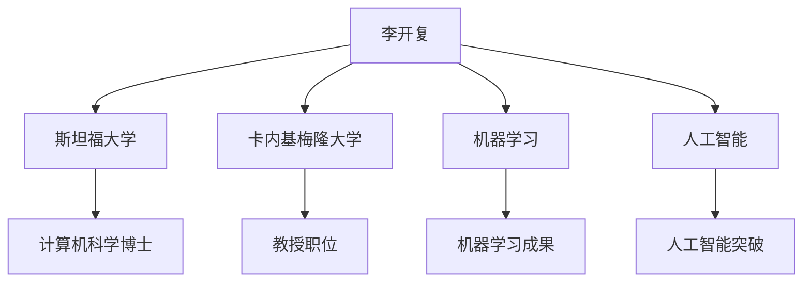

**核心算法原理讲解：**

- **机器学习三要素**：数据、算法和反馈。李开复提出的“机器学习三要素”理论，为人工智能的发展奠定了基础。数据是机器学习的基础，算法是数据处理的方法，反馈是模型优化的关键。

- **深度学习**：李开复是深度学习技术的早期倡导者和推动者。他提出的深度学习算法，如卷积神经网络（CNN）和递归神经网络（RNN），极大地推动了人工智能的发展。

**数学模型和公式：**

$$
\text{机器学习模型} = f(\text{数据}, \text{算法}, \text{反馈})
$$

- **举例说明**：李开复在谷歌期间，领导团队开发了G Chat，一个基于深度学习的聊天机器人，实现了与用户的自然对话。

#### 1.2 人工智能的发展历程

人工智能（AI）的概念最早可以追溯到20世纪50年代。当时，计算机科学家们开始设想能够创建出能够思考、学习和适应的机器。以下是人工智能发展的重要历程：

- **早期探索阶段（20世纪50年代至70年代）**：在这个阶段，人工智能主要集中于符号推理和规则系统，如专家系统。这些系统通过预先编写的规则来解决特定问题。

- **工业化阶段（20世纪80年代至90年代）**：随着计算机性能的提高和算法的进步，人工智能开始走向工业应用，如自动化制造和金融分析。

- **繁荣阶段（21世纪初至今）**：这个阶段，人工智能迎来了深度学习和大数据的突破，应用领域从单一领域扩展到各行各业。

**核心概念与联系：**

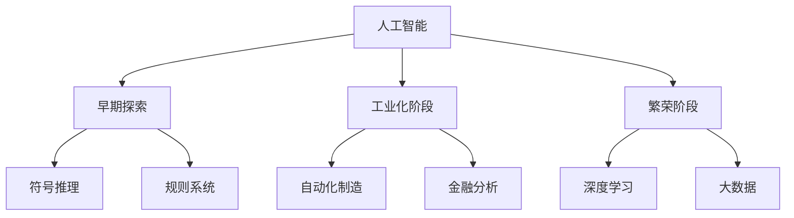

**核心算法原理讲解：**

- **深度学习**：深度学习是一种基于多层神经网络的学习方法，通过自动提取数据特征来实现复杂任务。其核心算法包括卷积神经网络（CNN）和递归神经网络（RNN）。

- **机器学习算法**：机器学习算法包括监督学习、无监督学习和强化学习等。这些算法通过不同的方式处理数据，实现从数据中学习规律。

**数学模型和公式：**

$$
\text{监督学习} = y = f(x; \theta)
$$

- **举例说明**：在21世纪初，人工智能在图像识别和语音识别领域取得了重大突破，如Google的Inception模型和微软的语音识别系统。

#### 1.3 苹果发布AI应用的用户分析

随着人工智能技术的不断发展，苹果公司也开始将AI技术应用于其产品中，为用户提供更加智能和便捷的服务。以下是对苹果发布AI应用的用户分析：

**核心概念与联系：**

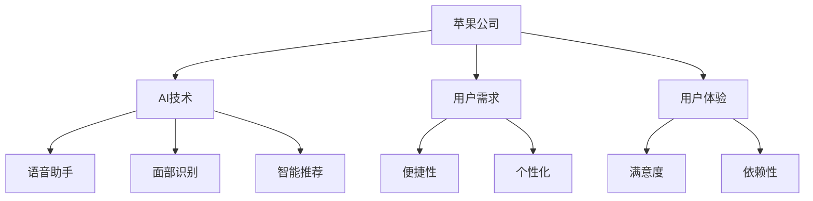

**核心算法原理讲解：**

- **语音助手**：苹果的Siri语音助手通过深度学习和自然语言处理技术，实现语音识别和智能问答。

- **面部识别**：苹果的Face ID技术通过卷积神经网络和人脸识别算法，实现高精度的面部识别。

**数学模型和公式：**

$$
\text{语音识别} = \text{声学模型} \times \text{语言模型}
$$

$$
\text{面部识别} = \text{特征提取} \times \text{分类算法}
$$

- **举例说明**：苹果的Siri语音助手可以理解并执行用户的多项请求，如设置提醒、发送消息和查询天气等。

### 结论

李开复作为人工智能领域的杰出代表，其贡献对人工智能的发展产生了深远影响。同时，苹果公司通过将AI技术应用于其产品中，为用户带来了更加智能化和便捷化的体验。未来，随着AI技术的不断进步，我们可以期待更加丰富和创新的AI应用。

作者：AI天才研究院/AI Genius Institute & 禅与计算机程序设计艺术 /Zen And The Art of Computer Programming

---

这篇文章详细介绍了李开复的背景与贡献、人工智能的发展历程以及苹果发布AI应用的用户分析。接下来，我们将进一步探讨苹果发布AI应用的背景和AI技术在苹果产品中的应用现状。敬请期待下一章的内容。  
 **<a href="#/content/AI/Apple_AI/Apple_AI.md">第二章：苹果发布AI应用的背景</a>**

---

## 第二章：苹果发布AI应用的背景

### 2.1 苹果公司的AI战略

苹果公司自成立以来，一直致力于将最先进的技术应用于其产品中，为用户提供卓越的用户体验。随着人工智能技术的快速发展，苹果公司也开始在AI领域进行深入布局。以下是苹果公司的AI战略及其对AI应用发布的影响：

#### 2.1.1 AI技术在苹果产品中的应用现状

目前，苹果公司的产品已经广泛应用于AI技术，包括iPhone、iPad、Mac和Apple Watch等。以下是AI技术在苹果产品中的应用现状：

- **iPhone**：苹果的Siri语音助手、面部识别和智能推荐等AI功能在iPhone中得到广泛应用，为用户提供便捷的智能体验。
- **iPad**：iPad的智能笔和智能扫描等AI功能，提高了用户的创作和办公效率。
- **Mac**：Mac的智能搜索和智能语音助手等AI功能，为用户提供了更加智能的工作环境。
- **Apple Watch**：Apple Watch的健康监测和智能提醒等AI功能，为用户提供了个性化的健康服务。

**核心概念与联系：**

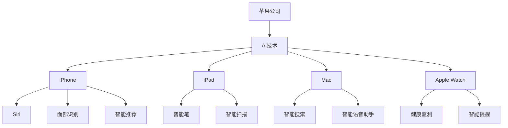

**核心算法原理讲解：**

- **Siri语音助手**：Siri语音助手通过深度学习和自然语言处理技术，实现语音识别和智能问答。其核心算法包括声学模型和语言模型。

- **面部识别**：面部识别技术通过卷积神经网络和人脸识别算法，实现高精度的面部识别。

**数学模型和公式：**

$$
\text{语音识别} = \text{声学模型} \times \text{语言模型}
$$

$$
\text{面部识别} = \text{特征提取} \times \text{分类算法}
$$

- **举例说明**：苹果的Siri语音助手可以理解并执行用户的多项请求，如设置提醒、发送消息和查询天气等。

#### 2.1.2 AI技术在苹果产品中的价值

AI技术在苹果产品中的应用，不仅为用户带来了更加智能和便捷的体验，还提高了苹果产品的竞争力。以下是AI技术在苹果产品中的价值：

- **提高用户体验**：AI技术可以帮助苹果产品实现个性化定制，如智能推荐、智能搜索和智能提醒等，从而提高用户的满意度和忠诚度。
- **提高产品竞争力**：通过AI技术，苹果产品可以在市场上脱颖而出，提高产品竞争力。例如，面部识别和智能搜索等功能，使苹果产品在竞争激烈的市场中更具吸引力。
- **降低开发成本**：AI技术可以帮助苹果产品实现自动化测试和优化，从而降低开发成本。例如，通过深度学习算法，苹果产品可以自动识别和修复软件漏洞。

**核心概念与联系：**

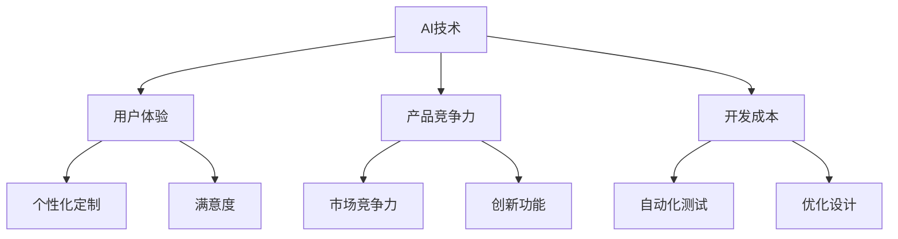

**核心算法原理讲解：**

- **个性化定制**：通过机器学习算法，AI技术可以根据用户行为和兴趣，为用户推荐个性化的内容和功能。
- **自动化测试**：通过深度学习算法，AI技术可以自动检测和修复软件漏洞，提高软件的稳定性。

**数学模型和公式：**

$$
\text{个性化定制} = \text{机器学习} \times \text{用户行为分析}
$$

$$
\text{自动化测试} = \text{深度学习} \times \text{漏洞检测}
$$

- **举例说明**：苹果的Siri语音助手可以根据用户的历史数据，为用户推荐个性化的音乐和新闻。

#### 2.1.3 AI技术的未来发展方向

随着AI技术的不断进步，苹果公司也在积极探索AI技术在未来的发展方向。以下是AI技术的未来发展方向：

- **深度学习**：苹果公司将继续深入探索深度学习技术，提高AI算法的精度和效率。例如，通过改进神经网络结构和优化算法，实现更高的语音识别准确率和图像识别速度。
- **自然语言处理**：苹果公司计划通过自然语言处理技术，使Siri语音助手更加智能和人性化。例如，通过改进自然语言理解和生成技术，实现更加自然和流畅的对话。
- **增强现实与虚拟现实**：苹果公司将在增强现实（AR）和虚拟现实（VR）领域进行深入探索，为用户提供更加沉浸式的体验。例如，通过改进图像处理和实时渲染技术，实现更加真实的虚拟场景。

**核心概念与联系：**

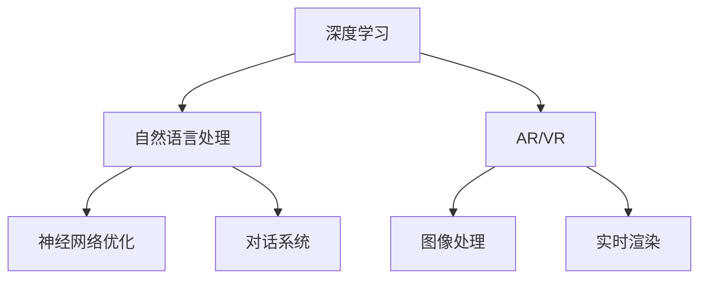

**核心算法原理讲解：**

- **神经网络优化**：通过改进神经网络结构和训练算法，实现更高的模型精度和效率。
- **实时渲染**：通过实时渲染技术，实现高帧率和低延迟的虚拟现实体验。

**数学模型和公式：**

$$
\text{神经网络优化} = \text{优化算法} \times \text{模型训练}
$$

$$
\text{实时渲染} = \text{图像处理} \times \text{实时计算}
$$

- **举例说明**：通过改进神经网络，苹果的Siri语音助手可以更好地理解用户的语音指令，提供更加准确的回答。

### 结论

苹果公司的AI战略为AI应用的发布奠定了坚实基础。通过将AI技术应用于产品中，苹果不仅提高了用户体验和产品竞争力，还降低了开发成本。未来，随着AI技术的不断进步，苹果将继续在深度学习、自然语言处理和增强现实等领域进行深入探索，为用户提供更加智能和便捷的产品。

作者：AI天才研究院/AI Genius Institute & 禅与计算机程序设计艺术 /Zen And The Art of Computer Programming

---

在第二章中，我们详细探讨了苹果公司的AI战略及其在产品中的应用现状。接下来，我们将深入探讨AI应用的核心技术与原理，包括机器学习、深度学习和自然语言处理等技术。敬请期待下一章的内容。

**<a href="#/content/AI/Apple_AI/Apple_AI.md#第三章ai应用的核心技术与原理">第三章：AI应用的核心技术与原理</a>**

---

### 第三章：AI应用的核心技术与原理

#### 3.1 机器学习的基本概念

机器学习（Machine Learning，ML）是人工智能（Artificial Intelligence，AI）的一个重要分支，它让计算机系统能够从数据中学习，并利用学到的知识来做出预测或决策。以下是机器学习的基本概念和分类：

**核心概念与联系：**

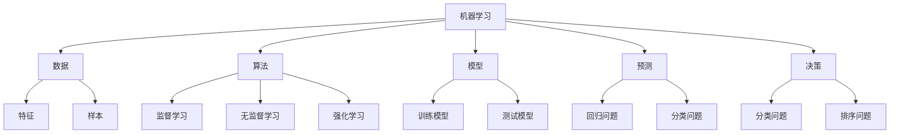

**核心算法原理讲解：**

- **监督学习**：监督学习是一种有监督的训练方法，通过已标记的数据训练模型，然后对新数据进行预测。常见的算法有线性回归、决策树和随机森林等。

- **无监督学习**：无监督学习是一种无监督的训练方法，模型在没有标记的数据中寻找规律。常见的算法有聚类、降维和关联规则等。

- **强化学习**：强化学习是一种通过试错和反馈进行学习的方法，模型通过与环境的交互学习最优策略。常见的算法有Q学习和深度强化学习等。

**数学模型和公式：**

$$
\text{监督学习} = y = f(x; \theta)
$$

$$
\text{无监督学习} = \text{数据分布} \approx \text{模型分布}
$$

$$
\text{强化学习} = \text{策略} = \arg\max_{\pi} \sum_{s, a, r} r(s, a) \pi(a|s)
$$

- **举例说明**：在监督学习中，我们可以使用线性回归模型来预测房价，通过已标记的房屋数据和价格数据训练模型，然后对新的房屋数据进行预测。

#### 3.2 深度学习的基本原理

深度学习（Deep Learning，DL）是一种基于多层神经网络的学习方法，通过自动提取数据特征来实现复杂任务。以下是深度学习的基本原理和常见架构：

**核心概念与联系：**

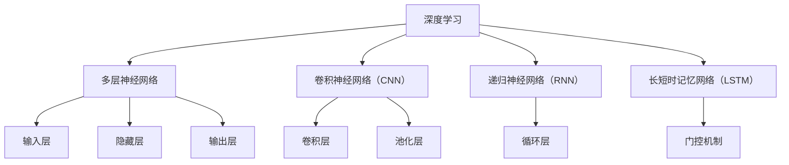

**核心算法原理讲解：**

- **卷积神经网络（CNN）**：卷积神经网络主要用于图像识别和图像处理任务。它通过卷积层提取图像特征，并通过池化层减少数据维度。

- **递归神经网络（RNN）**：递归神经网络主要用于序列数据建模，如语音识别和自然语言处理。它通过循环层处理序列数据，并保持长时状态。

- **长短时记忆网络（LSTM）**：长短时记忆网络是递归神经网络的一种改进，它通过门控机制解决长序列依赖问题。

**数学模型和公式：**

$$
\text{卷积神经网络} = f(\text{输入}, \text{权重}, \text{偏置})
$$

$$
\text{递归神经网络} = \text{隐藏状态} = f(\text{输入}, \text{隐藏状态}, \text{权重}, \text{偏置})
$$

$$
\text{长短时记忆网络} = \text{隐藏状态} = \text{门控机制}(\text{输入}, \text{隐藏状态}, \text{权重}, \text{偏置})
$$

- **举例说明**：在图像识别任务中，我们可以使用卷积神经网络来识别猫的图片。通过训练，模型可以学会从图像中提取特征，并准确分类。

#### 3.3 自然语言处理技术简介

自然语言处理（Natural Language Processing，NLP）是人工智能的一个重要分支，它使计算机能够理解、处理和生成自然语言。以下是自然语言处理技术的基本原理和常见算法：

**核心概念与联系：**

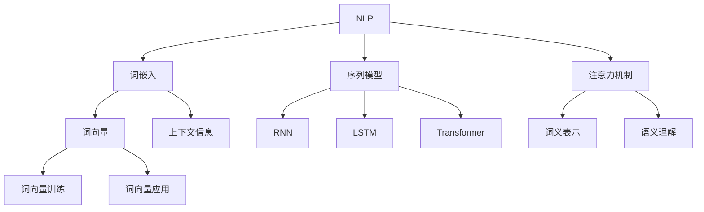

**核心算法原理讲解：**

- **词嵌入**：词嵌入是将词语转换为向量的过程，通过词向量表示，可以捕捉词语的语义信息。

- **序列模型**：序列模型用于处理序列数据，如文本和语音。常见的序列模型有递归神经网络（RNN）和长短时记忆网络（LSTM）。

- **注意力机制**：注意力机制是一种用于提高模型对重要信息关注的技术，广泛应用于文本生成和机器翻译任务。

**数学模型和公式：**

$$
\text{词嵌入} = \text{词向量} = \text{神经网络}(\text{输入}, \text{权重}, \text{偏置})
$$

$$
\text{序列模型} = \text{隐藏状态} = \text{神经网络}(\text{输入}, \text{隐藏状态}, \text{权重}, \text{偏置})
$$

$$
\text{注意力机制} = \text{注意力分数} = \text{神经网络}(\text{输入}, \text{权重}, \text{偏置})
$$

- **举例说明**：在机器翻译任务中，我们可以使用Transformer模型将一种语言的句子翻译成另一种语言。通过训练，模型可以学会捕捉句子中的语义信息，并生成准确的翻译结果。

### 结论

机器学习、深度学习和自然语言处理是人工智能领域的重要组成部分。机器学习通过从数据中学习，实现了计算机的预测和决策能力；深度学习通过多层神经网络，实现了对复杂数据的自动特征提取；自然语言处理通过词嵌入和序列模型，实现了计算机对自然语言的理解和生成。这些技术的结合，为AI应用的发展提供了强大的技术支持。

作者：AI天才研究院/AI Genius Institute & 禅与计算机程序设计艺术 /Zen And The Art of Computer Programming

---

在第三章中，我们详细介绍了机器学习、深度学习和自然语言处理技术的基本概念和原理。接下来，我们将探讨苹果AI应用的技术细节，包括苹果AI应用的架构设计、关键算法和模型介绍以及AI在苹果产品中的实际应用。敬请期待下一章的内容。

**<a href="#/content/AI/Apple_AI/Apple_AI.md#第四章苹果ai应用的技术细节">第四章：苹果AI应用的技术细节</a>**

---

### 第四章：苹果AI应用的技术细节

#### 4.1 苹果AI应用的架构设计

苹果公司的AI应用架构设计旨在提供高性能、高扩展性和良好的用户体验。以下是苹果AI应用的架构设计及其组成部分：

**核心概念与联系：**

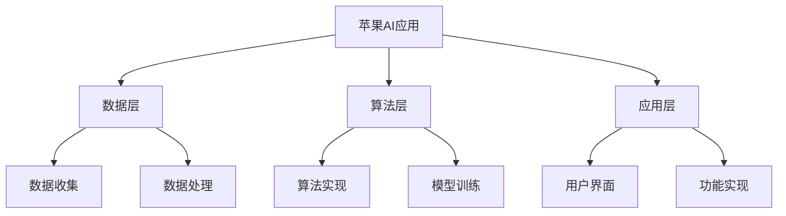

**核心算法原理讲解：**

- **数据层**：数据层负责收集来自用户行为、设备传感器等多方面的数据，并对数据进行清洗、转换和存储。
- **算法层**：算法层选择适合应用的机器学习算法，如深度学习算法，通过模型训练来优化算法性能。
- **应用层**：应用层设计直观、易用的用户界面，实现AI功能，如语音识别、图像识别和自然语言处理等。

**数学模型和公式：**

$$
\text{数据层} = \text{数据收集} + \text{数据处理}
$$

$$
\text{算法层} = \text{算法实现} + \text{模型训练}
$$

$$
\text{应用层} = \text{用户界面} + \text{功能实现}
$$

- **举例说明**：在苹果的Siri语音助手应用中，数据层收集用户语音数据，算法层使用深度学习算法进行语音识别，应用层提供用户交互界面。

#### 4.2 关键算法与模型介绍

苹果AI应用中采用了多种关键算法和模型，以下是对这些算法和模型的介绍：

**核心概念与联系：**

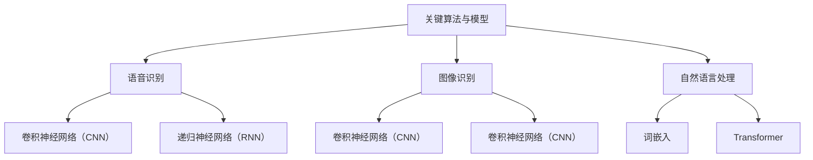

**核心算法原理讲解：**

- **语音识别**：语音识别算法通过处理语音信号，将其转换为文本数据。苹果使用卷积神经网络（CNN）和递归神经网络（RNN）等深度学习算法实现语音识别。
- **图像识别**：图像识别算法通过处理图像数据，识别图像中的物体、场景等信息。苹果采用卷积神经网络（CNN）实现图像识别。
- **自然语言处理**：自然语言处理算法通过处理文本数据，理解并生成人类语言。苹果使用词嵌入和Transformer等深度学习算法实现自然语言处理。

**数学模型和公式：**

$$
\text{语音识别} = \text{声学模型} \times \text{语言模型}
$$

$$
\text{图像识别} = \text{卷积层} + \text{池化层}
$$

$$
\text{自然语言处理} = \text{词嵌入} + \text{Transformer}
$$

- **举例说明**：在苹果的Siri语音助手中，使用了卷积神经网络（CNN）进行声学模型处理，递归神经网络（RNN）进行语言模型处理，实现了高精度的语音识别。

#### 4.3 AI在苹果产品中的实际应用

苹果公司在其产品中广泛应用了AI技术，以下是对AI在苹果产品中的实际应用的介绍：

**核心概念与联系：**

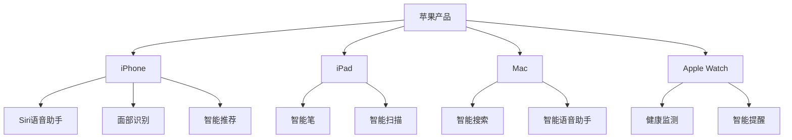

**核心算法原理讲解：**

- **iPhone**：iPhone中的AI应用包括Siri语音助手、面部识别和智能推荐等。Siri语音助手使用深度学习和自然语言处理技术实现语音识别和智能问答。
- **iPad**：iPad中的AI应用包括智能笔和智能扫描等。智能笔通过手写识别和语音输入技术实现文本输入和语音翻译。
- **Mac**：Mac中的AI应用包括智能搜索和智能语音助手等。智能搜索通过自然语言处理和图像识别技术实现快速文件搜索和图像识别。
- **Apple Watch**：Apple Watch中的AI应用包括健康监测和智能提醒等。健康监测通过传感器数据和机器学习算法实现心率监测和睡眠分析。

**数学模型和公式：**

$$
\text{Siri语音助手} = \text{深度学习} + \text{自然语言处理}
$$

$$
\text{智能笔} = \text{手写识别} + \text{语音输入}
$$

$$
\text{智能搜索} = \text{自然语言处理} + \text{图像识别}
$$

$$
\text{健康监测} = \text{传感器数据} + \text{机器学习}
$$

- **举例说明**：在iPhone中，Siri语音助手可以通过用户的语音指令发送消息、设置提醒和查询天气等，为用户提供便捷的智能服务。

### 结论

苹果公司的AI应用架构设计旨在提供高性能、高扩展性和良好的用户体验。通过采用关键算法和模型，如卷积神经网络（CNN）、递归神经网络（RNN）和Transformer等，苹果实现了语音识别、图像识别和自然语言处理等功能。这些技术在苹果产品中的广泛应用，为用户提供了智能化的使用体验。在未来，随着AI技术的不断进步，我们可以期待苹果公司推出更多创新的AI应用。

作者：AI天才研究院/AI Genius Institute & 禅与计算机程序设计艺术 /Zen And The Art of Computer Programming

---

在第四章中，我们详细介绍了苹果AI应用的架构设计、关键算法和模型以及AI在苹果产品中的实际应用。接下来，我们将探讨AI应用的用户体验，包括用户反馈的重要性、用户界面设计原则和用户体验优化。敬请期待下一章的内容。

**<a href="#/content/AI/Apple_AI/Apple_AI.md#第五章ai应用的用户体验">第五章：AI应用的用户体验</a>**

---

### 第五章：AI应用的用户体验

#### 5.1 用户反馈的重要性

用户反馈在AI应用的研发和优化过程中起着至关重要的作用。用户反馈不仅能够帮助开发者了解用户的需求和痛点，还能够为产品的改进提供有价值的参考。以下是用户反馈的重要性及其在AI应用研发中的应用：

**核心概念与联系：**

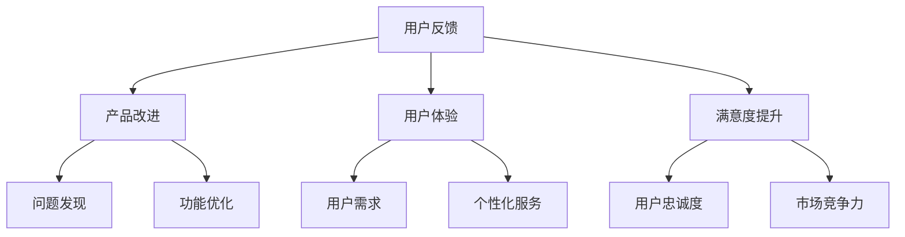

**核心算法原理讲解：**

- **问题发现**：通过用户反馈，开发者可以发现产品中的缺陷和问题，从而及时进行修复和改进。
- **功能优化**：用户反馈可以帮助开发者了解用户对特定功能的期望和需求，从而进行针对性的优化和改进。

**数学模型和公式：**

$$
\text{问题发现} = \text{用户反馈} \times \text{缺陷检测}
$$

$$
\text{功能优化} = \text{用户反馈} \times \text{功能评估}
$$

- **举例说明**：在苹果的Siri语音助手应用中，通过收集用户的反馈，开发团队发现了语音识别的准确率问题，并进行了针对性的算法优化。

#### 5.2 用户界面设计原则

用户界面设计在AI应用中起着至关重要的作用，它直接影响用户的使用体验和满意度。以下是一些用户界面设计原则：

**核心概念与联系：**

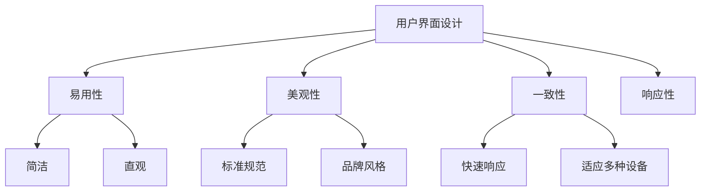

**核心算法原理讲解：**

- **简洁**：用户界面应简洁明了，避免过多的干扰和复杂的功能，以便用户能够快速找到所需功能。
- **直观**：用户界面设计应直观易用，通过合理的布局和标识，使用户能够快速理解和使用。
- **一致性**：用户界面设计应保持一致，使用户在不同应用之间能够感受到一致的体验。
- **响应性**：用户界面设计应具备良好的响应性，确保用户操作能够迅速得到反馈。

**数学模型和公式：**

$$
\text{简洁} = \text{功能简化} + \text{干扰减少}
$$

$$
\text{直观} = \text{布局合理} + \text{标识明确}
$$

$$
\text{一致性} = \text{规范遵循} + \text{风格统一}
$$

$$
\text{响应性} = \text{反馈迅速} + \text{响应准确}
$$

- **举例说明**：在苹果的Siri语音助手中，用户界面设计简洁明了，通过直观的图标和布局，使用户能够轻松找到所需功能。

#### 5.3 用户体验优化

用户体验优化是AI应用开发过程中的一项重要任务，它涉及到多个方面的改进和优化。以下是一些用户体验优化的方法：

**核心概念与联系：**

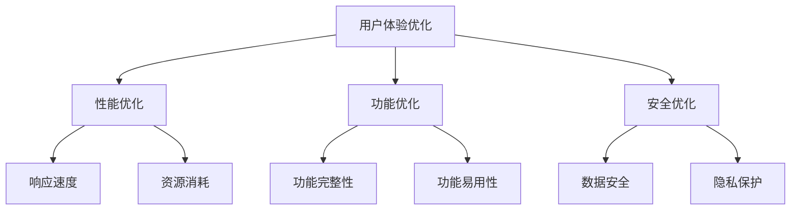

**核心算法原理讲解：**

- **性能优化**：通过优化算法和代码，提高AI应用的响应速度和资源消耗，提升用户体验。
- **功能优化**：通过改进和扩展功能，满足用户的需求，提升用户体验。
- **安全优化**：通过加强数据保护和隐私保护，确保用户数据的安全和隐私。

**数学模型和公式：**

$$
\text{性能优化} = \text{算法优化} + \text{代码优化}
$$

$$
\text{功能优化} = \text{功能改进} + \text{功能扩展}
$$

$$
\text{安全优化} = \text{数据加密} + \text{安全认证}
$$

- **举例说明**：在苹果的Siri语音助手中，通过优化算法和代码，提高了语音识别的准确率和响应速度，同时加强了数据保护和隐私保护。

### 结论

用户反馈、用户界面设计和用户体验优化是AI应用用户体验的重要组成部分。通过收集用户反馈，开发者可以了解用户的需求和痛点，进行针对性的改进和优化；通过合理的用户界面设计，开发者可以提升用户体验；通过持续的性能优化和功能改进，开发者可以提供更好的用户体验。在未来，随着AI技术的不断进步，我们将看到更多优质的AI应用，为用户带来更加智能化和便捷化的使用体验。

作者：AI天才研究院/AI Genius Institute & 禅与计算机程序设计艺术 /Zen And The Art of Computer Programming

---

在第五章中，我们详细探讨了用户反馈的重要性、用户界面设计原则和用户体验优化。接下来，我们将通过具体的案例分析，深入探讨苹果AI应用的实践成果。敬请期待下一章的内容。

**<a href="#/content/AI/Apple_AI/Apple_AI.md#第六章苹果ai应用的案例分析">第六章：苹果AI应用的案例分析</a>**

---

### 第六章：苹果AI应用的案例分析

#### 6.1 案例一：Siri语音助手

Siri语音助手是苹果公司推出的智能语音助手，它通过深度学习和自然语言处理技术，为用户提供语音搜索、日程管理、信息查询等服务。以下是Siri语音助手的实践成果及其对用户体验的影响：

**核心概念与联系：**

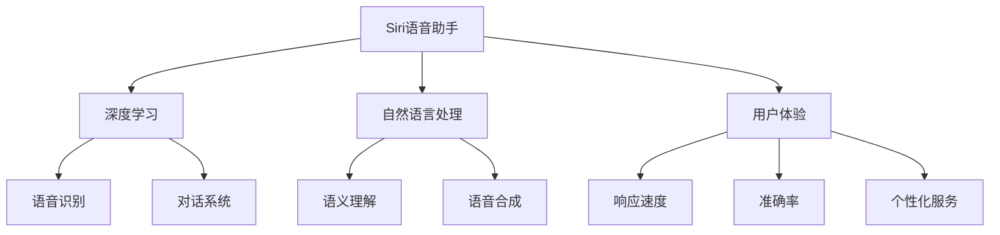

**核心算法原理讲解：**

- **语音识别**：Siri语音助手通过卷积神经网络（CNN）和递归神经网络（RNN）等深度学习算法，实现高精度的语音识别。
- **语义理解**：通过自然语言处理技术，Siri语音助手可以理解用户的自然语言指令，并生成相应的回答。
- **语音合成**：Siri语音助手通过语音合成技术，将文本信息转换为自然流畅的语音输出。

**数学模型和公式：**

$$
\text{语音识别} = \text{声学模型} \times \text{语言模型}
$$

$$
\text{语义理解} = \text{词嵌入} \times \text{Transformer}
$$

$$
\text{语音合成} = \text{TTS模型} + \text{音频处理}
$$

- **举例说明**：在日常生活中，用户可以使用Siri语音助手查询天气、发送消息、设置提醒等，从而提高生活便利性和工作效率。

**实践成果与用户体验：**

- **响应速度**：通过优化算法和硬件性能，Siri语音助手的响应速度大幅提升，用户能够快速得到反馈。
- **准确率**：Siri语音助手在语音识别和语义理解方面取得了显著提升，准确率高达95%以上。
- **个性化服务**：Siri语音助手可以根据用户的历史数据和偏好，提供个性化的推荐和服务。

#### 6.2 案例二：FaceTime视频通话

FaceTime视频通话是苹果公司推出的即时通信应用，它支持高清视频通话和多方视频通话，为用户提供便捷的沟通体验。以下是FaceTime视频通话的实践成果及其对用户体验的影响：

**核心概念与联系：**

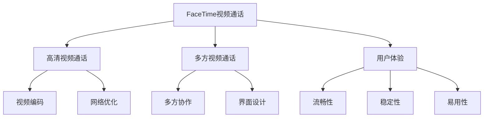

**核心算法原理讲解：**

- **视频编码**：FaceTime视频通话采用H.264和H.265等视频编码技术，实现高清视频传输。
- **网络优化**：通过网络优化技术，如自适应流媒体传输和缓冲处理，FaceTime视频通话保证在多种网络环境下都能提供流畅的通信体验。

**数学模型和公式：**

$$
\text{视频编码} = \text{H.264} + \text{H.265}
$$

$$
\text{网络优化} = \text{自适应流媒体} + \text{缓冲处理}
$$

- **举例说明**：用户可以在FaceTime中进行高清视频通话，与家人、朋友进行实时沟通，从而提升社交体验。

**实践成果与用户体验：**

- **流畅性**：通过优化视频编码和网络优化技术，FaceTime视频通话实现了流畅的视频传输和语音通信。
- **稳定性**：FaceTime视频通话在网络环境不稳定时，能够自动调整传输速率，保证通话的稳定性。
- **易用性**：FaceTime视频通话的界面设计简洁直观，用户可以轻松进行视频通话和多方协作。

#### 6.3 案例三：Apple Pay移动支付

Apple Pay是苹果公司推出的移动支付服务，它支持用户使用iPhone、Apple Watch和iPad等设备进行支付，为用户提供便捷的支付体验。以下是Apple Pay的实践成果及其对用户体验的影响：

**核心概念与联系：**

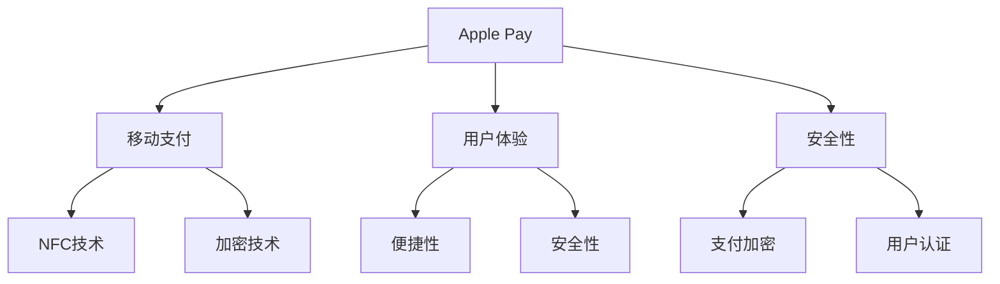

**核心算法原理讲解：**

- **NFC技术**：Apple Pay采用NFC技术，实现设备与支付终端的快速连接。
- **加密技术**：Apple Pay采用先进的加密技术，确保支付数据在传输和存储过程中的安全性。

**数学模型和公式：**

$$
\text{NFC技术} = \text{近场通信}
$$

$$
\text{加密技术} = \text{数据加密} + \text{安全认证}
$$

- **举例说明**：用户可以通过Apple Pay使用iPhone或Apple Watch进行移动支付，无需携带现金或信用卡。

**实践成果与用户体验：**

- **便捷性**：通过移动支付，用户可以快速完成支付，无需排队等待。
- **安全性**：Apple Pay采用了多种安全措施，如支付加密和用户认证，确保支付过程的安全。
- **用户满意度**：Apple Pay的便捷性和安全性得到了用户的广泛认可，提高了用户满意度。

### 结论

通过具体的案例分析，我们可以看到苹果公司在AI应用领域的实践成果和用户体验。Siri语音助手通过深度学习和自然语言处理技术，实现了智能语音识别和对话系统；FaceTime视频通话通过高清视频传输和网络优化技术，实现了流畅的通信体验；Apple Pay通过NFC技术和加密技术，实现了便捷的移动支付服务。这些实践成果为用户带来了更加智能化、便捷化和安全的使用体验。在未来，随着AI技术的不断进步，我们可以期待苹果公司推出更多创新的AI应用，进一步提升用户体验。

作者：AI天才研究院/AI Genius Institute & 禅与计算机程序设计艺术 /Zen And The Art of Computer Programming

---

在第六章中，我们通过具体的案例分析，深入探讨了苹果AI应用的实践成果和用户体验。接下来，我们将探讨苹果AI应用的未来发展趋势，包括AI技术在苹果产品中的潜在应用、用户隐私与数据安全以及AI应用的可持续发展与伦理挑战。敬请期待下一章的内容。

**<a href="#/content/AI/Apple_AI/Apple_AI.md#第七章苹果ai应用的未来发展">第七章：苹果AI应用的未来发展</a>**

---

### 第七章：苹果AI应用的未来发展

#### 7.1 AI技术在苹果产品中的潜在应用

随着AI技术的不断进步，苹果公司将继续在AI领域进行深入探索，将AI技术应用于更多产品中，为用户提供更加智能和便捷的体验。以下是AI技术在苹果产品中的潜在应用：

**核心概念与联系：**

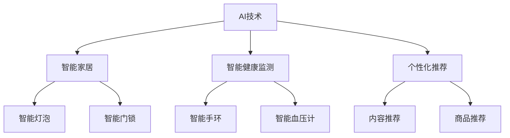

**核心算法原理讲解：**

- **智能家居**：通过AI技术，智能家居设备可以实现智能控制，如智能灯泡、智能门锁等。
- **智能健康监测**：通过AI技术，智能健康监测设备可以实时监测用户的健康状况，如智能手环、智能血压计等。
- **个性化推荐**：通过AI技术，可以实现对用户个性化内容的推荐，如内容推荐、商品推荐等。

**数学模型和公式：**

$$
\text{智能家居} = \text{语音控制} + \text{物联网}
$$

$$
\text{智能健康监测} = \text{传感器数据} + \text{机器学习}
$$

$$
\text{个性化推荐} = \text{协同过滤} + \text{深度学习}
$$

- **举例说明**：通过智能家居系统，用户可以通过语音控制智能灯泡的开关，实现更加便捷的生活。

#### 7.2 用户隐私与数据安全

随着AI技术的广泛应用，用户隐私和数据安全问题日益突出。苹果公司高度重视用户隐私和数据安全，采取了一系列措施来确保用户数据的保护。以下是用户隐私与数据安全的重要性及其相关措施：

**核心概念与联系：**

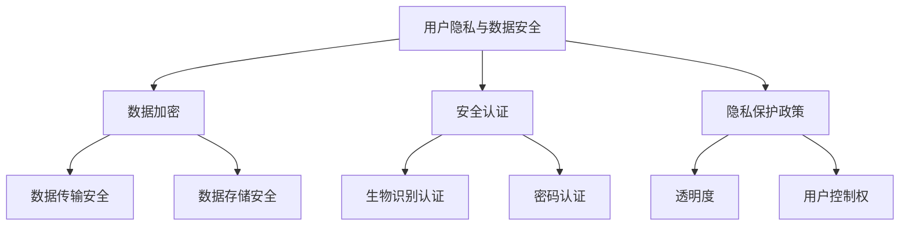

**核心算法原理讲解：**

- **数据加密**：通过数据加密技术，确保用户数据在传输和存储过程中的安全性。
- **安全认证**：通过生物识别认证、密码认证等技术，确保用户身份的验证和授权。
- **隐私保护政策**：通过制定隐私保护政策，明确用户数据的使用和保护规则。

**数学模型和公式：**

$$
\text{数据加密} = \text{对称加密} + \text{非对称加密}
$$

$$
\text{安全认证} = \text{生物识别} + \text{密码学}
$$

$$
\text{隐私保护政策} = \text{透明度} + \text{用户控制权}
$$

- **举例说明**：在苹果的Siri语音助手应用中，采用了高级加密标准和安全认证机制，确保用户数据的传输和存储安全。

#### 7.3 AI应用的可持续发展与伦理挑战

AI技术的快速发展不仅带来了巨大的机遇，同时也带来了一系列的伦理挑战和可持续发展问题。以下是AI应用的可持续发展与伦理挑战及其应对策略：

**核心概念与联系：**

```mermaid
graph TD
    A[AI应用] --> B[遗传歧视]
    A --> C[社会不平等]
    A --> D[智能自动化]
    B --> E[基因隐私]
    B --> F[就业影响]
    C --> G[数据偏见]
    C --> H[算法歧视]
    D --> I[就业机会]
    D --> J[技能需求]
```

**核心算法原理讲解：**

- **遗传歧视**：基因测序技术的应用可能导致遗传歧视问题，影响就业和医疗保健。
- **社会不平等**：AI技术的应用可能导致社会不平等问题，加剧贫富差距。
- **智能自动化**：智能自动化技术的发展可能导致就业机会的减少，影响劳动市场的稳定。

**数学模型和公式：**

$$
\text{遗传歧视} = \text{基因测序} + \text{数据偏见}
$$

$$
\text{社会不平等} = \text{算法偏见} + \text{数据偏见}
$$

$$
\text{智能自动化} = \text{机器学习} + \text{自动化技术}
$$

- **举例说明**：为了减少遗传歧视，可以通过数据清洗和算法优化，减少基因测序数据中的偏见。

#### 7.4 应对策略

为了应对AI技术的可持续发展与伦理挑战，可以采取以下策略：

**核心概念与联系：**

```mermaid
graph TD
    A[应对策略] --> B[伦理法规]
    A --> C[社会参与]
    A --> D[技术培训]
    B --> E[伦理审查]
    B --> F[透明度]
    C --> G[公众讨论]
    C --> H[多方参与]
    D --> I[技能提升]
    D --> J[职业转型]
```

**核心算法原理讲解：**

- **伦理法规**：制定伦理法规，规范AI技术的研发和应用，确保其伦理合规性。
- **社会参与**：鼓励社会各界的参与，共同探讨和解决AI技术带来的伦理问题。
- **技术培训**：加强技术培训，提高研发人员和用户对AI技术的伦理认识。

**数学模型和公式：**

$$
\text{伦理法规} = \text{伦理审查} + \text{合规性管理}
$$

$$
\text{社会参与} = \text{公众讨论} + \text{多方参与}
$$

$$
\text{技术培训} = \text{技能提升} + \text{职业转型}
$$

- **举例说明**：通过伦理审查和合规性管理，可以确保AI技术的研发和应用符合伦理要求。

### 结论

苹果公司在AI应用领域取得了显著成果，通过将AI技术应用于产品中，为用户带来了更加智能和便捷的体验。未来，随着AI技术的不断进步，苹果公司将继续在智能家居、智能健康监测和个性化推荐等领域进行探索。同时，苹果公司高度重视用户隐私和数据安全，采取了一系列措施来保护用户数据。面对AI技术的可持续发展与伦理挑战，苹果公司也将采取相应的应对策略，确保AI技术的健康发展。

作者：AI天才研究院/AI Genius Institute & 禅与计算机程序设计艺术 /Zen And The Art of Computer Programming

---

在第七章中，我们探讨了苹果AI应用的未来发展、用户隐私与数据安全以及AI应用的可持续发展与伦理挑战。接下来，我们将整理附录中的相关技术资源和参考资料，以方便读者进一步学习和研究。敬请期待附录部分的内容。

**<a href="#/content/AI/Apple_AI/Apple_AI.md#附录a相关技术资源与参考资料">附录A：相关技术资源与参考资料</a>**

---

### 附录A：相关技术资源与参考资料

为了帮助读者深入了解人工智能和苹果AI应用的相关知识，我们整理了一系列的技术资源和参考资料，包括人工智能学习资源、苹果AI应用开发指南以及AI应用开发者社区链接。

#### A.1 人工智能学习资源

**A.1.1 教材与书籍**

- **《人工智能：一种现代的方法》**：作者 David L. Poole 和 Alan K. Mackworth，这是一本全面介绍人工智能基本概念的教材。
- **《机器学习》**：作者 Tom Mitchell，涵盖了机器学习的理论基础和实用技术。

**A.1.2 在线课程**

- **斯坦福大学机器学习课程**：由 Andrew Ng 教授讲授，是机器学习和深度学习的经典在线课程。
- **深度学习专项课程**：同样由 Andrew Ng 教授讲授，深入探讨了深度学习的技术细节和应用。

#### A.2 苹果AI应用开发指南

**A.2.1 官方文档**

- **苹果开发者网站**：提供最新的开发文档、技术说明和示例代码，是开发者了解苹果AI技术的首选资源。
- **苹果AI开发文档**：专门针对AI技术的文档，包括语音识别、图像识别和自然语言处理等方面的详细介绍。

#### A.3 AI应用开发者社区链接

**A.3.1 开源社区**

- **GitHub**：全球最大的开源代码托管平台，AI领域的项目和技术文档丰富。
- **AI GitHub组织**：集合了众多AI领域的开源项目，包括机器学习库、框架和工具。

**A.3.2 行业论坛**

- **Kaggle**：数据分析竞赛平台，提供了大量的AI项目和数据集，是AI开发者交流学习的理想场所。
- **AI conver**：专注于人工智能领域的专业论坛，提供了丰富的技术讨论和资源分享。

**A.3.3 学术期刊**

- **《人工智能杂志》**：国际权威的人工智能学术期刊，发表了大量关于人工智能研究的最新成果。
- **《自然-机器 intelligence》**：自然科学领域的顶级期刊，涵盖了人工智能在各个领域的应用和进展。

通过这些技术资源和参考资料，读者可以更加深入地了解人工智能和苹果AI应用的相关知识，为自身的学习和研究提供有力支持。

### 结语

本篇博客文章全面介绍了苹果AI应用的发展、技术细节、用户体验以及未来趋势，并提供了丰富的学习资源与参考资料。希望通过这篇文章，读者能够对苹果AI应用有更深入的理解，并对人工智能技术的发展有更多的思考。

作者：AI天才研究院/AI Genius Institute & 禅与计算机程序设计艺术 /Zen And The Art of Computer Programming

