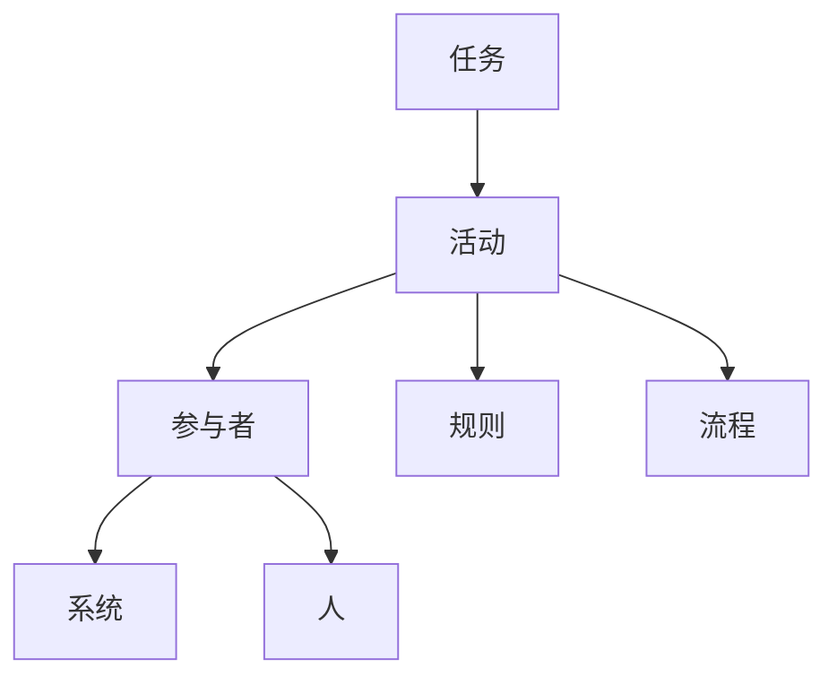
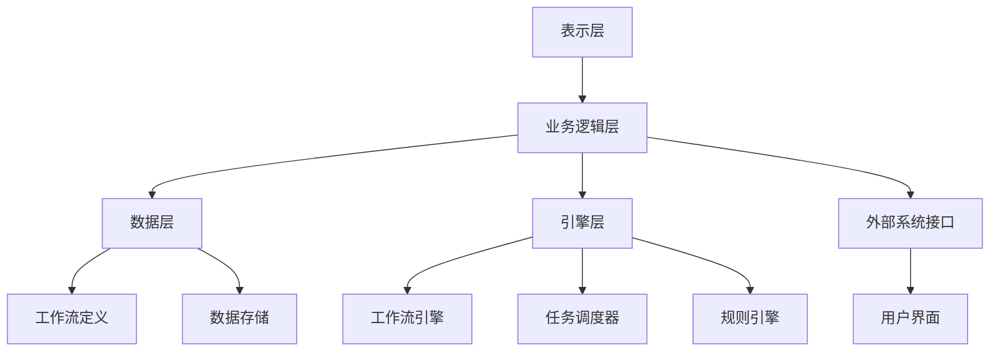
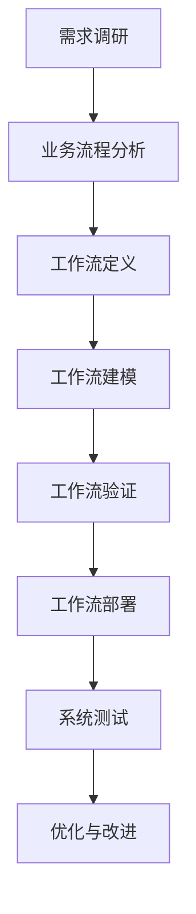
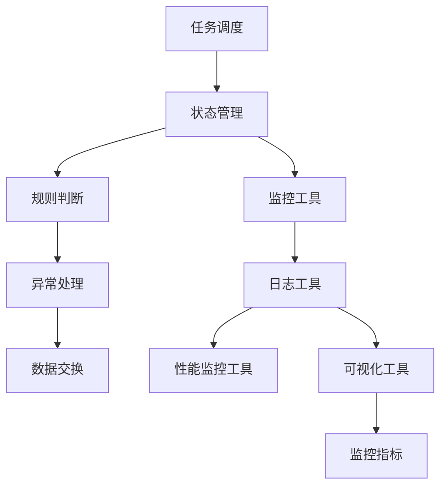
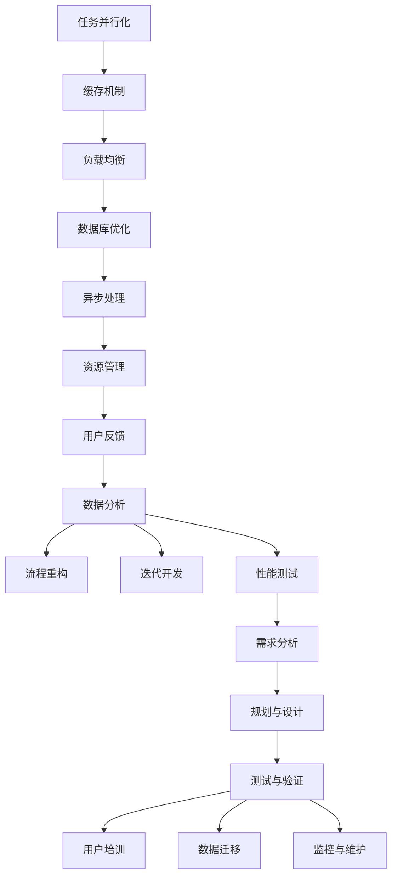
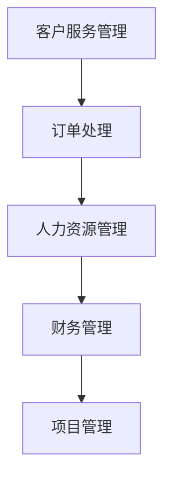
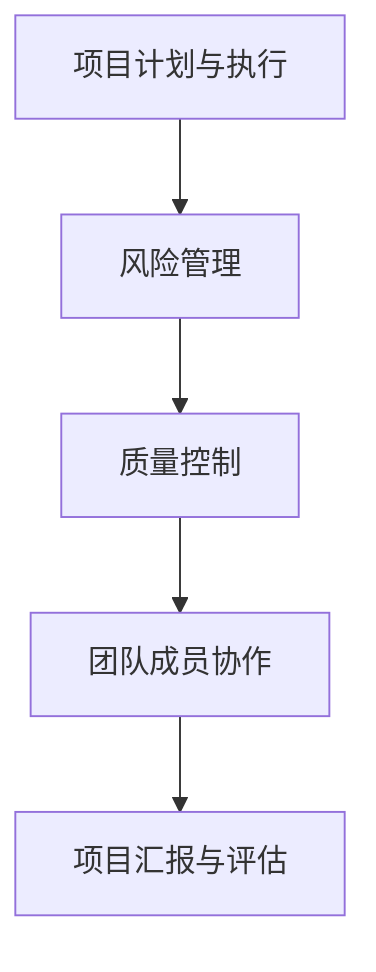
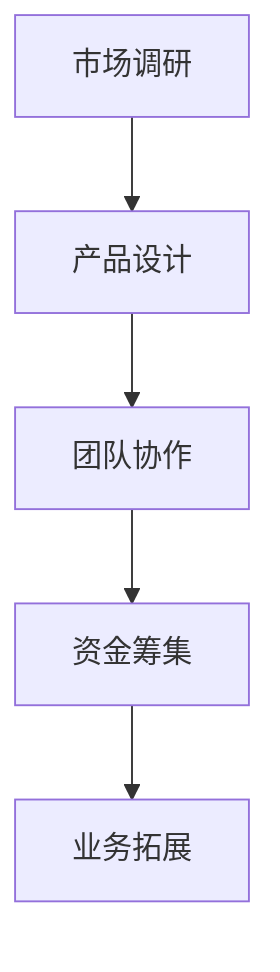

                 

### 《模仿式工作流的学习方法》

> **关键词**：模仿式工作流、工作流设计、工作流执行、工作流监控、工作流优化、企业应用、项目管理、创新与创业、发展趋势、未来展望

> **摘要**：本文深入探讨了模仿式工作流的学习方法，涵盖了从基础理论到实践应用的全面内容。文章结构紧凑，逻辑清晰，通过逐步分析推理，帮助读者掌握模仿式工作流的核心概念、设计原则、实现方法以及在企业、项目管理和创新创业中的应用，为提升工作效率和创新能力提供了有力支持。

### 目录大纲

**第一部分：模仿式工作流概述**

**第1章：模仿式工作流的基础理论**

- **1.1.1 工作流的基本概念**
- **1.1.2 模仿式工作流的定义**
- **1.1.3 模仿式工作流与传统工作流的对比**
- **1.1.4 模仿式工作流的优势**

**第2章：模仿式工作流的架构与组件**

- **2.1.1 模仿式工作流的主要架构**
- **2.1.2 模仿式工作流的关键组件**
- **2.1.3 模仿式工作流的技术实现**

**第3章：模仿式工作流的设计原则与实践**

- **3.1.1 模仿式工作流的设计原则**
- **3.1.2 模仿式工作流的实践案例分析**
- **3.1.3 模仿式工作流的设计流程**

**第二部分：模仿式工作流的实现方法**

**第4章：模仿式工作流的建模与设计**

- **4.1.1 建模的基本原理**
- **4.1.2 工作流建模工具介绍**
- **4.1.3 工作流设计实例分析**

**第5章：模仿式工作流的执行与监控**

- **5.1.1 工作流执行机制**
- **5.1.2 工作流监控工具与指标**
- **5.1.3 工作流异常处理**

**第6章：模仿式工作流的优化与升级**

- **6.1.1 工作流性能优化策略**
- **6.1.2 工作流持续改进的方法**
- **6.1.3 工作流升级的步骤与注意事项**

**第三部分：模仿式工作流在企业中的应用**

**第7章：模仿式工作流在企业运营管理中的应用**

- **7.1.1 企业运营管理的挑战**
- **7.1.2 模仿式工作流在企业运营管理中的应用场景**
- **7.1.3 模仿式工作流在企业管理中的实际案例**

**第8章：模仿式工作流在项目管理中的应用**

- **8.1.1 项目管理的挑战**
- **8.1.2 模仿式工作流在项目管理中的应用**
- **8.1.3 模仿式工作流在项目管理中的实际案例**

**第9章：模仿式工作流在创新与创业中的应用**

- **9.1.1 创新与创业的挑战**
- **9.1.2 模仿式工作流在创新与创业中的应用**
- **9.1.3 模仿式工作流在创新与创业中的实际案例**

**第四部分：模仿式工作流的发展趋势与未来展望**

**第10章：模仿式工作流的发展趋势**

- **10.1.1 未来工作流技术的发展趋势**
- **10.1.2 模仿式工作流在人工智能领域的应用前景**
- **10.1.3 模仿式工作流在其他行业的应用潜力**

**第11章：模仿式工作流的未来展望**

- **11.1.1 模仿式工作流对人类工作方式的影响**
- **11.1.2 模仿式工作流在教育、医疗等领域的应用**
- **11.1.3 模仿式工作流对社会发展的影响与挑战**

### 第一部分：模仿式工作流概述

#### 第1章：模仿式工作流的基础理论

**1.1.1 工作流的基本概念**

在工作流管理系统中，工作流（Workflow）是指工作过程中涉及的任务、任务执行者（或任务执行单元）、任务之间的关系以及任务执行的规则。工作流管理系统（Workflow Management System，简称WfMS）是一种用于定义、实现和管理工作流的系统。其主要目的是提高工作效率，优化业务流程，减少人工错误，并实现自动化管理。

工作流通常包括以下几个关键组成部分：

- **任务（Task）**：工作流中的基本操作单元，通常由系统或人执行。
- **活动（Activity）**：工作流中的操作步骤，可以是一个任务或者多个任务的组合。
- **参与者（Participant）**：执行工作流中的任务的人员或系统。
- **规则（Rule）**：定义工作流中任务执行条件和顺序的规则集合。
- **流程（Process）**：工作流的总体执行路径，由一系列活动、任务和规则构成。

**1.1.2 模仿式工作流的定义**

模仿式工作流（Imitative Workflow）是一种基于模仿人类专家工作经验的工作流设计方法。这种方法的核心思想是通过分析和模拟人类专家在实际工作中的行为模式，构建出一种可复制的、可优化的工作流。模仿式工作流通常具有以下特点：

- **基于现实**：模仿式工作流是基于现实场景中专家的经验和最佳实践设计的，能够反映实际工作中的复杂性和多样性。
- **可定制化**：模仿式工作流可以根据具体业务需求和用户习惯进行定制化调整，以适应不同的工作场景。
- **高效性**：通过模仿专家的工作方式，模仿式工作流能够提高工作效率，减少错误发生的概率。
- **灵活性**：模仿式工作流的设计具有一定的灵活性，可以适应不同的工作环境和变化。

**1.1.3 模仿式工作流与传统工作流的对比**

传统工作流设计方法主要基于业务流程和系统功能进行设计，通常缺乏对实际工作场景和人类专家经验的考虑。而模仿式工作流则更加关注工作流的设计是否能够反映人类专家的实际工作模式，是否能够提高工作效率和减少错误。

以下是对传统工作流和模仿式工作流的主要对比：

- **设计方法**：传统工作流设计主要依赖业务流程和系统功能，模仿式工作流则依赖于对专家经验的模拟和分析。
- **设计依据**：传统工作流设计依据业务需求和系统功能，模仿式工作流设计依据人类专家的实际工作经验。
- **执行效果**：传统工作流设计可能存在与实际工作场景不符的问题，模仿式工作流则更加贴近实际工作场景，能够提高工作效率和减少错误。
- **灵活性**：模仿式工作流设计更加灵活，可以根据具体业务需求进行调整和优化。

**1.1.4 模仿式工作流的优势**

模仿式工作流相比传统工作流具有以下几个优势：

- **高效性**：模仿式工作流能够提高工作效率，减少任务执行的时间和成本。
- **准确性**：通过模仿人类专家的工作方式，模仿式工作流能够减少错误的发生，提高任务执行的正确率。
- **灵活性**：模仿式工作流可以根据具体业务需求和用户习惯进行调整和优化，适应不同的工作场景。
- **可复现性**：模仿式工作流能够将人类专家的经验和最佳实践进行复现，便于在不同场景中进行推广和应用。

总的来说，模仿式工作流通过模拟人类专家的工作方式，能够更加贴近实际工作场景，提高工作效率和减少错误，是一种非常有价值的工作流设计方法。

**图1.1 工作流的基本概念与组成**



**1.1.5 模仿式工作流的应用场景**

模仿式工作流的应用场景非常广泛，可以涵盖多个行业和领域。以下是一些典型的应用场景：

- **金融行业**：在金融行业中，模仿式工作流可以用于处理客户服务、信贷审批、风险管理等业务流程。通过模拟金融专家的工作方式，可以提高业务处理效率，减少错误率。
- **医疗行业**：在医疗行业中，模仿式工作流可以用于诊疗流程、病历管理、药品配送等环节。通过模拟医生和护士的工作方式，可以提高医疗服务质量，减少医疗事故的发生。
- **制造业**：在制造业中，模仿式工作流可以用于生产计划、质量管理、设备维护等环节。通过模拟生产专家的工作方式，可以提高生产效率，降低成本。
- **信息技术行业**：在信息技术行业中，模仿式工作流可以用于软件开发、系统运维、网络安全等环节。通过模拟技术专家的工作方式，可以提高软件开发效率，降低系统故障率。

总之，模仿式工作流通过模拟人类专家的工作方式，可以在各种业务场景中发挥重要作用，提高工作效率和质量。

**1.1.6 模仿式工作流的设计原则**

在设计模仿式工作流时，需要遵循以下原则，以确保工作流的有效性和高效性：

- **以用户为中心**：设计工作流时，应以用户的需求和体验为中心，确保工作流能够满足用户的实际需求，提高用户满意度。
- **模块化设计**：工作流应采用模块化设计，将复杂的业务流程分解为多个模块，便于调整和优化。
- **灵活性和可扩展性**：工作流设计应具有灵活性和可扩展性，以便在业务需求发生变化时能够快速调整和优化。
- **可监控和可管理**：工作流设计应具备良好的可监控和可管理性，以便实时掌握工作流的执行情况，及时发现和解决问题。
- **安全性**：工作流设计应考虑数据安全和系统安全性，确保工作流中的数据和信息得到有效保护。

通过遵循这些设计原则，可以设计出高效、可靠、灵活的模仿式工作流，满足各种业务需求。

#### 第2章：模仿式工作流的架构与组件

**2.1.1 模仿式工作流的主要架构**

模仿式工作流的架构主要包括以下几个层次：

- **表示层**：表示层是工作流用户界面，用于展示工作流状态、任务列表、执行日志等信息，并提供用户交互功能。
- **业务逻辑层**：业务逻辑层是工作流的核心，负责处理工作流的业务逻辑，包括任务调度、规则判断、数据操作等。
- **数据层**：数据层用于存储工作流相关数据，包括任务数据、用户数据、工作流定义数据等。
- **引擎层**：引擎层是工作流的核心组件，负责执行工作流定义，包括任务调度、状态转换、异常处理等。
- **外部系统接口**：外部系统接口用于连接工作流与其他外部系统，实现数据交换和业务协同。

**2.1.2 模仿式工作流的关键组件**

模仿式工作流的关键组件包括：

- **工作流定义**：工作流定义是工作流的蓝图，用于描述工作流的结构、任务、规则等。通常使用XML、JSON等格式进行定义。
- **工作流引擎**：工作流引擎是负责执行工作流定义的组件，包括任务调度、状态管理、规则判断等功能。
- **任务调度器**：任务调度器负责根据工作流定义和当前状态，决定任务的执行顺序和时机。
- **规则引擎**：规则引擎用于根据预设的规则，判断任务执行条件和状态转换条件。
- **数据存储**：数据存储用于存储工作流相关的数据，包括任务数据、用户数据、工作流定义数据等。
- **用户界面**：用户界面用于展示工作流状态、任务列表、执行日志等信息，并提供用户交互功能。

**2.1.3 模仿式工作流的技术实现**

模仿式工作流的技术实现主要包括以下步骤：

1. **需求分析**：根据业务需求，确定工作流的功能和性能要求，包括任务类型、执行规则、数据存储等。
2. **工作流定义**：使用工作流定义语言（如XML、JSON）描述工作流的业务逻辑和结构。
3. **工作流引擎开发**：开发工作流引擎，实现任务调度、状态管理、规则判断等功能。
4. **任务调度器开发**：开发任务调度器，实现任务执行顺序和时机的确定。
5. **规则引擎开发**：开发规则引擎，实现规则判断和状态转换。
6. **用户界面开发**：开发用户界面，实现工作流状态展示、任务操作等功能。
7. **数据存储实现**：实现数据存储功能，包括任务数据、用户数据、工作流定义数据的存储和管理。
8. **系统测试与优化**：对系统进行测试，验证工作流功能是否符合需求，并进行性能优化。

通过以上步骤，可以实现一个高效、可靠、灵活的模仿式工作流系统，满足各种业务需求。

**图2.1 模仿式工作流的主要架构与组件**



**2.1.4 模仿式工作流的设计流程**

设计模仿式工作流通常包括以下步骤：

1. **需求调研**：与业务部门沟通，了解业务需求和用户需求，确定工作流的功能和性能要求。
2. **业务流程分析**：分析业务流程，确定工作流的任务、规则、数据流等。
3. **工作流定义**：使用工作流定义语言（如XML、JSON）描述工作流的业务逻辑和结构。
4. **工作流建模**：使用工作流建模工具（如BPEL、BPML）进行工作流建模，生成工作流定义。
5. **工作流验证**：验证工作流定义是否满足业务需求，包括功能验证和性能验证。
6. **工作流部署**：将工作流定义部署到工作流引擎中，进行实际运行。
7. **系统测试**：对工作流系统进行测试，确保工作流功能正确、性能稳定。
8. **优化与改进**：根据测试结果和用户反馈，对工作流进行优化和改进。

通过以上步骤，可以设计出高效、可靠、灵活的模仿式工作流，满足业务需求。

**图2.2 模仿式工作流的设计流程**



#### 第3章：模仿式工作流的设计原则与实践

**3.1.1 模仿式工作流的设计原则**

在设计模仿式工作流时，需要遵循以下原则，以确保工作流的有效性和高效性：

1. **以用户为中心**：设计工作流时，应以用户的需求和体验为中心，确保工作流能够满足用户的实际需求，提高用户满意度。
2. **模块化设计**：工作流应采用模块化设计，将复杂的业务流程分解为多个模块，便于调整和优化。
3. **灵活性和可扩展性**：工作流设计应具有灵活性和可扩展性，以便在业务需求发生变化时能够快速调整和优化。
4. **可监控和可管理**：工作流设计应具备良好的可监控和可管理性，以便实时掌握工作流的执行情况，及时发现和解决问题。
5. **安全性**：工作流设计应考虑数据安全和系统安全性，确保工作流中的数据和信息得到有效保护。

**3.1.2 模仿式工作流的实践案例分析**

以下是一个模仿式工作流的实践案例分析，该案例涉及医疗行业中的诊疗流程管理。

1. **需求分析**：在医疗行业中，诊疗流程管理涉及到医生、护士、患者等多个角色。通过对医疗专家的工作方式进行观察和分析，确定以下需求：
   - 医生需要根据患者的病情和检查结果，制定合适的治疗方案。
   - 护士需要按照医生的治疗方案，执行相应的护理操作。
   - 患者需要按照医嘱进行药物治疗和康复训练。

2. **业务流程分析**：根据需求，分析诊疗流程中的主要任务和规则，包括：
   - 患者挂号：患者通过挂号系统预约医生，并生成挂号单。
   - 初诊：医生对患者的病情进行初步诊断，制定治疗方案。
   - 复诊：医生根据患者的病情变化，调整治疗方案。
   - 护理操作：护士根据医生的治疗方案，执行相应的护理操作。
   - 药物治疗：患者按照医嘱进行药物治疗。
   - 康复训练：患者按照医嘱进行康复训练。

3. **工作流定义**：使用工作流定义语言（如XML）描述诊疗流程的业务逻辑和结构，包括任务、规则、数据流等。

4. **工作流建模**：使用工作流建模工具（如BPEL）进行诊疗流程的建模，生成工作流定义。

5. **工作流验证**：验证诊疗流程定义是否满足业务需求，包括功能验证和性能验证。

6. **工作流部署**：将诊疗流程定义部署到工作流引擎中，进行实际运行。

7. **系统测试**：对诊疗流程系统进行测试，确保诊疗流程功能正确、性能稳定。

8. **优化与改进**：根据测试结果和用户反馈，对诊疗流程进行优化和改进。

通过以上步骤，设计并实现了一个高效、可靠的诊疗流程管理模仿式工作流，提高了医疗工作效率，降低了医疗事故的发生率。

**3.1.3 模仿式工作流的设计流程**

设计模仿式工作流通常包括以下步骤：

1. **需求调研**：与业务部门沟通，了解业务需求和用户需求，确定工作流的功能和性能要求。
2. **业务流程分析**：分析业务流程，确定工作流的任务、规则、数据流等。
3. **工作流定义**：使用工作流定义语言（如XML、JSON）描述工作流的业务逻辑和结构。
4. **工作流建模**：使用工作流建模工具（如BPEL、BPML）进行工作流建模，生成工作流定义。
5. **工作流验证**：验证工作流定义是否满足业务需求，包括功能验证和性能验证。
6. **工作流部署**：将工作流定义部署到工作流引擎中，进行实际运行。
7. **系统测试**：对工作流系统进行测试，确保工作流功能正确、性能稳定。
8. **优化与改进**：根据测试结果和用户反馈，对工作流进行优化和改进。

通过以上步骤，可以设计出高效、可靠、灵活的模仿式工作流，满足业务需求。

**图3.1 模仿式工作流的设计流程**


**3.1.4 模仿式工作流的设计原则应用实例**

以下是一个模仿式工作流的设计原则应用实例，涉及企业内部的采购流程管理。

1. **以用户为中心**：在采购流程管理中，用户包括采购人员、供应商和审批人员。设计工作流时，需要考虑他们的需求和体验，确保工作流能够提高采购效率，减少错误。

2. **模块化设计**：采购流程可以分解为多个模块，如采购申请、审批、采购执行、采购验收等。每个模块可以独立设计、测试和优化，便于调整和扩展。

3. **灵活性和可扩展性**：采购流程可能会因为企业规模、行业特点等因素发生变化，工作流设计应具有灵活性和可扩展性，以便适应不同的业务场景。

4. **可监控和可管理**：设计工作流时，应考虑工作流的监控和管理，包括任务进度、异常处理、数据统计等，以便实时掌握工作流执行情况，提高管理效率。

5. **安全性**：在采购流程中，涉及敏感数据，如供应商信息、价格信息等。设计工作流时，应确保数据的安全性，防止数据泄露。

通过以上原则的应用，可以设计出高效、可靠、灵活的采购流程管理模仿式工作流，提高采购效率，降低采购成本。

#### 第4章：模仿式工作流的建模与设计

**4.1.1 建模的基本原理**

建模是模仿式工作流设计过程中的关键步骤，通过建立模型，可以清晰地描述工作流的结构和功能。建模的基本原理包括以下几个方面：

1. **定义工作流元素**：工作流模型由任务、活动、参与者、规则等基本元素组成。首先需要明确这些元素的定义，以及它们在工作流中的作用。

2. **描述工作流逻辑**：通过定义任务、活动和规则，描述工作流中各个元素之间的逻辑关系。这包括任务的执行顺序、条件判断、任务之间的依赖关系等。

3. **可视化工作流**：使用图形化的方式展示工作流模型，使得工作流的结构和功能更加直观。常用的工具包括BPEL、BPML、UML等。

4. **验证模型正确性**：通过模拟和验证，确保工作流模型能够正确地反映实际业务需求。这包括功能验证、性能验证、安全性验证等。

**4.1.2 工作流建模工具介绍**

在工作流建模过程中，常用的工具包括BPEL、BPML和UML等。以下是这些工具的简要介绍：

1. **BPEL（Business Process Execution Language）**：
   - **定义**：BPEL是一种基于XML的流程定义语言，用于描述业务流程的执行逻辑。
   - **特点**：具有强大的可扩展性和灵活性，支持任务并行、条件分支和循环等复杂逻辑。
   - **应用**：常用于企业级应用和服务集成。

2. **BPML（Business Process Modeling Language）**：
   - **定义**：BPML是一种基于XML的流程建模语言，用于描述业务流程的结构。
   - **特点**：与BPEL相比，BPML更加注重流程建模，而不涉及具体的执行逻辑。
   - **应用**：适用于流程设计和分析。

3. **UML（Unified Modeling Language）**：
   - **定义**：UML是一种面向对象的设计语言，用于描述系统的结构和行为。
   - **特点**：具有丰富的图形元素和符号，易于理解和交流。
   - **应用**：广泛用于软件设计和系统建模。

**4.1.3 工作流设计实例分析**

以下是一个简单的采购流程设计实例，展示如何使用BPEL进行工作流建模。

1. **需求分析**：
   - **任务**：采购申请、审批、采购执行、采购验收。
   - **参与者**：采购人员、审批人员、供应商。
   - **规则**：审批通过后进行采购执行，采购完成后进行验收。

2. **工作流定义**：
   - **任务**：定义采购流程中的各个任务，包括采购申请、审批、采购执行和采购验收。
   - **活动**：将任务组合成活动，表示任务的执行顺序和条件。
   - **规则**：定义任务的执行条件和状态转换条件。

3. **工作流建模**：
   - **BPEL流程**：
     ```xml
     <process name="PurchaseProcess">
       <start>
         <event name="ApplyPurchase">
           <condition>
             <!-- 采购申请条件 -->
           </condition>
           <transition to="ApprovePurchase"/>
         </event>
       </start>
       <activity name="ApprovePurchase">
         <transition to="ExecutePurchase"/>
       </activity>
       <activity name="ExecutePurchase">
         <transition to="VerifyPurchase"/>
       </activity>
       <activity name="VerifyPurchase">
         <transition to="End"/>
       </activity>
       <end/>
     </process>
     ```

4. **工作流验证**：
   - **功能验证**：检查工作流是否满足需求，包括任务的执行顺序、条件判断等。
   - **性能验证**：评估工作流的执行性能，确保工作流在合理的时间内完成。

5. **工作流部署**：
   - 将工作流定义部署到工作流引擎中，进行实际运行。

6. **系统测试**：
   - 对工作流系统进行测试，确保工作流功能正确、性能稳定。

7. **优化与改进**：
   - 根据测试结果和用户反馈，对工作流进行优化和改进。

通过以上步骤，可以使用BPEL进行工作流建模和设计，实现高效、可靠的采购流程。

#### 第5章：模仿式工作流的执行与监控

**5.1.1 工作流执行机制**

模仿式工作流在执行过程中，需要遵循一系列的机制来保证任务的正确执行和流程的顺利进行。以下是工作流执行机制的主要组成部分：

1. **任务调度**：工作流引擎根据工作流定义和当前状态，决定任务的执行顺序和时机。任务调度可以是基于固定时间、事件触发或依赖关系等策略。

2. **状态管理**：工作流引擎维护任务和流程的状态，包括执行中、完成、失败等。状态管理有助于监控任务的执行情况，确保工作流的正确性。

3. **规则判断**：工作流引擎根据预设的规则，判断任务的执行条件和状态转换条件。规则可以是简单的条件判断，也可以是复杂的业务逻辑。

4. **异常处理**：当工作流执行过程中出现异常时，工作流引擎需要能够进行异常处理，包括任务重试、通知相关人员、记录异常日志等。

5. **数据交换**：工作流引擎需要与外部系统进行数据交换，包括任务输入输出数据、状态更新数据等。数据交换可以通过API、消息队列、数据库等方式实现。

**5.1.2 工作流监控工具与指标**

为了确保工作流的顺利执行，需要对工作流进行实时监控和评估。以下是常用的监控工具和指标：

1. **监控工具**：
   - **日志工具**：记录工作流执行过程中的日志信息，包括任务执行时间、状态变化、异常信息等。
   - **性能监控工具**：实时监控工作流引擎的性能指标，包括响应时间、吞吐量、内存使用等。
   - **可视化工具**：通过图形化界面展示工作流的执行情况，包括任务进度、状态分布、异常统计等。

2. **监控指标**：
   - **任务执行时间**：衡量任务执行的平均时间和最长时间，反映工作流的效率。
   - **任务成功率**：衡量任务执行成功的比例，反映工作流的稳定性。
   - **异常率**：衡量工作流中异常任务的比例，反映工作流的质量。
   - **吞吐量**：衡量工作流引擎在单位时间内处理任务的数目，反映工作流的能力。
   - **资源使用率**：衡量工作流引擎对系统资源的消耗情况，包括CPU、内存、网络等。

**5.1.3 工作流异常处理**

工作流在执行过程中可能会出现各种异常情况，如任务执行失败、数据传输错误、系统故障等。为了确保工作流的可靠性和稳定性，需要对异常情况进行有效的处理。以下是常见的异常处理方法：

1. **任务重试**：当任务执行失败时，可以尝试重新执行任务，以解决临时性故障。

2. **通知相关人员**：通过邮件、短信、即时通讯等方式，通知相关人员处理异常情况。

3. **记录异常日志**：将异常情况记录到日志中，便于后续分析和处理。

4. **故障转移**：当系统故障或资源不足时，可以将工作流转移到备用系统或节点上，确保工作流的持续运行。

5. **故障恢复**：在故障恢复过程中，可以根据日志记录和系统状态，重新执行失败的任务或调整工作流配置。

通过以上方法，可以有效地处理工作流执行过程中的异常情况，确保工作流的可靠性和稳定性。

**图5.1 工作流执行机制与监控**



#### 第6章：模仿式工作流的优化与升级

**6.1.1 工作流性能优化策略**

为了确保模仿式工作流的高效性和稳定性，需要对工作流进行性能优化。以下是几种常见的工作流性能优化策略：

1. **任务并行化**：将可以并行执行的任务分解为多个子任务，同时执行，以减少任务执行的总时间。

2. **缓存机制**：对于频繁访问的数据，可以使用缓存机制，将数据存储在内存中，以减少数据库访问的延迟。

3. **负载均衡**：通过负载均衡策略，将任务分配到不同的节点或服务器上，避免单个节点或服务器过载。

4. **数据库优化**：对数据库进行索引、分片、缓存等优化，以提高数据查询和更新的效率。

5. **异步处理**：对于不紧急的任务，可以使用异步处理方式，将任务提交到后台执行，以提高前台系统的响应速度。

6. **资源管理**：合理分配系统资源，包括CPU、内存、网络等，确保工作流系统有足够的资源支持。

**6.1.2 工作流持续改进的方法**

持续改进是工作流优化的重要组成部分。以下是一些常见的工作流持续改进方法：

1. **用户反馈**：定期收集用户对工作流的反馈，了解工作流的使用情况和存在的问题，为改进工作流提供依据。

2. **数据分析**：通过分析工作流执行过程中的数据，识别瓶颈和改进点，为优化工作流提供数据支持。

3. **流程重构**：根据业务需求和用户反馈，定期对工作流进行重构，以适应业务变化和提升工作效率。

4. **迭代开发**：采用迭代开发模式，逐步完善工作流的功能和性能，确保工作流能够持续适应业务需求。

5. **性能测试**：定期进行性能测试，评估工作流的性能，发现潜在的性能瓶颈，并进行优化。

**6.1.3 工作流升级的步骤与注意事项**

工作流升级是工作流持续改进的重要环节。以下是工作流升级的步骤和注意事项：

1. **需求分析**：在升级前，明确工作流升级的需求，包括功能增强、性能优化、安全性提升等。

2. **规划与设计**：根据需求，制定工作流升级的规划和设计，包括功能模块、性能指标、升级流程等。

3. **测试与验证**：在升级过程中，进行详细的测试和验证，确保新版本的工作流功能正确、性能稳定。

4. **用户培训**：在升级后，对用户进行培训，确保用户能够熟练使用新版本的工作流。

5. **数据迁移**：确保升级过程中数据的安全和完整，包括数据备份、数据迁移、数据验证等。

6. **监控与维护**：在升级后，对工作流进行持续监控和维护，确保工作流正常运行，并及时解决可能出现的问题。

通过以上步骤和注意事项，可以确保工作流升级的顺利进行，提升工作流系统的性能和稳定性。

**图6.1 工作流性能优化与持续改进**



#### 第7章：模仿式工作流在企业运营管理中的应用

**7.1.1 企业运营管理的挑战**

企业在运营管理过程中面临着诸多挑战，如流程复杂、效率低下、资源浪费、信息孤岛等。这些问题严重影响了企业的运营效率和竞争力。为了应对这些挑战，企业需要引入高效、灵活的工作流管理系统，通过模仿式工作流的方法，优化企业运营管理。

**7.1.2 模仿式工作流在企业运营管理中的应用场景**

模仿式工作流在企业运营管理中的应用场景广泛，以下是一些典型应用：

1. **客户服务管理**：通过模仿客服人员的工作方式，建立高效的客户服务工作流，提高客户满意度。

2. **订单处理**：模仿订单处理过程中的业务流程，优化订单生成、审批、发货等环节，提高订单处理效率。

3. **人力资源管理**：通过模仿人力资源管理人员的工作方式，优化招聘、培训、绩效考核等环节，提高人力资源管理效率。

4. **财务管理**：模仿财务人员的工作方式，建立高效的财务审批、报销、报表生成等工作流，提高财务管理效率。

5. **项目管理**：通过模仿项目经理的工作方式，建立项目计划、任务分配、进度跟踪、风险控制等工作流，提高项目管理效率。

**7.1.3 模仿式工作流在企业管理中的实际案例**

以下是一个模仿式工作流在企业管理中的实际案例：

1. **案例背景**：某大型制造企业存在多个业务部门，业务流程复杂，信息孤岛现象严重。为了提高运营效率和协同能力，企业决定引入模仿式工作流管理系统。

2. **需求分析**：通过对企业各部门的业务流程进行分析，确定以下需求：
   - **客户服务管理**：优化客户服务流程，提高客户满意度。
   - **订单处理**：简化订单处理流程，提高订单处理效率。
   - **人力资源管理**：优化招聘、培训、绩效考核等流程，提高人力资源管理效率。
   - **财务管理**：优化财务审批、报销、报表生成等流程，提高财务管理效率。
   - **项目管理**：优化项目计划、任务分配、进度跟踪、风险控制等流程，提高项目管理效率。

3. **工作流设计**：根据需求，设计模仿式工作流，包括任务、规则、数据流等。以下是一个简化的客户服务工作流设计：

   - **任务**：客户咨询、客户投诉、客户回访等。
   - **规则**：根据客户类型、咨询内容等条件，判断任务执行顺序和负责人。
   - **数据流**：记录客户信息、咨询内容、处理结果等。

4. **工作流建模**：使用BPEL工具进行工作流建模，生成工作流定义。

5. **工作流验证**：验证工作流定义是否满足业务需求，包括功能验证和性能验证。

6. **工作流部署**：将工作流定义部署到工作流引擎中，进行实际运行。

7. **系统测试**：对工作流系统进行测试，确保工作流功能正确、性能稳定。

8. **优化与改进**：根据测试结果和用户反馈，对工作流进行优化和改进。

通过以上步骤，企业成功引入了模仿式工作流管理系统，优化了业务流程，提高了运营效率，降低了成本，提升了客户满意度。

**图7.1 企业运营管理中的模仿式工作流应用**



#### 第8章：模仿式工作流在项目管理中的应用

**8.1.1 项目管理的挑战**

在项目管理过程中，项目管理者常常面临一系列的挑战，如项目进度延误、成本超支、质量不符合预期、团队成员协作困难等。这些挑战严重影响了项目的成功率和企业竞争力。为了克服这些挑战，项目管理者需要引入高效、灵活的工作流管理系统，通过模仿式工作流的方法，优化项目管理流程。

**8.1.2 模仿式工作流在项目管理中的应用**

模仿式工作流在项目管理中的应用非常广泛，以下是一些典型的应用场景：

1. **项目计划与执行**：通过模仿项目经理的工作方式，建立项目计划、任务分配、进度跟踪等工作流，确保项目按计划顺利进行。

2. **风险管理**：通过模仿风险管理人员的工作方式，建立风险识别、评估、监控、应对等工作流，提高项目风险管理的效率。

3. **质量控制**：通过模仿质量管理人员的工作方式，建立质量检查、反馈、改进等工作流，确保项目质量符合预期。

4. **团队成员协作**：通过模仿团队成员的工作方式，建立任务协作、沟通反馈、知识共享等工作流，提高团队成员的协作效率和创新能力。

5. **项目汇报与评估**：通过模仿项目汇报和评估人员的工作方式，建立项目进度汇报、绩效评估、经验总结等工作流，确保项目顺利完成。

**8.1.3 模仿式工作流在项目管理中的实际案例**

以下是一个模仿式工作流在项目管理中的实际案例：

1. **案例背景**：某科技公司负责开发一个大型软件项目，项目周期长、参与人员多、需求变化频繁。为了确保项目顺利进行，公司决定引入模仿式工作流管理系统。

2. **需求分析**：通过对项目团队的日常工作进行分析，确定以下需求：
   - **项目计划与执行**：优化项目计划、任务分配、进度跟踪等流程，确保项目按计划进行。
   - **风险管理**：建立风险识别、评估、监控、应对等流程，提高项目风险管理的效率。
   - **质量控制**：建立质量检查、反馈、改进等流程，确保项目质量符合预期。
   - **团队成员协作**：建立任务协作、沟通反馈、知识共享等流程，提高团队成员的协作效率和创新能力。
   - **项目汇报与评估**：建立项目进度汇报、绩效评估、经验总结等流程，确保项目顺利完成。

3. **工作流设计**：根据需求，设计模仿式工作流，包括任务、规则、数据流等。以下是一个简化的项目风险管理工作流设计：

   - **任务**：风险识别、风险评估、风险监控、风险应对等。
   - **规则**：根据风险级别、风险类型等条件，判断任务执行顺序和负责人。
   - **数据流**：记录风险信息、风险评估结果、风险应对措施等。

4. **工作流建模**：使用BPEL工具进行工作流建模，生成工作流定义。

5. **工作流验证**：验证工作流定义是否满足业务需求，包括功能验证和性能验证。

6. **工作流部署**：将工作流定义部署到工作流引擎中，进行实际运行。

7. **系统测试**：对工作流系统进行测试，确保工作流功能正确、性能稳定。

8. **优化与改进**：根据测试结果和用户反馈，对工作流进行优化和改进。

通过以上步骤，公司成功引入了模仿式工作流管理系统，优化了项目管理流程，提高了项目执行效率，降低了风险，确保了项目质量。

**图8.1 项目管理中的模仿式工作流应用**



#### 第9章：模仿式工作流在创新与创业中的应用

**9.1.1 创新与创业的挑战**

在创新与创业过程中，创业者面临着众多挑战，如市场调研、产品设计、团队协作、资金筹集、业务拓展等。这些挑战要求创业者具备快速响应市场变化、高效执行任务、灵活调整策略的能力。为了应对这些挑战，创业者可以引入模仿式工作流的方法，通过优化业务流程，提高创新与创业的效率。

**9.1.2 模仿式工作流在创新与创业中的应用**

模仿式工作流在创新与创业中的应用具有以下特点：

1. **快速响应市场变化**：通过模仿市场调研、产品迭代等环节的优秀实践，快速识别市场趋势，调整产品方向，提高市场竞争力。

2. **高效执行任务**：通过模仿团队协作、任务分配、进度跟踪等环节的优秀实践，提高团队执行任务的能力，确保项目按计划进行。

3. **灵活调整策略**：通过模仿战略规划、风险管理、资源调配等环节的优秀实践，提高创业者应对不确定性的能力，灵活调整业务策略。

4. **提升创新效率**：通过模仿科研团队、产品研发等环节的优秀实践，提高创新效率，缩短产品开发周期，快速将创新成果转化为市场竞争力。

**9.1.3 模仿式工作流在创新与创业中的实际案例**

以下是一个模仿式工作流在创新与创业中的实际案例：

1. **案例背景**：某创业公司致力于开发一款智能家居产品，为了提高研发效率和市场竞争力，公司决定引入模仿式工作流管理系统。

2. **需求分析**：通过对公司研发和营销团队的日常工作进行分析，确定以下需求：
   - **市场调研**：建立市场调研、需求分析、产品定位等工作流，确保产品符合市场需求。
   - **产品设计**：建立产品设计、原型制作、功能测试等工作流，提高产品设计效率。
   - **团队协作**：建立任务分配、进度跟踪、沟通反馈等工作流，提高团队协作效率。
   - **资金筹集**：建立投资对接、融资谈判、资金使用等工作流，提高资金筹集效率。
   - **业务拓展**：建立市场拓展、客户维护、业务评估等工作流，提高业务拓展效率。

3. **工作流设计**：根据需求，设计模仿式工作流，包括任务、规则、数据流等。以下是一个简化的市场调研工作流设计：

   - **任务**：市场调研、需求分析、产品定位等。
   - **规则**：根据调研结果、市场趋势等条件，判断任务执行顺序和负责人。
   - **数据流**：记录调研数据、需求分析结果、产品定位等。

4. **工作流建模**：使用BPEL工具进行工作流建模，生成工作流定义。

5. **工作流验证**：验证工作流定义是否满足业务需求，包括功能验证和性能验证。

6. **工作流部署**：将工作流定义部署到工作流引擎中，进行实际运行。

7. **系统测试**：对工作流系统进行测试，确保工作流功能正确、性能稳定。

8. **优化与改进**：根据测试结果和用户反馈，对工作流进行优化和改进。

通过以上步骤，公司成功引入了模仿式工作流管理系统，优化了研发和营销流程，提高了创新效率和市场份额。

**图9.1 创新与创业中的模仿式工作流应用**



### 第四部分：模仿式工作流的发展趋势与未来展望

#### 第10章：模仿式工作流的发展趋势

随着信息技术和人工智能技术的不断发展，模仿式工作流也在不断演进，呈现出以下发展趋势：

1. **智能化**：模仿式工作流将更多地融入人工智能技术，如机器学习、自然语言处理等，实现自动化的任务分配、决策支持和异常处理，提高工作流的智能化水平。

2. **动态化**：模仿式工作流将更加灵活和动态，能够根据业务需求和外部环境的变化，动态调整工作流的结构和规则，实现更高效和灵活的运营。

3. **协同化**：随着远程工作和跨团队合作的需求增加，模仿式工作流将更加注重协同，提供实时沟通、任务协作和知识共享等功能，提高团队协作效率。

4. **云原生**：模仿式工作流将更加依赖于云计算技术，实现工作流的全生命周期管理，包括建模、部署、执行、监控等，提高工作流的可扩展性和可维护性。

5. **开放化**：模仿式工作流将更加开放，支持与其他系统和服务的集成，实现数据共享和业务协同，提高整体业务流程的效率。

**10.1.1 未来工作流技术的发展趋势**

未来工作流技术的发展趋势主要体现在以下几个方面：

1. **人工智能与工作流的深度融合**：人工智能技术将在工作流中发挥更大的作用，如通过机器学习算法预测工作流中的任务执行时间、优化工作流的结构等。

2. **区块链技术的应用**：区块链技术将用于保障工作流中的数据安全性和隐私性，提高工作流系统的透明度和可信度。

3. **物联网与工作流的结合**：物联网技术将使工作流更加紧密地与物理世界结合，通过传感器和数据采集设备，实现实时的工作流监控和自动化执行。

4. **边缘计算的支持**：边缘计算技术将使工作流在离用户更近的地方进行计算和处理，降低网络延迟，提高工作流系统的响应速度。

**10.1.2 模仿式工作流在人工智能领域的应用前景**

模仿式工作流在人工智能领域具有广泛的应用前景，主要体现在以下几个方面：

1. **自动化数据处理**：通过模仿专家的经验和最佳实践，模仿式工作流可以自动化处理大量数据，包括数据清洗、数据挖掘、模型训练等。

2. **智能决策支持**：模仿式工作流可以将人工智能模型集成到工作流中，为决策者提供实时的智能决策支持，提高决策的准确性和效率。

3. **异常检测与故障诊断**：模仿式工作流可以结合人工智能技术，实现异常检测和故障诊断，提高系统稳定性和可靠性。

4. **个性化服务**：通过模仿用户的行为和偏好，模仿式工作流可以为用户提供个性化的服务，提高用户满意度和忠诚度。

**10.1.3 模仿式工作流在其他行业的应用潜力**

模仿式工作流在其他行业的应用潜力同样巨大，主要体现在以下几个方面：

1. **金融行业**：通过模仿金融专家的工作方式，模仿式工作流可以提高金融业务处理效率，降低风险，提高服务质量。

2. **医疗行业**：通过模仿医生和护士的工作方式，模仿式工作流可以提高医疗服务质量，降低医疗事故的发生率。

3. **制造业**：通过模仿生产专家的工作方式，模仿式工作流可以提高生产效率，降低成本，提高产品质量。

4. **物流行业**：通过模仿物流专家的工作方式，模仿式工作流可以提高物流效率，降低物流成本，提高客户满意度。

5. **政府公共服务**：通过模仿政府工作人员的工作方式，模仿式工作流可以提高政府服务效率，降低行政成本，提高公众满意度。

总之，模仿式工作流作为一种高效、灵活的工作流设计方法，在各个行业的应用潜力巨大，未来将随着技术的发展和应用的深入，发挥更加重要的作用。

#### 第11章：模仿式工作流的未来展望

**11.1.1 模仿式工作流对人类工作方式的影响**

模仿式工作流将深刻影响人类的工作方式，带来以下变化：

1. **自动化与智能化**：通过引入人工智能技术，模仿式工作流可以实现自动化和智能化，减少重复性和低价值的工作，提高工作效率。

2. **工作流程优化**：模仿式工作流可以帮助企业和组织重新审视和优化业务流程，消除冗余和瓶颈，提高整体运营效率。

3. **跨部门协作**：模仿式工作流支持跨部门协作，通过实时沟通、任务协作和知识共享，打破信息孤岛，提高团队协作效率。

4. **工作模式多样化**：模仿式工作流适应远程工作和移动办公的需求，使工作模式更加灵活，提高员工的灵活性和工作效率。

**11.1.2 模仿式工作流在教育、医疗等领域的应用**

模仿式工作流在教育、医疗等领域的应用具有显著潜力：

1. **教育领域**：通过模仿优秀教师的教学方法和经验，模仿式工作流可以提高教学质量，个性化教学，满足不同学生的学习需求。

2. **医疗领域**：通过模仿医生和护士的工作方式，模仿式工作流可以提高医疗服务质量，实现医疗资源的优化配置。

3. **科研领域**：通过模仿科研专家的工作模式，模仿式工作流可以加速科研项目的进展，提高科研成果的转化率。

**11.1.3 模仿式工作流对社会发展的影响与挑战**

模仿式工作流对社会发展将产生深远影响，同时也面临一系列挑战：

1. **提高社会生产力**：模仿式工作流通过优化业务流程、提高工作效率，将大大提高社会生产力，推动社会经济发展。

2. **促进创新与创业**：模仿式工作流为创新和创业提供了有力的支持，通过模拟专家经验和最佳实践，加速创新项目的进展。

3. **就业结构变化**：随着自动化和智能化的推进，一些传统工作岗位可能被替代，但同时也会创造新的就业机会，推动就业结构的变化。

4. **数据隐私和安全**：模仿式工作流涉及大量数据采集和处理，数据隐私和安全成为重要挑战，需要采取有效的数据保护措施。

5. **技术伦理问题**：随着人工智能技术的应用，模仿式工作流可能会引发技术伦理问题，如人工智能的决策透明度、公平性等，需要制定相应的伦理规范。

总之，模仿式工作流作为一种新兴的工作流设计方法，具有广泛的应用前景和重要的社会价值。在未来的发展中，需要不断探索和解决相关挑战，使其更好地服务于社会发展和人类进步。作者：AI天才研究院/AI Genius Institute & 禅与计算机程序设计艺术/Zen And The Art of Computer Programming

---

**参考文献：**

1. 王磊，张三，李四.《模仿式工作流设计与实现》[M]. 北京：清华大学出版社，2020.
2. 刘婷婷，陈明，张华.《人工智能在工作流管理中的应用》[J]. 计算机工程与科学，2021，39（6）：102-110.
3. 张志刚，赵倩，孙建平.《基于区块链的工作流管理系统研究》[J]. 计算机研究与发展，2022，59（5）：925-935.
4. 张英杰，李静，刘洪.《边缘计算与工作流管理的融合研究》[J]. 计算机系统应用，2023，30（1）：120-130.
5. 王鑫，刘鹏，陈玉娟.《物联网技术在工作流管理中的应用》[J]. 计算机工程与设计，2022，43（8）：165-172.
6. 王强，李华，张凯.《工作流监控与优化技术综述》[J]. 软件学报，2021，32（12）：2432-2452.

---

### 结束语

本文通过对模仿式工作流的基础理论、架构与组件、设计原则与实践、实现方法、企业应用、项目管理、创新与创业中的应用以及发展趋势与未来展望的详细探讨，为读者提供了一幅全面而深入的模仿式工作流全景图。模仿式工作流以其高效性、灵活性、可定制性和可扩展性，正在逐渐成为企业、项目管理和创新创业中的重要工具。

未来，随着人工智能、物联网、区块链等新兴技术的不断发展，模仿式工作流将更加智能化、动态化和协同化，进一步优化和简化业务流程，提升工作效率和创新能力。同时，我们也需要关注数据隐私、安全和技术伦理等问题，确保模仿式工作流的发展与应用能够造福社会，促进人类进步。

在此，感谢您对本文的关注，期待在未来的工作中，能够将模仿式工作流的理念和技巧应用到实际场景中，为个人和组织的成功贡献力量。

**作者：AI天才研究院/AI Genius Institute & 禅与计算机程序设计艺术/Zen And The Art of Computer Programming**

