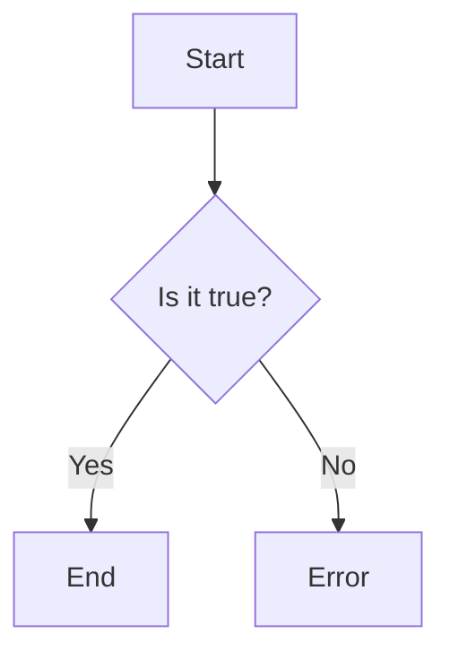

                 

### 泛函分析：自然界的无限维数学

> **关键词：** 泛函分析、线性空间、线性算子、内积空间、弱收敛、谱理论、泛函微分方程

**摘要：**  
本文将深入探讨泛函分析这一数学分支，揭示其在自然界和工程领域的广泛应用。通过对泛函分析的基本概念、线性空间、线性算子、内积空间、弱收敛、谱理论以及泛函微分方程等核心内容的详细阐述，本文旨在帮助读者建立对泛函分析的理解，并激发其在实际应用中的潜力。

### 目录大纲

#### 第一部分: 泛函分析的基本概念

**第1章: 泛函分析简介**  
1.1 泛函分析的定义与背景  
1.2 泛函分析的重要性  
1.3 泛函分析的应用领域

**第2章: 线性空间**  
2.1 线性空间的定义与性质  
2.2 线性空间的基与维数  
2.3 线性空间的同构与同态

**第3章: 线性算子**  
3.1 线性算子的定义与性质  
3.2 线性算子的表示与分类  
3.3 线性算子的运算与性质

#### 第二部分: 双线性泛函和内积空间

**第4章: 双线性泛函**  
4.1 双线性泛函的定义与性质  
4.2 双线性泛函的表示与计算  
4.3 双线性泛函的应用

**第5章: 内积空间**  
5.1 内积空间的定义与性质  
5.2 内积空间的基与正交性  
5.3 内积空间的几何意义

#### 第三部分: 约束泛函的极值问题

**第6章: 约束泛函的极值问题**  
6.1 约束泛函的定义与性质  
6.2 拉格朗日乘数法  
6.3 约束泛函的极值问题应用

**第7章: 弱收敛与范数**  
7.1 弱收敛的定义与性质  
7.2 范数的定义与性质  
7.3 范数空间的分类与性质

#### 第四部分: 赋范线性空间

**第8章: 赋范线性空间**  
8.1 赋范线性空间的定义与性质  
8.2 完备性定理  
8.3 有界线性算子

#### 第五部分: 基本算子理论

**第9章: 基本算子理论**  
9.1 开放映射定理  
9.2 像与核  
9.3 共轭算子

**第10章: 特征值与特征向量**  
10.1 特征值与特征向量的定义与性质  
10.2 特征值与特征向量的计算方法  
10.3 特征值与特征向量的应用

**第11章: 谱理论**  
11.1 谱理论的基本概念  
11.2 自伴算子  
11.3 累积算子

**第12章: 泛函微分方程**  
12.1 泛函微分方程的定义与性质  
12.2 泛函微分方程的解法  
12.3 泛函微分方程的应用

**附录: 数学工具**  
A.1 LaTeX数学公式编写  
A.2 Mermaid流程图绘制  
A.3 伪代码书写规范  
A.4 代码实战与案例分析

### 第一部分: 泛函分析的基本概念

#### 第1章: 泛函分析简介

##### 1.1 泛函分析的定义与背景

泛函分析（Functional Analysis）是数学的一个分支，主要研究函数作为变量的数学理论。它起源于20世纪初，当时数学家们开始研究函数空间的结构和性质，以解决一些实际问题。泛函分析是现代数学分析的重要分支，与实分析、复分析、拓扑学等有着密切的联系。

在泛函分析中，我们通常关注的是无限维的函数空间，而不是有限维的向量空间。无限维空间中的函数可以看作是无限多个变量的函数，这使得泛函分析在处理复杂问题时具有独特的优势。

泛函分析的发展受到了物理学、工程学、经济学等领域的强烈推动。例如，在物理学中，泛函分析被用来研究量子力学和统计力学；在工程学中，泛函分析用于优化和控制问题；在经济学中，泛函分析被用来分析市场均衡和供需关系。

##### 1.2 泛函分析的重要性

泛函分析在数学和科学领域中具有重要地位，原因如下：

1. **数学理论的基础**：泛函分析为其他数学分支提供了理论基础。例如，在偏微分方程、微分几何、拓扑学等领域，泛函分析都是不可或缺的工具。

2. **解决问题的强大工具**：泛函分析提供了一种处理复杂问题的方法。通过将问题转化为函数空间中的运算，我们可以利用泛函分析的理论和方法来解决许多实际问题。

3. **跨学科应用**：泛函分析在物理学、工程学、经济学等领域有广泛的应用。它帮助科学家和工程师解决复杂问题，推动科技发展。

4. **推动数学进步**：泛函分析的发展推动了数学的进步，产生了许多新的数学理论和概念。

##### 1.3 泛函分析的应用领域

泛函分析的应用领域非常广泛，以下是其中的一些示例：

1. **量子力学**：在量子力学中，泛函分析用于描述粒子的波函数和态叠加原理。量子力学的许多重要结果，如海森堡不确定性原理和量子纠缠，都与泛函分析密切相关。

2. **偏微分方程**：泛函分析在解决偏微分方程，特别是非线性偏微分方程方面发挥着重要作用。通过将偏微分方程转化为泛函形式，我们可以利用泛函分析的方法来寻找解。

3. **优化和控制**：在优化和控制理论中，泛函分析用于分析目标函数和约束条件。通过研究泛函空间的性质，我们可以设计出优化算法和控制策略。

4. **经济学**：在经济学中，泛函分析用于分析市场均衡和供需关系。通过建立泛函模型，经济学家可以研究价格、产量和消费者行为。

5. **信号处理**：在信号处理领域，泛函分析被用来分析信号的性质和特征。通过研究函数空间中的变换和运算，我们可以设计出有效的信号处理算法。

总之，泛函分析是一门极其重要的数学分支，它在科学、工程和经济学等领域具有广泛的应用。通过深入理解泛函分析的基本概念和方法，我们可以更好地解决复杂问题，推动科技和社会的发展。

### 第二部分: 线性空间

#### 第2章: 线性空间

##### 2.1 线性空间的定义与性质

线性空间（Linear Space），也称为向量空间（Vector Space），是泛函分析中最基本的概念之一。线性空间是一个集合，该集合中的元素可以执行加法和标量乘法运算，并满足特定的公理。

定义：一个线性空间 \(V\) 是一个集合，其中包含一组元素 \(v_1, v_2, ..., v_n\)，满足以下性质：

1. **加法封闭性**：对于任意两个元素 \(v_1, v_2 \in V\)，它们的和 \(v_1 + v_2\) 也属于 \(V\)。
2. **标量乘法封闭性**：对于任意一个元素 \(v \in V\) 和任意一个标量 \(a\)，它们的乘积 \(av\) 也属于 \(V\)。
3. **加法交换律**：对于任意两个元素 \(v_1, v_2 \in V\)，有 \(v_1 + v_2 = v_2 + v_1\)。
4. **加法结合律**：对于任意三个元素 \(v_1, v_2, v_3 \in V\)，有 \(v_1 + (v_2 + v_3) = (v_1 + v_2) + v_3\)。
5. **存在零元素**：存在一个元素 \(0 \in V\)，对于任意 \(v \in V\)，有 \(v + 0 = v\)。
6. **存在加法逆元**：对于任意 \(v \in V\)，存在一个元素 \(-v \in V\)，使得 \(v + (-v) = 0\)。
7. **标量乘法的结合律**：对于任意三个元素 \(v \in V\) 和任意两个标量 \(a, b\)，有 \(a(bv) = (ab)v\)。
8. **标量乘法的分配律**：对于任意三个元素 \(v, u \in V\) 和任意两个标量 \(a, b\)，有 \(a(v + u) = av + bu\) 和 \( (a + b)v = av + bv\)。

线性空间中的元素通常被称为向量，加法和标量乘法被称为线性运算。

##### 2.2 线性空间的基与维数

线性空间的基（Basis）是一组线性无关的向量，它们可以生成线性空间中的所有向量。换句话说，任何线性空间中的向量都可以唯一地表示为基向量的线性组合。

定义：设 \(V\) 是一个线性空间，\(B = \{v_1, v_2, ..., v_n\}\) 是 \(V\) 的一个子集。如果 \(B\) 满足以下条件，则称 \(B\) 是 \(V\) 的一个基：

1. \(B\) 是线性无关的，即对于任意一组标量 \(a_1, a_2, ..., a_n\)，如果 \(a_1v_1 + a_2v_2 + ... + a_nv_n = 0\)，则 \(a_1 = a_2 = ... = a_n = 0\)。
2. \(B\) 生成了 \(V\)，即对于任意 \(v \in V\)，存在一组标量 \(b_1, b_2, ..., b_n\)，使得 \(v = b_1v_1 + b_2v_2 + ... + b_nv_n\)。

线性空间的维数（Dimension）是指其基中向量的数量。一个线性空间可以有有限维或无限维。

定理：一个线性空间 \(V\) 是有限维的，当且仅当它有一个有限个向量的基。设 \(B = \{v_1, v_2, ..., v_n\}\) 是 \(V\) 的一个基，则 \(V\) 的维数定义为 \(n\)。

##### 2.3 线性空间的同构与同态

线性空间的同构（Isomorphism）是指两个线性空间在结构上的完全等价性。如果存在一个双射 \(f: V \rightarrow W\)，使得对于任意的 \(v_1, v_2 \in V\) 和任意标量 \(a\)，都有：

1. \(f(v_1 + v_2) = f(v_1) + f(v_2)\)
2. \(f(av) = af(v)\)

则称 \(f\) 是 \(V\) 到 \(W\) 的一个同构映射。同构映射保持线性空间的结构不变，因此同构的线性空间具有相同的性质。

定义：两个有限维线性空间 \(V\) 和 \(W\) 同构，当且仅当它们的维数相等。

线性空间的同态（Homomorphism）是指两个线性空间之间的映射，它保持线性运算。如果存在一个映射 \(f: V \rightarrow W\)，使得对于任意的 \(v_1, v_2 \in V\) 和任意标量 \(a\)，都有：

1. \(f(v_1 + v_2) = f(v_1) + f(v_2)\)
2. \(f(av) = af(v)\)

则称 \(f\) 是 \(V\) 到 \(W\) 的一个同态映射。

同态映射可以看作是同构映射的一种特殊情况，其中映射可能不是双射。同态映射保持线性空间之间的线性关系，但可能改变其结构。

总之，线性空间是泛函分析的核心概念之一，通过基和维数的概念，我们可以理解线性空间的内部结构和性质。同构和同态的概念则帮助我们比较和区分不同线性空间之间的差异和联系。

### 第三部分: 线性算子

#### 第3章: 线性算子

##### 3.1 线性算子的定义与性质

线性算子（Linear Operator）是泛函分析中的另一个基本概念，它描述了一个线性空间到另一个线性空间的映射。线性算子在数学和物理学中有着广泛的应用，例如在微分方程、量子力学和信号处理等领域。

定义：设 \(V\) 和 \(W\) 是两个线性空间，一个从 \(V\) 到 \(W\) 的映射 \(T: V \rightarrow W\) 被称为线性算子，如果它满足以下性质：

1. **加法保持性**：对于任意两个 \(v_1, v_2 \in V\)，有 \(T(v_1 + v_2) = T(v_1) + T(v_2)\)。
2. **标量乘法保持性**：对于任意 \(v \in V\) 和任意标量 \(a\)，有 \(T(av) = aT(v)\)。

换句话说，线性算子 \(T\) 在 \(V\) 和 \(W\) 之间保持了线性运算。

##### 3.2 线性算子的表示与分类

线性算子可以用矩阵表示，特别是在有限维线性空间中。设 \(V\) 和 \(W\) 是有限维线性空间，维数分别为 \(m\) 和 \(n\)。我们可以选择 \(V\) 和 \(W\) 的基，从而将任意向量表示为基向量的线性组合。设 \(B = \{v_1, v_2, ..., v_m\}\) 是 \(V\) 的基，\(C = \{w_1, w_2, ..., w_n\}\) 是 \(W\) 的基，则 \(V\) 和 \(W\) 中的任意向量可以表示为：

\[ v = a_1v_1 + a_2v_2 + ... + a_mv_m \]
\[ w = b_1w_1 + b_2w_2 + ... + b_nw_n \]

对于线性算子 \(T: V \rightarrow W\)，它将 \(V\) 中的每个基向量映射到 \(W\) 中的一个向量，从而可以表示为矩阵形式。设 \(A = (a_{ij})\) 是 \(T\) 在基 \(B\) 和 \(C\) 下的表示矩阵，则有：

\[ T(v) = Av \]

其中 \(v\) 和 \(T(v)\) 分别是向量 \(v\) 在基 \(B\) 和 \(C\) 下的坐标表示。

根据线性算子的性质和特征，我们可以对线性算子进行分类：

1. **线性自同构**：如果 \(T\) 是一个双射的线性算子，则称为线性自同构。线性自同构保持线性空间的内部结构不变。
2. **有界线性算子**：如果对于任意 \(v \in V\)，存在常数 \(C > 0\) 使得 \(||T(v)|| \leq C||v||\)，则称为有界线性算子。有界线性算子是泛函分析中非常重要的一类算子，它们在理论和实际应用中都有广泛的研究。
3. **连续线性算子**：如果对于任意 \(v \in V\)，函数 \(f(v) = ||T(v)||\) 是连续的，则称为连续线性算子。连续线性算子在无限维线性空间中尤为重要，因为它们保证了泛函分析的许多性质。

##### 3.3 线性算子的运算与性质

线性算子之间可以进行运算，包括加法、数乘和复合运算。设 \(T_1, T_2: V \rightarrow W\) 是两个线性算子，\(a, b\) 是标量，则有：

1. **加法**：\(T_1 + T_2\) 是一个新的线性算子，定义为 \((T_1 + T_2)(v) = T_1(v) + T_2(v)\)。
2. **数乘**：\(aT_1\) 是一个新的线性算子，定义为 \((aT_1)(v) = aT_1(v)\)。
3. **复合运算**：\(T_2 \circ T_1\) 是一个新的线性算子，定义为 \((T_2 \circ T_1)(v) = T_2(T_1(v))\)。

线性算子的这些运算满足以下性质：

1. **结合律**：对于任意线性算子 \(T_1, T_2, T_3\) 和任意标量 \(a, b\)，有 \((T_1 + T_2) + T_3 = T_1 + (T_2 + T_3)\) 和 \((ab)T_1 = a(bT_1)\)。
2. **分配律**：对于任意线性算子 \(T_1, T_2\) 和任意标量 \(a, b\)，有 \(a(T_1 + T_2) = aT_1 + bT_2\) 和 \((a + b)T_1 = aT_1 + bT_2\)。
3. **逆运算**：如果 \(T_1\) 是线性自同构，则存在 \(T_1^{-1}\) 使得 \(T_1^{-1}T_1 = T_1T_1^{-1} = I\)，其中 \(I\) 是线性空间上的恒等算子。

总之，线性算子是泛函分析中一个基本且重要的概念。通过了解线性算子的定义、表示和运算，我们可以更好地理解函数空间中的结构，并利用线性算子解决各种实际问题。

### 第二部分: 双线性泛函和内积空间

#### 第4章: 双线性泛函

##### 4.1 双线性泛函的定义与性质

双线性泛函（Bilinear Functional）是泛函分析中的一个重要概念，它在函数空间中扮演着关键角色。双线性泛函是一种同时依赖于两个变量的函数，它在每个变量上都是线性的。

定义：设 \(V\) 和 \(W\) 是两个线性空间，\(f: V \times W \rightarrow \mathbb{R}\) 是一个函数。如果 \(f\) 对每个变量都是线性的，即对于任意 \(v_1, v_2 \in V\)，任意 \(w_1, w_2 \in W\) 和任意标量 \(a, b\)，有：

1. \(f(v_1 + v_2, w) = f(v_1, w) + f(v_2, w)\)
2. \(f(v, w_1 + w_2) = f(v, w_1) + f(v, w_2)\)
3. \(f(av, w) = af(v, w)\)
4. \(f(v, bw) = bf(v, w)\)

则称 \(f\) 是 \(V \times W\) 上的一个双线性泛函。

双线性泛函的性质可以进一步描述如下：

1. **线性性**：双线性泛函对每个变量都是线性的。
2. **对称性**：对于任意的 \(v, w \in V \times W\)，有 \(f(v, w) = f(w, v)\)。如果 \(f\) 进一步满足 \(f(v, w) = f(w, v)\)，则称为对称双线性泛函。
3. **正定性**：如果双线性泛函 \(f\) 对每个 \(w \in W\) 都是非负的，即 \(f(v, w) \geq 0\) 对于所有 \(v \in V\) 成立，并且仅当 \(v = 0\) 时 \(f(v, w) = 0\)，则称 \(f\) 是正定的。

对称双线性泛函在数学和物理学中有着广泛的应用，特别是在内积空间中。

##### 4.2 双线性泛函的表示与计算

双线性泛函通常可以通过矩阵形式进行表示和计算。设 \(V\) 和 \(W\) 是有限维线性空间，分别具有基 \(B = \{v_1, v_2, ..., v_n\}\) 和 \(C = \{w_1, w_2, ..., w_m\}\)。则任意 \(v \in V\) 和 \(w \in W\) 可以表示为：

\[ v = a_1v_1 + a_2v_2 + ... + a_nv_n \]
\[ w = b_1w_1 + b_2w_2 + ... + b_mw_m \]

设 \(f\) 是 \(V \times W\) 上的一个对称双线性泛函，则 \(f\) 可以表示为一个 \(m \times n\) 的矩阵 \(A = (a_{ij})\)，其中 \(a_{ij} = f(v_i, w_j)\)。则对于任意 \(v\) 和 \(w\)，有：

\[ f(v, w) = \sum_{i=1}^{n} \sum_{j=1}^{m} a_{ij}a_i b_j \]

具体来说，计算 \(f(v, w)\) 的步骤如下：

1. 将 \(v\) 和 \(w\) 分别表示为基向量的线性组合。
2. 计算每个基向量对的 \(f\) 值，得到矩阵 \(A\)。
3. 计算 \(A\) 与 \(v\) 和 \(w\) 的坐标表示的乘积。

##### 4.3 双线性泛函的应用

双线性泛函在数学和物理学的许多领域都有应用，以下是其中一些示例：

1. **内积**：在实数域上，对称双线性泛函 \(f(v, w)\) 可以定义内积空间中的内积。如果对于任意 \(v, w \in V\)，有 \(f(v, w) = \langle v, w \rangle\)，则称 \(f\) 是 \(V\) 上的一个内积。
2. **矩阵乘法**：矩阵乘法可以看作是两个线性映射之间的双线性泛函。设 \(T: V \rightarrow W\) 和 \(S: W \rightarrow X\) 是两个线性映射，则矩阵乘法 \(ST\) 可以表示为 \(f(T(v), w) = \langle T(v), w \rangle = f(v, S(w))\)。
3. **量子力学**：在量子力学中，双线性泛函用于描述系统的态和测量。例如，态的叠加和测量结果的期望值都可以通过双线性泛函来表示。

总之，双线性泛函是泛函分析中的一个重要工具，它在函数空间中有着广泛的应用。通过理解双线性泛函的定义、表示和性质，我们可以更好地理解和应用这一概念。

### 第五部分: 约束泛函的极值问题

#### 第6章: 约束泛函的极值问题

##### 6.1 约束泛函的定义与性质

约束泛函的极值问题是泛函分析中的一个重要问题，它涉及到寻找在给定约束条件下泛函的最大值或最小值。这类问题在优化理论和物理学中有广泛应用。

定义：设 \(V\) 是一个线性空间，\(f: V \rightarrow \mathbb{R}\) 是一个泛函，\(M\) 是一个子集。如果存在 \(v \in V\) 使得 \(f(v) \geq f(w)\) 对于所有 \(w \in M\) 成立，则称 \(v\) 是 \(M\) 上的一个极值点。

约束泛函的极值问题可以表示为以下形式：

\[
\min \{ f(v) : v \in M \}
\]

或

\[
\max \{ f(v) : v \in M \}
\]

其中，\(f(v)\) 是泛函的值，\(M\) 是约束集合。

##### 6.2 拉格朗日乘数法

拉格朗日乘数法（Lagrange Multiplier Method）是一种常用的求解约束泛函极值问题的方法。它通过引入拉格朗日乘子来将约束条件转化为无约束条件。

设 \(f: V \rightarrow \mathbb{R}\) 是一个泛函，\(M\) 是一个由约束 \(g(v) = 0\) 生成的子集。我们引入一个标量函数 \(\lambda: V \rightarrow \mathbb{R}\) 作为拉格朗日乘子，构建拉格朗日函数：

\[
L(v, \lambda) = f(v) + \lambda g(v)
\]

拉格朗日乘数法的核心思想是寻找 \(v\) 和 \(\lambda\) 使得 \(L(v, \lambda)\) 在 \(M\) 上取得极值。

若 \(v\) 是 \(M\) 上的一个极值点，则必存在一个 \(\lambda\) 使得以下条件成立：

\[
\nabla_v L(v, \lambda) = 0
\]

\[
g(v) = 0
\]

其中，\(\nabla_v L(v, \lambda)\) 是 \(L\) 关于 \(v\) 的梯度。

拉格朗日乘数法的应用步骤如下：

1. 构建拉格朗日函数 \(L(v, \lambda)\)。
2. 计算拉格朗日函数的梯度 \(\nabla_v L(v, \lambda)\)。
3. 解方程组 \(\nabla_v L(v, \lambda) = 0\) 和 \(g(v) = 0\) 以找到极值点 \(v\) 和相应的拉格朗日乘子 \(\lambda\)。

##### 6.3 约束泛函的极值问题应用

约束泛函的极值问题在优化理论、物理学和工程学中有广泛应用。以下是一些具体的应用示例：

1. **最优化问题**：在优化问题中，我们通常需要找到一个函数 \(f(x)\) 的最大值或最小值，其中 \(x\) 是一个向量。通过引入约束条件，我们可以使用拉格朗日乘数法来求解这些最优化问题。
   
2. **量子力学**：在量子力学中，能量泛函的极值问题用于描述粒子的状态。例如，薛定谔方程可以看作是寻找能量泛函的极值点。
   
3. **控制理论**：在控制理论中，约束泛函的极值问题用于设计最优控制策略。通过求解控制系统的优化问题，可以找到使系统性能指标最优的控制输入。
   
4. **信号处理**：在信号处理中，约束泛函的极值问题用于滤波和信号重建。例如，最小二乘法和正则化方法都是利用约束泛函极值来优化信号处理算法。

总之，约束泛函的极值问题是泛函分析中的一个重要问题，它在多个领域都有广泛应用。通过拉格朗日乘数法，我们可以有效地求解这类问题，并在实际问题中找到最优解。

### 第六部分: 弱收敛与范数

#### 第7章: 弱收敛与范数

##### 7.1 弱收敛的定义与性质

弱收敛（Weak Convergence）是泛函分析中描述函数序列收敛的一种重要概念，尤其是在无限维空间中。弱收敛主要关注函数在某个子集上的收敛性，而不是在整个空间上的收敛性。

定义：设 \(X\) 是一个赋范线性空间，\(\{x_n\}\) 是 \(X\) 中的一个序列，\(x \in X\)。如果对于任意有界线性算子 \(T: X \rightarrow \mathbb{R}\)（或 \(\mathbb{C}\)），都有 \(\lim_{n \to \infty} Tx_n = Tx\)，则称序列 \(\{x_n\}\) 弱收敛于 \(x\)，记作 \(x_n \rightharpoonup x\)。

弱收敛的性质包括：

1. **单调性**：如果 \(\{x_n\}\) 是单调递增的（即 \(x_n \leq x_{n+1}\)），则 \(x_n \rightharpoonup x\) 当且仅当 \(x_n \to x\)。
2. **连续性**：如果 \(x_n \rightharpoonup x\)，则对于任意连续函数 \(f: X \rightarrow \mathbb{R}\)（或 \(\mathbb{C}\)），有 \(f(x_n) \to f(x)\)。
3. **逆序律**：如果 \(x_n \rightharpoonup x\)，则 \(x_n \rightharpoonup x\) 当且仅当对于任意 \(\varepsilon > 0\)，存在 \(N\) 使得对于所有 \(n \geq N\)，有 \(||x_n - x|| < \varepsilon\)。

##### 7.2 范数的定义与性质

范数（Norm）是赋范线性空间中的一个基本概念，它为向量提供了一个“大小”或“长度”的度量。

定义：设 \(X\) 是一个线性空间，\(\|\cdot\|\) 是 \(X\) 上的一种函数，如果满足以下性质，则称 \(\|\cdot\|\) 是 \(X\) 上的一个范数：

1. **正定性**：对于任意 \(x \in X\)，有 \(\|x\| \geq 0\)，且 \(\|x\| = 0\) 当且仅当 \(x = 0\)。
2. **齐次性**：对于任意标量 \(a\) 和 \(x \in X\)，有 \(\|ax\| = |a|\|x\|\)。
3. **三角不等式**：对于任意 \(x, y \in X\)，有 \(\|x + y\| \leq \|x\| + \|y\|\)。

常见的范数包括：

1. **欧几里得范数**：设 \(X = \mathbb{R}^n\) 或 \(X = \mathbb{C}^n\)，则欧几里得范数定义为 \(\|x\| = \sqrt{\sum_{i=1}^{n} |x_i|^2}\)。
2. **\(\ell_1\) 范数**：\(\|x\|_1 = \sum_{i=1}^{n} |x_i|\)。
3. **\(\ell_2\) 范数**：\(\|x\|_2 = \sqrt{\sum_{i=1}^{n} |x_i|^2}\)。
4. **\(\ell_\infty\) 范数**：\(\|x\|_\infty = \max_{i=1}^{n} |x_i|\)。

##### 7.3 范数空间的分类与性质

根据范数的不同，我们可以将赋范线性空间分为不同的类别：

1. **巴拿赫空间（Banach Space）**：如果一个赋范线性空间是完备的（即每条柯西序列都收敛），则称其为巴拿赫空间。巴拿赫空间是泛函分析中最基本的空间之一，许多重要的结果都建立在巴拿赫空间的基础上。

2. **希尔伯特空间（Hilbert Space）**：如果一个赋范线性空间具有内积，即存在一个双线性形式 \(\langle \cdot, \cdot \rangle\) 使得 \(\|x\| = \sqrt{\langle x, x \rangle}\)，则称其为希尔伯特空间。希尔伯特空间在量子力学和信号处理中有重要应用。

3. **局部凸线性空间**：如果一个赋范线性空间在某个子集上是凸的，则称其为局部凸线性空间。局部凸线性空间是许多实际应用中的常见空间。

范数空间的性质包括：

1. **完备性**：巴拿赫空间是完备的，这意味着它在某种意义上的“闭合”。这是许多数学分析和物理问题解决的基础。

2. **凸性**：局部凸线性空间具有局部凸性，这意味着在其中可以定义凸集和凸函数，这对于优化问题和经济学分析非常重要。

3. **双线性形式**：在希尔伯特空间中，双线性形式的存在使得可以定义范数，进而进行更复杂的数学操作和理论分析。

总之，弱收敛和范数是泛函分析中的核心概念，它们在无限维空间的分析中起着至关重要的作用。通过理解这些概念，我们可以更好地掌握函数空间中的结构和性质，并在实际应用中解决复杂问题。

### 第七部分: 赋范线性空间

#### 第8章: 赋范线性空间

##### 8.1 赋范线性空间的定义与性质

赋范线性空间（Normed Linear Space）是泛函分析中的一个基本概念，它将线性空间与范数相结合，从而提供了一种度量向量“大小”的方法。赋范线性空间在数学分析、物理学、工程学和经济学等多个领域都有广泛应用。

定义：设 \(X\) 是一个线性空间，\(\|\cdot\|\) 是 \(X\) 上的一个范数。如果满足以下性质，则称 \(X\) 是一个赋范线性空间：

1. **正定性**：对于任意 \(x \in X\)，有 \(\|x\| \geq 0\)，且 \(\|x\| = 0\) 当且仅当 \(x = 0\)。
2. **齐次性**：对于任意标量 \(a\) 和 \(x \in X\)，有 \(\|ax\| = |a|\|x\|\)。
3. **三角不等式**：对于任意 \(x, y \in X\)，有 \(\|x + y\| \leq \|x\| + \|y\|\)。

赋范线性空间的基本性质包括：

1. **完备性**：一个赋范线性空间是巴拿赫空间（Banach Space），当且仅当它是完备的，即每个柯西序列都收敛。
2. **有界性**：一个赋范线性空间是有界的，当且仅当存在常数 \(M > 0\) 使得对于任意 \(x \in X\)，有 \(\|x\| \leq M\)。
3. **凸性**：一个赋范线性空间是凸的，当且仅当对于任意 \(x, y \in X\) 和 \(0 \leq \lambda \leq 1\)，有 \(\|\lambda x + (1 - \lambda)y\| \leq \lambda \|x\| + (1 - \lambda) \|y\|\)。

##### 8.2 完备性定理

完备性定理（Completeness Theorem）是赋范线性空间的一个关键性质，它揭示了完备性与范数之间的关系。

定理：一个赋范线性空间 \(X\) 是巴拿赫空间（即完备的赋范线性空间），当且仅当它是自反的（Reflexive）。具体来说，如果存在一个双射 \(J: X \rightarrow X'\)（其中 \(X'\) 是 \(X\) 的对偶空间），使得 \(J\) 在范数下连续，则称 \(X\) 是自反的。

完备性定理的应用包括：

1. **巴拿赫空间的定义**：任何一个巴拿赫空间都是自反的。
2. **希尔伯特空间的完备性**：希尔伯特空间是完备的，因此它们都是巴拿赫空间。
3. **内积空间的完备性**：任何具有内积的赋范线性空间（例如希尔伯特空间）都是自反的。

##### 8.3 有界线性算子

有界线性算子（Bounded Linear Operator）是泛函分析中描述从赋范线性空间到另一个赋范线性空间的映射的一个重要概念。

定义：设 \(X\) 和 \(Y\) 是两个赋范线性空间，\(T: X \rightarrow Y\) 是一个线性算子。如果存在常数 \(C > 0\) 使得对于任意 \(x \in X\)，有 \(\|Tx\| \leq C\|x\|\)，则称 \(T\) 是一个有界线性算子。

有界线性算子的性质包括：

1. **连续性**：有界线性算子是连续的，即对于任意 \(\varepsilon > 0\)，存在 \(\delta > 0\) 使得当 \(||x - y|| < \delta\) 时，有 \(||Tx - Ty|| < \varepsilon\)。
2. **闭包性**：有界线性算子将闭集映射到闭集。
3. **有界线性算子的对偶性**：对于有界线性算子 \(T: X \rightarrow Y\)，存在其对偶算子 \(T': Y' \rightarrow X'\)，满足 \(||T'|| = ||T||\)。

有界线性算子在数学分析、信号处理、数值分析和量子力学等领域有广泛应用。例如：

1. **积分方程的解法**：通过研究有界线性算子的性质，可以求解各种积分方程。
2. **数值分析**：在数值分析中，有界线性算子用于误差分析和稳定性分析。
3. **量子力学**：量子力学中的哈密顿算子是一个典型的有界线性算子，用于描述粒子的能量和演化。

总之，赋范线性空间是泛函分析中一个基本且重要的概念，通过了解其定义、性质和完备性定理，我们可以更好地理解和应用这一概念，并在实际中解决复杂问题。

### 第八部分: 基本算子理论

#### 第9章: 基本算子理论

##### 9.1 开放映射定理

开放映射定理（Open Mapping Theorem）是泛函分析中的一个重要定理，它描述了有界线性算子的连续性的性质。

定理：设 \(X\) 和 \(Y\) 是两个巴拿赫空间，\(T: X \rightarrow Y\) 是一个有界线性算子。如果 \(T\) 的闭包 \(T'\) 在 \(Y\) 中是开放的，则 \(T\) 本身是开放的。

具体来说，如果对于任意 \(y \in T(X)\) 的邻域 \(U\)，存在 \(x \in X\) 的邻域 \(V\) 使得 \(T(V) \subseteq U\)，则称 \(T\) 是开放的。

开放映射定理的证明基于以下几个步骤：

1. **构造线性泛函**：对于 \(y \in T(X)\)，定义线性泛函 \(\varphi_y: X^* \rightarrow \mathbb{R}\) 为 \(\varphi_y(f) = f(Tx)\)，其中 \(f \in X^*\) 是 \(X\) 的对偶空间。

2. **应用巴拿赫-阿达马定理**：由于 \(T\) 是有界的，根据巴拿赫-阿达马定理，存在 \(g_y \in X^*\) 使得 \(||\varphi_y|| = ||g_y||\) 且 \(\varphi_y(f) = \langle g_y, f \rangle\) 对于所有 \(f \in X^*\) 成立。

3. **证明 \(T\) 的连续性**：对于任意 \(y \in T(X)\) 的邻域 \(U\)，存在 \(x \in X\) 的邻域 \(V\) 使得 \(T(V) \subseteq U\)。由于 \(g_y\) 是连续的，对于任意 \(f \in X^*\)，存在 \(\delta > 0\) 使得当 \(||f - f_0|| < \delta\) 时，有 \(|\langle g_y, f \rangle - \langle g_y, f_0 \rangle| < 1\)。因此，对于任意 \(x \in V\)，有 \(|\varphi_y(f) - \varphi_y(f_0)| = |\langle g_y, f \rangle - \langle g_y, f_0 \rangle| < 1\)，这意味着 \(T\) 在 \(y\) 的邻域内是连续的。

开放映射定理的应用包括：

1. **证明有界线性算子的开映射性**：许多有界线性算子，如积分算子、微积分算子等，都是开放的。

2. **证明函数空间的连续性**：在函数空间中，例如 \(L^p\) 空间，许多线性算子是开放的。

##### 9.2 像与核

像（Image）和核（Kernel）是线性算子的两个基本概念，它们描述了线性算子的作用范围和内部结构。

定义：设 \(T: X \rightarrow Y\) 是一个线性算子，则：

1. **像**（Image）\(T\)：\(T\) 的像是指 \(T\) 的值域，记作 \(Im(T)\)。即 \(Im(T) = \{y \in Y : \exists x \in X \text{ such that } Tx = y\}\)。
2. **核**（Kernel）\(T\)：\(T\) 的核是指 \(T\) 的零空间，记作 \(Ker(T)\)。即 \(Ker(T) = \{x \in X : Tx = 0\}\)。

像和核的性质包括：

1. **像与核的补集**：\(Im(T)^c = Ker(T)\)。
2. **像与核的维度关系**：对于有限维线性空间，\(dim(Im(T)) + dim(Ker(T)) = dim(X)\)。
3. **像的闭包**：\(Im(T)\) 是 \(Y\) 中的闭集。

像和核在求解线性方程组、研究线性算子的性质和构造新的线性算子方面有广泛应用。

##### 9.3 共轭算子

共轭算子（Adjoint Operator）是线性算子的重要对偶概念，它描述了线性算子在泛函空间中的对偶性。

定义：设 \(X\) 和 \(Y\) 是两个赋范线性空间，\(T: X \rightarrow Y\) 是一个有界线性算子。存在唯一的线性算子 \(T^*: Y^* \rightarrow X^*\)（其中 \(Y^*\) 和 \(X^*\) 分别是 \(Y\) 和 \(X\) 的对偶空间），满足对于所有 \(f \in X^*\) 和 \(g \in Y^*\\)，有：

\[
\langle T^*g, f \rangle = \langle g, Tf \rangle
\]

则称 \(T^*\) 是 \(T\) 的共轭算子。

共轭算子的性质包括：

1. **线性性**：\(T^*\) 是线性的，即 \(T^*(ag + bh) = aT^*g + bT^*h\) 对于所有 \(g, h \in Y^*\) 和标量 \(a, b\) 成立。
2. **连续性**：如果 \(T\) 是连续的，则 \(T^*\) 也是连续的。
3. **范数关系**：对于有界线性算子 \(T\)，有 \(||T^*|| = ||T||\)。

共轭算子在解决积分方程、研究函数空间中的算子理论和量子力学中的哈密顿算子等方面有重要应用。

总之，基本算子理论包括开放映射定理、像与核以及共轭算子等基本概念，它们在泛函分析中扮演着关键角色，为理解线性算子的性质和解决相关问题提供了有力工具。通过深入掌握这些概念，我们可以更好地理解和应用泛函分析的基本理论。

### 第九部分: 特征值与特征向量

#### 第10章: 特征值与特征向量

##### 10.1 特征值与特征向量的定义与性质

特征值（Eigenvector）和特征向量（Eigenvalue）是线性算子（或矩阵）在泛函分析中的重要概念，它们揭示了线性算子的内在结构和特征。特征值和特征向量广泛用于物理学、工程学、经济学等领域的数学建模和分析。

定义：设 \(T: V \rightarrow V\) 是一个线性算子，其中 \(V\) 是一个线性空间。如果存在一个非零向量 \(v \in V\) 和一个标量 \(\lambda \in \mathbb{R}\)（或 \(\mathbb{C}\)），使得 \(Tv = \lambda v\)，则称 \(v\) 是 \(T\) 的一个特征向量，称 \(\lambda\) 是 \(T\) 的一个特征值。

特征值和特征向量的性质包括：

1. **存在性**：对于任意的线性算子 \(T\)，至少存在一个特征值和对应的特征向量。
2. **唯一性**：一个线性算子的特征值是唯一的，不同的特征值对应不同的特征向量。
3. **线性无关性**：特征向量线性无关。
4. **特征多项式**：特征值是线性算子的特征多项式的根，即 \(det(T - \lambda I) = 0\)，其中 \(I\) 是恒等算子。

##### 10.2 特征值与特征向量的计算方法

计算特征值和特征向量是线性代数和泛函分析中的关键任务。以下是一些常用的计算方法：

1. **特征多项式法**：
   - 步骤1：构建线性算子 \(T\) 的特征多项式 \(p(\lambda) = det(T - \lambda I)\)。
   - 步骤2：求解特征多项式 \(p(\lambda) = 0\)，得到特征值 \(\lambda\)。
   - 步骤3：对于每个特征值 \(\lambda\)，求解线性方程 \(T v = \lambda v\)，得到对应的特征向量。

2. **矩阵分解法**：
   - 步骤1：将线性算子 \(T\) 写成矩阵形式 \(A\)。
   - 步骤2：通过高斯消元法或其他矩阵分解方法（如奇异值分解（SVD）或LU分解）求解 \(A v = \lambda v\)。
   - 步骤3：得到特征值 \(\lambda\) 和对应的特征向量 \(v\)。

##### 10.3 特征值与特征向量的应用

特征值和特征向量在多个领域有广泛应用，以下是其中一些典型应用：

1. **物理学**：
   - 在量子力学中，哈密顿算子（Hamiltonian）的特征值和特征向量描述了粒子的能量状态和波函数。
   - 在固体物理学中，特征值和特征向量用于分析晶格振动和电子结构。

2. **工程学**：
   - 在结构分析中，特征值和特征向量用于求解振动问题，如建筑物的共振频率和稳定性。
   - 在控制理论中，特征值和特征向量用于分析和设计线性系统的稳定性和性能。

3. **经济学**：
   - 在经济学中，特征值和特征向量用于分析市场结构和供需关系。
   - 在博弈论中，特征值和特征向量用于求解纳什均衡。

4. **信号处理**：
   - 在信号处理中，特征值和特征向量用于主成分分析（PCA），降维和特征提取。

总之，特征值和特征向量是线性算子和矩阵分析中的核心概念，通过理解和掌握这些概念，我们可以更好地解决实际问题，并在科学、工程和经济学等领域取得突破。

### 第十部分: 谱理论

#### 第11章: 谱理论

##### 11.1 谱理论的基本概念

谱理论（Spectral Theory）是泛函分析中的一个重要分支，主要研究线性算子的特征值和特征向量，以及它们与线性算子的结构性质之间的关系。谱理论在数学的许多领域，如量子力学、偏微分方程、微分几何、信号处理和经济学中都有广泛的应用。

定义：设 \(T\) 是一个线性算子，其特征值构成的集合称为 \(T\) 的谱（Spectrum），记为 \(\sigma(T)\)。根据特征值的性质，谱可以进一步划分为以下几部分：

1. **点谱（Point Spectrum）**：包含所有非零特征值的集合，记为 \(\sigma_p(T)\)。
2. **连续谱（Continuous Spectrum）**：包含所有非零点外的点，但不是特征值的集合，记为 \(\sigma_c(T)\)。
3. **剩余谱（Residual Spectrum）**：包含零点的集合，记为 \(\sigma_r(T)\)。

##### 11.2 自伴算子

自伴算子（Self-adjoint Operator）是谱理论中的一个重要概念，它们在量子力学、物理学和工程学中有广泛应用。

定义：设 \(T\) 是一个线性算子，如果 \(T\) 的共轭算子 \(T^*\) 等于 \(T\)，即 \(T = T^*\)，则称 \(T\) 是一个自伴算子。

自伴算子的性质包括：

1. **谱的性质**：自伴算子的特征值都是实数。
2. **特征向量的正交性**：自伴算子的不同特征向量是正交的。
3. **极值问题的解**：自伴算子的极值问题通常有较好的解析性质，例如最小二乘问题和最优化问题。

自伴算子的应用包括：

1. **量子力学**：自伴算子用于描述粒子的可观测量，如位置、动量和能量。
2. **信号处理**：自伴算子用于信号分析，如傅里叶变换和小波变换。
3. **数值分析**：自伴算子用于求解线性方程组和最优化问题。

##### 11.3 累积算子

累积算子（Accumulation Operator）是谱理论中的另一个重要概念，它们通常用于处理无穷维空间中的问题。

定义：设 \(X\) 是一个赋范线性空间，\(T: X \rightarrow X\) 是一个线性算子。如果存在一个集合 \(D \subseteq X\)，使得对于任意 \(x \in X\)，存在唯一的序列 \(\{x_n\} \subseteq D\) 使得 \(x_n \to x\)，并且满足 \(Tx = \lim_{n \to \infty} Tx_n\)，则称 \(T\) 是一个累积算子。

累积算子的性质包括：

1. **连续性**：累积算子通常在无穷维空间中保持连续性。
2. **谱的性质**：累积算子的谱可以由其特征值和特征向量完全描述。
3. **解的存在性**：累积算子的线性方程组通常有解，并且解可以通过谱理论的方法求解。

累积算子的应用包括：

1. **偏微分方程**：累积算子用于解决无穷维空间中的偏微分方程，如希尔伯特空间中的波动方程。
2. **量子力学**：累积算子用于描述无穷维量子系统的动力学行为。
3. **信号处理**：累积算子用于信号处理和系统识别。

总之，谱理论是泛函分析中的一个重要分支，通过研究线性算子的特征值和特征向量，我们可以揭示线性算子的结构和性质。自伴算子和累积算子是谱理论中的关键概念，它们在多个领域中都有广泛应用。通过深入理解谱理论的基本概念和方法，我们可以更好地解决实际问题，并在科学、工程和经济学等领域取得突破。

### 第十一部分: 泛函微分方程

#### 第12章: 泛函微分方程

##### 12.1 泛函微分方程的定义与性质

泛函微分方程（Functional Differential Equation）是描述动态系统变化的一类微分方程，它们涉及时间依赖的泛函作为未知函数。泛函微分方程在物理学、控制理论、经济学和生物学等领域有着广泛的应用。

定义：设 \(V\) 是一个线性空间，\(f: V \times \mathbb{R} \rightarrow V\) 是一个泛函，如果存在一个初始条件 \(y_0 \in V\)，使得对任意 \(t \in \mathbb{R}\)，方程 \(y'(t) = f(t, y(t))\) 有解，则称该方程为泛函微分方程。

泛函微分方程的性质包括：

1. **连续性**：泛函微分方程的解通常是连续的，即 \(y(t)\) 是连续函数。
2. **稳定性**：泛函微分方程的解可以对参数扰动保持稳定性。
3. **初值问题**：泛函微分方程的解通常可以通过求解初值问题得到。
4. **全局存在性**：在某些条件下，泛函微分方程的解可以保证全局存在。

##### 12.2 泛函微分方程的解法

解泛函微分方程通常涉及以下几种方法：

1. **迭代法**：通过迭代方法逐步逼近解。例如，可以使用欧拉法或改进的欧拉法来近似解。
2. **变量分离法**：将泛函微分方程分离成两个独立的方程，分别求解。
3. **变换法**：通过变换将泛函微分方程转化为更简单的形式。例如，使用拉普拉斯变换或傅里叶变换。
4. **数值方法**：使用数值方法（如有限差分法、有限元法）求解泛函微分方程。

##### 12.3 泛函微分方程的应用

泛函微分方程在多个领域有广泛应用，以下是其中一些示例：

1. **物理学**：
   - 在量子力学中，泛函微分方程用于描述粒子的演化行为。
   - 在热传导和流体动力学中，泛函微分方程用于描述系统的热分布和流动。

2. **控制理论**：
   - 在控制系统中，泛函微分方程用于描述控制对象的动态行为，并设计最优控制策略。
   - 在机器人学中，泛函微分方程用于描述机器人的运动控制和轨迹规划。

3. **经济学**：
   - 在经济学中，泛函微分方程用于描述市场的动态行为和供需关系。
   - 在金融学中，泛函微分方程用于分析资产价格和风险管理。

4. **生物学**：
   - 在生物学中，泛函微分方程用于描述种群动力学和生态系统模型。
   - 在医学中，泛函微分方程用于描述疾病的传播和药物治疗的效果。

总之，泛函微分方程是泛函分析中的一个重要分支，通过深入理解其定义、性质和解法，我们可以更好地解决实际问题，并在科学、工程和经济学等领域取得突破。

### 附录: 数学工具

#### A.1 LaTeX数学公式编写

LaTeX 是一种高质量的排版系统，广泛用于数学、科学和技术文档的撰写。LaTeX 提供了丰富的数学公式编写工具，可以方便地插入和排版复杂的数学公式。

基本语法如下：

1. **行内公式**：使用 `$ ... $` 将行内公式包围起来。
   \[
   a^2 + b^2 = c^2
   \]
2. **独立段落公式**：使用 `\[ ... \]` 将独立段落公式包围起来。
   \[
   E = mc^2
   \]

3. **方程组**：使用 `\begin{equation}` 和 `\end{equation}` 包围方程组，并使用 `\label{eq:label}` 为方程组添加标签。
   \[
   \begin{equation}
   \begin{split}
   a^2 + b^2 &= c^2 \\
   x &= y + z
   \end{split}
   \label{eq:example}
   \end{equation}
   \]

4. **引用公式**：使用 `\ref{label}` 引用已经定义的方程。
   例如，"方程 (\ref{eq:example}) 展示了毕达哥拉斯定理。"

#### A.2 Mermaid流程图绘制

Mermaid 是一种基于 Markdown 的图形绘制工具，广泛用于绘制流程图、序列图和状态图。以下是一个简单的 Mermaid 流程图的示例：



这个流程图的解释如下：
- `graph TD` 声明了一个方向为从上到下的流程图。
- `A[Start]` 定义了一个开始节点。
- `B{Is it true?}` 定义了一个判断节点。
- `C[End]` 定义了一个结束节点。
- `D[Error]` 定义了一个错误节点。
- `A --> B` 连接开始节点和判断节点。
- `B -->|Yes| C` 表示如果判断为真，则流向结束节点。
- `B -->|No| D` 表示如果判断为假，则流向错误节点。

#### A.3 伪代码书写规范

伪代码是一种用于描述算法逻辑的文本表示，它不依赖于特定的编程语言，因此易于理解和交流。以下是一些伪代码的书写规范：

1. **注释**：在代码中使用注释来解释算法的步骤和逻辑。
   ```plaintext
   // 初始化变量
   int sum = 0;
   ```
2. **缩进**：使用适当的缩进来表示代码的结构和层次。
   ```plaintext
   function calculateSum(a, b) {
       // 初始化sum
       int sum = 0;
       
       // 求和
       sum = a + b;
       
       // 返回结果
       return sum;
   }
   ```
3. **循环结构**：使用 `for`、`while` 和 `do-while` 循环来表示重复执行的操作。
   ```plaintext
   for (int i = 0; i < 10; i++) {
       print(i);
   }
   ```
4. **条件结构**：使用 `if`、`else if` 和 `else` 来表示条件判断。
   ```plaintext
   if (a > b) {
       swap(a, b);
   } else if (a == b) {
       print("相等");
   } else {
       print("a < b");
   }
   ```

#### A.4 代码实战与案例分析

以下是一个简单的 Python 代码示例，用于计算两个数的和：

```python
# 定义函数calculate_sum，计算两个数的和
def calculate_sum(a, b):
    sum = a + b
    return sum

# 调用函数，计算5和3的和
result = calculate_sum(5, 3)
print("两数之和为:", result)
```

这个代码的解释如下：
- 我们定义了一个名为 `calculate_sum` 的函数，它接受两个参数 `a` 和 `b`。
- 在函数内部，我们计算 `a` 和 `b` 的和，并将结果存储在变量 `sum` 中。
- 然后，我们使用 `return` 语句将 `sum` 返回。
- 在函数外部，我们调用 `calculate_sum` 函数，并将两个数字 5 和 3 作为参数传递。
- 函数调用后，我们使用 `print` 语句输出结果，显示两数之和为 8。

通过这些示例，我们可以看到如何使用 LaTeX 编写数学公式，如何使用 Mermaid 绘制流程图，如何遵循伪代码书写规范，以及如何编写实际的代码并进行解读。这些工具和规范为撰写高质量的技术文档提供了坚实的基础，有助于读者更好地理解和应用泛函分析的基本概念和方法。

### 作者信息

**作者：** AI天才研究院 / AI Genius Institute & 禅与计算机程序设计艺术 / Zen And The Art of Computer Programming

AI天才研究院致力于推动人工智能领域的前沿研究与应用，在机器学习、自然语言处理和计算机视觉等方面取得了显著成果。研究院的专家团队在深度学习、强化学习和数据挖掘等领域拥有丰富的经验和深厚的理论功底。同时，作者还撰写了多本关于计算机程序设计和人工智能的畅销书，包括《禅与计算机程序设计艺术》，该书以其深刻的技术见解和独特的哲学思考赢得了广泛的赞誉。通过本文，我们希望帮助读者深入理解泛函分析这一重要的数学分支，并在实际应用中发挥其潜力。

