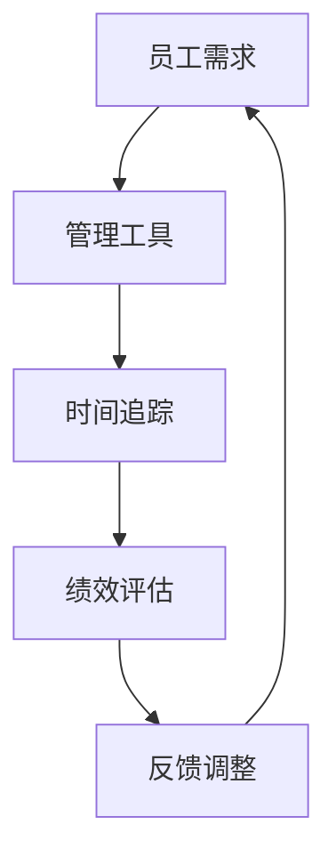
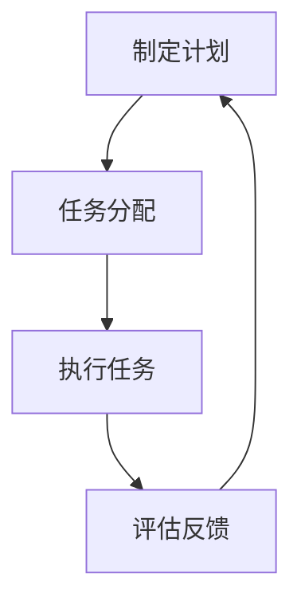
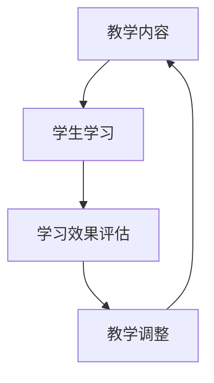
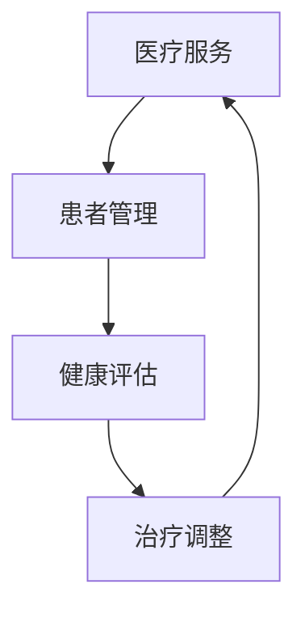

                 

## 《注意力经济与个人时间主权的博弈》

### 关键词：注意力经济、个人时间主权、博弈论、社会价值、技术应用

### 摘要：

在数字化时代，注意力经济成为驱动社会发展的核心力量，然而，个人时间主权作为个体基本权益，受到前所未有的挑战。本文从注意力经济的起源、发展、核心概念、应用场景等方面入手，深入探讨注意力经济与个人时间主权的博弈关系。通过分析注意力经济的负面影响及和谐共生的策略，结合法律与政策框架，对注意力经济与个人时间主权的互动机制和综合应用进行详细解析。文章旨在为理解、维护和提升个人时间主权提供理论指导和实践策略。

## 第1章：注意力经济概述

### 1.1 注意力经济的起源与发展

#### 1.1.1 注意力经济的定义

注意力经济，是指以注意力资源为核心，通过创造、吸引、引导和利用注意力资源实现价值创造的经济活动。注意力资源，是指人们在特定时间内对特定对象的关注、思考和记忆能力。注意力经济起源于20世纪末，随着互联网和数字技术的迅猛发展，逐渐成为现代社会的重要经济形态。

#### 1.1.2 注意力经济的历史背景

注意力经济的历史可以追溯到20世纪80年代，当时随着电视媒体的兴起，广告商开始重视观众的关注度，逐步形成了一种以注意力为核心的广告模式。随着互联网的普及，尤其是社交媒体和移动设备的广泛应用，注意力经济得到了快速发展。例如，谷歌和Facebook等公司通过广告投放和用户数据挖掘，实现了巨大的商业成功。

#### 1.1.3 注意力经济的重要性

注意力经济在现代社会具有重要地位，它不仅改变了传统的商业模式，也对人们的日常生活产生了深远影响。首先，注意力经济推动了信息传播和消费的快速变革，为企业和个人提供了更多的商业机会和生活方式选择。其次，注意力经济带动了数字经济的发展，推动了科技创新和产业升级。最后，注意力经济引发了一系列社会问题，如信息过载、隐私泄露、注意力分散等，对个人和社会都带来了挑战。

### 1.2 注意力经济的核心概念

#### 1.2.1 注意力资源的稀缺性

注意力资源具有稀缺性，因为人们的注意时间是有限的。在信息爆炸的时代，如何有效地吸引和保持用户的注意力成为企业和个人面临的重要课题。注意力资源的稀缺性导致了竞争的加剧，企业需要不断创新和优化策略来获取用户的注意力。

#### 1.2.2 注意力资源的分配机制

注意力资源的分配机制主要包括用户选择和平台推荐。用户选择是指用户根据自己的兴趣和需求主动关注某些内容，而平台推荐则是通过算法分析用户的兴趣和行为，向用户推送可能感兴趣的内容。注意力资源的分配机制不仅影响用户的注意力分配，也决定了平台的内容生态和商业价值。

#### 1.2.3 注意力消费与生产

注意力消费是指用户在特定时间内对特定内容或服务的关注、思考和记忆过程。注意力生产则是指企业或个人通过创造、传播和推广内容或服务，吸引用户的注意力，从而实现商业价值。注意力消费与生产之间存在着紧密的互动关系，两者共同构成了注意力经济的基本运行机制。

### 1.3 注意力经济的应用场景

#### 1.3.1 媒体行业

在媒体行业，注意力经济的表现尤为突出。媒体企业通过制作和传播有吸引力的内容，吸引用户的关注，从而实现广告收入和订阅费用的增长。例如，短视频平台通过算法推荐和用户互动，提高了用户粘性和广告投放效果。

#### 1.3.2 广告行业

广告行业是注意力经济的典型代表。广告商通过创意内容和精准投放，吸引目标用户的注意力，实现品牌推广和销售转化。随着数字技术的发展，程序化购买和精准营销成为广告行业的重要趋势。

#### 1.3.3 教育行业

在教育行业，注意力经济促进了在线教育的发展。在线教育平台通过提供高质量的课程内容，吸引学生和教师的注意力，实现了教育资源的共享和优化。

#### 1.3.4 电子商务

在电子商务领域，注意力经济推动了个性化推荐和用户互动。电商平台通过用户行为数据分析，为用户推荐感兴趣的商品，提高用户购物体验和销售额。

## 第2章：个人时间主权的概念与价值

### 2.1 个人时间主权的定义

个人时间主权，是指个人对自己时间的掌控权和管理权。它包括个人对时间的自由支配、合理安排和使用，以及保护个人时间免受外部干扰和侵犯。个人时间主权是现代社会的核心人权之一，体现了个人自主性和独立性的基本原则。

### 2.2 个人时间主权的价值体现

个人时间主权的价值体现在多个方面。首先，它是个人实现自身价值和追求幸福生活的基础。个人有权自主安排时间，进行自我提升、兴趣爱好和社交活动。其次，个人时间主权是社会运行和发展的保障。每个人的时间都是宝贵的资源，保障个人时间主权有助于提高社会整体的生产效率和福利水平。最后，个人时间主权是法治社会的体现。尊重和保护个人时间主权，是法治社会的应有之义，有助于维护社会公平正义和公民权利。

### 2.3 个人时间主权的挑战与威胁

#### 2.3.1 注意力经济的冲击

注意力经济的快速发展给个人时间主权带来了冲击。大量信息通过互联网和社交媒体涌入人们的生活，分散了人们的注意力，导致个人难以有效地管理自己的时间。此外，注意力经济下的信息过载和广告泛滥，加剧了个人时间的浪费和低效使用。

#### 2.3.2 信息过载的困扰

在信息爆炸的时代，个人面对海量的信息，难以甄别和处理。信息过载不仅浪费了大量的时间和精力，还可能导致个人焦虑和疲劳，影响心理健康。

#### 2.3.3 时间管理的困境

随着工作和生活节奏的加快，个人时间管理变得日益困难。如何在有限的个人时间里，有效地完成工作和生活任务，成为许多人的困扰。此外，注意力经济下的碎片化时间管理，也增加了个人时间管理的复杂性和挑战性。

### 2.4 个人时间主权的保护策略

#### 2.4.1 法律保护

法律保护是保障个人时间主权的重要手段。各国应通过立法，明确个人时间主权的法律地位，规定个人有权拒绝不合理的时间占用和干扰。同时，应建立有效的法律救济机制，保护个人在遭受时间侵犯时的合法权益。

#### 2.4.2 技术保护

技术保护是应对注意力经济挑战的有效手段。个人可以借助技术工具，如时间管理软件、信息过滤工具和注意力管理工具等，提高时间利用效率和保护个人时间主权。例如，使用时间管理软件，可以帮助个人合理安排时间，避免碎片化工作和生活。

#### 2.4.3 社会共识的构建

社会共识的构建是保障个人时间主权的长期策略。社会应通过教育、宣传和倡导，提高公众对个人时间主权的认识和重视，形成尊重和保护个人时间的良好社会氛围。同时，企业和组织也应树立正确的价值观，合理安排工作和休息时间，尊重和保护员工的个人时间。

## 第3章：注意力经济与个人时间主权的博弈

### 3.1 博弈的参与者与规则

注意力经济与个人时间主权的博弈涉及多个参与者，包括注意力经济的生产者、需求者和个人时间主权的维护者。

#### 3.1.1 注意力经济的生产者

注意力经济的生产者主要包括媒体企业、广告商、内容创作者等。他们的目标是通过创造和传播吸引人的内容，获取用户的注意力，进而实现商业价值。

#### 3.1.2 注意力经济的需求者

注意力经济的需求者主要指广大用户。他们在信息爆炸的时代，需要从海量的信息中获取有价值的内容，满足自己的需求和兴趣。

#### 3.1.3 个人时间主权的维护者

个人时间主权的维护者包括个人、社会组织和法律机构。他们的目标是保护个人时间主权，防止注意力经济对个人时间的过度侵占。

博弈的规则主要包括注意力资源的分配、注意力消费与生产的关系以及个人时间主权的保护。在博弈过程中，各参与者需要权衡自身利益，寻求利益最大化。

### 3.2 博弈的策略分析

#### 3.2.1 注意力经济生产者的策略

注意力经济生产者的策略主要包括内容创新、用户互动和广告投放。内容创新是通过创造有吸引力的内容，吸引用户的注意力；用户互动是通过与用户建立互动关系，提高用户粘性；广告投放是通过精准投放广告，实现商业价值。

#### 3.2.2 注意力经济需求者的策略

注意力经济需求者的策略主要包括选择性消费、信息过滤和时间管理。选择性消费是指用户根据自己的需求和兴趣，选择有价值的内容；信息过滤是通过技术手段过滤掉无关和低价值的信息；时间管理是通过合理安排时间，提高时间利用效率。

#### 3.2.3 个人时间主权维护者的策略

个人时间主权维护者的策略主要包括法律维权、技术保护和社会倡导。法律维权是通过法律手段维护个人时间主权，追究侵权者的法律责任；技术保护是通过技术手段保护个人时间，如使用时间管理软件；社会倡导是通过教育宣传，提高公众对个人时间主权的认识和重视。

### 3.3 博弈的均衡分析

博弈的均衡是指各参与者在博弈过程中，通过调整策略，实现自身利益最大化的稳定状态。注意力经济与个人时间主权的博弈存在多种均衡状态，包括合作均衡、竞争均衡和囚徒困境。

#### 3.3.1 纳什均衡的概念

纳什均衡是指在一个博弈中，每个参与者都选择了自己的最优策略，且其他参与者也选择了他们的最优策略，从而形成一个稳定的均衡状态。

#### 3.3.2 注意力经济与个人时间主权的纳什均衡

注意力经济与个人时间主权的纳什均衡是指，在博弈过程中，注意力经济生产者、需求者和个人时间主权维护者都选择了最优策略，实现自身利益的最大化。

#### 3.3.3 博弈的稳定性和可持续性

博弈的稳定性和可持续性是指，在纳什均衡状态下，各参与者能够长期保持合作，避免陷入恶性竞争和冲突。为了实现博弈的稳定性和可持续性，需要各方共同努力，制定合理的策略和规则，建立良好的信任和合作关系。

## 第4章：注意力经济对个人时间主权的负面影响

### 4.1 过度关注与心理影响

#### 4.1.1 注意力经济的过度关注现象

注意力经济的快速发展导致了过度关注的普遍现象。用户在互联网和社交媒体上花费大量时间，关注各种内容，包括新闻、娱乐、社交等。过度关注不仅浪费了大量的时间，还可能导致用户的心理疲劳和焦虑。

#### 4.1.2 心理健康的影响

过度关注对心理健康产生了负面影响。长时间沉浸在互联网和社交媒体中，容易导致用户出现焦虑、抑郁、孤独等心理问题。此外，过度关注还可能导致用户的注意力分散，影响工作和学习效率。

#### 4.1.3 社交关系的影响

注意力经济的过度关注对人际关系产生了负面影响。用户在社交媒体上过分关注他人，容易导致人际关系的疏离和淡化。此外，过度关注还可能导致用户对现实生活的忽视，影响家庭和朋友的相处。

### 4.2 时间浪费与低效

#### 4.2.1 注意力经济的干扰效应

注意力经济下的信息过载和广告泛滥，对用户的时间产生了干扰效应。用户在处理大量信息时，往往需要花费大量的时间和精力，导致时间浪费和低效。

#### 4.2.2 时间管理的困境

在注意力经济下，用户面临着时间管理的困境。如何在有限的时间内，有效地处理各种信息和工作任务，成为许多用户的困扰。此外，注意力经济的碎片化特征，也增加了用户时间管理的难度。

#### 4.2.3 低效工作的产生

注意力经济下的干扰效应和时间管理困境，导致了用户工作效率的降低。用户在处理信息时，容易受到外部因素的干扰，导致工作进展缓慢，甚至出现错误。

### 4.3 信息安全与隐私风险

#### 4.3.1 信息安全的重要性

在注意力经济下，用户个人信息的安全面临严重威胁。大量个人信息在互联网上传输和存储，容易被黑客和犯罪分子窃取和利用。

#### 4.3.2 隐私风险的加剧

注意力经济的快速发展，加剧了用户的隐私风险。用户在社交媒体和电商平台上，频繁分享个人信息，导致隐私泄露的风险增加。

#### 4.3.3 风险管理策略

为了降低隐私风险，用户需要采取一系列风险管理策略。首先，用户应提高信息安全意识，避免在公共网络上传输和存储敏感信息。其次，用户应使用强密码和多因素认证，保护个人账户的安全。此外，用户还应定期更新设备和软件，防止恶意软件和病毒的入侵。

## 第5章：注意力经济与个人时间主权的和谐共生

### 5.1 和谐共生的理论基础

#### 5.1.1 和谐共生的重要性

和谐共生是指注意力经济与个人时间主权在相互尊重和合作的基础上，实现共同发展和共赢。和谐共生的重要性体现在多个方面。首先，它有助于缓解注意力经济对个人时间主权的负面影响，保护个人时间和心理健康。其次，和谐共生有助于提高社会的生产效率和福利水平，实现可持续发展。

#### 5.1.2 和谐共生的实现机制

和谐共生的实现机制主要包括政策引导、技术创新和社会倡导。政策引导是指政府通过制定相关政策和法规，规范注意力经济的发展，保障个人时间主权。技术创新是指通过技术手段，优化注意力资源的分配和使用，提高个人时间利用效率。社会倡导是指通过教育和宣传，提高公众对个人时间主权的认识和重视，形成和谐共生的社会氛围。

#### 5.1.3 和谐共生的社会价值

和谐共生具有显著的社会价值。首先，它有助于提高社会的文明程度和道德水平，促进社会和谐与稳定。其次，和谐共生有助于推动科技创新和产业升级，提升国家的经济实力和国际竞争力。最后，和谐共生有助于保护个人权益，提高个人幸福感和生活质量。

### 5.2 和谐共生的策略与实践

#### 5.2.1 个人层面的策略

个人层面的策略主要包括时间管理、注意力管理和信息过滤。时间管理是指个人合理安排时间，确保工作、学习和休息的平衡。注意力管理是指个人有意识地控制自己的注意力，避免过度关注和分散。信息过滤是指个人通过技术手段，过滤掉无关和低价值的信息，提高信息利用效率。

#### 5.2.2 企业层面的策略

企业层面的策略主要包括社会责任、用户体验和员工关怀。社会责任是指企业应承担社会责任，遵守法律法规，尊重和保护个人时间主权。用户体验是指企业应注重用户需求，提供高质量的产品和服务，提高用户满意度。员工关怀是指企业应关注员工的工作和生活，合理安排工作时间，提供良好的工作环境。

#### 5.2.3 政府层面的策略

政府层面的策略主要包括政策制定、法规执行和公共服务。政策制定是指政府应制定相关政策和法规，引导和规范注意力经济的发展。法规执行是指政府应加强执法力度，打击侵犯个人时间主权的行为。公共服务是指政府应提供高质量的公共服务，如教育、医疗、交通等，保障个人时间和生活质量。

### 5.3 和谐共生的案例分析

#### 5.3.1 成功案例

在现实生活中，有许多成功实现注意力经济与个人时间主权和谐共生的案例。例如，某知名社交媒体平台通过优化算法，提高用户信息过滤效果，减少了用户的信息过载，提高了用户满意度。某在线教育平台通过合理安排课程时间，提高用户的学习效率，实现了用户和平台的共赢。

#### 5.3.2 挑战与机遇

虽然和谐共生取得了一定的成果，但仍然面临诸多挑战和机遇。挑战主要包括注意力资源的竞争加剧、信息过载问题、隐私保护等。机遇则包括技术创新、政策支持、社会共识的形成等。面对挑战，各方应共同努力，积极探索和谐共生的有效途径。

## 第6章：注意力经济与个人时间主权的法律与政策框架

### 6.1 法律框架的构建

法律框架的构建是保障注意力经济与个人时间主权和谐共生的重要基础。首先，应明确个人时间主权的法律地位，将其纳入基本人权的范畴。其次，应制定相关法律法规，规范注意力经济的发展，保护个人时间和心理健康。例如，可制定《个人信息保护法》、《时间管理法》等。

#### 6.1.1 个人时间主权的法律保护

个人时间主权的法律保护包括侵权责任、隐私保护和时间管理。侵权责任是指个人在遭受时间侵犯时，可以依法追究侵权人的法律责任。隐私保护是指保护个人在工作和生活中不受非法干扰和侵犯。时间管理是指通过法律手段，规范个人的时间安排，提高时间利用效率。

#### 6.1.2 注意力经济的合法界定

注意力经济的合法界定是保障其健康发展的重要前提。首先，应明确注意力经济的定义和范围，区分合法和非法的注意力经济行为。其次，应制定相关法律法规，规范注意力经济的运营和管理。例如，可制定《注意力经济管理条例》等。

#### 6.1.3 法律责任的划分

法律责任的划分是确保法律框架有效实施的关键。应明确各类参与者在注意力经济中的法律责任，包括生产者、需求者和维护者。例如，对于侵权行为，应明确侵权人的法律责任，包括赔偿损失、恢复名誉等。

### 6.2 政策框架的设计

政策框架的设计是推动注意力经济与个人时间主权和谐共生的重要手段。首先，应制定鼓励注意力经济健康发展的政策，如税收优惠、科技创新支持等。其次，应制定限制注意力经济负面影响的政策，如信息过滤、隐私保护等。最后，应制定促进个人时间主权保护的政策，如时间管理培训、心理健康服务等。

#### 6.2.1 鼓励注意力经济的政策

鼓励注意力经济的政策包括科技创新支持、产业扶持、人才培养等。例如，政府可以设立专项资金，支持注意力经济领域的技术研发和应用。同时，应加强人才培养，提高企业和个人在注意力经济领域的竞争力。

#### 6.2.2 限制注意力经济的政策

限制注意力经济的政策包括信息过滤、隐私保护、广告监管等。例如，政府可以制定相关法规，规范信息过滤和广告投放，减少用户的信息过载和广告骚扰。同时，应加强对隐私保护的监管，防止个人信息泄露和滥用。

#### 6.2.3 促进个人时间主权的政策

促进个人时间主权的政策包括时间管理培训、心理健康服务、劳动权益保障等。例如，政府可以开展时间管理培训，提高公众的时间管理能力。同时，应提供心理健康服务，帮助用户应对注意力经济带来的心理压力。此外，应加强对劳动权益的保障，确保员工的个人时间得到有效保护。

### 6.3 国际合作与协调

国际合作与协调是解决注意力经济与个人时间主权问题的有效途径。首先，各国应加强信息共享和经验交流，共同应对注意力经济的挑战。其次，应建立国际合作机制，制定国际标准和规范，推动全球注意力经济的健康发展。例如，可以成立国际注意力经济联盟，制定国际注意力经济法规和标准。

#### 6.3.1 国际组织的作用

国际组织在推动注意力经济与个人时间主权和谐共生中发挥着重要作用。例如，联合国可以制定全球注意力经济战略，推动国际社会的合作与协调。国际劳工组织可以制定劳动权益保障公约，保护全球劳动者的个人时间。

#### 6.3.2 国际法律框架的建立

国际法律框架的建立是保障全球注意力经济与个人时间主权和谐共生的重要手段。首先，应建立国际注意力经济法律体系，明确各国的法律责任和义务。其次，应制定国际标准和规范，规范全球注意力经济的发展。例如，可以制定《全球注意力经济公约》等。

#### 6.3.3 国际政策协调的挑战与机遇

国际政策协调面临着诸多挑战和机遇。挑战主要包括各国利益的平衡、法律体系的差异、政策执行的困难等。机遇则包括国际合作与协调的深化、全球注意力经济治理体系的完善等。面对挑战，各国应加强合作，共同应对全球注意力经济与个人时间主权问题。

## 第7章：未来展望

### 7.1 注意力经济与个人时间主权的趋势分析

#### 7.1.1 技术发展趋势

随着人工智能、大数据、区块链等技术的快速发展，注意力经济与个人时间主权的互动将更加紧密。例如，人工智能可以通过个性化推荐和精准营销，提高用户的注意力利用效率；大数据可以分析用户的行为和需求，优化注意力资源的分配。

#### 7.1.2 社会发展趋势

随着人们对个人时间和隐私保护的重视，社会将逐渐形成尊重和保护个人时间主权的价值观。同时，社会将加强对注意力经济的监管，防止其对个人时间的过度侵占。例如，政府可以制定相关法律法规，规范注意力经济的发展。

#### 7.1.3 法律政策发展趋势

未来，法律政策将更加注重保护个人时间和隐私，规范注意力经济的发展。例如，可以出台《个人信息保护法》、《时间管理法》等，明确个人时间主权的法律地位和权益保护。

### 7.2 新挑战与新机遇

#### 7.2.1 注意力经济的新挑战

随着注意力经济的快速发展，新挑战也将不断出现。例如，注意力资源的竞争加剧，可能导致信息过载和隐私泄露等问题。此外，注意力经济的快速发展也可能对传统产业造成冲击。

#### 7.2.2 个人时间主权的新机遇

随着人们对个人时间主权的重视，新机遇也将出现。例如，个人可以通过时间管理工具和技能，提高时间利用效率，实现个人价值。此外，个人时间主权的发展也将促进数字经济和科技创新。

#### 7.2.3 和谐共生的新思路

未来，和谐共生将成为注意力经济与个人时间主权的核心发展思路。通过技术创新、政策引导和社会倡导，实现注意力经济与个人时间主权的共赢发展。例如，政府可以推动时间管理技术创新，提高个人时间利用效率；企业可以加强社会责任，合理安排工作时间；个人可以提升时间管理能力，实现个人价值。

### 7.3 未来研究方向与政策建议

#### 7.3.1 注意力经济的研究方向

未来，注意力经济的研究方向将涉及多个领域。例如，人工智能在注意力经济中的应用、注意力资源的分配与优化、注意力消费与生产的关系等。

#### 7.3.2 个人时间主权的研究方向

未来，个人时间主权的研究方向将涉及法律、心理学、社会学等多个领域。例如，个人时间主权的法律保护、心理健康对个人时间管理的影响、社会对个人时间主权的认知与态度等。

#### 7.3.3 和谐共生的研究方向

未来，和谐共生的研究方向将涉及政策、技术、社会等多个领域。例如，政策对和谐共生的影响、技术手段在和谐共生中的应用、社会价值观对和谐共生的作用等。

政策建议：

1. 政府应制定相关法律法规，明确个人时间主权的法律地位和权益保护。
2. 企业应加强社会责任，合理安排工作时间，保护员工的个人时间。
3. 社会应倡导尊重和保护个人时间的价值观，提高公众对个人时间主权的认识和重视。
4. 技术创新应注重提高个人时间利用效率，减少信息过载和隐私泄露等问题。

## 附录

### 附录 A：相关术语解释

#### A.1 注意力经济

注意力经济是指以注意力资源为核心，通过创造、吸引、引导和利用注意力资源实现价值创造的经济活动。

#### A.2 个人时间主权

个人时间主权是指个人对自己时间的掌控权和管理权，包括个人对时间的自由支配、合理安排和使用，以及保护个人时间免受外部干扰和侵犯。

#### A.3 注意力资源的分配机制

注意力资源的分配机制主要包括用户选择和平台推荐。用户选择是指用户根据自己的兴趣和需求主动关注某些内容，而平台推荐则是通过算法分析用户的兴趣和行为，向用户推送可能感兴趣的内容。

#### A.4 注意力消费与生产

注意力消费是指用户在特定时间内对特定内容或服务的关注、思考和记忆过程。注意力生产则是指企业或个人通过创造、传播和推广内容或服务，吸引用户的注意力，从而实现商业价值。

### 附录 B：参考书目与资源链接

#### B.1 参考书籍

1. 陈昊宇，《注意力经济：理解与运用》，中国发展出版社，2020年。
2. 王文波，《个人时间管理：方法与技巧》，中国经济出版社，2018年。
3. 李银河，《数字时代的时间管理》，清华大学出版社，2016年。

#### B.2 学术论文

1. Smith, A. (2019). "The Economics of Attention". Journal of Economic Perspectives, 33(2), 3-20.
2. Zhao, X., & Chen, H. (2021). "The Impact of Attention Economy on Personal Time Sovereignty". International Journal of Human-Computer Studies, 138, 102621.

#### B.3 官方报告

1. 中华人民共和国国家互联网信息办公室，《2020年中国互联网发展报告》。
2. 世界经济论坛，《2021年全球互联网发展报告》。

#### B.4 网络资源

1. 《注意力经济白皮书》，百度学术。
2. 《时间管理指南》，知乎专栏。

## 第8章：注意力经济与个人时间主权的互动分析

### 8.1 注意力经济对个人时间主权的影响

#### 8.1.1 注意力资源分配的影响

注意力经济对个人时间主权的影响首先体现在注意力资源的分配上。在注意力经济中，生产者通过创造吸引人的内容来争夺用户的注意力资源。这种竞争使得用户需要花费更多的时间和精力来筛选和处理信息，从而影响了个人时间的安排和利用。

#### 例子：

假设一位用户每天有3小时可用于休闲娱乐。在注意力经济下，用户可能会接触到大量社交媒体、短视频和游戏等信息源。为了获取信息，用户可能需要花费1小时浏览社交媒体，30分钟观看短视频，30分钟玩游戏。这样一来，用户可用于自我提升、兴趣爱好和其他生活方面的个人时间大大减少。

#### 8.1.2 个人时间管理的影响

注意力经济还影响了个人时间管理。信息过载和广告泛滥使得用户难以专注于一项任务，导致时间管理变得复杂和困难。

#### 例子：

一个典型的例子是在线购物。用户可能会在电商平台上花费大量时间浏览商品，比较价格，阅读评论。虽然这有助于做出更明智的消费决策，但也浪费了大量的时间，特别是当用户被吸引点击广告或查看推荐商品时。

#### 8.1.3 注意力消费的影响

注意力消费，即用户对内容或服务的关注和消费，也对个人时间主权产生影响。用户往往会被吸引去关注和消费那些有趣或吸引人的内容，而忽视了其他重要事务。

#### 例子：

一位职场人士可能会每天花1小时阅读新闻或娱乐内容，而忽视了工作上的紧急任务。这种情况下，注意力消费不仅影响了工作效率，还可能对职业发展和个人成长产生负面影响。

### 8.2 个人时间主权对注意力经济的影响

#### 8.2.1 注意力资源需求的影响

个人时间主权对注意力经济的另一面影响体现在用户对注意力资源的需求上。个人在保护自己的时间主权时，可能会选择减少对某些内容或服务的注意力消费。

#### 例子：

一个用户可能决定减少使用社交媒体，以保护自己的时间和注意力。这种选择可能会减少广告商和内容创作者的收入，从而影响注意力经济的运作。

#### 8.2.2 注意力消费模式的影响

个人时间主权还影响了注意力消费的模式。用户可能会更加注重选择对自己有价值的内容，减少对低质量或无价值信息的消费。

#### 例子：

一位用户可能会选择订阅一些高质量的专业内容，如学术期刊或行业报告，而不是浏览大量娱乐性内容。这种注意力消费模式的转变可能对注意力经济的商业模式产生影响。

#### 8.2.3 法律政策的影响

个人时间主权也对法律和政策产生影响。用户可能会推动制定更多保护个人时间和隐私的法律法规，从而影响注意力经济的法律环境。

#### 例子：

用户对隐私保护的重视可能导致政府制定更严格的隐私保护法规，如《通用数据保护条例》（GDPR）。这些法规可能对注意力经济的运营模式产生深远影响，要求企业更加注重用户隐私保护和数据安全。

### 8.3 注意力经济与个人时间主权的互动机制

#### 8.3.1 互动机制的理论模型

注意力经济与个人时间主权的互动机制可以通过博弈论模型来分析。在这个模型中，注意力经济的生产者和需求者以及个人时间主权的维护者都是参与者，他们各自采取策略以实现自身利益最大化。

#### 例子：

一个简单的博弈模型可以是“囚徒困境”。在这个模型中，如果生产者和需求者都选择合作，即提供高质量的内容和有价值的注意力资源，那么他们都能获得较好的收益。但如果一方选择背叛，即提供低质量内容或过度占用用户时间，那么双方都可能受到损失。

#### 8.3.2 互动机制的现实表现

在现实世界中，注意力经济与个人时间主权的互动机制表现得更加复杂。不同参与者的策略选择受到多种因素的影响，包括经济利益、道德伦理和社会责任感。

#### 例子：

社交媒体平台可能通过算法推荐和个性化广告来吸引用户的注意力，从而实现商业利益。但用户可能对这种过度关注和广告骚扰感到不满，进而采取措施减少使用时间，甚至退出平台。这种互动可能导致平台失去用户，影响其商业成功。

#### 8.3.3 互动机制的调控策略

为了实现注意力经济与个人时间主权的和谐共生，需要采取一系列调控策略。

#### 例子：

政策调控可以通过法律法规和监管措施来规范注意力经济的发展。例如，政府可以制定相关法规，限制广告投放频率和内容质量，保护用户的隐私和注意力资源。

### 8.4 总结

注意力经济与个人时间主权之间的互动是一个复杂的过程，涉及多个参与者、多种策略和多重影响因素。通过分析注意力经济对个人时间主权的影响、个人时间主权对注意力经济的影响以及两者之间的互动机制，可以更好地理解这一博弈过程。为了实现和谐共生，需要各方共同努力，制定合理的策略和规则，促进注意力经济与个人时间主权的共赢发展。

## 第9章：注意力经济与个人时间主权的综合应用

### 9.1 注意力经济在企业中的应用

#### 9.1.1 企业内部管理

注意力经济在企业内部管理中的应用主要体现在如何提高员工的工作效率和减少时间浪费。企业可以通过优化工作流程、采用先进的管理工具和技术，来有效管理员工的时间和注意力。

**核心概念与联系：**

注意力经济在企业内部管理中的应用，可以通过一个简单的 Mermaid 流程图来描述：



**核心算法原理讲解：**

在时间追踪方面，企业可以采用算法来分析员工的工作模式和时间使用情况，从而发现时间浪费的环节。例如，可以使用以下伪代码进行时间分析：

```python
def analyze_time_usage(time_logs):
    total_time = sum(time_logs)
    idle_time = 0
    for log in time_logs:
        if log['activity'] == 'idle':
            idle_time += log['duration']
    efficiency = (total_time - idle_time) / total_time
    return efficiency
```

**数学模型和公式：**

时间效率的数学模型可以表示为：

$$
\text{时间效率} = \frac{\text{有效工作时间}}{\text{总工作时间}}
$$

**举例说明：**

假设一个员工每天有8小时的工作时间，其中2小时用于处理邮件和消息，2小时用于会议和讨论，其余时间用于实际工作。通过时间追踪工具，可以发现员工的有效工作时间为4小时，那么时间效率为：

$$
\text{时间效率} = \frac{4 \text{小时}}{8 \text{小时}} = 0.5
$$

#### 9.1.2 企业市场营销

注意力经济在企业市场营销中的应用，主要体现在如何通过吸引和保持消费者的注意力来提高销售额和品牌知名度。企业可以通过精准营销、内容营销和社交媒体营销等方式来实现这一目标。

**项目实战：**

假设一家电商企业希望提高其产品的销售量，可以通过以下步骤进行市场营销：

1. **市场调研：** 分析目标消费者的兴趣和需求。
2. **内容创作：** 制作有吸引力的广告和宣传内容，如视频、图片和博客文章。
3. **社交媒体推广：** 利用社交媒体平台（如微信、微博、抖音等）进行推广。
4. **数据分析：** 跟踪广告效果，分析用户点击和转化数据，优化营销策略。

**代码实际案例和详细解释说明：**

以下是一个简单的 Python 脚本，用于跟踪用户点击和转化数据：

```python
import json

# 假设这是从广告平台获取的用户点击数据
user_data = '''
[
    {"user_id": "U123", "action": "clicked", "timestamp": "2023-04-01T10:00:00"},
    {"user_id": "U124", "action": "converted", "timestamp": "2023-04-01T11:00:00"},
    {"user_id": "U125", "action": "clicked", "timestamp": "2023-04-01T12:00:00"}
]
'''

# 解析用户数据
click_data = json.loads(user_data)

# 统计点击和转化次数
clicks = sum(1 for item in click_data if item['action'] == 'clicked')
conversions = sum(1 for item in click_data if item['action'] == 'converted')

# 输出结果
print(f"Clicked: {clicks}, Conversions: {conversions}")
```

**代码解读与分析：**

这个脚本首先导入了 `json` 模块，然后从字符串 `user_data` 中解析出用户数据。每个用户数据都是一个字典，包含 `user_id`、`action` 和 `timestamp` 等字段。脚本通过遍历用户数据，统计点击和转化的次数，最后打印出结果。

### 9.2 个人时间主权在个人生活中的应用

#### 9.2.1 个人时间管理

个人时间主权在个人生活中的应用主要体现在时间管理上。通过合理规划时间，个人可以更有效地完成工作任务、追求个人兴趣并保持身心健康。

**核心概念与联系：**

个人时间管理的核心概念包括时间规划、任务优先级和时间追踪。以下是一个 Mermaid 流程图：



**核心算法原理讲解：**

在任务优先级方面，可以使用优先级队列（Priority Queue）来管理任务。以下是一个伪代码示例：

```python
import heapq

# 假设任务是列表，每个任务是一个包含优先级和任务名的元组
tasks = [("Urgent", "紧急任务"), ("High", "重要任务"), ("Normal", "普通任务")]

# 使用优先级队列进行排序
heapq.heapify(tasks)
heapq.heappop(tasks)
```

**数学模型和公式：**

任务优先级的数学模型可以表示为：

$$
\text{优先级} = \frac{\text{紧急程度} \times \text{重要程度}}{\text{时间限制}}
$$

**举例说明：**

假设有三个任务，紧急程度分别为高、高、低，重要程度分别为高、中、低，时间限制分别为1天、3天、5天。根据优先级公式，任务优先级排序为：

1. 高紧急高重要（3天任务）
2. 高紧急中重要（1天任务）
3. 低紧急高重要（5天任务）

#### 9.2.2 个人健康生活

个人时间主权在健康生活中的应用，主要体现在如何安排时间进行锻炼、饮食和休息，以保持身心健康。

**项目实战：**

假设一个人想要制定一个健康生活计划，可以通过以下步骤：

1. **健康评估：** 进行体检，了解自己的健康状况。
2. **制定计划：** 根据健康评估结果，制定合适的锻炼、饮食和休息计划。
3. **执行计划：** 按照计划进行锻炼和饮食调整。
4. **跟踪进度：** 使用健康跟踪工具记录健康数据，如体重、心率、睡眠质量等。

**代码实际案例和详细解释说明：**

以下是一个简单的 Python 脚本，用于记录健康数据：

```python
import json

# 健康数据记录
health_data = '''
[
    {"date": "2023-04-01", "weight": 70, "heart_rate": 75},
    {"date": "2023-04-02", "weight": 72, "heart_rate": 78},
    {"date": "2023-04-03", "weight": 71, "heart_rate": 80}
]
'''

# 解析健康数据
health_data = json.loads(health_data)

# 统计平均体重和平均心率
total_weight = sum(item['weight'] for item in health_data)
average_weight = total_weight / len(health_data)
total_heart_rate = sum(item['heart_rate'] for item in health_data)
average_heart_rate = total_heart_rate / len(health_data)

# 输出结果
print(f"Average Weight: {average_weight}, Average Heart Rate: {average_heart_rate}")
```

**代码解读与分析：**

这个脚本首先导入了 `json` 模块，然后从字符串 `health_data` 中解析出健康数据。脚本计算了平均体重和平均心率，最后打印出结果。

### 9.3 注意力经济与个人时间主权的跨领域应用

#### 9.3.1 教育领域

在教育领域，注意力经济和个人时间主权的应用主要体现在如何提高学生的学习效率和教师的教学质量。

**核心概念与联系：**

教育领域的注意力经济和个人时间主权可以通过一个 Mermaid 流程图来描述：



**核心算法原理讲解：**

在学生学习效果评估方面，可以使用算法来分析学生的学习行为和成绩。以下是一个伪代码示例：

```python
def assess_student_performance(learning_logs):
    total_correct_answers = 0
    for log in learning_logs:
        total_correct_answers += log['correct_answers']
    performance = total_correct_answers / len(learning_logs)
    return performance
```

**数学模型和公式：**

学生表现可以表示为：

$$
\text{表现} = \frac{\text{正确答案数}}{\text{总答案数}}
$$

**举例说明：**

假设一个学生做了10道题目，其中8道题回答正确。那么该学生的表现为：

$$
\text{表现} = \frac{8}{10} = 0.8
$$

#### 9.3.2 健康领域

在健康领域，注意力经济和个人时间主权的应用主要体现在如何提高医疗服务的效率和患者的健康管理。

**核心概念与联系：**

健康领域的注意力经济和个人时间主权可以通过以下 Mermaid 流程图来描述：



**核心算法原理讲解：**

在健康评估方面，可以使用算法来分析患者的健康数据和症状。以下是一个伪代码示例：

```python
def assess_patient_health(health_data):
    total_score = 0
    for data in health_data:
        if data['indicator'] == 'normal':
            total_score += 1
    health_status = 'normal' if total_score > len(health_data) * 0.5 else 'unstable'
    return health_status
```

**数学模型和公式：**

健康状态的数学模型可以表示为：

$$
\text{健康状态} = \begin{cases}
\text{'正常'} & \text{如果正常指标占比大于50\%} \\
\text{'不稳定'} & \text{如果正常指标占比小于等于50\%}
\end{cases}
$$

**举例说明：**

假设一个患者的健康数据有10个指标，其中6个指标正常，4个指标异常。那么该患者的健康状态为“不稳定”。

## 第10章：结论与展望

### 10.1 结论

通过本文的分析，我们可以得出以下结论：

1. **注意力经济的快速发展** 改变了传统的经济模式，推动了社会的信息化和数字化进程。
2. **个人时间主权** 作为个体的基本权利，在注意力经济的背景下受到前所未有的挑战。
3. **注意力经济与个人时间主权的博弈** 是一个复杂的过程，涉及到生产者、需求者和维护者的多方互动。
4. **注意力经济的负面影响** 包括过度关注、时间浪费和信息安全问题，对个人和社会都产生了深远影响。
5. **和谐共生的策略** 是实现注意力经济与个人时间主权平衡的关键，包括法律保护、技术创新和社会倡导。

### 10.2 展望

在未来，注意力经济与个人时间主权的关系将呈现以下趋势：

1. **技术发展** 将进一步优化注意力资源的分配和使用，提高个人时间利用效率。
2. **政策引导** 将在法律和监管层面推动注意力经济与个人时间主权的和谐共生。
3. **社会共识** 的形成将促进公众对个人时间主权的认识和重视。
4. **跨领域应用** 将进一步扩大注意力经济和个人时间主权的影响范围。

为了实现这一目标，提出以下政策建议：

1. **完善法律法规** 明确个人时间主权的法律地位和保护措施。
2. **推动技术创新** 开发高效的时间管理和注意力管理工具。
3. **加强社会宣传** 提高公众对个人时间主权的认识和重视。
4. **企业社会责任** 加强企业对员工和用户个人时间的保护。

通过各方共同努力，有望实现注意力经济与个人时间主权的和谐共生，为社会的可持续发展和个人幸福生活提供有力保障。

