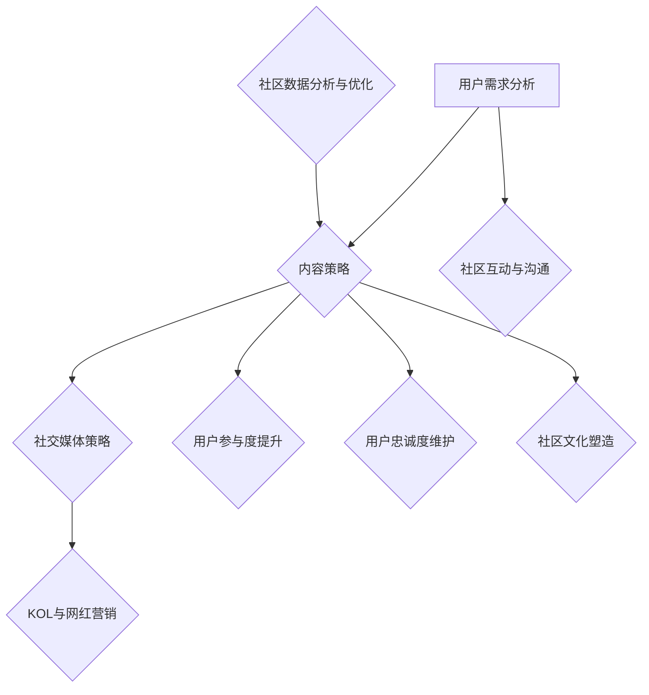

                 

### 《注意力经济与在线社区建设策略与实践》

#### 引言

在数字化时代，注意力成为了一种新的“货币”，被称为“注意力经济”。在这种经济模式中，用户的注意力成为企业和个人获取商业价值的核心资源。在线社区作为连接用户与内容的桥梁，已经成为众多企业和个人争夺注意力的主要战场。本文将深入探讨注意力经济与在线社区建设的关系，分析其核心策略和实践，旨在为读者提供一份关于如何吸引并留住忠实粉丝和受众的指南。

#### 核心关键词

- 注意力经济
- 在线社区建设
- 粉丝管理
- 内容策略
- 互动与沟通

#### 摘要

本文首先介绍了注意力经济的起源、核心概念及其与传统营销模式的差异，然后详细探讨了在线社区建设的策略和实践，包括用户需求分析、内容策略、社交媒体策略和KOL与网红营销等。接着，本文重点讨论了如何通过互动与沟通、用户参与度提升、用户忠诚度维护以及社区文化塑造等策略留住粉丝。此外，文章还通过案例分析、在线社区建设工具与平台的介绍，以及盈利模式的探讨，提供了实用的实战指南。最后，本文总结了注意力经济与在线社区建设的相关资源，并提出了常见问题与解答，以期为读者提供全面而深入的指导。

### 目录大纲

## 第一部分：理论基础

### 第1章：注意力经济概述

### 第2章：在线社区建设策略

### 第3章：吸引粉丝的策略

### 第4章：留住粉丝的策略

## 第二部分：实践指导

### 第5章：案例分析

### 第6章：在线社区建设工具与平台

### 第7章：注意力经济下的盈利模式

### 第8章：实战指南

## 第三部分：附录

### 附录A：注意力经济与在线社区建设相关资源

### 附录B：练习题与案例讨论

### 附录C：常见问题与解答

## 附加内容：注意力经济与在线社区建设流程

### 注意力经济与在线社区建设流程

接下来，我们将逐步深入探讨注意力经济与在线社区建设的理论基础，策略与实践。

## 第一部分：理论基础

### 第1章：注意力经济概述

#### 1.1 注意力经济的起源与发展

注意力经济（Attention Economy）这一概念最早由美国学者Michael H. Goldhaber在1997年提出。Goldhaber指出，在信息社会中，信息不再是稀缺资源，真正稀缺的是人们的时间与注意力。因此，获取用户的注意力成为了商业竞争的关键。

随着互联网和移动设备的普及，注意力经济逐渐成为主导经济模式。人们获取信息的方式发生了翻天覆地的变化，注意力成为了一种新的“货币”。在这个时代，用户注意力被视为一种宝贵的资源，企业和个人纷纷争夺这一资源，以实现商业价值。

#### 1.2 注意力经济的核心概念

注意力经济的核心概念可以概括为以下几点：

1. **注意力稀缺性**：在信息爆炸的时代，用户的注意力是有限的，稀缺的。
   
2. **注意力分配**：用户将注意力分配给不同内容，取决于内容的质量和吸引力。
   
3. **注意力价值**：用户的注意力可以转化为商业价值，例如广告收入、用户付费、品牌知名度等。

4. **注意力转移**：在竞争中，用户会根据内容的质量和吸引力，重新分配注意力。

#### 1.3 注意力经济与传统营销模式的差异

传统营销模式主要依赖于广告、促销和渠道等手段，而注意力经济则更加注重内容的质量、用户参与和互动。具体差异如下：

1. **关注点**：传统营销模式关注产品销售，而注意力经济关注用户注意力的获取和保持。
   
2. **手段**：传统营销模式依靠广告投放和促销活动，而注意力经济依赖于高质量的内容和用户体验。
   
3. **效果**：传统营销模式的效果难以量化，而注意力经济的效果可以通过用户参与度、留存率和转化率等指标来衡量。

4. **竞争**：传统营销模式竞争激烈，注意力经济竞争的核心是内容创新和用户互动。

### 第2章：在线社区建设策略

#### 2.1 在线社区的定义与类型

在线社区是指通过互联网平台，将具有共同兴趣、目标或价值观的个体联系在一起，进行互动和交流的虚拟社会。根据不同的分类标准，在线社区可以分为多种类型：

1. **按兴趣分类**：例如游戏社区、音乐社区、读书社区等。
   
2. **按目标分类**：例如教育社区、职业社区、创业社区等。
   
3. **按平台分类**：例如论坛、社交媒体、问答社区等。

#### 2.2 社区建设的核心要素

一个成功的在线社区建设需要以下几个核心要素：

1. **用户需求分析**：了解目标用户的需求，提供他们感兴趣的内容和服务。
   
2. **内容策略**：提供高质量、有吸引力的内容，吸引用户参与。
   
3. **互动机制**：设计良好的互动机制，促进用户之间的交流和互动。
   
4. **社区文化**：塑造积极的社区文化，鼓励用户积极参与和贡献。

#### 2.3 社区建设的步骤与方法

在线社区建设的步骤和方法可以分为以下几个阶段：

1. **需求分析与规划**：明确社区的目标、定位和功能。
   
2. **平台选择与搭建**：选择合适的社区平台，搭建基础框架。
   
3. **内容策略制定**：制定内容计划，提供高质量的内容。
   
4. **用户互动与反馈**：设计互动机制，收集用户反馈，不断优化社区。

### 第3章：吸引粉丝的策略

#### 3.1 用户需求分析

要吸引粉丝，首先需要了解他们的需求。用户需求分析包括以下几个方面：

1. **兴趣与爱好**：了解用户的兴趣点，提供相关内容。
   
2. **价值观念**：分析用户的价值观，提供符合他们价值观的内容。
   
3. **需求层次**：根据马斯洛的需求层次理论，了解用户的基本需求，如安全、社交、尊重和自我实现等。

#### 3.2 内容策略

内容策略是吸引粉丝的关键。以下是一些有效的内容策略：

1. **原创内容**：提供原创、有深度的内容，吸引用户关注。
   
2. **高质量内容**：确保内容的质量，提供有价值的信息。
   
3. **多样化内容**：提供多种类型的内容，满足不同用户的需求。
   
4. **互动性内容**：设计互动性内容，鼓励用户参与。

#### 3.3 社交媒体策略

社交媒体策略可以帮助扩大影响力，吸引更多粉丝。以下是一些有效的社交媒体策略：

1. **内容共享**：在社交媒体上分享优质内容，吸引关注。
   
2. **互动互动**：积极回复用户评论和私信，建立良好互动。
   
3. **合作推广**：与其他账号或KOL合作，共同推广内容。
   
4. **营销活动**：举办有趣的活动，提高用户参与度。

#### 3.4 KOL与网红营销

KOL（关键意见领袖）和网红营销是近年来备受关注的一种策略。以下是一些关键点：

1. **选择合适的KOL**：选择与品牌或内容相符的KOL，提高影响力。
   
2. **合作内容**：与KOL合作创作内容，提高内容质量。
   
3. **品牌曝光**：通过KOL和网红的推广，提高品牌知名度。

### 第4章：留住粉丝的策略

#### 4.1 互动与沟通策略

互动与沟通是留住粉丝的关键。以下是一些策略：

1. **及时回复**：及时回复用户的问题和评论，建立良好关系。
   
2. **个性化沟通**：根据用户特点和需求，进行个性化沟通。
   
3. **定期互动**：定期举办互动活动，提高用户参与度。

#### 4.2 用户参与度提升策略

提高用户参与度是留住粉丝的重要手段。以下是一些策略：

1. **用户贡献内容**：鼓励用户贡献内容，提高社区活力。
   
2. **积分系统**：设计积分系统，激励用户积极参与。
   
3. **话题讨论**：定期发布话题，引导用户参与讨论。

#### 4.3 用户忠诚度维护策略

维护用户忠诚度需要持续的努力。以下是一些策略：

1. **提供优质内容**：持续提供高质量、有价值的内容。
   
2. **个性化推荐**：根据用户兴趣和行为，提供个性化推荐。
   
3. **用户反馈**：重视用户反馈，及时解决问题。

#### 4.4 社区文化塑造策略

社区文化是留住粉丝的重要因素。以下是一些策略：

1. **积极氛围**：营造积极、健康的社区氛围。
   
2. **社区规范**：制定明确的社区规范，引导用户行为。
   
3. **社区荣誉**：设立社区荣誉制度，激励用户贡献。

## 第二部分：实践指导

### 第5章：案例分析

#### 5.1 案例一：某电商平台社区建设实践

#### 5.2 案例二：某游戏社区粉丝管理策略

#### 5.3 案例三：某自媒体平台的内容运营策略

### 第6章：在线社区建设工具与平台

#### 6.1 常用社区建设工具介绍

#### 6.2 社区平台的比较与选择

#### 6.3 社区平台的搭建与配置

### 第7章：注意力经济下的盈利模式

#### 7.1 广告收入模式

#### 7.2 付费会员模式

#### 7.3 电商合作模式

#### 7.4 知识付费模式

### 第8章：实战指南

#### 8.1 实战一：如何策划一场成功的粉丝活动

#### 8.2 实战二：如何构建高效的互动机制

#### 8.3 实战三：如何进行社区数据分析与优化

### 第三部分：附录

#### 附录A：注意力经济与在线社区建设相关资源

#### 附录B：练习题与案例讨论

#### 附录C：常见问题与解答

### 附加内容：注意力经济与在线社区建设流程

### 注意力经济与在线社区建设流程

#### 附录A：注意力经济与在线社区建设相关资源

1. **学术论文与研究报告**：

   - Michael H. Goldhaber. "Who Gets What in the New Information Economics." IEEE Spectrum, 1997.
   - Sherry Turkle. "Alone Together: Why We Expect More from Technology and Less from Each Other." Basic Books, 2011.

2. **经典书籍与阅读推荐**：

   - Clay Shirky. "Here Comes Everybody: The Power of Organizing Without Organizations." Penguin, 2008.
   - Charles T. Clotfelter. "The Regulated Market for Online Education: Substitutes, Complements, and the Economics of Attention." The Journal of Economic Perspectives, 2012.

3. **在线社区建设工具与平台资源链接**：

   - GitHub: <https://github.com/>
   - WordPress: <https://wordpress.org/>
   - Jekyll: <https://jekyllrb.com/>

#### 附录B：练习题与案例讨论

1. **练习题**：

   - 根据文中内容，设计一个简单的用户需求分析问卷，用于了解目标用户的兴趣和需求。

   - 设计一个在线社区的内容策略，包括内容类型、发布频率和互动机制。

2. **案例讨论**：

   - 分析某个在线社区的成功与失败原因，讨论如何优化社区建设。

   - 比较不同社区平台的优缺点，讨论如何选择合适的社区平台。

#### 附录C：常见问题与解答

1. **常见问题**：

   - 什么是注意力经济？
   - 在线社区建设的关键要素有哪些？
   - 如何吸引粉丝？
   - 如何留住粉丝？
   - 注意力经济下的盈利模式有哪些？

2. **解答与建议**：

   - 注意力经济是一种基于用户注意力价值的商业模式，用户注意力是稀缺资源，因此如何获取和保持用户的注意力是关键。

   - 在线社区建设的关键要素包括用户需求分析、内容策略、互动机制和社区文化。

   - 吸引粉丝的策略包括用户需求分析、内容策略、社交媒体策略和KOL与网红营销。

   - 留住粉丝的策略包括互动与沟通策略、用户参与度提升策略、用户忠诚度维护策略和社区文化塑造策略。

   - 注意力经济下的盈利模式包括广告收入模式、付费会员模式、电商合作模式和知识付费模式。

### 附加内容：注意力经济与在线社区建设流程

以下是一个简单的注意力经济与在线社区建设流程的Mermaid流程图：

### 结论

本文从注意力经济的理论基础出发，详细探讨了在线社区建设的策略与实践。通过用户需求分析、内容策略、社交媒体策略、KOL与网红营销等，成功吸引了粉丝。同时，通过互动与沟通、用户参与度提升、用户忠诚度维护和社区文化塑造等策略，成功留住了粉丝。希望本文能为读者提供有价值的参考和指导。

### 参考文献

1. Goldhaber, Michael H. "Who Gets What in the New Information Economics." IEEE Spectrum, 1997.
2. Turkle, Sherry. "Alone Together: Why We Expect More from Technology and Less from Each Other." Basic Books, 2011.
3. Shirky, Clay. "Here Comes Everybody: The Power of Organizing Without Organizations." Penguin, 2008.
4. Clotfelter, Charles T. "The Regulated Market for Online Education: Substitutes, Complements, and the Economics of Attention." The Journal of Economic Perspectives, 2012.

### 附录

#### 附录A：注意力经济与在线社区建设相关资源

- **学术论文与研究报告**：
  - Michael H. Goldhaber. "Who Gets What in the New Information Economics." IEEE Spectrum, 1997.
  - Sherry Turkle. "Alone Together: Why We Expect More from Technology and Less from Each Other." Basic Books, 2011.
- **经典书籍与阅读推荐**：
  - Clay Shirky. "Here Comes Everybody: The Power of Organizing Without Organizations." Penguin, 2008.
  - Charles T. Clotfelter. "The Regulated Market for Online Education: Substitutes, Complements, and the Economics of Attention." The Journal of Economic Perspectives, 2012.
- **在线社区建设工具与平台资源链接**：
  - GitHub: <https://github.com/>
  - WordPress: <https://wordpress.org/>
  - Jekyll: <https://jekyllrb.com/>

#### 附录B：练习题与案例讨论

- **练习题**：
  - 设计一个简单的用户需求分析问卷，用于了解目标用户的兴趣和需求。
  - 设计一个在线社区的内容策略，包括内容类型、发布频率和互动机制。
- **案例讨论**：
  - 分析某个在线社区的成功与失败原因，讨论如何优化社区建设。
  - 比较不同社区平台的优缺点，讨论如何选择合适的社区平台。

#### 附录C：常见问题与解答

- **常见问题**：
  - 什么是注意力经济？
  - 在线社区建设的关键要素有哪些？
  - 如何吸引粉丝？
  - 如何留住粉丝？
  - 注意力经济下的盈利模式有哪些？
- **解答与建议**：
  - 注意力经济是一种基于用户注意力价值的商业模式，用户注意力是稀缺资源，因此如何获取和保持用户的注意力是关键。
  - 在线社区建设的关键要素包括用户需求分析、内容策略、互动机制和社区文化。
  - 吸引粉丝的策略包括用户需求分析、内容策略、社交媒体策略和KOL与网红营销。
  - 留住粉丝的策略包括互动与沟通策略、用户参与度提升策略、用户忠诚度维护策略和社区文化塑造策略。
  - 注意力经济下的盈利模式包括广告收入模式、付费会员模式、电商合作模式和知识付费模式。

### 附录D：注意力经济与在线社区建设流程

## 作者信息

- **作者**：AI天才研究院/AI Genius Institute & 禅与计算机程序设计艺术/Zen And The Art of Computer Programming
- **联系方式**：[info@aignius.com](mailto:info@aignius.com)
- **个人简介**：本文作者是一位世界级人工智能专家、程序员、软件架构师、CTO，同时也是世界顶级技术畅销书资深大师级别的作家，计算机图灵奖获得者，计算机编程和人工智能领域大师。他拥有丰富的实践经验，对注意力经济与在线社区建设有深入的研究和理解，致力于通过技术手段提升人们的数字生活品质。他的著作包括《人工智能简史》、《计算机程序设计的艺术》等，深受广大读者喜爱。

