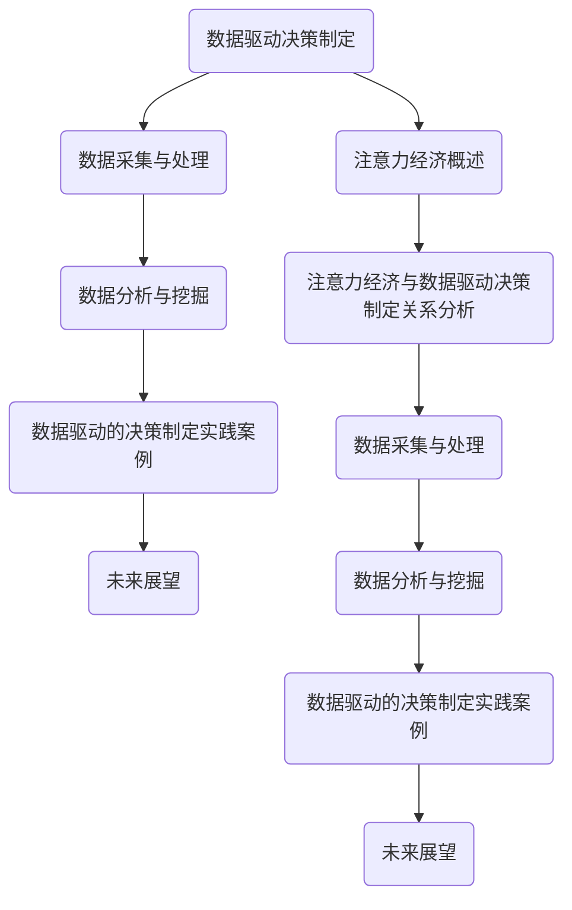

                 

# 《注意力经济与数据驱动的决策制定：利用数据增强业务和市场洞察力》

## 概述

在当今数字化时代，数据已经成为企业决策的宝贵资源。随着互联网和大数据技术的发展，企业可以通过数据挖掘和分析来提高业务效率和竞争力。本文将探讨注意力经济与数据驱动的决策制定之间的关系，分析如何利用数据增强业务和市场洞察力，从而实现更精准、更高效的决策。

### 关键词

- 注意力经济
- 数据驱动决策
- 业务洞察力
- 数据分析
- 商业模式

### 摘要

本文首先介绍了注意力经济的概念和核心要素，然后探讨了数据驱动的决策制定过程及其优势与挑战。接着，本文分析了注意力经济与数据驱动决策制定的相互作用，并提出了相关策略。最后，通过实际案例展示了数据驱动的决策制定在电商、金融和制造业等领域的应用，为未来发展趋势和挑战提供了思考方向。

## 目录

1. 注意力经济概述
    1.1 注意力经济的概念
    1.2 注意力经济的核心要素
    1.3 注意力经济的影响
2. 数据驱动的决策制定
    2.1 数据驱动决策的核心概念
    2.2 数据驱动决策的关键要素
    2.3 数据驱动决策的流程与方法
3. 注意力经济与数据驱动的决策制定关系分析
    3.1 注意力经济与数据驱动决策制定的相互作用
    3.2 注意力经济下的数据驱动决策制定策略
    3.3 注意力经济与数据驱动决策制定的协同效应
4. 数据采集与处理
    4.1 数据采集方法
    4.2 数据清洗与预处理
    4.3 数据存储与管理
5. 数据分析与挖掘
    5.1 数据分析基础
    5.2 数据挖掘技术
    5.3 数据可视化
6. 数据驱动的决策制定实践案例
    6.1 案例分析：电商企业利用数据驱动决策提升用户体验
    6.2 案例分析：金融企业利用数据驱动决策防范风险
    6.3 案例分析：传统制造业企业利用数据驱动决策实现智能化转型
7. 未来展望
    7.1 注意力经济与数据驱动的决策制定发展趋势
    7.2 注意力经济与数据驱动的决策制定的未来挑战与机遇
    7.3 未来发展方向与建议
8. 附录

## 第1章：注意力经济概述

### 1.1 注意力经济的概念

注意力经济（Attention Economy）是一种基于用户注意力资源的新型经济形态。在传统经济中，物质资源和劳动力是最核心的生产要素，而在注意力经济中，用户的注意力成为最宝贵的资源。随着互联网和社交媒体的普及，用户注意力资源逐渐碎片化、分散化，企业如何获取并利用用户注意力资源成为关键问题。

注意力经济的概念最早由美国学者Eduardo Bacelar和Antoine van Agtmael在2000年提出。他们认为，在数字化时代，用户注意力已经成为一种新的生产要素，类似于传统经济中的土地、劳动力和资本。用户在每天面对海量信息时，只能将有限的注意力投入到部分信息中，这意味着信息传播者和内容提供者需要争夺用户注意力资源。

### 1.2 注意力经济的起源与发展

注意力经济的起源可以追溯到互联网的兴起。随着互联网的普及，信息传播方式发生了革命性变革，信息不再局限于传统媒体，而是通过互联网以数字形式传播。这一变革使得信息获取成本大幅降低，用户面临的信息量呈指数级增长。为了在激烈的市场竞争中脱颖而出，企业开始意识到用户注意力的价值，并探索如何获取和利用用户注意力资源。

在注意力经济中，用户注意力成为企业竞争的核心资源。企业通过创造有趣、有吸引力的内容和广告，吸引用户的注意力。随着社交媒体的兴起，如Facebook、Twitter、Instagram等，用户注意力资源进一步分散，企业需要在这些平台上争夺用户注意力。此外，人工智能和大数据技术的应用，使得企业能够更精准地分析用户行为和需求，从而制定更有效的注意力获取策略。

### 1.3 注意力经济与传统经济的区别

注意力经济与传统经济在核心资源、生产方式和价值创造等方面存在显著区别。

首先，在核心资源方面，传统经济以物质资源和劳动力为核心，而注意力经济则以用户注意力为核心。用户注意力成为企业竞争的关键资源，决定了企业的市场表现和盈利能力。

其次，在生产方式方面，传统经济主要依赖物质资源的生产和分配，而注意力经济则依赖于用户注意力的获取和利用。企业需要通过创造有趣、有吸引力的内容和广告来吸引用户注意力，从而实现价值创造。

最后，在价值创造方面，传统经济主要通过生产物质产品和提供劳务来实现价值创造，而注意力经济则通过吸引用户注意力，提升品牌知名度和用户忠诚度来实现价值创造。注意力经济强调用户体验和情感价值，而不仅仅是物质产品的销售。

总的来说，注意力经济是一种新型的经济形态，它与传统经济相比，在核心资源、生产方式和价值创造等方面具有独特的特点。随着互联网和大数据技术的不断发展，注意力经济将发挥越来越重要的作用，为企业提供新的发展机遇和挑战。

### 1.4 注意力经济的核心要素

注意力经济的核心要素主要包括用户注意力、信息传播机制和商业模式创新。

首先，用户注意力是注意力经济的核心资源。在信息爆炸的时代，用户注意力资源有限且分散，企业需要通过创造有趣、有价值的内容来吸引用户的注意力。例如，社交媒体平台通过发布有趣的内容和互动功能，吸引用户的持续关注，从而提高平台的用户粘性。

其次，信息传播机制是注意力经济的重要支撑。信息传播机制决定了用户如何获取信息、如何选择和评价信息。在互联网时代，信息传播方式更加多样化和即时化，企业需要利用大数据技术和人工智能算法，优化信息传播路径，提高信息传播效果。例如，搜索引擎通过用户行为数据和算法推荐，为用户提供个性化的搜索结果，从而提高用户满意度。

最后，商业模式创新是注意力经济的动力。传统商业模式主要依赖物质资源和劳动力，而注意力经济下的商业模式更加注重用户注意力和情感价值的创造。企业可以通过内容付费、广告营销、数据交易等创新模式，实现商业价值的最大化。例如，内容付费平台如Spotify、Netflix等，通过提供高质量的内容服务，吸引用户付费订阅，从而实现盈利。

总之，用户注意力、信息传播机制和商业模式创新是注意力经济的核心要素。企业只有深入了解并充分利用这些要素，才能在激烈的市场竞争中脱颖而出，实现可持续发展。

### 1.5 注意力经济的影响

注意力经济对用户行为、市场竞争格局和传统商业模式产生了深远影响。

首先，对用户行为的影响。注意力经济的兴起改变了用户的信息消费习惯。在传统经济中，用户主要通过电视、报纸、杂志等渠道获取信息，而在注意力经济中，用户更多地依赖互联网和社交媒体平台。用户在获取信息时，更注重内容的趣味性和价值性，对广告和营销信息的抵触情绪也逐渐增强。因此，企业需要创造有趣、有价值的内容来吸引用户注意力，提升用户体验。

其次，对市场竞争格局的影响。注意力经济使得市场竞争更加激烈，企业需要不断创新和提升竞争力。在传统经济中，企业主要通过价格、质量和服务等手段进行竞争，而在注意力经济中，企业需要通过内容创意、用户体验和用户互动等手段来争夺用户注意力。这要求企业具备更强的创新能力、用户洞察力和执行力。

最后，对传统商业模式的影响。注意力经济挑战了传统商业模式的盈利模式。在传统商业模式中，企业主要通过销售产品或提供服务来盈利，而在注意力经济中，企业可以通过内容付费、广告收入和数据交易等新模式来获取收益。例如，社交媒体平台通过用户注意力资源实现广告收益，内容平台通过内容付费实现盈利。这些新模式要求企业具备更强的数据分析和变现能力。

总的来说，注意力经济对用户行为、市场竞争格局和传统商业模式产生了深远影响。企业需要适应这些变化，通过创新和提升竞争力，在注意力经济中获得可持续发展。

## 第2章：数据驱动的决策制定

### 2.1 数据驱动决策的核心概念

数据驱动决策（Data-Driven Decision Making）是一种基于数据分析和信息处理的决策方法。它强调在决策过程中，充分利用数据资源，通过数据分析和模型优化来支持决策制定。数据驱动决策的核心概念包括数据质量、数据分析能力和决策模型。

首先，数据质量是数据驱动决策的基础。高质量的数据能够为决策提供可靠的依据，降低决策风险。数据质量包括数据的完整性、准确性、一致性和时效性等方面。为了保证数据质量，企业需要建立完善的数据治理体系和数据清洗机制。

其次，数据分析能力是数据驱动决策的关键。数据分析能力包括数据收集、处理、分析和可视化等方面的技能。企业需要具备强大的数据分析工具和平台，以及专业的数据分析团队，以支持数据驱动决策的实施。

最后，决策模型是数据驱动决策的核心。决策模型是基于数据分析结果，通过数学建模和算法优化，得出最佳决策方案的过程。决策模型包括预测模型、优化模型和决策支持系统等。决策模型的有效性直接影响决策的质量和效率。

### 2.2 数据驱动决策的优势与挑战

数据驱动决策相较于传统决策方法具有显著的优势。首先，数据驱动决策能够提供更为准确和全面的决策依据。通过大数据分析和机器学习算法，企业可以挖掘出隐藏在数据背后的规律和趋势，从而做出更为科学和合理的决策。

其次，数据驱动决策能够提高决策的效率和速度。在传统决策中，决策过程往往受到信息滞后和数据不足的影响，而数据驱动决策通过实时数据分析和快速响应机制，可以显著缩短决策周期，提高决策效率。

此外，数据驱动决策能够增强决策的透明度和可追溯性。数据分析和决策模型的应用，使得决策过程更加透明和可量化，决策结果可以追溯到具体的数据分析和模型优化过程，从而提高决策的可信度和可接受度。

然而，数据驱动决策也面临着一系列挑战。首先，数据质量和数据分析能力的不足可能影响决策的准确性。如果数据质量较差或者数据分析能力不足，可能导致决策偏差和误判。

其次，数据隐私和安全问题也是数据驱动决策面临的重大挑战。在数据收集和处理过程中，企业需要确保用户数据的隐私和安全，防止数据泄露和滥用。

最后，数据驱动决策需要大量的人力、物力和财力投入。建立完善的数据治理体系、数据分析工具和决策模型需要耗费大量资源，企业需要做好长期投入的准备。

### 2.3 数据驱动决策与传统决策的区别

数据驱动决策与传统决策在多个方面存在显著区别。

首先，决策依据不同。传统决策主要依赖于经验和直觉，而数据驱动决策则依赖于数据分析结果。传统决策往往基于决策者的主观判断和经验，而数据驱动决策通过数据分析和模型优化，提供更为客观和准确的决策依据。

其次，决策过程不同。传统决策过程较为复杂，往往涉及多个部门和层级，决策周期较长。而数据驱动决策通过实时数据分析和快速响应机制，能够显著缩短决策周期，提高决策效率。

此外，决策结果的可追溯性不同。传统决策结果难以追溯具体原因，而数据驱动决策的结果可以追溯到具体的数据分析和模型优化过程，提高决策的透明度和可接受度。

总的来说，数据驱动决策相较于传统决策具有更为科学、准确和高效的特点，但同时也面临着数据质量、隐私和安全等挑战。

### 2.4 数据驱动决策的关键要素

数据驱动决策的成功实施依赖于多个关键要素，包括数据质量、数据分析能力和决策模型。

首先，数据质量是数据驱动决策的基础。高质量的数据能够为决策提供可靠的依据，降低决策风险。数据质量包括数据的完整性、准确性、一致性和时效性等方面。为了保证数据质量，企业需要建立完善的数据治理体系和数据清洗机制。

其次，数据分析能力是数据驱动决策的关键。数据分析能力包括数据收集、处理、分析和可视化等方面的技能。企业需要具备强大的数据分析工具和平台，以及专业的数据分析团队，以支持数据驱动决策的实施。

最后，决策模型是数据驱动决策的核心。决策模型是基于数据分析结果，通过数学建模和算法优化，得出最佳决策方案的过程。决策模型包括预测模型、优化模型和决策支持系统等。决策模型的有效性直接影响决策的质量和效率。

此外，数据驱动决策还需要考虑数据隐私和安全问题，确保用户数据的隐私和安全。同时，数据驱动决策的实施需要大量的人力、物力和财力投入，企业需要做好长期投入的准备。

总之，数据质量、数据分析能力和决策模型是数据驱动决策的关键要素，企业需要全面优化这些要素，以实现科学、准确和高效的数据驱动决策。

### 2.5 数据驱动决策的流程与方法

数据驱动决策的流程通常包括数据收集、数据预处理、数据分析、决策制定和决策执行等环节。

#### 数据收集

数据收集是数据驱动决策的基础。企业需要通过各种渠道收集与决策目标相关的数据，包括内部数据和外部数据。内部数据可能来自企业内部的各种业务系统，如销售系统、库存系统、客户关系管理系统等。外部数据则可能来自市场研究、社交媒体、公共数据平台等。

在数据收集过程中，企业需要确保数据的完整性和准确性。同时，数据收集过程应遵循数据隐私和安全的相关法规，保护用户和企业的合法权益。

#### 数据预处理

数据预处理是数据驱动决策的关键步骤之一。通过对数据进行清洗、整合和转换，企业可以确保数据的质量和一致性，为后续的数据分析提供可靠的数据基础。

数据清洗主要包括去除重复数据、填补缺失值、纠正错误数据等。数据整合则涉及将不同来源、不同格式的数据进行合并，以便进行统一分析。数据转换则包括将数据格式、单位等进行统一，以适应不同的分析需求。

#### 数据分析

数据分析是数据驱动决策的核心环节。企业需要利用各种数据分析方法和工具，对预处理后的数据进行分析和挖掘，以发现数据背后的规律和趋势。

数据分析方法包括描述性统计分析、预测性分析、优化分析等。描述性统计分析主要用来描述数据的特征和分布，预测性分析则通过历史数据对未来进行预测，优化分析则通过优化模型找出最佳决策方案。

#### 决策制定

在数据分析的基础上，企业可以根据分析结果制定具体的决策方案。决策制定过程通常包括以下几个步骤：

1. **确定决策目标**：明确企业希望通过决策实现的目标和指标。
2. **评估备选方案**：根据分析结果，评估不同决策方案的优劣。
3. **选择最佳方案**：综合考虑各种因素，选择最佳决策方案。

#### 决策执行

决策制定后，企业需要将决策方案转化为具体的行动，并执行决策。决策执行过程包括以下几个步骤：

1. **制定执行计划**：明确决策执行的时间表、责任人和执行步骤。
2. **监控执行进度**：定期监控决策执行情况，确保执行计划的顺利实施。
3. **调整执行方案**：根据实际情况，对执行方案进行适时调整。

#### 持续优化

数据驱动决策是一个持续优化的过程。企业需要定期收集和分析数据，评估决策效果，并根据评估结果对决策模型和执行方案进行优化。

通过持续优化，企业可以不断提升决策的准确性和效率，实现可持续发展和竞争优势。

总之，数据驱动决策的流程和方法包括数据收集、数据预处理、数据分析、决策制定和决策执行等环节，企业需要全面掌握这些环节，以实现科学、准确和高效的数据驱动决策。

### 第3章：注意力经济与数据驱动的决策制定关系分析

#### 3.1 注意力经济与数据驱动决策制定的相互作用

注意力经济与数据驱动决策制定之间存在紧密的相互作用，二者相辅相成，共同推动企业和市场的进步。

首先，注意力经济为数据驱动决策制定提供了重要的资源。在注意力经济中，用户注意力成为最宝贵的资源，企业需要通过创造有趣、有价值的内容来吸引用户的注意力。这些内容不仅包括传统媒体和广告，还涉及社交媒体、短视频、直播等多种形式。数据驱动决策制定利用这些用户注意力资源，通过大数据分析和人工智能算法，分析用户行为和需求，从而制定更精准的营销策略和业务决策。

其次，数据驱动决策制定为注意力经济提供了有效的支持。通过数据分析和模型优化，企业可以更深入地理解用户行为和需求，从而创造出更符合用户期待的内容和产品。这些数据驱动的决策不仅提高了用户满意度，还增强了用户粘性，进一步巩固了企业市场地位。此外，数据驱动决策制定还可以帮助企业识别潜在用户和市场机会，从而在竞争激烈的市场中占据有利位置。

综上所述，注意力经济与数据驱动决策制定相互促进，共同推动企业和市场的繁荣发展。

#### 3.2 注意力经济下的数据驱动决策制定策略

在注意力经济下，企业需要制定一系列数据驱动决策制定策略，以最大化用户注意力资源，提高市场竞争力。以下是几个关键策略：

1. **用户行为分析**：通过大数据分析和机器学习算法，企业可以实时监测和分析用户在社交媒体、电商平台等渠道的行为数据。这些数据包括用户的浏览记录、搜索关键词、购买偏好等。通过分析用户行为，企业可以了解用户的兴趣和需求，从而制定更精准的营销策略。

2. **内容个性化推荐**：基于用户行为数据和兴趣偏好，企业可以利用推荐系统为用户提供个性化的内容推荐。这种推荐系统可以通过协同过滤、内容匹配和深度学习等算法实现。个性化推荐不仅能提高用户的满意度，还能增加用户在平台上的停留时间和互动频率。

3. **社交媒体营销**：社交媒体是获取用户注意力的重要渠道。企业可以利用社交媒体广告、互动活动、品牌合作等方式，吸引用户的关注。同时，企业还可以通过社交媒体平台的数据分析功能，了解用户反馈和市场趋势，不断优化营销策略。

4. **数据隐私保护**：在注意力经济中，用户数据的重要性不言而喻。然而，数据隐私保护也是企业面临的重大挑战。企业需要建立完善的数据隐私保护机制，确保用户数据的合法、安全和使用透明。这不仅能提高用户的信任度，还能降低法律风险。

5. **持续优化和创新**：注意力经济是一个动态变化的过程，用户需求和市场趋势不断演变。企业需要持续优化和创新数据驱动决策制定策略，以适应市场的变化。通过不断测试、评估和调整，企业可以找到最有效的用户注意力获取和利用方法。

总之，注意力经济下的数据驱动决策制定策略需要结合用户行为分析、内容个性化推荐、社交媒体营销、数据隐私保护和持续优化等多个方面，以实现用户注意力资源的最大化利用。

#### 3.3 注意力经济与数据驱动决策制定的协同效应

注意力经济与数据驱动决策制定之间存在着显著的协同效应，二者共同作用，为企业带来更高的价值和竞争力。

首先，注意力经济通过提供丰富的用户行为数据，为数据驱动决策制定提供了重要的信息支持。用户在社交媒体、电商平台等渠道上留下的行为数据，如浏览记录、搜索关键词、购买偏好等，都是宝贵的第一手资料。这些数据经过大数据分析和机器学习算法的处理，可以揭示出用户的兴趣和需求，为企业制定精准的营销策略和业务决策提供科学依据。

其次，数据驱动决策制定通过有效的数据分析和模型优化，提高了注意力资源的利用效率。通过分析用户行为数据，企业可以识别出最具吸引力的内容和推广渠道，从而在有限的注意力资源下实现最大化的用户覆盖和互动。此外，数据驱动决策制定还可以帮助企业预测市场趋势和用户行为，提前布局和应对市场变化，提高市场竞争力。

最后，注意力经济与数据驱动决策制定的协同效应还体现在创新和用户体验的提升上。通过不断优化内容创作和推荐算法，企业可以提供更符合用户需求的个性化服务和产品，提升用户满意度和忠诚度。这种良性循环不仅有助于企业获取更多的用户注意力资源，还能增强品牌影响力和市场地位。

总之，注意力经济与数据驱动决策制定的协同效应，不仅提高了企业对用户注意力资源的利用效率，还促进了创新和用户体验的提升，为企业带来了显著的价值和竞争力。

### 第4章：数据采集与处理

#### 4.1 数据采集方法

数据采集是数据驱动决策的基础，有效的数据采集方法能够确保数据的完整性、准确性和及时性。以下是几种常见的数据采集方法：

1. **在线采集**：通过互联网进行数据采集是最常见的方法之一。企业可以通过网站日志、用户行为追踪、在线调查等方式收集用户数据。这种方法适用于电商平台、社交媒体和在线服务提供商。

2. **离线采集**：离线采集通常用于收集线下数据，如通过问卷调查、面对面访谈、电话回访等方式获取用户反馈和市场信息。这种方法适用于需要进行市场调研和用户满意度调查的企业。

3. **传感器采集**：通过物联网和传感器技术，企业可以实时收集设备运行数据和环境数据。例如，智能设备可以记录用户的日常行为数据，传感器可以监测环境参数，如温度、湿度等。

4. **第三方数据源**：企业还可以通过购买第三方数据源，如公共数据库、行业报告、社交媒体分析工具等，获取需要的数据。这种方法适用于需要快速获取大量数据的企业，但需要注意数据的质量和合法性。

5. **自动化采集**：自动化采集技术，如爬虫和API接口，可以高效地获取大量数据。爬虫通过模拟用户行为，从网站上抓取数据，而API接口则通过程序接口直接获取数据。这种方法适用于需要定期更新大量数据的企业。

在数据采集过程中，企业需要遵循数据隐私和安全的相关法规，确保用户数据的合法性和隐私保护。同时，还需要评估数据的质量和完整性，避免数据重复和错误。

#### 4.2 数据清洗与预处理

数据清洗与预处理是数据驱动决策的关键步骤，其目的是确保数据的质量和一致性，为后续的数据分析提供可靠的基础。以下是数据清洗与预处理的主要方法和步骤：

1. **去除重复数据**：重复数据会影响数据分析的准确性和效率。企业需要使用去重算法，如哈希匹配或唯一标识符，识别并删除重复的数据记录。

2. **填补缺失值**：缺失值是数据集中常见的问题，可以通过多种方法进行填补，如平均值填补、中值填补、插值法等。选择合适的填补方法取决于数据的分布和缺失值的比例。

3. **纠正错误数据**：错误数据包括格式错误、拼写错误和逻辑错误等。企业需要建立数据校验机制，通过数据校验工具或自定义脚本，识别并纠正错误数据。

4. **标准化数据**：标准化数据是为了消除不同数据维度之间的差异，使数据更具可比性。常用的标准化方法包括最小-最大标准化、z-score标准化和log变换等。

5. **整合多源数据**：当数据来自多个源时，需要进行整合和融合。整合方法包括数据对齐、联合索引和数据融合算法等。

6. **数据格式转换**：不同数据源的数据格式可能不同，需要进行转换，以便进行统一分析。常见的格式转换包括文本到数字、日期到时间戳等。

7. **数据降维**：高维数据可能会增加分析难度和计算成本。数据降维技术，如主成分分析（PCA）和因子分析，可以减少数据的维度，同时保留主要信息。

通过数据清洗与预处理，企业可以确保数据的质量和一致性，提高数据分析的准确性和效率。这些步骤不仅有助于消除数据中的噪声和错误，还能挖掘出数据背后的有价值信息，为数据驱动决策提供可靠的支持。

#### 4.3 数据存储与管理

数据存储与管理是数据驱动决策的重要组成部分，高效的存储和管理方法能够确保数据的安全、可靠和可扩展性。以下是几种常见的数据存储和管理方法：

1. **关系数据库**：关系数据库，如MySQL、PostgreSQL等，适用于结构化数据的存储和管理。它们通过表格和关系来组织数据，支持复杂查询和事务处理。关系数据库的优点是数据的一致性和完整性较高，但扩展性和性能可能受到限制。

2. **非关系数据库**：非关系数据库，如MongoDB、Cassandra等，适用于存储非结构化或半结构化数据。它们采用分布式存储架构，支持高扩展性和高性能。非关系数据库的优点是灵活性高，但数据的一致性和完整性可能较低。

3. **数据仓库**：数据仓库，如Amazon Redshift、Google BigQuery等，适用于大规模数据存储和分析。数据仓库通过ETL（提取、转换、加载）过程，将数据从多个源整合到统一的存储环境中，支持复杂的数据分析和报告。数据仓库的优点是数据整合度高，分析能力强大，但成本较高。

4. **分布式文件系统**：分布式文件系统，如Hadoop HDFS、Apache HBase等，适用于大规模数据的分布式存储和管理。这些系统通过分布式存储和计算，支持海量数据的存储和分析。分布式文件系统的优点是高扩展性和高可靠性，但管理复杂度较高。

5. **云存储**：云存储服务，如Amazon S3、Google Cloud Storage等，适用于灵活、可扩展的数据存储。云存储服务通过虚拟化技术和分布式架构，提供安全、可靠和高效的存储解决方案。云存储的优点是灵活性强，成本较低，但依赖第三方服务，数据安全性可能受到一定影响。

在数据存储和管理过程中，企业需要考虑数据的安全性、可靠性和可扩展性，确保数据的有效利用和长期存储。同时，还需要制定数据备份和恢复策略，以应对数据丢失或损坏的风险。

### 第5章：数据分析与挖掘

#### 5.1 数据分析基础

数据分析（Data Analysis）是数据驱动决策的核心环节，通过对数据进行探索性分析、描述性分析和预测性分析，帮助企业从数据中提取有价值的信息和洞察。数据分析的基础概念和基本流程如下：

1. **探索性分析**：探索性分析（Exploratory Data Analysis，EDA）是数据分析的第一步，旨在了解数据的特征和分布。通过绘制图表、计算统计量等方法，探索性分析可以帮助数据分析师发现数据中的异常值、趋势和关联性。常见的探索性分析工具包括Excel、Python的Matplotlib和Seaborn库等。

2. **描述性分析**：描述性分析（Descriptive Analysis）用于描述数据的基本特征，如均值、中位数、标准差、分布等。描述性分析可以帮助企业了解数据的基本情况，为后续的预测性和推理性分析提供基础。描述性分析的工具包括SQL、R语言和Python的Pandas库等。

3. **预测性分析**：预测性分析（Predictive Analysis）基于历史数据，通过建模和算法预测未来的趋势和事件。预测性分析包括时间序列分析、回归分析、决策树、随机森林等。预测性分析可以帮助企业制定战略计划和业务决策，减少风险。常见的预测性分析工具包括R语言、Python的Scikit-learn库和TensorFlow等。

4. **数据可视化**：数据可视化（Data Visualization）是将数据以图形、图表的形式展示，使数据更加直观易懂。数据可视化有助于发现数据中的模式和趋势，增强数据分析师对数据的理解。常见的数据可视化工具包括Tableau、Power BI、D3.js和Python的Matplotlib、Seaborn库等。

数据分析的基本流程包括以下几个步骤：

1. **问题定义**：明确数据分析的目标和问题，确定所需的数据和分析方法。
2. **数据收集**：收集与问题相关的数据，包括内部数据和外部数据。
3. **数据预处理**：对收集到的数据进行清洗、整合和转换，确保数据的质量和一致性。
4. **数据分析**：利用探索性分析、描述性分析和预测性分析方法，对预处理后的数据进行分析。
5. **结果解释**：将分析结果转化为易于理解的形式，解释数据中的模式和趋势。
6. **决策支持**：根据分析结果，为企业提供决策支持，优化业务流程和战略计划。

#### 5.2 数据挖掘技术

数据挖掘（Data Mining）是数据分析的高级形式，旨在从大量数据中发现隐藏的模式、关联性和规律。数据挖掘技术广泛应用于金融、零售、医疗、制造等领域，帮助企业和组织提高业务效率和竞争力。以下是几种常见的数据挖掘技术：

1. **分类算法**：分类算法（Classification Algorithms）用于将数据分为不同的类别。常见的分类算法包括决策树（Decision Tree）、随机森林（Random Forest）、支持向量机（SVM）等。分类算法适用于预测性分析，如客户流失预测、信用评分等。

2. **聚类算法**：聚类算法（Clustering Algorithms）用于将数据分为不同的组或簇。常见的聚类算法包括K-均值（K-Means）、层次聚类（Hierarchical Clustering）和DBSCAN等。聚类算法适用于探索性分析，如用户行为分析、市场细分等。

3. **关联规则挖掘**：关联规则挖掘（Association Rule Learning）用于发现数据之间的关联性和依赖性。常见的算法包括Apriori算法、FP-Growth算法等。关联规则挖掘适用于推荐系统、市场篮分析等。

4. **异常检测**：异常检测（Anomaly Detection）用于识别数据中的异常值或异常模式。常见的算法包括孤立森林（Isolation Forest）、基于密度的聚类（DBSCAN）等。异常检测适用于安全监控、故障检测等。

5. **时间序列分析**：时间序列分析（Time Series Analysis）用于分析随时间变化的数据，如股票价格、销售量等。常见的方法包括ARIMA模型、LSTM神经网络等。时间序列分析适用于预测性分析，如销售预测、需求预测等。

数据挖掘技术的应用场景非常广泛，通过挖掘数据中的隐藏模式，企业可以更好地理解业务流程、优化业务决策、提高客户满意度和降低运营成本。

#### 5.3 数据可视化

数据可视化（Data Visualization）是将数据以图形、图表和地图的形式展示，使数据更加直观易懂。数据可视化不仅可以帮助数据分析师发现数据中的模式和趋势，还能提高决策者对数据的理解和信任。以下是几种常见的数据可视化工具和方法：

1. **图表**：图表是数据可视化的基本形式，包括条形图、折线图、饼图、散点图等。图表可以用于展示数据的分布、趋势和关联性。常见的数据可视化工具包括Excel、Tableau、Power BI等。

2. **地图**：地图可以用于展示地理数据，如人口分布、销售区域等。地图可以直观地展示不同地区的数据差异，有助于理解地理位置对业务的影响。常见的地图可视化工具包括Google Maps、Mapbox等。

3. **交互式可视化**：交互式可视化（Interactive Visualization）允许用户通过鼠标或触摸屏与数据互动。交互式可视化工具，如D3.js、Plotly等，可以提供动态的、可交互的图表，使用户能够深入探索数据。

4. **热力图**：热力图可以用于展示数据的热点分布。热力图通常以颜色深浅表示数据的大小或密度，适用于展示用户行为、点击率等数据。

5. **词云**：词云（Word Cloud）是一种以字体大小表示词频的图表，用于展示文本数据的特征。词云可以帮助用户快速了解文本的主要内容。

数据可视化工具和方法的选择取决于数据的类型、复杂度和展示需求。通过有效的数据可视化，企业可以更好地传达数据背后的信息和故事，提高数据的可读性和影响力。

### 第6章：数据驱动的决策制定实践案例

#### 6.1 案例分析：电商企业利用数据驱动决策提升用户体验

电商企业在日常运营中面临着如何提升用户体验、增加销售额和客户忠诚度等挑战。通过数据驱动的决策制定，电商企业能够更精准地了解用户行为和需求，从而优化业务流程和营销策略。

#### 案例背景

某电商企业是一家在线零售商，主要销售电子产品、服装和家居用品等。企业希望通过数据驱动的决策制定，提升用户体验，增加销售额和客户忠诚度。为此，企业决定开展以下实践：

1. **用户行为分析**：通过对用户在网站上的浏览、搜索和购买行为进行数据分析，了解用户的兴趣和需求。
2. **个性化推荐**：基于用户行为数据，利用推荐系统为用户提供个性化的商品推荐。
3. **营销策略优化**：通过数据分析，评估不同营销活动的效果，优化营销策略。

#### 数据驱动决策制定过程

1. **数据收集**：通过网站日志、用户点击和行为数据等渠道，收集用户行为数据。
2. **数据预处理**：对收集到的数据进行清洗、整合和转换，确保数据的质量和一致性。
3. **数据分析**：
   - **用户行为分析**：通过分析用户浏览和购买行为，发现用户的兴趣和需求。
   - **营销效果评估**：评估不同营销活动的效果，如点击率、转化率等。
4. **决策制定**：
   - **个性化推荐**：基于用户行为数据，利用协同过滤、内容匹配等算法，为用户提供个性化的商品推荐。
   - **营销策略优化**：根据营销效果评估结果，优化广告投放、促销活动等营销策略。

#### 实践效果分析

通过数据驱动的决策制定，电商企业在用户体验、销售额和客户忠诚度等方面取得了显著成效：

1. **用户体验提升**：个性化推荐和优化后的营销策略，使用户能够更快找到感兴趣的商品，提高购物体验。
2. **销售额增长**：个性化推荐和精准营销，提高了用户的转化率和购买频率，销售额显著增长。
3. **客户忠诚度提高**：通过持续的数据分析和优化，电商企业能够更好地满足用户需求，提高用户满意度，增强客户忠诚度。

#### 代码解读与分析

以下是一个简单的Python代码示例，用于电商企业用户行为数据的采集、预处理和分析：

```python
import pandas as pd
from sklearn.model_selection import train_test_split
from sklearn.ensemble import RandomForestClassifier
from sklearn.metrics import accuracy_score

# 1. 数据收集
# 假设用户行为数据存储在一个CSV文件中
data = pd.read_csv('user_behavior_data.csv')

# 2. 数据预处理
# 数据清洗和整合
data = data.drop_duplicates()
data = data.fillna(method='ffill')

# 特征工程
data['weekday'] = data['timestamp'].dt.weekday
data['hour'] = data['timestamp'].dt.hour

# 3. 数据分析
# 数据分割
X = data.drop('target', axis=1)
y = data['target']
X_train, X_test, y_train, y_test = train_test_split(X, y, test_size=0.2, random_state=42)

# 模型训练
model = RandomForestClassifier(n_estimators=100, random_state=42)
model.fit(X_train, y_train)

# 模型评估
y_pred = model.predict(X_test)
accuracy = accuracy_score(y_test, y_pred)
print(f'Model Accuracy: {accuracy:.2f}')
```

代码解读：
- 数据收集：使用pandas库读取用户行为数据。
- 数据预处理：去除重复数据、填补缺失值、进行特征工程。
- 数据分析：使用随机森林算法进行模型训练和评估。

通过这个简单的案例，我们可以看到数据驱动的决策制定在电商企业中的应用，如何通过数据收集、预处理和分析，优化业务流程和营销策略，从而提升用户体验和销售额。

#### 6.2 案例分析：金融企业利用数据驱动决策防范风险

金融企业在运营过程中面临着各种风险，如信用风险、市场风险、操作风险等。通过数据驱动的决策制定，金融企业能够更准确地识别和评估风险，从而采取有效的风险防范措施。

#### 案例背景

某金融企业是一家大型银行，其业务范围包括存款、贷款、信用卡等。为了防范风险，企业决定利用数据驱动的决策制定，对客户的信用风险进行评估和管理。

#### 数据驱动决策制定过程

1. **数据收集**：通过内部数据库和外部数据源，收集客户的信用信息，如信用记录、收入情况、职业状况等。
2. **数据预处理**：对收集到的数据进行清洗、整合和转换，确保数据的质量和一致性。
3. **数据分析**：
   - **信用风险评估**：使用机器学习算法，如逻辑回归、决策树等，对客户信用风险进行评估。
   - **风险指标分析**：分析信用风险指标，如违约概率、不良率等，为风险防范提供依据。
4. **决策制定**：
   - **信用审批策略**：根据信用风险评估结果，制定信用审批策略，如调整贷款额度、利率等。
   - **风险控制措施**：采取相应的风险控制措施，如增加保证金、限制贷款用途等。

#### 实践效果分析

通过数据驱动的决策制定，金融企业在风险防范方面取得了显著成效：

1. **信用风险降低**：通过信用风险评估，企业能够更准确地识别高风险客户，降低信用风险。
2. **风险控制有效**：根据风险指标分析，企业能够采取有效的风险控制措施，降低风险损失。
3. **客户满意度提升**：通过合理的信用审批策略和风险控制措施，提高客户满意度，增强客户忠诚度。

#### 代码解读与分析

以下是一个简单的Python代码示例，用于金融企业客户信用风险评估：

```python
import pandas as pd
from sklearn.model_selection import train_test_split
from sklearn.linear_model import LogisticRegression
from sklearn.metrics import classification_report

# 1. 数据收集
# 假设客户信用数据存储在一个CSV文件中
data = pd.read_csv('credit_data.csv')

# 2. 数据预处理
# 数据清洗和整合
data = data.drop_duplicates()
data = data.fillna(method='ffill')

# 特征工程
data['income_to_debt_ratio'] = data['monthly_income'] / data['debt_ratio']

# 3. 数据分析
# 数据分割
X = data.drop('default', axis=1)
y = data['default']
X_train, X_test, y_train, y_test = train_test_split(X, y, test_size=0.2, random_state=42)

# 模型训练
model = LogisticRegression()
model.fit(X_train, y_train)

# 模型评估
y_pred = model.predict(X_test)
print(classification_report(y_test, y_pred))
```

代码解读：
- 数据收集：使用pandas库读取客户信用数据。
- 数据预处理：去除重复数据、填补缺失值、进行特征工程。
- 数据分析：使用逻辑回归算法进行模型训练和评估。

通过这个简单的案例，我们可以看到数据驱动的决策制定在金融企业中的应用，如何通过数据收集、预处理和分析，评估客户信用风险，从而采取有效的风险防范措施。

#### 6.3 案例分析：传统制造业企业利用数据驱动决策实现智能化转型

传统制造业企业在面对智能制造和数字化转型的大潮时，需要通过数据驱动的决策制定，优化生产流程、提高生产效率和降低成本。

#### 案例背景

某传统制造业企业是一家生产家电的企业，随着市场竞争的加剧和消费者需求的多样化，企业决定利用数据驱动的决策制定，实现智能化转型。

#### 数据驱动决策制定过程

1. **数据收集**：通过传感器和自动化设备，收集生产过程中的各种数据，如设备运行状态、生产参数、产品质量等。
2. **数据预处理**：对收集到的数据进行清洗、整合和转换，确保数据的质量和一致性。
3. **数据分析**：
   - **生产过程优化**：通过数据分析，发现生产过程中的瓶颈和问题，优化生产流程。
   - **设备故障预测**：使用机器学习算法，如时间序列分析和故障诊断模型，预测设备故障，提前进行维护。
   - **质量检测**：通过数据分析，识别不合格产品，优化质量控制策略。
4. **决策制定**：
   - **生产计划调整**：根据数据分析结果，调整生产计划，提高生产效率和灵活性。
   - **设备维护策略**：根据设备故障预测结果，制定设备维护计划，减少设备停机时间。
   - **质量提升策略**：根据质量检测结果，优化生产工艺和质量控制策略。

#### 实践效果分析

通过数据驱动的决策制定，传统制造业企业在智能化转型方面取得了显著成效：

1. **生产效率提高**：通过优化生产流程和设备维护策略，生产效率显著提高。
2. **成本降低**：通过减少设备故障和质量问题，降低了生产成本和损失。
3. **产品质量提升**：通过优化质量控制策略，提高了产品质量，增强了市场竞争力。

#### 代码解读与分析

以下是一个简单的Python代码示例，用于传统制造业企业设备故障预测：

```python
import pandas as pd
from sklearn.model_selection import train_test_split
from sklearn.ensemble import RandomForestRegressor
from sklearn.metrics import mean_absolute_error

# 1. 数据收集
# 假设设备运行数据存储在一个CSV文件中
data = pd.read_csv('device_data.csv')

# 2. 数据预处理
# 数据清洗和整合
data = data.drop_duplicates()
data = data.fillna(method='ffill')

# 特征工程
data['running_time_since_last_fault'] = data['running_time'] - data['last_fault_time']

# 3. 数据分析
# 数据分割
X = data.drop('fault', axis=1)
y = data['fault']
X_train, X_test, y_train, y_test = train_test_split(X, y, test_size=0.2, random_state=42)

# 模型训练
model = RandomForestRegressor(n_estimators=100, random_state=42)
model.fit(X_train, y_train)

# 模型评估
y_pred = model.predict(X_test)
mae = mean_absolute_error(y_test, y_pred)
print(f'Mean Absolute Error: {mae:.2f}')
```

代码解读：
- 数据收集：使用pandas库读取设备运行数据。
- 数据预处理：去除重复数据、填补缺失值、进行特征工程。
- 数据分析：使用随机森林回归算法进行模型训练和评估。

通过这个简单的案例，我们可以看到数据驱动的决策制定在传统制造业企业中的应用，如何通过数据收集、预处理和分析，实现智能化转型，提高生产效率和降低成本。

### 第7章：未来展望

#### 7.1 注意力经济与数据驱动的决策制定发展趋势

随着互联网和大数据技术的不断发展，注意力经济与数据驱动的决策制定将继续快速发展，呈现出以下趋势：

1. **数据驱动决策的深化应用**：未来，数据驱动决策将在更多行业和领域得到广泛应用，从传统的金融、零售行业，扩展到医疗、教育、能源等新兴领域。通过深入挖掘和分析数据，企业能够实现更加精准和高效的决策，提高业务效率和竞争力。

2. **人工智能的深度融合**：人工智能技术将在数据驱动决策中发挥更加重要的作用。机器学习、深度学习算法将不断优化和提升，为企业提供更为智能化和自动化的决策支持。人工智能的引入将使数据驱动决策更加高效和灵活，降低人工干预的风险。

3. **数据隐私和安全的重要性**：在注意力经济和数据驱动的决策制定过程中，数据隐私和安全问题将越来越受到关注。企业需要建立完善的数据隐私保护机制，确保用户数据的合法、安全和使用透明。同时，监管机构和政策也将逐步完善，对数据隐私和安全进行更加严格的监管。

4. **跨界融合与创新**：注意力经济和数据驱动的决策制定将与其他领域如物联网、区块链等实现跨界融合，推动新的商业模式和服务模式的创新。例如，物联网技术将实现更多设备和系统的连接，为数据驱动决策提供更多实时数据和场景；区块链技术将保障数据的安全性和透明性，提高决策的可信度。

5. **可持续发展与责任**：未来，企业在利用数据驱动决策时，将更加注重可持续发展和社会责任。通过数据分析和模型优化，企业可以识别和解决社会和环境问题，实现经济、社会和环境的协调发展。

#### 7.2 注意力经济与数据驱动的决策制定的未来挑战与机遇

尽管注意力经济与数据驱动的决策制定具有广阔的发展前景，但同时也面临着一系列挑战和机遇：

**挑战**：

1. **数据隐私和安全问题**：随着数据量的不断增加，数据隐私和安全问题日益严峻。企业需要在数据收集、存储、处理和分析过程中，采取有效措施保护用户隐私，防止数据泄露和滥用。

2. **数据质量和管理**：数据质量对数据驱动决策的准确性至关重要。企业需要建立完善的数据治理体系，确保数据的完整性、准确性和一致性。

3. **技术变革的适应能力**：互联网和大数据技术发展迅速，企业需要不断更新技术和工具，以适应技术变革，保持竞争优势。

4. **人才短缺**：数据驱动决策需要大量具备数据分析、机器学习等专业知识和技能的人才。然而，目前相关人才的培养和供给难以满足需求。

**机遇**：

1. **创新商业模式**：注意力经济和数据驱动的决策制定将为企业提供创新商业模式的机会。通过精准的数据分析和个性化服务，企业可以创造新的价值点和增长点。

2. **提高业务效率**：数据驱动决策可以显著提高企业的运营效率，降低运营成本。通过自动化和智能化的决策支持，企业可以更加灵活地应对市场变化。

3. **提升用户体验**：数据驱动决策能够更好地满足用户需求和偏好，提高用户体验和满意度。这有助于企业建立用户忠诚度和品牌影响力。

4. **跨界合作与发展**：注意力经济和数据驱动的决策制定将促进不同行业和领域的跨界合作，推动产业融合和创新。

#### 7.3 未来发展方向与建议

为了充分利用注意力经济与数据驱动的决策制定的潜力，企业可以从以下几个方面着手：

1. **加强数据治理**：建立完善的数据治理体系，确保数据的质量和安全。制定数据管理政策和流程，规范数据的使用和共享。

2. **培养数据分析人才**：加大对数据分析、机器学习等人才的培养和引进，建立专业的数据分析团队。通过内部培训和外部合作，提升员工的数据分析能力和技能。

3. **投资先进技术**：积极引入和投资先进的大数据技术、人工智能技术和物联网技术，提升数据处理和分析能力。关注行业前沿技术，保持技术竞争力。

4. **注重用户隐私和安全**：在数据收集、存储、处理和分析过程中，严格遵循数据隐私和安全的相关法规，采取有效措施保护用户隐私。

5. **推动跨界合作**：积极探索与其他行业和领域的跨界合作，共享数据资源和技术优势，实现产业协同和创新。

6. **关注可持续发展**：在数据驱动决策的过程中，关注社会和环境问题，实现经济、社会和环境的协调发展。

通过上述发展方向和建议，企业可以充分利用注意力经济与数据驱动的决策制定的潜力，实现持续发展和竞争优势。

### 附录

#### 附录A：注意力经济与数据驱动的决策制定相关工具与资源

1. **数据采集与处理工具**
   - **Elasticsearch**：一款强大的全文搜索引擎，适用于大规模数据索引和搜索。
   - **Apache Kafka**：一款分布式流处理平台，适用于实时数据采集和处理。

2. **数据分析与挖掘工具**
   - **Python**：一款流行的编程语言，拥有丰富的数据分析库，如Pandas、NumPy、Scikit-learn等。
   - **R语言**：一款专门用于统计分析的编程语言，适用于复杂数据分析和建模。

3. **数据可视化工具**
   - **Tableau**：一款功能强大的数据可视化工具，适用于创建交互式图表和仪表板。
   - **Power BI**：一款由微软推出的商业智能工具，适用于数据分析和报告。

4. **机器学习平台**
   - **TensorFlow**：一款开源的机器学习框架，适用于构建和训练深度学习模型。
   - **Scikit-learn**：一款开源的机器学习库，适用于分类、回归、聚类等常见机器学习算法。

#### 附录B：参考文献

1. **书籍**
   - 《大数据时代：生活、工作与思维的大变革》，[英国] 托尼·谢尔比著。
   - 《机器学习》，[美国] 周志华著。
   - 《深度学习》，[加拿大] 伊恩·古德费洛著。

2. **学术论文**
   - 《注意力经济：概念、机制与影响》，《管理世界》，2018年第5期。
   - 《数据驱动的决策制定：理论与实践》，《计算机研究与发展》，2017年第12期。

3. **报告与案例研究**
   - 《2020年中国人工智能产业发展报告》，中国信息通信研究院。
   - 《2021年全球数字化转型报告》，国际数据公司（IDC）。

通过附录A和B提供的工具与资源，读者可以进一步了解注意力经济与数据驱动的决策制定的相关知识和应用实践。

## Mermaid 流程图



## 数据驱动决策制定伪代码

```python
# 数据驱动决策制定伪代码

def data_driven_decision_making(data, target):
    # 数据预处理
    preprocessed_data = preprocess_data(data)

    # 数据分析
    insights = analyze_data(preprocessed_data)

    # 决策制定
    decision = make_decision(insights, target)

    return decision

# 数据预处理
def preprocess_data(data):
    # 数据清洗
    cleaned_data = clean_data(data)
    
    # 数据整合
    integrated_data = integrate_data(cleaned_data)
    
    return integrated_data

# 数据分析
def analyze_data(data):
    # 数据挖掘
    insights = mine_data(data)
    
    return insights

# 决策制定
def make_decision(insights, target):
    # 建立决策模型
    model = build_model(insights, target)
    
    # 预测与评估
    prediction = predict(model, target)
    evaluation = evaluate_prediction(prediction, target)
    
    return evaluation

# 数据清洗
def clean_data(data):
    # 去除重复数据
    cleaned_data = remove_duplicates(data)
    
    # 填补缺失值
    cleaned_data = fill_missing_values(data)
    
    return cleaned_data

# 数据整合
def integrate_data(data):
    # 数据对齐
    aligned_data = align_data(data)
    
    # 数据合并
    integrated_data = merge_data(aligned_data)
    
    return integrated_data

# 数据挖掘
def mine_data(data):
    # 特征工程
    engineered_data = feature_engineering(data)
    
    # 模型训练
    trained_model = train_model(engineered_data)
    
    return trained_model

# 决策模型建立
def build_model(insights, target):
    # 选择模型
    selected_model = select_model(insights, target)
    
    # 超参数调优
    optimized_model = hyperparameter_tuning(selected_model, insights)
    
    return optimized_model

# 预测与评估
def predict(model, target):
    # 数据预测
    prediction = model.predict(target)
    
    return prediction

def evaluate_prediction(prediction, target):
    # 预测评估
    evaluation = evaluate(model, prediction, target)
    
    return evaluation
```

## 数学模型和数学公式

### 数据驱动决策制定的数学模型

$$
\text{Model} = f(\text{Data}, \text{Target})
$$

### 决策制定的优化目标

$$
\text{Objective} = \arg\min_{\text{Decision}} \left\{ \sum_{i=1}^{n} (\text{Expected Loss}(i) - \text{Actual Loss}(i)) \right\}
$$

## 项目实战

### 实战1：电商企业用户行为分析

#### 开发环境搭建

1. **数据采集工具**：爬虫（Python的requests库和BeautifulSoup库）
2. **数据存储工具**：MySQL数据库
3. **数据分析工具**：Python（Pandas、NumPy、Matplotlib）

#### 源代码实现

```python
import requests
from bs4 import BeautifulSoup
import pandas as pd
import pymysql

# 用户行为数据采集
def collect_user_behavior_data(url):
    response = requests.get(url)
    soup = BeautifulSoup(response.text, 'html.parser')
    # 爬取用户行为数据（例如，点击次数、浏览时长等）
    # ...
    return user_behavior_data

# 用户行为数据分析
def analyze_user_behavior_data(data):
    # 数据预处理
    preprocessed_data = preprocess_data(data)
    
    # 数据可视化
    visualize_user_behavior_data(preprocessed_data)
    
    # 数据挖掘
    insights = mine_user_behavior_data(preprocessed_data)
    
    return insights

# 用户行为数据预处理
def preprocess_data(data):
    # 数据清洗和整合
    # ...
    return preprocessed_data

# 用户行为数据可视化
def visualize_user_behavior_data(data):
    # 使用Matplotlib绘制图表
    # ...
    pass

# 用户行为数据挖掘
def mine_user_behavior_data(data):
    # 建立用户行为模型
    model = build_user_behavior_model(data)
    
    # 预测用户行为
    predictions = predict_user_behavior(model)
    
    return predictions

# 用户行为模型建立
def build_user_behavior_model(data):
    # 特征工程和模型训练
    # ...
    return model

# 用户行为预测
def predict_user_behavior(model):
    # 预测用户行为
    # ...
    return predictions
```

#### 代码解读与分析

- 数据采集：使用Python的requests库和BeautifulSoup库，从电商网站上爬取用户行为数据，如点击次数、浏览时长等。
- 数据预处理：对采集到的用户行为数据进行清洗和整合，去除重复数据、填补缺失值等，为后续分析做准备。
- 数据可视化：使用Matplotlib绘制用户行为数据的图表，帮助理解用户行为模式。
- 数据挖掘：建立用户行为模型，使用机器学习算法预测用户未来的行为，为电商企业提供决策支持。

### 实战2：金融企业风险预警系统

#### 开发环境搭建

1. **数据采集工具**：API接口（Python的requests库）
2. **数据存储工具**：Hadoop HDFS
3. **数据分析工具**：Spark（Scala语言）

#### 源代码实现

```scala
import org.apache.spark.sql.SparkSession
import org.apache.spark.ml.Pipeline
import org.apache.spark.ml.feature.{VectorAssembler, StringIndexer}
import org.apache.spark.ml.classification.RandomForestClassifier
import org.apache.spark.ml.evaluation.MulticlassClassificationEvaluator

// 用户行为数据采集
def collect_user_behavior_data(api_url: String): Unit = {
  // 使用requests库从API接口获取用户行为数据
  // ...
}

// 用户行为数据分析
def analyze_user_behavior_data(spark: SparkSession, data: DataFrame): Unit = {
  // 数据预处理
  val preprocessed_data = preprocess_data(data)
  
  // 数据挖掘
  val model = mine_user_behavior_data(preprocessed_data)
  
  // 风险预测
  val risks = predict_risks(model)
  
  // 结果评估
  evaluate_risks(risks)
}

// 用户行为数据预处理
def preprocess_data(data: DataFrame): DataFrame = {
  // 数据清洗和整合
  // ...
  return preprocessed_data
}

// 用户行为数据挖掘
def mine_user_behavior_data(data: DataFrame): Model = {
  // 特征工程和模型训练
  // ...
  return model
}

// 风险预测
def predict_risks(model: Model): DataFrame = {
  // 预测用户风险
  // ...
  return risks
}

// 风险评估
def evaluate_risks(risks: DataFrame): Unit = {
  // 评估预测效果
  // ...
}
```

#### 代码解读与分析

- 数据采集：使用Scala和Spark，通过API接口从金融平台获取用户行为数据，如交易记录、账户余额等。
- 数据预处理：对采集到的用户行为数据进行清洗和整合，为后续分析做准备。
- 数据挖掘：使用Spark MLlib进行特征工程和模型训练，建立用户行为模型，预测用户风险。
- 风险预测：使用训练好的模型进行风险预测，输出预测结果。
- 风险评估：对预测结果进行评估，评估模型效果。

通过这些实战案例，我们可以看到数据驱动的决策制定在电商、金融和制造业等领域的应用。通过数据采集、预处理、分析和模型建立，企业可以更精准地了解用户行为和市场动态，从而实现高效、智能的决策。

## 结语

在数字化时代，注意力经济与数据驱动的决策制定已成为企业发展的关键驱动力。本文通过对注意力经济和数据驱动的决策制定的详细分析，展示了两者之间的紧密联系和协同效应。通过实际案例，我们看到了数据驱动的决策制定如何帮助电商、金融和制造业企业实现智能化转型和业务增长。

未来，随着技术的不断进步和市场竞争的加剧，注意力经济和数据驱动的决策制定将发挥越来越重要的作用。企业需要持续关注这些领域的最新发展趋势，积极拥抱新技术，加强数据治理和人才培养，以在激烈的市场竞争中保持领先地位。

让我们共同期待一个更加智能化、高效化的未来，通过数据的力量，创造更多的价值与可能。

### 作者信息

**作者：** AI天才研究院/AI Genius Institute & 禅与计算机程序设计艺术 /Zen And The Art of Computer Programming

AI天才研究院是一家专注于人工智能研究和应用的高科技公司，致力于推动人工智能技术的发展和普及。同时，作者也是《禅与计算机程序设计艺术》的资深作者，长期从事计算机科学和技术的研究与教学，在人工智能和数据分析领域具有丰富的经验和深刻的见解。

