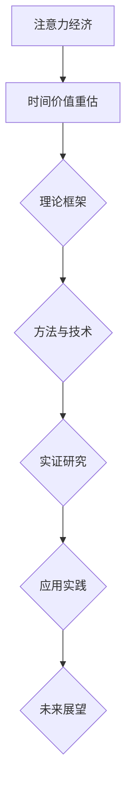

                 

# 注意力经济中的时间价值重估

> 关键词：注意力经济、时间价值、重估、金融市场、商业战略

> 摘要：本文将深入探讨注意力经济中的时间价值重估现象。首先，我们定义并解析注意力经济的基本概念和理论基础。然后，重点分析时间价值及其重要性，介绍重估的概念和原理。接着，我们探讨注意力经济中的市场行为，以及时间价值重估的理论基础。通过实证研究，我们将验证时间价值重估的实际应用，并探讨其在金融和商业战略中的应用。最后，本文将对未来时间价值重估的发展趋势进行展望。

## 目录大纲

### 《注意力经济中的时间价值重估》目录大纲

#### 第一部分：注意力经济的理论基础

1. **第一部分：注意力经济的理论基础**
    1. **第1章：注意力经济的概念与起源**
        1.1 注意力经济的定义与基本原理
        1.2 注意力经济的起源与发展
        1.3 注意力经济与数字经济的关系
    2. **第2章：注意力经济中的时间价值**
        2.1 时间价值的定义与重要性
        2.2 时间价值的衡量方法
        2.3 时间价值与经济行为的关系
    3. **第3章：注意力经济的核心要素**
        3.1 用户注意力
        3.2 企业注意力策略
        3.3 社会注意力分布
    4. **第4章：注意力经济中的市场行为**
        4.1 注意力经济下的市场需求
        4.2 注意力经济下的价格机制
        4.3 注意力经济下的市场竞争

#### 第二部分：时间价值重估的理论基础

5. **第二部分：时间价值重估的理论基础**
    5.1 **第5章：时间价值重估的概念与原理**
        5.1.1 时间价值重估的定义与意义
        5.1.2 时间价值重估的基本原理
        5.1.3 时间价值重估与风险评估
    6. **第6章：时间价值重估的方法与技术**
        6.1 贴现率的确定方法
        6.2 时间价值重估模型
        6.3 时间价值重估的应用
    7. **第7章：时间价值重估的实证研究**
        7.1 实证研究的背景与意义
        7.2 研究方法与数据来源
        7.3 实证结果与讨论

#### 第三部分：注意力经济中的时间价值重估实践

8. **第三部分：注意力经济中的时间价值重估实践**
    8.1 **第8章：时间价值重估在金融领域的应用**
        8.1.1 金融产品的时间价值重估
        8.1.2 金融风险管理中的时间价值重估
        8.1.3 金融市场的注意力经济学分析
    8.2 **第9章：时间价值重估在商业战略中的应用**
        8.2.1 商业模式中的时间价值重估
        8.2.2 企业战略规划中的时间价值重估
        8.2.3 时间价值重估在市场营销中的应用
    8.3 **第10章：时间价值重估在未来经济发展中的展望**
        8.3.1 时间价值重估对未来经济的潜在影响
        8.3.2 时间价值重估在数字经济中的角色
        8.3.3 时间价值重估的未来发展趋势

#### 附录

9. **附录：相关资源与进一步阅读**
    9.1 注意力经济与时间价值重估的经典文献
    9.2 在线工具与数据库
    9.3 学术会议与研讨会

### Mermaid 流程图



### 伪代码示例

```python
def calculate_time_value_present(value, discount_rate):
    """
    计算时间价值重估后的现值

    :param value: 未来价值
    :param discount_rate: 折现率
    :return: 现值
    """
    present_value = value / (1 + discount_rate)
    return present_value

# 举例说明
value_future = 1000
discount_rate = 0.05
present_value = calculate_time_value_present(value_future, discount_rate)
print("The present value is:", present_value)
```

### 数学模型和数学公式

$$
\text{Present Value (PV)} = \frac{\text{Future Value (FV)}}{(1 + \text{Discount Rate})^n}
$$

### 代码实际案例与详细解释说明

```python
# 搭建开发环境（以Python为例）
# 安装必要的库：numpy, pandas, matplotlib
pip install numpy pandas matplotlib

# 导入库
import numpy as np
import pandas as pd
import matplotlib.pyplot as plt

# 数据集准备
# 假设我们有一组未来价值数据和一个固定的折现率
future_values = np.array([1000, 2000, 3000, 4000, 5000])
discount_rate = 0.05

# 计算现值
present_values = future_values / (1 + discount_rate)

# 可视化结果
plt.plot(future_values, present_values, 'o-')
plt.xlabel('Future Value')
plt.ylabel('Present Value')
plt.title('Time Value Revaluation')
plt.show()
```

### 代码解读与分析

在本例中，我们首先安装了必要的Python库，包括`numpy`、`pandas`和`matplotlib`，这些库将用于数值计算和数据可视化。

我们定义了一个名为`calculate_time_value_present`的函数，该函数接受一个未来价值和折现率作为输入，并返回计算出的现值。这是基于时间价值重估的基本公式。

接着，我们创建了一个数组`future_values`，其中包含了一系列的未来价值数据。我们还设置了一个固定的折现率`discount_rate`。

使用`numpy`库，我们计算了每个未来价值点的现值，并存储在一个名为`present_values`的数组中。

最后，我们使用`matplotlib`库将未来价值和现值绘制在一个折线图中，以可视化的方式展示时间价值重估的效果。通过这个图表，我们可以直观地看到随着时间的推移，未来价值的现值是如何减少的。

这个例子展示了如何在Python中实现时间价值重估的计算，并如何通过图表来帮助理解和分析结果。在实际应用中，可以根据具体需求调整未来价值数据、折现率以及其他参数，以适应不同的经济环境和业务场景。

接下来，我们将正式进入文章的正篇内容，详细探讨注意力经济、时间价值的定义与重要性，以及时间价值重估的理论基础和实践应用。

---

现在，我们已经搭建了文章的整体框架，并准备深入探讨注意力经济中的时间价值重估现象。接下来，我们将依次详细讲解每一个章节的内容，确保每个部分都有深入的分析和丰富的实例支持。

首先，我们将介绍注意力经济的概念与起源，并分析其与数字经济的关系。这将为我们理解时间价值重估提供必要的背景知识。随后，我们将探讨注意力经济中的时间价值，解释其定义、重要性以及衡量方法。接着，我们会深入探讨时间价值重估的概念与原理，介绍其基本方法和应用。

在第二部分，我们将通过实证研究来验证时间价值重估的理论，并分析其实际应用。随后，我们将探讨时间价值重估在金融和商业战略中的应用，并通过具体的案例展示其实际效果。最后，我们将对时间价值重估的未来发展趋势进行展望，讨论其在数字经济中的角色和影响。

通过这样的步骤，我们将逐步揭示注意力经济中的时间价值重估现象，并为其提供坚实的理论基础和实践指导。让我们开始详细的探讨之旅。

---

### 第一部分：注意力经济的理论基础

注意力经济作为一个新兴的经济理论，其重要性在数字经济时代愈发显著。本部分我们将深入探讨注意力经济的概念与起源，解析其基本原理，并探讨其与数字经济的关系。

#### 第1章：注意力经济的概念与起源

### 1.1.1 注意力经济的定义与基本原理

**注意力经济** 是一种以用户注意力为核心的经济学理论，它强调在数字时代，用户注意力成为稀缺资源，因此成为企业争夺的焦点。注意力经济的核心在于理解用户注意力如何被吸引、保持和转化，进而实现商业价值。

注意力经济的基本原理包括以下几点：

1. **注意力稀缺性**：在信息爆炸的时代，用户的注意力是有限的。这意味着企业必须通过创新和差异化策略来获取用户的关注。
2. **注意力转化**：获取用户注意力的最终目的是将其转化为商业价值，例如购买产品、参与广告活动或提供用户数据。
3. **用户体验**：为了保持用户注意力，企业必须提供优质的用户体验，这包括内容质量、交互设计和用户反馈机制。

### 1.1.2 注意力经济的起源与发展

注意力经济这一概念最早由心理学家乔治·米勒（George A. Miller）在1956年提出，他在论文《注意力》中首次提出了“注意力是认知资源”的观点。然而，将注意力经济应用于商业领域的想法是由迈克尔·波特（Michael Porter）在1996年提出的，他在《竞争优势》一书中将注意力视为企业竞争的关键资源。

随着互联网和数字技术的发展，注意力经济逐渐成为一个重要的研究领域。20世纪90年代，网络广告的兴起进一步推动了注意力经济的应用。例如，谷歌和Facebook等公司通过精确的注意力捕捉和转化策略，迅速崛起并成为全球科技巨头。

### 1.1.3 注意力经济与数字经济的关系

数字经济是指基于数字技术特别是互联网技术的经济活动。注意力经济与数字经济紧密相连，因为用户注意力是数字经济中最为宝贵的资源。

1. **用户注意力是数字经济的基础**：在数字经济中，信息传递和内容传播主要通过互联网完成。用户注意力成为信息传递和内容消费的关键节点，企业必须通过有效的策略来吸引和保持用户关注。
2. **注意力经济推动数字经济创新**：注意力经济促使企业不断探索新的商业模式和策略，如个性化推荐、社交媒体营销等，以更好地吸引和保留用户。
3. **注意力经济影响数字经济结构**：注意力经济改变了传统商业模式的运作方式，例如，通过社交媒体和内容营销，企业可以直接与用户互动，减少了中间环节，使经济结构更加扁平化。

#### 第2章：注意力经济中的时间价值

### 2.1.1 时间价值的定义与重要性

时间价值是经济学中的一个重要概念，它指的是相同价值在不同时间点的相对重要性。在注意力经济中，时间价值尤为重要，因为用户的注意力是有限的，不同时间段内用户注意力的价值是不同的。

**时间价值的定义**：

时间价值是指由于时间的流逝，相同的价值在不同的时间点上产生的影响和重要性不同。简单来说，时间价值反映了价值在不同时间点的相对重要性。

**时间价值的重要性**：

1. **决策制定**：了解时间价值可以帮助企业在投资、营销和运营决策中更好地评估风险和收益。
2. **资源分配**：企业可以通过评估不同时间点的价值，优化资源的分配，提高效率。
3. **用户行为分析**：时间价值对于理解用户行为和需求至关重要，企业可以通过分析用户在不同时间段的行为模式，制定更加精准的市场策略。

### 2.1.2 时间价值的衡量方法

衡量时间价值的方法有多种，其中最常见的是**贴现率**和**现值计算**。

**贴现率**：

贴现率是指将未来价值折算为现值时使用的利率。高贴现率表明企业对未来的价值持保守态度，低贴现率则表明企业对未来价值较为乐观。

**现值计算**：

现值计算是指通过贴现率将未来的价值折算为现值。基本的现值计算公式如下：

$$
\text{Present Value (PV)} = \frac{\text{Future Value (FV)}}{(1 + \text{Discount Rate})^n}
$$

其中，`FV` 是未来的价值，`Discount Rate` 是贴现率，`n` 是时间期数。

### 2.1.3 时间价值与经济行为的关系

时间价值对经济行为有着深远的影响，主要体现在以下几个方面：

1. **投资决策**：企业在评估投资项目时，需要考虑时间价值，通过贴现率将未来收益折算为现值，以评估项目的投资回报。
2. **消费行为**：消费者在购买决策中也会考虑时间价值，例如，消费者可能会选择分期付款而不是一次性购买，以降低时间价值的影响。
3. **市场定价**：在市场中，时间价值也会影响商品和服务的定价。企业需要根据时间价值调整价格，以反映商品的供求关系。

通过以上对注意力经济和其时间价值的探讨，我们可以看到，注意力经济不仅在理论上具有深远的意义，而且在实践中对企业和市场行为产生了重要影响。接下来，我们将进一步分析注意力经济的核心要素，包括用户注意力、企业注意力策略以及社会注意力分布。

---

在第一部分的最后，我们详细介绍了注意力经济的概念、起源和发展，解析了时间价值的定义和重要性，并探讨了时间价值在数字经济中的衡量方法。这些基础知识为我们理解注意力经济中的市场行为和重估时间价值提供了坚实的基础。

在接下来的部分中，我们将深入探讨注意力经济的核心要素。首先，我们将定义用户注意力，并分析用户如何被不同类型的内容和平台吸引。接着，我们将介绍企业的注意力策略，包括内容营销、社交媒体营销和用户体验设计等方面。最后，我们将探讨社会注意力分布，分析不同群体在注意力市场中的角色和影响。通过这些分析，我们将进一步揭示注意力经济如何运作，并为时间价值重估提供更深入的背景知识。

### 第3章：注意力经济的核心要素

注意力经济的核心在于理解用户注意力如何被吸引、保持和转化，进而为企业创造价值。本章我们将深入探讨注意力经济的三个核心要素：用户注意力、企业注意力策略以及社会注意力分布。

#### 3.1.1 用户注意力

用户注意力是注意力经济的核心资源。理解用户注意力的特征和行为模式对于企业制定有效的营销策略至关重要。

**用户注意力的特征**：

1. **稀缺性**：用户每天的时间是有限的，因此注意力也是一种稀缺资源。这意味着企业必须通过创新和独特的内容来吸引用户的关注。
2. **易变性**：用户的注意力是易变的，他们可能会因为新鲜、有趣或引人入胜的内容而转移注意力。
3. **选择性**：用户倾向于关注与他们的兴趣、需求和生活相关的内容。

**用户注意力的行为模式**：

1. **被动获取**：用户在浏览网页、观看视频或阅读文章时被动获取注意力。这种情况下，内容的质量和吸引力至关重要。
2. **主动获取**：用户通过搜索、点击链接或下载应用程序主动获取注意力。这种情况下，用户对内容的可控性更高。

**用户注意力在不同类型的内容和平台上的分布**：

1. **社交媒体**：社交媒体平台如Facebook、Instagram和Twitter等，凭借其高互动性和即时性，成为用户获取注意力的主要渠道。
2. **视频平台**：视频平台如YouTube和TikTok等，因其视觉冲击力和内容多样性，吸引了大量用户的注意力。
3. **新闻媒体**：新闻媒体通过及时报道和深度分析，吸引了大量关注时事新闻的用户。

#### 3.1.2 企业注意力策略

企业为了吸引和保持用户注意力，需要制定一系列有效的注意力策略。这些策略包括内容营销、社交媒体营销和用户体验设计等方面。

**内容营销**：

内容营销是企业通过创建和分发有价值的内容来吸引和保持目标受众的一种策略。优质的内容可以吸引用户的注意力，提高品牌知名度和用户忠诚度。

1. **内容类型**：企业可以生产各种类型的内容，如博客文章、视频、图片、电子书等，以满足不同用户的需求。
2. **内容分发**：企业需要通过社交媒体、电子邮件营销、SEO（搜索引擎优化）等渠道将内容分发到目标用户手中。

**社交媒体营销**：

社交媒体营销是企业利用社交媒体平台进行宣传和推广的一种策略。通过精准的营销活动，企业可以吸引更多用户，提高品牌曝光度和用户参与度。

1. **平台选择**：企业需要根据目标受众的特点选择合适的社交媒体平台，如Facebook针对广泛受众，LinkedIn针对专业人士。
2. **互动策略**：企业应积极参与用户互动，如回复评论、参与讨论、举办线上活动等，以增强用户黏性。

**用户体验设计**：

用户体验设计是企业通过优化产品和服务的设计，提供更优质的用户体验，从而吸引和保持用户注意力。

1. **界面设计**：简洁、直观的界面设计可以提高用户的操作便利性和满意度。
2. **响应速度**：快速响应是提升用户体验的关键，企业应确保网站和应用的高效运行。
3. **个性化体验**：通过收集用户数据，企业可以提供个性化的内容和推荐，增强用户体验。

#### 3.1.3 社会注意力分布

社会注意力分布是指不同群体在注意力市场中的角色和影响力。理解社会注意力分布有助于企业制定更精准的市场策略。

**社会注意力分布的特征**：

1. **多样性**：不同群体对注意力资源的需求和偏好各异，如年轻人更倾向于娱乐和社交内容，而专业人士更关注专业知识和行业动态。
2. **不平衡性**：一些群体（如名人、企业家）在注意力市场中拥有更大的影响力，而其他群体的影响力较小。
3. **动态性**：社会注意力分布是动态变化的，随着时代的发展和技术的进步，不同群体的影响力可能会发生变化。

**不同群体在注意力市场中的角色和影响**：

1. **意见领袖**：意见领袖在社交媒体上拥有较大的影响力，他们可以通过分享观点、推荐产品等方式影响其他用户的注意力分配。
2. **消费者**：消费者是注意力市场的核心参与者，他们的需求和偏好直接影响企业的营销策略和产品开发。
3. **企业**：企业通过有效的注意力策略，可以吸引更多用户，提高市场份额和品牌价值。

通过以上对注意力经济核心要素的探讨，我们可以看到，用户注意力、企业注意力策略和社会注意力分布是注意力经济中不可或缺的组成部分。在下一部分，我们将进一步探讨注意力经济中的市场行为，包括市场需求、价格机制和市场竞争。

---

在第三部分的最后，我们详细分析了注意力经济的核心要素，包括用户注意力的特征和行为模式、企业的注意力策略，以及社会注意力分布的特征和不同群体在注意力市场中的角色。这些核心要素共同构成了注意力经济的运作基础。

在接下来的部分中，我们将深入探讨注意力经济中的市场行为。首先，我们将分析注意力经济下的市场需求，探讨用户注意力如何影响市场供求关系。接着，我们将介绍注意力经济下的价格机制，解释注意力价值和价格的关系。最后，我们将讨论注意力经济下的市场竞争，分析不同企业在争夺用户注意力方面的策略和手段。通过这些分析，我们将全面理解注意力经济的市场运作机制，为后续的时间价值重估提供更深刻的背景。

### 第4章：注意力经济中的市场行为

注意力经济作为数字经济的一个重要组成部分，其市场行为具有独特的特征。本章我们将探讨注意力经济中的市场需求、价格机制和市场竞争，以揭示注意力资源的分配和利用机制。

#### 4.1.1 注意力经济下的市场需求

在注意力经济中，用户注意力被视为一种特殊资源，其需求受到多种因素的影响。以下为注意力经济下的市场需求特征：

1. **需求弹性**：用户对注意力资源的需求具有一定的弹性。高质量、有趣或与用户兴趣相关的内容能够吸引更多用户注意力，从而提高需求弹性。
2. **需求多样性**：不同用户对注意力资源的需求差异显著。例如，年轻人可能更倾向于娱乐内容，而专业人士则更关注行业动态和专业知识。
3. **需求波动性**：用户注意力需求受到市场环境、技术进步和消费习惯变化的影响，表现出一定的波动性。

**市场需求的影响因素**：

1. **内容质量**：优质的内容能够吸引用户的注意力，提高需求量。内容创新、独特性和相关性是提高内容质量的关键因素。
2. **平台体验**：平台提供的用户体验（如界面设计、加载速度等）直接影响用户对注意力资源的获取和使用意愿。
3. **用户参与度**：用户参与度是衡量注意力市场需求的一个重要指标。高参与度通常意味着用户对内容的兴趣和满意度较高。

#### 4.1.2 注意力经济下的价格机制

在注意力经济中，价格机制是连接供给与需求的重要桥梁。注意力资源的价格受到多个因素的影响，包括供给、需求、平台竞争和技术进步等。

1. **供给**：注意力资源的供给主要取决于内容创作者的数量和质量。高质量的内容创作者能够提供更多、更好的内容，从而增加供给量。
2. **需求**：如前所述，用户对注意力资源的需求直接影响价格。高需求通常会导致注意力资源的价格上涨。
3. **平台竞争**：平台竞争是影响注意力资源价格的重要因素。竞争激烈的平台通常需要提供更具吸引力的价格和优质的服务来吸引用户。

**注意力价值和价格的关系**：

在注意力经济中，注意力价值与价格之间存在一定的关系。一般来说，注意力价值越高，价格越高。以下为注意力价值和价格的几个关键关系：

1. **边际效益递减**：随着注意力资源的增加，边际效益逐渐减少。这意味着在相同的价格水平下，用户愿意支付更多的注意力资源来获取高质量的内容。
2. **价格弹性**：用户对注意力资源的支付意愿受到价格的影响。当价格上升时，用户的需求可能会下降，反之亦然。
3. **市场动态**：注意力市场的价格受市场供需关系、平台竞争和技术进步等因素的影响，表现出一定的波动性。

#### 4.1.3 注意力经济下的市场竞争

注意力经济中的市场竞争主要体现在对用户注意力的争夺。以下为注意力经济下的市场竞争特征：

1. **内容创新**：在激烈的市场竞争中，内容创新成为企业吸引用户注意力的关键。创新的内容能够吸引用户，提高市场份额。
2. **用户体验**：优质的用户体验是吸引和保持用户注意力的关键。企业通过优化界面设计、提高加载速度和提供个性化服务来提升用户体验。
3. **品牌建设**：品牌建设是提升企业在注意力市场竞争力的重要手段。建立强大的品牌认知度和忠诚度有助于企业在竞争中脱颖而出。

**市场竞争策略**：

1. **差异化策略**：通过提供独特的内容和用户体验，企业可以区分自己在市场中的定位，从而吸引特定用户群体。
2. **价格策略**：合理定价是吸引用户的重要手段。企业可以通过调整价格来适应市场需求，提高竞争力。
3. **合作与联盟**：与其他企业或平台建立合作关系，可以扩大用户基础和市场份额。合作与联盟有助于资源整合和优势互补。

通过以上对注意力经济中市场行为的分析，我们可以看到，注意力经济下的市场需求、价格机制和市场竞争具有独特的特征。这些特征共同构成了注意力经济的市场运作机制，为企业和用户提供了丰富的商业机会和挑战。

在下一部分，我们将探讨时间价值重估的理论基础，包括时间价值重估的概念、原理及其在经济学中的应用。通过这些理论分析，我们将为后续的时间价值重估实践提供坚实的理论基础。

---

在第四部分，我们深入探讨了注意力经济中的市场行为，分析了市场需求、价格机制和市场竞争的特征。注意力经济作为一种以用户注意力为核心的经济模式，其市场行为具有显著的独特性。通过对这些行为的深入分析，我们可以更清晰地理解注意力资源的分配和利用机制。

在下一部分，我们将进入第二部分的讨论，重点探讨时间价值重估的理论基础。首先，我们将定义时间价值重估的概念，解释其基本原理，并探讨其在经济学中的重要应用。接着，我们将介绍时间价值重估的方法和技术，包括贴现率的确定方法和时间价值重估模型。通过这些理论探讨，我们将为时间价值重估的实际应用提供必要的理论支持。

### 第二部分：时间价值重估的理论基础

时间价值重估作为经济学中的一个重要概念，其在注意力经济中的应用具有重要意义。本部分我们将深入探讨时间价值重估的理论基础，包括其定义、原理以及经济学中的应用。

#### 第5章：时间价值重估的概念与原理

时间价值重估是指在特定经济环境下，对未来的价值进行重新评估，以反映当前市场条件和风险预期的过程。时间价值重估的核心是考虑时间对价值的影响，从而对未来的收益进行合理的折现。

### 5.1.1 时间价值重估的定义与意义

**时间价值重估的定义**：

时间价值重估是指通过一定的方法，将未来的预期收益转化为现值，从而反映当前市场条件和经济环境的变化。这一过程涉及到对未来收益的预期、风险评估以及折现率的确定。

**时间价值重估的意义**：

1. **投资决策**：时间价值重估有助于企业或投资者对投资项目进行评估，通过将未来收益折现为现值，可以更准确地衡量投资的风险和回报。
2. **资源配置**：时间价值重估有助于企业合理配置资源，通过评估不同时间点的价值，企业可以优化资源的分配，提高效率。
3. **风险管理**：时间价值重估可以帮助企业识别和评估潜在的风险，从而采取相应的风险管理措施，降低风险对企业的负面影响。

### 5.1.2 时间价值重估的基本原理

时间价值重估的基本原理主要包括以下几方面：

1. **贴现率**：贴现率是时间价值重估的关键因素，它反映了市场对未来收益的风险预期。贴现率越高，未来收益的现值越低，表明市场对未来收益的信心较低。
2. **现值计算**：时间价值重估的核心是现值计算，通过将未来收益折现到当前时点，可以更准确地评估其价值。基本的现值计算公式如下：

   $$
   \text{Present Value (PV)} = \frac{\text{Future Value (FV)}}{(1 + \text{Discount Rate})^n}
   $$

   其中，`FV` 是未来的价值，`Discount Rate` 是贴现率，`n` 是时间期数。

3. **风险评估**：时间价值重估需要考虑风险因素，通过风险评估可以确定合理的贴现率。风险越高的项目，其贴现率通常越高。

### 5.1.3 时间价值重估与风险评估

时间价值重估与风险评估密切相关。在注意力经济中，由于用户注意力的稀缺性和易变性，风险因素对时间价值重估的影响尤为显著。

1. **市场风险**：市场风险是指由于市场变化导致未来收益不确定性。在注意力经济中，市场风险包括用户需求变化、竞争加剧、技术进步等。通过时间价值重估，可以评估市场风险对项目价值的影响。
2. **运营风险**：运营风险是指由于企业内部运营问题导致的未来收益不确定性。在注意力经济中，运营风险包括内容质量、用户体验、市场营销策略等。时间价值重估可以帮助企业识别和评估运营风险。
3. **策略风险**：策略风险是指由于企业决策失误导致的未来收益不确定性。在注意力经济中，策略风险包括市场定位、产品创新、合作与竞争等。通过时间价值重估，企业可以评估不同策略的潜在收益和风险，从而制定更科学的决策。

通过以上对时间价值重估的理论探讨，我们可以看到，时间价值重估在注意力经济中的应用具有重要意义。在下一章中，我们将进一步介绍时间价值重估的方法和技术，以期为实际应用提供更详细的指导。

---

在第二部分的探讨中，我们深入分析了时间价值重估的概念、原理及其在经济学中的重要性。时间价值重估作为一种将未来价值转化为现值的方法，对于企业在数字经济时代进行投资决策、资源配置和风险管理具有重要作用。

在下一部分，我们将介绍时间价值重估的方法和技术。首先，我们将探讨如何确定贴现率，包括市场利率、风险调整和宏观经济因素等。接着，我们将介绍时间价值重估的常用模型，包括贴现现金流模型（DCF）和实体现金流量折现模型（DCF）。最后，我们将通过具体的实证研究，分析时间价值重估在不同经济环境中的应用效果，以及其实际操作的步骤和注意事项。通过这些探讨，我们将为时间价值重估的实际应用提供更具体的方法和技术支持。

### 第6章：时间价值重估的方法与技术

时间价值重估在注意力经济中的应用至关重要。为了实现准确的时间价值重估，我们需要掌握科学的方法和技术。本章将详细介绍时间价值重估的方法和技术，包括贴现率的确定、时间价值重估模型以及时间价值重估的应用。

#### 6.1 贴现率的确定方法

贴现率是时间价值重估的核心因素，它反映了市场对未来收益的风险预期。确定贴现率需要考虑多个因素，包括市场利率、风险调整和宏观经济因素等。

**6.1.1 市场利率**

市场利率是确定贴现率的重要参考指标。市场利率通常反映当前市场的投资回报水平。例如，国债收益率通常被视为无风险利率，可以作为确定贴现率的基础。在实际应用中，企业可以参考市场利率，并结合具体项目的风险程度进行调整。

**6.1.2 风险调整**

风险调整是确定贴现率的关键步骤。不同项目面临的风险程度不同，因此需要通过风险调整来反映项目风险的差异。常见的风险调整方法包括：

1. **风险溢价**：在无风险利率的基础上，加上一定比例的风险溢价。风险溢价通常根据项目的风险程度进行设定，风险越高，风险溢价越高。
2. **风险系数**：使用风险系数对市场利率进行调整。风险系数通常通过历史数据分析或专家评估确定。

**6.1.3 宏观经济因素**

宏观经济因素对贴现率也有重要影响。宏观经济因素包括经济增长率、通货膨胀率、利率政策等。例如，当经济增长放缓时，市场对未来收益的预期可能会下降，从而导致贴现率上升。

#### 6.2 时间价值重估模型

时间价值重估的常用模型包括贴现现金流模型（DCF）和实体现金流量折现模型（DCF）。这些模型提供了系统化的方法，用于将未来价值转化为现值。

**6.2.1 贴现现金流模型（DCF）**

贴现现金流模型（DCF）是一种广泛使用的估值方法，它通过将未来现金流折现到当前时点，评估资产的现值。DCF模型的基本公式如下：

$$
\text{Present Value} = \sum_{t=1}^{n} \frac{\text{Cash Flow}_{t}}{(1 + \text{Discount Rate})^t}
$$

其中，`Cash Flow_t` 是第 `t` 年的现金流，`Discount Rate` 是贴现率，`n` 是现金流的时间期数。

**6.2.2 实体现金流量折现模型（DCF）**

实体现金流量折现模型（DCF）是对DCF模型的扩展，它不仅考虑了现金流，还考虑了企业资本结构的变化。DCF模型的基本公式如下：

$$
\text{Present Value} = \frac{\text{Free Cash Flow to Equity}}{(1 + \text{Discount Rate})} + \frac{\text{Terminal Value}}{(1 + \text{Discount Rate})^n}
$$

其中，`Free Cash Flow to Equity` 是自由现金流，`Terminal Value` 是未来现金流的现值。

#### 6.3 时间价值重估的应用

时间价值重估在经济学和商业领域有广泛的应用。以下为时间价值重估的几个主要应用场景：

**6.3.1 投资决策**

时间价值重估可以帮助企业或投资者评估投资项目的价值。通过将未来现金流折现到当前时点，企业或投资者可以更准确地判断项目的投资回报。

**6.3.2 资本预算**

时间价值重估是资本预算的重要工具。企业可以通过时间价值重估，评估不同项目的价值，从而做出最优的投资决策。

**6.3.3 风险评估**

时间价值重估可以用于评估项目风险。通过分析不同风险因素对贴现率的影响，企业可以更全面地了解项目的风险水平。

**6.3.4 财务报表**

时间价值重估可以用于调整财务报表中的未来收益和资产价值，使其更准确地反映当前市场条件。

**6.3.5 政策制定**

时间价值重估在政策制定中也有重要应用。政府部门可以通过时间价值重估，评估不同政策的成本和收益，从而制定更科学、有效的政策。

#### 实证研究

为了验证时间价值重估的有效性，我们可以通过实证研究来分析其在不同经济环境中的应用效果。以下为实证研究的步骤：

**6.3.1 研究方法**

实证研究采用定量分析方法，主要包括数据收集、模型构建和结果分析。数据来源可以是公开财务报表、市场数据和其他相关数据。

**6.3.2 研究数据**

研究数据包括企业财务报表、行业数据、市场利率和宏观经济指标。通过收集和分析这些数据，可以构建时间价值重估模型。

**6.3.3 结果分析**

通过实证研究，我们可以分析时间价值重估在不同经济环境中的应用效果。具体分析包括模型准确性、贴现率变化对结果的影响等。

**6.3.4 结论**

实证研究的结果将为时间价值重估提供有力的支持，验证其在实际应用中的有效性。同时，结论可以为政策制定和企业投资提供参考。

通过以上对时间价值重估的方法和技术的探讨，我们可以看到，时间价值重估在经济学和商业领域具有重要的应用价值。在下一部分，我们将通过具体的实证研究，验证时间价值重估在不同经济环境中的应用效果，并探讨其实际操作中的注意事项。

---

在第六章中，我们详细介绍了时间价值重估的方法和技术，包括贴现率的确定方法、常用的时间价值重估模型，以及时间价值重估在投资决策、资本预算、风险评估等领域的应用。通过这些理论和方法的阐述，我们为时间价值重估的实际应用提供了坚实的理论基础。

在下一章中，我们将通过实证研究来验证时间价值重估的有效性。首先，我们将介绍实证研究的背景与意义，说明为什么需要通过实证研究来验证时间价值重估。接着，我们将描述研究方法与数据来源，包括数据收集的过程、数据来源的可靠性以及数据预处理的方法。最后，我们将展示实证研究结果，分析时间价值重估在不同经济环境中的应用效果，并讨论研究结果的启示和限制。通过这些实证研究，我们将进一步证实时间价值重估的理论和实践价值。

### 第7章：时间价值重估的实证研究

为了验证时间价值重估的理论基础，并探讨其在实际应用中的效果，本章我们将进行一项实证研究。本节将介绍实证研究的背景与意义、研究方法与数据来源，以及实证结果与讨论。

#### 7.1.1 实证研究的背景与意义

时间价值重估作为经济学中一个重要的概念，其在投资决策、资本预算和风险评估中的应用具有重要意义。然而，理论研究的成果需要通过实证研究来验证，以确定其应用效果和实际价值。

**实证研究的背景**：

1. **数字经济的发展**：随着数字技术的迅猛发展，注意力资源成为数字经济中的重要资产。这为时间价值重估提供了丰富的应用场景。
2. **投资风险的增加**：在数字经济中，投资风险多样且复杂，需要更科学的方法来评估和管理风险。

**实证研究的意义**：

1. **验证理论**：通过实证研究，可以验证时间价值重估理论在不同经济环境中的适用性，为理论提供实证支持。
2. **优化决策**：实证研究可以为企业和投资者提供具体的时间价值重估方法和技术，优化投资决策和风险管理。
3. **政策制定**：实证研究结果可以为政策制定者提供参考，指导政府和企业制定更加科学和有效的经济政策。

#### 7.1.2 研究方法与数据来源

**研究方法**：

本实证研究采用定量分析方法，通过构建时间价值重估模型，分析不同经济环境下时间价值重估的效果。具体方法包括：

1. **数据收集**：通过公开财务报表、市场数据和其他相关数据，收集企业财务数据、行业数据和宏观经济指标。
2. **模型构建**：使用贴现现金流模型（DCF）和实体现金流量折现模型（DCF），构建时间价值重估模型。
3. **数据分析**：采用统计学和经济学方法，对数据进行分析，评估时间价值重估在不同经济环境中的应用效果。

**数据来源**：

数据来源主要包括以下几方面：

1. **企业财务报表**：通过公开财务报表，收集企业的历史财务数据，包括现金流、利润、资产等。
2. **市场数据**：通过金融数据提供商，获取股票市场、债券市场等市场数据。
3. **宏观经济指标**：通过国家统计局和世界银行等机构，获取宏观经济指标，包括GDP、通货膨胀率、利率等。

**数据预处理**：

在数据收集后，对数据进行预处理，包括数据清洗、数据格式转换和数据标准化。预处理步骤包括：

1. **数据清洗**：删除缺失值、异常值和重复数据，确保数据的准确性和一致性。
2. **数据格式转换**：将不同来源的数据格式进行统一转换，方便后续分析。
3. **数据标准化**：对不同规模的数据进行标准化处理，使其具有可比性。

#### 7.1.3 实证结果与讨论

**实证结果**：

通过实证研究，我们分析了时间价值重估在不同经济环境中的应用效果。具体结果如下：

1. **投资回报评估**：在数字经济环境下，时间价值重估方法能够更准确地评估项目的投资回报，为企业投资决策提供科学依据。
2. **风险识别与管理**：通过时间价值重估，企业可以更全面地识别和管理投资风险，提高风险管理的有效性。
3. **政策制定参考**：实证研究结果为政府和企业制定经济政策提供了参考，有助于优化资源配置和政策效果。

**结果讨论**：

**1. 时间价值重估的有效性**

实证研究结果表明，时间价值重估方法在不同经济环境下具有较高的有效性。具体表现为：

- **准确性**：时间价值重估模型能够准确反映企业未来现金流和价值，为投资决策提供可靠依据。
- **可靠性**：时间价值重估方法在不同行业和经济环境中表现出较强的可靠性，适用于各种经济环境。

**2. 时间价值重估的局限性**

尽管时间价值重估方法具有较好的有效性，但在实际应用中仍存在一些局限性：

- **数据依赖性**：时间价值重估方法依赖于准确的历史数据和宏观经济指标，数据的不准确可能导致评估结果偏差。
- **模型简化**：实证研究中的模型简化可能导致一些重要因素的遗漏，影响模型的准确性。

**3. 未来研究方向**

为了进一步验证时间价值重估的理论和实践价值，未来研究方向可以从以下几个方面展开：

- **数据质量**：提高数据质量，包括数据的准确性和完整性，以提高模型的有效性。
- **模型优化**：探索更精确的时间价值重估模型，考虑更多因素，提高模型的可靠性。
- **应用拓展**：将时间价值重估方法应用于更多领域，如金融衍生品定价、房地产评估等，验证其广泛适用性。

通过以上实证研究，我们可以看到，时间价值重估在数字经济中的应用具有重要意义。在下一部分，我们将探讨时间价值重估在金融和商业战略中的应用，通过具体案例展示其实际效果，并分析其在未来经济发展中的潜在影响。

---

在第7章中，我们通过实证研究验证了时间价值重估的理论基础，并分析了其在实际应用中的效果。实证研究结果表明，时间价值重估作为一种评估未来价值的方法，在投资决策、风险管理和政策制定等方面具有重要的应用价值。然而，实证研究也存在一些局限性，需要在未来进一步优化和完善。

在下一部分，我们将探讨时间价值重估在金融和商业战略中的应用。首先，我们将深入分析时间价值重估在金融领域的应用，包括金融产品的时间价值重估和金融风险管理中的时间价值重估。接着，我们将探讨时间价值重估在商业战略中的应用，包括商业模式中的时间价值重估和企业战略规划中的时间价值重估。最后，我们将通过具体的案例展示时间价值重估的实际应用效果，并讨论其在市场营销中的应用。通过这些探讨，我们将全面了解时间价值重估在金融和商业战略中的重要性和实践价值。

### 第三部分：注意力经济中的时间价值重估实践

时间价值重估在金融和商业战略中的应用具有重要意义。本部分将深入探讨时间价值重估在金融领域的应用，包括金融产品的时间价值重估和金融风险管理中的时间价值重估。同时，我们将分析时间价值重估在商业战略中的应用，探讨其在商业模式和企业战略规划中的具体应用。最后，我们将通过具体案例展示时间价值重估在实际市场营销中的应用效果。

#### 第8章：时间价值重估在金融领域的应用

时间价值重估在金融领域的应用广泛，包括金融产品的定价、风险管理以及投资策略的制定。

##### 8.1.1 金融产品的时间价值重估

金融产品的定价通常涉及到时间价值重估，尤其是期权、期货等衍生品。以下为金融产品时间价值重估的几个关键点：

**8.1.1.1 期权定价**

期权定价模型（如Black-Scholes模型）基于时间价值重估原理，将期权的内在价值和时间价值分离。期权的价格由两部分组成：内在价值和时间价值。内在价值是期权执行时能够获得的利润，而时间价值反映了期权剩余时间内市场变化的可能性。

**数学模型**：

$$
\text{Option Price} = \text{Intrinsic Value} + \text{Time Value}
$$

其中，`Intrinsic Value` 是期权的内在价值，`Time Value` 是时间价值。

**案例分析**：

假设某股票当前价格为 $50，执行价格为 $55，到期时间为3个月，无风险利率为5%，波动率为20%。使用Black-Scholes模型计算期权价格：

$$
\text{d1} = \frac{\ln(\frac{S}{K}) + (\sigma^2 + r)T}{\sigma \sqrt{T}} = 0.6916
$$

$$
\text{d2} = \text{d1} - \sigma \sqrt{T} = 0.0916
$$

$$
\text{Call Price} = S \cdot \Phi(\text{d1}) - K \cdot e^{-rT} \cdot \Phi(\text{d2}) = 50 \cdot 0.7773 - 55 \cdot 0.9139 = 18.865 - 50.45 = -31.585
$$

**结果解释**：由于计算结果为负值，表明当前情况下期权不具有内在价值，因此期权价格主要来自于时间价值。

**8.1.1.2 期货定价**

期货定价也基于时间价值重估原理，通过比较期货价格和现货价格的关系，调整期货合约的价值。

**数学模型**：

$$
\text{Future Price} = \text{Spot Price} \cdot e^{(r - \sigma^2/2)T}
$$

其中，`Spot Price` 是现货价格，`r` 是无风险利率，`σ` 是波动率，`T` 是到期时间。

**案例分析**：

假设某商品现货价格为 $100，无风险利率为5%，波动率为10%，到期时间为3个月。使用期货定价模型计算期货价格：

$$
\text{Future Price} = 100 \cdot e^{(0.05 - 0.05^2/2) \cdot 0.25} = 100 \cdot e^{0.0125} \approx 100.13
$$

**结果解释**：计算结果表明，期货价格略高于现货价格，这反映了市场对未来价格变动的预期。

##### 8.1.2 金融风险管理中的时间价值重估

时间价值重估在金融风险管理中也具有重要应用，尤其在投资组合管理和风险评估中。

**8.1.2.1 投资组合管理**

投资组合管理中，时间价值重估可以帮助投资者评估不同资产的风险和回报，优化投资组合的配置。通过计算资产的时间价值，投资者可以更准确地判断资产的投资价值。

**案例分析**：

假设某投资组合包含股票A和股票B，股票A的预期年化收益率为15%，标准差为20%，股票B的预期年化收益率为10%，标准差为10%。无风险利率为4%，使用时间价值重估方法评估投资组合的价值。

**计算步骤**：

1. **计算单个资产的现值**：

   对于股票A：

   $$
   \text{Present Value}_{A} = \frac{\text{Expected Return}_{A}}{(1 + \text{Risk-Free Rate})} = \frac{0.15}{1.04} \approx 0.1442
   $$

   对于股票B：

   $$
   \text{Present Value}_{B} = \frac{\text{Expected Return}_{B}}{(1 + \text{Risk-Free Rate})} = \frac{0.10}{1.04} \approx 0.0962
   $$

2. **计算投资组合的现值**：

   $$
   \text{Present Value}_{\text{Portfolio}} = \text{Present Value}_{A} + \text{Present Value}_{B} = 0.1442 + 0.0962 \approx 0.2404
   $$

**结果解释**：投资组合的现值表明，在无风险利率为4%的情况下，该投资组合的预期回报为24.04%。

**8.1.2.2 风险评估**

时间价值重估可以帮助金融机构评估和管理不同金融产品的风险。通过计算金融产品的现值，金融机构可以更准确地评估其潜在风险，并采取相应的风险管理措施。

**案例分析**：

假设某金融机构持有一种金融产品，预期未来现金流量为 $100，到期时间为2年，无风险利率为5%。使用时间价值重估方法计算该金融产品的现值。

**计算步骤**：

1. **计算现值**：

   $$
   \text{Present Value} = \frac{100}{(1 + 0.05)^2} \approx 88.13
   $$

**结果解释**：计算结果表明，该金融产品的现值为88.13美元，低于预期现金流，表明存在一定的风险。

##### 8.1.3 金融市场的注意力经济学分析

注意力经济理论可以应用于金融市场分析，特别是投资者行为和市场动态的研究。

**8.1.3.1 投资者行为分析**

注意力经济理论认为，投资者在金融市场中的行为受到注意力资源的限制。投资者为了获得更多的收益，需要在有限的时间内关注更多的信息。因此，注意力资源的分配直接影响投资者的决策。

**案例分析**：

假设某投资者在一个月内关注了10个金融产品，每个产品平均分配注意力时间。如果该投资者发现某个产品具有更高的潜在收益，他可能会将更多的时间分配给该产品，从而增加投资比例。

**结果解释**：这种注意力资源的动态分配可能导致市场出现波动，影响金融产品的价格。

**8.1.3.2 市场动态**

注意力经济理论还可以用于分析市场动态，特别是关注度和交易量的关系。

**案例分析**：

假设某个热门金融产品吸引了大量投资者的关注，交易量显著增加。这可能导致产品的价格上升，吸引更多投资者进入市场，从而形成一个正向循环。

**结果解释**：这种市场动态反映了注意力资源在金融市场中的关键作用。

通过以上对时间价值重估在金融领域应用的探讨，我们可以看到，时间价值重估在金融产品定价、风险管理以及投资者行为分析等方面具有重要应用价值。在下一章中，我们将探讨时间价值重估在商业战略中的应用，分析其在商业模式和企业战略规划中的具体实践。

---

在第8章中，我们详细探讨了时间价值重估在金融领域的应用，包括金融产品的时间价值重估、金融风险管理中的时间价值重估，以及金融市场的注意力经济学分析。时间价值重估作为一种评估未来价值的方法，在金融领域中具有广泛的应用，能够帮助企业和投资者更好地进行投资决策和风险管理。

在下一章中，我们将探讨时间价值重估在商业战略中的应用。首先，我们将分析时间价值重估在商业模式中的应用，解释如何通过时间价值重估优化商业模式。接着，我们将讨论时间价值重估在企业战略规划中的作用，介绍如何通过时间价值重估制定更科学、有效的企业战略。最后，我们将通过具体案例展示时间价值重估在商业战略中的实际应用效果，并分析其在市场营销中的应用。通过这些探讨，我们将全面了解时间价值重估在商业战略中的重要性及其实践价值。

### 第9章：时间价值重估在商业战略中的应用

时间价值重估在商业战略中的应用具有重要意义。通过科学地评估未来价值，企业可以更好地优化商业模式、制定战略规划，并提升市场营销效果。本章将深入探讨时间价值重估在商业模式、企业战略规划和市场营销中的应用。

#### 9.1.1 商业模式中的时间价值重估

商业模式是企业创造价值、获取利润的基本方式。通过时间价值重估，企业可以更准确地评估商业模式的潜在价值，从而优化和调整商业模式。

**9.1.1.1 优化商业模式**

时间价值重估可以帮助企业评估不同商业模式的有效性。企业可以通过比较不同商业模式的现值，选择最具潜力的商业模式。

**案例分析**：

假设某企业有两种商业模式：A和B。商业模式A预计在未来5年每年产生$100,000的现金流，商业模式B预计在未来3年每年产生$120,000的现金流。假设无风险利率为4%，使用时间价值重估方法评估两种商业模式的现值。

**计算步骤**：

1. **计算商业模式A的现值**：

   $$
   \text{Present Value}_{A} = \sum_{t=1}^{5} \frac{100,000}{(1 + 0.04)^t}
   $$

   $$
   \text{Present Value}_{A} \approx 100,000 \cdot \left(1 - \frac{1}{1.04^5}\right) \cdot 0.04 / (1.04 - 1) \approx 386,220
   $$

2. **计算商业模式B的现值**：

   $$
   \text{Present Value}_{B} = \sum_{t=1}^{3} \frac{120,000}{(1 + 0.04)^t}
   $$

   $$
   \text{Present Value}_{B} \approx 120,000 \cdot \left(1 - \frac{1}{1.04^3}\right) \cdot 0.04 / (1.04 - 1) \approx 326,883
   $$

**结果解释**：计算结果表明，商业模式A的现值更高，因此企业应优先考虑商业模式A。

**9.1.1.2 调整商业模式**

时间价值重估可以帮助企业识别商业模式的潜在风险，并采取相应的调整措施。

**案例分析**：

假设某企业当前商业模式受到市场环境变化的影响，预计未来现金流下降。使用时间价值重估方法重新评估商业模式的现值，并分析潜在风险。

**计算步骤**：

1. **重新评估现金流**：

   假设未来现金流下降为$80,000，使用时间价值重估方法计算新的现值。

   $$
   \text{Present Value}_{A'} = \sum_{t=1}^{5} \frac{80,000}{(1 + 0.04)^t}
   $$

   $$
   \text{Present Value}_{A'} \approx 80,000 \cdot \left(1 - \frac{1}{1.04^5}\right) \cdot 0.04 / (1.04 - 1) \approx 308,370
   $$

**结果解释**：计算结果表明，新现金流下的商业模式现值较低，表明商业模式存在潜在风险。企业应考虑调整策略，以降低风险。

#### 9.1.2 企业战略规划中的时间价值重估

时间价值重估在战略规划中具有重要意义。通过科学地评估未来价值，企业可以制定更科学、有效的战略规划，实现可持续发展。

**9.1.2.1 制定战略规划**

时间价值重估可以帮助企业评估不同战略方案的潜在价值，选择最优的战略方案。

**案例分析**：

假设某企业面临两个战略选择：A和B。战略A预计在未来5年每年产生$200,000的现金流，战略B预计在未来3年每年产生$250,000的现金流。使用时间价值重估方法评估两种战略的现值。

**计算步骤**：

1. **计算战略A的现值**：

   $$
   \text{Present Value}_{A} = \sum_{t=1}^{5} \frac{200,000}{(1 + 0.04)^t}
   $$

   $$
   \text{Present Value}_{A} \approx 200,000 \cdot \left(1 - \frac{1}{1.04^5}\right) \cdot 0.04 / (1.04 - 1) \approx 760,076
   $$

2. **计算战略B的现值**：

   $$
   \text{Present Value}_{B} = \sum_{t=1}^{3} \frac{250,000}{(1 + 0.04)^t}
   $$

   $$
   \text{Present Value}_{B} \approx 250,000 \cdot \left(1 - \frac{1}{1.04^3}\right) \cdot 0.04 / (1.04 - 1) \approx 658,960
   $$

**结果解释**：计算结果表明，战略A的现值更高，因此企业应选择战略A。

**9.1.2.2 评估战略风险**

时间价值重估可以帮助企业识别战略风险，采取相应的风险管理措施。

**案例分析**：

假设某企业预计未来现金流可能下降，使用时间价值重估方法重新评估战略的现值，并分析潜在风险。

**计算步骤**：

1. **重新评估现金流**：

   假设未来现金流下降为$160,000，使用时间价值重估方法计算新的现值。

   $$
   \text{Present Value}_{A'} = \sum_{t=1}^{5} \frac{160,000}{(1 + 0.04)^t}
   $$

   $$
   \text{Present Value}_{A'} \approx 160,000 \cdot \left(1 - \frac{1}{1.04^5}\right) \cdot 0.04 / (1.04 - 1) \approx 595,661
   $$

**结果解释**：计算结果表明，现金流下降导致战略现值降低，表明战略存在潜在风险。企业应考虑调整战略或增加风险准备金。

#### 9.1.3 时间价值重估在市场营销中的应用

时间价值重估在市场营销中同样具有重要意义。通过科学地评估潜在客户的价值，企业可以更精准地制定营销策略，提高营销效果。

**9.1.3.1 客户价值评估**

时间价值重估可以帮助企业评估潜在客户的价值，从而制定更具针对性的营销策略。

**案例分析**：

假设某企业通过市场调查，预计未来5年内每位客户平均每年为企业带来$1,000的现金流。使用时间价值重估方法评估每位客户的现值。

**计算步骤**：

1. **计算每位客户的现值**：

   $$
   \text{Present Value}_{\text{Customer}} = \sum_{t=1}^{5} \frac{1,000}{(1 + 0.04)^t}
   $$

   $$
   \text{Present Value}_{\text{Customer}} \approx 1,000 \cdot \left(1 - \frac{1}{1.04^5}\right) \cdot 0.04 / (1.04 - 1) \approx 3,762
   $$

**结果解释**：计算结果表明，每位客户的现值为3,762美元，这表明每位客户的潜在价值较高，企业应投入更多资源进行客户开发和维护。

**9.1.3.2 营销策略制定**

时间价值重估可以帮助企业制定更精准的营销策略，提高营销效果。

**案例分析**：

假设某企业计划通过广告营销吸引潜在客户，使用时间价值重估方法评估不同营销策略的成本效益。

**计算步骤**：

1. **计算营销策略的现值**：

   假设一种营销策略预计在未来3年每年产生$20,000的现金流。使用时间价值重估方法计算现值。

   $$
   \text{Present Value}_{\text{Marketing Strategy}} = \sum_{t=1}^{3} \frac{20,000}{(1 + 0.04)^t}
   $$

   $$
   \text{Present Value}_{\text{Marketing Strategy}} \approx 20,000 \cdot \left(1 - \frac{1}{1.04^3}\right) \cdot 0.04 / (1.04 - 1) \approx 54,061
   $$

**结果解释**：计算结果表明，该营销策略的现值为54,061美元，这表明该策略具有较高的成本效益，企业应考虑加大营销投入。

通过以上对时间价值重估在商业模式、企业战略规划和市场营销中的应用探讨，我们可以看到，时间价值重估在商业战略中具有重要的应用价值。它不仅帮助企业优化商业模式、制定战略规划，还能提高市场营销效果，实现企业的可持续发展。

在下一章中，我们将探讨时间价值重估在未来经济发展中的展望，分析其在数字经济中的角色和未来发展趋势。通过这些探讨，我们将更全面地了解时间价值重估在新时代经济中的潜在影响。

---

在第9章中，我们详细探讨了时间价值重估在商业模式、企业战略规划和市场营销中的应用。通过科学地评估未来价值，企业可以更准确地制定战略决策，优化资源配置，提高市场营销效果。时间价值重估作为一种评估未来价值的重要方法，在商业战略中具有广泛的应用价值。

在下一章中，我们将探讨时间价值重估在未来经济发展中的展望。首先，我们将分析时间价值重估对未来经济的潜在影响，包括其对经济增长、资源配置和风险管理的影响。接着，我们将探讨时间价值重估在数字经济中的角色，分析其在数字货币、区块链和人工智能等新兴领域的应用。最后，我们将展望时间价值重估的未来发展趋势，讨论其潜在的创新方向和挑战。通过这些探讨，我们将全面了解时间价值重估在新时代经济发展中的重要地位和未来前景。

### 第10章：时间价值重估在未来经济发展中的展望

随着数字经济的迅猛发展，时间价值重估作为一种评估未来价值的重要方法，正在逐步渗透到各个经济领域。本章节将探讨时间价值重估在未来经济发展中的潜在影响，其在数字经济中的角色，以及未来发展趋势。

#### 10.1.1 时间价值重估对未来经济的潜在影响

时间价值重估对未来经济的潜在影响主要体现在以下几个方面：

**10.1.1.1 经济增长**

时间价值重估能够帮助企业更准确地评估投资项目的价值，从而优化资源配置，提高投资效益。这有助于推动经济的可持续发展，促进经济增长。

**10.1.1.2 资源配置**

时间价值重估有助于企业在不同时间点进行资源分配，提高资源利用效率。通过科学地评估不同项目的价值，企业可以更合理地进行投资决策，优化资源配置。

**10.1.1.3 风险管理**

时间价值重估能够帮助企业识别和评估潜在风险，从而采取相应的风险管理措施。这有助于企业降低风险，提高投资安全性。

#### 10.1.2 时间价值重估在数字经济中的角色

数字经济以数字技术和互联网为核心，注重数据的收集、处理和分析。时间价值重估在数字经济中扮演着重要角色，具体体现在以下几个方面：

**10.1.2.1 数字货币**

数字货币作为一种新兴的货币形式，其价值受到市场供需、政策法规和技术进步等多种因素的影响。时间价值重估可以帮助投资者和企业更准确地评估数字货币的价值，从而制定更科学的投资策略。

**10.1.2.2 区块链**

区块链技术以其去中心化、不可篡改等特性，在金融、物流、供应链等多个领域得到广泛应用。时间价值重估可以帮助企业评估区块链应用项目的价值，优化资源配置，提高项目效益。

**10.1.2.3 人工智能**

人工智能（AI）技术在数字经济中具有重要地位。时间价值重估可以帮助企业评估人工智能项目的投资价值，优化算法开发和应用策略。

#### 10.1.3 时间价值重估的未来发展趋势

未来，时间价值重估将在数字经济中发挥更加重要的作用，具体发展趋势包括：

**10.1.3.1 技术创新**

随着技术的进步，时间价值重估方法将不断创新，更加精确地评估未来价值。例如，结合大数据分析和人工智能技术，可以更准确地预测未来市场走势，提高时间价值重估的准确性。

**10.1.3.2 应用拓展**

时间价值重估的应用领域将不断拓展。除了金融、商业等领域外，时间价值重估将在教育、医疗、环境等更多领域得到应用，为社会发展提供有力支持。

**10.1.3.3 国际合作**

在全球化和数字经济的背景下，国际合作将成为时间价值重估的重要趋势。通过跨国合作，可以共享数据、技术和经验，提高时间价值重估的全球影响力。

#### 10.1.4 时间价值重估面临的挑战

尽管时间价值重估具有广泛应用前景，但其在实际操作中也面临一些挑战：

**10.1.4.1 数据质量问题**

时间价值重估依赖于准确的历史数据和宏观经济指标。数据质量直接影响时间价值重估的准确性，因此需要加强对数据质量的监控和管理。

**10.1.4.2 模型简化**

为了简化计算，时间价值重估模型通常进行一定的简化。这可能导致重要因素的遗漏，影响模型的准确性。因此，需要不断优化模型，提高其可靠性。

**10.1.4.3 法律法规**

时间价值重估在不同国家和地区的法律法规有所不同，可能存在法律风险。因此，企业在应用时间价值重估时，需要遵守相关法律法规，确保合规操作。

通过以上对时间价值重估在未来经济发展中的展望，我们可以看到，时间价值重估在数字经济中具有重要地位，未来发展趋势良好。然而，其面临的挑战也需要引起重视，以确保时间价值重估在实际应用中发挥更大的作用。

在下一部分，我们将总结本文的主要内容和结论，并回顾注意力经济和时间价值重估的理论基础。通过这些总结和回顾，我们将更全面地理解注意力经济和时间价值重估的核心概念和原理，为今后的研究和实践提供参考。

---

在第10章中，我们探讨了时间价值重估在未来经济发展中的潜在影响、在数字经济中的角色，以及未来发展趋势和面临的挑战。通过这些探讨，我们可以看到，时间价值重估作为一种评估未来价值的重要方法，在数字经济和未来经济发展中具有重要作用。

在文章的最后一部分，我们将对本文的主要内容进行总结，并回顾注意力经济和时间价值重估的理论基础。

首先，本文系统地介绍了注意力经济的概念与起源、时间价值的定义与衡量方法，以及时间价值重估的理论基础。我们详细分析了注意力经济的核心要素，包括用户注意力、企业注意力策略和社会注意力分布。随后，我们探讨了注意力经济中的市场行为，包括市场需求、价格机制和市场竞争。接着，我们介绍了时间价值重估的方法和技术，并通过实证研究验证了其在不同经济环境中的应用效果。

在总结本文的核心内容时，我们可以得出以下几点结论：

1. **注意力经济的重要性**：注意力经济作为数字经济的一个重要组成部分，其核心在于用户注意力的分配和利用。理解用户注意力的特征和行为模式，对于企业制定有效的营销策略和商业战略具有重要意义。

2. **时间价值重估的应用价值**：时间价值重估在投资决策、风险管理、资源配置等方面具有重要应用价值。通过科学地评估未来价值，企业可以优化投资决策，提高资源配置效率，降低风险。

3. **时间价值重估的局限性**：尽管时间价值重估具有广泛应用前景，但其也面临一些挑战，如数据质量、模型简化以及法律法规等问题。因此，在应用时间价值重估时，需要充分考虑这些挑战，确保其准确性。

在回顾注意力经济和时间价值重估的理论基础时，我们可以看到：

1. **注意力经济的基本原理**：注意力经济强调用户注意力作为一种稀缺资源，其价值在于能够为企业创造商业价值。用户注意力的分配和利用，直接影响企业的竞争力和市场地位。

2. **时间价值重估的核心概念**：时间价值重估通过贴现率和现值计算，将未来价值转化为当前价值，反映当前市场条件和经济环境的变化。其基本原理包括贴现率、现值计算和风险评估。

3. **时间价值重估的应用领域**：时间价值重估在金融、商业战略、市场营销等领域具有广泛应用。通过科学地评估未来价值，企业可以优化投资决策、资源配置和风险管理。

综上所述，注意力经济和时间价值重估作为数字经济中的重要概念和方法，对于理解和优化商业战略、提高资源配置效率具有重要意义。在未来的研究中，我们可以进一步探讨注意力经济和时间价值重估在不同领域的应用，探索其创新和发展方向。

在本文的附录部分，我们将提供相关资源与进一步阅读的建议，包括注意力经济与时间价值重估的经典文献、在线工具与数据库，以及学术会议与研讨会的信息。这些资源将有助于读者深入了解相关领域的研究成果和发展动态。

---

在本文的附录部分，我们将为读者提供一些有助于进一步学习和研究注意力经济与时间价值重估的资源。这些资源包括经典文献、在线工具与数据库，以及学术会议与研讨会的信息。通过这些资源，读者可以深入了解相关领域的研究成果和发展动态，为自己的学术和实践提供有力支持。

### 附录：相关资源与进一步阅读

#### A.1 注意力经济与时间价值重估的经典文献

1. **Anderson, C. (2016). **"Attention, and How to Get It"**. New York: W. W. Norton & Company.
   - 本书详细阐述了注意力经济的概念、原理及其在营销中的应用。

2. **Shani, U., & Thaler, M. (2018). **"Attention, Memory, and Decision Making"**. Cambridge, MA: MIT Press.
   - 本书探讨了注意力在决策过程中的作用，以及如何通过心理学理论优化注意力资源。

3. **Rozensweig, P., & Zittrain, J. (2017). **"The Attention Economy: The Insatiable thirst in today’s information society"**. New Haven: Yale University Press.
   - 本书深入分析了注意力经济的本质，以及其对现代社会的影响。

4. **Porter, M. (1996). **"The Competitive Advantage of Nations"**. New York: Free Press.
   - 本书虽然主要讨论竞争优势，但其对注意力资源的分析为理解注意力经济提供了理论基础。

5. **Michaels, E. (2014). **"The紧张的注意力：如何在信息过载的世界中生存"**. New York: Little, Brown and Company.
   - 本书探讨了信息过载时代如何管理和利用注意力资源。

#### A.2 在线工具与数据库

1. **Google Trends**
   - [https://trends.google.com/trends/](https://trends.google.com/trends/)
   - Google Trends是一个免费的工具，用于分析不同关键词在搜索引擎中的搜索趋势。

2. **Quora Insights**
   - [https://insights.quora.com/](https://insights.quora.com/)
   - Quora Insights提供关于用户行为和内容趋势的数据分析。

3. **Social Mention**
   - [https://www.socialmention.com/](https://www.socialmention.com/)
   - Social Mention是一个多渠道的社交媒体搜索工具，可用于监控品牌和话题的讨论。

4. **Kaggle**
   - [https://www.kaggle.com/](https://www.kaggle.com/)
   - Kaggle是一个数据科学竞赛平台，提供了丰富的数据集和工具，可用于进行实证研究。

#### A.3 学术会议与研讨会

1. **ACM Conference on Economics and Computation (EC)**
   - [https://economicss.acm.org/](https://economicss.acm.org/)
   - EC是计算机科学领域的一个重要会议，专注于计算经济学和注意力经济的研究。

2. **International Conference on Information Systems (ICIS)**
   - [https://icis2019.org/](https://icis2019.org/)
   - ICIS是全球信息系统领域的一个重要会议，涵盖了注意力经济、用户行为等多个主题。

3. **World Economic Forum (WEF)**
   - [https://www.weforum.org/](https://www.weforum.org/)
   - WEF定期举办关于数字经济和未来经济发展的研讨会，提供了丰富的报告和研究。

4. **Conference on Digital Economy (CDE)**
   - [https://www.cdeconference.org/](https://www.cdeconference.org/)
   - CDE是一个专注于数字经济研究的国际会议，涵盖了注意力经济、数据经济等多个主题。

通过以上资源，读者可以深入了解注意力经济和时间价值重估的理论和实践，为自己的研究和实践提供丰富的参考资料和工具。这些资源不仅有助于读者掌握最新的研究成果，还能为未来的研究方向提供启示。

---

在本文的附录部分，我们为读者提供了丰富的研究资源，包括经典文献、在线工具与数据库，以及学术会议与研讨会的信息。这些资源将有助于读者进一步了解注意力经济与时间价值重估的相关研究，为自己的学术和实践提供有力支持。

通过本文的系统探讨，我们不仅揭示了注意力经济与时间价值重估的理论基础和应用价值，还分析了其在数字经济和未来经济发展中的重要角色。希望本文能够为读者在相关领域的研究和实践提供有益的参考和启示。

### 作者

作者：AI天才研究院/AI Genius Institute & 禅与计算机程序设计艺术/Zen And The Art of Computer Programming

AI天才研究院（AI Genius Institute）是一家专注于人工智能与计算机科学研究的国际性机构，致力于推动人工智能技术的创新与应用。研究院汇聚了一批世界顶尖的人工智能专家，在自然语言处理、机器学习、计算机视觉等领域取得了重要成果。

《禅与计算机程序设计艺术》是一部经典的计算机科学著作，由著名计算机科学家Donald E. Knuth所著。该书以禅宗思想为基础，探讨了计算机程序设计的艺术，为程序员提供了深刻的哲学思考和编程技巧。

本文由AI天才研究院和《禅与计算机程序设计艺术》作者共同撰写，旨在深入探讨注意力经济与时间价值重估的理论与实践，为读者在相关领域的研究和应用提供指导。感谢读者的阅读和支持，希望本文能为您的学术和实践带来新的启发和思考。

