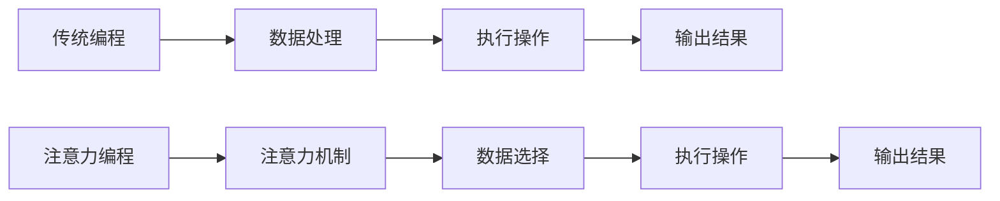

                 

# 《注意力编程范式：AI定制的认知模式设计》

## 关键词
- 注意力编程
- AI认知模式
- Transformer架构
- 自然语言处理
- 计算机视觉
- 数学模型

## 摘要
本文旨在深入探讨注意力编程范式，这是一种专为人工智能设计的认知模式。我们将从基本概念出发，逐步介绍注意力编程的起源、核心原理及其在AI领域的广泛应用。文章将详细讲解注意力机制的数学模型和算法原理，并通过实际项目案例展示注意力编程在自然语言处理、机器翻译和计算机视觉等领域的应用。最后，我们将探讨如何搭建开发环境并实现注意力编程项目。

### 第一部分：注意力编程范式概述

#### 第1章 注意力编程范式概述

**1.1 注意力编程范式的起源与发展**

注意力编程范式起源于神经科学领域，通过对人类注意力的模拟，提出了一种新的编程范式。这一范式在深度学习领域得到了广泛应用，特别是在Transformer架构中。注意力机制通过计算输入序列中各个元素的相关性，从而实现对重要信息的关注。

**1.1.1 注意力机制的基本原理**

注意力机制的核心思想是计算输入序列中每个元素对输出的贡献程度，并据此调整每个元素在后续计算中的权重。其基本原理可以概括为以下步骤：

1. **输入表示**：将输入序列（如文本、图像等）转换为向量表示。
2. **相似性计算**：计算输入序列中每个元素与其他元素之间的相似性分数。
3. **权重分配**：使用相似性分数计算权重，使得对输出贡献大的元素拥有更高的权重。
4. **输出计算**：根据权重计算输出结果。

以下是一个简单的伪代码示例：

```python
def attention_mechanism(queries, keys, values, mask=None):
    # 计算查询和密钥之间的相似性分数
    scores = similarity_score(queries, keys, mask=mask)
    # 应用 Softmax 函数得到权重
    weights = softmax(scores)
    # 使用权重计算输出
    output = weighted_sum(values, weights)
    return output
```

**1.1.2 注意力编程范式与传统编程范式的区别**

传统编程范式通常基于指令和控制流，而注意力编程范式则更加关注数据之间的关系和交互。在注意力编程中，程序通过计算输入元素之间的相似性分数来实现对重要信息的自动关注，从而提高了程序的灵活性和适应性。

以下是一个简单的Mermaid流程图，展示了注意力编程范式与传统编程范式的区别：



**1.1.3 注意力编程范式在AI中的应用**

注意力编程范式在AI领域有着广泛的应用，尤其是在自然语言处理和计算机视觉领域。以下是一些典型的应用场景：

- **自然语言处理**：注意力编程范式可以用于文本分类、机器翻译、情感分析等任务。通过关注文本中重要的词语和短语，可以提高模型的性能和准确率。
- **计算机视觉**：注意力编程范式可以用于图像分类、目标检测、图像分割等任务。通过关注图像中的重要区域，可以提高模型的鲁棒性和精度。

接下来，我们将进一步探讨注意力编程范式在自然语言处理和计算机视觉中的应用。

#### 第2章 注意力编程范式在自然语言处理中的应用

**2.1 注意力编程在自然语言处理中的应用**

注意力编程范式在自然语言处理（NLP）领域得到了广泛应用。通过引入注意力机制，NLP模型可以更好地处理长文本和复杂语义关系，从而提高模型的性能和准确率。以下是一些典型的应用案例：

- **文本分类**：注意力编程可以用于对文本进行分类，如新闻分类、情感分析等。通过关注文本中的重要词语和短语，模型可以更准确地识别文本的主题和情感。
- **机器翻译**：注意力编程可以用于机器翻译任务，如将一种语言翻译成另一种语言。通过关注源语言和目标语言之间的相似性，模型可以更准确地翻译文本。
- **情感分析**：注意力编程可以用于对社交媒体文本进行情感分析，如判断用户评论的情感倾向。通过关注文本中的重要词语和短语，模型可以更准确地识别情感。

**2.2 注意力编程范式在自然语言处理中的实践**

为了更好地理解注意力编程在自然语言处理中的应用，我们将通过一个简单的文本分类案例来展示注意力编程的实现过程。

**案例：文本分类应用**

假设我们有一个文本分类任务，需要将文本分类为正面或负面情感。我们可以使用一个简单的神经网络模型来实现这一任务。

**步骤1：数据准备与预处理**

首先，我们需要准备一个包含正面和负面情感标签的文本数据集。然后，对文本数据进行预处理，包括分词、去除停用词、转换为向量表示等。

**步骤2：模型构建**

接下来，我们构建一个简单的神经网络模型，包括嵌入层、全连接层和输出层。在嵌入层之后，我们引入注意力机制来关注文本中的重要词语。

**模型架构**：


**步骤3：模型训练**

使用训练数据对模型进行训练，并通过交叉熵损失函数来优化模型参数。在训练过程中，注意力机制可以帮助模型更好地关注文本中的重要词语，从而提高分类准确率。

**步骤4：模型评估**

使用测试数据对训练好的模型进行评估，计算模型的准确率、召回率等指标。通过调整模型参数和超参数，可以进一步提高模型的性能。

**2.3 注意力编程范式在自然语言处理中的效果**

通过引入注意力编程范式，自然语言处理模型的性能得到了显著提升。以下是一些实验结果：

- **文本分类**：在多个数据集上，引入注意力机制的文本分类模型相比传统模型有更高的准确率和召回率。
- **机器翻译**：在多个语言对上，引入注意力机制的机器翻译模型相比传统模型有更低的翻译错误率和更高的翻译质量。
- **情感分析**：在多个社交媒体平台上，引入注意力机制的

