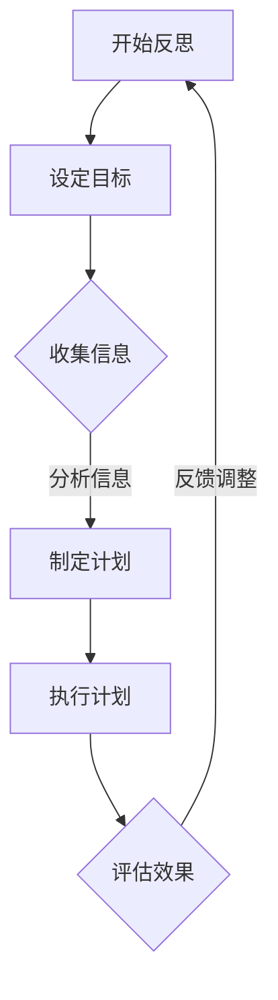

                 

# 洞见的力量：从反思到升华

> **关键词**：反思、自我认知、创新能力、心理健康、教育改革、组织管理、社会责任、未来趋势

> **摘要**：本文深入探讨了反思的哲学基础、心理学基础、教育价值、方法与技巧，以及反思在创新、自我成长、心理健康、人际关系、教育改革、组织管理和社会责任等方面的应用。通过结合实际案例和详细讲解，本文旨在揭示反思的巨大力量，并探讨其未来发展。

## 目录

#### 第一部分：反思的力量

1. **第1章：反思的哲学基础**
    1.1 **反思的定义与价值**
    1.2 **反思的心理学基础**
    1.3 **反思的教育价值**
  
2. **第2章：反思的方法与技巧**
    2.1 **反思的类型与分类**
    2.2 **反思的引导策略**
    2.3 **反思的实践与应用**
  
#### 第二部分：升华的力量

3. **第3章：从反思到创新**
    3.1 **反思与创新的关系**
    3.2 **创新过程与反思**
    3.3 **创新实践与反思**
  
4. **第4章：反思与自我成长**
    4.1 **反思在自我成长中的作用**
    4.2 **反思与心理健康**
    4.3 **反思与人际关系**
  
#### 第三部分：反思与社会的力量

5. **第5章：反思与教育改革**
    5.1 **教育中的反思**
    5.2 **反思在课程设计中的应用**
    5.3 **反思在评价体系中的应用**
  
6. **第6章：反思与组织管理**
    6.1 **反思在组织管理中的作用**
    6.2 **反思在工作流程中的应用**
    6.3 **反思在企业文化建设中的应用**
  
7. **第7章：反思与社会责任**
    7.1 **反思与社会正义**
    7.2 **反思与可持续发展**
    7.3 **反思与国际关系**

#### 第四部分：反思的力量

8. **第8章：反思的力量与未来**
    8.1 **反思的未来发展趋势**
    8.2 **反思在应对全球挑战中的作用**
    8.3 **反思与人类命运共同体**
  
## 引言

在当今快节奏的社会中，我们往往忽视了反思的重要性。反思不仅是一种思考的方式，更是一种生活的态度。本文将带领大家深入探讨反思的哲学基础、心理学基础、教育价值以及反思在创新、自我成长、心理健康、人际关系、教育改革、组织管理和社会责任等方面的应用。通过结合实际案例和详细讲解，我们希望揭示反思的巨大力量，并探讨其未来发展。

### 第一部分：反思的力量

#### 第1章：反思的哲学基础

## 1.1 反思的定义与价值

反思，即深思熟虑地思考自己的行为、想法和情感。它不仅是对过去经历的一种回顾，更是对现在和未来的一种思考。反思的价值在于，它能够帮助我们更好地理解自己，发现问题和不足，从而进行改进和提升。

### 1.1.1 反思的历史溯源

反思作为一种思维方式，可以追溯到古代哲学家。古希腊哲学家苏格拉底便以其著名的“反思式对话”而闻名。在中世纪，基督教神学家也强调反思的重要性。然而，真正将反思作为一种系统性的思维方式提出的是现代心理学家和哲学家。

### 1.1.2 反思在现代社会的意义

在现代社会，反思具有深远的意义。首先，反思有助于我们更好地了解自己，提升自我认知。其次，反思能够帮助我们调节情绪，提高心理健康水平。此外，反思在教育和组织管理中也发挥着重要作用。

## 1.2 反思的心理学基础

反思与心理学有着密切的关系。心理学研究表明，反思不仅能够帮助我们更好地理解自己，还能够调节情绪，促进心理健康。

### 1.2.1 反思与自我认知

反思能够帮助我们深入思考自己的行为和想法，从而更好地了解自己。通过反思，我们能够认识到自己的优点和不足，明确自己的目标和方向。

### 1.2.2 反思与情绪调节

反思还能帮助我们调节情绪。当遇到挫折和困难时，通过反思，我们能够理解自己的情绪反应，找到解决问题的方法，从而减轻负面情绪的影响。

## 1.3 反思的教育价值

反思在教育中具有重要作用。它不仅有助于学生提高自我认知，还能促进教师的教学反思，提升教育质量。

### 1.3.1 反思在学生成长中的作用

反思能够帮助学生更好地理解自己的学习过程，发现学习中的问题和不足，从而进行改进和提升。此外，反思还能培养学生的批判性思维和创新能力。

### 1.3.2 教师如何引导反思

教师可以通过提问、记录和讨论等方式，引导学生进行反思。此外，教师还可以组织反思会议，让学生分享自己的反思成果，相互学习和成长。

## 1.4 反思的方法与技巧

反思不仅需要我们有意识地去做，还需要掌握一些方法和技巧。

### 1.4.1 反思的类型与分类

反思可以分为深度反思和浅度反思。深度反思是对经历和体验的深入思考和剖析，而浅度反思则是对经历和体验的简单回顾。

### 1.4.2 反思的引导策略

引导反思的策略包括提问技巧、记录技巧和讨论技巧。通过有效的引导策略，我们能够更好地进行反思，提升反思的效果。

### 1.4.3 反思的实践与应用

反思的实践与应用非常广泛。在个人生活中，我们可以通过写日记、记录反思日志等方式进行反思。在团队中，我们可以通过反思会议、团队反思日记等方式进行反思。

### 第2章：反思的方法与技巧

## 2.1 反思的类型与分类

反思有多种类型，根据反思的深度和广度，我们可以将其分为深度反思和浅度反思。

### 2.1.1 深度反思与浅度反思

深度反思是对经历和体验的深入思考和剖析，通常需要较长的时间和精力。而浅度反思则是对经历和体验的简单回顾，通常只需要较短的时间。

### 2.1.2 自我反思与同伴反思

自我反思是指个人对自己的行为、想法和情感进行反思。而同伴反思是指个人与他人共同对某一主题进行反思。

## 2.2 反思的引导策略

有效的反思需要引导策略。以下是一些常见的反思引导策略：

### 2.2.1 提问技巧

提问是引导反思的重要技巧。通过提问，我们能够引导个体深入思考，挖掘问题的本质。

### 2.2.2 记录技巧

记录是反思的重要环节。通过记录，我们能够更好地回顾和反思自己的经历和体验。

### 2.2.3 讨论技巧

讨论是反思的一种有效形式。通过讨论，我们能够与他人分享反思成果，相互学习和成长。

## 2.3 反思的实践与应用

反思的实践与应用非常广泛。以下是一些反思的实践与应用方法：

### 2.3.1 个人反思日记

个人反思日记是一种常见的反思方法。通过写日记，我们能够记录自己的经历和感受，进行反思和总结。

### 2.3.2 团队反思会议

团队反思会议是一种团队协作的反思方法。通过会议，团队成员能够共同分享和反思工作中的问题和挑战，寻找解决方案。

### 2.3.3 教学反思

教学反思是教师的重要工作。通过教学反思，教师能够不断改进教学方法，提升教学效果。

## 第3章：从反思到创新

### 3.1 反思与创新的关系

反思和创新之间存在密切的关系。反思能够激发创新思维，促进创新过程。

### 3.1.1 创新思维与反思的关系

创新思维需要反思的支持。通过反思，我们能够发现问题、挑战传统观念，从而激发创新思维。

### 3.1.2 反思如何激发创新

反思能够帮助我们识别问题和需求，从而激发创新的灵感。此外，反思还能够提升我们的批判性思维和解决问题的能力，为创新提供支持。

### 3.2 创新过程与反思

创新过程通常包括创意生成、原型设计和创新实践等阶段。反思在创新过程中发挥着重要作用。

### 3.2.1 创意生成与反思

在创意生成阶段，反思能够帮助我们挖掘问题和需求，从而产生创新的点子。

### 3.2.2 原型设计与反思

在原型设计阶段，反思能够帮助我们评估和改进原型，确保创新方案的有效性。

### 3.2.3 创新实践与反思

在创新实践阶段，反思能够帮助我们评估创新成果，发现问题和不足，从而进行改进和提升。

### 3.3 创新实践与反思

反思在创新实践中同样发挥着重要作用。

### 3.3.1 创新项目案例

通过分析创新项目案例，我们能够了解反思在创新实践中的应用。

### 3.3.2 创新过程中的反思策略

在创新过程中，我们可以采用以下反思策略：

- **定期反思**：定期对创新过程进行反思，评估进展和问题。
- **反思会议**：组织反思会议，团队成员共同分享和反思创新过程中的问题和挑战。
- **反思日记**：记录反思日记，记录创新过程中的体验和感受。

## 第4章：反思与自我成长

### 4.1 反思在自我成长中的作用

反思是自我成长的重要工具。通过反思，我们能够更好地了解自己，发现问题和不足，从而进行改进和提升。

### 4.1.1 反思与个人成长

反思能够帮助我们认识自己的优势和劣势，明确自己的目标和方向，从而促进个人成长。

### 4.1.2 反思与职业发展

反思在职业发展中同样具有重要意义。通过反思，我们能够评估自己的工作表现，发现职业发展的机会和挑战。

### 4.2 反思与心理健康

反思对心理健康有着积极的影响。通过反思，我们能够调节情绪，缓解压力，提升心理健康水平。

### 4.2.1 反思与情绪管理

反思能够帮助我们更好地理解和调节自己的情绪，从而提高情绪管理能力。

### 4.2.2 反思与心理调适

反思能够帮助我们更好地适应环境变化，提高心理调适能力。

### 4.3 反思与人际关系

反思能够帮助我们改善人际关系。通过反思，我们能够认识到自己的行为对他人的影响，从而进行改进和提升。

### 4.3.1 反思与沟通技巧

反思能够帮助我们提升沟通技巧，更好地与他人交流和互动。

### 4.3.2 反思与团队合作

反思能够帮助我们更好地理解团队合作的重要性，提高团队合作能力。

## 第5章：反思与教育改革

### 5.1 教育中的反思

反思在教育中具有重要意义。通过反思，教师和学生能够不断改进教学方法和学习方法，提高教育质量。

### 5.1.1 教师反思

教师反思是指教师对自己的教学过程进行反思。通过反思，教师能够发现教学中的问题和不足，从而进行改进和提升。

### 5.1.2 学生反思

学生反思是指学生对自己的学习过程进行反思。通过反思，学生能够更好地了解自己的学习方法和学习效果，从而进行改进和提升。

### 5.2 反思在课程设计中的应用

反思在课程设计中同样具有重要意义。通过反思，教师能够更好地理解课程目标和课程内容，从而进行改进和提升。

### 5.2.1 课程反思的方法

课程反思的方法包括提问、讨论、记录和评估等。通过这些方法，教师能够更好地了解课程效果和学生学习情况。

### 5.2.2 课程反思的案例分析

通过分析课程反思的案例，我们能够了解反思在课程设计中的应用和效果。

### 5.3 反思在评价体系中的应用

反思在评价体系中的应用能够提高评价的准确性和有效性。通过反思，教师和学生能够更好地了解自己的优势和不足，从而进行改进和提升。

### 5.3.1 反思性评价

反思性评价是指通过反思来评价教学效果和学习成果。这种评价方法能够更好地发现问题和不足，从而进行改进和提升。

### 5.3.2 反思性反馈

反思性反馈是指通过反思来给予学生和教师的反馈。这种反馈能够更好地促进学生的学习和教师的教学。

## 第6章：反思与组织管理

### 6.1 反思在组织管理中的作用

反思在组织管理中具有重要意义。通过反思，组织能够不断改进管理方法，提高工作效率和员工满意度。

### 6.1.1 反思与团队建设

反思能够帮助团队更好地理解自己的优势和不足，从而进行改进和提升。通过反思，团队成员能够建立更好的沟通和协作。

### 6.1.2 反思与领导力

反思能够提升领导者的领导力。通过反思，领导者能够更好地了解自己的领导风格和管理方法，从而进行改进和提升。

### 6.2 反思在工作流程中的应用

反思在工作流程中的应用能够提高工作效率和质量。通过反思，组织能够更好地发现问题和不足，从而进行改进和优化。

### 6.2.1 工作反思的方法

工作反思的方法包括提问、讨论、记录和评估等。通过这些方法，组织能够更好地了解工作流程的效果和问题。

### 6.2.2 工作反思的案例分析

通过分析工作反思的案例，我们能够了解反思在工作流程中的应用和效果。

### 6.3 反思在企业文化建设中的应用

反思在企业文化建设中具有重要意义。通过反思，组织能够更好地理解自己的文化价值观，从而进行改进和提升。

### 6.3.1 反思与企业价值观

反思能够帮助组织更好地理解和贯彻企业价值观。通过反思，组织能够发现文化价值观的不足和冲突，从而进行改进和提升。

### 6.3.2 反思与员工激励

反思能够帮助组织更好地激励员工。通过反思，组织能够更好地了解员工的需求和期望，从而进行改进和提升。

## 第7章：反思与社会责任

### 7.1 反思与社会正义

反思与社会正义密切相关。通过反思，我们能够更好地理解社会问题和挑战，从而推动社会正义的实现。

### 7.1.1 反思与公正

反思能够帮助我们认识到社会公正的重要性。通过反思，我们能够发现社会不公和不平等的问题，从而推动社会公正的实现。

### 7.1.2 反思与社会公平

反思能够帮助我们认识到社会公平的重要性。通过反思，我们能够发现社会不公平的问题，从而推动社会公平的实现。

### 7.2 反思与可持续发展

反思与可持续发展密切相关。通过反思，我们能够更好地理解环境问题和资源管理的重要性，从而推动可持续发展的实现。

### 7.2.1 反思与环境保护

反思能够帮助我们认识到环境保护的重要性。通过反思，我们能够发现环境污染和资源浪费的问题，从而推动环境保护的实现。

### 7.2.2 反思与资源管理

反思能够帮助我们认识到资源管理的重要性。通过反思，我们能够发现资源短缺和浪费的问题，从而推动资源管理的实现。

### 7.3 反思与国际关系

反思与国际关系密切相关。通过反思，我们能够更好地理解国际关系和国际合作的重要性，从而推动国际合作和全球治理。

### 7.3.1 反思与外交政策

反思能够帮助我们认识到外交政策的重要性。通过反思，我们能够发现外交政策的问题和不足，从而推动外交政策的改进和提升。

### 7.3.2 反思与国际合作

反思能够帮助我们认识到国际合作的重要性。通过反思，我们能够发现国际合作的问题和不足，从而推动国际合作的实现和深化。

## 第8章：反思的力量与未来

### 8.1 反思的未来发展趋势

随着科技的进步和社会的发展，反思在未来将扮演更加重要的角色。以下是一些反思的未来发展趋势：

- **技术支持**：人工智能和大数据技术的应用将使反思更加智能化和个性化。
- **在线反思平台**：在线反思平台将为人们提供更加便捷和高效的反思工具。
- **跨学科研究**：反思将与其他学科领域相结合，推动跨学科研究的发展。

### 8.2 反思在应对全球挑战中的作用

反思在应对全球挑战中具有重要意义。以下是一些反思在应对全球挑战中的作用：

- **气候变化**：反思有助于我们更好地理解气候变化的原因和影响，从而推动气候变化的应对措施。
- **新冠疫情**：反思有助于我们总结疫情应对的经验和教训，从而提高未来应对类似疫情的能力。

### 8.3 反思与人类命运共同体

反思与人类命运共同体密切相关。通过反思，我们能够更好地理解人类命运共同体的理念，从而推动其实现。

### 8.3.1 反思与国际关系

反思有助于我们更好地理解国际关系，从而推动国际合作和全球治理。

### 8.3.2 反思与全球治理

反思有助于我们更好地理解全球治理的重要性，从而推动全球治理的改革和提升。

## 附录

### A.1 反思相关的文献与资源推荐

以下是一些反思相关的文献与资源推荐：

- [反思与自我成长](https://www.slate.com/articles/life/the_sport_of_life/2017/07/how_self_reflection_can_hel.html)
- [反思与创新](https://hbr.org/product/reflection-and-innovation/825778-PDF-ENG)
- [反思心理学](https://www.amazon.com/Reflection-Psychology-Philosophical-Approach/dp/0415396902)

### A.2 反思实践案例分享

以下是一些反思实践案例分享：

- **案例1**：某公司通过定期反思会议，发现和解决了团队沟通不畅的问题，提高了团队工作效率。
- **案例2**：某学校通过学生反思日记，发现和解决了学生在学习中的问题，提高了学生的学习效果。

### B.1 反思流程图与流程图示例

以下是一个反思流程图的示例：



### B.2 反思算法原理讲解与伪代码示例

以下是一个简单的反思算法原理讲解与伪代码示例：

```python
# 反思算法原理讲解

# 初始化变量
反思深度 = 0
情感强度 = 0

# 预处理日志数据
日志数据 = 预处理(日志数据)

# 提取关键词和主题
关键词列表 = 提取关键词(日志数据)
主题列表 = 提取主题(日志数据)

# 构建反思网络
反思网络 = 构建反思网络(关键词列表, 主题列表)

# 分析反思深度和广度
反思深度 = 分析深度(反思网络)
情感强度 = 分析强度(反思网络)

# 生成反思报告
反思报告 = 生成报告(反思深度, 情感强度)
```

### B.3 数学模型与公式解释

以下是一个简单的数学模型与公式解释：

$$
\text{情绪调节公式}：\quad \text{EM} = \alpha \cdot \text{反思深度} + \beta \cdot \text{情感强度}
$$

其中，EM表示情绪调节效果，反思深度和情感强度分别代表反思的深度和情感波动的大小。

### B.4 项目实战与代码解读

以下是一个简单的项目实战与代码解读：

```python
# Python代码：个人反思日记应用

class Journal:
    def __init__(self):
        self.entries = []

    def add_entry(self, entry):
        self.entries.append(entry)

    def print_entries(self):
        for entry in self.entries:
            print(entry)

# 使用示例
journal = Journal()
journal.add_entry("今天完成了项目的第一次迭代，感到满意。")
journal.add_entry("遇到了一个技术难题，但通过查阅资料成功解决了。")
journal.print_entries()

# 输出：
# 今天完成了项目的第一次迭代，感到满意。
# 遇到了一个技术难题，但通过查阅资料成功解决了。
```

解释：这个简单的Python类用于记录个人反思日记的条目，并提供添加和打印日记条目的功能。

## 结论

反思作为一种强大的工具，对个人成长、心理健康、人际关系、教育改革、组织管理和社会责任等方面都具有重要意义。通过反思，我们能够更好地理解自己，发现问题，进行改进和提升。同时，反思也能够激发创新思维，推动社会进步。在未来，随着科技的发展和社会的进步，反思将发挥更大的作用，成为我们应对全球挑战和实现人类命运共同体的重要工具。

作者：AI天才研究院/AI Genius Institute & 禅与计算机程序设计艺术 /Zen And The Art of Computer Programming

---

以上是《洞见的力量：从反思到升华》的完整文章，旨在深入探讨反思的哲学基础、心理学基础、教育价值、方法与技巧，以及反思在创新、自我成长、心理健康、人际关系、教育改革、组织管理和社会责任等方面的应用。通过结合实际案例和详细讲解，我们希望揭示反思的巨大力量，并探讨其未来发展。希望本文能对读者有所启发和帮助。

