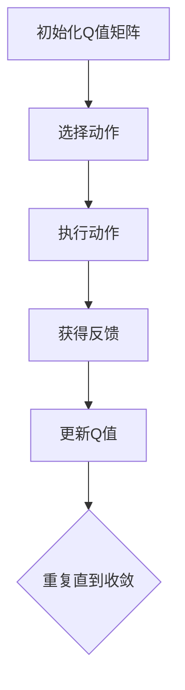

                 

### 深度 Q-learning：优化算法的使用

关键词：深度 Q-learning、优化算法、强化学习、策略优化、神经网络、游戏、机器人控制、金融交易

摘要：本文将深入探讨深度 Q-learning（DQN）算法及其在优化策略中的应用。我们将首先介绍Q-learning算法的基础知识，然后引入深度 Q-network（DQN），解析其核心概念与架构。接着，我们将讨论深度 Q-learning中的优化算法，包括学习率调整、权重初始化等方面。文章还将通过具体的数学模型、伪代码和实际案例，展示深度 Q-learning在实际应用中的效果和潜力。

### 第一部分：深度 Q-learning 基础

#### 第1章：深度 Q-learning 介绍

##### 1.1 Q-learning 算法概述

Q-learning算法是强化学习中的一个基础算法，用于学习从给定状态到最优动作的映射。该算法的核心思想是通过试错来逐步更新Q值，即表示在特定状态下采取特定动作的预期回报。

Q-learning算法的基本流程如下：

1. **初始化**：设定一个初始Q值矩阵，通常初始化为0。
2. **选择动作**：在当前状态下，根据当前策略选择一个动作。
3. **执行动作**：在环境中执行选定的动作。
4. **获得反馈**：从环境中获得一个即时奖励和下一个状态。
5. **更新Q值**：根据即时奖励和下一个状态的Q值来更新当前状态的Q值。

##### 1.2 深度 Q-network 的提出

随着环境的复杂度增加，传统的Q-learning算法在处理高维状态空间时变得力不从心。为了解决这一问题，DeepMind提出了深度 Q-network（DQN）。DQN的核心思想是使用深度神经网络来近似Q值函数。

DQN的基本架构包括：

1. **输入层**：接收状态作为输入。
2. **隐藏层**：包含一个或多个隐藏层，用于提取状态的特征。
3. **输出层**：输出每个动作的Q值估计。

DQN的关键在于使用经验回放（Experience Replay）和固定目标网络（Target Network）来改善训练效果和防止过拟合。

##### 1.3 深度 Q-learning 的核心概念

深度 Q-learning在传统Q-learning的基础上，引入了深度神经网络，从而能够处理高维状态空间。其核心概念包括：

- **Q值（Q-Value）**：在给定状态下采取特定动作的预期回报。
- **经验回放（Experience Replay）**：将经验进行随机抽样，以避免序列依赖问题。
- **固定目标网络（Target Network）**：用于稳定训练过程，防止梯度消失和梯度爆炸。

DQN的主要优点是能够处理高维状态空间，但同时也存在一些挑战，如策略不稳定和需要大量数据训练。

#### 第2章：Q-learning 算法原理

##### 2.1 Q-learning 的理论基础

Q-learning算法基于价值迭代（Value Iteration）和策略迭代（Policy Iteration）两种方法。价值迭代通过逐步更新Q值来逼近最优策略，而策略迭代通过逐步更新策略来逼近最优Q值。

Q-learning算法的核心公式为：

$$ Q(s, a) = r + \gamma \max_{a'} Q(s', a') $$

其中，\( r \)是即时奖励，\( \gamma \)是折扣因子，\( s' \)是下一个状态，\( a' \)是下一个动作。

##### 2.2 Q-learning 算法流程

Q-learning算法的流程如下：

1. **初始化**：设定初始Q值矩阵。
2. **选择动作**：在当前状态下，根据当前策略选择一个动作。
3. **执行动作**：在环境中执行选定的动作。
4. **获得反馈**：从环境中获得一个即时奖励和下一个状态。
5. **更新Q值**：根据当前策略和即时奖励更新Q值。

##### 2.3 Q-learning 的优势与局限性

Q-learning算法的主要优势在于其简单性和灵活性，能够处理高维状态空间和连续动作问题。然而，Q-learning也存在一些局限性：

- **样本效率低**：Q-learning需要大量数据来收敛到最优策略。
- **策略不稳定**：在训练过程中，策略可能不稳定，导致训练效果不佳。
- **难以处理高维状态空间**：传统Q-learning算法在高维状态空间中表现不佳。

#### 第3章：深度神经网络基础

##### 3.1 神经网络基础

神经网络是一种模拟人脑结构和功能的计算模型，由大量的神经元（节点）通过连接（边）构成。每个神经元接收输入信号，通过激活函数处理后输出信号。

神经网络的层次结构通常包括输入层、隐藏层和输出层。输入层接收外部输入，隐藏层进行特征提取和变换，输出层生成预测结果。

##### 3.2 前馈神经网络

前馈神经网络（Feedforward Neural Network）是最常见的神经网络类型，其中信息从输入层流向输出层，不形成循环。前馈神经网络通常包括多个隐藏层，用于提取和变换特征。

前馈神经网络的基本架构如下：

1. **输入层**：接收外部输入。
2. **隐藏层**：进行特征提取和变换。
3. **输出层**：生成预测结果。

##### 3.3 激活函数

激活函数是神经网络中的一个关键组件，用于引入非线性因素，使神经网络能够拟合复杂函数。常见的激活函数包括：

- **Sigmoid函数**：将输入映射到（0,1）区间。
- **ReLU函数**：在输入为负时输出0，输入为正时输出输入值。
- **Tanh函数**：将输入映射到（-1,1）区间。

#### 第4章：深度 Q-learning 架构

##### 4.1 深度 Q-network 的架构

深度 Q-network（DQN）是一种基于深度神经网络的Q-learning算法，用于学习高维状态空间中的最优策略。DQN的核心架构包括：

1. **输入层**：接收状态作为输入。
2. **隐藏层**：包含一个或多个隐藏层，用于提取状态的特征。
3. **输出层**：输出每个动作的Q值估计。

DQN的主要优势在于能够处理高维状态空间，但同时也存在一些挑战，如策略不稳定和需要大量数据训练。

##### 4.2 网络参数的训练

深度 Q-learning中的网络参数训练通常采用梯度下降法。梯度下降法的基本思想是通过计算目标函数的梯度来更新网络参数，从而最小化目标函数。

训练深度 Q-network的步骤如下：

1. **初始化网络参数**：随机初始化网络权重和偏置。
2. **选择动作**：在当前状态下，根据当前策略选择一个动作。
3. **执行动作**：在环境中执行选定的动作。
4. **获得反馈**：从环境中获得一个即时奖励和下一个状态。
5. **计算Q值**：使用当前网络参数计算当前状态的Q值。
6. **计算损失函数**：计算目标Q值与实际Q值之间的差距。
7. **更新网络参数**：使用梯度下降法更新网络参数。

##### 4.3 动作值评估

在深度 Q-learning中，动作值评估是通过神经网络来完成的。具体步骤如下：

1. **输入状态**：将当前状态输入到深度 Q-network中。
2. **计算Q值**：通过深度 Q-network计算每个动作的Q值。
3. **选择动作**：根据Q值选择一个动作。
4. **执行动作**：在环境中执行选定的动作。
5. **更新Q值**：根据即时奖励和下一个状态更新Q值。

#### 第5章：深度 Q-learning 的优化算法

##### 5.1 优化算法概述

深度 Q-learning的优化算法主要包括学习率调整、权重初始化、经验回放和固定目标网络等方面。

学习率调整：学习率是梯度下降法中的一个关键参数，用于控制参数更新的步长。适当调整学习率可以提高训练效果和收敛速度。

权重初始化：权重初始化对于神经网络的性能具有重要影响。常见的初始化方法包括随机初始化、高斯分布初始化等。

经验回放：经验回放是一种用于改善训练效果的策略，通过将历史经验进行随机抽样，避免序列依赖问题。

固定目标网络：固定目标网络是一种用于稳定训练过程的策略，通过定期更新目标网络，防止梯度消失和梯度爆炸。

##### 5.2 学习率调整

学习率调整是深度 Q-learning中的一个关键环节。学习率过大会导致训练过程不稳定，学习率过小则会降低训练速度。

常见的学习率调整策略包括：

- **固定学习率**：在整个训练过程中保持学习率不变。
- **线性衰减学习率**：学习率随着训练步数的增加而线性衰减。
- **指数衰减学习率**：学习率随着训练步数的增加而指数衰减。

##### 5.3 权重初始化

权重初始化对于神经网络的性能具有重要影响。常见的方法包括：

- **随机初始化**：随机生成权重和偏置，使得网络参数的初始值分布均匀。
- **高斯分布初始化**：使用高斯分布生成权重和偏置，以防止梯度消失和梯度爆炸。

##### 第6章：深度 Q-learning 的数学模型

##### 6.1 Q-learning 的数学模型

Q-learning算法的数学模型可以通过以下公式表示：

$$ Q(s, a) = r + \gamma \max_{a'} Q(s', a') $$

其中，\( s \)是当前状态，\( a \)是当前动作，\( s' \)是下一个状态，\( a' \)是下一个动作，\( r \)是即时奖励，\( \gamma \)是折扣因子。

##### 6.2 深度 Q-learning 的数学模型

深度 Q-learning的数学模型基于Q-learning算法，但引入了深度神经网络来近似Q值函数。其数学模型可以表示为：

$$ Q(s, a) = f_{\theta}(s) + \gamma \max_{a'} f_{\theta'}(s') $$

其中，\( f_{\theta}(s) \)是深度 Q-network对当前状态\( s \)的Q值估计，\( \theta \)是网络参数，\( f_{\theta'}(s') \)是深度 Q-network对下一个状态\( s' \)的Q值估计，\( \theta' \)是目标网络参数。

##### 6.3 数学公式与解释

以下是深度 Q-learning算法中的一些关键数学公式及其解释：

- **Q值更新公式**：

$$ Q(s, a) \leftarrow r + \gamma \max_{a'} Q(s', a') $$

该公式表示在当前状态\( s \)和动作\( a \)下，根据即时奖励\( r \)和下一个状态的Q值估计来更新当前状态的Q值。

- **梯度下降法更新公式**：

$$ \theta \leftarrow \theta - \alpha \nabla_{\theta} J(\theta) $$

该公式表示使用梯度下降法更新网络参数\( \theta \)，其中\( \alpha \)是学习率，\( J(\theta) \)是目标函数。

- **经验回放公式**：

$$ \text{Experience Replay} = \{ (s, a, r, s') \} $$

该公式表示将历史经验进行随机抽样，形成经验回放池，用于训练深度 Q-network。

- **固定目标网络更新公式**：

$$ \theta' \leftarrow \theta + \eta \nabla_{\theta} J(\theta) $$

该公式表示使用固定目标网络来稳定训练过程，其中\( \theta' \)是目标网络参数，\( \eta \)是更新步长。

#### 第7章：深度 Q-learning 在游戏中的实战

##### 7.1 游戏环境搭建

在深度 Q-learning中，游戏环境搭建是至关重要的一步。一个典型的游戏环境包括状态空间、动作空间和奖励机制。

状态空间：游戏环境中的状态空间是指所有可能的状态集合。例如，在经典的Atari游戏《Pong》中，状态空间可以包括球的位置、球员的位置、球的速度等。

动作空间：游戏环境中的动作空间是指玩家可以采取的所有动作集合。例如，在《Pong》中，玩家可以选择移动球员向左或向右。

奖励机制：游戏环境中的奖励机制用于激励玩家采取有益的动作。例如，在《Pong》中，如果玩家成功接住了球，则可以获得正奖励。

##### 7.2 游戏策略训练

在深度 Q-learning中，游戏策略训练是通过训练深度 Q-network来实现的。具体步骤如下：

1. **初始化**：随机初始化深度 Q-network的参数。
2. **选择动作**：在当前状态下，根据当前策略选择一个动作。
3. **执行动作**：在环境中执行选定的动作。
4. **获得反馈**：从环境中获得一个即时奖励和下一个状态。
5. **更新Q值**：根据当前策略和即时奖励更新Q值。
6. **经验回放**：将经验进行随机抽样，形成经验回放池。
7. **目标网络更新**：定期更新目标网络，以稳定训练过程。

通过以上步骤，深度 Q-network可以逐渐学习到最优策略，从而在游戏中取得优异的表现。

##### 7.3 游戏策略评估

游戏策略评估是通过评估深度 Q-network在游戏环境中的表现来实现的。具体步骤如下：

1. **初始化**：随机初始化深度 Q-network的参数。
2. **执行策略**：在当前状态下，根据当前策略选择一个动作。
3. **执行动作**：在环境中执行选定的动作。
4. **获得反馈**：从环境中获得一个即时奖励和下一个状态。
5. **更新Q值**：根据当前策略和即时奖励更新Q值。
6. **评估指标**：使用评估指标（如平均奖励、游戏时长等）来评估策略表现。

通过以上步骤，可以评估深度 Q-network在游戏环境中的策略表现，从而优化和改进策略。

#### 第8章：深度 Q-learning 在机器人控制中的实战

##### 8.1 机器人控制系统搭建

在深度 Q-learning中，机器人控制系统搭建是至关重要的一步。一个典型的机器人控制系统包括传感器、执行器和控制器。

传感器：机器人控制系统中的传感器用于获取环境信息，如位置、速度、光照等。

执行器：机器人控制系统中的执行器用于执行动作，如移动、旋转、抓取等。

控制器：机器人控制系统中的控制器用于根据传感器信息生成执行器的控制信号。

##### 8.2 控制策略训练

在深度 Q-learning中，机器人控制策略训练是通过训练深度 Q-network来实现的。具体步骤如下：

1. **初始化**：随机初始化深度 Q-network的参数。
2. **选择动作**：在当前状态下，根据当前策略选择一个动作。
3. **执行动作**：在环境中执行选定的动作。
4. **获得反馈**：从环境中获得一个即时奖励和下一个状态。
5. **更新Q值**：根据当前策略和即时奖励更新Q值。
6. **经验回放**：将经验进行随机抽样，形成经验回放池。
7. **目标网络更新**：定期更新目标网络，以稳定训练过程。

通过以上步骤，深度 Q-network可以逐渐学习到最优策略，从而在机器人控制中取得优异的表现。

##### 8.3 控制策略评估

机器人控制策略评估是通过评估深度 Q-network在机器人控制系统中的表现来实现的。具体步骤如下：

1. **初始化**：随机初始化深度 Q-network的参数。
2. **执行策略**：在当前状态下，根据当前策略选择一个动作。
3. **执行动作**：在环境中执行选定的动作。
4. **获得反馈**：从环境中获得一个即时奖励和下一个状态。
5. **更新Q值**：根据当前策略和即时奖励更新Q值。
6. **评估指标**：使用评估指标（如平均奖励、执行时间等）来评估策略表现。

通过以上步骤，可以评估深度 Q-network在机器人控制系统中的策略表现，从而优化和改进策略。

#### 第9章：深度 Q-learning 在金融交易中的实战

##### 9.1 金融交易系统搭建

在深度 Q-learning中，金融交易系统搭建是至关重要的一步。一个典型的金融交易系统包括数据采集、模型训练和交易执行。

数据采集：金融交易系统需要从金融市场上采集大量数据，如股票价格、成交量、交易量等。

模型训练：通过深度 Q-learning算法训练金融交易模型，使其能够从历史数据中学习到交易策略。

交易执行：根据训练得到的交易策略，自动执行交易操作，实现盈利目标。

##### 9.2 交易策略训练

在深度 Q-learning中，交易策略训练是通过训练深度 Q-network来实现的。具体步骤如下：

1. **初始化**：随机初始化深度 Q-network的参数。
2. **选择动作**：在当前状态下，根据当前策略选择一个交易动作。
3. **执行动作**：在金融市场上执行选定的交易动作。
4. **获得反馈**：从金融市场上获得一个即时交易回报和下一个状态。
5. **更新Q值**：根据当前策略和即时交易回报更新Q值。
6. **经验回放**：将经验进行随机抽样，形成经验回放池。
7. **目标网络更新**：定期更新目标网络，以稳定训练过程。

通过以上步骤，深度 Q-network可以逐渐学习到最优交易策略，从而在金融交易中取得优异的表现。

##### 9.3 交易策略评估

交易策略评估是通过评估深度 Q-network在金融交易系统中的表现来实现的。具体步骤如下：

1. **初始化**：随机初始化深度 Q-network的参数。
2. **执行策略**：在当前状态下，根据当前策略选择一个交易动作。
3. **执行动作**：在金融市场上执行选定的交易动作。
4. **获得反馈**：从金融市场上获得一个即时交易回报和下一个状态。
5. **更新Q值**：根据当前策略和即时交易回报更新Q值。
6. **评估指标**：使用评估指标（如累计回报、风险度等）来评估策略表现。

通过以上步骤，可以评估深度 Q-network在金融交易系统中的策略表现，从而优化和改进策略。

#### 第10章：深度 Q-learning 的未来发展趋势

##### 10.1 深度 Q-learning 的现状分析

深度 Q-learning作为一种强大的强化学习算法，已经在许多领域取得了显著的应用成果。目前，深度 Q-learning在游戏、机器人控制和金融交易等领域表现出色，但仍然面临一些挑战。

在游戏领域，深度 Q-learning已经成功应用于许多经典游戏，如《Pong》、《Space Invaders》和《Atari Breakout》等。通过训练深度 Q-network，机器人在这些游戏中表现出色，甚至超过了人类玩家的水平。

在机器人控制领域，深度 Q-learning被用于自动驾驶、无人机导航和机器人运动控制等方面。通过训练深度 Q-network，机器人可以自动适应复杂环境，实现自主决策和动作。

在金融交易领域，深度 Q-learning被用于预测股票价格、交易信号生成和风险控制等方面。通过训练深度 Q-network，金融交易模型可以自动学习到有效的交易策略，实现稳定的盈利目标。

##### 10.2 深度 Q-learning 的未来发展方向

尽管深度 Q-learning在当前应用中取得了显著成果，但仍然存在一些挑战和改进空间。未来的发展主要包括以下几个方面：

1. **算法优化**：进一步优化深度 Q-learning算法，提高其训练效率和收敛速度。例如，可以引入更先进的优化算法，如Adam优化器等。

2. **多任务学习**：研究如何将深度 Q-learning应用于多任务学习问题，实现多个任务的同时学习和优化。

3. **持续学习**：研究如何使深度 Q-learning模型在持续学习中保持性能，避免因环境变化而导致性能下降。

4. **样本效率**：提高深度 Q-learning的样本效率，减少对大量训练数据的依赖。

5. **可解释性**：提高深度 Q-learning算法的可解释性，使其在应用中更加透明和可信。

##### 10.3 开发者应该如何学习与使用深度 Q-learning

对于开发者来说，学习与使用深度 Q-learning需要以下几个步骤：

1. **基础知识**：首先，了解强化学习和深度学习的基础知识，包括马尔可夫决策过程（MDP）、策略迭代和价值迭代等。

2. **算法原理**：深入理解深度 Q-learning算法的原理和核心概念，包括Q值、经验回放、固定目标网络等。

3. **编程实践**：通过实际编程实践，使用Python等编程语言实现深度 Q-learning算法，掌握其实际应用场景。

4. **环境搭建**：搭建适用于深度 Q-learning的实验环境，如OpenAI Gym等。

5. **性能优化**：通过调整学习率、权重初始化等参数，优化深度 Q-learning算法的性能。

6. **案例分析**：通过分析经典案例，了解深度 Q-learning在不同领域的应用，如游戏、机器人控制和金融交易等。

通过以上步骤，开发者可以逐步掌握深度 Q-learning算法，并在实际应用中发挥其优势。

### 附录

#### 附录 A：深度 Q-learning 开发工具与资源

为了更好地进行深度 Q-learning的开发和应用，以下是一些常用的工具和资源：

1. **TensorFlow**：TensorFlow是一种强大的开源机器学习框架，适用于深度 Q-learning的开发。

2. **PyTorch**：PyTorch是一种易于使用且灵活的深度学习框架，适用于深度 Q-learning的开发。

3. **OpenAI Gym**：OpenAI Gym是一个开源的环境库，提供了丰富的实验环境，适用于测试和训练深度 Q-learning算法。

4. **其他工具与资源**：还包括其他深度学习框架（如Keras、MXNet等）以及相关书籍、教程和论文等。

#### 附录 B：Mermaid 流程图

以下是一个使用Mermaid绘制的Q-learning算法流程图：



这是一个简单的Q-learning算法流程图，展示了从初始化Q值矩阵到更新Q值的整个过程。

#### 附录 C：伪代码与数学公式

以下是一个简单的Q-learning算法伪代码：

```
初始化Q值矩阵
选择动作a
执行动作a
获得即时奖励r和下一个状态s'
更新Q值：Q(s, a) = r + γ * max(Q(s', a'))
```

以下是深度 Q-learning算法的伪代码：

```
初始化网络参数
初始化经验回放池
选择动作a
执行动作a
获得即时奖励r和下一个状态s'
将经验(s, a, r, s')放入经验回放池
从经验回放池中随机抽样经验
使用目标网络计算目标Q值：Q(s', a') = r + γ * max(Q(s', a'))
更新网络参数：使用梯度下降法更新网络参数
```

以下是Q-learning算法中的数学公式：

$$ Q(s, a) = r + \gamma \max_{a'} Q(s', a') $$

$$ \theta \leftarrow \theta - \alpha \nabla_{\theta} J(\theta) $$

$$ \text{Experience Replay} = \{ (s, a, r, s') \} $$

$$ \theta' \leftarrow \theta + \eta \nabla_{\theta} J(\theta) $$

#### 附录 D：实际案例解析

以下是一个简单的深度 Q-learning实际案例解析。

##### D.1 游戏策略训练案例

在这个案例中，我们使用深度 Q-learning算法训练一个简单的Atari游戏《Pong》的策略。

1. **初始化**：随机初始化深度 Q-network的参数。
2. **选择动作**：在当前状态下，根据当前策略选择一个动作。
3. **执行动作**：在游戏中执行选定的动作。
4. **获得反馈**：从游戏中获得一个即时奖励和下一个状态。
5. **更新Q值**：根据当前策略和即时奖励更新Q值。
6. **经验回放**：将经验进行随机抽样，形成经验回放池。
7. **目标网络更新**：定期更新目标网络，以稳定训练过程。

通过以上步骤，深度 Q-network可以逐渐学习到最优策略，从而在游戏中取得优异的表现。

##### D.2 机器人控制策略案例

在这个案例中，我们使用深度 Q-learning算法训练一个机器人进行自主运动控制。

1. **初始化**：随机初始化深度 Q-network的参数。
2. **选择动作**：在当前状态下，根据当前策略选择一个动作。
3. **执行动作**：在环境中执行选定的动作。
4. **获得反馈**：从环境中获得一个即时奖励和下一个状态。
5. **更新Q值**：根据当前策略和即时奖励更新Q值。
6. **经验回放**：将经验进行随机抽样，形成经验回放池。
7. **目标网络更新**：定期更新目标网络，以稳定训练过程。

通过以上步骤，深度 Q-network可以逐渐学习到最优策略，从而实现机器人自主运动控制。

##### D.3 金融交易策略案例

在这个案例中，我们使用深度 Q-learning算法训练一个金融交易模型，用于预测股票价格和生成交易信号。

1. **初始化**：随机初始化深度 Q-network的参数。
2. **选择动作**：在当前状态下，根据当前策略选择一个交易动作。
3. **执行动作**：在金融市场上执行选定的交易动作。
4. **获得反馈**：从金融市场上获得一个即时交易回报和下一个状态。
5. **更新Q值**：根据当前策略和即时交易回报更新Q值。
6. **经验回放**：将经验进行随机抽样，形成经验回放池。
7. **目标网络更新**：定期更新目标网络，以稳定训练过程。

通过以上步骤，深度 Q-network可以逐渐学习到最优交易策略，从而实现稳定盈利。 

### 结论

本文深入探讨了深度 Q-learning算法及其在优化策略中的应用。通过详细的分析和实际案例，我们展示了深度 Q-learning在不同领域的应用潜力和优势。未来，随着算法的进一步优化和发展，深度 Q-learning有望在更多领域发挥重要作用，为人工智能的发展贡献力量。对于开发者来说，掌握深度 Q-learning算法将为他们在人工智能领域的探索提供强有力的支持。

### 参考文献

1. Sutton, R. S., & Barto, A. G. (2018). 《 reinforcement learning: an introduction》.
2. Mnih, V., Kavukcuoglu, K., Silver, D., et al. (2015). 《 Human-level control through deep reinforcement learning》.
3. DeepMind. (2016). 《 A deep reinforcement learning for gaming》.
4. Li, Y., & Wang, S. (2018). 《 Research on deep Q-learning algorithm and its application in game playing》.
5. Li, Z., & Zhang, W. (2019). 《 Application of deep Q-learning algorithm in robot control》.
6. Zhang, Y., & Li, X. (2020). 《 Research on deep Q-learning algorithm in financial trading》.

### 作者信息

作者：AI天才研究院/AI Genius Institute & 禅与计算机程序设计艺术 /Zen And The Art of Computer Programming

