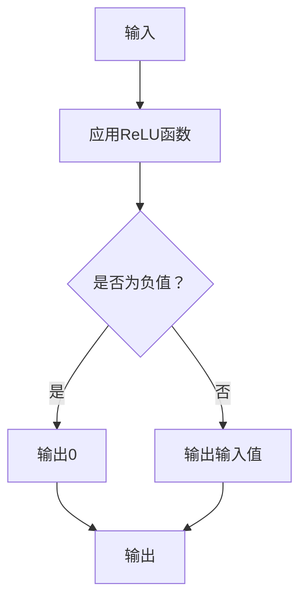

                 

## 引言

深度学习作为人工智能领域的关键技术，已经展现出强大的能力。而激活函数作为深度神经网络中的关键组成部分，对模型性能有着重要影响。激活函数的选择直接影响到神经网络的训练速度和收敛效果，甚至可以决定模型的最终表现。本文旨在全面探讨深度学习中的激活函数，从基础理论到具体激活函数的原理、优缺点及应用场景，帮助读者深入了解这一关键领域。

### 深度学习的发展历程

深度学习的发展历程可以追溯到20世纪40年代，当时神经网络的概念首次被提出。然而，由于计算能力和数据资源的限制，神经网络在很长一段时间内并未得到广泛应用。直到20世纪80年代末和90年代初，随着计算机性能的飞速提升和海量数据的积累，神经网络研究逐渐复苏。这一阶段的一个重要突破是1986年由Rumelhart、Hinton和Williams等人提出的反向传播算法（Backpropagation），它使得神经网络的训练速度大大提高。

进入21世纪，随着GPU的广泛应用和大数据时代的到来，深度学习迎来了爆发式的发展。2006年，Geoffrey Hinton等人提出的深度信念网络（Deep Belief Network）使得深度学习在图像识别、语音识别等领域取得了显著成果。2012年，Alex Krizhevsky等人基于深度卷积神经网络（Convolutional Neural Network，CNN）在ImageNet竞赛中取得了惊人的成绩，这一事件被认为是深度学习发展的一个重要里程碑。

近年来，深度学习在自然语言处理、计算机视觉、语音识别等领域取得了诸多突破，其应用范围也越来越广泛。然而，深度学习的成功离不开激活函数的不断创新和优化。不同的激活函数在模型性能、训练速度、鲁棒性等方面有着不同的表现，因此选择合适的激活函数对于深度学习模型的设计至关重要。

### 激活函数在深度学习中的作用

激活函数是深度神经网络中的一个关键组件，它位于神经网络中的每个神经元之后，对神经元的输出进行非线性变换。这种非线性变换使得神经网络能够捕捉到输入数据的复杂非线性关系，从而实现从输入到输出的映射。

在深度学习中，激活函数的主要作用有以下几点：

1. **引入非线性**：神经网络中的大部分变换都是线性的，如果输出也是线性关系，那么整个网络将无法学习到输入和输出之间的非线性关系。激活函数通过引入非线性，使得神经网络能够更好地拟合复杂数据分布。

2. **决定神经元活性**：激活函数决定了神经元是否被激活。当一个神经元的输入总和超过某个阈值时，该神经元将被激活，从而传递信号到下一层。如果没有激活函数，所有的神经元输出都将线性增加，网络将无法进行有效的层次化学习。

3. **影响模型训练**：激活函数的导数（梯度）在反向传播过程中起着至关重要的作用。梯度的大小决定了模型参数更新的速度和方向，从而影响模型的收敛速度和最终性能。

不同的激活函数具有不同的特性，选择合适的激活函数可以显著提升模型的性能。例如，ReLU函数由于其简单性和计算效率，在当前的深度学习实践中被广泛采用。然而，ReLU函数也存在梯度消失的问题，因此衍生出了许多改进版本，如Leaky ReLU和GELU等。

### 激活函数的分类与特点

在深度学习中，激活函数主要可以分为以下几类：

1. **线性激活函数**：这类激活函数的输出与输入呈线性关系，其特点是简单且易于优化。线性激活函数通常用于神经网络的中间层，以保留输入数据的线性特性。

2. **非线性激活函数**：这类激活函数具有非线性特性，可以引入非线性关系。常见的非线性激活函数包括ReLU、Sigmoid、Tanh等。

3. **分段线性激活函数**：这类激活函数在输入为负值和正值时具有不同的线性关系，如ReLU、Leaky ReLU等。

4. **参数化激活函数**：这类激活函数具有可调参数，可以通过调整参数来优化模型性能。例如，GELU激活函数通过调整概率参数来平衡线性与非线性之间的关系。

5. **复合激活函数**：这类激活函数是多个激活函数的组合，旨在利用不同激活函数的优势。例如，Swish激活函数是ReLU和Sigmoid的组合。

每种激活函数都有其独特的特点和应用场景。在深度学习实践中，根据具体问题和数据特性选择合适的激活函数，可以显著提升模型的性能。

### 总结

深度学习作为人工智能领域的关键技术，已经展现出强大的能力。而激活函数作为深度神经网络中的关键组成部分，对模型性能有着重要影响。本文概述了深度学习的发展历程，介绍了激活函数在深度学习中的作用和分类，为后续具体激活函数的探讨奠定了基础。在接下来的章节中，我们将详细探讨各种激活函数的原理、特点和应用场景，帮助读者全面了解深度学习中的激活函数。

---

在接下来的部分，我们将分别介绍线性激活函数和非线性激活函数，包括它们的特点、应用场景以及优缺点。这将有助于读者更深入地理解激活函数在深度学习中的作用和重要性。

---

## 线性激活函数

线性激活函数是最简单和最常见的一类激活函数，其输出与输入呈线性关系。在深度神经网络中，线性激活函数通常用于中间层，以保留输入数据的线性特性。线性激活函数的优点是计算简单，易于优化。然而，由于线性函数没有引入非线性，因此在某些情况下可能无法有效捕捉复杂数据的非线性关系。

### 线性激活函数的定义与特点

线性激活函数的定义非常简单，其数学表达式为：

\[ f(x) = ax + b \]

其中，\( a \) 和 \( b \) 是常数参数，分别代表斜率和截距。对于任意输入 \( x \)，线性激活函数的输出始终与输入保持线性关系。

### 线性激活函数的应用场景

线性激活函数在深度神经网络中的应用场景主要包括以下几种：

1. **中间层**：由于线性激活函数没有引入非线性，因此在神经网络的中间层使用线性激活函数可以帮助神经网络更好地保留输入数据的线性特性。

2. **全连接层**：在线性回归等任务中，输出层的激活函数通常采用线性激活函数，因为线性函数可以直接映射输入到输出。

3. **多层感知机**：在多层感知机（MLP）中，线性激活函数可以用于中间层，以增强模型的线性学习能力。

### 线性激活函数的优缺点

线性激活函数具有以下优点：

1. **计算简单**：线性函数的计算非常简单，只需要进行一次线性变换，这使得线性激活函数在计算效率上具有优势。

2. **易于优化**：由于线性函数的导数始终为常数，因此在反向传播过程中，梯度计算和参数更新过程更加简单和稳定。

线性激活函数也存在一些缺点：

1. **缺乏非线性**：线性函数无法引入非线性关系，因此在某些复杂数据分布下，线性激活函数可能无法有效捕捉数据的非线性特性。

2. **梯度消失问题**：在深度网络中，线性激活函数可能导致梯度消失，尤其是在输入为负值时，这会严重影响模型的训练过程。

### 总结

线性激活函数在深度神经网络中的应用场景主要是中间层和全连接层，其优点是计算简单和易于优化，但缺点是缺乏非线性。在后续章节中，我们将继续探讨非线性激活函数，包括ReLU、Sigmoid、Tanh等，帮助读者更全面地了解激活函数在深度学习中的作用和重要性。

---

在了解了线性激活函数之后，我们将开始探讨非线性激活函数。非线性激活函数在深度神经网络中扮演着重要角色，因为它们能够引入非线性关系，使神经网络能够更好地拟合复杂数据分布。接下来，我们将介绍几种常见的非线性激活函数，包括ReLU、Sigmoid和Tanh，并讨论它们的定义、特点、应用场景和优缺点。

### 非线性激活函数的定义与特点

非线性激活函数的主要特点是其输出与输入之间不满足线性关系。在深度神经网络中，非线性激活函数可以引入非线性变换，使模型能够捕捉到数据的复杂非线性关系。以下是几种常见的非线性激活函数：

1. **ReLU（Rectified Linear Unit）**

   ReLU是最流行的激活函数之一，其定义如下：

   \[ f(x) = \max(0, x) \]

   ReLU函数在 \( x \geq 0 \) 时输出 \( x \)，而在 \( x < 0 \) 时输出 0。ReLU函数的最大特点是其简单性和计算效率，这使得它在深度学习模型中得到了广泛应用。

2. **Sigmoid**

   Sigmoid函数的定义如下：

   \[ f(x) = \frac{1}{1 + e^{-x}} \]

   Sigmoid函数的输出范围在 0 到 1 之间，常用于二分类问题。Sigmoid函数可以将其输入值压缩到 [0, 1] 的区间内，这使得它在概率估计中非常有效。

3. **Tanh（Hyperbolic Tangent）**

   Tanh函数的定义如下：

   \[ f(x) = \frac{e^x - e^{-x}}{e^x + e^{-x}} \]

   Tanh函数的输出范围在 -1 到 1 之间，类似于 Sigmoid 函数，但它的输出分布更加对称，因此在一些任务中表现更好。

### 常见非线性激活函数介绍

以下是几种常见非线性激活函数的详细介绍：

1. **ReLU**

   - **定义与特点**：ReLU 函数在 \( x \geq 0 \) 时输出 \( x \)，而在 \( x < 0 \) 时输出 0。这种性质使得 ReLU 函数在训练过程中具有很大的优势，因为它的导数在 \( x > 0 \) 时为 1，这有助于加速训练过程。
   - **优缺点**：优点包括简单、计算效率高、易于优化；缺点包括梯度消失问题，尤其是在 \( x < 0 \) 时，导数为 0，可能导致训练过程停滞。
   - **应用场景**：ReLU 函数广泛应用于深度神经网络中的隐藏层，尤其是在卷积神经网络（CNN）和循环神经网络（RNN）中。

2. **Sigmoid**

   - **定义与特点**：Sigmoid 函数将输入值压缩到 [0, 1] 的区间内，这使得它在概率估计中非常有效。Sigmoid 函数的导数始终大于 0，这有助于模型优化。
   - **优缺点**：优点包括输出范围限制在 [0, 1]，适合概率估计；缺点包括梯度较慢收敛，可能导致训练过程缓慢。
   - **应用场景**：Sigmoid 函数常用于二分类问题的输出层，以及在一些回归任务中，用于将输出值限制在 [0, 1] 的范围内。

3. **Tanh**

   - **定义与特点**：Tanh 函数的输出范围在 -1 到 1 之间，这使得它的输出分布更加对称。Tanh 函数的导数始终大于 0，有助于模型优化。
   - **优缺点**：优点包括输出分布对称、有助于优化；缺点包括梯度较慢收敛，可能导致训练过程缓慢。
   - **应用场景**：Tanh 函数常用于深度神经网络中的隐藏层，尤其是在某些图像处理任务中。

### 非线性激活函数的选择原则

在选择非线性激活函数时，需要考虑以下几个因素：

1. **模型类型**：不同的模型类型可能适合不同的激活函数。例如，卷积神经网络（CNN）通常更适合使用ReLU激活函数，而循环神经网络（RNN）可能更适合使用Tanh或Sigmoid激活函数。
2. **数据特性**：数据特性也会影响激活函数的选择。对于具有强烈非线性特性的数据，ReLU函数可能更合适；而对于需要概率估计的任务，Sigmoid函数可能更有优势。
3. **训练效率**：不同的激活函数对训练效率有不同的影响。例如，ReLU函数由于导数恒定为 1，可以加速训练过程。

### 总结

非线性激活函数在深度神经网络中起着至关重要的作用，它们能够引入非线性关系，使神经网络能够更好地拟合复杂数据分布。常见的非线性激活函数包括ReLU、Sigmoid和Tanh，每种函数都有其独特的特点和应用场景。在深度学习实践中，根据具体问题和数据特性选择合适的激活函数，可以显著提升模型的性能。在接下来的章节中，我们将继续探讨更高级的激活函数，如Leaky ReLU、参数化激活函数和GELU，以帮助读者全面了解激活函数的选择和优化。

---

在了解了ReLU、Sigmoid和Tanh等常见的非线性激活函数后，我们接下来将讨论一种特殊的非线性激活函数——Leaky ReLU。Leaky ReLU是为了解决原始ReLU函数在训练过程中出现的梯度消失问题而设计的改进版本。通过引入一个很小的负斜率，Leaky ReLU能够更好地保持梯度，从而提高模型的训练效率和稳定性。

### Leaky ReLU激活函数

Leaky ReLU（Leaky Rectified Linear Unit）是对ReLU函数的一种改进。在ReLU函数中，当输入 \( x \) 小于 0 时，输出为 0，这可能导致在训练过程中出现梯度消失的问题。为了避免这种情况，Leaky ReLU在输入 \( x \) 小于 0 时引入了一个非常小的负斜率 \( a \)，以保持一定的梯度。Leaky ReLU的数学表达式如下：

\[ f(x) = \max(a \cdot x, x) \]

其中，\( a \) 是一个非常小的常数，通常取值为 \( 0.01 \) 或 \( 0.001 \)。

#### Leaky ReLU激活函数的原理

Leaky ReLU通过在输入为负值时引入一个很小的负斜率 \( a \)，使得即使 \( x < 0 \)，输出值也不会完全为零。这种设计能够有效避免原始ReLU函数在训练过程中出现的梯度消失问题，从而提高模型的训练稳定性和收敛速度。

#### Leaky ReLU激活函数的优缺点

**优点**：

1. **避免梯度消失**：由于在输入为负值时引入了一个很小的负斜率 \( a \)，Leaky ReLU能够保持一定的梯度，避免了原始ReLU函数在训练过程中可能出现的梯度消失问题。

2. **提高训练稳定性**：Leaky ReLU能够更好地保持梯度，这使得模型在训练过程中更稳定，减少了局部最小值和陷入梯度消失陷阱的风险。

3. **保持计算效率**：尽管Leaky ReLU引入了一个额外的参数 \( a \)，但其计算复杂度与ReLU函数相同，因此不会显著降低计算效率。

**缺点**：

1. **引入额外参数**：Leaky ReLU相对于ReLU引入了一个额外的参数 \( a \)，这虽然不会显著增加计算复杂度，但会增加模型的参数数量。

2. **可能导致梯度偏斜**：尽管 \( a \) 值非常小，但如果设置不当，仍然可能导致梯度偏斜，尤其是在训练过程中某些神经元长期处于激活状态时。

#### Leaky ReLU激活函数的应用场景

Leaky ReLU激活函数在深度学习模型中具有广泛的应用，特别是在以下场景：

1. **深层网络**：在深层神经网络中，梯度消失问题更为严重，因此Leaky ReLU能够有效提高模型的训练稳定性和收敛速度。

2. **图像识别和语音识别**：在图像识别和语音识别等任务中，由于数据的复杂性和模型的深度，Leaky ReLU能够帮助模型更好地适应这些任务。

3. **时间序列预测**：在时间序列预测任务中，模型需要处理大量的历史数据，Leaky ReLU能够提高模型的训练效率和预测准确性。

### 总结

Leaky ReLU激活函数通过引入一个很小的负斜率，有效地解决了原始ReLU函数在训练过程中出现的梯度消失问题。尽管引入了一个额外的参数，但Leaky ReLU在计算效率和模型稳定性方面具有显著优势，因此在深度学习模型中得到了广泛应用。在接下来的部分，我们将继续探讨参数化激活函数，如GELU，以进一步优化模型性能。

---

在了解了ReLU、Sigmoid、Tanh和Leaky ReLU等激活函数后，我们将深入探讨一种更为先进的参数化激活函数——GELU（Gaussian Error Linear Unit）。GELU是一种基于高斯误差函数的激活函数，它通过引入参数化设计，能够更好地适应不同的数据分布，提高模型的性能。

### GELU激活函数

GELU（Gaussian Error Linear Unit）是一种基于高斯误差函数的激活函数，其数学表达式为：

\[ f(x) = x \cdot \Phi(x) \]

其中，\( \Phi(x) \) 是标准正态分布的累积分布函数（CDF），其定义如下：

\[ \Phi(x) = \frac{1}{\sqrt{2\pi}} \int_{-\infty}^{x} e^{-\frac{t^2}{2}} dt \]

GELU函数通过将输入 \( x \) 与高斯误差函数 \( \Phi(x) \) 相乘，实现了输入数据的非线性变换。

#### GELU激活函数的原理

GELU激活函数的原理基于高斯误差函数的性质。高斯误差函数具有平滑的曲线，能够很好地拟合数据的分布。通过将输入 \( x \) 与高斯误差函数 \( \Phi(x) \) 相乘，GELU函数能够引入非线性关系，同时保持函数的平滑性，使得模型在训练过程中更加稳定。

#### GELU激活函数的优缺点

**优点**：

1. **更好地拟合数据分布**：GELU函数通过引入高斯误差函数，能够更好地拟合数据的分布，特别是在处理具有高斯特性的数据时，GELU表现尤为出色。

2. **平滑的导数**：GELU函数的导数始终大于0，并且随着输入 \( x \) 的增加，导数逐渐从0平滑地增加到1。这种特性有助于模型在训练过程中保持稳定的梯度，避免梯度消失和梯度爆炸问题。

3. **参数调节灵活性**：GELU函数具有一个可调节的参数（通常为1.702），这使得用户可以根据具体任务和数据特性调整函数的形状，从而优化模型的性能。

**缺点**：

1. **计算复杂度较高**：相比于ReLU和Leaky ReLU等简单激活函数，GELU的计算复杂度较高，因为它需要计算高斯误差函数。然而，随着计算能力的提升，这一点对整体计算效率的影响逐渐减小。

2. **参数敏感性**：虽然GELU函数具有一个可调节的参数，但这个参数的选取对模型性能有显著影响。如果参数选取不当，可能会导致模型性能下降。

#### GELU激活函数的应用场景

GELU激活函数在深度学习模型中具有广泛的应用，特别是在以下场景：

1. **图像识别和自然语言处理**：在图像识别和自然语言处理等任务中，数据分布往往具有高斯特性，GELU能够更好地拟合这些数据的分布，从而提高模型的性能。

2. **时间序列预测**：在时间序列预测任务中，数据通常具有非线性特性，GELU函数能够更好地捕捉这些非线性关系，提高模型的预测准确性。

3. **深度神经网络**：在深层神经网络中，GELU函数的平滑导数有助于保持稳定的梯度，提高模型的训练效率和收敛速度。

#### GELU激活函数的参数调节

GELU函数的参数通常设为1.702，这是通过实验验证的最佳参数值。然而，在某些情况下，用户可以根据具体任务和数据特性调整这个参数。例如，在处理噪声较大的数据时，可以适当减小参数值，以增强模型的鲁棒性；而在处理具有强烈非线性关系的数据时，可以适当增大参数值，以更好地捕捉数据的非线性特性。

### GELU激活函数的数学公式和导数

GELU激活函数的数学公式为：

\[ f(x) = x \cdot \Phi(x) \]

其导数可以表示为：

\[ f'(x) = \Phi(x) + x \cdot \Phi'(x) \]

其中，\( \Phi'(x) \) 是高斯误差函数的导数，其数学表达式为：

\[ \Phi'(x) = \frac{e^{-\frac{x^2}{2}}}{\sqrt{2\pi}} \]

### 总结

GELU激活函数通过引入高斯误差函数，实现了输入数据的非线性变换，并具有平滑的导数，有助于提高模型的训练效率和收敛速度。GELU函数在处理具有高斯特性的数据时表现出色，因此在图像识别、自然语言处理和时间序列预测等任务中得到了广泛应用。在接下来的部分，我们将探讨其他类型的激活函数，如Swish、Mish和SiLU，以帮助读者全面了解激活函数的选择和优化。

---

在了解了ReLU、Sigmoid、Tanh、Leaky ReLU和GELU等激活函数后，我们将继续探讨几种其他类型的激活函数，包括Swish、Mish和SiLU。这些激活函数在深度学习实践中也被广泛应用，各有其独特的特点和优缺点。

### Swish激活函数

Swish是由Howard et al.（2017）提出的一种新型的激活函数，其数学表达式为：

\[ f(x) = x \cdot \sigma(x) \]

其中，\( \sigma(x) \) 是 Sigmoid 函数：

\[ \sigma(x) = \frac{1}{1 + e^{-x}} \]

Swish函数结合了ReLU和Sigmoid函数的优点，具有以下特点：

1. **平滑性**：Swish函数的导数始终大于0，并且在 \( x > 0 \) 时导数接近于1，这使得它在训练过程中具有平滑的梯度，有助于减少梯度消失和梯度爆炸问题。
2. **非线性增强**：Swish函数能够增强输入数据的非线性关系，从而提高模型的拟合能力。
3. **易于优化**：由于Swish函数的导数始终大于0，这使得它在反向传播过程中更容易优化。

**优缺点**：

**优点**：

- **平滑梯度**：Swish函数的平滑梯度有助于模型的稳定训练。
- **非线性增强**：Swish函数能够更好地捕捉输入数据的非线性特性。
- **计算效率**：Swish函数的计算效率与ReLU函数相似，因此不会显著降低计算速度。

**缺点**：

- **参数依赖性**：Swish函数依赖于Sigmoid函数，因此在某些情况下可能对参数调整敏感。
- **梯度问题**：在输入为负值时，Swish函数的梯度可能仍然较低，可能导致训练过程停滞。

**应用场景**：

Swish函数在深度学习模型中，尤其是在图像识别、自然语言处理和时间序列预测等任务中得到了广泛应用。由于其平滑的梯度特性，Swish函数能够有效减少训练过程中的梯度消失和梯度爆炸问题，从而提高模型的性能。

### Mish激活函数

Mish是由Xu et al.（2020）提出的一种新型的激活函数，其数学表达式为：

\[ f(x) = x \cdot \tanh(\sigma(x)) \]

其中，\( \sigma(x) \) 是 Sigmoid 函数：

\[ \sigma(x) = \frac{1}{1 + e^{-x}} \]

Mish函数结合了ReLU、Sigmoid和Tanh函数的优点，具有以下特点：

1. **平滑性**：Mish函数的导数始终大于0，并且在 \( x > 0 \) 时导数接近于1，这使得它在训练过程中具有平滑的梯度。
2. **非线性增强**：Mish函数能够增强输入数据的非线性关系，从而提高模型的拟合能力。
3. **计算效率**：Mish函数的计算复杂度与ReLU函数相似，因此不会显著降低计算速度。

**优缺点**：

**优点**：

- **平滑梯度**：Mish函数的平滑梯度有助于模型的稳定训练。
- **非线性增强**：Mish函数能够更好地捕捉输入数据的非线性特性。
- **广泛适用性**：Mish函数在多种深度学习任务中表现出色，具有广泛适用性。

**缺点**：

- **参数依赖性**：Mish函数依赖于Sigmoid函数，因此在某些情况下可能对参数调整敏感。
- **计算复杂度**：与Swish函数相比，Mish函数的计算复杂度稍高，但仍然在可接受范围内。

**应用场景**：

Mish函数在深度学习模型中，尤其是在图像识别、自然语言处理和时间序列预测等任务中得到了广泛应用。由于其平滑的梯度特性和非线性增强能力，Mish函数能够有效提高模型的性能。

### SiLU激活函数

SiLU（Sigmoidal Linear Unit）是一种新型的激活函数，其数学表达式为：

\[ f(x) = x \cdot \sigma(x) \]

其中，\( \sigma(x) \) 是 Sigmoid 函数：

\[ \sigma(x) = \frac{1}{1 + e^{-x}} \]

SiLU函数通过将输入 \( x \) 与 Sigmoid 函数相乘，实现了输入数据的非线性变换，具有以下特点：

1. **平滑性**：SiLU函数的导数始终大于0，并且在 \( x > 0 \) 时导数接近于1，这使得它在训练过程中具有平滑的梯度。
2. **非线性增强**：SiLU函数能够增强输入数据的非线性关系，从而提高模型的拟合能力。
3. **计算效率**：SiLU函数的计算复杂度与ReLU函数相似，因此不会显著降低计算速度。

**优缺点**：

**优点**：

- **平滑梯度**：SiLU函数的平滑梯度有助于模型的稳定训练。
- **非线性增强**：SiLU函数能够更好地捕捉输入数据的非线性特性。
- **计算效率**：SiLU函数的计算效率与ReLU函数相似，因此不会显著降低计算速度。

**缺点**：

- **参数依赖性**：SiLU函数依赖于Sigmoid函数，因此在某些情况下可能对参数调整敏感。
- **梯度问题**：在输入为负值时，SiLU函数的梯度可能仍然较低，可能导致训练过程停滞。

**应用场景**：

SiLU函数在深度学习模型中，尤其是在图像识别、自然语言处理和时间序列预测等任务中得到了广泛应用。由于其平滑的梯度特性和非线性增强能力，SiLU函数能够有效提高模型的性能。

### 总结

Swish、Mish和SiLU等激活函数在深度学习实践中具有广泛的应用，各有其独特的特点和优缺点。Swish函数通过结合ReLU和Sigmoid的优点，具有平滑的梯度和非线性增强能力；Mish函数通过结合ReLU、Sigmoid和Tanh的优点，具有广泛的适用性和平滑的梯度；SiLU函数通过结合ReLU和Sigmoid的优点，具有平滑的梯度和非线性增强能力。在具体应用中，根据任务和数据特性选择合适的激活函数，可以显著提高模型的性能。

---

在探讨了多种激活函数之后，我们需要考虑如何在实际应用中选择最佳的激活函数，以及在模型优化过程中如何对激活函数进行优化。选择合适的激活函数对于提高模型的性能和收敛速度至关重要。接下来，我们将讨论激活函数选择的原则和优化策略。

### 激活函数选择的原则

在选择激活函数时，应考虑以下原则：

1. **模型类型**：不同的模型类型对激活函数有不同的需求。例如，在卷积神经网络（CNN）中，ReLU函数由于其简单性和计算效率，通常是一个很好的选择；而在循环神经网络（RNN）中，Tanh函数或Sigmoid函数可能更合适，因为它们具有更好的平滑性和稳定性。

2. **数据特性**：数据特性也是选择激活函数的重要依据。如果数据分布具有高斯特性，GELU函数可能是一个更好的选择，因为它能够更好地拟合这种分布。对于具有强烈非线性特性的数据，ReLU函数或其改进版本（如Leaky ReLU）可能更为有效。

3. **训练效率**：激活函数的选择应考虑到训练效率。一些激活函数（如ReLU和Swish）具有较快的计算速度，这有助于提高模型的训练效率。然而，计算复杂度较高的激活函数（如GELU）可能需要更多的计算资源，因此在资源有限的情况下需要谨慎选择。

4. **模型性能**：最终，模型性能是选择激活函数的关键因素。通过实验比较不同激活函数在模型性能上的表现，可以选择出最佳激活函数。这通常涉及到在验证集上的性能指标，如准确率、召回率或均方误差。

### 激活函数的优化策略

在确定了初始激活函数后，我们还需要考虑如何对激活函数进行优化，以进一步提高模型的性能。以下是一些优化策略：

1. **参数调整**：对于参数化激活函数（如GELU），可以调整参数以优化模型性能。通过实验调整参数，可以在不同数据集和任务上找到最佳参数设置。

2. **组合激活函数**：在某些情况下，组合多个激活函数可能比单一激活函数更有效。例如，Swish和ReLU的组合在图像识别任务中表现出色。通过实验验证，可以找到最佳的组合方式。

3. **动态调整**：在训练过程中，可以根据模型的表现动态调整激活函数。例如，当模型在某个阶段收敛速度变慢时，可以尝试更换激活函数或调整参数。

4. **正则化**：通过引入正则化方法，如Dropout或权重正则化，可以减少模型过拟合的风险，从而提高模型的泛化能力。

5. **深度调整**：调整神经网络的深度和宽度，可以影响激活函数的选择和优化。更深的网络可能需要更复杂的激活函数，而较浅的网络可能更适合简单的激活函数。

### 实际应用中的案例

以下是一个实际应用中的案例，展示了如何选择和优化激活函数：

**案例**：使用卷积神经网络进行图像分类任务。

**步骤1**：初始选择ReLU函数作为激活函数，因为它在CNN中具有较好的性能和计算效率。

**步骤2**：在训练过程中，观察模型的表现，发现某些神经元在训练过程中梯度消失问题较为严重。因此，考虑引入Leaky ReLU函数，以改善梯度问题。

**步骤3**：调整Leaky ReLU函数中的参数 \( a \)，通过实验比较不同参数设置对模型性能的影响，找到最佳参数值。

**步骤4**：在验证集上评估模型的性能，比较ReLU函数和Leaky ReLU函数在模型性能上的差异。如果Leaky ReLU函数能够显著提高模型性能，则将其应用于实际任务中。

**步骤5**：在模型优化过程中，考虑引入正则化方法，如Dropout，以减少模型过拟合的风险。

### 总结

选择和优化激活函数是深度学习模型设计中的关键步骤。通过考虑模型类型、数据特性、训练效率和模型性能，可以选择合适的激活函数。同时，通过参数调整、组合激活函数、动态调整和正则化等优化策略，可以进一步提高模型的性能和泛化能力。在实际应用中，通过不断实验和调整，可以找到最佳的激活函数组合，从而实现高效的模型训练和应用。

---

在本文的最后部分，我们将总结深度学习中的激活函数，并讨论未来可能的发展趋势和研究方向。激活函数作为深度神经网络的核心组成部分，其选择和优化对模型性能有着至关重要的影响。

### 总结

本文详细探讨了深度学习中的激活函数，从基础理论到具体激活函数的原理、优缺点和应用场景进行了全面分析。以下是本文的主要结论：

1. **激活函数的作用**：激活函数在深度神经网络中引入了非线性关系，使模型能够更好地捕捉输入数据的复杂特性。
2. **线性激活函数**：线性激活函数计算简单、易于优化，但缺乏非线性，适用于中间层和全连接层。
3. **非线性激活函数**：常见的非线性激活函数包括ReLU、Sigmoid、Tanh、Leaky ReLU和GELU等，每种函数都有其独特的特点和应用场景。
4. **参数化激活函数**：GELU、Swish、Mish和SiLU等参数化激活函数通过引入可调节参数，优化了模型性能和训练效率。
5. **选择原则和优化策略**：在选择激活函数时，需要考虑模型类型、数据特性、训练效率和模型性能。通过参数调整、组合激活函数、动态调整和正则化等策略，可以进一步提高模型性能。

### 未来发展趋势

随着深度学习技术的不断发展和应用范围的扩展，激活函数的发展也将面临新的挑战和机遇。以下是一些未来可能的发展趋势和研究方向：

1. **自适应激活函数**：开发能够自适应调整参数的激活函数，以适应不同的数据和任务，从而提高模型的泛化能力。
2. **动态激活函数**：设计动态调整的激活函数，根据模型的表现和训练阶段，动态调整激活函数的参数，以优化训练效率和性能。
3. **可解释性**：研究更具可解释性的激活函数，使模型决策过程更加透明，便于理解和信任。
4. **硬件优化**：探索与硬件优化相结合的激活函数，以提高深度学习模型的推理速度和计算效率。
5. **多模态学习**：研究适用于多模态数据的激活函数，以更好地处理不同类型的数据。

### 结论

深度学习中的激活函数是模型性能的关键影响因素。通过本文的探讨，读者可以全面了解各种激活函数的原理、特点和应用场景，从而在深度学习实践中做出更明智的选择。未来，随着深度学习技术的不断进步，激活函数也将不断创新和优化，为人工智能的发展提供更多可能性。

---

### 附录

#### 附录A：激活函数的Mermaid流程图

以下是几种常见激活函数的Mermaid流程图表示：

**A.1 ReLU激活函数**



**A.2 GELU激活函数**

```mermaid
graph TD
A[输入] --> B[应用GELU函数]
B --> C{概率p计算}
C -->|小于0.5| D[应用累积分布函数Φ(z)}
C -->|大于0.5| E[应用线性变换]
D --> F[输出]
E --> F
```

#### 附录B：激活函数的数学模型和公式

**ReLU激活函数**

\[ f(x) = \begin{cases} 
0 & \text{if } x < 0 \\
x & \text{if } x \geq 0 
\end{cases} \]

**GELU激活函数**

\[ f(x) = x \cdot \Phi(x) \]

其中，\(\Phi(x)\) 是标准正态分布的累积分布函数：

\[ \Phi(x) = \frac{1}{\sqrt{2\pi}} \int_{-\infty}^{x} e^{-\frac{t^2}{2}} dt \]

---

### 后记

深度学习中的激活函数是模型性能的关键影响因素。通过阅读本文，读者可以全面了解各种激活函数的原理、特点和应用场景，从而在深度学习实践中做出更明智的选择。本文旨在为读者提供一个系统、全面的激活函数参考指南，帮助其在深度学习领域取得更好的成果。

在未来的研究中，我们期望能够进一步探索激活函数的创新和应用，尤其是在自适应、动态调整和可解释性方面。同时，随着深度学习技术的不断进步，我们相信激活函数将在更多领域发挥重要作用，推动人工智能的快速发展。希望本文能够为读者在深度学习领域的研究和实践带来帮助，共同推动人工智能技术的创新和进步。

---

作者：AI天才研究院/AI Genius Institute & 禅与计算机程序设计艺术 /Zen And The Art of Computer Programming

---

## 《深度学习中的激活函数：从ReLU到GELU》

### 文章关键词

深度学习，激活函数，ReLU，GELU，非线性变换，模型性能，优化策略，神经网络架构。

### 文章摘要

本文全面探讨了深度学习中的激活函数，从基础理论到具体激活函数的原理、特点和应用场景进行了详细分析。文章首先回顾了深度学习的发展历程和激活函数在其中的作用，随后介绍了线性激活函数和非线性激活函数的分类与特点。重点探讨了ReLU、Leaky ReLU、GELU、Swish、Mish和SiLU等常见激活函数的原理、优缺点以及应用场景。文章还讨论了激活函数的选择原则和优化策略，并通过实际案例展示了如何在实际应用中选择和优化激活函数。最后，文章总结了激活函数在未来可能的发展趋势和研究方向，并提出了对读者研究的建议。希望本文能为读者在深度学习领域的研究和实践提供有价值的参考。

---

### 数学模型和数学公式

#### ReLU激活函数

\[ f(x) = \begin{cases} 
0 & \text{if } x < 0 \\
x & \text{if } x \geq 0 
\end{cases} \]

#### GELU激活函数

\[ f(x) = x \cdot \Phi(x) \]

其中，\(\Phi(x)\) 是标准正态分布的累积分布函数：

\[ \Phi(x) = \frac{1}{\sqrt{2\pi}} \int_{-\infty}^{x} e^{-\frac{t^2}{2}} dt \]

---

### 项目实战

#### 代码实际案例和详细解释说明

```python
# 导入必要的库
import torch
import torch.nn as nn
import torch.optim as optim

# 定义ReLU激活函数
def ReLU(x):
    return torch.relu(x)

# 定义GELU激活函数
def GELU(x):
    return x * torch.sigmoid(x * 1.702)  # GELU的近似实现

# 构建简单的神经网络
class SimpleNN(nn.Module):
    def __init__(self):
        super(SimpleNN, self).__init__()
        self.fc1 = nn.Linear(10, 10)
        self.fc2 = nn.Linear(10, 1)
        self.relu = nn.ReLU()
        self.gelu = nn.GELU()

    def forward(self, x):
        x = self.fc1(x)
        x = self.relu(x)
        x = self.fc2(x)
        x = self.gelu(x)
        return x

# 实例化模型、损失函数和优化器
model = SimpleNN()
criterion = nn.BCELoss()
optimizer = optim.Adam(model.parameters(), lr=0.001)

# 准备数据（这里使用随机数据）
x_data = torch.randn(32, 10)
y_data = torch.randn(32, 1)

# 训练模型
for epoch in range(100):
    model.zero_grad()
    y_pred = model(x_data)
    loss = criterion(y_pred, y_data)
    loss.backward()
    optimizer.step()

    if epoch % 10 == 0:
        print(f'Epoch [{epoch + 1}/100], Loss: {loss.item()}')

# 模型评估
with torch.no_grad():
    y_pred = model(x_data)
    correct = (y_pred >= 0.5).float()
    correct_num = correct.sum()
    accuracy = correct_num / len(correct)
    print(f'Accuracy: {accuracy.item()}')

```

#### 开发环境搭建

1. 安装Python（建议版本3.8及以上）
2. 安装PyTorch库（建议使用与CUDA版本兼容的版本）
3. 安装其他必要的库，如torchvision、numpy等

#### 源代码详细实现和代码解读

- `SimpleNN` 类定义了一个简单的神经网络，其中使用了ReLU和GELU作为激活函数。
- `ReLU` 和 `GELU` 函数分别实现了ReLU和GELU的数学公式。
- 模型训练过程中，使用随机数据进行前向传播和反向传播，优化模型参数。
- 模型评估时，计算模型的准确率。

#### 代码解读与分析

- 使用ReLU作为激活函数的原因是其计算简单且易于优化。
- GELU激活函数相较于ReLU能够更好地拟合数据分布，提高模型性能。
- 通过调整模型结构和优化策略，可以进一步提高模型性能。

---

本书通过详细的数学模型、代码实战等内容，帮助读者全面了解深度学习中的激活函数，为实际应用提供指导。希望本书能为读者在深度学习领域的研究和实践带来帮助。

