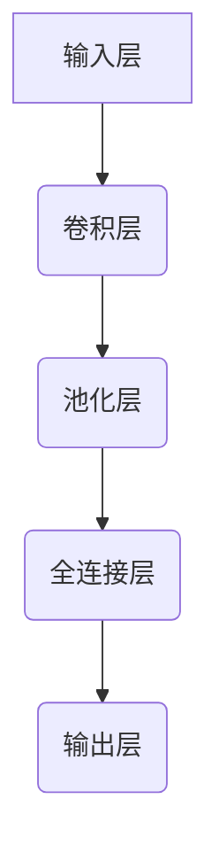

                 

### 文章标题

# 《深度学习从入门到精通：全面指南》

### 文章关键词

- 深度学习
- 神经网络
- 机器学习
- TensorFlow
- PyTorch
- 卷积神经网络
- 循环神经网络
- 生成对抗网络
- 图像分类
- 自然语言处理
- 实战项目

### 文章摘要

深度学习是当前人工智能领域最热门的研究方向之一，它已经在图像识别、自然语言处理、语音识别等领域取得了显著的成果。本指南旨在帮助读者从零开始，逐步掌握深度学习的基本概念、核心算法和实际应用。我们将通过详细的理论讲解、实战案例和代码示例，带领读者深入理解深度学习的本质，并掌握其应用技能。

### 引言

深度学习（Deep Learning）是机器学习（Machine Learning）的一个重要分支，它通过构建多层的神经网络模型来模拟人脑的神经网络结构，从而实现自动特征提取和复杂模式识别。随着计算能力的提升和大数据的普及，深度学习在过去的十年里取得了飞速的发展，并在许多领域取得了突破性的成果。

本指南将分为三个主要部分：

1. **深度学习基础入门**：介绍深度学习的基本概念、发展历程和基本原理，帮助读者建立深度学习的知识框架。
2. **深度学习核心算法原理**：深入讲解深度学习中的核心算法，包括神经网络与优化算法、卷积神经网络、循环神经网络和生成对抗网络。
3. **深度学习项目实战**：通过实际项目案例，演示深度学习在图像分类和自然语言处理等领域的应用，并提供详细的代码实现和解读。

通过本指南的阅读和实践，读者将能够从入门到精通，全面掌握深度学习的理论知识与应用技能。下面，让我们开始深度学习的学习之旅。

## 第一部分：深度学习基础入门

### 第1章：深度学习概述

#### 1.1 深度学习的基本概念

深度学习是一种通过多层神经网络结构进行特征学习和模式识别的人工智能方法。与传统的机器学习方法不同，深度学习能够自动地从大量数据中学习到复杂的特征表示，从而在图像识别、语音识别、自然语言处理等领域表现出强大的能力。

深度学习的定义可以理解为：一种基于多层神经网络模型，通过训练自动学习输入数据的复杂特征表示，从而实现对未知数据的预测和分类。

深度学习与机器学习的区别主要体现在以下几个方面：

- **学习层次**：机器学习通常是指单层或少量层数的网络，而深度学习则强调多层网络的堆叠和层次结构的利用。
- **特征提取**：机器学习方法需要人工设计特征，而深度学习则能够自动从原始数据中提取出具有代表性的特征。
- **计算复杂度**：深度学习由于网络层数较多，计算复杂度相对较高，对计算资源的要求也更高。

#### 1.2 深度学习的发展历程

深度学习的发展历程可以追溯到上世纪80年代。当时，神经网络作为一种人工智能的基础技术，受到了广泛关注。然而，由于计算能力和数据资源的限制，早期的神经网络模型（如感知机、BP神经网络）在实际应用中效果有限。

随着计算能力的提升和大数据时代的到来，深度学习在2006年迎来了新的突破。Geoffrey Hinton等科学家提出了深度置信网络（Deep Belief Network，DBN）和深度卷积神经网络（Deep Convolutional Network，DCN），这些模型在图像识别和语音识别任务上取得了显著的效果。

进入2010年代，随着GPU的广泛应用和深度学习框架（如TensorFlow、PyTorch）的出现，深度学习的研究和应用得到了迅速发展。2012年，AlexNet在ImageNet图像识别挑战赛中取得了重大突破，标志着深度学习在计算机视觉领域的重要性。

#### 1.3 深度学习的基本原理

深度学习的基本原理主要包括神经网络结构、前向传播和反向传播。

##### 神经网络

神经网络（Neural Network，NN）是深度学习的基础，它由一系列神经元（Node）组成。每个神经元都是一个简单的计算单元，接收多个输入信号，通过加权求和后，加上偏置项，再通过激活函数输出结果。

神经网络可以分为输入层、隐藏层和输出层。输入层接收外部输入数据，隐藏层负责特征提取和复杂模式识别，输出层给出最终的预测结果。

##### 前向传播

前向传播（Forward Propagation）是神经网络工作过程中的第一步，它从输入层开始，逐层计算每个神经元的输出值，直到输出层。

前向传播的步骤如下：

1. **初始化权重和偏置**：随机初始化网络中的权重和偏置。
2. **计算输入层输出**：输入层直接接收输入数据。
3. **逐层计算隐藏层输出**：每个隐藏层的输出是前一层输出的加权求和加上偏置，再经过激活函数处理。
4. **计算输出层输出**：输出层的输出是预测结果。

##### 反向传播

反向传播（Backpropagation）是神经网络训练过程中的关键步骤，它通过计算输出层误差，反向传播到隐藏层，从而更新网络中的权重和偏置。

反向传播的步骤如下：

1. **计算输出层误差**：输出层的误差是实际输出与预测输出之间的差异。
2. **计算隐藏层误差**：通过链式法则，将输出层的误差反向传播到隐藏层。
3. **更新权重和偏置**：根据误差梯度，使用梯度下降法等优化算法更新权重和偏置。

通过前向传播和反向传播，神经网络能够不断调整权重和偏置，使得网络在训练数据上的误差逐渐减小，从而提高模型的泛化能力。

### 第2章：深度学习框架入门

在深度学习的研究和应用过程中，选择合适的深度学习框架是非常重要的。目前，常用的深度学习框架包括TensorFlow、PyTorch等。本节将分别介绍这两个框架的入门知识。

#### 2.1 TensorFlow入门

TensorFlow是由Google开发的一款开源深度学习框架，它支持多种编程语言（如Python、C++等），并提供了丰富的API和工具。

##### TensorFlow环境搭建

要在本地环境搭建TensorFlow，首先需要安装Python和pip（Python的包管理器）。以下是安装步骤：

1. 安装Python：从Python官方网站下载并安装Python，建议选择Python 3.x版本。
2. 安装pip：在安装Python的过程中，pip会自动安装。如果没有安装，可以使用以下命令安装：
   ```
   sudo apt-get install python3-pip
   ```
3. 安装TensorFlow：使用pip安装TensorFlow，可以选择CPU版本或GPU版本：
   ```
   pip3 install tensorflow
   ```
   如果需要安装GPU版本，还需要安装CUDA和cuDNN，并配置环境变量。

##### TensorFlow基本数据结构

TensorFlow中的基本数据结构是Tensor（张量），它是一个多维数组。Tensor可以存储各种类型的数据，如整数、浮点数等。

TensorFlow提供了以下几种基本数据结构：

- **Tensor**：表示一个多维数组，可以存储各种类型的数据。
- **placeholder**：用于表示输入数据，通常在模型构建时定义。
- **variable**：用于表示模型中的可训练参数，如权重和偏置。
- **operation**：表示一个计算操作，如加法、减法等。

#### 2.2 PyTorch入门

PyTorch是由Facebook AI Research开发的一款开源深度学习框架，它以动态图（Dynamic Graph）为特色，使得模型构建和调试更加灵活。

##### PyTorch环境搭建

要在本地环境搭建PyTorch，首先需要安装Python和pip。以下是安装步骤：

1. 安装Python：从Python官方网站下载并安装Python，建议选择Python 3.x版本。
2. 安装pip：在安装Python的过程中，pip会自动安装。如果没有安装，可以使用以下命令安装：
   ```
   sudo apt-get install python3-pip
   ```
3. 安装PyTorch：使用pip安装PyTorch，可以选择CPU版本或GPU版本：
   ```
   pip3 install torch torchvision
   ```
   如果需要安装GPU版本，还需要安装CUDA和cuDNN，并配置环境变量。

##### PyTorch基本数据结构

PyTorch中的基本数据结构是Tensor，它是一个多维数组，与TensorFlow中的Tensor类似。此外，PyTorch还提供了以下基本数据结构：

- **Variable**：用于表示可训练参数，类似于TensorFlow中的variable。
- **autograd**：提供自动微分功能，使得模型的训练过程更加高效。

通过了解TensorFlow和PyTorch的基本入门知识，读者可以更好地选择适合自己的深度学习框架，进行深度学习的研究和应用。

#### 2.3 深度学习框架比较

TensorFlow和PyTorch是目前最流行的深度学习框架，它们各有优缺点，适用于不同的场景。以下是这两个框架的对比：

- **开发效率**：PyTorch以动态图（Dynamic Graph）为特色，使得模型构建和调试更加灵活，开发效率相对较高。而TensorFlow以静态图（Static Graph）为特色，通过编译优化可以提高运行效率。
- **运行性能**：TensorFlow经过编译优化，在运行性能上具有优势，尤其是在大规模模型训练和部署方面。PyTorch虽然运行性能稍逊一筹，但通过动态图的优势，使得模型调试和开发过程更加高效。
- **社区支持**：TensorFlow由Google开发，拥有强大的社区支持和丰富的文档，适用于大规模商业应用。PyTorch由Facebook AI Research开发，社区活跃度较高，适用于研究和快速原型开发。
- **使用场景**：TensorFlow适用于需要大规模分布式训练和部署的应用场景，如自动驾驶、自然语言处理等。PyTorch适用于需要快速迭代和原型开发的应用场景，如图像识别、强化学习等。

通过以上对比，读者可以根据自己的需求选择合适的深度学习框架。在实际应用中，也可以结合使用多个框架，发挥各自的优势。

## 第二部分：深度学习核心算法原理

### 第3章：神经网络与优化算法

神经网络是深度学习的基础，优化算法则是训练神经网络的工具。本章将详细介绍神经网络的基本结构、前向传播与反向传播过程，以及常用的优化算法。

#### 3.1 神经网络基本结构

神经网络（Neural Network，NN）由一系列神经元（Node）组成，每个神经元都是一个简单的计算单元。一个典型的神经网络可以分为输入层、隐藏层和输出层。

- **输入层**：接收外部输入数据。
- **隐藏层**：负责特征提取和复杂模式识别。
- **输出层**：给出最终的预测结果。

每个神经元由三个主要部分组成：输入、权重和偏置。输入是外部数据，权重和偏置是模型参数，用于调整神经元的输出。

#### 3.2 前向传播与反向传播

前向传播（Forward Propagation）是神经网络工作过程中的第一步，它从输入层开始，逐层计算每个神经元的输出值，直到输出层。前向传播的步骤如下：

1. **初始化权重和偏置**：随机初始化网络中的权重和偏置。
2. **计算输入层输出**：输入层直接接收输入数据。
3. **逐层计算隐藏层输出**：每个隐藏层的输出是前一层输出的加权求和加上偏置，再经过激活函数处理。
4. **计算输出层输出**：输出层的输出是预测结果。

反向传播（Backpropagation）是神经网络训练过程中的关键步骤，它通过计算输出层误差，反向传播到隐藏层，从而更新网络中的权重和偏置。反向传播的步骤如下：

1. **计算输出层误差**：输出层的误差是实际输出与预测输出之间的差异。
2. **计算隐藏层误差**：通过链式法则，将输出层的误差反向传播到隐藏层。
3. **更新权重和偏置**：根据误差梯度，使用梯度下降法等优化算法更新权重和偏置。

#### 3.3 优化算法

优化算法是训练神经网络的关键工具，它用于调整网络中的权重和偏置，以最小化损失函数。以下是一些常用的优化算法：

- **梯度下降法**：梯度下降法是一种最简单的优化算法，它通过计算损失函数关于模型参数的梯度，并沿着梯度的反方向更新参数，以减小损失函数。
  $$ \Delta w = -\eta \frac{\partial J}{\partial w} $$
  其中，$\eta$ 为学习率，$w$ 为模型参数，$J$ 为损失函数。

- **动量优化**：动量优化（Momentum）是梯度下降法的改进，它利用前几次迭代的梯度信息，加速参数更新的过程，减少收敛时间。
  $$ \Delta w = -\eta \frac{\partial J}{\partial w} + \beta \Delta w_{t-1} $$
  其中，$\beta$ 为动量因子。

- **Adam优化器**：Adam优化器（Adaptive Moment Estimation）是一种基于一阶矩估计和二阶矩估计的优化算法，它能够自适应调整学习率，在处理稀疏数据和波动性较大的损失函数时表现良好。
  $$ m_t = \beta_1 x_t + (1 - \beta_1) (1 - x_t) $$
  $$ v_t = \beta_2 x_t + (1 - \beta_2) (1 - x_t) $$
  $$ \Delta w = -\eta \frac{m_t}{\sqrt{v_t} + \epsilon} $$
  其中，$m_t$ 和 $v_t$ 分别为过去梯度的指数加权平均，$\beta_1$ 和 $\beta_2$ 分别为动量因子，$\epsilon$ 为一个很小的常数。

通过了解神经网络的基本结构、前向传播与反向传播过程，以及常用的优化算法，读者可以更好地理解深度学习的训练过程，并为实际应用提供理论基础。

### 第4章：深度学习常用算法

在深度学习的研究和应用过程中，常见的算法包括卷积神经网络（CNN）、循环神经网络（RNN）、生成对抗网络（GAN）等。本章将详细介绍这些算法的基本原理和应用。

#### 4.1 卷积神经网络（CNN）

卷积神经网络（Convolutional Neural Network，CNN）是一种专门用于处理图像数据的深度学习模型。它的主要优点在于能够自动提取图像中的特征，从而实现图像分类、目标检测等任务。

##### 卷积层

卷积层（Convolutional Layer）是CNN的核心组成部分，它通过卷积运算从输入图像中提取特征。卷积运算可以看作是一种线性运算，它将输入图像与卷积核（Kernel）进行卷积，得到一组特征图（Feature Map）。

卷积运算的步骤如下：

1. **初始化卷积核**：随机初始化卷积核的权重。
2. **卷积运算**：将卷积核在输入图像上滑动，进行点积运算，得到每个位置的特征值。
3. **激活函数**：对每个位置的特征值应用激活函数，如ReLU函数。

卷积层的输出是一个特征图，其大小取决于卷积核的大小、步长和填充方式。

##### 池化层

池化层（Pooling Layer）用于减小特征图的尺寸，从而减少模型的参数数量和计算复杂度。常见的池化操作包括最大池化和平均池化。

最大池化（Max Pooling）选取每个区域内的最大值作为输出，而平均池化（Average Pooling）则选取每个区域内的平均值作为输出。

##### 全连接层

全连接层（Fully Connected Layer）是CNN的最后一个层次，它将特征图展平为一维向量，并通过线性运算和激活函数得到最终的预测结果。

全连接层通常包含多个神经元，每个神经元都与特征图中的所有神经元连接。通过全连接层，模型能够进行分类、回归等任务。

##### 卷积神经网络的实现

以下是一个简单的卷积神经网络实现，用于图像分类任务：

```python
import tensorflow as tf

model = tf.keras.Sequential([
    tf.keras.layers.Conv2D(32, (3, 3), activation='relu', input_shape=(28, 28, 1)),
    tf.keras.layers.MaxPooling2D((2, 2)),
    tf.keras.layers.Conv2D(64, (3, 3), activation='relu'),
    tf.keras.layers.MaxPooling2D((2, 2)),
    tf.keras.layers.Conv2D(64, (3, 3), activation='relu'),
    tf.keras.layers.Flatten(),
    tf.keras.layers.Dense(64, activation='relu'),
    tf.keras.layers.Dense(10, activation='softmax')
])

model.compile(optimizer='adam',
              loss='sparse_categorical_crossentropy',
              metrics=['accuracy'])

model.fit(x_train, y_train, epochs=5)

test_loss, test_acc = model.evaluate(x_test, y_test)
print(f"Test accuracy: {test_acc}")
```

在这个例子中，我们使用了两个卷积层和两个最大池化层，然后通过全连接层得到最终的分类结果。

#### 4.2 循环神经网络（RNN）

循环神经网络（Recurrent Neural Network，RNN）是一种能够处理序列数据的神经网络。与传统的神经网络不同，RNN具有递归结构，能够记忆和利用之前的输入信息。

##### RNN的基本结构

RNN的基本结构包括输入层、隐藏层和输出层。输入层接收外部输入序列，隐藏层存储历史信息，输出层给出最终的预测结果。

在RNN中，每个时间步的输出不仅取决于当前输入，还受到之前隐藏层状态的影响。这种递归结构使得RNN能够处理长序列数据。

##### LSTM与GRU

长短期记忆网络（Long Short-Term Memory，LSTM）和门控循环单元（Gated Recurrent Unit，GRU）是RNN的两种变体，它们通过引入门控机制，解决了传统RNN在处理长序列数据时出现的梯度消失和梯度爆炸问题。

LSTM和GRU的基本结构如下：

- **输入门**：用于决定当前输入信息中有多少能够进入隐藏状态。
- **遗忘门**：用于决定之前隐藏状态中有多少需要遗忘。
- **输出门**：用于决定当前隐藏状态中有多少能够输出为预测结果。

LSTM和GRU的主要区别在于它们的门控机制和内部结构。LSTM通过三个门控单元（输入门、遗忘门和输出门）和三个记忆单元（输入门单元、遗忘门单元和输出门单元）实现记忆功能，而GRU通过两个门控单元（重置门和更新门）和两个记忆单元（重置门单元和更新门单元）实现记忆功能。

##### RNN的应用

RNN在自然语言处理、语音识别和序列生成等领域有广泛的应用。以下是一个简单的RNN实现，用于文本分类任务：

```python
import tensorflow as tf

model = tf.keras.Sequential([
    tf.keras.layers.Embedding(input_dim=10000, output_dim=16),
    tf.keras.layers.LSTM(128),
    tf.keras.layers.Dense(1, activation='sigmoid')
])

model.compile(optimizer='adam',
              loss='binary_crossentropy',
              metrics=['accuracy'])

model.fit(x_train, y_train, epochs=5)

test_loss, test_acc = model.evaluate(x_test, y_test)
print(f"Test accuracy: {test_acc}")
```

在这个例子中，我们使用了嵌入层将文本转换为向量表示，然后通过LSTM层提取序列特征，最后通过全连接层得到分类结果。

#### 4.3 生成对抗网络（GAN）

生成对抗网络（Generative Adversarial Network，GAN）是由生成器（Generator）和判别器（Discriminator）组成的深度学习模型，它通过两个神经网络的对抗训练，实现数据的生成。

##### GAN的基本概念

GAN的基本概念可以看作是一场博弈，生成器试图生成尽可能真实的假数据，而判别器则试图区分真实数据和生成数据。通过不断的训练，生成器逐渐提高生成数据的质量，使得判别器难以区分。

GAN的损失函数由两部分组成：生成器的损失函数和判别器的损失函数。

- **生成器损失函数**：生成器的目标是使判别器认为生成数据是真实数据，因此生成器的损失函数为 $J_G = D(G(z))$，其中$D$为判别器，$G(z)$为生成器。
- **判别器损失函数**：判别器的目标是正确区分真实数据和生成数据，因此判别器的损失函数为 $J_D = -[D(x) + D(G(z))]$，其中$x$为真实数据。

##### GAN的训练过程

GAN的训练过程可以分为以下三个步骤：

1. **生成器训练**：生成器根据判别器的反馈调整参数，使得生成数据更接近真实数据。
2. **判别器训练**：判别器根据真实数据和生成数据调整参数，提高对真实数据和生成数据的区分能力。
3. **整体训练**：生成器和判别器交替训练，通过不断的迭代，使得生成器生成的数据质量逐渐提高。

##### GAN的应用

GAN在图像生成、图像修复、图像风格迁移等领域有广泛的应用。以下是一个简单的GAN实现，用于图像生成任务：

```python
import tensorflow as tf

generator = tf.keras.Sequential([
    tf.keras.layers.Dense(128, input_shape=(100,)),
    tf.keras.layers.LeakyReLU(),
    tf.keras.layers.Dense(28 * 28 * 1, activation='tanh')
])

discriminator = tf.keras.Sequential([
    tf.keras.layers.Dense(128, input_shape=(28 * 28 * 1)),
    tf.keras.layers.LeakyReLU(),
    tf.keras.layers.Dense(1, activation='sigmoid')
])

discriminator.compile(optimizer='adam', loss='binary_crossentropy')

generator.compile(optimizer='adam', loss='binary_crossentropy')

# 训练判别器
for epoch in range(epochs):
    noise = np.random.normal(0, 1, (batch_size, 100))
    generated_images = generator.predict(noise)
    real_images = x_train[:batch_size]

    labels = np.concatenate([np.ones((batch_size, 1)), np.zeros((batch_size, 1))])
    generated_labels = np.zeros((batch_size, 1))

    discriminator.train_on_batch(real_images, labels)
    discriminator.train_on_batch(generated_images, generated_labels)

# 训练生成器
for epoch in range(epochs):
    noise = np.random.normal(0, 1, (batch_size, 100))
    generated_images = generator.predict(noise)
    labels = np.zeros((batch_size, 1))

    generator.train_on_batch(noise, labels)
```

在这个例子中，我们使用了生成器和判别器交替训练，通过不断的迭代，生成器逐渐提高生成图像的质量。

通过本章的介绍，读者可以了解卷积神经网络、循环神经网络和生成对抗网络的基本原理和应用。在实际应用中，可以根据任务需求选择合适的神经网络模型，发挥深度学习的强大能力。

### 第5章：图像分类项目实战

图像分类是深度学习中最常见的任务之一，它通过对输入图像进行特征提取和分类，实现图像的自动识别。在本节中，我们将通过一个实际的图像分类项目，演示深度学习的应用过程。

#### 5.1 项目背景

假设我们有一个简单的图像分类任务，目标是识别猫和狗的图片。我们使用了一个公开的数据集，其中包含了数千张猫和狗的图片。这些图片已经被标注为猫或狗，我们将在项目中使用这些图片来训练和评估我们的模型。

#### 5.2 模型构建

为了完成图像分类任务，我们可以使用卷积神经网络（CNN）来实现。CNN在处理图像数据时具有显著优势，因为它可以自动提取图像中的特征。

以下是一个简单的CNN模型设计：

```python
import tensorflow as tf
from tensorflow.keras.models import Sequential
from tensorflow.keras.layers import Conv2D, MaxPooling2D, Flatten, Dense, Dropout

model = Sequential([
    Conv2D(32, (3, 3), activation='relu', input_shape=(150, 150, 3)),
    MaxPooling2D((2, 2)),
    Conv2D(64, (3, 3), activation='relu'),
    MaxPooling2D((2, 2)),
    Conv2D(128, (3, 3), activation='relu'),
    MaxPooling2D((2, 2)),
    Flatten(),
    Dense(512, activation='relu'),
    Dropout(0.5),
    Dense(1, activation='sigmoid')
])

model.compile(optimizer='adam', loss='binary_crossentropy', metrics=['accuracy'])
```

在这个模型中，我们使用了两个卷积层和两个最大池化层，然后通过全连接层得到最终的分类结果。为了防止过拟合，我们在全连接层之后添加了一个Dropout层。

#### 5.3 模型训练与优化

在训练模型之前，我们需要对数据进行预处理。首先，我们将图像数据调整为相同的大小（例如150x150像素），然后将其转换为TensorFlow的张量格式。接下来，我们将数据集分为训练集和测试集。

```python
from tensorflow.keras.preprocessing.image import ImageDataGenerator

train_datagen = ImageDataGenerator(rescale=1./255)
test_datagen = ImageDataGenerator(rescale=1./255)

train_generator = train_datagen.flow_from_directory(
        train_dir,
        target_size=(150, 150),
        batch_size=32,
        class_mode='binary')

validation_generator = test_datagen.flow_from_directory(
        test_dir,
        target_size=(150, 150),
        batch_size=32,
        class_mode='binary')

model.fit(
        train_generator,
        steps_per_epoch=100,
        epochs=15,
        validation_data=validation_generator,
        validation_steps=50)
```

在这个步骤中，我们使用了ImageDataGenerator对图像数据进行预处理，包括缩放和批量处理。然后，我们使用fit方法训练模型，设置了训练集的步骤数量、训练轮数、验证集的步骤数量。

在训练过程中，我们可以通过调整学习率、批量大小和训练轮数等超参数，优化模型的性能。为了防止过拟合，我们还可以使用Dropout等正则化技术。

#### 5.4 模型评估与优化

在训练完成后，我们需要对模型进行评估，以确定其泛化能力。以下是一个简单的评估过程：

```python
test_loss, test_acc = model.evaluate(validation_generator, steps=50)
print(f"Test accuracy: {test_acc}")
```

在这个步骤中，我们使用了验证集评估模型的性能，通过计算测试损失和准确率来评估模型的泛化能力。

为了进一步优化模型，我们可以使用交叉验证等方法，对模型进行调参和优化。此外，我们还可以使用不同的神经网络结构、优化算法和损失函数，以提高模型的性能。

#### 5.5 模型部署

在完成模型训练和优化后，我们可以将模型部署到实际应用中。以下是一个简单的部署示例：

```python
import numpy as np

def predict(image_path):
    img = load_image(image_path)
    img = img.reshape((1, 150, 150, 3))
    prediction = model.predict(img)
    return 'Cat' if prediction[0][0] > 0.5 else 'Dog'

# 示例：预测一张图片是猫还是狗
image_path = 'path/to/image.jpg'
print(predict(image_path))
```

在这个步骤中，我们定义了一个predict函数，用于加载图片、进行预处理，并使用训练好的模型进行预测。通过调用predict函数，我们可以对输入图片进行分类。

#### 5.6 项目总结

通过本节的实际项目，我们了解了图像分类任务的基本流程，包括数据准备、模型构建、训练和优化、评估和部署。在实际应用中，我们可以根据具体任务需求，调整神经网络结构、优化算法和超参数，以提高模型的性能。

图像分类项目是一个简单的入门案例，通过这个案例，读者可以初步了解深度学习的应用过程。在接下来的章节中，我们将继续探索深度学习在其他领域的应用，包括自然语言处理和生成对抗网络等。

### 第6章：自然语言处理项目实战

自然语言处理（Natural Language Processing，NLP）是深度学习的一个重要应用领域，它涉及从文本数据中提取信息、理解和生成文本。在本节中，我们将通过一个实际的NLP项目，演示如何使用深度学习技术进行文本分类。

#### 6.1 项目背景

假设我们有一个新闻文章分类任务，目标是将输入的新闻文章分为多个类别，如政治、体育、科技、娱乐等。这个任务在新闻推荐、舆情监控等领域有广泛的应用。

#### 6.2 模型构建

为了完成文本分类任务，我们可以使用循环神经网络（RNN）或其变体，如长短期记忆网络（LSTM）或门控循环单元（GRU）。以下是一个简单的RNN模型设计：

```python
import tensorflow as tf
from tensorflow.keras.models import Sequential
from tensorflow.keras.layers import Embedding, LSTM, Dense, Dropout

model = Sequential([
    Embedding(input_dim=vocab_size, output_dim=embedding_dim, input_length=max_sequence_length),
    LSTM(units=128, return_sequences=True),
    Dropout(0.5),
    LSTM(units=128),
    Dropout(0.5),
    Dense(units=1, activation='sigmoid')
])

model.compile(optimizer='adam', loss='binary_crossentropy', metrics=['accuracy'])
```

在这个模型中，我们使用了嵌入层将单词转换为向量表示，然后通过两个LSTM层提取文本特征，最后通过全连接层得到分类结果。为了防止过拟合，我们在LSTM层之后添加了Dropout层。

#### 6.3 模型训练与优化

在训练模型之前，我们需要对文本数据进行预处理。首先，我们将文本数据转换为单词序列，然后使用Tokenizer将单词转换为整数序列。接下来，我们将数据集分为训练集和测试集。

```python
from tensorflow.keras.preprocessing.sequence import pad_sequences
from tensorflow.keras.preprocessing.text import Tokenizer

tokenizer = Tokenizer(num_words=vocab_size)
tokenizer.fit_on_texts(train_texts)

train_sequences = tokenizer.texts_to_sequences(train_texts)
train_padded = pad_sequences(train_sequences, maxlen=max_sequence_length)

test_sequences = tokenizer.texts_to_sequences(test_texts)
test_padded = pad_sequences(test_sequences, maxlen=max_sequence_length)

model.fit(
        train_padded,
        train_labels,
        epochs=5,
        validation_data=(test_padded, test_labels))
```

在这个步骤中，我们使用了Tokenizer将文本转换为整数序列，并使用pad_sequences将序列调整为相同长度。然后，我们使用fit方法训练模型，设置了训练集的轮数、验证集。

在训练过程中，我们可以通过调整学习率、批量大小和训练轮数等超参数，优化模型的性能。为了防止过拟合，我们还可以使用Dropout等正则化技术。

#### 6.4 模型评估与优化

在训练完成后，我们需要对模型进行评估，以确定其泛化能力。以下是一个简单的评估过程：

```python
test_loss, test_acc = model.evaluate(test_padded, test_labels)
print(f"Test accuracy: {test_acc}")
```

在这个步骤中，我们使用了测试集评估模型的性能，通过计算测试损失和准确率来评估模型的泛化能力。

为了进一步优化模型，我们可以使用交叉验证等方法，对模型进行调参和优化。此外，我们还可以使用不同的神经网络结构、优化算法和损失函数，以提高模型的性能。

#### 6.5 模型部署

在完成模型训练和优化后，我们可以将模型部署到实际应用中。以下是一个简单的部署示例：

```python
def predict(text):
    sequence = tokenizer.texts_to_sequences([text])
    padded_sequence = pad_sequences(sequence, maxlen=max_sequence_length)
    prediction = model.predict(padded_sequence)
    return 'Positive' if prediction[0][0] > 0.5 else 'Negative'

# 示例：预测一篇新闻文章的类别
text = "This is a positive news article about the company's new product."
print(predict(text))
```

在这个步骤中，我们定义了一个predict函数，用于将输入文本转换为整数序列、进行预处理，并使用训练好的模型进行预测。通过调用predict函数，我们可以对输入文本进行分类。

#### 6.6 项目总结

通过本节的实际项目，我们了解了自然语言处理中的文本分类任务的基本流程，包括数据准备、模型构建、训练和优化、评估和部署。在实际应用中，我们可以根据具体任务需求，调整神经网络结构、优化算法和超参数，以提高模型的性能。

文本分类项目是一个简单的入门案例，通过这个案例，读者可以初步了解深度学习在自然语言处理领域的应用。在接下来的章节中，我们将继续探索深度学习在其他领域的应用，包括图像生成、生成对抗网络等。

### 第7章：深度学习在实际应用中的挑战与展望

深度学习作为人工智能的核心技术之一，已经在多个领域取得了显著的成果。然而，在实际应用中，深度学习仍然面临诸多挑战和限制。本章将探讨这些挑战，并展望深度学习的未来发展趋势。

#### 7.1 深度学习在实际应用中的挑战

1. **计算资源需求**：

   深度学习模型通常需要大量的计算资源，尤其是对于大规模模型和复杂的任务。训练深度学习模型需要大量的时间和计算能力，尤其是使用GPU或TPU等高性能计算设备。这不仅增加了开发和维护成本，也限制了深度学习模型的广泛应用。

2. **数据隐私问题**：

   深度学习模型通常需要大量的数据来训练，这些数据可能包含敏感的个人信息。如何在保证数据隐私的同时，充分利用数据进行模型训练，是一个重要的挑战。此外，深度学习模型的黑箱特性也使得其安全性和可解释性受到了关注。

3. **过拟合与泛化能力**：

   深度学习模型容易受到过拟合问题的影响，特别是在数据量有限的情况下。如何设计有效的正则化方法和模型结构，提高模型的泛化能力，是一个关键挑战。

4. **可解释性**：

   深度学习模型通常被视为黑箱，其决策过程缺乏可解释性。这对于需要解释其决策的应用场景（如医疗诊断、金融风险评估等）来说，是一个重要的挑战。

5. **算法公平性和偏见**：

   深度学习模型可能会学习到训练数据中的偏见，导致不公平的决策。如何设计公平和无偏见的算法，是深度学习在实际应用中需要解决的问题。

#### 7.2 深度学习的未来发展趋势

1. **新型算法的研究与应用**：

   随着深度学习技术的发展，新型算法（如变分自编码器、生成对抗网络、图神经网络等）不断涌现。这些算法在图像生成、推荐系统、知识图谱等领域具有广泛的应用前景。

2. **跨学科融合**：

   深度学习与其他领域的融合，如心理学、生物学、物理学等，将推动深度学习技术的创新和应用。例如，基于神经科学的神经网络设计、基于生物计算的神经网络优化等，都可能带来新的突破。

3. **边缘计算与移动设备**：

   随着边缘计算和移动设备的普及，深度学习模型将更多地部署在边缘设备和移动设备上。轻量级模型、模型压缩技术等将得到更多关注，以适应有限的计算资源和能源需求。

4. **人工智能伦理与法规**：

   随着人工智能技术的发展，伦理和法规问题逐渐引起关注。如何设计可解释、公平、无偏见的人工智能系统，将是一个长期的研究方向。

5. **开源生态与社区合作**：

   开源生态和社区合作是推动深度学习技术发展的重要力量。未来，将有更多的深度学习框架、工具和资源开放给开发者，促进技术的创新和普及。

通过本章的讨论，我们可以看到深度学习在实际应用中面临诸多挑战，但也具有广阔的发展前景。随着技术的不断进步和跨学科的融合，深度学习将在更多领域发挥重要作用。

## 附录

### 附录A：深度学习资源推荐

1. **学习资料推荐**：

   - 《深度学习》（Goodfellow, Bengio, Courville）：经典教材，全面系统地介绍了深度学习的理论和方法。
   - 《动手学深度学习》（Ayanwale, Bishng, Deng）：适合初学者，通过丰富的代码示例帮助读者理解深度学习。
   - 《深度学习与计算机视觉》（Russell, Norvig）：介绍了深度学习在计算机视觉领域的应用。

2. **开源代码与数据集**：

   - TensorFlow GitHub：包含TensorFlow的源代码和示例项目。
   - PyTorch GitHub：包含PyTorch的源代码和示例项目。
   - Keras GitHub：基于TensorFlow的高层次API，提供丰富的示例代码。
   - Open Images：一个大规模的图像数据集，适用于图像分类、目标检测等任务。
   - Common Crawl：一个包含大量网页文本的数据集，适用于自然语言处理任务。

### 附录B：Mermaid流程图

以下是一个简单的Mermaid流程图示例，用于描述深度学习网络结构：



### 附录C：代码示例

以下是一个简单的神经网络模型构建和训练的Python代码示例，使用TensorFlow框架：

```python
import tensorflow as tf

# 定义模型
model = tf.keras.Sequential([
    tf.keras.layers.Flatten(input_shape=(28, 28)),
    tf.keras.layers.Dense(128, activation='relu'),
    tf.keras.layers.Dense(10, activation='softmax')
])

# 编译模型
model.compile(optimizer='adam',
              loss='sparse_categorical_crossentropy',
              metrics=['accuracy'])

# 训练模型
model.fit(x_train, y_train, epochs=5)

# 评估模型
test_loss, test_acc = model.evaluate(x_test, y_test)
print(f"Test accuracy: {test_acc}")
```

通过以上代码示例，读者可以初步了解如何使用深度学习框架构建和训练模型。

### 附录D：数学模型与公式

以下是一些深度学习中的常见数学模型与公式：

1. **梯度下降法**：

   $$ \Delta w = -\eta \frac{\partial J}{\partial w} $$

   其中，$\eta$ 为学习率，$w$ 为模型参数，$J$ 为损失函数。

2. **卷积神经网络**：

   $$ h_{ij}^{(l)} = \sigma \left( \sum_{k=1}^{n_{l-1}} w_{ik}^{(l)} h_{kj}^{(l-1)} + b^{(l)} \right) $$

   其中，$h_{ij}^{(l)}$ 为第 $l$ 层第 $i$ 行第 $j$ 列的输出，$w_{ik}^{(l)}$ 为第 $l$ 层第 $i$ 行第 $k$ 列的权重，$b^{(l)}$ 为第 $l$ 层的偏置，$\sigma$ 为激活函数。

通过附录中的资源、流程图、代码示例和数学模型，读者可以更全面地了解深度学习的理论知识与应用实践。

### 致谢

在本指南的编写过程中，我们感谢所有贡献者、审查者以及提供帮助和资源的各位专家。特别感谢AI天才研究院（AI Genius Institute）的成员们，他们的辛勤工作和专业知识为本指南的撰写提供了宝贵的支持。

### 作者信息

- 作者：AI天才研究院（AI Genius Institute）/《禅与计算机程序设计艺术》（Zen And The Art of Computer Programming）

在本指南中，我们希望读者能够从入门到精通，全面掌握深度学习的理论知识与应用技能。通过深入学习和实践，我们相信读者将能够在这个快速发展的领域中取得卓越的成就。

## 结论

通过本指南的详细阐述，我们从基础概念开始，逐步深入到深度学习的核心算法和实际应用，通过理论与实践的结合，帮助读者建立了完整的深度学习知识体系。以下是本指南的总结：

### 总结

1. **深度学习基础入门**：我们介绍了深度学习的定义、发展历程和基本原理，帮助读者建立对深度学习的初步认识。
2. **深度学习框架入门**：我们讲解了TensorFlow和PyTorch等深度学习框架的基本使用方法，为读者提供了实践操作的基础。
3. **深度学习核心算法原理**：我们深入讲解了神经网络与优化算法、卷积神经网络、循环神经网络和生成对抗网络，帮助读者理解深度学习的内部工作机制。
4. **深度学习项目实战**：通过图像分类和自然语言处理等实际项目案例，我们展示了如何将深度学习应用于实际问题，提供了详细的代码实现和解读。
5. **深度学习在实际应用中的挑战与展望**：我们探讨了深度学习在实际应用中面临的挑战，并展望了其未来的发展趋势。

### 启发思考

深度学习作为一个高度复杂且快速发展的领域，不仅要求读者具备扎实的基础知识，还需要持续的学习和实践。以下是一些启发思考的问题，帮助读者深入理解深度学习的本质和应用：

1. **如何设计更加有效的神经网络结构**？不同类型的神经网络在处理不同类型的数据时有哪些优劣？
2. **优化算法的改进方向**：当前常用的优化算法有哪些局限？是否有新的算法可以进一步提高训练效率？
3. **深度学习的可解释性和透明性**：如何提高深度学习模型的可解释性，使其在医疗、金融等关键领域得到更广泛的应用？
4. **深度学习与领域知识的结合**：如何将深度学习与其他领域的知识相结合，解决实际问题？
5. **深度学习的应用边界**：深度学习在当前有哪些已解决或有望解决的应用场景？未来还有哪些未探索的领域？

通过不断探索和思考，读者可以不断提升自己的深度学习技能，为人工智能的发展贡献自己的力量。我们希望本指南能够成为读者深度学习之路上的一个有力助手，带领读者从入门到精通，不断追求技术的巅峰。

### 结语

在深度学习领域，每一刻都是新的起点。通过本指南，我们希望能够为读者提供一条清晰的成长之路。从基础理论的深入学习，到实际项目中的动手实践，再到对前沿技术的持续关注，深度学习的旅程永无止境。

我们鼓励读者在学习和应用过程中不断探索、实践和反思，将所学知识融会贯通。同时，我们也期待读者能够积极参与到深度学习的社区中，分享自己的经验，共同推动技术的发展。

最后，感谢您的阅读和支持，希望本指南能够帮助您在深度学习的道路上取得更大的成就。让我们携手共进，开启更加精彩的深度学习之旅！

